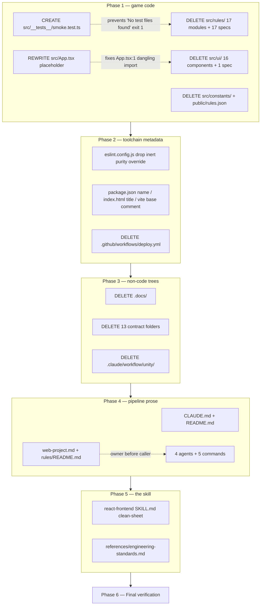

# Plan: Reset the project to a clean prototype slate

Plan folder: `.claude/contract/2026-08-01-reset-to-clean-prototype-slate/`
Execution status: see `tasks.md` in this folder.

---

## Part 1 — Alignment

### Task reference

Developer brief, typed at `/fb-plan` on 2026-08-01, verbatim:

> the prorotye was a fail I want to clean the project up. Remove any code and anything to do with th game and we want a fresh slate to do a new prototype. We have a git repo of a back up. Fix the skills too to make them generic and skills

No Jira key was supplied, so this plan takes a date-branch slug and no ticket was transitioned.

Four scope decisions confirmed interactively on 2026-08-01 via `AskUserQuestion`:

1. **Code scope** — *"Strip game code, keep toolchain."* Delete `src/rules/`, `src/ui/`, `src/constants/`, all specs, `public/rules.json` and the game CSS. Keep `package.json`, `tsconfig*.json`, `vite.config.ts`, `eslint.config.js`, Prettier, `.github/workflows/ci.yml`, `index.html`, `.nvmrc`. Leave a minimal `src/main.tsx` + `src/App.tsx` placeholder so `typecheck`, `lint`, `test` and `build` all pass on day one. The developer chose this option over the otherwise-identical option that *explicitly also kept* `.github/workflows/deploy.yml`.
2. **Game docs** — *"Delete all game docs."* Remove `.docs/Game_Rules/Rules.pdf`, `.docs/Game_Rules/Rules.md` and `.docs/Unity_Migration.md`; `.docs/` goes entirely.
3. **Pipeline history** — *"Delete the 13 contract folders"* and *"Delete the parked Unity pipeline."*
4. **Skills** — first answer arrived truncated as `none just `; re-asked and confirmed *"Load no skills — rewrite from scratch."* The executor loads neither `skill-creator` nor the existing `react-frontend` and writes the generic skill clean-sheet.

Backup verified before planning: `HEAD` = `master` = `origin/master` = `2cf7ec7`, working tree clean, pushed to `https://github.com/amazerbeam/string-railway`. Every deletion below is recoverable with `git show origin/master:<path>`.

### Restated goal

Strip String Railway out of this repository so the next prototype starts from a working, game-free web toolchain rather than from someone else's dead game. Every line of game logic, every game component, the tuning surface, the rulebook and its derived spec, and the thirteen completed contract folders are deleted. What survives is the build system — Vite, TypeScript, ESLint, Prettier, Vitest, CI — plus a placeholder `App.tsx` and a placeholder spec that keep all five gates green with no game in the repo. In parallel, the prose layer that drives this project's agent pipeline (`CLAUDE.md`, `README.md`, the workflow references, the four agents, the five `/fb-*` commands, and the `react-frontend` skill) is rewritten to describe a generic React 19 + Vite + TypeScript prototype instead of String Railway, so the pipeline stops instructing the next prototype in the vocabulary of a deleted one.

### In scope

- Delete `src/rules/` (35 files — 17 modules plus 17 specs and `fixtures.ts` under `__tests__/`), `src/ui/` (34 files — 16 components with their CSS, 5 hooks, and 1 spec), `src/constants/` (4 modules), and `public/rules.json`. 18 `*.test.ts` files in total.
- Rewrite `src/App.tsx` as a dependency-free placeholder; keep `src/main.tsx` and `src/styles/global.css` unchanged.
- Add `src/__tests__/smoke.test.ts` so `npm test` does not fail with *"No test files found, exiting with code 1"*.
- Remove the now-inert `src/rules/**` + `src/constants/**` purity override from `eslint.config.js`.
- De-game the toolchain metadata: `package.json` `name`, `index.html` `<title>`, the `base` comment in `vite.config.ts`, and the stale `.docs` entry in `.prettierignore`.
- Delete `.github/workflows/deploy.yml`.
- Delete `.docs/` entirely.
- Delete the 13 `.claude/contract/SCRUM-*` folders and `.claude/workflow/unity/` (12 files), preserving the empty `contract/`, `contract/archive/` and `contract/specs/` structure.
- Rewrite `CLAUDE.md` and `README.md` for a game-free prototype repo.
- Genericise `.claude/workflow/web-project.md` and `.claude/rules/README.md`.
- Genericise the four agents (`code-evaluator`, `defender`, `implementer`, `qa`) and the five `/fb-*` commands plus `.claude/commands/CLAUDE.md`.
- Rewrite `.claude/skills/react-frontend/SKILL.md` and `references/engineering-standards.md` clean-sheet as a generic React 19 / Vite / TypeScript skill, including the `description:` trigger line.

### Explicitly out of scope

- **Any git history rewrite.** No `filter-branch`, no force-push, no branch deletion. The backup branches (`master`, `SCRUM-2-4`, `Strings_back_Up`, `main`, and the `origin/*` refs) stay exactly as they are — they are the recovery path.
- **Any git commit, push, or remote operation.** Committing is the executor's call; pushing is developer-only per `web-project.md` → Developer-owned work.
- **Deleting or transitioning the open SCRUM Jira tickets.** The developer left `management-jira` unticked. Raised under Risks instead.
- **Renaming the GitHub repository, the local directory, or the git remote.**
- **Designing, naming, or scaffolding the new prototype.** This plan leaves a slate; it does not decide what goes on it. No new folders are created for an architecture nobody has chosen yet.
- **`.claude/skills/management-jira/` and `.claude/skills/skill-creator/`.** Measured at 2 and 0 game references respectively — already generic.
- **Uninstalling dependencies or touching `package-lock.json`.** No dependency changes, so the lockfile is untouched.
- **`public/favicon.svg`** — inspected, it is the stock Vite/React mark, not game art.

### Pattern Reference

None supplied in the brief. References chosen for this plan, all verified on disk:

- `.claude/workflow/web-project.md` — the runner table every `Run:` step below comes from, and the file whose *Layout* and *Correctness traps* sections Phase 4 rewrites.
- `.claude/workflow/plan-resolution.md` — slug grammar; this work has no Jira key, so the date branch `2026-08-01-<kebab-title>` applies.
- `package.json` — authority on script names. Confirmed present: `dev`, `build`, `typecheck`, `lint`, `format`, `format:check`, `test`, `test:watch`, `preview`.
- `src/main.tsx` and `src/styles/global.css` — the two surviving `src/` files, both already generic, used as the shape the placeholder `App.tsx` must match.
- No rulebook section is cited anywhere in this plan, deliberately: `.docs/Game_Rules/Rules.md` is being deleted, so citing it would create a reference that does not survive the contract.

### Constraints flagged on the brief

- **"We have a git repo of a back up"** — the developer's stated safety net, and the reason a destructive plan is acceptable. Verified rather than assumed: `HEAD` = `origin/master` = `2cf7ec7` with a clean tree. The contract must not weaken this, which is why history rewriting and force-pushing are out of scope.
- **"a fresh slate to do a new prototype"** — the end state must be *buildable*, not merely empty. All five gates green on a game-free tree is the acceptance bar, and it is what forces the placeholder spec and the placeholder `App.tsx` into Phase 1 rather than a later phase.
- **"make them generic"** — the skill must stop naming String Railway in its `description:` frontmatter, because that line is the trigger text the model matches against; a skill whose description names a deleted game will not fire for the new prototype.
- Two runtime dependencies (`react`, `react-dom`) and no new ones — this contract adds none.

### Assumptions made

- **The next prototype is still a browser app.** The developer kept the Vite/React/TS toolchain, so the surviving `react-frontend` skill is rewritten for React rather than deleted. If the next prototype is not React, that skill is the one file to revisit.
- **`.github/workflows/deploy.yml` is deleted.** The developer was offered an option that was identical *except* that it explicitly kept `deploy.yml`, and chose the one that did not. Read as declining the GitHub Pages publish for a dead prototype. This is the single inference rather than a stated instruction, so it is also flagged under Risks and is a one-file revert.
- **Agents and `/fb-*` commands are in scope even though the brief said "skills".** They carry the heaviest game contamination measured — `fb-plan.md` has 41 game references in 522 lines, `implementer.md` 27 in 205, `qa.md` 23 in 265. Leaving them would have the pipeline plan the new prototype in the vocabulary of a deleted game. This is the largest scope call in the plan; red-line it here if the intent was skills only.
- **`eslint.config.js`'s purity override is removed rather than re-pointed.** After the deletion its two globs match nothing, so it is inert config describing an architecture that no longer exists. Re-pointing it at an invented `src/core/` would be scaffolding a design nobody chose. The mechanism is not lost: the rewritten skill documents the pattern and carries the exact override to paste back when the new prototype has a pure tree.
- **`package.json` `name` becomes `prototype` and `<title>` becomes `Prototype`.** Neutral placeholders — the real name is a developer decision, listed under Risks.
- **The placeholder spec lives at `src/__tests__/smoke.test.ts`.** Keeps `vite.config.ts` untouched, since `src/**/__tests__/**/*.test.ts` matches a zero-segment `**`. The task verifies this by running it rather than trusting the glob.
- **`vite.config.ts` keeps `base: './'` and `environment: 'node'`.** A relative base is correct on any static host, and a node test environment stays correct while the placeholder spec is DOM-free. Only the comment naming `/string-railway/` changes.
- **The empty `contract/`, `contract/archive/` and `contract/specs/` folders survive** the contract-folder deletion, because `plan-resolution.md` still describes that layout and this very plan folder lives inside it.
- **`.claude/lessons/` is left in place** — inspected and already empty, so there is nothing game-specific to remove.

### Config and persisted-shape audit

Run in full — this contract deletes an entire config surface, which is the highest-risk shape change available in this repo.

- **`rules.json` keys removed: all of them.** The file is deleted, taking `configVersion`, eight `geometry` keys (`borderPerimeter`, `cardSize`, `shortStringLength`, `longStringLength`, `mountainLength`, `riverLength`, `arcLengthTolerance`, `tangencyTolerance`) and nine `deck.composition` keys (`HAMLET`, `VILLAGE`, `TOWN`, `SCENIC`, `RURAL`, `TERMINUS`, `RAILYARD`, `LANDMARK`, `DEPOT`).
- **Every consumer is inside the deletion set — zero orphans.** `grep -rn "rules.json" src` returns **20 hits across 11 files**: `src/constants/setup.ts` (2), `src/constants/stations.ts` (3), `src/rules/config.ts` (2), `src/rules/deck.ts` (2), `src/rules/turn.ts` (2), `src/rules/__tests__/config.test.ts` (1), `src/rules/__tests__/fixtures.ts` (1), `src/rules/__tests__/setup.test.ts` (5), `src/ui/AppShell.tsx` (1). All nine files are deleted by Phase 1. `src/rules/__tests__/setup.test.ts:22` additionally does a literal `import shippedRules from '../../../public/rules.json'` — the one hard file-path binding to the config, and it is deleted alongside it.
- **Nothing is persisted.** `grep -rn "localStorage\|sessionStorage\|indexedDB\|JSON.stringify" src` outside `__tests__/` returns **zero hits**. No saved games, no stored move logs, no migration needed. The move-log versioning window that `.claude/rules/README.md` names as a candidate rule was never opened, and this contract closes the prototype without it ever having been.
- **Type changes: total removal, not narrowing.** `src/rules/types.ts` and every type it exports are deleted wholesale rather than retyped, so there is no `number`→`string`, no required→optional, and no widened union to chase through a `switch`. The only surviving consumer relationship is `src/App.tsx:1` → `./ui/AppShell`, which Phase 1's Task 2 rewrites in the same task that deletes the target.
- **Exported-constant consumers: all internal to the deletion set.** `src/constants/` (4 modules) is imported only from `src/rules/` and `src/ui/`, both deleted. No surviving file imports a constant map.
- **Two string-bound surfaces survive the deletion and must change with it.** `vite.config.ts` `test.include` is `src/**/__tests__/**/*.test.ts` — verified by running `npx vitest run --dir src/nonexistent`, which prints **"No test files found, exiting with code 1"**. Deleting all 18 specs therefore fails `npm test` *and* the CI `Test` step. `eslint.config.js` globs `src/rules/**/*.{ts,tsx}` and `src/constants/**/*.{ts,tsx}`; a flat-config `files` glob matching nothing is inert rather than an error, so lint still passes, but the block becomes dead config.
- **`.prettierignore` names `.docs`,** which Phase 3 deletes. Prettier tolerates a nonexistent ignore path, so this is tidiness rather than breakage. More consequentially, `.prettierignore` lists `CLAUDE.md` but **not** `README.md` — so the rewritten `README.md` is subject to `npm run format:check` and the rewritten `CLAUDE.md` is not. Everything under `.claude/` and `.docs/` is ignored, so the prose rewrites in Phase 4 and Phase 5 face no formatting gate.
- **No `data-testid`, no reason-code map, no `aria-*` id survives.** `grep -rn "data-testid" src` returns **0 hits**; every rejection reason code lives in `src/rules/`, deleted.
- **The `src/rules/` boundary is not crossed — it ceases to exist.** After Phase 1 the boundary grep from `web-project.md` has no tree to run against. Phase 6 replaces it with a check that the tree is genuinely gone rather than a purity grep over nothing.

---

## Part 2 — Technical design

### Approach

The contract is ordered **deletion before prose**, and within deletion, **code before docs**. That ordering is what keeps every phase boundary honest. Phase 1 removes the game code and — in the same phase, not a later one — lands the two files that keep the gates green: a placeholder `src/App.tsx` with no imports outside `react`, and `src/__tests__/smoke.test.ts`. This is forced by the audit: `src/App.tsx:1` imports `./ui/AppShell`, so deleting `src/ui/` without rewriting `App.tsx` leaves a phase boundary that does not type-check, and deleting all 18 specs without adding one leaves `npm test` exiting 1. Both fixes belong beside their cause.

Phase 2 handles the toolchain metadata that outlives the code but names the game: the ESLint purity override whose globs now match nothing, `package.json` `name`, the `<title>`, the `base` comment, the `.prettierignore` entry, and `deploy.yml`. The alternative shape — folding these into Phase 1 — was rejected because it mixes "remove the game" with "retune the build", and a failure in the second would be indistinguishable from a failure in the first. Phase 3 then deletes the non-code trees (`.docs/`, the 13 contract folders, the Unity snapshot); it is separated from Phases 1–2 because nothing in it can break a gate, which makes it the cheapest phase to re-run or partially revert.

Phases 4 and 5 are the prose layer, and they are last for a specific reason: they describe the end state, so they should be written when the end state exists on disk rather than predicted. Phase 4 genericises the pipeline's own documentation top-down — `CLAUDE.md` and `README.md` first (they are what a reader hits first), then `web-project.md` and `.claude/rules/README.md` (the files the agents and commands *reference*), then the four agents and five commands (the files that do the referencing). Fixing the owner before the callers is the single-source-of-truth rule this repo is built on, applied to its own documentation. Phase 5 rewrites the `react-frontend` skill clean-sheet, per the developer's explicit choice to load no skills first — the existing 211-line `SKILL.md` and its 194-line reference are not read for salvage; they are replaced. The one non-negotiable in that rewrite is the `description:` frontmatter, because that line is the trigger text the model matches on, and a description naming String Railway will not fire for a prototype that is not String Railway.

There is no `src/rules/` in the end state and the plan does not invent one. Nothing in this contract is game logic, so the usual question of what goes in a pure core versus a component does not arise: the only TypeScript written is a placeholder component and a placeholder spec, both trivial. The purity *pattern* is preserved as documentation in the rewritten skill — including the verbatim ESLint override to paste back — rather than as an active lint rule pointed at a directory nobody has designed yet.

### Skills to invoke during execution

- `none — developer override`. Asked and confirmed on 2026-08-01: the developer selected *"Load no skills — rewrite from scratch"*, so the executor loads neither `skill-creator` nor the outgoing `react-frontend`. The reason this is coherent rather than a classification error: `react-frontend` is String Railway–specific and is itself the artefact being replaced, so loading it would import the framing the contract exists to remove; and the only TypeScript this contract writes is a placeholder component and a placeholder spec, neither of which needs a conventions skill to get right.

Files the executor must Read before starting:

- `.claude/workflow/web-project.md` — the runner table behind every `Run:` step here. Read it *before* Phase 4 rewrites it; the npm script names do not change, so the rewrite creates no conflict mid-contract.
- `.claude/rules/` — scanned during planning via `Glob .claude/rules/*.md`; only `README.md` is present and it defines no rules, so no reject condition applies to this design.

### Diagram



### Data shapes

**No type, config, or contract changes are added.** This contract removes shapes; it introduces none beyond two placeholder files.

#### Removed entirely

- `src/rules/types.ts` and every exported type (`GameState`, `ColourSeat`, `StationCard`, `PlacedStation`, `PlacedPath`, `Move`, and the rest). No surviving file imports any of them.
- `public/rules.json` — the whole document: `configVersion: number`, `geometry` (8 `number` keys), `deck.composition` (9 `number` keys). No replacement config file is created; the next prototype's first story decides whether it needs one.
- All four `src/constants/` modules and their `UPPER_SNAKE_CASE` maps.

#### Created

`src/App.tsx` — replaces the current 7-line file. No import outside `react`'s JSX runtime, so it cannot dangle when `src/ui/` is deleted:

```tsx
function App() {
  return (
    <main>
      <h1>Prototype</h1>
      <p>Empty slate. Nothing is built here yet.</p>
    </main>
  )
}

export default App
```

`src/__tests__/smoke.test.ts` — DOM-free, so it runs under the existing `environment: 'node'`, and positioned to match the existing `test.include` glob without editing `vite.config.ts`:

```ts
import { describe, expect, it } from 'vitest'

describe('toolchain', () => {
  it('runs the test suite', () => {
    expect(true).toBe(true)
  })
})
```

#### Modified metadata

| File | Field | From | To |
|---|---|---|---|
| `package.json` | `name` | `"string-railway"` | `"prototype"` (developer decision — see Risks) |
| `index.html` | `<title>` | `String Railway` | `Prototype` |
| `vite.config.ts` | comment above `base` | names `/string-railway/` | host-neutral wording; `base: './'` value unchanged |
| `.prettierignore` | line 6 | `.docs` | removed |
| `eslint.config.js` | second config block | `files: ['src/rules/**/*.{ts,tsx}', 'src/constants/**/*.{ts,tsx}']` + `no-restricted-imports` + `no-restricted-globals` | block removed entirely |

No `package.json` dependency or script changes, so `package-lock.json` is untouched.

### Runtime quality notes

- **Purity and adjudication:** Not applicable in the usual sense — after Phase 1 there is no `src/rules/` tree and no game logic anywhere in the repo, so there is no adjudication to misplace and no limit to key on the wrong id. The one purity concern that *is* live: `src/__tests__/smoke.test.ts` must stay DOM-free, because `vite.config.ts` keeps `environment: 'node'` and a `document` reference there would throw rather than fail cleanly. The purity *pattern* survives as documentation in the Phase 5 skill rewrite, carrying the verbatim ESLint override for the next prototype to paste back.
- **Effects, mount and teardown:** Trivial — no concerns. The placeholder `App.tsx` has no `useEffect`, no listener, no timer, no `requestAnimationFrame`, no observer and no ref. `src/main.tsx` is unchanged and its `StrictMode` double-mount is harmless over a component with no effects. Every effect in the repo today lives in `src/ui/`, which is deleted wholesale rather than edited, so no cleanup is orphaned by a partial change.
- **Hot-path cost:** Trivial — no concerns. The drag hot path is deleted along with `src/ui/`; nothing in the end state runs per pointer event, allocates in a loop, or performs a bounded search. No memoisation is added.
- **Determinism and numeric safety:** Trivial — no concerns. No seed path, no epsilon, no divisor and no coordinate arithmetic survives Phase 1, so there is no `NaN` to guard and no `Math.random()` to seed. The `arcLengthTolerance` and `tangencyTolerance` values are deleted with `rules.json` rather than migrated.
- **Error paths:** The failure mode this contract actually has is a **verification lie**, not a runtime exception — a phase reporting green over a broken tree. Three specific guards. First, `npm test` over zero specs exits 1 with *"No test files found"* (verified during the audit), so Phase 1 lands the placeholder spec in the same phase and Task 3 runs it expecting `1 passed` rather than merely exiting 0. Second, `src/App.tsx:1` would leave a dangling import, which `npm run typecheck` catches — Phase 1 runs it after the rewrite. Third, `README.md` is *not* in `.prettierignore`, so a rewritten README with wrong formatting fails `npm run format:check`; Phase 4 runs that gate explicitly rather than leaving it to Phase 6. No error is swallowed anywhere, because no error handling is written — the two new files have no failure mode.

### Risks and judgement calls

- **Deleting `.github/workflows/deploy.yml` is the one inference in this plan, not a stated instruction.** The developer chose the code-scope option that omitted it over the otherwise-identical one that kept it. Consequence: pushing to `master` stops publishing to `https://amazerbeam.github.io/string-railway/`, and the live site goes stale until a new workflow is added. It is a single-file revert. **Say so now if the Pages deploy should stay.**
- **Agents and `/fb-*` commands are in scope though the brief said "skills".** Roughly 1,350 lines of command prose and 690 lines of agent prose get rewritten. If the intent was the `.claude/skills/` folder alone, cut Phase 4's Task 14 (the four agents) and Task 15 (the five commands) — the rest of the contract stands without them.
- **`package.json` `name` and the `<title>` are placeholders.** `"prototype"` and `Prototype` are neutral holding values, not a choice. **The real name is yours** — tell the executor and it lands in Phase 2 instead of needing a follow-up.
- **The removed ESLint purity override is the most valuable thing being deleted.** It is a genuinely hard-won mechanism (a real gate that fails a build), and after this contract it exists only as prose in the rewritten skill. If the next prototype has a pure core, someone must remember to paste it back. The alternative — keeping it pointed at `src/rules/`, or re-pointing it at an invented `src/core/` — was rejected as scaffolding a design nobody has chosen, but it is a legitimate call to make differently.
- **Nine open SCRUM tickets describe work on a prototype that will no longer exist.** `management-jira` was left unticked, so this contract does not touch Jira and the board will disagree with the repo the moment it lands. Closing or abandoning those tickets is a separate decision, and yours.
- **`.docs/Game_Rules/Rules.pdf` and `Rules.md` are deleted from the working tree only.** They remain in public git history — `README.md` records that the repository is public and that the rules extraction of a published game has been readable since the initial commit. Deleting the files does not undo that; only a history rewrite would, which is explicitly out of scope. Flagging it so the deletion is not mistaken for a takedown.
- **Losing the contract folders loses the reasoning, not just the plans.** Thirteen `plan.md`/`tasks.md`/`pr-description.md` sets record why each decision was made. All recoverable from `origin/master`, but nobody greps git history by accident. Worth a moment's thought before Phase 3 runs.
- **Judged by running the app, not by a gate:** whether the placeholder page renders as an obviously-empty slate rather than a half-broken app. QA can confirm it mounts with a clean console; whether it reads as *"nothing built here yet"* rather than *"something is missing"* is a copy call, and yours.
</content>
