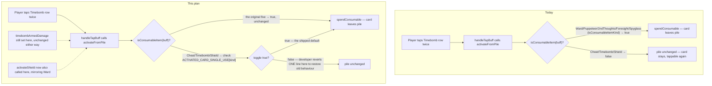

# Plan: Cheat, Timebomb and Shield become single-use (reversibly); buff tier shown on the loadout rail

Plan folder: `.claude/contract/2026-08-25-single-use-activated-buffs-and-tier-display/`
Execution status: see `tasks.md` in this folder.

---

## Part 1 — Alignment

### Task reference

Developer prose, this conversation, 2026-08-25 (two turns):

> Cheat, Timebomb, and Shield should be single use. A player will just spam timebomb. The player might get lucky and get 2 timebombs, but should be single user [sic].

Then, after the first plan draft was rejected at the approval gate for its shape rather than its goal:

> I changed my mind. I want them all to be 1 and gone, but the player can carry many of the same, but if I decide they should persist I want this to be an easy change back.

Preceding turn (context for *why*): the developer reported that "the buffs the player starts with... persist after being used... should be 1-time use then gone, like a 1-time use potion in Pokémon — the player can have many of the same buff, but they should be single-use items," and separately that there is "no indication of what tier the buffs the player has." Investigation in-session established:

- Ward, Puppeteer, Second Thoughts, Foresight and Spyglass are already single-use (`src/hunt/consumables.ts`'s `isConsumableItemKind`) — activating one calls `spendConsumable` and removes that card from the pile.
- Cheat, Timebomb and Shield are `BuffCadence.Activated` cards deliberately excluded from that set (DLR-132): activating one arms felt state (`cheatTricksRemaining` / `timebombArmedDamage` / shield hearts) but leaves the card in the pile, so it can be re-activated every trick. The developer's Timebomb-spam complaint is this exact behaviour.
- The buff loadout rail (`src/app/warCouncil/buffLabels.ts`'s `buffLine`, rendered by `BuffLoadoutPanel.tsx`) never reads `buff.tier` — there is no Bronze/Silver/Gold indicator anywhere on a rail row.
- **Reversibility requirement (the developer's second message):** the fix must not fold Cheat/Timebomb/Shield structurally into the existing five-item `ConsumableItemKind` union — doing so would mean reverting any one card back to "persists" later requires editing five separate tables/switches in lock-step (see the first plan draft's Approach, superseded by this one). Instead the single-use behaviour for these three specific cards must be its own named, developer-facing switch: flipping one card back to "stays in the pile" is a one-line edit in one place, nothing else in the codebase changes.

### Restated goal

Cheat, Timebomb and Shield stop being repeatable Activated cards and become one-shot items by default: activating one still arms whatever felt state it always armed (follow-suit lift, primed damage, shield hearts), but the specific card the player spent now leaves the buff pile, so a player holding two Timebombs gets two uses, not infinite ones. This is implemented as a **per-card toggle the developer owns** — a small, explicitly-named `Readonly<Record<...>>` in `src/hunt/consumables.ts` — so reverting any one of the three back to "persists in the pile" later is a single boolean flip in one place, not a structural change. Separately, every buff row on the loadout rail visibly states its tier (Bronze / Silver / Gold), so a player can tell which copy of a buff they are looking at without guessing.

### In scope

- Add a new, small, explicitly-named toggle to `src/hunt/consumables.ts` — `ACTIVATED_CARD_SINGLE_USE: Readonly<Record<Cheat | Timebomb | Shield, boolean>>`, all three defaulted `true` — and read it from `isConsumableItem` (the one function `activateFromPile` already calls to decide pile removal) as an OR alongside the existing, **unchanged**, five-item `isConsumableItemKind` check.
- Wire `activateShield` into `handleTapBuff` (`src/app/warCouncil/buffHandlers.ts`), mirroring the existing Ward line — Shield's effect has never fired from the felt layer at all (confirmed by audit below); leaving it unwired while making the card single-use would make spending a Shield strictly worse than today (AP spent, card gone, zero effect).
- Correct the docblocks and code comments in the touched files that currently state, as settled fact, that Cheat/Timebomb/Shield stay in the pile — several exist and would become false, and they are the natural place to also document the new toggle and how to use it to revert.
- Update every existing test that currently asserts the old "stays in the pile" / "not a one-shot item" behaviour for Cheat, Timebomb or Shield, across `src/hunt/` and `src/app/warCouncil/`, plus new tests for `ACTIVATED_CARD_SINGLE_USE` itself (default-true coverage and that `isConsumableItem` reads it).
- Add a tier word (Bronze / Silver / Gold) to the loadout rail's per-row line, `buffLine` in `src/app/warCouncil/buffLabels.ts`, so it reaches both the visible row text and its accessible name (`buffRowAccessibleName` composes `buffLine`).
- Update `buffLabels.test.ts`'s `buffLine` expectation for the new prefix.

### Explicitly out of scope

- **Widening `ConsumableItemKind`, `CONSUMABLE_TIMING`, `CONSUMABLE_EFFECT_LIVE`, `ConsumableEffect`, or `consumableEffectOf`.** This was the first plan draft's approach and is deliberately abandoned: those five items stay a closed five-member set, unchanged in every respect, and Cheat/Timebomb/Shield's single-use behaviour is a wholly separate, additive rule (`ACTIVATED_CARD_SINGLE_USE`) layered on top only inside `isConsumableItem`. This is what keeps a future revert to one boolean rather than five coordinated edits — see Approach.
- Minting Shield buffs into any drawable pool. `buffCosts.ts`'s own comment states "nothing player-reachable mints a Shield yet" — confirmed by audit (`shieldBuff` is called nowhere outside `buffCatalog.ts` and its tests). Wiring `activateShield` makes the effect correct *once* a Shield is reachable; it does not make one reachable.
- The pre-existing, explicitly-deferred DLR-115 residual bug in `roundBars.ts` (gross vs. net damage display when a shield partially absorbs a hit). It stays unreachable in real play either way, since nothing mints a Shield.
- Any change to `buffName` or the trick-payout "fired buffs" readout (`buffFiredLabels.ts`, rendered in `TrickWell.tsx`). That surface shares `buffName` with the loadout rail; the tier word is added to `buffLine` specifically (not `buffName`) so the payout readout's existing copy and its test (`TrickWell.test.tsx:205`, `queryByText(/Bell-Taker/)`) are untouched.
- Re-pricing any buff's AP cost, re-tuning Cheat/Timebomb/Shield's tier ladders, or any other numeric tuning value.
- `consumableStacks`. It filters on `isConsumableItemKind`, which is unchanged by this plan, so Cheat/Timebomb/Shield still never appear in its output — consistent with today, and with the fact nothing in `src/` calls it outside its own module and tests (confirmed by audit).

### Pattern Reference

- **`AP_REFRESH_CADENCE` (`src/hunt/apConfig.ts`)** is the pattern this plan's toggle deliberately follows: an existing, explicitly "DEVELOPER-SET" constant, cited by name in multiple docblocks across the codebase, that exists specifically so a behavioural choice can be flipped without touching the logic that reads it. `ACTIVATED_CARD_SINGLE_USE` is the same shape, scaled down to per-card rather than global.
- `src/hunt/consumables.ts`'s existing `isConsumableItemKind` / `CONSUMABLE_ITEM_KINDS` — the "membership derived from one table's keys, stated once" discipline this plan's `ACTIVATED_ITEM_KINDS` mirrors, kept as a fully separate set rather than merged into the existing one.
- `src/app/warCouncil/buffHandlers.ts`'s existing Ward line — `encounter: buff.kind === BuffKind.Ward ? activateWard(state.encounter, buff.tier) : state.encounter` — is the pattern `activateShield` is wired in beside.

### Constraints flagged on the brief

**Reversibility is now a hard constraint, stated explicitly by the developer**, not an implementation nicety: reverting any one of Cheat/Timebomb/Shield to "persists in the pile" later must be a single edit to `ACTIVATED_CARD_SINGLE_USE`, touching no other file. No determinism/seeding, save-compatibility, or accessibility constraint applies otherwise — nothing here touches `src/persistence/`, and `buffRowAccessibleName` already composes `buffLine`, so the accessible name gets the tier word automatically.

### Assumptions made

- **Tier word format:** a plain leading word — `Bronze`, `Silver`, `Gold` — prefixed onto `buffLine`'s output (`Silver Bell-Taker (Momentum) — win a trick with Bells: +3 multiplier. 3 AP.`), reusing the row's existing single-string convention. Rationale: matches the house style of every other label in `buffLabels.ts` — plain English words, no icon, no badge, no colour-coding — and needs no new component or CSS. *Confirmed as the intended surface by the developer's own framing ("no indication of what tier the buffs... have").*
- **Tier word lives in `buffLine`, not `buffName`:** confirmed by audit that `buffName` is shared with `buffFiredLabels.ts`'s trick-payout readout (a different, untouched surface — see Explicitly out of scope). Keeping the change in `buffLine` scopes it to exactly the loadout rail the developer described.
- **The toggle is a per-card `Record`, not one global boolean or three separate exported constants.** A `Record<Cheat | Timebomb | Shield, boolean>` lets the developer revert exactly one card (e.g. "Shield should persist but Timebomb and Cheat stay single-use") without a shape change, which three independent top-level `export const TIMEBOMB_SINGLE_USE = true` constants would also allow but less discoverably (no single place lists "every Activated card's cadence choice"); a single shared boolean would not allow reverting one card independently, which the developer's "if I decide THEY should persist" phrasing (ambiguous between "all three" and "one of them") leaves open. The `Record` shape is the one that is never wrong regardless of which reading was meant.
- **`CONSUMABLE_EFFECT_LIVE` is untouched and still returns `true` for Cheat, Timebomb and Shield** — not because they were added to that table, but because `consumableEffectIsLive`'s existing rule ("`true` for every non-consumable" — i.e. every kind `isConsumableItemKind` says no to) already covers them, exactly as it does today. No behaviour changes here; stated only so the audit trail is explicit that this table needed no edit.
- **Wiring `activateShield` into `handleTapBuff` is independent of the reversibility redesign** and unchanged from the first draft's reasoning: Shield's effect has never fired in the app layer (confirmed by `roundBars.ts`'s own docblock — "nothing in the app layer calls `activateShield`"), so leaving it unwired while making Shield single-use would spend the AP, remove the card, and fire nothing — a regression, not a wash.

### Config and persisted-shape audit

No configuration key, storage key, or persisted shape is added, renamed, or retyped. `CONSUMABLE_AP_COST`, `CHEAT_DURATION_TRICKS`, `TIMEBOMB_DAMAGE` and `SHIELD_HEARTS` are read, not changed. Nothing here touches `src/persistence/`.

- **`ACTIVATED_CARD_SINGLE_USE` is a brand-new export — 0 existing hits, by construction.** It has exactly one reader in this plan (`isConsumableItem`), so there is no drift risk to audit beyond that one call site, which is covered by a task.
- **`isConsumableItem` — call sites, since its behaviour (not its signature) changes.** `Grep` for `isConsumableItem(` across `src/**` including `__tests__`: 1 production call site (`src/hunt/buffActivation.ts`'s `activateFromPile`) plus its own definition and re-export (`consumables.ts`, `index.ts`) and 3 test call sites in `src/hunt/__tests__/consumables.test.ts`. Every one is enumerated in the file map below; the production call site needs no code change (only its caller's docblock, since the new behaviour flows through automatically), and every test call site is enumerated for its expected-value flip.
- **`ConsumableItemKind` and everything keyed off it — confirmed UNCHANGED by this plan** (superseding the first draft's audit, which planned to widen it). Re-grepped to confirm nothing about this plan's actual diff requires touching it: `isConsumableItemKind`, `CONSUMABLE_TIMING`, `CONSUMABLE_EFFECT_LIVE`, `ConsumableEffect`, `consumableEffectOf`, and `consumableStacks` all read `ConsumableItemKind` or `isConsumableItemKind` and none is edited by any task below.
- **Test-only literal duplication that binds by string, not by type:** several tests assert the *old* pile-persistence behaviour with hard-coded prose ("not a one-shot item", "NOT consumed", "leaves the pile unchanged") that the type checker cannot catch. Enumerated by audit: `src/hunt/__tests__/buffActivation.test.ts` (1 test), `src/hunt/__tests__/consumables.test.ts` (1 test, the `isConsumableItem` whole-buff assertion — narrower than the first draft's audit, since `isConsumableItemKind`'s own describe block is now correctly untouched), `src/app/warCouncil/__tests__/buffHandlers.test.ts` (2 tests), `src/app/warCouncil/__tests__/roundReducer.test.ts` (1 test), `src/app/warCouncil/__tests__/roundReducer.timebomb.test.ts` (1 test), `src/app/warCouncil/__tests__/WarCouncilRound.timebomb.test.tsx` (1 test). Every one is a real behaviour flip, fixed in the task that changes the behaviour it tests.

---

## Part 2 — Technical design

### Approach

The first draft of this plan folded Cheat, Timebomb and Shield structurally into `consumables.ts`'s existing five-item `ConsumableItemKind` union — widening the type and every table keyed off it (`CONSUMABLE_TIMING`, `CONSUMABLE_EFFECT_LIVE`, `ConsumableEffect`, `consumableEffectOf`'s switch). The developer rejected that shape specifically because it does not revert cleanly: undoing it for one card means editing five separate places in lock-step, and a mis-edit leaves the type system's own exhaustiveness checks pointing at the wrong five-vs-eight boundary. **This plan does the opposite: it changes nothing about the existing five-item set, and adds one small, separate, explicitly-named toggle instead.**

`activateFromPile` already asks exactly one function — `isConsumableItem(buff)` — whether spending a card should also remove it from the pile. Today that function is `isConsumableItemKind(buff.kind)`, unconditionally. This plan changes it to: `isConsumableItemKind(buff.kind)` (unchanged, still exactly the five DLR-111 items) **OR** `buff.kind` is one of Cheat/Timebomb/Shield **AND** `ACTIVATED_CARD_SINGLE_USE[buff.kind]` is `true`. `ACTIVATED_CARD_SINGLE_USE` is a bare `Readonly<Record<...>>` of three booleans, all defaulted `true` by this plan, sitting beside the file's other developer-facing constants. Reverting Timebomb to "stays in the pile" later — the exact scenario the developer named — is `[BuffKind.Timebomb]: false` in that one object literal; `isConsumableItem` reads it on the very next call, `activateFromPile` needs no change, and no other file in the codebase needs to change. This mirrors the pattern `AP_REFRESH_CADENCE` in `apConfig.ts` already sets in this codebase for exactly this kind of developer-owned, easily-reversed behavioural switch.

Because this toggle only touches `isConsumableItem` — the pile-removal question — and not `isConsumableItemKind`, `CONSUMABLE_TIMING`, `CONSUMABLE_EFFECT_LIVE`, or `consumableEffectOf`, none of those need a new case for Cheat/Timebomb/Shield: their felt-window logic (`roundUiState.ts`'s `buffActivationWindowOpen`, already independent of `consumables.ts`) and their effect-application logic (`handleTapBuff`'s own `cheatTricksRemaining` / `timebombArmedDamage` / the new `activateShield` line) are completely unchanged. The only thing that moves is whether the spent card is still in the pile afterward.

The one genuine behavioural addition, not just a toggle, is wiring `activateShield` into `handleTapBuff`. The audit found this was never done — `roundBars.ts`'s own docblock says as much ("nothing in the app layer calls `activateShield`, so `shieldHearts` is always `0` in real play"). Without it, making Shield single-use would be a pure regression: today, tapping a dead-effect Shield at least leaves the card available to try again; after this change, tapping it would spend the AP, remove the card, and still do nothing. The fix is one line, mirroring the existing Ward line in the same object literal `handleTapBuff` already returns.

The tier-display half is unrelated logic living in the same conversation, addressed as a second, independent change: `buffLine` (the loadout rail's one-glanceable-line function, `src/app/warCouncil/buffLabels.ts`) gains a `BUFF_TIER_WORD` lookup and prefixes it onto its existing output. It deliberately does not touch `buffName`, which `buffFiredLabels.ts`'s trick-payout readout also calls — keeping the tier word out of that shared function is what keeps this a rail-only change with no effect on the payout summary's existing copy or test. Because `buffRowAccessibleName` (the row's `aria-label`) already composes `buffLine`, the accessible name picks up the tier word for free.

### Skills to invoke during execution

- `react-frontend` — every touched file is TypeScript under `src/`; governs test placement (pure-logic tests beside the logic, no DOM), the 400-line budget (every touched file measured well under it — `consumables.ts` grows from 328 lines by roughly 20), and "declare any repeated meaningful value once and import it," which is exactly what `ACTIVATED_CARD_SINGLE_USE` does for this behavioural choice.
- `.claude/workflow/web-project.md` — read for verification commands and the correctness traps (string-bound names outside the compiler's view is the exact shape of the stale-docblock and stale-test risk this plan audits against).
- No `.claude/rules/*.md` file applies — confirmed by scan; `save-data-versioning.md` is the only rule present and nothing here touches `src/persistence/`.

### Diagram



### Data shapes

**New in `src/hunt/consumables.ts` — additive only, nothing existing changes shape:**

```ts
/** The three Activated cards whose single-use-ness is a developer-owned toggle rather than the
 *  fixed DLR-111 five-item set's rule. */
type ActivatedItemKind = typeof BuffKind.Cheat | typeof BuffKind.Timebomb | typeof BuffKind.Shield

/**
 * Whether spending this Activated card ALSO removes it from the pile, on top of the felt-state
 * effect it always arms (`handleTapBuff`'s `cheatTricksRemaining` / `timebombArmedDamage` /
 * `activateShield`). Default `true` for all three as of 2026-08-25 — a player who spams Timebomb
 * now runs out of Timebombs. TO REVERT ONE CARD to "stays in the pile, spend it again next trick,"
 * flip that entry to `false` here. Nothing else in this module, and no other file, needs to change
 * — `isConsumableItem` below is the only reader.
 */
export const ACTIVATED_CARD_SINGLE_USE: Readonly<Record<ActivatedItemKind, boolean>> = {
  [BuffKind.Cheat]: true,
  [BuffKind.Timebomb]: true,
  [BuffKind.Shield]: true,
}

const ACTIVATED_ITEM_KINDS: ReadonlySet<BuffKind> = new Set(
  Object.keys(ACTIVATED_CARD_SINGLE_USE) as ActivatedItemKind[],
)

function isActivatedSingleUseKind(kind: BuffKind): kind is ActivatedItemKind {
  return ACTIVATED_ITEM_KINDS.has(kind)
}
```

**Changed — `isConsumableItem`'s body only, signature unchanged:**

```ts
export function isConsumableItem(buff: Buff): boolean {
  if (isConsumableItemKind(buff.kind)) return true
  return isActivatedSingleUseKind(buff.kind) && ACTIVATED_CARD_SINGLE_USE[buff.kind]
}
```

**New in `src/app/warCouncil/buffLabels.ts`:**

```ts
const BUFF_TIER_WORD: Readonly<Record<BuffTier, string>> = {
  [BuffTier.Bronze]: 'Bronze',
  [BuffTier.Silver]: 'Silver',
  [BuffTier.Gold]: 'Gold',
}

export function buffLine(buff: Buff, apCost: ActionPoints): string {
  return `${BUFF_TIER_WORD[buff.tier]} ${buffName(buff)} — ${buffConditionSentence(buff)}: ${buffRewardPhrase(buff)}. ${apCost} AP.`
}
```

**Behavioural change, no new shape — `src/app/warCouncil/buffHandlers.ts`:** `handleTapBuff`'s returned object literal gains one more conditional field alongside the existing Ward line:

```ts
encounter:
  buff.kind === BuffKind.Ward
    ? activateWard(state.encounter, buff.tier)
    : buff.kind === BuffKind.Shield
      ? activateShield(state.encounter, buff.tier)
      : state.encounter,
```

No type, config, or persisted-shape changes beyond the above. No unchosen tuning value — `ACTIVATED_CARD_SINGLE_USE`'s three values are shipped, developer-set defaults (`true`), not a deferred decision.

### Runtime quality notes

- **Purity and adjudication:** every changed rule (`isConsumableItem`, `ACTIVATED_CARD_SINGLE_USE`) stays inside `src/hunt/`'s pure-core boundary — no React import, no DOM access, confirmed by the existing ESLint override in `eslint.config.js`. `activateShield` is itself a pure function in `src/hunt/encounter.ts`; wiring it into `handleTapBuff` is the reducer *asking* `src/hunt/` what happens, not deciding it, the same discipline every other line in that object literal already follows. The toggle itself is the textbook case of "declare a repeated meaningful value once" — it exists specifically so no other file needs its own copy of this decision.
- **Effects, mount and teardown:** trivial — no effect, listener, observer, timer, or `AbortController` is added or touched anywhere in this change.
- **Hot-path cost:** trivial — every changed function is an O(1) lookup or a single conditional; nothing here runs per pointer-move or per-frame.
- **Determinism and numeric safety:** trivial — no `Math.random()`, no division, no new numeric computation.
- **Error paths:** no new throw, no new swallowed error, no new `catch`. `activateShield` already returns the encounter unchanged when the encounter is resolved (guarded internally); wiring it into `handleTapBuff` inherits that guard for free, exactly as the existing Ward line does. No new async surface is introduced.

### Risks and judgement calls

- **Wiring `activateShield` is additional scope beyond the literal ask**, justified in Approach as necessary to avoid a regression (spend AP, lose the card, fire nothing), but it is a real judgement call the developer should sanity-check: should Shield's pile-removal instead stay off (`ACTIVATED_CARD_SINGLE_USE[BuffKind.Shield] = false`) until a separate ticket both mints it and wires its effect, given nothing can reach it in play either way today? The plan as written wires the effect AND defaults the toggle to `true`, on the reasoning that a not-yet-reachable *correct* behaviour is safer to ship than a reachable-later *broken* one — but both the effect-wiring and the toggle default are the developer's to overrule independently (the toggle can flip to `false` for Shield alone without touching the `activateShield` wiring at all).
- **`src/hunt/buffActivation.ts` currently carries unrelated, uncommitted changes** from an in-flight contract (`DLR-141`, PerTrick AP-refresh cadence work — confirmed via `git diff --stat`: 34 insertions / 15 deletions, not yet committed). This plan's only touch to that file is a docblock correction (`activateFromPile`'s stale "pass through with the pile UNCHANGED" claim, updated to name the new toggle), which should apply cleanly regardless, but the developer should be aware the working tree already has other in-progress work layered into that file before running `/fb-apply` on this plan.
- **Tier-word wording** (`Bronze` / `Silver` / `Gold`, prefixed as a plain word) is a copy decision nobody but this plan has made — cheap to bikeshed, called out explicitly so the developer can red-line it before implementation rather than after.
