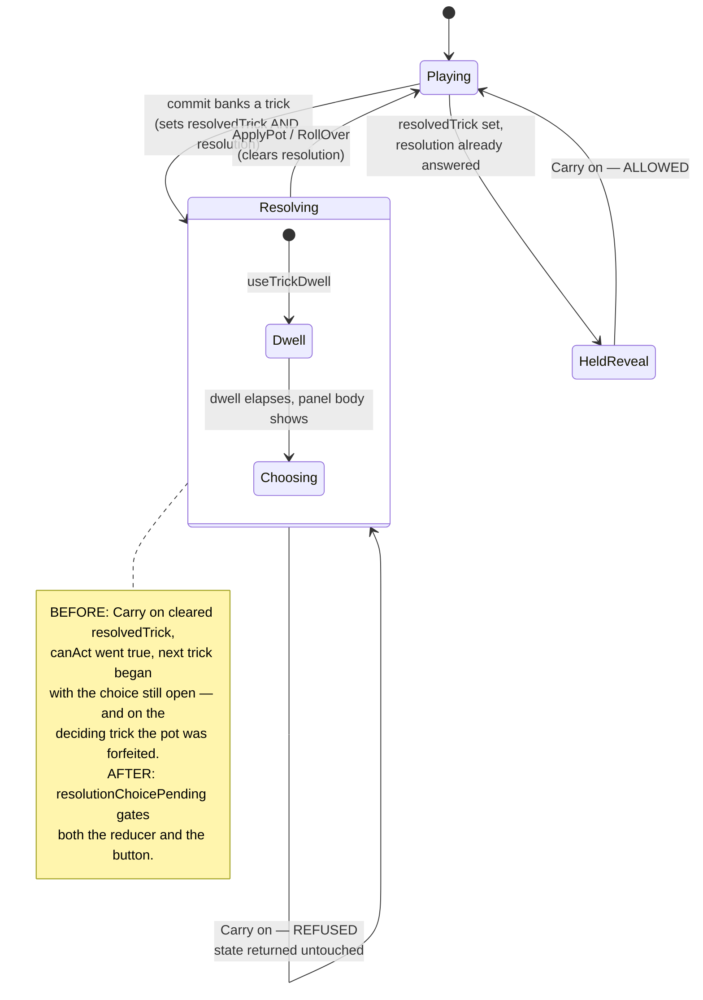

# Plan: Stop Carry on during a resolution choice, and make Roll over honest

Plan folder: `.claude/contract/2026-09-04-resolution-carry-on-and-roll-over/`
Execution status: see `tasks.md` in this folder.

---

## Part 1 — Alignment

### Task reference

Reported by the developer in play on 2026-09-04, verbatim:

> "I think the roll over button is not working, I press roll over and then it might say apply 4 or rollover for 9 and I press roll over and it stays at 4. Also you can click carry on when the only option should be Apply Damage or roll over."

A read-only investigation followed, and its file/line references were verified against the working tree. It found two separate causes behind those two sentences. Neither is DLR-174 fallout: the Carry on leak dates to **DLR-160** (which turned the resolution screen into a panel beside a still-mounted felt) and the misleading Roll over copy to **DLR-156** (which introduced the per-trick pot and its hold labels).

No Jira key was named in the brief, so this contract takes a date-branch slug and no ticket was created — `/fb-plan` plans work, it does not open it.

### Restated goal

Two defects on the trick-resolution surface, fixed together because they are the two halves of one complaint.

The first is a real bug that can lose the player their whole pot. Since DLR-160 the resolution is a panel beside the felt rather than a screen replacing it, and nothing in the app gates a *felt* control on "a resolution choice is pending". So the well's own **Carry on** button stays live underneath the choice. Pressing it starts the next trick with the choice still open, and on the deciding trick — or after a killing blow — the hand can end without Apply ever running, silently forfeiting the pot. The ruleset says a banked trick stops play and asks the question before the next trick starts; the code does not enforce that. This contract adds the missing predicate and reads it from both the reducer and the control, so the button refuses *and* looks refused.

The second is not a bug in the engine at all. Roll over is a bet: it changes no numbers, and the larger figure only arrives if the next trick banks. That is exactly what the rules say and exactly what the reducer does. What is wrong is that the panel flashes "rolled over — roll now ×3" when the roll has *not* become 3, and the only readout left on the card afterwards still says 4. The player was told a change happened, saw no change, and reasonably concluded the button was broken. This contract makes the hold line state the conditional it actually is, and gives the pot card a standing readout that says the pot is riding and what it is worth if the next trick goes the other way.

### In scope

- A new predicate, `resolutionChoicePending(state)`, in `src/app/warCouncil/roundUiState.ts` — the single statement of "a banked trick is waiting on Apply or Roll over", read by both the reducer and the props assembler so the two cannot drift.
- A guard in `handleCarryOn` (`roundReducer.ts`) that refuses **before** the held reveal is cleared, so a refused Carry on changes nothing at all.
- An optional `carryOnDisabled` prop on `TrickWell.tsx`, applied to **both** of its carry-on-family buttons and to the shared click handler, plus a `:disabled` rule for `.wc-carry-btn` in `warCouncilTable.css`.
- `roundControlsProps.ts` → `feltStageProps` passing `carryOnDisabled: resolutionChoicePending(ui)` at both `TrickWell` construction sites.
- Correcting the false premise in `WarCouncilRound.tsx`'s own comment, which is what licensed the bug.
- Rewording `rolledOverHoldLabel` in `resolutionLabels.ts` from an accomplished fact to the conditional it is, and renaming its `nextRoll` parameter so the projection cannot be re-read as a fact.
- A standing-wager sub-line on the pot card (`BankMeter.tsx`), so the pot's exposure is visible outside the 700ms hold.
- Correcting `roundReducer.bank.test.ts:132-166`, which currently encodes the buggy sequence as intended behaviour, and renaming the misleadingly-named `carryOnFromResolution` helper in `resolutionTestHelpers.ts`.
- Vitest coverage for each: the predicate without a renderer, the reducer's refusal, the control's disabled state, the reworded label, the riding sub-line, and one integration spec proving the pot cannot be skipped.

### Explicitly out of scope

- **Any change to what Roll over does.** `rollOverAction` is correct and `roundReducer.resolution.test.ts:167-180` already pins it. A Defeat pays the Quarry nothing and both figures stand — that rule is not being touched.
- **Any change to the pot arithmetic** — `potValue`, `nextPotFloor`, streak climbing, `BASE_DAMAGE`. `src/warCouncil/**` and `src/hunt/**` stay read-only.
- **Removing or unmounting the Carry on control.** It is a legitimate family — "Carry on", "Let them lead", and "Finish the round" all share `handleCarryOn`, and after a mid-hand kill it is the *only* route to `onComplete`. It becomes inert during the choice; it does not disappear.
- **The DLR-174 arming surface's missing mouse-close affordance.** Separately reported the same day, and its own ticket.
- **Restructuring the resolution panel, the dwell, or the beat sequence.** The two optional hardening items the investigation raised (threading trick identity through the pot actions, resetting `useBeatSequence`'s `landed`) are deliberately excluded — see Risks.
- **Hand-editing `.docs/game_rules/the-hunt.md` or `.docs/implementation/**`.** Those are `implementation-doc-writer`'s, and `/fb-apply` invokes it unconditionally at its Step 6.5. See Assumptions #7.

### Pattern Reference

Named by the brief and authoritative:

- `src/app/warCouncil/roundUiState.ts` → `canAct` — the shape and docblock discipline the new predicate copies. It is the existing statement of "the player may act", and the new predicate sits beside it as the statement of "something else must be settled first".
- `src/app/warCouncil/roundReducer.ts` → `handleCarryOn`'s refusal list — the existing `discardSelecting` and `curseArmed` clauses are the precedent, right down to their reasoning: a competing claim on the same gesture must be settled before the felt's advance gesture is allowed.
- `src/app/warCouncil/PlayingCard.tsx` → the optional `disabled` prop DLR-174 added — the precedent for adding an optional boolean to a component with several construction sites without breaking any of them.
- `src/app/warCouncil/RoundOverPanel`'s "Finish the round" control — the button shape `TrickWell`'s own docblock says its carry-on control was modelled on.
- `.claude/skills/react-frontend/SKILL.md` and `.claude/skills/game-ux/SKILL.md` — conventions, not restated here.

### Constraints flagged on the brief

- **The control must become inert, not vanish.** Deleting it strands the encounter-ending path, which is the only route to `onComplete` after a mid-hand kill.
- **Both the reducer guard and the disabled state ship together.** Either alone stops the state corruption; doing both is what stops them drifting apart later, and it is what makes the refusal *visible* rather than a dead click.
- **The exact wording of both strings is the developer's.** This plan proposes wording for approval at the gate and does not treat it as settled.
- **The four outcome names are used correctly** — High Victory, Low Victory, High Defeat, Low Defeat — and a Defeat pays the Quarry nothing.
- **`src/warCouncil/**` and `src/hunt/**` are read-only**, so the pot arithmetic is read and never edited.

### Assumptions made

1. **The guard goes *before* `handleCarryOn` computes `cleared`, not into the refusal list beside the existing clauses.** *Rationale:* this is a correction to the brief's proposed fix, and it matters. `handleCarryOn` currently clears `resolvedTrick` **first** (`roundReducer.ts:292-293`) and only then runs its refusal list, returning `cleared` — so a refusal still nulls the held reveal. For `discardSelecting` and `curseArmed` that is intended (drop the reveal, refuse the advance). For a pending resolution choice it would be the bug in miniature: clearing `resolvedTrick` flips `canAct` true, un-greys the hand, and lets the next card be played with the choice still open. A pending choice must make Carry on a complete no-op, so it returns `state` untouched.
2. **`carryOnDisabled` is applied to both of `TrickWell`'s buttons and to `handleHintClick`, not only to the "Carry on" branch.** *Rationale:* both call the same handler, and belt-and-braces at the control and the handler is the same idiom `TrickResolutionScreen` already uses for its own hold guard. It also closes the state-space question of whether the `quarryToLead` branch can render while a choice pends, rather than depending on the answer.
3. **The pot card's "riding" state is derived, not stored.** *Rationale:* a standing wager is exactly `total > 0 && roll > 0` — an un-applied pot is at risk whether the player reached it by pressing Roll over or simply by banking and not yet being asked. No new `RoundUiState` field, no new prop threading from the reducer, and it stays true across the panel unmounting. Storing an explicit "rolled over" flag would put a second, narrower reading of the same fact into the state space.
4. **`resolutionChoicePending` lives in `roundUiState.ts` beside `canAct`, not in a new file.** *Rationale:* `resolution` is a `RoundUiState` field and `canAct` is its neighbour. The file is at 371 lines and this adds roughly ten — see Risks for the budget.
5. **The reworded hold label names the trick number and the floor figure**, both already in scope at the call site (`resolution.trickNumber`, `resolution.nextPotFloor`). *Rationale:* the sentence has to say what the bet pays *and* what it costs, or it is the same half-truth in new words. Wording itself is the developer's.
6. **No new configuration value is introduced.** *Rationale:* nothing here is a tunable — the hold duration, the dwell, and the pot arithmetic all already exist and are untouched.
7. **The three stale docs are corrected by `implementation-doc-writer` at `/fb-apply`'s Step 6.5, not by a hand-edit task here.** *Rationale:* the developer unticked that skill at the classification gate, and `CLAUDE.md` states `.docs/game_rules/the-hunt.md` and `.docs/implementation/**` are never edited by hand. `/fb-apply` invokes the skill unconditionally regardless of this contract's skill list, so the corrections still happen — they are listed under "Developer decides or observes" so they are not lost. The one comment that *is* source, in `WarCouncilRound.tsx`, is fixed in a task here.
8. **The `.wc-carry-btn:disabled` rule is minimal and its exact look is the developer's.** *Rationale:* a disabled affordance needs to read as unavailable without relying on colour alone, but how it looks is visual judgement.

### Config and persisted-shape audit

- **No persisted shape touched.** `RoundUiState` is the hand's own transient — it dies on remount and never reaches `RunState`. `src/persistence/` and `src/vault/` are not in the file map, no `localStorage`/`sessionStorage` reference is added, no `saveKeyFor` call, no envelope, no parsed payload. **`SAVE_SCHEMA_VERSION` is not bumped and must not be.** No reject condition in `.claude/rules/save-data-versioning.md` is reachable.
- **No `RoundUiState` field added, removed or retyped.** The new predicate reads the existing `resolution` field. This is deliberate — `RoundUiSeed`/`createRoundUiState` has 72 construction sites across 32 files, and none of them change.
- **`resolutionChoicePending` and `carryOnDisabled` are new names.** `grep -rn "carryOnDisabled\|resolutionChoicePending" src` returns **zero hits**, so there is no collision and nothing to rename.
- **`TrickWell`: one new optional prop, zero breaking sites.** Construction sites, counted by `createElement(TrickWell` / `<TrickWell`: **4 total** — `roundControlsProps.ts:220` and `:257` (production, both in the file map), `__tests__/MotionAnchors.test.tsx:130` and `__tests__/TrickWell.test.tsx:46`. Because `carryOnDisabled` is optional and defaults to `false`, none of the four *must* change; the two production sites change because they carry the live value.
- **`BankMeter`: one new optional prop, zero breaking sites.** Construction sites: **10** — `PotCard.tsx:51` (production) and nine in `__tests__/BankMeter.test.tsx`. Optional and defaulted, so only the production site and the new spec cases change.
- **`rolledOverHoldLabel`: 3 hits total** — its definition (`resolutionLabels.ts:73`), its import and its single call (`TrickResolutionScreen.tsx:3` and `:79`). The parameter rename is contained to those three lines. No test names the function.
- **`.wc-carry-btn` is styled in exactly one place** — `warCouncilTable.css:212-238` (base, `:focus-visible`, a `@media (hover: hover)` block, and `:active`). `warCouncilCards.css:236-238` mentions it in prose only. The `:disabled` rule joins that one block; no class is renamed, so no string-bound selector moves.
- **The literal string "Carry on" is asserted by no spec.** Six hits across the tests are all in comments; the only spec that *clicks* the well's button is `WarCouncilRound.trickDwell.test.tsx:137`, and it does so after Apply has already closed the panel — the legitimate use, which must keep working.
- **Architectural boundary holds.** Everything changed is under `src/app/`, which the pure-core ESLint override does not cover. `src/warCouncil/**` and `src/hunt/**` are read-only in this contract, so that override cannot be tripped.

---

## Part 2 — Technical design

### Approach

The whole of defect 1 is one missing fact. `ui.resolution` is read in exactly three places in the app — the two pot actions and `WarCouncilRound`'s render gate — and **no predicate anywhere asks "is a resolution choice pending?"**. Every felt gate (`canAct`, `discardWindowOpen`, `loadoutDoorOpen`, and DLR-174's three new ones) reads `resolvedTrick` instead, which is the *held reveal*, not the *unanswered question*. The two happen to be set in the same transition by `commit`, which is why nobody noticed — but `handleCarryOn` clears `resolvedTrick` as its very first act, and from that instant the two facts disagree and every gate reads the wrong one.

So the fix is to name the fact once and read it from both sides. `resolutionChoicePending(state)` goes in `roundUiState.ts` beside `canAct`; `handleCarryOn` consults it **before** it clears anything and returns the state untouched; and `feltStageProps` passes the same predicate down as `carryOnDisabled` so the button is visibly unavailable rather than silently inert. Either half alone stops the corruption — the guard makes the click do nothing, the prop makes it un-clickable — and the reason for doing both is the project's own rule against two readings of one gate: with only the reducer guard, a player clicks a live-looking button and nothing happens, which is its own bug; with only the prop, any future caller that forgets to pass it re-opens the hole. The rejected alternative was to gate `WarCouncilRound`'s render so the felt is not mounted during a choice, which is how it worked before DLR-160 — that would undo a deliberate design change and tear down the motion registry at every trick, which DLR-160's own comment says it exists to avoid.

Defect 2 needs no reducer change, because the reducer is right. It is a feedback failure with two halves. The transient half is `rolledOverHoldLabel`, which renders a projection (`roll + 1`) in the grammar of an accomplished fact — "roll now ×3" — for 700ms, and then the panel unmounts. That becomes a conditional sentence naming both outcomes of the bet, and its parameter is renamed off `nextRoll` so the next reader cannot mistake a projection for a value that has changed. The durable half is that nothing on the pot card ever says the pot is exposed: `BankMeter` renders "N banked × M streak" with the pot figure above it, in identical form whether the pot is safely zero or is four points the player is one Defeat away from losing. `game-ux`'s rule is the relevant one — *an absence is not a signal*, and a readout that looks the same in both states teaches the player to stop reading it. So the pot card gains a riding line whenever `total > 0 && roll > 0`, naming what is at stake and what the next banked trick makes it. That state is *derived*, not stored: an un-applied pot is at risk regardless of which button got it there, so no new state field and no new prop chain is needed — the alternative, an explicit "rolled over" flag on `RoundUiState`, would be a second and narrower reading of a fact the existing two numbers already carry.

Two hardening items the investigation offered are deliberately left out, and it is worth saying why rather than silently dropping them. Threading trick identity through `applyPotAction`/`rollOverAction` guards against a settle landing on a *different* trick's resolution — but that requires `ui.resolution` to be replaced non-null → non-null, which requires playing a card during a choice, which requires `canAct`, which requires `resolvedTrick` to be null. Fixing defect 1 makes exactly that sequence unreachable, so the guard would be dead code added in the same contract that kills its only caller. The same argument retires the `useBeatSequence` `landed` reset. Both are recorded in Risks so a future contract can revisit them if the premise ever changes.

### Skills to invoke during execution

- `react-frontend` — owns everything under `src/`: the predicate's shape and docblock, the reducer guard, the optional-prop pattern, the 400-line budget, and the Vitest posture that puts the predicate's spec under the `node` project and the component work under `dom`.
- `game-ux` — owns the game-screen layer this touches: a control that must read as unavailable rather than be silently inert, the ≥44px and `:focus-visible` floor the disabled rule must not break, the rule that a surface must show what the current decision needs, and the rule that an absence is not a signal (which is the whole argument for the riding line).

**Developer override at the classification gate:** `implementation-doc-writer` was proposed and **unticked**. The three stale docs it owns are therefore not hand-edited here; `/fb-apply` invokes that skill unconditionally at its Step 6.5 and the corrections are routed there. `game-designer` was offered and declined — correctly, since no rule changes.

Rules to Read: `.claude/rules/README.md` and `.claude/rules/save-data-versioning.md` (scanned — no persisted shape is touched, so nothing in it binds; the executor should confirm rather than assume). Always: `.claude/workflow/web-project.md`.

### Diagram



### Data shapes

#### New predicate — added to `src/app/warCouncil/roundUiState.ts`

```ts
/** A banked trick is waiting on Apply Damage or Roll over. THE one statement of it: read by
 *  `handleCarryOn` to refuse the felt's advance gesture and by `feltStageProps` to disable the
 *  control, so the refusal and its appearance cannot disagree.
 *
 *  Distinct from `resolvedTrick`, which is the HELD REVEAL and not the unanswered question. The
 *  two are set together by `commit` but come apart the moment `handleCarryOn` clears the reveal,
 *  and every other felt gate reads `resolvedTrick` — which is exactly how the choice was
 *  skippable. */
export function resolutionChoicePending(state: RoundUiState): boolean
```

#### Modified shapes

```ts
// TrickWell.tsx — one new OPTIONAL prop; 4 construction sites, none forced to change.
interface TrickWellProps {
  // …existing fields unchanged…
  /** The felt's carry-on gesture is refused because a banked trick is still waiting on Apply
   *  Damage or Roll over. Optional, defaulting to `false`, so all 4 construction sites keep
   *  compiling. Applied to BOTH carry-on-family buttons and to the shared click handler. */
  readonly carryOnDisabled?: boolean
}

// BankMeter.tsx — one new OPTIONAL prop; 10 construction sites, none forced to change.
interface BankMeterProps {
  // …existing fields unchanged…
  /** Render the standing-wager line. Derived by the caller as `total > 0 && roll > 0` — an
   *  un-applied pot is at risk however it was reached. Optional, defaulting to `false`. */
  readonly riding?: boolean
}

// resolutionLabels.ts — parameter RENAMED, return value REWORDED. 3 hits, all in one task.
// WAS: rolledOverHoldLabel(nextRoll: number)  ->  `rolled over — roll now ×${nextRoll}`
export function rolledOverHoldLabel(potFloorIfTaken: number, trickNumber: number): string
```

#### Proposed copy — **the developer's to approve or replace at the gate**

| Where | Current | Proposed |
|---|---|---|
| `rolledOverHoldLabel` | `rolled over — roll now ×3` | `rolled over — 9 or better if you take trick 4, nothing if you do not` |
| `BankMeter` riding line | *(nothing)* | `4 riding — 9 or better if trick 4 banks, nothing if it does not` |

Both are proposals only. The constraint they must satisfy is that neither may state as fact a figure that has not happened, and both must name the downside — a Defeat pays nothing.

#### Not changed

No configuration key, no `package.json`, no `tsconfig.json`, no `vite.config.ts`, no `eslint.config.js`, no new dependency, no persisted field, no `RoundUiState` field, and no change to `potValue`, `nextPotFloor`, `rollOverAction` or `applyPotAction`.

### Runtime quality notes

- **Purity and adjudication.** `resolutionChoicePending` is a one-line total function over existing state, testable under the `node` project with no renderer. It decides nothing new: the *rule* that a banked trick stops play is `the-hunt.md`'s, and this predicate only states in code what that document already states in prose. `TrickWell` and `BankMeter` continue to render views they do not build — the riding flag is derived by `PotCard`'s caller from the two numbers it already receives, not recomputed inside the component.
- **Effects, mount and teardown.** **No effect, timer, listener, observer, `requestAnimationFrame` or `AbortController` is added anywhere in this contract.** The disabled state is a prop; the riding line is a conditional render; the reworded label is a pure function. `useResolveHold` and `useTrickDwell` keep their existing timers and their existing cleanup, untouched. No module-level mutable state is added. StrictMode's double mount is a no-op for everything here.
- **Hot-path cost.** `resolutionChoicePending` is a null check, called once per render in `feltStageProps` and once per `CarryOn` action. Nothing runs per pointer move, nothing allocates in a handler, and no `memo`/`useMemo`/`useCallback` is added — there is no profiling evidence for any and the `react-frontend` skill forbids speculative memoisation.
- **Determinism and numeric safety.** No `Math.random()` and no clock is reachable from any new code, so the simulator's seeded runs are unaffected — and `src/sim/` is not in the file map. No new division is introduced, so no new `NaN` path exists; the riding line's figures come from `potValue` and `nextPotFloor`, both already rendered elsewhere on the same card. Every comparison added is on integers.
- **Error paths.** Nothing new throws and nothing new is caught. The refusal is a *named* state transition that returns the state unchanged, not a swallowed failure — and unlike the current behaviour it cannot half-apply, which is the specific defect. There is no async surface anywhere in this change, so the four async states do not apply. The one deliberate no-op path (`handleCarryOn` refusing) is covered by a spec asserting the state is byte-for-byte unchanged, so a future edit cannot quietly reintroduce a partial clear.

### Risks and judgement calls

- **Both proposed strings are copy judgement and are yours.** The table under Data shapes is a proposal to red-line at the gate, not a decision. The only hard constraint is that neither may assert a figure that has not happened, and both must name the downside.
- **How a disabled Carry on should *look* is yours.** The plan adds a minimal `.wc-carry-btn:disabled` rule. `game-ux` requires it to read as unavailable without relying on colour alone and without breaking the ≥44px target or `:focus-visible`; beyond that the treatment is visual judgement.
- **A disabled button with no stated reason may not be enough.** `game-ux`'s rule that an absence is not a signal cuts both ways: a greyed-out Carry on tells the player they cannot advance but not *why*. The mockup shows the button disabled and the pot card demanding the answer; if that reads as a dead end rather than a prompt, the fix is a line of copy in the well, which is a gate decision.
- **`roundUiState.ts` is at 371 of 400 lines** and this adds roughly ten. That leaves real but thin headroom — DLR-174 already split four predicates out of this file into `armingWindows.ts` when it hit 408. If the measured count crosses 400, the task splits rather than reports, per this project's fix-in-ticket rule.
- **One existing spec asserts the buggy behaviour and will fail by design.** `roundReducer.bank.test.ts:132-166` advances between tricks with `CarryOn` while a resolution is pending and never presses Apply or Roll over. It is corrected to dispatch `RollOver`, which is what a player actually does. That is a spec encoding a defect, not a regression this contract introduces — but it means a red test appears mid-phase and must not be "fixed" by weakening the new guard.
- **Two hardening items are deliberately excluded** — threading trick identity through the pot actions, and resetting `useBeatSequence`'s `landed` on a changed `beats`. Both guard against `ui.resolution` being replaced non-null → non-null, which defect 1's fix makes unreachable. If a future change ever lets a trick resolve while a choice is pending, both come back into scope.
- **The three stale docs are not corrected by a task in this contract** (Assumption 7) — they are routed to `implementation-doc-writer` at `/fb-apply`'s Step 6.5 because you unticked that skill and because `CLAUDE.md` forbids hand-editing either tree. They are listed under "Developer decides or observes" so the routing is visible rather than implicit.
- **Whether the pot's exposure now reads at a glance is only answerable by playing it.** The tests can prove the line renders with the right figures; they cannot prove it lands in the moment the player is deciding.
