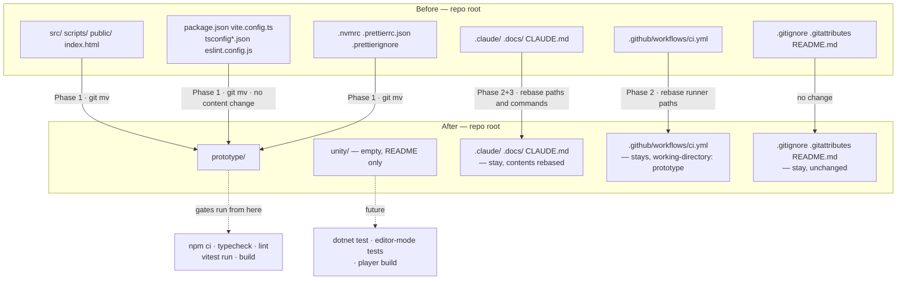

# Plan: Restructure the repo for the Unity port

Plan folder: `.claude/contract/2026-09-04-restructure-repo-for-unity-port/`
Execution status: see `tasks.md` in this folder.

---

## Part 1 — Alignment

### Task reference

Developer instruction, 2026-09-04, in session: *"do the restructure now"* — following an agreed recommendation earlier in the same conversation:

> One repo, two folders. Don't start a new project. The deciding reason is the oracle: you want the TypeScript simulator and the C# simulator runnable side by side in one working tree, so the same seed can be pushed through both and the reports diffed. On top of that, `.docs/` and `.claude/` are shared rather than web-specific, and you keep the git history that CLAUDE.md's recovery instructions lean on.
>
> The prototype stays a live, runnable project — not an archive folder. Delete it later, once the port reproduces its seeds.
>
> Do it as three separate commits and don't blend them: the `git mv` with nothing else changed (verify the prototype still builds and tests green), then the `.claude` and CLAUDE.md update, then the first Unity ticket.

The third of those commits — the first Unity ticket — is **not** in this contract.

Supporting document: `.docs/implementation/unity-port-architecture.md`, §2 (assembly layout), §2.1 (the four engine-free assemblies build without Unity), §20.3 (git setup before the first binary asset) and §20.4 (the pipeline needs a Unity sibling to its workflow file). No Jira ticket exists for this work, so the slug takes the date branch.

### Restated goal

Move the entire Vite/React prototype out of the repository root and into `prototype/`, leaving it fully runnable and green from inside that folder, and create `unity/` as the empty home the Unity project will later occupy. `.claude/`, `.docs/`, `CLAUDE.md`, `README.md`, `.gitignore` and `.gitattributes` stay at the root because they are shared by both codebases. Then update the Claude configuration so the pipeline knows it is now working in a two-toolchain repository: rebase the paths and runner commands that agents actually execute, add a `unity-project.md` sibling to `web-project.md` stating the Unity gates, rewrite CLAUDE.md's project-state and commands sections, and scope the `react-frontend` skill to `prototype/` with `unity-programmer` as the default for `unity/`. No TypeScript source file changes content — every `src/` file is moved verbatim by `git mv` so history follows it.

### In scope

- A `prototype/` folder holding the whole web project: `src/`, `scripts/`, `public/`, `index.html`, `package.json`, `package-lock.json`, `vite.config.ts`, `eslint.config.js`, the four `tsconfig*.json` files, `.nvmrc`, `.prettierrc.json`, `.prettierignore`.
- A `unity/` folder, tracked (git does not track empty directories), carrying a one-paragraph `README.md` stating what will live there and pointing at the architecture document.
- `.github/workflows/ci.yml` rewritten to run the npm steps inside `prototype/`, with `node-version-file` and `cache-dependency-path` rebased.
- `.claude/workflow/web-project.md` rebased onto `prototype/` — the layout block, the runner table, and the boundary-grep paths — and stating once that npm commands run from `prototype/`.
- A new `.claude/workflow/unity-project.md` stating the Unity project's future layout, its gates (`dotnet test` over the engine-free assemblies, editor-mode tests, player build), and the developer-owned work specific to Unity.
- `.claude/rules/save-data-versioning.md` rebased — it carries runnable PowerShell greps and named `src/persistence/` paths.
- The `src/` paths and npm commands rebased in the four agent files, the `/fb-*` command files, and the four runner-heavy skills (`play-tester`, `ai-play-tester`, `batch-apply`, `implementation-doc-writer`).
- `CLAUDE.md`'s **Project state** and **Commands** sections rewritten for two toolchains, and its skills table updated.
- `.claude/skills/react-frontend/SKILL.md` scoped to `prototype/**` and marked as describing the retained prototype, with `unity-programmer` named as the default for `unity/**`.
- One pointer note in `.docs/implementation/README.md` stating that a path written `src/…` in these documents means `prototype/src/…`.
- Verification that the prototype's own gates — install, typecheck, lint, the full Vitest suite, and the production build — all pass from inside `prototype/`.

### Explicitly out of scope

- **Creating the Unity project.** No `Assets/`, no `ProjectSettings/`, no `.asmdef`, no C#. `unity/` is an empty tracked folder and nothing more.
- **Any change to the content of a `.ts` or `.tsx` file.** Every source file moves byte-identical. If a gate fails after the move because a config path was wrong, the fix is the config file, never the source.
- **Rebasing `.docs/**`** — 876 `src/…` lines across 88 files, most of them in hand-authored design and implementation documents. One pointer note replaces the sweep; the reasoning is under Assumptions.
- **Rebasing `.claude/contract/**`, `.claude/lessons/**`, `.claude/sprint-runs/**` and `.claude/batch-runs/**`** — historical records of finished work. A path in an archived plan correctly describes where the file was when that plan ran.
- **Fixing the drift already present in `react-frontend/SKILL.md`** — it still calls the pure-core boundary "a pattern, not yet enforced" (it is lint-enforced), still describes a single-project Vitest config (there are two projects), and still says `.claude/rules/` is empty (it is not). Real, and a separate correction.
- **Renaming the repository or the `SAVE_NAMESPACE` constant.** Unrelated, and the save namespace is deliberately independent of the game's title.
- **Adding Unity `.gitignore` entries or Git LFS configuration.** Architecture §20.3 wants both before the first binary asset lands; that is the Unity scaffolding ticket's first task, not this one.
- **Deleting the empty root `tasks.md`.** Flagged under Risks instead.

### Pattern Reference

- `.docs/implementation/unity-port-architecture.md` §2, §2.1, §20.3, §20.4 — the layout being implemented and the reasoning for it. Cited, not restated.
- `.claude/workflow/web-project.md` — the file being rebased *and* the template `unity-project.md` follows. Its shape (Layout / Architectural boundaries / Verification commands / Hard constraints on runners / Developer-owned work / Correctness traps) is what the new sibling should mirror, so the two read as a pair.
- `.claude/workflow/plan-resolution.md` → *Plan slug grammar* — the date-branch slug used here.

### Constraints flagged on the brief

- **`git mv`, so history follows the files.** A delete-and-re-add loses `git log --follow` on 271 source files and 139 tests, which is exactly what makes the prototype usable as a reference later.
- **The prototype must stay green, not merely present.** Install, typecheck, lint, format check, the full suite, and the production build all have to pass from inside `prototype/`. "It's an archive now" is explicitly not the outcome.
- **The move and the configuration update are separate commits**, so a breakage is attributable to one of them. This shapes the phase boundaries; it is not written as a task step, because planning does not prescribe commits.
- **`.claude/`, `.docs/` and `CLAUDE.md` stay at the repository root.** They are shared by both codebases and must not move.

### Assumptions made

- **The Unity project will live at `unity/`, not at the repository root.** Architecture §20 gives the reason — it keeps `Library/`, `Temp/`, `Logs/` and `obj/` out of the top level and keeps the two codebases symmetric. Unity Hub opens a subfolder without complaint. **Confirmed** in conversation before this plan.
- **`.github/workflows/` stays at the root with `working-directory: prototype` on the npm steps.** GitHub only reads workflows from the repository root, so this is forced rather than chosen; the consequence is that `node-version-file` and `cache-dependency-path` must both be rebased or the workflow silently loses its Node pin and its cache.
- **`.docs/**` is not rebased; one pointer note in `.docs/implementation/README.md` carries the whole rename.** 876 lines across 88 files, most of them hand-authored design documents that the developer edits directly. `web-project.md` → *Hard constraints on runners* already records that a repo-wide rewrite of these documents buries real edits and makes the feature diff unreviewable. The single-source-of-truth answer is one statement, not 876 edits.
- **npm commands run from `prototype/`, stated once in the runner table rather than `cd`-prefixed on every line.** There are 78 npm-command lines across 14 operational files; prefixing each is churn that will drift. The runner table is the single owner of how a command is invoked, and the agents read it.
- **`.nvmrc`, `.prettierrc.json` and `.prettierignore` move into `prototype/`.** All three configure the web toolchain and nothing else. Consequence worth expecting: `npm run format:check` narrows from the whole repo to `prototype/`, which is likely to turn a long-standing known failure green — see Risks.
- **`.gitignore`, `.gitattributes` and `README.md` stay at the root.** The ignore patterns (`node_modules`, `dist`, `coverage`) are unanchored and therefore match at any depth, so no rebasing is needed for the prototype; the file will need Unity entries later, in the Unity scaffolding ticket.
- **`node_modules/` is relocated with a plain filesystem move rather than deleted and reinstalled.** It is untracked, so `git mv` cannot touch it; same machine, same architecture, so the tree is valid where it lands. `npm ci` inside `prototype/` is the fallback if any gate misbehaves after the move.
- **Root `dist/`, `dist-ssr/` and `coverage/` are deleted rather than moved.** All three are generated, all three are gitignored, and all three are rebuilt by the commands that verify the move.
- **`react-frontend` is scoped by editing its own header, not by moving its folder.** Skills live under `.claude/skills/` regardless of what they describe. Claude Code's directory-scoped-skill mechanism is a separate wiring question and is not attempted here.
- **The verification gates for `unity-project.md` are written from `unity-programmer`'s own guidance and the architecture document, and are stated as the intended shape rather than as commands anyone has run.** No Unity project exists, so no command in that file can be executed yet; the file says so explicitly rather than presenting untested commands as working.

### Config and persisted-shape audit

No persisted game shape is touched — no field, no key, no `SAVE_SCHEMA_VERSION` change, and `src/persistence/` moves byte-identical. The audit below is therefore about **path- and command-bound names**, which is the same class of failure (`web-project.md` → *Correctness traps*: string-bound names live outside the compiler's view) and the actual risk surface of this contract.

- **Build-tool configuration needs no edits at all.** `vite.config.ts` uses `base: './'` and `include: ['src/**/…']`; `tsconfig.json` references `./tsconfig.app.json`, `./tsconfig.node.json`, `./tsconfig.scripts.json`; `eslint.config.js` uses `globalIgnores(['dist'])` and `files: ['src/warCouncil/**/*.{ts,tsx}', 'src/hunt/**/…', 'src/vault/**/…', 'src/sim/**/…']`. Every one of those is relative to the config file's own location, so moving the whole set together leaves all of them correct. Verified by reading all four files. **This is the finding that makes the move mechanical.**
- **`src/` references in `.claude/**`, excluding historical records:** 151 lines across 25 files (`grep -rn "src/" .claude --include=*.md`, minus `contract/`, `lessons/`, `sprint-runs/`, `batch-runs/`). The partition was verified rather than assumed: total 10,624 = 10,473 historical + 151 operational. Per-file counts on the operational subset: `react-frontend/SKILL.md` 29, `fb-plan.md` 15, `play-tester/references/sim-architecture.md` 15, `implementation-doc-writer/SKILL.md` 12, `ai-play-tester/references/game-state-and-labels.md` 12, `implementer.md` 11, `CLAUDE.md` 9, `play-tester/SKILL.md` 9, `fb-apply.md` 8, `batch-apply/SKILL.md` 6, `save-data-versioning.md` 5, `web-project.md` 5, `qa.md` 3, and 1 each in `code-evaluator.md`, `defender.md`, `fb-issue.md`, `rules/README.md`, `engineering-standards.md`, `game-ux/SKILL.md`, `ai-play-tester/SKILL.md`. Every one of those files is in a task's `**Files:**` block.
- **`src/` references in `.claude/**` historical records:** 10,473 lines, all under `contract/`, `lessons/`, `sprint-runs/` and `batch-runs/`. **Deliberately untouched** — see Explicitly out of scope. This figure is the reason the sweep is scoped: 98.6% of the `src/` references in `.claude/` describe work that is already finished.
- **`src/` references in `.docs/**`:** 876 lines across 88 files. **Deliberately untouched**, replaced by one pointer note — see Assumptions.
- **npm-command lines in `.claude/**`, excluding historical records:** 78 across 14 files (`grep -rn "npm run \|npx vitest\|npm test\|npm ci"`). These are the lines an agent copies into a `Run:` step, so a stale one produces `Missing script` or `ENOENT`, which reads as a defect and is not one.
- **CI:** `.github/workflows/ci.yml` has 4 npm steps (`npm ci`, `npm run lint`, `npm run typecheck`, `npm test`, `npm run build` — 5 including the build), one `node-version-file: .nvmrc`, and one `cache: npm` with no `cache-dependency-path`. All need rebasing; `cache: npm` in particular resolves the lockfile relative to the repository root and will silently stop caching if left alone.
- **`.gitignore` needs no rebasing.** All patterns are unanchored (`node_modules`, `dist`, `dist-ssr`, `coverage`, `*.tsbuildinfo`) and therefore match at any depth. One forward-looking hazard noted under Risks: `*.sln` is already ignored, which will interact with the Unity project's generated solution and with architecture §2.1's hand-written `.csproj`.
- **`package.json`'s `name` field is already `"prototype"`** — no rename needed, and the folder name matches it.
- **Stray file found:** the repository root holds a zero-byte `tasks.md`. It is not a plan (`plan-resolution.md` globs `.claude/contract/*/tasks.md`), so it misroutes nothing. Flagged under Risks rather than deleted.

---

## Part 2 — Technical design

### Approach

The contract is three movements, and the ordering matters more than any individual edit. **Phase 1 moves files and changes no content**; **Phase 2 rebases the operational configuration** — the CI workflow and the `.claude` files that agents actually execute against; **Phase 3 rewrites the human-facing statements** — `CLAUDE.md`, the `react-frontend` scope header, and the `.docs` pointer note. The developer's two commits fall at the end of Phase 1 and the end of Phase 3.

The finding that shapes everything is that **the build toolchain needs no edits**. `vite.config.ts`, all four `tsconfig*.json` files and `eslint.config.js` express every path relative to their own location, so moving the whole set together as one unit leaves every glob, every project reference and every ESLint `files` array correct without touching them. That turns what looks like a risky restructure into a genuinely mechanical `git mv`, and it is why Phase 1 can end with the full prototype gate suite green before a single configuration line has been edited. If a gate fails in Phase 1, the move is wrong — not the config.

The alternative shapes worth naming. **Unity at the repository root with the prototype in a subfolder** was rejected because it puts `Library/`, `Temp/`, `Logs/` and `obj/` at the top level beside `.claude/` and `.docs/`, and because it makes the two codebases asymmetric for no gain. **npm workspaces**, with a root `package.json` delegating to `prototype/`, would let every existing `npm run …` line keep working unchanged from the root — genuinely tempting given 78 command lines to rebase — but it adds a second `package.json`, a root `node_modules/`, and a layer of indirection whose only job is to preserve command strings that a single line in the runner table can preserve just as well. **Prefixing every one of those 78 lines with `cd prototype`** was rejected for the reason the whole repository is organised around: a fact stated in 78 places gets updated in 77. The runner table owns how a command is invoked; it says once that the working directory is `prototype/`, and the consumers already read it rather than carrying copies.

The `.docs/**` decision follows the same logic from the other direction. 876 `src/…` lines across 88 files is not a rename, it is a rewrite of the design corpus — and `web-project.md` already records what happened the last time a mechanical sweep ran through those documents on DLR-116 (59 files, ~1,800 lines, real edits buried in stylistic churn). One sentence in `.docs/implementation/README.md` saying that `src/…` means `prototype/src/…` carries the same information at a fraction of the diff, and it degrades gracefully: a reader who misses the note still lands one directory away from the file, rather than being confidently sent to a path that a future rewrite got wrong.

**This is not a docs-only contract**, and that matters for how `/fb-apply` dispatches it. No `src/` file changes content, but 271 source files and 139 test files change location, and the entire question the contract exists to answer is whether the prototype still installs, type-checks, lints, tests and builds afterwards. QA must run. The convention that a contract with no `src/` file in its file map skips the reviewers does not apply here and would defeat the purpose.

### Skills to invoke during execution

- **`unity-programmer`** — owns `.claude/workflow/unity-project.md`: the assembly names, the gate commands, the Unity-version facts (Unity 6 LTS, the Mono-to-CoreCLR cutover at 6.8), and the "resolve any version-gated API against the docs before writing code" rule that file must carry forward. Confirmed by the developer.
- **`react-frontend`** — owns `.claude/skills/react-frontend/SKILL.md` and `references/engineering-standards.md`, both of which are edited to scope them to `prototype/`. Loading it means the scoping edit is made by something that knows what the file currently claims. Confirmed by the developer.
- Rules to Read before executing: **`.claude/rules/save-data-versioning.md`** — it is edited by Task 7, and its reject conditions constrain how its greps and its `eslint.config.js` claims may be reworded (the paths change; the rule does not).
- Workflow references to Read: **`.claude/workflow/web-project.md`** (rebased by Task 5, and the template Task 6 mirrors) and **`.claude/workflow/plan-resolution.md`**.

Developer override: `implementation-doc-writer` was offered and **declined**, which settles the `.docs/**` question — the pointer note in Task 12 is the whole treatment, and no per-document rebasing happens.

### Diagram

### Data shapes

No TypeScript type, configuration key, or persisted shape changes. No `package.json` script is added, removed, or renamed. The contract's only structural changes are file locations and the text of configuration documents.

#### File relocations (Phase 1, all via `git mv`)

| From (repo root) | To |
| --- | --- |
| `src/` | `prototype/src/` |
| `scripts/` | `prototype/scripts/` |
| `public/` | `prototype/public/` |
| `index.html` | `prototype/index.html` |
| `package.json`, `package-lock.json` | `prototype/` |
| `vite.config.ts`, `eslint.config.js` | `prototype/` |
| `tsconfig.json`, `tsconfig.app.json`, `tsconfig.node.json`, `tsconfig.scripts.json` | `prototype/` |
| `.nvmrc`, `.prettierrc.json`, `.prettierignore` | `prototype/` |

Untracked and therefore moved or removed outside git: `node_modules/` → `prototype/node_modules/` (filesystem move); `dist/`, `dist-ssr/`, `coverage/` → deleted at the root.

Unmoved at the root: `.claude/`, `.docs/`, `.github/`, `.git/`, `CLAUDE.md`, `README.md`, `.gitignore`, `.gitattributes`, and the zero-byte `tasks.md`.

#### New files

- `unity/README.md` — one paragraph: what will live here, that it is deliberately empty until the Unity scaffolding ticket, and a link to `.docs/implementation/unity-port-architecture.md`.
- `.claude/workflow/unity-project.md` — mirrors `web-project.md`'s section order: **Layout** (the seven assemblies from architecture §2, as the intended tree), **Architectural boundaries** (the four engine-free assemblies; `Passage → Table` one-way; nothing references `Data`), **Verification commands** (marked explicitly as *not yet runnable — no Unity project exists*), **Hard constraints on runners**, **Developer-owned work**, **Correctness traps** (the four Unity traps).

#### Edited files, and what changes in each

| File | Change |
| --- | --- |
| `.github/workflows/ci.yml` | `node-version-file: prototype/.nvmrc`; add `cache-dependency-path: prototype/package-lock.json`; add `defaults.run.working-directory: prototype` (or `working-directory` on each of the five npm steps) |
| `.claude/workflow/web-project.md` | Layout block rebased under `prototype/`; one statement that every npm command runs from `prototype/`; boundary-grep and `eslint.config.js` paths rebased; a pointer to the new `unity-project.md` |
| `.claude/rules/save-data-versioning.md` | The two PowerShell greps and every `src/persistence/…`, `src/hunt/…` path rebased; the `eslint.config.js` override paths rebased |
| `.claude/agents/*.md` (4 files) | 16 `src/` lines and their npm commands rebased |
| `.claude/commands/fb-*.md` | 24 `src/` lines and their npm commands rebased |
| `.claude/skills/{play-tester,ai-play-tester,batch-apply,implementation-doc-writer}/**` | 55 `src/` lines and their npm commands rebased |
| `.claude/skills/react-frontend/SKILL.md` + `references/engineering-standards.md` | Scope header rebased to `prototype/**`; a note that it describes the retained prototype and that `unity-programmer` is the default for `unity/**`; 30 `src/` lines rebased |
| `CLAUDE.md` | **Project state** and **Commands** sections rewritten for two toolchains; skills table updated |
| `.docs/implementation/README.md` | One pointer note: `src/…` in these documents means `prototype/src/…` |

### Runtime quality notes

- **Purity and adjudication:** No application logic is written or moved between layers. The pure-core boundary is unchanged in substance — `eslint.config.js` moves with the tree it protects, and its `files: ['src/warCouncil/**/…', 'src/hunt/**/…', 'src/vault/**/…', 'src/sim/**/…']` globs stay correct relative to their new location. `npm run lint` from inside `prototype/` is the check that this is true, and it is a required gate in Phase 1 rather than deferred to Final verification, because it is the specific thing the move could break.
- **Effects, mount and teardown:** Not applicable — no React code is written or edited. No effect, listener, observer, timer or `requestAnimationFrame` is added, removed or relocated within a file.
- **Hot-path cost:** Not applicable — no runtime code path changes. The only performance consideration is developer-facing: `npm ci` from a cold `node_modules` is slow, which is why the tree is relocated rather than reinstalled, with `npm ci` as the fallback.
- **Determinism and numeric safety:** Not applicable to the runtime. Worth stating for the contract itself: the move must be deterministic in the sense that it is complete — a source file left behind at the root would still be found by `tsc` through no path (it would simply not be compiled), so the check is `git status --porcelain` plus a root listing showing no `.ts`/`.tsx` left, not a type error.
- **Error paths:** Two failure modes have named responses. **A gate failing in Phase 1** means the move is incomplete or a file was missed — the fix is the move, never an edit to `vite.config.ts` or a source file, and never an `eslint-disable`. **`npm run format:check` failing inside `prototype/`** is reported, not chased: `web-project.md` forbids repo-wide `npm run format`, and although the scope is now narrower, a mass rewrite is still not the response to a check whose purpose is to report. No failure is swallowed — every verification step states its expected exit code and the summary line to quote.

### Risks and judgement calls

- **`npm run format:check` may go green for the first time, and that is a result to report rather than celebrate.** `web-project.md` records it as a standing failure caused by pre-existing files under `.docs/**`. Moving `.prettierrc.json` and `.prettierignore` into `prototype/` narrows `prettier --check .` to the prototype tree, which very likely removes that failure — but it also means `.docs/**` and `README.md` are no longer format-checked by anything. That is a real change in what the repository verifies, not merely a cleanup, and the developer should confirm they are happy with it. **If it is still red inside `prototype/`, do not mass-rewrite** — report the file list.
- **`.gitignore` already ignores `*.sln`, and will need Unity-specific entries that interact with architecture §2.1.** Unity regenerates `.sln` and `.csproj`, and the standard Unity `.gitignore` ignores both — but §2.1 proposes a *hand-written, committed* `.csproj` per engine-free assembly so they build without Unity. Those two facts collide. Not this contract's problem, and deliberately left alone; the Unity scaffolding ticket has to resolve it, and it should be resolved deliberately rather than discovered.
- **The empty root `tasks.md` (0 bytes) is left in place.** It misroutes nothing — plan resolution only globs `.claude/contract/*/tasks.md` — but it is unexplained litter at a root this contract is otherwise tidying. Deleting a file nobody can account for is not something to do as a side effect of a move. **Developer decision: delete it, or say what it is for.**
- **The `.docs/**` pointer note is a judgement call and the reversible half of a fork.** If the developer would rather have all 876 lines rebased, that is a mechanical follow-up ticket and nothing in this contract blocks it. The reverse — sweeping now and regretting the churn — is not reversible in the same way, which is why the cheap option is the one planned.
- **The `unity-project.md` gate commands are unverified by construction.** No Unity project exists, so no command in that file has been run. The file will say so in its own header. The risk is that it reads as authoritative later, after the Unity project lands, without anyone having checked its commands — so the first Unity scaffolding ticket must include correcting that file as an explicit task. **Flagged for the developer to carry into that ticket.**
- **`react-frontend/SKILL.md` is already drifted in three places** — the pure-core boundary is described as unenforced when it is lint-enforced; the Vitest configuration is described as single-project when `vite.config.ts` defines two; `.claude/rules/` is described as empty when it holds two files. This contract rebases its paths and does not fix any of that, deliberately, to keep the diff attributable. **Worth a `/fb-issue` afterwards.**
- **Scope judgement: the four runner-heavy skills are rebased and the remaining eight are not.** `play-tester`, `ai-play-tester`, `batch-apply` and `implementation-doc-writer` carry paths and commands an agent executes; `content-manager`, `pixel-artist`, `game-ux`, `video-editor`, `game-designer`, `management-jira`, `skill-creator` and `unity-programmer` mention `src/` once or twice in prose. Rebasing the prose ones is cheap but expands the diff; leaving them means a stale prose path. **The plan leaves them.** Say so if you want the sweep widened.
- **Nothing here can be judged by running the app**, so there is no developer observation list of the usual kind. The one thing worth a human eye is the shape of the new root — five directories and four files — and whether `unity/` reads as the right name next to `prototype/`.
