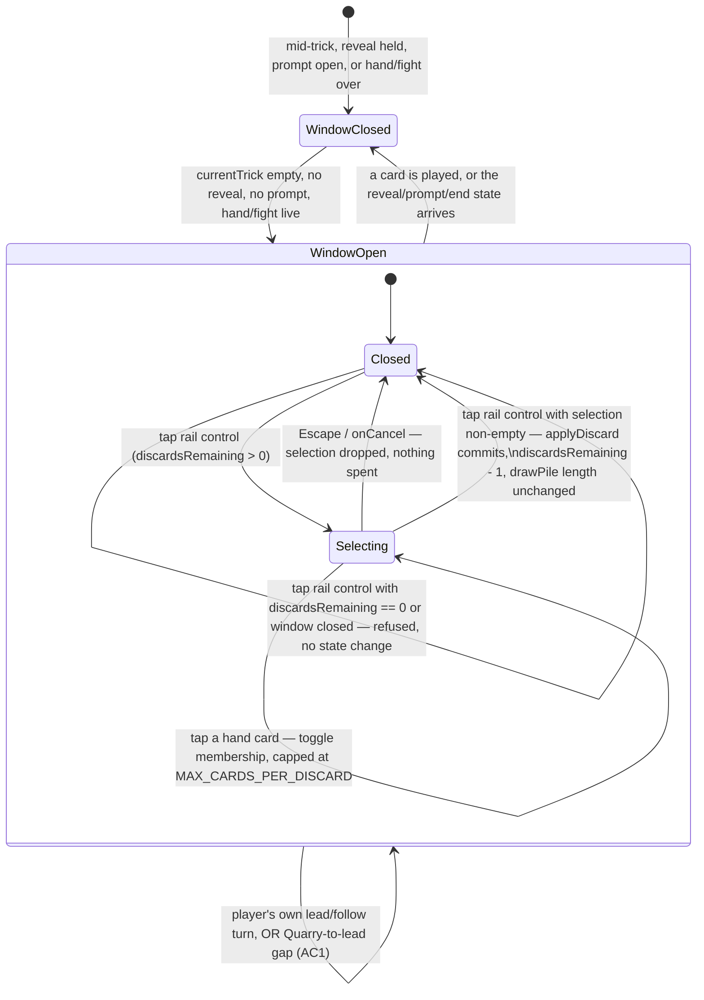

# Plan: The Discard — swap cards from hand between tricks

Plan folder: `.claude/contract/DLR-100-the-discard/`
Execution status: see `tasks.md` in this folder.

---

## Part 1 — Alignment

### Task reference

**DLR-100** — "The Discard: swap cards from hand between tricks." Full ticket body pulled from Jira
2026-08-22 (fields: summary, description, priority, status, labels). Acceptance criteria, verbatim:

1. A new player action is available between tricks, before the trick's first card is laid —
   including before the Quarry leads, so the player acts on the "What the Quarry holds" panel
   rather than on a lead already visible. It is never available mid-trick.
2. The action throws away 1 to `MAX_CARDS_PER_DISCARD` cards from the player's hand and draws the
   same number from `drawPile`, so hand size is unchanged and the `HAND_SIZE` cards / `HAND_SIZE`
   tricks invariant holds.
3. Discarded cards go to the bottom of the draw pile, reusing the existing convention
   `applyWoodcutterDraw` already implements (`drawPile: [...restOfPile, discard]`). There is no
   discard pile and no reshuffle rule — `dealRound` reshuffles a fresh deck every hand leaving 20
   in the pile, so it cannot be exhausted; do not build either.
4. Two new config constants, each stated once and documented with its unit and its owner:
   `DISCARDS_PER_FIGHT = 3` and `MAX_CARDS_PER_DISCARD = 3`. Both are the developer's provisional
   values, set 2026-08-19, and are expected to move after play — they must be a one-line edit.
5. Discards are a per-fight resource: carried across the hands within a fight and reset when a new
   fight begins. Carried on `RunState` and passed through `advanceRun`, exactly as `coins` and
   `cheats` are — not on `EncounterState`, which `advanceRun` re-seeds.
6. Chaining is permitted: more than one discard may be spent in the same gap between tricks, so the
   player can throw, see what arrived, and throw again. This is a deliberate decision (developer,
   2026-08-19), not an oversight.
7. The draw is blind — no preview of the pile, and no guarantee the player escapes the suit they
   are fleeing.
8. The Quarry gets no discards. Per DLR-81 it plays by exactly the player's rules and holds no
   powers.
9. Attempting to discard with none remaining, with an empty selection, or at a moment the action is
   not available is refused with a stated reason, consistent with this project's disabled-with-
   reason convention. The reducer must not throw — a throw during an event handler unmounts the
   tree.
10. Vitest coverage exists for: the swap preserving hand size, discards going to the bottom of the
    pile, the per-fight budget decrementing and resetting across `advanceRun`, chaining two
    discards in one gap, the refusal cases in AC9, and that going void in a suit correctly widens
    the legal set on a later trick of the same hand.

Design source: `.docs/design/Balatro-Forbidden-Solitaire/the-discard.md` — the-discard.md's D1–D8
give the reasoning behind each AC above; cited by number throughout this plan rather than
re-derived.

### Restated goal

Give the player a between-tricks action that swaps up to `MAX_CARDS_PER_DISCARD` cards from their
hand for the same number drawn blind from the pile, spendable up to `DISCARDS_PER_FIGHT` times per
fight (chainable within one gap), so a forced trick the "What the Quarry holds" panel already
telegraphs becomes a read the player can act on — including going void in a suit to dodge it
outright — rather than a result that just arrives. The mechanic reuses the Woodcutter's existing
draw-to-bottom convention and needs no new pile or reshuffle rule.

### In scope

- A pure engine module implementing the swap (remove n from hand, draw n from the top of
  `drawPile`, append the discarded cards to its bottom) and the refusal predicate AC9 asks for.
- Two new config constants, `DISCARDS_PER_FIGHT` and `MAX_CARDS_PER_DISCARD`, in `src/hunt/config.ts`.
- A `discardsRemaining` field on `RunState`, seeded by `startRun`, reset by `advanceRun`, carried
  through `recordEncounter` exactly as `cheats`/`envenomCharges`/`poisonGuardHeld` are.
- The reducer actions, handlers, and derived predicates that open a multi-card selection, let the
  player toggle hand cards in and out of it, and commit or cancel it.
- The felt-rail control (a new sibling of `CheatSlots`/`EnvenomCharge`/`ApplyDamagePlate`) and the
  hand-fan wiring that lets a tapped card join the selection instead of being armed to play, while
  the discard window is open — including before the Quarry's lead is committed.
- Wiring `discardsRemaining` through `WarCouncilMountProps`, `WarCouncilRoundResult`, and `App.tsx`'s
  `recordEncounter` call.
- Vitest coverage for every case AC10 names.

### Explicitly out of scope

- The Cheat's overlap with this mechanic (design doc §6, "open") — untouched.
- The Quarry's skulled-lead rule (design doc §5, "open") — `chooseCpuCard`'s lead branch is
  unchanged; the Quarry still always leads its lowest legal card.
- Any shop item that sells or extends discards — a later ticket.
- Tuning `DISCARDS_PER_FIGHT`/`MAX_CARDS_PER_DISCARD` for pacing, or at all beyond shipping the
  developer's stated provisional values.
- A discard pile, a reshuffle rule, or any rendering of pile contents — AC3 rules all three out.
- Any change to `chooseCpuMove`/`commitQuarryMove` — AC8 keeps the Quarry untouched.
- The measurement harness described in the-discard.md §8 — it was deleted on DLR-93 and rebuilding
  it is not this ticket's job.

### Pattern Reference

- `src/warCouncil/abilities.ts` → `applyWoodcutterDraw` — the draw-to-bottom convention AC3 names
  by name (`drawPile: [...restOfPile, discard]`), generalised from one card to n.
- `src/warCouncil/voluntaryCashOut.ts` — the shape every per-action refusal predicate in this
  codebase already follows: a `*Refusal` `as const` map, a `*Stock` interface of plain values (never
  `RoundUiState`/`EncounterState`), and a `*RefusalFor(stock)` function reused by both the reducer's
  guard and the control's disabled state. `src/hunt/flask.ts`'s `FlaskRefusal`/`flaskRefusalFor` and
  `src/hunt/shop.ts`'s `PurchaseRefusal`/`refusalFor` are the same shape again.
- `src/hunt/cheats.ts` + `src/hunt/run.ts`'s `RunState.cheats`/`envenomCharges`/`poisonGuardHeld` —
  the per-fight-resource-carried-through-`recordEncounter` pattern `discardsRemaining` follows
  exactly, including the "REQUIRED, not defaulted" parameter discipline `recordEncounter`'s own
  docblock states (a defaulted value is the one a driver forgets to thread and pays nothing for,
  silently).
- `src/app/warCouncil/roundUiState.ts`'s `CheatSelection`/`CheatStage`, `EnvenomStage`, and the
  exported `cheatArmed`/`envenomArmed`/`canAct` predicates — the "one field, not two nullables" and
  "predicate exported so the reducer and the component read the identical gate" disciplines this
  plan's `discardSelection`/`discardSelecting`/`discardWindowOpen` follow.
- `src/app/warCouncil/roundReducer.ts`'s `handleTapCheat`/`handleTapEnvenom`/`handleTapApplyDamage`
  and `clearCheat` — the mutual-exclusion discipline (arming one selection clears the others) and
  the "guard before calling a throwing engine function, because a reducer must not throw" discipline
  AC9 asks for.
- `src/app/warCouncil/CheatSlots.tsx` / `EnvenomCharge.tsx` / `ApplyDamagePlate.tsx` — the felt-rail
  control shape: a `role="group"` rail with `onClick` stopping propagation (load-bearing — the rail
  mounts inside `.wc-table`, which fires `handleCarryOn` on any click while the felt is waiting),
  `Escape` wired to cancel, a single plain tab stop (below `game-ux`'s roving-tabindex threshold),
  and — `ApplyDamagePlate` specifically — the refusal reason rendered on the control's own face
  rather than behind hover.
- `src/app/warCouncil/HandFan.tsx`'s `envenomArmed` branch — the existing precedent for "every held
  card becomes a valid tap target, including one illegal to play, while a marking mode is armed";
  this plan's `discardSelecting` is a second instance of that same branch, not a new concept.
- `src/app/warCouncil/PlayingCard.tsx`'s `skulled`/`envenomed` optional boolean props — the pattern
  a new `discardSelected` prop follows for rendering a third per-card marker.

### Constraints flagged on the brief

- **AC1's timing is the load-bearing decision** (design doc D2): pre-lead, including before the
  Quarry's own lead — not "any point before the player's own card is committed." The-hunt.md's
  existing `quarryToLead` window (computed in `WarCouncilRound.tsx`, where `currentTurn === Cpu` and
  `currentTrick.length === 0`) is exactly this moment, and the discard's availability predicate must
  reach it even though `canAct`/`interactive` (which gates every existing rail control) is `false`
  there — `canAct` requires `currentTurn === PlayerSide.Player`. This is the one place this ticket's
  gating must deliberately diverge from every existing control's.
- **AC9's "reducer must not throw"** — matches this codebase's `CLAUDE.md` correctness trap
  ("a throw during an event handler unmounts the tree") and every existing action handler's own
  guard-before-throwing-call discipline. `applyDiscard` throws only on a violated precondition the
  reducer already checked, exactly as `envenomCard` does.
- **Determinism** — the discard's draw is not random; it takes the top n cards of `drawPile` in
  order, exactly as `applyWoodcutterDraw` already does. No `Math.random()` is introduced; the
  blindness AC7 asks for is a property of the UI never previewing the pile, not of the draw itself
  being nondeterministic beyond the hand's own seeded shuffle.
- **The two-tunable discipline** (AC4) — both constants must be a one-line edit with a stated unit
  and owner, following every other tunable in `config.ts`.

### Assumptions made

- **The discard window is `currentTrick.length === 0 && resolvedTrick === null && prompt === null
  && cpuFault === null && phase !== Complete && !isEncounterResolved`, independent of whose turn it
  is.** Rationale: this is the narrowest predicate that satisfies AC1's "never mid-trick" and its
  "before the Quarry leads" requirement simultaneously — `currentTrick.length === 0` is exactly
  "mid-trick" negated (the follow branch is `currentTrick.length === 1`), and dropping the
  `currentTurn === Player` clause that every existing `canAct`-gated control carries is what reaches
  the Quarry-to-lead window. The design doc does not use this exact predicate language, but §2's D2
  worked example ("before Aoife leads... spend a discard") settles it functionally. **Consequence
  flagged for developer confirmation at the gate**: this predicate also stays true while a just-
  resolved trick's reveal is showing — no, it does NOT: `resolvedTrick === null` in the predicate
  excludes that window deliberately, so the discard becomes available only once `CarryOn` has
  cleared the reveal, matching every other rail control's existing behaviour of going inert while a
  reveal is held. This is a judgement call, not settled by the ticket text — flagged in Risks.
- **A discard's commit exits selection mode; chaining re-arms via a second tap on the rail control**,
  rather than re-opening automatically after a commit. Rationale: AC6 requires chaining to be
  possible, not that it be one continuous mode — an explicit re-arm after seeing the new hand is a
  smaller, more predictable interaction than a selection mode that silently persists across a
  state-changing commit, and it matches the existing arm/spend/re-arm shape every other consumable
  control (Cheat, Envenom) already uses.
- **The felt-rail control's disabled state is `discardRefusalFor(stock) !== null`, full stop** —
  matching `ApplyDamagePlate` exactly, with no separate "tap while selecting-and-empty to close"
  affordance on the control itself. Closing an empty selection is `Escape`/the rail's `onCancel`,
  exactly as it already is for Cheat and Envenom. Rationale: consistency with the two existing
  controls that already have this exact shape; inventing a second close gesture only for this
  control is unwarranted asymmetry.
- **`applyDiscard` takes a `side: PlayerSide` parameter even though only ever called with
  `PlayerSide.Player`** (AC8 keeps the Quarry out entirely). Rationale: `applyFoxExchange`,
  `applyWoodcutterDraw`, and `envenomCard` all keep this parameter for symmetry within
  `src/warCouncil/`, even where — like `envenomCard` — only the player side is ever a real caller.
  The player-only rule is enforced at the app layer (the reducer only ever calls it with
  `PlayerSide.Player`), matching where every other player-only rule in this codebase lives.
- **`DiscardRefusal`/`discardRefusalFor`/`DiscardStock`/`applyDiscard` live in a new
  `src/warCouncil/discard.ts`**, not folded into `abilities.ts`. Rationale: `abilities.ts` holds
  appliers for card-triggered abilities (Fox, Woodcutter) with no refusal predicate of their own —
  this mechanic is a standalone player action gated by its own refusal reason, matching
  `voluntaryCashOut.ts`'s shape (one file per standalone mechanic: refusal enum, stock interface,
  refusal predicate, apply function) rather than `abilities.ts`'s shape (bare appliers with no
  refusal layer, invoked only through `playCard`'s own validated path).
- **`recordEncounter` gains `discardsRemaining` as its sixth parameter, between `poisonGuardHeld`
  and `unplayedCards`.** Rationale: it groups with the other three hand-owned-then-returned
  resources (`cheats`, `envenomCharges`, `poisonGuardHeld`), all REQUIRED and all positioned before
  `unplayedCards`, which is a receipt value rather than a carried resource and is the function's own
  documented reason for sitting last.
- **No new `AbilityChoice` variant, and no route through `playCard`.** Rationale: the discard is not
  a card-play — it happens between tricks, has no legality question `legalMoves` should answer, and
  every existing per-fight-resource action (Cheat's arm, Envenom's mark, Apply Damage's cash-out)
  already bypasses `playCard` for exactly this reason.

### Config and persisted-shape audit

- **New keys, not renames**: `DISCARDS_PER_FIGHT`, `MAX_CARDS_PER_DISCARD`, `discardsRemaining`,
  `DiscardRefusal`, `discardSelection` — grepped across `src/**` (see below); **zero existing hits**
  for all five, confirming they are new names with nothing to migrate.
- **`recordEncounter`'s signature is a widened required-parameter list, not a rename.** Its one
  call site (`src/App.tsx`'s `handleComplete`) is in scope and updated in the same task that widens
  the signature (Phase 2). No other call site exists — grepped `recordEncounter(` across `src/**`:
  1 hit outside its own definition and its own `run.ts` re-export, in `App.tsx`.
- **`WarCouncilMountProps`/`WarCouncilRoundResult` are widened interfaces, not renames.** Their one
  construction site each (`App.tsx`'s JSX props and `WarCouncilRound.tsx`'s `onComplete` call) are
  both in scope, updated in the same tasks that widen the interfaces (Phase 3).
- **Nothing is persisted.** `RunState`'s own docblock states every field on it is "NEVER persisted"
  — no `localStorage`, no save file — so `discardsRemaining` needs no migration path, exactly as
  every sibling field on `RunState` needs none.
- **Round-trip check**: `RoundUiState.discardsRemaining` (mirrored from the mount's opening prop,
  per `cheats`/`envenomCharges`'s stated contract) → `WarCouncilRoundResult.discardsRemaining` →
  `recordEncounter`'s new parameter → `RunState.discardsRemaining` → `advanceRun`'s reset →
  `shopStockFor`/mount's next opening prop. Every link in this chain is a task in Phase 2/3/4 below;
  no link is skipped.

---

## Part 2 — Technical design

### Approach

The mechanic decomposes cleanly along this codebase's existing module boundaries, and every piece
has a direct sibling already on disk to copy the shape of.

**The swap itself is a pure `RoundState` transition**, living beside `voluntaryCashOut.ts` in
`src/warCouncil/` as a new `discard.ts`. It generalises `applyWoodcutterDraw`'s single-card
convention to n cards: take the discarded cards off `state.hands[side]`, take the same count off
the front of `state.drawPile`, append the discarded cards to the pile's back. `drawPile`'s length is
invariant across a discard (n out, n in), so the 20-card pile dealt every hand can never run dry
even under the worst case — three chained discards of three is nine draws against twenty, and every
draw pairs with a same-sized append. No new state shape, no discard pile, no reshuffle.

**The budget is a `RunState` field**, carried exactly as `cheats`/`envenomCharges`/`poisonGuardHeld`
already are: seeded by `startRun`, reset to `DISCARDS_PER_FIGHT` by `advanceRun` (a new fight), and
threaded through `recordEncounter` as a required parameter (the hand owns it for its life and hands
the survivor back). This is wiring, not new design — the pattern is already used three times on the
same struct for the same reason.

**The refusal predicate follows `voluntaryCashOut.ts`'s shape exactly**: a `DiscardStock` interface
of plain values (`discardsRemaining`, `selecting`, `selectionSize`, `windowOpen`) that
`src/app/warCouncil/roundUiState.ts` assembles from `RoundUiState`, and a pure
`discardRefusalFor(stock)` that both the reducer's guard and the rail control's `disabled` prop
read — one statement of availability, never two. `windowOpen` is the one genuinely new predicate
this ticket adds: unlike `canAct` (which every other control's stock reads and which requires
`currentTurn === Player`), it must also be `true` during the Quarry-to-lead gap, because AC1 asks
for exactly that. It is computed in the app layer (`roundUiState.ts`), not the pure engine, because
it reads `RoundUiState` fields (`resolvedTrick`, `prompt`, `cpuFault`) that have no meaning inside
`RoundState`.

**The UI selection is a third multi-card mode alongside Cheat's and Envenom's two-stage ones.**
Where `CheatSelection`/`EnvenomStage` model "poised, then armed, then spent" against a single
target, the discard models "open, then n cards toggled in and out, then spent" — so
`RoundUiState.discardSelection` is `readonly Card[] | null`: `null` means the mode is closed
(exactly one field, not a boolean-plus-array pair, for the reason `CheatSelection` already states —
two independent fields would admit an invalid combination, here "closed but holding a stale
selection"). Tapping the rail control opens it (clearing any Cheat/Envenom selection and any armed
card, mutually exclusive with both for the reason those two already clear each other); tapping a
hand card while it is open toggles that card's membership, capped at `MAX_CARDS_PER_DISCARD` and
silently ignoring a tap past the cap (matching this codebase's existing silent-guard style, e.g.
`clearCheat`'s stale-selection drop); tapping the rail control again while the selection is
non-empty commits it through `applyDiscard` and decrements the budget; `Escape` (wired identically
to every other rail control) or the control going refused mid-selection both close it without
spending. Chaining is simply: commit, mode closes, tap the rail control again — `windowOpen` is
still `true` after a commit (nothing about the round's own turn state changed), so nothing prevents
an immediate re-open with the fresh hand.

**The felt-rail control is a fourth sibling of `CheatSlots`/`EnvenomCharge`/`ApplyDamagePlate`**,
not a generalisation of any of them — this codebase's own stated reason for keeping consumable
controls separate ("retuning one never risks the others") applies here too. It reads
`discardsRemaining`, the current selection size, and the refusal reason, and renders the reason on
its own face per `ApplyDamagePlate`'s precedent (never behind hover).

**The hand fan gains a third "every card is a valid tap target" mode.** `HandFan.tsx` already has
one — `envenomArmed` makes every held card tappable including one illegal to play, because marking
is not a move. `discardSelecting` is the same relaxation for the same reason (discarding is not a
move either), so it is added as a second clause beside `envenomArmed` in the same two expressions
(`illegal`, `isFocusable`) rather than a parallel branch. The one genuinely new wrinkle: `HandFan`'s
own `interactive` prop must become `true` during the Quarry-to-lead window whenever
`discardSelecting` is `true`, even though `canAct(ui)` — the value every other consumer of
`interactive` reads — is `false` there. `WarCouncilRound.tsx` therefore computes two booleans instead
of one: the existing `interactive` (`canAct(ui)`, unchanged, still what gates Cheat/Envenom/Apply
Damage) and a new `handInteractive = interactive || discardSelecting(ui)` passed to `HandFan` alone.

### Skills to invoke during execution

- `react-frontend` — governs every file this plan touches under `src/`: the reducer, the new engine
  module, the new component, the config constants, and the Vitest coverage. Read
  `references/engineering-standards.md` alongside it for the component-size budget (the felt-rail
  additions push `WarCouncilRound.tsx` and `roundReducer.ts` closer to their 400-line ceilings —
  see Risks) and the constants taxonomy.
- `game-ux` — governs the new interaction: a multi-card selection on the object being acted on (the
  hand fan), confirmation on the rail control rather than a distant menu, the refusal reason on the
  control's own face rather than behind hover, and the roving-tabindex threshold (the hand fan
  already has one; this plan changes which cards are focusable inside it, not the mechanism).
- Both loaded during planning (2026-08-22); no developer override.
- No `.claude/rules/` file applies — that folder is empty (confirmed by glob during planning).
- `.claude/workflow/web-project.md` — the runner table and correctness traps below are drawn from
  it; every `Run:` step in `tasks.md` cites it rather than inventing a command.

### Diagram



### Data shapes

#### `src/hunt/config.ts` — two new constants

```ts
// UNIT: discard actions per fight. Reset by advanceRun at every fight boundary.
export const DISCARDS_PER_FIGHT = 3
// UNIT: cards per single discard action.
export const MAX_CARDS_PER_DISCARD = 3
```

Both are the developer's provisional values (design doc D4/D5, 2026-08-19) — not open tuning values
for this plan to invent, and not changed by this plan; they are transcribed at the stated figures.

#### `src/hunt/index.ts` — barrel export

Add `DISCARDS_PER_FIGHT, MAX_CARDS_PER_DISCARD` to the existing `export { ... } from './config'` list.

#### `src/hunt/run.ts` — `RunState`

```ts
export interface RunState {
  // …existing fields, unchanged…
  /** DLR-100 AC5 — the discard's per-fight budget. Carried across every hand within a fight,
   *  exactly as `cheats` and `envenomCharges` are — NOT on `EncounterState`, which `advanceRun`
   *  re-seeds. Reset to `DISCARDS_PER_FIGHT` by `startRun` and by `advanceRun`; carried through
   *  `recordEncounter`'s spread otherwise, because the hand owns it for its life and hands the
   *  survivor back through `WarCouncilRoundResult`, exactly as `cheats` and `envenomCharges` do.
   *  NEVER persisted, exactly as `coins` above. */
  readonly discardsRemaining: number
}
```

`startRun` seeds `discardsRemaining: DISCARDS_PER_FIGHT`.

#### `src/hunt/runTransitions.ts` — `advanceRun`, `recordEncounter`

`advanceRun`'s returned spread gains `discardsRemaining: DISCARDS_PER_FIGHT` (a fresh fight resets
the budget — the same reset `handOfFight: 1` already gets on the same line).

`recordEncounter`'s signature widens by one required parameter, positioned between
`poisonGuardHeld` and `unplayedCards`:

```ts
export function recordEncounter(
  run: RunState,
  encounter: EncounterState,
  cheats: readonly CheatCard[],
  envenomCharges: number,
  poisonGuardHeld: boolean,
  discardsRemaining: number,
  unplayedCards: number | null,
): RunState
```

Its returned spread gains `discardsRemaining,` (carried through unchanged — the hand's ending value
becomes the run's, exactly as `cheats`/`envenomCharges` already do on the same line). The docblock's
parameter-position prose ("third parameter" / "fourth parameter" / "fifth parameter" / "sixth
parameter") shifts by one for `unplayedCards` and gains a new line for `discardsRemaining`.

#### `src/warCouncil/discard.ts` — new module

```ts
export const DiscardRefusal = {
  NotAvailable: 'notAvailable',
  NoDiscardsRemaining: 'noDiscardsRemaining',
  EmptySelection: 'emptySelection',
} as const
export type DiscardRefusal = (typeof DiscardRefusal)[keyof typeof DiscardRefusal]

export interface DiscardStock {
  readonly discardsRemaining: number
  readonly selecting: boolean
  readonly selectionSize: number
  readonly windowOpen: boolean
}

export function discardRefusalFor(stock: DiscardStock): DiscardRefusal | null

export function applyDiscard(
  state: RoundState,
  side: PlayerSide,
  discarded: readonly Card[],
): RoundState
```

`discardRefusalFor` checks in this order — `windowOpen` first (true of the whole felt, mirroring
`applyDamageRefusalFor`'s stated ordering discipline), then `discardsRemaining`, then
`selecting && selectionSize <= 0`: the `selecting` guard is what stops "nothing chosen yet, mode not
even open" from reporting `EmptySelection` before the rail control has ever been tapped.

`applyDiscard` throws a `RangeError` on a count outside `1..MAX_CARDS_PER_DISCARD` or a card not
held by `side`, exactly as `envenomCard` throws on its own two preconditions — reachable only from a
reducer bug, since the reducer guards both before calling.

#### `src/warCouncil/index.ts` — barrel export

Add `DiscardRefusal, discardRefusalFor, applyDiscard` and type `DiscardStock` to the existing export
list, alongside the `voluntaryCashOut.ts` exports it sits beside.

#### `src/app/warCouncil/roundUiState.ts` — `RoundUiState`, `RoundUiSeed`, new action kinds, new predicates

```ts
export interface RoundUiState {
  // …existing fields, unchanged…
  /** DLR-100 AC5 — mirrored from the mount's opening prop, decremented on each committed discard.
   *  Run state carried for the life of the hand — the same contract `cheats` and `envenomCharges`
   *  document. */
  readonly discardsRemaining: number
  /** DLR-100 — the hand's OWN transient: dies on remount, never touches `RunState`. `null` when
   *  the discard rail is closed; an array (possibly empty) while it is open, holding the hand
   *  cards currently toggled in. ONE field rather than a boolean-plus-array pair, for
   *  `CheatSelection`'s stated reason: two independent fields would admit "closed but holding a
   *  stale selection". */
  readonly discardSelection: readonly Card[] | null
}

export interface RoundUiSeed {
  // …existing fields, unchanged…
  readonly discardsRemaining: number
}

export const RoundUiActionKind = {
  // …existing entries, unchanged…
  TapDiscard: 'tapDiscard',
  CancelDiscard: 'cancelDiscard',
} as const

export type RoundUiAction =
  // …existing variants, unchanged…
  | { readonly kind: typeof RoundUiActionKind.TapDiscard }
  | { readonly kind: typeof RoundUiActionKind.CancelDiscard }
```

New exported predicates, beside `canAct`/`cheatArmed`/`envenomArmed`:

```ts
/** `true` once the mode is open — mirrors `envenomArmed`'s "is a hand-card tap reinterpreted"
 *  role, but for a MULTI-card selection rather than a single armed target. */
export function discardSelecting(state: RoundUiState): boolean

/** AC1 — the moment the action is available, independent of whose turn it is. Deliberately does
 *  NOT read `canAct`/`currentTurn`: this is what reaches the Quarry-to-lead gap, where `canAct`
 *  is false. */
export function discardWindowOpen(state: RoundUiState): boolean

/** The plain values `discardRefusalFor` needs, assembled in ONE place so the reducer's guard and
 *  the rail control's disabled state cannot read availability differently — the same discipline
 *  `applyDamageStock` documents. */
export function discardStock(state: RoundUiState): DiscardStock
```

`createRoundUiState` seeds `discardsRemaining: seed.discardsRemaining, discardSelection: null`.

#### `src/app/warCouncil/roundReducer.ts` — new handlers

```ts
function handleTapDiscard(state: RoundUiState): RoundUiState
function handleCancelDiscard(state: RoundUiState): RoundUiState
function toggleDiscardCard(state: RoundUiState, tapped: Card): RoundUiState
```

`applyAction`'s switch gains the two new `RoundUiActionKind` cases. `handleTapCard` gains a first
branch — `if (discardSelecting(state)) return toggleDiscardCard(state, tapped)` — ahead of the
existing `envenomArmed` branch, mirroring its shape exactly. `handleTapCheat` and `handleTapEnvenom`
each gain `discardSelecting(state)` to their opening guard (alongside `!canAct(state)`), and their
poising branches gain `discardSelection: null` beside the `envenomStage: null` /
`cheatSelection: null` they already clear — mutual exclusion, matching how those two already clear
each other.

#### `src/app/warCouncilMount.ts` — `WarCouncilMountProps`, `WarCouncilRoundResult`

```ts
export interface WarCouncilMountProps {
  // …existing fields, unchanged…
  /** DLR-100 AC5 — discards remaining at the START of this hand. Same contract as `envenomCharges`
   *  above: an opening figure the reducer owns for the hand's life and hands back through
   *  `WarCouncilRoundResult`. REQUIRED rather than optional so the compiler enumerates every mount
   *  site instead of letting one silently render an inert rail. */
  readonly discardsRemaining: number
}

export interface WarCouncilRoundResult {
  // …existing fields, unchanged…
  /** DLR-100 AC5 — discards remaining after this hand. One fewer for each discard spent; the run
   *  adopts it through `recordEncounter`'s sixth parameter. */
  readonly discardsRemaining: number
}
```

#### `src/app/warCouncil/WarCouncilRound.tsx` — mount wiring

Destructures the new `discardsRemaining` prop into the reducer's seed object; computes
`handInteractive = interactive || discardSelecting(ui)` and passes it to `HandFan` in place of the
bare `interactive` it receives today (every other consumer of `interactive` — `CheatSlots`,
`EnvenomCharge`, `ApplyDamagePlate` — keeps reading the unchanged `interactive`); renders the new
`DiscardPlate` in the felt rail beside `ApplyDamagePlate`; passes `ui.discardSelection` to `HandFan`
and includes `ui.discardsRemaining` in the `onComplete` payload.

#### `src/app/warCouncil/DiscardPlate.tsx` — new component

```ts
interface DiscardPlateProps {
  readonly discardsRemaining: number
  readonly selectionSize: number
  readonly maxCardsPerDiscard: number
  readonly refusal: DiscardRefusal | null
  readonly onTap: () => void
  readonly onCancel: () => void
}
```

Same rail/plate shape as `ApplyDamagePlate.tsx`: `role="group"` rail, `onClick` stopping
propagation, `Escape` wired to `onCancel`, a single plain tab stop, `disabled = refusal !== null`,
the refusal sentence rendered on the control's own face.

#### `src/app/warCouncil/HandFan.tsx` — new props

```ts
interface HandFanProps {
  // …existing props, unchanged…
  readonly discardSelecting: boolean
  readonly discardSelection: readonly Card[]
}
```

`isFocusable` and the `illegal` expression each gain `|| discardSelecting` beside their existing
`envenomArmed` clause. Each `PlayingCard` gains
`discardSelected={containsCard(discardSelection, card)}`.

#### `src/app/warCouncil/PlayingCard.tsx` — new prop

```ts
interface PlayingCardProps {
  // …existing props, unchanged…
  readonly discardSelected?: boolean
}
```

Defaults to `false`, following `skulled`/`envenomed`'s own stated reason (every existing call site
keeps compiling; a caller that knows the state passes it). Renders a third conditional marker span
alongside the skull/venom ones, and folds into `aria-pressed`
(`(armed || discardSelected) ? true : undefined`) — the two states never coexist, since arming a
card to play and selecting it for discard are mutually exclusive modes.

#### `src/app/warCouncil/labels.ts` — new copy

```ts
export const DISCARD_RAIL_LABEL = 'Discard'
export const DISCARD_SELECT_HINT = 'Pick up to N cards to discard' // N = MAX_CARDS_PER_DISCARD, developer's exact wording
export const DISCARD_READY_HINT = 'Tap Discard again to swap them'
export const DISCARD_REFUSAL_MESSAGE: Readonly<Record<DiscardRefusal, string>>
export function discardAccessibleName(
  discardsRemaining: number,
  selecting: boolean,
  selectionSize: number,
  refusal: DiscardRefusal | null,
): string
```

`DISCARD_REFUSAL_MESSAGE` is a total `Record`, following `APPLY_DAMAGE_REFUSAL_MESSAGE`'s own stated
reason — a fourth refusal reason becomes a compile error here rather than an `undefined` sentence
under a disabled button. All four copy values are PLACEHOLDER wording, exactly as every other label
in this file is — the developer owns the final phrasing (Risks).

#### `src/app/warCouncil/roundHint.ts` — new cascade branch

`deriveHint` gains a branch for `ui.discardSelection !== null`, positioned directly after the
existing `resolvedTrick` check and before `quarryToLead` — ahead of `quarryToLead` because a card
selection in progress is the more specific, more actionable thing to tell the player, and the two
can genuinely coexist (AC1). Returns `DISCARD_SELECT_HINT` when the selection is empty,
`DISCARD_READY_HINT` once at least one card is chosen.

#### `src/App.tsx` — call-site updates

`handleComplete`'s `recordEncounter` call gains `result.discardsRemaining` as its sixth argument
(between `result.poisonGuardHeld` and `result.unplayedAtResolve`). The `<WarCouncilRound>` JSX gains
`discardsRemaining={run.discardsRemaining}`.

#### New stylesheet

`src/app/warCouncil/warCouncilDiscard.css`, imported by `WarCouncilRound.tsx` alongside the other
per-feature stylesheets it already imports (`warCouncilCheats.css`, `warCouncilEnvenom.css`,
`warCouncilApplyDamage.css`). Layout/colour/glyph values inside it are the developer's to choose at
the app (Risks) — this plan only establishes that the file exists and is imported.

### Runtime quality notes

- **Purity and adjudication:** `applyDiscard` and `discardRefusalFor` are both pure, DOM-free
  functions in `src/warCouncil/`, taking and returning plain values exactly as their siblings
  (`cashBankNow`, `applyDamageRefusalFor`) do. No component decides discard legality — `HandFan`
  and `DiscardPlate` both render off the reducer's own `discardStock`/`discardSelecting` predicates,
  never a locally recomputed guess. Both new config constants are read from `config.ts`; nothing is
  hard-coded at a call site.
- **Effects, mount and teardown:** no new effect, listener, timer, or observer anywhere in this
  plan — every transition is a reducer action fired from a tap or a keypress, exactly as the four
  existing rail controls already are. `RoundUiState.discardSelection` resets to `null` on every
  remount via `createRoundUiState`'s seed, so a StrictMode double-invocation of the lazy reducer
  initialiser recomputes an identical value, and a new hand's mount (a fresh `key`) never inherits a
  stale selection.
- **Hot-path cost:** the discard is a between-tricks action, not a per-pointer-event one — no new
  work runs on a drag or a scroll. `toggleDiscardCard` is O(selection length) against a bound of
  `MAX_CARDS_PER_DISCARD` (3), and `applyDiscard` is O(hand size + pile size), both small, fixed,
  and already the same order `applyWoodcutterDraw` runs at every card play.
  `discardRefusalFor`/`discardStock`/`discardWindowOpen` are cheap boolean/field reads recomputed
  every render, exactly as `applyDamageStock`/`applyDamageRefusalFor` already are — no memoisation
  is introduced or needed.
- **Determinism and numeric safety:** the draw takes `drawPile.slice(0, n)` — the front of an
  already-seeded-shuffle array — with no `Math.random()` anywhere in this plan.
  `discardsRemaining` is always a non-negative integer by construction (seeded from a config
  constant, decremented by exactly 1 per commit, and `discardRefusalFor` refuses before it could go
  negative), so no guard against a fractional or negative budget is needed the way `bank`/
  `multiplier` need one in `applyDamageRefusalFor`. `drawPile.length` is invariant across a discard
  (n removed from the front, n appended to the back), so no length check against exhaustion is
  needed — the design doc's own arithmetic (D6) already rules that case out at these constants.
- **Error paths:** `applyDiscard` throws a `RangeError` on an out-of-range count or a card not held
  by `side` — reachable only from a reducer bug, since `handleTapDiscard` and `toggleDiscardCard`
  both guard every precondition before calling it, exactly as `handleTapCheat`/`commitEnvenom`
  already guard before their own throwing calls. `discardRefusalFor` is a total function returning
  `DiscardRefusal | null`, never throwing, so the rail control's disabled state and hint text are
  always derivable even in a state this plan did not anticipate. AC9's three refusal reasons are
  each independently reachable and independently worded (Data shapes → `discard.ts`), matching
  `ApplyDamageRefusal`'s own "every reason is a compile-checked `Record` entry" discipline.

### Risks and judgement calls

- **The discard window's exact boundary is a design reading, not a transcription.** This plan
  defines it as closed while a trick's reveal is being shown (`resolvedTrick !== null`), open again
  only once `CarryOn` clears it — including, per AC1, before the Quarry's own lead is chosen. The
  ticket's prose supports this but does not pin it to the millisecond; the developer should confirm
  this matches their intent before `tasks.md` is approved, since it is the one place this ticket's
  gating deliberately diverges from every existing control's `canAct`-based gate.
- **Chaining requires a second tap on the rail control to re-arm**, rather than the selection mode
  staying open automatically after a commit. This is a smaller, more predictable interaction but
  costs one extra tap per chained discard — worth sanity-checking against the "throw three, look,
  throw three more" feel the design doc's D3 asks for; the alternative (auto-reopen) is a one-line
  change in `handleTapDiscard` if it plays better.
- **All copy is placeholder** (`DISCARD_RAIL_LABEL`, the two hint strings, the three refusal
  sentences) — exactly as every other label in `labels.ts` already is. The developer owns final
  wording.
- **All visual values are the developer's** — the discard-selected marker's glyph/colour, the rail
  control's glyph, and any `clamp()` bounds the new rail entry needs so the felt rail (now four
  controls wide) still fits at a short viewport. This plan establishes the structure and defers
  every such value, per `game-ux`'s own stated boundary.
- **Component-size budget**: `roundReducer.ts` sits at 381 lines today and `roundUiState.ts` at 236;
  this plan adds roughly three handlers and three predicates to each. Both should be re-measured
  with `(Get-Content <path>).Count` at the end of Phase 4 — if either crosses 400, the split follows
  this codebase's own precedent (`quarryAdvance.ts`, `roundUiState.ts` itself) rather than being
  waved through. Flagged here so it is decided in-ticket per this project's own standing instruction
  to fix a budget breach where it is found, not hand it back as a finding.
- **No dependency change** — every piece of this plan is existing-pattern code in existing modules
  plus one new file per layer; nothing here needs developer approval on that front.
- **Nothing in this plan is judgeable only by running the app** beyond ordinary UI polish — the
  functional questions (does the rail commit, does the budget decrement, does the window open
  before the Quarry's lead) all have right answers QA can verify through `chrome-devtools`. Whether
  the two-tap chain and the selection interaction *feel* right is the developer's, at the app.
