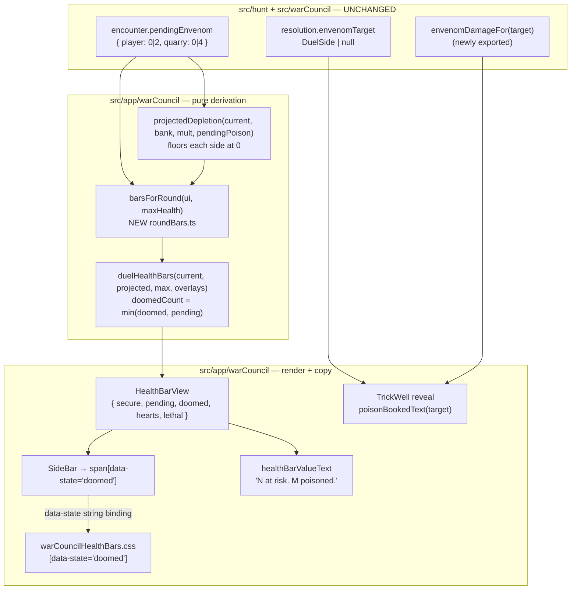

# Plan: Pending poison on the felt — at-risk hearts for a booked Envenom hit

Plan folder: `.claude/contract/DLR-101-pending-poison-on-the-felt/`
Execution status: see `tasks.md` in this folder.

---

## Part 1 — Alignment

### Task reference

Jira **DLR-101** — *"Pending poison is invisible on the felt — no at-risk hearts for a booked Envenom hit"*. Bug, priority High, labels `playable` / `ui`, under epic **DLR-87**.

Verbatim from the ticket:

> **Problem Statement.** Playing a poisoned card books a delayed hit that lands at the resolution of the next trick. Nothing on the felt shows that the hit exists, who owes it, or how much it is for. In a play session on Fight 2 the poisoned trick was lost cleanly, 4 damage was correctly booked against the Quarry, and the felt was indistinguishable from a trick where nothing happened at all — the Quarry's bar still read 14/14 and the player concluded the mechanic was broken.
>
> **Affected Product.** `src/app/warCouncil/` — the War Council round screen's health bars. `duelHealthBars.ts` — `projectedFromStreak` is the projection that feeds the at-risk hearts. It subtracts only `bank × multiplier` from the Quarry and hardcodes the player at current health. `encounter.pendingEnvenom` is never read by it. `WarCouncilRound.tsx:134` — the `duelHealthBars` call site. `warCouncilHealthBars.css` — the `data-state` attribute selectors, if a new heart state is added.
>
> **Expected Behaviour.** The Quarry's bar shows the 4 booked damage as pending — dimmed or otherwise distinguished hearts — from the moment the poisoned trick resolves until it lands. Symmetrically, poison booked against the player shows as pending on the player's bar. The reveal that resolved the poisoned trick names the hit and its target.
>
> **Actual Behaviour.** Both bars read exactly as they did before the poisoned trick. The only trace of the booked hit anywhere in the UI is the Apply Damage plate's refusal text […] which appears on a control the player was not reaching for, and which names neither the side that owes it nor the amount.
>
> **Dependencies & Risks.** Behaviour introduced by DLR-90 (Envenom) and made reachable by DLR-91 (Poison Guard) and DLR-94 (Apply Damage). No engine change is expected — `pendingEnvenom` already carries everything the readout needs. **Open design question for the developer:** whether pending poison reuses the existing `atRisk` heart state or gets its own. […] Decide at the mockup gate. A held Poison Guard is invisible for the same reason and is arguably the same fix; scoped out here unless the mockup pass covers both. `projectedFromStreak` has a documented `projected <= current` precondition that any new projection source must preserve.

Cited rule sources, not restated here: `.docs/game_rules/the-hunt.md:115` (the ruleset's own flag that pending poison has no surface); DLR-90's `pendingEnvenom` docblock at `src/hunt/types.ts:80-88`; `ENVENOM_QUARRY_DAMAGE = 4` / `ENVENOM_PLAYER_DAMAGE = 2` at `src/hunt/config.ts:266-267`.

**Run context (2026-08-23):** this plan is executed inside an unattended sprint run. The plan-approval and mockup-approval gates are overridden for that run and every default below is taken as pre-approved. Each such default is logged in `.claude/sprint-runs/2026-08-23-sprint/log.md` for batch developer review.

### Restated goal

A poisoned trick books a delayed hit that the engine already tracks on `encounter.pendingEnvenom`, but the felt renders nothing for it, so the player sees a trick that appears to have done nothing. This task makes that booked hit visible without touching the engine: the health-bar projection learns to subtract pending poison as well as the streak, the heart row grows a fifth state for hearts that are *committed to being lost* (as distinct from `atRisk`, which is conditional), both bars' accessible text names the poisoned figure separately from the at-risk one, and the trick reveal that books the hit says who owes it and how much. No rule changes; no new state; every figure is derived from committed reducer state.

### In scope

- A fifth `HeartState` value, `doomed` (`'doomed'`), for standing hearts that pending poison has already claimed.
- Extending the health-bar projection so it subtracts pending poison from **both** sides, not just `bank × multiplier` from the Quarry — replacing `projectedFromStreak` with `projectedDepletion`, which takes the pending-poison record as a fourth argument.
- Extending `duelHealthBars` with a `doomed` overlay, clamped against the pending band so overkill still leaves no trace, and a `doomed: Damage` field on `HealthBarView`.
- Bundling `duelHealthBars`'s two same-typed damage-record arguments (`breaking`, `doomed`) into one `HealthBarOverlays` options object, so they cannot be transposed.
- A new pure module `src/app/warCouncil/roundBars.ts` holding the round screen's bar assembly, so `WarCouncilRound.tsx` (399 lines) does not cross its 400-line budget.
- CSS for `[data-state='doomed']` in `warCouncilHealthBars.css`, including its reduced-motion behaviour.
- `healthBarValueText` naming the poisoned figure separately from the at-risk figure.
- The trick reveal in `TrickWell.tsx` naming a booked hit and its target when `resolution.envenomTarget` is non-null, with the amount read from the engine rather than restated.
- Exporting `envenomDamageFor` from `src/hunt` so the copy layer reads the figure from its single owner.
- Unit tests for the projection, the heart derivation, the accessible text, and component tests for the rendered `doomed` hearts and the reveal clause.

### Explicitly out of scope

- **Any engine change.** `pendingEnvenom`, `queueEnvenom`, `applyDamage`, `resolveTrickBank` and `incomingFrom` are all correct and stay untouched. `roundReducer.poison.test.ts` (8/8) must still pass unchanged.
- **Surfacing a held Poison Guard.** The ticket scopes it out unless the mockup covers both; this mockup covers the health bars and the reveal only.
- **The Apply Damage refusal copy.** The ticket names it as the current sole trace but does not ask for it to change, and the new bar readout is the fix for the seam it exposed.
- **Retuning `ENVENOM_QUARRY_DAMAGE` / `ENVENOM_PLAYER_DAMAGE`,** or any other configured figure.
- **New art or a new heart glyph.** A `doomed` heart is the existing whole-heart `<symbol>` under a different colour/opacity treatment.
- **Poison as a bar-length animation** or any new motion vocabulary beyond a resting treatment plus the existing reduced-motion suppression.

### Pattern Reference

Authoritative from the brief:

- `src/app/warCouncil/duelHealthBars.ts` — `projectedFromStreak`, `duelHealthBars`, `HeartState`, `HealthBarView`, `NO_BREAKING`.
- `src/app/warCouncil/WarCouncilRound.tsx:134` (now `:153`) — the `duelHealthBars` call site.
- `src/app/warCouncil/warCouncilHealthBars.css` — the `data-state` attribute selectors.

Chosen by this plan, following the nearest existing equivalents:

- `src/warCouncil/bank.ts:56-70` (`TrickFacts`) — the house precedent for replacing several same-typed positional arguments with one options object, and its stated reason ("a transposed pair … type-checks cleanly and produces plausible numbers"). `HealthBarOverlays` follows it.
- `src/app/warCouncil/quarryAdvance.ts`, `commitHandlers.ts`, `discardHandlers.ts` — the house precedent for splitting a self-contained block out of an over-budget file in `src/app/warCouncil/`. `roundBars.ts` follows it.
- `src/app/warCouncil/roundHint.ts` — the house precedent for a pure, directly-testable derivation extracted from `WarCouncilRound.tsx`.
- `src/app/warCouncil/labels.ts` — the single owner of felt copy; every new player-facing string goes here.
- `.claude/skills/react-frontend/SKILL.md` and `.claude/skills/game-ux/SKILL.md` for conventions.

### Constraints flagged on the brief

- **`projected <= current` must hold for both sides.** `duelHealthBars` performs no clamping by design (`applyDamage` is DLR-70's single clamp point), so the new projection source must floor itself, exactly as `projectedFromStreak` floors the Quarry at zero.
- **No engine change.** The readout is derived; nothing new is stored.
- **String-bound names.** `HeartState`'s *values* are written into the DOM as `data-state` and matched by attribute selectors in `warCouncilHealthBars.css`. Adding `'doomed'` means the map and the stylesheet are the only two places that string may be written, and they must be changed in the same task.
- **AC5's "overkill leaves no trace"** — surplus damage is discarded by the heart row's own length, not by a second clamp.
- **400-line file budget** (`react-frontend`). `WarCouncilRound.tsx` is at 399 today, measured with `(Get-Content <path>).Count` per `.claude/workflow/web-project.md`, which supersedes `CLAUDE.md`'s `Measure-Object -Line` form.
- **Accessibility** — the `role="meter"` text must stay at least as true as the picture; a bar showing committed poison whose text says only "at risk" is worse than no picture.
- **Reduced motion** — every state must read at rest, with animation off.

### Assumptions made

- **Pending poison gets its OWN heart state (`doomed`), not a reuse of `atRisk`.** This is the ticket's named open design question, and this run's default. Reason: on the Quarry's bar the streak's conditional hearts and the committed poison hearts can be on screen **simultaneously and stack**, so folding both into one `pending` figure makes them indistinguishable exactly when the distinction matters most — and it makes the meter's spoken text ("N at risk") say something false about damage nothing can stop. The alternative (reuse `atRisk`) is cheaper by one enum value and one CSS block; it is rejected because the cost is a readout that lies. *Flagged for developer review — see Risks.*
- **`doomed` hearts sit INNERMOST, between the at-risk band and the already-broken hearts.** Reason: poison lands first (at the resolution of the next trick) and is unconditional, so it is nearer the depleting edge than the conditional streak preview. The alternative ordering (at-risk innermost) would make the certain loss look further away than the speculative one.
- **The `doomed` colour reuses the existing `--wc-poison: #8fb04e` token** rather than introducing a new colour value. Reason: choosing a colour value is a developer decision, and reusing the token the poison mark already uses ties the heart to the marker that caused it with no new tuning number invented. A new `--wc-hp-doomed-*` token is declared as an *alias* of `--wc-poison`, so the developer can retune the heart without disturbing the card mark.
- **`doomed` hearts do NOT flash.** `atRisk` flashes because it is conditional and volatile; a committed hit is static. Its resting treatment is solid poison-green at a fixed opacity, which is already reduced-motion-correct with no suppression rule needed.
- **`HealthBarView.pending` keeps its meaning as the TOTAL pending band** (at-risk + doomed), and the new `doomed` field is the subset. Reason: `pending` already drives `lethal`, and lethal must count committed poison. Callers wanting the at-risk-only figure derive `pending - doomed`. The alternative (redefining `pending` to exclude poison and adding a third field) would change the meaning of a field existing tests already assert on.
- **The bar assembly moves to a new pure module `roundBars.ts`** rather than growing `WarCouncilRound.tsx`. Reason: that file is at 399 of its 400-line budget and the change adds lines; and the assembly is a pure function of committed state, so it belongs where it can be tested without a renderer. This mirrors three existing splits out of the same file.
- **`projectedFromStreak` is RENAMED to `projectedDepletion`** rather than gaining a defaulted fourth argument. Reason: a function named "from streak" that also subtracts poison is a name that lies, and two projection functions is exactly the drift the codebase's single-statement discipline exists to prevent. All 11 name hits change in one task.
- **The reveal clause reads the figure from `envenomDamageFor`,** newly exported from `src/hunt`, rather than the copy layer choosing between the two constants. Reason: `encounter.ts`'s own docblock says the amount is stated once beside the booking because "a caller that had to choose the figure itself is a caller that can choose the wrong one".
- **All new player-facing strings are PLACEHOLDER copy**, consistent with every other string in `labels.ts` and `TrickWell.tsx`. Wording is the developer's. *Flagged for developer review.*
- **No new dependency.** Everything is existing React, existing CSS, existing engine exports.

### Config and persisted-shape audit

- **`projectedFromStreak`** — `Select-String`-equivalent recursive grep over `src/`: **11 hits across 4 files** — `duelHealthBars.ts` (definition line 60, plus 1 docblock mention at line 99), `WarCouncilRound.tsx` (import line 27, docblock line 141, call line 155), `__tests__/duelHealthBars.test.ts` (import line 3, describe line 100, calls at 105/109/113/117/118/124), `__tests__/DuelHealthBars.test.tsx` (import line 5, call line 105). Every hit is accounted for in Task 1 and Task 4. Renaming to `projectedDepletion` — zero pre-existing hits for the new name, confirming it is genuinely new rather than shadowing something.
- **`duelHealthBars(` call sites** — **4 live call sites**: `WarCouncilRound.tsx:153`, `App.tsx:236`, `__tests__/duelHealthBars.test.ts` (5 calls), `__tests__/DuelHealthBars.test.tsx:31`. Only those passing a 4th argument change shape (`WarCouncilRound.tsx` via `roundBars.ts`, `duelHealthBars.test.ts:16`, `DuelHealthBars.test.tsx:31`); `App.tsx:236` passes three arguments and compiles unchanged.
- **`HeartState` values are string-bound and outside the type checker's view.** The four current values (`whole` / `atRisk` / `breaking` / `broken`) are written into the DOM as `data-state` by `DuelHealthBars.tsx:88` and matched by four attribute selectors in `warCouncilHealthBars.css` plus two more in its `prefers-reduced-motion` block — **6 selector hits**. Adding `'doomed'` adds exactly one new selector; no existing value is renamed, so no existing selector can go stale. The map in `duelHealthBars.ts` and that stylesheet remain the only two places any of the five strings is written.
- **`HealthBarView` consumers** — **3**: `DuelHealthBars.tsx` (`SideBar`), `RoundStatusBand.tsx` (threads the array through unread), `labels.ts` (`healthBarValueText`). Adding a required `doomed: Damage` field is an additive change: no consumer destructures exhaustively, so only `labels.ts` — which is being changed anyway — needs to read it. Every construction site is inside `duelHealthBars` itself, so nothing outside it can build an incomplete view.
- **Nothing is persisted.** This project writes no save file, no `localStorage` entry, and no stored log — grep for `localStorage` / `sessionStorage` / `indexedDB` across `src/` returns **0 hits**. There is therefore no stored shape to migrate and no replay to invalidate. Recording that the window is still open here is the point: DLR-106 (next in this sprint) is the ticket that closes it, and `HealthBarView` is a *derived* view rather than stored state, so it should never enter a save file even after DLR-106 lands.
- **No configuration key is added, renamed, retyped, or removed.** `ENVENOM_QUARRY_DAMAGE` (4) and `ENVENOM_PLAYER_DAMAGE` (2) are read, never written. `envenomDamageFor` is promoted from module-private to exported — **1 existing internal caller** (`queueEnvenom`, `encounter.ts:139`), unaffected by the export.
- **CSS custom properties** — `--wc-poison` and `--wc-poison-edge` already exist at `warCouncil.css:39-40`; `--wc-hp-*` tokens at lines 52-61. The new `--wc-hp-doomed-fill` / `--wc-hp-doomed-opacity` are added to the same `:root` block, and nothing here redeclares `:root` in a second sheet.
- **Type change check** — no `number` → `string`, no array → object, no required → optional, no widened union forcing a `switch` to grow a case. `HeartState` gains a fifth member, and its only exhaustive read is `DuelHealthBars.tsx:89`'s `state === Broken || state === Breaking` boolean, which correctly treats a `doomed` heart as standing.
- **Architectural boundary** — `src/hunt/**` and `src/app/warCouncil/**`: the change adds an export to `src/hunt` (pure, no React, no DOM) and adds `roundBars.ts` under `src/app/` (allowed to import React-free helpers and the engine). No DOM global and no React import is introduced anywhere under `src/hunt/**` or `src/warCouncil/**`, so the ESLint override in `eslint.config.js` is not tripped.

---

## Part 2 — Technical design

### Approach

The engine is right and stays untouched; every figure this ticket renders already exists on `ui.encounter.pendingEnvenom`. The whole change is a **derivation** — the same discipline the streak preview already follows, which is why it resets itself correctly and needs no effect, no remembered previous health, and no new state.

The existing heart derivation walks one row of indices against two boundaries: `secure` (what survives) and `current` (what is standing). Pending poison introduces a third band *inside* the pending one, because it is committed rather than conditional. Rather than teach the component to compare two overlapping previews, the derivation grows one more boundary and stays a single pass:

```
i < secure                → whole      (survives everything on screen)
i < current - doomedCount → atRisk     (the streak would take these, if it cashes)
i < current               → doomed     (poison has already claimed these)
i < current + breaking    → breaking   (the trick on screen is taking these now)
otherwise                 → broken
```

`doomedCount` is `Math.min(doomed[side], pending)` — the clamp that keeps AC5's "overkill leaves no trace" one rule rather than two, and the only arithmetic added inside `duelHealthBars`. With `doomed` at zero every index resolves exactly as it does today, which is what makes this additive rather than a rewrite: `App.tsx:236` and every pre-existing assertion keep their meaning byte-for-byte.

Feeding it needs the projection to know about poison, and that is a **rename rather than an overload**. `projectedFromStreak` becomes `projectedDepletion(current, bank, multiplier, pendingPoison)`, subtracting `bank × multiplier` from the Quarry as before *and* each side's pending poison from both, flooring each at zero to uphold the documented `projected <= current` precondition. The road not taken was a defaulted fourth parameter keeping the old name: rejected because the name would then describe half of what the function does, and because a second sibling projection function is precisely the drift `duelHealthBars`'s own docblocks argue against. The other road not taken was clamping poison inside `duelHealthBars`: rejected because the projection is where the floor already lives and a second clamp point is how two floors disagree.

`duelHealthBars`'s fourth and fifth arguments would both be `Readonly<Record<DuelSide, Damage>>` — structurally identical, silently transposable, and producing plausible numbers when swapped. That is the exact hazard `bank.ts` introduced `TrickFacts` to remove, so the two collapse into one `HealthBarOverlays` options object with named optional fields. The cost is touching three existing call sites; the benefit is that a transposition becomes a compile error rather than a wrong picture.

The round screen's assembly then moves out of `WarCouncilRound.tsx` into a new pure module, `roundBars.ts`, exporting `barsForRound(ui, maxHealth)`. Two reasons, both binding: that component measures 399 lines against a hard 400-line budget and this change adds lines to it, and the assembly is a pure function of committed reducer state that currently can only be exercised through a renderer. `quarryAdvance.ts`, `commitHandlers.ts` and `discardHandlers.ts` are three existing splits out of the same file for the same reason, so this follows an established local pattern rather than inventing one.

The remaining two surfaces are copy. `healthBarValueText` must stop describing committed poison as "at risk" — it reads `pending - doomed` for the at-risk clause and adds a separate poisoned clause — because a meter whose text is less true than its picture is the failure mode that file's own docblock names. And `TrickWell`'s resolved-trick line gains a clause when `resolution.envenomTarget` is non-null, built by a new `poisonBookedText(target)` in `labels.ts`, which reads the amount from `envenomDamageFor` (promoted to a `src/hunt` export) rather than choosing between two constants at the call site. Both strings are placeholder copy in files that are entirely placeholder copy.

### Skills to invoke during execution

- `react-frontend` — owns everything under `src/`: the file-order convention, the 400-line budget that forces the `roundBars.ts` split, strict TypeScript, the accessible-role testing posture, and the "no hard-coded value that belongs in configuration" floor.
- `game-ux` — owns the game-screen layer: whether a heart row still reads at a glance with a fifth state on it, whether the reading survives with colour and motion removed, and whether the reveal line says what a decision actually needs.
- `implementation-doc-writer` — invoked at the end of `/fb-apply`, per `CLAUDE.md`: `.docs/implementation/war-council-ui/` and `.docs/game_rules/the-hunt.md:115` (which currently states that pending poison has no surface) both go stale on this change.

Shared rules: `.claude/rules/` was scanned via Glob and contains only `README.md` — **no rule files exist**, so none apply. Re-scan rather than assuming it stays empty.

Always read: `.claude/workflow/web-project.md`.

**Developer override:** none applied. This plan was produced inside the unattended sprint run of 2026-08-23, so the Step 1.5c `AskUserQuestion` skill-confirmation call was not presented and the proposed list stands unconfirmed.

### Diagram



### Data shapes

#### `src/app/warCouncil/duelHealthBars.ts`

```ts
/** Fifth member. VALUE is written into the DOM as `data-state` — this map and
 *  `warCouncilHealthBars.css`'s attribute selectors are the only two places it may be written. */
export const HeartState = {
  Whole: 'whole',
  AtRisk: 'atRisk',
  Doomed: 'doomed',
  Breaking: 'breaking',
  Broken: 'broken',
} as const
export type HeartState = (typeof HeartState)[keyof typeof HeartState]

export interface HealthBarView {
  readonly side: DuelSide
  readonly secure: Health
  /** The WHOLE pending band — at-risk plus doomed. Drives `lethal`. */
  readonly pending: Damage
  /** The committed subset of `pending`: booked poison, clamped to the band. At-risk alone is
   *  `pending - doomed`. */
  readonly doomed: Damage
  readonly current: Health
  readonly max: Health
  readonly hearts: readonly HeartState[]
  readonly lethal: boolean
}

/** The two damage records a bar can overlay. An options object rather than two same-typed
 *  positional arguments, for `TrickFacts`' reason: a transposition type-checks cleanly. */
export interface HealthBarOverlays {
  /** Damage of the event currently on screen, keyed by the side it depletes. */
  readonly breaking?: Readonly<Record<DuelSide, Damage>>
  /** Poison already booked against each side, keyed by the side that pays it —
   *  i.e. `encounter.pendingEnvenom`, passed through unchanged. */
  readonly doomed?: Readonly<Record<DuelSide, Damage>>
}

/** RENAMED from `projectedFromStreak`. Subtracts the streak's cash-out from the Quarry AND each
 *  side's booked poison from both, flooring each at 0 to uphold `projected <= current`. */
export function projectedDepletion(
  current: Readonly<Record<DuelSide, Health>>,
  bank: number,
  multiplier: number,
  pendingPoison: Readonly<Record<DuelSide, Damage>>,
): Readonly<Record<DuelSide, Health>>

/** Fourth parameter replaces the previous `breaking` positional argument. */
export function duelHealthBars(
  current: Readonly<Record<DuelSide, Health>>,
  projected: Readonly<Record<DuelSide, Health>>,
  max: Readonly<Record<DuelSide, Health>>,
  overlays?: HealthBarOverlays,
): readonly HealthBarView[]
```

`NO_BREAKING` is retained and unchanged; it becomes the default for `overlays.breaking`. `NO_PENDING_ENVENOM` (already exported from `src/hunt`) is the default for `overlays.doomed` — the honest single source, since the argument *is* `encounter.pendingEnvenom`.

#### `src/app/warCouncil/roundBars.ts` (new)

```ts
import type { HealthBarView } from './duelHealthBars'
import type { RoundUiState } from './roundUiState'
import type { DuelSide, Health } from '../../hunt'

/** The round screen's two bars, assembled from committed reducer state. Pure: no React, no DOM,
 *  no effect — every figure is a view of `ui`, which is why it resets itself when `ui` does. */
export function barsForRound(
  ui: RoundUiState,
  maxHealth: Readonly<Record<DuelSide, Health>>,
): readonly HealthBarView[]
```

#### `src/hunt/encounter.ts` + `src/hunt/index.ts`

```ts
// encounter.ts — `function envenomDamageFor` becomes `export function envenomDamageFor`.
// Signature unchanged:
export function envenomDamageFor(target: DuelSide): Damage

// index.ts — added to the existing ./encounter export block:
export { startEncounter, applyDamage, isEncounterResolved, NO_PENDING_ENVENOM,
         hasPendingEnvenom, queueEnvenom, envenomDamageFor } from './encounter'
```

#### `src/app/warCouncil/labels.ts`

```ts
/** The reveal's poison clause (DLR-101). Reads the figure from `envenomDamageFor` rather than
 *  choosing between the two constants here. PLACEHOLDER copy, as this file's rest is. */
export function poisonBookedText(target: DuelSide): string

/** Unchanged signature; the body now separates the committed figure from the conditional one. */
export function healthBarValueText(view: HealthBarView): string
```

Placeholder copy produced:

| Case | String |
|---|---|
| `poisonBookedText(Quarry)` | `Poison set — they take 4 at the next trick.` |
| `poisonBookedText(Player)` | `Poison set — you take 2 at the next trick.` |
| `healthBarValueText`, at-risk clause | ` ${pending - doomed} at risk.` (omitted when 0) |
| `healthBarValueText`, poison clause | ` ${doomed} poisoned.` (omitted when 0) |

#### `src/app/warCouncil/warCouncil.css` — new tokens

```css
/* Aliases of the existing poison mark colour, declared separately so the heart can be retuned
   without disturbing the card mark. No new colour VALUE is chosen here. */
--wc-hp-doomed-fill: var(--wc-poison);
--wc-hp-doomed-opacity: 0.78;
```

No `package.json`, `tsconfig.json`, `vite.config.ts`, or ESLint change. No new dependency.

### Runtime quality notes

- **Purity and adjudication.** Every figure is derived, and every derivation is a pure function in a `.ts` module testable without a renderer: `projectedDepletion` and `duelHealthBars` in `duelHealthBars.ts`, the assembly in the new `roundBars.ts`, the copy in `labels.ts`. `DuelHealthBars.tsx` continues to compute nothing — it renders whatever views it is handed, and `TrickWell.tsx` renders a string `labels.ts` built. No component decides a rule; no tunable is inlined — the two poison figures are read from `src/hunt/config.ts` through `envenomDamageFor`, and the one new opacity is a CSS custom property in the `:root` block where the other eight `--wc-hp-*` tokens live.
- **Effects, mount and teardown.** **No effect is added, and none is touched.** Nothing here subscribes, observes, times, schedules a frame, or captures a pointer, so there is no cleanup to write and no orphan to leak. Because the readout is a pure function of committed reducer state rather than a diff against remembered previous health, StrictMode's double invocation is a no-op: rendering twice produces the identical row. There is no module-level mutable state — `NO_BREAKING` and `NO_PENDING_ENVENOM` are deeply-`readonly` constants that are only ever spread from, never assigned into, so nothing survives HMR or leaks between tests in one file. A second mount re-derives from `ui` and lands in the same place.
- **Hot-path cost.** Nothing here runs per pointer event. `duelHealthBars` builds two arrays of `max` entries once per render — 10 and up to 18 glyphs at `QUARRY_ENCOUNTER_HEALTH`'s largest entry, i.e. 28 allocations of a short string — which is the cost the row already pays today; the change adds one `Math.min` and one subtraction per side, not per heart. No search, bounded or otherwise. **No memoisation is added**, and none is warranted: there is no profiling evidence of a problem, and `react-frontend` forbids speculative `useMemo`.
- **Determinism and numeric safety.** No `Math.random()` is reachable from anything here; the readout is a deterministic function of committed state, so the same `ui` always renders the same row. **No division is introduced** — `max` stopped being a divisor when the bar became discrete glyphs, so no `NaN` can enter a rendered value by that route. The existing `Number.isInteger(sideMax) && sideMax > 0` guard on `max` is retained unchanged and still throws a `RangeError` rather than silently producing a wrong-length row. `doomedCount` is `Math.min(doomed[side], pending)` where `pending = current - secure >= 0` by the upheld precondition, so the count is non-negative by construction and `Array.from`'s callback can never compare against `NaN`. No epsilon is needed: every figure is an integer count of hearts.
- **Error paths.** Nothing new can throw and nothing is caught, so there is no failure to swallow into a success shape and no `catch { return DEFAULTS }` anywhere in the diff. The one existing throw — `duelHealthBars`'s `RangeError` on a non-positive-integer `max` — is a guard against a caller bug, not a user-reachable path, and stays as it is. There is no async surface, so the four async states do not arise. A `doomed` value larger than the bar is not an error: AC5 says overkill leaves no trace, and the `Math.min` clamp plus the row's own fixed length is how it leaves none. `envenomTarget === null` is the ordinary case and simply omits the reveal clause rather than rendering an empty one.

### Risks and judgement calls

- **The ticket's named open question — its own heart state versus reusing `atRisk` — was decided in favour of a distinct `doomed` state.** The reasoning is in Assumptions; the counter-case is that a fifth state on a row of up to 18 small glyphs may be one distinction too many to read at a glance. **The developer should look at a real fight with both a live streak and a booked hit on the Quarry's bar and say whether five states still separate.** Reverting to a reuse is a small change (delete the enum member, delete the CSS block, drop `doomedCount` from the derivation) precisely because the derivation keeps `pending` as the total.
- **The `doomed` heart's visual treatment is a developer call.** The default is poison-green (`--wc-poison`) at `0.78` opacity, static, sitting between the flashing grey at-risk hearts and the broken ones. `0.78` is a placeholder chosen to sit clearly above `--wc-hp-atrisk-opacity: 0.55` and clearly below solid; **it is not a considered value and the developer owns it.** So is whether green-on-green reads adequately against `--wc-felt: #16241f`.
- **All new copy is placeholder.** `Poison set — they take 4 at the next trick.` and ` N poisoned.` are the developer's to reword, as every other string in `labels.ts` is.
- **`roundBars.ts` is a new module in a folder that already has 40 files.** The alternative was letting `WarCouncilRound.tsx` cross 400 lines, which is blocking. Worth a sanity check that the split lands where the three prior splits did.
- **Renaming `projectedFromStreak` touches a test file's describe block** and therefore shows up in the diff as more churn than the behaviour warrants. The alternative — a lying name — was judged worse.
- **`envenomDamageFor` moves from module-private to exported,** widening `src/hunt`'s public surface by one function. Judged correct because the copy layer genuinely needs the figure and the alternative is the copy layer re-deriving it, which `encounter.ts`'s own docblock warns against.
- **Whether the reveal clause is the right place for the announcement** — it appears on the held resolved trick, which the player dismisses by tapping. If they tap through fast they may miss it; the bar readout is the durable signal and the reveal is the transient one. **Only judgeable by playing.**
- **A held Poison Guard remains invisible.** Scoped out per the ticket, but the bar now shows poison booked against the player that a held Guard may cancel — so the two surfaces are now visibly related in a way they were not before. Worth a follow-up ticket if it reads as a contradiction in play.
- **No tuning value is invented by this plan.** The two poison damage figures are read from existing configuration; the only new number is the placeholder CSS opacity above, which is routed to the developer.
