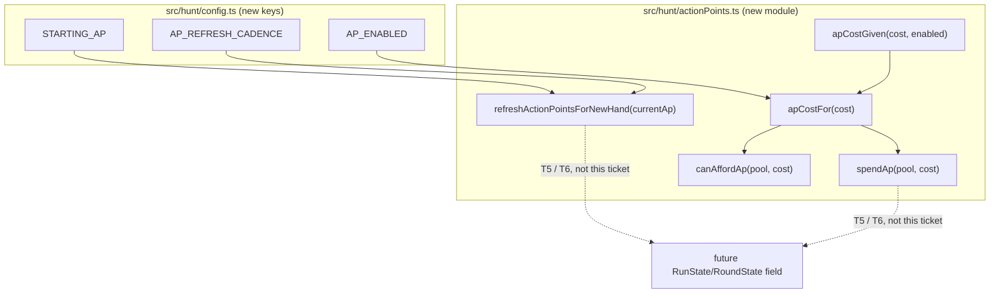

# Plan: Action Points — core resource, single-source-of-truth toggle

Plan folder: `.claude/contract/DLR-104-action-points-core-resource/`
Execution status: see `tasks.md` in this folder.

---

## Part 1 — Alignment

### Task reference

**DLR-104** (parent epic DLR-103, "Version 5 — Buff Loadout, Slot Draws, and Delayed Apply Damage"), fetched from Jira:

> Every buff activation and Apply Damage need to draw against a new resource, Action Points (AP), that doesn't exist in the engine today. The design doc explicitly asks that AP be "implemented so it can be switched off cleanly" from one place — mirroring how `applyDamageRefusalFor` is already the single statement of whether that control is live — so the whole system can be backed out of without hunting down every call site.
>
> **Acceptance Criteria**
> 1. A new module exposes the player's current AP, `STARTING_AP` (default `6`, named constant), and `AP_REFRESH_CADENCE` (enum, default `perHand`) governing when AP resets.
> 2. A single `AP_ENABLED` flag (or equivalent single source of truth) exists such that flipping it off makes every AP-gated action available at zero cost, without any consuming code needing its own bypass logic.
> 3. AP refreshes to `STARTING_AP`'s current pool size at the start of each hand when `AP_REFRESH_CADENCE === 'perHand'`, verified by a unit test.
> 4. No consumer exists yet (buff activation and Apply Damage costs land in later tickets) — this ticket ships the resource and its toggle only, unit-tested in isolation.
>
> **Scope Boundaries** — In scope: AP state shape, refresh logic, the enable/disable flag, unit tests. Out of scope: wiring AP costs to any action; AP-capacity shop purchase; any UI.
>
> **Dependencies & Risks** — No dependencies. Risk: choosing `perHand` refresh is the game-designer-recommended default per the doc's own framing in §1 ("each hand") — if a later playtest wants per-fight or per-run pooling, the enum shape here is what avoids a refactor; don't hardcode the cadence as a boolean.

Also recorded as **T1** in `.claude/contract/DLR-103-epic-breakdown/tasks.md`, which additionally states: Skill `react-frontend (engine layer under src/hunt/)`, Label `engine`, blocks T5 (buff activation) and T6 (delayed Apply Damage).

### Restated goal

Ship one small, pure, unit-tested `src/hunt/` module that gives the game an Action Points resource: a starting pool size, a per-hand refresh rule, and cost/spend primitives that already respect a single `AP_ENABLED` toggle — so that when T5 (buff activation) and T6 (Apply Damage) later spend AP, they call this module's functions rather than writing their own enabled/disabled branch. No `RunState` field is added and nothing consumes the module yet; it ships standalone, proven correct in isolation.

### In scope

- An `ActionPoints` numeric type alongside `Health` / `Damage` / `Coins` in `src/hunt/types.ts`.
- Configuration in `src/hunt/config.ts`: `STARTING_AP` (default `6`), an `ApRefreshCadence` enum-shaped constant with `AP_REFRESH_CADENCE` defaulting to `PerHand`, and `AP_ENABLED` (default `true`).
- A new `src/hunt/actionPoints.ts` module: a refresh function for the per-hand reset, and cost/afford/spend primitives that route every cost through the `AP_ENABLED` toggle in one place.
- Unit tests covering the refresh rule and the toggle's zero-cost behaviour in isolation, with no consumer wired up.
- Barrel re-exports from `src/hunt/index.ts` so a later ticket can import AP the same way it imports `CheatCard` or `FlaskStock` today.

### Explicitly out of scope

- Wiring AP costs into buff activation (T5) or Apply Damage (T6).
- Any `RunState` or `RoundState` field carrying a live AP pool — no consumer exists yet, so there is nothing for a field to hold.
- AP-capacity shop purchase (T12).
- Any UI surface (T10, T13) — this ticket has no `.tsx` file and no rendered element.
- Deciding whether `AP_ENABLED` ships `true` or `false` by default in the *shipped* game — flagged as a developer decision below; this plan defaults it `true` so the module is exercisable, and the developer can flip it before any consumer lands.

### Pattern Reference

- **`src/warCouncil/voluntaryCashOut.ts`'s `applyDamageRefusalFor`** — the ticket's own docblock names this as the single-source-of-truth shape to mirror: one function every consumer calls instead of re-deriving the rule. `apCostFor` in this plan is the AP-toggle equivalent.
- **`src/hunt/cheats.ts`** — the closest existing "small owned resource, no UI, pure functions, throws a `RangeError` on an invalid spend rather than clamping" module. `grantCheats`/`addCheat`/`removeCheat`/`hasCheat`'s shape (import config constants, operate on plain values, throw on misuse, no module-level mutable state) is followed directly for `actionPoints.ts`.
- **`src/hunt/config.ts`'s `TelegraphFidelity`** — the existing `as const` object + derived type pattern for a small enum-shaped constant (`erasableSyntaxOnly` is on in `tsconfig.app.json`, so a real TypeScript `enum` is unavailable — every existing enum-shaped value in this codebase already uses this form).
- **`.claude/contract/DLR-103-epic-breakdown/tasks.md`, T1** — the epic breakdown's own decomposition of this ticket, cited above in Task reference.

### Constraints flagged on the brief

- AC2's "without any consuming code needing its own bypass logic" is load-bearing: the design must not let a future consumer check `AP_ENABLED` itself, or the ticket's stated purpose (one flag, one place) is not actually met even though nothing currently reads it.
- AC3 requires a unit test of the per-hand refresh rule specifically, not just of the starting value.
- AC4 is a hard scope fence — no `RunState` change, no consumer, in this ticket.
- The epic breakdown's Dependencies & Risks: the cadence must be an enum-shaped value, not a boolean, so a later per-fight/per-run cadence is a new constant-map entry rather than a type change.

### Assumptions made

- **AP is not stored on `RunState` yet — confirmed by AC4.** The module exposes pure functions operating on a plain `ActionPoints` value (`refreshActionPointsForNewHand(currentAp)`, `spendAp(pool, cost)`) rather than a stateful object, mirroring `cheats.ts`: `RunState` doesn't hold Cheat *logic*, it holds a `CheatCard[]` field that a later ticket's transitions mutate through `cheats.ts`'s functions. The equivalent AP field on `RunState` (or `RoundState`) is T5/T6's to add, once there is something to spend AP on.
- **`AP_ENABLED` defaults to `true`.** The brief doesn't state a default; the design doc's own framing treats AP as the intended live economy, and defaulting `true` means the module is exercisable in its own tests without a hidden always-off branch. Flagged as a developer decision below — trivially a one-line flip either way.
- **`STARTING_AP = 6` is a placeholder value, not a considered balance choice** — there is no consumer yet to balance it against, exactly as the epic breakdown flags for `RUN_STARTING_CHEATS`-style placeholders elsewhere in this epic. Routed to Risks below, not silently decided.
- **The toggle is exposed as two functions, not one** — `apCostGiven(cost, enabled)` (a pure function taking the flag as a parameter) and `apCostFor(cost)` (a thin wrapper reading `AP_ENABLED` from config). This is necessary for AC3-style unit-testability: `config.ts`'s `AP_ENABLED` is a real exported `const`, not a mutable test seam, so the only way to unit-test both the enabled and disabled branches of the toggle logic is to expose the branch-taking function separately from the wrapper that reads the live constant. `canAffordAp` and `spendAp` both route through `apCostFor`, so a consumer never needs to touch `apCostGiven` directly — it exists for test coverage of the branch, not as a second API surface.
- **`ApRefreshCadence` ships with exactly one member, `PerHand`**, not pre-populated with `perFight`/`perRun` placeholders. The risk note asks that the *shape* (a string-keyed constant, not a boolean) survive a future cadence without a refactor — it does not ask for unused future members today, which would be exactly the kind of speculative addition `CLAUDE.md` rules out. `refreshActionPointsForNewHand` passes `currentAp` through unchanged for any cadence other than `PerHand`, so adding a second member later is a config edit plus a new `if` branch, not a type change.
- **No `RunState`/`RoundState`/UI file is touched.** Confirmed scope-narrowing per AC4 and the ticket's Out of scope line — this plan touches only `src/hunt/types.ts`, `src/hunt/config.ts`, a new `src/hunt/actionPoints.ts`, `src/hunt/index.ts`, and their tests.

### Config and persisted-shape audit

- **New key names checked for existing use, zero hits confirmed.** `Grep -i "actionPoint|ActionPoint|\bAP\b"` across `src/` returned no matches before this plan — `AP_ENABLED`, `STARTING_AP`, `ApRefreshCadence`, `AP_REFRESH_CADENCE`, `ActionPoints`, `apCostFor`, `apCostGiven`, `canAffordAp`, `spendAp`, and `refreshActionPointsForNewHand` are all new names with no existing reader to update.
- **Nothing is renamed or retyped** — every name introduced here is additive. No existing `config.ts` key, `types.ts` type, or barrel export changes shape.
- **Nothing is persisted.** A grep-confirmed absence of `localStorage` anywhere in `src/` (per DLR-103 epic breakdown T3's own problem statement) means there is no save-format concern for this ticket; T3 (cross-run persistent storage) is a separate, unblocked-by-this ticket that will decide what crosses a save boundary, and AP is explicitly not part of it.
- **No consumer to enumerate** — AC4 states no consumer exists yet, so there is no "every consumer of a changed export" list to audit; this ticket only *adds* exports, it does not change one an existing caller depends on.
- **No architectural boundary is crossed.** `src/hunt/**` is lint-enforced pure/DOM-free (`.claude/workflow/web-project.md` → Architectural boundaries). `actionPoints.ts` imports only from `./config` and `./types`, both already inside the pure boundary — no React import, no DOM global.

---

## Part 2 — Technical design

### Approach

The module is deliberately shaped like `src/hunt/cheats.ts` rather than like a stateful class or a module-level singleton: `src/hunt/` is lint-enforced to have no module-level mutable state survive HMR (`CLAUDE.md` Code conventions; `.claude/workflow/web-project.md` Correctness traps), and every existing owned-resource module in this codebase (`cheats.ts`, `flask.ts`) already follows the "plain value in, plain value out, `RangeError` on misuse" shape rather than holding its own state. `actionPoints.ts` follows the same discipline: it exports pure functions over an `ActionPoints = number` value, and the *storage* of "the player's current AP" is left to whichever later ticket (T5/T6) adds a field to `RunState` or `RoundState` and calls these functions from its own reducer — exactly how `cheats.ts` doesn't hold `RunState.cheats` itself, `run.ts` does.

The single-source-of-truth requirement (AC2) is solved the same way `applyDamageRefusalFor` in `src/warCouncil/voluntaryCashOut.ts` solves "is Apply Damage available": one function that every future caller goes through, so the *rule* (not just the *flag*) lives in one place. Concretely, `apCostFor(cost)` reads `AP_ENABLED` and returns either `cost` or `0`; `canAffordAp` and `spendAp` both call `apCostFor` internally rather than re-checking the flag, so a future T5/T6 that wants "is this affordable" or "spend it" never needs its own `if (AP_ENABLED) …` branch — precisely the bypass logic AC2 rules out. Because `AP_ENABLED` is a real `const` export (not a mutable seam a test can flip), the toggle's branch logic is additionally exposed as `apCostGiven(cost, enabled)` — a pure function taking the flag as an explicit parameter — purely so both branches are directly unit-testable (AC2's "flipping it off" is a real assertion, not an assumption about the live constant's current value) without ever giving a real consumer a second way to reach the same decision.

The refresh rule (AC3) is a single function, `refreshActionPointsForNewHand(currentAp)`, called by whichever future code decides a hand has started. It reads `AP_REFRESH_CADENCE` from config and, for the only cadence that exists today (`PerHand`), returns `STARTING_AP`; for any other cadence value it passes `currentAp` through unchanged. That `else` branch is presently dead (only one cadence member exists), but it is what makes the *shape* survive a later cadence without a refactor, per the ticket's own risk note — adding `PerFight` later is one new constant-map entry and one new `if`, not a type change from boolean to enum.

All of this is pure TypeScript with no React import and no DOM access, so every behaviour is unit-tested directly — function in, value out — with no renderer and no `RunState` fixture required, matching AC4's "unit-tested in isolation."

### Skills to invoke during execution

- `react-frontend` — owns everything under `src/`, specifically: the pure-core `src/hunt/` conventions (no module-level mutable state, no React/DOM import), the `as const` enum-shaped-constant pattern required because `erasableSyntaxOnly` rules out a real `enum`, the constants-belong-in-configuration rule this plan's `STARTING_AP`/`AP_ENABLED`/`AP_REFRESH_CADENCE` follow, and the Vitest testing posture (pure logic tested without a renderer). This is the only skill this ticket's diff touches — no UI, no game-ux surface, no Jira-only work.
- Also read: `.claude/workflow/web-project.md` (paths, runner commands, the pure-core boundary, the `Measure-Object -Line` undercount trap). `.claude/rules/` was scanned (Glob `.claude/rules/*.md`) — only `README.md` exists, and its own index confirms the folder is intentionally empty; no rule file to read.
- No developer override recorded — the single-skill classification was stated directly to the developer rather than gated through `AskUserQuestion` (a one-option question has no decision in it, per this session's tooling constraint), and confirmed by proceeding.

### Diagram



### Data shapes

#### `src/hunt/types.ts` (add)

```ts
/** DLR-104 AC1 — the resource buff activation (T5) and Apply Damage (T6) will draw against.
 *  A whole number, never fractional or negative in practice — spendAp in actionPoints.ts
 *  refuses rather than going below zero, exactly as Coins already does for coins. */
export type ActionPoints = number
```

#### `src/hunt/config.ts` (add)

```ts
// DLR-104 AC1 — a single flag such that flipping it off makes every AP-gated action free,
// with no consuming code writing its own bypass (see actionPoints.ts's apCostFor).
// DEVELOPER DECISION: defaults true so the module is exercisable in its own tests; flip to
// false at any time before a consumer lands with no other code change required.
// UNIT: on/off.
export const AP_ENABLED = true

// DLR-104 AC1 — the player's opening AP pool, and what a perHand refresh resets to.
// DEVELOPER-CHOSEN PLACEHOLDER pending the first playtest — no consumer exists yet (AC4), so
// this number has never been played against.
// UNIT: action points.
export const STARTING_AP: ActionPoints = 6

// DLR-104 AC1 — when the AP pool resets. An ENUM-SHAPED CONSTANT, not a boolean: the
// ticket's own risk note is explicit that a boolean here is what forces a refactor the day a
// playtest wants per-fight or per-run pooling instead of per-hand. `erasableSyntaxOnly` rules
// out a real TypeScript `enum` (tsconfig.app.json) — this is the same `as const` shape
// TelegraphFidelity above already uses.
export const ApRefreshCadence = {
  PerHand: 'perHand',
} as const
export type ApRefreshCadence = (typeof ApRefreshCadence)[keyof typeof ApRefreshCadence]

// §1's "each hand" framing / the game-designer consult's recommended default, per the epic
// breakdown's T1.
export const AP_REFRESH_CADENCE: ApRefreshCadence = ApRefreshCadence.PerHand
```

`config.ts`'s existing `import { QuarryCharacter, type Health, type Damage, type Coins } from './types'` gains `type ActionPoints`.

#### `src/hunt/actionPoints.ts` (new file)

```ts
import { AP_ENABLED, AP_REFRESH_CADENCE, ApRefreshCadence, STARTING_AP } from './config'
import type { ActionPoints } from './types'

export function apCostGiven(cost: ActionPoints, enabled: boolean): ActionPoints

export function apCostFor(cost: ActionPoints): ActionPoints

export function canAffordAp(pool: ActionPoints, cost: ActionPoints): boolean

export function spendAp(pool: ActionPoints, cost: ActionPoints): ActionPoints // throws RangeError if pool < apCostFor(cost)

export function refreshActionPointsForNewHand(currentAp: ActionPoints): ActionPoints
```

#### `src/hunt/index.ts` (barrel, add)

```ts
export type { ActionPoints } from './types' // added to the existing types export line

export { AP_ENABLED, AP_REFRESH_CADENCE, ApRefreshCadence, STARTING_AP } from './config' // added to the existing config export block

export {
  apCostGiven,
  apCostFor,
  canAffordAp,
  spendAp,
  refreshActionPointsForNewHand,
} from './actionPoints'
```

No `package.json` script or dependency change. No `RunState`, `RoundState`, reducer action, or component prop changes — none exist for this ticket per AC4.

### Runtime quality notes

- **Purity and adjudication:** Every function in `actionPoints.ts` is pure — value in, value out, no `RunState`/`RoundState` read, no DOM. The single tunable that governs behaviour (`AP_ENABLED`) is read in exactly one place (`apCostFor`); every other function that needs the toggle's effect goes through `apCostFor` rather than reading `AP_ENABLED` a second time. `STARTING_AP` and `AP_REFRESH_CADENCE` are read only inside `refreshActionPointsForNewHand`.
- **Effects, mount and teardown:** None apply — no component, no hook, no effect, no listener, no timer. This ticket ships zero `.tsx` files.
- **Hot-path cost:** None apply — no pointer event, no per-frame work, no rendering. Every function is O(1) arithmetic on two numbers.
- **Determinism and numeric safety:** No `Math.random()` anywhere in this module (nor anywhere in `src/hunt/`, which is lint-enforced deterministic). `spendAp` guards its own divisor-free arithmetic by throwing before an insufficient spend can produce a negative pool — there is no division in this module, so no `NaN` path exists to guard. `STARTING_AP` and every cost this ticket's tests exercise are finite integers; a future consumer passing a non-integer or negative `cost` into `apCostFor`/`spendAp` is out of this ticket's scope to guard, since AC4 means no real caller exists yet to misuse it — flagged as a note for T5/T6 rather than a defect here.
- **Error paths:** `spendAp` throws a `RangeError` when `pool` cannot cover the (toggle-adjusted) cost, exactly mirroring `cheats.ts`'s `removeCheat` throwing on a double-spend rather than silently clamping to zero — a caller attempting to commit an unaffordable action is a bug to surface loudly, not a state to paper over. `refreshActionPointsForNewHand`, `apCostGiven`, `apCostFor`, and `canAffordAp` cannot fail — every input is a plain number and every output is a plain number or boolean, so there is no async surface and no loading/success/error/empty split to design for.

### Risks and judgement calls

- **`STARTING_AP = 6` is an unplayed placeholder**, exactly like every other "developer decides" tunable in this epic's breakdown (e.g. `RUN_STARTING_CHEATS`). Nobody has spent AP against a real cost yet (T5/T6 haven't landed), so this number carries no balance information — it exists so the module's own tests have something concrete to assert against. **Developer decision**: keep `6`, or pick a different placeholder, before or after `/fb-apply` — either way it should be revisited once T5's `BUFF_ACTIVATION_COST` table exists to test it against.
- **`AP_ENABLED` defaults to `true`.** This is a genuine judgement call (see Assumptions made) rather than a value stated in the brief. If the developer would rather ship it `true`-but-effectively-inert (no consumer yet, so the default has zero visible effect either way) or wants it `false` until T5/T6 land, that's a one-line flip in `config.ts` — flagged here so it's a conscious choice, not a default nobody looked at.
- **Two functions for the toggle (`apCostGiven` + `apCostFor`) rather than one.** This is a structural choice made to keep AC2's "flipping it off" independently unit-testable against a real `const` export. An alternative — testing only `apCostFor` against the live `AP_ENABLED` value — would leave the disabled-branch behaviour untested by default (since `AP_ENABLED` defaults `true`), which reads as under-verifying the exact acceptance criterion the ticket names. Flagging in case the developer would rather the toggle live differently (e.g. as a parameter threaded through every function) once a real consumer's shape is known.
- **No `RunState`/`RoundState` field is added in this ticket.** This is the most consequential scope call in the plan, though it's a direct reading of AC4 rather than an invented narrowing — flagged so the developer can correct it before `/fb-apply` if T5/T6's actual needs turn out to want the field seeded here instead of there.
- **Nothing here needs to be judged by running the app** — this ticket produces no UI and wires to no consumer, so there is no functional or feel question QA or the developer needs to check by playing.
