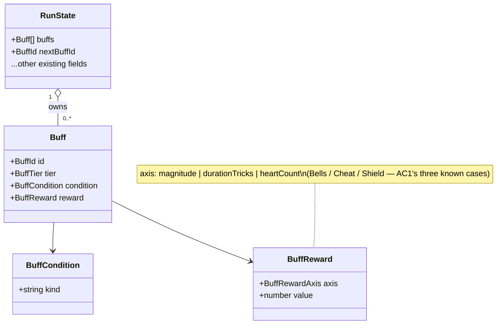
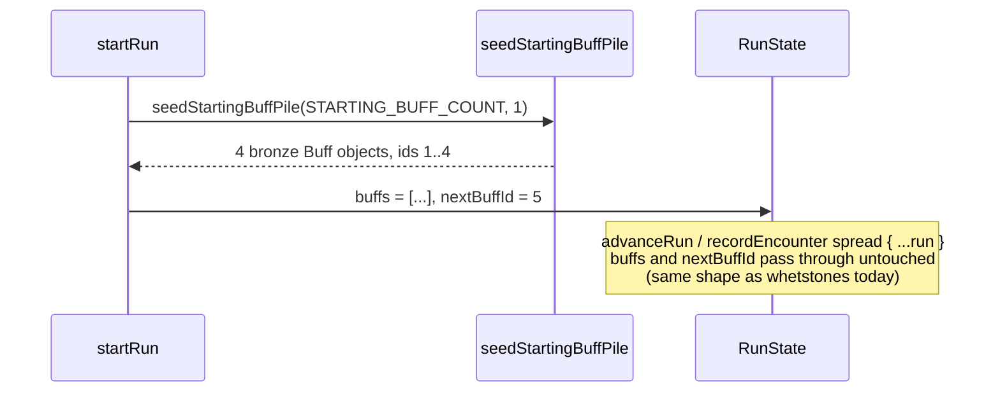

# Plan: Buff pile — data model, tiers, and per-run ownership

Plan folder: `.claude/contract/DLR-105-buff-pile-data-model/`
Execution status: see `tasks.md` in this folder.

---

## Part 1 — Alignment

### Task reference

**DLR-105** — "Buff pile: data model, tiers, and per-run ownership", child of epic **DLR-103**
("Version 5 — Buff Loadout, Slot Draws, and Delayed Apply Damage").

> ## Problem Statement
> Nothing in the engine today represents a "buff" as a first-class, owned, tiered object. Cheat
> and Timebomb, Shield, and the slot-machine-drawn templated cards all need to plug into one
> shared shape: a buff has an identity, a tier (bronze/silver/gold), a condition, and a reward —
> and the player owns a growing pile of them across a run, the same way Cheats and health persist
> today.
>
> ## User Story
> As the developer, I want one buff data model and one owned-pile structure, so that Cheat,
> Timebomb, Shield, and every templated card are interchangeable objects the rest of the system
> can activate, draw, and persist identically.
>
> ## Acceptance Criteria
> 1. A `Buff` type exists with fields for identity, tier (`bronze` / `silver` / `gold`), a
>    condition descriptor, and a reward descriptor — general enough that a tier can scale a
>    different axis per card (magnitude for the Bells example, duration for Cheat, a heart count
>    for Shield), per §3 of the design doc.
> 2. The player's owned buff pile persists across fights within a run, the same way
>    `RUN_STARTING_CHEATS`-style state does today, verified by a unit test carrying a buff across
>    two encounters.
> 3. `STARTING_BUFF_COUNT` (default `4`, all bronze) seeds a fresh run's pile, per the
>    game-designer consult's recommendation and §8 of the design doc.
> 4. No activation, no UI, and no slot-machine draw logic yet — this ticket ships the type and the
>    owned-pile persistence only.
>
> ## Scope Boundaries
> **In scope:** `Buff` type, owned-pile state and persistence, starting-pile seeding.
> **Out of scope:** Cheat/Timebomb migration, activation/AP costs, slot machine.
>
> ## Dependencies & Risks
> None. Risk: getting the tier-axis generalization wrong here (e.g. hardcoding "tier =
> magnitude") would force a rework later, since Cheat and Shield each use a different axis —
> review the type against all three known axes (magnitude, duration, heart-count) before marking
> this done.

Part of epic breakdown: `.claude/contract/DLR-103-epic-breakdown/tasks.md` (T2), which additionally
scopes this ticket as blocking T4 (Cheat/Timebomb migration), T7 (Shield redesign), and T8
(slot-machine draw) — none of which this ticket implements.

Design doc: `.docs/design/Balatro-Forbidden-Solitaire/version-5-developer-idea.md` §3 ("Buffs are
drawn from a slot machine" — the tier/axis rules) and §8 ("The Vault" — the starting-pile figure
and its rationale).

### Restated goal

Add one shared `Buff` data type and an owned, per-run "buff pile" to the Hunt engine — mirroring
how `CheatCard` and `RUN_STARTING_CHEATS` already work — so that later tickets (Cheat/Timebomb
migration, Shield, the slot machine) have one object shape to draw, activate, and persist against
instead of three bespoke ones. This ticket ships only the type, the pile's persistence across
fight boundaries within a run, and a starting seed of 4 bronze buffs. It ships no activation logic,
no UI, and no real buff catalog — those are later tickets' jobs.

### In scope

- A `Buff` type: identity, tier (`bronze`/`silver`/`gold`), a condition descriptor, and a reward
  descriptor whose *axis* varies per card (magnitude, duration, heart-count are the three known
  cases).
- `RunState` gains an owned buff pile (`buffs`) and a monotonic id minter (`nextBuffId`), carried
  through `advanceRun` and `recordEncounter` exactly as `whetstones` already is.
- `STARTING_BUFF_COUNT` (config key, value `4`) and a seeding function that grants that many
  bronze buffs at `startRun`.
- Unit tests: the type shape, the starting seed (count + tier), and persistence across two fight
  boundaries (`advanceRun`, `recordEncounter`).

### Explicitly out of scope

- Cheat/Timebomb migration into the buff pile (DLR-103 T4).
- Buff activation, AP costs, or the pre-hand loadout bar (T5, T10).
- The slot-machine draw and its templated card pool (T8).
- Shield's redesign onto the buff pile (T7).
- Any real buff catalog content — §5 of the design doc is explicitly marked "TO BE REVIEWED, not
  committed," and authoring the v1 card list is its own ticket (T7a). The 4 starting buffs this
  ticket seeds are placeholder content (see Assumptions below).
- Any UI surface — the pile has no renderer in this ticket.

### Pattern Reference

- `src/hunt/cheats.ts` + `src/hunt/config.ts`'s `RUN_STARTING_CHEATS`/`CHEAT_SLOT_COUNT` — the
  closest existing precedent for "an owned, identity-bearing card type, minted from a monotonic
  run-scoped counter, seeded at `startRun`." `Buff` follows the same shape: a small `readonly`
  interface, a pure minting function, no activation logic in this ticket (`cheats.ts` has none for
  minting either — `addCheat`/`removeCheat` are DLR-84's).
- `src/hunt/actionPoints.ts` (DLR-104) — the most recent module in this tree; confirms the current
  house style for a comment-heavy, single-purpose pure module in `src/hunt/`.
- `src/hunt/run.ts`'s `whetstones: number` field and its own docblock — the precedent for "a
  run-permanent value carried through `advanceRun`'s and `recordEncounter`'s spread with no
  explicit parameter," which is the persistence shape this ticket's `buffs` field needs (see
  Approach).
- `src/hunt/index.ts` — the barrel every new public export must be added to.

### Constraints flagged on the brief

- **No `src/warCouncil/`-style bespoke mechanic** — the whole point of this ticket is one shared
  shape that later tickets fold Cheat/Timebomb/Shield into, so nothing here may special-case a
  particular buff kind.
- **Tier-axis generalization is the acceptance criterion the ticket itself calls out as the risk**
  (AC1's own "review the type against all three known axes... before marking this done"). The
  `Buff.reward` shape must not hardcode "tier scales a numeric magnitude" — Cheat scales duration
  and Shield scales a heart count, per §3.
- **`src/hunt/**` is lint-enforced pure** (`.claude/workflow/web-project.md` → Architectural
  boundaries) — no React import, no DOM global. `buffs.ts` must be a plain TypeScript module, like
  every other file in this tree.
- **No activation, no UI, no slot-machine draw** (AC4) — a task that starts wiring any of those in
  is out of scope for this ticket, even if it looks like an easy next step.

### Assumptions made

- **The 4 starting buffs seeded by this ticket carry placeholder, inert content.** The design doc
  is explicit that the real card catalog (§5) is "TO BE REVIEWED, not committed" and that
  authoring it is a separate, design-only ticket (DLR-103 T7a, blocking T8). Since AC4 rules out
  any activation logic reading a buff's condition/reward in this ticket, the seeded buffs' actual
  `condition`/`reward` values have no observable effect yet — only their `tier` (`bronze`) and
  `count` (`4`) are asserted by the acceptance criteria. This plan seeds them with an explicit
  `unassigned` condition kind and a zero-value `magnitude` reward, so a later ticket importing real
  catalog content replaces obviously-placeholder data rather than silently reinterpreting numbers
  that look real. *Rationale: matches AC4's own scope line ("no activation... yet — this ticket
  ships the type and the owned-pile persistence only") and avoids inventing catalog content this
  ticket has no authority to commit.*
- **`Buff.reward` is a single descriptor (one `axis` + one numeric `value`), not a list.** §3's
  worked examples (Bells: +1/+3/+5 damage; Cheat: 1/2/3 tricks; Shield: 1/2/3 hearts) are each a
  single scaling axis per card. §5's "two reward templates stacked on one tier" is flagged there as
  itself an open question ("whether tiers should stack *two* reward templates... is itself an open
  question") — not something this foundational ticket should pre-decide. A single descriptor is the
  simplest shape that satisfies AC1 and does not foreclose a later widening to a list. *Rationale:
  don't design past what AC1 asks for; §5's own text defers the multi-reward question.*
- **`BuffCondition` is a data-only descriptor (`{ kind: string }`), not an evaluator.** AC4 rules
  out activation logic in this ticket, so nothing needs to *evaluate* a condition yet — only carry
  one. A `kind: string` (rather than a closed union) is deliberate: §5's condition-template table
  lists a dozen-plus candidate kinds still under review, and closing the union here would force
  this ticket to commit to a catalog it explicitly doesn't own. *Rationale: keeps this ticket's
  surface area to "identity + tier + a place to hang a condition/reward," matching AC4's own scope
  line.*
- **`Buff.reward.axis` is a closed three-value union (`magnitude` / `durationTricks` /
  `heartCount`)**, not an open string. Unlike the condition kind, the axis set is exactly what AC1
  and the ticket's own risk note name as the thing to get right now — "review the type against all
  three known axes... before marking this done" — so it is deliberately closed to force that
  review, and a fourth axis is a type-level decision for whichever later ticket needs it, not a
  silent string anyone can pass. *Rationale: directly answers AC1's stated risk.*
- **The buff pile has no capacity cap in this ticket**, unlike `CHEAT_SLOT_COUNT`. Nothing in DLR-105,
  §3, or §8 states a cap — §8 calls it "a growing pool," and the closest existing precedent for an
  uncapped run-owned resource is `whetstones: number` (a count with "no cap; the price is the
  limiter"), not `cheats` (which is capped and DLR-83 defends the cap explicitly). *Rationale: no
  cap is stated anywhere in scope for this ticket; inventing one would be an unstated tuning
  decision.*
- **Persistence in AC2 means "carried across fight boundaries within one run" (in-memory
  `RunState`), not "survives a browser reload."** `RUN_STARTING_CHEATS`-style state — the pattern
  AC2 names explicitly — is exactly this: `cheats`, `coins`, `whetstones` etc. are all documented
  "NEVER persisted" (`run.ts`'s own docblocks) and reset on `startRun`. Cross-run persistence is
  DLR-103 T3's job (a separate, not-yet-built `localStorage` wrapper — confirmed zero
  `localStorage` usage anywhere in `src/` today). *Rationale: matches AC2's own worked example
  precisely, and cross-run persistence has its own ticket already scoped for it.*
- **No `BUFF_POOL_CAP`-style config key is added.** Following directly from the no-cap assumption
  above — there is nothing to name a limit for.

### Config and persisted-shape audit

- **New config key `STARTING_BUFF_COUNT`**: grepped `src\**\*.ts`, `src\**\*.tsx` recursively —
  zero hits. New key, not a rename; nothing to migrate.
- **New type names (`Buff`, `BuffId`, `BuffTier`, `BuffCondition`, `BuffReward`, `BuffRewardAxis`,
  `nextBuffId`)**: grepped recursively — zero hits on all. Confirmed new, not colliding with an
  existing name (`Buff` is not a substring of any other export in `src/hunt/`).
  Nothing renamed or removed, so there are no existing readers to enumerate or break.
- **Persisted-shape check**: grepped `src` recursively for `localStorage` — zero hits anywhere in
  the codebase. Nothing is persisted across browser sessions yet (confirms the Assumptions section
  above and DLR-103 T3's own problem statement, "a grep of the codebase found no `localStorage`
  usage anywhere"). This ticket adds an in-memory `RunState` field only; there is no stored shape
  to migrate or version.
- **Type-loss check**: N/A — every field this ticket adds is new (`Buff`, `buffs`, `nextBuffId`,
  `STARTING_BUFF_COUNT`); nothing existing changes type.
- **Boundary check**: `src/hunt/**` is the enforced pure-core boundary
  (`eslint.config.js`'s `no-restricted-imports`/`no-restricted-globals` override, confirmed in
  `.claude/workflow/web-project.md`). `buffs.ts` imports only from `./config` and re-exports plain
  types/functions — no React import, no DOM global — so the design does not cross the boundary.

---

## Part 2 — Technical design

### Approach

This ticket adds one new pure module, `src/hunt/buffs.ts`, following the shape `src/hunt/cheats.ts`
already established for `CheatCard`: a small `readonly` data interface plus a pure minting
function, no mutation, no activation logic, no side effects. `Buff` carries four fields — `id`
(`BuffId`, a plain `number`, minted the same way `CheatCardId` is: from a monotonic counter carried
on `RunState`, never `Math.random()`, matching `cheats.ts`'s own stated reason that `src/hunt/`
must stay deterministic), `tier` (`BuffTier`, the `bronze`/`silver`/`gold` `as const` object-map
already used for `TelegraphFidelity` and `ApRefreshCadence` in `config.ts` — `erasableSyntaxOnly`
rules out a real `enum`), `condition` (a `BuffCondition` descriptor, `{ kind: string }` — data
only, no evaluator, since AC4 defers activation), and `reward` (a `BuffReward` descriptor with a
closed `axis` union — `magnitude` / `durationTricks` / `heartCount`, the three axes AC1 names by
name — plus a numeric `value`). This directly answers AC1's stated risk: a reward's *axis* is
data, not something baked into the shape as "damage," so Cheat's duration-tiered reward and
Shield's heart-count-tiered reward are exactly as representable as the Bells magnitude example,
with no branch or subtype needed per axis.

`RunState` (in `src/hunt/run.ts`) gains two fields — `buffs: readonly Buff[]` and
`nextBuffId: BuffId` — following the `whetstones: number` precedent rather than the `cheats`
precedent: `whetstones` is carried through `advanceRun`'s and `recordEncounter`'s object spread
with **no explicit parameter**, because nothing in this ticket spends or replaces a buff mid-hand
(there is no activation yet). `cheats`, by contrast, IS an explicit parameter to `recordEncounter`
because a hand can spend one and must hand the survivor back — that plumbing belongs to whichever
later ticket (T5) actually lets a hand touch the buff pile. Concretely, `buffs` and `nextBuffId`
need **no change to `runTransitions.ts`** at all: `{ ...run, ... }` in both `advanceRun` and
`recordEncounter` carries any field neither function explicitly overrides, exactly as it already
does for `whetstones`. This is the simplest shape that satisfies AC2 without touching a module this
ticket has no reason to change.

`startRun` seeds the pile via `seedStartingBuffPile(STARTING_BUFF_COUNT, 1)` — a new pure function
in `buffs.ts`, directly mirroring `grantCheats`'s shape (`count`, `firstId`) but with no upper-bound
throw, since (per the Assumptions section) the buff pile has no stated capacity to violate. It
mints `count` buffs, all `BuffTier.Bronze`, each carrying the placeholder
`condition`/`reward` described above, with consecutive ids starting at `firstId`. `nextBuffId` is
seeded to `STARTING_BUFF_COUNT + 1`, exactly mirroring `nextCheatId`'s own seeding in `startRun`.

`STARTING_BUFF_COUNT` is added to `config.ts` beside `RUN_STARTING_CHEATS`, as a plain named
constant (not gated behind a second `*_ENABLED` toggle — nothing in the brief or the design doc
asks for one, unlike AP's explicit "build note" asking for a kill switch).

### Skills to invoke during execution

- `react-frontend` — covers every file this ticket touches: a new pure module and a config key,
  both under `src/hunt/`, plus its unit tests under `src/hunt/__tests__/`. This is the sole skill
  Step 1.5's classification matched (Pure logic + Config and tunables, both squarely inside
  `react-frontend`'s scope); per that step's own instruction, the single-option confirmation call
  was skipped rather than asking a question with no real choice in it, and this note records that
  skip so the execution session understands why.

Also read, per Step 1: `.claude/workflow/web-project.md` (runner commands, the `src/hunt/**` purity
boundary, correctness traps). `.claude/rules/` was scanned and is empty — no rule file applies.

### Diagram





### Data shapes

#### `src/hunt/buffs.ts` (new file)

```ts
export const BuffTier = {
  Bronze: 'bronze',
  Silver: 'silver',
  Gold: 'gold',
} as const
export type BuffTier = (typeof BuffTier)[keyof typeof BuffTier]

/** Minted from `RunState.nextBuffId`, never from `Math.random()` — `src/hunt/` is
 *  lint-enforced DOM-free and must stay deterministic, exactly as `CheatCardId` already is. */
export type BuffId = number

/** AC1's three known reward axes — the tier-scaled quantity varies PER CARD, not a fixed
 *  "damage" field. Closed union deliberately: this is exactly what AC1's own risk note asks
 *  to be reviewed before this ticket is marked done. A fourth axis is a type change for
 *  whichever later ticket needs it. */
export const BuffRewardAxis = {
  Magnitude: 'magnitude',
  DurationTricks: 'durationTricks',
  HeartCount: 'heartCount',
} as const
export type BuffRewardAxis = (typeof BuffRewardAxis)[keyof typeof BuffRewardAxis]

/** A data-only descriptor — no evaluator. AC4 defers activation logic to a later ticket;
 *  `kind` is an open string because the real condition catalog (design doc §5) is explicitly
 *  "TO BE REVIEWED, not committed." */
export interface BuffCondition {
  readonly kind: string
}

/** The tier-scaled payoff. `axis` names WHICH quantity this buff's tier scales (magnitude,
 *  duration, or heart count); `value` is this buff's current tier's figure on that axis. */
export interface BuffReward {
  readonly axis: BuffRewardAxis
  readonly value: number
}

/** One owned buff. Carries no evaluation logic — condition matching and reward application are
 *  a later ticket's job (T5). */
export interface Buff {
  readonly id: BuffId
  readonly tier: BuffTier
  readonly condition: BuffCondition
  readonly reward: BuffReward
}

/**
 * The starting pile's placeholder content — every seeded buff shares this inert condition and
 * a zero-value reward, since the real catalog (design doc §5) is not yet authored (DLR-103 T7a)
 * and AC4 rules out anything reading these values yet. Exported so the seeding test can assert
 * against it without duplicating the literal.
 */
export const UNASSIGNED_BUFF_CONDITION: BuffCondition = { kind: 'unassigned' }
export const UNASSIGNED_BUFF_REWARD: BuffReward = { axis: BuffRewardAxis.Magnitude, value: 0 }

/**
 * AC3 — the run's opening pile: `count` bronze buffs, all placeholder content, with
 * consecutive ids starting at `firstId`. Mirrors `grantCheats`'s `(count, firstId)` shape but
 * carries no upper-bound throw: unlike `CHEAT_SLOT_COUNT`, no capacity cap is stated anywhere in
 * this ticket's scope for the buff pile (see plan.md's Assumptions).
 */
export function seedStartingBuffPile(count: number, firstId: BuffId): readonly Buff[]
```

#### `src/hunt/config.ts` (modified)

```ts
// New key, added beside RUN_STARTING_CHEATS. TRANSCRIBED from the ticket's AC3 and the design
// doc §8 ("a fresh run starts with 4 buff cards already in the player's pile... all four arrive
// at bronze") — not chosen here.
// UNIT: buffs granted once, at the start of a run, all at BuffTier.Bronze.
export const STARTING_BUFF_COUNT = 4
```

#### `src/hunt/run.ts` (modified — `RunState` interface)

```ts
export interface RunState {
  // ...existing fields unchanged...

  /** DLR-105 AC2/AC3 — the player's owned buff pile, seeded at `startRun` and carried through
   *  every `advanceRun`/`recordEncounter` spread untouched — no explicit parameter, mirroring
   *  `whetstones` rather than `cheats`, because no consumer in this ticket spends or replaces a
   *  buff mid-hand (that is T5's job). NEVER persisted across runs, exactly as `coins` is not. */
  readonly buffs: readonly Buff[]
  /** The next id to mint — monotonic, never reused, mirroring `nextCheatId`. */
  readonly nextBuffId: BuffId
}
```

`startRun` (same file) adds:

```ts
buffs: seedStartingBuffPile(STARTING_BUFF_COUNT, 1),
nextBuffId: STARTING_BUFF_COUNT + 1,
```

#### `src/hunt/index.ts` (modified — barrel exports)

```ts
export type { Buff, BuffId, BuffCondition, BuffReward } from './buffs'
export {
  BuffTier,
  BuffRewardAxis,
  UNASSIGNED_BUFF_CONDITION,
  UNASSIGNED_BUFF_REWARD,
  seedStartingBuffPile,
} from './buffs'
```

Plus `STARTING_BUFF_COUNT` added to the existing `export { ... } from './config'` block.

No other file's exported shape, type, or signature changes. No `package.json` script or dependency
change.

### Runtime quality notes

- **Purity and adjudication:** `buffs.ts` is a plain, DOM-free TypeScript module — no React
  import, no `window`/`document`/`localStorage` global — matching every existing file in
  `src/hunt/`. `seedStartingBuffPile` is a pure function: same inputs, same output, no mutation of
  its arguments. `STARTING_BUFF_COUNT` is read from configuration, not inlined at its call site.
- **Effects, mount and teardown:** N/A — no component, no hook, no effect in this ticket. Nothing
  is mounted, subscribed, or torn down.
- **Hot-path cost:** N/A — `seedStartingBuffPile` runs once, at `startRun`, allocating exactly
  `count` (4) small objects. No per-trick or per-pointer-event cost; nothing here sits in a
  high-frequency path.
- **Determinism and numeric safety:** Ids are minted from `firstId + i` (an integer counter),
  never `Math.random()`, matching `grantCheats`'s existing pattern — required for `src/hunt/`'s
  determinism guarantee. No division anywhere in this ticket's code, so no `NaN` path exists to
  guard.
- **Error paths:** `seedStartingBuffPile` has no invalid-input case to refuse in this ticket's
  scope — `STARTING_BUFF_COUNT` is a fixed, developer-set constant (`4`), not a value a caller
  passes untrusted, so there is no untrusted boundary to validate at. (Contrast `grantCheats`,
  which refuses an out-of-range count because a *slot cap* exists to violate; the buff pile has no
  such cap per this ticket's Assumptions, so there is nothing analogous to refuse.) No async
  surface is added — nothing here has loading/success/error/empty states to enumerate.

### Risks and judgement calls

- **Placeholder condition/reward content for the 4 starting buffs.** Flagged in Assumptions above
  — this plan seeds obviously-inert data (`kind: 'unassigned'`, `value: 0`) rather than guessing at
  real catalog content, since the actual card list is explicitly deferred to DLR-103 T7a. If the
  developer would rather this ticket leave `condition`/`reward` genuinely blank in some other way
  (e.g. a `null`-able field), that's a shape change worth red-lining now rather than after `Buff`
  has consumers.
- **No capacity cap on the buff pile.** Judgement call, not a transcribed rule — nothing in DLR-105,
  §3, or §8 states one, and the closest precedent (`whetstones`) is also uncapped. If a cap turns
  out to be wanted later, adding one is a config key plus a throw in whatever function first lets
  the pile grow past `seedStartingBuffPile` (a T5/T8 concern), not a change to this ticket's shape.
- **`BuffCondition.kind` left as an open `string` rather than a closed union.** Judgement call: the
  condition catalog (§5) is explicitly not committed, so closing the union now would mean
  guessing at names this ticket has no authority to fix. A later ticket authoring the real catalog
  (T7a/T8) is free to narrow this to a union without changing `Buff`'s own shape.
- **`BuffReward` models one axis, not a list.** Judgement call, defended in Assumptions above —
  §5 itself flags multi-reward stacking as an open question. Worth a second look once T5 (buff
  activation) or T8 (the slot machine) actually needs to represent a stacked-reward card.
- **`STARTING_BUFF_COUNT`'s value (`4`) is transcribed, not open** — both the ticket's AC3 and
  design doc §8 state it explicitly ("a fresh run starts with 4 buff cards"), so this is not a
  tuning value routed to the developer; it is a settled figure from the brief.
- **Nothing here can be judged by running the app** — this ticket adds no UI and no player-visible
  surface. `npm run typecheck`, `npm run lint`, and the Vitest specs this plan adds are the whole
  verification surface; there is no `Developer decides or observes` behavioural item beyond the one
  content-shape question above.
