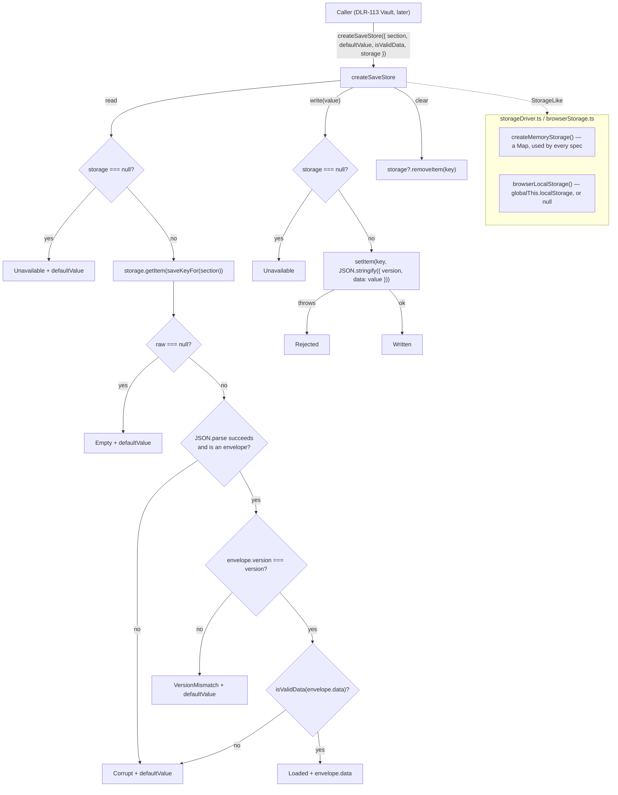

# Plan: Cross-run persistent storage layer

Plan folder: `.claude/contract/DLR-106-cross-run-persistent-storage-layer/`
Execution status: see `tasks.md` in this folder.

---

## Part 1 — Alignment

### Task reference

Jira **DLR-106** — "Cross-run persistent storage layer". Task under epic **DLR-103** ("Version 5 — Buff Loadout, Slot Draws, and Delayed Apply Damage"), label `engine`. Verbatim from the ticket:

> **Problem Statement** — Nothing in `src/` persists anything across runs today — a grep of the codebase found no `localStorage` usage anywhere. The Vault (§8 of the design doc) needs currency and purchases to survive a run ending in death, which is a genuinely new capability, not an extension of an existing one.
>
> **User Story** — As the developer, I want a small, isolated persistence module, so that Vault currency and purchases survive a browser refresh and a new run, without every future consumer inventing its own storage logic.
>
> **Acceptance Criteria**
> 1. A module wraps `localStorage` (or an equivalent already-available browser API) behind a typed read/write interface scoped to this game's save key namespace.
> 2. Reading with no prior save returns a defined empty/default state rather than throwing.
> 3. A round-trip unit test (write, simulate reload by re-reading) passes.
> 4. No Vault-specific fields yet — this ticket ships the generic persistence capability only.
>
> **Scope Boundaries** — In scope: the storage wrapper, its typed interface, unit tests. Out of scope: Vault currency schema and spends; any other use of persistence.
>
> **Dependencies & Risks** — None. Risk: this is new architecture with no precedent in the codebase — keep the interface minimal (get/set/clear) so the Vault ticket defines the actual schema rather than this ticket guessing it.
>
> Part of epic breakdown: `.claude/contract/DLR-103-epic-breakdown/tasks.md` (T3).

The design source the ticket cites is `.docs/design/Balatro-Forbidden-Solitaire/version-5-developer-idea.md` **§8 — The Vault**, lines 576–606. §8 is read here only to confirm *that* something must persist; its currency, exchange rate and purchase shapes are explicitly "still fully open" there and are DLR-113's, not this ticket's.

Additional instruction carried on the brief (2026-08-23): evaluate whether `.claude/rules/save-data-versioning.md` is warranted and, if it is, write it as part of this ticket rather than reporting it as a finding. `.claude/rules/README.md` names `save-data-versioning.md` as its own worked example of a candidate first rule.

### Restated goal

Add one new top-level source module, `src/persistence/`, that gives the rest of the codebase a single typed way to store a small blob of JSON under this game's own key namespace and read it back on a later page load. It knows nothing about the Vault, coins, buffs or any other game concept — a caller names a section, supplies a default value and a type guard, and gets back a `read` / `write` / `clear` triple that never throws and always reports *why* a read did not produce stored data. Every stored payload is wrapped in a versioned envelope from day one so that DLR-113, which will define the first real schema, inherits a migration seam instead of having to retrofit one. Because the whole capability is new architecture with no precedent here, the ticket also writes the project's first shared rule, `.claude/rules/save-data-versioning.md`, so the next four tickets that persist something are constrained rather than improvising.

### In scope

- A new module `src/persistence/` containing: a storage-driver abstraction, a versioned save store built on it, its constants, and a barrel export mirroring `src/hunt/index.ts`.
- A `StorageLike` interface (`getItem` / `setItem` / `removeItem`) plus two implementations: a browser adapter that resolves `globalThis.localStorage` defensively, and an in-memory implementation.
- A typed `createSaveStore` factory exposing exactly `read()`, `write(value)`, `clear()`, scoped to a namespaced key and wrapping the payload in a `{ version, data }` envelope.
- Named outcome codes for both read and write, so a failed read is never indistinguishable from an empty one and never surfaces as a thrown error.
- Unit tests under `src/persistence/__tests__/`, including the AC3 round trip (write, re-create the store against the same backing storage to simulate a reload, read back the identical value).
- `.claude/rules/save-data-versioning.md` — the project's first shared rule — plus its entry in `.claude/rules/README.md`'s index.
- The layout block in `.claude/workflow/web-project.md` updated to name the new module, since that file owns "where code lives".

### Explicitly out of scope

- Any Vault field, currency, exchange rate, price, or purchase — §8 leaves all of these open and DLR-113 owns them.
- Any actual *use* of the store. Nothing in `src/app/`, `src/hunt/` or `src/warCouncil/` reads or writes a save on this ticket; the module ships with tests as its only consumer.
- A React hook (`useSaveStore` or similar). No component needs one yet, and writing one before there is a caller guesses at the subscription shape.
- Autosave, save slots, multiple profiles, export/import, or cloud sync.
- Actual migration logic. The envelope carries a version and the store *rejects* a mismatched one by name; writing an upgrade path with exactly one version in existence would be fiction.
- Encryption, obfuscation, or tamper resistance. This is a single-player prototype.
- Changing `src/hunt/run.ts`'s "NEVER persisted" docblocks. They describe within-run state and remain accurate.
- Correcting `CLAUDE.md`'s stale "four modules / 53 source files" project-state paragraph — already stale before this change (`web-project.md` says five), and recounting it is a separate cleanup.

### Pattern Reference

The brief supplied no code reference beyond "keep the interface minimal (get/set/clear)". References chosen here:

- **`src/hunt/` module shape** — `config.ts` for named constants, a barrel `index.ts` re-exporting types then values, one concern per file, heavy explanatory docblocks. `src/persistence/` mirrors this.
- **`src/hunt/shop.ts:11-18` and `:33-38`** — the `as const` object-map-plus-type idiom used in place of `enum`, because `erasableSyntaxOnly` is on in `tsconfig.app.json`. Every named outcome set in this plan uses that idiom.
- **`src/hunt/shop.ts`'s `PurchaseRefusal` / `refusalFor`** — the house pattern for "this operation did not happen, and here is the named reason". `SaveReadOutcome` / `SaveWriteOutcome` follow it.
- **`src/hunt/actionPoints.ts:36-42`** — the precedent that a caller bug throws rather than silently clamping. This plan deliberately diverges for *storage* failures (which are environmental, not caller bugs) and says so under Approach.
- `.claude/skills/react-frontend/SKILL.md` — MUST/NEVER contract, in particular "never swallow an error into a success shape".
- `.claude/workflow/web-project.md` — layout, runners, and the correctness traps on string-bound names.

### Constraints flagged on the brief

- **AC4 is a hard scope fence:** no Vault-specific field may appear. The module must be generic over its payload type.
- **AC2:** a read with no prior save returns a defined default, not a throw.
- **"Keep the interface minimal (get/set/clear)"** — the ticket's own risk note. The exported operation set is exactly three.
- **Two runtime dependencies (`react`, `react-dom`) is deliberate.** This ticket adds none; `JSON` and `localStorage` are platform APIs.
- **`erasableSyntaxOnly`** forbids `enum` and `namespace`.
- **Files over 400 lines are blocking.** Every file planned here is well under 200.
- **The pure-core ESLint boundary** in `eslint.config.js` bans `localStorage` inside `src/warCouncil/**` and `src/hunt/**`. The persistence module therefore cannot live in `src/hunt/`.

### Assumptions made

- **The module lives at `src/persistence/`, a new top-level sibling of `app/`, `hunt/`, `warCouncil/`, `styles/`.** It cannot go in `src/hunt/` — `eslint.config.js:28-30` explicitly restricts the `localStorage` global there — and it is not UI, so it is not `src/app/`. A top-level module matches how `hunt/` and `warCouncil/` are already separated by concern. `persistence` is a real domain word, not one of the banned dumping-ground names (`misc`, `helpers`, `temp`).
- **Storage is injected, not reached for.** `createSaveStore` takes a `StorageLike`; only `browserStorage.ts` ever names `globalThis.localStorage`. This is forced, not stylistic: `vite.config.ts` runs every `*.test.ts` under the **node** project, where `localStorage` does not exist, so a module that reaches for the global directly could not be unit-tested at all without moving its spec to `.test.tsx` and dragging in jsdom. Injection also keeps the store itself pure and gives the Vault ticket a seam for a test double.
- **The save key namespace is `strings-and-stations`, joined to a section name with `:` — e.g. `strings-and-stations:vault`.** The repository, not the working title of the game, because the game's name has changed once already this project and a stored key that renames orphans every existing save. The separator is `:`, the near-universal `localStorage` convention and one that cannot collide with a section name made of identifier characters.
- **The schema version lives *inside* the stored envelope, not in the key.** `{ version, data }`. Version-in-key would leave an unbounded litter of orphaned keys across upgrades with nothing able to find them; version-in-envelope means a reader always finds the one record and can decide what to do about it.
- **`SAVE_SCHEMA_VERSION` starts at `1`, and it is a schema identity, not a tuning value.** No developer decision is being pre-empted: there is exactly one correct value for the first version of a schema.
- **A read that finds unusable data returns the default value *and* a named non-`Loaded` outcome, rather than throwing.** AC2 requires no-throw for the empty case; extending that to unreadable/corrupt/mismatched cases is the only way a caller can keep running when a browser blocks storage. The named outcome is what stops this from being the `catch { return DEFAULTS }` the `react-frontend` skill forbids — the failure is reported, in-band, by name.
- **`createSaveStore` requires an `isValidData` type guard from its caller.** Parsed JSON is `unknown`, and the alternative is an unchecked cast to `T` — which would let a hand-edited or half-written `localStorage` value flow into game state typed as valid. Making the guard mandatory costs the Vault ticket about six lines and removes the only place an `any`/assertion would otherwise be needed.
- **`write` returns a named outcome rather than throwing or returning `void`.** `setItem` genuinely throws in the wild (quota exceeded, Safari private browsing), and a save that silently did not happen is the worst failure this module could have.
- **`clear()` removes only this store's own key**, not the whole namespace and not `localStorage.clear()` — wiping keys a store does not own is not something a "clear" call should be able to do by accident.
- **The in-memory implementation ships in `src/`, not in a test folder.** It is the substrate of every unit test in the module, and `src/persistence/__tests__/` files cannot be imported by a future sibling module's tests.
- **The new module is *not* added to the pure-core ESLint override.** One file in it must legitimately touch `localStorage`; a lint rule banning that would be a rule the module exists to violate. The boundary is held instead by keeping that access to a single file and grepping for it in Final verification.
- **`.claude/rules/save-data-versioning.md` is warranted and is written on this ticket.** The README's stated bar is "project data or constraints that more than one workflow could touch"; the epic queues DLR-113 (Vault), DLR-118 (Vault end-of-run screen) and DLR-123 (persistent deck) behind this module, so the rule is load-bearing for at least three future tickets, not speculative.
- **No React hook is written.** No component consumes the store on this ticket, and the subscription shape depends on how the Vault screen reads it.
- **`web-project.md`'s layout block is updated but `CLAUDE.md`'s is not** — `web-project.md` is the named owner of "where code lives"; `CLAUDE.md`'s copy of the same fact is a pre-existing drift, out of scope here.

### Config and persisted-shape audit

- **`localStorage` / `sessionStorage` / `indexedDB` across `src/`: 0 hits** (`grep -rn "localStorage\|sessionStorage\|indexedDB" src/`). The ticket's own claim is confirmed against the live tree — there is no existing storage code to integrate with, no existing key to collide with, and no prior art to match.
- **Nothing is persisted today, so there is no stored data to migrate and no compatibility window to protect.** Recording that explicitly is the point of this bullet: this ticket is the moment the window opens. Every save this module writes from now on carries `version: 1`, so a later change *will* have a compatibility problem and will be able to detect it. That is exactly what `.claude/rules/save-data-versioning.md` exists to constrain.
- **`persist` as a word appears 11 times in `src/`** (`grep -rni "persist\|saveData\|storageKey" src/`), and every one is prose, not code: 8 are `src/hunt/run.ts` docblocks saying a field is "NEVER persisted" across runs, 2 are `src/hunt/shop.ts` / `src/app/run/ShopCategoryTabs.tsx` describing the shop's "persistence-length" ladder (`ShopCategory.OneTimeUse` → `GamePermanent`). **`ShopCategory.GamePermanent` is a naming near-collision worth flagging** — it means "lasts beyond one run" as a *design* rung and has no storage implementation behind it. Nothing in this ticket touches it. Zero of the 11 hits is an identifier this plan renames.
- **No existing configuration key is renamed, retyped, or removed.** Every name introduced here is new: `SAVE_NAMESPACE`, `SAVE_SCHEMA_VERSION`, `SAVE_KEY_SEPARATOR`, `StorageLike`, `SaveEnvelope`, `SaveReadOutcome`, `SaveWriteOutcome`, `SaveReadResult`, `SaveStore`, `createSaveStore`, `saveKeyFor`, `createMemoryStorage`, `browserLocalStorage`. Each was grepped against `src/` and returns 0 hits, so there is no shadowing of an existing export.
- **New string-bound surface introduced, and it is the risk this module carries forever.** `SAVE_NAMESPACE` (`'strings-and-stations'`), `SAVE_KEY_SEPARATOR` (`':'`), and every section name a caller passes to `saveKeyFor` bind by string and live outside the type checker's view — `web-project.md` → Correctness traps names exactly this class. Mitigation: the namespace and separator are declared once in `src/persistence/config.ts` and never inlined, `saveKeyFor` is the only function that composes a key, and `.claude/rules/save-data-versioning.md` makes renaming either one a reject condition rather than a judgement call.
- **Type-loss checks: none apply.** No `number` → `string`, no array → object, no required → optional, no widened union. Every type is new. The one generic-variance point is `createSaveStore<T>`, whose `T` is fixed at the call site by `defaultValue` and `isValidData` together.
- **Boundary grep passes by construction.** `eslint.config.js:24` scopes the `no-restricted-globals` override to `src/warCouncil/**` and `src/hunt/**`; no file this plan creates or modifies is inside either, so no existing boundary is crossed and no `eslint-disable` is needed anywhere.

---

## Part 2 — Technical design

### Approach

The module splits along one line: **the thing that holds bytes** and **the thing that decides what those bytes mean**. `StorageLike` — `getItem` / `setItem` / `removeItem`, the three members of the `Storage` API this module actually uses — is the seam. `createSaveStore` is written entirely against that interface and never names a browser global, so it is ordinary pure TypeScript testable in the node Vitest project. Exactly one file, `browserStorage.ts`, resolves `globalThis.localStorage`, and it does so inside a `try` because merely *reading* the property throws in some privacy configurations; when it cannot, it returns `null` and every subsequent operation reports `Unavailable` instead of pretending. The alternative shape — a store that calls `localStorage` directly and is stubbed in tests by assigning to `globalThis` — was rejected on two counts: `vite.config.ts` runs `*.test.ts` under `environment: 'node'` where the global does not exist, so the spec would have to become a `.test.tsx` and pull in jsdom to test something with no DOM in it at all; and module-level global assignment is precisely the leaks-between-tests trap `web-project.md` and the `react-frontend` skill both call out.

Everything written goes through a **versioned envelope**: `JSON.stringify({ version: SAVE_SCHEMA_VERSION, data })`. A read parses, checks the envelope is an object carrying a numeric `version`, compares that version to the one the store was created with, then hands `envelope.data` to the caller's `isValidData` guard. Each of those four checks has its own named failure — `Unavailable`, `Corrupt`, `VersionMismatch`, `Corrupt` again for a payload the guard rejects — and every failure path returns the caller's `defaultValue` alongside the outcome. This is the deliberate divergence from `src/hunt/actionPoints.ts:36-42`, where `spendAp` throws: an over-spend there is a caller bug that should be loud, whereas storage being blocked, full, or full of last-week's schema is an environmental fact the game must survive. The `react-frontend` skill's "never swallow an error into a success shape" is satisfied because the shape is not a success shape — `SaveReadResult` carries the reason in-band and a caller that ignores it has ignored something the type made it look at.

Version-in-envelope rather than version-in-key is the other structural call. A versioned key (`…:vault:v2`) makes every upgrade orphan the previous key, unfindable and unclearable, and a reader that wants to migrate has to guess which old versions to probe for. With the version inside, there is exactly one key per section for all time, a reader always finds the record that exists, and a future migration is a `switch` on `envelope.version` inside `read()` — a seam this ticket leaves empty on purpose, because writing migration code when version 1 is the only version that has ever existed is fiction. What this ticket does ship is the *detection*: a v1 store handed a v2 record returns `VersionMismatch` and the default, rather than deserialising a v2 payload into a v1-shaped variable.

`src/persistence/config.ts` holds `SAVE_NAMESPACE`, `SAVE_KEY_SEPARATOR` and `SAVE_SCHEMA_VERSION`, mirroring `src/hunt/config.ts`, and `saveKeyFor(section)` is the single place a key is ever composed. That matters more than it looks: storage keys are the archetype of `web-project.md`'s string-bound-names trap, where a rename type-checks cleanly and silently orphans every save. `.claude/rules/save-data-versioning.md` turns that from a thing a reviewer might notice into a reject condition — it fixes the key grammar, requires the envelope, requires a version bump on any breaking payload change, and forbids both a bare `localStorage` call outside this module and a silent deserialisation of an unrecognised version. That rule file is the deliverable that makes this module hold its shape across DLR-113, DLR-118 and DLR-123; the code alone would not.

### Skills to invoke during execution

- `react-frontend` — owns everything under `src/`. Governs the `as const`-instead-of-`enum` idiom (`erasableSyntaxOnly`), the file order (imports → constants → exports → helpers), the 400-line budget, the no-swallowed-errors rule, and the Vitest posture (pure logic tested with no renderer, specs under `src/**/__tests__/`).
- `implementation-doc-writer` — owns `.docs/implementation/`. A new top-level `src/` module needs its own folder there; invoked at the end of `/fb-apply`, after the reviewers are green, per its own SKILL.md.
- `none — .claude/rules/save-data-versioning.md and the .claude/workflow/web-project.md layout edit are pipeline prose, not source code.` No skill owns `.claude/rules/`; `.claude/rules/README.md` states the five-section shape a rule file must take, and that README is the specification for those two tasks.

Rules the executor must Read before starting: `.claude/rules/README.md` (the folder is empty at plan time — this contract writes its first entry, so re-scan rather than trusting this line). Always read `.claude/workflow/web-project.md`.

No developer override was applied to this list: this contract ran under an unattended sprint run, so `AskUserQuestion` was not presented and the classifier's own list stands.

### Diagram



### Data shapes

#### `src/persistence/config.ts`

```ts
/** The key prefix every save this game writes shares. Named for the repository, not the
 *  working title — a renamed game must not orphan every existing save. */
export const SAVE_NAMESPACE = 'strings-and-stations'

/** Joins the namespace to a section name. `:` is the localStorage convention and cannot
 *  collide with a section name made of identifier characters. */
export const SAVE_KEY_SEPARATOR = ':'

/** The schema version stamped into every envelope written today. A schema identity, NOT a
 *  tuning value — bump it when a payload shape changes incompatibly, never otherwise. */
export const SAVE_SCHEMA_VERSION = 1
```

#### `src/persistence/storageDriver.ts`

```ts
/** The three members of the Web Storage API this module actually uses. Injecting this instead
 *  of naming `localStorage` keeps `createSaveStore` pure and testable under the node project. */
export interface StorageLike {
  getItem(key: string): string | null
  setItem(key: string, value: string): void
  removeItem(key: string): void
}

/** A Map-backed StorageLike. The substrate of every spec in this module, and a legitimate
 *  explicit fallback for a caller that would rather hold state for the session than not at all. */
export function createMemoryStorage(): StorageLike
```

#### `src/persistence/browserStorage.ts`

```ts
/** THE only place in the codebase that names `localStorage`. Returns null — never throws —
 *  when storage is absent (node, SSR) or blocked (private browsing, disabled cookies);
 *  reading the property itself can throw, hence the try. */
export function browserLocalStorage(): StorageLike | null
```

#### `src/persistence/saveStore.ts`

```ts
/** `as const` map, not an enum: `erasableSyntaxOnly` is on. Follows src/hunt/shop.ts's
 *  ShopItem / PurchaseRefusal idiom. */
export const SaveReadOutcome = {
  Loaded: 'loaded',
  Empty: 'empty',
  Corrupt: 'corrupt',
  VersionMismatch: 'versionMismatch',
  Unavailable: 'unavailable',
} as const
export type SaveReadOutcome = (typeof SaveReadOutcome)[keyof typeof SaveReadOutcome]

export const SaveWriteOutcome = {
  Written: 'written',
  Rejected: 'rejected',
  Unavailable: 'unavailable',
} as const
export type SaveWriteOutcome = (typeof SaveWriteOutcome)[keyof typeof SaveWriteOutcome]

/** What is actually stored under a key. `data` is `unknown` on the way in because parsed
 *  JSON is untrusted; the caller's `isValidData` guard is what narrows it. */
export interface SaveEnvelope {
  readonly version: number
  readonly data: unknown
}

/** Every read reports both what happened and a usable value. `value` is `defaultValue` for
 *  every outcome except `Loaded`, so a caller may ignore `outcome` and still be type-safe —
 *  but the reason is in-band, never swallowed. */
export interface SaveReadResult<T> {
  readonly outcome: SaveReadOutcome
  readonly value: T
}

export interface SaveStoreOptions<T> {
  /** Key suffix, e.g. 'vault'. Composed with the namespace by `saveKeyFor`. */
  readonly section: string
  /** Returned by `read()` for every non-`Loaded` outcome. AC2. */
  readonly defaultValue: T
  /** Narrows the untrusted parsed payload. Mandatory — the alternative is an unchecked cast. */
  readonly isValidData: (candidate: unknown) => candidate is T
  /** Injected backing store. `null` means storage is unavailable, not an error. */
  readonly storage: StorageLike | null
  /** Defaults to SAVE_SCHEMA_VERSION. Overridable so a spec can assert mismatch handling. */
  readonly version?: number
}

/** The whole public surface: exactly the three operations the ticket's risk note asks for. */
export interface SaveStore<T> {
  readonly key: string
  read(): SaveReadResult<T>
  write(value: T): SaveWriteOutcome
  clear(): void
}

/** THE single place a save key is composed. Never inline `SAVE_NAMESPACE` at a call site. */
export function saveKeyFor(section: string): string

export function createSaveStore<T>(options: SaveStoreOptions<T>): SaveStore<T>
```

#### `src/persistence/index.ts`

Barrel mirroring `src/hunt/index.ts`: `export type { StorageLike, SaveEnvelope, SaveReadResult, SaveStore, SaveStoreOptions }` then `export { createMemoryStorage, browserLocalStorage, SaveReadOutcome, SaveWriteOutcome, saveKeyFor, createSaveStore, SAVE_NAMESPACE, SAVE_KEY_SEPARATOR, SAVE_SCHEMA_VERSION }`.

#### Non-code artefacts

- `.claude/rules/save-data-versioning.md` — five sections per `.claude/rules/README.md`: what the rule is, why it exists, when to enforce, how to verify, **reject conditions**.
- `.claude/rules/README.md` — the `## Index` section gains one entry; the "*(empty — no rules written yet)*" placeholder and the trailing paragraph asserting the folder is correctly empty both go.
- `.claude/workflow/web-project.md` — the layout block's `src/` listing gains `persistence/`, and the module/file counts move.

No `package.json`, `tsconfig`, `vite.config.ts` or `eslint.config.js` change. No new dependency.

### Runtime quality notes

- **Purity and adjudication.** `saveStore.ts`, `config.ts` and `storageDriver.ts` name no browser global and import no React; `browserStorage.ts` is the single quarantined exception and contains no logic beyond resolving the global. `createSaveStore` decides nothing about game state — it decides only whether bytes are readable. The namespace, separator and version are read from `config.ts` at every use; no literal `'strings-and-stations'` or `1` appears anywhere else. `src/persistence/` is deliberately not added to the `eslint.config.js` pure-core override, because `browserStorage.ts` must legitimately do the thing that override bans; Final verification greps instead.
- **Effects, mount and teardown.** No React, no effects, no listeners, no timers, no `requestAnimationFrame`, no `AbortController`, no `ResizeObserver` — nothing to clean up and nothing StrictMode can double-invoke. `createSaveStore` is a factory returning a closure over its options; **there is no module-level mutable state anywhere in the module**, which is what makes it safe under HMR and safe across specs in one file. `createMemoryStorage()` allocates a fresh `Map` per call precisely so a spec cannot leak into the next one; no shared default instance is exported.
- **Hot-path cost.** Not a hot path — a save is written at a run boundary, read once at startup. `read()` does one `getItem` plus one `JSON.parse`; `write()` one `JSON.stringify` plus one `setItem`. Nothing iterates a collection, nothing is memoised, nothing runs per pointer event. The payload is a small object, so `JSON.parse` cost is irrelevant; if the Vault ever stores something large that becomes DLR-113's problem to measure, not a speculative optimisation here.
- **Determinism and numeric safety.** No `Math.random()`, no `Date.now()`, no clock, no seed — `read` is a pure function of the bytes in storage, so the round-trip test is deterministic by construction. No arithmetic and therefore no divisor and no epsilon; `envelope.version` is compared with `===` against a number, never subtracted, so no `NaN` can be produced. A non-numeric `version` in a hand-edited record fails the `typeof … === 'number'` envelope check and lands in `Corrupt`, not in a comparison.
- **Error paths.** Three throw sites exist in the real API and all three are handled by name, never by a bare rethrow and never by a success-shaped fallback: reading the `localStorage` property (privacy modes) → `browserLocalStorage()` returns `null` → `Unavailable`; `JSON.parse` on a malformed or hand-edited value → `Corrupt`; `setItem` quota exceeded or Safari private mode → `Rejected`. The public surface never throws — that is AC2 generalised — but it never *hides* a failure either, because every failure has a distinct member of `SaveReadOutcome` / `SaveWriteOutcome` and the default value is returned alongside the reason, not instead of it. Nothing is logged: no `console.*` in shipped code, and the outcome code is the caller's to surface. The store is fully synchronous, so the four async states do not apply — there is no loading state to model and deliberately no promise in the API.

### Risks and judgement calls

- **`SAVE_NAMESPACE = 'strings-and-stations'` is a name the developer may want different.** It is the literal that, once a real save exists in a real browser, cannot be changed without orphaning it. Chosen from the repository name over the game's working title ("The Hunt") because the title has already changed once. **Worth 10 seconds of the developer's attention now and none ever again.**
- **`isValidData` is mandatory.** Judgement call: it makes the API slightly heavier for DLR-113 in exchange for making an unchecked `as T` cast impossible. If the developer would rather the Vault ticket trust the envelope, the guard becomes optional — a one-line change here and a deleted argument there.
- **`read()` returns `{ outcome, value }` rather than a discriminated union** (`{ outcome: 'loaded', value: T } | { outcome: 'empty' }`). The flat shape means a caller that ignores `outcome` still gets a usable value, which is what AC2 asks for; a union would force every caller to switch. The cost is that TypeScript will not *make* a caller check the outcome. Deliberate, and the more defensive of the two only in a codebase where callers are disciplined.
- **The version seam ships empty.** A v1 store reading a v2 record reports `VersionMismatch` and returns the default — the save is not migrated and is not deleted. Whether an unmigratable save should be *discarded* is a design question with a player-facing consequence (losing a Vault balance) and belongs to DLR-113, not here. Flagged so it is not mistaken for an oversight.
- **`.claude/rules/save-data-versioning.md` is the project's first shared rule, and its reject conditions bind every future ticket.** Its reject conditions are read by `/fb-plan` and by all four reviewers from the moment it exists — this is the one part of the ticket whose blast radius extends past the module. **Worth reading in full.**
- **`ShopCategory.GamePermanent` already exists and means "survives past one run" as a design rung with no storage behind it.** Nothing here touches it, but a future reader may reasonably expect the two to be connected. Named now so the connection is made deliberately by DLR-113 rather than assumed.
- **No behaviour is judgeable by running the app.** Nothing renders, no screen changes, and no code path is reachable from the UI on this ticket. QA's browser pass will find the app exactly as it was — that is the correct result, not a gap.
- **No tuning value is required by this work.** The three constants are a namespace string, a separator, and a schema identity; none is a number anyone would retune by feel.
