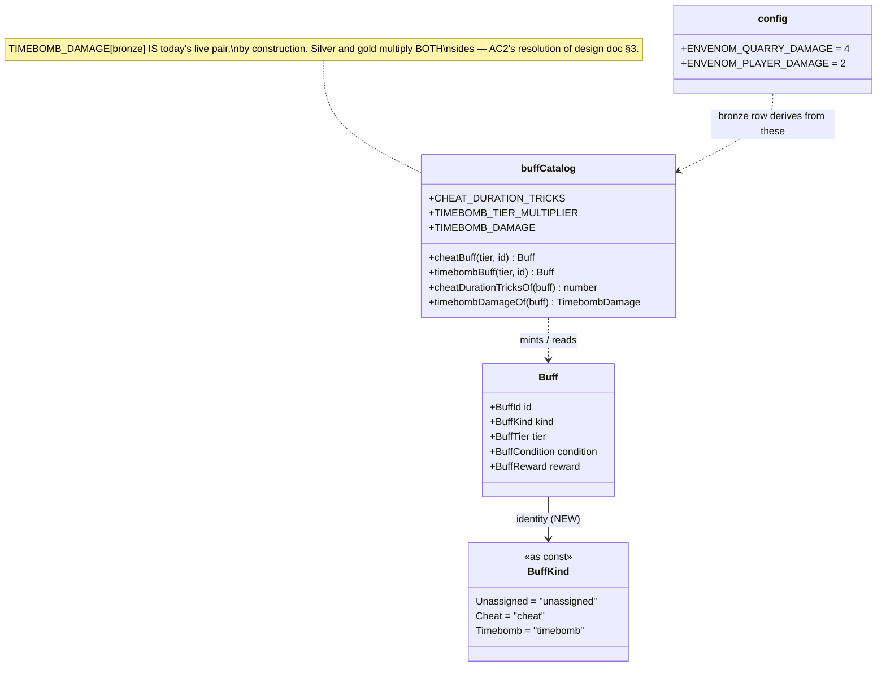
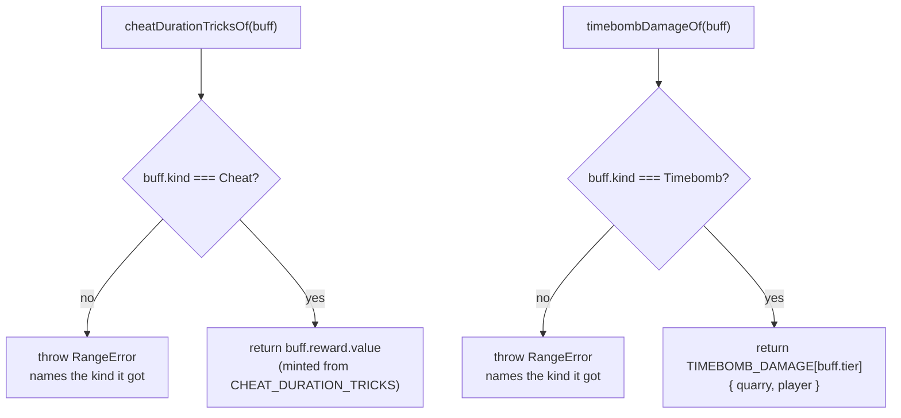

# Plan: Migrate Cheat and Timebomb into the ordinary buff pile

Plan folder: `.claude/contract/DLR-107-migrate-cheat-and-timebomb-into-the-buff-pile/`
Execution status: see `tasks.md` in this folder.

---

## Part 1 — Alignment

### Task reference

**DLR-107** — "Migrate Cheat and Timebomb into the ordinary buff pile", a Task under epic **DLR-103**
("Version 5 — Buff Loadout, Slot Draws, and Delayed Apply Damage"). Label `engine`. Verbatim from
the ticket:

> ## Problem Statement
>
> Cheat and Envenom (renamed Timebomb per the doc) each have bespoke state machines today — two
> Cheat slots with a two-click arm-and-spend ritual, and an Envenom plate with a three-tap ritual.
> The design doc calls for both to become ordinary entries in the buff pile, owned and activated
> the same way every other buff is, while keeping their existing tiered axes: Cheat tiers on
> **duration** (1/2/3 tricks of no follow-suit), Timebomb tiers on **damage**.
>
> ## User Story
>
> As the developer, I want Cheat and Timebomb expressed as `Buff` objects rather than bespoke
> mechanics, so the game has one shared activation model instead of three parallel ones, per §1 of
> the design doc.
>
> ## Acceptance Criteria
>
> 1. Cheat is represented as a `Buff` with tier-scaled duration:
>    `CHEAT_DURATION_TRICKS = { bronze: 1, silver: 2, gold: 3 }` (named, retunable constants) —
>    bronze matches today's single-card behavior.
> 2. Timebomb is represented as a `Buff` with tier-scaled damage, and the open question from §3
>    (does a higher tier raise only Quarry-side damage, or scale both sides on today's 2:1 ratio)
>    is resolved by defaulting to scaling both sides on the existing ratio — recorded as a comment
>    next to `TIMEBOMB_DAMAGE` rather than silently decided.
> 3. The old two-click Cheat-slot state machine and three-tap Envenom-plate state machine are
>    removed once their behavior is proven equivalent under the new model — no dead code left
>    behind per this project's conventions.
> 4. Existing Cheat and Envenom/Timebomb unit tests are ported to exercise the new buff-pile path
>    and pass.
>
> ## Scope Boundaries
>
> **In scope:** Cheat and Timebomb as `Buff` objects, their tier tables, removal of the old bespoke
> mechanics.
> **Out of scope:** AP cost to activate them; the felt-rail UI removal — this ticket is engine-only,
> UI still points at the old mechanics until the UI ticket lands.
>
> ## Dependencies & Risks
>
> Blocked by the buff pile data model ticket. Risk: gold Cheat (3 tricks of no follow-suit) is
> flagged by the source doc itself as needing a costing pass before it ships — this ticket only
> defines the duration table; the tiered AP cost ticket is what actually prices it. Do not ship
> gold Cheat active in any player-reachable path until that lands.
>
> Part of epic breakdown: `.claude/contract/DLR-103-epic-breakdown/tasks.md` (T4).

Upstream contract for the model this migrates onto:
`.claude/contract/DLR-105-buff-pile-data-model/plan.md`, and its shipped record at
`.docs/implementation/hunt/buff-pile.md`.

Design doc: `.docs/design/Balatro-Forbidden-Solitaire/version-5-developer-idea.md` §1 (Cheat and
Timebomb fold into the pile; one shared model instead of three) and §3 (the per-card tier axis, the
Cheat-duration and Timebomb-damage bullets, and the open question AC2 resolves).

**Approval-gate note, 2026-08-23.** This plan was produced inside an unattended sprint run that
overrides `/fb-plan`'s `AskUserQuestion` gate. `plan.md` was self-reviewed but never shown to the
developer. Every default taken in place of a pause is recorded here under Assumptions made and in
`.claude/sprint-runs/2026-08-23-sprint/log.md` under `## DLR-107`.

### Restated goal

Give Cheat and Timebomb a first-class representation as `Buff` objects on the DLR-105 buff pile, so
that a later activation ticket has one shape to activate rather than two bespoke mechanics to
special-case. Concretely: `Buff` gains an identity discriminator (`kind`) so a Cheat buff is
distinguishable from a Timebomb buff and from the placeholder seeds; a new pure module holds the two
tier tables the acceptance criteria name by name (`CHEAT_DURATION_TRICKS`, `TIMEBOMB_DAMAGE`) plus
the factories that mint a Cheat or Timebomb buff at a given tier and the readers that get the
tier-scaled figure back out. Nothing is activated, nothing is drawn, nothing is rendered, and no
existing mechanic changes behaviour. The bronze row of each table is pinned by test to today's live
figures, which is what makes this a migration rather than a second parallel system.

### In scope

- `BuffKind` — the identity discriminator on `Buff` (`unassigned` / `cheat` / `timebomb`), and the
  `kind` field itself, added to `Buff` and set on the existing placeholder seeds.
- `CHEAT_DURATION_TRICKS` — a `BuffTier`-keyed table of `1 / 2 / 3` tricks (AC1), named and
  retunable.
- `TIMEBOMB_DAMAGE` — a `BuffTier`-keyed table of paired Quarry/player figures, **derived** from
  today's `ENVENOM_QUARRY_DAMAGE` / `ENVENOM_PLAYER_DAMAGE` through a named tier multiplier so the
  2:1 ratio holds structurally at every tier (AC2), with the resolution of §3's open question stated
  in a comment beside it as AC2 requires.
- `cheatBuff(tier, id)` and `timebombBuff(tier, id)` — pure factories minting a `Buff` at a tier.
- `cheatDurationTricksOf(buff)` and `timebombDamageOf(buff)` — the readers a later activation ticket
  calls, each refusing a buff of the wrong `kind` rather than returning a plausible wrong number.
- Barrel exports for all of the above in `src/hunt/index.ts`.
- Unit tests: the tier tables, the factories, the readers' refusals, and the bronze-equals-today
  equivalence assertions that satisfy AC4.
- Updating `src/hunt/__tests__/buffs.test.ts`, whose three `toEqual` assertions spell out `Buff`'s
  exact shape and therefore must learn the new `kind` field.

### Explicitly out of scope

- **Removing the two-click Cheat-slot state machine (`CheatStage`, `CheatSelection`,
  `CheatSlots.tsx`) or the three-tap Envenom-plate state machine (`EnvenomStage`,
  `EnvenomCharge.tsx`).** AC3 gates removal on the new model being *proven equivalent*, and the
  ticket's own Scope Boundaries put the felt-rail UI removal out of scope and state the UI still
  points at the old mechanics. Both machines are live consumers today; deleting them would break the
  UI this ticket is forbidden to touch. See Assumptions made.
- Buff activation, the AP cost of activating a buff, and the per-trick Apply Buff window — DLR-103
  T5/T10.
- Any change to how a Cheat is currently spent (`LegalMoveOptions.ignoreFollowSuit`) or how Envenom
  currently marks and queues (`warCouncil/envenom.ts`, `hunt/encounter.ts`).
- Any change to the shop: `ShopItem.Cheat` and `ShopItem.Envenom` keep granting a `CheatCard` and an
  `envenomCharges` increment respectively. Rewiring a purchase to mint a `Buff` is a later ticket's
  job and would change the exact-field-set contract
  `src/hunt/__tests__/run.purchaseIsolation.test.ts` now guards.
- Any UI surface, any React file, any `.tsx` change.
- Cross-run persistence of the buff pile — the pile is in-memory `RunState` per DLR-105; nothing
  here writes to `src/persistence/`.
- Retiring `ENVENOM_QUARRY_DAMAGE` / `ENVENOM_PLAYER_DAMAGE` or renaming Envenom to Timebomb across
  the codebase. The live mechanic keeps its live names until the mechanic itself moves.

### Pattern Reference

- `src/hunt/buffs.ts` (DLR-105) — the `Buff` type this ticket extends, and the `as const` object-map
  idiom (`BuffTier`, `BuffRewardAxis`) `BuffKind` must copy. `erasableSyntaxOnly` in
  `tsconfig.app.json` rules out a real `enum`.
- `src/hunt/cheats.ts` — the house shape for a small pure module in this tree: a `readonly`
  interface, pure functions, and `RangeError` on a caller mistake rather than a silently wrong
  return. `cheatDurationTricksOf` / `timebombDamageOf` follow `removeCheat`'s throw-don't-no-op
  discipline.
- `src/hunt/quickKill.ts` and `src/hunt/flask.ts` — existing small `src/hunt/` modules that read a
  tunable from a named constant and expose one or two pure functions over it.
- `src/hunt/config.ts`'s `ENVENOM_QUARRY_DAMAGE` / `ENVENOM_PLAYER_DAMAGE` block — the documented
  reason those are two keys rather than one, which is exactly the reason `TIMEBOMB_DAMAGE`'s rows
  carry a pair rather than a single number.
- `.claude/skills/react-frontend/SKILL.md` for conventions; `.claude/workflow/web-project.md` for
  paths, runners, and the `src/hunt/**` purity boundary.

### Constraints flagged on the brief

- **`src/hunt/**` is a lint-enforced pure core** — no React import, no DOM global
  (`eslint.config.js`, per `.claude/workflow/web-project.md` → Architectural boundaries). Every file
  this ticket touches is inside it.
- **Engine-only.** The ticket's Scope Boundaries forbid the felt-rail UI removal. No `.tsx` file may
  appear in any task's `**Files:**` block.
- **Gold Cheat must not be reachable by a player until the tiered-AP-cost ticket lands** (the
  ticket's Dependencies & Risks). This is satisfied by construction here: nothing in this ticket or
  anywhere in `src/` activates a buff, draws one, or mints a non-bronze one outside a test.
  `seedStartingBuffPile` still mints only bronze placeholders.
- **AC2 explicitly asks for the §3 resolution to be recorded as a comment**, not silently decided.
- **Files over 400 lines are blocking.** `src/hunt/config.ts` is already **385** lines
  (`wc -l`), so the tier tables cannot go there — see Assumptions made.
- **`.claude/rules/save-data-versioning.md` applies to anything persisted.** Nothing here is; the
  audit below records why.

### Assumptions made

- **AC3's removal of the two state machines is deferred to the UI ticket, and this plan says so
  rather than doing it.** AC3 gates removal on "once their behavior is proven equivalent under the
  new model"; nothing in this ticket activates a buff, so no equivalence can be exercised end to
  end, and the ticket's own Scope Boundaries put "the felt-rail UI removal" out of scope and state
  that "UI still points at the old mechanics until the UI ticket lands". `CheatStage` /
  `CheatSelection` / `CheatSlots.tsx` and `EnvenomStage` / `EnvenomCharge.tsx` are all live,
  reachable, tested code today. *Rationale: the two clauses of the ticket conflict, and the Scope
  Boundaries clause is the specific one; deleting live UI the ticket forbids touching would be a
  behaviour change nobody asked for.*
- **AC4's "ported" is read as "additive equivalence coverage", not "rewritten".** The existing Cheat
  and Envenom specs cover the mechanics that are still live and still correct; rewriting them
  against a buff-pile path that nothing yet executes would delete real coverage and replace it with
  none. Instead, new specs assert that the bronze row of each new tier table equals today's live
  figure — `CHEAT_DURATION_TRICKS[bronze] === 1` (one card's worth of follow-suit lift, which is
  exactly what `LegalMoveOptions.ignoreFollowSuit` grants per commit) and
  `TIMEBOMB_DAMAGE[bronze]` equals `{ quarry: ENVENOM_QUARRY_DAMAGE, player: ENVENOM_PLAYER_DAMAGE }`
  by reference to the constants, not by literal. *Rationale: that assertion is what actually proves
  "no silent behaviour change", which is the point of AC4; a literal `4` would pass while the live
  figure moved underneath it.*
- **`Buff` gains a `kind` discriminator, because DLR-105 shipped no identity field.** DLR-105's own
  AC1 said "identity", but the type it shipped has `id`, `tier`, `condition`, `reward` and nothing
  naming *which card this is*; `condition.kind` describes a trigger, not an identity, and
  overloading it would make "the condition under which this fires" and "which card this is" the same
  string. `BuffKind` is a closed three-value `as const` map (`unassigned` / `cheat` / `timebomb`)
  mirroring `BuffTier`'s and `BuffRewardAxis`'s idiom. *Rationale: without it there is no way to
  express "Cheat is represented as a `Buff`" at all — AC1 and AC2 are unstatable.*
- **The existing placeholder seeds take `BuffKind.Unassigned`.** `seedStartingBuffPile` mints inert
  content by DLR-105's own design; `Unassigned` keeps that obviously-placeholder rather than
  silently making the run's four opening buffs Cheats. *Rationale: matches
  `UNASSIGNED_BUFF_CONDITION`'s existing intent exactly.*
- **`Buff.condition` for both Cheat and Timebomb is a new shared `ACTIVATED_BUFF_CONDITION`
  (`{ kind: 'activated' }`).** Neither card has a trigger condition — the player activates them
  deliberately, per §1's "reactive… sprung in response to what's actually happening". The alternative
  readings (leaving them `unassigned`, or inventing a per-card condition kind) either lie about the
  card or commit to a catalog vocabulary §5 explicitly does not own yet. *Rationale: the smallest
  honest statement of "this one has no trigger; the player pulls it".*
- **`TIMEBOMB_DAMAGE`'s non-bronze rows are derived, not hand-written.** A named
  `TIMEBOMB_TIER_MULTIPLIER` of `{ bronze: 1, silver: 2, gold: 3 }` multiplies **both** of today's
  figures, so the 2:1 ratio AC2 asks to preserve is preserved structurally rather than by three pairs
  of numbers that could drift apart. The 1/2/3 shape is taken from the only tier escalation the
  acceptance criteria actually state (AC1's Cheat duration) and from §3's Shield bullet, which is also
  1/2/3. *Rationale: AC2 names the ratio as the thing to hold; deriving holds it, and a hand-written
  table would be three unchosen tuning values instead of one. The multiplier's values are still
  flagged to the developer under Risks.*
- **The tier tables live in a new `src/hunt/buffCatalog.ts`, not in `src/hunt/config.ts`.**
  `config.ts` measures 385 lines and 400 is a blocking budget, so the ~40 well-commented lines these
  tables need would breach it. A topic-scoped constants-plus-factories module keeps the values
  named, exported and retunable in one place — which is what "no hard-coded tunable" actually asks
  for — and the barrel re-exports them so no consumer can tell the difference. *Rationale: the
  alternative is either a budget breach or an arbitrary mid-file split of `config.ts` that this
  ticket has no other reason to make.*
- **`buffCatalog.ts` holds both the constants and the functions over them**, in the file order the
  react-frontend skill prescribes (imports → constants → functions). Splitting them into
  `buffTiers.ts` + `buffCatalog.ts` would be two ~50-line files with one importing all of the other.
  *Rationale: simplicity over abstraction; the combined file lands near 120 lines, well inside
  budget.*
- **`BuffReward` stays a single axis + value, unwidened.** A Timebomb buff's `reward` carries
  `{ axis: magnitude, value: <quarry damage> }`; the paired player figure comes back from
  `timebombDamageOf`, which reads the tier table. Widening `BuffReward` to a pair would change the
  shape DLR-105 deliberately kept single, and DLR-105's plan flags multi-value rewards as an open
  question §5 itself defers. *Rationale: don't reopen a shape decision a sibling ticket made
  explicitly and defended.*
- **No shop, purchase, or `RunState` field changes.** Out of scope above; stated as an assumption
  too because "migrate into the pile" could be read as "buying a Cheat now puts a Buff in the pile".
  *Rationale: that reading needs activation to be worth anything, and it would change the exact
  changed-field sets `run.purchaseIsolation.test.ts` asserts — a real behaviour change nobody asked
  for in this ticket.*

### Config and persisted-shape audit

- **New names, grepped recursively over `src/**/*.ts,*.tsx`, all zero hits** — `CHEAT_DURATION_TRICKS`
  **0**, `TIMEBOMB_DAMAGE` **0**, `TIMEBOMB_TIER_MULTIPLIER` **0** (component `TIMEBOMB` 0),
  `BuffKind` **0**, `Timebomb`/`timebomb` **0**, `cheatBuff`/`timebombBuff` **0**. Every identifier
  this ticket introduces is new; nothing is a rename, so there is no existing reader to migrate.
- **`ENVENOM_QUARRY_DAMAGE` / `ENVENOM_PLAYER_DAMAGE` are read, never changed.** Grep found **25**
  and **26** hits respectively across `src/hunt/config.ts` (declaration), `src/hunt/encounter.ts`
  (`envenomDamageFor`), `src/hunt/index.ts` (barrel), `src/app/run/shopLabels.ts` (copy),
  `src/warCouncil/bank.ts` (docblock only), and seven spec files. This ticket adds one new reader
  (`buffCatalog.ts`) and modifies none of the existing ones, so none of those 21 sites needs to
  change.
- **`Buff`'s shape changes: one required field added (`kind`).** Type-loss check — this is a
  *widening* of a required-field set, so every construction site must supply it. Grep for `Buff`
  construction found exactly **one** production site (`seedStartingBuffPile` in `src/hunt/buffs.ts`)
  and **three** literal `toEqual` object assertions in `src/hunt/__tests__/buffs.test.ts` that spell
  the shape out in full. `src/hunt/__tests__/run-buffs.test.ts` reads `b.tier` only and is
  unaffected. All four sites change in the same task as the type.
- **Persisted-shape check: nothing this ticket touches is persisted.** `RunState.buffs` is in-memory
  only per DLR-105 (`.docs/implementation/hunt/buff-pile.md`), and `src/persistence/` today writes no
  section carrying a `Buff` — grep for `buff` under `src/persistence/**` returns **0** hits.
  `.claude/rules/save-data-versioning.md`'s reject conditions therefore do not fire: no
  `localStorage`/`sessionStorage` reference is added outside `browserStorage.ts`, no key is composed
  by concatenation, no envelope is written, and `SAVE_SCHEMA_VERSION` needs no bump because no stored
  payload's shape changes. This window is open **only because the buff pile is not saved yet** —
  DLR-113 (Vault) will close it, and adding `kind` after that would be a versioned change.
- **Name-alignment check across the chain**: `BuffKind` member values (`'cheat'`, `'timebomb'`,
  `'unassigned'`) are used only through the exported `BuffKind` map, never as bare string literals at
  a call site; no `data-testid`, CSS class, `aria-*` id, or copy string references any name this
  ticket introduces (this ticket renders nothing).
- **Boundary check**: every file touched is under `src/hunt/**`. `buffCatalog.ts` imports only from
  `./buffs`, `./config`, and `./types` — no React, no DOM global — so the pure-core lint override is
  satisfied by construction.

---

## Part 2 — Technical design

### Approach

The shape of this ticket is deliberately *representation without behaviour*. `Buff` already exists
and already generalises the tier axis correctly (DLR-105 closed `BuffRewardAxis` over exactly
`magnitude` / `durationTricks` / `heartCount` for precisely this ticket's benefit), so Cheat and
Timebomb need nothing new in the reward model — Cheat is a `durationTricks` reward, Timebomb is a
`magnitude` reward, and both were anticipated. What `Buff` genuinely lacks is an **identity**: there
is no field naming *which card this is*, so "Cheat is represented as a `Buff`" cannot even be
written down. So the one type change this ticket makes is adding `kind: BuffKind` — a closed
`as const` map in the same idiom as `BuffTier`, with `Unassigned` for DLR-105's placeholder seeds
and `Cheat` / `Timebomb` for the two cards being migrated. That is a required-field widening, so
`seedStartingBuffPile` and the three shape-literal assertions in `buffs.test.ts` change in the same
task as the type, per the mandatory config-shape task shape.

Everything else lands in one new pure module, `src/hunt/buffCatalog.ts`. It opens with the two tier
tables the acceptance criteria name — `CHEAT_DURATION_TRICKS`, keyed by `BuffTier` and holding AC1's
transcribed `1 / 2 / 3`; and `TIMEBOMB_DAMAGE`, keyed by `BuffTier` and holding a
`{ quarry, player }` pair per tier. The Timebomb table is **built** rather than written out:
`TIMEBOMB_TIER_MULTIPLIER` (`1 / 2 / 3`) multiplies both of today's live figures,
`ENVENOM_QUARRY_DAMAGE` (4) and `ENVENOM_PLAYER_DAMAGE` (2). That is the whole substance of AC2's
resolution — the alternative reading, "raise only the Quarry side", is refuted in the comment beside
the table as AC2 requires, and choosing derivation over three hand-written pairs means the 2:1 ratio
cannot drift: it is arithmetic, not a convention. It also means the bronze row *is* today's figures
by construction rather than by coincidence, which is what makes the migration silent-change-proof.

Above the tables sit two factories, `cheatBuff(tier, id)` and `timebombBuff(tier, id)`, each
returning a plain `Buff` with the right `kind`, the shared `ACTIVATED_BUFF_CONDITION`, and a
`reward` read from its table. Below them sit two readers, `cheatDurationTricksOf(buff)` and
`timebombDamageOf(buff)`, which are what a later activation ticket will actually call. Both **throw
a `RangeError` on a buff of the wrong `kind`** rather than returning a number — the discipline
`cheats.ts`'s `removeCheat` and `warCouncil/envenom.ts`'s `envenomCard` already set in this tree, and
for the same reason: a Timebomb handed to `cheatDurationTricksOf` would otherwise come back as a
plausible small integer and silently lift follow-suit for the wrong reason. `cheatDurationTricksOf`
reads `buff.reward.value` rather than re-indexing the table, so a buff whose tier was retuned after
minting still reports what it was minted with — one source of truth per object.

The road not taken, twice. First: putting the tier tables in `src/hunt/config.ts`, which is where
every other tunable in this module lives. `config.ts` measures 385 lines against a blocking 400
budget, and these tables plus the comments AC2 demands need roughly 40. A topic-scoped module that
exports named constants satisfies "no hard-coded tunable" exactly as well, and the barrel re-exports
them so `import { CHEAT_DURATION_TRICKS } from '../hunt'` reads identically either way. Second:
rewiring `buyFromShop`'s Cheat and Envenom branches to mint buffs into `RunState.buffs`. That is the
literal reading of "migrate into the pile", and it is wrong for this ticket — nothing activates a
buff yet, so the pile entry would be inert while the `CheatCard` / `envenomCharges` it replaced were
still what the game actually spends; the player would own two representations of one thing. It would
also change the exact changed-field sets `run.purchaseIsolation.test.ts` asserts, which is precisely
the kind of silent purchase-shape change that test exists to catch. The migration lands when
activation does.

### Skills to invoke during execution

- `react-frontend` — owns everything under `src/`, which is every file this ticket touches: two pure
  modules and their specs under `src/hunt/`. Governs the `as const` object-map idiom (no `enum`
  under `erasableSyntaxOnly`), the 400-line budget that forced `buffCatalog.ts` into its own file,
  strict TypeScript, and the no-hard-coded-tunable rule. This was the only skill Step 1.5's
  classification matched (Pure logic + Config and tunables); per that step's instruction the
  single-option confirmation call was skipped, and this run is non-interactive besides, so no
  developer override was applied.

Also read, per Step 1: `.claude/workflow/web-project.md` (runner table, the `src/hunt/**` purity
boundary, the `Measure-Object` and `Select-String` traps) and `.claude/rules/save-data-versioning.md`
(scanned; its reject conditions do not fire — see the audit above).

### Diagram





### Data shapes

#### `src/hunt/buffs.ts` (modified)

```ts
/**
 * DLR-107 — WHICH card a buff is. DLR-105 shipped `Buff` with no identity field: `condition.kind`
 * describes a TRIGGER, not a card, and overloading it would make "when this fires" and "what this
 * is" the same string. A closed `as const` map, not an `enum` — `erasableSyntaxOnly` is on.
 *
 * `Unassigned` is what `seedStartingBuffPile` mints: the run's opening pile is still placeholder
 * content (DLR-105), and naming it keeps it obviously placeholder rather than silently a Cheat.
 */
export const BuffKind = {
  Unassigned: 'unassigned',
  Cheat: 'cheat',
  Timebomb: 'timebomb',
} as const
export type BuffKind = (typeof BuffKind)[keyof typeof BuffKind]

/** DLR-107 — the condition for a buff the PLAYER pulls rather than one that fires on a trigger.
 *  Cheat and Timebomb are both reactive-by-activation per design doc §1. */
export const ACTIVATED_BUFF_CONDITION: BuffCondition = { kind: 'activated' }

export interface Buff {
  readonly id: BuffId
  /** DLR-107 — NEW required field. Every construction site supplies it. */
  readonly kind: BuffKind
  readonly tier: BuffTier
  readonly condition: BuffCondition
  readonly reward: BuffReward
}
```

`seedStartingBuffPile`'s minted object gains `kind: BuffKind.Unassigned`. No signature change.

#### `src/hunt/buffCatalog.ts` (new file)

```ts
/** A Timebomb's two figures at one tier. A PAIR, not one number, for the reason
 *  `config.ts` already gives for ENVENOM_QUARRY_DAMAGE and ENVENOM_PLAYER_DAMAGE being two keys:
 *  a single shared figure is the bug that type-checks and pays the wrong side. */
export interface TimebombDamage {
  readonly quarry: Damage
  readonly player: Damage
}

// DLR-107 AC1 — how many tricks a Cheat's follow-suit break lasts, by tier. TRANSCRIBED from AC1
// verbatim ("{ bronze: 1, silver: 2, gold: 3 }") and from design doc §3 ("Cheat's tier is duration
// — how many tricks the follow-suit break lasts, not a magnitude"). NOT chosen here.
// Bronze's 1 IS today's behaviour: `LegalMoveOptions.ignoreFollowSuit` lifts follow-suit for
// exactly one committed card.
// UNIT: tricks of no-follow-suit granted by one activation.
export const CHEAT_DURATION_TRICKS: Readonly<Record<BuffTier, number>>

// DLR-107 AC2 — resolves design doc §3's open question, and this comment IS the record AC2 asks
// for. §3 asked: does a higher Timebomb tier raise ONLY the Quarry-side damage (strictly better to
// pull, same 2-health risk at every tier), or does it keep today's 2:1 ratio and scale BOTH sides
// (bigger reward, proportionally costlier backfire)?
// RESOLVED: scale BOTH sides, on today's ratio — the reading AC2 names as the default. The rejected
// reading makes a gold Timebomb a free upgrade with no added downside, which removes the decision
// the mechanic exists to pose.
// DERIVED, not hand-written: the multiplier below is applied to BOTH of today's live figures, so
// the 2:1 ratio holds as arithmetic rather than as three pairs of numbers that could drift.
// UNIT: dimensionless multiplier on today's bronze figures.
export const TIMEBOMB_TIER_MULTIPLIER: Readonly<Record<BuffTier, number>>

// The table AC2 names. Bronze IS today's live pair by construction — it reads
// ENVENOM_QUARRY_DAMAGE and ENVENOM_PLAYER_DAMAGE rather than restating 4 and 2, so retuning the
// live mechanic moves this table with it and the migration cannot silently diverge.
// UNIT: health points, applied once, to one side, at the resolution of the next trick.
export const TIMEBOMB_DAMAGE: Readonly<Record<BuffTier, TimebombDamage>>

/** AC1 — mint a Cheat buff at `tier`. Reward axis is `durationTricks`, value from
 *  CHEAT_DURATION_TRICKS. Pure; `id` is minted by the caller from `RunState.nextBuffId`. */
export function cheatBuff(tier: BuffTier, id: BuffId): Buff

/** AC2 — mint a Timebomb buff at `tier`. Reward axis is `magnitude`, value = the QUARRY-side
 *  figure (the headline number); the paired player figure comes from `timebombDamageOf`, because
 *  `BuffReward` is deliberately one axis + one value (DLR-105) and widening it is not this
 *  ticket's call. */
export function timebombBuff(tier: BuffTier, id: BuffId): Buff

/** Tricks of no-follow-suit this Cheat buff grants. Reads `buff.reward.value` — the figure it was
 *  MINTED with — not the table, so one object has one answer.
 *  THROWS RangeError on a buff of any other kind, rather than returning a plausible small integer
 *  that would lift follow-suit for the wrong reason. The discipline `removeCheat` already sets. */
export function cheatDurationTricksOf(buff: Buff): number

/** Both figures this Timebomb buff owes. Reads the TIER table rather than `reward.value`, because
 *  the pair is what the caller needs and `reward` carries only the Quarry half.
 *  THROWS RangeError on a buff of any other kind, for `cheatDurationTricksOf`'s reason. */
export function timebombDamageOf(buff: Buff): TimebombDamage
```

#### `src/hunt/index.ts` (modified — barrel)

```ts
export type { Buff, BuffId, BuffCondition, BuffReward } from './buffs'
export {
  BuffTier,
  BuffKind,                    // NEW
  BuffRewardAxis,
  UNASSIGNED_BUFF_CONDITION,
  UNASSIGNED_BUFF_REWARD,
  ACTIVATED_BUFF_CONDITION,    // NEW
  seedStartingBuffPile,
} from './buffs'

export type { TimebombDamage } from './buffCatalog'
export {
  CHEAT_DURATION_TRICKS,
  TIMEBOMB_TIER_MULTIPLIER,
  TIMEBOMB_DAMAGE,
  cheatBuff,
  timebombBuff,
  cheatDurationTricksOf,
  timebombDamageOf,
} from './buffCatalog'
```

No other exported shape or signature changes. No `RunState` field is added or changed. No
`package.json` script or dependency change. No persisted shape changes, so `SAVE_SCHEMA_VERSION`
stays at `1`.

### Runtime quality notes

- **Purity and adjudication:** every file touched is under `src/hunt/**`, the lint-enforced pure
  core — plain TypeScript, no React import, no DOM global. `buffCatalog.ts` imports only `./buffs`,
  `./config`, and `./types`. Every function is pure: no argument is mutated, no module-level `let`
  exists, and the same inputs give the same outputs. Both tier tables are named exported constants
  read by the factories, not literals at a call site; `TIMEBOMB_DAMAGE`'s bronze row is read from
  `config.ts` rather than restated, so there is exactly one statement of today's poison figures in
  the codebase.
- **Effects, mount and teardown:** N/A — no component, no hook, no effect, no listener, timer,
  observer or `AbortController` is created. Nothing mounts, so StrictMode double-invocation has
  nothing to double. The one module-level construction is `TIMEBOMB_DAMAGE`, built once at module
  init from two frozen-by-convention `const`s; it holds no mutable state and needs no reset.
- **Hot-path cost:** N/A today — nothing calls these functions outside tests. When activation lands,
  `cheatDurationTricksOf` is a field read plus a comparison and `timebombDamageOf` is one object
  index; neither allocates. The factories allocate one small object each, called at most once per
  buff minted, never per pointer event or per frame.
- **Determinism and numeric safety:** no `Math.random()` anywhere; `id` is supplied by the caller
  from `RunState.nextBuffId`, the same monotonic counter `seedStartingBuffPile` already uses. **No
  division exists in this ticket's code**, so no `NaN` path is reachable — `TIMEBOMB_DAMAGE` is
  built by multiplication of two integers by an integer multiplier, which is exact in binary at
  these magnitudes and cannot produce a fraction. There is no epsilon to name. A table read is
  `Record<BuffTier, …>` over a closed union, so TypeScript proves no index can miss.
- **Error paths:** `cheatDurationTricksOf` and `timebombDamageOf` each **throw `RangeError`** naming
  the `kind` they were actually given when handed a buff of the wrong kind — the one guarded case in
  this ticket, and it is guarded loudly rather than swallowed, because the swallowed version returns
  a plausible number. The factories have no invalid input to refuse: `tier` is a closed union the
  compiler checks, and `id` is a caller-minted integer from a counter, not untrusted input — the
  same reasoning DLR-105 recorded for `seedStartingBuffPile` having no throw. Nothing here is async,
  so there are no loading/success/error/empty states to enumerate. No `catch` is written, so nothing
  can be swallowed into a success shape.

### Risks and judgement calls

- **AC3 is deliberately not done, and the developer should confirm that.** The plan defers removing
  `CheatStage` / `CheatSelection` / `CheatSlots.tsx` and `EnvenomStage` / `EnvenomCharge.tsx` to the
  UI ticket, because the ticket's own Scope Boundaries forbid touching them and because nothing yet
  proves equivalence. The consequence worth seeing plainly: **after this ticket, Cheat and Timebomb
  exist twice** — once as the live bespoke mechanic the UI drives, once as an inert `Buff`
  representation nothing reads. That duplication is the intended intermediate state of a migration
  split across tickets, but it is real, and it stays until the activation and UI tickets land.
- **`TIMEBOMB_TIER_MULTIPLIER`'s values (`1 / 2 / 3`) are a tuning decision the developer owns.**
  Nothing in the ticket or design doc states Timebomb's tier magnitudes; §3 says only "Timebomb's
  tier is damage" and leaves the numbers open. The plan's default takes 1/2/3 from the only tier
  escalation the ACs do state (AC1's Cheat duration) and from §3's Shield bullet, which is also
  1/2/3. That yields 4/8/12 to the Quarry and 2/4/6 to the player. A gold Timebomb costing the
  player 6 of a 10-point bar is a large self-inflicted hit and may want a flatter curve — this is
  the number to move, in one place, after a playtest.
- **`CHEAT_DURATION_TRICKS` is transcribed, not open.** AC1 states the table literally; it is not
  routed to the developer. Gold's 3 is nevertheless flagged by the ticket's own Dependencies & Risks
  as needing a costing pass before it ships — no code path in this ticket can reach it, and this
  plan adds none.
- **Adding `kind` to `Buff` is a required-field widening on a type a sibling ticket shipped four
  days ago.** It is defensible (DLR-105's AC1 asked for identity and the shipped type has none), but
  it is a change to another ticket's data model and the developer may prefer the discriminator live
  elsewhere. Cheap to red-line now; expensive once the slot machine and the Vault both construct
  buffs.
- **`ACTIVATED_BUFF_CONDITION`'s `'activated'` string enters a catalog vocabulary §5 explicitly does
  not own yet.** `BuffCondition.kind` is an open string by DLR-105's design, so this costs nothing
  structurally, but whoever authors the real condition catalog (DLR-103 T7a) should know this name
  is already in use.
- **Timebomb keeps `magnitude` as its reward axis while carrying a paired figure.** The reward
  descriptor tells only half the story for this card, and `timebombDamageOf` is what tells the rest.
  Worth a second look when the slot machine needs to render a Timebomb card's payoff from `reward`
  alone.
- **Nothing here can be judged by running the app.** This ticket renders nothing and changes no
  player-visible behaviour; `npm run typecheck`, `npm run lint`, and the Vitest specs are the entire
  verification surface. There is no feel question and no visual call in it.
