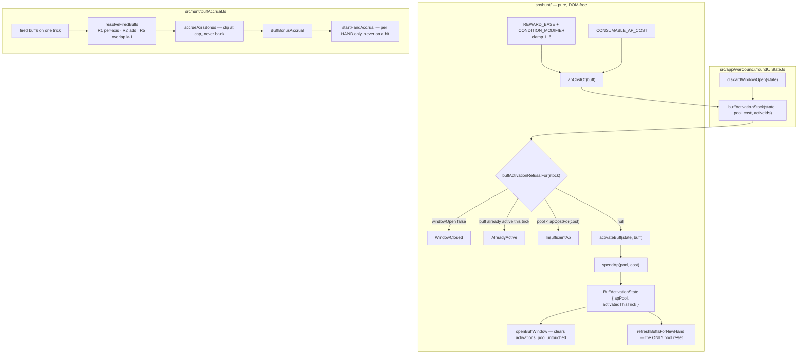

# Plan: Buff activation flow and tiered AP costs

Plan folder: `.claude/contract/DLR-108-buff-activation-flow-and-tiered-ap-costs/`
Execution status: see `tasks.md` in this folder.

---

## Part 1 — Alignment

### Task reference

Jira **DLR-108** — "Buff activation flow and tiered AP costs", Task under epic DLR-103. Labels: `engine`.

**Acceptance criteria, verbatim:**

1. An "Apply Buff" action is gated by the same timing `discardWindowOpen` already provides — no new timing gate is built.
2. Activating a buff costs AP per its tier: `BUFF_ACTIVATION_COST = { bronze: 3, silver: 5, gold: 8 }` (named, retunable constants, per the game-designer consult's recommendation).
3. Multiple buffs can be activated for the same trick if the AP budget allows (stacking), verified by a unit test spending down a starting pool across two buffs.
4. The AP pool is a single per-hand budget drawn down across up to six per-trick windows — no additional rule is needed beyond AP being one pool and the gate reopening each trick; a unit test confirms AP does not silently refresh mid-hand.
5. Attempting to activate a buff with insufficient AP is refused with a reason, following this project's existing disabled-with-reason convention.

**Scope boundaries, verbatim:** In scope — the Apply Buff action, AP cost table, stacking, insufficient-AP refusal. Out of scope — the felt-rail button itself; Apply Damage's own AP cost.

**Two design tickets ran immediately before this one and are binding sources, cited not re-derived:**

- `.docs/design/Balatro-Forbidden-Solitaire/v1-buff-card-list.md` (DLR-111, commit `2b33332`) — the 78-template v1 pool, the `apCost = clamp(REWARD_BASE[axis][tier] + CONDITION_MODIFIER[family], 1, 6)` cost model, the seven consumable/activated prices, the firing cadences, the four per-hand caps, and its closing section *Code-shape alignment: where this list fits `buffCatalog.ts`, and where it does not* — findings 1–5, which are this ticket's shape-gap list.
- `.docs/design/Balatro-Forbidden-Solitaire/hybrid-design.md` §5 → *Resolving several buffs on one trick — the stacking rule* (DLR-124, commit `719cee7`), R1–R7, plus its closing *What this asks of DLR-108*. Restated in `.docs/implementation/hunt/buff-pile.md`'s two DLR-111/DLR-124 notes.

**Run context (2026-08-23, unattended sprint run):** the dispatch overrides `CLAUDE.md`'s plan-approval gate and mockup gate. Every open question below takes this plan's stated default; nothing pauses.

### Restated goal

Give a `Buff` a price and a way to be brought into a trick. Today `src/hunt/buffs.ts` describes a buff that nobody can cost, name, parameterise, or activate: `BuffKind` has three members where the authored list needs sixteen more, `BuffRewardAxis` has three where it needs eight more, `BuffCondition` is a payload-free `{ kind: string }` that cannot express `Bell-Taker` or `Mark of the 9`, and there is no AP cost anywhere on the type. This ticket closes all four gaps, ships DLR-111's cost model as a **formula over two small tables** rather than 78 literals, adds the four per-hand cap constants and the `BuffBonusAccrual` state DLR-124 asks for, and builds the pure activation flow — a refusal-reason function in the existing `applyDamageRefusalFor` / `flaskRefusalFor` / `purchaseRefusalFor` shape, and a spend that draws several activations down one per-hand AP pool across the per-trick windows `discardWindowOpen` already opens. No felt-rail button, no reducer action, no rendering.

### In scope

- `BuffKind` widened by the 16 members DLR-111 finding 1 names (11 shipping condition families + 5 consumables), `Unassigned`/`Cheat`/`Timebomb` unchanged.
- `BuffRewardAxis` widened by the 8 axes DLR-111 finding 2 names.
- `BuffCondition` gains the optional `target` payload DLR-111 finding 3 recommends, plus a hunt-local suit vocabulary and rank bound.
- `BuffCadence` (`event` / `threshold` / `terminal`) and the family→cadence map, transcribed from DLR-124 R4 / DLR-111's *Firing cadence* table.
- The AP cost model as code: `REWARD_BASE`, `CONDITION_MODIFIER`, `CONSUMABLE_AP_COST`, the clamp bounds, and `buffApCost(kind, axis, tier)` / `apCostOf(buff)`.
- The four per-hand caps as `config.ts` keys (`MAX_REFUND_PER_HAND`, `MAX_MULTIPLIER_BONUS_PER_HAND`, `MAX_FLAT_DAMAGE_BONUS_PER_HAND`, `MAX_COIN_BONUS_PER_HAND`), reached through a `config.ts` re-export so no existing importer changes.
- Splitting `src/hunt/config.ts` (385 of a 400-line blocking budget) so those keys have somewhere to go — the AP block moves to `src/hunt/apConfig.ts` and is re-exported.
- `BuffBonusAccrual` — per-hand running totals, one per reward axis, each clipped at its cap, reset per hand and **not** on a hit.
- The activation flow: `BuffActivationRefusal` reason codes, `BuffActivationStock`, `buffActivationRefusalFor`, and `activateBuff` — stacking several activations against one pool.
- A per-hand `BuffActivationState` holding the pool and the buffs activated for the current trick, with the per-trick window boundary and the per-hand refresh boundary as separate functions.
- The AC1 wiring point: an app-layer projection in `roundUiState.ts` that feeds `windowOpen` from the existing `discardWindowOpen`, exactly as `discardStock` already does.
- Unit tests for every rule above, beside the logic, in `src/hunt/__tests__/` and `src/app/warCouncil/__tests__/`.

### Explicitly out of scope

- The felt-rail Apply Buff button, any `.tsx` surface, any reducer action — the ticket's own Scope Boundaries put the button out, and nothing yet reads `RunState.buffs`.
- Apply Damage's AP cost — its own ticket, cost explicitly undecided.
- Condition **evaluation** — deciding whether `Bell-Taker` actually fired on a given trick. This plan ships the shape, the cadence classification, and the accrual that receives a fired buff's contribution; matching a condition against real trick state is the resolution ticket's.
- Wiring the accrual into the live cash-out (`bank.ts`, `voluntaryCashOut.ts`). R3's five-step order is transcribed as documentation and as the ordering of `resolveFiredBuffs`'s output, not applied to the shipped damage path.
- Renaming Envenom to Timebomb anywhere — DLR-129 owns that and runs after this ticket.
- Retiring the duplicate Cheat/Timebomb felt mechanics — DLR-129.
- Long Fall (deferred by DLR-111), the `Keepsake` unfireability defect, and the `Ward` silver/gold indistinguishability defect — all three are stated open defects this ticket must not fix and must not be blocked by.
- Persisting anything. `RunState` is not persisted today and this ticket does not change that.

### Pattern Reference

- **Refusal-with-reason:** `src/warCouncil/voluntaryCashOut.ts` → `ApplyDamageRefusal` / `ApplyDamageStock` / `applyDamageRefusalFor`, and its sibling shape in `src/hunt/flask.ts` and `src/hunt/shop.ts`. A reason **code**, never a sentence; a `*Stock` of plain values assembled in exactly one place; one function read by both the guard and the disabled control.
- **The stock's `windowOpen` field:** `src/app/warCouncil/roundUiState.ts` → `discardStock`, which is the AC1 pattern verbatim — the projection reads `discardWindowOpen(state)` and hands the pure module a boolean.
- **Tiered tables derived from a formula, not hand-written:** `src/hunt/buffCatalog.ts` → `TIMEBOMB_DAMAGE` built from `timebombRow()` so the rule is stated once.
- **Spend that throws rather than clamps:** `src/hunt/actionPoints.ts` → `spendAp`.
- **Closed `as const` maps, never `enum`** (`erasableSyntaxOnly`): `BuffTier`, `BuffKind`, `ApRefreshCadence`.
- **Splitting a file at the 400-line budget:** `src/hunt/run.ts` → `runTransitions.ts`, re-exported so no importer changed.
- `.claude/skills/react-frontend/SKILL.md` for everything under `src/`.

### Constraints flagged on the brief

- **Formula, not literals.** The dispatch is explicit: implement `apCost = clamp(REWARD_BASE[axis][tier] + CONDITION_MODIFIER[family], 1, 6)` and the two tables, so the developer retunes 78 cards by editing two tables.
- **DLR-124's caps reset per hand, NOT on a hit.** Named by both source documents as the single most likely thing to be lost in translation.
- **Timebomb is canonical; Envenom is legacy.** Build nothing new against the Envenom name; rename nothing that already carries it.
- **Build against `src/hunt/buffCatalog.ts`**, never a parallel catalog.
- **`src/hunt/**` stays pure** — no React, no DOM, lint-enforced.
- **`src/hunt/config.ts` is at 385 of 400 blocking lines**, and this project fixes such a breach in-ticket rather than reporting it.
- **Two known open defects must not be fixed and must not block:** `Keepsake` may be unfireable; `Ward` silver/gold are indistinguishable while `DAMAGE_PER_HIT = 1`.

### Assumptions made

Every bullet below is this plan's **stated default**, taken without a pause per the run's dispatch.

- **AC2's `BUFF_ACTIVATION_COST = { bronze: 3, silver: 5, gold: 8 }` is NOT shipped; DLR-111's cost model supersedes it.** AC2 was written before DLR-111 authored the pool. A single tier table cannot price a list where cost depends on family and reward axis as well as tier, and the dispatch explicitly requires the formula. Concretely this changes one number the ticket names: gold Cheat is **7 AP**, DLR-111's figure, not 8. Divergence recorded in the sprint log.
- **`apCost` is a derived lookup, not a field on `Buff`.** DLR-111 finding 4 offers both and recommends the lookup, on the grounds that the cost model is a formula over two tables and a field would make it 78 independent facts that drift. `apCostOf(buff)` reads `(kind, reward.axis, tier)` off the buff, so a buff still has exactly one answer. The dispatch's "first job" — that authored costs have no home — is closed either way.
- **`apCostOf` throws on `BuffKind.Unassigned`** rather than returning a number, matching `cheatDurationTricksOf`'s discipline in `buffCatalog.ts`. The seeded pile is documented placeholder content; a placeholder with a plausible price is the bug that type-checks.
- **`BuffCondition.target` uses a hunt-local `BuffTargetSuit`, not `src/warCouncil/types.ts`'s `Suit`.** DLR-111 finding 3 recommends "as a `Suit`", but `src/hunt/` cannot import `src/warCouncil/` — warCouncil already imports hunt, and the reverse edge is a cycle the existing type comments call out by name. The two unions carry identical string values, so they are structurally assignable, and a test asserts value-for-value equality so the drift is caught rather than discovered. Divergence recorded in the sprint log.
- **`target.rank` is a plain `number` validated against `BUFF_TARGET_RANK_MIN`/`MAX` (1–11)**, not a literal union of eleven members. `src/warCouncil/types.ts` already keeps `RANKS` as `readonly number[]`; an eleven-member literal union here would be the only place in the codebase that models a rank differently.
- **`BuffKind` member names are camelCase strings of DLR-111's family words** — `taker`, `feeder`, `markOfRank`, `sidestep`, `glutton`, `hoarder`, `unbloodied`, `debtCollector`, `keepsake`, `miser`, `cornered`, `ward`, `puppeteer`, `secondThoughts`, `foresight`, `spyglass`. `markOfRank` rather than `markOfThe` because the rank lives in `target`, not the name. Long Fall is reserved and not added.
- **`BuffRewardAxis`'s new members are `coins`, `apRefund`, `multiplier`, `cardsRevealed`, `candidatesEliminated`, `discardCharges`, `damageAbsorbed`, `none`**, transcribed from DLR-111 finding 2. Blade maps onto the **existing** `magnitude` axis rather than a new `flatDamage` one — `magnitude` is already the flat-damage axis on the tiered ladder, and adding a synonym would give one quantity two names.
- **The `config.ts` split moves the AP block, not the buff block.** The four new caps are AP-adjacent tunables and the AP block is the natural cohesive unit already sitting at the file's tail; `apConfig.ts` re-exported from `config.ts` mirrors `run.ts` → `runTransitions.ts` exactly, so no importer changes and `src/hunt/index.ts`'s export list is untouched.
- **`BuffActivationState` holds the pool and the current trick's activations, and lives in `src/hunt/`, not on `RunState`.** DLR-104 shipped AP as pure functions with no state anywhere; putting the pool on `RunState` would be a run-lifetime home for a per-hand budget and would collide with whichever ticket wires the felt. This ticket ships the state type and its two boundary functions as pure, testable values that a later ticket owns the placement of.
- **Activating the same buff twice for one trick is refused** (`AlreadyActive`). Not stated anywhere; the alternative — paying twice for one card in one trick — is a duplicate-payment bug wearing a stacking rule's clothes, and R7's "a player mistake is legitimate" concerns paying for a card that cannot fire, not paying twice for one card.
- **The Overlap Bonus is computed from the count of buffs that fired, in `resolveFiredBuffs`, and drawn from the Momentum cap** — DLR-124 R5, transcribed.
- **Nothing here is persisted**, so `.claude/rules/save-data-versioning.md` binds nothing in this ticket. Recorded because DLR-111's closing note says that window closes the moment DLR-112 writes a drawn buff to a save.

### Config and persisted-shape audit

- **`apCost` as a field:** `grep -rn "apCost" src/` returns **21 hits**, and filtering out `apCostFor`/`apCostGiven` returns **0**. Confirms DLR-111 finding 4: the name is entirely free as a field or a function, and the only existing `apCost*` identifiers are `src/hunt/actionPoints.ts`'s two pool functions. `apCostOf` does not collide with either.
- **`MAX_REFUND_PER_HAND`, `MAX_MULTIPLIER_BONUS_PER_HAND`, `MAX_FLAT_DAMAGE_BONUS_PER_HAND`, `MAX_COIN_BONUS_PER_HAND`:** **0 hits** across `src/`. All four are new keys, not renames — nothing reads them and nothing can break.
- **`BUFF_ACTIVATION_COST`:** **0 hits**. AC2's name is unclaimed; not shipping it orphans nothing.
- **`BuffKind` — widened union, so every exhaustive `switch` must grow.** **20 hits across 5 files**: `src/hunt/buffs.ts` (declaration), `src/hunt/buffCatalog.ts` (`cheatBuff`, `timebombBuff`, and the two `!==` guards in `cheatDurationTricksOf`/`timebombDamageOf`), `src/hunt/index.ts` (re-export), and the two test files. There is **no `switch` on `BuffKind` anywhere** — every existing read is an equality or inequality check, so widening breaks no consumer. The new `BUFF_CADENCE` and `CONDITION_MODIFIER` maps are `Record`-typed over subsets, so a member added later fails to compile at the table rather than silently defaulting.
- **`BuffRewardAxis` — same widening shape.** **13 hits across the same 5 files**, all construction or equality; no `switch`. `REWARD_BASE` is keyed over the four reward axes only, so a new axis added later does not silently acquire a base of zero.
- **`BuffCondition` — required→optional is not in play; this is an added optional field.** **5 hits**: the declaration, the `Buff.condition` field, `UNASSIGNED_BUFF_CONDITION`, `ACTIVATED_BUFF_CONDITION`, and the `index.ts` re-export. Adding `readonly target?: BuffTarget` leaves all four existing values valid unchanged, so no consumer's assumption is invalidated.
- **Persisted shapes:** `src/persistence/` holds `browserStorage.ts`, `config.ts`, `saveStore.ts`, `storageDriver.ts`, `index.ts` — **zero references to `buffs` or `RunState`**. Nothing on this ticket's surface is persisted, so no `SAVE_SCHEMA_VERSION` bump is owed and reject conditions 3, 4 and 5 of `save-data-versioning.md` cannot be tripped. Reject condition 1 is lint-enforced and this ticket touches no storage global.
- **`src/hunt/config.ts` line count:** `(Get-Content src/hunt/config.ts).Count` = **385**, against a 400-line blocking budget. Four cap constants with the docblocks this file's every other key carries would breach it, which is why the split is in scope rather than reported.
- **Boundary:** every new module lives under `src/hunt/**`, already covered by `eslint.config.js`'s pure-core `no-restricted-imports` / `no-restricted-globals` override. The one app-layer change is an addition to `src/app/warCouncil/roundUiState.ts`, which is outside that tree and imports no storage global.

---

## Part 2 — Technical design

### Approach

**The cost model ships as a formula over two exported tables, and that is the load-bearing decision.** `buffApCost(kind, axis, tier)` computes `clamp(REWARD_BASE[axis][tier] + CONDITION_MODIFIER[kind], AP_COST_MIN, AP_COST_MAX)` for the eleven condition families, and reads `CONSUMABLE_AP_COST[kind][tier]` for the seven consumable/activated cards, whose prices DLR-111 sets off-curve for stated reasons (Ward and Timebomb flat because their tier is paid in something other than AP; Cheat's gold deliberately above `STARTING_AP`). Two functions rather than one branch inside one table because these are two different pricing regimes, and collapsing them would either bury the off-curve prices inside a modifier that no longer means what it says, or force the formula to carry seven exceptions. `apCostOf(buff)` is the single entry point a consumer calls; it dispatches on `kind` and throws a `RangeError` on `Unassigned`, matching `buffCatalog.ts`'s existing refusal to answer a question about the wrong kind of buff. The alternative — a `readonly apCost` field minted onto every `Buff` — was rejected on DLR-111 finding 4's own reasoning: it turns a two-table retune into 78 construction sites, and it lets a buff's stored price disagree with the table it came from.

**The shape gaps are closed in `buffs.ts` itself, not in a parallel taxonomy module.** `BuffKind`, `BuffRewardAxis` and `BuffCondition` are the three types DLR-111's findings name, they already live together, and splitting them would put "which card is this" in one file and "what does that card cost" in a third. `BuffCadence` joins them for the same reason — a family's firing cadence is a property of the family, decided by DLR-124 R4, and belongs beside the family list. `BuffCondition` gains `readonly target?: BuffTarget` where `BuffTarget` is `{ suit?: BuffTargetSuit; rank?: number }`; the payload was chosen over baking suit and rank into `BuffKind` for DLR-111's stated reason — 33 members where 4 would do, and a string-prefix test where an equality check would do. The one place this plan diverges from that finding is the suit type: it recommends warCouncil's `Suit`, and `src/hunt/` cannot import `src/warCouncil/` without the cycle both modules' comments already name. `BuffTargetSuit` carries identical values and a test pins them to warCouncil's `Suit` member-for-member, so the two cannot drift silently.

**The activation flow is a refusal function plus a spend, in the shape three modules already use.** `buffActivationRefusalFor(stock)` takes plain values — `windowOpen`, `apPool`, `apCost`, `alreadyActive` — and returns a `BuffActivationRefusal` code or `null`, checking in the order `WindowClosed → AlreadyActive → InsufficientAp` so the reason that is true of the whole felt is reported before the reason that is true of this one card, exactly as `applyDamageRefusalFor` orders `NotYourMove` first. AC1 is satisfied by *not building a gate*: `windowOpen` arrives from `roundUiState.ts`'s existing `discardWindowOpen`, assembled in `buffActivationStock` beside `discardStock`, which is the only place in the app layer that translates state into the pure module's shape. `activateBuff(state, buff)` refuses through the same function before spending, so the guard and the disabled control can never read availability differently. AC3's stacking falls out of the pool being one number: two `activateBuff` calls draw down one `apPool`. AC4's "no silent refresh" is enforced by the boundary functions being two different functions — `openBuffWindow(state)` clears the trick's activations and touches the pool not at all, `refreshBuffsForNewHand(state)` is the only thing that calls `refreshActionPointsForNewHand`. A single "start next trick" function that also reset the pool is precisely the bug AC4 asks for a test against.

**The accrual is a separate module because it is state on the hand, not on a buff, and it is capped.** `buffAccrual.ts` holds `BuffBonusAccrual`, `EMPTY_BUFF_ACCRUAL`, the axis→cap map, `accrueAxisBonus` (add, then clip at the cap, never bank the remainder), and `resolveFiredBuffs(accrual, fired)` which implements R1, R2 and R5: contributions add within an axis and nowhere across axes, and a trick firing `k ≥ 2` buffs adds `k − 1` to the Momentum axis from the same capped pool. R3's five-step order is transcribed into the module docblock and reflected in the order `resolveFiredBuffs` applies its axes, but this ticket does not wire it into the live cash-out — nothing in `src/` reads a buff yet, and reordering the shipped damage path with no reader would be a change nobody can observe. The cap reset is deliberately a function named `startHandAccrual()` and there is deliberately **no** `resetAccrualOnHit` — DLR-124 R6 calls the reset-per-hand-not-on-a-hit asymmetry the entire containment mechanism, and the way to make sure an obvious wrong reading is never written is to leave the function it would need absent, with the reason stated in the docblock and asserted by a test.

### Skills to invoke during execution

- `react-frontend` — owns everything under `src/`: the pure-module placement, the `as const` map convention under `erasableSyntaxOnly`, the 400-line budget that forces the `config.ts` split, tunables read from configuration, and the Vitest posture for every new test.
- `implementation-doc-writer` — owns `.docs/implementation/hunt/` and `.docs/game_rules/the-hunt.md`. This ticket changes what the code does and adds settled rules (tiered AP costs, the four caps, the activation window), so both are updated by that skill at the end of the run rather than by hand.

Rules the executor must Read: `.claude/rules/save-data-versioning.md` (scanned — nothing on this ticket's surface is persisted; recorded so the finding is on file rather than assumed). Always: `.claude/workflow/web-project.md`.

No developer override was applied — this run is non-interactive and the plan gate is auto-approved per the sprint dispatch.

### Diagram



### Data shapes

#### `src/hunt/buffs.ts` — widened

```ts
export const BuffKind = {
  Unassigned: 'unassigned',
  Cheat: 'cheat',
  Timebomb: 'timebomb',
  // 11 shipping condition families (DLR-111 finding 1)
  Taker: 'taker',
  Feeder: 'feeder',
  MarkOfRank: 'markOfRank',
  Sidestep: 'sidestep',
  Glutton: 'glutton',
  Hoarder: 'hoarder',
  Unbloodied: 'unbloodied',
  DebtCollector: 'debtCollector',
  Keepsake: 'keepsake',
  Miser: 'miser',
  Cornered: 'cornered',
  // 5 consumables
  Ward: 'ward',
  Puppeteer: 'puppeteer',
  SecondThoughts: 'secondThoughts',
  Foresight: 'foresight',
  Spyglass: 'spyglass',
} as const
export type BuffKind = (typeof BuffKind)[keyof typeof BuffKind]

export const BuffRewardAxis = {
  Magnitude: 'magnitude',
  DurationTricks: 'durationTricks',
  HeartCount: 'heartCount',
  Coins: 'coins',
  ApRefund: 'apRefund',
  Multiplier: 'multiplier',
  CardsRevealed: 'cardsRevealed',
  CandidatesEliminated: 'candidatesEliminated',
  DiscardCharges: 'discardCharges',
  DamageAbsorbed: 'damageAbsorbed',
  None: 'none',
} as const
export type BuffRewardAxis = (typeof BuffRewardAxis)[keyof typeof BuffRewardAxis]

/** Hunt-local suit vocabulary. Identical values to `src/warCouncil/types.ts`'s `Suit`,
 *  which `src/hunt/` cannot import (cycle). Pinned by a test. */
export const BuffTargetSuit = {
  Bells: 'bells',
  Keys: 'keys',
  Moons: 'moons',
} as const
export type BuffTargetSuit = (typeof BuffTargetSuit)[keyof typeof BuffTargetSuit]

export const BUFF_TARGET_RANK_MIN = 1
export const BUFF_TARGET_RANK_MAX = 11

/** Present only on suit- or rank-parameterised families (DLR-111 finding 3). */
export interface BuffTarget {
  readonly suit?: BuffTargetSuit
  readonly rank?: number
}

export interface BuffCondition {
  readonly kind: string
  readonly target?: BuffTarget
}

/** DLR-124 R4 — how often a family fires. */
export const BuffCadence = {
  Event: 'event',
  Threshold: 'threshold',
  Terminal: 'terminal',
  Activated: 'activated',
} as const
export type BuffCadence = (typeof BuffCadence)[keyof typeof BuffCadence]

export const BUFF_CADENCE: Readonly<Record<BuffKind, BuffCadence>>

export function buffTargetSuitOf(buff: Buff): BuffTargetSuit | null
export function buffTargetRankOf(buff: Buff): number | null
export function isValidBuffTarget(target: BuffTarget): boolean
```

`Buff` itself is **unchanged** — no `apCost` field; see `buffCosts.ts`.

#### `src/hunt/buffCosts.ts` — new

```ts
/** UNIT: action points. Bounds of the clamp (DLR-111 → The formula). */
export const AP_COST_MIN = 1
export const AP_COST_MAX = 6

/** The four REWARD axes a condition template can pay on, and their per-tier base. */
export type BuffCostAxis =
  | typeof BuffRewardAxis.Magnitude
  | typeof BuffRewardAxis.Coins
  | typeof BuffRewardAxis.ApRefund
  | typeof BuffRewardAxis.Multiplier

export const REWARD_BASE: Readonly<Record<BuffCostAxis, Readonly<Record<BuffTier, number>>>>
export const CONDITION_MODIFIER: Readonly<Record<BuffConditionKind, number>>
export const CONSUMABLE_AP_COST: Readonly<Record<BuffConsumableKind, Readonly<Record<BuffTier, ActionPoints>>>>

export function buffApCost(kind: BuffKind, axis: BuffRewardAxis, tier: BuffTier): ActionPoints
export function apCostOf(buff: Buff): ActionPoints   // throws RangeError on Unassigned
export function isConditionFamily(kind: BuffKind): boolean
export function isConsumableKind(kind: BuffKind): boolean
```

Values, transcribed from DLR-111 → *The formula* and *Utilities, consumables and activated cards*. **All agent-chosen on DLR-111, all the developer's to move.**

| `REWARD_BASE` | bronze | silver | gold |
|---|---|---|---|
| `magnitude` (Blade) | 1 | 2 | 3 |
| `coins` (Purse) | 2 | 3 | 4 |
| `apRefund` (Second Wind) | 1 | 1 | 1 |
| `multiplier` (Momentum) | 2 | 3 | 5 |

`CONDITION_MODIFIER`: Taker 0 · Feeder +1 · MarkOfRank −1 · Sidestep −1 · Glutton 0 · Hoarder 0 · Unbloodied 0 · DebtCollector +1 · Keepsake 0 · Miser −1 · Cornered −1.

| `CONSUMABLE_AP_COST` | bronze | silver | gold |
|---|---|---|---|
| `ward` | 2 | 2 | 2 |
| `puppeteer` | 4 | 4 | 4 |
| `secondThoughts` | 2 | 3 | 4 |
| `foresight` | 1 | 2 | 3 |
| `spyglass` | 2 | 3 | 4 |
| `cheat` | 3 | 5 | 7 |
| `timebomb` | 2 | 2 | 2 |

#### `src/hunt/apConfig.ts` — new (AP block moved out of `config.ts`, plus four keys)

```ts
export const AP_ENABLED = true                                   // moved verbatim
export const STARTING_AP: ActionPoints = 6                       // moved verbatim
export const ApRefreshCadence = { PerHand: 'perHand' } as const  // moved verbatim
export const AP_REFRESH_CADENCE: ApRefreshCadence = ApRefreshCadence.PerHand

/** UNIT: action points per hand. */
export const MAX_REFUND_PER_HAND: ActionPoints = 6
/** UNIT: multiplier points per hand. */
export const MAX_MULTIPLIER_BONUS_PER_HAND = 6
/** UNIT: damage per hand. */
export const MAX_FLAT_DAMAGE_BONUS_PER_HAND = 12
/** UNIT: coins per hand. */
export const MAX_COIN_BONUS_PER_HAND = 10
```

`src/hunt/config.ts` re-exports all eight names, so every existing importer and `src/hunt/index.ts`'s export list are untouched.

#### `src/hunt/buffAccrual.ts` — new

```ts
export interface BuffBonusAccrual {
  readonly multiplierBonus: number
  readonly flatDamageBonus: number
  readonly coinBonus: number
  readonly apRefunded: number
}

export const EMPTY_BUFF_ACCRUAL: BuffBonusAccrual
export function startHandAccrual(): BuffBonusAccrual
export function accrualCapFor(axis: BuffCostAxis): number
export function accrueAxisBonus(accrual: BuffBonusAccrual, axis: BuffCostAxis, amount: number): BuffBonusAccrual
export function overlapBonusFor(firedCount: number): number       // R5: max(0, k - 1)
export function resolveFiredBuffs(accrual: BuffBonusAccrual, fired: readonly Buff[]): BuffBonusAccrual
```

#### `src/hunt/buffActivation.ts` — new

```ts
export const BuffActivationRefusal = {
  WindowClosed: 'windowClosed',
  AlreadyActive: 'alreadyActive',
  InsufficientAp: 'insufficientAp',
} as const
export type BuffActivationRefusal = (typeof BuffActivationRefusal)[keyof typeof BuffActivationRefusal]

export interface BuffActivationStock {
  readonly windowOpen: boolean
  readonly apPool: ActionPoints
  readonly apCost: ActionPoints
  readonly alreadyActive: boolean
}

export interface BuffActivationState {
  readonly apPool: ActionPoints
  readonly activatedThisTrick: readonly BuffId[]
}

export function startBuffActivation(): BuffActivationState
export function buffActivationRefusalFor(stock: BuffActivationStock): BuffActivationRefusal | null
export function buffActivationStockFor(state: BuffActivationState, buff: Buff, windowOpen: boolean): BuffActivationStock
export function activateBuff(state: BuffActivationState, buff: Buff, windowOpen: boolean): BuffActivationState
export function openBuffWindow(state: BuffActivationState): BuffActivationState        // clears activations, pool untouched
export function refreshBuffsForNewHand(state: BuffActivationState): BuffActivationState // the ONLY pool reset
```

#### `src/app/warCouncil/roundUiState.ts` — added

```ts
export function buffActivationStock(
  state: RoundUiState,
  activation: BuffActivationState,
  buff: Buff,
): BuffActivationStock   // windowOpen := discardWindowOpen(state) — AC1, no new gate
```

#### `src/hunt/index.ts` — added re-exports

Types: `BuffTarget`, `BuffCadence`, `BuffTargetSuit`, `BuffCostAxis`, `BuffBonusAccrual`, `BuffActivationStock`, `BuffActivationState`, `BuffActivationRefusal`.
Values: `BuffCadence`, `BuffTargetSuit`, `BUFF_CADENCE`, `BUFF_TARGET_RANK_MIN`, `BUFF_TARGET_RANK_MAX`, `AP_COST_MIN`, `AP_COST_MAX`, `REWARD_BASE`, `CONDITION_MODIFIER`, `CONSUMABLE_AP_COST`, `buffApCost`, `apCostOf`, `MAX_REFUND_PER_HAND`, `MAX_MULTIPLIER_BONUS_PER_HAND`, `MAX_FLAT_DAMAGE_BONUS_PER_HAND`, `MAX_COIN_BONUS_PER_HAND`, `EMPTY_BUFF_ACCRUAL`, `startHandAccrual`, `accrueAxisBonus`, `overlapBonusFor`, `resolveFiredBuffs`, `BuffActivationRefusal`, `buffActivationRefusalFor`, `activateBuff`, `openBuffWindow`, `refreshBuffsForNewHand`, `startBuffActivation`.

No `package.json`, `tsconfig`, or dependency change.

### Runtime quality notes

- **Purity and adjudication:** every rule ships in `src/hunt/**`, already lint-enforced DOM-free and React-free. The only app-layer addition is `buffActivationStock`, which decides nothing — it reads `discardWindowOpen` and `apCostOf` and hands four plain values to the pure module, exactly as `applyDamageStock` and `discardStock` do. No tunable is inlined: all four caps, both clamp bounds, and every cost table entry are named exports in `apConfig.ts` or `buffCosts.ts`.
- **Effects, mount and teardown:** no effects, no listeners, no timers, no `requestAnimationFrame`, no component. `buffActivationStock` is a pure projection called during render like its two siblings. No module-level mutable state: every new module exports only frozen-by-convention `const` tables and pure functions, and every state transition returns a new object rather than mutating (`activateBuff`, `accrueAxisBonus`, `resolveFiredBuffs`).
- **Hot-path cost:** nothing runs per pointer event. `resolveFiredBuffs` is bounded by DLR-124's own measurement — at most six tricks against at most eleven active buffs, 66 checks per hand — and that section explicitly forbids memoising it. No `memo`/`useMemo`/`useCallback` is added.
- **Determinism and numeric safety:** no `Math.random()` anywhere; buff ids stay caller-minted from `RunState.nextBuffId`, as `buffCatalog.ts` already requires. **No division exists in any new code** — the cost model is integer addition plus an integer clamp, and the accrual is integer addition plus `Math.min`, so no divisor can be zero and no `NaN` can reach a rendered value. `apCostOf` throws on `Unassigned` rather than returning `undefined` from a table lookup, which is the only path by which a `NaN` could otherwise enter arithmetic.
- **Error paths:** `apCostOf` throws `RangeError` on a buff with no price, naming the kind — the discipline `cheatDurationTricksOf` and `timebombDamageOf` already set. `activateBuff` calls `buffActivationRefusalFor` and throws `RangeError` naming the refusal code rather than silently returning the unchanged state, so a caller that skipped the guard cannot commit a free activation; a UI reads the refusal code first and disables. `spendAp`'s existing throw remains the second line of defence. `accrueAxisBonus` clips at the cap and returns the clipped accrual — the remainder is lost by design (R6), which is a documented rule rather than a swallowed failure. No async surface is introduced.

### Risks and judgement calls

- **Divergence from AC2 (developer to confirm).** AC2's `BUFF_ACTIVATION_COST = { bronze: 3, silver: 5, gold: 8 }` is not shipped; DLR-111's family × axis × tier model replaces it, and gold Cheat is priced **7**, not 8. If the developer wants a flat tier ladder after all, `buffCosts.ts` is where it goes and nothing else changes.
- **Every AP figure and all four caps are agent-chosen on DLR-111/DLR-124, never played.** They are transcribed here, not re-derived; both source documents say so in their own headers. This ticket makes them retunable — `REWARD_BASE`, `CONDITION_MODIFIER`, `CONSUMABLE_AP_COST` and the four `apConfig.ts` keys are the only places to edit. **The developer owns every one of these numbers.**
- **`apCost` as a lookup rather than a field on `Buff`.** DLR-111 recommends this and the dispatch names the missing field as the gap. If a later ticket needs a buff to carry a price that disagrees with the table (a discounted card, a shop-modified cost), that is a field and a different design — worth confirming before DLR-112 mints from a reel.
- **`BuffTargetSuit` duplicates `warCouncil`'s `Suit` values.** Forced by the module boundary. The pinning test means drift fails loudly, but two suit vocabularies is still two, and the alternative is moving `Suit` down into `src/hunt/` — a wider change than this ticket should make unasked.
- **The accrual has no consumer yet.** R3's five-step resolution order is documented and reflected in `resolveFiredBuffs`'s internal ordering but is not wired into `bank.ts`'s cash-out, because nothing reads a buff. A reviewer should expect dead-but-tested code here; that is the same intermediate state `buffCatalog.ts` already documents.
- **`BuffActivationState` has no owner.** It is a pure value with no home on `RunState` or `RoundUiState`. Whichever ticket builds the felt-rail button decides where it lives; putting it on `RunState` now would give a per-hand budget a run-lifetime home.
- **Two known defects are carried forward untouched, by instruction:** `Keepsake` may be unfireable in a full six-trick hand, and `Ward` silver/gold buy nothing while `DAMAGE_PER_HIT = 1` (DLR-111 flags deleting those two rows rather than retuning them). Both remain the developer's calls.
- **`config.ts` split.** Moving the AP block to `apConfig.ts` and re-exporting is behaviour-preserving, but it does add a second file a reader must know about. The alternative — leaving `config.ts` to breach 400 lines — is blocking under `CLAUDE.md`, and this project fixes such a breach in-ticket.
