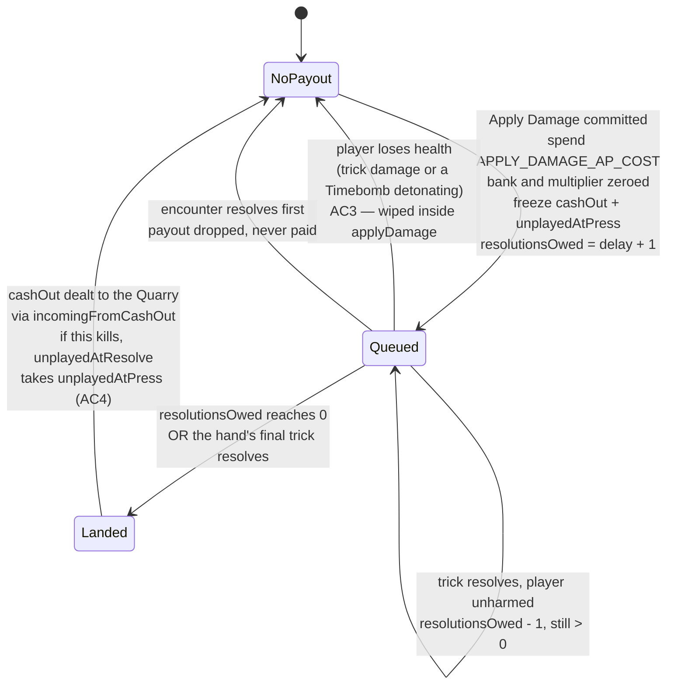

# Plan: Delayed Apply Damage payout

Plan folder: `.claude/contract/DLR-109-delayed-apply-damage-payout/`
Execution status: see `tasks.md` in this folder.

---

## Part 1 — Alignment

### Task reference

Jira **DLR-109** — "Delayed Apply Damage payout", task under epic **DLR-103** ("Version 5 — Buff Loadout, Slot Draws, and Delayed Apply Damage"). Label `engine`. Ticket body, verbatim in substance:

> **Problem statement.** This is the epic's core structural fix (§0 of the design doc): Apply Damage currently cashes the bank instantly with no risk. It needs to cost AP and queue its payout for a one-trick delay, reusing the delayed-hit plumbing already on `EncounterState` (`hunt/timebomb-and-the-delayed-hit.md`), with taking damage during that window wiping the queued value entirely — the same way an ordinary hit resets bank and multiplier today. The quick-kill payout (section 10 of `the-hunt.md`) currently counts unplayed cards at the instant the Quarry's health reaches zero; under a delayed kill this needs to freeze at press-time instead, per the game-designer consult's recommendation, so a deferred killing blow doesn't quietly under-count the hand that actually earned it.
>
> **User story.** As a player, pressing Apply Damage should be a real bet on surviving one more trick, not a guaranteed, instant, risk-free cash-out.
>
> **Acceptance criteria.**
> 1. Apply Damage costs AP: `APPLY_DAMAGE_AP_COST` (named, retunable constant, default `3` to start, explicitly flagged as open per §2 of the design doc).
> 2. Pressing Apply Damage queues the payout rather than resolving it immediately, resolving after the current trick plus the next trick — reusing the existing delayed-hit plumbing shape rather than a new mechanism.
> 3. Taking damage during the delay window wipes the queued payout to nothing, mirroring how an ordinary hit already resets bank and multiplier — verified by a unit test.
> 4. The quick-kill payout's unplayed-card count is snapshotted at the moment Apply Damage is pressed, not recalculated at the delayed resolution moment — verified by a unit test where a card is played during the delay window and the payout still reflects the press-time count.
> 5. Two buff hooks exist for future buffs to shorten (`applyDamageDelayTricks -1`) or remove (`applyDamageDelayTricks = 0`) the delay — the buffs themselves are authored in the slot-machine template pool ticket, this ticket only needs the delay to be a read value, not a hardcoded `1`.
>
> **Scope boundaries.** In scope: AP cost, the delay queue, reset-on-hit, the quick-kill snapshot fix, the delay-modifier hook. Out of scope: the two delay-modifying buffs themselves (authored as data elsewhere); any UI showing the pending payout.
>
> **Dependencies & risks.** Blocked by the AP core ticket. Risk: `applyDamageRefusalFor` is the existing single-source-of-truth pattern for this control — extend it rather than adding a second parallel refusal path.

**Vocabulary constraint carried from DLR-129 (`6ba6224`).** The mechanic formerly called Envenom/poison is **Timebomb**, with a fuse lexicon: *prime/primed* (marking a card), *ticking* (booked, unpreventable damage already owed), *detonates* (the hit landing), *Blast Guard* (the insurance item). The ticket body above quotes an older doc path (`hunt/envenom-and-the-delayed-hit.md`); the live file is `.docs/implementation/hunt/timebomb-and-the-delayed-hit.md`, and this plan uses only the fuse lexicon. `CardRank.Poison` (rank 8) is an unrelated card rank and is untouched.

**Unattended sprint run, 2026-08-23.** This plan is executed under the sprint-run standing instruction: the plan-approval gate is auto-approved, every open question takes this plan's stated default, and each such default is logged to `.claude/sprint-runs/2026-08-23-sprint/log.md`. No developer confirmation was obtained for anything in *Assumptions made* or *Risks and judgement calls* below.

### Restated goal

Apply Damage stops being a free, instant, risk-free cash-out. Pressing it now costs a named, retunable amount of AP, zeroes the bank and multiplier immediately as it already does, and **queues** the resulting cash-out rather than dealing it — the damage lands at a later trick resolution instead of in the same transition as the press. Any damage the player takes while that payout is in the air wipes it to nothing, exactly as an ordinary hit already wipes bank and multiplier. The number of tricks the payout waits is read from a function, not hardcoded, so a future buff can shorten or remove the delay without touching this code. And because the killing blow can now land a trick after the press, the quick-kill payout's unplayed-card count is frozen at press time so a deferred kill still pays for the hand that actually earned it.

### In scope

- `APPLY_DAMAGE_AP_COST` (default `3`) and `APPLY_DAMAGE_DELAY_TRICKS` (default `1`) as named tunables in `src/hunt/apConfig.ts`, re-exported through `src/hunt/config.ts` and the `src/hunt` barrel.
- A new pure module `src/hunt/applyDamagePayout.ts` owning the queued payout's shape, its delay-modifier hook `applyDamageDelayTricks`, its constructor, and its per-trick-resolution tick.
- A new `pendingApplyPayout` field on `EncounterState`, seeded `null` by `startEncounter`, **wiped inside `applyDamage`** whenever the player actually loses health or the encounter resolves (AC3's single enforcement point).
- Extension of the existing `applyDamageRefusalFor` single-source-of-truth path with two new reason codes — `PayoutPending` and `InsufficientAp` — and two new `ApplyDamageStock` fields, plus their copy in `src/app/warCouncil/labels.ts`.
- An `apPool` on `RoundUiState`, seeded per hand through `refreshActionPointsForNewHand`, spent through `spendAp` on a committed Apply Damage press.
- `handleTapApplyDamage` queues instead of applying; `applyResolution` in `commitHandlers.ts` settles the queued payout **after** the trick's own damage and after the Timebomb book/clear, and reports the press-time unplayed count when the delayed payout is what resolved the encounter.
- Unit tests for every rule above, including the explicit ordering test for a payout and a ticking Timebomb both outstanding on the same trick resolution.
- Documentation refresh of `.docs/implementation/hunt/` and `.docs/game_rules/the-hunt.md` via the `implementation-doc-writer` skill.

### Explicitly out of scope

- **The two delay-modifying buffs themselves.** `applyDamageDelayTricks` takes a modifier argument and every caller passes nothing today; authoring the buff data is a different ticket.
- **Any UI showing the pending payout.** No new component, no new rendered indicator, no change to `ApplyDamagePlate.tsx` or `WarCouncilRound.tsx`. The only new copy is the two refusal sentences the *existing* plate already renders from `APPLY_DAMAGE_REFUSAL_MESSAGE`.
- **Wiring the buff loadout, the buff pile, or `BuffActivationState` into the felt.** DLR-108's activation flow stays unreachable; this ticket adds no second activation mechanism and does not give `BuffActivationState` an owner. Apply Damage's AP draws through the same `actionPoints.ts` functions DLR-108's flow draws through, not through a parallel one.
- **Changing the forced cash-out fraction, the end-of-hand full cash-out, or `resolveTrickBank`.** `FORCED_CASH_OUT_*` and `bank.ts` are untouched.
- **Carrying a queued payout across a hand boundary or an encounter boundary.**
- **Persistence.** Nothing new is written to storage; `SAVE_SCHEMA_VERSION` is not bumped.

### Pattern Reference

Supplied by the brief:

- `applyDamageRefusalFor` in `src/warCouncil/voluntaryCashOut.ts` — named on the ticket as *the* single-source-of-truth refusal pattern to **extend, not duplicate**.
- The delayed-hit plumbing on `EncounterState` — `pendingTimebomb`, `queueTimebomb`, `hasPendingTimebomb` in `src/hunt/encounter.ts`, settled by `applyResolution` in `src/app/warCouncil/commitHandlers.ts`. Documented at `.docs/implementation/hunt/timebomb-and-the-delayed-hit.md`.
- Section 10 of `.docs/game_rules/the-hunt.md` — the quick-kill payout, implemented by `src/hunt/quickKill.ts` and fed by `RoundUiState.unplayedAtResolve` (`.docs/implementation/hunt/quick-kill-payout.md`).
- The AP core, DLR-104/DLR-108: `src/hunt/actionPoints.ts` (`apCostFor`, `canAffordAp`, `spendAp`, `refreshActionPointsForNewHand`) and `src/hunt/apConfig.ts`.

Chosen here, not supplied:

- `src/hunt/flask.ts` / `src/hunt/buffActivation.ts` — the house shape for a pure rules module: a reason-code `as const` map, a plain-values `*Stock` interface, one `*RefusalFor` predicate, no user-facing copy.
- `src/hunt/quickKill.ts` — the house shape for a small pure payout module with `RangeError` guards on non-finite input.

### Constraints flagged on the brief

- **Extend `applyDamageRefusalFor`; do not add a second refusal path.** Stated as the ticket's named risk.
- **Reuse the delayed-hit plumbing shape on `EncounterState`; do not invent a second mechanism.** Stated in AC2.
- **The delay must be a read value, not a hardcoded `1`.** Stated in AC5.
- **AC3 and AC4 each require a unit test**, named explicitly in the criteria.
- **`APPLY_DAMAGE_AP_COST` default `3`, flagged open.** The ticket supplies the number, so it is not an unchosen tuning value; it is transcribed, and flagged in Risks as never played.
- **Sprint-run constraint:** DLR-108's buff-activation module must not be wired up, and no parallel AP mechanism may be built.
- Project floor: strict TypeScript, no file over 400 lines, no `console.log`, pure-core boundary on `src/hunt/**` and `src/warCouncil/**` (no React, no DOM), Vitest with the `run` subcommand.

### Assumptions made

Every bullet here is a design reading the developer would normally settle. Under the sprint run they take this plan's default and are logged.

- **"Delay" is counted in trick *resolutions*, and the trick in flight counts as the first one.** `APPLY_DAMAGE_DELAY_TRICKS = 1` means "one whole trick *beyond* the trick the press happened in", so a press queues `delay + 1 = 2` resolutions. That is exactly AC2's "the current trick plus the next trick". A future buff setting the value to `0` shortens it to the single earliest possible landing — the resolution of the trick the press happened in. Rationale: the press always happens inside or immediately before a trick (`canAct` requires the player to be next to move), so "no delay at all" is not expressible as a trick count; one resolution is the floor, and defining the constant as *additional* tricks makes AC5's `-1` and `= 0` both meaningful.
- **The payout never crosses a hand boundary: an outstanding payout lands at the resolution of the hand's final trick.** Rationale: the alternatives are both worse. Dropping it silently makes a trick-6 press a pure loss of bank and AP with no counterplay — a dead zone at the exact moment the bank is biggest. Carrying it into the next hand contradicts the hand-scoped reset the ticket asks this to mirror (bank and multiplier are per-hand), and would put a stale press-time card count against a different hand. Surviving to the end of the hand *is* surviving, so it pays.
- **Resolution order when a payout and a ticking Timebomb are both outstanding: incoming damage first, the payout last.** Concretely, within one trick resolution: (1) the trick's own damage, which already includes any Timebomb detonating this trick, is applied; (2) the paid Timebomb queue is cleared; (3) this trick's new prime is booked; (4) the Apply Damage payout ticks and, if due, lands. Consequence, and the reason to state it: **a Timebomb that detonates against the player on the same trick the payout was due wipes the payout.** Rationale: this falls out of AC3 rather than being a separate rule — the bomb's damage *is* damage taken during the window — and putting the payout last is the only order in which AC3 cannot be dodged by timing.
- **A second Apply Damage press is refused while a payout is outstanding** (`ApplyDamageRefusal.PayoutPending`). Rationale: a second press would need a second countdown and a second press-time card snapshot; one queued payout keeps the field a single value, mirrors `pendingTimebomb` being settled before it is re-booked, and keeps AC4's snapshot unambiguous. Reachable in practice — the player can bank again during the delay window.
- **AC3's "taking damage" means the player's health actually decreased.** Enforced inside `applyDamage` in `src/hunt/encounter.ts`, the module's single clamp point, so no caller can route damage around it. A zero-damage event does not wipe; a Blast-Guard-suppressed streak reset does not wipe unless health still fell.
- **The queued payout is dropped, not paid, if the encounter resolves.** A dead Quarry needs no further damage and `applyDamage` throws on a resolved encounter; a dead player already triggered the wipe.
- **`apPool` lives on `RoundUiState`, seeded at mount from `refreshActionPointsForNewHand`, and does not travel on `RunState`.** Rationale: `AP_REFRESH_CADENCE` is `PerHand` and `App.tsx` already remounts the felt per hand (`key={hand}`), so a new hand *is* a new mount — a `RunState` field would be a second source of truth for a value that resets on every remount anyway, and would drag a persisted-shape question into a ticket that has none. Seeding through `refreshActionPointsForNewHand` rather than reading `STARTING_AP` directly means a cadence change needs no edit here. DLR-114/DLR-116 may move it when the buff rail needs the same pool.
- **`pendingApplyPayout` lives on `EncounterState`, not on `RoundUiState`**, even though it is hand-scoped in practice. Rationale: AC2 names `EncounterState` explicitly, and putting it there is what lets the wipe live inside `applyDamage` — the one function no damage path can avoid. A `RoundUiState` home would force the wipe to be re-derived by comparing health before and after at each call site, which is precisely the two-readings-of-one-rule failure this codebase keeps designing against.
- **The press-time unplayed count is the player's live hand length at the moment of the committing press** — the identical figure today's instant path already produces, because `captureUnplayed` runs in the same transition as the press. AC4 therefore preserves current behaviour rather than changing it, and only stops it drifting once the kill is deferred.
- **No `.tsx` file changes.** The two new refusal codes render through the existing `APPLY_DAMAGE_REFUSAL_MESSAGE` map that `ApplyDamagePlate.tsx` already reads, so the plate, `WarCouncilRound.tsx`, and the CSS are untouched. This keeps the ticket's "no UI showing the pending payout" boundary honest.
- **Both new tunables live in `src/hunt/apConfig.ts`, re-exported by `config.ts`.** Rationale: `config.ts` is at 372 of its 400-line blocking budget and `apConfig.ts` already exists as its sanctioned overflow with the re-export bridge in place. `APPLY_DAMAGE_DELAY_TRICKS` is not an AP figure; it is placed beside `APPLY_DAMAGE_AP_COST` under its own labelled comment because the two are one control's pair of tunables and splitting them across two files to satisfy a filename would be worse.
- **Copy for the two new refusals is placeholder**, consistent with `labels.ts`'s own stated posture, and uses the fuse lexicon nowhere — the payout is not a Timebomb and must not borrow *detonates*, *primed*, or *ticking*.

### Config and persisted-shape audit

- **`APPLY_DAMAGE_AP_COST`** — `Get-ChildItem src -Recurse -Include *.ts,*.tsx | Select-String "APPLY_DAMAGE_AP_COST"` returns **0 hits**. New key, no readers to update. Same for **`APPLY_DAMAGE_DELAY_TRICKS`** — **0 hits**.
- **`ApplyDamageStock` gains two required fields** (`payoutPending`, `apPool`). Required-field addition breaks every literal. Recursive grep for `timebombPending` — the existing field that marks a literal of this shape — returns **8 hits across 3 files**: `src/warCouncil/voluntaryCashOut.ts` (the interface and the predicate), `src/app/warCouncil/roundUiState.ts` (the one builder, `applyDamageStock`), and `src/warCouncil/__tests__/voluntaryCashOut.test.ts` (a single `stock()` factory at lines 12–18 plus its overrides). **Three files, one builder, one test factory** — all three are named in Task 4's and Task 8's `Files:` blocks. The compiler catches any miss.
- **`EncounterState` gains one field** (`pendingApplyPayout: PendingApplyPayout | null`). Recursive grep for `pendingTimebomb:` — the marker of a hand-built `EncounterState` literal — returns **8 hits across 4 files**: `src/hunt/types.ts` (the declaration), `src/hunt/encounter.ts` (`startEncounter` and `queueTimebomb`), `src/app/warCouncil/commitHandlers.ts` (the queue clear, a spread over an existing state), and `src/hunt/__tests__/run.beatenCount.test.ts` (3 literals, each spreading `run.encounter`). Only `startEncounter` constructs an `EncounterState` from nothing and therefore needs the new field written explicitly; every other site spreads an existing state and carries it for free. Verified by reading all four files, not inferred.
- **`ApplyDamageRefusal` is a widened union.** Recursive grep for `APPLY_DAMAGE_REFUSAL_MESSAGE` returns **10 hits across 4 files**: `src/app/warCouncil/labels.ts` (3 — the declaration at line 234 and two internal reads), `src/app/warCouncil/ApplyDamagePlate.tsx` (2 — import and render), `src/app/warCouncil/__tests__/labels.test.ts` (2) and `src/app/warCouncil/__tests__/ApplyDamagePlate.test.tsx` (3). Both test files only ever *index* the map with existing keys (`TimebombPending`, `EmptyBank`) and neither enumerates it, so neither breaks — read and confirmed, not assumed. Only `labels.ts` must change; `ApplyDamagePlate.tsx` renders whatever the map holds. The declaration is typed `Readonly<Record<ApplyDamageRefusal, string>>`, so adding a union member makes the map a **compile error** until both sentences are written — the widened-union case is caught by the type checker rather than by review. `applyDamageAccessibleName` (`labels.ts:246`) indexes the same map and needs no change.
- **Nothing here is persisted.** `Select-String` for `encounter` across `src/persistence/*.ts` returns **0 hits** — `EncounterState` is not part of any saved shape, no storage key changes, and `SAVE_SCHEMA_VERSION` is not bumped. `.claude/rules/save-data-versioning.md`'s six reject conditions are therefore all inapplicable: no `localStorage` access is added anywhere, no key is composed, no envelope is written, no payload is cast. Recording the window as open: it is, and this ticket does not close it.
- **Names align across the chain.** `APPLY_DAMAGE_AP_COST: ActionPoints` matches `spendAp`/`canAffordAp`'s parameter type; `APPLY_DAMAGE_DELAY_TRICKS: number` (a count of tricks, not action points) is deliberately not typed `ActionPoints`. No user-facing copy quotes either number, so no copy can drift from them.
- **Pure-core boundary holds.** `src/hunt/applyDamagePayout.ts` imports only `./apConfig` and `./types`; the new `encounter.ts` code imports only `./applyDamagePayout`. Neither imports React nor touches a DOM global, so `eslint.config.js`'s `src/hunt/**` override is satisfied. `voluntaryCashOut.ts` already imports from `../hunt` (line 1), so reading `APPLY_DAMAGE_AP_COST` and `canAffordAp` there adds no new edge and creates no cycle — `src/hunt/` still imports nothing from `src/warCouncil/`.

---

## Part 2 — Technical design

### Approach

The change has three layers and the seam between them is the whole design. The **rule** — what a queued payout is, how long it waits, when it becomes due — goes in a new pure module, `src/hunt/applyDamagePayout.ts`, which knows nothing about a round, a trick, or React and is testable as plain function-in/value-out. The **state** — where a queued payout lives and what destroys it — goes on `EncounterState`, alongside `pendingTimebomb`, because AC2 names that home and because it puts the wipe inside `applyDamage`, the one function in `src/hunt/encounter.ts` that every damage path already funnels through. The **orchestration** — when the tick happens relative to the trick's damage and the Timebomb book/clear — goes in `applyResolution` in `src/app/warCouncil/commitHandlers.ts`, which is already the single stated place a trick's whole effect on the encounter is assembled, and which is already the file that owns the load-bearing order for the Timebomb queue.

That last point is the reason the alternative was rejected. The tidier-looking option is to settle the payout inside `src/hunt/encounter.ts` so the whole mechanic lives in one module — but landing a payout means constructing an `IncomingDamage` keyed to the Quarry, and `incomingFromCashOut` in `src/warCouncil/voluntaryCashOut.ts` is the codebase's one sanctioned `PlayerSide → DuelSide` crossing for exactly that figure. `src/hunt/` cannot import `src/warCouncil/` without a cycle, so settling inside `hunt` would mean a second, duplicate crossing — the transposition bug `incomingFrom`'s own docblock warns about. Extending `applyResolution`, which already imports both sides, keeps the crossing singular and puts the ordering rule beside the ordering rule it must interleave with.

The **ordering** is the substantive judgement. `applyResolution` becomes: apply the trick's damage (which already folds in any Timebomb detonating this trick, via `playOptions`) → clear the paid Timebomb queue → book this trick's new prime → **then** tick the Apply Damage payout. Because the wipe lives inside `applyDamage`, a trick that costs the player health has already set `pendingApplyPayout` to `null` by the time the tick runs, so the tick finds nothing and the payout is gone. That makes "a detonating Timebomb wipes a due payout" a consequence of the order rather than a fifth rule, and it makes AC3 undodgeable by timing. `applyResolution`'s return type widens from `EncounterState` to a small `FoldedResolution` record so it can also report the press-time unplayed count on the one path where a *delayed* payout is what killed the Quarry — AC4's requirement, threaded into `RoundUiState.unplayedAtResolve` by `commit`, where `captureUnplayed` then finds it already written and leaves it alone.

The **AP cost** extends the existing refusal path rather than gating anywhere new. `ApplyDamageStock` gains `apPool` and `payoutPending`; `applyDamageRefusalFor` gains two reason codes in the order `NotYourMove → TimebombPending → PayoutPending → InsufficientAp → EmptyBank`, preserving that file's stated discipline of reporting the reason that will still be true after the next trick banks (`EmptyBank` stays last; AP refreshes only per hand, so `InsufficientAp` outlives a trick and precedes it). The pool itself lives on `RoundUiState`, seeded through `refreshActionPointsForNewHand` at mount — `App.tsx` remounts the felt per hand, so mount *is* the per-hand refresh — and is spent through `spendAp`, the only subtraction path, so `AP_ENABLED` is honoured with no bypass written here. Nothing about DLR-108's `BuffActivationState` is touched: both consumers draw on the same `actionPoints.ts` functions, which is what makes this an extension rather than a parallel mechanism.

### Skills to invoke during execution

- `react-frontend` — governs every file under `src/`: the pure-module placement, the reducer discipline, strict TypeScript, the 400-line budget, and Vitest posture. The normal entry for this project's code work.
- `implementation-doc-writer` — owns `.docs/implementation/hunt/` and `.docs/game_rules/the-hunt.md`. This ticket changes a playable rule (Apply Damage costs AP and no longer lands instantly) and adds a mechanic to the `hunt` module, so both must be refreshed by that skill rather than by hand.
- `management-jira` — the closing transition to `Ready for Test`, run only if the four gates are green and the work is committed.

Rules the executor must Read: `.claude/rules/save-data-versioning.md` (scanned; the audit above finds it inapplicable — nothing persisted changes — but the executor must confirm that for itself before writing storage-adjacent code). Workflow: `.claude/workflow/web-project.md`.

No developer override was applied to this list — the sprint run is non-interactive and the skill-confirmation `AskUserQuestion` was skipped.

### Diagram



### Data shapes

#### New tunables — `src/hunt/apConfig.ts` (re-exported by `config.ts` and the `src/hunt` barrel)

```ts
// DLR-109 AC1. Transcribed from the ticket, which sets the default and flags it OPEN per §2 of
// the design doc. NEVER PLAYED. UNIT: action points per Apply Damage press.
export const APPLY_DAMAGE_AP_COST: ActionPoints = 3

// DLR-109 AC2/AC5. The number of WHOLE TRICKS BEYOND the trick the press happened in that the
// payout must survive. `1` is AC2's "the current trick plus the next trick": one press queues
// `APPLY_DAMAGE_DELAY_TRICKS + 1` trick resolutions. NOT typed ActionPoints — it is a count of
// tricks. UNIT: tricks. NEVER PLAYED.
export const APPLY_DAMAGE_DELAY_TRICKS = 1
```

#### New pure module — `src/hunt/applyDamagePayout.ts`

```ts
/** A cash-out pressed but not yet dealt. Every figure FROZEN at the press. */
export interface PendingApplyPayout {
  /** The full `cashValue` at the press. Never recomputed. */
  readonly cashOut: number
  /** Trick resolutions still to survive. Strictly positive while queued. */
  readonly resolutionsOwed: number
  /** AC4 — the player's hand size at the press, for `quickKillPayout`. */
  readonly unplayedAtPress: number
}

/** AC5's hook. Both fields are optional and every caller today passes nothing. */
export interface ApplyDamageDelayModifiers {
  /** Buffs that SHORTEN the delay. Summed by the caller; clamped at 0 here. */
  readonly shortenBy?: number
  /** Buffs that REMOVE the delay outright. Wins over `shortenBy`. */
  readonly removeDelay?: boolean
}

/** AC5 — THE single statement of how long the delay is. Never a literal `1` at a call site. */
export function applyDamageDelayTricks(modifiers?: ApplyDamageDelayModifiers): number

/** Freezes a press into a queued payout. Throws `RangeError` on a non-positive or non-finite
 *  `cashOut`, or a negative or non-finite `unplayedAtPress` — a caller that skipped
 *  `applyDamageRefusalFor` is a caller bug, and a NaN payout would vanish into a health bar. */
export function queueApplyPayout(
  cashOut: number,
  unplayedAtPress: number,
  modifiers?: ApplyDamageDelayModifiers,
): PendingApplyPayout

/** One trick resolution's effect on the queue. `pending` is what to store; `due` is what to pay,
 *  and exactly one of them is non-null when the input was non-null. */
export interface ApplyPayoutTick {
  readonly pending: PendingApplyPayout | null
  readonly due: PendingApplyPayout | null
}

/** Decrements, and reports the payout as due when it reaches zero OR when `handEnding` is true —
 *  the plan's "an outstanding payout lands at the resolution of the hand's final trick". NEVER
 *  throws: it runs inside a reducer. `null` in gives `{ pending: null, due: null }`. */
export function tickApplyPayout(
  pending: PendingApplyPayout | null,
  handEnding: boolean,
): ApplyPayoutTick
```

#### `src/hunt/types.ts` — `EncounterState` gains one field

```ts
export interface EncounterState {
  readonly health: Readonly<Record<DuelSide, Health>>
  readonly damageEventsApplied: number
  readonly winner: DuelSide | null
  readonly pendingTimebomb: IncomingDamage
  /** DLR-109 AC2 — a cash-out pressed but not yet dealt, or `null`. Sibling of `pendingTimebomb`
   *  above and seeded `null` by `startEncounter`, which is what discards it at an encounter
   *  boundary with no explicit clear step to forget. NOT PERSISTED. */
  readonly pendingApplyPayout: PendingApplyPayout | null
}
```

#### `src/hunt/encounter.ts` — two new exports, one changed behaviour

```ts
/** Whether a pressed cash-out is still in the air. ONE statement, so the refusal and the tick
 *  cannot disagree — the discipline `hasPendingTimebomb` already sets. */
export function hasPendingApplyPayout(encounter: EncounterState): boolean

/** AC2 — hold `payout` against the encounter. Returns the encounter UNCHANGED when it is already
 *  resolved or when one is already queued (the plan's one-at-a-time rule). NEVER throws: the
 *  reducer calls this during an event handler. */
export function queueApplyDamagePayout(
  encounter: EncounterState,
  payout: PendingApplyPayout,
): EncounterState

// applyDamage's returned state gains, at the single clamp point:
//   pendingApplyPayout: playerLostHealth || winner !== null ? null : encounter.pendingApplyPayout
// where playerLostHealth is `playerHealth < encounter.health[DuelSide.Player]`. AC3.
```

#### `src/warCouncil/voluntaryCashOut.ts` — widened union and widened stock

```ts
export const ApplyDamageRefusal = {
  EmptyBank: 'emptyBank',
  TimebombPending: 'timebombPending',
  /** DLR-109 — a pressed cash-out is still in the air. One at a time. */
  PayoutPending: 'payoutPending',
  /** DLR-109 AC1 — the hand's AP pool does not cover `APPLY_DAMAGE_AP_COST`. */
  InsufficientAp: 'insufficientAp',
  NotYourMove: 'notYourMove',
} as const

export interface ApplyDamageStock {
  readonly bank: number
  readonly multiplier: number
  readonly timebombPending: boolean
  /** DLR-109 — a cash-out is already queued and undelivered. */
  readonly payoutPending: boolean
  /** DLR-109 AC1 — the hand's remaining action points. */
  readonly apPool: ActionPoints
  readonly canAct: boolean
}

// applyDamageRefusalFor's order becomes, unchanged in shape, five clauses:
//   NotYourMove → TimebombPending → PayoutPending → InsufficientAp → EmptyBank
// InsufficientAp reads `canAffordAp(stock.apPool, APPLY_DAMAGE_AP_COST)`, so AP_ENABLED is
// honoured through apCostFor with no second bypass written here.
```

#### `src/app/warCouncil/roundUiState.ts`

```ts
export interface RoundUiState {
  // …unchanged fields…
  /** DLR-109 AC1 — the hand's action-point pool. Seeded at mount through
   *  `refreshActionPointsForNewHand`, because `App.tsx` remounts the felt per hand (`key={hand}`),
   *  so a mount IS the per-hand refresh. Spent only through `spendAp`. */
  readonly apPool: ActionPoints
}

// createRoundUiState adds:  apPool: refreshActionPointsForNewHand(STARTING_AP)
// RoundUiSeed is UNCHANGED — no new mount prop, so `warCouncilMount.ts` and every mount site
// stay untouched.

// applyDamageStock gains two lines:
//   payoutPending: hasPendingApplyPayout(state.encounter),
//   apPool: state.apPool,
```

#### `src/app/warCouncil/commitHandlers.ts` — `applyResolution` widens its return

```ts
/** What one trick's resolution did to the encounter, plus AC4's press-time count when a DELAYED
 *  payout is what resolved it. `null` on every other path. */
interface FoldedResolution {
  readonly encounter: EncounterState
  readonly unplayedAtPress: number | null
}

function applyResolution(
  encounter: EncounterState,
  resolution: TrickResolution,
  handEnding: boolean,
): FoldedResolution

/** The payout half, split out so the four-step order reads as four steps. Ticks the queue and,
 *  when due, deals `cashOut` through `incomingFromCashOut` — the ONE sanctioned crossing. */
function settleApplyPayout(encounter: EncounterState, handEnding: boolean): FoldedResolution
```

`commit` passes `handEnding` as `result.state.phase === RoundPhase.Complete` for the player's own follow, and `advanced.round.phase === RoundPhase.Complete` for the Quarry's follow, and folds `unplayedAtPress` into `unplayedAtResolve` only when that field is still `null`.

#### `src/app/warCouncil/labels.ts` — two new sentences

```ts
export const APPLY_DAMAGE_REFUSAL_MESSAGE: Readonly<Record<ApplyDamageRefusal, string>> = {
  // …existing three…
  [ApplyDamageRefusal.PayoutPending]:
    'Your last Apply is still in the air — it lands when the next trick resolves.',
  [ApplyDamageRefusal.InsufficientAp]: 'Not enough action points to apply.',
}
```

#### `src/hunt/index.ts` — barrel additions

```ts
export type { PendingApplyPayout, ApplyDamageDelayModifiers, ApplyPayoutTick } from './applyDamagePayout'
export { applyDamageDelayTricks, queueApplyPayout, tickApplyPayout } from './applyDamagePayout'
// added to the existing './encounter' export block:
//   hasPendingApplyPayout, queueApplyDamagePayout
// added to the existing config-constant export block:
//   APPLY_DAMAGE_AP_COST, APPLY_DAMAGE_DELAY_TRICKS
```

No `package.json` change, no new dependency, no script change.

### Runtime quality notes

- **Purity and adjudication.** Every rule is in a pure module: `applyDamagePayout.ts` (how long, when due), `encounter.ts` (where it lives, what wipes it), `voluntaryCashOut.ts` (whether the press is allowed). None imports React or touches a DOM global, so `eslint.config.js`'s `src/hunt/**` / `src/warCouncil/**` override holds. The app layer contributes only ordering and threading — `commitHandlers.ts` decides *when* the tick happens, not *what* it means. No component decides anything: `ApplyDamagePlate.tsx` is not edited and continues to read its disabled state from `applyDamageRefusalFor`. Both new numbers are configuration keys read by name; neither `3` nor `1` appears as a literal in logic.
- **Effects, mount and teardown.** No effect is added, no listener, timer, observer, `requestAnimationFrame`, or `AbortController` is created, and no cleanup is therefore needed. The only lifecycle interaction is the reducer's lazy initialiser: `createRoundUiState` gains `apPool: refreshActionPointsForNewHand(STARTING_AP)`, which is a pure call on a module constant and returns an identical value on StrictMode's development double-invocation — the property that file already documents for its other fields. `roundReducer` stays a pure `(state, action) => state`, so the development double-dispatch recomputes an identical result; the payout tick is driven by trick resolutions inside the reducer, never by a timer. No module-level mutable state is introduced anywhere.
- **Hot-path cost.** Nothing here runs per pointer move. `tickApplyPayout` is an integer decrement executed at most twice per trick (once for each side's resolution), on a single nullable object — no allocation per frame, no collection scan, no search. `applyDamageStock` gains two field reads. The added per-transition work is constant and unmeasurable; no memoisation is added and none is warranted.
- **Determinism and numeric safety.** No `Math.random()` is reachable from any of this — the payout is a frozen number and a counter. There is no division anywhere in the new code, so the classic `NaN` source is absent, but a caller can still hand one in: `queueApplyPayout` refuses a non-finite or non-positive `cashOut` and a non-finite or negative `unplayedAtPress` with a `RangeError` before freezing them, exactly as `quickKillPayout` and `flaskHealAmount` guard their inputs, because a `NaN` payout would reach a rendered heart row and vanish with nothing logged. `tickApplyPayout` compares `resolutionsOwed <= 0` rather than `=== 0`, so a corrupted counter still terminates rather than queueing forever. No epsilon is needed — every value is an integer count or an already-floored cash figure.
- **Error paths.** Three guarded, one throwing, and the split is deliberate. `queueApplyDamagePayout` and `tickApplyPayout` **never throw** — both run inside the reducer during an event handler, where a throw unmounts the tree; they return the input unchanged or an empty tick instead. `queueApplyPayout` **does** throw, because it is a constructor reached only after `applyDamageRefusalFor` returned `null`, and silently freezing a garbage payout is the bug that type-checks. `spendAp` likewise throws on an unaffordable spend and is likewise guarded by the `InsufficientAp` refusal that precedes it — the reducer never reaches it without having asked. An invalid press cannot commit: `handleTapApplyDamage` re-reads `applyDamageRefusalFor` on **both** taps, as it already does, and a refusal drops the held poise rather than half-applying. Every refusal names a specific reason code that the plate already renders on its face. Nothing is caught-and-defaulted; no failure is turned into a success shape; no async surface is added, so the four async states do not arise.

### Risks and judgement calls

- **`APPLY_DAMAGE_AP_COST = 3` has never been played.** The ticket supplies it and flags it open per §2 of the design doc. Against `STARTING_AP = 6` it means at most two presses a hand before any buff activation is priced in, which may be far too tight once DLR-114/DLR-116 make buffs spend from the same pool. The developer's to move.
- **`APPLY_DAMAGE_DELAY_TRICKS = 1` has never been played either**, and it is the value that decides whether Apply Damage still feels usable at all. One trick of exposure on a six-trick hand may be trivial or may make the button dead weight; only playing tells.
- **The hand-end flush is a design reading, not a transcription.** Letting an outstanding payout land at the final trick's resolution makes a late press meaningfully safer than an early one, which is the opposite of the usual risk curve. The alternative — drop it — is harsher and creates a dead zone. Neither is in the ticket. Worth a playtest specifically of trick-5 and trick-6 presses.
- **One-at-a-time is a design reading.** Refusing a second press while one is in the air removes a "double down" line of play that some players will look for. The alternative is accumulating payouts with independent countdowns, which multiplies the state and muddies AC4's snapshot.
- **The Timebomb-wins ordering is a design reading.** A payout due on the same trick a Timebomb detonates against the player is destroyed. It is the only order consistent with AC3, but it means a primed card can eat a large banked cash-out, which will feel severe the first time it happens.
- **No feedback whatsoever that a payout is in the air.** The ticket puts this UI out of scope, and this plan honours that — so a player will press Apply, see the bank zero, see the Quarry's health not move, and be told nothing. The refusal sentence only appears if they press *again*. **This is the single thing most worth the developer looking at in the running app**, and it is a feel question no automated check can answer. A follow-up UI ticket is very likely warranted.
- **AP is invisible.** `apPool` now exists and is spent, but nothing renders it, so an `InsufficientAp` refusal will read as the button mysteriously dying. Same follow-up.
- **`apPool` on `RoundUiState` rather than `RunState`** is right under `AP_REFRESH_CADENCE = PerHand` and per-hand remounting, and wrong the day the cadence becomes per-fight or per-run. The cadence lives in one place and the seed goes through `refreshActionPointsForNewHand`, so the change is localised — but it *is* a change, and DLR-114/DLR-116 may prefer to move the pool up first.
- **`applyResolution`'s widened return type** is the least pretty part of the design: a function that returned a state now returns a record so it can also carry AC4's snapshot. The alternative — a second `EncounterState` field holding "the count at the kill" — was rejected as adding permanent state to model a single transition, but a reviewer may reasonably prefer it.
- **`commitHandlers.ts` grows.** It is 143 lines today and the payout half adds roughly 60. Comfortably inside budget, but the file is now carrying two delayed-effect orderings; if a third arrives it should be split rather than extended.
- **This work IS player-reachable** — pressing Apply Damage in the running app now costs AP and defers its payout — so the browser pass is required, not skippable as unreachable code.
