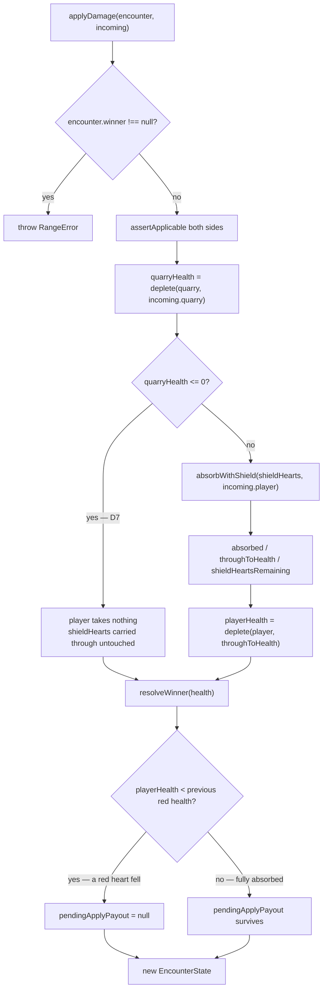

# Plan: Shield redesign — blue hearts on the health bar

Plan folder: `.claude/contract/DLR-110-shield-redesign-blue-hearts/`
Execution status: see `tasks.md` in this folder.

---

## Part 1 — Alignment

*(The shared understanding of what this task is doing.)*

### Task reference

**Jira DLR-110 — "Shield redesign: blue hearts on the health bar"** (Task, epic DLR-103, label `engine`).

Problem statement, verbatim:

> Shield currently doesn't exist as a shipped mechanic (Bulwark, its hidden-counter predecessor, is cut entirely per §7 of the design doc). The redesign makes Shield add visible, non-stacking, non-healable "blue heart" pips directly to the health bar, tiered by count (bronze 1 / silver 2 / gold 3).

Acceptance criteria, verbatim:

1. Health state supports a second pip type ("blue heart") alongside the existing health pips.
2. Activating Shield sets the blue-heart count to the tier's value (`SHIELD_HEARTS = { bronze: 1, silver: 2, gold: 3 }`) — it does not add to any existing blue hearts, it resets to the tier's count, verified by a unit test re-activating a lower tier after a higher one.
3. Blue hearts cannot be restored by Heal, the flask, or any other source, once lost — verified by a unit test.
4. Damage absorption order is explicit and tested: blue hearts absorb damage before ordinary hearts (the doc's own framing — "dividing what you take" — implies protection-first; this ordering is stated here rather than left implicit).

Scope boundaries, verbatim:

> **In scope:** the blue-heart pip type, tier-reset (not stack) behavior, non-heal rule, absorption order.
> **Out of scope:** rendering the second pip type on screen; Shield's own AP activation cost (covered generically by the buff-activation flow ticket, since Shield is an ordinary buff by this point).

Design source: `.docs/design/Balatro-Forbidden-Solitaire/version-5-developer-idea.md` §7 and §7a ("Shield, redesigned — blue hearts on the health bar").

**Sibling ticket DLR-115 — "Health bar: rendering blue hearts"** (label `ui`, `playable`) owns rendering. Its own out-of-scope line reads "the absorption-order rule itself (engine ticket)", which is the exact complement of this ticket's out-of-scope line. The two descriptions agree on the boundary; see *Explicitly out of scope* below.

**Sprint-run note (2026-08-23):** planned and applied unattended. The plan approval gate was auto-approved with every stated default taken; no mockup was produced (see *Assumptions made*); no browser pass was requested.

### Restated goal

Give the encounter a second, separately-tracked pool of hit points — "blue hearts" — that Shield's activation sets (never adds to), that no heal path can refill, and that soaks incoming damage before ordinary red health does. All of it is engine state and engine arithmetic inside `src/hunt/`: nothing in this ticket puts a blue pip on screen, and nothing changes what the health bar currently draws. The deliverable is a pure, unit-tested rule that DLR-115 can then read and render.

### In scope

- A new pure module `src/hunt/shield.ts` holding the tier table `SHIELD_HEARTS = { bronze: 1, silver: 2, gold: 3 }` and the absorption arithmetic.
- A `shieldHearts` field on `EncounterState`, seeded to zero by `startEncounter`.
- `activateShield(encounter, tier)` on `encounter.ts` — sets, never adds (AC2), including downward.
- Absorption inside `applyDamage`: blue hearts take the player's damage first, the remainder reaches red health (AC4).
- `BuffKind.Shield` plus `shieldBuff(tier, id)` / `shieldHeartsOf(buff)` in `buffCatalog.ts`, on the already-existing `BuffRewardAxis.HeartCount` axis, so Shield is an ownable card like Cheat and Timebomb.
- The forced consequences of adding a `BuffKind` member: a `BUFF_CADENCE` row and a `CONSUMABLE_AP_COST` row (both are `Record`s over closed unions and will not compile without them).
- Unit tests for AC2 (down-tier reset), AC3 (flask and shop Heal leave blue hearts alone), AC4 (absorption order, partial absorption, exact absorption, overkill), the encounter-boundary clear, and the DLR-109 payout interaction.
- Barrel exports from `src/hunt/index.ts`.

### Explicitly out of scope

- **Everything DLR-115 owns.** No change to `src/app/warCouncil/duelHealthBars.ts`, no new `HeartState` member, no `warCouncilHealthBars.css` rule, no `.tsx` edit, no spoken-form/label change. `HealthBarView` keeps its current shape.
- Shield's AP activation cost *flow* — `buffActivation.ts` already prices and spends generically and is not edited here.
- Wiring a Shield card into the shop, the slot draw, or the starting pile. Nothing player-reachable mints a Shield in this ticket, exactly as nothing player-reachable mints a Cheat buff after DLR-107.
- Quarry-side shields. Blue hearts are the player's only (see *Assumptions made*).
- Fixing `Ward`'s known tier defect (silver/gold indistinguishable at `DAMAGE_PER_HIT = 1`). Untouched.
- Persisting shield state.

### Pattern Reference

- `src/hunt/flask.ts`, `src/hunt/quickKill.ts`, `src/hunt/applyDamagePayout.ts` — the "one small pure module per mechanic, no state shape imported" pattern `shield.ts` follows.
- `src/hunt/encounter.ts`'s `queueTimebomb` / `queueApplyDamagePayout` — the shape `activateShield` copies: takes `EncounterState`, returns a new one, returns it unchanged on a resolved encounter, never throws.
- `src/hunt/buffCatalog.ts`'s `cheatBuff` / `cheatDurationTricksOf` — the shape `shieldBuff` / `shieldHeartsOf` copies, including the throw-on-wrong-kind discipline.
- `.claude/skills/react-frontend/SKILL.md` for conventions.

### Constraints flagged on the brief

- `src/hunt/` is lint-enforced DOM-free and must stay deterministic — no `Math.random()`, no React import.
- `src/hunt/` may not import `src/warCouncil/` (cycle).
- Files over 400 lines are blocking. `encounter.ts` is 223 lines today; the arithmetic goes in a new module partly for this reason.
- Vocabulary changed at `6ba6224`: Timebomb / prime / ticking / detonates / Blast Guard. No "Envenom", no "poison" outside `CardRank.Poison`.
- `applyDamage` is the codebase's single clamp point and single damage funnel (DLR-70, DLR-109 AC3). Absorption must live inside it, not at a call site.
- Baseline before this ticket: 1220 passed / 1220, 94 files.

### Assumptions made

Every bullet here is a default taken without the developer; none was confirmed.

- **A blue heart is a temporary hit point worth exactly 1 damage, not an absorb-one-hit token.** A 3-damage hit against 2 blue hearts consumes both and lets 1 through. Rationale: §7a's stated goal is "dividing what you take"; per-point absorption divides, whole-hit absorption negates. It also keeps Shield distinct from `Ward`, which `v1-buff-card-list.md` defines as "absorbs up to N on the **next** hit, then breaks regardless" — Ward is per-hit and self-destructs, Shield is per-point and persists. **Ward's code is not touched and not fixed.**
- **Blue hearts are the player's only.** `shieldHearts` is a single `Health`, not a `Record<DuelSide, Health>`. Rationale: §7a says "the player's health bar"; a side-keyed field would model a Quarry shield that nothing can create and every reader would have to handle. `pendingTimebomb` is side-keyed because Timebomb genuinely hits both sides; this does not.
- **Blue hearts live on `EncounterState`, so they survive a hand and are cleared at an encounter boundary.** §7a says "for that hand" in one sentence and "re-activating Shield a later hand resets to the tier's count" in the next; the second only makes sense if hearts survive into a later hand, so "for that hand" is read as loose phrasing about when they arrive. Living on `EncounterState` means `startEncounter` seeds them to zero and there is no explicit clear step to forget — the same reason `pendingTimebomb` and `pendingApplyPayout` live there.
- **`activateShield` sets even downward.** Bronze after gold leaves 1, not 3. AC2 asks for exactly this test and the wording is "resets to the tier's count".
- **A hit fully absorbed by blue hearts does not destroy a queued Apply Damage payout.** DLR-109's rule keys off `playerLostHealth`; with the absorption ahead of `deplete`, a fully-absorbed hit leaves red health untouched and the payout survives. A partially-absorbed hit that still drops red health destroys it as before. Rationale: the payout loss is the price of taking a hit, and a shield that ate the hit did its job. This falls out of the existing line rather than needing a new branch, but it is a rules reading and is tested both ways.
- **The Quarry-down short-circuit spends no blue hearts.** D7 already gives the player zero damage when the Quarry dies to the same event, so absorption never runs on that branch.
- **Shield becomes a `BuffKind`.** §7a and §7's card list put Shield "alongside Cheat, Timebomb". Adding the member forces a `BUFF_CADENCE` row (`Activated`) and a `CONSUMABLE_AP_COST` row, because both tables are `Record`s over closed unions. The price row is a forced consequence of the type, not an attempt to own the out-of-scope activation cost; the numbers are flagged in *Risks*.
- **No mockup.** `/fb-plan` Step 3.5 fires only for work touching a `.tsx` surface, `App.tsx`, or a `use*` hook. This ticket's file map contains none — every rendered pip is DLR-115's. The step is skipped as the command specifies, not waived.

### Config and persisted-shape audit

- `SHIELD_HEARTS`: **0 hits** across `src/**`. New key, nothing to migrate.
- `shieldHearts`: **0 hits** across `src/**`. New field name, no collision.
- `BuffKind` is a closed `as const` union with **128 `BuffKind.` references** across `src/`. Adding `Shield` is a *widening*, so no existing equality check or narrowing changes meaning. The one exhaustiveness site is `Readonly<Record<BuffKind, BuffCadence>>` at `src/hunt/buffs.ts:166` — **1 hit for `Record<BuffKind`** — which fails to compile until a `Shield` row is added, which is the intended behaviour of that table's own docblock. `CONSUMABLE_AP_COST` is keyed by the narrower `BuffConsumableKind`, so `Shield` must be added to that union *and* the table together or `apCostOf(shieldBuff(...))` throws at runtime.
- `EncounterState` object-literal construction sites: **2** — `startEncounter` and `applyDamage`'s return literal, both in `src/hunt/encounter.ts`. **Corrected after implementation: the original audit said 1 and undercounted**, missing `applyDamage` even though it writes `damageEventsApplied:` and the grep that produced this bullet was over exactly that string. Every *other* producer spreads an existing state, so a new required field lands in these two places and nowhere else — the next ticket that adds an `EncounterState` field must update both.
- **Nothing is persisted.** `createSaveStore` / `SaveStore<` have **0 hits outside `src/persistence/`** — the store from DLR-106 exists but has no consumer, and `EncounterState` appears nowhere under `src/persistence/`. `.claude/rules/save-data-versioning.md`'s reject conditions therefore do not bind this diff. Recorded deliberately: the window is still open, and the first ticket that persists `EncounterState` inherits `shieldHearts` as a field that must be defaulted for an old record.
- **String-bound surfaces are untouched.** `HeartState`'s five values are written into the DOM as `data-state` and paired with attribute selectors in `warCouncilHealthBars.css`; no value is added, renamed, or removed here. That pairing is DLR-115's to extend.
- Boundary check: `shield.ts` imports only `./buffs` and `./types` — no DOM global, no React, no `src/warCouncil/` edge.

---

## Part 2 — Technical design

### Approach

The mechanic is split three ways, along the seam this module tree already uses. `src/hunt/shield.ts` is a new pure module holding two things and no state shape: the `SHIELD_HEARTS` tier table, and `absorbWithShield(shieldHearts, damage)` — a total function returning `{ absorbed, throughToHealth, shieldHeartsRemaining }`. It knows nothing about `EncounterState`, which is what makes the absorption rule unit-testable against a table of cases without constructing an encounter. `src/hunt/encounter.ts` owns the state transitions, as it already does for Timebomb and the queued payout: `activateShield(encounter, tier)` and the one call to `absorbWithShield` inside `applyDamage`. `src/hunt/buffCatalog.ts` gains Shield's card representation.

The alternative shapes, and why not. **Absorbing at the call site** (`commitHandlers.ts` subtracting before it calls `applyDamage`) was rejected outright: `applyDamage` is this codebase's single damage funnel and single clamp point, and a shield that only works on the routes that remembered to check is the exact bug DLR-109 AC3's docblock argues against. **Folding blue hearts into `health[Player]` as extra points** was rejected because AC3 then becomes unenforceable — a heal clamped to `maxPlayerHealth` cannot tell a restored red point from a restored blue one, and the two would have to be distinguished by a second parallel counter anyway. **Making `shieldHearts` a `Record<DuelSide, Health>`** was rejected in *Assumptions made*. **Putting the tier table in `config.ts`** was rejected because `SHIELD_HEARTS` is a transcribed design figure keyed by `BuffTier`, which is exactly what `buffCatalog.ts`'s `CHEAT_DURATION_TRICKS` is and where it lives; `config.ts` holds the run's tunables and is already 374 lines.

Control flow at runtime is one added step in `applyDamage`. The Quarry is depleted first (D7, unchanged). If the Quarry survives, the player's incoming damage goes through `absorbWithShield` against the current `shieldHearts`; `throughToHealth` is what `deplete` then subtracts from red health, and `shieldHeartsRemaining` is written onto the returned state. If the Quarry went down, the player takes nothing and the shield is copied through untouched. `playerLostHealth` — DLR-109's payout-destroying predicate — continues to compare red health before and after, so a fully-absorbed hit leaves it false and the payout alive.

Nothing renders. `duelHealthBars` and its component are not in the file map; `EncounterState` gaining a field is invisible to them because they read `encounter.health`. DLR-115 will read `encounter.shieldHearts`, add a sixth `HeartState`, and extend the CSS — none of it needs an engine change on top of this one.

### Skills to invoke during execution

- `react-frontend` — governs everything under `src/`, including the pure `src/hunt/` modules and their Vitest coverage. The whole diff is under `src/`.
- `game-ux` — invoked during planning for the legibility ruling this ticket must not violate and DLR-115 must satisfy; **it governs no file in this diff**, because this diff renders nothing. Its ruling is recorded in *Risks and judgement calls* so DLR-115 inherits it.
- `implementation-doc-writer` — after the gates are green, to update `.docs/implementation/hunt/` and `.docs/game_rules/the-hunt.md`.
- `management-jira` — the Ready for Test transition, only if the commit is green.

Rules to read: `.claude/rules/save-data-versioning.md` (audited above — it does not bind this diff, but the executor should confirm that for itself before writing any field). Workflow: `.claude/workflow/web-project.md`.

### Diagram



### Data shapes

#### New module `src/hunt/shield.ts`

```ts
/** UNIT: blue hearts granted by ONE activation, by tier. TRANSCRIBED from design §7a
 *  ("bronze adds 1, silver 2, gold 3") and DLR-110 AC2. NOT chosen here. */
export const SHIELD_HEARTS: Readonly<Record<BuffTier, number>>

/** No protection — what `startEncounter` seeds and what a spent shield returns to. */
export const NO_SHIELD_HEARTS: Health

/** One damage event split by the shield. Every field non-negative and finite. */
export interface ShieldAbsorption {
  readonly absorbed: Damage
  readonly throughToHealth: Damage
  readonly shieldHeartsRemaining: Health
}

/** Blue hearts absorb one point of damage each, before red health sees any of it (AC4). */
export function absorbWithShield(shieldHearts: Health, damage: Damage): ShieldAbsorption

/** How many blue hearts `tier` grants. THE only reader of `SHIELD_HEARTS`. */
export function shieldHeartsForTier(tier: BuffTier): Health
```

#### Modified `src/hunt/types.ts`

```ts
export interface EncounterState {
  // …existing fields unchanged…
  /** DLR-110 — the player's blue hearts. NOT part of `health`, NOT healable, spent before red
   *  health. A scalar, not a `Record<DuelSide, …>`: only the player can hold them. Seeded to
   *  `NO_SHIELD_HEARTS` by `startEncounter`, which is what clears it at an encounter boundary.
   *  NOT PERSISTED. */
  readonly shieldHearts: Health
}
```

#### Modified `src/hunt/encounter.ts`

```ts
/** AC2 — SETS the count to the tier's value; never adds. Bronze after gold leaves 1.
 *  Returns the encounter unchanged when it is already resolved. NEVER throws. */
export function activateShield(encounter: EncounterState, tier: BuffTier): EncounterState

/** Whether any blue heart is standing. ONE statement, so a rule and a reading cannot disagree. */
export function hasShieldHearts(encounter: EncounterState): boolean
```

#### Modified `src/hunt/buffs.ts`

```ts
export const BuffKind = { /* …existing… */ Shield: 'shield' } as const
// BUFF_CADENCE gains: [BuffKind.Shield]: BuffCadence.Activated
```

#### Modified `src/hunt/buffCosts.ts`

```ts
export type BuffConsumableKind = /* …existing seven… */ | typeof BuffKind.Shield
// CONSUMABLE_AP_COST gains a Shield row — VALUE IS A DEVELOPER DECISION, see Risks.
```

#### Modified `src/hunt/buffCatalog.ts`

```ts
/** Mint a Shield buff at `tier`, on the `heartCount` axis `buffs.ts` already documents as
 *  Shield's. */
export function shieldBuff(tier: BuffTier, id: BuffId): Buff

/** Blue hearts this Shield buff grants. Reads `buff.reward.value` — the figure the buff was
 *  MINTED with. THROWS on any other kind, per `cheatDurationTricksOf`'s discipline. */
export function shieldHeartsOf(buff: Buff): Health
```

No configuration-file key, no `package.json` change, no dependency. No persisted shape affected.

### Runtime quality notes

- **Purity and adjudication:** the entire diff is pure `src/hunt/` — no DOM, no React, no `Math.random()`. `shield.ts` holds the arithmetic and imports no state shape; `encounter.ts` holds the transitions. No component decides anything: absorption happens inside `applyDamage`, the single funnel, so no caller can bypass it or reimplement it. `SHIELD_HEARTS` is read only through `shieldHeartsForTier`, so one tier has exactly one answer.
- **Effects, mount and teardown:** trivial — no effects, no listeners, no timers, no `requestAnimationFrame`, no module-level mutable state. Every function returns a new value and mutates nothing, so StrictMode's double invocation recomputes an identical result, exactly as `drinkFlask`'s docblock in `App.tsx` already relies on.
- **Hot-path cost:** `absorbWithShield` is three arithmetic operations and one small object literal, called at most once per damage event — an event fires a few times per hand, not per pointer move. Nothing here is on a pointer path and nothing memoises.
- **Determinism and numeric safety:** no division anywhere, so the classic `NaN` source is absent — but `absorbWithShield` still guards, because `NaN` damage would produce `NaN` remaining hearts, render as an empty row, and log nothing. It refuses a non-finite or negative `damage` and a non-finite or negative `shieldHearts` with a `RangeError`, the same guard discipline `flaskHealAmount`, `quickKillPayout` and `queueApplyPayout` already use. `assertApplicable` in `applyDamage` already rejects negative or non-finite damage *before* absorption runs, so the shield guard is a guard rather than a live path — stated so a future caller does not assume otherwise. Finite-and-non-negative, **not** integral: `DAMAGE_ROUNDING = None` legitimately produces half-point damage, and an integer guard would break a supported configuration, exactly as `assertApplicable`'s own docblock records.
- **Error paths:** `activateShield` returns the encounter unchanged on a resolved encounter and never throws — it runs inside a reducer, where a throw unmounts the tree, the same reasoning `queueTimebomb` states. `shieldHeartsOf` and `shieldHeartsForTier` throw on a wrong kind / unknown tier rather than returning a plausible number, per `cheatDurationTricksOf`. Nothing is swallowed into a success shape; there is no async surface.

### Risks and judgement calls

Numbers and readings nobody has chosen. Every one of these is normally the developer's and was taken as a default under the sprint run's standing instruction.

- **A blue heart absorbs 1 point, not 1 hit.** The genuine fork. The other reading (absorb the whole next hit, then break) makes gold Shield enormously stronger against Timebomb and identical to `Ward`. Settled by a playtest against a gold Timebomb: 6 damage into 3 blue hearts should feel like the shield *helped*, not like it *negated*.
- **Blue hearts survive a hand and die with the encounter.** If they should instead expire at hand end, the change is one line in whatever transition ends a hand; if they should survive a fight, `shieldHearts` moves from `EncounterState` to `RunState` and `advanceRun` carries it — a bigger change, and worth deciding before DLR-115 renders them.
- **A fully-absorbed hit spares a queued Apply Damage payout.** Deliberate and tested, but it is a second, undesigned benefit of holding a shield, and it interacts directly with DLR-109's "a Timebomb detonating against the player destroys a payout due at that same resolution". A gold Shield now also protects a cash-out.
- **`CONSUMABLE_AP_COST[Shield]` = bronze 2 / silver 3 / gold 4. NOBODY CHOSE THESE NUMBERS.** No source document prices Shield — `v1-buff-card-list.md` has no Shield row. The ladder shape is copied from `SecondThoughts` and `Spyglass`. A price row is *forced* by adding `BuffKind.Shield` (`apCostOf` throws on an unpriced kind), so the choice could not be deferred, only made badly or made visibly. Made visibly. Nothing player-reachable mints a Shield yet, so no player can pay this price today.
- **`game-ux`'s legibility ruling, recorded here for DLR-115 rather than acted on here.** The health row already carries five states (`whole` / `atRisk` / `ticking` / `breaking` / `broken`) and has never been seen at 14–18 glyphs with a streak preview and a booked hit at once. A sixth flat state is above the point where a row reads at a glance. The ruling: do **not** add a sixth peer state — model the row as two orthogonal dimensions, pip **type** (shield vs health) and pip **state**, where a shield pip can only ever be whole, breaking or broken. That caps what can be on screen at once, and it satisfies the hard floor's "state reads without motion or colour alone", which a blue-vs-red colour swap alone would fail. **The glyph, the colour and any opacity are the developer's and were not chosen here** — this ticket sets none of them, and DLR-115 must route them rather than invent them. `--wc-hp-doomed-opacity: 0.78` is the precedent for an agent-chosen value that has never been seen against a full row.
- **`BuffKind.Shield` is added but nothing mints one.** Same intermediate state DLR-107 left Cheat and Timebomb in. If a reviewer reads that as dead code, the answer is that AC2 requires an activation and an activation requires a card.
- **Only judgeable by running the app:** nothing in this ticket. There is no visible change of any kind — a browser would show a health bar identical to today's. That is the expected state, not a shortfall.
