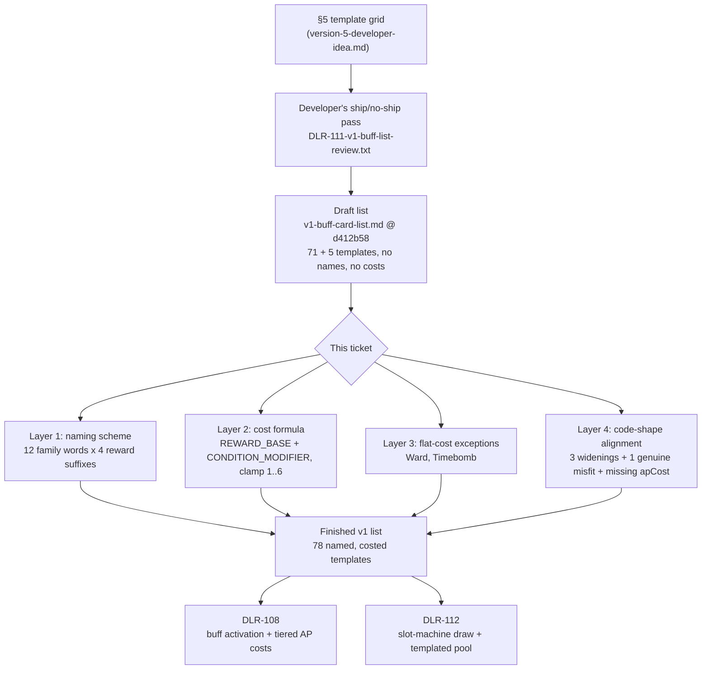

# Plan: Author the v1 buff card list from the template grid

Plan folder: `.claude/contract/DLR-111-author-v1-buff-card-list/`
Execution status: see `tasks.md` in this folder.

---

## Part 1 — Alignment

### Task reference

Jira **DLR-111** — "Design: author the v1 buff card list from the template grid" (Task, epic DLR-103, label `design`, priority High).

Acceptance criteria, verbatim from the ticket:

1. A finished list of v1 buff cards is written, each naming its condition template, reward template, and tier progression, in the same shape as the doc's own worked examples (§5's "Bronze / Silver / Gold" combined examples).
2. **Updated 2026-08-23:** the opponent-forced-card template ships in v1, reclassified as a one-shot **consumable** rather than a repeatable buff reward. Worked example: play the consumable, then from the opponent's legal moves the player picks which card they're forced to play — hidden cards stay hidden, but a revealed skull card can be avoided by forcing a non-skull legal move instead.
3. "Lose the next N tricks" is **deferred** — not shipping in v1. Reason: it needs a UI answer for tracking a pending multi-trick goal that hasn't been designed yet.
4. The AP-refund reward template, if included, ships with a stated `MAX_REFUND_PER_HAND` cap (named, retunable constant) alongside it in the list.
5. The finished list is written to `.docs/design/Balatro-Forbidden-Solitaire/` so the slot-machine ticket has one authoritative content source to generate from.

Scope boundaries from the ticket: in scope are the pairings that ship, their tier progressions, the consumable category and its list, and the two flagged UI/cap questions. Out of scope is **any code**. The three synergy condition templates and the co-trigger combo template are held back pending the passive-buff-stacking idea.

**Run-level override, dated 2026-08-23.** This ticket runs inside an unattended sprint run whose dispatch explicitly overrides `CLAUDE.md`'s pause condition for tuning values: *"every buff on this list is a tuning value... That pause is overridden for this run, so you must choose them and justify each one."* Every AP cost and every tier figure this plan introduces is therefore chosen here, marked as agent-chosen rather than developer-chosen, and surfaced for review. It is pulled ahead of DLR-108 and DLR-112 because both consume this list.

**Prior developer work already on disk** (committed at `d412b58`, before this run): `.docs/design/Balatro-Forbidden-Solitaire/v1-buff-card-list.md` (103 lines) and `DLR-111-v1-buff-list-review.txt` (the working Q&A). The developer has already decided *which templates ship*, *their reward pairings*, *their tier magnitudes*, and *the three-category taxonomy*. Those decisions are inputs to this plan, not questions it reopens.

### Restated goal

The developer has already settled which cells of the §5 template grid ship, which are deferred, and what each reward pays at bronze/silver/gold — that work is on disk. What the list does not yet have is the thing DLR-108 and DLR-112 actually need in order to build: a **name** for every card, an **AP activation cost** for every card at every tier, a stated `MAX_REFUND_PER_HAND` value, and an explicit statement of where the list fits `src/hunt/buffCatalog.ts`'s existing `Buff` shape and where it does not. This task finishes the list into that costed, named, code-shaped form, resolving the six open items the review file carries forward. It ships no code.

### In scope

- A card-naming scheme, and a name for every condition-template family and every consumable in the v1 list.
- An **AP cost for every card at every tier**, derived from a single stated cost formula rather than card-by-card guesswork, with a one-line justification per template row.
- A stated value for `MAX_REFUND_PER_HAND` (AC4), with its reasoning.
- Resolutions for the six "Open items carried forward" in the existing list, each recorded with the reading taken.
- **Cheat and Timebomb added to the list**, with AP costs — they are absent from the developer's draft but `buffCatalog.ts` already represents them as buff-pile cards, and DLR-112's pool sizing is wrong without them.
- A **code-shape alignment section**: exactly which fields of `Buff` / `BuffKind` / `BuffCondition` / `BuffReward` the list fits, and which four it provably does not, with reasons.
- The full authored list written to `.docs/design/Balatro-Forbidden-Solitaire/v1-buff-card-list.md` (AC5), replacing the draft in place so there is one authoritative content source, not two.

### Explicitly out of scope

- Any change under `src/`. No `BuffKind` member is added, no `apCost` field is written, no config key is created. This ticket states what DLR-108 and DLR-112 must add; it does not add it.
- Designing the "lose the next N tricks" UI (AC3 defers the template on exactly that ground).
- Resolving the passive-buff-stacking idea, or the three synergy templates and the combo template that depend on it.
- Retuning `TIMEBOMB_TIER_MULTIPLIER`, `STARTING_AP`, `DAMAGE_PER_HIT`, or any constant already in `src/hunt/config.ts`.
- Changing `.docs/game_rules/the-hunt.md`. Nothing here is a playable rule yet — every card on this list is `[not built]`, and `implementation-doc-writer` owns that file on the ticket that builds them.
- Deleting `DLR-111-v1-buff-list-review.txt`. It is the developer's working record of how the ship/no-ship calls were made and stays as provenance.

### Pattern Reference

- `.docs/design/Balatro-Forbidden-Solitaire/v1-buff-card-list.md` — the draft being finished. Its table shapes, its three-category taxonomy, and its per-template card counts are authoritative and are preserved.
- `.docs/design/Balatro-Forbidden-Solitaire/DLR-111-v1-buff-list-review.txt` — the developer's ship/no-ship reasoning per template; cited, never overturned.
- `.docs/design/Balatro-Forbidden-Solitaire/version-5-developer-idea.md` §1–§5, §5a — the AP economy (`3 AP` working cost, `+5 AP` capacity item), the tier-axis-varies-per-card rule, and the Spyglass.
- `src/hunt/buffCatalog.ts` and `src/hunt/buffs.ts` — the target data shape the list must be expressible in.
- `src/hunt/config.ts` — `STARTING_AP = 6`, `AP_REFRESH_CADENCE = PerHand`, `DAMAGE_PER_HIT = 1`, `DISCARDS_PER_FIGHT = 3`, `COINS_PER_ENCOUNTER_WIN = 1`, `ENVENOM_QUARRY_DAMAGE = 4` / `ENVENOM_PLAYER_DAMAGE = 2`, `HAND_SIZE = 6`, `PLAYER_START_HEALTH = 10`. These are the scale every cost is calibrated against.
- `.docs/game_rules/the-hunt.md` §7 — the bank counts tricks and the multiplier climbs 1 per trick taken, cashing as their product. This is what makes a multiplier reward worth roughly `bank ×` a flat damage reward, and it is the single most load-bearing fact in the cost model.

### Constraints flagged on the brief

- **Docs-only.** The dispatch is explicit that the deliverable is content, not a mechanism, and the ticket's Scope Boundaries put all code out of scope. No `src/` file appears in the file map, so the reviewer trio does not dispatch (per the docs-only precedent).
- **Must fit `buffCatalog.ts`'s shape, or state with reasons where it must not.** Named directly in the dispatch. This is why the code-shape alignment section is a required deliverable rather than a nicety.
- **`TIMEBOMB_TIER_MULTIPLIER = {1,2,3}` is a known unchosen value.** The dispatch requires that if the tier costing implies a different curve, the list says so rather than silently disagreeing.
- **No `TODO` costs.** A list of names with unfilled costs is a failed ticket.
- **The four gates must still be run and reported green** even though this ships no code: `npm run typecheck`, `npm run lint`, `npm test`, `npm run build`. Baseline is 1089/1089 passing across 86 files.
- **PowerShell corrupts UTF-8 on redirect.** All Markdown authoring goes through Write/Edit, never a shell redirect.

### Assumptions made

- **The developer's ship/no-ship calls, per-template reward pairings, and reward tier magnitudes are settled inputs.** The draft and review file state them without hedging. Re-deciding them would discard real developer work; this plan adds the missing layer on top. *(Exception, flagged in Risks: open item 5 asks for a second look at #6/#7's reward lists, so that one is explicitly re-decided.)*
- **The AP cost model is `reward-tier base + condition modifier`, clamped to `1..6`.** Chosen over per-card hand-costing because 78 templates hand-costed individually cannot be reviewed, retuned, or reasoned about — a formula can be argued with in one paragraph and moved with two numbers, which is what a first-pass tuning artefact should be.
- **The condition modifier is a discount for unreliability, not a surcharge for difficulty.** A card that fires most hands is worth more AP than one that rarely fires, so `Lose a trick with suit S` (near-guaranteed — you can always throw a card of a suit you hold) costs *more* than `Win a trick with rank R` (needs the specific card and the win).
- **A per-hand AP budget of 6 is the calibration point.** `STARTING_AP = 6` with `AP_REFRESH_CADENCE = PerHand`. Cost 1–2 means "two or three of these a hand", cost 3 is the design doc's own working figure for one standard buff, cost 4–5 is "this is your hand's play", cost 6+ is "not affordable until the `+5 AP` shop item is bought".
- **Coins are priced as run-permanent value, damage as in-hand value.** A coin buys a permanent item at the shop's price of 1, so a coin reward is worth strictly more than the same integer in damage, and coin cards carry a surcharge.
- **Cheat and Timebomb belong on this list.** Design doc §1 folds both into the buff pile and `buffCatalog.ts` already mints them as `Buff` objects. Their absence from the draft is an omission, and DLR-112's `REEL_POOL_SIZE` is understated by two without them.
- **The card names are new and are copy, so they are the developer's to overrule freely.** They exist because DLR-112 needs a stable identifier per template family; the scheme matters more than any individual word.
- **The list is rewritten in place rather than appended to.** AC5 says "one authoritative content source"; a draft plus an addendum is two.

### Config and persisted-shape audit

Run in reduced form: this contract writes no code, so no key is renamed, retyped or removed — but it *names* code-side identifiers that a later ticket must add, and those names must not collide with existing ones.

- **`MAX_REFUND_PER_HAND`** — `Select-String` over `src\**\*.ts` and `.docs\**\*.md`: **0 hits in `src/`**, 2 hits in docs (the DLR-111 draft and its review file, both stating it as TBD). The name is free; this ticket assigns it a value in the design doc only, and DLR-108 is the ticket that creates the `config.ts` key.
- **`BuffKind` members** — `src/hunt/buffs.ts` holds exactly three: `Unassigned`, `Cheat`, `Timebomb`. Every family name this list introduces (`Taker`, `Feeder`, `Ward`, `Puppeteer`, …) is absent from `src/`, so no name in the list collides with a live identifier.
- **`BuffRewardAxis` members** — exactly three on disk: `Magnitude`, `DurationTricks`, `HeartCount`. The list needs six more; recorded as a required widening in the alignment section, not performed here.
- **`apCost`** — `Select-String -Pattern "apCost"` over `src\**\*.ts`: hits are `apCostFor` and `apCostGiven` in `src/hunt/actionPoints.ts` only. **There is no `apCost` field on `Buff`**, so every cost this list states has no home in the type today. This is the single largest shape gap and is the alignment section's headline finding.
- **Persisted shapes** — `src/persistence/` stores run state. Nothing on this list is persisted by this ticket (no code ships), so no stored record is invalidated and no migration is implied. Recording that the window is open: it closes the moment DLR-112 writes a drawn buff into a save.
- **Architectural boundaries** — not crossed. No file under `src/` is touched, so the `src/hunt/**` pure-core ESLint override is untouched by construction.

---

## Part 2 — Technical design

### Approach

The work is a single document rewrite with four layers added on top of the developer's existing draft, and the ordering of those layers is what makes the result reviewable rather than a wall of numbers.

The first layer is **naming**. The draft addresses cards by grid coordinate — "template 3 crossed with reward 1" — which is fine for deciding what ships and useless as a content source for a generator. The scheme separates the two halves of a card's identity: a **family name** carries the condition (Taker, Feeder, Sidestep, Glutton, Hoarder, Unbloodied, Debt Collector, Keepsake, Miser, Cornered, plus Mark-of-the-*rank*), and a **reward suffix** carries the payoff (Blade for flat damage, Purse for coin, Second Wind for AP refund, Momentum for multiplier). Twelve family words and four suffix words name all 71 condition cards, and a reader can decode any card name without a lookup — "Key-Feeder (Momentum)" is *lose a trick with Keys, gain multiplier*. The alternative considered and rejected was 71 bespoke names: it reads better on a card face and is unmaintainable the moment a reward pairing moves.

The second layer is the **cost formula**, and it is the substance of the ticket. Cost is `REWARD_BASE[axis][tier] + CONDITION_MODIFIER[template]`, clamped to `1..6`. The reward base prices the payoff; the condition modifier discounts it by how often the card actually fires. Calibration is against `STARTING_AP = 6` refreshing per hand and the design doc's own `3 AP` working figure for one standard buff. The key arithmetic that sets the reward bases apart is the bank rule: the bank counts tricks and the multiplier climbs 1 per trick taken, cashing as their product, so at a typical cash-out bank of 3 a `+2 multiplier` reward is worth about 6 damage where a `+1 damage` reward is worth 1. Multiplier and coin rewards therefore carry a surcharge over flat damage, and that is a derived consequence rather than a preference. The alternative — one flat cost per tier across all rewards, which is what §1's "3 AP each" reads as — was rejected because it makes the multiplier cards strictly correct and the damage cards strictly wrong at every tier, which is a dominant strategy in Meier's sense: a choice with only one defensible answer is not a choice.

The third layer is **the four templates whose tier axis is the condition rather than the reward** — Hoarder (bank N), Unbloodied (survive N tricks), Miser (≥N coins), Cornered (below N% health) — plus the two consumables with the same problem. For these, a higher tier makes the card both harder to trigger and better paid, so the formula's per-tier ramp is applied to the reward half only and the condition modifier does the rest. Ward (Protect N) is the one card given a genuinely **flat** cost across all three tiers, and the reason is arithmetic: `DAMAGE_PER_HIT = 1`, so a bronze Ward absorbing 1 damage and a gold Ward absorbing 5 are *identical in effect* today, and charging more for the gold one taxes the player for a better reel. Timebomb is the other flat-cost card, for the opposite reason — its tier price is paid in health (2/4/6 of a 10-point bar), not in AP, so a flat AP cost is what keeps `TIMEBOMB_TIER_MULTIPLIER = {1,2,3}` intact rather than double-charging the same escalation.

The fourth layer is the **code-shape alignment section**, which exists because the dispatch demands the list fit `buffCatalog.ts` or say why not. Three of the four gaps are ordinary widenings the existing code already anticipates — `BuffKind` grows a member per family, `BuffRewardAxis` grows six axes, and DLR-105's own comment calls a fourth axis "a type change for whichever later ticket needs it". The fourth is not a widening: `BuffCondition` is `{ kind: string }` with no payload, and three families (Taker, Feeder, Keepsake) are parameterised by suit and one (Mark of the *rank*) by rank. Either the condition gains an optional payload field or the suit is baked into 33 separate `BuffKind` members — the section states both and recommends the payload, with the reason. And the field that does not exist at all is `apCost`: every number this ticket authors has nowhere to live on `Buff` today, which is DLR-108's first job.

### Skills to invoke during execution

- `game-designer` — owns anything under `.docs/design/`, and owns the method this list's cost model is built with (§1 enumerate before you reason, §2 quantify against a benchmark, §6 fix with pieces that already exist). Loaded during planning; the executor loads it again for the authoring task.
- `management-jira` — the `To Do → Planning → Planned → Coding → Ready for Test` transitions. Owns the status vocabulary and the live transition-id lookup.
- `none — the log append is a plain Markdown edit` for the sprint-run log task.

`react-frontend` is **deliberately not listed**: this contract writes no TypeScript. That is the legitimate non-code case `CLAUDE.md` reserves `none` for, not a classification error.

Rules the executor must Read: `.claude/rules/README.md` (index) — scanned, and `.claude/rules/save-data-versioning.md` is the only rule file present. It does not apply: no persisted shape changes because no code ships. Always read `.claude/workflow/web-project.md` for runner commands.

### Diagram



### Data shapes

No type, config, or contract changes ship in this contract — it writes Markdown only. What follows is the **specification** the document states for DLR-108 and DLR-112 to implement, recorded here so the two consuming tickets do not have to re-derive it from prose.

#### The cost formula the document states

```ts
// Stated in the design doc; NOT written to src/ by this contract.
// REWARD_BASE prices the payoff; CONDITION_MODIFIER discounts it by how often the card fires.
// UNIT: action points, spent once per activation, against a per-hand pool of STARTING_AP.
type CostAxis = 'damage' | 'coin' | 'apRefund' | 'multiplier'

const REWARD_BASE: Record<CostAxis, Record<BuffTier, number>> = {
  damage:     { bronze: 1, silver: 2, gold: 3 },
  coin:       { bronze: 2, silver: 3, gold: 4 },
  apRefund:   { bronze: 1, silver: 1, gold: 1 },
  multiplier: { bronze: 2, silver: 3, gold: 5 },
}

// Per condition-template family. Positive = fires reliably, costs more.
const CONDITION_MODIFIER: Record<string, number> = {
  taker: 0, feeder: +1, markOfRank: -1, sidestep: -1, glutton: 0,
  hoarder: 0, unbloodied: 0, debtCollector: +1, keepsake: 0,
  miser: -1, cornered: -1,
}

// apCost = clamp(REWARD_BASE[axis][tier] + CONDITION_MODIFIER[family], 1, 6)
```

#### The constant AC4 requires

```ts
// The cap on total AP refunded within one hand, across every AP-refund card active.
// UNIT: action points. VALUE: 6 — equal to STARTING_AP, so a hand can at most double its
// budget and a refund chain cannot fund an unbounded number of activations.
// AGENT-CHOSEN under this run's override of the tuning-value pause; the developer's to move.
export const MAX_REFUND_PER_HAND: ActionPoints = 6
```

#### The `Buff` shape gaps the document records

```ts
// 1. WIDENING — BuffKind gains one member per template family (11 shipping condition
//    families + 5 consumables), joining the existing Cheat / Timebomb / Unassigned.
// 2. WIDENING — BuffRewardAxis gains: Coins, ApRefund, Multiplier, CardsRevealed,
//    CandidatesEliminated, DiscardCharges, DamageAbsorbed, None.
//    DLR-105's own comment on BuffRewardAxis already names this as a later ticket's change.
// 3. GENUINE MISFIT — BuffCondition is `{ readonly kind: string }` with no payload, but
//    Taker / Feeder / Keepsake are parameterised by suit and Mark-of-rank by rank:
interface BuffCondition {
  readonly kind: string
  /** Present only on suit- or rank-parameterised families. */
  readonly target?: { readonly suit?: Suit; readonly rank?: number }
}
// 4. MISSING FIELD — Buff carries no apCost. Every number this ticket authors has no home
//    on the type today. DLR-108 adds it, or derives it from (kind, tier) via a lookup.
```

### Runtime quality notes

- **Purity and adjudication:** trivial — no runtime. Worth stating for the consuming tickets: every figure on this list is a tunable and belongs in `src/hunt/config.ts` or a catalog module beside `buffCatalog.ts`, never inline at a call site. The list is deliberately written as tables so a later ticket transcribes rather than re-derives.
- **Effects, mount and teardown:** not applicable — no React, no effects, no timers. Docs-only.
- **Hot-path cost:** not applicable — no code path. Noted for DLR-112: a 78-entry pool is small enough that a linear weighted draw needs no index, so no memoisation should appear without profiling.
- **Determinism and numeric safety:** the cost formula uses integer addition and an integer clamp only, so it produces no fractional AP and cannot yield `NaN`. Deliberate: `QUICK_KILL_TIER_MULTIPLIERS`'s `0.5` and `FORCED_CASH_OUT_*`'s numerator/denominator split are both in the codebase because fractional tunables are expensive, and an AP cost that is ever `2.5` would need the same treatment. Every reward figure on the list is likewise an integer.
- **Error paths:** the only failure mode is a document that contradicts itself — a card named in one table and costed in another, or a per-template card count that no longer sums to the stated pool size. The contract's final phase greps for `TODO`/`TBD` and re-derives the pool total by hand, because a stale total silently mis-sizes DLR-112's reel.

### Risks and judgement calls

- **Every AP cost on this list is an agent-chosen tuning value.** Under `CLAUDE.md`'s normal pause condition this is the developer's call for all 78 templates. The run's dispatch overrides that pause and requires the numbers be chosen and justified. They are marked as agent-chosen in the document itself, so a later reader does not mistake them for developer decisions the way §9's Decided rows are.
- **Ward (Protect N) silver and gold are the weakest items on the list.** `DAMAGE_PER_HIT = 1`, so absorbing 1, 3, or 5 are the same outcome against every hit the game currently deals. They are costed flat at 2 AP for exactly that reason, and the developer's own review file already flags the tiers as "forward-looking". If `DAMAGE_PER_HIT` never moves, these two rows should be deleted rather than retuned.
- **A bronze AP-refund card is net-zero by construction.** The developer's refund ladder is 1/2/3 and the cheapest activation is 1 AP, so a bronze Second Wind refunds exactly what it cost. Two readings: keep it as the pool's deliberate floor card (what a bad reel gives you) or raise the refund ladder to 2/3/4. The document takes the first, because it preserves a developer-set ladder; the second is the better card and is the developer's to take.
- **Miser (≥N coins) fights the shop.** It pays an in-hand reward for a run-long behaviour — not spending — and the shop is the run's only progression lever. This is a structural awkwardness, not a costing one, and no AP price fixes it. Flagged for deletion at the developer's discretion.
- **Open item 5 is re-decided, not carried forward.** The review file asks whether Hoarder and Unbloodied should really carry all four rewards. The document keeps all four and states why (both are hand-shaped goals, so all four payoffs read naturally on them), but this overturns a "worth a second look" the developer wrote, so it is called out rather than folded in silently.
- **Gold Cheat is priced above the starting budget on purpose.** At 7 AP against `STARTING_AP = 6` it is unplayable until the `+5 AP` capacity item is bought. That is a deliberate answer to the design doc's own warning that three tricks of no-follow-suit is "close to a guaranteed run of wins" — but a card that cannot be played at all early in a run is an unusual thing to have in a draw pool, and the developer may prefer 6 AP with a shorter gold duration.
- **The cost model does not disagree with `TIMEBOMB_TIER_MULTIPLIER = {1,2,3}`.** Timebomb is costed flat at 2 AP at every tier precisely so the health price (2/4/6 player-side) remains the whole tier cost. Stated explicitly because the dispatch asked for a disagreement to be surfaced if one existed; there is none.
- **The card names are copy and have had no visual or tonal review.** Blade / Purse / Second Wind / Momentum and the twelve family words are functional identifiers first. Naming is a developer judgement under the pause condition that this run does not override in spirit — they are offered, not settled.
- **`MAX_REFUND_PER_HAND = 6` is untested against play.** It is set equal to `STARTING_AP` on the argument that doubling a hand's budget is the most a refund engine should ever do. Nothing has played it.
