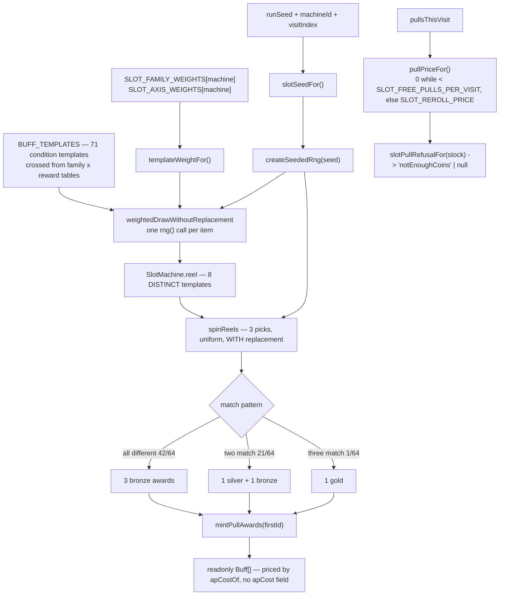

# Plan: Slot-machine buff draw and templated buff pool

Plan folder: `.claude/contract/DLR-112-slot-machine-buff-draw/`
Execution status: see `tasks.md` in this folder.

---

## Part 1 — Alignment

### Task reference

**Jira DLR-112 — "Slot-machine buff draw and templated buff pool"** (Task, epic DLR-103, label `engine`).

Problem statement, verbatim in substance: the shop's buff list is drawn through a slot machine
rather than purchased from a fixed menu. The player picks a machine, then pulls three reels. Three
different cards each land as bronze; two matching reels produce one silver card plus a separate
bronze for the odd reel; three matching reels produce one gold card. The card pool is generated by
crossing DLR-111's condition templates and reward templates, using the same weighted-draw machinery
`skullWeights.ts`/`skulls.ts` already implements, pointed at this list instead of skull ranks.

Scope update on the ticket (2026-08-23): DLR-111 is finalised at **78 distinct card templates** —
**71 condition-template cards** plus **7 consumable/activated templates**. `REEL_POOL_SIZE = 8` is
the count of distinct buffs on **one machine's** reels, a leaning subset of the pool, not the pool
size. The weighted draw should be pointed at the **71-item condition-template subset** for
persistent-buff machines.

**Acceptance criteria (pasted from the ticket):**

1. At least two machine definitions exist, each leaning toward a different subset of the buff pool
   (a permanent-upgrade lean vs. a trick/fight-buff lean), per §3 of the design doc.
2. A three-reel pull resolves per the stated match rules (three different → three bronze; two match
   → one silver + one bronze; three match → one gold), verified by unit tests covering all three
   outcomes.
3. `REEL_POOL_SIZE = 8` (named, retunable constant per the game-designer consult) sets how many
   distinct buffs sit on one machine's reels, drawn from DLR-111's 76-template pool.
4. DLR-111's decided v1 card list (`.docs/design/Balatro-Forbidden-Solitaire/v1-buff-card-list.md`)
   is implemented as data-driven card generation reusing the existing weighted-draw pattern from
   `skullWeights.ts` — this ticket consumes that list as-is and does not re-decide which cards ship.
   Card data should use the condition/reward descriptor shape defined by DLR-125 rather than
   inventing a second shape.
5. Pull cost is applied per the game-designer consult's recommendation:
   `SLOT_FREE_PULLS_PER_VISIT = 1`, further pulls cost `SLOT_REROLL_PRICE = 1` coin.
6. Whether the 5 consumable templates are drawable through the same reel/tier mechanism, or need a
   separate acquisition path, is decided per **DLR-126**'s ownership model.

**Scope boundaries (from the ticket):** in scope — machine definitions, reel-pull resolution,
generating cards from DLR-111's list, pull cost. Out of scope — which cards ship (DLR-111, done);
the shop screen UI (DLR-116); Vault-driven odds adjustment (DLR-113); passive buff stacking
(DLR-124); the condition/reward evaluation logic itself (DLR-125); consumable ownership/activation
(DLR-126).

**Dispatch decisions carried into this contract, dated 2026-08-23:**

- The coordinator's standing decision: **`apCost` stays a derived lookup** (`apCostOf` in
  `buffCosts.ts`), never a field on `Buff`. A per-card discount, if it ever ships, is a later
  optional per-instance override. This contract does not reopen it and does not need to.
- **Determinism is a hard constraint.** `src/hunt/` must stay reproducible for DLR-130's headless
  balance simulator. No `Math.random()` anywhere in the new code; a seeded RNG is threaded as an
  explicit parameter.
- The **plan approval gate is auto-approved** under the unattended sprint run; every default taken
  is logged in `.claude/sprint-runs/2026-08-23-sprint/log.md`.
- **DLR-126 is still `To Do`** (checked live, 2026-08-23). AC6 therefore does not get an
  implementation in this ticket — see Assumptions.

### Restated goal

Turn DLR-111's authored v1 card list into live, generated engine data, and build the slot machine
that hands it out. Concretely: a pure `BuffTemplate` pool of exactly 71 condition templates, minted
from two small crossing tables rather than 71 literals; two named machine definitions that each
weight that pool differently so the machines feel like different machines; a seeded, deterministic
draw that picks `REEL_POOL_SIZE = 8` distinct templates onto a machine's reel strip; a three-reel
spin over that strip whose match pattern decides the tier of what the player wins; and the pull-cost
rule (one free pull per visit, then a coin a spin). Everything stays a pure function of an
explicitly-passed RNG, so the same seed draws the same reel every time and a simulator can run the
economy headlessly.

### In scope

- `src/hunt/seededRng.ts` — a deterministic PRNG (`createSeededRng`) and a pure seed-mixing helper,
  so nothing downstream ever reaches for `Math.random()`.
- `src/hunt/buffTemplates.ts` — the `BuffTemplate` shape, the reward-value tier ladder, the
  tier-parameterised condition thresholds, the generated 71-template pool, and
  `mintFromTemplate(template, tier, id)` returning an ordinary `Buff`.
- `src/hunt/slotConfig.ts` — the machine identities and the four slot tunables (`REEL_COUNT`,
  `REEL_POOL_SIZE`, `SLOT_FREE_PULLS_PER_VISIT`, `SLOT_REROLL_PRICE`).
- `src/hunt/slotWeights.ts` — the per-machine family and reward-axis weight tables, the derived
  per-template weight, and a generic weighted draw-without-replacement.
- `src/hunt/slotMachine.ts` — `drawReelPool`, `spinReels`, `resolvePull` (AC2's three outcomes),
  `mintPullAwards`, `pullPriceFor` / `slotPullRefusalFor` (AC5), and `slotSeedFor`.
- Barrel exports from `src/hunt/index.ts` for every new public name.
- Vitest coverage beside the logic: the pool's exact composition, the match rules' three outcomes,
  the pull-cost ladder, the machine leans, and — the load-bearing one — seed reproducibility.

### Explicitly out of scope

- **Any shop or slot-machine UI.** No `.tsx` file is touched; DLR-116 owns the screen. This
  contract's file map contains no component, so **no mockup was called for** — this is not a
  mockup that was skipped.
- **AC6 — consumables in the reel pool.** DLR-126 is still `To Do`; the ticket's own Dependencies &
  Risks forbids guessing it here. The drawable pool is the 71 condition templates.
- **Condition evaluation and reward application.** DLR-125 owns when a buff fires; DLR-124's
  accrual (`buffAccrual.ts`) owns what happens when it does. This ticket only produces `Buff` data.
- **Wiring the machine into `RunState`, the shop flow, or `run.ts`.** No run transition changes.
- **Persisting anything.** No save record is written, so `SAVE_SCHEMA_VERSION` does not move.
- **Re-deciding the card list, the reward ladder, or any AP cost.** All transcribed from DLR-111.
- **Fixing the known Ward tier defect or resolving the Keepsake unfireability question.** Both are
  the developer's; see Risks.
- **Vault-driven odds adjustment** (DLR-113) — it will modify these weights; it does not ship here.

### Pattern Reference

- `.docs/design/Balatro-Forbidden-Solitaire/v1-buff-card-list.md` — the authoritative card list,
  the reward master tier list, the family/reward crossing table, the firing-cadence table, and the
  four "weakest items" flags. Cited, never re-derived.
- `src/warCouncil/skulls.ts` → `weightedDraw` — the weighted draw-without-replacement algorithm
  the ticket names. **Exactly one `rng()` call per item drawn**, running-total selection with a
  last-candidate fallback for float drift, missing weight read as `0` through `?? 0`.
- `src/warCouncil/deal.ts` / `src/warCouncil/shuffle.ts` — the house convention for threading
  randomness: `rng: () => number` as an explicit parameter, never module state.
- `src/hunt/skullWeights.ts` — the precedent for a self-contained weight-curve file split out of
  `config.ts`, with the active curve selected by one named reference.
- `src/hunt/buffCatalog.ts` → `cheatBuff` / `timebombBuff` / `shieldBuff` — the minting convention:
  the caller supplies the `BuffId`, the module never invents one.
- `src/hunt/shop.ts` → `refusalFor` / `priceOf` — the house shape for a purchase rule: a reason
  **code** (never copy), one single statement of availability read by both the guard and the UI.
- `src/hunt/buffCosts.ts` — `apCostOf`, `isConditionFamily`, `BuffCostAxis`. Reused as-is.
- `.claude/skills/react-frontend/SKILL.md` for conventions; not restated here.

### Constraints flagged on the brief

- **Determinism is a hard constraint, not a preference.** `src/hunt/` is DOM-free and pure by lint
  boundary and must stay reproducible for DLR-130's balance simulator and the developer's
  end-of-epic balance pass. No `Math.random()` is reachable from any function in this contract.
- **`apCost` stays a lookup.** No `apCost` field is added to `Buff`. If this contract could not be
  built without per-card pricing it would stop and report; it can, so it does not.
- **`src/hunt/` may not import `src/warCouncil/`** — `warCouncil` already imports `hunt`, and the
  reverse edge is a cycle both modules' comments call out. This is why the weighted draw is
  re-stated in `hunt` rather than imported, and it is the same reason `BuffTargetSuit` already
  duplicates `Suit`.
- **400-line file budget is blocking**, measured with `(Get-Content <path>).Count` after Prettier.
  This is why the work lands as five small files rather than one `slotMachine.ts`.
- **Vocabulary:** Timebomb / prime / primed / ticking / detonates / Blast Guard. Never "Envenom" or
  "poison" (except `CardRank.Poison`, rank 8, unrelated). No affected identifier in this contract.
- **The 400-line budget applies to `config.ts` too** — it stands at 374 lines, so the four new slot
  tunables go in `slotConfig.ts`, the split `apConfig.ts` and `skullWeights.ts` already precedent.

### Assumptions made

- **The drawable pool is the 71 condition templates; the 7 consumables are excluded.** DLR-126 is
  still `To Do` and the ticket forbids pre-empting it. This is also what the ticket's own scope
  update says to do ("pointed at the 71-item condition-template subset"). *Sprint-run default.*
- **Both machines draw from that same 71-template pool, differing only in weights.** AC1 asks for
  two machines "each leaning toward a different subset"; a lean expressed as a weight table is a
  subset lean, and it costs no second pool to maintain. The alternative — two disjoint hand-picked
  lists — would re-decide which cards ship, which AC4 forbids.
- **A machine's reel strip is one set of 8 templates shared by all three reels.** That is what a
  slot machine is, and it is the only construction under which AC2's match rules can occur at all.
  Three independently-drawn 8-template strips would make a three-match astronomically rare.
- **The 8 templates on a strip are drawn WITHOUT replacement; a spin picks WITH replacement.**
  AC3 says "how many **distinct** buffs sit on one machine's reels", so the strip is distinct.
  Matches require replacement on the spin.
- **The spin is flat uniform over the 8 symbols; all weighting happens when the 8 are chosen.**
  Rationale in Approach — it keeps the odds legible to a player who can see the strip.
- **A reroll re-spins the same strip; it does not redraw the 8.** Rationale in Approach.
- **Tier-parameterised condition thresholds (Hoarder N, Unbloodied N, Miser N, Cornered N%) ship as
  a `(family, tier)` lookup, not as a new field on `BuffCondition`.** This is the same shape the
  coordinator's standing decision already fixed for `apCost`, applied to the same class of fact, and
  it avoids inventing a second descriptor shape ahead of DLR-125 (AC4).
- **`BuffCondition.kind` for a generated template is the `BuffKind` string itself** (`'taker'`,
  `'markOfRank'`, …). `kind` is an open string by design, `BUFF_CADENCE` is already keyed on
  `BuffKind`, and using anything else would give one family two names.
- **A `BuffTemplate` carries a stable string `id`** (`'taker:bells:magnitude'`) so a reel can test
  two symbols for equality without object identity and a later screen has something to key on. Not
  persisted — see the audit.
- **Nothing is persisted.** A machine's strip is a pure function of `(runSeed, machineId,
  visitIndex)` via `slotSeedFor`, so a strip is reproduced rather than stored.
- **`Skill: react-frontend`** governs every task — all of it is TypeScript under `src/`.
- **The plan gate was auto-approved** under the unattended sprint run; no developer red-line was
  applied to this document.

### Config and persisted-shape audit

- **No configuration key is renamed, retyped, or removed.** Every key in this contract is new.
  `Select-String` for `REEL_POOL_SIZE`, `SLOT_FREE_PULLS_PER_VISIT`, `SLOT_REROLL_PRICE`,
  `REEL_COUNT`, `BUFF_TEMPLATES`, `REWARD_TIER_VALUE`, `SlotMachineId` across `src/**` returns
  **zero hits** for each — all seven names are new, none is dead code being resurrected.
- **`src/hunt/config.ts` is not touched.** It stands at **374 lines** of a 400-line blocking budget;
  four new tunables plus their required unit/derivation comments would breach it. The new keys go
  in `src/hunt/slotConfig.ts`, exactly the split `apConfig.ts` (63 lines) and `skullWeights.ts`
  (93 lines) already made for the same reason. No existing importer changes.
- **No persisted shape is affected, and nothing new is persisted.** `src/persistence/` holds
  `saveStore.ts`, `browserStorage.ts`, `config.ts`, `storageDriver.ts`; none is in this contract's
  file map, and no function here reads or writes storage. `SAVE_SCHEMA_VERSION` does not move.
  `.claude/rules/save-data-versioning.md`'s six reject conditions are therefore all inert: no
  storage global is named (1), no key is composed (2), no payload is written (3), no shape changes
  (4), no `as T` cast on a parsed payload (5), no read failure is swallowed (6). **The window
  `v1-buff-card-list.md` warns about — "that window closes the moment DLR-112 writes a drawn buff
  into a save" — deliberately stays open**: this contract stores no drawn buff, so a `BuffKind` or
  `BuffRewardAxis` member is still free to be renamed. DLR-113 (Vault) is the queued consumer that
  will close it.
- **No exported constant, predicate, or reason code changes.** `apCostOf`, `isConditionFamily`,
  `isConsumableKind`, `narrowToCostAxis`, `REWARD_BASE`, `CONDITION_MODIFIER`, `BUFF_CADENCE` are
  all **read, never modified**. `BuffKind` (19 members), `BuffRewardAxis` (11 members), `BuffTier`
  (3) and `BuffTarget` are consumed exactly as they stand — **no union is widened**, so no `switch`
  anywhere grows a case and no existing test changes.
- **`src/hunt/index.ts` is the one existing file modified** — additive re-exports only. It currently
  re-exports 22 names from `buffs.ts`/`buffCatalog.ts`/`buffCosts.ts`; this contract appends,
  removes nothing, and reorders nothing.
- **Architectural boundary holds.** `eslint.config.js` bans React imports and DOM globals across
  `src/hunt/**`. Every new file is plain TypeScript with no import outside `src/hunt/`, so the
  boundary is not approached, let alone crossed. Final verification greps it anyway.
- **New string-bound names introduced:** the two `SlotMachineId` values (`'skirmisher'`,
  `'strongbox'`), the `SlotOutcome` codes (`'allDifferent'`, `'twoMatch'`, `'threeMatch'`), the
  `SlotPullRefusal` code (`'notEnoughCoins'`), and the `BuffTemplate.id` grammar
  (`<kind>:<param>:<axis>`). None binds to storage, a stylesheet, or a `data-testid`; all four
  surfaces are internal to `src/hunt/` and consumed only through the barrel.

---

## Part 2 — Technical design

### Approach

The work splits cleanly into **content** and **machine**, and the split is what keeps every file
small and every test sharp.

**Content.** `buffTemplates.ts` builds the 71 condition templates by crossing two tiny tables — a
family table (family → which reward axes it carries, and the optional parameter axis it fans out
over) and the reward master tier list — rather than by listing 71 literals. The document itself
argues for this shape ("a formula rather than 78 hand-costed cards"), and it makes the pool
retunable in one edit exactly as `apCostOf`'s two tables already are. The crossing produces
12 Taker + 12 Feeder + 22 Mark-of-rank + 2 Sidestep + 4 Glutton + 4 Hoarder + 4 Unbloodied +
4 Debt Collector + 3 Keepsake + 2 Miser + 2 Cornered = **71**, which a test pins per family so a
table edit that silently drops a crossing fails loudly. `mintFromTemplate` turns a template plus a
tier into an ordinary `Buff` — the same object `cheatBuff`/`shieldBuff` already mint, with the
caller supplying the id — so a drawn buff needs no new type and `apCostOf` prices it unchanged.

**Machine.** `slotWeights.ts` holds two small tables per machine: a **family weight** (how much of
the strip is this family) and an **axis weight** (which reward you are likely to be offered). A
template's draw weight is `familyWeight[family] × axisWeight[axis]`, normalised by that family's own
axis-weighted total so **a family's share of the strip is exactly its family weight regardless of
how many templates it happens to contain**. That normalisation is the whole point of the design:
under a flat draw over 71 templates, `Mark of the R` is 22 of them — 31% of every strip would be the
pool's narrowest, lowest-agency card, purely because the family fans out over eleven ranks. Weight
by family and the reel reflects design intent instead of a fan-out artefact. A flat uniform draw was
the considered alternative and is defensible; it is rejected for exactly that reason, and every
chosen number is listed under Risks as the developer's to move.

**How a pull works, and why the odds sit where they do.** `drawReelPool` runs the weighted draw
without replacement to pick `REEL_POOL_SIZE = 8` distinct templates onto one strip; `spinReels`
then picks `REEL_COUNT = 3` symbols from that strip **uniformly, with replacement**. Two dials, kept
deliberately orthogonal, the same way `assignSkulls` keeps `density` (how many) orthogonal to
`weights` (which ranks). The weighting therefore decides *what is on offer* and the spin decides
*what you get*, and because the spin is flat over eight visible symbols the player can read their
own odds off the machine — a hidden per-symbol weight cannot be read, and a slot machine whose
posted strip lies about its odds is the one thing the fantasy cannot survive. Flat over 8 gives
P(three match) = 1/64, P(exactly two match) = 21/64, P(all different) = 42/64, which is where AC2's
tier distribution comes from: gold is genuinely rare without any second rarity roll existing at all.
`resolvePull` reads the match pattern and emits awards; three different → three bronze, two match →
silver on the matched template plus bronze on the odd one, three match → a single gold.

**Threading the seed.** Every function that consumes randomness takes `rng: () => number` as an
explicit parameter — the convention `dealRound`, `shuffle` and `assignSkulls` already set — and
`seededRng.ts` supplies `createSeededRng(seed)`, a mulberry32 PRNG: 32-bit integer state, pure,
allocation-free after construction, no dependency. `slotSeedFor(runSeed, machineId, visitIndex)`
mixes a stable integer from the machine identity and the visit index, so a strip is *recomputed*
from the run's seed rather than stored — which is why nothing here touches `src/persistence/`. Two
callers with the same seed observe identical strips and identical spins, which is the property
DLR-130's simulator needs and the property the tests assert directly. No module-level RNG state
exists, so nothing survives HMR or leaks between tests in one file.

**Everything is pure logic.** Not one line needs React or the DOM; every invariant here is testable
under Vitest with no renderer, which is why all five files sit in `src/hunt/` behind the existing
lint boundary and every test sits in `src/hunt/__tests__/`.

### Skills to invoke during execution

- `react-frontend` — governs everything under `src/`: strict TypeScript, configuration-driven
  values, no module-level mutable state, file budget, Vitest posture. Every task in this contract
  names it.

Rules the executor must Read: `.claude/rules/save-data-versioning.md` (audited above — inert for
this contract, since nothing is persisted, but Read it to confirm that reading rather than trust
it). Always read `.claude/workflow/web-project.md` for paths, runners and the correctness traps.

No developer override was applied — the sprint run auto-approves the gate.

### Diagram



### Data shapes

#### `src/hunt/seededRng.ts`

```ts
/** A source of uniform floats in [0, 1). The house shape — `dealRound`, `shuffle` and
 *  `assignSkulls` all already take exactly this. */
export type Rng = () => number

/** mulberry32. Pure, self-contained, no dependency. The same `seed` always yields the same
 *  sequence, which is what makes `src/hunt/` simulable (DLR-130). */
export function createSeededRng(seed: number): Rng

/** Fold integers into one 32-bit seed, order-sensitive. Pure — no `Math.random()`. */
export function mixSeed(...parts: readonly number[]): number
```

#### `src/hunt/slotConfig.ts`

```ts
export const SlotMachineId = {
  Skirmisher: 'skirmisher',
  Strongbox: 'strongbox',
} as const
export type SlotMachineId = (typeof SlotMachineId)[keyof typeof SlotMachineId]

/** THE statement of the machine roster — a screen maps this, it never lists machines itself. */
export const SLOT_MACHINE_IDS: readonly SlotMachineId[]

/** UNIT: reels per pull. AC2's match rules are stated over exactly three. */
export const REEL_COUNT = 3
/** AC3, transcribed. UNIT: distinct buff templates on one machine's reel strip. */
export const REEL_POOL_SIZE = 8
/** AC5, transcribed. UNIT: pulls per shop visit that cost nothing. */
export const SLOT_FREE_PULLS_PER_VISIT = 1
/** AC5, transcribed. UNIT: coins per pull beyond the free one. */
export const SLOT_REROLL_PRICE: Coins = 1
```

#### `src/hunt/slotWeights.ts`

```ts
/** Relative weight per condition family, per machine. Only RATIOS matter. AGENT-CHOSEN.
 *  UNIT: relative weight, >= 0, unitless. */
export type SlotFamilyWeights = Readonly<Record<BuffConditionKind, number>>
/** Relative weight per reward axis, per machine. AGENT-CHOSEN. */
export type SlotAxisWeights = Readonly<Record<BuffCostAxis, number>>

export const SLOT_FAMILY_WEIGHTS: Readonly<Record<SlotMachineId, SlotFamilyWeights>>
export const SLOT_AXIS_WEIGHTS: Readonly<Record<SlotMachineId, SlotAxisWeights>>

/** `familyWeight × axisWeight`, normalised by the family's own axis-weighted total, so a family's
 *  share of a strip equals its family weight regardless of its template count. Returns 0 for a
 *  family weighted 0. */
export function templateWeightFor(machineId: SlotMachineId, template: BuffTemplate): number

/** `src/warCouncil/skulls.ts`'s `weightedDraw`, generic and re-stated in `src/hunt/` because
 *  `hunt` cannot import `warCouncil` without a cycle. EXACTLY ONE `rng()` call per item drawn.
 *  Returns fewer than `count` when candidates or positive weight run out — legal, not an error. */
export function weightedDrawWithoutReplacement<T>(
  candidates: readonly T[],
  weightOf: (item: T) => number,
  rng: Rng,
  count: number,
): readonly T[]
```

#### `src/hunt/buffTemplates.ts`

```ts
/** One distinct card template — a (family, reward axis, optional parameter) crossing. Carries NO
 *  tier: the tier is decided at draw time by the reel-match rules. Carries NO `apCost`: that stays
 *  a derived lookup through `apCostOf`, per the coordinator's standing decision. */
export interface BuffTemplate {
  /** Stable identifier, `<kind>[:<param>]:<axis>` — e.g. `taker:bells:magnitude`. NOT persisted. */
  readonly id: string
  readonly kind: BuffConditionKind
  readonly axis: BuffCostAxis
  /** Present only on the suit- or rank-parameterised families. */
  readonly target?: BuffTarget
}

/** DLR-111 → *Reward master tier list*, transcribed. Blade 1/3/5, Purse 2/5/10, Second Wind 1/2/3,
 *  Momentum 2/3/5. This is the reward VALUE ladder — distinct from `buffCosts.ts`'s `REWARD_BASE`,
 *  which is the AP COST base. UNIT: per axis (damage, coins, action points, multiplier points). */
export const REWARD_TIER_VALUE: Readonly<Record<BuffCostAxis, Readonly<Record<BuffTier, number>>>>

/** The four families whose CONDITION is parameterised by tier rather than by suit or rank —
 *  Hoarder N (2/3/4 bank), Unbloodied N (2/3/4 tricks), Miser N (5/10/20 coins), Cornered N%
 *  (60/45/33 percent of PLAYER_START_HEALTH). A `(family, tier)` lookup, NOT a field on
 *  `BuffCondition` — the same shape decision already taken for `apCost`. */
export const CONDITION_THRESHOLD: Readonly<
  Record<BuffThresholdFamily, Readonly<Record<BuffTier, number>>>
>
export type BuffThresholdFamily =
  | typeof BuffKind.Hoarder
  | typeof BuffKind.Unbloodied
  | typeof BuffKind.Miser
  | typeof BuffKind.Cornered

/** The v1 pool: exactly 71 condition templates. GENERATED from the crossing tables at module load,
 *  never hand-listed. The 7 consumable/activated templates are deliberately absent — AC6 is
 *  DLR-126's to resolve and DLR-126 has not landed. */
export const BUFF_TEMPLATES: readonly BuffTemplate[]
export const BUFF_TEMPLATE_COUNT: number // 71

export function templatesForFamily(kind: BuffConditionKind): readonly BuffTemplate[]

/** Mint an ordinary `Buff` from a template at `tier`. `id` is the CALLER's, from
 *  `RunState.nextBuffId` — this module never invents one and never calls `Math.random()`. */
export function mintFromTemplate(template: BuffTemplate, tier: BuffTier, id: BuffId): Buff

/** The tier-scaled condition threshold for a threshold-family buff, or `null` for every other
 *  family. Reads `(kind, tier)`, so one buff has exactly one answer. */
export function conditionThresholdOf(buff: Buff): number | null
```

#### `src/hunt/slotMachine.ts`

```ts
/** One machine's reel strip — `REEL_POOL_SIZE` DISTINCT templates, shared by all three reels. */
export interface SlotMachine {
  readonly id: SlotMachineId
  readonly reel: readonly BuffTemplate[]
}

/** AC2's three match patterns. A CODE, not copy — `src/hunt/` holds no user-facing strings. */
export const SlotOutcome = {
  AllDifferent: 'allDifferent',
  TwoMatch: 'twoMatch',
  ThreeMatch: 'threeMatch',
} as const
export type SlotOutcome = (typeof SlotOutcome)[keyof typeof SlotOutcome]

/** One card won: which template, at which tier. */
export interface SlotAward {
  readonly template: BuffTemplate
  readonly tier: BuffTier
}

export interface SlotPull {
  readonly symbols: readonly BuffTemplate[] // length REEL_COUNT
  readonly outcome: SlotOutcome
  readonly awards: readonly SlotAward[]
}

/** Why a pull cannot be made. A reason CODE — `src/hunt/shop.ts`'s `PurchaseRefusal` discipline. */
export const SlotPullRefusal = { NotEnoughCoins: 'notEnoughCoins' } as const
export type SlotPullRefusal = (typeof SlotPullRefusal)[keyof typeof SlotPullRefusal]

/** Everything the pull-cost rule needs and nothing else — PLAIN VALUES, never `RunState`.
 *  The discipline `ShopStock` / `BuffActivationStock` already set. */
export interface SlotVisitStock {
  readonly coins: Coins
  readonly pullsThisVisit: number
}

/** A strip is a pure function of the seed — recomputed, never stored. */
export function slotSeedFor(runSeed: number, machineId: SlotMachineId, visitIndex: number): number
export function drawReelPool(machineId: SlotMachineId, rng: Rng): SlotMachine
/** `REEL_COUNT` uniform picks WITH replacement — matches are impossible without replacement. */
export function spinReels(machine: SlotMachine, rng: Rng): readonly BuffTemplate[]
/** AC2, the whole rule, stated once. */
export function resolvePull(symbols: readonly BuffTemplate[]): SlotPull
export function pullMachine(machine: SlotMachine, rng: Rng): SlotPull
/** Ordinary `Buff` objects with consecutive ids from `firstId`, the `grantCheats` shape. */
export function mintPullAwards(pull: SlotPull, firstId: BuffId): readonly Buff[]
/** AC5: free while `pullsThisVisit < SLOT_FREE_PULLS_PER_VISIT`, else `SLOT_REROLL_PRICE`. */
export function pullPriceFor(pullsThisVisit: number): Coins
/** THE single statement of whether a pull is available — read by a guard and by a screen. */
export function slotPullRefusalFor(stock: SlotVisitStock): SlotPullRefusal | null
```

#### `src/hunt/index.ts`

Additive re-exports only: `Rng`, `createSeededRng`, `mixSeed`, `SlotMachineId`,
`SLOT_MACHINE_IDS`, `REEL_COUNT`, `REEL_POOL_SIZE`, `SLOT_FREE_PULLS_PER_VISIT`,
`SLOT_REROLL_PRICE`, `SlotFamilyWeights`, `SlotAxisWeights`, `SLOT_FAMILY_WEIGHTS`,
`SLOT_AXIS_WEIGHTS`, `templateWeightFor`, `weightedDrawWithoutReplacement`, `BuffTemplate`,
`BuffThresholdFamily`, `REWARD_TIER_VALUE`, `CONDITION_THRESHOLD`, `BUFF_TEMPLATES`,
`BUFF_TEMPLATE_COUNT`, `templatesForFamily`, `mintFromTemplate`, `conditionThresholdOf`,
`SlotMachine`, `SlotOutcome`, `SlotAward`, `SlotPull`, `SlotPullRefusal`, `SlotVisitStock`,
`slotSeedFor`, `drawReelPool`, `spinReels`, `resolvePull`, `pullMachine`, `mintPullAwards`,
`pullPriceFor`, `slotPullRefusalFor`. Nothing is removed or reordered.

No `package.json`, `tsconfig`, `vite.config.ts` or `eslint.config.js` change. No new dependency.

### Runtime quality notes

- **Purity and adjudication.** All five new files are plain TypeScript in `src/hunt/`, behind the
  existing lint boundary — no React import, no DOM global, no storage access. Every tunable
  (`REEL_COUNT`, `REEL_POOL_SIZE`, `SLOT_FREE_PULLS_PER_VISIT`, `SLOT_REROLL_PRICE`, both weight
  tables, the reward ladder, the condition thresholds) is a named export, never a literal at a call
  site. `pullPriceFor` and `slotPullRefusalFor` are the single statement of the pull rule, so a
  future screen's disabled state and a future reducer's guard cannot read availability differently.
- **Effects, mount and teardown.** No component, no hook, no effect, no listener, no timer, no
  `requestAnimationFrame`, no `AbortController` — nothing to clean up. **No module-level mutable
  state**: `BUFF_TEMPLATES` is built once at module load and frozen-by-convention (`readonly`,
  never mutated), and the RNG's state lives inside the closure `createSeededRng` returns, so two
  calls yield two independent generators and nothing survives HMR or leaks between tests in one
  file. `weightedDrawWithoutReplacement` copies its candidate array before splicing, so a caller's
  `BUFF_TEMPLATES` is never mutated.
- **Hot-path cost.** Nothing here runs per pointer event; a pull happens on a button press. The
  weighted draw is O(pool × count) = 71 × 8 ≈ 570 additions per strip, once per shop visit —
  measured in microseconds, and identical in shape to `assignSkulls`, which already runs per deal.
  No memoisation, therefore no profiling evidence needed for any.
- **Determinism and numeric safety.** `Math.random()` appears in **none** of the five files; a
  Final-verification grep over `src/hunt/**` proves it. Every randomness consumer takes `rng` as a
  parameter, so the only way to get non-determinism is for a caller to pass `Math.random`
  explicitly, at the UI boundary, where `App.tsx` already does exactly that for `dealRound`.
  `createSeededRng` is integer-state mulberry32 — no float accumulation, no drift. The weighted
  draw guards its divisor: a zero or negative running total **breaks** rather than dividing, and a
  missing weight reads as `0` through `?? 0`, so no `NaN` can enter the total; `templateWeightFor`
  returns `0` rather than dividing when a family's axis-weighted total is `0`. `mixSeed` uses
  `Math.imul` and `>>> 0`, so the seed is always a non-negative 32-bit integer.
- **Error paths.** `mintFromTemplate` throws `RangeError` on a template whose axis has no reward
  ladder rather than minting a zero-value card — the `cheatDurationTricksOf` discipline, and for
  its exact reason: a plausible-looking zero is the bug that type-checks. `resolvePull` throws on a
  symbol array whose length is not `REEL_COUNT`, since a two-reel or four-reel array has no defined
  match rule and silently resolving one would invent a fourth outcome. `conditionThresholdOf`
  returns `null` — a real answer, not a missing one — for the seven families that have no threshold,
  matching `categoryOf`'s handling of the Heal. Nothing is swallowed into a success shape, and no
  `catch` returns a default.
- **The Defender's `Unassigned` warning is handled by construction.** `apCostOf` throws
  `RangeError` on `BuffKind.Unassigned`, and `seedStartingBuffPile` mints four of them into
  `RunState.buffs` at run start. **Nothing in this contract calls `apCostOf` over a pile**; every
  buff this contract mints comes from a `BuffTemplate`, whose `kind` is `BuffConditionKind` by the
  type system, so every minted buff is priceable by construction. The warning binds whoever wires
  `RunState.buffs` into `buffActivationStock` — not this ticket — and is re-flagged in the sprint log.

### Risks and judgement calls

- **The draw-rate numbers are agent-chosen and have never been played.** Under `CLAUDE.md`'s pause
  condition these are the developer's; the sprint-run dispatch explicitly overrode that pause and
  required they be chosen and justified. Every one is listed in `tasks.md` → "Developer decides or
  observes" and in the sprint log. The specific figures: the two `SLOT_FAMILY_WEIGHTS` tables
  (11 entries each) and the two `SLOT_AXIS_WEIGHTS` tables (4 entries each).
- **Family-weighted vs. flat uniform is the single biggest call in this ticket.** A flat draw over
  71 templates is legitimate and simpler; it is rejected because `Mark of the R` would then be 31%
  of every strip on template-count alone. If the developer prefers flat, it is a one-line change:
  set every family weight and every axis weight to `1`.
- **The yield per pull is generous and unplayed.** Expected cards per pull is
  `0.656 × 3 + 0.328 × 2 + 0.016 × 1 ≈ 2.64`. AC2 fixes the match rules, so this is a consequence
  of the ticket rather than a choice made here — but with `SLOT_FREE_PULLS_PER_VISIT = 1` and
  `COINS_PER_ENCOUNTER_WIN = 1`, a run hands out a lot of bronze. Flag for the balance pass.
- **`REEL_POOL_SIZE = 8` sets gold at 1/64 per pull.** Transcribed from AC3, not chosen here, but
  worth stating because the constant's *real* meaning is the rarity curve: 6 symbols would put gold
  at 1/36, 10 at 1/100. One number moves the whole tier economy.
- **Keepsake is drawn at the lowest non-zero weight on both machines, deliberately.**
  `v1-buff-card-list.md` → *The four weakest items* states Keepsake "may be unfireable in an
  ordinary hand" — with `HAND_SIZE = 6` and six tricks the player's hand is empty at hand's end. The
  document explicitly says the fix "is not an agent's call". Weighting it to the floor rather than
  to zero keeps the defect visible on the board instead of hiding it behind a silent exclusion,
  and is reversible in one number. **The developer must decide: reword the condition, redefine the
  end-of-hand instant, or delete the three Purse rows.**
- **Ward's silver/gold defect does not land in this pool.** Ward is a consumable, and AC6 is
  deferred to DLR-126, so no Ward template is drawable here. When DLR-126 admits consumables to a
  machine, DLR-111's standing recommendation applies: if `DAMAGE_PER_HIT` never moves, delete the
  two rows rather than retuning them.
- **Miser is weighted below the other threshold families on Strongbox** for DLR-111's stated reason
  ("Miser fights the shop" — it pays for *not* spending, on the machine whose whole lean is
  run-permanent value). Flagged for deletion at the developer's discretion, per that document.
- **A reroll re-spins the strip rather than redrawing it.** The alternative — redraw the 8 every
  pull — makes the machine identity-less and makes the free pull strictly worse than banking the
  coin. This reading is not stated in the ticket and is the developer's to reverse.
- **There is no cap on paid rerolls.** The coin balance is the cap. A second cap would be a second
  scarcity rule over one resource; if the developer wants one, it is a new constant.
- **Machine names are copy and freely overrulable.** `Skirmisher` (trick/fight lean) and
  `Strongbox` (permanent-upgrade lean) are placeholders in the same spirit as DLR-111's family
  words. Renaming a `SlotMachineId` value is free today — nothing persists it.
- **AC6 is deliberately unimplemented.** DLR-126 was `To Do` when this contract was written. If it
  lands before this ships, its ownership model decides whether consumables join a strip.
- **No behaviour here can only be judged by running the app**, because nothing here renders. What a
  browser would check is nil for this diff; the real judgement is a balance simulation
  (DLR-130) and a play session, both of which the seeded RNG now makes possible.
