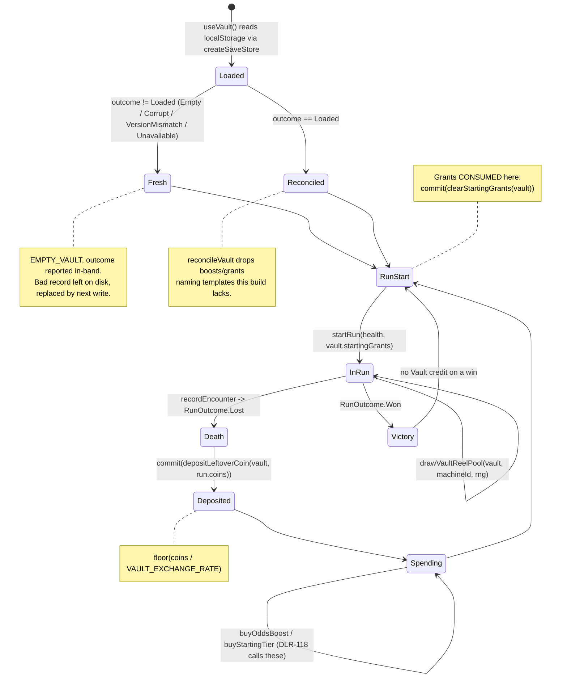

# Plan: Vault — cross-run meta-progression

Plan folder: `.claude/contract/DLR-113-vault-cross-run-meta-progression/`
Execution status: see `tasks.md` in this folder.

---

## Part 1 — Alignment

### Task reference

Jira **DLR-113** — "Vault: cross-run meta-progression" (Task, epic DLR-103, label `engine`).

> **Problem statement.** When a run ends in death, leftover coin is lost today. The Vault converts it into a persistent currency spent on two confirmed uses: raising a card's odds in the slot machine's pool on future runs, and buying a better starting tier of a liked card directly into the starting pile.
>
> **Acceptance criteria.**
> 1. On a run ending in death, remaining coin converts to Vault currency at `VAULT_EXCHANGE_RATE = 10` leftover coin : 1 Vault currency (named, retunable constant), and the result is persisted via the cross-run storage layer.
> 2. A "raise this card's odds" spend increases a named buff's weight in the slot-machine pool for future runs, persisted and re-applied on run start.
> 3. A "buy a starting tier" spend is implemented as three separately priced purchases (bronze/silver/gold), each placing that tier of the chosen buff directly into a future run's starting pile — implemented as two separate spend paths per the game-designer consult (not a single upgrade path), since they answer different questions.
> 4. Both spends and the Vault balance persist across a browser reload, verified by a round-trip unit test through the storage layer.
>
> **Scope boundaries.** In scope: coin-to-Vault conversion on death, the two confirmed spends, persistence. Out of scope: the Vault's own screen; showing Vault currency mid-run as a "coming attraction" (reveal only at death/run-end).
>
> **Dependencies & risks.** Blocked by the cross-run storage ticket and the slot-machine ticket. Risk: none structural — both spends are additive and reversible via the exchange-rate constant.

Sibling ticket, read in full and deliberately not built here: **DLR-118** — "Vault end-of-run screen" (Story, labels `ui`/`playable`), whose ACs are a screen showing the balance, offering both spends, and returning to the start-screen flow.

Standing sprint-run instructions applied (2026-08-23): the plan approval gate is auto-approved at the plan's stated default, every default is logged, and the mockup gate is skipped.

### Restated goal

Build the **mechanism** of the Vault: a small pure `src/vault/` module holding a persistent, cross-run player record — a currency balance, a set of per-card odds boosts, and a queue of bought starting-tier cards — written through the existing `src/persistence/` save layer as the first thing this game has ever persisted. Leftover coin at death converts into that balance at a named rate; two spend functions draw it down; the odds boosts compose into the weight function `drawReelPool` already accepts as a defaulted parameter; the bought starting cards are minted into the opening buff pile at run start. Wire the mechanism into `App.tsx` through a thin hook so it actually runs (deposit on death, claim grants at run start) — but build **no Vault screen**, which is DLR-118's.

### In scope

- `src/vault/` — a new pure-TypeScript module (no React, no DOM, no direct storage), lint-fenced like `src/hunt/`.
- `VaultState`: `{ balance, oddsBoosts, startingGrants }` — and this shape *is* the persisted shape.
- A typed vault save store built on `createSaveStore`, with a hand-written `isValidVaultState` type guard (no `as T`) and a separate domain reconciliation pass that drops entries naming a template that no longer exists.
- Conversion on death at `VAULT_EXCHANGE_RATE = 10` (transcribed from AC1), floor division, exact remainder discarded.
- Spend path 1 — "raise this card's odds": buys one stack of an odds boost on a named template, capped, permanent.
- Spend path 2 — "buy a starting tier": three separately priced purchases (bronze / silver / gold), each queuing one grant that is **consumed at the next run start**.
- Composition into the slot machine through `drawReelPool`'s existing defaulted `weightOf` seam — a `vaultReelWeightFor(vault, machineId)` factory and a `drawVaultReelPool` convenience wrapper.
- `startRun` gains an optional `grants` parameter; `src/hunt/buffTemplates.ts` gains `templateById` and `mintGrants`, so hunt owns template→`Buff` minting and vault never constructs a `Buff`.
- `src/app/vault/useVault.ts` — a thin, JSX-free hook holding the loaded vault plus a `commit` writer.
- `App.tsx` wiring: deposit leftover coin when the run's outcome becomes `Lost`; claim starting grants when the Start screen's action button begins a run.
- `eslint.config.js`: add `src/vault/**` to the existing pure-core `no-restricted-imports` / `no-restricted-globals` block, and to the storage block's `ignores` for the flat-config replacement reason `web-project.md` documents.
- Unit tests beside every pure module, including AC4's storage round-trip.

### Explicitly out of scope

- **The Vault screen** and any `.tsx` this ticket would otherwise be tempted to write — DLR-118 owns the screen, its navigation from the verdict flow, its balance display, and its spend buttons. This ticket ships the functions those buttons will call.
- Showing Vault currency mid-run (deferred by the ticket).
- A slot-machine screen. DLR-112 shipped the engine with no surface; there is nothing yet on which a boosted reel is visible, so AC2's "re-applied on run start" is realised structurally and exercised by tests, not by a live screen.
- Retuning the coin economy, `SLOT_FAMILY_WEIGHTS`, or `SLOT_AXIS_WEIGHTS`.
- Any `SAVE_SCHEMA_VERSION` bump — this is the first shape written at version 1, so there is nothing to bump *from*.
- Resolving the known open items on `Keepsake`, `Ward`, or `Miser`.

### Pattern Reference

- `src/persistence/saveStore.ts` — `createSaveStore`, `SaveReadOutcome`, `SaveWriteOutcome`, `saveKeyFor`. The mandatory route for anything persisted.
- `.claude/rules/save-data-versioning.md` — six reject conditions, all binding here.
- `src/hunt/slotMachine.ts` → `drawReelPool`'s defaulted `weightOf` parameter, built on DLR-112 explicitly as this ticket's seam; and `src/hunt/slotWeights.ts` → `templateWeightFor`.
- `src/hunt/shop.ts` → `ShopItem` / `PurchaseRefusal` / `refusalFor` — the reason-code refusal idiom every spend here copies.
- `src/hunt/buffTemplates.ts` → `mintFromTemplate`, `REWARD_TIER_VALUE`, `BUFF_TEMPLATES`.
- `src/hunt/config.ts` and `src/hunt/slotConfig.ts` — the documented-constant style (`UNIT:` comment, rationale, `AGENT-CHOSEN` register).
- `.docs/design/Balatro-Forbidden-Solitaire/v1-buff-card-list.md` — the authored template list DLR-112 transcribed.
- `.claude/skills/react-frontend/SKILL.md` and `.claude/workflow/web-project.md`.

### Constraints flagged on the brief

- **Determinism.** `src/hunt/` must stay free of `Math.random()`; `rng: Rng` is threaded explicitly. `src/vault/` inherits the same ban — it introduces no randomness at all, and the reel draw it influences keeps taking its `rng` from the caller. DLR-130's balance simulator depends on this.
- **The save-data rule binds every reviewer.** All six reject conditions apply: storage globals confined to `browserStorage.ts`; keys only via `saveKeyFor`; `{version, data}` envelope only; a shape change means a version bump in the same task; no `as T`; no read failure silently reported as success.
- **The `Buff` widening trap.** DLR-107 widened `Buff` with a required `kind` and recorded that it was free *only because the buff pile was not yet persisted* — "after DLR-113 this would need a schema bump". Handled below by persisting no `Buff` at all.
- **`BuffTemplate.id` is documented "NOT persisted"** in `src/hunt/buffTemplates.ts`. This plan deliberately overturns that and fixes the statement where it is owned.
- **DLR-106 deferred the unmigratable-save question to this ticket.** Answered below, in the module and in the log.
- **Vocabulary.** Timebomb / prime / ticking / detonates / Blast Guard. Never "Envenom" or "poison" outside `CardRank.Poison`.
- Two runtime dependencies only; no new dependency is needed or added.
- 400-line blocking file budget, measured with `(Get-Content <path>).Count` after Prettier.

### Assumptions made

- **A new top-level `src/vault/` module, not files inside `src/hunt/`.** The Vault sits *above* a run: it outlives one, and it reads the run's end state rather than being part of it. Putting it in `hunt` would also make `hunt` depend on `persistence`, widening the tree that is currently lint-fenced as pure engine. `vault` may import `hunt` and `persistence`; neither imports `vault`, so there is no cycle — the same one-way edge `warCouncil → hunt` already has.
- **The in-memory `VaultState` and the persisted payload are the same shape, deliberately.** A separate DTO plus a mapper is two shapes that drift; one shape with a guard over it cannot. The cost — every future field is a persisted field — is accepted and is the point: it forces the version question to be asked at the field, not discovered later.
- **Nothing containing a live `Buff` is persisted.** A grant is stored as `{ templateId, tier }`, the minimal pair `mintFromTemplate` needs to reconstruct a `Buff` at run start. So DLR-107's widening observation lands as: *it never lands*. `Buff` stays free to gain fields forever, because no version of it is ever on disk.
- **`BuffTemplate.id` becomes a persisted, frozen-format identifier.** It is already documented as the "stable identifier" `<kind>[:<param>]:<axis>`; persisting it and persisting `{kind, target, axis}` carry identical information, but the id gives a single total guard — "does `BUFF_TEMPLATES` contain this id" — instead of validating three vocabularies and then searching anyway. Its docblock is edited in the same task to say the format is now frozen, rather than leaving a comment that contradicts the code.
- **An unmigratable save is discarded, not migrated — non-destructively.** See Approach; the decision, the reasoning, and the alternative are recorded there because DLR-106 deferred it here.
- **Odds boosts are permanent; starting grants are consumed on use.** AC2 says "for future runs" (plural) and "re-applied on run start"; AC3 says "a future run's starting pile" (singular). Read literally, that is a permanent steering effect and a one-shot power effect — which is also the split that keeps the meta from compounding.
- **A boost multiplies a template's existing weight rather than replacing it.** `weight × (1 + step × stacks)`. Replacing would erase `templateWeightFor`'s per-family normalisation, which DLR-112 built specifically so a family's share is its stated weight and not its template count.
- **Zero content is gated behind the Vault.** Every template is reachable at balance 0. The Vault only changes *how often* and *what you start holding*.
- **Conversion is `Math.floor(coins / RATE)`; the remainder is discarded, not carried.** A carried remainder is a fourth persisted field whose only job is to make a 9-coin death feel less bad, and it would need its own version story.
- **Deposit fires from `handleComplete` when the recorded outcome is `Lost`; grants are claimed from the Start screen's action button.** Both are callbacks, not effects — so there is nothing for StrictMode to double-fire and no cleanup to write. `App.tsx` already routes every run start (initial mount *and* `handleNewRun`) through `RunPhase.Start`, which makes that button the single, structural run-start hook.
- **Run coins are not zeroed after conversion.** The run is over and nothing spends them; the verdict panel reads `run.coins`, and blanking it would silently change DLR-95's verdict display.
- **The Vault is not credited on a *won* run.** AC1 says "a run ending in death". A win is its own reward, and paying the Vault for a win would make the strongest players accumulate fastest — the exact shape of a trivialised run 10.

### Config and persisted-shape audit

- **Nothing is persisted yet.** `src/persistence/` shipped on DLR-106 with no consumer: `Get-ChildItem src -Recurse -Include *.ts,*.tsx | Select-String "from '\.\./persistence'|from './persistence'"` returns **0 hits outside `src/persistence/` itself**. This ticket writes the first record in the game's history, so there is no existing save to migrate and `SAVE_SCHEMA_VERSION` stays at **1**. That window is now closed; the next shape change is a real migration.
- **`SAVE_NAMESPACE` containment holds.** `Select-String -Pattern "'strings-and-stations'"` across `src` returns hits only in `src/persistence/config.ts` (**1 file**), as `save-data-versioning.md` requires. This plan adds none: the vault store passes the section name `'vault'` to `saveKeyFor` and never composes a key.
- **`localStorage` containment holds and is lint-enforced.** The three grep hits are the two in `src/persistence/browserStorage.ts` and the one prose reference in `saveStore.ts`, exactly as the rule's *How to verify* section records. `src/vault/**` names neither global — it takes an injected `StorageLike | null`.
- **`BuffTemplate.id` — the one name this ticket promotes to a persisted key.** `BUFF_TEMPLATES` holds **71** ids, generated at module load from `TEMPLATE_FAMILIES` × axes × param. The id format `<kind>[:<param>]:<axis>` binds by string from today on. Its two composing vocabularies are `BuffKind` (**22 members**) and `BuffRewardAxis` (**11 members**), both `as const` maps in `src/hunt/buffs.ts`. Consumers of `BuffTemplate.id` today: `src/hunt/slotMachine.ts` (`resolvePull`'s match map) and `src/hunt/__tests__/slotMachine.test.ts` — **2 files**, neither of which changes meaning by the id also being persisted.
- **`BuffTier` becomes a persisted vocabulary.** Its three values (`'bronze'`, `'silver'`, `'gold'`) are now on disk and frozen. It is declared once in `src/hunt/buffs.ts` and the guard validates against that declaration rather than against literals of its own, so a rename fails the guard rather than silently accepting a stale save.
- **Type changes to existing exports.** `startRun` gains a **second optional parameter** with a default of `[]`; no existing call site (`src/App.tsx:85`, `src/App.tsx:200`, and the `run.*.test.ts` specs) changes or breaks. `drawReelPool`'s signature is untouched — this ticket only supplies its already-defaulted third argument. No existing field's type changes, no union widens, no required field is added anywhere.
- **`eslint.config.js` boundary.** `src/vault/**` is added to the pure-core block's `files` array (extending, never pasting a second copy, per `web-project.md`) *and* to the storage block's `ignores`, because ESLint flat config **replaces rather than merges** same-key rule options — the regression that shipped and was caught on DLR-106.

---

## Part 2 — Technical design

### Approach

The Vault is four small pure modules plus a hook. `vaultConfig.ts` holds every number. `vaultState.ts` holds the shape, its empty value, its type guard, and its domain reconciliation. `vaultEconomy.ts` holds the deposit and both spends, each returning either a new `VaultState` or a named refusal code — the `refusalFor`/`PurchaseRefusal` idiom `src/hunt/shop.ts` already sets, because a spend that throws on an unaffordable purchase forces every future caller (DLR-118's buttons) to guard first or catch. `vaultOdds.ts` composes the boosts into a weight function. `vaultStore.ts` is the only file that knows the vault is persisted at all, and it does so exclusively through `createSaveStore`.

**Why the persisted shape carries no `Buff`.** DLR-107 recorded that widening `Buff` with a required `kind` was free only while the buff pile was unpersisted, and named this ticket as the point that stops being true. The plan's answer is to never let it become true: a bought starting card is stored as `{ templateId: string, tier: BuffTier }` — the exact pair `mintFromTemplate(template, tier, id)` needs — and the live `Buff` is minted fresh at run start with an id from `RunState.nextBuffId`. Persisting the live `Buff` was the alternative and is rejected explicitly: it would put `id`, `kind`, `condition` and `reward` on disk, making every future widening of a domain type a migration, and it would persist a *derived* reward value that `REWARD_TIER_VALUE` owns — so retuning the tier ladder would leave old saves paying the old numbers. Storing the coordinates and re-deriving the card means a retune reaches every save for free.

**Why the template id and not its coordinates.** `BuffTemplate.id` is generated as `<kind>[:<param>]:<axis>` and is already called the stable identifier; persisting it and persisting `{kind, target, axis}` carry identical information. The id wins because it admits one total, cheap guard — membership in `BUFF_TEMPLATES` — where the coordinate form would validate three separate vocabularies and then have to search for the template anyway. The cost is that the id *format* is now frozen, and this plan pays it honestly by editing that docblock in the same task rather than leaving a "NOT persisted" comment standing over persisted data.

**What happens to a save this build cannot read — the question DLR-106 deferred here.** It is **discarded, and the player starts fresh**, reported in-band and never destroyed on read. Concretely: `createSaveStore` already returns `VersionMismatch` (or `Corrupt`) paired with the caller's default, and `loadVault` passes both the empty vault and that outcome back to its caller, so DLR-118's screen can say "your Vault could not be read" instead of showing a silent zero. The bad record is deliberately **not** cleared during the read — a read must not destroy data, and leaving the bytes in place is what lets a future version write a migration for them if the developer ever wants one; the record is simply replaced by the next write. Migration was the alternative and is wrong at version 1 for a concrete reason: there is exactly one schema version in existence, so a migration function today would have no source shape to migrate *from* and would be untestable speculation. The half-load — reading what parses and ignoring what does not — is the option the rule forbids, and the two-stage design here is precisely what avoids drifting into it: `isValidVaultState` is a **shape** guard that accepts or rejects the whole payload, and `reconcileVault` is a separate **domain** pass over an already-valid payload that drops entries naming templates this build no longer has, returning a count of what it dropped. Shape failures lose the save; domain drift loses only the affected entries and keeps the balance.

**How the odds boost reaches the reel.** DLR-112 made `drawReelPool`'s `weightOf` a defaulted parameter expressly for this ticket. `vaultReelWeightFor(vault, machineId)` returns `(template) => templateWeightFor(machineId, template) * boostMultiplierFor(vault, template.id)`, and `drawVaultReelPool(vault, machineId, rng)` is the one-call wrapper a future slot screen uses. Multiplying preserves `templateWeightFor`'s per-family normalisation, which DLR-112 built so that a family's share of a strip is its stated weight rather than its template count; replacing the weight outright would silently undo that. Nothing about the draw's determinism changes — the `rng` still comes from `slotSeedFor` and no module holds state.

**Where React touches this.** Only `src/app/vault/useVault.ts` (a JSX-free hook: `useState` for the store and the loaded vault, a `commit(next)` that writes then sets) and about a dozen lines in `App.tsx`. Both mutation points are user-driven callbacks — the run-loss branch of `handleComplete`, and the Start screen's action button — so the hook holds **no effect**, registers no listener or timer, and has nothing for StrictMode to double-fire. The alternative, a `useEffect` watching `run.outcome`, was rejected: StrictMode would run it twice on mount and it would need a "have I already deposited this run" guard, which is a second source of truth about a transition the callback already owns exactly once.

### Skills to invoke during execution

- `react-frontend` — owns everything under `src/`: the module placement, the `as const` map form under `erasableSyntaxOnly`, the configuration-not-literals rule, the 400-line budget, hook shape, and the Vitest posture (pure logic tested with no renderer).
- `implementation-doc-writer` — invoked by `/fb-apply` after the gates are green, to update `.docs/implementation/` and `.docs/game_rules/the-hunt.md` with the Vault's rules. Not invoked by the Implementer.
- `management-jira` — the status transitions only; no code.

Rules the executor must Read: `.claude/rules/save-data-versioning.md` (all six reject conditions bind this contract). Always: `.claude/workflow/web-project.md`.

No developer override was applied — this contract runs under the 2026-08-23 unattended sprint-run instruction, which auto-approves the gate at the plan's stated defaults and skips the skill-confirmation `AskUserQuestion`.

### Diagram



### Data shapes

#### `src/vault/vaultConfig.ts` — every number this ticket owns

```ts
/** UNIT: leftover coin per 1 Vault currency. TRANSCRIBED from DLR-113 AC1, not chosen. */
export const VAULT_EXCHANGE_RATE = 10

/** UNIT: Vault currency per odds-boost stack. AGENT-CHOSEN. */
export const VAULT_ODDS_BOOST_PRICE = 1

/** UNIT: stacks. AGENT-CHOSEN cap — the anti-determinism guard on the reel. */
export const VAULT_ODDS_BOOST_MAX_STACKS = 3

/** UNIT: additive multiplier per stack; weight x (1 + STEP * stacks). AGENT-CHOSEN. */
export const VAULT_ODDS_BOOST_STEP = 1

/** UNIT: Vault currency per starting-tier grant, per tier. AGENT-CHOSEN — DERIVED from
 *  `REWARD_TIER_VALUE[BuffRewardAxis.Coins]`'s 2/5/10 ladder, so the Vault charges the same
 *  bronze:silver:gold ratio the game already states a tier is worth. */
export const VAULT_STARTING_TIER_PRICE: Readonly<Record<BuffTier, number>> = {
  [BuffTier.Bronze]: 2,
  [BuffTier.Silver]: 5,
  [BuffTier.Gold]: 10,
}
```

#### `src/vault/vaultState.ts`

```ts
/** One bought starting card. NOT a `Buff`: the minimal pair `mintFromTemplate` needs, so no
 *  domain type is ever on disk and `Buff` stays free to widen. Re-exported from `src/hunt/`. */
export type { TemplateGrant } from '../hunt/buffTemplates'

/** THE persisted shape AND the in-memory shape — deliberately one type, not a DTO pair. */
export interface VaultState {
  /** UNIT: Vault currency. Non-negative safe integer. */
  readonly balance: number
  /** `BuffTemplate.id` -> stacks bought, 1..VAULT_ODDS_BOOST_MAX_STACKS. Permanent. */
  readonly oddsBoosts: Readonly<Record<string, number>>
  /** Bought-but-unclaimed starting cards. CONSUMED at the next run start. */
  readonly startingGrants: readonly TemplateGrant[]
}

export const EMPTY_VAULT: VaultState

/** Shape guard — mandatory per save-data-versioning.md reject condition 5. Rejects the whole
 *  payload; never partially accepts. Skips `__proto__`/`constructor`/`prototype` keys. */
export function isValidVaultState(candidate: unknown): candidate is VaultState

export interface VaultReconciliation {
  readonly vault: VaultState
  /** Boost + grant entries dropped because their templateId is gone from BUFF_TEMPLATES. */
  readonly droppedCount: number
}

/** DOMAIN pass over an already shape-valid payload. Drops unknown templateIds, clamps stacks
 *  to VAULT_ODDS_BOOST_MAX_STACKS, floors the balance. Never throws. */
export function reconcileVault(candidate: VaultState): VaultReconciliation
```

#### `src/vault/vaultEconomy.ts`

```ts
/** Why a spend cannot happen. A reason CODE — `src/hunt/shop.ts`'s PurchaseRefusal idiom. */
export const VaultSpendRefusal = {
  NotEnoughCurrency: 'notEnoughCurrency',
  UnknownTemplate: 'unknownTemplate',
  BoostMaxed: 'boostMaxed',
} as const
export type VaultSpendRefusal = (typeof VaultSpendRefusal)[keyof typeof VaultSpendRefusal]

/** AC1 — floor(coins / VAULT_EXCHANGE_RATE) added to the balance. Remainder discarded.
 *  A non-finite or negative `leftoverCoin` credits 0 rather than producing NaN. */
export function depositLeftoverCoin(vault: VaultState, leftoverCoin: number): VaultState

/** THE single statement of what one odds boost costs and whether it is affordable. */
export function oddsBoostRefusalFor(vault: VaultState, templateId: string): VaultSpendRefusal | null
export function startingTierRefusalFor(vault: VaultState, templateId: string, tier: BuffTier): VaultSpendRefusal | null

/** AC2 — one permanent stack on `templateId`. THROWS RangeError on a refused purchase, the
 *  `buyFromShop` discipline: the refusal predicate above is the caller's guard. */
export function buyOddsBoost(vault: VaultState, templateId: string): VaultState
/** AC3 — one one-shot grant queued at `tier`. Throws on a refused purchase, as above. */
export function buyStartingTier(vault: VaultState, templateId: string, tier: BuffTier): VaultState

/** Consumed at run start — the returned vault has an empty `startingGrants`. */
export function clearStartingGrants(vault: VaultState): VaultState
```

#### `src/vault/vaultOdds.ts`

```ts
/** 1 + VAULT_ODDS_BOOST_STEP * stacks, clamped at VAULT_ODDS_BOOST_MAX_STACKS. 1 when unboosted. */
export function boostMultiplierFor(vault: VaultState, templateId: string): number

/** AC2 — the weight function `drawReelPool` already accepts as its defaulted third parameter. */
export function vaultReelWeightFor(
  vault: VaultState,
  machineId: SlotMachineId,
): (template: BuffTemplate) => number

/** The one call a future slot screen makes. Takes `rng` explicitly — no Math.random(). */
export function drawVaultReelPool(vault: VaultState, machineId: SlotMachineId, rng: Rng): SlotMachine
```

#### `src/vault/vaultStore.ts`

```ts
/** Key suffix handed to `saveKeyFor`. NEVER concatenated with SAVE_NAMESPACE at a call site. */
export const VAULT_SAVE_SECTION = 'vault'

export interface VaultLoad {
  readonly vault: VaultState
  /** Why the load produced what it produced — reported, never swallowed. */
  readonly outcome: SaveReadOutcome
  /** Entries `reconcileVault` dropped. 0 on any non-Loaded outcome. */
  readonly droppedCount: number
}

export function createVaultStore(storage: StorageLike | null): SaveStore<VaultState>
export function loadVault(store: SaveStore<VaultState>): VaultLoad
export function saveVault(store: SaveStore<VaultState>, vault: VaultState): SaveWriteOutcome
```

#### `src/hunt/buffTemplates.ts` — additions

```ts
/** One bought card, as coordinates. Declared HERE, not in `src/vault/`: hunt owns how a
 *  template becomes a `Buff`, and declaring it in vault would force the reverse import edge. */
export interface TemplateGrant {
  readonly templateId: string
  readonly tier: BuffTier
}

/** `BUFF_TEMPLATES` by id, derived ONCE at module load. `undefined` for an id this build has
 *  no template for — which is exactly what `reconcileVault` tests a stale save against. */
export function templateById(id: string): BuffTemplate | undefined

/** Mints one `Buff` per grant, consecutive ids from `firstId`, SKIPPING any grant whose
 *  templateId is unknown. Ids stay consecutive over what was actually minted. */
export function mintGrants(grants: readonly TemplateGrant[], firstId: BuffId): readonly Buff[]
```

#### `src/hunt/run.ts` — `startRun` signature change

```ts
// BEFORE: startRun(playerHealth: Health = PLAYER_START_HEALTH): RunState
// AFTER — second parameter, defaulted, so no existing call site changes:
export function startRun(
  playerHealth: Health = PLAYER_START_HEALTH,
  grants: readonly TemplateGrant[] = [],
): RunState
// buffs:     [...seedStartingBuffPile(STARTING_BUFF_COUNT, 1), ...mintGrants(grants, STARTING_BUFF_COUNT + 1)]
// nextBuffId: STARTING_BUFF_COUNT + 1 + <number actually minted>
```

#### `src/app/vault/useVault.ts`

```ts
export interface VaultHandle {
  readonly vault: VaultState
  readonly loadOutcome: SaveReadOutcome
  readonly droppedCount: number
  /** Writes through the store, then sets state. Never throws. */
  commit(next: VaultState): void
}
/** `storage` is injectable so a spec can pass `createMemoryStorage()`; it defaults to
 *  `browserLocalStorage()`, resolved inside a lazy initialiser, never per render. */
export function useVault(storage?: StorageLike | null): VaultHandle
```

#### `eslint.config.js`

No new rule block. `src/vault/**/*.{ts,tsx}` is appended to the existing pure-core block's `files` array and to the storage block's `ignores` array.

#### No other changes

No `package.json`, `tsconfig`, or dependency change. `SAVE_SCHEMA_VERSION` stays `1`.

### Runtime quality notes

- **Purity and adjudication.** Every rule lives in `src/vault/*.ts`, all pure and DOM-free, lint-fenced by the same override that protects `src/hunt/`. `App.tsx` decides nothing: it calls `depositLeftoverCoin`, `clearStartingGrants`, and `startRun`, and asks `loadOutcome` rather than inferring it. Every number is a named constant in `vaultConfig.ts` with a `UNIT:` comment; no literal rate, price, or cap appears in logic.
- **Effects, mount and teardown.** **No effect is added anywhere.** `useVault` holds two `useState`s with pure lazy initialisers (the store, and the initial load) — StrictMode's double-invocation re-reads storage, which is idempotent, and re-wraps the same `localStorage`, which is stateless. Both mutation points are user callbacks, so there is no listener, timer, `requestAnimationFrame`, observer, or `AbortController` to release, and no cleanup to write. No module-level mutable state: `createVaultStore` returns a fresh store per call, exactly as `createMemoryStorage` does and for the reason its docblock states.
- **Hot-path cost.** Nothing here runs per pointer event. `templateById` is an `O(1)` Map lookup derived once at module load, in the style `slotWeights.ts`'s `FAMILY_AXIS_TOTAL` already uses, so `vaultReelWeightFor`'s per-template call adds one map read to a draw that already happens at most a few times per shop visit. `reconcileVault` runs once per page load over at most a few dozen entries. No memoisation is added — there is no profiled problem to fix.
- **Determinism and numeric safety.** `src/vault/` calls no random source of any kind; the reel draw keeps taking `rng: Rng` from its caller, seeded by `slotSeedFor`. No division exists outside `depositLeftoverCoin`'s `coins / VAULT_EXCHANGE_RATE`, whose divisor is a non-zero constant and whose numerator is guarded for finiteness first, so no `NaN` is constructible. `boostMultiplierFor` reads a stack count that `reconcileVault` has already clamped and the guard has already proved is a finite integer, and returns `1` for any id it does not know — never `NaN`, never `undefined`.
- **Error paths.** `createSaveStore` never throws, and neither does anything in `src/vault/`. Every read failure returns `EMPTY_VAULT` **paired with the named outcome** that says why, satisfying reject condition 6 — there is no bare `catch { return DEFAULTS }` anywhere in the module. A refused spend is a named `VaultSpendRefusal` from the predicate; the `buy*` functions throw `RangeError` only when called past their own refusal, which is a driver bug and is the exact discipline `buyFromShop` already uses. A write that cannot happen returns `SaveWriteOutcome.Rejected` or `Unavailable` rather than pretending; the in-memory vault still updates, so the session keeps working and only the persistence is lost. Nothing is logged to the console.

### Risks and judgement calls

- **`VAULT_EXCHANGE_RATE = 10` is transcribed from AC1, but the live coin economy may not reach it.** `COINS_PER_ENCOUNTER_WIN = 1` and shop prices run 1–4, so a run that dies at fight three plausibly holds **0–5 leftover coin — which converts to 0 Vault currency**. The rate is shipped exactly as the ticket states it, and the cheapest purchase is priced at **1** so that a single 10-coin death buys something rather than nothing. **The developer decides after playing** whether to lower the rate or raise coin income; this is flagged, not silently "fixed", because AC1 names the number.
- **Every price and cap below is agent-chosen and unplayed.** `VAULT_ODDS_BOOST_PRICE = 1`, `VAULT_ODDS_BOOST_MAX_STACKS = 3`, `VAULT_ODDS_BOOST_STEP = 1`, and `VAULT_STARTING_TIER_PRICE = {2, 5, 10}` — the same register `buffCosts.ts` and `slotWeights.ts` already carry. The tier prices are *derived* from `REWARD_TIER_VALUE[Coins]`'s existing 2/5/10 ladder rather than invented, so if the developer retunes that ladder these should follow it.
- **Where these numbers sit between the two failure modes.** *Run 1 is not a punishment*: nothing is gated, no template is unreachable at balance 0, and the opening pile is still `STARTING_BUFF_COUNT = 4` cards. The Vault adds steering, never a stat, so run 1 is the whole game with a randomised offer set. *Run 10 is not trivial*: a maxed boost is **×4** weight, which moves one template from roughly **8/71 ≈ 11%** of appearing on a strip to roughly **33–38%** — clearly felt, never guaranteed, and the posted-strip fantasy DLR-112 defends survives. Grants are **consumed on use**, so a gold card costs 10 currency (≈100 leftover coin) *every run you want it* and never becomes a permanent power floor. This is the single most important lever in the ticket and the first one to reconsider if progression feels flat.
- **Grants being one-shot is a rule reading, not a transcription.** AC3 says "a future run's starting pile", singular. If the developer meant permanent, the change is deleting the `clearStartingGrants` call in `App.tsx` — one line — and the meta becomes compounding.
- **`Miser` and the Vault point the same way.** DLR-111 flagged that Miser "fights the shop" by rewarding unspent coins; the Vault also rewards unspent coin, so it *reinforces* Miser rather than resolving the tension. Left alone deliberately — at rate 10, hoarding is still the weaker play (10 coin buys 2 Whetstones and 2 Cheats now, versus 1 odds boost later). Worth watching, not worth pre-emptively balancing.
- **AC2's "re-applied on run start" has no live surface to be visible on.** DLR-112 shipped the slot engine with no screen, so `drawVaultReelPool` has no production caller yet and the boost is exercised by unit tests only. That is structural, not a gap in this ticket — but nobody can *see* an odds boost work until a slot screen exists.
- **`BuffTemplate.id`'s format is frozen from this commit.** Renaming a `BuffKind` or `BuffRewardAxis` member value now orphans saved boosts and grants — `reconcileVault` will drop them silently-but-countably rather than corrupt anything, but the currency spent on them is gone. A future rename must ship with a migration.
- **`App.tsx` grows by roughly a dozen lines**, and DLR-118 will touch it again for navigation. Worth a glance that the two wiring points read clearly before that ticket lands on top of them.
- **The unmigratable-save answer is a product decision as much as a technical one.** Discarding is right for a prototype nobody has played; if the developer expects to hand builds to other people, the first `SAVE_SCHEMA_VERSION` bump should ship a migration instead, and this is the moment to say so.
