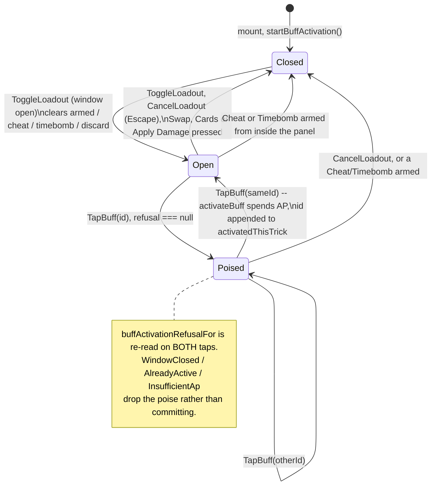

# Plan: DLR-114 — Pre-hand loadout action bar

Plan folder: `.claude/contract/DLR-114-pre-hand-loadout-action-bar/`
Execution status: see `tasks.md` in this folder.

---

## Part 1 — Alignment

### Task reference

Jira **DLR-114** — "Pre-hand loadout action bar", Story under epic **DLR-103**, labels `ui` + `playable`.

> ## Problem Statement
>
> Today's felt rail has separate Cheat slots, a separate Envenom plate, a separate discard plate, and a separate Apply Damage plate. The design doc replaces all of it with one four-button bar at the bottom of the screen: Apply Buff, Cards (select a card, greyed out until chosen), Swap (today's discard/reshape, relocated onto this bar), and Apply Damage.
>
> ## User Story
>
> As a player, I want one consistent action bar for every pre-trick decision, so I'm not learning four different interaction rituals for what are all variations of "spend a resource on this trick."
>
> ## Acceptance Criteria
>
> 1. A single action bar renders Apply Buff, Cards, Swap, and Apply Damage, replacing the separate Cheat-slot, Envenom-plate, and discard-plate rails.
> 2. Apply Buff opens a selection of the player's owned buffs, shows each buff's AP cost and the player's remaining AP, and lets the player activate one or more per the stacking rule.
> 3. Cards is greyed out until a card is selected, then highlighted, matching the described interaction.
> 4. Swap performs today's discard/reshape behavior, unchanged in rules, relocated onto this bar.
> 5. Apply Damage shows its AP cost and, once pressed, a visible indicator that a payout is queued and how many tricks remain until it resolves.
> 6. Component tests query by accessible role and label per this project's testing conventions.
>
> ## Scope Boundaries
>
> **In scope:** the four-button bar, its wiring to the buff/AP/Apply-Damage engine logic, removal of the old separate rails.
> **Out of scope:** visual polish beyond a functional default (separate polish ticket); the live win/lose card readout (a related but separate surface).
>
> ## Dependencies & Risks
>
> Blocked by the Cheat/Timebomb migration, buff activation, and delayed Apply Damage tickets (needs real logic to wire to). This is the single largest UI change in the epic — review `.claude/skills/game-ux/SKILL.md`'s full-viewport layout and interaction-cost guidance before building, since this bar replaces four previously-separate zones.

**Sprint-run dispatch, 2026-08-23/24.** This contract is executed unattended by the sprint runner. The plan-approval gate is auto-approved on the plan's stated defaults; the mockup is generated but **goes unseen**; the browser pass is off. Every default taken is logged to `.claude/sprint-runs/2026-08-23-sprint/log.md`.

### Restated goal

Give the felt one action bar along the bottom of the screen carrying the four pre-trick decisions — **Apply Buff**, **Cards**, **Swap**, **Apply Damage** — and make it the only place those decisions are taken, retiring the four separate felt-rail plates that carry them today. Behind it, wire the buff stack that ten prior tickets built bottom-up but nothing player-reachable has ever touched: `RunState.buffs` reaches the felt for the first time, `apCostOf` prices each owned buff on its own row, `startBuffActivation`/`activateBuff`/`openBuffWindow` own the per-hand AP pool and the per-trick activation window, and the pool that Apply Damage already spends from becomes the *same* pool a buff activation spends from rather than a second copy of it. Swap's rules are unchanged and relocated; Apply Damage's rules are unchanged, and it grows the AP cost and queued-payout readout AC5 asks for.

### In scope

- A new `ActionBar` component rendering exactly four controls — Apply Buff, Cards, Swap, Apply Damage — as the shell's own bottom zone, below the hand fan. (AC1)
- A `BuffLoadoutPanel` opened by Apply Buff: one glanceable line per owned, priced buff carrying its name, condition, reward and AP cost, plus the hand's remaining AP; two-tap activation through `activateBuff`; the relocated Cheat slots and Timebomb charge alongside. (AC2)
- A pure `src/hunt/` predicate that answers "can this buff be priced and therefore offered", so `BuffKind.Unassigned` placeholder content never reaches `apCostOf`'s `RangeError`. (AC2, defender warning)
- `WarCouncilMountProps.buffs` — the run's owned pile reaching the card layer for the first time — mirrored onto `RoundUiState` for the life of the hand, mirroring the `cheats` contract exactly.
- `RoundUiState.apPool: ActionPoints` collapsed into `RoundUiState.buffActivation: BuffActivationState`, so the hand has exactly one AP pool. Apply Damage spends from it; buff activation spends from it. (AC2, AC5)
- The per-trick activation window: `openBuffWindow` fired at the transition that resolves a trick, `startBuffActivation` at mount (which is the per-hand refresh, since `App` remounts the felt per hand).
- Cards: greyed while nothing is armed, highlighted and labelled with the armed card once one is, and pressing it commits that card — the existing `TapCard` second-tap path, reached from a second place. (AC3)
- Swap: today's `TapDiscard`/`CancelDiscard` behaviour, rules untouched, relocated onto the bar. (AC4)
- Apply Damage: today's `TapApplyDamage`/`CancelApplyDamage` behaviour, relocated onto the bar, plus its AP cost and a queued-payout readout naming the frozen cash-out and the tricks still owed. (AC5)
- Deletion of `ApplyDamagePlate.tsx`, `DiscardPlate.tsx`, their stylesheets and their component tests; removal of `CheatSlots` and `TimebombCharge` from the felt rail and their re-mounting inside the loadout panel.
- Component tests querying by accessible role and label for every one of the above. (AC6)

### Explicitly out of scope

- **Evaluating a buff's condition or paying its reward.** `buffAccrual.ts` (`resolveFiredBuffs`, `accrueAxisBonus`, `overlapBonusFor`) has no caller today and gains none here. Activation is what this ticket makes reachable; firing is a later ticket's. An activated condition buff spends AP and does nothing else yet, and that is stated on the surface.
- **Migrating the live Cheat and Timebomb mechanics onto `buffCatalog.ts`.** `CheatStage`/`TimebombStage` and their reducer branches are moved, not rewritten. DLR-107 shipped the catalog as representation only and said so; nothing here changes that.
- **Collapsing `timebombDamageFor` / `timebombDamageOf`** (DLR-129's nomination). See Risks — this contract does not wire the felt onto the catalog, so the rename has nothing behind it here.
- **Drawing buffs into a run.** `slotMachine.ts` stays unwired; the pile is whatever `startRun` seeded plus whatever the Vault granted.
- **Visual polish** beyond a functional default, per the ticket's own Scope Boundaries. Every token added is a placeholder flagged for the polish ticket.
- **The live win/lose card readout**, per the ticket.
- **`projectedDepletion` vs `shieldHearts`** — DLR-115's latent defect, untouched.
- **Retuning any AP figure.** `STARTING_AP`, `APPLY_DAMAGE_AP_COST`, `REWARD_BASE`, `CONDITION_MODIFIER`, `CONSUMABLE_AP_COST` are read, never written.

### Pattern Reference

- `src/app/warCouncil/DiscardPlate.tsx` and `ApplyDamagePlate.tsx` — the rail-control shape the bar's buttons inherit: refusal-driven `disabled`, refusal sentence on the control's own face (never a tooltip), `aria-pressed` for the poised stage, `stopPropagation` on the container's `onClick`, `Escape` to cancel.
- `src/app/warCouncil/roundUiState.ts` → `discardStock` / `applyDamageStock` / `buffActivationStock` — the "assemble plain values in one place so the reducer's guard and the control's disabled state cannot disagree" discipline every new control follows.
- `src/app/warCouncil/discardHandlers.ts` — the precedent for splitting a feature's reducer transitions into their own file rather than growing `roundReducer.ts` past its budget.
- `src/app/warCouncil/useRovingTabIndex.ts` — the existing roving-tabindex hook, used for the loadout panel's buff list.
- `src/hunt/buffActivation.ts` — `startBuffActivation`, `activateBuff`, `openBuffWindow`, `buffActivationRefusalFor`, `BuffActivationRefusal`. The rule is already written; this ticket only calls it.
- `.docs/design/Balatro-Forbidden-Solitaire/v1-buff-card-list.md` → *How a card is named* — the authoritative family-word / reward-suffix naming grammar and the twelve condition sentences. Transcribed into the label module verbatim, never re-derived.
- `.claude/skills/game-ux/SKILL.md` and `references/full-viewport-layout.md` — the no-scroll shell, zoning, interaction cost, roving tabindex.
- `.claude/skills/react-frontend/SKILL.md` — everything about how the code is written.

### Constraints flagged on the brief

- **Determinism.** `src/hunt/` must stay free of `Math.random()`; RNG is threaded as an explicit `rng: Rng`. Nothing this contract adds to `src/hunt/` is random — the one addition is a pure filter predicate. DLR-130's balance simulator depends on this holding.
- **The pure-core boundary.** `src/hunt/**` and `src/warCouncil/**` are lint-enforced free of React and the DOM (`eslint.config.js`). The new `src/hunt/` predicate must import nothing from `src/app/`.
- **Vocabulary (`6ba6224`).** **Timebomb**, **prime/primed**, **ticking**, **detonates**, **Blast Guard**. Never "Envenom" or "poison" in copy or identifiers — except `CardRank.Poison` (rank 8), an unrelated card rank. The ticket's own text says "Envenom-plate"; the plate is `TimebombCharge` on disk and stays so named.
- **The 400-line file budget is blocking and fixed in-ticket**, measured with `(Get-Content <path>).Count` after Prettier. `WarCouncilRound.tsx` sits at 380 and `roundUiState.ts` at 316 — both are load-bearing constraints on where the new code goes.
- **The screen must not scroll.** The bar adds a fourth row to a three-row full-viewport grid.
- **Component tests query by accessible role and label.** AC6, and — with the browser pass off — the only evidence this screen works until DLR-119.
- **Two runtime dependencies.** Nothing new is added.

### Assumptions made

Each of these is a decision the brief did not state. Under the sprint-run dispatch they are taken as the plan's default and logged.

- **The bar is always mounted, for the whole hand, and never removed.** A control that vanishes costs more than one that greys: the player relearns where things are, and the layout reflows on a screen that must not scroll. Every button greys with its reason on its own face instead. This follows `TimebombCharge`'s existing documented precedent ("the rail stays inert rather than absent at zero charges — the purse cell and this plate must never disagree about whether the item still exists this run").
- **Activation is reversible until the second tap and committing after it.** `activateBuff` spends AP through `spendAp` and `activatedThisTrick` has no removal path — the engine ships no un-activate, so inventing a refund here would be writing a rule `src/hunt/` does not own. The reversibility the brief asks about is therefore satisfied by the poise stage: one tap poises, a second commits, `Escape` or a tap elsewhere drops the poise unspent. This is exactly the grammar Cheat, Timebomb and Apply Damage already use, so the bar teaches one ritual rather than a fifth.
- **When the player can afford nothing, Apply Buff still opens.** The panel is where the player reads what they own and what it costs; hiding it when it is momentarily unaffordable is hiding the information needed to plan the next trick. Only `WindowClosed` — the felt is mid-trick — disables the Apply Buff button itself. Individual unaffordable rows are disabled and carry `InsufficientAp` on their face.
- **A buff's condition and reward are stated in one line, composed from the design document's own naming grammar.** `<Name> — <condition sentence>: <reward phrase>. <n> AP.` — e.g. `Bell-Taker (Momentum) — win a trick with Bells: +2 multiplier. 2 AP.` The family words, the four reward suffixes and the twelve condition sentences are transcribed from `v1-buff-card-list.md` → *How a card is named*, not invented. The same string is the row's visible text and its accessible name, so the sighted and screen-reader surfaces cannot drift.
- **`BuffKind.Unassigned` buffs are filtered out of the panel entirely** rather than rendered as inert rows. They carry no condition, no reward and no price by construction (`UNASSIGNED_BUFF_CONDITION`, `UNASSIGNED_BUFF_REWARD`), so a row for one would say nothing. The filter lives in `src/hunt/` as `activatableBuffs`, beside the `apCostOf` that would otherwise throw, so no UI file has to remember to guard.
- **Cheat and Timebomb move *into* the loadout panel rather than being deleted.** AC1 requires the separate rails to go; the two mechanics behind them are live and player-reachable today and deleting their only driver would be a regression this ticket does not ask for. Re-mounting the existing `CheatSlots` and `TimebombCharge` components inside the panel satisfies "one place for every pre-trick decision" with no rule change and no reducer change.
- **`ApplyDamagePlate` and `DiscardPlate` are deleted outright**, along with their stylesheets and component tests, because the bar's own buttons fully supersede them. Their label functions in `labels.ts` are kept and reused by the bar, so no copy is rewritten.
- **The hand has one AP pool, not two.** `RoundUiState.apPool` is replaced by `RoundUiState.buffActivation: BuffActivationState`, whose `apPool` field is that pool. Leaving both would give the felt two numbers that both claim to be the hand's AP and would diverge the first time one was spent without the other — and this contract is the first that spends from both.
- **The per-trick window closes when a trick resolves, not when one starts.** Activations happen while `currentTrick` is empty, so a "clear when the trick is empty" rule would clear the activations in the very window they were made. `openBuffWindow` therefore fires on the transition where `resolvedTrick` goes from `null` to non-null.
- **The mount is remount-per-hand, so `startBuffActivation()` in `createRoundUiState` *is* the per-hand refresh.** This is the identical argument `apPool: refreshActionPointsForNewHand(STARTING_AP)` already documents in that function. `refreshBuffsForNewHand` stays the pure statement of the rule and stays uncalled by the felt.
- **Opening the panel is mutually exclusive with an armed card, a Cheat selection, a Timebomb selection and an open discard selection**, and arming a Cheat or Timebomb from inside the panel closes it. All of those reinterpret the next hand-card tap; two at once makes that tap ambiguous. This is `handleTapDiscard`'s existing rule, extended by one control.
- **Committing a buff activation leaves the panel open.** AC2 says "one or more".
- **The bar's four buttons are plain tab stops; the panel's buff list uses the roving tabindex.** Four is below `game-ux`'s ~5 threshold; the pile is unbounded.
- **New CSS tokens are placeholders.** Every size bound is a `clamp()` copied from the sibling rail stylesheets rather than a new number, and the polish ticket owns them.

### Config and persisted-shape audit

Run per Step 1.6 — this contract renames a state field and adds a component prop, both string-adjacent surfaces.

- **`RoundUiState.apPool` → `RoundUiState.buffActivation.apPool`.** `Select-String` for `apPool` across `src/**` finds **44 hits in 8 files**. Filtering to the *state field* (as opposed to `ApplyDamageStock.apPool` and `BuffActivationState.apPool`, which are unchanged) gives exactly **7 hits in 3 files**: `src/app/warCouncil/roundUiState.ts:147` (declaration), `:217` (`createRoundUiState` seed), `:265` (`applyDamageStock` read), `:312` (`buffActivationStock` read — already reads the activation state's pool, not this one); `src/app/warCouncil/roundReducer.ts:240` (`spendAp(state.apPool, APPLY_DAMAGE_AP_COST)`); `src/app/warCouncil/__tests__/roundReducer.applyDamage.test.ts:122` and `:125`. All seven change in one task. The remaining 37 hits are `src/hunt/buffActivation.ts`, `src/hunt/__tests__/buffActivation.test.ts`, `src/warCouncil/voluntaryCashOut.ts`, `src/warCouncil/__tests__/voluntaryCashOut.test.ts` and `src/app/warCouncil/__tests__/buffActivationStock.test.ts` — all `ApplyDamageStock`/`BuffActivationStock`/`BuffActivationState` fields whose names and types are untouched.
- **`WarCouncilMountProps.buffs` is a new required prop.** Required rather than optional, matching every sibling (`cheats`, `timebombCharges`, `blastGuardHeld`, `discardsRemaining`, `bankClimbBonus`), so the compiler enumerates the mount sites. `Select-String` for `<WarCouncilRound` finds **1 production mount site** (`src/App.tsx:315`) plus the round fixture used by the component tests (`src/app/warCouncil/__tests__/roundFixture.ts`) and the three `WarCouncilRound.*.test.tsx` files. Every one is named in a task.
- **`RoundUiSeed` gains `buffs: readonly Buff[]`.** `createRoundUiState(seed)` is called from `WarCouncilRound.tsx`'s `useReducer` initialiser and from `buffActivationStock.test.ts`'s `makeSeed` helper; both change in the same task as the type.
- **Nothing here is persisted.** `RunState.buffs` is explicitly never persisted (`run.ts`: "NEVER persisted across runs, exactly as `coins` is not"), and `RoundUiState` dies with the mount. The only persisted surface in this repo is the Vault (`src/persistence/`, `src/vault/`), which this contract does not touch — no `localStorage` key, no `SaveData` field, no `BuffTemplate.id` string changes. `.claude/rules/save-data-versioning.md` was read; none of its reject conditions is reachable from this diff.
- **Type changes are additive, not lossy.** `RoundUiState` loses one field (`apPool: ActionPoints`) and gains two (`buffActivation: BuffActivationState`, `buffs: readonly Buff[]`, plus `loadout: LoadoutSelection | null`); `RoundUiAction` gains three members, so every `switch` over it must grow three cases — the reducer's `applyAction` switch is exhaustive and non-defaulted, so TypeScript fails the build if one is missed. That is the intended forcing function.
- **New CSS class names are all new**, prefixed `wc-bar-` and `wc-loadout-`. `Select-String` for `wc-bar-` and `wc-loadout-` across `src/**/*.css` and `src/**/*.tsx` finds **0 hits** — nothing collides. Deleting `warCouncilApplyDamage.css` and `warCouncilDiscard.css` removes `wc-apply-*` and `wc-discard-*`; the same grep at Final verification proves no orphaned selector or class reference survives.
- **The pure-core boundary is not crossed.** The only `src/hunt/` addition (`isPricedBuff` / `activatableBuffs`) imports `./buffs` and `./buffCosts` and nothing else. `npm run lint` enforces this.

---

## Part 2 — Technical design

### Approach

The shape is deliberately **relocation plus one new capability**, not a rewrite. Three of the four buttons already have a rule, a refusal predicate, a reducer transition and a test suite behind them; Swap and Apply Damage are moved onto the bar with their `RoundUiAction` kinds untouched, and Cards is a second entry point into the existing `TapCard` second-tap path rather than a new action at all. That keeps the diff's risk concentrated in the one genuinely new thing — the buff loadout — instead of spreading it across four mechanics at once.

**The bar is a fourth grid row on the shell, below the hand.** `.wc-shell` is `grid-template-rows: auto 1fr auto` over areas `status / dossier table / hand`; it becomes `auto 1fr auto auto` over `status / dossier table / hand / actions`. Only the `1fr` table row absorbs the difference, which is exactly what `game-ux`'s no-scroll floor requires: the bar's own height is `auto`, bounded by `clamp()` values copied from the sibling rail stylesheets, and the felt shrinks to make room rather than the page growing. The alternative considered was overlaying the bar on top of the hand as a fixed-position strip; rejected because it would occlude hand cards at short viewports, which is the crop failure the hard floor names. `.wc-felt-rail` keeps only `DecreePile`.

**Everything that decides anything stays out of the components.** The new pure logic is one predicate pair in `src/hunt/buffActivation.ts` — `isPricedBuff(buff)` (true when `isConditionFamily(buff.kind) || isConsumableKind(buff.kind)`, i.e. exactly when `apCostOf` can price it) and `activatableBuffs(buffs)` (the filter). That is where the `Unassigned` trap is closed, and it is closed in the pure layer rather than in JSX so no future consumer has to remember it. Availability continues to be assembled in `roundUiState.ts`'s stock functions: `buffActivationStock` already exists and already reads `discardWindowOpen`, so the panel's per-row `disabled` and the reducer's guard read the identical `buffActivationRefusalFor` result. The new reducer transitions — open/close the panel, poise a buff, commit a buff — go in a new `buffHandlers.ts` beside `discardHandlers.ts`, for that file's own stated reason: `roundReducer.ts` is at 316 lines and this is a self-contained block that decides nothing about the rest of the felt.

**The AP pool is unified, and that is the integration this ticket exists to force.** `RoundUiState.apPool` and `BuffActivationState.apPool` are today two independent numbers that both claim to be the hand's action points; the felt has never spent from the second, so they have never been observed to diverge. Replacing the field with `buffActivation: BuffActivationState` makes divergence unexpressible: `applyDamageStock` reads `state.buffActivation.apPool`, `handleTapApplyDamage` writes `spendAp` back into `state.buffActivation.apPool`, and `activateBuff` returns a whole new `BuffActivationState`. `startBuffActivation()` seeds it at mount, which is the per-hand refresh because `App` remounts the felt with `key={hand}` — the identical argument `createRoundUiState` already makes for `refreshActionPointsForNewHand`. The per-trick boundary is a second pure wrapper beside `captureUnplayed`: `openWindowOnTrickResolved(prev, next)` calls `openBuffWindow` exactly on the transition where `resolvedTrick` goes from `null` to non-null, so `activatedThisTrick` survives the trick it was made for and clears before the next window. A "clear whenever the trick is empty" rule was considered and rejected: activations are made while the trick *is* empty, so it would erase them the instant they were made.

**Copy is transcribed, not written.** `buffLabels.ts` holds three `Record`s keyed over the closed `BuffKind` and `BuffRewardAxis` unions — family word, condition sentence, reward suffix — every value taken verbatim from `v1-buff-card-list.md` → *How a card is named*, and `buffLine(buff)` composes the one glanceable line from them. Keying over the closed unions means a `BuffKind` added later fails to compile here rather than rendering `undefined`, which is the same forcing function `BUFF_CADENCE` already uses. The composed line is both the row's visible text and its `aria-label`, so AC6's accessible-name assertions test the same string a sighted player reads.

### Skills to invoke during execution

- `react-frontend` — owns everything under `src/`: component structure, hooks, reducer shape, the 400-line budget, the testing posture, the accessibility floor. Invoke before writing any code.
- `game-ux` — owns this surface specifically: the no-scroll four-row shell, the bar's zoning at the player's own edge, the tap count on the most-repeated action, the roving tabindex on the buff list, and the rule that nothing a decision needs hides behind hover.

Rules the executor must Read: `.claude/rules/README.md`, then `.claude/rules/save-data-versioning.md` (read during planning; no reject condition is reachable from this diff, but the executor must confirm that itself rather than take it on trust).
Workflow reference: `.claude/workflow/web-project.md` — paths, runners, the `(Get-Content <path>).Count` line-count rule, the recursive-grep trap, the pure-core boundary.

No developer override was applied to this list: the sprint-run dispatch is non-interactive, so the Step 1.5c `AskUserQuestion` confirmation was not presented.

### Diagram



### Data shapes

#### New — `src/hunt/buffActivation.ts`

```ts
/** True exactly when `apCostOf` can price this buff — a condition family or a consumable.
 *  False for `BuffKind.Unassigned` placeholder content, which `apCostOf` throws on. */
export function isPricedBuff(buff: Buff): boolean

/** The subset of an owned pile a player may actually be offered. THE guard against
 *  `apCostOf`'s `RangeError` reaching a render. */
export function activatableBuffs(buffs: readonly Buff[]): readonly Buff[]
```

#### Changed — `src/app/warCouncilMount.ts`

```ts
export interface WarCouncilMountProps {
  // …unchanged fields…
  /** DLR-114 — the run's owned buff pile at the START of this hand. The same contract `cheats`
   *  documents: an opening figure the reducer owns for the hand's life. REQUIRED, so the compiler
   *  enumerates every mount site. NOT handed back on `WarCouncilRoundResult`: activation spends AP,
   *  not cards, so a hand cannot change the pile. */
  readonly buffs: readonly Buff[]
}
```

`WarCouncilRoundResult` is **unchanged** — no new field.

#### Changed — `src/app/warCouncil/roundUiState.ts`

```ts
/** DLR-114 — `null` when the loadout panel is closed; an object (with `poised: null`) while it is
 *  open. ONE nullable field rather than a boolean-plus-id pair, for `CheatSelection`'s stated
 *  reason: two fields would admit "closed but holding a stale poise". Mirrors `discardSelection`'s
 *  `null` / `[]` shape exactly. */
export interface LoadoutSelection {
  readonly poised: BuffId | null
}

export interface RoundUiState {
  // …unchanged fields…
  readonly buffs: readonly Buff[]          // NEW — mirrored from the mount prop
  readonly buffActivation: BuffActivationState // NEW — REPLACES `apPool: ActionPoints`
  readonly loadout: LoadoutSelection | null    // NEW
}

export interface RoundUiSeed {
  // …unchanged fields…
  readonly buffs: readonly Buff[]          // NEW
}

export const RoundUiActionKind = {
  // …unchanged members…
  ToggleLoadout: 'toggleLoadout',   // NEW
  CancelLoadout: 'cancelLoadout',   // NEW
  TapBuff: 'tapBuff',               // NEW
} as const

export type RoundUiAction =
  // …unchanged members…
  | { readonly kind: typeof RoundUiActionKind.ToggleLoadout }
  | { readonly kind: typeof RoundUiActionKind.CancelLoadout }
  | { readonly kind: typeof RoundUiActionKind.TapBuff; readonly id: BuffId }

/** `true` while the loadout panel is open — the sibling of `discardSelecting`. */
export function loadoutOpen(state: RoundUiState): boolean

/** The offered pile: `activatableBuffs(state.buffs)`. Stated once so the panel's rows and the
 *  reducer's guard cannot disagree about which buffs exist. */
export function offeredBuffs(state: RoundUiState): readonly Buff[]

/** UNCHANGED signature; now reads `state.buffActivation.apPool`. */
export function applyDamageStock(state: RoundUiState): ApplyDamageStock

/** UNCHANGED signature and body. */
export function buffActivationStock(
  state: RoundUiState, activation: BuffActivationState, buff: Buff,
): BuffActivationStock
```

#### New — `src/app/warCouncil/buffHandlers.ts`

```ts
/** Open or close the panel. Opening clears `armed`, `cheatSelection`, `timebombStage` and
 *  `discardSelection` — all four reinterpret the next hand-card tap. Refused (no-op) when
 *  `discardWindowOpen` is false. */
export function handleToggleLoadout(state: RoundUiState): RoundUiState

/** Close without spending, dropping any poise. `Escape`'s transition. */
export function handleCancelLoadout(state: RoundUiState): RoundUiState

/** Three outcomes on one row, mirroring `handleTapApplyDamage`: a refusal drops the poise;
 *  nothing poised (or a different id poised) poises this one; the same id poised COMMITS through
 *  `activateBuff` and leaves the panel open. Re-reads `buffActivationRefusalFor` on BOTH taps.
 *  Never throws — a missing id or a refusal returns state with the poise dropped. */
export function handleTapBuff(state: RoundUiState, id: BuffId): RoundUiState
```

#### New — `src/app/warCouncil/roundReducer.ts` helper

```ts
/** AC4's per-trick boundary. Fires `openBuffWindow` exactly on the transition where a trick
 *  resolves, so `activatedThisTrick` survives the trick it was made for. Two-argument and pure,
 *  so StrictMode's double dispatch recomputes an identical value. */
function openWindowOnTrickResolved(prev: RoundUiState, next: RoundUiState): RoundUiState
```

#### New — `src/app/warCouncil/buffLabels.ts`

```ts
/** Family words, transcribed from `v1-buff-card-list.md` -> *How a card is named*. Keyed over the
 *  closed `BuffKind` union so a member added later fails to compile here. */
export const BUFF_FAMILY_WORD: Readonly<Record<BuffKind, string>>
/** The condition sentence per family, transcribed from the same table. */
export const BUFF_CONDITION_SENTENCE: Readonly<Record<BuffKind, string>>
/** The four reward suffixes (Blade / Purse / Second Wind / Momentum) plus the non-priced axes. */
export const BUFF_REWARD_SUFFIX: Readonly<Record<BuffRewardAxis, string>>

/** `Bell-Taker (Momentum)` — family word, suit or rank prefix, reward suffix. */
export function buffName(buff: Buff): string
/** `+2 multiplier` / `+3 damage` / `2 coins` / `1 AP back`. */
export function buffRewardPhrase(buff: Buff): string
/** The ONE glanceable line, and the row's accessible name:
 *  `Bell-Taker (Momentum) — win a trick with Bells: +2 multiplier. 2 AP.` */
export function buffLine(buff: Buff, apCost: ActionPoints): string
/** The row's full accessible name, appending the poise stage and any refusal. */
export function buffRowAccessibleName(
  buff: Buff, apCost: ActionPoints, poised: boolean, refusal: BuffActivationRefusal | null,
): string
export const BUFF_ACTIVATION_REFUSAL_MESSAGE: Readonly<Record<BuffActivationRefusal, string>>
```

#### New — `src/app/warCouncil/actionBarLabels.ts`

```ts
export const ACTION_BAR_LABEL = 'Actions'
export const APPLY_BUFF_LABEL = 'Apply Buff'
export const CARDS_LABEL = 'Cards'
export const SWAP_LABEL = 'Swap'
export const LOADOUT_PANEL_LABEL = 'Your buffs'
export const LOADOUT_EMPTY_MESSAGE: string
/** `Apply Buff — 4 action points left, 3 buffs held.` */
export function applyBuffAccessibleName(
  apPool: ActionPoints, offeredCount: number, open: boolean, windowOpen: boolean,
): string
/** `Cards — no card selected` / `Cards — play the 7 of Bells`. */
export function cardsAccessibleName(armed: Card | null): string
/** `Payout queued: 12 damage, 2 tricks to go.` — AC5's indicator. `null` when nothing is queued. */
export function queuedPayoutText(pending: PendingApplyPayout | null): string | null
/** `Apply Damage — cash 12 for 3 action points.` — AC5's cost on the face. */
export function applyDamageBarAccessibleName(
  cashValue: number, apCost: ActionPoints, poised: boolean,
  refusal: ApplyDamageRefusal | null, pending: PendingApplyPayout | null,
): string
```

#### New components

```ts
interface ActionBarProps {
  readonly apPool: ActionPoints
  readonly offeredBuffs: readonly Buff[]
  readonly loadoutOpen: boolean
  readonly loadoutRefusal: BuffActivationRefusal | null
  readonly armed: Card | null
  readonly cardsEnabled: boolean
  readonly discardsRemaining: number
  readonly discardSelecting: boolean
  readonly discardSelectionSize: number
  readonly discardRefusal: DiscardRefusal | null
  readonly applyCashValue: number
  readonly applyPoised: boolean
  readonly applyRefusal: ApplyDamageRefusal | null
  readonly pendingPayout: PendingApplyPayout | null
  readonly onToggleLoadout: () => void
  readonly onPlayArmed: () => void
  readonly onTapSwap: () => void
  readonly onCancelSwap: () => void
  readonly onTapApplyDamage: () => void
  readonly onCancelApplyDamage: () => void
}

interface BuffLoadoutPanelProps {
  readonly buffs: readonly Buff[]
  readonly activation: BuffActivationState
  readonly poised: BuffId | null
  readonly refusalFor: (buff: Buff) => BuffActivationRefusal | null
  readonly apCostFor: (buff: Buff) => ActionPoints
  readonly cheats: readonly CheatCard[]
  readonly cheatSelection: CheatSelection | null
  readonly timebombCharges: number
  readonly timebombStage: TimebombStage | null
  readonly interactive: boolean
  readonly onTapBuff: (id: BuffId) => void
  readonly onTapCheat: (id: CheatCardId) => void
  readonly onCancelCheat: () => void
  readonly onTapTimebomb: () => void
  readonly onCancelTimebomb: () => void
  readonly onClose: () => void
}
```

#### Configuration

**No new configuration key, and no tuning value chosen.** Every AP figure is read from the existing `apConfig.ts` / `buffCosts.ts` tables. New CSS custom properties are placeholders copied from the sibling rail stylesheets' `clamp()` bounds, flagged for the polish ticket in a stylesheet comment.

#### Deleted

`src/app/warCouncil/ApplyDamagePlate.tsx`, `src/app/warCouncil/DiscardPlate.tsx`, `src/app/warCouncil/warCouncilApplyDamage.css`, `src/app/warCouncil/warCouncilDiscard.css`, `src/app/warCouncil/__tests__/ApplyDamagePlate.test.tsx`, `src/app/warCouncil/__tests__/DiscardPlate.test.tsx`.

### Runtime quality notes

- **Purity and adjudication.** The only `src/hunt/` addition is a pure predicate pair over `BuffKind`, importing `./buffs` and `./buffCosts` only — no React, no DOM, no `Math.random()`. Availability is decided by `buffActivationRefusalFor` in `src/hunt/`, assembled by `buffActivationStock` in `roundUiState.ts`, and merely *rendered* by the panel; the components decide nothing. Every AP figure is read from `apConfig.ts`/`buffCosts.ts`. The offered-pile filter is stated once (`offeredBuffs`) and read by both the panel and `handleTapBuff`.
- **Effects, mount and teardown.** **No effect is added anywhere.** `WarCouncilRound` has none today and gains none; every transition here is a click or a keypress. There is therefore no listener, timer, observer, `requestAnimationFrame` or `AbortController` to release. `useRovingTabIndex` is the one hook used and already owns its own cleanup contract. `createRoundUiState` stays a pure restructuring of its seed — `startBuffActivation()` returns a fresh object literal — so StrictMode's double-invocation of the lazy initialiser recomputes an identical value, and `openWindowOnTrickResolved` and `captureUnplayed` are both pure functions of their arguments so the double dispatch is idempotent. No module-level mutable state is introduced.
- **Hot-path cost.** Nothing here runs per pointer-move. The most repeated per-render work is `activatableBuffs(state.buffs)` — one `filter` over a pile whose realistic size is single digits — and `apCostOf` per rendered row, which is two object lookups and a clamp. No `memo`/`useMemo`/`useCallback` is added; there is no profiling evidence to justify one, and `react-frontend` forbids it without.
- **Determinism and numeric safety.** Nothing added is random. No division is introduced, so no new `NaN` path exists. `apCostOf` returns a clamped integer for every kind `isPricedBuff` admits and throws for every kind it does not — which is precisely why the filter exists. `queuedPayoutText` returns `null` on a `null` pending payout rather than rendering `undefined tricks`.
- **Error paths.** `activateBuff` throws `RangeError` on a refused activation by design; `handleTapBuff` calls `buffActivationRefusalFor` first and returns the poise-dropped state rather than calling through — a reducer must not throw, because a throw inside an event handler unmounts the tree. That is `handleTapApplyDamage`'s and `handleTapCheat`'s existing shape. A `TapBuff` naming an id not in `offeredBuffs` is a no-op with the poise dropped, never a throw. `apCostOf` is never called on an unfiltered pile. No failure is swallowed into a success shape; a refusal renders its reason on the row's own face, so the player is never left with a dead control and no visible cause. There is no async surface.

### Risks and judgement calls

- **The four judgement calls the ticket carries are decided in Assumptions made, not by the developer.** Under the sprint-run dispatch they are taken as this plan's defaults and logged: (1) the bar is always mounted and greys rather than disappearing; (2) activation is reversible until the second tap, committing after; (3) an unaffordable pile still opens, with per-row `InsufficientAp` reasons; (4) the condition and reward are one line composed from the design document's naming grammar. **Each is the developer's to overrule after playing it.**
- **This ticket does not collapse `timebombDamageFor` / `timebombDamageOf` (DLR-129's nomination), and here is why.** DLR-129 nominated "whichever ticket wires the felt onto the catalog". This contract wires the felt onto the *pile* (`RunState.buffs`) and onto the *activation flow*, not onto `buffCatalog.ts`: the live Timebomb mechanic still runs on `timebombDamageFor` reading `config.ts`, `timebombDamageOf` still has no caller, and `CheatStage`/`TimebombStage` are relocated unchanged. Renaming the pair here would be a rename with no behaviour behind it, in a module (`src/hunt/encounter.ts`) otherwise outside this diff. **The nomination should move to the ticket that actually replaces `commitTimebomb` with `activateBuff(timebombBuff(...))`.**
- **The buff system is only *partly* reachable end to end after this ticket, and the plan should not overclaim.** A player can now open the loadout, read every owned priced buff with its cost, spend AP on it, and see the pool fall — but `startRun` seeds `STARTING_BUFF_COUNT = 4` **`Unassigned` placeholders**, which this plan deliberately filters out. So on a fresh run with an empty Vault the buff list is empty and only the relocated Cheat and Timebomb rows are there. Real priced buffs appear only when the Vault granted templates (`mintGrants`). Making the seeded pile real content is `seedStartingBuffPile`'s owner's call and a content decision, not this ticket's.
- **An activated condition buff currently does nothing but spend AP.** `buffAccrual.ts` has no caller. The panel says so in its own copy rather than pretending otherwise. If the developer would rather condition families were not offered at all until they fire, that is a one-line change to `isPricedBuff` — flag it.
- **Deleting `ApplyDamagePlate.test.tsx` and `DiscardPlate.test.tsx` lowers the suite's file and test counts** against the 1403/107 baseline. The new `ActionBar` and `BuffLoadoutPanel` specs replace their coverage, but the totals will not match the baseline arithmetic and QA must not read that as a regression.
- **jsdom has no layout engine, so no test here can prove the four-row shell does not scroll.** With the browser pass off this contract ships that claim unverified. `tasks.md` records precisely what a browser would have needed to check.
- **`WarCouncilRound.tsx` is at 380 of 400 lines** and this contract both removes from it (four rail mounts) and adds to it (one bar mount, the loadout wiring). The Final verification phase measures it with `(Get-Content <path>).Count` after Prettier and the breach, if any, is fixed in-ticket by splitting the loadout wiring into the panel's own props assembly.
- **`RoundUiState.apPool`'s removal touches `roundReducer.applyDamage.test.ts`.** If any assertion there was passing for the wrong reason, this is where it surfaces. That is the point.
