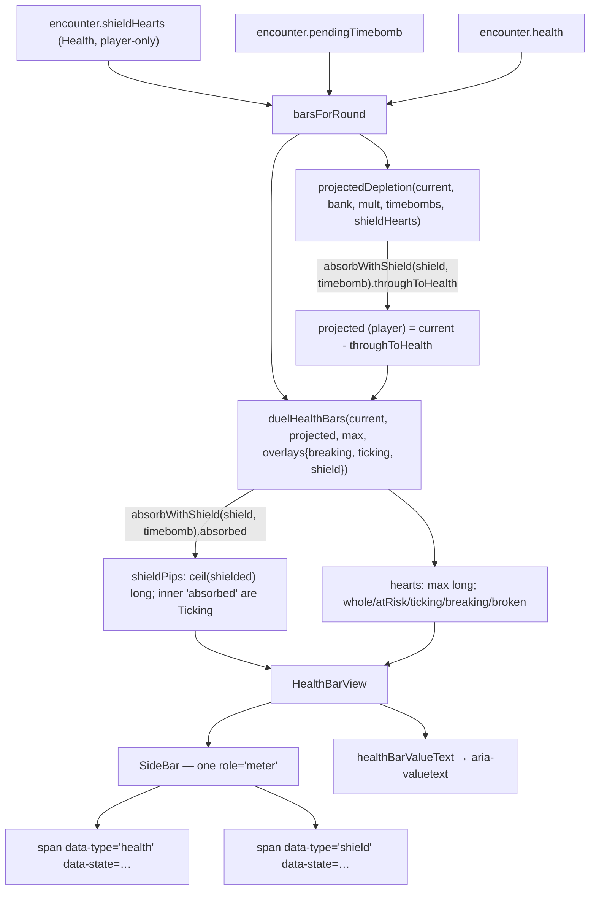

# Plan: Health bar — rendering blue hearts

Plan folder: `.claude/contract/DLR-115-health-bar-rendering-blue-hearts/`
Execution status: see `tasks.md` in this folder.

---

## Part 1 — Alignment

### Task reference

Jira **DLR-115** — "Health bar: rendering blue hearts", task under epic DLR-103, labels `ui` / `playable`.

Acceptance criteria, verbatim:

1. The health bar renders blue-heart pips distinctly from red hearts, both present simultaneously when applicable.
2. Blue hearts disappearing (absorbing damage, per the Shield ticket's ordering) and never regenerating from a heal is visible in the same interaction that already shows red-heart changes.
3. Component tests query by accessible role and label.

Scope boundaries, verbatim — **In scope:** rendering the second pip type on the existing health bar component. **Out of scope:** the absorption-order rule itself (engine ticket); any other health bar layout change.

**Handoff comment from DLR-110's agent** (landed `70ff09f`), carried in full because it is this plan's real brief:

- What to read: `encounter.shieldHearts` (a `Health` scalar on `EncounterState`, player-only) and `hasShieldHearts(encounter)`. Both exported from `src/hunt`.
- The `game-ux` ruling: do **not** add a sixth peer `HeartState`. Model blue as **two orthogonal dimensions — pip _type_ × pip _state_**.
- The glyph, the colour and any opacity are the developer's and must be routed, not invented. `--wc-hp-doomed-opacity: 0.78` is the precedent for an agent-chosen value never seen against a full row.
- `projectedDepletion` in `duelHealthBars.ts` knows nothing about `shieldHearts`, so the ticking-Timebomb preview lies once a shield exists. **Route the player-side projection through `absorbWithShield`** rather than writing a second absorption rule beside it.
- A blue heart can be fractional under `DAMAGE_ROUNDING = None`; a rule for drawing half a pip is needed.
- Two settled rules this ticket hardens by rendering them: a blue heart absorbs **1 point, not 1 whole hit**; blue hearts **survive a hand and die at the encounter boundary**.

DLR-101 flagged, and it is still true, that the multi-state heart row has **never been rendered at 14–18 glyphs with a streak and a booked hit at once**. Nobody will look until DLR-119.

### Restated goal

Give the player's health bar a second kind of pip. Today `HealthBarView.hearts` is a row of `max` red pips, each in one of five states. This ticket adds a **shield cluster** — pips of a different *type*, drawn from `encounter.shieldHearts` — rendered inside the same `role="meter"` row, with its own glyph and its own colour, sitting inboard of the red run so the whole row reads outward-to-inward in depletion order. At the same time it fixes the inherited defect that makes the ticking-Timebomb preview lie once a shield exists: `projectedDepletion` now routes the player's booked Timebomb through `absorbWithShield`, which both corrects the red preview and produces the one shield pip *state* that is live today — a blue heart that a booked Timebomb has already claimed.

### In scope

- `HealthBarView` gains `shielded: Health` (the scalar, possibly fractional) and `shieldPips: readonly HeartState[]` (the type dimension expressed as a second array).
- `duelHealthBars` accepts a player-only `shield` overlay and derives the shield cluster from it, using `absorbWithShield` against the same booked-Timebomb figure the red row uses.
- `projectedDepletion` takes the player's shield and routes the player's booked Timebomb through `absorbWithShield` before subtracting from red health.
- `barsForRound` passes `ui.encounter.shieldHearts` into both.
- `DuelHealthBars.tsx` renders the shield cluster; every pip carries `data-type` alongside `data-state`.
- A `hp-shield` `<symbol>` and a `ShieldMark` component in `HeartMark.tsx`.
- New CSS tokens and rules in `warCouncil.css` / `warCouncilHealthBars.css`.
- `healthBarValueText` extends the spoken form to carry the shield.
- Unit tests for the derivation and the spoken form; component tests querying by role and accessible name.

### Explicitly out of scope

- The absorption-order rule itself — DLR-110 owns it and it is settled.
- Wiring `activateShield` to a buff activation. Nothing in the app layer calls it yet; this ticket renders a value that is currently always `0` in play.
- The **`breaking` overlay's shield split**. When a trick resolves, `resolvedTrick.resolution.damageToPlayer` is the *gross* damage while `encounter.shieldHearts` is the *post-absorption* remainder, and `absorbed` is not recoverable from the two once the shield was exhausted. Splitting it exactly needs `ResolvedTrick` to record the absorption, which is engine/state work this ticket's Scope Boundaries put out of bounds. Named as a residual, not fixed.
- The shop's heart row (`ShopPanel.playerHearts`). Blue hearts die at the encounter boundary and the shop sits on that boundary, so its shield is always `0`.
- Any other health-bar layout change — no change to the shell, the grid, or the bar's placement.
- DLR-119's three outstanding layout risks (shell scrolling, the narrow/short override, the cropped hand fan). Not touched, but the interaction is stated in Risks.

### Pattern Reference

- `src/app/warCouncil/duelHealthBars.ts` — the derivation module and its documented single-statement discipline. Authoritative.
- `src/app/warCouncil/DuelHealthBars.tsx` — `SideBar`'s `role="meter"` + `aria-valuetext` shape. Authoritative.
- `src/app/warCouncil/HeartMark.tsx` — the `<symbol>`/`<use>` sheet, and its rule that a symbol id may be written in exactly two places.
- `src/app/warCouncil/warCouncilHealthBars.css` — the `data-state` attribute selectors, and the comment block explaining that shape carries the reading before colour does.
- `src/hunt/shield.ts` → `absorbWithShield` — the single statement of the absorption order. Cited, never re-derived.
- `.claude/skills/game-ux/SKILL.md` → *State reads without motion or colour alone*.

### Constraints flagged on the brief

- **Accessibility is the only evidence that will exist.** No browser pass runs on this ticket and nobody looks until DLR-119, so the accessible-name assertions carry the whole proof. Component tests query by role and label — a hard convention here and the ticket's AC3.
- **Vocabulary (`6ba6224`):** Timebomb, prime/primed, ticking, detonates, Blast Guard. Never "Envenom" or "poison" outside `CardRank.Poison`.
- **No sixth peer `HeartState`** — the `game-ux` ruling, restated as a reject condition for this plan.
- **Every colour and opacity is a number nobody chose.** Route them, ship them, flag them.
- **400-line limit** per file, blocking, fixed in-ticket. `Measure-Object -Line` undercounts (it drops blank lines) — measure with a method that counts every line.
- Baseline is **1453 passed of 1453, 112 files**. Any failure is this ticket's.

### Assumptions made

- **The type dimension is a second array, not a widened element type.** `hearts` keeps its `readonly HeartState[]` shape and a sibling `shieldPips: readonly HeartState[]` carries the shield-type pips; the array a pip lives in *is* its type, and the shared `HeartState` vocabulary is the state dimension. The alternative — `hearts: readonly HeartPip[]` where `HeartPip = { type, state }` — is the same model with a much larger blast radius (`ShopPanel.tsx`, `App.tsx`, and ~20 existing assertions in `duelHealthBars.test.ts` would all change for no behavioural gain). Rejected on blast radius, not on shape.
- **Shield pips carry `Whole` and `Ticking`, and only those.** `Breaking`/`Broken` are unreachable for a shield pip today: a spent blue heart simply stops being drawn (there is no shield graveyard, mirroring AC5's "overkill leaves no trace"), and the `breaking` split is out of scope above. No dead branch is written for a state that cannot be produced.
- **The shield cluster sits inboard of the red run**, at the end of the row nearest the centre, separated by a wider gap. This makes one statable rule for the whole row: *the further toward the centre, the sooner it is lost*. The alternative — blue at the anchored screen edge, the way many games append armour — puts the two clusters in opposite depletion directions. Rejected for that reason. Flagged in Risks as the developer's to overturn.
- **A shield pip is a different silhouette, not a blue heart.** A colour swap alone fails the `game-ux` hard floor and this project's own stated rule that shape carries the reading before colour does. The glyph shipped is a shield pentagon. The ticket calls them "blue hearts" and the developer may want a heart; flagged in Risks.
- **Half a pip rounds up into a whole pip**, by exactly the rule the red row already uses: pip `i` is standing while `i < shielded`, and the cluster is `Math.ceil(shielded)` long. 1.5 blue hearts draws two pips, the inner one already claimed if a Timebomb is booked. One rounding rule for the whole row rather than a second one for blue.
- **`shield` is a player-only overlay field**, not a `Record<DuelSide, Health>`. `EncounterState.shieldHearts` is a scalar and DLR-110 made shields player-only; a per-side record would invent a Quarry shield nobody has designed.
- **`projectedDepletion` gains a required fifth parameter, not an optional one.** A defaulted `shieldHearts = 0` would let a future caller silently reintroduce the lying preview. One caller exists (`roundBars.ts`); making it explicit costs one line.
- **`aria-valuenow` / `aria-valuemax` stay red-only.** The meter's bounded reading is red health; the shield is a buffer *on top of* that bound, and folding it into `valuenow` would make a 10/10 player with a shield read as 12/10. It is carried in `aria-valuetext` instead.
- **`hasShieldHearts` is not used.** It answers "draw any shield pip at all", which `shieldPips.length > 0` already answers at the point of use without importing a predicate to restate an array's emptiness.

### Config and persisted-shape audit

- **`HeartState` values are string-bound into the DOM as `data-state` and matched by CSS attribute selectors.** No member is renamed, retyped or removed by this plan — the five values are untouched. Confirmed by `grep -rn "HeartState" src` → **41 hits** across 5 files (`duelHealthBars.ts`, `DuelHealthBars.tsx`, `ShopPanel.tsx`, and 2 test files). All 41 remain valid; the plan only *adds* a sibling array.
- **`HealthBarView` gains two required fields.** Every construction site is inside `duelHealthBars` itself (one `BAR_ORDER.map`) — `grep -rn "HealthBarView" src` → **7 hits**, all of them *type annotations* (`duelHealthBars.ts` ×3, `DuelHealthBars.tsx` ×2, `roundBars.ts` ×1, `WarCouncilRound.duelHealthBars.test.tsx` ×1) and none of them an object literal. Adding a required field therefore breaks no construction site. Test files that build a bar view by hand: **none found** — every test goes through `duelHealthBars()`.
- **`projectedDepletion` gains a required 5th parameter.** `grep -rn "projectedDepletion" src` → **4 hits**: its own definition, its own docblock reference, `roundBars.ts:15` (import) and `roundBars.ts:45` (the one call). Plus `duelHealthBars.test.ts:11` (import) and its call sites in that file. Every call site is enumerated and in a task.
- **`encounter.shieldHearts` is the value read.** `grep -rn "shieldHearts" src` outside `src/hunt/__tests__` → **24 hits**, all inside `src/hunt/` (`shield.ts`, `encounter.ts`, `types.ts`, `buffCatalog.ts`, `index.ts`). **Zero readers in the app layer today** — this plan adds the first. Confirms the handoff's "every pixel is still yours".
- **New CSS custom properties** are string-bound between `warCouncil.css` (`:root`) and `warCouncilHealthBars.css` (usage). Three added: `--wc-hp-shield-fill`, `--wc-hp-shield-ticking-opacity`, `--wc-hp-shield-gap`. A property declared in one file and misspelled in the other resolves silently to nothing — this is exactly the class a browser pass catches and this ticket has no browser pass, so the task specifies writing each name once per file and grepping both afterwards.
- **New SVG symbol id** `hp-shield`, bound by string from `SHIELD_SYMBOL_ID` to the `<symbol id>`. Same two-places rule `HEART_SYMBOL_ID` documents.
- **Nothing is persisted.** `EncounterState` is not saved; the Vault's cross-run store (DLR-113) holds no encounter data. No stored record is invalidated.
- **`data-type` is a new string-bound DOM attribute.** Written in `DuelHealthBars.tsx` and matched in `warCouncilHealthBars.css`. Values `health` / `shield`, declared as an `as const` map beside `HeartState` so the two writers cannot drift.

---

## Part 2 — Technical design

### Approach

The whole change is an **additive second dimension on an existing derivation**. `duelHealthBars` already turns three health records into render geometry and performs no arithmetic; it gains one optional player-only overlay, `shield: Health`, and produces two new fields per view. For the Quarry those fields are `0` and `[]` — not because the Quarry is special-cased, but because the overlay is absent for it, and the same code path yields an empty cluster.

The pip **type** is carried by *which array a pip is in*, and the pip **state** by the existing `HeartState` value. That is the `game-ux` ruling implemented literally: no sixth member joins `HeartState`, the red row's five states are untouched, and a shield pip draws from a strictly smaller subset of the same vocabulary. In the DOM both dimensions become attributes — `data-type="health" | "shield"` and `data-state="…"` — so the stylesheet selects on the product rather than on a flattened sixth value, and a reader of the CSS can see the two axes.

The **shield's live state** falls out of the `projectedDepletion` fix rather than being invented for it. Once the player's booked Timebomb is routed through `absorbWithShield`, the same call answers two questions at once: how much damage reaches red health (which is what `secure`, and therefore the red `ticking` band and `lethal`, are computed from), and how much of the shield is already claimed (which is which shield pips render `Ticking`). Both readings come from one call to the engine's single statement of the absorption order — never a second rule beside it. That is why the defect fix and the shield's state dimension are one piece of work and not two: fixing the preview *is* what gives blue hearts something to be in a state about.

`projectedDepletion` and `duelHealthBars` each call `absorbWithShield` once. That is two calls, not two rules — both delegate to the same exported function, which is the shape the handoff asked for. The alternative, threading the `ShieldAbsorption` result from one into the other, would put a derived engine value in the argument list of a render-geometry function and make the caller responsible for keeping them in step; rejected.

Everything stays in the pure module. `DuelHealthBars.tsx` computes nothing new — it maps `view.shieldPips` exactly as it already maps `view.hearts`, into the same `role="meter"` element so the bar remains one reading with one accessible name. `healthBarValueText` in `labels.ts` grows one conditional clause. No effect, no timer, no listener, no state is added anywhere.

### Skills to invoke during execution

- `react-frontend` — owns everything under `src/`: the component, the pure module, the CSS, the Vitest specs, and the 400-line budget.
- `game-ux` — owns the game-screen layer: the type × state model, the "state reads without motion or colour alone" floor that forces a distinct silhouette, and the rule that glyph and colour are the developer's to judge. Already invoked during planning; the ruling it produced is recorded in Assumptions made.

Rules: `.claude/rules/` scanned — **empty**, no rule file applies. Workflow reference: `.claude/workflow/web-project.md`.

No developer override was applied: this is a non-interactive sprint run, the skill list was not confirmed by `AskUserQuestion`, and the classification above is the planner's.

### Diagram



### Data shapes

#### `src/app/warCouncil/duelHealthBars.ts`

```ts
/** The two kinds of pip a bar can draw. String-bound into the DOM as `data-type` and matched by
 *  `warCouncilHealthBars.css`'s attribute selectors — this map and that stylesheet are the only
 *  two places these values may be written. */
export const PipType = {
  Health: 'health',
  Shield: 'shield',
} as const
export type PipType = (typeof PipType)[keyof typeof PipType]

export interface HealthBarView {
  // …unchanged fields…
  /** Blue hearts standing on this side. Player-only in practice; `0` for the Quarry. MAY BE
   *  FRACTIONAL — `DAMAGE_ROUNDING = None` admits a half-point hit. */
  readonly shielded: Health
  /** The SHIELD-type pips, ordered from this side's anchored edge inward, `ceil(shielded)` long.
   *  Empty when no shield stands. A strictly smaller state vocabulary than `hearts`: only
   *  `Whole` and `Ticking` are produced. */
  readonly shieldPips: readonly HeartState[]
}

export interface HealthBarOverlays {
  readonly breaking?: Readonly<Record<DuelSide, Damage>>
  readonly ticking?: Readonly<Record<DuelSide, Damage>>
  /** DLR-115 — the PLAYER's blue hearts. A scalar rather than a per-side record because
   *  `EncounterState.shieldHearts` is one, and DLR-110 made shields player-only; a record would
   *  invent a Quarry shield nobody designed. Defaults to `NO_SHIELD_HEARTS`. */
  readonly shield?: Health
}

export function projectedDepletion(
  current: Readonly<Record<DuelSide, Health>>,
  bank: number,
  multiplier: number,
  pendingTimebombs: Readonly<Record<DuelSide, Damage>>,
  shieldHearts: Health, // REQUIRED, not defaulted — see Assumptions made
): Readonly<Record<DuelSide, Health>>
```

#### `src/app/warCouncil/roundBars.ts`

No signature change. Two call sites gain `ui.encounter.shieldHearts`.

#### `src/app/warCouncil/HeartMark.tsx`

```ts
const SHIELD_SYMBOL_ID = { whole: 'hp-shield' } as const
export function ShieldMark(): JSX.Element   // aria-hidden, currentColor, <use href="#hp-shield">
```

`HeartSymbolSheet` gains the `hp-shield` `<symbol>`. `HeartMark`'s signature is unchanged, so `ShopPanel.tsx` and `App.tsx` are untouched.

#### `src/app/warCouncil/labels.ts`

```ts
export function healthBarValueText(view: HealthBarView): string
// "10 of 10." + [" 2 shielded." | " 2 shielded, 1 of them ticking."] + [" 3 at risk."] + [" 4 ticking."] + [" Lethal."]
```

#### `src/app/warCouncil/warCouncil.css` — three new custom properties

| Key | Type | Unit | Value shipped | Rationale |
|---|---|---|---|---|
| `--wc-hp-shield-fill` | colour | hex | `#4f8fc0` | The blue a shield pip is tinted. **Nobody chose this number** — see Risks. |
| `--wc-hp-shield-ticking-opacity` | number | 0–1 | `0.78` | A shield pip a booked Timebomb has already claimed. Set to the same figure as `--wc-hp-ticking-opacity` so the two "already claimed" readings match. **Nobody chose either.** |
| `--wc-hp-shield-gap` | length | rem | `0.5rem` | The gap separating the shield cluster from the red run, so the two read as two clusters. **Nobody chose this number.** |

No `package.json`, `tsconfig`, or dependency change.

### Runtime quality notes

- **Purity and adjudication:** every derivation lands in `duelHealthBars.ts`, which imports from `src/hunt` and React not at all. The absorption rule is *not* restated — both new call sites delegate to `absorbWithShield`, DLR-110's single statement. `DuelHealthBars.tsx` decides nothing; it maps two arrays. All three new numbers are CSS custom properties read from `:root`, never literals in a rule or a component.
- **Effects, mount and teardown:** no effect, listener, observer, timer, `requestAnimationFrame`, `AbortController` or module-level mutable state is added by any part of this change. StrictMode double-invocation is therefore a non-question: every new function is pure and every new render is a map over committed state. Nothing new survives a remount because nothing new is retained.
- **Hot-path cost:** the shield cluster is at most `ceil(3)` = 3 elements (gold tier is the ceiling and `activateShield` *sets* rather than accumulates), added to a row that already renders up to 18. Two `Math.min` calls and one `Array.from` per bar per render, on a surface that re-renders per trick, not per pointer event. No memoisation is added and none is warranted — there is no profiling evidence and the project bans speculative `useMemo`.
- **Determinism and numeric safety:** no RNG is reachable. `absorbWithShield` guards non-finite and negative inputs and throws rather than returning `NaN`; `duelHealthBars` keeps its existing positive-integer guard on `max`. The one new length expression is `Math.ceil(shielded)` — for a non-finite `shielded` this would be `NaN` and `Array.from({length: NaN})` yields `[]` rather than throwing, so the task adds an explicit guard mirroring the `max` guard's stated reasoning: a wrong-length row that logs nothing is exactly the failure mode this module already guards against. No division is added, so no epsilon and no guarded divisor is needed.
- **Error paths:** the new `shielded` guard throws a `RangeError` naming the value and why it is rejected, matching the two guards already in this module. Nothing is swallowed; there is no `catch`, no async surface, and no user-facing failure state — an invalid shield cannot reach a render because the guard runs before the row is built.

### Risks and judgement calls

- **`--wc-hp-shield-fill: #4f8fc0` is a colour nobody chose.** It has never been seen against `--wc-hp-secure-fill: #cc3f4a`, `--wc-hp-ticking-fill`, or `--wc-hp-broken: #3a4a52` on a real row. Shipped so the ticket is playable; the developer owns the value.
- **`--wc-hp-shield-ticking-opacity: 0.78` is an opacity nobody chose** — it copies `--wc-hp-doomed-opacity`/`--wc-hp-ticking-opacity`, itself flagged in `warCouncil.css` as the developer's. Two unseen numbers now agree with each other, which is a reason to change them together rather than evidence either is right.
- **`--wc-hp-shield-gap: 0.5rem` is a spacing value nobody chose.** It is the only thing making the two clusters read as two.
- **The glyph is a shield pentagon, not a heart.** The ticket says "blue hearts"; the hard floor says state must read without colour alone, and a blue heart next to a red heart is a colour swap. If the developer wants a heart silhouette, the type dimension has to be carried some other way — a ring, a badge, a size step — and that is a redesign of this row, not a token change.
- **The shield sits inboard of the red run, past the broken-heart graveyard.** The rule it buys ("further toward the centre = sooner lost") is clean, but it does mean live blue pips are separated from live red pips by dead ones. The alternative is the anchored screen edge. This is a look-at-it decision.
- **The spoken form grows.** `"10 of 10. 4 ticking."` becomes at most `"10 of 10. 2 shielded, 1 of them ticking. 3 at risk. 4 ticking."` That is the worst case — a shield and a booked Timebomb and a live streak at once — and it is a long sentence. The "of them" disambiguates the shield's ticking from red ticking; dropping it shortens the sentence and makes it ambiguous. Developer's call.
- **The player's row gets up to 3 glyphs wider** (10 → 13 at gold tier). The Quarry's worst case is 18 and is unchanged, so this does not set a new maximum for the row — but it does add width to a top band that DLR-119 is already investigating for scroll and crop. **This change makes the player's bar wider and could contribute to a shell that already may scroll at 1280×800 / 1024×768 / 1366×768 / 390×844.** Not fixed here; stated so DLR-119 starts with it.
- **Nothing renders a blue heart in play yet.** `activateShield` still has no app-layer caller, so `encounter.shieldHearts` is `0` for the whole of a real run. Every assertion in this ticket is a unit or component test against a constructed state. Nobody will see a blue pip until a buff activation is wired to Shield.
- **The `breaking` overlay still lies when a shield partially absorbs a landed hit** — a hit of 3 into 2 blue hearts drops red health by 1 but draws 3 breaking red pips. Out of scope (see above) and unreachable today for the same reason the point above gives, but it becomes visible the moment Shield is wired. It needs `ResolvedTrick` to record the absorption.
- **The mockup will not be looked at.** This is a UI ticket, `mockup.html` is produced because the pipeline calls for one, and there is no approval gate in this run. The layout it proposes is unreviewed.
