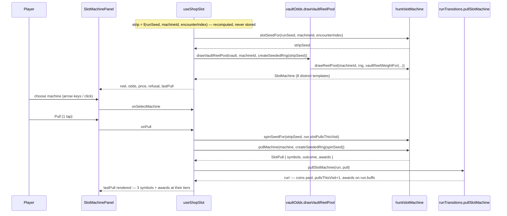

# Plan: Shop screen — slot machine and pared-down purchasable list

Plan folder: `.claude/contract/DLR-116-shop-slot-machine-and-pared-down-list/`
Execution status: see `tasks.md` in this folder.

---

## Part 1 — Alignment

### Task reference

Jira **DLR-116** — "Shop screen: slot machine and pared-down purchasable list", Story under epic **DLR-103**, labels `ui` / `playable`.

Acceptance criteria, verbatim:

1. The shop screen offers machine selection and a three-reel pull UI showing the outcome (three bronze / silver+bronze / gold) per the resolved match rules.
2. The shop's purchasable list shows exactly Health and AP capacity (`+5 AP`, named constant) as fixed, always-purchasable items, plus the slot machine.
3. Whetstone, Reflex, the discard-budget increase, and the odds-raising purchase are removed from this screen's purchasable list — their underlying mechanics (already shipped, e.g. Whetstone) are not deleted from the codebase, only from this screen's offered items.
4. Component tests query by accessible role and label.

Scope boundaries, verbatim: **In scope:** machine choice UI, reel-pull UI and outcome display, the pared-down purchasable list. **Out of scope:** Vault spends (a separate screen); visual polish beyond a functional default.

Run context (2026-08-24, unattended sprint run): the plan-approval gate is auto-approved and every stated default is taken and logged; the mockup is generated but goes **unseen**; the browser pass was **not** requested, so no server starts and QA records what a browser would have checked.

### Restated goal

DLR-112 built the slot machine's draw engine and nothing renders it; this ticket is where a player first pulls a reel. The shop screen becomes: a purse and health readout, a **slot machine** section (choose one of the two machines, read its 8-symbol strip face-up, read the posted odds, pull), and a **pared-down purchasable list** holding exactly two fixed items — Health and AP capacity. Every other priced item (Cheat, Timebomb, Blast Guard, Whetstone) leaves the shop's offered catalogue without any of its mechanics being deleted, and the four-rung category tab widget goes with them because two fixed items do not need a ladder. A pull is deterministic — the strip is recomputed from `slotSeedFor(runSeed, machineId, visitIndex)`, the spin from a seed folded off that same strip seed and the pull index — and the cards it wins go straight onto `RunState.buffs`, where DLR-114's loadout bar already offers them.

### In scope

- A `runSeed` on `RunState`, chosen by the driver (never by `src/hunt/`), so every strip and spin in a run is reproducible.
- A pure odds module deriving gold / silver+bronze / three-bronze probabilities and the expected cards per pull from `REEL_COUNT` and `REEL_POOL_SIZE` — so the posted odds cannot drift from the engine.
- A `pullSlotMachine` run transition: charges `pullPriceFor`, increments the visit's pull count, mints the awards onto `RunState.buffs`.
- A `SlotMachinePanel` component: machine chooser (roving tabindex over `SLOT_MACHINE_IDS`), the face-up 8-symbol strip, the posted odds line, the pull control with its price and refusal, and the last pull's three symbols and awards.
- A new `ShopItem.ApCapacity` — `+AP_CAPACITY_STEP` (5) action points per purchase, priced from configuration, always offered — that genuinely raises the felt's per-hand pool.
- `SHOP_ITEMS` pared to `[ApCapacity, Heal]`; `ShopItem`, `priceOf`, `categoryOf`, `refusalFor` and `buyFromShop` stay **total over the full union**, so no mechanic is deleted.
- Deletion of the now-unused `ShopCategoryTabs` component and its spec, and of the shop's tab/tabpanel/aside chrome.
- Component tests querying by accessible role and label for the machine chooser, the pull, the refusal at zero coins, and the pared list.

### Explicitly out of scope

- Vault spends and the Vault screen (the ticket says so). The Vault's **odds boost** is still honoured, because the strip is drawn through `drawVaultReelPool`, which is the seam DLR-113 already built — that is composition, not a Vault screen.
- Re-pricing or re-weighting anything DLR-112 shipped. Tier distribution is a consequence of the draw model, not a dial.
- `Ward`'s silver/gold indistinguishability (AC6, deferred to DLR-126) and `Keepsake`'s floor weight — reported, not touched.
- The three unverified `.wc-shell` layout risks from DLR-114 — DLR-119 owns them. **The shop shares none of that CSS** (see the audit below).
- Any visual polish past a functional default.

### Pattern Reference

- `src/hunt/slotMachine.ts`, `slotWeights.ts`, `slotConfig.ts`, `seededRng.ts` (DLR-112) — the draw model, used as-is.
- `src/vault/vaultOdds.ts` → `drawVaultReelPool` (DLR-113) — the one call a slot screen makes.
- `src/app/warCouncil/buffLabels.ts` → `buffName` / `buffConditionSentence` / `buffRewardPhrase` / `buffLine` (DLR-114) — **the** buff row grammar. Reused, not re-invented.
- `src/hunt/buffActivation.ts` → `isPricedBuff` / `activatableBuffs`; `src/app/warCouncil/roundUiState.ts` → `offeredBuffs` — the `Unassigned` guard. Reused, not re-implemented.
- `src/app/run/ShopPanel.tsx` + `shopLabels.ts` + `shop.css` — the screen being pared down.
- `src/app/run/ShopCategoryTabs.tsx` — the roving-tabindex pattern the machine chooser copies before that file is deleted.
- `src/hunt/shop.ts` → `refusalFor` / `canBuyAnything` — the refusal discipline the slot pull already mirrors via `slotPullRefusalFor`.

### Constraints flagged on the brief

- **`src/hunt/` and `src/vault/` must stay free of `Math.random()`.** RNG is threaded as an explicit `rng: Rng`. DLR-130's balance simulator depends on it, and a `Math.random()` in the shop UI would break no test while making the game unmeasurable. The only `Math.random()` this ticket adds is in `App.tsx`, seeding the run — the same place `dealRound(…, Math.random)` already sits.
- **A strip is recomputed from `slotSeedFor(runSeed, machineId, visitIndex)`, never stored.** Preserved: nothing on `RunState` holds a strip or a symbol.
- **`drawReelPool` takes its weight function as a defaulted parameter** — the Vault's seam. Not bypassed: the screen goes through `drawVaultReelPool`.
- **A reroll re-spins the same strip**, it does not redraw it. Preserved: the strip depends on `(runSeed, machineId, visitIndex)` only; the pull index feeds the *spin* seed alone.
- **The `Unassigned` trap.** `isPricedBuff` / `activatableBuffs` are used; no third filter is written. Every new collection widget guards its own emptiness before probing an index.
- **Vocabulary:** Timebomb / prime / primed / ticking / detonates / Blast Guard. Never "Envenom" or "poison" (except `CardRank.Poison`, rank 8).
- **Files over 400 lines are blocking**, measured after Prettier with `(Get-Content <path>).Count`.
- **Component tests query by accessible role and label.**

### Assumptions made

Every bullet below is a **stated default taken automatically** under this run's auto-approval, and each is logged to the sprint log.

- **"Pared-down" cuts the whole priced catalogue except Health and AP capacity, and takes the category tabs with it.** AC2 says "exactly Health and AP capacity … plus the slot machine". Cheat, Timebomb and Blast Guard are not named in AC3's removal list but are excluded by AC2's "exactly", so they go too. With two fixed items, a four-rung tablist over a catalogue that is empty on three rungs is pure chrome — `ShopCategoryTabs` is deleted. *Rationale: the ticket calls this "a full screen replacement, not a patch", and the freed vertical space is what the slot machine needs on an 800px-tall viewport.*
- **`SHOP_ITEMS` shrinks; `ShopItem` does not.** The union keeps all six members and `priceOf` / `categoryOf` / `refusalFor` / `buyFromShop` stay total over it, so every shipped mechanic is still priced, still buyable by a caller, and still tested. *Rationale: AC3 removes items from the screen's offered list, not from the codebase, and one list of "what the shop sells" beats a catalogue plus a shelf.*
- **The flask stays.** It is free (`No coin`), so it is not on the purchasable list AC2 constrains, and it is the only surface the flask mechanic is reachable from. *Rationale: cutting it would delete a shipped mechanic from play, which AC3 forbids in spirit.*
- **The reel's odds ARE surfaced, and computed rather than quoted.** The strip is rendered face-up as eight named symbols and the odds line states gold / silver+bronze / three-bronze and the expected cards per pull. All four figures come from a new pure `src/hunt/slotOdds.ts` derived from `REEL_COUNT` and `REEL_POOL_SIZE`. *Rationale: DLR-112 chose a flat-uniform spin expressly so a player can read the strip and compute their own odds; hiding them throws away the reason the model is shaped that way. Deriving them stops a re-tuned `REEL_POOL_SIZE` leaving the screen quoting 1.6% forever.*
- **A pull the player cannot afford disables the control and states why; it never hides it.** The pull button stays rendered, `disabled`, with `SLOT_REFUSAL_MESSAGE[NotEnoughCoins]` in the `role="status"` line beneath — the exact `.shop-refusal` pattern already on this screen. The strip and the odds stay readable. *Rationale: `game-ux` — a decision's inputs stay on the face of the thing; a control that vanishes teaches nothing about what to save for.*
- **A drawn buff goes STRAIGHT to the pile; there is no choose-one gate.** `mintPullAwards` mints every award and `pullSlotMachine` appends all of them to `RunState.buffs`. *Rationale: DLR-112's expected **2.64 cards per pull** is a per-pull yield that only holds if every award is taken — a choose-one gate would silently make the real yield 1.0 and invalidate DLR-130's simulator. A reroll re-spins the same strip with no cap, so a confirm step would be a second click on every single pull, which `game-ux`'s tap-count floor rejects on the most repeated action of the screen.*
- **The visit index is `run.encounterIndex`.** The shop is reachable exactly once per resolved encounter, so `encounterIndex` is already a monotonic per-visit integer, and no new field is needed. *Rationale: it also makes navigating shop → map → shop keep the same strip, which is correct — a strip must not reroll by walking away from it.*
- **The spin seed is `spinSeedFor(stripSeed, pullIndex)` = `mixSeed(stripSeed, pullIndex)`, with `pullIndex = run.slotPullsThisVisit`.** *Rationale: it keeps the reroll on the same strip while advancing the spin, and it stays a pure function of state already on `RunState`, so nothing is stored and everything is reproducible.*
- **`RunState.runSeed` is a defaulted parameter of `startRun`, chosen in `App.tsx`.** *Rationale: `src/hunt/` may not call `Math.random()`; `startRun`'s `playerHealth` and `grants` already set the defaulted-parameter precedent.*
- **`apCapacity` is an OPTIONAL field on `RoundUiSeed` and `WarCouncilMountProps`, defaulting to `STARTING_AP`.** *Rationale: `bankClimbBonus`, a required sibling field, has 30 construction sites across the suite (audit below); widening the seed with a required field would rewrite thirty fixtures for a two-line thread. The default is exactly today's behaviour, so no fixture changes and no test's meaning moves.*
- **`AP_CAPACITY_PRICE` and `AP_CAPACITY_STEP` are configuration keys; `AP_CAPACITY_STEP = 5` is transcribed from AC2 and is not a choice. `AP_CAPACITY_PRICE` HAS no chosen value** — it is routed to the developer under Risks, with a documented placeholder, per this project's standing rule that a tuning value is never invented.
- **`ShopItem.ApCapacity`'s category is `RunPermanent`** — truthful, since the raise lasts the run. The screen no longer reads categories, so this only keeps `SHOP_ITEMS_BY_CATEGORY` honest.

### Config and persisted-shape audit

Performed with `Grep` / `Bash grep` over `src/**` including `__tests__`, on 2026-08-24 at `f45d66e`.

1. **Configuration keys added, not renamed or removed.** `AP_CAPACITY_STEP` — 0 hits across `src/**` (new). `AP_CAPACITY_PRICE` — 0 hits (new). No existing key is renamed, retyped, or removed by this plan, so there is no reader to chase.
2. **Persisted shapes.** The only persisted tree is `src/persistence/**`, written through `src/vault/vaultStore.ts`. This plan changes **nothing** persisted: `VaultState` is untouched, and `BuffTemplate.id`'s frozen format (DLR-113) is read but never written. `RunState` is explicitly never persisted — every field's docstring says so — so the three fields added to it invalidate no stored record. That window is open and this ticket keeps it open.
3. **Type changes checked for loss.** `RunState` gains three **required** fields (`runSeed: number`, `apCapacityBonus: number`, `slotPullsThisVisit: number`) — a widening of a type whose only literal construction is `startRun`. `RoundUiSeed` and `WarCouncilMountProps` gain one **optional** field each (`apCapacity?: ActionPoints`) — no consumer's assumption changes because the default reproduces today's value. `SHOP_ITEMS` shrinks from 5 members to 2 — an array **value** change, not a type change; every function keyed over `ShopItem` stays total. `startBuffActivation()` gains a defaulted parameter — every existing call keeps its meaning.
4. **Consumers of changed exported constants.** `SHOP_ITEMS` — 6 files reference it outside `shop.ts` (`src/hunt/index.ts`, `src/hunt/__tests__/shop.test.ts`, `src/app/run/__tests__/shopLabels.test.ts`, plus `SHOP_ITEMS_BY_CATEGORY` / `UNCATEGORISED_SHOP_ITEMS` which derive from it inside `shop.ts` and are read by `ShopPanel.tsx` and `shop.test.ts`). `canBuyAnything` iterates it — its meaning correctly narrows to "can buy anything the shop offers", which is what `App.tsx`'s verdict warning wants. `SHOP_CATEGORIES` / `isShopCategoryAvailable` / `SHOP_CATEGORY_LABEL` / `shopTabId` / `shopPanelId` / `SHOP_TABLIST_LABEL` / `SHOP_CATEGORY_COMING_SOON` / `SHOP_CATEGORY_EMPTY` — consumed only by `ShopCategoryTabs.tsx`, `ShopPanel.tsx` and their two specs; the `shop.ts` half survives untouched, the label/id half is deleted with the widget.
5. **Names align across the chain.** `AP_CAPACITY_STEP` is interpolated into `SHOP_ITEM_BLURB[ShopItem.ApCapacity]`, never quoted, so a re-tune cannot leave the screen reading `+5` while the engine grants something else — the discipline `SHOP_ITEM_BLURB` already applies to `HEAL_HEALTH_RESTORED`. Likewise every odds figure is interpolated from `slotOdds.ts`, never typed as a percentage literal. `shop-tab-*` / `shop-panel-*` id builders die with the tabs, so no stale string-bound id survives.
6. **Architectural boundary.** `src/hunt/**` and `src/vault/**` are lint-enforced React-free and DOM-free (`eslint.config.js` pure-core override). Everything this plan adds to `src/hunt/` — `slotOdds.ts`, `spinSeedFor`, `pullSlotMachine`, `slotVisitStockFor`, `apCapacityFor`, the `ShopItem.ApCapacity` cases — is pure arithmetic over plain values and imports no React. The design requires no DOM global inside either tree. A verification grep for `Math.random` across `src/hunt` and `src/vault` is in the Final verification phase.
7. **Construction sites of every changed shape, counted by field as well as by type name.**
   - **`RunState`: 62 type-name hits across `src/**`, 1 construction site.** Counted by grepping the required field `encounterCount:` as an object-literal key (excluding annotations, `readonly` declarations and property reads) — the single hit is `src/hunt/run.ts:149` inside `startRun`. Cross-checked against `nextCheatId` (7 files, all of them spreads of `startRun()` or property reads) and `lastQuickKillPayout` (6 files, same). **The larger figure is 1**, and it is the only site the tasks touch. Every other producer of a `RunState` is a `{ ...run, … }` spread and needs no change.
   - **`RoundUiSeed`: 8 annotated hits across 4 files, 30 construction sites across 25 files.** Counted by grepping the required field `bankClimbBonus` (`src/app/warCouncil/**` fixtures, `roundFixture.ts`, 12 `roundReducer.*.test.ts` files, 6 `WarCouncilRound.*.test.tsx` files, plus `WarCouncilRound.tsx` and `warCouncilMount.ts`). **The larger figure is 30.** This is precisely why `apCapacity` is planned as an OPTIONAL field: at 30 sites a required field is a phase boundary where the app does not compile. With it optional, **0 of those 30 sites change**.
   - **`Record<ShopItem, …>`: 4 construction sites** — `src/app/run/shopLabels.ts:41` (`SHOP_ITEM_NAME`), `:51` (`SHOP_ITEM_BLURB`), `src/app/run/ShopPanel.tsx:88` (the prop's type), `src/app/run/__tests__/ShopPanel.test.tsx:56` (`noRefusals`), plus the object literal at `src/App.tsx:277-283`. **5 literal sites in total** (the `ShopPanel.tsx` one is an annotation, not a literal). Adding `ShopItem.ApCapacity` to the union makes every one of them a compile error until updated, which is the intended behaviour, and all five are named in a task's `**Files:**` block.
   - **`ShopItem` switches that must grow a case: 3** — `priceOf` and `categoryOf` in `src/hunt/shop.ts`, `buyFromShop` in `src/hunt/runTransitions.ts`. Each is documented as deliberately total with no `default`, so each fails at `tsc` rather than silently.
   - **`BuffActivationState`: 1 producer** (`startBuffActivation`, `src/hunt/buffActivation.ts:50`); 8 test call sites, all of which keep working because the new parameter is defaulted.

**Arithmetic check.** The odds this plan posts are derived, not transcribed, and the derivation was checked against DLR-112's stated figures before planning: for `n = REEL_POOL_SIZE = 8`, `k = REEL_COUNT = 3` — gold `n / n³ = 1/64 = 1.5625%`; silver+bronze `C(3,2)·n·(n−1) / n³ = 168/512 = 32.8125%`; three bronze `n(n−1)(n−2) / n³ = 336/512 = 65.625%`; expected cards `1(0.015625) + 2(0.328125) + 3(0.65625) = 2.640625`. These reproduce the brief's 1.6% / 32.8% / 65.6% / 2.64 exactly, which is the evidence that the general formula is the right one to ship.

---

## Part 2 — Technical design

### Approach

The work splits cleanly into a **pure layer** that `src/hunt/` owns and a **presentation layer** that `src/app/run/` owns, and the split is what keeps the determinism requirement checkable. Everything about *what a pull costs, what it yields, and what the odds are* is pure and unit-tested with no renderer; everything about *what the player sees and touches* computes nothing.

In the pure layer, `RunState` gains three fields. `runSeed` is the run's reproducibility anchor and arrives as a defaulted parameter of `startRun`, because `src/hunt/` may not reach for `Math.random()` — `App.tsx` chooses it, exactly where `dealRound(…, Math.random)` already lives. `slotPullsThisVisit` counts pulls for the price rule and is reset by `advanceRun` at the fight boundary, alongside `discardsRemaining`, which already resets there for the identical reason. `apCapacityBonus` is what the new `ShopItem.ApCapacity` raises. There is deliberately **no** stored strip, no stored symbol, and no stored visit index: a strip is `drawVaultReelPool(vault, machineId, createSeededRng(slotSeedFor(runSeed, machineId, encounterIndex)))` and a spin is `pullMachine(machine, createSeededRng(spinSeedFor(stripSeed, pullIndex)))`, both recomputed on every render from state that is already there. The alternative — caching the drawn strip on `RunState` — was rejected outright: it is the one thing DLR-112's own module comment tells the next ticket not to do, and it would let a saved strip and a recomputed one disagree.

`slotOdds.ts` is a new pure module holding the probability of each `SlotOutcome` and the expected cards per pull, derived from `REEL_COUNT` and `REEL_POOL_SIZE` rather than transcribed. The alternative — a `SLOT_ODDS_TEXT` constant reading "gold 1.6%" — was rejected because DLR-112 explicitly invites the developer to retune `SLOT_FAMILY_WEIGHTS` and `REEL_POOL_SIZE`, and a quoted percentage is exactly the "screen reading a number the engine no longer uses" failure `shopLabels.ts` already guards against for prices. The module is written general in `k` reels over `n` symbols but only `REEL_COUNT = 3` has a stated match rule, so it throws a `RangeError` for any other `k` rather than inventing a fourth outcome — mirroring `resolvePull`'s own guard.

`pullSlotMachine(run, pull)` is the transition, and it takes an **already-resolved `SlotPull`** rather than an `Rng`. That keeps `runTransitions.ts` free of randomness entirely, keeps the transition trivially unit-testable against a hand-built pull, and puts the seeding in exactly one place. It re-derives `slotPullRefusalFor(slotVisitStockFor(run))` and throws a `RangeError` naming the refusal rather than no-opping — the discipline `buyFromShop` and `drinkFlask` already set — deducts `pullPriceFor(run.slotPullsThisVisit)`, increments the count, and appends `mintPullAwards(pull, run.nextBuffId)` to `run.buffs` with `nextBuffId` advanced by the award count.

In the presentation layer, `ShopPanel` sheds the tablist, the tabpanel, the "Also for sale" aside heading, and four of its six purse cells, and gains one child: `SlotMachinePanel`. That component computes nothing either — the strip, the odds text, the price, the refusal and the last pull all arrive as props from a new `useShopSlot` hook, which is where the seeding, the `useState` for the chosen machine, and the `useState` for the last pull live. Putting that in a hook rather than in `App.tsx` is what keeps `App.tsx` under its line budget and keeps the strip derivation in one testable place; putting it in a hook rather than in the component is what keeps `SlotMachinePanel` a pure render. The machine chooser copies `ShopCategoryTabs`'s roving-tabindex shape (one tab stop, arrow keys inside, container carries the group label) — the pattern `game-ux` requires for a collection of sibling controls — and the file it copies from is then deleted. **The chooser guards its own emptiness before probing an index**, because a roving-tabindex probe against an empty collection is the second instance of the `Unassigned`-class trap the brief warns has already been hit twice.

Every buff the screen names — a strip symbol, a won card — is worded through DLR-114's `buffLabels.ts`. A strip symbol is a `BuffTemplate` with no tier, so it is named with `buffName`/`buffConditionSentence` over a `Buff` minted at bronze purely for wording; a won card is a real `Buff` and gets the full `buffLine`. There is no second way to describe a buff anywhere in the diff.

### Skills to invoke during execution

- `react-frontend` — owns everything under `src/`: component structure, the hook, strict TypeScript, effect cleanup, the 400-line budget, Vitest posture. The normal entry for this work.
- `game-ux` — owns the screen layer: the full-viewport no-scroll shell the shop already uses, zoning, the tap count on the pull (the most repeated action here), the roving tabindex on the machine chooser, and state that reads without colour alone.

Rule files to Read: `.claude/rules/README.md` and every `*.md` beside it whose topic this touches — that folder is currently **empty**, so the scan finds nothing and execution proceeds. Always Read `.claude/workflow/web-project.md`.

No developer override was applied to this list: this run is non-interactive, so `AskUserQuestion` was not presented and the classifier's proposal stands.

### Diagram



### Data shapes

#### `src/hunt/slotConfig.ts` — no change

#### `src/hunt/apConfig.ts` — one added key

```ts
/** DLR-116 AC2, transcribed — action points one AP-capacity purchase adds to the per-hand pool.
 *  UNIT: action points per purchase. */
export const AP_CAPACITY_STEP: ActionPoints = 5
```

#### `src/hunt/config.ts` — one added key, re-exporting `AP_CAPACITY_STEP` alongside the other `apConfig` names

```ts
/** DLR-116 — what one AP-capacity purchase costs. UNIT: coins per purchase.
 *  VALUE UNCHOSEN — a documented placeholder pending the developer's decision. */
export const AP_CAPACITY_PRICE: Coins = 3
```

#### `src/hunt/actionPoints.ts` — one added function

```ts
/** THE statement of the per-hand pool once bought capacity is counted. */
export function apCapacityFor(bonus: number): ActionPoints
```

#### `src/hunt/buffActivation.ts` — one defaulted parameter

```ts
export function startBuffActivation(capacity: ActionPoints = STARTING_AP): BuffActivationState
```

#### `src/hunt/slotOdds.ts` — new pure module

```ts
/** Probability of each SlotOutcome on one pull, derived from REEL_COUNT and REEL_POOL_SIZE.
 *  Sums to 1. Throws RangeError for any REEL_COUNT other than 3 — no other match rule exists. */
export function slotOutcomeOdds(): Readonly<Record<SlotOutcome, number>>
/** Cards won per pull on average: sum over outcomes of P(outcome) * award count. */
export function expectedCardsPerPull(): number
/** How many cards each outcome pays — 1 gold, 2 (silver+bronze), 3 bronze. */
export function awardCountFor(outcome: SlotOutcome): number
```

#### `src/hunt/slotMachine.ts` — one added function

```ts
/** The seed for pull number `pullIndex` on an ALREADY-DRAWN strip. Folds the pull index into the
 *  strip's own seed, so a reroll re-spins the SAME strip rather than redrawing it. */
export function spinSeedFor(stripSeed: number, pullIndex: number): number
```

#### `src/hunt/run.ts` — three added `RunState` fields, one added projection

```ts
export interface RunState {
  // …existing fields unchanged…
  /** DLR-116 — the run's reproducibility anchor. Chosen by the DRIVER and passed in, never by
   *  this tree: `src/hunt/` may not call `Math.random()`. NEVER persisted. */
  readonly runSeed: number
  /** DLR-116 AC2 — action points bought this run, `AP_CAPACITY_STEP` per purchase. NEVER persisted. */
  readonly apCapacityBonus: number
  /** DLR-116 — pulls taken at THIS shop visit, feeding `pullPriceFor` and the spin seed. Reset by
   *  `advanceRun` at the fight boundary, exactly as `discardsRemaining` is. NEVER persisted. */
  readonly slotPullsThisVisit: number
}

export function startRun(
  playerHealth?: Health,
  grants?: readonly TemplateGrant[],
  runSeed?: number,          // defaulted to 1 — a fixed, documented seed, never Math.random()
): RunState

/** The sibling of `shopStockFor`, so no screen assembles a `SlotVisitStock` by hand. */
export function slotVisitStockFor(run: RunState): SlotVisitStock
```

#### `src/hunt/runTransitions.ts` — one added transition, one added `buyFromShop` case, one `advanceRun` reset

```ts
/** DLR-116 — one pull, already resolved by the caller so this tree stays randomness-free.
 *  Throws RangeError naming the `SlotPullRefusal` rather than no-opping — `buyFromShop`'s rule. */
export function pullSlotMachine(run: RunState, pull: SlotPull): RunState
```

#### `src/hunt/shop.ts` — one added `ShopItem` member, a pared `SHOP_ITEMS`

```ts
export const ShopItem = {
  Cheat: 'cheat',
  Timebomb: 'timebomb',
  BlastGuard: 'blastGuard',
  Whetstone: 'whetstone',
  Heal: 'heal',
  ApCapacity: 'apCapacity',   // DLR-116 AC2
} as const

/** DLR-116 AC2/AC3 — what the shop OFFERS, pared to the two fixed items. The union above keeps
 *  every member and `priceOf`/`categoryOf`/`refusalFor`/`buyFromShop` stay total over it, so no
 *  mechanic is deleted — only this list changed. */
export const SHOP_ITEMS: readonly ShopItem[] = [ShopItem.ApCapacity, ShopItem.Heal]
```

`priceOf` gains `case ShopItem.ApCapacity: return AP_CAPACITY_PRICE`. `categoryOf` gains `case ShopItem.ApCapacity: return ShopCategory.RunPermanent`. `refusalFor` is unchanged — AP capacity has no item-specific refusal, so only the coin check applies, which is what "always-purchasable" means.

#### `src/app/warCouncilMount.ts` and `src/app/warCouncil/roundUiState.ts` — one optional field each

```ts
// WarCouncilMountProps
/** DLR-116 — the per-hand AP pool including bought capacity. OPTIONAL, defaulting to
 *  `STARTING_AP`, so the 30 existing `RoundUiSeed` fixtures are untouched. */
readonly apCapacity?: ActionPoints
// RoundUiSeed — the same field, same default
```

`createRoundUiState` calls `startBuffActivation(seed.apCapacity ?? STARTING_AP)`.

#### `src/app/run/SlotMachinePanel.tsx` — new component

```ts
export interface SlotPullView {
  readonly symbols: readonly BuffTemplate[]
  readonly outcome: SlotOutcome
  readonly awards: readonly Buff[]   // already minted, already worded by buffLabels
}

interface SlotMachinePanelProps {
  readonly machineIds: readonly SlotMachineId[]
  readonly selectedMachineId: SlotMachineId
  readonly onSelectMachine: (id: SlotMachineId) => void
  /** The chosen machine's strip, `REEL_POOL_SIZE` distinct templates, face-up. */
  readonly reel: readonly BuffTemplate[]
  readonly pullPrice: Coins
  readonly pullRefusal: SlotPullRefusal | null
  readonly onPull: () => void
  /** `null` before the first pull of this visit. */
  readonly lastPull: SlotPullView | null
}
```

#### `src/app/run/useShopSlot.ts` — new hook

```ts
export interface ShopSlotView { /* every SlotMachinePanelProps field except the callbacks */ }
export function useShopSlot(
  run: RunState,
  vault: VaultState,
  onRun: (next: RunState) => void,
): { view: ShopSlotView; selectMachine: (id: SlotMachineId) => void; pull: () => void }
```

#### `src/app/run/ShopPanel.tsx` — prop changes

`refusals` keeps its `Readonly<Record<ShopItem, PurchaseRefusal | null>>` shape and grows the `ApCapacity` key. Added: `apCapacityBonus: number`, and `slot: SlotMachinePanelProps` passed straight through. Removed: `cheatCount`, `cheatSlotCount`, `timebombCharges`, `blastGuardHeld`, `whetstones` — the four purse cells they fed go with the pared list.

#### `src/app/run/slotLabels.ts` — new copy module (ALL PLACEHOLDER, figures interpolated never quoted)

```ts
export const SLOT_SECTION_LABEL = 'The machines'
export const SLOT_MACHINE_GROUP_LABEL = 'Choose a machine'
export const SLOT_MACHINE_NAME: Readonly<Record<SlotMachineId, string>>
export const SLOT_STRIP_GROUP_LABEL = 'What is on this strip'
export const SLOT_PULL_LABEL = 'Pull'
export const SLOT_FREE_TAG = 'Free'
export const SLOT_REFUSAL_MESSAGE: Readonly<Record<SlotPullRefusal, string>>
export const SLOT_OUTCOME_LABEL: Readonly<Record<SlotOutcome, string>>
export function slotOddsText(): string          // built from slotOdds.ts, never a quoted percentage
export function slotPullPriceText(price: Coins): string
export function slotPullAccessibleName(price: Coins, refusal: SlotPullRefusal | null): string
export function slotMachineAccessibleName(id: SlotMachineId, selected: boolean): string
```

#### Deleted

`src/app/run/ShopCategoryTabs.tsx`, `src/app/run/__tests__/ShopCategoryTabs.test.tsx`, and from `shopLabels.ts`: `SHOP_CATEGORY_LABEL`, `SHOP_TABLIST_LABEL`, `SHOP_CATEGORY_COMING_SOON`, `SHOP_CATEGORY_EMPTY`, `shopCategoryAccessibleName`, `shopTabId`, `shopPanelId`, `SHOP_ASIDE_LABEL`, and the purse labels for the four cut cells.

#### No `package.json`, `tsconfig`, `vite.config` or dependency change. No new dependency of any kind.

### Runtime quality notes

- **Purity and adjudication.** The odds, the price, the refusal, the spin resolution and the award minting are all in `src/hunt/`, DOM-free and React-free, unit-tested without a renderer. `SlotMachinePanel` and `ShopPanel` decide nothing — every figure, refusal and label arrives as a prop, the `RunOutcomePanel` discipline this screen already follows. The only logic in `useShopSlot` is composition of pure calls plus two pieces of presentation state. `AP_CAPACITY_STEP` and `AP_CAPACITY_PRICE` are read from configuration and interpolated into copy, never written as literals in a component or a sentence.
- **Effects, mount and teardown.** This diff introduces **no `useEffect`, no listener, no observer, no timer, and no `requestAnimationFrame`** — so there is nothing to clean up and nothing to double-fire. `useShopSlot` holds two `useState` values (chosen machine, last pull) and derives everything else during render from pure functions, so StrictMode's double-invocation recomputes identical values. `lastPull` is stored together with the `(machineId, visitIndex)` it belongs to and is rendered only when both still match, so switching machines or advancing a fight cannot leave a stale result on screen — chosen over a reset-in-effect precisely because it needs no effect. No module-level mutable state is added.
- **Hot-path cost.** The most repeated action on this screen is the pull, at **one tap** — no confirm step, no drag, and the same single tap by keyboard (`Enter`/`Space` on the pull button). Per pull the work is one `drawReelPool` over 71 templates plus three uniform picks: bounded, allocation-light, and not on a pointer-move path. The strip is recomputed on each render of the shop, which happens on a click, not per pointer event; no memoisation is added because there is no profiling evidence for any, and adding one would be a `react-frontend` violation.
- **Determinism and numeric safety.** No `Math.random()` is reachable from `src/hunt/` or `src/vault/` — a Final-verification grep asserts zero hits in both trees. The one new `Math.random()` in the whole diff is `App.tsx`'s choice of `runSeed`, beside the `dealRound(…, Math.random)` already there. Every RNG downstream is `createSeededRng` over a `mixSeed` fold, which always yields a non-negative 32-bit integer. `slotOutcomeOdds` divides by `REEL_POOL_SIZE ** REEL_COUNT`, a positive integer constant, so no divisor can be zero; a spec asserts the three probabilities sum to 1 within a named epsilon rather than by exact float equality.
- **Error paths.** `pullSlotMachine` throws a `RangeError` naming the refusal rather than returning the run unchanged, so a spent-for-nothing pull cannot happen silently; the control is `disabled` whenever `slotPullRefusalFor` is non-null, and the handler re-derives the refusal inside the functional `setRun` updater — the stale-closure guard `handleBuy` and `handleDrinkFlask` already document, which is what keeps a double-click off that throw. `slotOutcomeOdds` throws on a `REEL_COUNT` it has no match rule for rather than returning a plausible-looking wrong distribution. Nothing is caught and folded into a success shape; there is no async surface in this diff at all.

### Risks and judgement calls

- **`AP_CAPACITY_PRICE` is an unchosen tuning value — the developer's.** The plan ships a documented placeholder of `3` coins so the key exists and is read; the number has never been played. It trades the shop's only other sink against the slot machine's 1-coin reroll: priced too low it dominates, priced too high AP capacity is decorative. What settles it: one run played to fight 3 counting how many pulls a player forgoes to buy it.
- **`Miser` now fights the shop harder, and this screen made it worse.** `Miser` rewards holding coins; an uncapped 1-coin reroll is the strongest coin sink in the game, so a Miser card drawn from the reel is anti-synergistic with the machine that dropped it. Flagged, not fixed — it is a design call under `hybrid-design.md` §9, not a UI defect.
- **Cutting Cheat, Timebomb and Blast Guard from the shop leaves them buyable by no screen.** Their mechanics, prices, refusals and tests all survive and `buyFromShop` still serves them, but until a later ticket re-offers them, a player cannot acquire one except through the buff pile. That is what "pared-down, tested before anything else is added back" asks for; naming it here so it is a decision rather than a surprise.
- **`Keepsake` may be unfireable and `Ward` is not in the reel pool** (AC6 deferred to DLR-126). Both can appear as strip symbols and read normally; neither is touched. A player may therefore win a `Keepsake` card that never fires.
- **Whether the odds line is the right amount of information is a copy and visual judgement.** The plan surfaces four figures (three outcome probabilities and expected cards per pull) because the draw model was designed to be readable; whether that reads as clarity or as clutter on the screen is the developer's eye, and the fallback is to drop the expected-cards figure.
- **Whether the pared shop plus the slot machine fits an 800px-tall viewport is unverified.** `shop.css` already carries a documented history of vertical clipping at nine rows, and this ticket removes four purse cells, the tablist, the tabpanel and the aside heading while adding a strip of eight rows. jsdom has no layout engine, so no test can settle it. The browser pass was not requested this run, so this is on the developer's eyes-on list with the exact viewports named.
- **The shop shares no CSS with `warCouncilHunt.css`.** It builds on `run.css`'s `.run-shell` only. DLR-119's three `.wc-shell` risks are therefore untouched by this diff in either direction.
