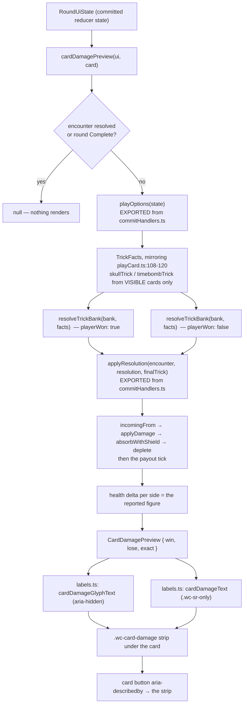

# Plan: Live card preview — win/lose damage readout

Plan folder: `.claude/contract/DLR-117-live-card-preview-win-lose-damage-readout/`
Execution status: see `tasks.md` in this folder.

---

## Part 1 — Alignment

### Task reference

Jira **DLR-117** — "Live card preview: win/lose damage readout". Story under epic **DLR-103** ("Version 5 — Buff Loadout, Slot Draws, and Delayed Apply Damage"). Labels `playable`, `ui`.

Problem statement, verbatim:

> Once buffs are applied for the hand, looking at any card in hand should show two numbers: the damage if it wins its trick, and the damage if it loses — the concrete answer to §0's diagnosis that a decision's cost was invisible. Every active buff needs to contribute to this readout live, not just Apply Damage.

User story, verbatim:

> As a player, I want to see a card's win/lose damage numbers update live as I apply buffs, so I don't have to remember what I activated and do the arithmetic myself.

Acceptance criteria, verbatim:

1. Each card in hand displays a win-value and a lose-value once any buff is active for the hand.
2. The readout updates live as buffs are applied or removed via the action bar, without requiring a screen refresh or re-render trigger the player has to invoke.
3. The readout correctly reflects more than one buff conditioning the same card (additive stacking at minimum — the doc notes this "generalizes past Apply Damage" and needs to handle several conditions layered on one card).
4. Component tests query by accessible role and label.

Scope boundaries, verbatim:

> **In scope:** the per-card win/lose readout and its live update wiring to the buff-activation state.
> **Out of scope:** the buff activation bar itself (separate ticket); visual polish.

Dependencies & risks, verbatim:

> Blocked by the buff activation and action-bar tickets (needs real buff effects and the activation bar to react to). Risk: the doc calls this "cheap in spirit... though real to build once the buff pile can contain conditions layered several deep" — treat the layered-conditions case as the actual scope driver, not the single-buff case.

Run-level instruction carried with this brief (2026-08-24, unattended sprint run): the plan-approval gate is not presented — the plan's stated default is taken and logged; the mockup is produced but goes **unseen**; the live browser pass is **not requested** and no server is started.

### Restated goal

Every card in the player's hand gains a small always-visible readout of what playing it would cost or deal: one number for the branch where the player wins the trick and one for the branch where they lose it. The whole value of the feature is that the numbers are **true**, so both are produced by handing a hypothetical `TrickResolution` to the same `applyResolution` fold the reducer commits with, and reading the resulting health delta — no second copy of the damage arithmetic exists anywhere. Where a fact the resolution needs is genuinely unknowable to the player (the Quarry's card is face down, so the trick's skull and Timebomb state are not yet decided), the readout says so rather than guessing silently. It is a pure derivation of committed reducer state rendered on every render, so it updates the instant anything that conditions a trick changes — a buff activation included — with no effect, no memoisation, and nothing for the player to trigger.

### In scope

- A pure module `src/app/warCouncil/cardDamage.ts` that, for one hand card, returns the health each side would lose in the win branch and in the lose branch, plus whether the answer is exact.
- Deriving both branches through the **live resolution path** — `playOptions` → `resolveTrickBank` → `applyResolution` (`incomingFrom` → `applyDamage` → `absorbWithShield` → `deplete`) — by exporting the two functions `commitHandlers.ts` currently keeps private, never by restating any of their arithmetic.
- Marking the preview **inexact** whenever the Quarry's card is not yet on the table, and carrying that flag into both the visible glyph form and the spoken form.
- Rendering the readout under every card in the fan, as a sibling of the card button inside a new `.wc-fan-slot` wrapper, with a `.wc-sr-only` sentence wired to the card button through `aria-describedby` — so the card's accessible **name** is unchanged and its **description** carries the numbers.
- Copy for both forms in `labels.ts` (`cardDamageGlyphText`, `cardDamageText`), which is this screen's single copy owner.
- CSS for `.wc-fan-slot` and `.wc-card-damage` in `warCouncilHand.css`, scaled off `--wc-card-w` exactly as the card's own rank/suit/pip marks are.
- Unit tests for the pure module (node project) and component tests for the fan (dom project) that query by accessible role and description.

### Explicitly out of scope

- **Wiring buff effects into damage resolution.** `src/hunt/buffAccrual.ts` has no caller; an activated condition buff contributes nothing to a trick's damage today. This ticket does not change that, and deliberately does not add a buff contribution the resolution would not pay — see Assumptions.
- The buff activation bar itself (the ticket's own scope boundary; DLR-114 built it).
- Visual polish, colour and glyph choices beyond the placeholder forms this repo's copy convention already uses.
- Fixing the known `breaking`-overlay over-draw when a shield partially absorbs a landed hit (documented in `roundBars.ts`, needs `ResolvedTrick` to record the absorption). This design never needs that figure — see Approach.
- The three unverified `.wc-shell` layout risks DLR-119 owns. This plan states its own vertical cost and touches none of the fan's rotation reserve.
- Any change under `src/hunt/**` or `src/warCouncil/**`.

### Pattern Reference

- `src/app/warCouncil/roundBars.ts` — the exact shape this module copies: a pure, DOM-free derivation of committed `RoundUiState`, split out of the component so it is testable without a renderer, delegating rather than restating (`projectedDepletion` routes through `absorbWithShield` instead of writing its own `Math.min`).
- `src/app/warCouncil/__tests__/roundBars.test.ts` — the spec shape, including its `seededUi()` helper over `createRoundUiState` and `roundFixture.ts`.
- `src/app/warCouncil/QuarryShape.tsx` and `warCouncil.css:118` — the established `.wc-sr-only` pattern: `aria-hidden` visible glyphs plus a real-text sentence for a reader who cannot see the tiles.
- `src/app/warCouncil/commitHandlers.ts` — `playOptions` and `applyResolution`, the two functions this preview must call rather than imitate.
- `src/warCouncil/bank.ts` — `resolveTrickBank`, `TrickFacts`, `incomingFrom`. `src/warCouncil/playCard.ts:108-120` is the single existing site that assembles `TrickFacts`; the preview mirrors its field-for-field defaulting.
- Design source cited, not restated: `hybrid-design.md` §5 (the per-axis buff stacking rule) and `.docs/implementation/hunt/buff-pile.md` (DLR-124's resolution order and per-hand caps).

### Constraints flagged on the brief

- **The readout must not lie.** A readout that says "win: 6" and then pays 4 is worse than no readout. Every branch must derive from the functions the resolution uses, and every case where the number is an estimate rather than a certainty must be stated on screen and in the run log.
- **Determinism.** `src/hunt/**` stays free of `Math.random()`; RNG threads as an explicit `rng: Rng`. This plan adds no file to `src/hunt/**` and reaches no RNG.
- **Vertical space.** Adding to this screen can worsen the three open `.wc-shell` layout risks DLR-119 owns. The plan must state what the change costs in vertical space.
- **Vocabulary.** Timebomb / prime / primed / ticking / detonates / Blast Guard. Never "Envenom" or "poison".
- **No repo-wide `npm run format`.** Formatting writes are scoped with `npx prettier --write <path>` to the files in each task's `**Files:**` block.
- **Files over 400 lines are blocking**, measured with `(Get-Content <path>).Count` (`web-project.md` — `Measure-Object -Line` undercounts).
- **Component tests query by accessible role and label** (AC4, and `react-frontend`'s testing section).

### Assumptions made

- **The readout previews the TRICK, not the hand.** The card is a per-trick decision, and a hand total would depend on five unplayed cards whose outcomes are not yet decided. AC1's own wording ("the damage if it wins **its trick**") is read literally.
- **The two branches are parameterised on `playerWon`, and each branch reports the health BOTH sides lose.** `resolveTrickBank` needs `playerWon`, so a win/lose split is the natural axis; but a win can still cost the player health (a Timebomb detonating at that resolution) and a loss still damages the Quarry (the forced cash-out), so both figures are computed per branch.
- **On screen, each card shows exactly two numbers — the ticket's two — and they are the card-DEPENDENT ones:** damage dealt to the Quarry if this card wins, damage taken by the player if it loses. The two cross-terms are card-invariant at the moment of choosing (the forced cash-out is the same whichever card is played; a pending Timebomb detonates whichever card is played) **and are already previewed elsewhere on the same screen** — the Quarry bar's at-risk band (DLR-86 AC3) and the player bar's ticking hearts (DLR-101). Duplicating them on six cards would add noise without adding information. The full four-figure truth is in the spoken form on every card.
- **The preview is marked INEXACT whenever the Quarry's card is not on the table.** `trickIsSkulled` and `trickIsPrimed` test the whole trick, and skulls are dealt to the Quarry, so a player-led trick's skull and Timebomb state are unknown at choosing time. The preview computes them from the cards it can actually see and flags the answer as an estimate rather than pretending. When the player follows a lead already on the table, both cards are known and the preview is exact.
- **The preview never resolves WHICH branch will happen, even when it could.** `chooseCpuCard` is fully deterministic, so after the player picks a card the Quarry's answer — and therefore the winner — is computable. Collapsing the two branches into one certain number would leak the Quarry's exact card, which `TELEGRAPH_FIDELITY` and the design's §4 visibility table deliberately withhold (`previewQuarryIntent` exists precisely to give suit and stance and nothing more). Two conditional branches is the design-preserving reading, not a limitation.
- **Activated buffs contribute nothing to the readout, because they contribute nothing to resolution.** `src/hunt/buffAccrual.ts` has no caller anywhere in `src/`; `activateBuff` spends AP and records `activatedThisTrick` and stops there. Adding a buff bonus to the preview would make it say a number the resolution will not pay — precisely the failure this ticket exists to avoid. AC3's "additive stacking" is satisfied **structurally**: the preview reads every mechanism that actually conditions a trick through `playOptions`, so the moment accrual is wired into `playOptions` the readout picks it up with no edit here.
- **AC1's "once any buff is active" gate is not implemented; the readout is always visible.** Many things already move these numbers — bank, multiplier, a pending Timebomb, a held Blast Guard, the final trick, a primed card — and hiding the readout until a buff is activated would withhold a true number for no reason. `game-ux`'s "never hide anything a decision needs" points the same way.
- **The preview returns `null`, and nothing renders, once the encounter is resolved or the round phase is `Complete`.** `applyResolution` short-circuits on a resolved encounter, so computing anyway would print a confident `0 / 0` that means "nothing to preview" rather than "no damage".
- **Placement: a strip in flow beneath each card, inside a new `.wc-fan-slot` wrapper.** All four corners of the card face are taken (rank top-left, skull top-right, primed mark bottom-left, ability pip bottom-right) and the centre is the large suit mark, so there is no free area inside the card at a legible size. Putting the numbers outside the card face also keeps `game-ux`'s "the cards take visual precedence" intact.
- **The numbers reach a screen reader as the card button's `aria-describedby` DESCRIPTION, not as part of its accessible NAME.** 37 existing assertions across the suite query cards by exact name (`'7 of Bells'`); folding damage into the name would break all of them and would conflate a card's identity with a derived figure. Description is the correct ARIA role for supplementary information, and `getByRole('button', { name, description })` keeps AC4 satisfied.
- **The strip's font size is scaled off `--wc-card-w` with the same multiplier convention the card's own marks use** (`calc(var(--wc-card-w) * 0.20)`, beside the rank's `0.34` and the pip's `0.12`). This transcribes the card's existing scale rather than inventing a new tunable; it is flagged in Risks as the developer's to retune, exactly as those marks are.
- **The fan's `padding: 1.3rem 0 0.6rem` rotation reserve is not touched.** There is measurable slack in it, and spending that slack to make the change free would be reaching into the surface DLR-119 owns without a browser to verify it.

### Config and persisted-shape audit

- **Configuration keys renamed, retyped, or removed: none.** This plan adds no configuration key and changes none. It reads `HAND_SIZE`, `DAMAGE_PER_HIT`, `FORCED_CASH_OUT_NUMERATOR`/`_DENOMINATOR`, `APPLY_DAMAGE_DELAY_TRICKS` and the `SHIELD_HEARTS` ladder only indirectly, through the functions that already own them — no literal from `src/hunt/config.ts` is written into this diff.
- **Persisted shapes affected: none.** `.claude/rules/save-data-versioning.md` was scanned (the folder is no longer empty despite `README.md`'s stale index). Persistence lives in `src/persistence/**` behind `createSaveStore`; this contract touches no file in that tree and adds no field to any saved shape, so none of that rule's reject conditions is reachable.
- **Type changes checked for loss:** one required-field addition and two optional ones. `HandFanProps` gains a **required** `damageForCard: (card: Card) => CardDamagePreview | null` — deliberately required, not defaulted, for the reason `projectedDepletion`'s fifth parameter is required (`duelHealthBars.ts:130-134`): a defaulted stub is exactly how a preview silently stops previewing. `PlayingCardProps` gains an optional `describedBy?: string` and `HandFan`'s card loop nothing else; both optional additions leave every existing call site compiling.
- **Consumers of the changed exported constants/predicates:** `commitHandlers.ts`'s `playOptions` and `applyResolution` go from module-private to exported. Their existing consumers are counted below and none changes: `playOptions` — 3 call sites, all inside `commitHandlers.ts` (lines 135-138, 186, and its own definition); `applyResolution` — 3 call sites, all inside `commitHandlers.ts` (lines 153, 191, and its own definition). Adding `export` changes no signature and no behaviour.
- **Names align across the chain:** two new CSS class names, `wc-fan-slot` and `wc-card-damage`. `grep -rn "wc-fan-slot\|wc-card-damage\|cardDamage" src/` returns **0 hits**, so both are new rather than colliding with an existing selector. `.wc-sr-only` already exists (`warCouncil.css:118`, used by `QuarryShape.tsx:47`) and is reused rather than redefined. No `data-testid` and no `data-*` attribute is added — `data-type`/`data-state` on the health-bar pips are untouched.
- **Architectural boundary:** the new module lands in `src/app/warCouncil/`, which the `eslint.config.js` pure-core override does **not** cover — the override is scoped to `src/warCouncil/**` and `src/hunt/**`, and nothing in this diff adds a file to either. `cardDamage.ts` imports React nowhere and touches no DOM global regardless, matching `roundBars.ts`'s own posture.
- **Construction sites, counted by field as well as by type name (Step 1.6 check 7):**
  - `HandFanProps`: grep for the type name `HandFanProps|<HandFan` returns **4 hits** — the interface declaration and its destructure in `HandFan.tsx` (lines 8 and 65), plus **2 construction sites**: `WarCouncilRound.tsx:348` and `__tests__/HandFan.test.tsx:16`. Cross-checked by field: grep for the distinctive existing required prop names `discardSelection=|primedCards=\{|onCancel=\{` returns 32 occurrences across 7 files, of which only the two above pass `<HandFan`. Reported as **`HandFanProps`: 2 annotated sites, 2 construction sites (1 of them in specs)** — the test file's single JSX literal sits inside a `renderFan(overrides = {})` helper, so one edit there covers every test in it.
  - `PlayingCardProps`: `<PlayingCard` returns **14 construction sites** across 5 files (`AbilityPrompt.tsx` 3, `DecreePile.tsx` 1, `HandFan.tsx` 1, `TrickWell.tsx` 2, `__tests__/PlayingCard.test.tsx` 7). The new prop is **optional**, so 13 of those 14 need no edit; only `HandFan.tsx`'s passes it.
  - `CardMarks` / `cardAccessibleName`: **33 references** across `src/`. Untouched — the accessible name is deliberately not changed, which is what keeps all 33 (and the 37 exact-name assertions) green.
  - `CardDamagePreview` and `CardDamageBranch` are new types with zero existing sites.

---

## Part 2 — Technical design

### Approach

The whole design rests on one decision: **the preview does not compute damage, it asks the resolution to compute it and reads the answer.** `commitHandlers.ts` already contains the exact fold a committed trick goes through — `applyResolution(encounter, resolution, handEnding)`, which calls `incomingFrom`, then `applyDamage` (which itself routes the player's share through `absorbWithShield` before `deplete`), then clears the paid Timebomb queue, books this trick's prime, and finally ticks the queued Apply Damage payout in the load-bearing order its docblock describes. Two functions there are module-private only because nothing outside had needed them: `playOptions(state)` and `applyResolution`. This contract exports both, unchanged, and the preview calls them. The damage figures it reports are then `encounter.health[side] - folded.encounter.health[side]` — a health **delta produced by the real fold**, not an arithmetic re-derivation. That is what makes the readout structurally incapable of diverging: there is no second `Math.min(shield, …)`, no second `forcedCashValue`, no second `DAMAGE_PER_HIT`, and no second copy of the payout-destroyed-by-a-hit rule.

The alternative considered and rejected was the obvious one: read `incomingFrom(resolveTrickBank(...))` and subtract the shield in the preview. That is precisely the shape `projectedDepletion` had before DLR-115 — a preview with its own absorption arithmetic that contradicted `applyDamage` — and the fix (a required `shieldHearts` parameter, deliberately not defaulted) is documented in `duelHealthBars.ts` as the bug class this ticket most easily reintroduces. Going through `applyDamage` instead means the preview inherits shield absorption, the zero-floor on health, the payout wipe on a player hit, and any future rule added to that fold, for free. It also sidesteps the live `breaking`-overlay defect entirely: that defect exists because the overlay needs the *absorbed* portion of a landed hit and `ResolvedTrick` does not record it, whereas this preview only ever needs the health delta, which `applyDamage` returns directly.

The only thing the preview assembles itself is the `TrickFacts` record, and it mirrors `playCard.ts:108-120` field for field — the four Timebomb/Guard/bonus fields come straight out of the exported `playOptions` with the identical `?? 0` / `?? false` defaulting, `finalTrick` is `tricksPlayed + 1 === HAND_SIZE`, and `skullTrick`/`timebombTrick` are `trickIsSkulled`/`trickIsPrimed` over the cards the player can actually see: the candidate card plus the Quarry's lead if it is already on the table. Those last two are the only facts that can be wrong, and only in one direction — when the player leads, the Quarry's face-down card may carry a skull (inverting a win into a `SkullWin`) or a Timebomb mark. So `exact` is `round.currentTrick.length === 1`, and both the glyph form and the spoken form carry that flag. Nothing else in the record is a guess.

`cardDamagePreview` is a pure function of `RoundUiState` and a `Card`, living beside `roundBars.ts` in `src/app/warCouncil/` for the same reason that file was split out: as a block inside the component it could only be exercised through a renderer. The component layer stays declarative — `WarCouncilRound` passes `damageForCard={(card) => cardDamagePreview(ui, card)}` and nothing else changes there, so the readout re-derives on every render of committed reducer state and cannot go stale (AC2). No effect, no memoisation, no second state. Rendering is `HandFan`'s: each card is wrapped in a `.wc-fan-slot` flex column carrying the fan's `marginLeft`/`zIndex` (layout), while the `--wc-fan-rot`/`--wc-fan-lift` custom properties stay on the `PlayingCard` button exactly where `warCouncilCards.css` composes them, so the existing hover/armed transform rules are untouched. Beneath the button sits a `<span className="wc-card-damage">` holding an `aria-hidden` glyph form and a `.wc-sr-only` sentence, and the button gains `aria-describedby` pointing at it — the card's accessible name is untouched, which is what keeps 37 existing name assertions green while giving AC4 a role-and-label query (`getByRole('button', { name, description })`).

### Skills to invoke during execution

- `react-frontend` — owns everything under `src/`: the pure-module-over-component-logic split, the 400-line budget, the no-speculative-memoisation rule, the Vitest project split (`.test.ts` → node, `.test.tsx` → jsdom), and the accessibility floor.
- `game-ux` — owns this playable surface: the readout must be always visible rather than hover-gated, must read without colour alone, must not compete with the card face, and its vertical cost against the no-scroll shell must be stated rather than assumed.
- `management-jira` — the `Planning → Planned` and `Coding → Ready for Test` transitions the pipeline automates.

Rules the executor must Read: `.claude/rules/README.md`, and `.claude/rules/save-data-versioning.md` (scanned during planning and found not to apply — no file under `src/persistence/**` is in this contract). Always: `.claude/workflow/web-project.md`.

No developer override was applied to this list: this is an unattended sprint run, `AskUserQuestion` was not presented, and the classification (`UI components` — committed-state rendering — plus `Pure logic`) stands as the planner produced it.

### Diagram



### Data shapes

#### New — `src/app/warCouncil/cardDamage.ts`

```ts
import type { Card } from '../../warCouncil'
import type { Damage } from '../../hunt'
import type { RoundUiState } from './roundUiState'

/** The health each side loses at this trick's resolution, in one branch. Every figure is a
 *  health DELTA read back off `applyResolution`, never an arithmetic re-derivation. */
export interface CardDamageBranch {
  /** Red health the Quarry loses at this resolution. */
  readonly toQuarry: Damage
  /** Red health the PLAYER loses at this resolution, after blue hearts have absorbed. */
  readonly toPlayer: Damage
  /** Blue hearts spent absorbing this branch's hit. 0 while nothing mints a Shield. */
  readonly shielded: Damage
}

export interface CardDamagePreview {
  /** The branch where the player WINS the trick (`playerWon: true`). */
  readonly win: CardDamageBranch
  /** The branch where the player LOSES it (`playerWon: false`). */
  readonly lose: CardDamageBranch
  /** `true` only when the Quarry's card is already on the table, so the trick's skull and
   *  Timebomb state are both decided. `false` while the player is to lead. */
  readonly exact: boolean
}

/** `null` once the encounter is resolved or the round phase is `Complete` — there is no next
 *  trick to preview, and a confident `0 / 0` would read as "no damage" rather than "nothing
 *  to preview". */
export function cardDamagePreview(state: RoundUiState, card: Card): CardDamagePreview | null
```

#### Changed — `src/app/warCouncil/commitHandlers.ts`

```ts
// Both were module-private; both gain `export`. No signature and no behaviour change.
export function playOptions(state: RoundUiState): PlayCardOptions
export interface FoldedResolution { /* unchanged */ }
export function applyResolution(
  encounter: EncounterState,
  resolution: TrickResolution,
  handEnding: boolean,
): FoldedResolution
```

#### Changed — `src/app/warCouncil/labels.ts` (this screen's copy owner)

```ts
/** The compact on-card form, e.g. `W6 L1`, or `~W6 L1` when the preview is an estimate.
 *  Rendered `aria-hidden`. PLACEHOLDER glyphs — the developer's to retune. */
export function cardDamageGlyphText(preview: CardDamagePreview): string

/** The `.wc-sr-only` sentence — the COMPLETE truth, including both cross-terms, any shield
 *  absorption, and the estimate caveat. PLACEHOLDER copy. */
export function cardDamageText(preview: CardDamagePreview): string
```

#### Changed — `src/app/warCouncil/PlayingCard.tsx`

```ts
interface PlayingCardProps {
  // …existing props unchanged…
  /** OPTIONAL — the id of an element describing this card. Defaults to `undefined` so all 13
   *  other call sites keep compiling; only the fan passes one. */
  readonly describedBy?: string
}
```

#### Changed — `src/app/warCouncil/HandFan.tsx`

```ts
interface HandFanProps {
  // …existing props unchanged…
  /** REQUIRED, and deliberately not defaulted — `projectedDepletion`'s fifth parameter's
   *  reasoning (`duelHealthBars.ts`): a defaulted stub is how a preview silently stops
   *  previewing. `null` for a card with nothing to preview. */
  readonly damageForCard: (card: Card) => CardDamagePreview | null
}
```

#### Changed — `src/app/warCouncil/warCouncilHand.css`

Two new class names, both new (0 existing hits): `.wc-fan-slot` (the flex column that becomes the fan's flex item and carries `margin-left`/`z-index`) and `.wc-card-damage` (the strip; `font-size: calc(var(--wc-card-w) * 0.20)`, the card's own scale convention). No custom property is added or renamed.

No configuration key, no `package.json` change, no dependency change, and no persisted field is touched.

### Runtime quality notes

- **Purity and adjudication:** every damage figure is decided by `resolveTrickBank` and `applyResolution` in the existing engine/fold; `cardDamage.ts` decides nothing except which facts are visible to the player and whether that makes the answer exact. It imports no React and touches no DOM global, matching `roundBars.ts`. No component decides a number — `HandFan` renders two strings it is handed, and `WarCouncilRound` only wires the call. No tunable is written inline: the strip's one size expression reuses `--wc-card-w`, which `warCouncil.css` already owns.
- **Effects, mount and teardown:** none added. `WarCouncilRound` has no effect anywhere and this change adds none, so there is no listener, observer, timer, `requestAnimationFrame` or `AbortController` to release and nothing StrictMode's double-invoke can double. `cardDamagePreview` is a pure function of its two arguments with no module-level mutable state, so calling it twice returns an identical value. The `useId()` HandFan takes for the description ids is stable across re-renders and unique per mount, so a second mount cannot collide with the first.
- **Hot-path cost:** the preview runs once per card per render — at most `HAND_SIZE` = 6 cards × 2 branches = 12 `resolveTrickBank` + `applyResolution` pairs, each a handful of integer operations over small objects. There is no pointer-move path here; renders are driven by discrete taps. No `useMemo`/`useCallback` is added, per `react-frontend`'s no-speculative-memoisation rule, and no profiling evidence exists that would justify one.
- **Determinism and numeric safety:** no `Math.random()` is reachable — the preview never calls `chooseCpuCard`, `chooseCpuMove` or anything in `cpuPlayer.ts`, and adds no file to `src/hunt/**`. No division is introduced anywhere in this diff; the one division in the path (`forcedCashValue`) already guards its denominator and throws rather than returning `NaN`. `applyDamage` floors health at 0, so no negative figure can reach a rendered value, and `absorbWithShield`'s guards are inherited rather than duplicated. The figures are health deltas of guarded values, so no `NaN` can be produced here.
- **Error paths:** `cardDamagePreview` returns `null` — an explicitly rendered nothing — rather than a zero-shaped success when there is no trick to preview, and it guards that case *before* calling `applyResolution`, whose `applyDamage` would otherwise throw on a resolved encounter. Nothing is caught and converted into a plausible default: there is no `try`/`catch` in this diff. `HandFan` renders no strip for a `null`, and the card then carries no `aria-describedby` at all rather than pointing at an element that does not exist. No async surface is introduced.

### Risks and judgement calls

- **The on-screen form shows two of the four figures.** The two shown are the card-dependent ones; the two omitted (Timebomb detonating on a win, the forced cash-out on a loss) are card-invariant and already previewed on the health bars. The spoken form carries all four. If the developer would rather see all four on the card face, that is a copy-and-density call and this is the bullet to red-line.
- **The glyph form `W6 L1` / `~W6 L1` and the `~` estimate marker are PLACEHOLDER copy**, in the same sense as `TRICK_OUTCOME_MESSAGE` and the Timebomb mark's `⚗`. Wording and glyph are the developer's.
- **`calc(var(--wc-card-w) * 0.20)` is transcribed from the card's own scale convention, not chosen as a new tunable** — it sits beside the rank's `0.34`, the suit's `0.56` and the pip's `0.12`. Whether it is legible at the smallest clamp (`--wc-card-w: 2.9rem`, so ~9.3px) is a developer's-eye judgement, and the number is theirs to retune.
- **Vertical cost: the `hand` grid row grows by roughly 7-12px** (one line of `calc(var(--wc-card-w) * 0.20)` text plus a hairline gap, minus the ~3.2px of slack already inside `.wc-fan`'s `min-height`). Nothing else on the shell changes and no grid row is added. This makes DLR-119's three open risks — `.wc-shell` scrolling at 1280×800 / 1024×768 / 1366×768 / 390×844, the narrow-viewport override, and hand-fan cropping — slightly worse rather than better, and it is not fixed here. The browser pass is not requested this run, so no one will see it before the developer does.
- **The preview does not show a Timebomb this card would BOOK for the next trick.** `applyResolution` books it, but booking costs no health at this resolution, so it does not appear in the delta. Playing a primed card that wins therefore reads as cheaper than it will turn out to be, until the ticking hearts appear after the trick.
- **Every figure is a health delta, so overkill is truncated.** "Win: 4" against a Quarry on 4 health means "enough", not "exactly 4 gross". This matches `duelHealthBars`'s own overkill handling and is deliberate, but it is a reading the developer should confirm.
- **AC1's "once any buff is active" gate is not implemented and AC3's live buff arithmetic pays nothing today.** Both are consequences of `buffAccrual.ts` having no caller. The plan's position is that a preview which invented a buff bonus the resolution will not pay would be the ticket's own worst outcome. If the developer wants the buff contribution shown anyway, the correct fix is a follow-up that wires accrual into `playOptions` — at which point this readout picks it up with no change.
- **The design deliberately never collapses win/lose into the one branch that will happen**, even though the deterministic CPU makes that computable, because doing so would leak the Quarry's exact card past `TELEGRAPH_FIDELITY`. That is a design reading of §4's visibility table; if the developer disagrees, the readout becomes a single certain number and this ticket shrinks considerably.
- **`WarCouncilRound.tsx` sits at 378 lines and this adds ~2**, leaving it near but under the 400-line budget. Any later addition to that file will need the split its siblings (`roundBars.ts`, `commitHandlers.ts`, `quarryAdvance.ts`) already took.
