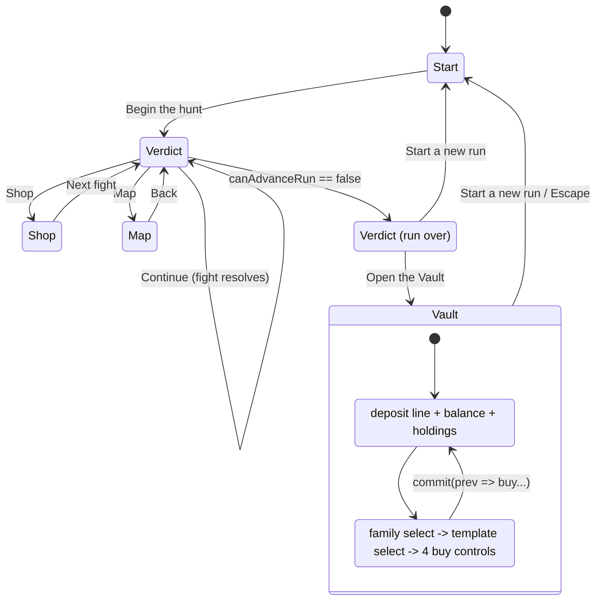

# Plan: Vault end-of-run screen

Plan folder: `.claude/contract/DLR-118-vault-end-of-run-screen/`
Execution status: see `tasks.md` in this folder.

---

## Part 1 — Alignment

### Task reference

Jira **DLR-118 — "Vault end-of-run screen"** (Story, epic DLR-103, labels `playable`, `ui`). No handoff comment from DLR-113's agent exists on the ticket — checked 2026-08-24, `fields.comment.comments` is empty.

Verbatim acceptance criteria:

1. A new screen, reachable from the run-end verdict flow, shows the player's current Vault balance including the amount just converted from this run's leftover coin.
2. The screen offers both confirmed spends: raising a card's odds, and buying a starting tier of a card into a future run's pile.
3. Leaving the screen returns the player to the existing start-screen flow.
4. Component tests query by accessible role and label.

Scope boundaries, verbatim: **In scope:** the Vault screen itself and its two spend actions. **Out of scope:** the Vault's underlying logic (separate ticket); showing Vault currency mid-run (explicitly deferred).

Upstream specification, cited not re-derived: `.docs/implementation/vault/README.md` (DLR-113) — the economy, the two spends, the persistence contract, and the decision about an unmigratable save. `.claude/rules/save-data-versioning.md` — the six reject conditions.

### Restated goal

Build the Vault's own screen: a full-viewport surface reached from the terminal run verdict, which tells the player what this run's death paid into the Vault, what the Vault holds in total, and lets them spend that balance on the two purchases DLR-113 already implemented — a permanent odds boost on one card template, and a one-shot starting card at a chosen tier. Leaving it starts the next run. The screen owns no economy rules of its own: every figure and every refusal comes from `src/vault/`, and every sentence about a card comes from DLR-114's one buff grammar.

### In scope

- A new `VaultScreen` component under `src/app/vault/`, mounted from `App.tsx` on a new `RunPhase.Vault`.
- A **ledger** region: what this run deposited, the current balance, the odds boosts held, and the starting cards queued.
- A **spend** region: choose a card family, choose a template within it, then buy either an odds boost or a starting card at Bronze / Silver / Gold.
- Every non-happy state rendered explicitly: an empty Vault on a first-ever run, a **winning** run where nothing was deposited, a save that could not be read, storage that is unavailable, entries dropped by reconciliation, and a write that failed.
- A new `Open the Vault` control on the terminal run verdict (`RunOutcomePanel`), and a `Start a new run` control on the Vault screen that returns to the start-screen flow.
- A pure `creditedFromRun` helper and a pure `vaultLabels` copy module, both unit-tested without a renderer.
- Component tests that query by accessible role and label only.

### Explicitly out of scope

- Any change to the Vault's economy, odds, prices, persistence, or reconciliation — all DLR-113's and settled.
- Any mid-run display of Vault currency (the ticket defers it explicitly).
- The three unverified layout risks DLR-119 owns (`.wc-shell` scroll at named viewports, the `warCouncilHunt.css` narrow-viewport `actions` row, the hand fan crop). This screen shares no CSS with `warCouncilHunt.css`.
- Any `SAVE_SCHEMA_VERSION` bump — the persisted shape is unchanged.
- Consuming the queued starting grants (already wired in `App.tsx`'s `handleBeginRun`).
- A migration for an unmigratable save — DLR-113 decided it is discarded non-destructively; this screen *renders* that decision and does not change it.

### Pattern Reference

- `src/app/run/RunOutcomePanel.tsx` and `src/app/run/RunPathScreen.tsx` — the existing end-of-run surfaces. **This screen sits beside them, it does not replace either.**
- `src/app/run/SlotMachinePanel.tsx` + `src/app/run/slotLabels.ts` — the closest visual sibling; the labels module's "every figure interpolated, no literal percentage" discipline is copied verbatim.
- `src/app/warCouncil/buffLabels.ts` — the buff row grammar. Reached through `slotSymbolText(template)` in `slotLabels.ts`, which is already the shipped way to word a `BuffTemplate`; **no fourth grammar is written.**
- `src/app/run/run.css` — the single `100dvh` `.run-shell` grid, mounted into exactly as `RunPathScreen` does.
- `src/hunt/shop.ts`'s `refusalFor` idiom, as mirrored by `vaultEconomy.ts`'s `oddsBoostRefusalFor` / `startingTierRefusalFor`.

### Constraints flagged on the brief

- **The loss-only deposit rule.** Leftover coin converts at the single place a run's outcome is decided and **only on a loss**; `run.coins` is deliberately not zeroed because the verdict panel still reads it. A screen showing a deposit on a winning run, or zeroing coins, is wrong.
- **Persistence.** `{version, data}` envelope, `SAVE_SCHEMA_VERSION = 1`, five read outcomes and three write outcomes reported in band, nothing throws, `isValidData` guard rather than `as T`. **A save that fails to load is a real UI state.**
- **`Unassigned` trap.** Seeded placeholder buffs throw `RangeError` from `apCostOf`. This screen never calls `apCostOf` and never handles a `Buff` — see Approach.
- **Determinism.** `src/hunt/` and `src/vault/` stay free of `Math.random()`; DLR-130's simulator depends on it. This ticket adds no randomness anywhere.
- **Vocabulary:** Timebomb / prime / primed / ticking / detonates / Blast Guard. Never "Envenom" or "poison".
- **400-line file limit**, measured with `(Get-Content <path>).Count` after Prettier. `App.tsx` is at 347 and this ticket grows it.
- Component tests query by accessible role and label — the only proof this screen works.
- No repo-wide `npm run format`; `npx prettier --write` scoped to this contract's files only.

### Assumptions made

Every bullet here is a **plan default taken without a developer gate** — this ticket runs unattended and the approval gate is auto-approved.

- **When the screen appears:** at the end of a *run*, not a fight — the state where `canAdvanceRun(run)` is false and the verdict currently offers only `Start a new run`. It is one press away from that verdict rather than replacing it: the verdict names the outcome and draws the trick tally, which the Vault screen has no business restating.
- **It sits beside `RunOutcomePanel`, it does not replace it.** Replacing it would delete DLR-82/85's verdict states for the sake of a meta-progression screen the ticket calls "distinct from the verdict panel".
- **What dismisses it:** a single `Start a new run` control, plus `Escape` on the container (the contract `ShopPanel` and `RunPathScreen` already keep). AC3 says leaving returns to the start-screen flow, so it calls the same `handleNewRun` the verdict's control calls. There is deliberately no way back to the verdict — the verdict is a report on a run that is over.
- **It shows both earned-this-run and held-in-total.** AC1 asks for the balance "including the amount just converted", which is only meaningful if the conversion is stated separately from the total.
- **The amount converted is derived, not stored.** `run.coins` is not zeroed, so on a terminal verdict `creditedFromRun(outcome, coins)` reproduces exactly what `handleComplete` already committed. That avoids a sixth `useState` in `App.tsx` and makes the loss-only rule a unit-testable pure function rather than a prop nobody can check.
- **The conversion is computed through `depositLeftoverCoin(EMPTY_VAULT, coins).balance`, never by re-dividing by `VAULT_EXCHANGE_RATE`.** The rate is stated once, in `src/vault/`; a second division is a second source of truth that can drift.
- **Card selection is two native `<select>` elements** — family, then template — not two roving-tabindex radio groups. 11 families and up to 22 templates in a family are both well past `game-ux`'s five-sibling threshold; a native listbox is one tab stop with full arrow-key/Home/End/type-ahead behaviour supplied by the platform, and it sidesteps the empty-collection indexing trap that `isFocusable(0)` hit under integration.
- **Cards are worded through `slotSymbolText(template)`** from `slotLabels.ts`, which already mints a wording-only `Buff` at Bronze purely to reach `buffName`/`buffConditionSentence`. Reusing it means this screen touches no `Buff`, never calls `apCostOf`, and cannot hit the `Unassigned` `RangeError` — `BUFF_TEMPLATES` contains no `Unassigned` template in any case.
- **The Vault's currency is called a "mark"** in copy (`VAULT_CURRENCY_SINGULAR` / `_PLURAL`). PLACEHOLDER copy, exactly as `shopLabels.ts` and `slotLabels.ts` mark their own; the developer owns the word. It is *not* a tuning value — it is a noun, and leaving the balance unit-less reads ambiguously beside coins.
- **`useVault`'s `commit` gains a functional-updater form.** Two rapid clicks batched into one render both compute from the same stale `vault`, and with the value form the second commit silently *reverts* the first purchase. This is the same stale-closure defect `handleBuy` and `handleDrinkFlask` already solve with functional `setRun` updaters, and DLR-116's review round forced that fix once already.
- **The screen is a container, not a pure panel.** It takes the `VaultHandle` and owns its own two spend handlers and its two selection `useState`s. Pushing them into `App.tsx` would grow the driver past its budget for state that nothing outside this screen reads.
- **Empty-Vault, winning-run and save-failure copy are all written, not skipped** — the brief names these as the states that get skipped and then look broken.
- **`SaveReadOutcome.Empty` is not a failure.** A first-ever run has never written anything; it gets the empty-Vault sentence, not an alert.

### Config and persisted-shape audit

- **Persisted shapes: none changed.** `VaultState` (`{ balance, oddsBoosts, startingGrants }`) is read and written unchanged; `SAVE_SCHEMA_VERSION` stays `1`. This ticket adds no persisted field, so reject condition 4 is not in play. `VAULT_SAVE_SECTION` is untouched and no key is composed outside `saveKeyFor`.
- **Storage globals:** this ticket adds no `localStorage`/`sessionStorage` reference. Verified against the existing state — `localStorage|sessionStorage` over `src/**/*.{ts,tsx}` returns **16 hits across 6 files**: `src/persistence/browserStorage.ts` (3 — the sanctioned access plus its docblock), `src/persistence/storageDriver.ts` (2) and its spec (7), `src/persistence/saveStore.ts` (2, both docblock prose), `src/persistence/config.ts` (1, docblock), and `src/app/vault/useVault.ts` (1 — the substring inside the imported function name `browserLocalStorage`, not a global access). None is a real global access outside `browserStorage.ts`. Reject condition 1 is lint-enforced regardless.
- **`RunOutcomePanelProps` gains one required field, `onVault: () => void`.** Type-name grep `RunOutcomePanel` over `src/**`: **35 hits across 8 files**, but 6 of those files (`ShopPanel.tsx`, `SlotMachinePanel.tsx`, `RoundOverPanel.tsx`, `WarCouncilRound.tsx`, `src/hunt/run.ts`) hit only in prose docblocks. Distinctive-required-field grep `onNewRun`: **5 hits across 3 files** — `RunOutcomePanel.tsx` (3: prop declaration, destructure, JSX use), `src/App.tsx` (1), `src/app/run/__tests__/RunOutcomePanel.test.tsx` (1, inside the `baseProps` literal). **Construction sites = 2** (`App.tsx`'s JSX, the spec's `baseProps`), and both are in a task's `**Files:**` block. The larger of the two counts is the field count's 3 files, not the type name's 8; every one of those 3 is covered.
- **`VaultHandle.commit` changes signature (widened, not narrowed).** `useVault`/`VaultHandle` grep: **10 hits across 3 files** — `src/App.tsx` (2), `src/app/vault/useVault.ts` (2), `src/app/vault/__tests__/useVault.test.tsx` (6). `commit(` call sites: `App.tsx` ×2 (`depositLeftoverCoin`, `clearStartingGrants`). Widening to `VaultState | ((prev: VaultState) => VaultState)` keeps both existing call sites compiling; they are converted to the updater form in the same task anyway. All 3 files are in a task's `**Files:**` block.
- **New string-bound names introduced:** the CSS class prefix `vault-`, and the copy constants in `vaultLabels.ts`. Grep for `vault-` in `src/**/*.css`: **0 hits** — no collision with `run.css`, `shop*.css`, `runMap.css`, or `warCouncilHunt.css`.
- **Architectural boundary:** `src/vault/**` and `src/hunt/**` stay React-free and DOM-free. Every new file this ticket writes lives under `src/app/`, which is outside both `no-restricted-imports` blocks. No design here requires a DOM global or a React import inside a pure tree.
- **Configuration keys:** none renamed, retyped, or removed. `VAULT_EXCHANGE_RATE`, `VAULT_ODDS_BOOST_PRICE`, `VAULT_ODDS_BOOST_MAX_STACKS`, `VAULT_STARTING_TIER_PRICE` are all read, never restated as literals — see the Final verification grep.

---

## Part 2 — Technical design

### Approach

The screen is a **fourth run-level surface** beside the verdict, the map and the shop, mounted from the same `RunPhase` union that already carries the other three. `App.tsx` gains one member (`Vault`), one branch, one prop on `RunOutcomePanel`, and no new `useState` — which is the whole reason the amount deposited is *derived* from `run.outcome` and `run.coins` rather than captured when `handleComplete` fires. That derivation is the single most load-bearing decision in this plan: because `run.coins` is deliberately not zeroed and `depositLeftoverCoin` is pure, `creditedFromRun(outcome, coins)` reproduces exactly the number already committed, and it does so by *calling the same function* rather than re-dividing by the exchange rate. The loss-only rule therefore lives in one 3-line pure function with its own spec, instead of being an invariant a reviewer has to trace through a component tree.

Logic splits three ways. `creditedFromRun` is pure and unit-tested with no renderer. All copy — every sentence, every accessible name, the per-outcome save-failure messages — is pure and lives in `vaultLabels.ts`, tested the same way, with **every figure interpolated from `src/vault/` configuration and no price, rate or cap ever quoted as a literal**, which is `slotLabels.ts`'s stated discipline and the reason a retuned `VAULT_STARTING_TIER_PRICE` cannot leave this screen lying. Only what genuinely needs React stays in `VaultScreen.tsx`: two `useState`s for the family/template selection and two click handlers that call `oddsBoostRefusalFor`/`buyOddsBoost` and `startingTierRefusalFor`/`buyStartingTier` and commit the result.

The alternative shape considered and rejected was **a pure panel plus a `useVaultScreen` hook, with `App.tsx` owning the handlers** — the `ShopPanel`/`useShopSlot` split. It is rejected here because `App.tsx` is at 347 of its 400 lines and the selection state is read by nothing outside this screen; the split would move ~30 lines into the driver to buy a purity that the two pure modules above already provide. The second rejected alternative was **rendering all 71 templates as a list** — a single flat list of 71 rows with four buy buttons each is 284 controls on a no-scroll surface, so the two-step family-then-template narrowing is what makes the screen fit at all. The third was **replacing `RunOutcomePanel` outright**, rejected because the ticket calls the new screen "distinct from the verdict panel" and the verdict owns three states this screen has no equivalent for.

Selection uses two native `<select>` elements rather than two roving-tabindex radio groups. `game-ux` requires that a collection of more than about five sibling controls be one widget with one tab stop and arrow-key movement; a native listbox *is* that widget, supplied by the platform with `Home`/`End` and type-ahead for free, and it has no index arithmetic to get wrong on an empty collection — the failure mode that has now surfaced three times in this codebase. The whole screen mounts inside `run.css`'s existing `.run-shell`, so there is still exactly one `100dvh` grid in the codebase; `vault.css` styles only the inside of it. **This screen shares CSS with `run.css` and shares none with `warCouncilHunt.css`**, so DLR-119's three unverified layout risks do not reach it.

`useVault.commit` is widened to accept either a next value or a `(prev) => next` updater, implemented against a `useRef` mirror of the committed vault rather than by writing inside a state updater — a write inside `setLoad`'s updater would fire twice under StrictMode's development double-invocation, and `commit` being an event callback means a ref read is both correct and pure. Without this, two clicks batched into one render both compute from the same stale `vault` and the second commit silently reverts the first purchase.

### Skills to invoke during execution

- `react-frontend` — owns everything under `src/`: component structure, the hook change, the 400-line budget, the testing posture, and the accessibility floor.
- `game-ux` — owns this surface: it is a playable game screen, so the no-scroll `100dvh` shell, the zoning, the tap cost of the repeated action, and the keyboard model of the card chooser are all its call.
- `implementation-doc-writer` — owns the `.docs/implementation/` update at the end of the run and `.docs/game_rules/the-hunt.md`; invoked by `/fb-apply`, not by a task here.

Rules the executor must Read: `.claude/rules/save-data-versioning.md`. Workflow the executor must Read: `.claude/workflow/web-project.md`.

Developer override: none applied — this ticket runs unattended, the plan gate is auto-approved, and every default taken is listed under *Assumptions made*.

### Diagram



### Data shapes

#### New — `src/app/vault/vaultRunCredit.ts`

```ts
import { RunOutcome, type Coins } from '../../hunt'
import { EMPTY_VAULT, depositLeftoverCoin } from '../../vault'

/** What this run paid into the Vault. Loss-only, by construction. */
export function creditedFromRun(outcome: RunOutcome, coins: Coins): number
```

#### New — `src/app/vault/vaultLabels.ts` (all PLACEHOLDER copy)

```ts
export const VAULT_TITLE: string
export const VAULT_CURRENCY_SINGULAR: string        // 'mark'
export const VAULT_CURRENCY_PLURAL: string          // 'marks'
export const VAULT_LEDGER_GROUP_LABEL: string
export const VAULT_HOLDINGS_GROUP_LABEL: string
export const VAULT_SPEND_GROUP_LABEL: string
export const VAULT_FAMILY_SELECT_LABEL: string
export const VAULT_TEMPLATE_SELECT_LABEL: string
export const VAULT_LEAVE_LABEL: string              // reuses NEW_RUN_LABEL's wording
export const VAULT_EMPTY_TEXT: string
export const VAULT_NO_BOOSTS_TEXT: string
export const VAULT_NO_GRANTS_TEXT: string
export const VAULT_ODDS_BOOST_LABEL: string
export const VAULT_TIER_LABEL: Readonly<Record<BuffTier, string>>   // total over BuffTier

/** Total over SaveReadOutcome; `Loaded` and `Empty` map to `null` — neither is a failure. */
export const VAULT_READ_PROBLEM: Readonly<Record<SaveReadOutcome, string | null>>
/** Total over SaveWriteOutcome; `Written` maps to `null`. */
export const VAULT_WRITE_PROBLEM: Readonly<Record<SaveWriteOutcome, string | null>>
/** Total over VaultSpendRefusal. */
export const VAULT_REFUSAL_MESSAGE: Readonly<Record<VaultSpendRefusal, string>>

export function currencyText(amount: number): string
export function vaultBalanceText(balance: number): string
export function vaultDepositText(outcome: RunOutcome, coins: Coins): string
export function vaultDroppedText(droppedCount: number): string
export function oddsBoostText(stacks: number): string
export function oddsBoostAccessibleName(stacks: number, refusal: VaultSpendRefusal | null): string
export function startingTierAccessibleName(tier: BuffTier, refusal: VaultSpendRefusal | null): string
export function grantLineText(grant: TemplateGrant): string
export function boostLineText(templateId: string, stacks: number): string
```

#### New — `src/app/vault/VaultScreen.tsx`

```ts
export interface VaultScreenProps {
  readonly handle: VaultHandle
  /** The finished run's outcome — the only thing that decides whether a deposit happened. */
  readonly outcome: RunOutcome
  /** `run.coins`, NOT zeroed. Read only to word what was (or was not) converted. */
  readonly leftoverCoins: Coins
  readonly onLeave: () => void
}
export default function VaultScreen(props: VaultScreenProps): JSX.Element
```

Local state, both presentational: `selectedKind: BuffTemplate['kind']` and `selectedTemplateId: string`. The state is typed through `BuffTemplate['kind']` rather than `BuffConditionKind` because that name is **not** re-exported from `src/hunt/index.ts` (grep: 0 hits in the barrel) and widening the barrel is out of this ticket's scope. The family list is derived from `BUFF_TEMPLATES` itself — the distinct `kind` values in declaration order — so no new export is needed for it either.

#### Modified — `src/app/vault/useVault.ts`

```ts
export type VaultCommit = VaultState | ((prev: VaultState) => VaultState)

export interface VaultHandle {
  readonly vault: VaultState
  readonly loadOutcome: SaveReadOutcome
  readonly droppedCount: number
  readonly lastWriteOutcome: SaveWriteOutcome | null
  /** WIDENED on DLR-118: accepts a functional updater so two clicks batched into one render
   *  cannot both compute from the same stale vault and lose a purchase. */
  commit(next: VaultCommit): void
}
```

#### Modified — `src/app/run/RunOutcomePanel.tsx`

```ts
interface RunOutcomePanelProps {
  // …existing fields unchanged…
  /** DLR-118 — opens the Vault screen. Rendered ONLY on a terminal verdict, beside
   *  `Start a new run`; there is no Vault control while a run can still continue. */
  readonly onVault: () => void
}
```

#### Modified — `src/app/run/runLabels.ts`

```ts
export const VAULT_LABEL = 'Open the Vault'
```

#### Modified — `src/App.tsx`

```ts
const RunPhase = { Start, Verdict, Warned, Shop, Map, Vault: 'vault' } as const
```

No configuration key is added, no configuration value is chosen, and no persisted shape changes.

### Runtime quality notes

- **Purity and adjudication.** Every price, cap and rate is read from `src/vault/vaultConfig.ts` through `vaultLabels.ts`'s interpolation; no literal `1`, `2`, `5`, `10` or `3` appears in copy or component. Both affordability decisions are `oddsBoostRefusalFor` / `startingTierRefusalFor` — the component asks, it never decides. The loss-only conversion is `creditedFromRun`, a pure function calling `depositLeftoverCoin`, so the rule is stated once and asserted directly.
- **Effects, mount and teardown.** **No effect anywhere in this ticket.** `VaultScreen` holds two `useState`s and two click handlers; `Escape` is a container `onKeyDown`, not a document listener, matching `RunPathScreen` and `ShopPanel`. `useVault` gains one `useRef`, written only inside `commit` (an event callback, never double-invoked by StrictMode) and initialised from the existing lazy `useState`. There is nothing to clean up and nothing for a second mount to duplicate; the store's lazy initialiser stays idempotent.
- **Hot-path cost.** No pointer-driven path exists on this screen. The most repeated action is a buy: **two clicks from a cold screen** (pick template in a select, press a buy control) and **one click** for each repeat on the same template, with confirmation being the control's own disabled/refusal state rather than a trip to a distant confirm button. `templatesForFamily(kind)` is one filter over 71 entries per render on a click-driven surface; not memoised, per `react-frontend`'s ban on memoisation without profiling evidence.
- **Determinism and numeric safety.** No `Math.random()` is added anywhere, and nothing in `src/hunt/` or `src/vault/` is touched, so DLR-130's simulator is unaffected. No division is written in this ticket at all — the one division that matters (`coins / VAULT_EXCHANGE_RATE`) stays inside `depositLeftoverCoin`, which already guards `Number.isFinite` and floors a negative to 0, so no `NaN` can reach a rendered value.
- **Error paths.** Five read outcomes and three write outcomes are each mapped to copy by a `Readonly<Record<…>>` that is **total over the union**, so a sixth outcome is a compile error rather than a blank line. `Loaded` and `Empty` map to `null` — neither is a failure, and an `Empty` read on a first-ever run gets the empty-Vault sentence instead of an alert. Every real failure renders in a `role="alert"` region naming what happened and what it means, never swallowed and never shown as a silent zero. `droppedCount > 0` gets its own sentence. Neither `buy*` is reachable past its own refusal: the handler re-derives the refusal against the vault it actually sees and no-ops when refused, so the deliberate `RangeError` stays reachable only from a driver bug. No `catch` is written in this ticket.

### Risks and judgement calls

- **Every sentence on this screen is placeholder copy** — including the currency noun "mark". The developer owns the wording. Nothing about the *behaviour* depends on it; the tests assert against the exported constants, not against quoted English.
- **The screen is one press away from the verdict, not automatic.** A player who presses `Start a new run` on the verdict never sees the Vault. That is deliberate — an unskippable interstitial after every death is a pacing decision, and pacing is the developer's. Worth judging in play: whether the Vault should instead *replace* the terminal verdict's primary control.
- **Two-step narrowing costs a click.** Choosing a family before a template is what makes 71 templates fit on a no-scroll screen, but it means the player cannot see the whole catalogue at once. Whether that reads as "focused" or "hidden" is a play-session question.
- **`App.tsx` grows toward its budget.** It is 347 lines and this ticket adds roughly 15. The next surface added to it should convert it to a reducer, as `.docs/implementation/app/run-driver.md` already flags. Not this ticket's job.
- **`clamp()` bounds and hues in `vault.css`** are copied from `run.css`'s existing scale rather than invented. Every one of them is the developer's to retune, as `run.css`'s own header comment states.
- **No browser pass was requested on this run**, so no viewport was actually checked. Whether the Vault screen fits without scrolling at 1280×800, 1024×768, 1366×768 and 390×844 is unverified by anything — jsdom has no layout engine and no test can prove it. QA records precisely what a browser would have checked; the developer must look.
- **The double-click revert defect in `commit` is closed by widening the signature**, which touches DLR-113's hook. If the developer would rather leave DLR-113's surface frozen, the fallback is the refusal re-derivation alone, which prevents the throw but not the lost purchase.
