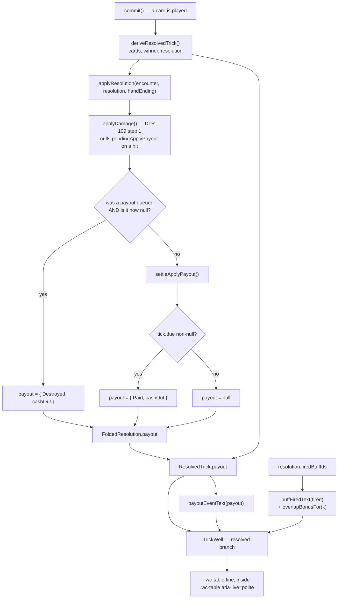

# Plan: DLR-119 — Full visual and UX pass across the redesigned surfaces

Plan folder: `.claude/contract/DLR-119-full-visual-and-ux-pass/`
Execution status: see `tasks.md` in this folder.

---

## Part 1 — Alignment

### Task reference

Jira **DLR-119** — "Full visual and UX pass across the redesigned surfaces", story under epic DLR-103, label `ui`.

**Acceptance criteria, verbatim:**

1. Each of the five UI surfaces (action bar, health bar, shop, card preview, Vault screen) is reviewed against `.claude/skills/game-ux/SKILL.md`'s full-viewport layout and interaction-cost standards.
2. Visual and copy judgement calls encountered during this pass are logged for the developer to decide, per this project's pause condition — not resolved unilaterally.
3. No functional behavior changes — this ticket is presentation-only.

**Scope boundaries, verbatim:** In scope — visual/interaction polish of the five new/changed surfaces. Out of scope — any new functionality; anything not touched by the five UI tickets.

**Scope addition 1 (comment 10372, 2026-08-23) — DLR-109's gap.** Apply Damage costs AP and queues its payout for a delay, and *there is no feedback anywhere that a payout is in the air*. Two related gaps: **AP is unrendered**, so `InsufficientAp` reads as the button dying for no reason; and **a payout can be silently destroyed** when a Timebomb detonating against the player wipes a payout due at the same resolution.

**Scope addition 2 (comment 10473, 2026-08-24) — DLR-125's gap.** **Nothing announces a buff firing.** The player sees a bigger number with no cause named. Related: **DLR-117's AC1 lands here** — the per-card win/lose readout is always visible and was specified to appear "once any buff is active", which is a visual judgement; and **the Overlap Bonus (`+(k−1)` Momentum) now fires on real play for the first time** and is the least intuitive number in the stacking rule.

**Run context (`.claude/sprint-runs/2026-08-23-sprint/log.md`).** Nineteen tickets have shipped in this run and **no surface has been seen by a human or a browser**. The browser pass is opt-in, off by default, and **was not requested** for this ticket — the developer will do their own eyes-on pass. This contract fixes what is *statically determinable* and hands the developer a precise prioritised list of what is not.

**Three open layout risks carried into this ticket** (log lines 2645-2652, 3064-3066, 2789):
1. `.wc-shell` may scroll with the fourth grid row DLR-114 added, at 1280×800 / 1024×768 / 1366×768 / 390×844 — a budget since eaten twice more by DLR-115 (player bar 10 → 13 glyphs) and DLR-117 (~7-12px on the hand row).
2. `warCouncilHunt.css`'s narrow/short override redeclares `.wc-shell`'s areas and was missing the `actions` row. Fixed by the Defender, never rendered.
3. The hand fan may be cropped by the action bar. DLR-117 deliberately did not spend `.wc-fan`'s rotation reserve, leaving that allocation here.

### Restated goal

Pay down the run's layout and narration debt on the Hunt screen, with the browser unavailable. Two things get *fixed*: the places where the screen becomes **unusable or unreachable** — a control cropped off the edge, a row pushed out of a `overflow: hidden` shell — proven by arithmetic against the real stylesheets rather than by eye; and the places where **the engine now does something the screen never narrates** — a buff firing, the Overlap Bonus, a queued Apply Damage payout landing or being destroyed. Everything that genuinely needs a human's eyes — every unseen colour, opacity and `clamp()` bound, and every "does this feel right" call — is *not* touched, and is instead written up as one prioritised agenda for the developer's own pass.

### In scope

- **L1 — the action bar overflows horizontally at a phone width and crops its own controls.** `.wc-bar` is `flex-direction: row` with `flex-wrap` unset, holding four items whose buttons each carry `min-width: clamp(5.5rem, 14vmin, 8.5rem)`. Below ~395px of viewport the row cannot fit and `.wc-shell`'s `overflow: hidden` clips the overflow — Apply Damage becomes unreachable by pointer. Fixed by letting the bar wrap.
- **L2 — the narrow/short five-row stack can push the hand and action rows out of the shell.** With `grid-template-rows: auto auto 1fr auto auto` and `overflow: hidden`, the `1fr` felt row collapses first (it already carries `min-height: 0`), after which the *last* rows are the ones clipped — the rows holding every control. The unbounded contributor at this breakpoint is `.wc-dossier`, which becomes a wrapping row of four panels. Bounded as its own scoped scroll region, per `game-ux`'s stated exception.
- **L3 — the fan's rotation reserve is a fixed `1.3rem` while the thing it reserves for scales with `--wc-card-w`.** At the token's upper clamp bound the armed card's lift exceeds the reserve and its top edge clips. Re-expressed as a multiple of `--wc-card-w` derived from `fanLayout.ts`'s own constants.
- **L4 — record, with the arithmetic, which of the three open layout risks are now closed and which remain browser-only.** Written into `pr-description.md` and the stylesheet comments, not asserted in a test.
- **N1 — nothing announces a buff firing.** A trick that fired buffs names them on the resolved-trick readout, and names the Overlap Bonus by name and amount whenever two or more fired.
- **N2 — a queued Apply Damage payout is silent when it lands and silent when it is destroyed.** The resolved-trick readout says which happened and for how much.
- **N3 — the queued-payout sentence does not say what the queue is at risk from.** Extended to name the rule at the moment it applies.
- **C1 — `healthBarValueText`'s worst case buries the fatal fact behind four clauses.** `Lethal.` moves to the front of the sentence.

### Explicitly out of scope

- **Every tuning value nobody has chosen.** `--wc-hp-doomed-opacity`, `--wc-hp-shield-fill`, `--wc-hp-shield-ticking-opacity`, `--wc-hp-shield-gap`, the card-damage strip's smallest clamp, `vault.css`'s nine `--wc-*` properties and every `clamp()` and hue, `shopSlot.css`'s properties, `errorBoundary.css`'s static palette. `CLAUDE.md` and `game-ux` both make a tuning value the developer's; none is invented here, and all are routed to the handover list.
- **Balance.** The game is currently unwinnable (0 wins in 200 simulated runs, DLR-130). That is the developer's own pass and this contract retunes nothing.
- **DLR-117 AC1 — hiding the per-card readout until a buff is active.** Hiding an always-visible readout is a visual judgement, which is exactly why DLR-125 declined to decide it. It stays on the handover list.
- **Non-visual findings met along the way, named so they are not re-found:** `Keepsake` is confirmed dead (3 Purse cards pay nothing); **no template mints a consumable**, so Ward / Second Thoughts / Puppeteer / Foresight / Spyglass are unreachable by play; `Miser` fights the shop. None is a layout or narration defect and none is touched.
- **The shop, the Vault and the card preview's own stylesheets.** `shop.css`/`shopSlot.css`/`vault.css` build on `run.css`'s `.run-shell` and share none of `warCouncilHunt.css` (log line 2966). Their open questions are density, palette and copy — all eyes-on. AC1's review of them is delivered as the written review in `pr-description.md`, not as a diff.
- **The `ErrorBoundary` fallback.** Analysed statically (see the audit below) and found sound; no change.
- **Starting a server or opening a browser.** Not requested for this run.
- **Any behaviour change.** AC3.

### Pattern Reference

- `.claude/skills/game-ux/SKILL.md` and `references/full-viewport-layout.md` — the authority on the no-scroll shell, zoning and interaction cost. Named by the brief.
- `.claude/skills/react-frontend/SKILL.md` — everything under `src/`.
- `src/app/warCouncil/actionBarLabels.ts` — the established shape for this screen's composed copy: exported string constants plus small pure functions returning `string | null`. `buffFiredLabels.ts` and `payoutLabels.ts` follow it exactly.
- `src/app/warCouncil/buffLabels.ts` → `buffName`, `buffRewardPhrase` — the existing single statement of how a buff is named and what its reward reads as. N1 composes these rather than restating either.
- `src/hunt/buffAccrual.ts` → `overlapBonusFor` — R5's single statement of the Overlap Bonus. N1 calls it; it never re-derives `k − 1`.
- `src/app/warCouncil/TrickWell.tsx`'s existing `.wc-table-line` resolved branch and its `timebombBookedText` clause — the established place and grammar for "what this trick did to you", and where N1/N2 land.
- Design source cited, never restated: `.docs/design/Balatro-Forbidden-Solitaire/hybrid-design.md` §5 R5 (the Overlap Bonus) and DLR-109's resolution order (step 1 nulls the payout before step 4 would pay it).

### Constraints flagged on the brief

- **The browser pass is off and must not be started.** No `npm run dev`, no server, no browser. Layout claims are arithmetic against the stylesheets or they are handed to the developer — never asserted from a passing jsdom test.
- **jsdom has no layout engine.** No component test in this contract may be presented as evidence that a surface fits.
- **AC3 — presentation only.** No rule changes, no retuning, no new game behaviour. The one non-presentational-looking change (threading a payout outcome through `FoldedResolution`) is *reporting* an outcome the engine already produces, and changes no damage, no health and no state transition; a regression test pins that.
- **Vocabulary (`6ba6224`):** Timebomb, prime/primed, ticking, detonates, Blast Guard. Never "Envenom"/"poison", except `CardRank.Poison` (rank 8).
- **Never `npm run format`** (`ae9ee28`) — scope every Prettier write to this contract's own files.
- **400-line budget, measured with `(Get-Content <path>).Count`.** At the edge already: `App.tsx` 394, `roundUiState.ts` 393, `WarCouncilRound.tsx` 392, `labels.ts` 379, `warCouncilHunt.css` 384.
- **Baseline: 1789 passed of 1789, 138 files, 0 failures.** Any failure is this contract's.
- **Plan approval gate auto-approved and the mockup gate skipped unseen**, per this run's standing override. Every default is logged.

### Assumptions made

- **"Unusable or unreachable" outranks everything else, and taste is not attempted.** The brief's own priority order. Two of the four priorities ship properly rather than four badly, and what is left is stated. *Rationale: this ticket can swallow the project; a half-fixed crop is worse than a listed one.*
- **The narration lands on the resolved-trick readout, inside `.wc-table`'s existing `aria-live="polite"` region**, rather than as a new panel or a toast. *Rationale: that is the beat where the player is already reading what the trick did, it costs no grid row on a budget that is the ticket's own first risk, and it needs no new state, no timer and therefore no effect cleanup.*
- **`TrickPayoutEvent` is derived inside `applyResolution` rather than by comparing two encounter snapshots in the component.** *Rationale: `applyResolution` is the only place that knows the difference between "paid" and "destroyed" — after the fold both look like `pendingApplyPayout: null`. A component-level comparison would be a second reading of DLR-109's resolution order and would drift, exactly as `projectedDepletion` did before DLR-115.*
- **`ResolvedTrick.payout` and `FoldedResolution.payout` are REQUIRED, not optional.** *Rationale: an optional field lets a future construction site silently omit it and narrate nothing; a required one is a compile error. The audit below counts every construction site so this costs no surprise.*
- **`.wc-bar` gets `flex-wrap: wrap` and no new size number.** *Rationale: wrapping is a structural guarantee of reachability at any width; shrinking the button floor would be inventing a tuning value, which is the developer's.*
- **The dossier's narrow-breakpoint bound is a documented PLACEHOLDER, `--wc-dossier-narrow-max: 30dvh`, declared as a named token and listed for the developer.** *Rationale: a bound is needed for the guarantee, so the key ships with a stated placeholder and the value is routed to the developer per `/fb-plan` Step 0's tuning rule — it is not presented as chosen.*
- **`.wc-fan`'s reserve multiplier `0.4` is DERIVED, not chosen.** *Rationale: `0.20` (the armed lift, `warCouncilCards.css`) × `1.5` (the card's `2/3` aspect ratio) + `sin(5.25°)/2` (max fan rotation at `HAND_SIZE` 6, from `FAN_ROTATION_STEP_DEG`) + `0.025 × 1.5` (the armed `scale(1.05)`) = `0.384`, rounded up. It follows from constants already in the codebase, so it is arithmetic, not taste.*
- **`Lethal.` moves to the front of `healthBarValueText` rather than the sentence being shortened.** *Rationale: every clause is load-bearing state; the defect is ordering, not length. A screen-reader user should not learn they are one hit from death after four clauses.*
- **All new copy is PLACEHOLDER, as every string on this screen already is.** Marked as such in each docblock and listed for the developer.

### Config and persisted-shape audit

- **`ResolvedTrick`: 10 annotated sites across 10 files; 5 construction sites, all 5 in specs.** Annotated (`grep -rc "ResolvedTrick"`): `commitHandlers.ts` 2, `quarryAdvance.ts` 5, `roundBars.ts` 1, `roundUiState.ts` 2, `TrickWell.tsx` 2, `__tests__/buffRoundState.test.ts` 2, `__tests__/roundHint.test.ts` 6, `__tests__/roundReducer.test.ts` 2, `__tests__/roundReducer.timebomb.test.ts` 2, `__tests__/TrickWell.test.tsx` 3. Construction sites found by grepping the distinctive required field `resolution:` and discarding the four parameter/property declarations (`commitHandlers.ts:108`, `roundUiState.ts:50`, `bank.ts:368`, and `TrickWell.test.tsx:112` which spreads an existing literal): `__tests__/buffRoundState.test.ts:64`, `__tests__/roundHint.test.ts:55`, `__tests__/roundReducer.test.ts:120`, `__tests__/roundReducer.timebomb.test.ts:30`, `__tests__/TrickWell.test.tsx:17`. **The larger figure is 10 and every one of those files is in a task's `Files:` block.** Adding a required `payout` field breaks exactly the five construction sites, at `tsc`, and each is a single base-literal edit.
- **`FoldedResolution`: 11 annotated sites across 2 files (`commitHandlers.ts` 10, `roundReducer.ts` 1); 4 construction sites, 0 in specs** — the four `return { encounter, unplayedAtPress }` literals inside `commitHandlers.ts` (lines 111, 138, 139, 145). The `unplayedAtPress` grep hits in `__tests__/roundReducer.delayedApply.test.ts` (3) and `hunt/__tests__/applyDamagePayout.test.ts` (2) are reads of **`PendingApplyPayout.unplayedAtPress`**, a different type carrying the same field name — they construct no `FoldedResolution`. That name collision is precisely why the type-name grep and the field grep are both quoted here.
- **New exported names, all with zero existing hits across `src/**` (`grep -rc`, including `__tests__`):** `TrickPayoutEvent` 0, `PayoutOutcome` 0, `payoutEventText` 0, `buffFiredText` 0, `firedBuffNames` 0, `overlapBonusText` 0, `--wc-dossier-narrow-max` 0. Each is new, not a rename, so there is no reader to update.
- **Nothing this contract touches is persisted.** `src/persistence/**` stores the Vault only; `ResolvedTrick`, `FoldedResolution` and every label module here are in-memory, per-trick values that die with the hand's remount. No save shape changes and no migration is needed. Recorded because a later change to `PendingApplyPayout` would not have this freedom.
- **Type changes are additive only.** No field is retyped, widened, narrowed, or made optional. `BUFF_FAMILY_WORD`, `BuffKind`, `HeartState`, `PipType`, `ApplyDamageRefusal` and `BuffActivationRefusal` are all untouched — no `switch` grows a case.
- **String-bound CSS names.** The one new custom property is `--wc-dossier-narrow-max`, declared in `warCouncil.css`'s `:root` and read in `warCouncilHunt.css`'s narrow block — the same two-file pattern every `--wc-hp-*` token already uses, and the same drift risk DLR-115 flagged. Both spellings are verified by a grep in Final verification. **No existing class name, `data-*` attribute, `aria-*` id or `data-testid` is renamed anywhere in this contract**, so no stylesheet selector and no test query changes.
- **Architectural boundary.** `src/hunt/**` and `src/warCouncil/**` stay React-free and DOM-free. `TrickPayoutEvent`/`PayoutOutcome` are declared in `src/hunt/applyDamagePayout.ts`, which imports only `./config`; the new label modules live in `src/app/warCouncil/`, outside the boundary. `npm run lint` enforces this via `eslint.config.js` — a grep is planned in Final verification as documentation of intent, not as the enforcement.

---

## Part 2 — Technical design

### Approach

**The layout half is arithmetic, and it is the only honest verification available.** `.wc-shell` is `height: 100dvh; overflow: hidden`, so it **cannot scroll** — risk 1 as written is not reachable; what it can do is **crop**, and cropping is the worse failure because `.wc-table` already carries `min-height: 0`, meaning the `1fr` felt row collapses to zero *first* and every further pixel of excess pushes the `hand` and `actions` rows — the rows holding every control — off the bottom edge. Two concrete cases were computed against the real stylesheets. Vertically at 1024×768 the three `auto` rows measure roughly 75 + 155 + 119 = 349px of 768, leaving the felt 419px, so the wide layout is comfortable and DLR-115's and DLR-117's additions did not exhaust it. Horizontally at 390×844 the action bar is a `nowrap` row of four items each floored at `clamp(5.5rem, 14vmin, 8.5rem)` = 88px, plus three `clamp(0.5rem, 2vmin, 1.25rem)` = 8px gaps and 2 × 9.6px of padding: **395.2px minimum against a 390px viewport**, so the bar overflows and `overflow: hidden` clips Apply Damage away. That is a control the player cannot reach, and it is the sharpest thing in this contract. `flex-wrap: wrap` fixes it structurally without inventing a size.

The two remaining layout changes follow the same discipline. The narrow breakpoint's `.wc-dossier` becomes a wrapping row of four unbounded panels, so it is the term that can push the control rows out; it is bounded with a named placeholder token and given its own `overflow-y: auto`, which is `game-ux`'s explicitly sanctioned exception ("scope the overflow to that region and say why") and the same treatment `.wc-table-inner` already carries three rules below it. And `.wc-fan`'s rotation reserve is a fixed `1.3rem` guarding an overflow that scales with `--wc-card-w`: at the token's `4.3rem` upper bound the armed card's `translateY(-20%) scale(1.05)` needs `0.384 × 68.8 ≈ 26.4px` against `20.8px` of padding, so it clips at large viewports. Re-expressing the reserve as `calc(var(--wc-card-w) * 0.4)` — a figure derived entirely from `FAN_ROTATION_STEP_DEG`, the `2/3` aspect ratio and the armed transform — makes the reserve track the thing it reserves for, and *shrinks* it slightly at small viewports, which is a net saving on the row DLR-117 spent 7-12px of.

**The narration half puts the arithmetic where it already lives and only composes copy.** Two new pure modules sit beside `actionBarLabels.ts`, which is the established shape on this screen: `buffFiredLabels.ts` turns a trick's fired buffs into a sentence by calling the existing `buffName` and `buffRewardPhrase`, and calls `overlapBonusFor` from `src/hunt/buffAccrual.ts` for the `+(k−1)` figure rather than re-deriving R5's `k − 1` anywhere; `payoutLabels.ts` turns a `TrickPayoutEvent` into a sentence. Both are total functions returning `string | null`, both are unit-tested with no renderer, and neither imports React. `TrickWell` renders them in its existing resolved branch, inside `.wc-table`'s `aria-live="polite"` — no new grid row, no new state, no timer, no effect, and therefore nothing to clean up and nothing for StrictMode to double-invoke.

The one structural addition is `TrickPayoutEvent`. After `applyResolution` has folded a trick, "paid" and "destroyed" are indistinguishable — both leave `pendingApplyPayout: null` — so the distinction has to be captured where it is made. `applyResolution` captures the pre-fold `pendingApplyPayout`, compares it against what `applyDamage` left (which is where DLR-109's step 1 nulls it), and `settleApplyPayout` reports `Paid` when `tick.due` is non-null. The event is threaded onto `ResolvedTrick` at each of `commit`'s two fold sites. **The alternative considered and rejected** was deriving it in `WarCouncilRound.tsx` from `prev`/`next` encounters: it needs a second reading of the resolution order to tell a payout that landed from one that was destroyed, it cannot see the frozen `cashOut` once the field is null, and `roundUiState.ts` stands at 393 of its 400-line budget so the state it would need has nowhere to live. `projectedDepletion` is the cautionary precedent — it carried its own copy of the absorption arithmetic and lied until DLR-115.

**`healthBarValueText` is re-ordered, not rewritten.** The worst case on the record — `'10 of 10. 2 shielded, 1 of them ticking. 6 at risk. 4 ticking. Lethal.'` — is not too long so much as wrongly ordered: a screen-reader user hears the fatal fact fifth. Every clause is load-bearing state and none is dropped; `Lethal.` moves to the front, and the four descriptive clauses keep their existing outermost-to-innermost order behind it. Whether the sentence should be shortened *further* is a copy judgement and stays the developer's.

### Skills to invoke during execution

- `react-frontend` — everything under `src/`: the two new pure label modules, the `TrickWell` render, the `commitHandlers` threading, the specs. The MUST/NEVER contract, the 400-line budget and the testing posture are its.
- `game-ux` — the layout half. Its `references/full-viewport-layout.md` is the authority on the no-scroll rule, the `dvh`/`vmin` unit choices and the "scope the overflow to that region and say why" exception that L2 relies on. It also owns AC1's review standard for the five surfaces.
- `implementation-doc-writer` — invoked at the end for `.docs/implementation/` and, only if a rule changed, `.docs/game_rules/the-hunt.md`. This contract changes no rule, so `the-hunt.md` is expected to be untouched; the module docs for `warCouncil-ui` gain the two new label modules and the payout event.

Executor must also Read: `.claude/workflow/web-project.md` (paths, runners, traps). `.claude/rules/` was scanned via `Glob .claude/rules/*.md` and contains only `README.md` — **no rule files exist, so none applies.**

No developer override was applied to this list: the plan approval gate was auto-approved per this run's standing override and `AskUserQuestion` was not presented.

### Diagram



### Data shapes

#### New — `src/hunt/applyDamagePayout.ts`

```ts
/** Which of the two things a trick did to a queued payout. Declared beside `PendingApplyPayout`
 *  because it names that value's two terminal fates and nothing else. */
export const PayoutOutcome = {
  /** The delay ran out (or the hand ended) and the frozen `cashOut` was dealt. */
  Paid: 'paid',
  /** Damage to the player wiped it before it could land — DLR-109's resolution order, step 1. */
  Destroyed: 'destroyed',
} as const
export type PayoutOutcome = (typeof PayoutOutcome)[keyof typeof PayoutOutcome]

/** What one trick resolution did to a queued Apply Damage payout. `null` at every call site where
 *  nothing was queued. REPORTING ONLY — no caller branches on it, and nothing about damage,
 *  health or the queue itself is decided from it. */
export interface TrickPayoutEvent {
  readonly outcome: PayoutOutcome
  /** The payout's own frozen `cashOut`, captured before the field was nulled. UNIT: damage. */
  readonly cashOut: number
}
```

Re-exported from `src/hunt/index.ts` alongside `PendingApplyPayout`.

#### Modified — `src/app/warCouncil/commitHandlers.ts`

```ts
export interface FoldedResolution {
  readonly encounter: EncounterState
  readonly unplayedAtPress: number | null
  /** DLR-119 — what this fold did to a queued payout, for the felt to narrate. `null` when
   *  nothing was queued. Required, not optional: an omitted field narrates nothing silently. */
  readonly payout: TrickPayoutEvent | null
}

function settleApplyPayout(
  encounter: EncounterState,
  handEnding: boolean,
  destroyed: TrickPayoutEvent | null,
): FoldedResolution
```

`applyResolution`'s signature is unchanged.

#### Modified — `src/app/warCouncil/roundUiState.ts`

```ts
export interface ResolvedTrick {
  readonly cards: readonly TrickCard[]
  readonly winner: PlayerSide
  readonly resolution: TrickResolution
  /** DLR-119 — set by `commit` from the fold that produced this trick's damage. `null` on every
   *  trick that neither settled nor destroyed a queued payout. */
  readonly payout: TrickPayoutEvent | null
}
```

#### New — `src/app/warCouncil/payoutLabels.ts`

```ts
export const PAYOUT_QUEUE_RISK_HINT = 'Damage to you destroys it.'

/** `Your queued 12 lands.` / `The hit destroyed your queued 12.` — `null` for a `null` event.
 *  PLACEHOLDER copy, as every string on this screen is. */
export function payoutEventText(event: TrickPayoutEvent | null): string | null
```

#### New — `src/app/warCouncil/buffFiredLabels.ts`

```ts
/** The display names of the buffs that fired, in `firedBuffIds` order, resolving each id against
 *  the offered pile. An id with no match is DROPPED rather than rendered as `undefined`. */
export function firedBuffNames(
  firedBuffIds: readonly BuffId[],
  offered: readonly Buff[],
): readonly string[]

/** `Overlap Bonus: +2 multiplier.` — `null` below two fired buffs, because `overlapBonusFor` is 0
 *  there. The figure comes from `overlapBonusFor`; `k - 1` is never re-derived here. The reward
 *  wording matches `buffRewardPhrase`'s Multiplier branch, which is the axis R5 pays into. */
export function overlapBonusText(firedCount: number): string | null

/** `Fired — Bell-Taker (Momentum): +2 multiplier. Overlap Bonus: +2 multiplier.` — `null` when
 *  nothing fired. The head of each clause is `buffName`'s own grammar and the figure is
 *  `buffRewardPhrase`'s, both verbatim, so this module invents no naming of its own.
 *  PLACEHOLDER copy. */
export function buffFiredText(
  firedBuffIds: readonly BuffId[],
  offered: readonly Buff[],
): string | null
```

#### Modified — `src/app/warCouncil/TrickWell.tsx`

```ts
interface TrickWellProps {
  // …existing props unchanged…
  /** DLR-119 — the pile this trick's `firedBuffIds` are resolved against. Defaults to `[]`, the
   *  same defaulting `skulledCards` and `primedCards` already use. */
  readonly offeredBuffs?: readonly Buff[]
}
```

#### Modified — `src/app/warCouncil/actionBarLabels.ts`

`queuedPayoutText` gains a trailing ` ${PAYOUT_QUEUE_RISK_HINT}` clause. Signature unchanged.

#### Modified — `src/app/warCouncil/labels.ts`

`healthBarValueText(view: HealthBarView): string` — signature unchanged; `Lethal.` moves from the end of the returned string to the front.

#### New CSS custom property — `src/app/warCouncil/warCouncil.css` `:root`

```css
/* DLR-119 — the narrow/short breakpoint's ceiling on the dossier column, which becomes a
   wrapping row there and is the one unbounded contributor that can push the hand and action
   rows out of a shell that clips rather than scrolls. PLACEHOLDER: the developer owns this
   number. UNIT: dynamic viewport height. */
--wc-dossier-narrow-max: 30dvh;
```

**Value is a developer decision.** The key ships with this documented placeholder.

No `package.json`, `tsconfig.json`, `vite.config.ts` or ESLint change. No new dependency.

### Runtime quality notes

- **Purity and adjudication.** Every figure this contract renders is computed by a module that already owns it: `overlapBonusFor` for R5, `buffName`/`buffRewardPhrase` for a card's name and reward, `applyResolution` for what happened to the payout. The two new modules compose strings and decide nothing — `buffFiredLabels.ts` and `payoutLabels.ts` import no React and touch no DOM, and both are unit-tested without a renderer. `TrickWell` renders what it is handed; it makes no rule decision. The one new number in the diff, `--wc-dossier-narrow-max`, is a named custom property with its value routed to the developer, not a literal in a rule.
- **Effects, mount and teardown.** **This contract adds no effect, no listener, no observer, no timer and no `requestAnimationFrame`, so there is no cleanup to write.** `TrickWell` stays a pure function of its props; `WarCouncilRound` still has no effect anywhere (its own docblock's claim, preserved). `payout` is computed inside the reducer's pure `commit` path from its two arguments, so StrictMode's development double dispatch recomputes an identical value — the same property `foldBuffOutcome` already documents. No module-level mutable state is added.
- **Hot-path cost.** Nothing here runs per pointer event. `buffFiredText` runs once per resolved trick — at most six times a hand — over `firedBuffIds`, whose length is bounded by the offered pile (single digits); the id→`Buff` resolution is a `find` over that same small array, matching what `firedOncePerHandIds` already does in `buffRoundState.ts`. No memoisation is added and none is justified: there is no profiling evidence, and `react-frontend` forbids it without.
- **Determinism and numeric safety.** No `Math.random()` is reachable from anything added. `overlapBonusFor` is `Math.max(0, k - 1)` over an array length, so it cannot be `NaN` or negative. `TrickPayoutEvent.cashOut` is copied verbatim from a `PendingApplyPayout.cashOut` that `queueApplyPayout` already guarded as finite and greater than zero, so no unguarded figure reaches a rendered sentence. **There is no division anywhere in the diff**, so there is no divisor to guard. `firedBuffNames` drops an unresolvable id rather than emitting `undefined` into a sentence.
- **Error paths.** Nothing added throws. `applyResolution` and `settleApplyPayout` run inside a reducer dispatch, where a throw unmounts the tree — `tickApplyPayout`'s own docblock states this and the new code keeps it: the payout comparison is two null checks and cannot fail. `payoutEventText` and `buffFiredText` return `null` for "nothing to say", and `TrickWell` renders the clause only when non-null, so an empty state renders no empty element rather than a stray sentence. **No existing throw is weakened, removed, moved, or converted to a silent return** — Final verification pins the `throw new` count at its current figure. Nothing async is introduced, so there are no async states to cover.

### Risks and judgement calls

- **`--wc-dossier-narrow-max: 30dvh` is a PLACEHOLDER and the value is the developer's.** It caps the dossier at under a third of a phone screen so `status + dossier + hand + actions` cannot crowd the felt to zero. Too low and the four dossier panels scroll on a phone; too high and the guarantee weakens. **Only a real browser at 390×844 settles it.**
- **The dossier gains a scrollbar at the narrow breakpoint when it overflows.** That is a scoped-region exception `game-ux` permits with a stated reason, and `.wc-table-inner` already carries an identical one three rules below — but whether a scrolling dossier reads acceptably on a phone is a visual judgement.
- **`.wc-bar` wrapping to two rows on a phone costs roughly 50-60px of the `actions` row** at exactly the breakpoint where vertical budget is tightest. It buys reachability, which outranks it on `game-ux`'s hard floor — but the trade has never been seen.
- **Every layout claim in this contract is arithmetic, not observation.** The numbers were computed by hand from the stylesheets at 1024×768 and 390×844 and are stated so they can be checked. **They are not a substitute for the browser pass and are not presented as one.** Font metrics, actual wrapped line counts in `.wc-bar-refusal` and `.wc-bar-queued`, and the real rendered height of the status band can each move a figure.
- **Two of the three carried layout risks are only partly closed, and the third was mis-stated.** Risk 1's "may scroll" is unreachable — `.wc-shell` has `overflow: hidden` — but "may crop" is real and only bounded, not proven absent, by L1 and L2. Risk 2's missing `actions` row was already fixed by the Defender and is confirmed present in `warCouncilHunt.css:340`, but **has still never been rendered.** Risk 3 is now closed by arithmetic at every `--wc-card-w` bound, which is the strongest claim available without a browser.
- **Whether the buff-fired sentence is worth its screen space, and whether naming the Overlap Bonus explains it or just adds a number**, is a judgement only play answers. It is the least intuitive figure in the stacking rule, which is the argument for saying it out loud, but the readout already carries up to four clauses.
- **All new copy is unapproved placeholder** — `Your queued 12 lands.`, `The hit destroyed your queued 12.`, `Damage to you destroys it.`, `Fired — Bell-Taker (Momentum): +2 multiplier.`, `Overlap Bonus: +2 multiplier.` The last two read slightly redundantly (`buffName` already carries the reward axis in parentheses), which is `buffLine`'s existing grammar rather than a new one — whether to break from it is the developer's.
- **Re-ordering `healthBarValueText` is a copy judgement made on an argument, not a fact.** Leading with `Lethal.` puts the fatal state first for a screen-reader user; it also means every lethal update begins with the same word, which may grate. Whether the sentence should be shortened as well as re-ordered is untouched and remains open.
- **DLR-117's AC1 is deliberately not implemented.** Hiding the always-visible per-card readout until a buff is active is a visual judgement; DLR-125 declined to decide it and so does this contract.
- **AC1's review of the shop, the Vault and the card preview is delivered as prose, not as a diff.** Their open items are density, palette and copy — none is statically determinable and none is touched. If the developer expected changes to those three surfaces, that expectation is unmet and this is the bullet that says so.
