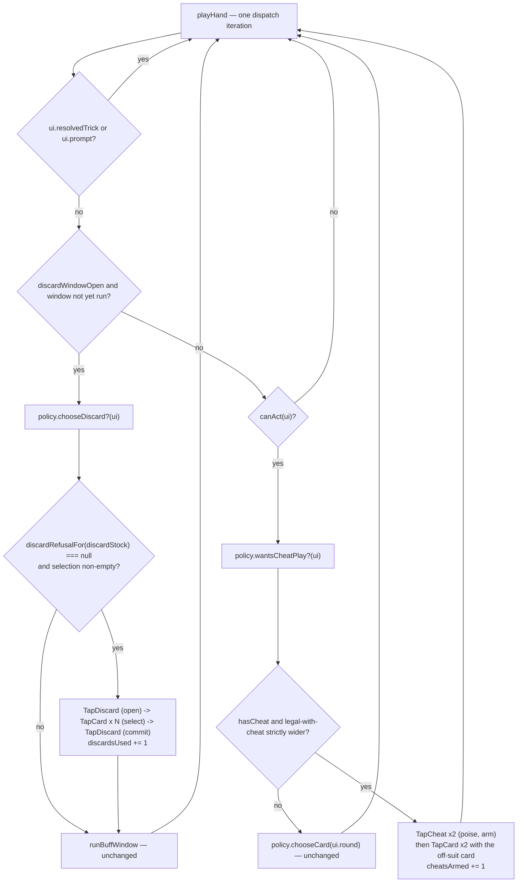

# Plan: Integration — one end-to-end run loop

Plan folder: `.claude/contract/DLR-120-integration-one-end-to-end-run-loop/`
Execution status: see `tasks.md` in this folder.

---

## Part 1 — Alignment

### Task reference

Jira **DLR-120** — "Integration: one end-to-end run loop", Task under epic DLR-103, labels `engine` / `playable`, priority High.

Problem statement (verbatim): *"Every prior ticket builds one piece in isolation. This ticket wires AP, the buff pile, delayed Apply Damage, the slot machine, Shield, the tiered rank abilities (DLR-122), the persistent deck (DLR-123), and the Vault into one running hand-to-hand, fight-to-fight, run-to-run loop, and is where independently-built pieces reveal interface mismatches."*

Acceptance criteria (verbatim):

1. A full run is playable end to end: starting buff pile and AP, per-trick buff activation, delayed Apply Damage, slot-machine shop purchases, Shield's blue hearts, purchased rank-ability tiers resolving correctly for the player and at bronze for the Quarry, the deck persisting across the hands of one encounter with a visible reshuffle, and a death that reaches the Vault screen with a real balance.
2. No regression in previously-shipped, unrelated mechanics (Whetstone, the flask, poison, discard budget) — existing test suites for these pass unmodified.
3. Any interface mismatch discovered between two previously-isolated tickets (e.g. AP state not visible where the shop needs it) is fixed here rather than punted.

Scope boundaries (verbatim): *"In scope: wiring, cross-system regression checks, fixing integration-only bugs. Out of scope: new functionality not already specified in prior tickets; visual polish."*

Dependencies & risks (verbatim): *"This is the highest-risk ticket for surfacing gaps between this breakdown's ticket boundaries — if a mismatch reveals a missing rule (not just a wiring bug), stop and flag it rather than deciding a new rule under this ticket's authority."*

Additional priming from the sprint-run dispatch, 2026-08-23/24:

- `npm run sim` (DLR-130, `352547d`) is the primary integration evidence for this ticket. Its `--policy` seam takes a new `SimPolicy` and a policy that exercises the levers the baseline never touches is named as the highest-value build.
- Three known gaps to confirm, quantify, and fix only where genuinely a wiring defect: no template mints a consumable; `Keepsake` is confirmed dead; `Long Fall` was never shipped.
- The game is unwinnable — **0 wins in 200 runs**. **Balance is the developer's pass and is out of scope; do not retune a single value.** The ticket must say whether the loss is a *balance* problem or an *integration* problem.
- The browser pass is opt-in, off, and **not requested**. No server, no browser.
- Hard constraints: `roundUiState.ts` at 399/400 lines; no new `Math.random()` in `src/hunt/`, `src/warCouncil/`, `src/vault/`, `src/sim/`; no existing `throw` weakened (102 sites at `c760f78`).

### Restated goal

Prove — or disprove — that the twenty tickets of this epic form one working run, using the headless simulator as the instrument rather than a browser. Concretely: extend the simulator so it can drive the levers the baseline player never pulls (the discard budget and the run's starting Cheat) and so it reports the one statistic that separates a balance failure from an integration failure — how many hands are played with **no activatable buff in the pile at all**. Then pin the reachability of every buff family and every shop item with an executable audit, so a card that exists in code but cannot be obtained by playing is a red test rather than a comment somebody has to remember. Fix what is genuinely a wiring defect; quantify and hand over precisely what is a feature gap, and say which is which.

### In scope

- Extend `SimPolicy` with two **optional** decision hooks — a between-tricks discard and a Cheat-armed off-suit play — and drive both from `playHand`, guarded by the engine's own refusal predicates exactly as the existing dispatches are.
- Add a second policy, `maximalist`, registered in `POLICIES` and selectable with `npm run sim -- --policy maximalist`: identical card play and buff play to the baseline, plus the discard budget and the starting Cheat.
- Add `HandReport.activatableBuffsHeld`, `HandReport.discardsUsed` and `HandReport.cheatsArmed`, and report from them: the share of hands played holding **zero** activatable buffs, plus mean discards and Cheats per run.
- Add an executable reachability audit (`src/sim/__tests__/reachability.test.ts`) that pins, from production data only, which `BuffKind`s a player can actually obtain and which `ShopItem`s are on the shelf.
- Correct the two stale docblock claims in `src/hunt/buffTemplates.ts` that say DLR-126 has not landed. It has.
- Run the simulator across several seeds and both policies, record the observed output, and write the balance-versus-integration verdict with its evidence into `pr-description.md`.

### Explicitly out of scope

- **Any tuning value.** No weight, price, health, damage, AP cost, threshold or reward figure is edited. The 0-win result is the developer's balance pass.
- **Minting consumables from the reel.** Argued in Risks: it needs a widened `BuffTemplate` shape and fourteen agent-chosen slot weights. That is a feature, not wiring, and the ticket's own dependency clause says to flag a missing rule rather than decide one.
- **Putting Cheat, Timebomb, Blast Guard or Whetstone back on `SHOP_ITEMS`.** DLR-116's shipped acceptance criterion was a *pared-down* shelf. Reversing another ticket's AC is a developer decision.
- **Finishing DLR-107's Cheat/Timebomb migration into the buff pile.** Handed over with evidence.
- **`Keepsake` and `Long Fall`.** Both are rule decisions the ticket explicitly reserves for the developer.
- **Any `.tsx` file, any stylesheet, any copy.** No UI surface is touched, so no mockup is built.
- **A browser pass.** Not requested.
- **`roundUiState.ts`, `App.tsx`, `WarCouncilRound.tsx`.** All three are at or near the 400-line ceiling and none needs to change for this work.

### Pattern Reference

- `src/sim/baselinePolicy.ts` — the shape a `SimPolicy` takes, including the module-level docblock that writes the policy out in prose because every printed figure is conditional on it. The new policy follows it exactly.
- `src/sim/playHand.ts` → `runBuffWindow` — the dispatch discipline every new dispatch must copy: re-ask the engine's own refusal predicate before every `roundReducer` call, and skip a refused action rather than dispatching it.
- `src/sim/report.ts` — every division guards its divisor and prints `n/a` rather than `NaN`.
- `src/hunt/__tests__/` — the house shape for a data-only assertion test.
- `.claude/skills/react-frontend/SKILL.md` for everything under `src/`.

### Constraints flagged on the brief

- **Determinism.** `src/sim/` is inside the pure-core ESLint boundary. No `Math.random()` may be added; the new policy must be a pure function of the state it is handed, so two identical invocations still produce byte-identical output.
- **No throw weakened.** 102 `throw new` sites across `src/` at `c760f78`. This contract adds no production `throw` and removes none.
- **Line budget.** `roundUiState.ts` 399, `App.tsx` 394, `WarCouncilRound.tsx` 394 — none is in this contract's file map. Every file this contract writes must be measured with `(Get-Content <path>).Count` after Prettier.
- **`npm run format` is never a task step** — scope every Prettier write to the contract's own files.
- **Vitest always with the `run` subcommand.**
- **Vocabulary:** Timebomb / prime / primed / ticking / detonates / Blast Guard. Never "Envenom" or "poison", except `CardRank.Poison`.

### Assumptions made

Every bullet below is a decision the brief did not make. The plan approval gate is auto-approved for this unattended run, so **none of these was developer-confirmed**.

- **The simulator is the end-to-end evidence, and no browser pass is attempted.** The dispatch states the pass is off and not requested; `jsdom` has no layout engine, so a component test would prove nothing a simulated run does not prove better.
- **The two new `SimPolicy` methods are OPTIONAL, not required.** A required method forces `baselinePolicy` to grow two stubs whose only content is "no", and changes what the baseline's printed numbers mean by making a deliberate abstention look like an implemented decision. Optional keeps `baselinePolicy` byte-identical in behaviour and keeps its seed-1 output reproducible against the run log.
- **`maximalist` holds card play and buff play IDENTICAL to `baseline`.** The two policies must differ in exactly the levers being measured, or the comparison attributes a card-play difference to the discard budget.
- **The discard rule is "once per hand, on the first open window, the lowest-ranked `MAX_CARDS_PER_DISCARD` cards, while a charge remains".** Every number in that sentence is an existing configuration constant; nothing is invented. Discarding at every window would exhaust the fight's three charges in the first hand, which is a strictly worse policy and would measure the budget rather than exercise it.
- **The Cheat rule is "arm it only when it strictly widens the legal set, and then play the highest-ranked card the widening admits".** Arming a Cheat and then playing a follow-suit-legal card spends the card for nothing, which would report the Cheat as harmful rather than unexercised.
- **The Cheat play excludes Fox and Woodcutter.** Both open an `AbilityChoice` prompt, and the driver answers a prompt from `chooseCpuMove`'s choice for a *different* card — a mismatch this contract has no reason to risk.
- **The decisive statistic is `activatableBuffsHeld`, counted at the hand's start via `activatableBuffs(run.buffs).length`.** That is the existing production predicate — the same one the loadout panel reads — so the simulator cannot disagree with the felt about what "the player holds a usable buff" means.
- **The reachability audit lives in `src/sim/__tests__/`, not in `src/hunt/__tests__/`.** It asserts a property of the whole run — that a card exists *and* has a path to a player's hand — which no single module owns. `src/sim/` is the only tree whose subject is the whole run.
- **The audit pins today's reachability, gaps included, as `expect(...)` rather than as prose.** DLR-125 set this precedent with `Keepsake`: a defect pinned by a test cannot be silently inherited for six tickets, and closing the gap is then a one-line edit that turns the test red on purpose.
- **`src/sim/index.ts` gains exports for the new policy and the audit's helper, matching how `baselinePolicy` is already exported.**
- **No `.docs/` file is rewritten by hand.** `/fb-apply`'s documentation pass owns `.docs/implementation/` and `.docs/game_rules/the-hunt.md`.

### Config and persisted-shape audit

Step 1.6 ran. This contract touches **no configuration key, no persisted shape, and no `localStorage` surface** — `.claude/rules/save-data-versioning.md` was read and none of its six reject conditions can fire, because nothing in the file map imports `src/persistence/` or `src/vault/`. The audit's remaining checks were run against the shapes that do change:

1. **Configuration keys renamed, retyped or removed: none.** The contract reads `MAX_CARDS_PER_DISCARD`, `DISCARDS_PER_FIGHT`, `RUN_STARTING_CHEATS` and `APPLY_DAMAGE_AP_COST`; it writes none of them.
2. **Persisted shapes affected: none.** `RunReport`, `HandReport` and `SimPolicy` all live in `src/sim/types.ts` and are never serialised. Nothing in `src/sim/` is written to disk.
3. **Type changes checked for loss.** Three *added required* fields on `HandReport` (`activatableBuffsHeld`, `discardsUsed`, `cheatsArmed`, all `number`) and two *added optional* methods on `SimPolicy`. Required-field additions force every construction site to name them — which is the point, and check 7 below counts them. The optional methods add no obligation to `baselinePolicy`.
4. **Consumers of changed exported constants or predicates: none changed.** `activatableBuffs` is read, not modified: `grep -rn "activatableBuffs" src --include=*.ts --include=*.tsx` → **18 hits**, of which exactly **4 are calls** (`src/app/warCouncil/roundUiState.ts:349`, and three in `src/hunt/__tests__/buffActivation.priced.test.ts` at lines 34, 39 and its import at 5); the other 14 are the declaration at `src/hunt/buffActivation.ts:198`, the barrel export at `src/hunt/index.ts:174`, an import at `roundUiState.ts:25`, and eleven docblock mentions. This contract adds a fifth call site in `src/sim/playHand.ts` and alters none of the existing hits.
5. **Name alignment across the chain.** The three new `HandReport` fields are referenced in exactly two files — `src/sim/playHand.ts` (writer) and `src/sim/report.ts` (reader) — plus their declaration in `src/sim/types.ts`. No string-bound surface, no CSS class, no `data-testid`, no `aria-*` id is involved.
6. **Architectural boundary.** `src/sim/**` is inside `eslint.config.js`'s pure-core block (added on DLR-130, with the matching `ignores` entry in the later storage block). The new code imports `legalMoves`, `discardRefusalFor` and `CardRank` from `src/warCouncil/` and configuration constants from `src/hunt/` — all React-free and DOM-free. No `Math.random()`, no `window`, no `document`. `npm run lint` enforces this.
7. **Construction sites, counted by field rather than by type name:**
   - **`HandReport`: 12 annotated sites, 1 construction site (0 of them in specs).** Annotated count is `grep -rn "HandReport" src --include=*.ts --include=*.tsx` → 12. Construction count is the distinctive spelled-out field `damageToQuarry:` → 4 hits, of which 1 is the declaration in `src/sim/types.ts:36`, 1 a property *read* in `src/sim/report.ts:47`, 1 a property read in `src/sim/__tests__/playHand.test.ts:27`, leaving exactly **one object literal, `src/sim/playHand.ts:224`**. The first-choice field `applyDamagePresses:` returned only 2 hits because the literal uses shorthand — recorded because that is precisely the failure mode check 7 exists to catch, and the second field is what found the real site.
   - **`RunReport`: 3 annotated sites, 1 construction site (0 in specs).** `fightReached:` → 3 hits: the declaration (`types.ts:62`), a read (`report.ts:42`), and **one object literal, `src/sim/playRun.ts:168`**.
   - **`HandOutcome`: 4 annotated sites, 1 construction site (0 in specs)** — the `return { result, report, deadCardRefusals }` at `src/sim/playHand.ts:237`. It gains no field; the new counters ride inside `report`.
   - **`SimPolicy`: 13 annotated sites, 1 construction site (0 in specs)** — the `baselinePolicy` object literal at `src/sim/baselinePolicy.ts:105`. `maximalistPolicy` becomes the second. Because both new methods are optional, the existing literal compiles unchanged.
   - **`WindowOutcome` (private to `playHand.ts`): 3 sites, 1 construction site**, at `src/sim/playHand.ts:127`. It gains `discardsUsed` and `cheatsArmed`.

---

## Part 2 — Technical design

### Approach

**The whole contract lives beside the game, not inside it.** Twenty tickets built the systems; this one asks whether a player can reach them. The only production file it modifies outside `src/sim/` is two docblocks in `src/hunt/buffTemplates.ts`, and that edit is prose. Everything else is instrument and audit. This is deliberate: an integration ticket that rewrites features is a failed integration ticket, and the sharpest findings here are gaps that must be handed to the developer with a number attached, not closed on an agent's authority.

**The instrument gains two levers and one statistic.** `SimPolicy` grows `chooseDiscard?(ui)` and `wantsCheatPlay?(ui)`, both optional, both pure, both advisory — `playHand` re-asks `discardRefusalFor(discardStock(ui))` and re-checks `hasCheat`/`cheatArmed` before every dispatch, so a careless future policy still cannot crash a batch. The discard rides in the existing between-tricks window, immediately before the buff activations, because `discardWindowOpen` is the same predicate that gates both and a discard changes the hand the buff decision is made against. The Cheat play rides in the `canAct` branch, before `chooseCard`, because arming must precede the card tap. The statistic is `HandReport.activatableBuffsHeld`, read at the hand's start through the production predicate `activatableBuffs`, and it is the point of the ticket: it converts "the buff system is barely exercised" from an inference off `0.88 activations/hand` into a direct measurement of how many hands were played with nothing to activate.

**The alternative considered and rejected for the levers was a required fifth and sixth method on `SimPolicy`.** It would have forced `baselinePolicy` to implement two refusals, and the module's own docblock — which is load-bearing, because every printed figure is conditional on it — currently says the baseline *never* discards or arms a Cheat because neither is on the shelf. Turning that sentence from "this policy does not consider it" into "this policy considers it and declines" changes what the baseline's numbers mean while changing none of them, which is the worst of both. Optional methods keep the baseline's behaviour, its docblock and its seed-1 output all exactly as the run log records them, which is what makes the `maximalist` comparison honest.

**The reachability audit is the durable half.** It is a `node`-project Vitest spec that imports only production data — `BUFF_TEMPLATES`, `SHOP_ITEMS`, `startRun()` — and asserts three things: which `BuffKind`s the template pool can mint, which `ShopItem`s the shelf offers, and what a fresh run actually holds. From those three it derives the reachable set and compares it to a written-down expectation. Today that expectation records real gaps — no template mints any of the eight activated cards, and `timebombCharges` starts at `0` with `ShopItem.Timebomb` off the shelf — so the audit pins the gaps rather than pretending they are absent. When the developer closes one, the audit goes red at exactly the line that describes it, which is the behaviour DLR-125 established for `Keepsake` and which is the only mechanism this repo has that stops a reachability gap being inherited ticket after ticket. It is a data-only assertion, so it needs no renderer and sits in the `node` project.

**Nothing here reads or writes a tuning value, and the plan is structured so it cannot.** The new policy's every threshold is an existing configuration constant read by name; the audit asserts membership, never magnitude; the report prints means over what the runs did. The one number this contract introduces to the world — the share of hands played with zero activatable buffs — is a measurement, not a dial.

### Skills to invoke during execution

- **`react-frontend`** — everything under `src/`. Owns the TypeScript conventions, the strict-mode contract, the 400-line budget, the testing posture, and the no-`any` rule for every file in this contract's map.
- **`implementation-doc-writer`** — invoked by `/fb-apply`'s documentation pass, not by a task here. Owns `.docs/implementation/` and `.docs/game_rules/the-hunt.md`. This contract changes no rule, so its likely output is a `src/sim/` module-doc update recording the second policy and the reachability audit.

Rules the executor must Read: `.claude/rules/save-data-versioning.md` was scanned and **does not fire** — no file in this contract's map touches `src/persistence/` or any storage global. Also read `.claude/workflow/web-project.md` for every runner command and every verification trap.

No developer skill override was applied — this ran non-interactively and the skill-confirmation `AskUserQuestion` was not presented.

### Diagram



### Data shapes

#### `src/sim/types.ts` — two optional policy hooks

```ts
import type { Card } from '../warCouncil'
import type { CheatCardId } from '../hunt'

/** A Cheat to arm and the off-suit card to play with it. Both named together, because arming a
 *  Cheat and then playing a follow-suit-legal card spends the card for nothing. */
export interface CheatPlay {
  readonly cheatId: CheatCardId
  readonly card: Card
}

export interface SimPolicy {
  readonly name: string
  chooseCard(round: RoundState): CardChoice
  wantsApplyDamage(ui: RoundUiState): boolean
  chooseBuffs(ui: RoundUiState): readonly BuffId[]
  nextShopAction(run: RunState): ShopAction | null

  /** OPTIONAL. Cards to discard in this between-tricks window; `[]` or absent means none.
   *  Advisory — the driver re-asks `discardRefusalFor` and caps at `MAX_CARDS_PER_DISCARD`. */
  chooseDiscard?(ui: RoundUiState): readonly Card[]

  /** OPTIONAL. A Cheat to arm and the card to play with it, or `null`. Advisory — the driver
   *  re-checks `hasCheat` and that the card is legal once follow-suit is lifted. */
  wantsCheatPlay?(ui: RoundUiState): CheatPlay | null
}
```

#### `src/sim/types.ts` — three added required fields on `HandReport`

```ts
export interface HandReport {
  // …existing eight fields unchanged…
  /** Priced buffs in the pile at the hand's START — `activatableBuffs(run.buffs).length`.
   *  `0` means the player had nothing to activate for the whole hand, whatever the AP pool said.
   *  UNIT: cards. */
  readonly activatableBuffsHeld: number
  /** Discard actions committed this hand. UNIT: discard actions. */
  readonly discardsUsed: number
  /** Cheats armed and spent this hand. UNIT: cards. */
  readonly cheatsArmed: number
}
```

#### `src/sim/baselinePolicy.ts` — the second policy

```ts
/** The second policy. Card play and buff play are `baselinePolicy`'s, verbatim — the two differ
 *  ONLY in the levers being measured. Adds: one discard per hand, on the first open window, of
 *  the lowest-ranked `MAX_CARDS_PER_DISCARD` cards, while `discardsRemaining > 0`; and the run's
 *  starting Cheat, armed only where it strictly widens the legal set. Every number in that
 *  sentence is an existing configuration constant read by name — this policy introduces none. */
export const maximalistPolicy: SimPolicy

export const POLICIES: Readonly<Record<string, SimPolicy>>  // { baseline, maximalist }
```

#### `src/sim/reachability.ts` — the audited facts, derived from production data

```ts
/** Every `BuffKind` some production path can put in a player's pile today, derived — never
 *  hand-listed — from `BUFF_TEMPLATES` plus what `startRun()` actually seeds. */
export function mintableBuffKinds(): ReadonlySet<BuffKind>

/** Every `BuffKind` declared by the game but reachable by no path. `mintableBuffKinds`'s
 *  complement over `BuffKind`, minus `Unassigned`, which is a placeholder rather than a card. */
export function unreachableBuffKinds(): ReadonlySet<BuffKind>
```

#### No other shape changes

`RunReport`, `HandOutcome`, `SimOptions`, `SimSummary`, `ShopAction` and `CardChoice` are unchanged. No `package.json` script, dependency, `tsconfig`, `vite.config.ts` or `eslint.config.js` change. No configuration key is added, renamed or retyped.

### Runtime quality notes

- **Purity and adjudication.** Every file in this contract is React-free and DOM-free, inside the pure-core ESLint boundary. The policy decides nothing the engine owns: `playHand` re-asks `discardRefusalFor`, `hasCheat` and `legalMoves` before each dispatch, and drops a refused decision. `reachability.ts` reads exported production data and computes set membership; it hard-codes no card name that production does not already declare.
- **Effects, mount and teardown.** No React, no component, no effect, no listener, no timer, no `requestAnimationFrame`, no `AbortController` anywhere in the file map. Nothing mounts. **No module-level mutable state:** the discard-once-per-hand rule is carried in a local inside `playHand`'s loop, never in a module `let`, so two batches in one Vitest file cannot leak into each other.
- **Hot-path cost.** There is no pointer path. The per-iteration cost added is one `activatableBuffs` filter per *hand* (not per trick), one `legalMoves` call per candidate cheat play, and one sort of a six-card hand. `playHand` is already bounded by `MAX_ACTIONS_PER_HAND`; nothing added is unbounded. The seed-1 200-run batch currently completes in under a second, so a regression here is visible immediately.
- **Determinism and numeric safety.** No `Math.random()` is added, and `src/sim/**` is lint-banned from adding one. Both new policy methods are pure functions of the `RoundUiState` handed in; the discard's card ordering is a total sort on `(rank, suit)` so ties cannot resolve differently between runs. Every new report line divides by a length that is checked first, reusing `report.ts`'s existing `mean` / `percent` helpers, which already return `n/a` on an empty sample — so no `NaN` can be printed.
- **Error paths.** Nothing new throws, and no existing `throw` is touched, moved or weakened (102 sites, verified in Final verification). A refused discard, an absent Cheat, or a cheat play whose card is not legal even with follow-suit lifted is **skipped silently and counted as not taken** — the driver's existing discipline, and correct here because a policy answer is advisory by design. A `null` or absent optional method is the ordinary case, not an error. The reachability audit is a test: its failure mode is a red assertion naming the kind, not a swallowed default.

### Risks and judgement calls

- **The verdict this ticket must deliver is a judgement, and it is stated as one.** Whether the 0-win result is balance or integration is argued in `pr-description.md` from the observed numbers. It is not encoded in a test and it is not acted on. The developer may disagree with the reading; the evidence is recorded so they can.
- **`maximalist` might lose more than `baseline`.** Discarding costs tempo and the Cheat is a one-shot. If it does lose more, that is a real and useful result — it says the levers the player *does* have are not the missing ingredient — and it will be reported as observed rather than tuned towards a better number.
- **No template mints a consumable — argued as a FEATURE gap, left unfixed.** `grep -c "BuffKind.Ward" src/hunt/buffTemplates.ts` → 0. Closing it is not a data edit: `BuffTemplate.kind` is typed `BuffConditionKind` (the 11 condition families) and `BuffTemplate.axis` is typed `BuffCostAxis` (the 4 reward axes), and a consumable has neither — it is priced through `CONSUMABLE_AP_COST` and pays in its effect, not on an axis. It would need the template shape widened, `mintFromTemplate` branched, and **14 new agent-chosen slot weights** (7 kinds × 2 machines) in `SLOT_FAMILY_WEIGHTS`, plus a matching change to `slotOdds.ts`'s expected-value arithmetic. Every one of those weights is a tuning value nobody has chosen. **The developer decides whether consumables ship in v1's reel.**
- **The reachability gap is larger than the dispatch states, and the larger number is the finding.** It is not five consumables — it is **all eight activated cards**. `cheatBuff`, `timebombBuff` and `shieldBuff` have **zero production callers**; `ShopItem.Timebomb`, `ShopItem.BlastGuard` and `ShopItem.Whetstone` are all off `SHOP_ITEMS`; and `startRun()` sets `timebombCharges: 0` and `blastGuardHeld: false`. So **no player can obtain a Timebomb, a Blast Guard, a Whetstone, a Shield, or any of the five consumables.** Only the Cheat is reachable, and only because `RUN_STARTING_CHEATS = 1` grants one at the start. **The developer decides** whether DLR-116's pared-down shelf is still the intended shape now that four tickets of Timebomb work sit behind it.
- **DLR-107's migration was never finished, and it said what would finish it.** That ticket's own log entry records the intermediate state as lasting "until the activation ticket (DLR-103 T5) and the UI ticket land". DLR-108 and DLR-114 both landed. Cheat and Timebomb still exist twice — the live bespoke `CheatStage` / `TimebombStage` machines the felt drives, and an inert `Buff` representation nothing reads. **Completing it is a feature-sized job and the developer's call**, not this ticket's.
- **The audit pins today's gaps as passing assertions, which reads oddly on purpose.** A reader could mistake `expect(unreachableBuffKinds()).toContain(BuffKind.Ward)` for an endorsement. Every such assertion carries a comment naming it a pinned defect and the ticket that must clear it. The alternative — a failing test committed red — is not an option; the suite must be green.
- **The two-lever policy is one policy, not two.** Splitting `discards` and `armsCheats` into separate policies would give a cleaner attribution but three batches to read instead of two, and neither lever alone plausibly moves a 0% win rate. If the developer wants the attribution, splitting is a five-line change to `POLICIES`.
- **`activatableBuffsHeld` is measured at the hand's start.** A buff bought mid-run cannot appear mid-hand — the shop is only reachable between fights — so the two readings coincide today. If a future ticket lets a buff arrive mid-hand, this measurement understates and the comment says so.
- **Nothing in this contract is judged by eye, and nothing needs a browser.** The list of what a browser would still check is carried forward unchanged from DLR-119's `pr-description.md` §7 and restated in this contract's own, because this ticket adds no UI and closes none of that debt.
