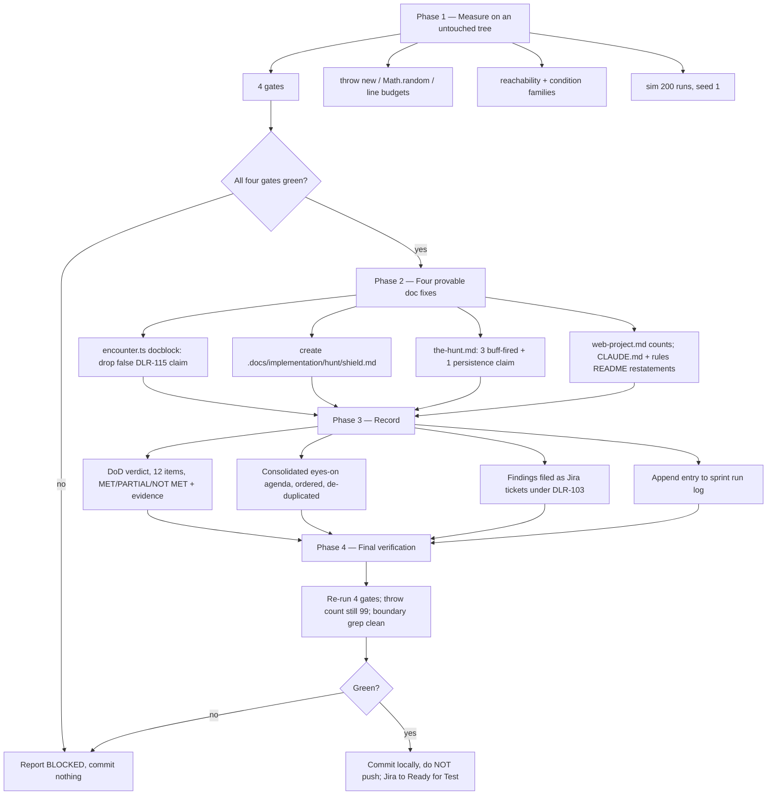

# Plan: DLR-121 — Verification and sign-off against the epic's Definition of Done

Plan folder: `.claude/contract/DLR-121-verification-and-sign-off/`
Execution status: see `tasks.md` in this folder.

---

## Part 1 — Alignment

### Task reference

Jira **DLR-121** — "Verification and sign-off against the epic's Definition of Done" (Task under epic **DLR-103**, labels `engine` / `playable`, priority High).

**Acceptance criteria, verbatim from the ticket:**

1. Each of DLR-103's twelve Definition of Done items is checked individually against the running app (not just against unit tests) and recorded as met or not met.
2. `npm run typecheck`, `npm run lint`, `npm test`, and `npm run build` all pass on the integrated branch.
3. Any DoD item not met is filed as its own follow-up ticket rather than silently closing the epic anyway.
4. `.docs/game_rules/the-hunt.md` and the relevant `.docs/implementation/` module docs are confirmed updated (DoD item 12) — via the `implementation-doc-writer` skill, not by hand.

**Scope Boundaries, verbatim:** *In scope:* DoD verification, the four gate commands, doc-currency check. *Out of scope:* fixing anything beyond a trivial gap — a real gap becomes its own ticket.

**Epic DLR-103's twelve Definition of Done items** are reproduced in full in `tasks.md` → Task 8, which is the task that records the verdict against each.

**Second input, and the ticket's own words make it primary:** `.claude/sprint-runs/2026-08-23-sprint/log.md` — 5,392 lines recording 21 sprint tickets and 5 out-of-band tickets, every assumption taken without the developer, every carried defect, and every "what a browser would have checked" note.

**Evidence gathered before planning, 2026-08-24** (re-measured in Phase 4 rather than trusted from here):

- Four gates green: typecheck 0, lint 0, `npm test` **1808 passed / 1808, 139 files, 0 failed**, build 0.
- `throw new` across `src/` = **99** — the log's 98 and 102 are both stale; 99 is the post-DLR-132 figure.
- `Math.random()` = **3 real call sites, all in `src/App.tsx`**; the 15 hits under `src/hunt/`, `src/warCouncil/`, `src/vault/`, `src/sim/` are every one of them comment prose.
- `npm run sim -- --runs 200 --seed 1` reproduces DLR-132's figures exactly: **0 wins / 200**, 2.29 damage dealt against 2.64 taken, **0.0%** of hands holding no activatable buff, 1.50 activations and 4.35 AP per hand.

### Restated goal

Establish, with evidence, what is **actually true** about epic DLR-103's twelve-item Definition of Done after 26 tickets shipped unattended, and hand the developer an honest statement of it. This is a verification pass, not a feature ticket: the output is a verdict plus a consolidated agenda, not a set of changes. Only documentation defects that are cheap, safe and provably wrong get fixed — a stale claim, a wrong count, a missing module doc, a dead cross-reference. Everything that needs a design decision, a tuning value, or a non-trivial code change is recorded as a **finding** and filed as its own Jira ticket, per AC3. The single most valuable artefact is one consolidated, ordered, de-duplicated list of what the developer must look at with their own eyes, assembled from DLR-119's prioritised eleven and every "what a browser would have checked" note scattered across the run log.

### In scope

- Re-run all four gates on `Version-5` at `c4b202d` and quote the actual numbers.
- Re-measure and quote the integrity counts: `throw new` sites, real `Math.random()` call sites, unreachable buff kinds, condition families that pay.
- Re-run `npm run sim -- --runs 200 --seed 1` and report what is observed, retuning nothing.
- Check each of the twelve DoD items individually against the shipped code and record **MET / PARTIAL / NOT MET** with the evidence that decided it.
- Fix four classes of provably-stale documentation, and nothing else:
  - the false "DLR-115 reads this" claim in `hasShieldHearts`' docblock in `src/hunt/encounter.ts`;
  - the missing `.docs/implementation/hunt/shield.md` — `src/hunt/shield.ts` has no module doc at all;
  - three surviving "nothing on screen announces that a buff fired" claims and one "nothing is saved today" claim in `.docs/game_rules/the-hunt.md`, all falsified by shipped code;
  - stale source-file counts and module lists in `.claude/workflow/web-project.md`, plus the two facts `CLAUDE.md` restates from it and from `.claude/rules/`.
- File one Jira follow-up ticket per DoD item not fully met, per AC3.
- Append the DoD verdict, the fixed-versus-filed split, the consolidated eyes-on agenda and the verified counts to the sprint run log.

### Explicitly out of scope

- **Balance. Not one tuning value may be changed.** The 0-win result is the developer's pass; DLR-132 removed the integration confound and that is the finding, not an invitation.
- Splitting the two pre-existing over-length spec files (418 and 402 lines) — decision and reasoning recorded in Task 10, change not made.
- Making Shield, the five consumables, Blast Guard or Whetstone reachable.
- Any browser pass. No server is started and no browser is opened; **no surface may be described as verified that only a browser could verify.**
- Restructuring `.docs/game_rules/the-hunt.md` away from its accumulated per-ticket changelog blockquotes, which `CLAUDE.md` forbids it from carrying — recorded as a finding, not fixed here.
- Rewriting `CLAUDE.md`'s "the POC implements the project's previous design direction" framing — a judgement about the project's own narrative, and the developer's.

### Pattern Reference

- `.docs/implementation/hunt/blast-guard.md` and `.docs/implementation/hunt/timebomb-and-the-delayed-hit.md` — the shape a `hunt/` module doc takes, for the new `shield.md`.
- `.docs/implementation/hunt/buff-condition-evaluation.md` → *Known defects, recorded and not fixed* — the house pattern for recording a defect in a module doc without fixing it, which `shield.md` needs for the unreachability and the `breaking`-overlay over-draw.
- `.claude/contract/DLR-119-full-visual-and-ux-pass/pr-description.md` §7 — the eleven-item prioritised eyes-on list that the consolidated agenda is built on top of.
- `.claude/skills/implementation-doc-writer/SKILL.md` — owns `.docs/implementation/` and `the-hunt.md`; its folder shape governs where `shield.md` goes and how the index is updated.

### Constraints flagged on the brief

- **No `Math.random()`** in `src/hunt/`, `src/warCouncil/`, `src/vault/`, `src/sim/` — lint-enforced, and this contract adds no code.
- **Do not weaken any `throw`.** The count must be 99 before and after.
- **`CLAUDE.md`'s 400-line limit is blocking**, measured with `(Get-Content <path>).Count`, never `Measure-Object -Line`.
- **Vocabulary (`6ba6224`)**: Timebomb / prime / ticking / detonates / Blast Guard. Never "Envenom" or "poison" except `CardRank.Poison` (rank 8).
- **Never put `npm run format` in a task** (`ae9ee28`) — scope every Prettier write to this contract's own files.
- Vitest always with the `run` subcommand. `npm run sim` always terminates.
- `npm run format:check`'s ~58 pre-existing `.md` failures are not a gate.
- The plan approval gate is auto-approved; this run is unattended and non-interactive.

### Assumptions made

- **A verification ticket that quietly refactors destroys its own evidence.** Every judgement below resolves toward "record it" over "fix it" wherever the two compete. This is the governing assumption and it is why the two over-length spec files stay unsplit.
- **A doc fix is "cheap and safe" only when the claim is falsifiable by grep or by reading one function.** Each of the four fixes named in scope is falsified by a specific, quotable piece of shipped code, named in its task. Anything requiring interpretation is a finding.
- **`MET` is judged against the integrated app, not against unit tests** — the ticket's AC1 says so explicitly. A mechanic that is correct, tested, and unreachable by any path a player can take is **NOT MET**, and is recorded that way rather than softened. This is the assumption that decides DoD item 5.
- **`PARTIAL` is a real verdict, not a hedge.** It is used where a DoD item names several things and some shipped — e.g. two of seven rank ladders. The verdict names which half is which.
- **Every PARTIAL and NOT MET gets a follow-up ticket**, reading AC3's "not met" as "not fully met". Closing an epic on a PARTIAL with no ticket is the exact failure AC3 exists to prevent.
- **`.claude/workflow/web-project.md` owns the source-file counts** per `CLAUDE.md`'s single-source-of-truth table ("Where code lives"), so the count is corrected there and `CLAUDE.md`'s restatement of it is the duplicate to reconcile. The duplication itself is recorded as a finding, not resolved by deleting a section of `CLAUDE.md` unasked.
- **`the-hunt.md` and `.docs/implementation/` are edited only through the `implementation-doc-writer` skill**, per AC4 and `CLAUDE.md`. The skill is invoked; the files are not hand-edited.
- **The consolidated agenda is ordered by "what breaks the game for a player" first**, not by ticket number — reachability of a control, then whether a screen crops, then whether a value resolves, then copy and taste. DLR-119's own §7 ordering is preserved inside that frame because it was reasoned and nothing has changed since.
- **No new Jira epic or sprint is created.** Follow-up tickets are Tasks/Bugs under DLR-103, matching how DLR-127 / DLR-130 / DLR-131 / DLR-132 were raised during this run.

### Config and persisted-shape audit

- **No configuration key is added, renamed, retyped or removed.** Grep for the tunables this contract's subject matter touches confirms they are read, not written, by anything here: `STARTING_BUFF_COUNT` = 4 and `RUN_STARTING_CHEATS` = 1, both in `src/hunt/config.ts`, both quoted in the verdict and **neither changed**.
- **No persisted shape is affected.** `.claude/rules/save-data-versioning.md` was read and **does not fire**: this contract writes no field, bumps no `SAVE_SCHEMA_VERSION`, and touches no file under `src/persistence/`. Reject conditions 1–6 are each inapplicable for want of any storage access in the diff.
- **No type changes, so no loss to check.** The only `src/` edit in this contract is prose inside an existing docblock in `src/hunt/encounter.ts`; the file's exports, signatures and types are untouched.
- **Consumers of a changed exported constant: zero.** No exported constant or predicate changes. `hasShieldHearts` keeps its name, signature and body — its **comment** is what is wrong. Its call sites were counted anyway, because the comment's claim is about them: **4 hits** for `hasShieldHearts` across `src/` — the definition (`src/hunt/encounter.ts:248`), the barrel re-export (`src/hunt/index.ts:212`), and two in `src/hunt/__tests__/shield.encounter.test.ts` (import + assertion), plus one prose mention at `src/hunt/encounter.ts:275`. **Zero callers under `src/app/`** — which is precisely the falsification: the docblock claims DLR-115 reads it, and DLR-115's `src/app/warCouncil/roundBars.ts` reads `ui.encounter.shieldHearts` directly instead.
- **Names align across the chain — one mismatch found, and it is the target of Task 1.** The chain `shield.ts` → `encounter.ts` → `roundBars.ts` → `duelHealthBars.ts` is sound in code; only the docblock's attribution is wrong.
- **Architectural boundary holds.** The pure-core grep over `src/hunt/` and `src/warCouncil/` for a React import or a DOM global is re-run in Phase 4; this contract adds no import to either tree.
- **Check 7 — construction sites: not applicable.** No task adds or widens a field on any type, so there is no shape whose literals could go uncounted. Recorded explicitly rather than skipped, because four of this run's tickets were bitten by omitting it.

---

## Part 2 — Technical design

### Approach

The contract is shaped as **measure → verify → fix the four provable things → record → file**, in that order, and the ordering is the design. Phase 1 re-measures every count this plan quotes, so the verdict rests on numbers taken at execution time rather than on numbers copied from a run log that has already been wrong about `throw new` twice (98, then 102; it is 99). Phase 2 makes the four documentation fixes. Phase 3 writes the verdict, the agenda and the log entry. Phase 4 is final verification. Nothing in Phase 2 depends on Phase 1's result, but Phase 1 runs first anyway: if a gate is red at `c4b202d`, the honest output is BLOCKED and no fix should have been made.

The alternative shape — fix first, measure after — was rejected for the reason the whole ticket exists. A verification pass whose diff was written before its evidence was gathered cannot distinguish "the gates are green" from "the gates are green *now that I changed things*". Measuring first, on an untouched tree, makes the baseline quotable and makes Phase 4 a genuine comparison rather than a restatement.

**The `src/` change is one comment and nothing else.** `hasShieldHearts`' docblock asserts "DLR-115 reads this to decide whether to draw any shield pip at all", and DLR-115 does not: `src/app/warCouncil/roundBars.ts` reads `ui.encounter.shieldHearts` directly, twice, and `hasShieldHearts` has zero callers outside its own spec. This is exactly the class of defect the brief calls cheap, safe and clearly broken — a dead cross-reference that misleads the next reader into thinking a function is load-bearing when it is not. The fix states what is true (the function is correct, exported, and currently uncalled by the app layer) without deleting it, because deleting an export is a code change and this ticket does not make code changes.

**`.docs/implementation/hunt/shield.md` is created rather than patched**, because `src/hunt/shield.ts` has no module doc at all — the only `src/hunt/` module in that position. `blast-guard.md` and `consumable-items.md` both reference the shield mechanic obliquely while nothing documents `SHIELD_HEARTS`, `absorbWithShield`'s absorption order, or `shieldHeartsForTier`'s guard. The new doc carries two known defects in the house *Known defects, recorded and not fixed* form: that nothing in the app calls `activateShield`, so no blue heart has ever been drawn; and DLR-115's `breaking`-overlay over-draw, which is unreachable today and becomes visible the moment Shield is wired. Both are documentation of a defect, not a fix for one.

**`the-hunt.md`'s four stale claims are corrected through the `implementation-doc-writer` skill**, per AC4, which owns both that file and `.docs/implementation/`. Three of them say "nothing on screen announces that a buff fired" (lines 2357, 2535, 3430) and one says "nothing is saved today" (line 2387). The first three were true when DLR-125 wrote them and were falsified two tickets later by DLR-119, which shipped `src/app/warCouncil/buffFiredLabels.ts` and wired `buffFiredText` into `src/app/warCouncil/TrickWell.tsx`. The fourth was falsified by DLR-113 and DLR-118, which persist the Vault through `src/persistence/`. Both falsifications are single greps, which is what makes them safe to fix here.

**Findings become Jira tickets, not code.** Six DoD items land short of MET, and AC3 requires each to be filed rather than absorbed. They are created as Tasks/Bugs under DLR-103 through the `management-jira` skill, matching how this run's five out-of-band tickets were raised. The ticket bodies carry the evidence from Phase 1 so the developer does not re-derive it.

### Skills to invoke during execution

- `implementation-doc-writer` — **the central skill for this contract.** Owns `.docs/implementation/` and `.docs/game_rules/the-hunt.md`; governs the creation of `shield.md`, the index update, and every correction to `the-hunt.md`. AC4 requires these go through it rather than by hand.
- `management-jira` — creating the follow-up tickets AC3 requires, and the closing status transition. Its status-model and label-vocabulary sections are the authority on both.
- `react-frontend` — governs the one `src/` edit (a docblock in `src/hunt/encounter.ts`). Named because the file is TypeScript under `src/`, even though the change is prose only and adds no code.

Rules to Read: `.claude/rules/save-data-versioning.md` — read during planning and confirmed **not to fire** (no storage access, no persisted field, no schema bump in this diff).

Always read: `.claude/workflow/web-project.md`.

No developer override was applied: this run is unattended and non-interactive, so Step 1.5c's `AskUserQuestion` skill-confirmation was not presented.

### Diagram



### Data shapes

**No type, config, or contract changes.** This contract adds no exported symbol, changes no signature, introduces no configuration key, and alters no persisted shape.

The one `src/` edit replaces prose inside an existing docblock. The declaration below is quoted to show it is **unchanged** by this contract — only the comment above it moves:

```ts
// src/hunt/encounter.ts — signature, name and body all unchanged
export function hasShieldHearts(encounter: EncounterState): boolean {
  return encounter.shieldHearts > 0
}
```

The symbols the new `shield.md` documents are all pre-existing exports of `src/hunt/shield.ts`, reproduced here so the doc task has an authoritative list and invents nothing:

```ts
export const SHIELD_HEARTS: Readonly<Record<BuffTier, number>>   // bronze 1, silver 2, gold 3
export const NO_SHIELD_HEARTS: Health                             // 0
export interface ShieldAbsorption {
  readonly absorbed: Damage
  readonly throughToHealth: Damage
  readonly shieldHeartsRemaining: Health
}
export function absorbWithShield(shieldHearts: Health, damage: Damage): ShieldAbsorption
export function shieldHeartsForTier(tier: BuffTier): Health
```

Markdown files created or modified carry no schema; their shape is governed by `implementation-doc-writer`'s `SKILL.md`.

### Runtime quality notes

- **Purity and adjudication:** No logic moves and none is added. `src/hunt/` stays DOM-free and React-free — this contract adds no import to it. No component gains a decision. No tunable is introduced, and the two the verdict quotes (`STARTING_BUFF_COUNT`, `RUN_STARTING_CHEATS`) are read from `src/hunt/config.ts` and left at their shipped values.
- **Effects, mount and teardown:** Trivial — no concerns. No effect, listener, observer, timer, `requestAnimationFrame` or `AbortController` is added, changed or removed, and no component is touched. There is no cleanup to write and no StrictMode surface in the diff.
- **Hot-path cost:** Trivial — no concerns. Nothing in this diff executes at runtime; the only `src/` change is a comment, which the compiler strips.
- **Determinism and numeric safety:** No `Math.random()` is added; the three real call sites stay exactly where they are, in `src/App.tsx`. The simulator is invoked at a **fixed seed (`--seed 1`)** so its output is reproducible and comparable against DLR-132's recorded figures — a differing number is then a real signal rather than noise. No divisor, epsilon or numeric path is introduced.
- **Error paths:** No guard is added, removed or weakened. The `throw new` count must read **99** in both Phase 1 and Phase 4; a change in either direction fails the contract. `absorbWithShield`'s two `RangeError` guards and `shieldHeartsForTier`'s one are **documented** by the new `shield.md` — including that they are guards rather than live paths, because `assertApplicable` rejects a bad `damage` upstream — and are not touched.

### Risks and judgement calls

- **The 418 / 402-line spec files stay unsplit, and this is a judgement call the developer may reverse.** `src/warCouncil/__tests__/playCard.test.ts` (418) and `src/warCouncil/__tests__/rankTiers.resolution.test.ts` (402) breach `CLAUDE.md`'s blocking 400-line limit and have done since DLR-123. Splitting a spec file redistributes shared fixtures and `describe` scoping — a real regression risk, for zero behavioural gain, on the one ticket whose entire value is that its evidence is trustworthy. Defender and QA already agreed twice this run that an integration-class ticket should not do it. **Recorded as a finding and filed; not fixed.** If the developer would rather clear the breach now, it is a small dedicated ticket.
- **DoD item 5 is called NOT MET, and that is a reading.** Shield's rules are built, correct and tested — non-stacking (`activateShield` SETS rather than adds), non-healable (no heal path writes `shieldHearts`; only three writers exist), and per-tier (1/2/3). But `shieldBuff` has zero production callers, so in the running app no blue heart is ever drawn. AC1 says "against the running app", which is why this reads NOT MET rather than PARTIAL. A developer who reads the DoD as being about the *mechanic* rather than the *reachable feature* would call it MET — the evidence is stated either way so the call can be re-made.
- **DoD item 8's verdict turns on intent, not on the number.** `STARTING_BUFF_COUNT = 4` is a resolved number and a fresh run is not empty-handed, so the literal wording is satisfied. But four of the five opening cards are `Unassigned` placeholders that `activatableBuffs` filters out, leaving one bronze Cheat — and DLR-103's own scope text says the larger pile exists "to address the first-fight problem", which four placeholders do not. Called PARTIAL on that basis.
- **Nothing in this epic has been seen by a human or a browser, and no verdict in this ticket changes that.** Every DoD item touching a rendered surface is verified statically only. This is stated in the log entry and at the head of the agenda rather than left implicit, and it is the reason item 11 cannot read MET.
- **The consolidated agenda's ordering is mine.** It merges DLR-119's prioritised eleven with roughly forty "what a browser would have checked" notes from twelve other tickets, de-duplicated. Where two tickets asked for the same viewport check, the more specific wording survives. The developer may reorder it; what matters is that it is one list rather than forty.
- **Balance is untouched and the 0-win result stands.** DLR-132 removed the integration confound — hands holding no activatable buff went 67.7% → 0.0% while the win rate stayed 0.0% — so the remaining deficit is a balance problem. **No value is retuned here.** The developer's balance pass is the largest single piece of work this epic hands forward, and it is not this ticket's.
- **`the-hunt.md` carries per-ticket changelog blockquotes that `CLAUDE.md` forbids** ("never add a per-ticket section to it"). At least eight dated `> **… — DLR-1NN, 2026-08-24.**` blocks now sit above the rules. Restructuring the document is a large, judgement-heavy rewrite and is explicitly out of scope; recorded as a finding.
- **`CLAUDE.md` and `.claude/workflow/web-project.md` state the same source-file counts, and both are stale** — 53 files / four modules and 81 files / six modules respectively, against an actual 271 `.ts`/`.tsx` files across eight modules with 139 test files. The count is corrected where it is owned; the duplication is recorded as a finding rather than resolved by deleting text from `CLAUDE.md` unasked.
</content>
</invoke>
