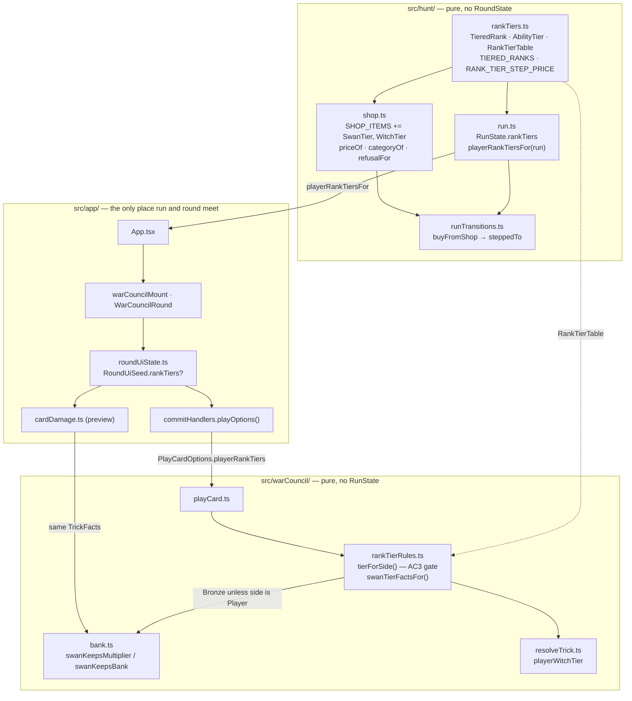

# Plan: Tiered rank abilities — refill the run-permanent shop shelf

Plan folder: `.claude/contract/DLR-122-tiered-rank-abilities-run-permanent-shelf/`
Execution status: see `tasks.md` in this folder.

---

## Part 1 — Alignment

### Task reference

Jira **DLR-122** — "Tiered rank abilities: refill the run-permanent shop shelf", Task under epic DLR-103. Design source `.docs/design/Balatro-Forbidden-Solitaire/version-5-developer-idea.md` §7b.

Acceptance criteria, verbatim from the ticket:

1. Each named rank — Swan (1), Fox (3), Woodcutter (5), Treasure (7), Poison (8), Witch (9), Monarch (11) — carries a bronze/silver/gold ability ladder, where bronze is the ability printed today, so a run that buys nothing plays exactly as it does now.
2. A tier is purchasable from the shop's run-permanent shelf, applies to every copy of that rank the player holds, and persists for the rest of the run.
3. The upgrade applies to the player only: the Quarry's copy of the same rank resolves at bronze. This is the first asymmetry the deck has carried and must be enforced explicitly, not left to fall out of shared resolution code.
4. Swan silver: on a clean loss — not an eaten skull — the multiplier survives the hit and the player still leads the next trick. Damage is still taken and the bank still cashes at two-thirds.
5. Swan gold: as silver, and the bank survives too — no cash-out, the streak carries on. This reuses the poisoned-clean-loss exception's existing shape rather than a second implementation of it.
6. Tier state is covered by Vitest at the resolution layer: an upgraded ability resolving for the player, the same rank resolving unupgraded for the Quarry, and Swan silver/gold against both a clean loss and an eaten skull.
7. Pricing is read from one configuration point, not scattered at call sites, so the open pricing question below can be retuned without a code hunt.
8. `the-hunt.md` section 5 (the ability table) and section 7 (the bank and the four outcomes) are updated to describe the tiers and the Swan exception.

Ticket scope boundary, quoted: *"Treasure (7) and Poison (8) have no printed ability to tier, so those two rows invent an ability and then tier it. That is a bigger step than the rest of the ticket and **can ship separately if it costs too much**."* And out of scope: *"Final tuning of every magnitude in §7b's table; those are placeholders and the developer's call."*

Run context (2026-08-24, unattended sprint run): the developer approval gate is not presented. Every judgement below is taken as the plan's stated default and logged to `.claude/sprint-runs/2026-08-23-sprint/log.md`.

### Restated goal

The shop's run-permanent shelf currently holds one thing — AP capacity — because DLR-116 pared everything else off it. This task refills it by giving the deck's named ranks a bronze/silver/gold ability ladder, sold in the shop, permanent for the rest of the run, and applying to the player's copies only while the Quarry's copies of the same rank keep resolving at bronze. Bronze is exactly today's printed ability, so a run that buys nothing plays byte-for-byte as it plays now. The Swan ladder is built in full, because it is the row the ticket specifies to the level of a rule (AC4/AC5): its silver spares the multiplier through a clean loss and its gold spares the bank too, both keyed on the existing clean-loss / eaten-skull split rather than a second implementation of the poisoned-clean-loss exception.

### In scope

- A pure tier model in `src/hunt/rankTiers.ts`: the seven `TieredRank` identities, the `AbilityTier` ladder, the per-run `RankTierTable`, the ladder step, and the **single** pricing configuration point (AC7).
- `RunState.rankTiers`, seeded all-bronze by `startRun` and carried by every existing spread so the upgrade is run-permanent (AC2).
- The shelf itself: two new `ShopItem` members (`SwanTier`, `WitchTier`) on `ShopCategory.RunPermanent`, added to `SHOP_ITEMS`, priced through `priceOf`, refused through `refusalFor` with a new `RankAtMaxTier` reason code, and bought through `buyFromShop`'s existing exhaustive `switch` (AC2).
- One explicit player-only gate, `src/warCouncil/rankTierRules.ts`, through which every rank effect reads its tier (AC3).
- The Swan ladder in full, in `bank.ts` (AC4/AC5), and the Witch ladder in full, in `resolveTrick.ts`.
- The tier table threaded from `RunState` to the card layer through the existing `PlayCardOptions` seam, and mirrored into the DLR-117 damage preview so preview and commit cannot disagree.
- Shop copy for the two new items and the new refusal reason.
- Vitest at the resolution layer (AC6) plus purchase-level and model-level specs.
- `.docs/game_rules/the-hunt.md` §5 and §7 (AC8).

### Explicitly out of scope

- **The Fox, Woodcutter, Treasure, Poison and Monarch silver/gold effects.** Each is in the `TieredRank` type and in the ruleset's own vocabulary, but none is on `TIERED_RANKS` — the offered shelf — because each needs a surface this ticket does not build. Reasons, per rank, are in *Risks and judgement calls*.
- Vault spends against rank tiers (DLR-113 owns the Vault; it knows only about buff cards).
- Any AP cost for a rank tier — a tier is bought with coin and costs no AP to use.
- Retuning `AP_CAPACITY_PRICE`, `SLOT_REROLL_PRICE`, `WHETSTONE_PRICE` or any existing price. This plan adds one key; it moves none.
- The `Miser` / unspent-coin conflict itself. This plan states which way the shelf moves it and changes no existing number (see *Risks*).
- A shop screen redesign. The two new items render through the shelf `ShopPanel.tsx` already maps from `SHOP_ITEMS`; no new component and no layout change.

### Pattern Reference

- **`ShopItem` vs `SHOP_ITEMS`** — `src/hunt/shop.ts:22-28` (DLR-116, `2e60835`). The union is everything the game prices; the array is what the shop offers. This plan reuses that convention twice: for the shop's shelf, and for `TieredRank` vs `TIERED_RANKS`.
- **A run figure handed to the card layer as a plain value** — `PlayCardOptions.bankClimbBonus` (`src/warCouncil/legalMoves.ts:54`) fed by `bankClimbBonusFor(run)` (`src/hunt/run.ts:247`) through `playOptions` (`src/app/warCouncil/commitHandlers.ts:50`). `src/hunt/` must never learn `RoundState`; `src/warCouncil/` must never learn `RunState`. Rank tiers follow this path exactly.
- **An optional seed field defaulted to today's behaviour** — `RoundUiSeed.apCapacity?` (`src/app/warCouncil/roundUiState.ts:181`). `rankTiers?` uses the same device so 14 existing seed fixtures need no edit and an absent table reproduces the pre-DLR-122 game exactly.
- **A total `switch` with no `default`** — `buyFromShop` (`src/hunt/runTransitions.ts:200-230`) and `priceOf` / `categoryOf` (`src/hunt/shop.ts`). New members become compile errors, not silent fallthrough.
- **Preview parity** — `src/app/warCouncil/cardDamage.ts:70-78` reproduces `playCard.ts`'s defaulting field for field (DLR-117). Every new `TrickFacts` field must be mirrored there.
- **A price is a documented single key** — `AP_CAPACITY_PRICE` (`src/hunt/config.ts:226`) with its UNIT comment and its provenance line.

### Constraints flagged on the brief

- **Determinism**: `src/hunt/` and `src/vault/` hold no `Math.random()`. Nothing in this plan introduces randomness — a rank tier is bought, never drawn — so the balance simulator DLR-130 will measure this shelf against a fully deterministic run.
- **The pure-core boundary**: `src/hunt/**` and `src/warCouncil/**` take no React import and no DOM global (`eslint.config.js` override). Both new modules live inside that boundary and must stay pure.
- **DLR-116's convention**: put items back through `SHOP_ITEMS`; keep `priceOf` / `categoryOf` / `refusalFor` / `buyFromShop` total over the whole `ShopItem` union.
- **Vocabulary (`6ba6224`)**: Timebomb / prime / primed / ticking / detonates / Blast Guard. Never "Envenom" or "poison" for that mechanic. `CardRank.Poison` (rank 8) is an unrelated card rank and this plan does not put it on the shelf, which keeps the collision unopened.
- **Never `npm run format`.** Prettier is run scoped to the files in each task's `**Files:**` block only.
- **400-line blocking budget**, measured with `(Get-Content <path>).Count`. `src/hunt/config.ts` already stands at 381 — the new price key therefore does **not** go there.
- **Browser pass is off for this run.** No dev server is started and no browser is opened.

### Assumptions made

1. **The shelf ships Swan and Witch; the other five ranks stay in the type and off `TIERED_RANKS`.** Rationale: a purchasable tier whose effect is not implemented takes 5 coins for nothing, which is strictly worse than not offering it. Fox and Woodcutter silver/gold need a new player-choice surface (peek at the draw pile; choose among 2–3 drawn cards); Treasure needs a coin channel out of the card layer that does not exist; Poison collides with Timebomb's vocabulary and needs the delayed-damage queue; Monarch's narrowing is read at five call sites, one of which is the Quarry's own move choice, and a missed site produces a stuck hand. This mirrors the exact convention DLR-116 introduced one ticket ago and which the brief requires be respected.
2. **Price: `RANK_TIER_STEP_PRICE = 5` coins per tier step**, so bronze→silver is 5 and silver→gold is 5 more, 10 for a full ladder. TRANSCRIBED from §7b's own reading ("Read here as 5 coins per tier step — so a rank taken from bronze to gold costs 10 coins in total"), not invented here. Placed against the economy in *Risks*.
3. **One key for every rank and every step, not a per-rank or per-step table.** AC7 asks for one configuration point. A flat step price is the only shape that is literally one point; the escalating 5/10/15 reading §7b also names would need a curve, and §7b did not pick it. Retuning to a curve later is a change of this one key's type, in one file.
4. **The shelf does not "refill" on a clock.** §7b: "a fixed, always-purchasable list, deliberately not behind the reels". So the shelf is static — every tierable rank not yet at gold is on it at every shop visit, with no restock, no rotation and no reroll. "Refill" in the ticket title means the shelf was empty and now has stock, not that stock replenishes.
5. **A rank can be bought exactly twice — once to silver, once to gold — and never again.** Enforced by a new `PurchaseRefusal.RankAtMaxTier`, following `GuardAlreadyActive`'s precedent. Tiers do not stack like Whetstone: a tier is a rung, not a counter.
6. **`RankTierTable` is a total `Record<TieredRank, AbilityTier>`, seeded all-bronze**, rather than a sparse map. A total record cannot produce `undefined` at a resolution branch, which is exactly the failure the `Unassigned` trap keeps producing elsewhere; and `apCostOf`'s `RangeError` problem has no analogue here because there is no unseeded value to reach.
7. **The tier table reaches the card layer as a plain value through `PlayCardOptions`, named `playerRankTiers`.** Rationale: the boundary `types.ts:26-32` documents. The name carries the AC3 asymmetry in the identifier itself — there is no `quarryRankTiers` to pass by mistake.
8. **`AbilityTier` is a new union in `src/hunt/rankTiers.ts`, not a reuse of `BuffTier`.** They read the same to a player (§7b: "bronze/silver/gold means the same thing here as on a buff card") but a buff tier is drawn and a rank tier is bought, and `buffCosts.ts`'s derived AP lookup keys off `BuffTier`. Sharing the type would let a rank tier be handed to `apCostOf`.
9. **Monarch's `nextLeaderAfterTrick` behaviour is untouched.** AC4's "you still lead the next trick" is already true at bronze for whoever played the Swan into a lost trick. The plan asserts it in a test rather than adding a second rule that would double-implement it.
10. **The Quarry's move heuristic (`cpuPlayer.ts`) evaluates at bronze.** `resolveTrickWinner`'s two calls there are the CPU's own evaluation of a candidate card, not the rule. Leaving them at bronze means a player's gold Witch is *misjudged* by the Quarry, which is a fair consequence of the upgrade rather than a defect — and it is the only reading that keeps `chooseCpuMove`'s signature and its four call sites unchanged. Documented in code at both call sites.
11. **Monarch gold, had it shipped, would have needed a new `RoundState` field.** It is not shipping (assumption 1), so no `RoundState` field is added by this plan at all.

### Config and persisted-shape audit

Run against the real files with `grep` on 2026-08-24. Counts are what the command printed.

- **`RANK_TIER_STEP_PRICE` (new key)** — `grep -rn "RANK_TIER_STEP_PRICE" src` → **0 hits**. New, not dead. It goes in the new `src/hunt/rankTiers.ts`, **not** `src/hunt/config.ts`: `(Get-Content src\hunt\config.ts).Count` reports **381** of the 400-line blocking budget, and `slotConfig.ts` / `apConfig.ts` are the established precedent for a split-out tunable.
- **`ShopStock` — gains a required `rankTiers` field.** `grep -rn "ShopStock" src | wc -l` → **14 annotated sites**. Construction sites by distinctive required field `cheatCount:` → **3** (`src/hunt/run.ts:212` `shopStockFor`, `src/hunt/__tests__/run.shop.test.ts:76`, `src/hunt/__tests__/shop.test.ts:29` the `stock()` base helper), 2 of them in specs. **3 is the real number** and all three are in a task's `**Files:**` block.
- **`RunState` — gains a required `rankTiers` field.** `grep -rn "RunState" src | wc -l` → **70 annotated sites**. Construction sites by distinctive required field `nextCheatId:` → **4**, of which one is the interface declaration (`run.ts:61`), one is `startRun`'s full literal (`run.ts:168`), and two are spreads over an existing run (`runTransitions.ts:215`, `run.integration.test.ts:13`) which a new field flows through untouched. **Exactly one full literal must change: `startRun`.**
- **`TrickFacts` — gains two required booleans (`swanKeepsMultiplier`, `swanKeepsBank`).** `grep -rn "TrickFacts" src | wc -l` → **11 annotated sites**. Construction sites by distinctive required field `skullTrick:` → **9 total across 4 files**, but 6 of those are `facts({…})` overrides in `bank.test.ts` over one base literal at line 20, so the real literal count is **4**: `src/warCouncil/playCard.ts:110`, `src/app/warCouncil/cardDamage.ts:71`, `src/warCouncil/__tests__/bank.test.ts:20`, `src/warCouncil/__tests__/bank.integration.test.ts`. **4 is the real number**; all four are in a task's `**Files:**` block. Required rather than optional deliberately — `bank.ts`'s own docblock argues for compiler-enumerated call sites, and 4 is cheap.
- **`RoundUiSeed` — gains an OPTIONAL `rankTiers?` field.** Construction sites by distinctive required field `bankClimbBonus:` → **21 files**, 14 of them specs under `src/app/warCouncil/__tests__/`. Making the field required would put 21 files in this contract's diff for no behavioural gain. **Optional, defaulted to `ALL_BRONZE`**, following `apCapacity?`'s precedent at `roundUiState.ts:181`: an absent table is exactly "nothing bought", which AC1 requires play identically to today. Only `roundUiState.ts`, `WarCouncilRound.tsx`, `warCouncilMount.ts` and `App.tsx` change.
- **`PurchaseRefusal` — the union widens by one member (`RankAtMaxTier`).** `grep -rn "PurchaseRefusal" src` → readers are `src/hunt/shop.ts`, `src/hunt/runTransitions.ts`, `src/app/run/shopLabels.ts` (`PURCHASE_REFUSAL_MESSAGE`, a total `Record` — a missing member is a compile error there, which is the design), `src/app/run/ShopPanel.tsx` (reads the message map, no `switch`). All in a task's `**Files:**` block.
- **`ShopItem` — the union widens by two members.** Total functions over it are `priceOf`, `categoryOf`, and `buyFromShop`'s `switch`; total `Record`s over it are `SHOP_ITEM_NAME` and `SHOP_ITEM_BLURB` in `shopLabels.ts`. All five sites are compile-enforced and all are in a task's `**Files:**` block. `refusalFor` is a chain of `if`s and is not compile-enforced; the new refusal is added to it explicitly.
- **Nothing here is persisted.** `RunState` is explicitly never written to storage — every field's docblock in `run.ts` says "NEVER persisted, exactly as `coins` above". `src/persistence/` holds the Vault only, and the Vault knows nothing about rank tiers. **No migration is needed and the window is still open**: recording that here is what lets a later change know it has closed.
- **String-bound names**: no `data-testid`, CSS class or `aria-*` id is renamed. Two new string values enter — the `ShopItem` member values `'swanTier'` / `'witchTier'` and the refusal code `'rankAtMaxTier'` — and each is a fresh value with 0 prior hits (`grep -rn "swanTier\|witchTier\|rankAtMaxTier" src` → **0**).
- **Boundary grep**: `src/hunt/rankTiers.ts` and `src/warCouncil/rankTierRules.ts` both sit inside the lint-enforced pure-core tree. Neither imports React nor touches a DOM global; Task M.1 greps to prove it.

---

## Part 2 — Technical design

### Approach

The design has one load-bearing decision, and it is where the tier table lives and how it travels. `src/hunt/` owns the run and may not import `src/warCouncil/`; `src/warCouncil/` owns the trick and may not learn `RunState`. `bankClimbBonusFor(run)` → `PlayCardOptions.bankClimbBonus` already solved exactly this shape for the Whetstone, so rank tiers travel the identical path: a pure `RankTierTable` is read off `RunState` by `playerRankTiersFor(run)`, handed to the mount as a plain value, mirrored onto `RoundUiState`, and folded into `PlayCardOptions` by `playOptions` — the one assembly both commit call sites and the DLR-117 preview already share. The alternative — putting the tiers on `RoundState` — was rejected because `RoundState` is rebuilt by `dealRound` every hand, so a run-permanent value living there would have to be re-seeded by every dealer and would be a fight-long asset the first time someone forgot.

The tier *model* is a pure module, `src/hunt/rankTiers.ts`: `TieredRank` (all seven ranks), `AbilityTier` (bronze/silver/gold), `TIER_LADDER`, `TIERED_RANKS` (what the shelf offers — Swan and Witch), `RankTierTable` as a total `Record`, `ALL_BRONZE`, `tierAtLeast`, `nextTierAfter`, `steppedTo`, and `RANK_TIER_STEP_PRICE`. Splitting *what the game can tier* from *what the shop offers to tier* is the same two-level statement `ShopItem`/`SHOP_ITEMS` already makes, and it means the five deferred ranks are named, documented and typed today without being sellable — which is what stops a later ticket re-deriving the roster from scratch.

AC3's asymmetry gets its own module rather than being spread across resolution code: `src/warCouncil/rankTierRules.ts` exports `tierForSide(tiers, side, rank)`, which returns `AbilityTier.Bronze` for any side that is not `PlayerSide.Player` before it looks at the table at all. Every rank effect in this contract reads its tier through that one function and through nothing else, which is what makes "enforced explicitly, not left to fall out of shared resolution code" a property a reviewer can check with one grep rather than an assertion in a comment. The same module owns `swanTierFactsFor(trick, tiers)`, which turns a completed trick plus a table into the two booleans `bank.ts` consumes.

The Swan rule itself lands in `resolveTrickBank`, inside the existing `if (trickHit || timebombResets)` branch, and deliberately *does not* add a fourth `TrickOutcome` or a second cash-out path. `bank.ts` is handed two plain facts — `swanKeepsMultiplier` and `swanKeepsBank` — exactly as it is handed `blastGuarded` and `bankClimbBonus`, so it still knows nothing about who holds which card. Both are additionally gated on `outcome === TrickOutcome.CleanLoss` *inside* `bank.ts`, not at the call site: AC4's "not an eaten skull" is a rule about outcomes, and outcomes are this module's subject. Gold's "the bank survives too" is the poisoned-clean-loss shape reused rather than reimplemented — it reaches the same `replaced`-style skip of the cash-out block, one branch below where `replaced` already skips the hit. The Witch rule lands in `resolveTrickWinner` as a third, defaulted parameter, keeping every existing caller compiling and every existing test passing unchanged.

### Skills to invoke during execution

- `react-frontend` — owns everything under `src/`: the pure modules in `src/hunt/` and `src/warCouncil/`, the plumbing through `src/app/warCouncil/`, the shop copy in `src/app/run/shopLabels.ts`, and the Vitest posture for all three new spec files.
- `implementation-doc-writer` — owns `.docs/game_rules/the-hunt.md` §5 and §7 (AC8) and the `.docs/implementation/` refresh after the gates go green.
- `management-jira` — the `Planning → Planned` and `Coding → Ready for Test` transitions only.

Rules to Read: `.claude/rules/` — Globbed on 2026-08-24, contains `README.md` and `save-data-versioning.md`. `save-data-versioning.md` applies only to `src/persistence/`, which this contract does not touch; the executor Reads it to confirm that, and the audit above records that nothing in this plan is persisted.

Workflow file the executor must Read: `.claude/workflow/web-project.md`.

Skill list was **not** developer-confirmed — this run is non-interactive and `AskUserQuestion` was not presented.

### Diagram



### Data shapes

#### New — `src/hunt/rankTiers.ts`

```ts
export const TieredRank = {
  Swan: 'swan',
  Fox: 'fox',
  Woodcutter: 'woodcutter',
  Treasure: 'treasure',
  Poison: 'poison',
  Witch: 'witch',
  Monarch: 'monarch',
} as const
export type TieredRank = (typeof TieredRank)[keyof typeof TieredRank]

export const AbilityTier = { Bronze: 'bronze', Silver: 'silver', Gold: 'gold' } as const
export type AbilityTier = (typeof AbilityTier)[keyof typeof AbilityTier]

/** Low to high. THE statement of the ladder's order — nothing compares tiers by string. */
export const TIER_LADDER: readonly AbilityTier[] = [
  AbilityTier.Bronze, AbilityTier.Silver, AbilityTier.Gold,
]

/** What the SHELF offers, exactly as `SHOP_ITEMS` is what the shop offers (DLR-116). */
export const TIERED_RANKS: readonly TieredRank[] = [TieredRank.Swan, TieredRank.Witch]

export type RankTierTable = Readonly<Record<TieredRank, AbilityTier>>

/** A run that has bought nothing. AC1's "plays exactly as it does now", as a value. */
export const ALL_BRONZE: RankTierTable

export function tierIndexOf(tier: AbilityTier): number
export function tierAtLeast(tier: AbilityTier, floor: AbilityTier): boolean
export function nextTierAfter(tier: AbilityTier): AbilityTier | null
export function isAtMaxTier(table: RankTierTable, rank: TieredRank): boolean
export function steppedTo(table: RankTierTable, rank: TieredRank): RankTierTable

/** AC7 — THE pricing configuration point. UNIT: coins per tier STEP. */
export const RANK_TIER_STEP_PRICE: Coins = 5
```

#### New — `src/warCouncil/rankTierRules.ts`

```ts
/** AC3's gate, and the only place it is stated. */
export function tierForSide(
  tiers: RankTierTable | undefined,
  side: PlayerSide,
  rank: TieredRank,
): AbilityTier

export interface SwanTierFacts {
  readonly swanKeepsMultiplier: boolean
  readonly swanKeepsBank: boolean
}

export function swanTierFactsFor(
  trick: readonly TrickCard[],
  tiers: RankTierTable | undefined,
): SwanTierFacts
```

#### Modified — `src/hunt/shop.ts`

```ts
export const ShopItem = { /* …six existing… */
  SwanTier: 'swanTier',
  WitchTier: 'witchTier',
} as const

export const SHOP_ITEMS: readonly ShopItem[] = [
  ShopItem.ApCapacity, ShopItem.SwanTier, ShopItem.WitchTier, ShopItem.Heal,
]

export const PurchaseRefusal = { /* …four existing… */ RankAtMaxTier: 'rankAtMaxTier' } as const

export interface ShopStock {
  /* …five existing… */
  readonly rankTiers: RankTierTable
}

/** The rank a tier item upgrades, or `null` for an item that is not a tier purchase. Total over
 *  `ShopItem`, so a third tier item cannot be added without answering this. */
export function tieredRankOf(item: ShopItem): TieredRank | null
```

#### Modified — `src/hunt/run.ts`

```ts
export interface RunState { /* …existing… */ readonly rankTiers: RankTierTable }
// startRun seeds `rankTiers: ALL_BRONZE`
export function playerRankTiersFor(run: RunState): RankTierTable
// shopStockFor gains `rankTiers: run.rankTiers`
```

#### Modified — `src/warCouncil/legalMoves.ts` (`PlayCardOptions`)

```ts
export interface PlayCardOptions extends LegalMoveOptions {
  /* …existing… */
  /** DLR-122 — the PLAYER's bought ladder. Absent means all-bronze, i.e. today's game. */
  readonly playerRankTiers?: RankTierTable
}
```

#### Modified — `src/warCouncil/bank.ts` (`TrickFacts`)

```ts
export interface TrickFacts {
  /* …existing eight… */
  readonly swanKeepsMultiplier: boolean
  readonly swanKeepsBank: boolean
}
```

#### Modified — `src/warCouncil/resolveTrick.ts`

```ts
export function resolveTrickWinner(
  trick: readonly [TrickCard, TrickCard],
  trumpSuit: Suit,
  playerWitchTier?: AbilityTier, // defaults to Bronze — today's rule
): PlayerSide
```

#### Modified — `src/app/warCouncil/roundUiState.ts`

```ts
export interface RoundUiSeed { /* …existing… */ readonly rankTiers?: RankTierTable }
export interface RoundUiState { /* …existing… */ readonly rankTiers: RankTierTable }
// createRoundUiState: `rankTiers: seed.rankTiers ?? ALL_BRONZE`
```

#### Modified — `src/app/run/shopLabels.ts`

Two entries added to each of `SHOP_ITEM_NAME` and `SHOP_ITEM_BLURB`, one to `PURCHASE_REFUSAL_MESSAGE`. All placeholder copy; the price is always interpolated from `priceOf`, never quoted.

#### No dependency, script, or `tsconfig` change.

### Runtime quality notes

- **Purity and adjudication.** Both new modules are pure TypeScript with no React import and no DOM global, inside the lint-enforced `src/hunt/**` + `src/warCouncil/**` boundary. Every rule is in a pure module: the ladder in `rankTiers.ts`, the asymmetry gate in `rankTierRules.ts`, the Swan rule in `bank.ts`, the Witch rule in `resolveTrick.ts`. No component decides anything — `ShopPanel.tsx` maps `SHOP_ITEMS` and reads `refusalFor`, exactly as it does today. The one tunable, `RANK_TIER_STEP_PRICE`, is read only by `priceOf`.
- **Effects, mount and teardown.** No effect, listener, observer, timer or `requestAnimationFrame` is created or changed by this plan. `rankTiers` enters `RoundUiState` through the existing lazy `useReducer` initialiser, which stays a pure restructuring of its seed, so StrictMode's double-invocation recomputes an identical value. No module-level mutable state is introduced: `ALL_BRONZE` is a frozen-by-convention `readonly` record built once at module load and never written — every step returns a new table.
- **Hot-path cost.** Nothing here runs per pointer event. `playerRankTiersFor` is a field read. `tierForSide` is one comparison and one property read. `swanTierFactsFor` scans a completed trick of at most two cards. `steppedTo` allocates one small object, once, on a purchase. No memoisation is added and none is warranted.
- **Determinism and numeric safety.** No `Math.random()` is reachable from either new module and none is added anywhere. No division is introduced, so no epsilon and no new `NaN` source: `RANK_TIER_STEP_PRICE` feeds `priceOf`, which feeds `refusalFor`'s existing `!Number.isFinite(stock.coins)` guard and `buyFromShop`'s subtraction. The tier ladder is a string union compared through `tierIndexOf`, so there is no arithmetic on tiers at all. `steppedTo` is the only writer of a tier and it cannot produce a value outside `TIER_LADDER`.
- **Error paths.** `steppedTo` throws a `RangeError` naming the rank and its current tier when asked to step past gold, following `buyFromShop` and `drinkFlask`'s established shape rather than silently returning the table unchanged — a no-op step after a coin was taken is exactly the "took payment for nothing" failure this codebase already refuses. That throw is unreachable through the UI because `refusalFor` returns `RankAtMaxTier` first and `ShopPanel` disables the control; `buyFromShop` also re-checks `refusalFor` and throws before it reaches the `switch`. **Guarding happens inside the commit path, not against stale state outside it** — the DLR-118 review's finding. There is no `ErrorBoundary` anywhere in `src/` (DLR-131), so an escaping throw blanks the screen; the two-layer refusal is what keeps it unreachable. No `catch` swallows anything and no failure is folded into a success shape.

### Risks and judgement calls

- **The shelf ships 2 of 7 ranks (assumption 1).** This is the plan's largest departure from AC1's letter. It follows the ticket's own permission to ship Treasure and Poison separately and extends that reasoning to Fox, Woodcutter and Monarch on cost grounds. **Developer to confirm** the split, and to decide whether the remaining five want one follow-up ticket or one each.
- **`RANK_TIER_STEP_PRICE = 5`, against the coin economy.** `COINS_PER_ENCOUNTER_WIN = 1`. The full price list today is: Heal 1, Cheat 1, Blast Guard 1, slot reroll 1 (after one free pull a visit), Timebomb 2, AP capacity 3, Whetstone 4 — which `config.ts` calls "the shop's one real splurge". **At 5, a single tier step becomes the most expensive purchase in the game**, and 10 for a full ladder is roughly a whole run's flat encounter income. That is deliberate for a permanent that never expires and, unlike Whetstone, changes what a card does rather than what it scores. It is reachable early only through a first-hand quick kill, exactly as Whetstone is. **Developer's call**: §7b also floated a flat 5 for the whole ladder (much cheaper, makes gold the default purchase) and an escalating 5/10/15 (makes gold a run-defining commitment). This plan takes §7b's own stated reading.
- **The `Miser` tension moves in two directions and this plan patches neither.** `Miser` rewards *unspent* coins; the uncapped 1-coin reroll is the strongest coin sink in the game, so every held coin is a reroll forgone and holding for `Miser` is dominated at the margin. A lumpy 5-coin permanent **relieves** that during accumulation — a player saving for silver Swan must *not* reroll, which is the same behaviour `Miser` pays for, so held coins now have a second reason to exist. It **sharpens** it at the moment of purchase: spending 5 zeroes a `Miser` payout that the reroll would only have eroded a coin at a time. Net, the shelf gives the conflict a shape it did not have — a saving phase and a spending moment — rather than making it uniformly worse, which is what DLR-116 recorded its screen doing. **No existing number is retuned here.**
- **Swan gold is the poisoned-clean-loss exception fired by a card the player can simply hold**, which §7b itself flags as possibly undercutting Timebomb. This plan builds it as specified (AC5 is explicit) and notes the cost: at gold, a Swan in hand converts every clean loss into a free hit — damage only, streak intact. **Only playing will say whether that is too strong.**
- **Swan gold also spares a Timebomb-forced reset when that reset coincides with a clean loss.** The gate is `outcome === CleanLoss`, so a Timebomb detonating on a trick the player *won* is untouched; a Timebomb detonating on a trick the player lost cleanly is spared along with the trick's own reset. Reading it the other way would need a second gate and would make the gold Swan silently weaker than its sentence says. **Flagged rather than assumed.**
- **The Quarry's move heuristic evaluates at bronze (assumption 10).** A gold Witch means the Quarry occasionally plays a card it believes wins a trick it will lose. Deliberate; documented at both `cpuPlayer.ts` call sites. **Developer to confirm** that a mildly mis-evaluating Quarry is acceptable rather than a bug to chase.
- **`RoundUiSeed.rankTiers` is optional (audit bullet 5).** The cost is that a future driver could forget to pass it and silently play at all-bronze. The benefit is 17 files kept out of this diff. The mitigation is that `App.tsx` is the only driver and Task 8 wires it; `apCapacity?` carries exactly the same risk and has since DLR-116.
- **Rank tiers do not stack (assumption 5).** Unlike Whetstone and AP capacity — both counters — a rank is a rung. A player with 20 spare coins can buy at most 10 coins' worth of this shelf across two ranks. **Developer to confirm** that the shelf is meant to have a ceiling.
- **`the-hunt.md` §5 and §7 gain a tier column and a Swan exception.** That is a ruleset change, owned by `implementation-doc-writer` and written by Task 11. It does not overturn a prior documented decision — it extends one — but the "the Quarry has no powers, it plays by exactly the player's rules, with no exceptions" line becomes false as written and must be amended, which is a **deliberate reversal of a documented statement** and therefore the developer's to ratify.
- **Behaviour only judgeable by playing** — the browser pass is off for this run, so nobody has looked at the shop screen with four items on it instead of two. What a browser would have checked is listed in `tasks.md` under "Developer decides or observes".
