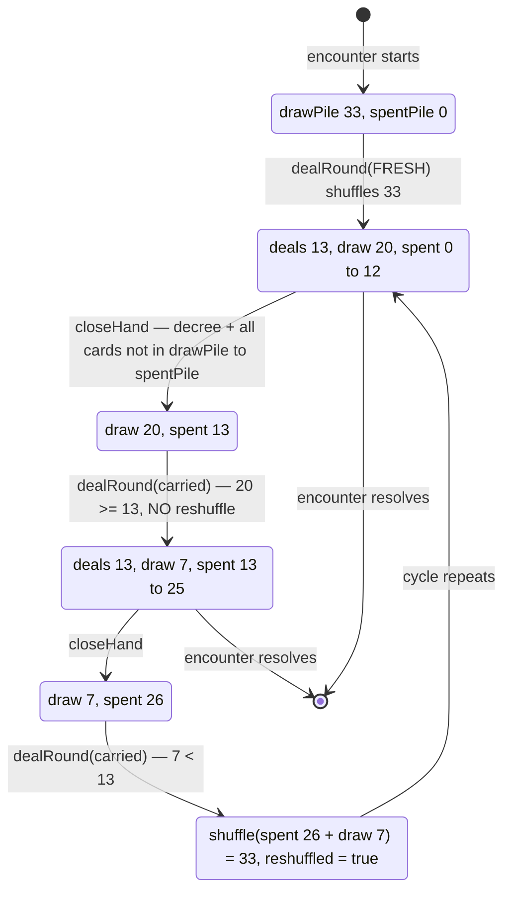

# Plan: Persistent deck across hands — spent pile, pile counts, and one reshuffle per cycle

Plan folder: `.claude/contract/DLR-123-persistent-deck-across-hands/`
Execution status: see `tasks.md` in this folder.

---

## Part 1 — Alignment

### Task reference

Jira **DLR-123** — "Persistent deck across hands: discard pile, pile counts, and one reshuffle per cycle". Story under epic **DLR-103**, labels `engine` / `playable`. Blocks DLR-120 and DLR-121; relates to DLR-122.

Acceptance criteria, verbatim from the ticket:

1. A new encounter shuffles a full 33-card deck. Its first hand deals 6 to the player, 6 to the Quarry, and 1 decree, leaving 20 in the draw pile.
2. The second and subsequent hands of an encounter deal from the same persistent draw pile, not from a re-shuffled deck — a card played in hand one cannot be dealt again in hand two.
3. Cards resolved to a trick move to a face-down discard pile as each trick resolves.
4. The unspent decree joins the discard pile at hand end, so a hand consumes 13 cards. (Stated default — see Dependencies & Risks.)
5. Hand-discards and the Woodcutter's bury continue to go to the **bottom of the draw pile**, not to the discard pile — they stay unseen.
6. When the draw pile holds fewer than 13 cards at the start of a hand, the discard pile is shuffled and becomes the new draw pile before the deal. This is a full reset of what the player knows.
7. The draw pile renders face-down with a live remaining count, visible throughout the hand.
8. The discard pile renders face-down with a live count. Its contents are never inspectable.
9. The reshuffle is explicitly signalled at the moment it happens, and at every other moment it is clear that cards are **not** being reshuffled between hands.
10. Deck, discard pile, and reshuffle state reset at the start of every encounter — a new fight always begins on a fresh 33.
11. Skull assignment continues to run per-deal against the Quarry's 6 dealt cards, unchanged.
12. Determinism holds: a seeded encounter reproduces every deal, every skull, and every reshuffle.

The ticket's Scope Boundaries and Dependencies & Risks sections are treated as binding; the four risks it names (the reversal of DLR-100's settled rule, the naming collision, the Woodcutter's weakening, the invalidated balance measurements) are carried through to Part 2 → Risks and judgement calls rather than re-litigated.

Sprint-run instruction, 2026-08-23: the plan approval gate is auto-approved and every stated default is logged rather than routed to the developer; the browser pass is **not** requested for this invocation.

### Restated goal

Today every hand rebuilds and reshuffles a full 33-card deck, so nothing the player learned in one hand survives into the next. This task moves the deck's lifetime from **hand-scoped to encounter-scoped**: one shuffled 33 is dealt from repeatedly, cards resolved to tricks accumulate face-down in a second pile that is never dealt from, and only when the draw pile can no longer cover a full 13-card deal does everything come back together, get shuffled once, and start again. The player gets two hands of genuine card-counting per cycle and one visible, announced wipe. The felt gains two live counts and a reshuffle notice; the engine gains one new piece of round state and one new pure module; and the deal — which is currently driven by `Math.random()` — becomes seeded off the run's existing `runSeed`, because a reshuffle nobody can reproduce would make DLR-130's balance simulator impossible.

### In scope

- A new pure module `src/warCouncil/encounterDeck.ts` owning the carried deck shape, the hand-close fold, and the reshuffle rule.
- A new required `spentPile: readonly Card[]` field on `RoundState`, written by `dealRound` and grown by `playCard` at each trick's resolution.
- `dealRound` taking an optional carried deck: absent or empty means "new encounter, fresh 33"; present means "deal on from here, reshuffling first if the draw pile cannot cover a deal".
- A new required `reshuffled: boolean` field on `RoundState`, so the felt can announce AC9's moment.
- Seeding the deal: `dealSeedFor(runSeed, encounterIndex, handOfFight)` in `src/hunt/seededRng.ts`, and `App.tsx` switching its three `dealRound(…, Math.random)` calls onto `createSeededRng`.
- A new `src/app/handDeal.ts` holding the driver's one deal-a-hand helper, so `App.tsx` stays inside the 400-line budget.
- A new `DiscardPile.tsx` felt plate rendering the spent count face-down, plus the reshuffle notice, plus the standing "spent cards stay spent" line that satisfies AC9's second half.
- Rewriting every spec that the new required fields or the new deal behaviour legitimately breaks.
- Updating `.docs/game_rules/the-hunt.md` §2 and its Status register, and the affected `.docs/implementation/` module docs, through `implementation-doc-writer`.

### Explicitly out of scope

- Any shop or Vault item that reads, peeks, or manipulates the spent pile — the ticket puts it in a separate ticket.
- Re-running or re-measuring the balance harness. The ticket states the existing PIMC/random measurements are invalidated by this change and that re-tuning happens afterwards.
- Any card-counting aid, auto-tally, running count, or memory assist for the player.
- Changing hand size, deck size, encounter length, skull density, or any tuning value.
- Teaching the CPU to count cards. The ticket accepts that this hands the player an inference edge and the Quarry nothing.
- Fixing `Keepsake`'s unfireability (DLR-111/DLR-124's open defect). Its movement is *reported* below, not repaired.
- Fixing `Ward`'s silver/gold indistinguishability, `buffAccrual.ts`'s missing caller (DLR-125), or the absent `ErrorBoundary` (DLR-131).
- Renaming anything on the `Timebomb` / `CardRank.Poison` collision DLR-122 flagged. It does not obstruct this work.

### Pattern Reference

Supplied by the brief and confirmed on disk:

- `src/warCouncil/deal.ts` — `dealRound`, the function whose contract changes.
- `src/warCouncil/playCard.ts:132-145` — the trick-complete return, the single insertion point for AC3.
- `src/warCouncil/abilities.ts` — `applyWoodcutterDraw`'s stated invariant ("drawPile's length never changes once dealt, for the life of a round") is the property AC5 depends on and this plan preserves.
- `src/warCouncil/discard.ts` — `applyDiscard`, the swap that already sends cards to the draw pile's bottom (AC5's other half).
- `src/hunt/slotMachine.ts:71-80` — `slotSeedFor` / `spinSeedFor`, the exact shape `dealSeedFor` copies.
- `src/hunt/seededRng.ts` — `createSeededRng` (mulberry32) and `mixSeed`; the tree-wide ban on `Math.random()` and the "thread it as a parameter, never module state" convention.
- `src/warCouncil/types.ts:72-85` — `primedCards`' docblock, the precedent for adding a **required, non-optional** field to `RoundState` and writing it in `dealRound` rather than defaulting it on the type.
- `src/app/warCouncil/DecreePile.tsx` — the existing felt plate the new spent plate sits beside, and the source of AC7's already-shipped draw count.
- `src/hunt/encounter.ts` — `shieldHeartsForTier`'s docblock, the precedent for a guard that is unreachable through the shipped API and is kept because it is what makes the guarantee hold.
- `.docs/design/Balatro-Forbidden-Solitaire/v1-buff-card-list.md:504-517` — the `Keepsake` defect statement this plan reports against.

### Constraints flagged on the brief

- **Determinism is the hard constraint.** A reshuffle must be seeded and reproducible. `src/hunt/` and `src/warCouncil/` may not call `Math.random()`; the RNG is threaded as an explicit `rng: Rng` parameter, never read from module state. Grep-verified before planning: the only `Math.random()` call sites in `src/` are `App.tsx` — three for `runSeed` (lines 97, 233, 242) and three passed straight into `dealRound` (lines 101, 145, 247). This plan removes the latter three.
- **No new dependency.** None is needed.
- **Files over 400 lines are blocking, fixed in-ticket.** `App.tsx` is at 369 and `WarCouncilRound.tsx` at 382 — both are near the ceiling and both are in the diff. Measured with `(Get-Content <path>).Count`, never `Measure-Object -Line`.
- **`npm run format` is banned from tasks** (`ae9ee28`). Formatting is `npx prettier --write` scoped to this contract's own files.
- **Component tests query by accessible role and label.**
- **The pure-core boundary** on `src/warCouncil/**` and `src/hunt/**` is lint-enforced: no React import, no DOM global. The new `encounterDeck.ts` and the `seededRng.ts` addition both sit inside it.
- Baseline is **1624 passed of 1624 across 123 files**. This ticket changes the deal, so specs will break legitimately; they get rewritten honestly, never weakened to go green.

### Assumptions made

Every bullet here is a **stated default taken under the sprint run's auto-approval**, not a developer-confirmed choice.

- **D1 — The new pile is called the `spentPile` in code and "Spent" on the felt; nothing existing is renamed.** The ticket requires the "discard" collision be resolved and says one of the two needs renaming. It is resolved at the *new* name rather than the old one: "discard" continues to mean exactly what it already means everywhere in this codebase — the player's swap action — and the new pile takes a word that does not collide. Rationale: renaming the player action instead would touch `DiscardRefusal`'s three **string reason codes**, `DISCARDS_PER_FIGHT`, `MAX_CARDS_PER_DISCARD`, `RunState.discardsRemaining`, `WarCouncilRoundResult.discardsRemaining`, `recordEncounter`'s sixth parameter, `RoundUiState.discardSelection`, `discardHandlers.ts`, four `roundUiState.ts` predicates and their copy — a string-bound rename across ~25 files bundled into a ticket that is already changing where cards come from. Resolving it at the new name achieves the same single-meaning outcome for zero churn. The felt copy already says **"Swap"** for the player action, so the surfaces are consistent without touching a word of it.
- **D2 — The flavour word "Spent" is a placeholder.** Structure is settled here; the noun is the developer's and is listed under Risks.
- **D3 — At a reshuffle the leftover draw pile is folded into the shuffle, not left on top of it.** AC6 says the spent pile "becomes the new draw pile", which leaves the leftover unaddressed; discarding it would lose cards from a 33-card deck, and stacking it on top is a second rule about ordering with no observable difference (those cards were never seen either way). Folding gives one sentence, conserves all 33 by construction, and makes AC6's "full reset of what the player knows" literally true.
- **D4 — The reshuffle threshold is derived, not tuned.** `CARDS_PER_DEAL = HAND_SIZE * 2 + 1` = 13. It is arithmetic over an existing configured value, not a new dial, so it is not a developer decision.
- **D5 — "The deck runs out mid-hand" cannot happen, and the plan enforces that rather than handling it.** The draw pile's length is invariant for the life of a hand: `applyWoodcutterDraw` returns a card for every card it takes, and `applyDiscard` puts the swapped cards on the bottom as it draws the same number off the front. So the only moment a reshuffle can be needed is the deal, which is what "one reshuffle per cycle" means. A spec asserts the invariant.
- **D6 — At hand's end, every card not in the draw pile goes to the spent pile.** This is the general rule of which AC4's decree clause is a case. It covers the Fox exchange (whatever card the Fox left in the decree slot is what gets spent), a hand ended early by a mid-hand cash-out with cards still in hands, and the current trick. One rule, total, and it conserves 33 by construction rather than by three coordinated special cases.
- **D7 — Timebomb marks do not survive a hand boundary and are not carried on a card into the spent pile.** `primedCards` stays hand-scoped exactly as its docblock already states. A mark that rode a card into the spent pile and back out through a reshuffle would be an invisible mark on a face-down card the player could not track — unreadable and unfair. `EncounterState.pendingTimebomb` continues to cross the boundary untouched (DLR-91 D5), which is a different thing and is unchanged.
- **D8 — Banked cards do not exist as a hand-boundary question.** `bank` and `multiplier` are numbers reset per deal and are untouched here; cards taken in tricks are not held anywhere, they go to the spent pile as each trick resolves (AC3).
- **D9 — Skulls are re-rolled, never remembered.** AC11 keeps skull assignment per-deal against the Quarry's 6 newly dealt cards. A card that carried a skull in hand 1 and comes back after a reshuffle is re-rolled from scratch. Consistent with `skulledCards`' existing "written once by `dealRound`" contract.
- **D10 — The deal's seed is `mixSeed(runSeed, encounterIndex, handOfFight)`.** All three already exist on `RunState`; `handOfFight` is 1-based per fight and resets at every fight boundary, and `encounterIndex` separates the fights, so the triple is unique per hand of a run. Mirrors `slotSeedFor(runSeed, machineIndex, visitIndex)` field for field.
- **D11 — `dealRound`'s new deck parameter is optional and trailing.** An absent deck *is* a new encounter. This is the `apCapacity` / `rankTiers` precedent and it keeps every existing `dealRound(dealer, rng)` call in the specs meaning exactly what it meant before — a fresh 33 — so the deal specs do not have to be rewritten to say something they already said.
- **D12 — `handleBeginRun` re-deals.** It currently mints a new run (with a new `runSeed`) but leaves the mount-time `dealt` in place. Harmless while the deal was `Math.random()`; once the deal is seeded off `runSeed` it would mean the opening hand of a run was dealt from a seed that run does not have. AC12 makes fixing it in-scope.
- **D13 — The spent count ticks at the trick's resolution, not when the player dismisses the trick well.** AC3 says "as each trick resolves". The two cards are therefore counted while still visible in `TrickWell`. Deliberate: the count reflects state, and a count that lagged the state would be a second source of truth.

### Config and persisted-shape audit

Performed with `Grep` / `Bash grep` against the real tree on 2026-08-24, at `26b31d4`.

- **Check 1 — configuration keys renamed, retyped or removed: none.** `HAND_SIZE` (`src/hunt/config.ts:331`), `MAX_CARDS_PER_DISCARD` and `DISCARDS_PER_FIGHT` (`:363-364`) are all **read unchanged**. The one new named value, `CARDS_PER_DEAL`, is derived from `HAND_SIZE` inside `src/warCouncil/encounterDeck.ts` and is not a configuration dial. Zero existing keys change name or type.
- **Check 2 — persisted shapes affected: none.** `src/persistence/**` is the only tree that touches `localStorage`, and it persists the **Vault** only. `RunState`'s own docblocks say `coins`, `runSeed`, `handOfFight`, `discardsRemaining`, `buffs` and `rankTiers` are each "NEVER persisted"; `RoundState` is not persisted at all. `grep -rn "spentPile\|drawPile" src/persistence/` returns **0 hits**. Nothing stored on disk can be invalidated by this change — that window is still open, and recording it here is what lets a later ticket know it has closed.
- **Check 3 — type changes checked for loss.** Two **additions** of required fields to `RoundState` (`spentPile: readonly Card[]`, `reshuffled: boolean`); no widening, no narrowing, no `number`→`string`, no array→object, no required→optional. `dealRound`'s signature gains a **trailing optional** third parameter, so every existing call is still well-typed and still means what it meant (D11). The failure mode for an *added required field* is exactly Step 1.6 check 7's, handled below.
- **Check 4 — consumers of changed exported constants or predicates.** No exported constant or predicate changes meaning. `dealRound` has **6 call sites** outside its own module (`src/App.tsx` ×3 at lines 101, 145, 247; `src/app/warCouncil/__tests__/roundReducer.test.ts:143`; `src/app/warCouncil/__tests__/WarCouncilRound.duelHealthBars.test.tsx` ×2 at lines 46 and 253), plus **13 further call sites inside `src/warCouncil/__tests__/`** (`deal.test.ts` ×9, `cpuPlayer.test.ts` ×3, `playCard.test.ts` ×2, `quarryIntent.test.ts` ×1, `timebomb.test.ts` ×1 — 16 lines matching, several sharing a line). Every one of them passes exactly two arguments and therefore keeps compiling under D11.
- **Check 5 — names align across the chain.** `spentPile` binds nowhere by string: it is a TypeScript field read only through the type. The two **string-bound** names this ticket adds are the new `data-testid`-free accessible labels on the spent plate, which the component spec queries **by accessible role and label**, so the label text in `src/app/warCouncil/labels.ts` and the query in the spec are the pair that must agree — they are introduced in one task. No CSS class is renamed; the two new ones (`wc-spent`, `wc-reshuffle-note`) are new.
- **Check 6 — architectural boundary not crossed.** `src/warCouncil/encounterDeck.ts` and the `src/hunt/seededRng.ts` addition are both pure: no React import, no `window`/`document`/`localStorage`, RNG threaded as a parameter. The ESLint pure-core override in `eslint.config.js` already covers `src/warCouncil/**` and `src/hunt/**` by glob, so both new/edited files are protected without touching the config. `npm run lint` is the enforcement.
- **Check 7 — construction sites of the changed shape, counted by field rather than by type name.**
  - `RoundState`: **70 annotated sites** (`grep -rn "RoundState" src/ | wc -l`), **13 construction sites, 12 of them in specs** (`grep -rn "dealer:" src/ --include=*.ts --include=*.tsx` minus the type declaration at `types.ts:62` and the parameter at `deal.ts:15`). **13 is the real number** and every one is in a task's `**Files:**` block:
    1. `src/warCouncil/deal.ts:23` (production — the one that writes the new fields)
    2. `src/app/warCouncil/__tests__/roundFixture.ts:17`
    3. `src/warCouncil/__tests__/abilities.test.ts:7`
    4. `src/warCouncil/__tests__/cpuPlayer.test.ts:26`
    5. `src/warCouncil/__tests__/discard.test.ts:10`
    6. `src/warCouncil/__tests__/legalMoves.test.ts:10`
    7. `src/warCouncil/__tests__/legalMovesQuarry.test.ts:7`
    8. `src/warCouncil/__tests__/playCard.test.ts:18`
    9. `src/warCouncil/__tests__/playCard.timebomb.test.ts:16`
    10. `src/warCouncil/__tests__/quarryIntent.test.ts:18`
    11. `src/warCouncil/__tests__/rankTiers.resolution.test.ts:316`
    12. `src/warCouncil/__tests__/types.test.ts:6`
    13. `src/warCouncil/__tests__/voluntaryCashOut.test.ts:26`

    The cross-check the trap calls for: grepping a partial field instead finds *more* files but *fewer complete literals* — `primedCards:` matches 21 lines across 19 files and `tricksPlayed:` matches 30 lines across 24 files, because most of those are `{ ...base, tricksPlayed: 3 }` spread-overrides which need no change. Grepping the type name alone (70) would have over-counted; grepping only `roundFixture.ts` (the "obvious" fixture) would have found **1 of 13**.
  - `EncounterDeck` (new): **2 construction sites**, both production — `FRESH_ENCOUNTER_DECK` in `encounterDeck.ts` and `closeHand`'s return.
  - `RoundUiState` / `RoundUiSeed`: **0 construction sites change.** `RoundUiState.round` holds a whole `WarCouncilState`, so both new counts and the reshuffle flag reach the felt through the field that already exists. This is the single largest reason the diff is as small as it is, and it was confirmed by reading `roundUiState.ts:76-198` rather than assumed.
- **Arithmetic check.** The counts above are quoted from command output, not estimated: `RoundState` 70 / 13, `dealer:` grep 14 lines of which 2 are the declaration and the parameter, `primedCards:` 21, `tricksPlayed:` 30, `dealRound` outside its module 6 non-spec call sites, `Math.random()` 6 call sites in `src/` all in `App.tsx`, `spentPile|drawPile` in `src/persistence/` 0.

---

## Part 2 — Technical design

### Approach

**The deck becomes a value that survives the round state that consumes it.** A new pure module, `src/warCouncil/encounterDeck.ts`, owns a two-field `EncounterDeck { drawPile, spentPile }` and three functions: `FRESH_ENCOUNTER_DECK` (both piles empty — the "new encounter" value), `closeHand(state): EncounterDeck` (the hand-boundary fold), and `dealPileFor(deck, rng): { drawPile, reshuffled }` (the reshuffle rule). `dealRound` gains a trailing optional `deck` parameter and, when it is absent or holds no cards at all, builds and shuffles a fresh `createDeck()` — so the "new encounter" path and the "carry on" path are one function with one branch rather than two functions that can drift.

The alternative considered and rejected was **putting the deck on `EncounterState` in `src/hunt/`**. It reads well — the deck is encounter-scoped and `EncounterState` is the encounter — but `src/hunt/` cannot import `src/warCouncil/`'s `Card` without a cycle (`buffs.ts:76-77` and `slotWeights.ts:8-10` both record why the reverse edge is forbidden), so it would mean either restating the card type in `hunt` or inverting a deliberate dependency. The second alternative, **a `useState` in `App.tsx` holding the carried deck**, was rejected for a better reason: it is unnecessary. The carried deck is a pure function of the finishing hand's final state, and `handleComplete` already has that state in hand — so `closeHand(result.finalState)` produces it at exactly the moment it is needed, and there is no fourth piece of driver state to keep in step with the other three. The reset for AC10 then falls out structurally: every path that starts an encounter passes `FRESH_ENCOUNTER_DECK`, and the only path that passes anything else is the one that continues a fight.

**AC3's insertion point is a single expression.** `playCard` already has one place where a trick becomes two cards that are no longer anywhere — the `currentTrick: []` in its trick-complete return at `playCard.ts:132-145`. Appending the completed trick's two cards to `spentPile` there means the pile grows exactly when a trick resolves and cannot grow at any other time. Nothing else in the engine writes it; `dealRound` seeds it and `closeHand` reads it.

**AC5 is preserved by not touching it.** `applyWoodcutterDraw` and `applyDiscard` both already put cards on the *bottom of the draw pile*, and both keep `drawPile.length` invariant across the call. That invariant is what makes D5 true — the draw pile cannot shrink mid-hand, so a reshuffle can only ever be needed at a deal — and it is what keeps the Woodcutter's bury and the player's swap out of the spent pile without either function changing a line. A spec pins it, because a future mutator that broke the pairing would silently reintroduce a mid-hand exhaustion.

**Determinism is closed at the driver.** `src/hunt/seededRng.ts` gains `dealSeedFor(runSeed, encounterIndex, handOfFight)`, three lines built on `mixSeed`, shaped exactly like `slotMachine.ts`'s `slotSeedFor`. `App.tsx` stops passing `Math.random` into `dealRound` and passes `createSeededRng(dealSeedFor(...))` instead. Because the reshuffle happens *inside* `dealRound`, under that same injected generator, seeding the deal seeds the reshuffle with it — there is no second RNG to remember to seed and no place a `Math.random()` could be added by reflex without failing the pure-core lint rule. `Math.random()` survives in `App.tsx` for `runSeed` alone, which is the one call site the project already sanctions.

**The felt gains one plate and one line of copy.** `RoundUiState.round` is the whole `WarCouncilState`, so `ui.round.drawPile.length`, `ui.round.spentPile.length` and `ui.round.reshuffled` are all readable at the render site with no reducer action, no new UI state, and no change to `RoundUiSeed` — the ticket's UI half costs a new presentational component and six lines of JSX in the felt rail. `App.tsx` is at 369 lines and `WarCouncilRound.tsx` at 382, so the driver's deal logic is extracted into `src/app/handDeal.ts` rather than inlined, and the new plate is its own file rather than more JSX in the felt; both files are re-measured with `(Get-Content <path>).Count` in Final verification.

### Skills to invoke during execution

- `react-frontend` — owns everything under `src/`: the pure-module placement, the component shape, the configuration-driven values, and the Vitest posture. Governs every code task in this contract.
- `game-ux` — owns the felt's layout and information density. Applies to the one task that adds the spent plate and the reshuffle notice to the felt rail: what a face-down count needs to communicate and where it sits relative to the decree pile.
- `implementation-doc-writer` — owns `.docs/implementation/**` and `.docs/game_rules/the-hunt.md`. This ticket reverses DLR-100's settled "no discard pile, no reshuffle" rule, so §2 and the Status register must be updated by this skill and never by hand.
- `management-jira` — owns the ticket's status transitions.

Shared rules: `.claude/rules/` was scanned via `Glob .claude/rules/*.md`. It contains `README.md` and `save-data-versioning.md`; the latter governs `src/persistence/**`, which the audit's check 2 confirmed this ticket does not touch (0 hits). Read it anyway before any task that would reach a stored shape — none does.

Always read: `.claude/workflow/web-project.md`.

No developer override was applied — this contract runs non-interactively under the sprint run, so `/fb-plan` Step 1.5c's confirmation call was not presented.

### Diagram



### Data shapes

#### New — `src/warCouncil/encounterDeck.ts`

```ts
import type { Card } from './types'

/** Cards per deal: two hands and the decree. DERIVED from `HAND_SIZE`, not a configuration
 *  dial — it is what one hand costs, and it is the reshuffle threshold by definition. */
export const CARDS_PER_DEAL: number // = HAND_SIZE * 2 + 1 = 13

/** What one encounter carries between its hands. `drawPile` is dealt from the FRONT; `spentPile`
 *  is never dealt from at all until a reshuffle folds it back in. */
export interface EncounterDeck {
  readonly drawPile: readonly Card[]
  readonly spentPile: readonly Card[]
}

/** A new encounter: no cards carried, so `dealRound` builds and shuffles a fresh 33. */
export const FRESH_ENCOUNTER_DECK: EncounterDeck

/** D6 — at hand's end EVERY card not in the draw pile joins the spent pile: the decree (AC4),
 *  both hands, and anything still on the table. Total by construction, so all 33 are conserved. */
export function closeHand(state: RoundState): EncounterDeck

/** AC6 — the draw pile a deal will come off, plus whether a reshuffle produced it. Reshuffles
 *  exactly when `drawPile.length < CARDS_PER_DEAL`, folding the leftover draw pile INTO the
 *  shuffle (D3). THROWS when the two piles together cannot cover a deal — unreachable through the
 *  shipped driver with a 33-card deck, and kept because it is what makes that guarantee hold. */
export function dealPileFor(
  deck: EncounterDeck,
  rng: Rng,
): { readonly drawPile: readonly Card[]; readonly reshuffled: boolean }
```

#### Modified — `src/warCouncil/types.ts` → `RoundState`

```ts
  /** AC3 — cards resolved to a trick, face-down and never inspectable. Grows by two at each
   *  trick's resolution and by nothing else. Seeded by `dealRound` from the carried deck. */
  readonly spentPile: readonly Card[]
  /** AC9 — whether THIS hand was dealt from a reshuffle. Written once by `dealRound`, read only
   *  by the felt's notice. Hand-scoped: the next deal rewrites it. */
  readonly reshuffled: boolean
```

Both **required**, following `primedCards`' stated precedent — `RoundState` stays a total shape with no optional field a reader can forget.

#### Modified — `src/warCouncil/deal.ts`

```ts
export function dealRound(
  dealer: PlayerSide,
  rng: Rng,
  /** The encounter's carried deck. ABSENT or empty = a new encounter, so a fresh 33 is built and
   *  shuffled (AC1/AC10). Trailing and optional so every existing two-argument call still means
   *  exactly what it meant. */
  deck?: EncounterDeck,
): RoundState
```

#### Modified — `src/warCouncil/playCard.ts`

The trick-complete return gains one field: `spentPile: [...next.spentPile, lead.card, follow.card]`.

#### New — `src/hunt/seededRng.ts`

```ts
/** DLR-123 AC12 — the seed for one hand's deal AND its reshuffle. The triple is unique per hand
 *  of a run: `encounterIndex` separates the fights, `handOfFight` the hands within one. Shaped
 *  exactly like `slotMachine.ts`'s `slotSeedFor`. */
export function dealSeedFor(
  runSeed: number,
  encounterIndex: number,
  handOfFight: number,
): number
```

#### New — `src/app/handDeal.ts`

```ts
/** The driver's ONE deal-a-hand call. Exists as a module rather than inline in `App.tsx` so that
 *  file stays inside the 400-line budget, and so the seed derivation is unit-testable without a
 *  renderer. */
export function dealHand(
  run: RunState,
  handNumber: number,
  carried: EncounterDeck,
): WarCouncilState
```

#### New — `src/app/warCouncil/DiscardPile.tsx`

```ts
interface DiscardPileProps {
  readonly spentCount: number
  /** AC9 — true only for a hand dealt from a reshuffle. */
  readonly reshuffled: boolean
}
```

#### New — `src/app/warCouncil/labels.ts` entries

```ts
export const SPENT_PILE_LABEL: string          // 'Spent'
export function spentCountText(n: number): string       // '13 spent'
export const SPENT_STANDING_NOTE: string       // 'Spent cards stay spent'
export const RESHUFFLE_NOTE: string            // 'Reshuffled — the deck is fresh'
```

#### New — CSS classes

`wc-spent` and `wc-reshuffle-note` in `src/app/warCouncil/warCouncilTable.css` (180 lines, ample budget). No existing class renamed.

No configuration key, no `package.json`, no `tsconfig`, no `vite.config`, no dependency change.

### Runtime quality notes

- **Purity and adjudication.** Every rule this ticket adds is in `src/warCouncil/encounterDeck.ts`, `deal.ts` and `playCard.ts` — DOM-free, React-free, unit-testable with no renderer, inside the lint-enforced pure-core boundary. `DiscardPile.tsx` decides nothing: it takes a number and a boolean and renders them. `WarCouncilRound.tsx` reads three fields off state and passes them down; it computes no pile arithmetic. The one derived number, `CARDS_PER_DEAL`, is computed from `HAND_SIZE` rather than written as `13` anywhere, and Final verification greps for a bare `13` to prove it.
- **Effects, mount and teardown.** No effect is added anywhere. `App.tsx` holds none today and gains none: every transition is a callback fired from a control, so there is no listener, observer, timer, `requestAnimationFrame` or `AbortController` to release. `DiscardPile` is a pure function component with no state and no effect. StrictMode's development double-mount re-runs only the lazy `useState` initialisers, and `dealHand` is pure, so the second invocation recomputes an identical hand rather than dealing a different one — which is a property the seeded RNG now guarantees and `Math.random()` previously did not. No module-level mutable state is introduced; the RNG is a parameter throughout.
- **Hot-path cost.** Nothing here runs per pointer event. `closeHand` allocates one array per hand — six times an encounter at most. `dealPileFor` runs one Fisher–Yates pass over at most 33 elements, once per hand, and only actually shuffles on the ~1-in-3 hand that triggers a reshuffle. `playCard`'s spent-pile append allocates a ≤26-element array once per trick. Every search in `encounterDeck.ts` is bounded by the 33-card deck. No memoisation is added and none is warranted; there is no profiling evidence and the work is trivially small.
- **Determinism and numeric safety.** The seed path is `App.tsx` → `dealSeedFor(run.runSeed, run.encounterIndex, run.handOfFight)` → `createSeededRng` → `dealRound` → `shuffle` and `assignSkulls`. No `Math.random()` is reachable from `dealRound` or anything it calls once `App.tsx`'s three call sites change, and the pure-core ESLint override makes reintroducing one a lint failure rather than a silent regression. There is **no division anywhere in the new code**, so no epsilon is needed and no `NaN` can be produced; the only arithmetic is integer addition, `Math.floor` inside the existing `shuffle`, and length comparisons. `mixSeed` returns a non-negative 32-bit integer by construction, so `createSeededRng`'s documented `NaN`/`Infinity` collapse is unreachable from this path.
- **Error paths.** `dealPileFor` **throws** a `RangeError` naming both pile sizes and the shortfall when the combined deck cannot cover a deal. It is unreachable through the shipped driver — the conservation invariant makes the draw pile at a hand's start exactly 33, 20 or 7, and 7 triggers a reshuffle back to 33 — and it is kept for `shieldHeartsForTier`'s stated reason: the guard is not dead code, it is the check that makes the guarantee hold. It is reached only from a genuine driver bug or a hand-built spec fixture, and a spec proves it fires. Nothing is swallowed into a success shape: there is no `catch`, no default-deck fallback, and no path that returns a short draw pile and lets `dealRound` produce `undefined` cards. This does mean an escaping throw would blank the screen, because `src/` has no `ErrorBoundary` (DLR-131, out of scope) — which is exactly why the guard is placed on a path the driver cannot reach rather than inside an event handler's commit. There is no new async surface, so there are no async states to enumerate.

### Risks and judgement calls

- **This reverses a rule DLR-100 settled.** DLR-100 settled "discards go to the bottom of the pile; no discard pile, no reshuffle". This ticket keeps the first clause and overturns the second. The reversal is the ticket's explicit intent, not a silent overturn, and `the-hunt.md` §2 plus its Status register are updated through `implementation-doc-writer` in Phase 5.
- **The flavour word "Spent" is the developer's to overrule.** The structure is settled; the noun is copy judgement. Changing it later is one entry in `labels.ts` and two CSS class names.
- **Existing balance measurements are invalidated and are not re-measured here.** PIMC at ~49% and random at ~10% were both measured under reshuffle-every-hand. This hands the player a large hand-two inference edge and hands the Quarry nothing, because the CPU does not count cards. Encounter tuning must be re-measured after this lands.
- **The Woodcutter's bury genuinely weakens, and that is accepted rather than fixed.** Hand two's draw pile is 7 cards, so a buried card is very likely to come back next deal. The ticket names this and accepts it.
- **`Keepsake` does not move, but it becomes decidable.** It stays unfireable at the same rate — zero in any hand that runs its full six tricks, because the player's hand is empty by then and this ticket does not change hand size or trick count. What changes is that "hand's end" stops being an implicit component remount and becomes a modelled event with an explicit state transition (`closeHand` folding the decree and both hands into the spent pile). The three candidate fixes the design doc lists — a reworded condition, a different end-of-hand instant, or deleting the three rows — are now expressible against a real boundary. Still the developer's call; this contract invents no replacement.
- **The rank-conditioned families (`Mark of the R`, 22 of 71 pooled templates) keep their mean and lose their independence.** Each rank has 3 copies in 33. Old rule: each hand independently dealt 13 of 33, so a given rank appeared with probability 1 − C(30,13)/C(33,13) = 1 − 0.209 = **0.791 per hand**, every hand alike. New rule: hands one and two together deal 26 of the 33, so the expected number of a rank's copies across the cycle is 3 × 26/33 = **2.36 either way — the mean is unchanged**. What changes is the conditioning: a rank whose three copies all landed in hand one is now **impossible** in hand two, where before it was still 79%. So rank-conditioned buffs become negatively autocorrelated across a cycle — more swingy hand to hand, identical in expectation over the cycle. Whether that variance is wanted is a design read for the developer's balance pass.
- **`Whetstone` is untouched.** Its bank-climb bonus is paid per trick and the number of tricks per hand (6) and hands per encounter (~3.3) are both unchanged. It sees the same number of cards per encounter as before; only *which* cards changes.
- **The slot machine is untouched and was checked, not assumed.** `expectedCardsPerPull()` = 2.640625 comes from `src/hunt/slotOdds.ts` over `slotWeights.ts`, which draws from a reel pool of buff templates and has no contact with `createDeck`, `shuffle` or any `Card`. DLR-112's odds are unaffected. Final verification re-runs `src/hunt/__tests__/slotOdds.test.ts` to prove it rather than asserting it.
- **`cardDamage.ts`'s preview cannot lie, and was checked.** It builds no `RoundState`; it builds a `TrickFacts` from `bank`, `multiplier`, `skulledCards`, `primedCards`, `currentTrick` and `tricksPlayed`, and hands a hypothetical resolution to the real `applyResolution`. None of those six fields changes meaning here, and the preview never reads `drawPile` or `spentPile`. A different deal changes *which cards are in hand*, which is exactly what the preview is supposed to reflect.
- **The `Unassigned` trap is not reachable from this diff.** No buff filtering is written; `offeredBuffs(state)` / `isPricedBuff` / `activatableBuffs` are neither called nor duplicated. Recorded because the trap has been hit three times.
- **The `Timebomb` / `CardRank.Poison` name collision DLR-122 flagged does not obstruct this work.** Nothing here is renamed on that axis.
- **No `ErrorBoundary` exists anywhere in `src/`** (DLR-131 — 72 throw sites, 0 boundaries). The one new throw is placed where the driver cannot reach it; no throw is added to any event-handler commit path.
- **Behaviours only the developer can judge by playing:** whether one reshuffle per fight is the right cadence or feels like it arrives too early; whether the spent count is legible enough at a glance without becoming a card-counting aid the ticket forbids; whether the reshuffle notice is loud enough to register and quiet enough not to interrupt; and whether the two-hands-of-real-tracking shape is actually fun.
