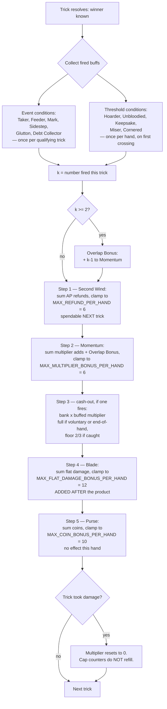

# Plan: Cost the passive buff-stacking resolution rule

Plan folder: `.claude/contract/DLR-124-cost-the-passive-buff-stacking-rule/`
Execution status: see `tasks.md` in this folder.

---

## Part 1 — Alignment

### Task reference

**Jira DLR-124** — "Design: cost the passive buff-stacking resolution rule". Task under epic DLR-103
("Version 5 — Buff Loadout, Slot Draws, and Delayed Apply Damage"). Label `design`.

Problem statement (verbatim from the ticket): a proposal for a hand-wide resolution rule where,
whenever more than one equipped buff's condition fires on the same play, their individual rewards are
summed, then the sum is multiplied by the number of buffs that fired. Recorded in
`.docs/design/Balatro-Forbidden-Solitaire/ideas.md`, Raw section.

Acceptance criteria, verbatim:

1. The multiplier basis is decided and stated: count of buffs that fired (linear), or count of
   co-triggering pairs (combinatorial) — these scale very differently and the choice is not yet made.
2. A cap decision is made: either the escalation is capped (with a named, retunable constant,
   matching this project's convention for AP-refund and similar), or an explicit reason is recorded
   for why an uncapped jackpot moment is the intended feel.
3. The growth curve is checked against at least the worked table already computed in `ideas.md`
   (2 buffs → 12, 3 buffs → 36, 5 buffs → 125 at average reward values) and a verdict recorded:
   adopt, adopt with the cap from AC2, or reject.
4. If adopted: DLR-111's excluded synergy templates (`for every other buff active this hand`,
   `if you also hold a gold-tier card`, `if bank ≥ 2× multiplier`) and the co-trigger combo template
   are each explicitly reconciled against this rule — superseded, kept alongside it, or still
   excluded for an independent reason — not left ambiguous.
5. The decision is written to `.docs/design/Balatro-Forbidden-Solitaire/ideas.md`, moving this entry
   out of Raw into Worth costing or Promoted/Rejected per that file's own status vocabulary.

**Scope boundaries, verbatim.** In scope: deciding the stacking rule's mechanics, its cap (or lack of
one), and reconciling it against DLR-111's excluded synergy/combo templates. Out of scope: any code —
this is a content/design decision ticket.

**Sprint-run dispatch override, 2026-08-23.** This ticket runs unattended, ahead of DLR-108 and
DLR-125, which both consume the rule. `CLAUDE.md`'s tuning-value pause is explicitly overridden for
this run: every number must be chosen and justified rather than deferred, and every choice flagged for
developer review. The dispatch additionally requires the rule to state **order of resolution**,
**how same-axis rewards combine**, **whether a cap applies and at what number**, and **what happens
when two buffs contradict each other** — a wider surface than the ticket's own five ACs.

### Restated goal

Turn a one-paragraph parking-lot idea into a decided, numbered, hand-wide resolution rule for what
happens when several passive buffs fire on the same trick — and write that rule into the design
treatment so DLR-108 and DLR-125 can build against it. The ticket asks whether "sum the rewards, then
multiply by the count that fired" should ship; the honest answer requires first noticing that the
proposal has no well-defined arithmetic (the four reward axes are incommensurate quantities), then
deciding the rule that actually resolves an overlap: per-axis, in a fixed order, additively, under
named per-hand caps, with a stated firing cadence and a stated contradiction rule. The deliverable is
three edited design documents and no code.

### In scope

- A decided resolution rule covering: per-axis separation, combination within an axis, the four-step
  resolution order per trick, the firing cadence (event conditions vs threshold conditions), and the
  contradiction rule.
- The multiplier-basis decision required by AC1, with the rejected alternative argued against.
- Four named, retunable per-hand cap constants (AC2), each with its own one-line derivation.
- A verdict on the `ideas.md` growth table (AC3), checked against the game's actual damage scale.
- Explicit reconciliation of v1-buff-card-list.md templates #13, #14, #15 and #16 (AC4).
- A fully worked example on a realistically stacked 11-AP loadout across a six-trick hand, with the
  unbuffed baseline and the rejected-rule counterfactual computed beside it.
- The `ideas.md` entry moved out of Raw per that file's vocabulary (AC5).
- A "developer must decide" register naming every agent-chosen number.

### Explicitly out of scope

- Any change under `src/`. No `BuffKind` widening, no `apCost` field, no `config.ts` key — those are
  DLR-108's and DLR-112's, and this document only states the values they should be created with.
- Editing `.docs/game_rules/the-hunt.md`. That file is owned by `implementation-doc-writer` and
  records shipped rules; nothing here ships.
- Re-opening DLR-111's decided v1 pool — the 78 templates, their reward pairings, their AP costs, and
  the reward master tier list all stand. This ticket only resolves how several of them interact.
- Un-deferring Long Fall (template #8), which is blocked on a UI answer, not on this rule.
- Designing the UI that shows a stacked resolution to the player. Flagged as a follow-up, not built.

### Pattern Reference

- `.docs/design/Balatro-Forbidden-Solitaire/hybrid-design.md` §5 "Escalation" — the section that owns
  buffs and the section this rule joins. House style: state a position, bury the discarded branch.
- `.docs/design/Balatro-Forbidden-Solitaire/ideas.md` — its own three-status vocabulary (Raw / Worth
  costing / Promoted / Rejected) and its stated rule that a Promoted entry owes the
  `hybrid-design.md` section it became, and a Rejected one owes the reason it died.
- `.docs/design/Balatro-Forbidden-Solitaire/v1-buff-card-list.md` — the 78-template list this rule
  must resolve; its "The cost model" section is the model for how an agent-chosen number is presented
  (a blockquote naming the override, then the formula, then the derivation per row).
- `.docs/game_rules/the-hunt.md` §7 — the bank, the streak multiplier, the `n × n` table, the
  Whetstone table, and Apply Damage. This is the arithmetic every number below is checked against and
  is cited rather than reproduced.
- `src/hunt/config.ts` — read for the live constants the arithmetic depends on:
  `PLAYER_START_HEALTH = 10`, `DAMAGE_PER_HIT = 1`, `HAND_SIZE = 6`, `STARTING_AP = 6`,
  `AP_REFRESH_CADENCE = PerHand`, `COINS_PER_ENCOUNTER_WIN = 1`, `ORDINARY_HEALTH_BASE = 10`,
  `ORDINARY_HEALTH_STEP = 4`, `BOSS_HEALTH_MULTIPLIER = 1.5`.

### Constraints flagged on the brief

- **A rule that reads "to be decided in playtesting" is a failed ticket.** Every number gets chosen.
- **The worked example is the deliverable's centre of gravity** — the developer's stated convention is
  that a worked example in the doc beats prose.
- **The degenerate corners must be attacked, not noted.** Mark-of-the-rank is 22 templates deep and
  the dispatch names it specifically as a plausible multi-stack.
- **Every agent-chosen number is flagged for developer review**, following the precedent
  `v1-buff-card-list.md` set for the AP cost model and `MAX_REFUND_PER_HAND = 6`.
- **Docs-only.** No `src/` path in the file map, so per the run's standing precedent the reviewer trio
  is not dispatched — but all four gates still run and are reported.

### Assumptions made

- **The proposal's arithmetic is undefined as written, and saying so is in scope rather than a
  scope expansion.** The four reward axes (flat damage, coins, AP, multiplier) are incommensurate
  units; "sum the rewards" produces a category error before any multiplier is applied. The ticket
  asks for the rule to be costed, and a rule that cannot be evaluated cannot be costed — so the plan
  treats fixing the arithmetic as the first obligation, not as an optional finding.
- **A buff activated for a hand stays live for the rest of that hand.** `version-5-developer-idea.md`
  §1 says buffs are activated "for that hand" and that Apply Buff reopens before every trick; nothing
  says an activation expires after one trick. This is load-bearing — it is what makes repeat-firing
  possible and therefore what makes a cap necessary.
- **The realistic simultaneous-buff ceiling is set by AP, not by a slot count.** No loadout slot limit
  exists anywhere in the design or the code (grepped: zero hits for `LOADOUT`/`EQUIP_SLOTS`/
  `loadout` under `src/`). The bound is `STARTING_AP = 6`, or 11 once the shop's `+5 AP` capacity item
  is bought, against a cheapest activation of 1 AP. All arithmetic uses 11 as the worst case.
- **Momentum is applied before the bank cashes and Blade after it.** Not stated anywhere yet, but it
  is forced by `v1-buff-card-list.md`'s own cost model, which prices multiplier above flat damage
  *because* the bank cashes as a product. Any other order contradicts a shipped costing decision.
- **The Overlap Bonus lands on the Momentum axis, not Blade.** Blade is flat and bounded by nothing
  the player did; Momentum is bounded by the bank, which is bounded by tricks taken. Putting the bonus
  on the axis that already has a natural ceiling is what makes it capable of feeling like a jackpot
  without being able to run away.
- **`Bells`, `Keys` and `Moons` are the three suits and ranks run 1–11**, per `v1-buff-card-list.md`'s
  naming section — used to construct the worked example's hand.
- **The deliverable is three files, not a new one.** `ideas.md` owns AC5's status move,
  `hybrid-design.md` owns the argued rule (per `ideas.md`'s own statement that a Promoted entry owes
  the design section it became), and `v1-buff-card-list.md` owns AC4's reconciliation because that is
  where templates #13–16 are recorded. A fourth standalone document would give each fact a second
  home, which is exactly what `CLAUDE.md`'s single-source-of-truth rule forbids.
- **Non-interactive session.** Per the sprint-run dispatch, the Step 1.5c skill-confirmation call and
  the Step 3 approval gate are not presented; the plan's own stated defaults are taken and recorded.

### Config and persisted-shape audit

- **Configuration keys renamed, retyped or removed: none.** This contract writes no TypeScript and
  changes no key. The four cap constants it *names* (`MAX_MULTIPLIER_BONUS_PER_HAND`,
  `MAX_FLAT_DAMAGE_BONUS_PER_HAND`, `MAX_COIN_BONUS_PER_HAND`, and the existing
  `MAX_REFUND_PER_HAND`) are stated as design-document figures for DLR-108 to create, exactly as
  `v1-buff-card-list.md` states `MAX_REFUND_PER_HAND = 6` today.
- **Existence check, run before naming them.** `Grep` for `MAX_REFUND_PER_HAND|MAX_MULTIPLIER_BONUS|
  MAX_FLAT_DAMAGE_BONUS|MAX_COIN_BONUS` returns **58 hits across 8 files and not one of them is under
  `src/`** — none of the four exists in code yet, so none can be broken by naming it here. The only
  three of the four that exist at all are `MAX_REFUND_PER_HAND`'s mentions, and its only *design*
  home is `.docs/design/Balatro-Forbidden-Solitaire/v1-buff-card-list.md` (7 hits), which this
  contract edits — so the three new constants join it in the one design file it already lives in. The
  remaining hits are this plan, the sprint log, and three archived DLR-111/DLR-103 contract files,
  none of which is a source of truth.
- **Loadout-size check.** `Grep` for `LOADOUT|EQUIP_SLOTS|loadout` under `src/` returns **zero hits
  across zero files**, confirming the assumption that AP is the only bound on how many buffs can be
  active at once.
- **Persisted shapes affected: none.** `src/persistence/` is untouched and nothing on the buff list is
  written to storage yet — `v1-buff-card-list.md` already records that this window is open and closes
  the moment DLR-112 writes a drawn buff into a save. This contract does not close it.
  `.claude/rules/save-data-versioning.md` was read; its reject conditions all key on a change to a
  persisted record's shape or version, and this contract makes none.
- **Type changes: none.** The `BuffKind` / `BuffRewardAxis` / `BuffCondition` / `Buff` shape gaps that
  `v1-buff-card-list.md` §"Code-shape alignment" records are restated by reference only. This contract
  adds one further note to that section — that the resolution rule needs a per-hand accumulator, which
  is state on the hand and not a field on `Buff` — and changes no type.
- **Consumers of a changed exported constant or predicate: none, because none changes.**
- **Name alignment across the chain.** The four axis names used by the rule (Blade, Purse, Second
  Wind, Momentum) are transcribed verbatim from `v1-buff-card-list.md`'s reward-suffix table, and the
  eleven family words from its family-word table, so the rule and the card list bind by the same
  vocabulary. Verified by reading both tables at planning time.
- **Architectural boundary: not crossed.** No file under `src/` is in the file map, so the
  `src/warCouncil/**` + `src/hunt/**` pure-core ESLint override cannot be affected.

---

## Part 2 — Technical design

### Approach

The work is a design decision written into three existing documents, so the "technical" shape is an
argument's shape rather than a module's. The argument runs in four moves, and the order matters
because each move is what makes the next one available.

**Move one — show the proposal has no arithmetic.** `ideas.md`'s worked table quietly assumes each
buff pays a single scalar ("avg reward each: 3, 4, 5"). No such quantity exists: a fired buff pays on
exactly one of four axes — Blade (flat damage), Purse (coins), Second Wind (AP), Momentum (multiplier)
— and these are four different units. Summing `+5 damage`, `+10 coins` and `3 AP` into `18` is a
category error, and every figure in the 2→12 / 3→36 / 5→125 table inherits it. So the ×count rule is
rejected on definition before it is ever rejected on magnitude. The alternative shape considered here
was to salvage the proposal by declaring one canonical axis for the multiplier to act on; it is
rejected because it would silently re-price every non-canonical card on the 78-card list against a
cost model that was derived per-axis.

**Move two — replace it with a per-axis additive rule and a fixed resolution order.** Contributions
combine *within* an axis and never across one; within an axis they **add**. Multiplication is rejected
because the Momentum axis feeds a cash-out that is already a product (`bank × multiplier`), so a
multiplicative Momentum is cubic in the thing the shop sells. "Take the highest" is rejected because
it makes a second card on an axis worth exactly nothing, which makes a wide loadout strictly worse
than a tall one and deletes the point of the loadout system this epic exists to build. The order is a
four-step per-trick pipeline — Second Wind, then Momentum, then the cash-out product, then Blade, then
Purse — and it is not a preference: putting Momentum before the product and Blade after it is the only
order consistent with `v1-buff-card-list.md`'s cost model, which prices multiplier above flat damage
precisely because one gets multiplied by the bank and the other does not.

**Move three — bound it, and prove the bound is the containment.** The genuinely dangerous case is not
the one the ticket names. It is a persistent suit-Taker on the Momentum axis re-firing on every trick
it wins: a gold `Bell-Taker (Momentum)` at 6 AP plus a gold `Mark of the 9 (Momentum)` at 4 AP is a
10-AP loadout that, on a hand holding four Bells, reaches a multiplier of 31 against a bank of 6 —
**186 damage**, more than Diarmuid's 135, on hand one. Four named per-hand caps contain it, each
derived rather than picked: `MAX_MULTIPLIER_BONUS_PER_HAND = 6` (= the natural six-trick multiplier
ceiling, so bought multiplier can at most *double* the earned one — the identical reasoning that set
`MAX_REFUND_PER_HAND = STARTING_AP`), `MAX_REFUND_PER_HAND = 6` (unchanged, restated),
`MAX_FLAT_DAMAGE_BONUS_PER_HAND = 12` (a third of a perfect hand's 36, so Blade can finish a hand and
never replace it), and `MAX_COIN_BONUS_PER_HAND = 10` (one gold Purse — stacking never pays more than
the best single card on the only run-permanent axis). Under the multiplier cap the 186 case becomes
`6 × (6 + 6) = 72`, which is exactly the one-Whetstone perfect hand `the-hunt.md` §7 already prints:
the ceiling introduces no figure the design has not already blessed.

**Move four — give the original idea's *intent* somewhere to live, and reconcile the four held-back
templates.** The idea was reaching for "overlapping buffs should feel like a jackpot", and rejecting
it outright would return nothing. So an **Overlap Bonus** is adopted in linear, additive, capped form:
on a trick where `k ≥ 2` buffs fire, add `k − 1` to the Momentum axis, drawn from the same
`MAX_MULTIPLIER_BONUS_PER_HAND` pool. Pairs (`k(k−1)/2`) is the rejected basis, because at the
AP-affordable `k = 6` it produces 15 from the bonus alone — two and a half times the entire natural
multiplier ceiling — and it grows as the square of exactly the thing the shop sells. Sharing the
Momentum pool has a designed consequence worth stating as a virtue: a Momentum-heavy loadout has
already spent the cap and gets no bonus, so the Overlap Bonus is worth most to a *wide, mixed*
loadout, which is the behaviour the original idea wanted to reward. That done, #13 and #16 are
superseded by the rule, and #14 and #15 stay excluded for independent reasons — #15 notably because it
is arithmetically dead: `the-hunt.md` §7 has bank and multiplier climbing by exactly one each per
trick, so `bank ≥ 2 × multiplier` is true iff the player owns a Whetstone. It is a shop-inventory
check wearing a condition's clothes.

### Skills to invoke during execution

- `game-designer` — owns critiquing and developing this game's design and anything written under
  `.docs/design/`. It governs every task in this contract: the growth-curve arithmetic, the
  dominant-option check on the resolution order, and the house style of the three documents edited.
- `none — no TypeScript is written` applies to no task here; every task is a design-document task and
  carries `game-designer`. `react-frontend` is deliberately **not** listed: the file map contains no
  `src/` path.
- Shared rules the executor must Read: `.claude/rules/README.md` and
  `.claude/rules/save-data-versioning.md` (scanned; no reject condition applies, since no persisted
  shape changes — confirm and move on).
- Workflow reference: `.claude/workflow/web-project.md`.
- Non-interactive session: the Step 1.5c developer confirmation was not presented, so no override was
  applied to this list.

### Diagram



### Data shapes

No type, config, or contract changes — this contract writes no TypeScript. What follows is the shape
the design document **specifies for DLR-108 to build**, recorded here so `tasks.md` and the design doc
use one vocabulary.

#### The four named caps, as design-document figures

| Constant | Value | Unit | Where it must eventually live | Status |
|---|---|---|---|---|
| `MAX_REFUND_PER_HAND` | 6 | action points, per hand | `src/hunt/config.ts` (DLR-108 creates it) | unchanged, restated from `v1-buff-card-list.md` |
| `MAX_MULTIPLIER_BONUS_PER_HAND` | 6 | multiplier points, per hand | `src/hunt/config.ts` (DLR-108) | **new, agent-chosen this ticket** |
| `MAX_FLAT_DAMAGE_BONUS_PER_HAND` | 12 | damage, per hand | `src/hunt/config.ts` (DLR-108) | **new, agent-chosen this ticket** |
| `MAX_COIN_BONUS_PER_HAND` | 10 | coins, per hand | `src/hunt/config.ts` (DLR-108) | **new, agent-chosen this ticket** |

Every one is an integer and every clamp is an integer clamp, matching the cost model's own stated
property that no figure on this list can come out fractional or `NaN`.

#### The accumulator the rule requires

Stated as a design constraint on DLR-108, not written here:

```ts
/** Per-hand running totals, reset when a hand begins — NOT a field on `Buff`. */
interface BuffBonusAccrual {
  readonly multiplierBonus: number // clamped at MAX_MULTIPLIER_BONUS_PER_HAND
  readonly flatDamageBonus: number // clamped at MAX_FLAT_DAMAGE_BONUS_PER_HAND
  readonly coinBonus: number //       clamped at MAX_COIN_BONUS_PER_HAND
  readonly apRefunded: number //      clamped at MAX_REFUND_PER_HAND
}
```

The load-bearing property, stated in the design doc rather than implemented: **the accrual resets per
hand and NOT on a hit.** A hit resets the multiplier itself to zero and does not refund the cap. That
asymmetry is the whole containment mechanism and must survive into code.

#### Vocabulary bound to `v1-buff-card-list.md`

Reward axes — `Blade`, `Purse`, `Second Wind`, `Momentum`. Condition families — `Taker`, `Feeder`,
`Mark of the R`, `Sidestep`, `Glutton`, `Hoarder`, `Unbloodied`, `Debt Collector`, `Keepsake`,
`Miser`, `Cornered`. Both lists transcribed verbatim from that document's tables; this contract adds
no name and renames none.

#### Firing-cadence classification (new, and it is a rule not a number)

| Cadence | Families | Fires |
|---|---|---|
| **Event** | Taker, Feeder, Mark of the R, Sidestep, Glutton, Debt Collector | once per trick on which the condition is true; may fire many times in a hand |
| **Threshold** | Hoarder, Unbloodied, Miser, Cornered | once per hand, on the trick where the condition first becomes true |
| **Terminal** | Keepsake | once, at the moment the hand ends |

### Runtime quality notes

- **Purity and adjudication:** trivial for this contract — no code runs. But the design doc must
  specify the rule as a *pure function of the resolved trick plus the per-hand accrual*, with no
  reference to what is on screen, so DLR-108 can put it in `src/hunt/**` behind the existing pure-core
  ESLint override rather than in a component. The doc says so explicitly.
- **Effects, mount and teardown:** not applicable — no effect, listener, timer or observer is created
  by a Markdown file. Recorded rather than skipped because the accrual DLR-108 builds is exactly the
  kind of per-hand mutable state that must be reset explicitly rather than left at module scope; the
  design doc carries that instruction forward.
- **Hot-path cost:** not applicable to this contract. The design doc notes for DLR-108 that resolution
  runs once per trick — at most six times a hand against at most eleven active buffs — so the naive
  loop is correct and no memoisation is warranted or permitted without profiling evidence.
- **Determinism and numeric safety:** every operand in the rule is an integer and every combination is
  addition followed by an integer clamp, so no division exists to guard and no `NaN` can be produced.
  The one rounding operation in the neighbourhood is `the-hunt.md` §7's existing two-thirds
  floor on a caught streak; the rule applies its Blade addition *after* that floor, so buffs never
  interact with the rounding. Stated in the doc because it is the kind of interaction that would
  otherwise be discovered in code.
- **Error paths:** the design's one guarded case is a contradiction — decided as structurally
  impossible in v1 (no buff on the 78-card list has a negative or preventive effect, and a trick is
  won or lost but never both), with an explicit forward constraint that any future buff whose reward
  is negative or whose effect suppresses another must be re-costed against this rule before it ships.
  Apply-to-card conflict (Sidestep and Glutton on one card) is refused at attachment time rather than
  resolved at reward time, so no reward-stage error path exists.

### Risks and judgement calls

- **All four cap values are agent-chosen and the developer's to move.** 6 / 12 / 10 (plus the
  restated 6). Each is derived in the doc, none is measured, and none has been played. This is the
  single largest thing to review.
- **The Overlap Bonus magnitude (`k − 1` Momentum) is agent-chosen**, as is the decision to draw it
  from the same pool as Momentum buffs rather than giving it its own. The pooling is the reason a
  Momentum-heavy loadout gets no bonus; if the developer wants width and height both rewarded, the
  bonus needs its own smaller cap.
- **The event/threshold/terminal firing cadence is a genuine new rule, not a number**, and it is the
  second-largest lever. Making every family fire once per hand instead would remove the need for the
  Momentum cap entirely but would make gold `Bell-Taker` at 6 AP strictly worse than bronze
  `Mark of the 9` at 1 AP, contradicting the shipped cost model. The doc takes per-trick firing and
  says why; reversing it means re-deriving the cost model.
- **The resolution order is presented as forced rather than chosen**, on the grounds that any other
  order contradicts `v1-buff-card-list.md`'s pricing. If the developer disagrees that the pricing
  binds the order, the order becomes an open choice again.
- **A defect found in a shipped template, reported not fixed: `Keepsake` may be unfireable.** "Hold a
  card of suit S at hand's end" with `HAND_SIZE = 6` and six tricks means the hand is empty when it
  ends, so the condition can only be true when a hand is cut short by the encounter ending. That makes
  three `Keepsake` templates near-dead. This contract flags it as a fourth entry in
  `v1-buff-card-list.md`'s "three weakest items" section and does **not** invent a rewording — the
  template's wording is the developer's.
- **`Miser` and `Cornered` are classified as threshold conditions**, which means they fire once per
  hand even though their underlying state can toggle within a hand (health can only fall, but coins
  cannot change mid-hand at all). This is a reading, not a transcription.
- **Nothing here has been played.** Every figure is reasoned from the shape of the failure it
  prevents, exactly as `MAX_REFUND_PER_HAND` was, and inherits the same caveat.
- **Follow-up not planned here:** the UI question of how a stacked resolution is shown to the player.
  `version-5-developer-idea.md` §6 already records that an unattributable loadout is one the player
  cannot learn to build; a five-buff overlap resolving in four ordered steps makes that harder, not
  easier. Worth its own ticket.

---
