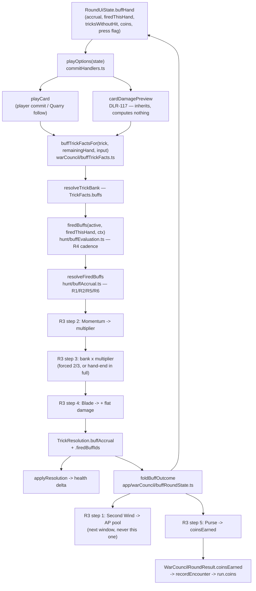

# Plan: Engine — buff condition/reward evaluation framework

Plan folder: `.claude/contract/DLR-125-buff-condition-reward-evaluation-framework/`
Execution status: see `tasks.md` in this folder.

---

## Part 1 — Alignment

*(The shared understanding of what this task is doing. Restate it in your own words — this is how the developer confirms you read the brief correctly before any design happens. Mismatch here = stop and fix.)*

### Task reference

**Jira DLR-125 — "Engine: buff condition/reward evaluation framework"**, task under epic DLR-103, label `engine`.

Acceptance criteria, verbatim from the ticket:

1. A generic evaluation function accepts an equipped `Buff` (from DLR-105's type) and the current trick/hand event stream, and returns whether its condition descriptor is satisfied — covering all condition shapes in DLR-111's list: suit win/lose, rank win, skull dodge/eat (apply-to-card targeting), bank threshold, survive-N, the Apply-Damage-this-hand prediction, hold-suit-at-hand's-end, coin/health thresholds.
2. A generic reward-application function accepts a satisfied `Buff`'s reward descriptor and applies it to game state — flat damage, coin, AP refund (respecting DLR-111's `MAX_REFUND_PER_HAND` cap once that value lands), and the +1 multiplier reward.
3. The apply-to-card templates (#4/#5 — dodge/eat a skull "with this card") read the player's chosen target card, set at play time, rather than assuming a printed suit/rank — verified by a unit test attaching the same generic template to two different cards in the same hand.
4. Multiple buffs conditioning the same trick apply additively at minimum, verified by a unit test with two satisfied buffs on one trick.
5. The evaluator is exercised against a representative sample of DLR-111's list (at least one card per condition-template row), not just a synthetic example.

**Scope boundaries, verbatim:** *In scope* — the condition-evaluation function, the reward-application function, apply-to-card targeting, additive stacking of multiple satisfied buffs on one trick. *Out of scope* — the buff-pile data model (DLR-105); AP cost to activate (DLR-108); the live UI readout (DLR-117); consumable-item activation; the passive buff-stacking resolution rule (DLR-124).

**The DLR-124 clause is stale and is treated as overturned.** DLR-124 has since run and shipped: `hybrid-design.md` §5 → *Resolving several buffs on one trick — the stacking rule* is settled (R1–R7), `src/hunt/buffAccrual.ts` implements R1/R2/R5/R6, and `.docs/implementation/hunt/buff-pile.md` records it. AC4's "additively at minimum" is DLR-124's R2 exactly, so the two do not conflict; the ticket's instruction not to conflate them predates the settlement. This plan implements DLR-124's rule as written and does not reopen it.

**Handoff comment on the ticket, carried forward from DLR-117 (`8f74535`), dated 2026-08-24:** DLR-117's per-card win/lose damage preview derives its figures by handing a hypothetical `TrickResolution` to `applyResolution` and reading the health delta. Two of its acceptance criteria were deliberately unmet because `buffAccrual.ts` has no caller — **AC3** (buff contributions in the readout) and **AC1** (the "once any buff is active" visibility gate). The comment asks this ticket to decide whether to complete them here or raise a follow-up, and forbids re-deriving stacking arithmetic in the preview. It also notes `timebombDamageFor` / `timebombDamageOf` were nominated for collapsing "by whichever ticket replaces `commitTimebomb` with `activateBuff`".

**Sprint-run dispatch, 2026-08-23 unattended run:** the plan-approval gate is not paused at; each stated default is taken and logged. Browser pass not requested. Tuning values documented in `hybrid-design.md` and `v1-buff-card-list.md` are pre-approved transcriptions, not new developer decisions.

### Restated goal

`buffAccrual.ts` currently has no caller: a player can spend action points activating a condition buff and the game pays them nothing. This task builds the missing middle — a pure evaluator that reads a `Buff`'s condition descriptor and the plain facts of a resolving trick and answers "did this fire", and a wiring path that carries the resulting contributions through the *existing* resolution fold so they actually change damage, coins and the action-point pool. Evaluation is placed inside `resolveTrickBank`, which already owns DLR-124 R3's five-step order (Second Wind → Momentum → the cash-out product → Blade → Purse) because it owns the product that order is defined around. Because DLR-117's per-card preview reads a real `TrickResolution` through `applyResolution` rather than computing damage itself, threading the buff facts through the one `playOptions` assembly all three readers share makes the preview inherit buff contributions with no arithmetic of its own — DLR-117 AC3 lands for free.

### In scope

- A new pure module `src/hunt/buffEvaluation.ts`: `buffFires(buff, ctx)` — one total function over the eleven shipping condition families — plus `firedBuffs(...)`, which applies DLR-124 R4's event/threshold/terminal cadence and filters out families that already fired this hand.
- Widening `src/hunt/buffAccrual.ts` with paid-tracking (`multiplierPaid` / `flatDamagePaid`) and two functions, `payableCashOutBonus` and `markCashOutPaid`, so the Momentum and Blade pools are each spent **once** per hand and R6's per-hand bound is a real bound rather than a per-cash-out one.
- A new `src/warCouncil/buffTrickFacts.ts` deriving the per-trick half of the evaluation context (the suits and ranks the **player** played into this trick, and the suits still in their hand after it) from the trick itself — mirroring `swanTierFactsFor`'s shape exactly.
- Wiring evaluation into `resolveTrickBank` at DLR-124 R3's step 2/4 positions, and reporting the result back out on `TrickResolution` as `buffAccrual` and `firedBuffIds`.
- Threading the hand-scoped half of the context in through `PlayCardOptions.buffs` → `playOptions(state)`, the one assembly the player's commit, the Quarry's follow, and DLR-117's preview all share.
- A new app module `src/app/warCouncil/buffRoundState.ts` holding the hand-scoped buff state (`BuffHandState`), its assembly into `PlayCardOptions`, and the fold of a resolved trick's `buffAccrual` back into `RoundUiState` — AP refunded into the live pool, coins accumulated, threshold/terminal families recorded as fired, the no-hit trick counter advanced.
- Paying the Purse axis into the run's wallet: `WarCouncilRoundResult.coinsEarned` → a new **optional** eighth parameter on `recordEncounter`.
- Recording the Apply Damage **press** (DLR-109's reading) as the Debt Collector trigger, so the family fires on the press rather than on the delayed landing.
- Unit tests: one per condition family (AC5), two-buffs-on-one-trick additivity (AC4), the same generic Sidestep/Glutton template firing off two different played cards in one hand (AC3), the cash-out pools spending once (R6), and a resolution-level test proving an activated buff genuinely changes the damage `applyResolution` deals.

### Explicitly out of scope

- **DLR-117 AC1 — the "once any buff is active" visibility gate.** Hiding and revealing the per-card readout changes what the felt looks like at rest; that is a visual judgement the developer owns, and this is an `engine`-labelled ticket. Raised as a follow-up. DLR-117 **AC3 is in scope and lands for free** — see Approach.
- **Collapsing `timebombDamageFor` / `timebombDamageOf`.** The handoff conditions that on the ticket that replaces `commitTimebomb` with `activateBuff`. This ticket does not touch the Timebomb marking flow: Timebomb is an `Activated` card with no condition to evaluate, and its migration is a separate piece of work. The two functions are left exactly as they are.
- **Long Fall (v1 list row #8).** Deferred by DLR-111 for want of a UI answer, no template is generated for it, and nothing is planned here.
- **Consumable/activated cards** (Cheat, Timebomb, Ward, Puppeteer, Second Thoughts, Foresight, Spyglass, Shield). `BUFF_CADENCE` maps every one to `Activated`; they fire on a player action, not a condition, and `firedBuffs` returns them never.
- **Fixing the three known open defects** — `Keepsake`'s unfireability, `Ward` silver/gold being indistinguishable at `DAMAGE_PER_HIT = 1`, and `Miser` fighting the shop. Each is assessed under Risks and reported; none is fixed.
- **Any new UI surface, control, label or readout.** The `.tsx` files in the file map are touched only to pass a number through; nothing new renders. No mockup is called for.
- **Retuning any figure.** Every number used is transcribed from `v1-buff-card-list.md` or `hybrid-design.md` §5.
- **`ErrorBoundary`** (DLR-131). Not built here; the design instead adds no new throw on any reachable evaluation path.

### Pattern Reference

- `src/hunt/buffAccrual.ts` — R1/R2/R5/R6, already shipped. Extended, never re-derived.
- `src/warCouncil/rankTierRules.ts` → `swanTierFactsFor` — **the** pattern for "derive a `TrickFacts` fragment from the trick itself". `buffTrickFacts.ts` copies its shape.
- `src/warCouncil/bank.ts` → `TrickFacts.bankClimbBonus` and `.blastGuarded` — the pattern for "a plain fact handed in, never a run figure read".
- `src/app/warCouncil/commitHandlers.ts` → `playOptions` — the one assembly all three readers share; its own docblock states why a second reading is the bug.
- `src/app/warCouncil/roundReducer.ts` → `openWindowOnTrickResolved` — the pattern for a pure two-argument fold on the `null → non-null` edge of `resolvedTrick`.
- `src/hunt/runTransitions.ts` → `recordEncounter`, and `RoundUiSeed.apCapacity?` / `.rankTiers?` — the established optional-parameter widening that leaves existing call sites untouched.
- `.docs/design/Balatro-Forbidden-Solitaire/v1-buff-card-list.md` → *Condition templates* and *Firing cadence* — the authoritative family table.
- `.docs/design/Balatro-Forbidden-Solitaire/hybrid-design.md` §5 → *Resolving several buffs on one trick* R1–R7 — the settled rule. Cited, never restated.
- `.claude/skills/react-frontend/SKILL.md` for everything under `src/`.

### Constraints flagged on the brief

- **Determinism.** `src/hunt/`, `src/vault/` and `src/warCouncil/` are free of `Math.random()`; a lint boundary enforces it and DLR-130's balance simulator depends on it. Every function added here is a pure function of its arguments — no clock, no randomness, no ambient state.
- **The per-hand-not-per-hit reset asymmetry (R6).** `startHandAccrual()` must remain the only reset in `buffAccrual.ts`, and no `resetOnHit`-shaped function may appear. Preserved structurally — see Approach.
- **`apCostOf` stays a derived lookup.** No `apCost` field is added to any type.
- **The `Unassigned` trap.** Reach the offered pile through `offeredBuffs(state)` / `activatableBuffs` / `isPricedBuff`; never write a second filter.
- **No `ErrorBoundary` exists** (72 throw sites, 0 boundaries). An escaping throw blanks the screen, so nothing on the per-trick evaluation path may throw on player-reachable input.
- **Vocabulary (`6ba6224`):** Timebomb, prime/primed, ticking, detonates, Blast Guard. Never "Envenom"/"poison" except `CardRank.Poison`.
- **CLAUDE.md's 400-line limit is blocking and fixed in-ticket**, measured with `(Get-Content <file>).Count` after Prettier.
- **Browser pass not requested.** QA records what a browser would have checked.

### Assumptions made

- **The evaluator lives in `src/hunt/`, and the call site lives in `src/warCouncil/bank.ts`.** `hunt` owns what a buff is and when it fires; `bank.ts` owns the cash-out product that R3's order is defined around. Splitting them the other way would put half of R3 in a module with no product to order against.
- **`resolveTrickBank` is where evaluation happens, not a step before or after it.** Two of the conditions — Hoarder's "reach a bank of N" and Unbloodied's "survive N tricks without a hit" — read figures that only exist *inside* that function (the bank after this trick's climb, whether this trick cost the player health). Evaluating outside it would need either a throwaway first pass or a second copy of the climb arithmetic.
- **`TrickFacts.buffs` and the two new `TrickResolution` fields are REQUIRED, not optional**, typed `… | null`. Optional would let a call site silently skip buffs; required makes the compiler enumerate all five `TrickFacts` and six `TrickResolution` construction sites, which is the discipline `bankClimbBonus` and `swanKeepsBank` already follow. `null` is the explicit "this reader has no buffs" value.
- **Sidestep and Glutton's "with this card" is satisfied by per-trick activation, and no target-card field is added.** A buff is activated in the between-tricks window *for the coming trick* (`BuffActivationState.activatedThisTrick`, cleared by `openBuffWindow` at each resolution), so "this card" is already exactly "the card played on the trick this buff was bought for". AC3's requirement that the same generic template behave differently on two different cards in one hand is met by that mechanism and is tested against it.
- **Debt Collector fires on the Apply Damage PRESS, enforcing DLR-109's reading.** A hand-scoped `applyDamagePressed` flag is set in `handleTapApplyDamage` at the moment the press commits and read at the next trick resolution. The alternative — firing when the queued payout lands — would make the family pay a trick or more later and would silently contradict a reading DLR-109 already recorded.
- **The Momentum and Blade pools are SPENT at a cash-out, not re-applied at every cash-out.** R6 bounds each axis at a figure *per hand*; a pool re-added at each of a hand's cash-outs would pay up to `MAX_FLAT_DAMAGE_BONUS_PER_HAND` three times in a hand with a forced cash-out, a voluntary apply and an end-of-hand fold. Tracked with two new `*Paid` counters so the accrued totals — and therefore the caps — keep their existing meaning.
- **Blade pays whenever a cash-out branch fires, even if the product is zero.** R3 step 4 says flat damage is added to the result of the product; a product of zero is a result. The alternative would make Blade silently worthless on the trick a streak is caught at a multiplier of zero.
- **Second Wind's refund lands in the pool for the NEXT window, never this one** (R3's own note). Implemented by folding the accrual after the trick has already resolved, so no re-activation is possible at the trick that generated it.
- **A buff whose condition is met on the trick that ends the hand fires, and fires before the end-of-hand cash-out.** Terminal cadence (Keepsake) exists precisely for that instant; event and threshold families reaching it have satisfied their condition like any other trick. Second Wind refunded there buys nothing, which is a player's mistake to make, not an error.
- **`BuffKind.Unassigned` never fires**, because `firedBuffs` only ever sees `activatableBuffs(state.buffs)` — the existing guard, not a new one.
- **`recordEncounter` gains an OPTIONAL eighth parameter defaulted to `0`.** 48 call sites exist; a required parameter would edit 47 specs that have nothing to do with coins. This is the same widening `apCapacity?` and `rankTiers?` already use.
- **The player's coins reach the hand through a new optional `RoundUiSeed.coins`,** defaulted to `0`; `WarCouncilMountProps.coins` already exists and is already passed to the mount.
- **`Cornered`'s percentage is evaluated against `PLAYER_START_HEALTH`,** which is what `CONDITION_THRESHOLD`'s own comment says the 60/45/33 figures are a percentage of. Evaluated as `health * 100 < threshold * PLAYER_START_HEALTH` — integer arithmetic, no division, so no `NaN` is producible.
- **Hand-scoped buff state lives in `RoundUiState`, seeded at mount.** `App.tsx` remounts the felt per hand (`key={hand}`), so `createRoundUiState` calling `startHandAccrual()` **is** the per-hand reset — the identical argument `startBuffActivation` already makes. Nothing else writes the accrual, and no per-hit reset exists to write.

### Config and persisted-shape audit

- **No configuration key is added, renamed, retyped or removed.** Every figure used is read from an existing exported constant: `MAX_MULTIPLIER_BONUS_PER_HAND`, `MAX_FLAT_DAMAGE_BONUS_PER_HAND`, `MAX_COIN_BONUS_PER_HAND`, `MAX_REFUND_PER_HAND` (`src/hunt/apConfig.ts`), `CONDITION_THRESHOLD` and `REWARD_TIER_VALUE` (`src/hunt/buffTemplates.ts`), `PLAYER_START_HEALTH` (`src/hunt/config.ts`).
- **Persisted shapes: unaffected.** `src/persistence/` and `src/vault/` persist only `TemplateGrant` (`{ templateId, tier }`) and boost counts. No type this plan changes is written to disk, and `.claude/rules/save-data-versioning.md`'s reject conditions are not reachable — nothing here reads or writes a save.
- **`TrickFacts`** — grep `TrickFacts`: **13 hits across 7 files** (annotations and imports). Grep the distinctive required field `swanKeepsBank`: **22 hits across 5 files**; excluding the two owning production files (`bank.ts`, `rankTierRules.ts`) leaves **14 construction-site hits across 3 spec files** — `bank.integration.test.ts:17`, `bank.test.ts:29`, `rankTiers.resolution.test.ts` (lines 68/75/82/89/96/118/171 plus `facts()` partial-override calls). Production construction sites are `playCard.ts:114-127` and `cardDamage.ts:72-86`. **Report: `TrickFacts`: 13 annotated sites, 16 construction sites (14 of them in specs).** The larger number is the real one; all five files are in a task's `**Files:**` block.
- **`TrickResolution`** — grep `TrickResolution`: **16 hits across 9 files**. Grep the distinctive required field `cashedAtHandEnd`: **14 hits across 8 files**, of which **6 are construction sites** — `bank.ts:292` plus five spec fixtures: `BankMeter.test.tsx:16`, `roundHint.test.ts:62`, `roundReducer.test.ts:127`, `roundReducer.timebomb.test.ts:37`, `TrickWell.test.tsx:24`. The remaining 8 are assertions and docblock mentions. **Report: `TrickResolution`: 16 annotated sites, 6 construction sites (5 of them in specs).** All six are in a task's `**Files:**` block.
- **`BuffBonusAccrual`** — grep `BuffBonusAccrual`: **10 hits across 3 files**. Grep the distinctive required field `flatDamageBonus`: **8 hits across 2 files**, of which **2 are construction sites** — `buffAccrual.ts:39` (`EMPTY_BUFF_ACCRUAL`) and `buffAccrual.test.ts:32`. **Report: `BuffBonusAccrual`: 10 annotated sites, 2 construction sites (1 of them in specs).**
- **`RoundUiState`** — grep the distinctive required field `unplayedAtResolve`: **9 hits**, of which exactly **1 is a full construction site**, `roundUiState.ts:261` inside `createRoundUiState`; the rest are the declaration, spread updates (`{ ...state, … }`), and one partial spread in `roundReducer.applyDamage.test.ts:186`. **Report: `RoundUiState`: 1 construction site.** Adding required fields therefore costs one edit.
- **`RoundUiSeed`** — grep `RoundUiSeed`: **8 hits across 4 files**; `createRoundUiState(` is called **38 times**. The new `coins` field is **optional**, so all 38 are untouched. **Report: `RoundUiSeed`: 8 annotated sites, 38 construction sites, 0 requiring edits.**
- **`WarCouncilRoundResult`** — grep the distinctive required field `finalState`: **3 hits**, of which **2 are construction sites**, both in `WarCouncilRound.tsx` (lines 221 and 237). The new `coinsEarned` field is required; both sites are in a task's `**Files:**` block.
- **`recordEncounter`** — **48 call sites across 14 files**. The new parameter is optional and defaulted, so **0 of the 48 require an edit**; only `App.tsx:159` passes it.
- **`PlayCardOptions`** — grep: **12 hits across 7 files**; every field on it is already optional, so the new `buffs?` field forces no edit at any existing site.
- **String-bound surfaces: none touched.** No `data-testid`, CSS class, `aria-*` id, storage key, or reason code is added, renamed or removed. `BuffTemplate.id`'s frozen `<kind>[:<param>]:<axis>` format is read but never written.
- **Architectural boundary (check 6):** `src/hunt/buffEvaluation.ts` and `src/warCouncil/buffTrickFacts.ts` sit inside the lint-enforced pure-core tree (`eslint.config.js`'s `no-restricted-imports` + `no-restricted-globals` override on `src/warCouncil/**` and `src/hunt/**`). Neither imports React nor touches a DOM global, and neither calls `Math.random()`. `src/hunt/` still cannot import `src/warCouncil/`, which is why `buffTrickFacts.ts` — which needs `TrickCard` — lives on the `warCouncil` side of the edge and hands `hunt` plain `BuffTargetSuit` values.

---

## Part 2 — Technical design

### Approach

The framework is three pieces with one seam between each pair, and the seam placement is the whole design. **Piece one** is `src/hunt/buffEvaluation.ts`, a pure predicate over a `Buff` and a `BuffTrickContext` of plain values — no `RoundState`, no `EncounterState`, no `TrickCard`. It answers "did this buff's condition come true on this trick" for the eleven shipping condition families, and `firedBuffs` layers DLR-124 R4's cadence on top: `Event` families fire on every trick their condition holds, `Threshold` families are filtered against a `firedThisHand` list so they pay once, `Terminal` (Keepsake) is gated on `finalTrick`, and `Activated` kinds never fire from a condition at all. It is a total `switch` over `BuffConditionKind`, so a twelfth family added to `buffCosts.ts` fails to compile here rather than silently never firing.

**Piece two** is the call site, and it is inside `resolveTrickBank`. That placement was chosen over the two alternatives, both of which were tried on paper first. Evaluating *before* the call would need the bank after this trick's climb and whether the trick cost the player health — figures that do not exist until `resolveTrickBank` has run — so it would require either a discarded first pass or a duplicate of the climb arithmetic in the caller. Evaluating *after* the call cannot work at all: R3 puts Momentum inside the cash-out product and Blade outside it, and the product is `resolveTrickBank`'s. So `resolveTrickBank` receives `TrickFacts.buffs` — the hand-scoped half of the context, plus the buffs activated for this trick — evaluates immediately after the take/hit branch, and applies the contributions at exactly R3's step 2 (Momentum into the multiplier feeding `forcedCashValue`/`cashValue`) and step 4 (Blade added to whatever those produced, after §7's two-thirds floor). It reports what happened back out on `TrickResolution` as `buffAccrual` and `firedBuffIds`, so nothing downstream has to re-derive it.

The per-trick half of the context — which suits and ranks the **player** put into this trick, and which suits are still in their hand after it — is derived by `src/warCouncil/buffTrickFacts.ts`, whose `buffTrickFactsFor(trick, remainingHand, input)` mirrors `swanTierFactsFor` exactly: one producer, called by `playCard` and by `cardDamage`'s preview, so the two cannot read the trick differently. `src/hunt/` cannot see `TrickCard`, which is why this crossing lives on the `warCouncil` side and hands `hunt` a list of `BuffTargetSuit` values.

**Piece three** is the hand-scoped state, in a new `src/app/warCouncil/buffRoundState.ts`. It holds `BuffHandState` (the accrual, the ids that have already fired this hand, the run-of-tricks-without-a-hit counter, the coins earned so far, and the Apply-Damage-press flag), assembles it into `PlayCardOptions.buffs`, and folds a resolved trick's `buffAccrual` back: the delta in `apRefunded` is added to the live AP pool, the delta in `coinBonus` accumulates into `coinsEarned`, newly-fired threshold and terminal ids join `firedThisHand`, and the no-hit counter advances or zeroes. It is a separate module rather than more of `roundUiState.ts` for a hard reason: that file stands at 379 of its 400-line budget, and three documented state fields would breach it. The fold is invoked from `roundReducer.ts` on the same `null → non-null` edge of `resolvedTrick` that `openWindowOnTrickResolved` already uses — one site, pure, two-argument, StrictMode-safe, and ordered before the window clear so the refunded AP survives into the next window.

**DLR-117's preview inherits buff contributions for free, and that is a consequence of the seam, not extra work.** `playOptions(state)` is the single assembly the player's commit, the Quarry's follow and the preview all read; adding `buffs` to it means the preview's hypothetical `TrickResolution` already carries the buff-adjusted multiplier and flat damage before `applyResolution` is asked what it costs. The preview still performs no damage arithmetic and gains no knowledge of R3, the caps or the Overlap Bonus. One line changes in `cardDamage.ts`. DLR-117 **AC3 is met**; **AC1**, the visibility gate, is deliberately left — it is a call about what the felt looks like at rest.

**The R6 asymmetry is preserved structurally and made stronger.** `startHandAccrual()` remains the only reset in `buffAccrual.ts` and no per-hit reset function is added, so the wrong reading still has no function to call. The two counters this plan adds — `multiplierPaid` and `flatDamagePaid` — move only forward and only when a cash-out actually pays, and they are reset by nothing but `startHandAccrual`. The one counter that legitimately *does* zero on a hit is `tricksWithoutHit`, which is Unbloodied's condition and not a cap; it lives in `buffRoundState.ts`, on the far side of the module boundary from the caps, precisely so no reader can mistake one for the other.

### Skills to invoke during execution

- `react-frontend` — owns everything under `src/`: the MUST/NEVER contract, the 400-line budget, strict TypeScript, the Vitest posture, and the pure-core boundary this plan's two new engine modules sit inside.
- `implementation-doc-writer` — owns `.docs/implementation/hunt/buff-pile.md` and `.docs/game_rules/the-hunt.md`. Invoked at the end of `/fb-apply` per the pipeline, not as a task in this contract.

Rules the executor must Read: `.claude/rules/README.md` and `.claude/rules/save-data-versioning.md` (scanned and found not to apply — nothing here reads or writes a save; re-read to confirm, do not assume).
Workflow reference: `.claude/workflow/web-project.md`.

No developer override was applied: the sprint-run dispatch runs this contract non-interactively, so the Step 1.5c confirmation call was not presented.

### Diagram



### Data shapes

#### `src/hunt/buffEvaluation.ts` — new

```ts
/** Everything a condition reads, as PLAIN VALUES — never a RoundState, an EncounterState or a
 *  TrickCard. The per-trick half is derived by warCouncil/buffTrickFacts.ts; the hand-scoped half
 *  comes from app/warCouncil/buffRoundState.ts. */
export interface BuffTrickContext {
  /** The player won the trick physically (before the skull inverts what that is worth). */
  readonly playerWon: boolean
  /** Any card in the trick carries a skull. */
  readonly skullTrick: boolean
  /** This trick cost the player health — Unbloodied's counter and nothing else reads it. */
  readonly playerHit: boolean
  /** The last trick of the hand — Keepsake's only instant. */
  readonly finalTrick: boolean
  /** Suits the PLAYER played into this trick. */
  readonly playerSuits: readonly BuffTargetSuit[]
  /** Ranks the PLAYER played into this trick. */
  readonly playerRanks: readonly number[]
  /** Suits still in the player's hand AFTER this trick's card left it — Keepsake. */
  readonly remainingSuits: readonly BuffTargetSuit[]
  /** The bank after this trick's climb — Hoarder. UNIT: tricks. */
  readonly bankAfterTrick: number
  /** Consecutive tricks ending with no damage to the player, INCLUDING this one — Unbloodied. */
  readonly tricksWithoutHit: number
  /** The run's purse — Miser. UNIT: coins. */
  readonly coins: number
  /** The player's red hearts — Cornered. UNIT: health. */
  readonly playerHealth: number
  /** DLR-109 — Apply Damage has been PRESSED this hand. Debt Collector. The press, not the landing. */
  readonly applyDamagePressed: boolean
}

/** Whether ONE buff's condition is satisfied by this trick. Total over the 11 shipping condition
 *  families; every Activated kind and BuffKind.Unassigned answer `false`. Never throws. */
export function buffFires(buff: Buff, ctx: BuffTrickContext): boolean

/** The buffs that fire on this trick, with DLR-124 R4's cadence applied: Event every time,
 *  Threshold once per hand (filtered against `firedThisHand`), Terminal only when
 *  `ctx.finalTrick`, Activated never. Order follows `active`. */
export function firedBuffs(
  active: readonly Buff[],
  firedThisHand: readonly BuffId[],
  ctx: BuffTrickContext,
): readonly Buff[]

/** Whether a fired buff must be recorded in `firedThisHand` — true for Threshold and Terminal
 *  cadences, false for Event, which may fire again. */
export function firesOncePerHand(buff: Buff): boolean

/** `BuffTrickContext` minus the eight fields the trick and `resolveTrickBank`'s own locals
 *  supply. Declared HERE, beside the context it is a subset of, so the two cannot drift. */
export type BuffHandContext = Pick<
  BuffTrickContext,
  | 'playerSuits'
  | 'playerRanks'
  | 'remainingSuits'
  | 'tricksWithoutHit'
  | 'coins'
  | 'playerHealth'
  | 'applyDamagePressed'
>

/** The hand-scoped half of buff evaluation, handed to `resolveTrickBank` as PLAIN VALUES exactly
 *  as `bankClimbBonus` and `blastGuarded` are. Declared in `src/hunt/` because `hunt` owns what a
 *  buff is; `bank.ts` imports it rather than restating it. */
export interface BuffTrickInput {
  /** The buffs activated for THIS trick — already filtered through `activatableBuffs`. */
  readonly active: readonly Buff[]
  /** The hand's running accrual, before this trick. */
  readonly accrual: BuffBonusAccrual
  /** Ids of once-per-hand families that have already fired this hand. */
  readonly firedThisHand: readonly BuffId[]
  readonly hand: BuffHandContext
}

/** Unbloodied's condition counter, advanced. THE one statement of it, called by
 *  `resolveTrickBank` (which needs the value INCLUDING this trick) and by `foldBuffOutcome`
 *  (which stores it for the next one), so the two can never disagree. This is a CONDITION
 *  counter, not a cap — it is the one thing here that legitimately zeroes on a hit, and it lives
 *  deliberately far from `buffAccrual.ts`, whose counters never do (R6). */
export function advanceTricksWithoutHit(current: number, playerHit: boolean): number

export interface BuffTrickOutcome {
  readonly accrual: BuffBonusAccrual
  readonly firedIds: readonly BuffId[]
}

/** R4 cadence + R1/R2/R5/R6 in one call, so `bank.ts` states R3's ORDER and nothing else.
 *  Delegates the accrual arithmetic to `resolveFiredBuffs` — never re-derives it. */
export function resolveTrickBuffs(
  input: BuffTrickInput,
  ctx: BuffTrickContext,
): BuffTrickOutcome
```

#### `src/hunt/buffAccrual.ts` — modified

```ts
export interface BuffBonusAccrual {
  readonly multiplierBonus: number   // unchanged — accrued this hand, clipped at its cap
  readonly flatDamageBonus: number   // unchanged
  readonly coinBonus: number         // unchanged
  readonly apRefunded: number        // unchanged
  /** NEW — how much of `multiplierBonus` a cash-out has already been paid. Moves forward only,
   *  and only when a cash-out fires. Reset by `startHandAccrual` and by nothing else. */
  readonly multiplierPaid: number
  /** NEW — the same, for `flatDamageBonus`. */
  readonly flatDamagePaid: number
}

/** The unspent balance of the two axes that land at a cash-out (R3 steps 2 and 4). */
export interface CashOutBonus {
  readonly multiplierBonus: number
  readonly flatDamageBonus: number
}

/** What this cash-out may add. Never negative. */
export function payableCashOutBonus(accrual: BuffBonusAccrual): CashOutBonus

/** Records `paid` as spent. R6's per-hand bound is a bound because this moves forward — a pool
 *  re-added at every cash-out would pay three pools in a hand with three cash-outs. */
export function markCashOutPaid(accrual: BuffBonusAccrual, paid: CashOutBonus): BuffBonusAccrual
```

`EMPTY_BUFF_ACCRUAL` gains `multiplierPaid: 0, flatDamagePaid: 0`. `startHandAccrual()` is unchanged and remains the only reset. No `resetOnHit`-shaped function is added.

#### `src/warCouncil/bank.ts` — modified

`BuffTrickInput` and `BuffHandContext` are **imported from `src/hunt/buffEvaluation.ts`**, not
declared here — `hunt` owns what a buff is, and `bank.ts` is already an importer of `../hunt`.

```ts
export interface TrickFacts {
  // …the nine existing fields, unchanged…
  /** DLR-125 — REQUIRED, `null` for a reader with no buffs. */
  readonly buffs: BuffTrickInput | null
}

export interface TrickResolution extends BankState {
  // …the existing fields, unchanged…
  /** DLR-125 — the accrual AFTER this trick, or `null` when `TrickFacts.buffs` was `null`. */
  readonly buffAccrual: BuffBonusAccrual | null
  /** DLR-125 — the ids that fired on this trick, in `active` order. Empty when none did. */
  readonly firedBuffIds: readonly BuffId[]
}
```

`playerSuits` / `playerRanks` / `remainingSuits` sit on `BuffHandContext` rather than being derived inside `bank.ts` because `bank.ts` receives a `BankState` and a `TrickFacts`, not the trick's cards — `buffTrickFactsFor` supplies them. `resolveTrickBank` builds the remaining five `BuffTrickContext` fields (`playerWon`, `skullTrick`, `playerHit`, `finalTrick`, `bankAfterTrick`) from its own locals and calls `resolveTrickBuffs` once.

#### `src/warCouncil/buffTrickFacts.ts` — new

```ts
/** The per-trick half of the buff context, derived from the trick itself. THE single producer,
 *  read by `playCard` and by `cardDamage`'s preview, mirroring `swanTierFactsFor` exactly. */
export function buffTrickFactsFor(
  trick: readonly TrickCard[],
  remainingHand: readonly Card[],
  input: BuffHandInput | null,
): Pick<TrickFacts, 'buffs'>

/** What the app layer supplies — everything except the three card-derived lists. */
export interface BuffHandInput {
  readonly active: readonly Buff[]
  readonly accrual: BuffBonusAccrual
  readonly firedThisHand: readonly BuffId[]
  readonly tricksWithoutHit: number
  readonly coins: number
  readonly playerHealth: number
  readonly applyDamagePressed: boolean
}
```

#### `src/warCouncil/legalMoves.ts` — modified

```ts
export interface PlayCardOptions {
  // …existing optional fields, unchanged…
  /** DLR-125 — the hand-scoped buff input. Optional like every other field here; absent is
   *  "this caller evaluates no buffs". */
  readonly buffs?: BuffHandInput
}
```

#### `src/app/warCouncil/buffRoundState.ts` — new

```ts
/** The hand's buff bookkeeping, as one value. Seeded by `createRoundUiState` — which IS the
 *  per-hand reset, because `App.tsx` remounts the felt per hand (`key={hand}`), the identical
 *  argument `startBuffActivation` already makes. */
export interface BuffHandState {
  readonly accrual: BuffBonusAccrual
  readonly firedThisHand: readonly BuffId[]
  /** Unbloodied's condition counter. Zeroes on a hit — which is a CONDITION reset, not a CAP
   *  reset, and lives here rather than in `buffAccrual.ts` so the two can never be confused. */
  readonly tricksWithoutHit: number
  /** Purse, accumulated this hand and handed up at hand's end. UNIT: coins. */
  readonly coinsEarned: Coins
  /** DLR-109 — Apply Damage was PRESSED this hand. */
  readonly applyDamagePressed: boolean
}

export function startBuffHand(): BuffHandState

/** Assembles `PlayCardOptions.buffs` from the felt. Reads the offered pile through
 *  `offeredBuffs`, never a second filter. */
export function buffHandInputFor(state: RoundUiState): BuffHandInput

/** Folds a resolved trick's `buffAccrual` back: R3 step 1 (AP into the pool for the NEXT window),
 *  R3 step 5 (coins), the once-per-hand fired list, and the no-hit counter. Pure and
 *  two-argument, so StrictMode's double dispatch recomputes an identical value. */
export function foldBuffOutcome(prev: RoundUiState, next: RoundUiState): RoundUiState
```

#### `src/app/warCouncil/roundUiState.ts` — modified

```ts
export interface RoundUiState {
  // …existing fields, unchanged…
  /** DLR-125 — this hand's buff bookkeeping. */
  readonly buffHand: BuffHandState
  /** DLR-125 — the run's purse at the START of this hand, for Miser. Read-only for the hand's
   *  whole life, exactly as `bankClimbBonus` is: a hand cannot spend coins, only the shop can. */
  readonly coins: Coins
}

export interface RoundUiSeed {
  // …existing fields, unchanged…
  /** DLR-125 — the run's purse at the START of this hand, for Miser. OPTIONAL and defaulted to 0
   *  so all 38 existing `createRoundUiState` fixtures reproduce today's game exactly. */
  readonly coins?: Coins
}
```

#### `src/app/warCouncilMount.ts` — modified

```ts
export interface WarCouncilRoundResult {
  // …existing fields, unchanged…
  /** DLR-125 — Purse coins this hand's buffs earned, capped at `MAX_COIN_BONUS_PER_HAND`.
   *  REQUIRED: both construction sites are in `WarCouncilRound.tsx`. */
  readonly coinsEarned: Coins
}
```

#### `src/hunt/runTransitions.ts` — modified

```ts
export function recordEncounter(
  run: RunState,
  encounter: EncounterState,
  cheats: readonly CheatCard[],
  timebombCharges: number,
  blastGuardHeld: boolean,
  discardsRemaining: number,
  unplayedCards: number | null,
  /** DLR-125 — Purse coins the hand's buffs earned. OPTIONAL and defaulted to 0 so all 48
   *  existing call sites are unchanged; `App.tsx` is the only caller that passes it. */
  buffCoinsEarned?: Coins,
): RunState
```

No `package.json`, `tsconfig`, `vite.config.ts` or ESLint change. No new dependency.

### Runtime quality notes

- **Purity and adjudication.** Every rule added is in a pure module: `src/hunt/buffEvaluation.ts` decides which families fire, `src/hunt/buffAccrual.ts` owns the caps, `src/warCouncil/bank.ts` owns R3's order, `src/warCouncil/buffTrickFacts.ts` derives the trick's own facts. `src/app/warCouncil/buffRoundState.ts` decides nothing — it moves values between the felt and those modules. No component learns a rule; `WarCouncilRound.tsx` gains a field on an object it already builds and `App.tsx` gains one argument to a call it already makes. Every threshold, cap and reward figure is read from an existing exported constant; nothing is inlined.
- **Effects, mount and teardown.** No effect, listener, observer, timer, `requestAnimationFrame` or `AbortController` is added anywhere. `foldBuffOutcome` is a pure two-argument function called from the reducer beside `openWindowOnTrickResolved`, so StrictMode's development double dispatch recomputes an identical value — the same property that function already relies on. There is no module-level mutable state: `buffEvaluation.ts` and `buffTrickFacts.ts` hold only `const` declarations and functions. A second mount re-seeds `buffHand` through `startBuffHand()`, which is the per-hand reset.
- **Hot-path cost.** Evaluation runs once per resolving trick and once per hand card per render for the preview — at most `HAND_SIZE = 6` cards × the number of activated buffs, which the AP pool bounds at roughly six. `firedBuffs` is one pass over `active` with an `includes` against a list of the same order of size; nothing scans the 71-template pool, nothing scans the deck. No memoisation is added and none is warranted — there is no profiling evidence and the loop is single-digit.
- **Determinism and numeric safety.** No `Math.random()`, no clock, no ambient state: every function is a pure function of its arguments, so DLR-130's simulator can replay a hand exactly. **There is no division anywhere in the new code** — `Cornered`'s percentage is evaluated as `health * 100 < threshold * PLAYER_START_HEALTH`, integer both sides, so no epsilon is needed and no `NaN` is producible. `payableCashOutBonus` clamps with `Math.max(0, …)` so a malformed accrual cannot yield a negative bonus that would *reduce* damage. The existing `cashValue` guard (non-integer, non-positive, NaN, infinite → 0) is untouched and still runs first.
- **Error paths.** Nothing on the per-trick evaluation path throws, which matters because no `ErrorBoundary` exists (DLR-131) and a throw during a reducer dispatch unmounts the tree. `buffFires` is total over `BuffKind` and returns `false` for every kind it has no condition for, including `Unassigned` and all eight Activated cards — a `false` here is a card that did not fire, which is R7's explicitly legitimate outcome, not a swallowed failure. The one existing throw this path can reach is `narrowToCostAxis` inside `resolveFiredBuffs`, on a buff minted on an axis with no cap; it is unreachable from `mintFromTemplate`, which already refuses such a template, and it is left throwing deliberately — a silent zero would price a broken card as a working one. No `catch` returning a success shape is introduced anywhere.

### Risks and judgement calls

- **Which families fire, and which do not — the judgement this ticket carries.** Eleven of the v1 list's twelve condition rows are evaluated: Taker, Feeder, Mark of the *R*, Sidestep, Glutton, Hoarder, Unbloodied, Debt Collector, Keepsake, Miser, Cornered. The twelfth, **Long Fall (#8), is not implemented and generates no template** — DLR-111 deferred it for want of a UI answer. Of the eleven, **Keepsake evaluates correctly but is expected never to fire in practice** — see the next bullet.
- **`Keepsake` is very likely unfireable, and this plan does not fix it.** With `HAND_SIZE = 6` cards and six tricks, every dealt card is played, so the player's hand at the final trick's resolution is empty and "hold a card of suit S at hand's end" is false by construction. The evaluation is implemented faithfully against `remainingSuits`; a test pins the *evaluator* as correct (a non-empty remaining hand fires it) and a second test records that the live path supplies an empty hand. **Three Purse cards therefore pay nothing.** Two exits exist and both are the developer's: redefine "hand's end" against the persistent encounter deck DLR-123 introduced, or retire the family. Not decided here.
- **`Ward` silver and gold are indistinguishable while `DAMAGE_PER_HIT = 1`.** Unmoved by this ticket — Ward is an `Activated` consumable with no condition, so it never reaches the evaluator. Recorded so the defect is not assumed fixed.
- **`Miser` rewards unspent coins and fights the shop.** Now genuinely live: a Miser buff will fire and pay whenever the player's purse clears 5/10/20. That makes the tension real rather than theoretical, and it is a balance call for the developer's end-of-epic pass, not a code defect.
- **The Momentum/Blade spend model is a rule reading, not a transcription.** `hybrid-design.md` R6 states a per-hand cap but does not say in so many words what happens when a hand has more than one cash-out. This plan spends each pool once, because the alternative makes the cap not a cap. If the developer wants the pool re-applied at every cash-out, it is a one-line change in `bank.ts` and the two `*Paid` counters come out.
- **The Overlap Bonus now fires on real play for the first time.** `+(k−1)` Momentum on a trick where `k ≥ 2` buffs fire, drawn from the shared `MAX_MULTIPLIER_BONUS_PER_HAND` pool. Its magnitude has never been played against a real hand; the worked example in `hybrid-design.md` is arithmetic, not experience.
- **DLR-117 AC1 is left undone deliberately** — the "once any buff is active" visibility gate is a judgement about what the felt looks like at rest, and hiding a readout that is currently always visible changes the screen. Follow-up, not this ticket.
- **`timebombDamageFor` / `timebombDamageOf` are left alone deliberately** — the handoff conditions their collapse on the ticket that replaces `commitTimebomb` with `activateBuff`, and this is not that ticket. Timebomb is an `Activated` card with no condition and is untouched here.
- **Behaviour only judgeable by playing:** whether an activated buff's payoff *reads* on the felt at the moment it fires — nothing announces a firing yet, so a player sees a larger number with no cause named. That is a UX gap this ticket creates by making buffs work, and it is the developer's to judge and someone's to fix.
- **What a browser would have checked, since no browser pass was requested:** open the loadout between tricks, activate a Bell-Taker (Blade), win a trick with a Bells card, and confirm the Quarry's health drops by more than the unbuffed cash-out; confirm the per-card readout in the hand fan shows the larger figure *before* the card is played; confirm the AP plate's pool climbs after a Second Wind buff fires; confirm the purse on the shop screen after the hand includes the Purse contribution; and confirm the console is clean across a full hand.
