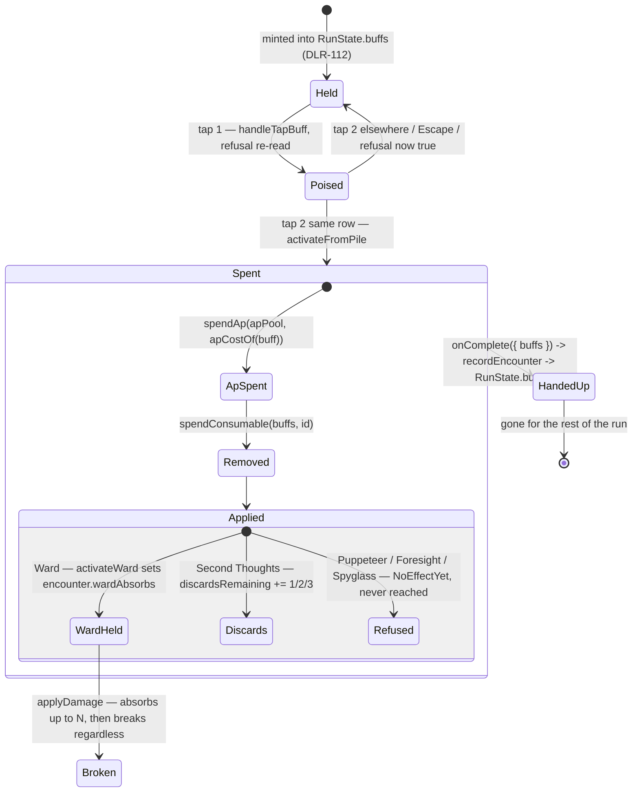

# Plan: DLR-126 — Engine: consumable-item activation flow

Plan folder: `.claude/contract/DLR-126-consumable-item-activation-flow/`
Execution status: see `tasks.md` in this folder.

---

## Part 1 — Alignment

### Task reference

Jira **DLR-126** — "Engine: consumable-item activation flow", Task under epic DLR-103, label `engine`, priority High.

Acceptance criteria, verbatim:

1. Consumables are owned as a counted inventory (e.g. "2x Protect 3"), distinct from DLR-105's equipped buff pile — a consumable is not "equipped," it is held until used.
2. A "Use Item" action exists, gated by a stated timing rule (reuse `discardWindowOpen` if that fits every consumable, or state explicitly which ones need a different window — e.g. Force-a-card needs to resolve before the player's own card is played, matching DLR-111's worked example).
3. Using a consumable applies its effect immediately and removes one from inventory — verified by a unit test that a 2-count stack becomes 1 after one use and the effect fires synchronously, not on a delayed/condition-checked basis.
4. Each of DLR-111's five consumable effects is implemented per its recorded mechanic: Protect N (single-use shield, absorbs up to N on the next hit then breaks regardless of whether fully absorbed), Force a legal card (single tier, opponent's next legal move is player-chosen), Extra discard (+1/+2/+3 to the discard budget), Peek the draw pile (reveals 1/3/5 next cards), the Spyglass (rules out 1/2/3 candidate cards of a suit chosen at use time).
5. DLR-112's AC6 (whether consumables draw through the same reel/tier mechanism as persistent buffs) is resolved using this ticket's ownership model as the deciding constraint.

Scope Boundaries, verbatim: **In scope** — the consumable inventory model, the Use Item action and its timing gate, the five consumable effects, resolving DLR-112's AC6. **Out of scope** — the persistent buff condition/reward evaluator; the action bar's visual placement of a "Use Item" control (DLR-114, *this ticket only needs the engine action to exist for DLR-114 to wire to*); acquisition/drawing mechanics beyond the AC6 decision.

Source specification for every mechanic and every ladder below: `.docs/design/Balatro-Forbidden-Solitaire/v1-buff-card-list.md` → *Utilities, consumables and activated cards* (rows 1–5) and the five prose paragraphs immediately under that table. Cited, never re-derived.

**Overlap check performed before planning (sprint-run preflight flagged DLR-108).** Read at `b2eb798`: `src/hunt/buffActivation.ts`, `buffCosts.ts`, `buffCatalog.ts`, `buffs.ts`, `buffEvaluation.ts`, `shield.ts`, `src/app/warCouncil/buffHandlers.ts`, `buffRoundState.ts`, `roundUiState.ts`. Findings in *Assumptions made* → **What already exists**.

### Restated goal

DLR-108 already shipped the *generic* activation flow — a between-tricks window, a tiered AP price, refusal codes, and a two-tap poise/commit UI. What it did not ship is anything that makes a consumable a **consumable**: activating a Ward today spends 2 AP, records the id in `activatedThisTrick`, has that record wiped by `openBuffWindow` at the next trick boundary, and does *nothing at all* — the card stays in the pile forever and can be re-bought every trick. This ticket makes spending a one-shot item real: the item leaves the owned pile at the moment of the spend and never comes back, that removal survives the hand boundary up into `RunState.buffs`, a counted-stack view of the pile is derivable for the UI, each of the five consumables carries a typed effect descriptor read from one place, and the two whose effects are pure engine — **Ward** (single-use absorption) and **Second Thoughts** (extra discard charges) — actually fire. Puppeteer, Foresight and Spyglass get their descriptors, their prices, their timing and a refusal that makes them unspendable until the screen each needs exists.

### In scope

- A new pure module `src/hunt/consumables.ts` owning: which `BuffKind`s are one-shot items, each one's timing window, each one's tier ladder transcribed from `v1-buff-card-list.md`, a typed `ConsumableEffect` per card, the counted-stack view (AC1), and `spendConsumable` (AC3).
- `activateFromPile` in `src/hunt/buffActivation.ts` — the single call that spends AP **and** removes the item, so an activation can never pay without also consuming.
- A `NoEffectYet` activation refusal, so a consumable whose effect has no surface cannot be burned for nothing.
- **Ward** wired live on `EncounterState`: absorbs up to N on the next hit taken, then breaks regardless — ahead of `shield.ts`'s blue hearts, behind nothing.
- **Second Thoughts** wired live: `+1/+2/+3` onto the felt's `discardsRemaining`, which already hands back to the run.
- Removal surviving the hand: `WarCouncilRoundResult.buffs` → `recordEncounter` → `RunState.buffs`.
- AC5 — DLR-112's AC6 answered in Part 2 → Approach and recorded in the sprint log.

### Explicitly out of scope

- **Any UI surface.** No `.tsx` file changes except the two `onComplete({…})` literals in `WarCouncilRound.tsx` that a new required result field forces. No "Use Item" control, no inventory panel — DLR-114 owns placement and this ticket exists to give it something to wire to.
- **Puppeteer, Foresight and Spyglass effects.** Each needs a player-choice surface no screen provides (pick from the Quarry's legal moves; reveal N of the draw pile; eliminate N candidates of a chosen suit). Descriptor, price, timing and refusal ship; the effect does not.
- **Minting consumables.** Nothing player-reachable mints one today — `mintGrants` generates zero of them (`grep -c "BuffKind.Ward" src/hunt/buffTemplates.ts` → **0**) and `seedStartingBuffPile` mints only `Unassigned`. DLR-112 mints them.
- **Retuning any AP price or any tier ladder.** Every number is transcribed.
- **The `Keepsake`, `Miser` and `ErrorBoundary` open items**, and the `timebombDamageFor`/`timebombDamageOf` collapse — see *Risks and judgement calls*.

### Pattern Reference

- `src/hunt/shield.ts` + `src/hunt/encounter.ts`'s `activateShield` / `absorbWithShield` — the exact shape Ward copies: a pure absorption function beside a scalar field on `EncounterState`, seeded by `startEncounter`, spent inside `applyDamage`.
- `src/hunt/buffCosts.ts` — the two-table lookup discipline. `consumables.ts` follows it: one `Readonly<Record<BuffTier, …>>` per ladder, one reader each.
- `src/hunt/buffActivation.ts`'s `buffActivationRefusalFor` — the refusal-code ordering and the "one statement of availability read by both the guard and the disabled state" rule.
- `WarCouncilRoundResult.cheats` in `src/app/warCouncilMount.ts` — the established "hand-back an owned collection the hand spent from" channel `buffs` copies verbatim.
- `.docs/design/Balatro-Forbidden-Solitaire/v1-buff-card-list.md` → *Utilities, consumables and activated cards*.

### Constraints flagged on the brief

- **Determinism.** `src/hunt/`, `src/vault/`, `src/warCouncil/` contain no `Math.random()`; a lint boundary enforces it and DLR-130's simulator depends on it. Nothing planned here reaches for randomness — every id is the caller's, every ladder is a lookup.
- **Do not rebuild DLR-108.** `activateBuff`, `buffActivationRefusalFor`, `apCostOf`, `activatableBuffs`, `isPricedBuff` are reused unchanged. No parallel activation mechanism.
- **The `Unassigned` trap** (hit three times). Every pile read goes through `offeredBuffs(state)` → `activatableBuffs`. No fourth filter is written.
- **Do not retune `DAMAGE_PER_HIT`.**
- **400-line ceiling, fixed in-ticket.** `App.tsx` 393, `roundUiState.ts` 392, `WarCouncilRound.tsx` 390. Measured with `(Get-Content <path>).Count` after Prettier.
- **Never `npm run format`** — scope Prettier writes to the `**Files:**` block.
- Vocabulary: **Timebomb / prime / ticking / detonates / Blast Guard**. Never "poison" outside `CardRank.Poison`.

### Assumptions made

**What already exists** (read, not rebuilt):

- The whole *generic* activation flow is live and correct — `activateBuff`, the `WindowClosed → AlreadyActive → InsufficientAp` refusal order, `apCostOf` as a derived two-table lookup, per-trick (`openBuffWindow`) and per-hand (`refreshBuffsForNewHand`) resets, and DLR-114's poise/commit UI in `handleTapBuff`. **None of it is touched except by extension.**
- All five consumables already have a `BuffKind`, an `Activated` cadence, an AP price and UI copy. **What none of them has is an effect, or any way to be consumed.** Confirmed: `grep -rn "Ward\|Puppeteer\|SecondThoughts\|Foresight\|Spyglass" src/ --include=*.ts` outside tests returns **20 hits, every one a name, a price, a cadence row or a label** — zero behaviour.
- DLR-125's premise is confirmed: `buffFires` returns `false` for every Activated kind through `if (!isConditionFamily(buff.kind)) return false`, and `firedBuffs` filters `BUFF_CADENCE[kind] !== BuffCadence.Activated`. A consumable never reaches the evaluator, by design. **This ticket does not change that** — a consumable's effect is applied at the spend, not at trick resolution.

**Decisions taken because the brief did not say** (each is a stated default, taken under this run's no-pause instruction, and each is logged):

- **AC1's "counted inventory, distinct from the equipped pile" is satisfied by a DERIVED view, not a second store.** Consumables stay in `RunState.buffs` as ordinary `Buff` objects with ids, and `consumableStacks(buffs)` groups by `(kind, tier)` to produce the "2x Protect 3" reading. Rationale: a genuinely separate store would fork ownership in two, and `offeredBuffs`/`activatableBuffs` — the documented cure for the `Unassigned` trap — would only see half of it. AC1's *observable* requirement (a 2-count becomes 1) holds either way; the fork buys nothing and costs a second source of truth.
- **When may a consumable be spent?** Ward, Second Thoughts, Foresight and Spyglass reuse `discardWindowOpen`, exactly as AC2's first branch invites. **Puppeteer does not** — DLR-111's worked example requires it to resolve *before the player's own card is played*, which is after the Quarry has led and therefore after `currentTrick.length === 0` stops holding. It is declared `ConsumableTiming.BeforeOwnCard` and, since no reducer opens that window, is additionally unspendable via `NoEffectYet`. The engine states the window; it does not fake one.
- **Is spending reversible?** **No, in the engine** — consistent with DLR-108, which has no un-activate and chose the two-tap poise/commit model for exactly that reason. Reversibility lives entirely in the UI: one tap poises, a second spends, `Escape` drops it. Once committed the item is gone. Not re-litigated here.
- **What if the effect is redundant at the moment of use?** **The spend is allowed and the item is consumed.** Rationale: no consumable is ever *provably* redundant — a Ward is only wasted if no hit lands, which is not knowable when it is spent, and Second Thoughts has no budget ceiling to bump against. Refusing would require the engine to predict the trick, and every refusal path adds a "why is this greyed out?" the player cannot answer. Reading the felt is the player's job. (`NoEffectYet` is a different rule: it refuses a card that can *never* do anything in this build, not one that *might* do nothing this trick.)
- **Can a consumable be spent in response to something already booked?** **Yes.** Design §1 puts these cards in the pile precisely to be "sprung in response to what's actually happening", and a Ward spent between tricks against a Timebomb already ticking is the clearest case of it. This is load-bearing rather than incidental — see the Ward finding in *Risks*.
- **Ward SETS its absorption, downward too** — `activateWard` mirrors `activateShield` verbatim rather than accumulating. Two guards stacking is a costing question nobody has answered, and one rule for both guards is cheaper to hold in the head than two adjacent functions with opposite rules (the trap `activateShield`'s own docblock already names against `queueTimebomb`).
- **Ward absorbs BEFORE blue hearts.** A Ward breaks on the next hit regardless of how much it ate; a blue heart is spent per point and survives. Spending the perishable pool first is the only order under which a Ward is ever worth more than a blue heart.
- **Ward, like `shieldHearts`, dies at the encounter boundary** — seeded by `startEncounter`, no explicit clear step to forget. Survives a hand.
- **`recordEncounter` takes `buffs` as an OPTIONAL ninth parameter defaulted to `undefined`** (keep `run.buffs`), exactly as DLR-125 added `buffCoinsEarned` as an optional eighth. All **52** existing call sites stay unchanged.
- **`WarCouncilRoundResult.buffs` is REQUIRED**, following `cheats` and `coinsEarned`, so the compiler enumerates both construction sites rather than letting one silently drop a spent card.
- **`roundUiState.ts`'s `buffActivationStock` is rewritten to delegate to `buffActivationStockFor`.** It currently restates that assembly rather than calling it, so a field added to `BuffActivationStock` needs an edit in two places. Delegating removes the duplication and **shrinks** the file, which matters at 392 of 400 lines.

### Config and persisted-shape audit

- **`EncounterState` — a required field is added (`wardAbsorbs`).** Annotated sites: `grep -rc "EncounterState" src/` → **25 files**. Construction sites, counted by the distinctive sibling field `shieldHearts:` that DLR-110 added the same way: **5 hits, of which 3 are literals** (`src/hunt/encounter.ts:55` `startEncounter`, `:135` `applyDamage`'s return, `:221` `activateShield`'s spread) and 2 are declarations (`types.ts:105`, `duelHealthBars.ts:140`, a parameter). **Zero in `__tests__`** — every spec builds an encounter through `startEncounter`. The larger figure is 3, all in `encounter.ts`, all in this plan's `**Files:**` block. Every other mutation in the tree is `{ ...encounter, … }` and is unaffected.
- **`WarCouncilRoundResult` — a required field is added (`buffs`).** Annotated sites: `grep -rn "WarCouncilRoundResult" src/` → **16 hits**. Construction sites, counted by two distinctive required fields: `unplayedAtResolve:` → **2 object literals** (`WarCouncilRound.tsx:228`, `:245`); `coinsEarned:` → the same **2** in that file. No spec constructs one — all 20 `onComplete` hits in `__tests__` *consume* the result via `vi.fn()` mocks. **Real number: 2**, both in this plan's `**Files:**` block.
- **`BuffActivationStock` — a required field is added (`effectLive`).** Construction sites, counted by `alreadyActive:` → **2** (`src/hunt/buffActivation.ts` inside `buffActivationStockFor`, `src/app/warCouncil/roundUiState.ts:390`). The `roundUiState.ts` one is deleted by the delegation described above, leaving **1**. `src/app/warCouncil/__tests__/buffActivationStock.test.ts` exists and is in the `**Files:**` block.
- **`BuffActivationRefusal` — the union widens by one member (`NoEffectYet`).** `BUFF_ACTIVATION_REFUSAL_MESSAGE` in `src/app/warCouncil/buffLabels.ts:150` is typed `Readonly<Record<BuffActivationRefusal, string>>`, so the widening **fails to compile** there until a copy row is added — the compiler enumerates the one consumer for us. `ActionBar.tsx` compares only against `WindowClosed` (2 hits) and is unaffected by construction.
- **`recordEncounter` — a ninth parameter, optional, defaulted.** `grep -rn "recordEncounter(" src/` → **52 hits**. All 52 are unchanged because the parameter is optional; only `src/App.tsx:158` passes it.
- **Nothing is persisted.** `grep -rn "buffs" src/persistence/` → **zero hits**. No save file, no `localStorage` key, and no stored log carries a `Buff`, an `EncounterState`, or a `RunState`. Removing a card from the pile invalidates no stored record. That window is open and this plan records it as open.
- **No configuration key is renamed, retyped or removed.** Every new constant is additive and lives in the new `src/hunt/consumables.ts`.
- **Purity boundary.** `src/hunt/consumables.ts` sits inside the lint-enforced DOM-free tree (`eslint.config.js`'s pure-core override over `src/warCouncil/**` and `src/hunt/**`). The design imports only `./buffs`, `./buffCosts` and `./types` — no React, no DOM, no `Math.random()`. `consumables.ts` must **not** import `./buffActivation`; the dependency runs the other way, which is why `activateFromPile` lives in `buffActivation.ts` and not beside `spendConsumable`.

---

## Part 2 — Technical design

### Approach

The shape is one new pure module plus one new engine entry point, and everything else is a hand-back channel that already exists.

**`src/hunt/consumables.ts`** owns everything true of a one-shot item. It answers five questions and nothing else: *is this buff a consumable item* (`isConsumableItem` — the five DLR-111 rows, deliberately **excluding** Cheat, Timebomb and Shield, which are `Activated` cards with their own live mechanics and are not spent from the pile); *when may it be used* (`CONSUMABLE_TIMING`); *what does it do* (`consumableEffectOf` → a discriminated `ConsumableEffect` whose tag is the `BuffKind` itself, so there is one vocabulary rather than two); *how many do I hold* (`consumableStacks`, the AC1 counted view derived from the pile); and *what does the pile look like after a spend* (`spendConsumable`). Every tier ladder is a `Readonly<Record<BuffTier, number>>` with exactly one reader, following `buffCosts.ts`'s discipline — retuning the pool stays a table edit. `absorbWithWard` lives here too, as the pure absorption arithmetic, deliberately mirroring `shield.ts`'s `absorbWithShield` right down to its guards.

**`activateFromPile` in `src/hunt/buffActivation.ts`** is the single call the felt makes. It runs the existing `buffActivationRefusalFor` guard, calls the existing `activateBuff`, and — only when `isConsumableItem` — also returns the pile with that one card removed. The alternative was leaving the caller to make two calls, `activateBuff` and `spendConsumable`; that was rejected because the failure mode is silent and permanent (AP spent, card kept), which is precisely the class of bug `activateBuff`'s own throw-rather-than-no-op docblock exists to prevent. The direction of the import edge matters: `buffActivation.ts` imports `consumables.ts`, never the reverse, so `consumables.ts` stays a leaf.

**Ward is wired as a second `shield.ts`.** `EncounterState` gains a scalar `wardAbsorbs`, seeded `NO_WARD` by `startEncounter` (so it dies at the encounter boundary with no clear step to forget), set by `activateWard`, and spent inside `applyDamage` — the module's single clamp point, so no damage path can route around it. Order is Ward → blue hearts → red health, and the Ward breaks whenever it participated in a hit at all, which is DLR-111's "consumed regardless of whether the hit was fully absorbed". A `quarryDown` event still spends nothing, matching the existing D7 carve-out for blue hearts one line above.

**Second Thoughts is wired through the discard budget**, which is the one effect that already has a complete channel: `RoundUiState.discardsRemaining` → `WarCouncilRoundResult.discardsRemaining` → `recordEncounter`'s sixth parameter. `extraDiscardCharges(buff)` returns the tier's figure for a Second Thoughts and `0` for anything else, so `handleTapBuff` adds without branching.

**Puppeteer, Foresight and Spyglass ship as declarations and are made unspendable.** `CONSUMABLE_EFFECT_LIVE` is a `Readonly<Record<ConsumableItemKind, boolean>>` — `true` for Ward and Second Thoughts, `false` for the other three — read into the new `BuffActivationStock.effectLive` field and refused as `NoEffectYet`, first in the refusal order because "this card can never do anything in this build" is true of the card regardless of the felt. The alternative, letting them be spent for nothing, was rejected: with DLR-112 about to mint these cards, a silently inert 4-AP Puppeteer is a live defect waiting on a data change rather than a code change. The ticket that builds each surface flips one boolean.

**Removal survives the hand** through `WarCouncilRoundResult.buffs`, following `cheats` exactly. `recordEncounter` takes the pile as an optional ninth parameter so its 52 call sites are unchanged, and `App.handleComplete` passes `result.buffs`.

**AC5 — DLR-112's AC6 is resolved: yes, consumables draw through the same reel/tier mechanism as persistent buffs, and no change to that mechanism is needed.** The deciding constraint is this ticket's ownership model. A consumable is an ordinary `Buff` — an id, a `kind`, a `tier`, a `condition` and a `reward` — minted the same way `cheatBuff`/`timebombBuff`/`shieldBuff` mint theirs and held in the same `RunState.buffs`. It carries a real bronze/silver/gold ladder (Ward 1/3/5, Second Thoughts 1/2/3, Foresight 1/3/5, Spyglass 1/2/3), so a tiered reel has something to land on; Puppeteer is the single exception and is single-tier in the source document, which a reel handles by minting bronze. The counted "2x Protect 3" inventory AC1 asks for is a *view* over that pile, not a separate store, so there is nothing for the draw mechanism to learn. **What separates a consumable from a persistent buff is what happens at the spend, not what happens at the draw** — and the draw is the only thing DLR-112 owns.

### Skills to invoke during execution

- `react-frontend` — every task writes TypeScript under `src/`. Owns module placement, the pure-logic-first posture, strict-TS conventions, tunable handling and the Vitest posture for all of them.
- `implementation-doc-writer` — the closing documentation task. Owns `.docs/implementation/hunt/` and `.docs/game_rules/the-hunt.md`; this run changes what a rule *is* (a consumable is spent and gone; Ward absorbs before blue hearts), so `the-hunt.md` moves.

Rules the executor must Read: **`.claude/rules/README.md`** — scanned during planning, index is empty, no rule file applies. Workflow the executor must Read: **`.claude/workflow/web-project.md`**.

No developer override was applied — this is a non-interactive sprint run, so Step 1.5c's `AskUserQuestion` confirmation was not presented and the classifier's list stands.

### Diagram



### Data shapes

#### New module — `src/hunt/consumables.ts`

```ts
import { BuffKind, BuffTier, type Buff, type BuffId } from './buffs'
import type { Damage } from './types'

/** The five one-shot items (v1-buff-card-list.md rows 1-5). Cheat, Timebomb and Shield are
 *  Activated cards with their own live mechanics and are NOT spent from the pile. */
export type ConsumableItemKind =
  | typeof BuffKind.Ward
  | typeof BuffKind.Puppeteer
  | typeof BuffKind.SecondThoughts
  | typeof BuffKind.Foresight
  | typeof BuffKind.Spyglass

export function isConsumableItemKind(kind: BuffKind): kind is ConsumableItemKind
export function isConsumableItem(buff: Buff): boolean

/** AC2 — the window each consumable needs. */
export const ConsumableTiming = {
  BetweenTricks: 'betweenTricks',
  BeforeOwnCard: 'beforeOwnCard',
} as const
export type ConsumableTiming = (typeof ConsumableTiming)[keyof typeof ConsumableTiming]
export const CONSUMABLE_TIMING: Readonly<Record<ConsumableItemKind, ConsumableTiming>>
export function consumableTimingOf(buff: Buff): ConsumableTiming

// Every ladder transcribed from v1-buff-card-list.md -> Utilities, consumables and activated cards.
// UNIT stated per table; none of these figures is chosen here.
export const WARD_ABSORPTION: Readonly<Record<BuffTier, Damage>>          // 1 / 3 / 5, UNIT: damage
export const SECOND_THOUGHTS_CHARGES: Readonly<Record<BuffTier, number>>  // 1 / 2 / 3, UNIT: discards
export const FORESIGHT_CARDS: Readonly<Record<BuffTier, number>>          // 1 / 3 / 5, UNIT: cards
export const SPYGLASS_CANDIDATES: Readonly<Record<BuffTier, number>>      // 1 / 2 / 3, UNIT: candidates
export const PUPPETEER_FORCED_CARDS = 1                                   // single tier, UNIT: cards

/** AC4 — what one spend does, tagged by the BuffKind itself so there is one vocabulary. */
export type ConsumableEffect =
  | { readonly kind: typeof BuffKind.Ward; readonly absorbs: Damage }
  | { readonly kind: typeof BuffKind.Puppeteer; readonly forcedCards: number }
  | { readonly kind: typeof BuffKind.SecondThoughts; readonly discardCharges: number }
  | { readonly kind: typeof BuffKind.Foresight; readonly cardsRevealed: number }
  | { readonly kind: typeof BuffKind.Spyglass; readonly candidatesEliminated: number }

/** Throws RangeError on any non-consumable kind — cheatDurationTricksOf's discipline. */
export function consumableEffectOf(buff: Buff): ConsumableEffect

/** Whether spending this kind does anything in THIS build. false for the three whose effects
 *  need a player-choice surface no screen provides. The ticket that builds each surface flips
 *  its row; nothing else changes. */
export const CONSUMABLE_EFFECT_LIVE: Readonly<Record<ConsumableItemKind, boolean>>
export function consumableEffectIsLive(buff: Buff): boolean

/** AC1 — the counted inventory, DERIVED from the owned pile. Pile order preserved: first
 *  appearance of a (kind, tier) fixes that stack's position. */
export interface ConsumableStack {
  readonly kind: ConsumableItemKind
  readonly tier: BuffTier
  readonly count: number
  readonly ids: readonly BuffId[]
}
export function consumableStacks(buffs: readonly Buff[]): readonly ConsumableStack[]

/** AC3 — the pile minus exactly ONE card. Throws RangeError when `id` is absent or names a
 *  non-consumable, rather than returning the pile unchanged. */
export function spendConsumable(buffs: readonly Buff[], id: BuffId): readonly Buff[]

/** Second Thoughts' figure, or 0 for anything else — so a caller adds without branching. */
export function extraDiscardCharges(buff: Buff): number

/** Ward's arithmetic. Mirrors shield.ts's absorbWithShield, with its two guards, and carries no
 *  remaining-guard field: a Ward breaks whenever it took part in a hit. */
export interface WardAbsorption {
  readonly absorbed: Damage
  readonly throughToHealth: Damage
}
export function absorbWithWard(wardAbsorbs: Damage, damage: Damage): WardAbsorption
```

#### Modified — `src/hunt/buffActivation.ts`

```ts
export const BuffActivationRefusal = {
  /** The card can never do anything in THIS build — its effect needs a surface no screen
   *  provides. True of the card, not of the felt, so it is read FIRST. */
  NoEffectYet: 'noEffectYet',
  WindowClosed: 'windowClosed',
  AlreadyActive: 'alreadyActive',
  InsufficientAp: 'insufficientAp',
} as const

export interface BuffActivationStock {
  readonly effectLive: boolean   // NEW — consumableEffectIsLive(buff)
  readonly windowOpen: boolean
  readonly apPool: ActionPoints
  readonly apCost: ActionPoints
  readonly alreadyActive: boolean
}

/** The pool and the pile after one activation. */
export interface BuffActivationResult {
  readonly activation: BuffActivationState
  readonly buffs: readonly Buff[]
}

/** THE one call the felt makes. Guards, spends AP, and removes the card when it is a consumable
 *  item — so an activation can never pay without also consuming. Throws on a refused activation,
 *  exactly as activateBuff does and for its reason. */
export function activateFromPile(
  state: BuffActivationState,
  buffs: readonly Buff[],
  buff: Buff,
  windowOpen: boolean,
): BuffActivationResult
```

`BuffActivationState` is **unchanged** — no `spent` field. The pile shrinking *is* the record.

#### Modified — `src/hunt/types.ts`

```ts
export interface EncounterState {
  // …existing fields unchanged…
  /** DLR-126 — a Ward held: damage it will absorb on the NEXT hit, after which it breaks
   *  regardless of whether the hit was fully absorbed. A scalar, for shieldHearts' reason: only
   *  the player can hold one. Seeded NO_WARD by startEncounter, which is what clears it at an
   *  encounter boundary. Spent inside applyDamage, BEFORE shieldHearts. NOT PERSISTED.
   *  UNIT: damage. */
  readonly wardAbsorbs: Damage
}
```

#### Modified — `src/hunt/encounter.ts`

```ts
export const NO_WARD: Damage = 0
export function activateWard(encounter: EncounterState, tier: BuffTier): EncounterState
export function hasWard(encounter: EncounterState): boolean
```

#### Modified — `src/hunt/run.ts`

```ts
export function recordEncounter(
  run: RunState,
  encounter: EncounterState,
  cheats: readonly CheatCard[],
  timebombCharges: number,
  blastGuardHeld: boolean,
  discardsRemaining: number,
  unplayedCards: number | null,
  buffCoinsEarned: Coins = 0,
  /** DLR-126 — the owned pile after this hand, one fewer for each consumable spent. OPTIONAL and
   *  defaulted to `undefined` (keep `run.buffs`) so all 52 existing call sites are unchanged;
   *  App.tsx is the only caller that passes it. */
  buffs?: readonly Buff[],
): RunState
```

#### Modified — `src/app/warCouncilMount.ts`

```ts
export interface WarCouncilRoundResult {
  // …existing fields unchanged…
  /** DLR-126 — the owned buff pile after this hand. One fewer for each consumable spent; the run
   *  adopts it through recordEncounter's ninth parameter. REQUIRED, following `cheats`, so the
   *  compiler enumerates both construction sites rather than letting one drop a spent card. */
  readonly buffs: readonly Buff[]
}
```

#### Modified — `src/app/warCouncil/buffLabels.ts`

```ts
export const BUFF_ACTIVATION_REFUSAL_MESSAGE: Readonly<Record<BuffActivationRefusal, string>> = {
  [BuffActivationRefusal.NoEffectYet]: 'Not usable yet.',
  // …three existing rows unchanged…
}
```

No `package.json`, `tsconfig.json`, `vite.config.ts` or `eslint.config.js` change. No new dependency.

### Runtime quality notes

- **Purity and adjudication.** Every rule lands in `src/hunt/` — `consumables.ts` (leaf: imports `./buffs`, `./buffCosts`, `./types` only), `buffActivation.ts`, `encounter.ts`. No React import, no DOM global, no `Math.random()`; the pure-core ESLint override already covers the tree. `buffHandlers.ts` — the one app-layer file with real changes — only *asks*: it calls `activateFromPile`, `extraDiscardCharges` and `activateWard` and never decides anything. No tunable is inlined: every figure is a `Readonly<Record<BuffTier, …>>` in `consumables.ts` with exactly one reader.
- **Effects, mount and teardown.** No effect, listener, observer, timer, `requestAnimationFrame` or `AbortController` is created or removed by this work. `handleTapBuff` is a pure reducer transition, so StrictMode's development double-dispatch recomputes an identical value from the same inputs. There is no module-level mutable state anywhere in the diff. `RoundUiState` is re-seeded per hand by `createRoundUiState` because `App.tsx` remounts the felt on `key={hand}` — which is exactly why the spend must hand back through `onComplete`, and it does.
- **Hot-path cost.** Nothing here runs per pointer event. `consumableStacks` is one `O(n)` pass over a pile whose size is `STARTING_BUFF_COUNT` plus grants — single digits — and it is called by a render, not a move handler. `spendConsumable` is one `filter`. No memoisation is added and none is warranted; there is no profiling evidence and the skill forbids it without.
- **Determinism and numeric safety.** No randomness is introduced; ids come from `RunState.nextBuffId` as they already do, and `consumables.ts` will pass the existing lint boundary. **No division anywhere in the diff**, so no `NaN` can be minted and no epsilon is needed. Every ladder value is an integer and `absorbWithWard` performs only `Math.min` and one subtraction, so under `DAMAGE_ROUNDING = None`'s half-point bands the result stays exactly as well-behaved as `absorbWithShield`'s.
- **Error paths.** `consumableEffectOf`, `spendConsumable` and `consumableTimingOf` **throw `RangeError`** naming the offending buff rather than returning a plausible default — `cheatDurationTricksOf`'s stated discipline, and sharper here because every consumable figure is a small integer that would look reasonable read off the wrong card. `absorbWithWard` guards non-finite and negative inputs, mirroring `absorbWithShield`. `activateFromPile` throws on a refused activation, exactly as `activateBuff` does, so a caller that skipped the guard cannot commit a free spend. **Against that: no throw may reach a render.** `activateWard` returns the encounter unchanged when it is already resolved and never throws for any `BuffTier` (`WARD_ABSORPTION` is total over the union), copying `activateShield`'s guarantee; and `handleTapBuff` re-reads `loadoutRefusalFor` before both taps, so the throw inside `activateFromPile` is a guard rather than a live path. This matters more than usual: DLR-131 records **0 `ErrorBoundary` against 72 throw sites**, so an escaping throw blanks the screen. No new async surface is introduced, so the four async states do not arise.

### Risks and judgement calls

- **The `Ward` tier defect — DECIDED: keep all three rows, ship 1/3/5, retune nothing.** DLR-111 recommended deleting the silver and gold rows on the grounds that `DAMAGE_PER_HIT = 1` makes absorbing 1, 3 and 5 the same outcome. **That premise is not quite true, and the code says so.** `src/warCouncil/bank.ts:258` computes `damageToPlayer = (trickHit ? DAMAGE_PER_HIT : 0) + trick.timebombToPlayer`, and `TIMEBOMB_DAMAGE`'s player column is **2 / 4 / 6** — so a player hit is 1, or **3 / 5 / 7** when a Timebomb detonates against them. Silver and gold Ward are the only cards in the game that cover those. Deleting them would remove the only answer to the biggest hit the game can deal. `DAMAGE_PER_HIT` is untouched — it moves the whole game. **What the developer owns:** the distinguishing case is *self-inflicted* (the player primed that Timebomb), so silver and gold Ward are close to dead content until either the damage spread widens or the Quarry gains a multi-point hit. That is a tuning read, not an engine one. Flagged, not taken.
- **Puppeteer's `BeforeOwnCard` window is declared but no reducer opens it.** The engine states the requirement honestly rather than forcing Puppeteer through `discardWindowOpen`, where it would be useless (the Quarry has not led yet, so there are no legal moves to steer). Whoever builds that window owns the reducer change. Until then `NoEffectYet` keeps it unspendable.
- **`NoEffectYet` is a refusal the player will see wording for before they can see a card.** Nothing mints a consumable today, so the copy `'Not usable yet.'` is unreachable in play — it is placed now because the `Record` type forces a row, not because it was designed. **Visual and copy judgement is the developer's**; this is a placeholder to overrule.
- **Ward absorbing before blue hearts is a rules reading, not a transcription.** No source document orders the two guards. The reasoning is in Assumptions; the alternative (blue hearts first) makes a Ward strictly worse than the blue hearts it sits behind. Developer call to overturn.
- **`timebombDamageFor` / `timebombDamageOf` are NOT collapsed by this ticket, and the nomination moves on.** The collapse was nominated for whichever ticket replaces `commitTimebomb` with `activateBuff`. That is not this one: Timebomb is an `Activated` card with a live bespoke mechanic (`TimebombStage`, `commitTimebomb`), it is deliberately excluded from `isConsumableItem`, and nothing in this diff touches its path. Collapsing it here would be an unrelated refactor inside a ticket about one-shot items.
- **`Keepsake` is unaffected and still dead.** It is a `Terminal` condition family, not a consumable; this ticket does not touch `buffEvaluation.ts`, the accrual, or the definition of "hand's end". The developer still owes a decision: redefine hand's end against DLR-123's persistent deck, or retire the family.
- **`Miser` is unaffected.** A condition family reading `ctx.coins`; nothing here spends or earns a coin. It still fights the shop.
- **No `ErrorBoundary` still exists (DLR-131).** This ticket adds throw sites in `src/hunt/` and mitigates each by guarding at the reducer (above), but does not close the underlying gap. Unchanged risk, now with a slightly larger surface.
- **No behaviour in this diff is player-reachable today.** Nothing mints a consumable, so a browser could not exercise a single new path by playing. Verification is unit tests plus the four gates; what a browser *would* have checked is recorded in the sprint log and in `pr-description.md`.
- **Three files sit within 10 lines of the 400-line ceiling** — `App.tsx` 393, `roundUiState.ts` 392 (this plan shrinks it), `WarCouncilRound.tsx` 390 (+2). Measured after Prettier with `(Get-Content <path>).Count` in Phase 4. Any breach is refactored in-ticket, not reported.
- **No tuning value is invented by this plan.** Every ladder is transcribed from `v1-buff-card-list.md`; every AP price already exists in `buffCosts.ts`.
