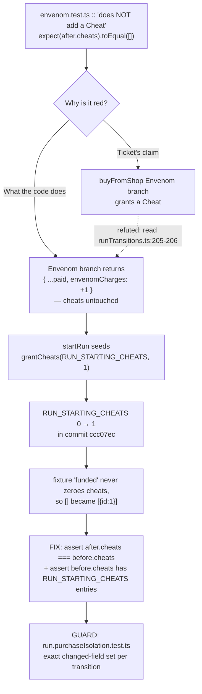

# Plan: DLR-127 — Buying Envenom also grants a Cheat

Plan folder: `.claude/contract/DLR-127-buying-envenom-also-grants-a-cheat/`
Execution status: see `tasks.md` in this folder.

---

## Part 1 — Alignment

### Task reference

Jira `DLR-127` (Bug, epic `DLR-103`, label `engine`), verbatim:

> Purchasing an Envenom charge in the shop also adds a Cheat to the player's held items. The player gets two things for one price.
>
> **Evidence:** `src/hunt/__tests__/envenom.test.ts :: "does NOT add a Cheat"` fails. The test was written to assert exactly this and has been red since before the 2026-08-23 sprint run — verified by stashing all in-flight work and running the suite against clean commit `3aa577b`, where it fails identically.
>
> **Scope:** the purchase path for Envenom only. Make the existing test pass without weakening it, and check the sibling purchase paths (Poison Guard, Whetstone, Flask) for the same defect while in there.
>
> **Found by:** the DLR-101 agent during the 2026-08-23 unattended sprint run, as a pre-existing failure unrelated to its own change. Raised so the run's other tickets can ignore it rather than burn fix rounds on it.

Run-context override (2026-08-23 unattended sprint run): the plan approval gate is auto-approved and every open question is resolved to this plan's own stated default, logged in `.claude/sprint-runs/2026-08-23-sprint/log.md`.

### Restated goal

Get `src/hunt/__tests__/envenom.test.ts :: "does NOT add a Cheat"` green while making it assert *more* than it does today, and put a durable guard around the whole purchase path so that "a purchase quietly granted something it did not charge for" cannot return silently for any shop item. The investigation that precedes this plan establishes the ticket's stated mechanism is **not** what is happening: `buyFromShop`'s `ShopItem.Envenom` branch returns `{ ...paid, envenomCharges: run.envenomCharges + 1 }` and touches `cheats` in no way. The single Cheat the assertion trips over is the run's *opening grant* — `startRun` seeds `grantCheats(RUN_STARTING_CHEATS, 1)`, and `RUN_STARTING_CHEATS` moved `0 → 1` in commit `ccc07ec` ("Version 4"). The spec's fixture helper `funded` builds on `startRun()` and never zeroes `cheats`, so `toEqual([])` has been asserting the run's opening loadout rather than the purchase's effect ever since. The fix is therefore in the spec, not in `runTransitions.ts` — and the replacement assertion must be strictly stronger, not a relaxation that would let a real double-grant through.

### In scope

- Re-point `envenom.test.ts :: "does NOT add a Cheat"` at the invariant it was written to protect: the Envenom purchase leaves the held-Cheat list **identical to the list the run held before the purchase**, not merely empty.
- Make that assertion non-vacuous: it must fail if the fixture ever stops holding a Cheat, so a future retune of `RUN_STARTING_CHEATS` back to `0` cannot silently turn the guard into a tautology.
- A new regression spec covering **every** shop purchase and the flask, asserting each transition changes exactly the run fields it is meant to change and leaves every other field byte-identical — so this class of defect (a purchase granting a second thing) is caught for Cheat, Envenom, Poison Guard, Whetstone, Heal and `drinkFlask` at once.
- An explicit written finding, in `pr-description.md`, that no production defect was found and why the ticket's stated mechanism does not hold.

### Explicitly out of scope

- **Any change to `src/hunt/runTransitions.ts`, `src/hunt/shop.ts`, or `src/hunt/cheats.ts`.** The purchase path is correct; editing correct production code to satisfy a mis-specified assertion would be the actual regression.
- **Any change to `RUN_STARTING_CHEATS` or any other value in `src/hunt/config.ts`.** Whether a run opens holding one Cheat is a tuning value and the developer's alone (`.claude/workflow/web-project.md` → Developer-owned work). It is raised under Risks, not decided here.
- Any UI change. `src/app/**` is untouched; nothing rendered changes.
- Re-pricing, re-capping, or otherwise re-balancing any shop item.
- The other twenty-one tickets of the sprint run, and the pre-existing repo-wide `format:check` failure noted in `web-project.md`.

### Pattern Reference

- `src/hunt/__tests__/run.shop.test.ts` — the sibling shop spec, and the direct precedent for the fix: its fixtures are written `{ ...startRun(), coins: 5, cheats: [] }`, explicitly zeroing `cheats` because they assert against an absolute list. Its line 45 (`expect(twice.cheats.length).toBe(run.cheats.length + 1)`) is the *relative* form this plan adopts — an assertion against the pre-purchase value rather than a hard-coded literal.
- `src/hunt/__tests__/poisonGuard.test.ts` and `src/hunt/__tests__/run.whetstone.test.ts` — the sibling-item specs named in the ticket, both of which pass `run.cheats` through rather than asserting a literal, which is why neither is red.
- `.claude/skills/react-frontend/SKILL.md` → Testing: pure logic is tested without a renderer, plain function-in/value-out.

### Constraints flagged on the brief

- **"Make that test pass without weakening it."** The replacement assertion must be strictly stronger than `toEqual([])`. Deleting the test, marking it `.skip`, or relaxing it to `expect(...).toBeDefined()` all fail this constraint.
- **The full suite must end at 0 failures.** The run's baseline is 1061 passed / 1 failed of 1062; this ticket's bar is a fully green suite.
- **Check the sibling purchases for the same defect and say so.** A finding of "no defect" is an acceptable answer only if it is backed by a test that would have caught one.
- `src/hunt/**` is a lint-enforced pure-core tree (`eslint.config.js`): no React import, no DOM global. A spec added there inherits that.

### Assumptions made

- **The correct purchase behaviour is: one purchase changes exactly one run field, plus `coins`.** This is the reading the whole `buyFromShop` switch already encodes and that its own docblock defends ("a `switch` with no `default`, so a FOURTH item is a compile error here rather than an item that silently does whatever the last branch happened to do"). The alternative reading — that an Envenom purchase is *meant* to bundle a Cheat and the shop is under-delivering — is rejected: no design document, ticket, or acceptance criterion anywhere describes a bundled purchase, `ENVENOM_PRICE` is `2` against `CHEAT_PRICE` of `1` with no note of a bundle, and the ticket itself frames the extra Cheat as the bug. This is a game-design reading made without the developer available; it is logged as such.
- **`RUN_STARTING_CHEATS = 1` is intended and stays.** It was set deliberately in `ccc07ec`. The alternative — that the config value is the bug and the assertion was right — would be a gameplay change (the player's opening loadout) and is a developer decision, so it is raised under Risks rather than taken.
- **The ticket's "Flask" sibling means `drinkFlask`, not a shop item.** `SHOP_ITEMS` holds `[Cheat, Envenom, PoisonGuard, Whetstone, Heal]`; the flask is not purchasable, it is a between-fights action on the same run state. It is covered as a transition rather than skipped on a technicality.
- **The new regression spec is a separate file, not more cases appended to `envenom.test.ts`.** It covers six transitions across four items; `envenom.test.ts` is the Envenom spec and a cross-item table inside it would be found by nobody looking for Whetstone behaviour.
- **The guard is written as a field-by-field diff over `RunState`, not as a list of per-item assertions.** A per-item assertion list only catches the fields somebody thought to name; a diff catches a field added to `RunState` next month and quietly written by a purchase branch.
- **`spec.md` is not created.** The brief is the Jira ticket, quoted above in full; no spec was primed under `.claude/contract/specs/`.

### Config and persisted-shape audit

- **No configuration key is added, renamed, retyped, or removed.** `src/hunt/config.ts` is not in any task's `**Files:**` block.
- **`RUN_STARTING_CHEATS` — read, not changed.** `Get-ChildItem src -Recurse -Include *.ts,*.tsx | Select-String -Pattern "RUN_STARTING_CHEATS"` returns **13** hits across **6** files, run 2026-08-23: `src/hunt/config.ts:201` (the declaration), `src/hunt/run.ts:14` (import), `run.ts:143-144` (`grantCheats(RUN_STARTING_CHEATS, 1)` and the `nextCheatId` seed beside it), `src/hunt/cheats.ts:18` (docblock prose), `src/hunt/index.ts:40` (re-export), `src/hunt/__tests__/config.test.ts:16,123,124,125` and `src/hunt/__tests__/run.test.ts:9,292,293` (existing specs that already assert against the key rather than a literal — the precedent this plan follows). **No hit is edited**; the new spec adds a fourteenth by importing it.
- **Nothing persisted is affected.** `src/persistence/**` is the only tree that touches storage, and `RunState` is not persisted — every one of its fields carries the docblock note "NEVER persisted, exactly as `coins` above". `.claude/rules/save-data-versioning.md` reject conditions 1–6 are all inapplicable: no storage global, no key composition, no envelope, no `SAVE_SCHEMA_VERSION` bump, no `as T` cast, no swallowed read failure.
- **No type change and therefore no loss.** No `number → string`, no array → object, no required → optional, no widened union. `RunState`, `ShopItem`, `CheatCard` and every signature in `runTransitions.ts` are untouched.
- **Consumers of the changed surface: zero.** The only files changed are two specs, and nothing imports a spec. `Get-ChildItem src -Recurse -Include *.ts,*.tsx | Select-String -Pattern "envenom\.test"` returns **3** hits, all of them prose inside other specs' header comments citing the file-split precedent (`roundReducer.poison.test.ts:18`, `WarCouncilRound.test.tsx:39`, `run.whetstone.test.ts:3`) — no import, no code reference.
- **The pure-core boundary is not crossed.** Both spec files sit under `src/hunt/__tests__/`, import only from `../config`, `../run`, `../shop`, `../types`, and name no React import and no DOM global — which `npm run lint` enforces on `src/hunt/**` via `eslint.config.js`'s `no-restricted-imports` / `no-restricted-globals` override.

---

## Part 2 — Technical design

### Approach

The whole change is two spec files. Production code is correct and stays untouched, and the plan's main job is to make sure the replacement assertion is a genuine strengthening rather than a quiet accommodation of a red test.

**The failing assertion, and what replaces it.** Today the spec reads `expect(buyFromShop(funded(3), ShopItem.Envenom).cheats).toEqual([])`. That asserts the *absolute* contents of the run's Cheat list after a purchase, which conflates two separate facts — what the run opened holding, and what the purchase did. Only the second is Envenom's business. The replacement binds the run before and after, then asserts `after.cheats` is `toEqual(before.cheats)` and, additionally, `toBe(before.cheats)` — the same array *reference*, since `buyFromShop`'s Envenom branch spreads `run` and must not rebuild the list at all. That is strictly stronger than the original on three counts: it catches an added Cheat (the original's only catch), it catches a *removed* Cheat (which the original would have passed silently once `RUN_STARTING_CHEATS` was `0`), and it catches a needless reallocation. It is then made non-vacuous by asserting `before.cheats` has `RUN_STARTING_CHEATS` entries — imported from config, not written as `1` — so the guard fails loudly if the fixture ever stops carrying a Cheat, instead of degenerating into `expect([]).toEqual([])`. The alternative fix, changing `funded` to zero `cheats` the way `run.shop.test.ts`'s fixtures do, was rejected: it would go green, but it would go green by testing a run configuration the game never actually deals, and the assertion would stay absolute and stay brittle against the next config retune.

**The regression guard.** The ticket asks for the sibling purchases to be checked, and a class of defect that has already cost one sprint ticket deserves a test rather than a reading of the switch statement. The guard is one table-driven spec, `src/hunt/__tests__/run.purchaseIsolation.test.ts`, built around a single pure helper `changedFields(before, after)` that walks `Object.keys(before)` and returns the sorted names of the top-level `RunState` keys whose values are not `Object.is`-identical. Each case then asserts an exact set: buying a Cheat changes exactly `coins`, `cheats`, `nextCheatId`; Envenom exactly `coins`, `envenomCharges`; Poison Guard exactly `coins`, `poisonGuardHeld`; Whetstone exactly `coins`, `whetstones`; Heal exactly `coins`, `encounter`; and `drinkFlask` exactly `flaskCharges`, `encounter`. Asserting the exact set rather than spot-checking individual fields is what makes this catch the *next* one: a branch that starts writing a field nobody thought to name still fails, and so does a `RunState` field added later and written by accident.

Comparing top-level keys with `Object.is` is deliberate and is what keeps the helper honest for a module written entirely as immutable spreads — every branch of `buyFromShop` returns `{ ...paid, … }`, so an untouched field is the *same reference*, and reference equality is therefore an exact test of "was this field written". It does mean the `encounter` field reads as changed for the Heal and the flask, which is correct: `healedBy` rebuilds `encounter` to raise player health, and that is exactly the field those two are meant to write. The two rejected alternatives: a deep-equality diff would report the Heal's `encounter` as unchanged when the player is already at full health and would mask a genuine rebuild, and a hand-written per-item assertion list would only ever cover the fields its author remembered.

Both files are pure Vitest with no renderer, sitting beside the logic they test under `src/hunt/__tests__/`, matching the `react-frontend` skill's testing posture and inheriting the pure-core lint boundary that `eslint.config.js` places on `src/hunt/**`.

### Skills to invoke during execution

- `react-frontend` — governs everything under `src/`, including spec files: testing posture (Vitest, pure logic tested without a renderer, specs under `src/**/__tests__/`), the 400-line file budget, and the no-hard-coded-tunable rule that makes the new spec import `RUN_STARTING_CHEATS` rather than write `1`.

Rules to Read before executing: `.claude/rules/save-data-versioning.md` — audited above and inapplicable (nothing persisted is touched), but the folder scan is mandatory and this is its only entry.
Workflow reference to Read: `.claude/workflow/web-project.md` — owns every `Run:` command below, the `vitest run` constraint, and the `(Get-Content <path>).Count` line-count form.

No developer override was applied to this list: the run is non-interactive and the Step 1.5c `AskUserQuestion` confirmation was skipped per the sprint-run override.

### Diagram



### Data shapes

No production type, config, or contract changes. The only new shape is a test-local helper in the new spec:

#### `src/hunt/__tests__/run.purchaseIsolation.test.ts` — test-local

```ts
/** The top-level `RunState` keys whose values differ by reference between two runs, sorted.
 *  Reference equality is exact here because every transition in `runTransitions.ts` is an
 *  immutable spread: an untouched field is the same object, never a rebuilt equal one. */
function changedFields(before: RunState, after: RunState): readonly string[]
```

Consumed only within that file, as `expect(changedFields(before, after)).toEqual([...])` against a sorted literal set per case. No export, so nothing outside the spec can bind to it.

#### `src/hunt/__tests__/envenom.test.ts` — no new shape

The existing `funded` helper and its `(coins: number) => RunState` signature are unchanged. Only the body of the one `it('does NOT add a Cheat')` block changes, plus one added import of `RUN_STARTING_CHEATS` from `../config`.

### Runtime quality notes

- **Purity and adjudication:** Both files are pure Vitest specs under `src/hunt/__tests__/`, importing only `../config`, `../run`, `../shop` and `../types`. No React import, no DOM global, no renderer — which is both the `react-frontend` testing posture and what `eslint.config.js`'s pure-core override on `src/hunt/**` enforces. No production adjudication moves anywhere; no component gains logic. The one tunable the new spec needs, `RUN_STARTING_CHEATS`, is imported from `src/hunt/config.ts` rather than written as `1`, so a retune moves the assertion with it.
- **Effects, mount and teardown:** Trivial — no concerns. No component, hook, effect, listener, observer, timer, `requestAnimationFrame` or `AbortController` is created or touched; there is nothing to mount and nothing to clean up. No module-level mutable state is introduced in either spec: every fixture is built inside its own `it` block from `startRun()`, so no state leaks between cases in a file.
- **Hot-path cost:** Trivial — no concerns. Nothing here runs at interaction time. `changedFields` walks the ~16 top-level keys of one `RunState` object once per assertion, in a spec that executes a handful of times; the existing `envenom.test.ts` file runs in 7ms today and this adds nothing measurable.
- **Determinism and numeric safety:** Fully deterministic and already enforced. `Math.random()` is unreachable from `src/hunt/**` — Cheat ids are minted from `RunState.nextCheatId`, which `cheats.ts` documents as deliberate for exactly this reason — so every fixture built from `startRun()` is byte-identical run to run. No division, no epsilon, no float comparison, and therefore no divisor to guard and no `NaN` reachable from any asserted value.
- **Error paths:** Nothing is caught and nothing is swallowed. The one case that exercises a throw is the existing `expect(() => buyFromShop(funded(ENVENOM_PRICE - 1), ShopItem.Envenom)).toThrow(RangeError)`, which is untouched. The new spec asserts only on successful transitions and deliberately does **not** wrap any call in `try`/`catch`: an unexpected `RangeError` from a purchase must fail the spec loudly rather than be absorbed into a passing "no fields changed" reading. No async surface is added, so the four async states do not arise.

### Risks and judgement calls

- **The ticket's stated root cause is wrong, and this plan says so rather than implementing it.** DLR-127 asserts the Envenom purchase grants a Cheat; `runTransitions.ts:205-206` shows it does not. The plan therefore changes a spec, not the shop. If the developer disagrees — if a purchase really is supposed to bundle a Cheat — then this plan is fixing the wrong file and the correct change is in `buyFromShop`. **Developer to confirm.**
- **`RUN_STARTING_CHEATS = 1` is taken as intended.** The alternative diagnosis is that the config value is the bug, the run is meant to open with no Cheats, and the original assertion was right all along. That is a tuning value and a gameplay change, so this plan does not touch it. **Developer decides whether a run opens holding a Cheat.**
- **"Without weakening it" is a judgement call this plan makes on the developer's behalf.** The plan's position is that asserting `after.cheats === before.cheats` with a non-vacuity check is *stronger* than `toEqual([])`. A reader who takes "without weakening" to mean "without editing the test file at all" would read this as non-compliant — but under that reading no fix exists at all, since the production code is already correct.
- **The regression guard compares top-level `RunState` fields by reference.** If a future transition is rewritten to rebuild an untouched field with an equal-but-new object, the guard will report a false positive and fail. That is the intended trade — a false positive is a five-minute read of a diff; the false negative the deep-equality alternative would give is another DLR-127.
- **No behaviour can only be judged by playing.** Nothing rendered changes and no tuning value moves, so there is nothing for the developer to look at in the running app for this ticket. The two bullets above are document decisions, not play-session ones.
- No new dependency is required; the two runtime deps are untouched.
