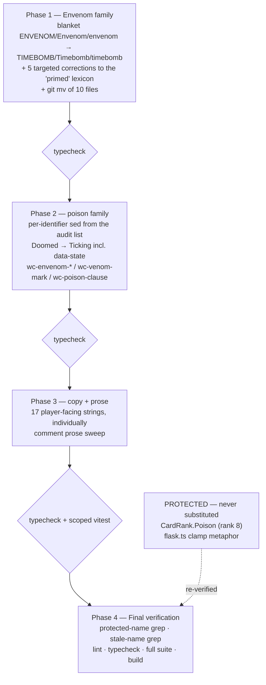

# Plan: Retire the Envenom name and the duplicate mechanic — Timebomb is canonical

Plan folder: `.claude/contract/DLR-129-retire-the-envenom-name/`
Execution status: see `tasks.md` in this folder.

---

## Part 1 — Alignment

### Task reference

Jira **DLR-129** (Task, epic DLR-103, labels `engine` + `ui`), verbatim scope from the ticket description:

> Timebomb has replaced Envenom, but only in the new buff-pile representation. The mechanic currently exists twice.
>
> 1. Rename the live mechanic to Timebomb throughout `src/app/` and the shop path — identifiers, CSS class names, and all player-facing copy.
> 2. Retire the duplicate: the live path should consume the `buffCatalog.ts` representation, not a parallel one. Delete `CheatStage`/`EnvenomStage` if they are then dead.
> 3. Keep `ENVENOM_QUARRY_DAMAGE` / `ENVENOM_PLAYER_DAMAGE` as the single source of the bronze figures, renamed to match, so no number changes value in this ticket.
> 4. Player-facing copy currently reads "poisoned" (e.g. the health bar's "10 of 10. 4 poisoned."). Decide whether Timebomb keeps poison vocabulary or takes its own, and apply it consistently. **This is a copy judgement and belongs to the developer.**
>
> **Constraint:** no behaviour or tuning value changes. This is a rename and a de-duplication only. The suite must stay fully green.

Run-level instruction added by the sprint coordinator (2026-08-23), superseding scope item 4's hand-off: **the copy decision is delegated to this run** — decide rather than stall, log the decision and the rejected alternative, and the developer reviews at the end. The plan approval gate and the mockup gate are both skipped for this out-of-band item.

### Restated goal

The delayed-damage mechanic is called Envenom in every line of live code and Timebomb in the inert buff-catalogue representation that will replace it. This ticket makes **Timebomb the only name**: a repo-wide rename of every Envenom-family identifier, file name, CSS class, test name, and player-facing string; a matching rename of the poison-vocabulary surface that dresses the same mechanic (including the `Poison Guard` shop item, whose name only means anything relative to poison); and a rename of the two tuning constants that remain the single source of the bronze figures `buffCatalog.ts` multiplies. **No number changes value and no behaviour changes.** The suite ends at the same 1192/1192 it started at.

### In scope

- Rename every `Envenom`/`envenom`/`ENVENOM` identifier across `src/hunt/`, `src/warCouncil/`, and `src/app/` to the Timebomb family, including exported names re-exported through `src/hunt/index.ts` and `src/warCouncil/index.ts`.
- `git mv` the four Envenom-named files: `src/warCouncil/envenom.ts`, `src/app/warCouncil/EnvenomCharge.tsx`, `src/app/warCouncil/warCouncilEnvenom.css`, and the six Envenom/poison-named spec files, resolving the two rename collisions the naive mapping produces.
- Rename `ENVENOM_QUARRY_DAMAGE` → `TIMEBOMB_QUARRY_DAMAGE` and `ENVENOM_PLAYER_DAMAGE` → `TIMEBOMB_PLAYER_DAMAGE` in `src/hunt/config.ts`, keeping them the values `buffCatalog.ts`'s bronze row reads. Same for `ENVENOM_PRICE` → `TIMEBOMB_PRICE`.
- Rename the poison-vocabulary identifiers that name this mechanic: `poisonToPlayer`/`poisonToQuarry`/`poisonGuarded`/`poisonPending`, `PoisonGuard`/`poisonGuardHeld`/`poisonGuardSpent`/`POISON_GUARD_PRICE`, `poisonBookedText`, `VENOM_MARK_LABEL`.
- Rename the `Doomed`/`doomed` heart state and the `HealthBarView.doomed` field to the new vocabulary, including the `[data-state='doomed']` CSS selector.
- Rename the CSS classes `wc-envenom-*`, `wc-venom-mark`, `wc-poison-clause`.
- Apply the chosen copy vocabulary (see Assumptions) to every player-facing string, and update the comment prose that names the mechanic by its old vocabulary.
- Update test names and test file names honestly — no assertion is weakened, none is deleted.

### Explicitly out of scope

- **Wiring the live path onto `buffCatalog.ts`.** See Assumptions and Risks: this is the ticket's scope item 2, and it cannot be done without behaviour change. The rename is delivered in full; the de-duplication is left, deliberately and reported.
- Deleting `CheatStage` / `TimebombStage` — they are the live felt-rail state machines and are not dead.
- `CardRank.Poison` (rank 8) and everything referencing it. It is the base rulebook's card name transcribed from `fox-in-the-forest.md`, has no rule attached, and has no connection to this mechanic — `src/warCouncil/types.ts:78` already says so in as many words.
- Anything in `src/hunt/apConfig.ts`, `buffCosts.ts`, `buffAccrual.ts`, `buffActivation.ts` beyond the mechanical rename of an Envenom-family name it happens to reference. DLR-108's work stays unreachable; DLR-114/DLR-116 wire it.
- The carried-forward defects `Keepsake` (possibly unfireable) and `Ward` silver/gold indistinguishability.
- Any tuning value. Every number keeps its current value.
- `.docs/` — `the-hunt.md` and `.docs/implementation/` are maintained by `implementation-doc-writer` on the `/fb-apply` run, not hand-edited here.

### Pattern Reference

- `src/hunt/buffCatalog.ts` — the canonical Timebomb naming this rename converges on (`TIMEBOMB_DAMAGE`, `TimebombDamage`, `timebombBuff`, `timebombDamageOf`, `BuffKind.Timebomb`). New names must not collide with these.
- `src/warCouncil/types.ts:72-85` — the existing doc comment on `envenomedCards` that already explains why nothing in this feature is called `poison`; the rename makes that comment true.
- `.claude/skills/game-ux/SKILL.md` — owns screen copy standards, loaded for the copy decision.
- `.claude/skills/react-frontend/SKILL.md` — owns everything under `src/`.
- `.claude/workflow/web-project.md` → Correctness traps → "String-bound names live outside the compiler's view" — the governing rule for this whole ticket.

### Constraints flagged on the brief

- **Rename and de-duplication only.** No behaviour change, no tuning value change, no new mechanic. A clean partial beats a behaviour change smuggled into a rename.
- **Baseline is 1192 passed of 1192 across 91 files.** The count must not move; if it does, the report must say why.
- `src/hunt/__tests__/run.purchaseIsolation.test.ts` asserts each shop purchase changes exactly one field. Its names are renamed; its assertions are never weakened.
- The 400-line file budget is blocking and is fixed in-ticket.
- PowerShell corrupts em-dashes when it reads these UTF-8 files as ANSI — see Assumptions for the tooling consequence.
- Commit locally, never push.

### Assumptions made

- **The copy decision: Timebomb takes its own fuse vocabulary; poison vocabulary is retired.** *Rationale:* the mechanic is a single delayed detonation booked at one trick and paid at the next — a fuse, not a damage-over-time effect. "Poison" actively mis-signals: it implies recurring ticks and a curable condition, and it forces the player to hold two names for one thing the moment the rail says "Timebomb" and the health bar says "poisoned". **Rejected alternative: keep poison vocabulary under the Timebomb name.** It is cheaper (roughly 200 fewer string and comment edits) and it preserves the `Poison Guard` item name untouched, but it institutionalises exactly the two-names-for-one-mechanic split this ticket exists to close, and it leaves the `doomed` heart — booked, unpreventable damage — described by a word that promises the opposite of unpreventable.
- **The chosen lexicon, applied on every surface:** the mechanic and the shop item are **Timebomb**; marking a card is **prime** (a **primed** card); damage booked and unpreventable is **ticking**; the hit landing is **detonates**. Each concept gets exactly one word, and no word does two jobs.
- **`Poison Guard` becomes `Blast Guard`.** *Rationale:* the item's entire meaning is "insurance against your own [mechanic] backfiring". Leaving it named Poison Guard beside a Timebomb rail is the same incoherence in a smaller box. `Guard` is retained so `SHOP_GUARD_LABEL` and the `GuardAlreadyActive` refusal still read naturally; only the modifier moves. This is the single largest ripple of the copy decision and the easiest to reverse — the log records every site.
- **The `Doomed` heart state becomes `Ticking`.** *Rationale:* it is the visual for booked-but-unpreventable damage, which is precisely "a bomb already ticking"; and the CSS `[data-state]` value is a string-bound name that must move with the enum in the same task.
- **`envenomedCards` / `isEnvenomed` / `trickIsEnvenomed` / `envenomCard` become `primedCards` / `isPrimed` / `trickIsPrimed` / `primeCard`, not `timebombed*`.** *Rationale:* these name the **mark on a card**, which the lexicon calls "primed"; `isTimebombed` is not English and would put the identifier at odds with the copy it feeds.
- **The de-duplication (scope item 2) is not delivered.** *Rationale:* `buffCatalog.ts` is representation only — nothing in `src/` activates a buff or reads the pile, by DLR-107's own design. Making the felt rail consume it means wiring the buff pile, `BuffActivationState`, and AP spending into `RoundUiState`, which is a behaviour change and is DLR-114/DLR-116's ticket. The brief's own escape hatch applies: rename in full, leave the de-duplication, say so plainly. `TIMEBOMB_QUARRY_DAMAGE`/`TIMEBOMB_PLAYER_DAMAGE` remaining the single source `buffCatalog.ts` multiplies means the two representations still cannot diverge numerically, which is the property the duplication actually threatened.
- **Bulk edits are performed with `sed` through the Bash tool, not PowerShell.** *Rationale:* this repo's source is UTF-8 and dense with em-dashes; PowerShell reads it as ANSI and corrupts them on write. Byte-level `sed` was verified on this machine to round-trip `U+2014` intact before any file was touched. The scale — 953 `envenom` and 451 `poison` occurrences — makes per-occurrence `Edit` calls impractical, and a corrupted em-dash is a silent diff that no gate catches.
- **No developer override of the skill list was applied** — this run is non-interactive by instruction, so Step 1.5c's `AskUserQuestion` was not presented and the proposed list stands.
- **Nothing is persisted, so there is no migration.** Verified: `src/persistence/` contains no Envenom or poison field name, and no module outside `src/persistence/` imports `createSaveStore`. The save layer is generic and unwired. This is the cheap window, and it closes the first time run state is persisted.

### Config and persisted-shape audit

Every count below is `grep -ro "<name>" src/ | wc -l` run against the working tree at `a1770f0`.

- **Config keys renamed, with their hit counts:** `ENVENOM_QUARRY_DAMAGE` 34, `ENVENOM_PLAYER_DAMAGE` 34, `ENVENOM_PRICE` 15, `POISON_GUARD_PRICE` 14. All four are declared in `src/hunt/config.ts` and re-exported through `src/hunt/index.ts`. Every hit is inside `src/` and is changed in the same task as the declaration.
- **Engine and app identifiers renamed, with hit counts:** `envenomCharges` 181, `poisonGuardHeld` 126, `envenomedCards` 64, `EnvenomStage` 51, `pendingEnvenom` 41, `queueEnvenom` 35, `NO_PENDING_ENVENOM` 31, `PoisonGuard` 30, `envenomArmed` 25, `isEnvenomed` 24, `envenomTarget` 24, `poisonToQuarry` 21, `envenomCard` 20, `poisonToPlayer` 17, `poisonGuardSpent` 16, `poisonGuarded` 15, `envenomTrick` 14, `hasPendingEnvenom` 11, `trickIsEnvenomed` 11, `poisonPending` 8, `envenomDamageFor` 6, `poisonBookedText` 3, `VENOM_MARK_LABEL` 1.
- **String-bound names (outside the type checker's view):** CSS classes `wc-envenom*` 16, `wc-venom-mark` 4, `wc-poison-clause` 2; the `[data-state]` value `doomed` 48 (of which 8 are the `Doomed` enum member). Each stylesheet selector and each enum member move in the same task, per `web-project.md`'s string-bound-name trap.
- **Type changes and loss:** none. Every rename is name-for-name at an identical type. No `number` → `string`, no array → object, no required → optional, no union widening. `BuffKind` is untouched — it already carries `Timebomb`.
- **Collision check against the existing canonical names.** `src/hunt/buffCatalog.ts` already exports `TIMEBOMB_DAMAGE`, `TIMEBOMB_TIER_MULTIPLIER`, `TimebombDamage`, `timebombBuff`, `timebombDamageOf`. The new names `TIMEBOMB_QUARRY_DAMAGE`, `TIMEBOMB_PLAYER_DAMAGE`, `TIMEBOMB_PRICE`, `timebombDamageFor` are all distinct from those, but `timebombDamageFor` (the encounter-side helper, from `envenomDamageFor`) sits one preposition away from `timebombDamageOf` (the buff-side helper). Both are re-exported from `src/hunt/index.ts`. Flagged in Risks; not renamed further, because inventing a third name is a design decision this ticket has no mandate for.
- **File-name collisions the naive mapping produces:** `src/app/warCouncil/__tests__/roundReducer.envenom.test.ts` and `roundReducer.poison.test.ts` both map to `roundReducer.timebomb.test.ts`. Resolved by splitting on what each actually covers — the former is the rail/stage/marking, the latter is the queue write and payment. Same for `src/hunt/__tests__/envenom.test.ts` and `poisonGuard.test.ts`, resolved as `timebomb.test.ts` and `blastGuard.test.ts`.
- **Persisted shapes:** none affected. `grep -rn "envenom\|poison" src/persistence/` returns zero hits, and no file outside `src/persistence/` imports `createSaveStore`. Nothing writes run state to storage yet, so there is no stored record to migrate or reject.
- **Names the rename must NOT touch:** `CardRank.Poison` (`src/warCouncil/types.ts:23`, value 8) and its two doc-comment references, and `src/hunt/flask.ts:38,60` where "poison" is used metaphorically about a clamp. A blanket `poison` substitution would silently rename a base-game card rank. Every poison-family substitution is therefore per-identifier, never a bare word replacement.
- **Architectural boundary:** the pure-core boundary on `src/warCouncil/**` and `src/hunt/**` is lint-enforced, not grep-enforced, and this rename adds no import and no global. `npm run lint` in Final verification is the check.

---

## Part 2 — Technical design

### Approach

This is a rename, so the design question is not *what shape* but *in what order, with what tool, and where the atomicity boundaries sit*. Three phases of substitution, each ending with the tree type-checking, then a verification phase.

**Tooling.** The substitutions are performed with `sed -i` invoked through the Bash tool, file-list-scoped, one identifier per expression. Two reasons, both load-bearing. First, PowerShell on this machine reads these UTF-8 files as ANSI and corrupts every em-dash it writes back; this source is dense with them, and a mangled em-dash is a silent diff no gate catches. `sed` operating on bytes was verified to round-trip `U+2014` before any file was touched. Second, 953 `envenom` plus 451 `poison` occurrences is not a volume that per-occurrence `Edit` calls can carry reliably. The alternative considered and rejected was an IDE-style rename via the TypeScript language service — unavailable here, and it would in any case miss the string-bound half of the job (CSS selectors, `data-state` values, test names, copy) which is exactly where this project's renames break.

**Phase 1 — the Envenom family.** A single mechanical substitution of `ENVENOM` → `TIMEBOMB`, `Envenom` → `Timebomb`, `envenom` → `timebomb` across `src/**`, followed immediately by four targeted corrections that put the mark-on-a-card identifiers onto the lexicon's word (`timebombedCards` → `primedCards`, `isTimebombed` → `isPrimed`, `trickIsTimebombed` → `trickIsPrimed`, `timebombCard` → `primeCard`, and the `timebombed` prop on `PlayingCard`/`DecreePile` → `primed`). The blanket-then-correct order is deliberate: the blanket pass is provably exhaustive for a token that appears nowhere else in the repo, and the corrections are four small, greppable sets. Doing it the other way round means hand-maintaining an exclusion list. File renames go through `git mv` in this phase so history follows, with the two collisions resolved by name as the audit records.

**Phase 2 — the poison family.** This one cannot be a blanket pass: `CardRank.Poison` is a base-game card rank with no connection to this mechanic, and `flask.ts` uses "poison" as a metaphor about a clamp. So Phase 2 is one `sed` expression per identifier, from the enumerated audit list, plus the `Doomed`/`doomed` → `Ticking`/`ticking` move and the three CSS class renames. The `[data-state='doomed']` selector and the `DuelHeartState.Doomed` member change in the **same** task, because the stylesheet binds to the enum's string value and the compiler sees neither side of that binding.

**Phase 3 — copy and prose.** The player-facing strings are edited individually against the before/after table in Data shapes, because each is a sentence rather than a token and several change more than the noun. The comment prose that still says "poison" about this mechanic is swept in the same phase; the two protected sites are re-verified untouched at the end of it.

**Nothing moves between modules.** No logic changes layer, no new pure module appears, and no component gains or loses a decision. The purity boundary, the reducer/state split in `roundUiState.ts` vs `roundReducer.ts`, and the `labels.ts` copy seam all stay exactly where they are — a rename that also moves code is a rename nobody can review.

### Skills to invoke during execution

- `react-frontend` — owns everything under `src/`: the naming conventions the new identifiers must satisfy, the 400-line budget, and the testing posture for the renamed specs.
- `game-ux` — owns screen copy standards; governs the fuse-vocabulary decision and its application across the health bar, the felt rail, the shop panel, and every accessible name.
- `implementation-doc-writer` — invoked after the gates go green to refresh `.docs/implementation/` and `.docs/game_rules/the-hunt.md`, both of which name the mechanic throughout.

Rules to Read: `.claude/rules/save-data-versioning.md` (the audit found no persisted field affected, but the rule owns that judgement). Always: `.claude/workflow/web-project.md`.

No developer override was applied — this run is non-interactive by instruction.

### Diagram



### Data shapes

No type changes. Every entry below is a name-for-name rename at an identical type.

#### `src/hunt/config.ts` — tuning constants (values unchanged)

```ts
export const TIMEBOMB_PRICE: Coins = 2          // was ENVENOM_PRICE
export const TIMEBOMB_QUARRY_DAMAGE: Damage = 4 // was ENVENOM_QUARRY_DAMAGE
export const TIMEBOMB_PLAYER_DAMAGE: Damage = 2 // was ENVENOM_PLAYER_DAMAGE
export const BLAST_GUARD_PRICE: Coins = 1       // was POISON_GUARD_PRICE
```

`src/hunt/buffCatalog.ts`'s `timebombRow()` continues to read the two damage constants, so the bronze row remains today's live pair by construction.

#### `src/warCouncil/timebomb.ts` (was `envenom.ts`)

```ts
export function isPrimed(primedCards: readonly Card[], card: Card): boolean
export function trickIsPrimed(primedCards: readonly Card[], trick: readonly TrickCard[]): boolean
export function primeCard(state: RoundState, side: PlayerSide, card: Card): RoundState
```

#### `src/warCouncil/types.ts`, `bank.ts`, `legalMoves.ts`

```ts
// RoundState
readonly primedCards: readonly Card[]            // was envenomedCards
// TrickResolution
readonly timebombTarget: DuelSide | null         // was envenomTarget
readonly timebombToQuarry: Damage                // was poisonToQuarry
readonly blastGuardSpent: boolean                // was poisonGuardSpent
// BankTrick
readonly timebombTrick: boolean                  // was envenomTrick
readonly timebombToPlayer: Damage                // was poisonToPlayer
readonly timebombToQuarry: Damage                // was poisonToQuarry
readonly blastGuarded: boolean                   // was poisonGuarded
// LegalMoveOptions
readonly timebombToPlayer?: Damage
readonly timebombToQuarry?: Damage
readonly blastGuarded?: boolean
// ApplyDamageStock
readonly timebombPending: boolean                // was poisonPending
```

#### `src/hunt/` — encounter, shop, run

```ts
readonly pendingTimebomb: IncomingDamage         // EncounterState, was pendingEnvenom
export const NO_PENDING_TIMEBOMB: IncomingDamage // was NO_PENDING_ENVENOM
export function hasPendingTimebomb(e: EncounterState): boolean
export function queueTimebomb(...): EncounterState
export function timebombDamageFor(side: DuelSide): Damage   // was envenomDamageFor
ShopItem.Timebomb                                // was ShopItem.Envenom
ShopItem.BlastGuard                              // was ShopItem.PoisonGuard
readonly timebombCharges: number                 // RunState, was envenomCharges
readonly blastGuardHeld: boolean                 // RunState, was poisonGuardHeld
```

#### `src/app/warCouncil/` — UI state and view

```ts
export const TimebombStage = { Poised: 'poised', Armed: 'armed' } as const  // was EnvenomStage
export type TimebombStage = (typeof TimebombStage)[keyof typeof TimebombStage]
// RoundUiState / RoundUiSeed
readonly timebombCharges: number
readonly timebombStage: TimebombStage | null
readonly blastGuardHeld: boolean
// RoundUiActionKind
TapTimebomb: 'tapTimebomb'
CancelTimebomb: 'cancelTimebomb'
export function timebombArmed(state: RoundUiState): boolean
// DuelHeartState
Ticking: 'ticking'                               // was Doomed: 'doomed'
// HealthBarView / HealthBarOverlays
readonly ticking: Damage                         // was doomed
// PlayingCard / DecreePile props
readonly primed?: boolean                        // was envenomed
// CardMarks
readonly primed?: boolean                        // was envenomed
```

#### Files renamed (`git mv`)

| From | To |
|---|---|
| `src/warCouncil/envenom.ts` | `src/warCouncil/timebomb.ts` |
| `src/warCouncil/__tests__/envenom.test.ts` | `src/warCouncil/__tests__/timebomb.test.ts` |
| `src/warCouncil/__tests__/playCard.envenom.test.ts` | `src/warCouncil/__tests__/playCard.timebomb.test.ts` |
| `src/hunt/__tests__/envenom.test.ts` | `src/hunt/__tests__/timebomb.test.ts` |
| `src/hunt/__tests__/poisonGuard.test.ts` | `src/hunt/__tests__/blastGuard.test.ts` |
| `src/app/warCouncil/EnvenomCharge.tsx` | `src/app/warCouncil/TimebombCharge.tsx` |
| `src/app/warCouncil/warCouncilEnvenom.css` | `src/app/warCouncil/warCouncilTimebomb.css` |
| `src/app/warCouncil/__tests__/EnvenomCharge.test.tsx` | `src/app/warCouncil/__tests__/TimebombCharge.test.tsx` |
| `src/app/warCouncil/__tests__/WarCouncilRound.envenom.test.tsx` | `src/app/warCouncil/__tests__/WarCouncilRound.timebomb.test.tsx` |
| `src/app/warCouncil/__tests__/roundReducer.envenom.test.ts` | `src/app/warCouncil/__tests__/roundReducer.timebomb.test.ts` |
| `src/app/warCouncil/__tests__/roundReducer.poison.test.ts` | `src/app/warCouncil/__tests__/roundReducer.timebombQueue.test.ts` |

#### CSS class and attribute renames

| From | To |
|---|---|
| `wc-envenom-rail` / `wc-envenom-plate` / `wc-envenom-glyph` / `wc-envenom-count` | `wc-timebomb-rail` / `wc-timebomb-plate` / `wc-timebomb-glyph` / `wc-timebomb-count` |
| `wc-venom-mark` | `wc-primed-mark` |
| `wc-poison-clause` | `wc-timebomb-clause` |
| `[data-state='doomed']` | `[data-state='ticking']` |

#### Player-facing copy — the full before/after table

| # | Site | Before | After |
|---|---|---|---|
| 1 | `shopLabels.ts` `SHOP_ENVENOM_LABEL` → `SHOP_TIMEBOMB_LABEL` | `Envenom held` | `Timebombs held` |
| 2 | `shopLabels.ts` `SHOP_GUARD_LABEL` | `Poison Guard` | `Blast Guard` |
| 3 | `shopLabels.ts` item name | `Envenom` | `Timebomb` |
| 4 | `shopLabels.ts` item name | `Poison Guard` | `Blast Guard` |
| 5 | `shopLabels.ts` Timebomb description | `Poison a card in your hand. The winner of the trick it is played into takes damage at the next trick — ${Q} for the Quarry, ${P} for you, and yours cashes out your streak.` | `Prime a card in your hand. The winner of the trick it is played into takes the blast at the next trick — ${Q} for the Quarry, ${P} for you, and yours cashes out your streak.` |
| 6 | `shopLabels.ts` Guard description | `Insurance for one fight. The next time your own poison lands on you, you still take the ${P} but your streak survives.` | `Insurance for one fight. The next time your own Timebomb detonates on you, you still take the ${P} but your streak survives.` |
| 7 | `shopLabels.ts` `GuardAlreadyActive` | `You are already holding a Poison Guard.` | `You are already holding a Blast Guard.` |
| 8 | `labels.ts` `cardAccessibleName` mark suffix | `poisoned` | `primed` |
| 9 | `labels.ts` `VENOM_MARK_LABEL` → `PRIMED_MARK_LABEL` | `Poisoned` | `Primed` |
| 10 | `labels.ts` health-bar clause | ` ${view.doomed} poisoned.` | ` ${view.ticking} ticking.` |
| 11 | `labels.ts` `ENVENOM_RAIL_LABEL` → `TIMEBOMB_RAIL_LABEL` | `Envenom` | `Timebomb` |
| 12 | `labels.ts` `ENVENOM_EMPTY_LABEL` → `TIMEBOMB_EMPTY_LABEL` | `No Envenom held` | `No Timebomb held` |
| 13 | `labels.ts` `ENVENOM_POISED_HINT` → `TIMEBOMB_POISED_HINT` | `Tap Envenom again to arm it` | `Tap Timebomb again to arm it` |
| 14 | `labels.ts` `ENVENOM_ARMED_HINT` → `TIMEBOMB_ARMED_HINT` | `Pick a card in your hand to poison` | `Pick a card in your hand to prime` |
| 15 | `labels.ts` `poisonBookedText` → `timebombBookedText` (player) | `Poison set — you take ${amount} at the next trick.` | `Timebomb primed — you take ${amount} at the next trick.` |
| 16 | `labels.ts` `timebombBookedText` (quarry) | `Poison set — they take ${amount} at the next trick.` | `Timebomb primed — they take ${amount} at the next trick.` |
| 17 | `labels.ts` apply-damage refusal | `A poison hit is still owed — you cannot apply until it lands.` | `A Timebomb is still ticking — you cannot apply until it detonates.` |
| 18 | `timebomb.ts` `RangeError` (not player-facing, changed for consistency) | `Cannot poison the ${rank} of ${suit} — it is not in the ${side}'s hand` | `Cannot prime the ${rank} of ${suit} — it is not in the ${side}'s hand` |
| 19 | `timebomb.ts` `RangeError` | `The ${rank} of ${suit} is already poisoned` | `The ${rank} of ${suit} is already primed` |

### Runtime quality notes

- **Purity and adjudication:** unchanged by construction. No logic crosses a layer, no component gains a decision, and every tunable stays in `src/hunt/config.ts` with its current value. The one thing to watch is that a substitution must never turn a literal number into a name or vice versa — the Final verification grep for the bare literals `4` and `2` is not meaningful, so the guard is instead that `git diff --stat` shows no change in `config.ts` beyond four identifier lines and their comments.
- **Effects, mount and teardown:** no effect, listener, observer, timer, `requestAnimationFrame`, or `AbortController` is created, removed, or re-scoped. No cleanup changes. StrictMode behaviour is identical because no initialiser's body changes.
- **Hot-path cost:** unchanged. No allocation, no loop, and no render path is added or removed; identifiers have no runtime cost.
- **Determinism and numeric safety:** no `Math.random()` is introduced and no seed path is touched. No divisor appears or disappears, so no new `NaN` surface exists. The four renamed numeric constants keep their exact values, which the `buffCatalog.ts` bronze-row test already pins.
- **Error paths:** the two `RangeError` messages in `timebomb.ts` change wording only — both still throw, on the same two conditions, with the same guard order in the reducer ahead of them. No failure is swallowed and no `catch` is added. The `GuardAlreadyActive` and apply-damage refusal reason **codes** are untouched; only the human strings they map to change.

### Risks and judgement calls

- **The copy decision itself is the developer's to overturn.** Fuse vocabulary over poison vocabulary is a judgement, made here only because this run's standing instruction is to decide rather than stall. The full before/after table above and the run log make reversing it a find-and-replace rather than an investigation.
- **`Poison Guard` → `Blast Guard` is the largest consequence of that decision** and the one most likely to be waved off. If the developer wants the item to stay `Poison Guard`, that is a one-line revert of the copy plus the `BlastGuard`/`blastGuard*` identifiers — but it then reads oddly beside a Timebomb, which is the whole argument for moving it.
- **`timebombDamageFor` (encounter side) now sits one preposition from `timebombDamageOf` (buff side)**, and both are exported from `src/hunt/index.ts`. Correct, compiles, and reads confusingly. Renaming either further is a design call this ticket has no mandate for; flagged for DLR-114/DLR-116, which will collapse the two anyway.
- **Scope item 2 — the de-duplication — is deliberately not delivered.** It cannot be done without wiring buff activation into the felt, which is a behaviour change. `CheatStage` and `TimebombStage` therefore survive. If the developer expected this ticket to close the duplication, it does not; it closes the *naming* duplication and leaves the *representational* one to DLR-114/DLR-116.
- **The blanket Phase 1 substitution is exhaustive but blind.** It will rewrite the word "Envenom" inside comments, ticket references (`DLR-90 — Envenom and the delayed hit rule`), and historical rationale, turning some of them into statements about a ticket name that no longer matches Jira. Phase 3's prose sweep reads these back; a few will need a hand to stay honest about what DLR-90 was called at the time.
- **A rename can only be proven complete by grep, and grep proves absence, not correctness.** The gates confirm nothing is broken; they cannot confirm the new copy reads well on screen. **Only the developer can judge whether "10 of 10. 4 ticking." and "Timebomb primed — you take 2 at the next trick." land right in the running app.** No mockup was produced for this UI ticket — the run instruction skips that gate — which matters more than usual here because the ticket changes what the player reads.
- **The test count must stay 1192.** Renaming a `describe` or a file cannot change it. If it moves, something was deleted or a file stopped being collected, and that is a defect, not a consequence of the rename.
</content>
</invoke>
