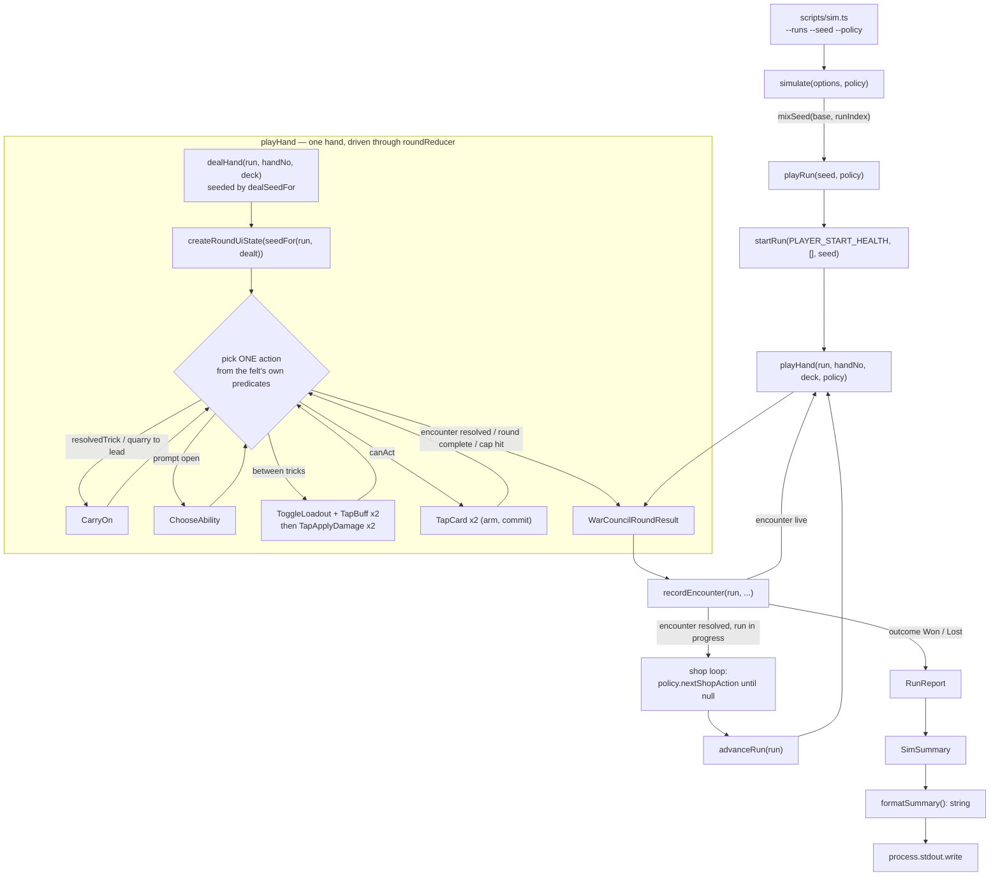

# Plan: Headless run simulator — play the game without a browser, for balance measurement

Plan folder: `.claude/contract/DLR-130-headless-run-simulator/`
Execution status: see `tasks.md` in this folder.

---

## Part 1 — Alignment

### Task reference

**Jira DLR-130** — *Headless run simulator: play the game without a browser, for balance measurement*. Task under epic **DLR-103**. Labels: `engine`, `infra`.

Ticket description, verbatim in substance:

> Build a headless driver that plays complete hands and complete runs by calling the engine directly, so the game can be *measured* rather than reasoned about on paper.
>
> **Why now.** Every tuning value in the V5 buff work was chosen by an agent during the 2026-08-23 unattended sprint run and none has ever been played: all 78 AP costs, the four per-hand caps (`MAX_MULTIPLIER_BONUS_PER_HAND` 6, `MAX_FLAT_DAMAGE_BONUS_PER_HAND` 12, `MAX_COIN_BONUS_PER_HAND` 10, `MAX_REFUND_PER_HAND` 6), `TIMEBOMB_TIER_MULTIPLIER` 1/2/3, gold Cheat at 7 AP. DLR-124's evidence for the caps is one hand computed by hand: seven buffs, 11 AP, 37 damage against 13 unbuffed, with a worst case of 186 uncapped. That is arithmetic on paper, one sample, one author. The developer's stated intent is a balance pass at the end of the epic to find out whether the game is winnable at all — this ticket is the tool that pass needs.
>
> **Why it is cheap.** The game already runs without a browser. `src/hunt/` is enforced pure, and the round is a reducer — a pure function of state and action. This is a driver over functions that already exist and are already deterministic, not new infrastructure.
>
> **Scope:**
>
> 1. A **runnable script** — the primary deliverable, not a test. `npm run sim` (or similar) plays N seeded runs and prints a readable summary: win rate, average hands per encounter, damage distribution, coins earned and spent, how often a run ends by health loss versus victory. The developer runs this by hand and reads the output while tuning.
> 2. **Seeded and deterministic.** The same seed must produce the same run, every time, so a tuning change can be attributed to the change rather than to noise. `src/hunt/` already forbids `Math.random()`; keep that discipline.
> 3. **A policy seam.** The simulated player needs *some* way of choosing a card and choosing whether to activate a buff. Ship at least a simple baseline policy, and make the policy pluggable so a better one can be dropped in later without rewriting the driver. State plainly in the docs what the baseline policy does, because every number the simulator prints is conditional on it.
> 4. **Reusable fixtures.** The deep states the driver can reach — a fight played out, a Timebomb bought, primed and detonated, a stacked multi-buff hand — should be exposed so component tests can assert what those states *render*. Browser QA has never been able to reach any of them, because coins only arrive when a fight is finished.
>
> **Explicitly out of scope:** balancing anything. This ticket ships the instrument, not the readings. Do not retune a single value on the strength of what the simulator prints — that is the developer's balance pass, and it happens after this lands.
>
> **Sequencing:** must land before DLR-119, DLR-120 and DLR-121, and before the developer's balance pass.

Invocation constraint added by the coordinator of the 2026-08-23 unattended run (2026-08-24): **no browser pass** — this ticket renders nothing. Reviewers scale to diff risk: new production tooling, so all three run.

### Restated goal

Ship a **runnable, terminating command** — `npm run sim` — that plays a configurable number of complete, fully seeded runs of the game by driving the existing pure engine (`src/hunt/`, `src/warCouncil/`) and the existing felt reducer (`src/app/warCouncil/roundReducer.ts`) with no React, no DOM and no browser, and prints a plain-text balance report the developer reads by eye while tuning: win rate, how runs end, hands per encounter, damage distribution, coin flow, AP and buff usage. The simulated player's decisions come from a **swappable policy object** behind a small interface, with one shipped `baselinePolicy` whose behaviour is written down in full, because every printed number is conditional on it. The same driver also exposes **deterministic deep-state fixtures** — a fight played out, a Timebomb primed and detonated, a hand with several buffs activated — so component specs can assert what those states render. Nothing about the game's rules or tuning changes.

### In scope

- A new pure module `src/sim/` holding the whole driver: policy interface, baseline policy, hand driver, run driver, aggregation, report formatting, fixtures — all DOM-free, React-free and `Math.random()`-free.
- A `SimPolicy` interface with four decision points (card, apply-damage press, buff activations, shop actions) and one shipped implementation, `baselinePolicy`, whose behaviour is documented exhaustively in its own docblock and in `.docs/implementation/`.
- A node CLI entry, `scripts/sim.ts`, that parses `--runs`, `--seed` and `--policy`, runs the simulation and writes the report to stdout. It always terminates.
- A `sim` script in `package.json` that builds that entry through Vite's SSR build and runs it under node — **a `package.json` change, called out explicitly**.
- A `tsconfig.scripts.json` project (plus its reference from `tsconfig.json`) so the node-facing CLI can use `process` without leaking `@types/node` globals into `src/`.
- An ESLint change adding `src/sim/**` to the existing pure-core override block, and to the second block's `ignores` list for the flat-config replacement reason `web-project.md` documents.
- Deterministic fixture builders exported from `src/sim/fixtures.ts`, reachable from both `.test.ts` and `.test.tsx` specs.
- Vitest specs beside the module: determinism (same seed twice, byte-identical report), termination (every run terminates under the step caps), baseline-policy behaviour (it does activate buffs and does press Apply Damage), and fixtures (each reaches the deep state it claims).
- `.docs/implementation/` documentation of the new module, written by `implementation-doc-writer` at the end of `/fb-apply`.

### Explicitly out of scope

- **Changing any tuning value whatsoever.** Not one AP cost, cap, price, weight or multiplier. If the simulator's output looks alarming, it is reported as an observation in the run log and nowhere else.
- Changing the game's rules, the reducer, the engine, or any existing behaviour. The only existing files touched are `package.json`, `tsconfig.json` and `eslint.config.js` — none of them game code.
- Fixing the known dead content the driver will meet: `Keepsake`, the never-shipped `Long Fall`, the five unmintable consumables (Ward, Second Thoughts, Puppeteer, Foresight, Spyglass), the two silent condition families. These are counted and reported, never repaired.
- A smart policy. The baseline is deliberately simple and deliberately documented; a stronger policy is a later ticket dropped in behind the same interface.
- Any UI, any screen, any rendering. No mockup, no browser pass.
- Multi-process or parallel simulation, progress bars, CSV/JSON export, charting. Plain text on stdout.
- Using the simulator's numbers to *conclude* anything about balance in this contract's PR description beyond "here is what it printed".

### Pattern Reference

Supplied by the brief and confirmed on disk:

- `src/hunt/run.ts`, `src/hunt/runTransitions.ts`, `src/hunt/encounter.ts`, `src/hunt/shop.ts`, `src/hunt/slotMachine.ts`, `src/hunt/buffActivation.ts`, `src/hunt/seededRng.ts` — the run's shape, transitions, shop, slot and RNG contract.
- `src/warCouncil/deal.ts`, `encounterDeck.ts`, `playCard.ts`, `legalMoves.ts`, `cpuPlayer.ts` — the card layer. `chooseCpuMove` is the pattern the baseline policy's card choice reuses verbatim.
- `src/app/warCouncil/roundReducer.ts` + `roundUiState.ts` + `commitHandlers.ts` + `buffHandlers.ts` — the felt. **Driving the reducer is the only way to play a realistic hand**, because `commitHandlers.applyResolution` (the four-step damage/Timebomb/payout fold) and `buffHandlers.handleTapBuff` (activation + consumable spend) live in `src/app/` and have no equivalent in the pure tree.
- `src/App.tsx` lines 99-273 — the reference driver. The simulator's run loop is a headless transcription of `handleComplete` / `leaveForNextFight` / `handleBuy` / `handleDrinkFlask`, and its shop loop of `useShopSlot` (`src/app/run/useShopSlot.ts`).
- `.claude/skills/react-frontend/SKILL.md` for conventions; `.claude/workflow/web-project.md` for runners and traps.

### Constraints flagged on the brief

- **Determinism is the point.** Same seed → same run, every time. No `Math.random()` may be introduced anywhere; the RNG is threaded as `rng: Rng`, the existing convention.
- **The script must terminate.** A simulator that never exits is this project's `npm run dev` trap in a new costume. Every loop is explicitly bounded.
- **A runnable script is the primary deliverable.** A Vitest spec alone does not satisfy the ticket.
- **The baseline policy's behaviour must be stated plainly**, because every printed number is conditional on it.
- **Two runtime dependencies only.** No new dependency, runtime or dev — the runner is built from `vite` and `node`, both already present.
- **No retuning.** Observations go in the log, not into the code.
- **`npm run format` is never a task step** (`ae9ee28`); scope Prettier writes to the contract's own files.
- **400-line file budget is blocking**, measured with `(Get-Content <path>).Count`.

### Assumptions made

- **The driver lives in a new `src/sim/` module rather than in `src/app/` or `scripts/`.** It is pure, testable logic with real invariants (determinism, termination), so `react-frontend`'s "prefer a pure module for anything with a testable invariant" applies. `src/app/` would put untestable-without-a-renderer logic in the React tree; `scripts/` would put it outside the Vitest include glob.
- **`src/sim/` may import `src/app/warCouncil/*` — and that is a deliberate, one-directional coupling.** The reducer, `applyResolution` and `handleTapBuff` are where a realistic hand is actually played, and they are React-free TypeScript despite their folder. The pure core stays pure: nothing in `src/hunt/`, `src/warCouncil/` or `src/vault/` gains an import of `src/sim/` or of `src/app/`. The plan states this rather than hiding it, because the brief asked to be told if it happened.
- **The node-facing CLI is a separate file outside `src/`** (`scripts/sim.ts`) with its own tsconfig project. `src/` is typed with `types: ["vite/client"]` and no `@types/node`; adding node types to `tsconfig.app.json` would change global typings for the whole app tree (e.g. `setTimeout`'s return type). A four-line CLI in its own project is the cheaper boundary.
- **The runner is `vite build --ssr` + `node`, not a TypeScript loader.** Node 24's native type-stripping cannot resolve this repo's extensionless relative imports, and `tsx` / `vite-node` / `ts-node` are all absent and would each be a new dependency needing developer approval. Vite is already a devDependency and its SSR build emits a plain ESM file node runs directly. **Verified on this machine before planning**: a probe entry importing `startRun`, `dealHand` and `createRoundUiState` built and ran, played a full six-trick hand through `roundReducer`, and exited. Output goes to `dist-ssr/`, which `.gitignore` already ignores.
- **The baseline policy's card choice reuses `chooseCpuMove(state.round, PlayerSide.Player)`.** It is the engine's own shipped heuristic, already deterministic, already guaranteed to return a legal card and a matching ability choice, and it needs no new game reasoning that would itself need reviewing. Reusing it also makes the baseline honestly describable in one sentence.
- **The baseline plays with an empty Vault.** It calls `drawReelPool` (`src/hunt/slotMachine.ts`) rather than `drawVaultReelPool` (`src/vault/`), so a simulated run has no starting grants and no Vault odds adjustment. That is the state a fresh player is in, it keeps `src/sim/` free of the persistence tree, and it is one line to change later.
- **Simulated runs use `startRun(PLAYER_START_HEALTH, [], seed)`** with the seed derived from the CLI's base seed through `mixSeed(baseSeed, runIndex)` — the existing seed-folding helper, so two runs of one batch can never collide.
- **Step, hand and fight caps are safety rails, not tuning values.** `MAX_ACTIONS_PER_HAND`, `MAX_HANDS_PER_FIGHT` and `MAX_SHOP_ACTIONS_PER_VISIT` exist only to guarantee termination; hitting one is reported as a `stalled` run, which is a bug signal, not a game outcome. They are named constants in `src/sim/simConfig.ts` with values chosen an order of magnitude above anything reachable.
- **The report is plain text on stdout**, written through `process.stdout.write` in the CLI only. `src/sim/report.ts` returns a string and prints nothing, so it is testable and so no `console.log` enters shipped code.
- **`--policy` accepts only names in a registry**, and an unknown name exits non-zero with the list of known names rather than silently falling back to the baseline — a silent fallback would attribute one policy's numbers to another.
- **The simulator counts the known-dead content it meets** (unreachable consumables refused as `NoEffectYet`, buffs that never fire) and prints those counts, rather than filtering them out. Filtering would hide exactly the distortion the brief asked to have quantified.

### Config and persisted-shape audit

Run with `Grep`/`Bash` against the live tree on 2026-08-24:

- **No configuration key is added, renamed, retyped or removed.** The simulator reads existing configuration (`src/hunt/config.ts`, `apConfig.ts`, `slotConfig.ts`, `rankTiers.ts`) and writes none of it. The only new named constants are the three termination caps in `src/sim/simConfig.ts`, which are new keys with no prior readers — a grep for `MAX_ACTIONS_PER_HAND`, `MAX_HANDS_PER_FIGHT` and `MAX_SHOP_ACTIONS_PER_VISIT` across `src/**` returns **0 hits each**, confirming they are new rather than colliding.
- **Nothing is persisted by this change.** `src/sim/**` and `scripts/sim.ts` touch no storage: no `localStorage`, no `sessionStorage`, no file write. `.claude/rules/save-data-versioning.md` therefore has no reject condition in play — its rules 1-6 all concern code that reads or writes a save envelope, and this contract writes none. The simulator deliberately does **not** import `src/vault/vaultStore.ts` (see Assumptions), so it cannot reach the persistence tree even transitively.
- **No type change, so no loss case applies.** Every type this contract touches is new. No existing `number` becomes a `string`, no array becomes an object, no required field becomes optional, and no union is widened — so no existing `switch` grows a case.
- **No existing exported constant or predicate changes.** The contract adds exports and modifies none, so the consumer count of every existing export is unchanged.
- **Name-chain alignment:** the new names bind in three places each and all three are inside this contract — `SimPolicy` / `baselinePolicy` / the `POLICIES` registry key `'baseline'` (a string bound by the CLI's `--policy` argument and by the registry literal), and the npm script name `sim` (bound by `package.json` and by the developer's command line). The `--policy` string is the one genuinely string-bound surface; the registry is the single source of the known names and the CLI reads it rather than carrying a second list.
- **Boundary check (Step 1.6 check 6):** `src/sim/**` is added to `eslint.config.js`'s existing pure-core override so React imports and DOM globals are lint-banned there, and — critically — is added in the **same task** to the second block's `ignores` array beside `src/warCouncil/**`, `src/hunt/**` and `src/vault/**`. `web-project.md` records why: ESLint flat config **replaces, never merges** same-key rule options, so without the `ignores` entry the second block's storage-only option list would silently overwrite the full DOM ban, with `npm run lint` still exiting 0. That regression was shipped once already, on DLR-106.
- **Construction sites (Step 1.6 check 7).** This contract adds no field to any existing type, but it does *build* two existing shapes, so both counts are quoted. `RoundUiSeed`: **8 annotated sites** (grep for the type name across `src/**`) versus **44 construction sites** found by grepping the distinctive required field `bankClimbBonus:` — the larger figure is the real one, and it is why the simulator builds its seed through one shared helper in `src/sim/playHand.ts` rather than inline at three call sites. `createRoundUiState` itself is imported in **18 files**. `WarCouncilRoundResult`: **17 annotated sites**, versus **9 construction sites** by the distinctive field `unplayedAtResolve:` and **6** by `coinsEarned:` — the larger of the field counts (9) is the real number of literals, and the simulator adds exactly one more, in `src/sim/playHand.ts`. Because no field is added to either shape, none of those existing sites needs to change; they are quoted to prove the shape the simulator must build is the shape those sites build.
- **`Math.random()` inventory, re-measured:** grepping `Math\.random()` across `src/**` returns 21 lines, of which **exactly 3 are calls** — `src/App.tsx:105`, `:252` and `:267`, all three seeding `startRun`. The other 18 are prose in docblocks. This matches the brief and confirms the pure tree is genuinely reproducible. `src/sim/**` and `scripts/sim.ts` add **0** calls, and the Final verification phase greps to prove it.

---

## Part 2 — Technical design

### Approach

The whole design rests on one observation: **the game is already a pure state machine, and `App.tsx` is already a thin driver over it.** `App.tsx` holds `RunState`, deals a hand with `dealHand`, mounts `WarCouncilRound` with a `RoundUiSeed`, and adopts the `WarCouncilRoundResult` the felt reports through `recordEncounter`. `WarCouncilRound` in turn holds exactly one piece of state — `useReducer(roundReducer, seed, createRoundUiState)` — and every control dispatches a `RoundUiAction`. Neither layer has an effect. So a headless driver is a `for` loop that does what a player's fingers do: build the seed, dispatch actions until the hand is over, assemble the result, feed it to `recordEncounter`, visit the shop, `advanceRun`, repeat.

The module splits along the three loops. `playHand.ts` owns the **inner loop**: given a `RunState`, a hand number and a carried `EncounterDeck`, it builds the `RoundUiSeed` (one shared helper — see the construction-site audit), creates the state, and then repeatedly picks exactly one action from the felt's own predicates, in a fixed priority order: a `cpuFault` aborts; a resolved encounter or a complete round ends the hand; a held `resolvedTrick` dispatches `CarryOn`; an open `prompt` dispatches the `ChooseAbility` the policy already chose alongside the card; a `discardWindowOpen` window offers the policy its buff activations and its Apply Damage press; `canAct` plays a card as two `TapCard` dispatches (arm, then commit), matching the real two-tap interaction; and a Quarry-to-lead gap dispatches `CarryOn`. That ordering is read off `roundReducer.ts`'s own guards rather than invented, which is what keeps the driver honest as those guards change. `playRun.ts` owns the **middle loop** — hands until the encounter resolves, then `recordEncounter`, then the shop, then `advanceRun` — and `simulate.ts` the **outer loop** over N seeds, folding each `RunReport` into a `SimSummary`.

The policy seam is a plain interface with four methods, each taking the state it decides against and returning a decision, never mutating anything: `chooseCard(round)`, `wantsApplyDamage(ui)`, `chooseBuffs(ui)` and `nextShopAction(run)`. Only `nextShopAction` is called in a loop (the shop state changes after each purchase), and that loop is bounded by `MAX_SHOP_ACTIONS_PER_VISIT`. The driver treats every policy answer as **advisory**: it re-asks the engine's own refusal predicate (`applyDamageRefusalFor`, `buffActivationRefusalFor` via `loadoutRefusalFor`, `refusalFor`, `slotPullRefusalFor`, `flaskRefusalFor`) before dispatching, and silently skips a refused action. A policy therefore cannot make the driver throw, which is what lets a future policy be written carelessly without corrupting a measurement run. The alternative — trusting the policy and letting `activateBuff`'s deliberate `RangeError` escape — would turn a policy bug into a crashed batch with no partial results.

The alternative shapes considered and rejected: **(a) a Vitest spec instead of a script** — rejected by the ticket itself, and rightly, because the developer needs to run this by hand between tuning edits and read the output, not read a test reporter; **(b) re-implementing the hand loop over `playCard` directly, skipping the reducer** — rejected because `applyResolution`'s four-step order (trick damage → clear paid Timebomb → book this trick's prime → tick the queued Apply Damage payout) and `handleTapBuff`'s activation-plus-consumable-spend both live in `src/app/warCouncil/`, so a driver that skipped them would measure a game nobody plays; **(c) adding `@types/node` to `tsconfig.app.json` and putting the CLI in `src/`** — rejected because it changes global typings for the whole app tree to save one small tsconfig project; **(d) a TypeScript loader (`tsx`, `vite-node`)** — rejected as a new dependency, which is a developer-approval pause, when `vite build --ssr` + `node` needs nothing new and was verified working before this plan was written.

Fixtures fall out of the driver for free. `fixtures.ts` calls the same functions the simulator does with fixed seeds and returns the deep state at a named point: a `RunState` after a fight has been played out and won (so it holds coins, a real health delta and slot-won buffs), a `RoundUiState` mid-hand with a Timebomb charge bought, a card primed and the detonation booked on `encounter.pendingTimebomb`, and a `RoundUiState` with several buffs activated in one trick. They are plain values with no DOM, so a `.test.tsx` component spec can import one and render the component under it — which is the second half of the ticket, and the half browser QA could never reach.

### Skills to invoke during execution

- `react-frontend` — owns everything under `src/`: file order, the 400-line budget, strict TypeScript, no `console.log`, the pure-module preference, Vitest placement under `src/**/__tests__/`, and the no-new-dependency rule. Applies to every task in Phases 1-3.
- `implementation-doc-writer` — owns `.docs/implementation/`; invoked at the end of `/fb-apply` to write the new `sim` module's doc, which is where **the baseline policy's behaviour is written down in full**, as the ticket requires. It also owns `.docs/game_rules/the-hunt.md`, which this contract does **not** change: no rule changes.
- Rules to Read before implementing: `.claude/rules/save-data-versioning.md` (audited above — no reject condition in play, because nothing here persists).
- Always: `.claude/workflow/web-project.md` for runners, paths and traps.
- No developer override was applied: this ran non-interactively as part of the 2026-08-23 unattended sprint run, so Step 1.5c's confirmation call was skipped and the classification above stands as proposed.

### Diagram



### Data shapes

#### `src/sim/simConfig.ts` — termination caps (new keys, safety rails, not game tuning)

```ts
/** Reducer dispatches allowed for one hand before the driver calls it stalled. UNIT: dispatches. */
export const MAX_ACTIONS_PER_HAND = 400
/** Hands allowed in one fight before the driver calls the run stalled. UNIT: hands. */
export const MAX_HANDS_PER_FIGHT = 40
/** Policy shop actions allowed at one visit before the driver stops asking. UNIT: actions. */
export const MAX_SHOP_ACTIONS_PER_VISIT = 40
```

#### `src/sim/types.ts` — the policy seam and the reports

```ts
import type { AbilityChoice, Card, RoundState } from '../warCouncil'
import type { BuffId, RunState, ShopItem, SlotMachineId } from '../hunt'
import type { RoundUiState } from '../app/warCouncil/roundUiState'

/** A card and, for a Fox or a Woodcutter, the ability choice that must accompany it. Exactly
 *  `CpuMove`'s shape, so `chooseCpuMove` satisfies it without a wrapper. */
export interface CardChoice {
  readonly card: Card
  readonly choice?: AbilityChoice
}

/** One between-fights action a policy wants. Executed defensively: the driver re-asks the
 *  engine's own refusal predicate and skips a refused action rather than throwing. */
export type ShopAction =
  | { readonly kind: 'buy'; readonly item: ShopItem }
  | { readonly kind: 'pull'; readonly machineId: SlotMachineId }
  | { readonly kind: 'flask' }

/** The simulated player. Every method is PURE: it reads state and returns a decision, and the
 *  driver decides whether the decision is legal. */
export interface SimPolicy {
  readonly name: string
  /** Which card to play, with its ability choice. Called only when `canAct(ui)` holds. */
  chooseCard(round: RoundState): CardChoice
  /** Whether to press Apply Damage in this between-tricks window. */
  wantsApplyDamage(ui: RoundUiState): boolean
  /** Which owned buffs to activate in this between-tricks window, in the order to activate them. */
  chooseBuffs(ui: RoundUiState): readonly BuffId[]
  /** The next shop action, or `null` to leave the shop. Re-asked after every executed action. */
  nextShopAction(run: RunState): ShopAction | null
}

/** What one hand did. */
export interface HandReport {
  readonly handOfFight: number
  readonly damageToQuarry: number
  readonly damageToPlayer: number
  readonly tricksWon: number
  readonly buffsActivated: number
  readonly apSpent: number
  readonly applyDamagePresses: number
  readonly coinsFromBuffs: number
  /** True when `MAX_ACTIONS_PER_HAND` was hit — a driver bug signal, never a game outcome. */
  readonly stalled: boolean
  /** A `cpuFault` the reducer reported, or `null`. Also a bug signal. */
  readonly fault: string | null
}

/** How a run ended. `stalled` is a driver failure, deliberately distinct from `lost`. */
export const RunEnding = {
  Won: 'won',
  Lost: 'lost',
  Stalled: 'stalled',
} as const
export type RunEnding = (typeof RunEnding)[keyof typeof RunEnding]

/** What one run did. */
export interface RunReport {
  readonly seed: number
  readonly ending: RunEnding
  /** 0-based index of the fight the run ended on. */
  readonly fightReached: number
  readonly fightsWon: number
  readonly hands: readonly HandReport[]
  readonly coinsEarned: number
  readonly coinsSpent: number
  readonly slotPulls: number
  readonly buffsOwnedAtEnd: number
  /** Activations refused `NoEffectYet` — the unreachable-consumable count the brief asks for. */
  readonly deadCardRefusals: number
}

/** Everything one batch measured. */
export interface SimSummary {
  readonly policyName: string
  readonly baseSeed: number
  readonly runs: readonly RunReport[]
}

export interface SimOptions {
  readonly runs: number
  readonly baseSeed: number
}
```

#### `src/sim/` — function signatures

```ts
// baselinePolicy.ts
export const baselinePolicy: SimPolicy
export const POLICIES: Readonly<Record<string, SimPolicy>>  // { baseline: baselinePolicy }

// playHand.ts
export interface HandOutcome {
  readonly result: WarCouncilRoundResult
  readonly report: HandReport
}
export function playHand(
  run: RunState,
  handNumber: number,
  carried: EncounterDeck,
  policy: SimPolicy,
): HandOutcome

// playRun.ts
export function playRun(seed: number, policy: SimPolicy): RunReport

// simulate.ts
export function simulate(options: SimOptions, policy: SimPolicy): SimSummary

// report.ts — returns a string, prints NOTHING
export function formatSummary(summary: SimSummary): string

// fixtures.ts — deterministic deep states for component specs
export function fixtureRunAfterFirstFight(seed?: number): RunState
export function fixtureHandWithPrimedTimebomb(seed?: number): RoundUiState
export function fixtureHandWithStackedBuffs(seed?: number): RoundUiState
```

#### `package.json` — one new script (a `package.json` change, called out)

```json
"sim": "vite build --ssr scripts/sim.ts --outDir dist-ssr --logLevel error && node dist-ssr/sim.js"
```

No dependency is added. `vite` is already a devDependency; `dist-ssr` is already in `.gitignore`. npm runs scripts through `cmd.exe` on Windows, where `&&` is the correct chain operator — the PowerShell `;` rule applies to commands an agent types, not to a `package.json` script string.

#### `tsconfig.scripts.json` — new project, referenced from `tsconfig.json`

```jsonc
{
  "compilerOptions": {
    "tsBuildInfoFile": "./node_modules/.tmp/tsconfig.scripts.tsbuildinfo",
    "target": "es2023",
    "lib": ["ES2023", "DOM"],
    "module": "esnext",
    "types": ["vite/client", "node"],
    "allowArbitraryExtensions": true,
    "skipLibCheck": true,
    "moduleResolution": "bundler",
    "allowImportingTsExtensions": true,
    "verbatimModuleSyntax": true,
    "moduleDetection": "force",
    "noEmit": true,
    "strict": true,
    "noUnusedLocals": true,
    "noUnusedParameters": true,
    "erasableSyntaxOnly": true,
    "noFallthroughCasesInSwitch": true
  },
  "include": ["scripts"]
}
```

`lib` and `types` are a superset of `tsconfig.app.json`'s so that files pulled in transitively from `src/` type-check identically under both projects. `tsconfig.json` gains a third entry in `references`.

#### `eslint.config.js` — two edits, one task

`src/sim/**/*.{ts,tsx}` joins the existing pure-core block's `files` array (banning React imports and DOM globals there) **and** the second block's `ignores` array, for the flat-config replacement reason `web-project.md` documents.

#### `scripts/sim.ts` — the CLI contract

```ts
/** `--runs <n>` (default 200), `--seed <n>` (default 1), `--policy <name>` (default 'baseline'). */
interface CliArgs {
  readonly runs: number
  readonly baseSeed: number
  readonly policyName: string
}
```

Exit codes: `0` on a completed batch; `1` on an unparseable argument or an unknown policy name, with the known names printed. Nothing else in this contract exits non-zero.

### Runtime quality notes

- **Purity and adjudication:** every decision rule the simulator needs already exists in `src/hunt/` or `src/warCouncil/` and is *asked*, never re-derived — `applyDamageRefusalFor`, `buffActivationRefusalFor`, `refusalFor`, `slotPullRefusalFor`, `flaskRefusalFor`, `legalMoves`, `canAct`, `discardWindowOpen`, `isEncounterResolved`. The driver contributes no game rule of its own; its only judgements are policy judgements, and those live behind the policy interface. `src/sim/**` is lint-banned from React and the DOM, and nothing in it reads a hard-coded tuning literal — every game number comes from the modules that own it. The three new constants are termination caps, not game values, and are named and exported rather than inlined.
- **Effects, mount and teardown:** none. There is no React in this contract, no effect, no listener, no observer, no timer, no `requestAnimationFrame`, no `AbortController`, and no module-level mutable state — every function takes its state as a parameter and returns a new value, so nothing survives between runs, between tests in one file, or across HMR. `POLICIES` is a frozen-by-convention `as const` record of stateless objects. The CLI process exits when `main()` returns.
- **Hot-path cost:** there is no pointer path, but the batch loop is the analogue and it is bounded three ways: `MAX_ACTIONS_PER_HAND` per hand, `MAX_HANDS_PER_FIGHT` per fight, `MAX_SHOP_ACTIONS_PER_VISIT` per visit. Per-hand work is one reducer dispatch per iteration, each a shallow spread of a small object — the same allocation the real app makes per tap. `HandReport`s accumulate in an array bounded by fights × hands; at the default 200 runs that is a few thousand small objects, well inside a default node heap. No memoisation is added, and none is warranted without a measurement.
- **Determinism and numeric safety:** the only randomness is `createSeededRng` (mulberry32), threaded explicitly as `rng: Rng` at every consumer. Run seeds come from `mixSeed(baseSeed, runIndex)`, deal seeds from `dealSeedFor(runSeed, encounterIndex, handOfFight)`, slot strips from `slotSeedFor` and spins from `spinSeedFor` — every one of them an existing helper, none re-implemented. No `Math.random()` is introduced; the Final verification phase greps `src/sim` and `scripts` to prove zero calls, and a spec asserts that two `simulate` calls on one seed produce identical report strings. `seededRng.ts` documents that a `NaN` or `Infinity` seed collapses onto seed `0`'s sequence, so the CLI rejects a non-finite or non-integer `--seed` at parse time rather than letting two "different" seeds silently produce identical runs. Every aggregate the report divides — mean hands per encounter, win rate, mean damage — guards its divisor and prints `n/a` rather than emitting `NaN`, and percentile figures are read off a sorted array by index, never interpolated.
- **Error paths:** a `cpuFault` from the reducer is a genuine engine bug, so it is recorded on the `HandReport`, ends that hand, marks the run `stalled`, and is printed in the summary as a fault count with the reason — never swallowed into a normal-looking loss. Hitting a termination cap is likewise reported as `stalled`, distinct from `lost`, because conflating the two would let a driver bug read as a balance finding. A refused policy decision is skipped silently *by design* and counted (`deadCardRefusals`), because refusal is the engine correctly saying no, not a failure. Nothing in `src/sim/` catches an exception to return a success shape; the only `try` in the contract is absent entirely — engine throws (`activateBuff`, `buyFromShop`, `advanceRun`) are prevented by asking the matching refusal predicate first, which is the same discipline the reducer itself uses. The CLI validates its arguments before doing any work and exits `1` with a message naming the bad argument.

### Risks and judgement calls

- **The baseline policy is the biggest judgement call in this contract, and every printed number depends on it.** As designed it: plays the card `chooseCpuMove` picks for the player seat (leading the lowest legal card; when following, the lowest legal skulled loser, else the lowest legal winner, else the lowest legal card) with the matching Fox/Woodcutter choice; at each between-tricks window, activates every offered buff whose refusal is `null`, cheapest AP first, while the pool would still cover `APPLY_DAMAGE_AP_COST` afterwards; presses Apply Damage when the refusal is `null` and either the multiplier has reached `BASELINE_CASH_AT_MULTIPLIER` or this is the hand's last window with a non-empty bank; never discards, never marks a Timebomb, never arms a Cheat; in the shop, takes the free slot pulls, then buys in the fixed order Heal (when below maximum health) → AP capacity → Swan tier → Witch tier while each is affordable, and drinks the flask when below maximum health with a charge in hand. **The developer should sanity-check that this is the player they want measured** — a different cash-out discipline in particular will move the damage numbers substantially.
- **`BASELINE_CASH_AT_MULTIPLIER` is a policy parameter, not a game tunable, but it is still a number the plan chose.** It is stated in `baselinePolicy.ts` as an exported constant with a documented default of `3`, so the developer can change it in one edit and re-run. It does not enter `src/hunt/config.ts` and it changes no game rule. Flagged here rather than buried, because it is the single knob with the most leverage over the printed damage distribution.
- **`src/sim/` importing `src/app/warCouncil/*` is a real coupling and the brief asked to be told.** It is one-directional and the pure core stays pure, but it does mean a refactor of the felt's reducer can break the simulator. The alternative — duplicating `applyResolution` and `handleTapBuff` into `src/sim/` — would be worse: two implementations of the damage fold is exactly the drift this codebase's docblocks warn about on every second file.
- **The default `--runs 200` is a wall-clock judgement, not a balance one.** 1765 tests run in ~8 seconds with no DOM, and a run is a handful of hands, so 200 runs should complete in seconds; if it proves slow, the developer lowers the flag rather than the plan changing.
- **The build-then-run script shape means `npm run sim` rebuilds every invocation** (a few seconds). Judged the right trade against a new dependency, which is a developer-approval pause. If the developer would rather approve `tsx` and get an instant start, that is a one-line script change later.
- **The known-dead content will distort the output and the contract does not fix it.** `Keepsake` pays nothing, `Long Fall` was never shipped, no template mints a consumable so Ward / Second Thoughts / Puppeteer / Foresight / Spyglass are unreachable by play, 10 of 12 condition families fire, and the slot pays 2.64 cards per pull at gold 1.6% / silver 32.8% / triple-bronze 65.6%. The simulator counts what it meets and prints it; **whether any of it materially skews a headline number is reported as an observation in the sprint log, and nothing is retuned.**
- **Nothing in this contract can be judged by playing**, because it renders nothing. There is no browser pass and no visual or feel question. The one thing the developer must do by hand is **run `npm run sim` and read the output** — which is the deliverable, not a verification gap.

