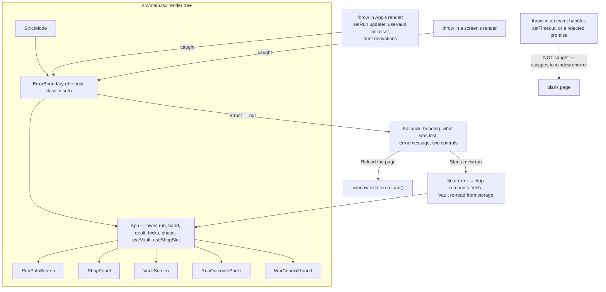

# Plan: Add an ErrorBoundary — a readable fallback over 98 deliberate throws

Plan folder: `.claude/contract/DLR-131-add-an-errorboundary/`
Execution status: see `tasks.md` in this folder.

---

## Part 1 — Alignment

### Task reference

Jira **DLR-131** — "Add an ErrorBoundary: 72 deliberate throws, zero boundaries, any escape blanks the screen". Task under epic **DLR-103**. Labels `engine`, `ui`.

Verbatim scope from the ticket:

1. An `ErrorBoundary` component wrapping the app, with a readable fallback that states something went wrong and offers a way to continue or restart — not a stack trace, and not a blank page.
2. Decide and document whether it wraps the whole app, each screen, or both. A boundary that only wraps the root loses the run; one per screen may be able to keep it.
3. A test that a throwing child renders the fallback rather than unmounting the tree.
4. Do **not** weaken or remove any existing throw, and do not convert them to silent returns. The engine's strictness is the point; this ticket adds the net, not a softer floor.

The ticket's evidence: DLR-118's review caught the Vault screen's spend guards re-deriving their refusal against a stale `handle.vault` outside the commit updater, so a batched second click reached `buyOddsBoost`'s deliberate `RangeError`. Fixed in-ticket by moving the guard inside the updater — the same shape DLR-116 had already forced on `handleBuy`. Aggravating: the `Unassigned` placeholder trap has been a live path into `apCostOf`'s `RangeError` three times this run (DLR-114 twice, guarded again in DLR-116 and DLR-118).

Sequencing per the ticket: lands before DLR-120 (integration) and DLR-121 (verification).

**Run condition (2026-08-24):** out-of-band item inside an unattended sprint run. The plan approval gate is **not** presented — the plan's stated defaults are taken and logged. The mockup is generated but goes **unseen**. Browser pass **not requested**.

### Restated goal

`src/` throws deliberately and often, and nothing catches it. Add one `ErrorBoundary` class component and mount it around `<App />` in `src/main.tsx`, so that any error escaping a render, a lifecycle, or a `useState` functional updater lands on a readable full-viewport panel — a heading, a plain-English sentence about what was lost and what was not, the error's one-line `message` as technical detail, and two controls (start a new run, reload the page) — instead of tearing the React tree down to a blank page. Not one existing `throw` is touched. The root-versus-per-screen question is decided in favour of **root-only**, and the reasoning is written into the code and into `.docs/implementation/app/`.

### In scope

- `src/app/ErrorBoundary.tsx` — a class component implementing `getDerivedStateFromError`, rendering `children` normally and a fallback panel once an error has been caught. The only class in `src/`, with the reason stated in its docblock.
- `src/app/errorLabels.ts` — every string the fallback renders, as named `UPPER_SNAKE_CASE` constants, following the `runLabels.ts` / `vaultLabels.ts` pattern already in this tree.
- `src/app/errorBoundary.css` — the fallback's plain-CSS styling, per-component file, matching `src/app/run/run.css`'s approach.
- `src/main.tsx` — wrap `<App />` in `<ErrorBoundary>` inside `<StrictMode>`.
- `src/app/__tests__/ErrorBoundary.test.tsx` — a throwing child renders the fallback and the sibling tree is gone; a non-throwing child renders untouched; the reset control clears the error and remounts children; `console.error` suppressed inside the throwing tests only.
- `.docs/implementation/app/` — the root-versus-per-screen decision, the "only class in `src/`" note with its reason, and the honest statement of what an error boundary does **not** catch.
- `.claude/sprint-runs/2026-08-23-sprint/log.md` — the run log entry this out-of-band item owes.

### Explicitly out of scope

- **Editing any `throw`.** No throw is weakened, removed, softened, or converted to a silent return or a plausible default. If a task appears to require touching one, that is a scope error.
- **A per-screen boundary inside `App.tsx`.** Decided against — see Approach. `App.tsx` is not modified by this contract at all.
- **A global `window.onerror` / `unhandledrejection` handler.** Error boundaries do not catch event-handler or async throws; adding a second, different mechanism for those is its own ticket, not a rider on this one.
- **Telemetry, error reporting, or a `componentDidCatch` sink.** There is no backend and no remote call in this prototype.
- **Persisting the in-progress run so a crash could resume it.** That is a save-format change under `.claude/rules/save-data-versioning.md` and a much larger piece of work.
- **Any new dependency.** No error-boundary library; React's own API is the whole mechanism.
- **Retuning, refactoring, or splitting `App.tsx`, `roundUiState.ts`, or `WarCouncilRound.tsx`.** All three sit near the 400-line limit; this contract touches none of them, so none grows.

### Pattern Reference

- **Labels module:** `src/app/run/runLabels.ts` and `src/app/vault/vaultLabels.ts` — named string constants, imported by the component, no copy inline in JSX.
- **Per-component CSS:** `src/app/run/run.css`, `src/app/vault/vault.css` — plain CSS imported by the component file.
- **Component test shape:** `src/app/run/__tests__/RunPathScreen.test.tsx` — `afterEach(cleanup)`, `render`, `screen.getByRole`, `fireEvent.click`, queries by accessible role and name.
- **Direct-path import, not the `./app` barrel:** `src/App.tsx:41-45` documents that extensionless `./app` collides case-insensitively with `App.tsx` on NTFS. `main.tsx` therefore imports `./app/ErrorBoundary` by full path and `src/app/index.ts` is not modified.
- Conventions otherwise per `.claude/skills/react-frontend/SKILL.md` and `.claude/skills/game-ux/SKILL.md`.

### Constraints flagged on the brief

- **No existing `throw` may be weakened.** Enforced by this contract naming zero files that contain one.
- **Error boundaries must be class components** — `getDerivedStateFromError` / `componentDidCatch` have no hook equivalent. This will be the only class in `src/`, and the docs must say so with the reason, so a later reader does not "modernise" it into breaking.
- **No file may pass 400 lines.** Measured with `(Get-Content <path>).Count`, not `Measure-Object -Line` (which drops blank lines — `.claude/workflow/web-project.md` is the authority over `CLAUDE.md`'s stale restatement).
- **Determinism:** `src/hunt/`, `src/warCouncil/`, `src/vault/`, `src/sim/` are `Math.random()`-free behind a lint boundary. This contract adds no file to any of those trees.
- **Vocabulary:** Timebomb / prime / ticking / detonates / Blast Guard. The fallback copy names none of them, so there is nothing to get wrong.
- **Zero mocking in this codebase.** The only suppression is a `vi.spyOn(console, 'error')` scoped inside the two throwing tests and restored in the same test. No global console mock, no module mock.
- **Never `npm run format`** — Prettier is run scoped with `npx prettier --write <path>` over this contract's files only.

### Assumptions made

- **Root-only, in `main.tsx`, not per-screen.** The ticket asks for the decision to be argued. The argument is in Approach; the short form is that the crash that prompted this ticket happens in `App`'s own render, above every screen, so a per-screen boundary would not have caught it. *(Default taken unattended — logged.)*
- **The fallback shows the caught error's `message`, never its `stack`.** A one-line `RangeError: no AP price for buff kind "unassigned"` is not a stack trace, it is the single most useful thing on the screen for the person debugging this prototype, and it is what makes the panel more than an apology. *(Default taken unattended — logged.)*
- **Two controls: "Start a new run" (primary) and "Reload the page" (secondary).** The primary clears the boundary's error state, which remounts `App` fresh; the secondary is `window.location.reload()` for the case where a remount re-crashes on the same input. *(Default taken unattended — logged.)*
- **`getDerivedStateFromError` is implemented; `componentDidCatch` is not.** React already reports the error and component stack to the console itself, there is no telemetry sink in a static prototype, and this project forbids leaving `console.log`/`console.debug` in shipped code. An empty or duplicate-logging `componentDidCatch` would be worse than its absence. Stated in the docblock so it reads as a decision, not an omission. *(Default taken unattended — logged.)*
- **Copy lives in `src/app/errorLabels.ts`, not inline.** Matches `runLabels.ts` / `vaultLabels.ts`; makes the copy greppable and the test's `getByRole` name assertions import the same constant the component renders.
- **No test for `errorLabels.ts` itself.** It exports only string constants with no logic; the sibling `runLabels.ts` has a test because it has functions. Its constants are exercised through `ErrorBoundary.test.tsx`.
- **The boundary sits inside `<StrictMode>`, not outside it.** StrictMode's development double-render is exactly the condition under which a render-phase throw should be caught; putting the boundary outside would leave StrictMode's own subtree unguarded.
- **`src/app/index.ts` is not modified.** `main.tsx` imports the component by direct path, per the NTFS collision documented at `src/App.tsx:41-45`.

### Config and persisted-shape audit

Run against the working tree at `352547d` on 2026-08-24.

1. **Configuration keys renamed, retyped, or removed: none.** This contract adds no configuration key and touches no existing one. `package.json`, `tsconfig*.json`, `vite.config.ts`, and `eslint.config.js` are all untouched — no new dependency, no new script, no new lint override.
2. **Persisted shapes affected: none.** `SAVE_SCHEMA_VERSION` is unchanged and no persisted field is added, removed, or retyped. The contract's only relationship to `src/persistence/` is that the **fallback copy makes a claim about it** — that Vault progress is written to storage as it is banked — which is a statement about existing behaviour (`useVault`'s `commit` writes through `saveVault` before it sets state), not a change to it. `.claude/rules/save-data-versioning.md`'s six reject conditions are checked below at bullet 6.
3. **Type changes with loss potential: none.** No existing type is widened, narrowed, or re-kinded. Two brand-new types are introduced (`ErrorBoundaryProps`, `ErrorBoundaryState`); nothing consumes them but the new file.
4. **Consumers of a changed exported constant or predicate: none.** No exported constant or predicate changes. The one existing module modified is `src/main.tsx`, whose only consumer is `index.html:11` (`<script type="module" src="/src/main.tsx">`) — a script tag, not an importer, and unaffected by adding a wrapper element inside the render call.
5. **Name-chain alignment.** New names were grepped across `src/**` for collisions before being chosen: `ErrorBoundaryProps` **0 hits**, `ErrorBoundaryState` **0 hits**, `errorLabels` **0 hits**, `ERROR_FALLBACK` **0 hits**, CSS class stem `error-fallback` **0 hits**, CSS class stem `app-error` **0 hits**. `ErrorBoundary` returns **3 hits**, and all three are prose in docblocks that name this very ticket — `src/hunt/buffEvaluation.ts:60`, `src/hunt/encounter.ts:267`, `src/warCouncil/encounterDeck.ts:79` — each asserting "no `ErrorBoundary` exists (DLR-131)". Those three comments become false the moment this contract lands and are corrected in the same contract; they are the only string-bound consequence of the new name.
6. **Architectural boundaries not crossed.** The new files live in `src/app/**`, outside the pure-core lint override on `src/warCouncil/**` and `src/hunt/**`, so no React import or DOM global crosses a boundary. `window.location.reload()` is the one DOM global introduced: `location` is **not** in the storage-only `no-restricted-globals` block scoped to `src/**/*.{ts,tsx}` (that block restricts `localStorage` / `sessionStorage` only), so it is permitted here and `npm run lint` is the check. Reject conditions 1–6 of `save-data-versioning.md` are all inapplicable: this contract calls neither storage global, composes no key, writes no envelope, bumps no version, casts no payload, and swallows nothing.
7. **Construction sites of every changed shape — counted by field, not by type name.**
   - `ErrorBoundaryProps`: **0 annotated sites, 0 construction sites** before this contract (new type). Its only distinctive field is `children`, which is far too generic to grep usefully; the meaningful count is that the props object is constructed at exactly the JSX call sites this contract creates — **2** (`src/main.tsx`, and `src/app/__tests__/ErrorBoundary.test.tsx`'s renders, which pass only `children`). Both are named in a task's `**Files:**` block.
   - `ErrorBoundaryState`: **0 annotated sites, 0 construction sites** before this contract (new type). Grepped by its distinctive required field name `hasError` across `src/**` including `__tests__`: **0 hits**. After this contract it is constructed at exactly **2** sites, both inside `src/app/ErrorBoundary.tsx` — the field initialiser and `getDerivedStateFromError`'s return literal.
   - No pre-existing shape gains a required field, so there is no third count to take. This check found nothing hidden, which is the outcome to record, not a reason to have skipped it.

---

## Part 2 — Technical design

### Approach

**The decision the ticket asks for: root-only, and the argument is that a per-screen boundary would not have caught the crash that prompted the ticket.**

React runs a `useState` functional updater during the render of the component that **owns** that state. DLR-116 and DLR-118 deliberately moved the shop's and the Vault's spend guards *inside* those updaters — `setRun((r) => refusalFor(shopStockFor(r), item) !== null ? r : buyFromShop(r, item))` in `App.tsx`, and the matching `commit((v) => …)` for the Vault. That is the right fix and it stays. But it also fixes where a surviving throw would surface: if `buyFromShop` or `buyOddsBoost` throws, it throws while React is rendering **`App`**, not while React is rendering `ShopPanel` or `VaultScreen`. A boundary placed around each screen sits strictly *below* `App` in the tree and is structurally incapable of catching it. The one placement that catches the exact class of bug this ticket was raised for is the one **above** `App`.

The second half of the argument is that a per-screen boundary cannot honestly offer what its existence would imply. Every piece of run state — `run`, `hand`, `dealt`, `tricks`, `phase` — lives in `App`; the five screens are pure views of it. A screen that throws during render throws *because of* that state, so clearing the boundary and re-entering the same screen with the same state re-throws immediately. The only recovery a screen-level fallback could actually offer is "back out of this screen", which for a crashing fight means abandoning the fight — the same loss as a root reset, dressed up as a rescue. Shipping two boundaries would mean shipping one fallback that tells the truth and one that does not.

Two smaller factors close it. `App.tsx` is at **394 lines against a blocking 400**, and wrapping its six early-return JSX sites would add roughly twelve lines and force a split whose only motivation was a boundary already argued to be the wrong shape. And a root boundary catches three things no per-screen boundary can reach: a throw in `App`'s own render body (the `maxHealth`, `stages`, `currentName`, `nextName` derivations all call into `src/hunt/`), a throw in `useVault`'s lazy `useState` initialiser as it reads and validates `localStorage`, and a throw in `useShopSlot`'s per-render derivation of the strip.

**What is honestly outside the net, and must be written down rather than implied away.** An error boundary catches throws in render, in lifecycle methods, and in constructors of the tree beneath it. It does **not** catch a throw inside an event handler, a `setTimeout`, a promise rejection, or the boundary's own fallback render. So a click handler that computes *before* calling `setState` — rather than inside the updater — still escapes to `window.onerror` and still blanks the screen. That is not a gap to paper over; it is a second argument for the in-the-updater convention DLR-116 and DLR-118 established, and it belongs in `.docs/implementation/app/` next to the decision above so the two reinforce each other instead of drifting.

**Shape of the code.** One class component in `src/app/ErrorBoundary.tsx` — the only class in `src/`, because `getDerivedStateFromError` and `componentDidCatch` have no hook equivalent in React 19 and there is no function-component way to write an error boundary at all. Its docblock says exactly that, so a later reader converting the file to a function does not silently delete the mechanism. State is a single `{ error: Error | null }`; `getDerivedStateFromError` returns the caught error, `render` returns `children` when it is `null` and the fallback panel when it is not. `componentDidCatch` is deliberately absent: React already prints the error and the component stack itself, this prototype has no telemetry sink, and `console.log`/`console.debug` are forbidden in shipped code — a duplicate log or an empty override would both be worse than the omission.

The fallback is a full-viewport `<main>` with `role="alert"`, an `<h1>`, two sentences of body copy, a technical-detail line carrying `error.message` only, and two `<button>` controls. Every string is a named constant in `src/app/errorLabels.ts`, matching `runLabels.ts` and `vaultLabels.ts`, so the test asserts against the same constant the component renders rather than a copy of it. Styling is plain CSS in `src/app/errorBoundary.css`, per-component, per `run.css`. Nothing in the boundary is a pure-logic candidate — it holds no invariant beyond "showing the fallback is the same thing as having caught an error", which the component test covers directly.

**What the fallback says, and what it refuses to promise.** The run is in memory only and is gone: the copy says so plainly rather than offering a "resume" the code cannot honour. The Vault is on disk — `useVault`'s `commit` writes through `saveVault` before it sets state — so the copy says Vault progress is written as it is banked and should be intact, and stops there. It does not say the Vault is "safe", because a write can come back `SaveWriteOutcome.Rejected` (quota, private browsing) and the Vault screen is where that is already reported. Reset clears the boundary's error state; React destroyed the failed subtree when it swapped to the fallback, so clearing it mounts `App` fresh — a new run, with the Vault re-read from storage — which is precisely what the primary control's label promises.

### Skills to invoke during execution

- `react-frontend` — owns everything under `src/`: the class component, the labels module, the CSS file, the component test, and the 400-line budget. The normal entry for code work here.
- `game-ux` — owns the fallback as a visible game surface: full-viewport no-scroll shell, zoning, ≥44px controls, `:focus-visible`, and the mockup at `mockup.html`.
- `implementation-doc-writer` — owns `.docs/implementation/app/`, where the root-versus-per-screen decision, the only-class-in-`src/` note, and the "what a boundary does not catch" limits are recorded. `.docs/game_rules/the-hunt.md` is **not** touched: this changes no game rule.
- `management-jira` — owns the DLR-131 status transitions.

Rules the executor must Read: `.claude/rules/README.md` and `.claude/rules/save-data-versioning.md` (checked in the audit above; all six reject conditions inapplicable). Always: `.claude/workflow/web-project.md`.

No developer override was applied — this ran unattended, so Step 1.5c's confirmation call was not presented and the classifier's list stands.

### Diagram



### Data shapes

#### `src/app/ErrorBoundary.tsx`

```tsx
interface ErrorBoundaryProps {
  readonly children: ReactNode
}

interface ErrorBoundaryState {
  /** The caught error, or `null` while the subtree is healthy. Holding the error itself
   *  rather than a `hasError` boolean is what lets the fallback show `error.message`. */
  readonly error: Error | null
}

export default class ErrorBoundary extends Component<ErrorBoundaryProps, ErrorBoundaryState> {
  state: ErrorBoundaryState = { error: null }
  static getDerivedStateFromError(error: unknown): ErrorBoundaryState
  render(): ReactNode
}
```

`getDerivedStateFromError` receives `unknown`, not `Error` — anything can be thrown in JavaScript. It normalises a non-`Error` throw into `new Error(String(caught))` so `error.message` is always a string the fallback can render.

#### `src/app/errorLabels.ts`

```ts
export const ERROR_FALLBACK_TITLE: string
export const ERROR_FALLBACK_LOST: string
export const ERROR_FALLBACK_VAULT: string
export const ERROR_FALLBACK_DETAIL_LABEL: string
export const ERROR_FALLBACK_RESTART_LABEL: string
export const ERROR_FALLBACK_RELOAD_LABEL: string
```

Copy as planned (developer may retune the wording — see Risks):

| Constant | Value |
|---|---|
| `ERROR_FALLBACK_TITLE` | `Something went wrong` |
| `ERROR_FALLBACK_LOST` | `The Hunt hit an error it could not recover from, and the run you were in has been lost.` |
| `ERROR_FALLBACK_VAULT` | `Vault progress is written to storage as you bank it, so anything already banked should still be there. Nothing else carries between runs.` |
| `ERROR_FALLBACK_DETAIL_LABEL` | `What went wrong` |
| `ERROR_FALLBACK_RESTART_LABEL` | `Start a new run` |
| `ERROR_FALLBACK_RELOAD_LABEL` | `Reload the page` |

#### `src/main.tsx`

```tsx
createRoot(document.getElementById('root')!).render(
  <StrictMode>
    <ErrorBoundary>
      <App />
    </ErrorBoundary>
  </StrictMode>,
)
```

#### `src/app/errorBoundary.css`

New class names, all zero-hit before this contract: `.error-fallback`, `.error-fallback__panel`, `.error-fallback__title`, `.error-fallback__body`, `.error-fallback__detail`, `.error-fallback__actions`, `.error-fallback__action`.

No configuration key, no `package.json` change, no dependency, no persisted-shape change.

### Runtime quality notes

- **Purity and adjudication:** The boundary decides nothing about the game. It holds one piece of state (`error`) and one derived question (`error === null` → render children). All copy is imported from `errorLabels.ts`, so no string is hard-coded in JSX. There is no invariant here worth a pure module — extracting `error === null` into `src/` logic would be abstraction for its own sake, and the component test covers the behaviour directly.
- **Effects, mount and teardown:** The component has **no effect at all** — no `componentDidMount`, no listener, no timer, no observer, no `requestAnimationFrame`, no `AbortController`. Nothing to clean up and nothing for StrictMode's development double-mount to double-fire. `getDerivedStateFromError` is a pure static that returns a fresh literal, so StrictMode re-invoking it produces an identical value. No module-level mutable state. On a second mount the boundary starts at `{ error: null }`, which is correct: a remount means the tree is being rebuilt.
- **Hot-path cost:** Nothing here runs per pointer event. `render` in the healthy case returns `this.props.children` unchanged — a pass-through with no allocation, no wrapper element, and no extra DOM node in the common path. The fallback branch renders once, on a path the player should never reach. No memoisation, and none warranted.
- **Determinism and numeric safety:** No `Math.random()`, no arithmetic, no division, and no file added to `src/hunt/`, `src/warCouncil/`, `src/vault/`, or `src/sim/`. There is no number in this contract that could become `NaN`.
- **Error paths:** This contract *is* the error path. It swallows nothing: React still logs the error and its component stack, the message is rendered on screen rather than hidden, and no failure is converted into a success shape. No existing `throw` is guarded, softened, or removed — the boundary catches what escapes rather than stopping it being thrown. `getDerivedStateFromError` normalising a non-`Error` throw is a widening, not a swallow: the thrown value's `String()` form is what reaches the screen. The one thing the boundary deliberately does not do is catch event-handler or async throws, which is stated in the code and in the docs rather than left for a reader to discover. There is no async surface, so the four async states do not arise.

### Risks and judgement calls

- **Root-only versus per-screen is the ticket's central design call**, argued at length in Approach. The developer should sanity-check the reasoning — chiefly the claim that a `setState` functional updater throws during `App`'s render and is therefore above any per-screen boundary. If they disagree, the alternative is a second boundary inside `App`, which forces `App.tsx` (394/400) to be split in the same ticket.
- **The fallback copy is a visual-and-copy judgement and therefore the developer's.** The wording in Data shapes is a stated default taken unattended, not an approved string. In particular, whether `ERROR_FALLBACK_VAULT`'s "should still be there" is the right level of hedging is a call only they can make.
- **Showing `error.message` on the player-facing fallback** is a judgement: it is enormously useful in a prototype and would be wrong in a shipped game. The developer should confirm they want it now, and note it as something to remove or gate later.
- **`componentDidCatch` is deliberately absent.** If the developer wants a hook for future error reporting, adding it is one method — but adding it empty, or logging what React already logs, is why it was left out.
- **The mockup at `mockup.html` went unseen.** This ran unattended with the mockup gate skipped, so nobody has looked at the fallback's layout. The panel is a visible surface and its proportions, contrast, and control placement are unreviewed.
- **No browser pass was requested,** so nothing has rendered the fallback in a real browser. jsdom asserts the text and the roles are present; it cannot show that the panel is centred, that it fits the viewport without scrolling, that the contrast is legible in both colour schemes, or that `window.location.reload()` actually reloads. Those go on the developer's eyes-on list.
- **Nothing verifies that the boundary fires in production**, only in a test that renders a component built to throw. The honest statement is that the mechanism is proven; that every real throw site routes through render rather than an event handler is not, and cannot be by any test in this contract.
