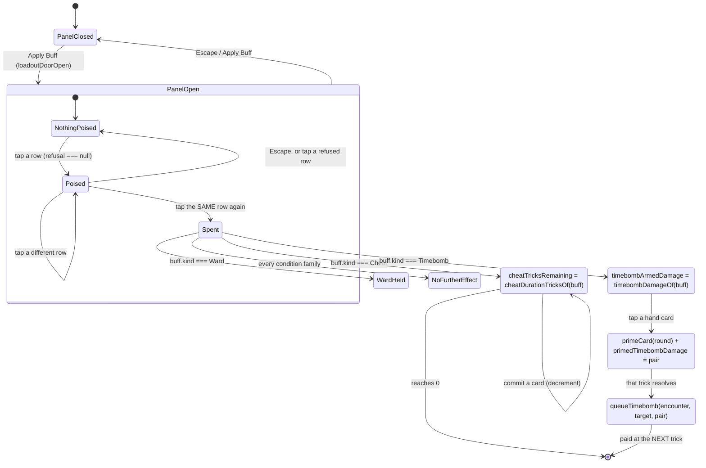

# Plan: DLR-132 — Cheat and Timebomb as drawable buff cards

Plan folder: `.claude/contract/DLR-132-cheat-and-timebomb-as-drawable-cards/`
Execution status: see `tasks.md` in this folder.

---

## Part 1 — Alignment

### Task reference

**Jira DLR-132** — "Cheat and Timebomb are unobtainable: fold them into the buff pool as drawable cards". Task under epic DLR-103. Labels `engine`, `ui`.

Description (measured at `363fcd2`), abridged to its load-bearing claims:

> Cheat and Timebomb cannot be acquired by a player at all. Three separate routes were closed by three different tickets, each correct in isolation: `SHOP_ITEMS` is `[ApCapacity, SwanTier, WitchTier, Heal]` (DLR-116 pared the shelf); `grep -c "BuffKind.Cheat\|BuffKind.Timebomb" src/hunt/buffTemplates.ts` → **0** (DLR-112 built the pool without them); `RUN_STARTING_CHEATS = 1`, `timebombCharges: 0` (pre-existing). So a run begins with **exactly one Cheat and zero Timebombs, and can never obtain another of either.** **The Timebomb is entirely unreachable.**
>
> Scope: (1) Add Cheat and Timebomb templates to the buff pool so the reel can draw them. (2) Retire `CheatStage` / `TimebombStage` and drive both through the ordinary activation flow (`buffActivation.ts` / `activateFromPile`), so `commitTimebomb` is replaced by `activateBuff`. (3) Collapse `timebombDamageFor` (encounter side) and `timebombDamageOf` (buff side) — **this nomination has now outlived four tickets**. (4) Decide what happens to `RUN_STARTING_CHEATS = 1` and the `cheats` / `timebombCharges` fields on `RunState` once both are pile members. (5) Do **not** retune damage or costs.

**The comment on the ticket is the authoritative scope** and replaces item 2 of the description:

> The action bar is already the intended four buttons (`Apply Buff` · `Cards` · `Swap` · `Apply Damage`, `actionBarLabels.ts`, DLR-114 `1cb1a18`). `CheatSlots` and `TimebombCharge` are **already** folded inside `BuffLoadoutPanel`. **So the remaining gap is not "put them behind Buff". It is "make them cards rather than bespoke widgets behind Buff."**
>
> 1. Cheat and Timebomb appear **as ordinary rows in the buff list**, using the same row grammar every other card uses (`Bell-Taker (Momentum) — win a trick with Bells: +3 multiplier. 2 AP.`), inside the same roving-tabindex collection, activated by the same two-tap poise-then-spend interaction.
> 2. Delete `CheatSlots.tsx` and `TimebombCharge.tsx` once the rows replace them, along with `CheatStage` / `TimebombStage`.
> 3. The pool, the `timebombDamageFor` / `timebombDamageOf` collapse, and the `RUN_STARTING_CHEATS` question are unchanged from the description above.
>
> **The risk is in the keyboard model** — the row list has a roving tabindex these two widgets are deliberately outside of, so folding them in changes focus order for the whole panel.

Coordinator constraints carried into this run, dated 2026-08-24:

- Browser pass **not requested** — QA records what a browser would have checked, and runs no server.
- Mockup gate **skipped**; the mockup went **unseen** by the developer.
- Plan approval gate **auto-approved** — this is an unattended sprint run.
- `roundUiState.ts` is at 399 of a blocking 400 and **must be split in-ticket**.
- Vocabulary (`6ba6224`): **Timebomb**, **prime/primed**, **ticking**, **detonates**, **Blast Guard**. Never "Envenom"/"poison" except `CardRank.Poison` (rank 8).
- Balance is out of scope; `npm run sim -- --runs 200 --seed 1` is run before and after and reported as an **observation**.

### Restated goal

Cheat and Timebomb stop being two bespoke widgets with their own parallel machinery and become **ordinary buff cards**: two new templates in the draw pool that the reel can pull, two ordinary rows in `BuffLoadoutPanel`'s roving-tabindex list, activated by the same two-tap poise-then-spend gesture every other card uses, priced by the same `apCostOf` lookup, and spent through the same `activateFromPile` call. `CheatSlots.tsx`, `TimebombCharge.tsx`, `CheatStage`, `TimebombStage`, `handleTapCheat`, `handleTapTimebomb` and `commitTimebomb` are deleted; so are the parallel `RunState.cheats` / `RunState.timebombCharges` counters and the whole `src/hunt/cheats.ts` `CheatCard` model, because two records of "do you hold a Cheat" is precisely the duplication this ticket exists to end. The blocking shape problem — `BuffTemplate.kind` is `BuffConditionKind` and `axis` is `BuffCostAxis`, and an activated card has neither — is solved by turning `BuffTemplate` into a discriminated union with a `form` tag, which is also what makes the five consumables trivially addable later. `timebombDamageFor` and `timebombDamageOf` collapse into one accessor. Nothing is retuned.

### In scope

- **The shape fix.** `BuffTemplate` becomes a discriminated union: `ConditionBuffTemplate` (`form: 'condition'`, carrying `kind: BuffConditionKind`, `axis: BuffCostAxis`, optional `target`) and `ActivatedBuffTemplate` (`form: 'activated'`, carrying only `kind: BuffActivatedTemplateKind`). `mintFromTemplate` switches on `form`.
- **Two new templates** — `cheat` and `timebomb` — appended to `BUFF_TEMPLATES`, taking the pool from **71 to 73**. Minted through the existing `cheatBuff` / `timebombBuff` functions in `buffCatalog.ts`, so DLR-107's representation becomes the minting path rather than staying inert.
- **Four new slot weights** (2 kinds × 2 machines), agent-chosen, with `templateWeightFor` gaining an activated branch that preserves the "a family's share of a strip equals its family weight" invariant `slotWeights.test.ts` already asserts.
- **Two ordinary rows** in `BuffLoadoutPanel`, inside the existing `wc-loadout-rows` roving-tabindex collection, using `buffLine` / `buffRowAccessibleName` exactly as every other row does. `BuffLoadoutPanel` loses its `cheats`, `cheatSelection`, `timebombCharges`, `timebombStage`, `interactive`, `onTapCheat`, `onCancelCheat`, `onTapTimebomb` and `onCancelTimebomb` props.
- **Activation effects wired into `handleTapBuff`**, beside the existing Ward branch: spending a Cheat lifts follow-suit for `CHEAT_DURATION_TRICKS[tier]` tricks; spending a Timebomb arms the next hand-card tap to prime a card, carrying that tier's damage pair.
- **Deletions.** `CheatSlots.tsx`, `TimebombCharge.tsx`, `warCouncilCheats.css`, `warCouncilTimebomb.css`, `CheatStage`, `TimebombStage`, `CheatSelection`, `handleTapCheat`, `clearCheat`, `handleTapTimebomb`, `commitTimebomb`, the four `TapCheat` / `CancelCheat` / `TapTimebomb` / `CancelTimebomb` actions, `src/hunt/cheats.ts` in its entirety (`CheatCard`, `CheatCardId`, `grantCheats`, `addCheat`, `removeCheat`, `hasCheat`), `CHEAT_SLOT_COUNT`, `RunState.cheats`, `RunState.nextCheatId`, `RunState.timebombCharges`, and the specs that exist only to test the deleted widgets.
- **The `RUN_STARTING_CHEATS` decision, implemented.** The constant survives with its value `1` and its name, re-homed to mean "how many bronze Cheat **buffs** the run's opening pile holds". Today's behaviour is preserved exactly; the card is now a pile member.
- **The four-ticket-old naming collapse.** `TimebombDamage` is retyped `Readonly<Record<DuelSide, Damage>>`, `timebombDamageFor` is deleted, and `queueTimebomb` takes the pair.
- **`roundUiState.ts` split**, mandated by the 399/400 line budget.
- **Sim policy update** — `baselinePolicy.ts` and `playHand.ts` drive Cheat and Timebomb through `TapBuff` rather than the deleted actions.
- **Explicit focus-order tests** for the widened roving tabindex.
- **`npm run sim -- --runs 200 --seed 1` before and after**, reported as an observation.

### Explicitly out of scope

- **The five consumables** (Ward, Second Thoughts, Puppeteer, Foresight, Spyglass). DLR-120 established this ticket owns Cheat and Timebomb only. The `form` union makes them trivially addable — that is stated in `buffTemplates.ts`'s docblock and in Risks, and they are left out. They need their own weights and their own decision.
- **Blast Guard or Whetstone returning to `SHOP_ITEMS`.** DLR-116 pared the shelf deliberately; this ticket does not touch `shop.ts`.
- **The structural seam that acquisition surfaces sit behind the fight that kills the player.** Named by DLR-120, owned by nobody yet, not this ticket.
- **Any retuning.** `TIMEBOMB_QUARRY_DAMAGE`, `TIMEBOMB_PLAYER_DAMAGE`, `TIMEBOMB_TIER_MULTIPLIER`, `CHEAT_DURATION_TRICKS`, `CONSUMABLE_AP_COST`, `REWARD_BASE`, `CONDITION_MODIFIER` and every existing `SLOT_*_WEIGHTS` figure are untouched. The four *new* weights are additions, not retunes.
- **Widening `WarCouncilState.primedCards` to carry a per-card tier.** See Assumptions.
- **A per-card Timebomb tier when two Timebombs are spent in one hand.** See Assumptions.

### Pattern Reference

- **`src/hunt/consumables.ts` + the Ward branch in `buffHandlers.ts:135-137`** — the exact shape this ticket follows for "an activated card's effect fires synchronously at the spend". Ward is the worked example; Cheat and Timebomb become two more branches beside it.
- **`src/hunt/buffCatalog.ts`** (DLR-107) — `cheatBuff(tier, id)` and `timebombBuff(tier, id)` already mint proper tiered `Buff` objects. They are the minting path, not a thing to re-derive.
- **`src/app/warCouncil/buffLabels.ts`** — `BUFF_FAMILY_WORD`, `BUFF_CONDITION_SENTENCE` and `BUFF_REWARD_SUFFIX` **already carry rows for Cheat and Timebomb**. `buffLine` already produces `Cheat (Free Rein) — play any card, ignoring follow-suit: 1 trick of no follow-suit. 3 AP.` No new copy is written.
- **`src/hunt/buffTemplates.ts`'s own docblock** — states the shape problem verbatim and is the thing this ticket answers.
- **`.docs/design/Balatro-Forbidden-Solitaire/v1-buff-card-list.md` → *Utilities, consumables and activated cards*** — the source of Cheat's and Timebomb's AP prices, already transcribed into `CONSUMABLE_AP_COST`. Cited, not re-derived.
- **`.claude/skills/game-ux/SKILL.md`** — owns the panel, the roving tabindex, and the interaction-cost question the widened collection raises.

### Constraints flagged on the brief

- **Determinism** — no `Math.random()` may be reachable from `src/hunt/`, `src/warCouncil/`, `src/vault/` or `src/sim/`. Every new id comes from `RunState.nextBuffId`; every new draw goes through the existing seeded `Rng`.
- **102 `throw new` sites; do not weaken any.** No throw is softened to a return, and no new throw is added on a render or reducer path — a throw inside a reducer during an event handler unmounts the tree, which is why `handleTapBuff` guards before it commits.
- **File budget.** 400 lines is blocking. `roundUiState.ts` is at 399 and must be split. `App.tsx` is at 394 and `WarCouncilRound.tsx` at 392 — both must be measured after Prettier with `(Get-Content <file>).Count`.
- **`npm run format` is never a task step** (`ae9ee28`). Formatting is `npx prettier --write` scoped to the contract's own files.
- **A root `ErrorBoundary` exists but an escaping throw still costs the run.**
- **Vocabulary is enforced** — Timebomb / prime / primed / ticking / detonates / Blast Guard.
- **Two runtime dependencies only.** Nothing here adds one.

### Assumptions made

- **`BuffTemplate` becomes a discriminated union tagged `form`, rather than making `axis` optional.** An optional `axis` would push a `?? fallback` or a non-null assertion into `templateWeightFor`, `slotLabels.ts` and `VaultScreen.tsx`, and the fallback would be invisible at the type level — exactly the class of "plausible zero that type-checks" this codebase throws about in `mintFromTemplate` and `cheatDurationTricksOf`. A tag makes every consumer's branch mandatory at compile time.
- **`mintFromTemplate` delegates to `cheatBuff` / `timebombBuff` rather than reproducing them.** DLR-107 already owns those two functions and their tier tables; a second minting expression here would give one card two answers.
- **`RunState.cheats`, `RunState.nextCheatId` and `RunState.timebombCharges` are deleted, not deprecated.** Leaving them is leaving a second record of "do you hold a Cheat", which is the representational duplication the ticket exists to close. `src/hunt/cheats.ts` and `CHEAT_SLOT_COUNT` go with them — the two-slot cap was a property of the rail, and the pile has no such cap.
- **`RUN_STARTING_CHEATS` survives, keeps the value `1`, and is re-homed.** It now means "bronze Cheat **buffs** in the opening pile". Behaviour is bit-for-bit today's — a run opens holding exactly one bronze Cheat — so this ticket introduces no balance delta of its own on that axis, which is what makes the before/after sim comparison legible. **Whether a run should open holding a Cheat at all remains the developer's open question**, now cheap to answer by changing one integer. Routed to Risks.
- **A run opens with zero Timebombs**, unchanged from `timebombCharges: 0`. The field is deleted rather than replaced by a starting grant, because granting one would be a balance change.
- **Cheat's tier is honoured as duration.** `CHEAT_DURATION_TRICKS` (1/2/3, DLR-107 AC1, transcribed not chosen) becomes `RoundUiState.cheatTricksRemaining`, decremented on each successful player commit. A bronze Cheat is therefore exactly today's one-card lift. Ignoring tier would ship a silver Cheat that costs 5 AP and does a bronze Cheat's job.
- **Timebomb's tier is honoured by carrying the damage pair from the spend to the prime.** `queueTimebomb` gains a `damage: TimebombDamage` parameter; the pair travels on `RoundUiState` from activation → armed → primed. The alternative — widening `WarCouncilState.primedCards` from `readonly Card[]` to a tagged list — reaches into the pure engine and every `primedCards: []` fixture, out of all proportion to the gain.
- **Only one Timebomb tier is remembered per hand.** `RoundUiState.primedTimebombDamage` holds the pair of the most recently primed card; a second Timebomb primed in the same hand overwrites it. Two Timebombs of different tiers primed in one hand is reachable but rare, and per-card tiers need the engine widening above. **Stated as an accepted limitation**, not hidden.
- **`TimebombDamage` is retyped `Readonly<Record<DuelSide, Damage>>`.** `DuelSide.Player === 'player'` and `DuelSide.Quarry === 'quarry'` are already exactly the interface's two field names, so this is a rename of the type and not of a single field — and it is what makes the four-ticket-old collapse a one-line index (`damage[target]`) instead of a second crossing function.
- **The two new rows are ordinary rows with no special ordering.** They appear wherever the pile's order puts them, because `activatableBuffs` documents that the pile's order is the player's mental order. No pinning, no section, no divider.
- **`BuffLoadoutPanel` loses its `interactive` prop.** It existed only to gate the two deleted widgets; a row's own availability is `loadoutRefusalFor`, which is already the single statement of it.
- **The panel's `wc-loadout-divider` is removed** along with the two widgets it divided the rows from. Nothing sits below the rows any more.
- **`roundUiState.ts` splits along the seam it already documents.** The state shape, seed and action union stay in `roundUiState.ts`; the pure predicates over that state (`canAct`, `cheatArmed`, `timebombArmed`, `loadoutOpen`, `offeredBuffs`, `discardSelecting`, `discardWindowOpen`, and the three `*Stock` builders) move to a new `roundPredicates.ts`. `roundUiState.ts` re-exports them so no import outside the two files changes.
- **Specs that exist only to exercise a deleted widget are deleted, not rewritten.** `CheatSlots.test.tsx` and `TimebombCharge.test.tsx` test components that will not exist. Their *behavioural* coverage — that a Cheat lifts follow-suit, that a Timebomb primes a card — is re-expressed against the new rows in `BuffLoadoutPanel.test.tsx` and `roundReducer` specs, so no rule loses its test.
- **The four new slot weights are agent-chosen and nobody approved them.** Skirmisher: Cheat 3, Timebomb 3. Strongbox: Cheat 1, Timebomb 1. Rationale in Risks. They are additions to a table whose own header already says `AGENT-CHOSEN, unplayed`.

### Config and persisted-shape audit

Performed with `grep`/`Grep` against the real tree at `c116afa`. Counts are what the commands printed.

- **`RUN_STARTING_CHEATS`** — declared once in `src/hunt/config.ts:201`; **31 hits** for the neighbouring `CHEAT_SLOT_COUNT` across `src/`. `RUN_STARTING_CHEATS` keeps its name and value; `CHEAT_SLOT_COUNT` is deleted and every one of its 31 hits is accounted for in Tasks 6 and 8.
- **`timebombCharges`** — **173 hits across 49 files**. Heaviest: `src/hunt/__tests__/run.test.ts` (17), `roundReducer.timebomb.test.ts` (14), `src/hunt/run.ts` (8), `run-buffs.test.ts` (8), `roundReducer.timebombQueue.test.ts` (8), `runTransitions.ts` (7), `timebomb.test.ts` (7), `run.quickKill.test.ts` (6), `warCouncilMount.ts` (6), `WarCouncilRound.timebomb.test.tsx` (6). The overwhelming majority are seed/expectation literals of the form `timebombCharges: 0`. The field is **deleted**, so every literal is a TypeScript excess-property error until removed — there is no silent-failure mode here, which is what makes a wide mechanical edit safe.
- **`cheats:`** — **51 hits across 29 files**. Same shape, same deletion, same compile-time failure mode.
- **Union of every name being deleted or reshaped** (`timebombCharges|cheats:|cheatSelection|timebombStage|CheatCard|nextCheatId|CHEAT_SLOT_COUNT|RUN_STARTING_CHEATS`) — **66 files**. That is the true blast radius and every one of those files appears in a task's `**Files:**` block.
- **`cheatSelection`** — 35 hits; **`timebombStage`** — 42 hits; **`CheatCard`/`CheatCardId`** — 36 hits; **`nextCheatId`** — 14 hits. All deleted.
- **`queueTimebomb`** — **39 hits across 10 files**: `commitHandlers.ts` (2), `encounter.ts` (3), `index.ts` (1), `bank.ts` (1, a docblock reference only), and 5 spec files (`timebomb.test.ts` 15, `roundReducer.timebombQueue.test.ts` 6, `roundBars.test.ts` 3, `roundReducer.applyDamage.test.ts` 3, `roundReducer.delayedApply.test.ts` 3, `cardDamage.test.ts` 2). The signature gains a third required parameter, so every call site is a compile error until updated.
- **`TimebombDamage`** — **5 hits**, all in `src/hunt/buffCatalog.ts` (4) and `src/hunt/index.ts` (1). Retyped from an `interface` with `quarry`/`player` fields to `Readonly<Record<DuelSide, Damage>>`. **Type-change loss check:** the two field names `quarry` and `player` are exactly `DuelSide`'s two values, so every existing read (`TIMEBOMB_DAMAGE[tier].quarry`) continues to compile unchanged. No consumer loses access to anything; the change only *widens* how the pair can be indexed.
- **`BuffTemplate` — 2 annotated construction sites, 1 real construction site.** `makeTemplate` in `buffTemplates.ts:108` is the only expression that builds one (`buffTemplates.ts:116`); `TEMPLATES_BY_ID` at line 148 only re-keys. Annotated/consumer sites number **13 files** outside `buffTemplates.ts` and `slotWeights.ts` (`slotLabels.ts`, `SlotMachinePanel.tsx`, `VaultScreen.tsx`, `vaultOdds.ts`, `slotMachine.ts` and 8 spec files). The union tag forces every one that reads `.axis` or `.kind` to branch — three do: `templateWeightFor` (`slotWeights.ts:96`), `familyAxisTotalsFor` (`slotWeights.ts:83`), and `VaultScreen.tsx:59` (`BuffTemplate['kind']`, which resolves to the union of both members' kinds and needs no edit).
- **`RoundUiSeed` — 6 annotated sites, 45 construction sites.** `grep -c "RoundUiSeed"` returns non-zero in 6 files (`roundUiState.ts` 2, `buffActivationStock.test.ts` 2, `buffHandlers.test.ts` 2, `roundReducer.quickKill.test.ts` 2, `sim/playHand.ts` 3, `sim/__tests__/baselinePolicy.test.ts` 3). `grep -c "createRoundUiState("` returns **45**. **45 is the real number** — the seeds are unannotated object literals. Removing two required fields from the seed makes each of those 45 a site that must drop them.
- **`RoundUiState` — construction sites: 1** (`createRoundUiState`), plus spreads. Every other mutation is a `{ ...state, … }` spread, which is unaffected by adding a field but *is* affected by removing one only where that field is named.
- **Persisted shapes: unaffected.** `src/vault/vaultState.ts` persists exactly `{ templateId, tier }` pairs and odds-boost stacks keyed by `BuffTemplate.id` — DLR-113 froze that format deliberately so no domain type is on disk. This ticket **adds** two ids (`cheat`, `timebomb`) and renames none, so every existing save still reconciles. `reconcileVault` drops an id it cannot resolve; no existing id becomes unresolvable. `RunState` is not persisted.
- **Architectural boundary: not crossed.** Every new symbol lands in `src/hunt/` (pure, DOM-free) or `src/app/warCouncil/` (React). No React import and no DOM global is introduced into `src/hunt/**` or `src/warCouncil/**`. Verified by the Final-verification boundary grep.
- **Name alignment across the chain.** `BuffTemplate.id` (`'cheat'` / `'timebomb'`) ↔ `templateById` ↔ `vaultState`'s persisted `templateId` ↔ `SLOT_FAMILY_WEIGHTS` keys ↔ `BUFF_FAMILY_WORD` / `BUFF_CONDITION_SENTENCE` keys. The last two already exist and already spell both kinds; the first three are new and are introduced together in one task.
- **Test count pinned by name.** `buffTemplates.test.ts:30-31` asserts `toHaveLength(71)` / `toBe(71)` and `reachability.test.ts:57` asserts `BUFF_TEMPLATES.length).toBe(71)`. All three become 73 in the same task that adds the templates.

---

## Part 2 — Technical design

### Approach

**The shape problem, and why a tag rather than an optional field.** `BuffTemplate` today is one interface whose `kind` is narrowed to the eleven condition families and whose `axis` is narrowed to the four priced reward axes. An activated card has neither: a Cheat pays on `BuffRewardAxis.DurationTricks` and a Timebomb on `Magnitude`-but-from-a-different-table, and neither has a condition family at all. The fix is to make `BuffTemplate` a **discriminated union on a `form` tag** — `ConditionBuffTemplate` keeps today's exact fields, and `ActivatedBuffTemplate` carries `form`, `id` and `kind` and nothing else. The alternative considered and rejected was making `axis` optional: it type-checks, but it pushes an invisible fallback into `templateWeightFor`'s multiplication and into `slotLabels.ts`, and a silently-zero weight is a card that is in the pool and can never be drawn — the exact failure mode `mintFromTemplate`'s existing `RangeError` guard was written to prevent. A tag makes each consumer's branch mandatory at compile time and makes the *next* extension (the five consumables) a data edit plus one mint function.

`mintFromTemplate` becomes a two-branch switch. The condition branch is today's body verbatim. The activated branch **delegates to `cheatBuff` and `timebombBuff` in `buffCatalog.ts`** — DLR-107 built those, they already read `CHEAT_DURATION_TRICKS` and `TIMEBOMB_DAMAGE`, and reproducing their expressions here would give one card two answers. This is the line where DLR-107's "REPRESENTATION ONLY … inert" docblock stops being true, and it is rewritten to say so.

`templateWeightFor` gains the matching branch. Today it computes `familyWeight × axisWeight / familyAxisTotal` so that a family's share of a strip equals its family weight regardless of how many templates it contains. An activated family has no axis, so its share is `familyWeight / (templates in that family)` — which for a one-template family is just `familyWeight`. This preserves the invariant `slotWeights.test.ts` already asserts family-by-family, so that test is extended rather than rewritten.

**The UI consolidation.** `BuffLoadoutPanel` already renders a roving-tabindex list of rows over `buffs`, each with `buffLine` copy, an `aria-pressed` poise state, a `disabled` refusal and a two-tap `onTapBuff`. Cheat and Timebomb become members of `buffs` and get all of that for free — `buffLabels.ts` **already** has their family word, condition sentence and reward suffix, so no copy is authored. What is deleted is everything beside the list: `CheatSlots`, `TimebombCharge`, the divider, five props and four reducer actions. The panel's docblock TRAP note — "the ref is attached ONLY to the buff-row list" — becomes obsolete and is replaced by a note recording that the collection is now the whole panel and why.

**The effects, and where they fire.** `handleTapBuff` already commits through `activateFromPile` and already fires Ward's effect synchronously at the spend. Cheat and Timebomb become two more branches beside it, so the whole of "what one activation does" stays in one function. Spending a Cheat sets `cheatTricksRemaining = cheatDurationTricksOf(buff)`; `cheatArmed(state)` becomes `state.cheatTricksRemaining > 0`, which both `WarCouncilRound`'s legal-set computation and `commit` already read through that one exported predicate, so neither call site changes. `commit` decrements it on each successful commit instead of calling `removeCheat`. Spending a Timebomb sets `timebombArmedDamage` to `timebombDamageOf(buff)`; `timebombArmed(state)` becomes `state.timebombArmedDamage !== null`, again read through the existing exported predicate. `commitTimebomb` is deleted and its body folds into `handleTapCard`'s existing armed branch, which now primes the card and moves the pair to `primedTimebombDamage`.

The one genuinely new thing is that **the spend and the effect are now separated by a tap**: activating a Timebomb costs AP and removes nothing (a Timebomb is not a `ConsumableItem`, so `activateFromPile` passes the pile through unchanged), and the *next* hand-card tap primes. That is the same two-then-one gesture the old `TimebombStage` had, minus a stage — poise, spend, pick — and it is why `Escape` dropping a poise is still the only un-do, exactly as `buffHandlers.ts`'s DLR-126 docblock already argues.

**The four-ticket-old collapse.** `timebombDamageFor(target)` in `encounter.ts` and `timebombDamageOf(buff)` in `buffCatalog.ts` both answer "how much does a Timebomb do", one flat and one tiered. `DuelSide`'s two values are `'player'` and `'quarry'`, which are exactly `TimebombDamage`'s two field names, so retyping `TimebombDamage` as `Readonly<Record<DuelSide, Damage>>` lets `timebombDamageOf(buff)[target]` do what `timebombDamageFor(target)` did — with the tier included, which is the whole reason the flat version could not survive a tiered Timebomb. `timebombDamageFor` is deleted, `queueTimebomb(encounter, target)` becomes `queueTimebomb(encounter, target, damage)`, and `timebombBookedText(target)` in `labels.ts` takes the amount rather than looking it up. The alternative — keeping both and having one call the other — was rejected because it leaves two names one preposition apart, which is the thing four tickets kept nominating.

**The `roundUiState.ts` split.** The file is at 399 of 400 and this ticket adds fields to it. It splits along the seam its own docblock already describes: `roundUiState.ts` keeps the **state shape, the seed, the action union and `createRoundUiState`** — the things a component imports — and a new `roundPredicates.ts` takes the **pure predicates over that state**. `roundUiState.ts` re-exports every moved symbol, so none of the ~40 importing files changes an import line; the split is a file-size fix, not a refactor with a blast radius.

**Order of work.** Phase 1 is the pure `src/hunt/` layer: the union, the templates, the weights, the damage collapse. It ends type-checking with `src/app/` still on the old widgets, because the templates are additive and the `TimebombDamage` retype is source-compatible — only `queueTimebomb`'s new parameter reaches upward, and that is fixed inside Phase 1 at its two production call sites. Phase 2 removes the parallel run state. Phase 3 rewires the felt and deletes the widgets. Phase 4 splits the file and fixes the sim policy. Phase 5 verifies.

### Skills to invoke during execution

- **`react-frontend`** — owns everything under `src/`. The MUST/NEVER contract, the 400-line budget, strict TypeScript, effect cleanup, the testing posture. Invoked via the `Skill` tool, never from a remembered summary.
- **`game-ux`** — owns the panel: the roving tabindex over the widened collection, interaction cost of the two-tap gesture, and whether a list that has just grown by two rows still reads at a glance. The ticket names this skill as the panel's owner.
- **`implementation-doc-writer`** — owns `.docs/implementation/` and `.docs/game_rules/the-hunt.md`. Cheat and Timebomb change from bespoke rails to pile members, which is a rule change, so `the-hunt.md` and four implementation docs need updating. Never edited by hand.
- **`management-jira`** — the closing transition to `Ready for Test`, gated on all four gates green.

Rules the executor must Read: `.claude/rules/README.md` — scanned; the index is **empty**, so no rule file applies. Always read `.claude/workflow/web-project.md`.

No developer override was applied — this is an unattended sprint run and the skill-confirmation `AskUserQuestion` was not presented.

### Diagram



### Data shapes

#### `src/hunt/buffTemplates.ts` — the union

```ts
/** The two kinds an ACTIVATED template can mint. A closed pair, not `BuffConsumableKind`: the
 *  five consumable items and Shield have no template and no slot weight yet. */
export type BuffActivatedTemplateKind = typeof BuffKind.Cheat | typeof BuffKind.Timebomb

/** Today's template, unchanged in every field, now tagged. */
export interface ConditionBuffTemplate {
  readonly form: 'condition'
  readonly id: string
  readonly kind: BuffConditionKind
  readonly axis: BuffCostAxis
  readonly target?: BuffTarget
}

/** An activated card's template. Carries NO axis and NO condition family — that is exactly the
 *  shape problem DLR-120 named, and the tag is the answer to it. Its reward axis and value come
 *  from `buffCatalog.ts`'s minting functions at draw time. */
export interface ActivatedBuffTemplate {
  readonly form: 'activated'
  readonly id: string
  readonly kind: BuffActivatedTemplateKind
}

export type BuffTemplate = ConditionBuffTemplate | ActivatedBuffTemplate

/** The two activated templates. Ids are bare kind strings — no axis segment, because there is no
 *  axis — and they are PERSISTED by the Vault, so the format is frozen exactly as DLR-113 froze
 *  `<kind>[:<param>]:<axis>`. */
export const ACTIVATED_TEMPLATES: readonly ActivatedBuffTemplate[] = [
  { form: 'activated', id: 'cheat', kind: BuffKind.Cheat },
  { form: 'activated', id: 'timebomb', kind: BuffKind.Timebomb },
]

/** 73: the 71 condition templates plus the 2 activated ones. */
export const BUFF_TEMPLATES: readonly BuffTemplate[]

export function templatesForFamily(kind: BuffTemplate['kind']): readonly BuffTemplate[]

export function mintFromTemplate(template: BuffTemplate, tier: BuffTier, id: BuffId): Buff
```

#### `src/hunt/slotWeights.ts` — the widened weight tables

```ts
/** Every kind a template can carry — the 11 condition families plus the 2 activated cards. */
export type SlotTemplateKind = BuffConditionKind | BuffActivatedTemplateKind

export type SlotFamilyWeights = Readonly<Record<SlotTemplateKind, number>>
```

`SLOT_FAMILY_WEIGHTS` gains two rows per machine — **four agent-chosen values, listed under "Developer decides or observes"**:

| Machine | `Cheat` | `Timebomb` |
|---|---|---|
| `Skirmisher` | 3 | 3 |
| `Strongbox` | 1 | 1 |

`SLOT_AXIS_WEIGHTS` is **unchanged** — an activated template has no axis to weight.

```ts
/** `familyWeight × axisWeight / familyAxisTotal` for a condition template; `familyWeight /
 *  (templates in the family)` for an activated one. Both forms give a family a share of the strip
 *  equal to its family weight, which is the invariant `slotWeights.test.ts` asserts. */
export function templateWeightFor(machineId: SlotMachineId, template: BuffTemplate): number
```

#### `src/hunt/buffCatalog.ts` — the collapse

```ts
/** A Timebomb's two figures at one tier, keyed by the side that PAYS. Retyped from an interface
 *  with `quarry`/`player` fields: `DuelSide`'s two values are those exact two strings, so this
 *  reads identically at every existing call site and additionally supports `pair[target]` — which
 *  is what lets `timebombDamageFor` be deleted rather than duplicated. */
export type TimebombDamage = Readonly<Record<DuelSide, Damage>>

/** THE single statement of how much a Timebomb owes, on both sides, at this buff's tier. The only
 *  survivor of the `timebombDamageFor` / `timebombDamageOf` pair four tickets nominated. */
export function timebombDamageOf(buff: Buff): TimebombDamage
```

#### `src/hunt/encounter.ts` — `timebombDamageFor` deleted

```ts
// DELETED: export function timebombDamageFor(target: DuelSide): Damage

/** D1/D3 — book `damage[target]` against `target`, paid at the resolution of the NEXT TRICK. The
 *  amount is now the CALLER's, because a Timebomb's figure depends on the tier of the card that
 *  primed it and this module cannot see that card. */
export function queueTimebomb(
  encounter: EncounterState,
  target: DuelSide,
  damage: TimebombDamage,
): EncounterState
```

#### `src/hunt/run.ts` and `src/hunt/config.ts` — the parallel state, removed

```ts
// config.ts — RE-HOMED, same name, same value. Now counts BUFFS in the opening pile, not rail
// cards, so `grantCheats`'s 0..CHEAT_SLOT_COUNT guard has nothing left to guard.
// UNIT: bronze Cheat buffs seeded into RunState.buffs at startRun.
export const RUN_STARTING_CHEATS = 1

// config.ts — DELETED: export const CHEAT_SLOT_COUNT = 2

// run.ts — RunState loses three fields:
//   readonly cheats: readonly CheatCard[]      DELETED
//   readonly nextCheatId: CheatCardId          DELETED
//   readonly timebombCharges: number           DELETED
```

`src/hunt/cheats.ts` is **deleted in full**: `CheatCardId`, `CheatCard`, `grantCheats`, `addCheat`, `removeCheat`, `hasCheat`.

#### `src/hunt/runTransitions.ts` — the two shop branches that wrote the deleted fields

`ShopItem.Cheat` and `ShopItem.Timebomb` still exist in `shop.ts` and `buyFromShop` still handles them, even though DLR-116 removed both from `SHOP_ITEMS`. Their branches wrote `run.cheats` / `run.timebombCharges`, which no longer exist, so they are rewritten to mint a bronze `Buff` into the pile:

```ts
case ShopItem.Cheat:
  return withMintedBuff(paid, cheatBuff(BuffTier.Bronze, run.nextBuffId))
case ShopItem.Timebomb:
  return withMintedBuff(paid, timebombBuff(BuffTier.Bronze, run.nextBuffId))

/** One bought activated card appended to the pile, with `nextBuffId` advanced. A helper rather
 *  than two identical spreads, so "a purchase adds one card and burns one id" is stated once. */
function withMintedBuff(run: RunState, buff: Buff): RunState
```

`SHOP_ITEMS` is **not** changed — the shelf stays exactly as DLR-116 left it. `recordEncounter`'s `cheats` and `timebombCharges` parameters (positions 1 and 2 of its hand-result block) are removed, and every caller drops the two arguments.

#### `src/app/warCouncil/roundUiState.ts` — the felt's state

```ts
// DELETED: CheatStage, CheatSelection, TimebombStage
// DELETED from RoundUiState: cheats, cheatSelection, timebombCharges, timebombStage
// DELETED from RoundUiSeed:  cheats, timebombCharges
// DELETED from RoundUiActionKind: TapCheat, CancelCheat, TapTimebomb, CancelTimebomb

export interface RoundUiState {
  // …unchanged fields…
  /** Tricks of no-follow-suit still owed by an activated Cheat. 0 when none is live. A COUNT, not
   *  a stage: `CHEAT_DURATION_TRICKS` makes a Cheat's tier its duration, and a boolean could only
   *  ever express bronze. Decremented by `commit` on each successful player commit. */
  readonly cheatTricksRemaining: number
  /** The damage pair of a Timebomb that has been PAID FOR and is waiting for a hand card to prime,
   *  or `null`. Carries the pair rather than a boolean because the figure depends on the spent
   *  card's tier and nothing downstream can recover it. */
  readonly timebombArmedDamage: TimebombDamage | null
  /** The damage pair a primed card will detonate for, or `null` when nothing is primed. Held for
   *  the hand; a second prime in the same hand overwrites it (plan.md → Assumptions). */
  readonly primedTimebombDamage: TimebombDamage | null
}
```

#### `src/app/warCouncil/roundPredicates.ts` — new file, split out for the 400-line budget

Moved verbatim from `roundUiState.ts`, then updated for the new fields:

```ts
export function cheatArmed(state: RoundUiState): boolean   // state.cheatTricksRemaining > 0
export function timebombArmed(state: RoundUiState): boolean // state.timebombArmedDamage !== null
export function canAct(state: RoundUiState): boolean
export function loadoutOpen(state: RoundUiState): boolean
export function offeredBuffs(state: RoundUiState): readonly Buff[]
export function discardSelecting(state: RoundUiState): boolean
export function discardWindowOpen(state: RoundUiState): boolean
export function applyDamageStock(state: RoundUiState): ApplyDamageStock
export function discardStock(state: RoundUiState): DiscardStock
export function buffActivationStock(
  state: RoundUiState, activation: BuffActivationState, buff: Buff,
): BuffActivationStock
```

`roundUiState.ts` ends with `export * from './roundPredicates'` so no importing file changes.

#### `src/app/warCouncil/BuffLoadoutPanel.tsx` — the narrowed props

```ts
export interface BuffLoadoutPanelProps {
  readonly buffs: readonly Buff[]
  readonly activation: BuffActivationState
  readonly poised: BuffId | null
  readonly refusalFor: (buff: Buff) => BuffActivationRefusal | null
  readonly apCostFor: (buff: Buff) => ActionPoints
  readonly onTapBuff: (id: BuffId) => void
  readonly onClose: () => void
}
// REMOVED: cheats, cheatSelection, timebombCharges, timebombStage, interactive,
//          onTapCheat, onCancelCheat, onTapTimebomb, onCancelTimebomb
```

#### `src/app/warCouncil/labels.ts` — copy that loses its lookup

```ts
// DELETED: CHEAT_RAIL_LABEL, CHEAT_EMPTY_SLOT_LABEL, cheatAccessibleName,
//          CHEAT_POISED_HINT, CHEAT_ARMED_HINT,
//          TIMEBOMB_RAIL_LABEL, TIMEBOMB_EMPTY_LABEL, TIMEBOMB_POISED_HINT,
//          timebombAccessibleName

/** The hint shown while a paid-for Timebomb waits for a hand card. The ONLY surviving
 *  Cheat/Timebomb hint: a Cheat's live state is visible in the fan's widened legal set, but a
 *  Timebomb's armed state reinterprets the next tap and must be said out loud. */
export const TIMEBOMB_ARMED_HINT = 'Pick a card in your hand to prime'

/** Takes the amount rather than looking it up — `timebombDamageFor` is gone and the figure is now
 *  the primed card's tier's, which this module cannot see. */
export function timebombBookedText(target: DuelSide, amount: Damage): string
```

No new configuration key is introduced. No `package.json`, `tsconfig.json` or `vite.config.ts` change.

### Runtime quality notes

- **Purity and adjudication.** Every rule this ticket writes lands in `src/hunt/` (the union, the templates, the weights, the damage pair) or in the already-pure `buffHandlers.ts` / `commitHandlers.ts` reducer helpers — all unit-testable with no renderer. `BuffLoadoutPanel.tsx` decides nothing: it renders `buffs`, asks `refusalFor` and `apCostFor`, and reports taps. The two tier tables it depends on (`CHEAT_DURATION_TRICKS`, `TIMEBOMB_DAMAGE`) are read through `cheatDurationTricksOf` and `timebombDamageOf`, never re-indexed, so one buff keeps exactly one answer.
- **Effects, mount and teardown.** No new effect, listener, observer, timer, `requestAnimationFrame` or `AbortController` is created. `useRovingTabIndex` moves focus imperatively inside its own keydown handler and never from an effect — unchanged. The panel's `onClick`/`onKeyDown` `stopPropagation` calls that `CheatSlots` and `TimebombCharge` each carried are **not lost**: the outer `.wc-loadout` container already stops click propagation for the same load-bearing reason (`.wc-table` fires `handleCarryOn` on click while the felt is waiting), and with the two widgets gone `Escape` is handled in exactly one place, which removes the double-handling those two components' docblocks were written to work around. No module-level mutable state is added. `createRoundUiState` stays a pure restructuring of its seed, so StrictMode's double-invocation of the lazy `useReducer` initialiser still recomputes an identical value.
- **Hot-path cost.** Nothing here runs per pointer event. The two new templates are appended to a module-load-time array; `FAMILY_AXIS_TOTAL` is still derived once at module load and gains two entries. `templateWeightFor`'s activated branch is a division by a per-family template count, itself derived once — no per-call rescan of the pool is introduced. The row list grows by at most two rows, and `useRovingTabIndex`'s `focusableIndices` scan is already O(count) per keypress over a collection of single digits.
- **Determinism and numeric safety.** No `Math.random()` is added anywhere; the two new templates enter the reel through the existing seeded `weightedDrawWithoutReplacement`, and every minted id comes from `RunState.nextBuffId`. **The one new divisor is guarded**: `templateWeightFor`'s activated branch divides by the count of templates in that family, which is `>= 1` by construction because the branch is only reached for a template that is itself in that family — and the existing `if (familyAxisTotal <= 0) return 0` guard is kept for the condition branch, so no `NaN` can reach a running weight total either way. `TIMEBOMB_DAMAGE`'s products stay exact integer arithmetic; `cheatTricksRemaining` is decremented with `Math.max(0, n - 1)` so it can never go negative and can never be `NaN`.
- **Error paths.** Every existing throw is preserved verbatim — `activateBuff` still throws naming the refusal code, `spendConsumable` still throws on an absent id, `cheatDurationTricksOf` and `timebombDamageOf` still throw `RangeError` on the wrong kind, and `mintFromTemplate` still throws on an axis with no reward ladder (the condition branch keeps that guard; the activated branch cannot reach it). **No throw is weakened.** The reducer path stays throw-free: `handleTapBuff` re-reads `loadoutRefusalFor` on both taps before calling `activateFromPile`, and the new Cheat/Timebomb branches run only after that guard has passed. `handleTapCard`'s prime branch keeps `commitTimebomb`'s three pre-checks (card in hand, not already primed, a Timebomb actually armed) and clears the armed state rather than half-applying, so `primeCard`'s two throws stay unreachable from a tap. Deleting `grantCheats`'s `0..CHEAT_SLOT_COUNT` throw is not a weakening: the cap it enforced was a property of a two-slot rail that no longer exists, and the pile has no cap.

### Risks and judgement calls

- **The four new slot weights — Skirmisher Cheat 3 / Timebomb 3, Strongbox Cheat 1 / Timebomb 1. Nobody approved these.** They are agent-chosen under the sprint-run tuning-value override, never played. Reasoning offered so the developer can red-line it cheaply: both cards are in-hand tactical plays rather than run-permanent rewards, so on the trick/fight-lean Skirmisher they sit mid-table beside `MarkOfRank` (3) and `DebtCollector` (3) and below the headline `Taker` (5); on the permanent-upgrade-lean Strongbox they sit at the floor beside `Keepsake` (1) and `Miser`-adjacent rows. Only ratios matter within a machine's table, so either row can be reshaped without renormalising anything.
- **The blast radius is 66 files.** Removing `RunState.cheats` and `RunState.timebombCharges` makes 45 `createRoundUiState` seeds and ~49 files' worth of literals into compile errors. Every one fails loudly at `tsc` rather than silently, which is what makes the edit safe, but it is a wide diff and the developer should expect it.
- **`RUN_STARTING_CHEATS = 1` is preserved rather than answered.** The standing open question — should a run open holding a Cheat at all? — is now a one-integer change instead of a mechanic. **The developer decides.** Setting it to `0` would make the Cheat purely reel-drawn, which is arguably the cleaner reading of "ordinary buff card", but it is a balance change and this ticket makes none.
- **Only one Timebomb tier is remembered per hand.** Priming two cards with two different-tier Timebombs in one hand makes both detonate at the second one's figure. Accepted, stated, and cheap to fix later by widening `WarCouncilState.primedCards`. **The developer should say whether that matters.**
- **A gold Cheat is three tricks of no follow-suit, and `buffCatalog.ts` already warns "GOLD IS NOT SAFE TO SHIP ACTIVE".** This ticket makes that row reachable for the first time, at 7 AP — above `STARTING_AP`, so it is only affordable with bought AP capacity. That is a costing question the developer owns; nothing is retuned here.
- **The focus order of the whole panel changes.** Two rows join a roving tabindex they were deliberately outside of. The ticket names this as the risk, and `useRovingTabIndex` has already caused one integration-only crash this run (`isFocusable(0)` reaching `apCostOf(undefined)` on an empty collection). Explicit focus-order tests are planned; the existing `buffs[index] !== undefined` guard is kept.
- **The mockup gate was skipped and the panel redesign went unseen.** Nobody has looked at a buff list with a Cheat row and a Timebomb row in it. **Visual and copy judgement is the developer's** — in particular whether `Cheat (Free Rein) — play any card, ignoring follow-suit: 1 trick of no follow-suit. 3 AP.` reads well beside a condition card's line, and whether losing the two glyph plates (the ⚗ and the slot frames) costs the felt anything at a glance.
- **The before/after simulator figures will move, and that is the point, not a result.** Making two cards obtainable changes the 67.7% "hands played holding no activatable buff" figure. Both runs are reported as an observation; **the balance pass is the developer's.**
- **Consumables become trivially addable and are deliberately not added.** Once `BuffTemplate` is a union, adding Ward and its four siblings is five `ActivatedBuffTemplate` literals, five mint branches, and ten slot weights. That is a separate decision with its own weights, and three of the five are still `CONSUMABLE_EFFECT_LIVE: false`. Stated in the code's own docblock so the next ticket finds it.
- **`.docs/` updates are a rule change, not a note.** Cheat and Timebomb move from "held on a rail" to "drawn from the pile", which `the-hunt.md` states as a rule. `implementation-doc-writer` owns that edit; four implementation docs (`hunt/cheats-and-slots.md`, `hunt/cheat-and-timebomb-buffs.md`, `war-council-ui/cheat-slots.md`, `war-council-ui/timebomb-charge-and-the-mark.md`) describe machinery that will not exist.
