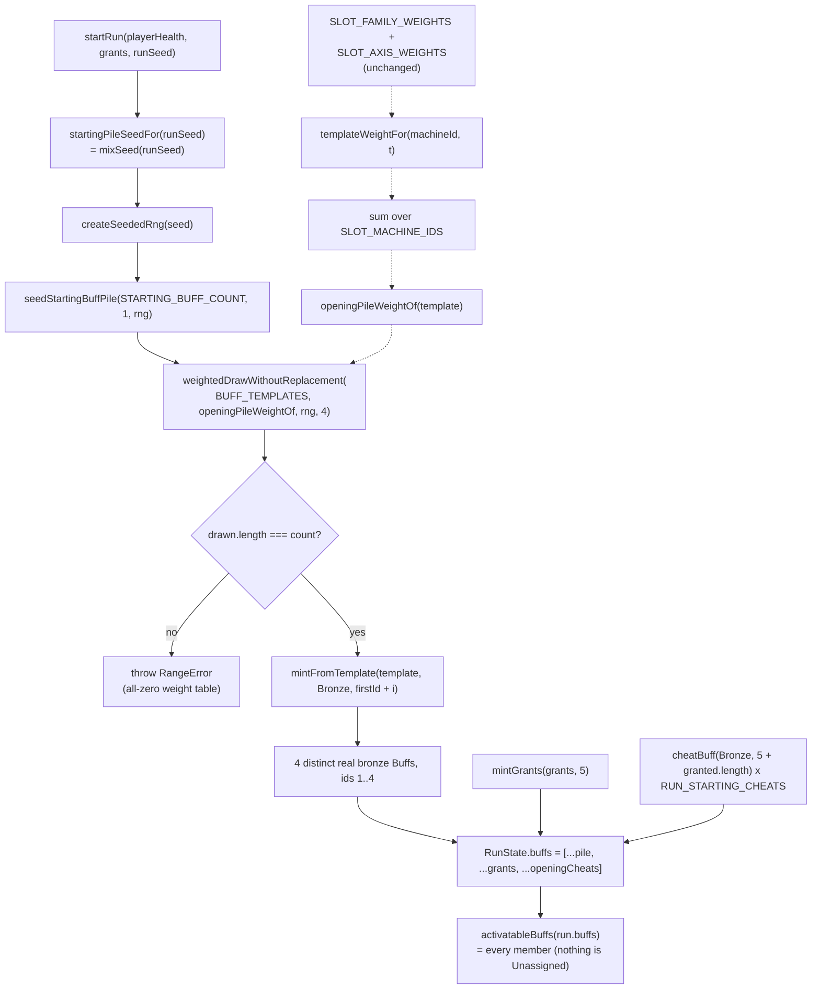

# Plan: A fresh run opens with four real bronze cards

Plan folder: `.claude/contract/DLR-135-fresh-run-opens-with-four-real-cards/`
Execution status: see `tasks.md` in this folder.

---

## Part 1 — Alignment

### Task reference

Jira **DLR-135** — "A fresh run opens with four placeholder cards and one real one" (Task, epic DLR-103, label `design`). Raised by DLR-121's epic verification pass; DLR-103 Definition of Done item 8 is PARTIAL.

Ticket acceptance criteria, verbatim:

1. The opening pile's content is decided and implemented, not just its count.
2. `npm run sim -- --runs 200 --seed 1` is re-run and the effect on activations, AP spent and win rate recorded.
3. No tuning value is changed as a side effect without being named.

**The ticket's blocking design decision is answered by the developer (2026-08-25, out-of-band):**

> The player starts with 4 random buff cards, bronze tier.

That selects option one of the ticket's three ("`seedStartingBuffPile` mints real content instead of placeholders"). The shop-before-fight-one option and the Vault `TemplateGrant[]` option are **rejected** and are not to be re-surveyed.

Two sub-decisions taken by the coordinator on the same date, both flagged in Risks as one-line reversals:

- Draw from the **full 73-template pool**, reusing the reel's existing family weights in `src/hunt/slotWeights.ts`. A second, separate opening pool would be a new tuning surface nobody asked for.
- **Cheat and Timebomb are eligible.** They have been ordinary pool members since DLR-132; excluding them re-introduces the special-casing that ticket removed. Bronze Cheat is 3 AP, bronze Timebomb 2 AP — neither is degenerate at bronze.

### Restated goal

`seedStartingBuffPile` currently mints four `BuffKind.Unassigned` stubs carrying `UNASSIGNED_BUFF_CONDITION` and a zero-value reward, every one of which `activatableBuffs` correctly filters out — so a run opens holding exactly one card the player can do anything with (the bronze Cheat `RUN_STARTING_CHEATS` adds). This plan replaces that scaffold with a real draw: four **distinct, real, bronze-tier** cards drawn from `BUFF_TEMPLATES` and minted through `mintFromTemplate`, weighted by the slot reel's existing family and axis tables, and driven entirely by the seeded RNG derived from `RunState.runSeed`, so the same seed reproduces the same opening hand. Nothing that mints `BuffKind.Unassigned` remains in production code; the `isPricedBuff` / `activatableBuffs` guard that exists because of it stays exactly as it is.

### In scope

- A new pure module `src/hunt/startingPile.ts` owning the opening draw: `startingPileSeedFor`, `openingPileWeightOf`, and the rewritten `seedStartingBuffPile(count, firstId, rng)`.
- Deleting `seedStartingBuffPile` from `src/hunt/buffs.ts` (it can no longer live there — the new implementation imports `buffTemplates.ts` and `slotWeights.ts`, both of which import `buffs.ts`).
- Rewiring `startRun` in `src/hunt/run.ts` to seed the pile from `runSeed`.
- Re-exporting the new module's public surface from `src/hunt/index.ts`.
- Rewriting every spec whose assertion the change legitimately invalidates, honestly — never by weakening an assertion to go green.
- Correcting the docblocks and comments across `buffs.ts`, `buffActivation.ts`, `buffCatalog.ts`, `sim/reachability.ts` and `sim/fixtures.ts` that assert the opening pile is placeholder content.
- Running `npm run sim -- --runs 200 --seed 1` before and after and recording win rate, mean buff activations per hand, mean AP spent per hand, and percentage of hands holding no activatable buff.

### Explicitly out of scope

- **Deleting `BuffKind.Unassigned`.** Decided deliberately in Assumptions below: kept.
- **Changing `RUN_STARTING_CHEATS`.** DLR-132 re-homed the opening Cheat into the pile; whether a run should open holding a Cheat at all is a separate standing question and not this ticket's to settle.
- **Any tuning value.** Not `STARTING_BUFF_COUNT` (already 4), not `RUN_STARTING_CHEATS` (1), not an AP cost, a damage figure, a slot weight, or a threshold. AC3 forbids it. If the opening hand makes the game easier, that is the developer's balance pass.
- **Re-tuning in response to the simulator.** The before/after figures are an observation to report, not a target to hit.
- A separate opening-pile weight table, a shop before fight one, or the Vault grant path.
- Any UI change. `BuffLoadoutPanel` and `buffLabels.ts` already render every real kind; a real bronze card in the opening pile renders through the paths DLR-114/DLR-132 already built.

### Pattern Reference

- `src/hunt/slotMachine.ts` → `drawReelPool` — the house pattern for "draw N distinct templates, weighted, from `BUFF_TEMPLATES`, with a `RangeError` on a short draw". The new `seedStartingBuffPile` is deliberately shaped as its sibling.
- `src/hunt/slotMachine.ts` → `slotSeedFor` / `spinSeedFor` and `src/hunt/seededRng.ts` → `dealSeedFor` — the house pattern for deriving a named, per-purpose seed from `runSeed` through `mixSeed`.
- `src/hunt/slotMachine.ts` → `mintPullAwards` and `src/hunt/buffTemplates.ts` → `mintGrants` — the `(…, firstId)` consecutive-id minting shape `seedStartingBuffPile` already follows and keeps.
- `src/hunt/slotWeights.ts` → `templateWeightFor` / `weightedDrawWithoutReplacement` — reused verbatim; no new weight table.
- `.claude/skills/react-frontend/SKILL.md` for everything under `src/`.

### Constraints flagged on the brief

- **Determinism is a hard constraint.** The four draws must come from the seeded RNG reachable from `runSeed`. `src/hunt/`, `src/warCouncil/`, `src/vault/` and `src/sim/` are free of `Math.random()` and `eslint.config.js` enforces the pure-core boundary; the only three `Math.random()` calls in the codebase are in `App.tsx`, seeding `startRun`. DLR-130's simulator and the developer's balance pass both depend on this.
- **No tuning value may change** (AC3).
- **99 `throw new` sites — weaken none.** This plan adds one (the short-draw guard) and removes none.
- CLAUDE.md's 400-line file limit is blocking, measured with `(Get-Content <file>).Count` after Prettier.
- Vocabulary: Timebomb / prime / ticking / detonates / Blast Guard — never "Envenom" or "poison" except `CardRank.Poison`.
- Browser pass is **not requested**; QA records what a browser would have checked. A dev server is already listening on 5173 — do not start another and do not kill it.
- Never put repo-wide `npm run format` in a task (`ae9ee28`); scope Prettier writes to the contract's own files.

### Assumptions made

- **`BuffKind.Unassigned` is KEPT, and this is a deliberate decision, not an omission.** After this change no production path mints it, which was the ticket's stated precondition for considering its deletion — but the member is **not dead**. It is the codebase's canonical *unpriced kind*, and four separate guard suites fire against it by name: `buffActivation.priced.test.ts` (the `isPricedBuff` / `activatableBuffs` guard), `buffCosts.test.ts:198` (`apCostOf` throws `RangeError`), `consumables.test.ts` (nine uses as the not-a-consumable fixture), and `ErrorBoundary.test.tsx:18`, which asserts the literal error string `apCostOf: no AP price for buff kind "unassigned"`. `sim/reachability.ts` also excludes it by name from both the mintable and unreachable sets. Deleting the member would force each of those tests to fabricate an unpriced kind through a cast, which *weakens* the very guard the ticket asks to preserve. So: the **cause** is removed (nothing mints it) and the **guard** is preserved intact, with its docblocks rewritten to say the member is a retained sentinel rather than live placeholder content. Reversible in a later ticket that is willing to own the test-fixture rewrite.
- **The draw lives in a new module, `src/hunt/startingPile.ts`, not in `buffs.ts`.** Forced, not preferred: the new implementation must import `BUFF_TEMPLATES` / `mintFromTemplate` (`buffTemplates.ts`) and `templateWeightFor` / `weightedDrawWithoutReplacement` (`slotWeights.ts`), and both of those import `buffs.ts`. Keeping the function in `buffs.ts` would create exactly the import cycle `slotWeights.ts`'s own docblock already refuses for `warCouncil`. `slotMachine.ts` was the alternative home and is rejected: the opening pile is not a slot machine, and `slotMachine.ts` is already 203 lines of a single coherent subject.
- **The opening pile's weight is the SUM of `templateWeightFor` across both `SLOT_MACHINE_IDS`.** The reel's weights are per-machine (Skirmisher leans trick/fight, Strongbox leans permanent upgrade) and the opening pile belongs to no machine. Summing introduces **no new number** — it is a derivation over the two shipped tables — and is machine-neutral by construction. Picking one machine's table instead would silently give the opening hand that machine's lean.
- **The four cards are drawn WITHOUT replacement, so the opening hand holds four distinct templates.** That is what `weightedDrawWithoutReplacement` gives and what `drawReelPool` already relies on; four copies of the same card is a worse opening hand and nobody asked for duplicates.
- **The opening pile gets its own named seed stream**, `startingPileSeedFor(runSeed) = mixSeed(runSeed)`, rather than reusing `dealSeedFor(runSeed, 0, 1)`. A one-part `mixSeed` fold is a distinct shape from the three-part folds `dealSeedFor` and `slotSeedFor` use, and a named function is the house pattern for every other seed in this tree.
- **A short draw throws `RangeError`**, mirroring `drawReelPool`'s short-strip guard for the same stated reason: a pile shorter than `STARTING_BUFF_COUNT` is a configuration bug (an all-zero weight table), not a legal state, and it would otherwise surface far from its cause. Unreachable today — 73 templates, every family weighted ≥ 1 on both machines.
- **`UNASSIGNED_BUFF_CONDITION` and `UNASSIGNED_BUFF_REWARD` are kept and stay exported.** They are the sentinel's condition and reward, asserted by `buffs.test.ts:146`; keeping the literal in one place is what stops each guard suite inventing its own.
- **The opening Cheat count assertion in `reachability.test.ts` is rewritten, not weakened.** Because Cheat is now an eligible draw, `run.buffs.filter(kind === Cheat).length === RUN_STARTING_CHEATS` is no longer a true statement of intent for every seed. It is replaced by two strictly *stronger* assertions: that the final `RUN_STARTING_CHEATS` pile members are the guaranteed Cheats, and that **every** opening card is activatable.

### Config and persisted-shape audit

- **Configuration keys renamed, retyped or removed: none.** `STARTING_BUFF_COUNT` (`src/hunt/config.ts:199`) and `RUN_STARTING_CHEATS` (`src/hunt/config.ts:193`) are read, not changed — 4 hits and 5 hits respectively across `src/**` (`config.ts`, `index.ts`, `run.ts`, and the specs). No tuning value moves, per AC3.
- **Persisted shapes affected: none.** `.claude/rules/save-data-versioning.md` scanned; none of its six reject conditions is tripped. `RunState.buffs` and `RunState.runSeed` are documented "NEVER persisted, exactly as `coins`" in `src/hunt/run.ts`. The Vault persists only `TemplateGrant` (`{ templateId, tier }`) and this plan does not touch `TemplateGrant`, `templateById`, `mintGrants`, `reconcileVault`, or `SAVE_SCHEMA_VERSION`. `src/persistence/**` is not in the file map.
- **Type changes checked for loss:** one — `seedStartingBuffPile` gains a third **required** parameter `rng: Rng` and moves module. Required rather than defaulted deliberately: a defaulted RNG would let a call site silently opt out of determinism, which is the one property this ticket must not lose. Every call site is enumerated below and changes in the same task.
- **Consumers of the changed export, counted by name:** a recursive grep for `seedStartingBuffPile` over `src/` returns **24 hits across 8 files** — of which **17 are live code/reference sites in 5 files**: `src/hunt/run.ts` (2: the import and the call), `src/hunt/index.ts` (1: the re-export), `src/hunt/__tests__/buffs.test.ts` (6), `src/hunt/__tests__/buffActivation.priced.test.ts` (5), `src/hunt/__tests__/buffCatalog.test.ts` (3). The remaining 7 are prose mentions in docblocks (`buffs.ts`, `buffActivation.ts`, `buffCatalog.ts`, `slotMachine.ts`, `consumables.test.ts`, `sim/reachability.ts`, `sim/fixtures.ts`) that describe the old behaviour and must be corrected. Every one of the 24 is in a task's `**Files:**` block.
- **Names align across the chain:** `seedStartingBuffPile` ↔ `startingPileSeedFor` ↔ `openingPileWeightOf` ↔ the `src/hunt/index.ts` barrel ↔ the three spec files. None of these binds by string — there is no storage key, `data-testid`, CSS class, or `aria-*` id in this change. The single string-bound surface in the blast radius is `ErrorBoundary.test.tsx:18`'s `apCostOf: no AP price for buff kind "unassigned"`, which this plan deliberately leaves untouched by keeping `BuffKind.Unassigned`.
- **Architectural boundary:** `src/hunt/startingPile.ts` sits inside the lint-enforced pure-core tree (`eslint.config.js` override on `src/hunt/**`). It imports no React, touches no DOM global, and calls no `Math.random()` — it takes `rng: Rng` explicitly, the convention every other randomness consumer in this tree already follows. `npm run lint` enforces it.
- **Construction sites (Step 1.6 check 7):** the `Buff` interface is **unchanged** — no field added, none widened — so no `Buff` literal breaks. Counted anyway to prove it: `Buff`: **89 annotated sites** (grepping `: Buff` / `Buff[]` / `<Buff>`), **63 construction sites** (grepping the distinctive required field `kind: BuffKind.`), 0 of which require an edit — the larger figure is the annotation count here, and it is unaffected because no field of `Buff` moves. The shape that *does* change is `seedStartingBuffPile`'s signature: **17 call/reference sites, 5 files, 14 of them in specs** — the larger number, and the one the tasks cover.

---

## Part 2 — Technical design

### Approach

The change is a deletion with a replacement of the same size. `seedStartingBuffPile` is one `Array.from` that fabricates four identical stubs; it becomes one weighted draw over the pool the game already owns. Everything it needs already exists and is already tested — `BUFF_TEMPLATES` (73 templates since DLR-132), `weightedDrawWithoutReplacement`, `templateWeightFor`, `mintFromTemplate`, `createSeededRng`, `mixSeed`. No new mechanism is invented; a scaffold that outlived its reason is pointed at the catalog that replaced it.

The function moves to a new file, `src/hunt/startingPile.ts`, because it must now import `buffTemplates.ts` and `slotWeights.ts`, and both of those import `buffs.ts`. That is a forced move, not a preference, and it is the same cycle `slotWeights.ts`'s own docblock already refuses to open for `warCouncil`. The new module is the direct sibling of `slotMachine.ts`'s `drawReelPool`: derive a named seed from `runSeed`, weight the pool, draw distinct templates without replacement, throw `RangeError` if the draw came up short, mint at a fixed tier with consecutive ids from `firstId`. Reading the two functions side by side should show one pattern applied twice, not two designs.

Weighting is the one place a new tuning surface could have crept in, and the design refuses it. `openingPileWeightOf(template)` is the **sum** of `templateWeightFor(machineId, template)` over `SLOT_MACHINE_IDS` — a derivation over the two shipped tables, contributing no number of its own. The alternative considered and rejected was a third `SLOT_FAMILY_WEIGHTS`-shaped table for the opening pile: it would be eleven-plus unchosen numbers on a ticket whose AC3 forbids changing tuning values, and it would need its own balance pass before it meant anything. The other alternative — picking one machine's table — was rejected because it silently gives every opening hand that machine's lean (Skirmisher's trick bias or Strongbox's coin bias) with nobody having chosen it.

Determinism is threaded the way this tree already threads it: `startRun` derives `startingPileSeedFor(runSeed)` and hands `createSeededRng` of it into `seedStartingBuffPile` as an explicit parameter. The parameter is **required**, not defaulted — a default would let a call site drop determinism without a compile error, and DLR-130's simulator and the developer's balance pass are both downstream of it. The pure-core lint override on `src/hunt/**` keeps `Math.random()` out by force.

The last moving part is `BuffKind.Unassigned`, and the decision there is to remove the **cause** while preserving the **guard**. Nothing in production mints the member after this change, which is what the three-times-repeated trap actually needed. But the member is still read: it is the canonical unpriced kind that `isPricedBuff`, `apCostOf`'s `RangeError`, `consumables.ts`'s predicates, `ErrorBoundary.test.tsx`'s literal error string, and `sim/reachability.ts`'s set exclusions all fire against by name. Deleting it would force those suites to fabricate an unpriced kind through a cast, weakening exactly the guard that catches the class. So the member stays, every docblock that describes it as live placeholder content is rewritten to describe it as a retained sentinel, and `activatableBuffs` is left byte-identical.

### Skills to invoke during execution

- `react-frontend` — everything in this contract is under `src/`: a new pure module in `src/hunt/`, edits to three more, and five spec files. It owns module placement, the configuration-driven-value rule, the strict-TypeScript posture, and Vitest conventions.
- `implementation-doc-writer` — the opening pile's content is a rule; `.docs/implementation/hunt/` and `.docs/game_rules/the-hunt.md` are its owners and must move with it. Invoked in the closing phase only.
- Rules to Read: `.claude/rules/save-data-versioning.md` (scanned in the audit; no reject condition tripped, and the executor should confirm that rather than assume it).
- Always: `.claude/workflow/web-project.md`.
- No developer override was applied — this contract runs out-of-band with the design decision pre-answered, so Step 1.5c's confirmation call was not presented.

### Diagram



### Data shapes

#### New module: `src/hunt/startingPile.ts`

```ts
import { BuffTier, type Buff, type BuffId } from './buffs'
import { BUFF_TEMPLATES, mintFromTemplate, type BuffTemplate } from './buffTemplates'
import { SLOT_MACHINE_IDS } from './slotConfig'
import { templateWeightFor, weightedDrawWithoutReplacement } from './slotWeights'
import { createSeededRng, mixSeed, type Rng } from './seededRng'

/** The run's opening-pile seed, derived from `runSeed`. UNIT: 32-bit unsigned integer. */
export function startingPileSeedFor(runSeed: number): number

/** A template's weight for the OPENING pile: the sum of its per-machine reel weight across
 *  every `SLOT_MACHINE_IDS` member. Derived — contributes no number of its own.
 *  UNIT: relative weight, >= 0, unitless. */
export function openingPileWeightOf(template: BuffTemplate): number

/** `count` DISTINCT real bronze cards drawn from `BUFF_TEMPLATES`, consecutive ids from
 *  `firstId`. `rng` is REQUIRED — a default would let a caller drop determinism silently.
 *  `weightOf` is DEFAULTED, exactly as `drawReelPool`'s is, so a curve is testable without
 *  mutating module state. Throws `RangeError` when fewer than `count` templates could be drawn. */
export function seedStartingBuffPile(
  count: number,
  firstId: BuffId,
  rng: Rng,
  weightOf?: (template: BuffTemplate) => number,
): readonly Buff[]

/** The opening pile for one run, seeded from `runSeed`. The one call `startRun` makes. */
export function startingBuffPileFor(count: number, firstId: BuffId, runSeed: number): readonly Buff[]
```

#### Changed signature

```ts
// BEFORE — src/hunt/buffs.ts
export function seedStartingBuffPile(count: number, firstId: BuffId): readonly Buff[]
// AFTER — src/hunt/startingPile.ts (moved module, third required parameter)
export function seedStartingBuffPile(count: number, firstId: BuffId, rng: Rng): readonly Buff[]
```

#### Deleted from `src/hunt/buffs.ts`

- `seedStartingBuffPile` (the `Array.from` stub factory). `UNASSIGNED_BUFF_CONDITION` and `UNASSIGNED_BUFF_REWARD` are **kept**, with rewritten docblocks.

#### `src/hunt/index.ts` barrel

- Remove `seedStartingBuffPile` from the `./buffs` export list.
- Add `export { seedStartingBuffPile, startingBuffPileFor, startingPileSeedFor, openingPileWeightOf } from './startingPile'`.

#### `src/hunt/run.ts` — the one production call site

```ts
// BEFORE
buffs: [...seedStartingBuffPile(STARTING_BUFF_COUNT, 1), ...granted, ...openingCheats],
// AFTER
buffs: [...startingBuffPileFor(STARTING_BUFF_COUNT, 1, runSeed), ...granted, ...openingCheats],
```

No config key, no `package.json` script, no dependency, and no persisted shape changes. No `BuffKind`, `BuffTier`, `BuffRewardAxis`, `Buff`, `BuffCondition`, or `BuffReward` member is added, removed, or retyped.

### Runtime quality notes

- **Purity and adjudication:** `startingPile.ts` is pure logic in `src/hunt/`, inside the lint-enforced DOM-free, React-free boundary. No component decides anything here; `startRun` asks and the module answers. Every number it uses is read from `SLOT_FAMILY_WEIGHTS` / `SLOT_AXIS_WEIGHTS` / `STARTING_BUFF_COUNT` — none is written into the module.
- **Effects, mount and teardown:** No React in the file map. No effect, listener, observer, timer, or `requestAnimationFrame` is created or changed. The only module-level state added is `undefined` — `openingPileWeightOf` recomputes per template rather than caching, because it is called 73 times once per run, not per frame; no HMR or cross-test leak is possible.
- **Hot-path cost:** The draw runs **once per run**, in `startRun`, not per pointer event and not per hand. `weightedDrawWithoutReplacement` copies the 73-element `BUFF_TEMPLATES` array and does 4 linear passes over a shrinking pool — trivially bounded, and the same cost `drawReelPool` already pays at every shop visit. No memoisation is introduced and none is warranted.
- **Determinism and numeric safety:** The whole point. `runSeed` → `startingPileSeedFor` (`mixSeed`, always a non-negative 32-bit integer) → `createSeededRng` (mulberry32) → exactly one `rng()` call per card drawn. No `Math.random()` is reachable — the pure-core ESLint override forbids it in `src/hunt/**`, and `npm run lint` is a gate. `openingPileWeightOf` sums `templateWeightFor`, which already returns 0 rather than dividing when its denominator is 0, so no `NaN` can enter a running weight total; the sum of non-negative finite terms is non-negative and finite. No epsilon is needed — this is a threshold walk over a running total, with `weightedDrawWithoutReplacement`'s existing last-candidate fallback catching float drift.
- **Error paths:** One new `throw` — `RangeError` on a short draw, naming `count`, the number actually drawn, and the weight tables to check, mirroring `drawReelPool`'s message. Nothing is swallowed and nothing returns a defaulted pile. `mintFromTemplate`'s existing `RangeError` on a condition template with no reward ladder is left intact and is now reachable from `startRun`, which is correct: a template the reward ladder cannot price must not become an opening card silently. The `isPricedBuff` / `activatableBuffs` guard and `apCostOf`'s `RangeError` are unchanged — 99 `throw new` sites become 100, and none is weakened.

### Risks and judgement calls

- **Sub-decision, one-line reversal: the opening pool is the full 73-template pool.** Reverse by filtering `BUFF_TEMPLATES` in `openingPileWeightOf`'s caller. The developer may prefer a curated opening pool; that is a new tuning surface and a separate ticket.
- **Sub-decision, one-line reversal: Cheat and Timebomb are eligible draws.** Reverse with a one-line `if (template.form === 'activated') return 0` in `openingPileWeightOf`. Bronze Cheat costs 3 AP of a 6-AP pool and bronze Timebomb 2 AP; neither is degenerate at bronze, and excluding them would re-introduce the special-casing DLR-132 removed.
- **Sub-decision, one-line reversal: opening weights are the SUM across both machines.** Reverse to `templateWeightFor(SlotMachineId.Skirmisher, template)` for a trick-lean opening hand, or `Strongbox` for an upgrade-lean one. Machine-neutral is the default because the opening pile is not a machine.
- **A run now opens with five cards, all activatable: four random bronze draws plus the guaranteed bronze Cheat.** `STARTING_BUFF_COUNT + RUN_STARTING_CHEATS = 4 + 1`. That total is unchanged in count — what changes is that all five are now real, where four of five were inert. The developer should decide separately whether five opening cards is the right number and whether the guaranteed Cheat should still be one of them; **that question is not this ticket's and no value here is touched.**
- **`BuffKind.Unassigned` survives, deliberately.** Nothing mints it; five guard suites still read it as the canonical unpriced kind. The developer may want a follow-up ticket that deletes the member and rewrites those fixtures — that ticket owns the fixture rewrite, and doing it here would weaken the guard mid-flight.
- **The simulator's win rate may still be 0.0%, and that is a finding, not a failure of this ticket.** DLR-120 measured 0 wins in 1,600 runs with 67.3–71.3% of hands holding nothing activatable; DLR-132 moved that to 0.0% and activations to 1.50/hand with the win rate still at 0.0%. This ticket is the last known confound. After it, a 0% win rate means the numbers are wrong rather than the player being starved. **Report what is observed; retune nothing.**
- **The opening hand's composition can only be judged by playing.** Four random bronze cards can be four Threshold-cadence cards that never fire in fight one, or four Event cards that all pay. The simulator reports the aggregate; whether the opening hand *reads* as a hand with a plan in it is the developer's eyes.
- **Browser pass is not requested and no dev server may be started.** A server is already listening on 5173 — leave it. QA records what a browser would have checked: that the loadout panel opens showing five named cards rather than four "Blank card" rows, that each shows a real AP price, and that the console is clean.
