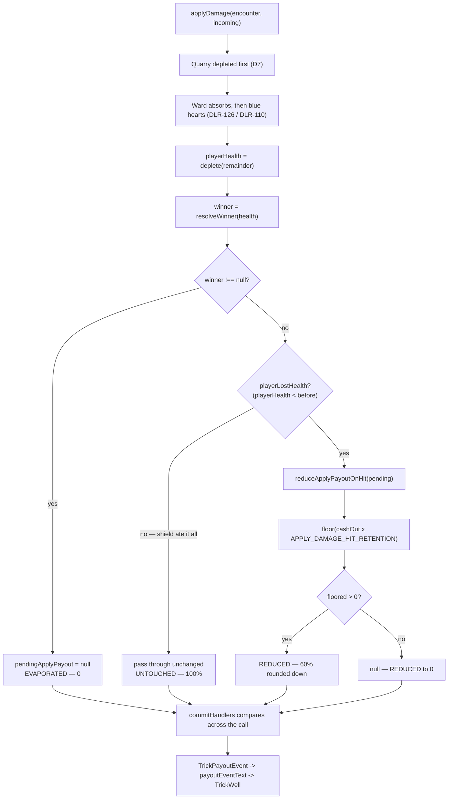

# Plan: Apply Damage payout reduces to 60% on a hit, not destroyed

Plan folder: `.claude/contract/DLR-141-apply-damage-payout-reduces-to-60-on-a-hit/`
Execution status: see `tasks.md` in this folder.

---

## Part 1 — Alignment

### Task reference

**DLR-141** (Bug, epic DLR-103, labels `engine` / `playable`) — "Apply Damage payout should reduce to 60% (rounded down) on a hit, not be destroyed".

Description, verbatim in substance: when the player takes a hit while an Apply Damage payout is queued, the payout is currently wiped to zero. It should instead land at 60% of its queued value, rounded down. Worked example: **10 queued, player takes a hit, payout lands for 6.** `applyDamage` in `src/hunt/encounter.ts` nulls `pendingApplyPayout` on `playerLostHealth || winner !== null`; `PayoutOutcome.Destroyed` reports a full wipe. `.docs/design/Balatro-Forbidden-Solitaire/hybrid-design.md` and `.docs/game_rules/the-hunt.md` document full destruction and must be updated in this ticket.

**Comment 1 (2026-08-25) — scope addition.** While a payout is queued the UI must state **how many tricks remain before it lands**, counting down as tricks resolve, **derived from `APPLY_DAMAGE_DELAY_TRICKS` and the queue state — not hard-coded**. `PAYOUT_QUEUE_RISK_HINT` ("Damage to you destroys it.") is falsified and must change. `PayoutOutcome.Destroyed` needs renaming and DLR-119's narration built on it becomes wrong.

**Comment 2 (2026-08-25) — both open questions answered by the developer. Decisions, not defaults; not to be re-opened.** The three outcomes:

| Situation | Queued payout |
|---|---|
| Player loses health from a hit | **60% of its value, rounded down** |
| Hit fully absorbed by blue hearts | **100% — untouched** |
| Encounter ends (Quarry dies, or player dies) | **0 — evaporates** |

The `winner !== null` half of the current predicate is **confirmed correct and stays**. Only the `playerLostHealth` half changes.

### Restated goal

A queued Apply Damage payout stops being an all-or-nothing gamble against the player's health bar. When a hit gets through to red health, the payout survives at 60% of its frozen value, rounded down, and stays in the air on its existing countdown. A hit that blue hearts eat entirely leaves it untouched, so spending a shield now protects the payout as well as the health bar. The encounter ending still evaporates it entirely, on a win or a death alike — a late press remains a gamble on the fight lasting long enough to collect. Alongside the rule, the felt's copy stops claiming a hit destroys the payout, the queued-payout readout keeps stating a derived countdown of tricks remaining, and both design documents are corrected so the rule cannot drift back.

### In scope

- A single new tuning constant expressing the 60% retention, in the file that already owns Apply Damage's tunables, read by exactly one function.
- A pure reducer in `src/hunt/applyDamagePayout.ts` that applies the retention to a queued payout, flooring, and returns `null` when the floored value reaches zero.
- `applyDamage` in `src/hunt/encounter.ts` reduces rather than wipes on `playerLostHealth`, and continues to wipe on `winner !== null`.
- An explicit test that a fully-absorbed hit leaves the payout at 100%, asserting the existing `playerLostHealth`-is-false construction rather than adding a second predicate.
- `PayoutOutcome` becomes a **three**-member union — `Paid`, `Reduced`, `Evaporated` — replacing the two-member `Paid` / `Destroyed`.
- `TrickPayoutEvent` gains a required `remaining: number | null` so a reduction can narrate both figures.
- `commitHandlers.ts` distinguishes the three fates across the `applyDamage` call.
- New copy in `payoutLabels.ts` for the risk hint and all three outcomes, with the percentage **derived from the constant**.
- `TrickWell.tsx`'s outcome CSS class stops binding to the removed `Destroyed` member.
- Verification (and a hardening test) that the queued-payout countdown is derived from `APPLY_DAMAGE_DELAY_TRICKS`, not a literal.
- Corrections to `.docs/design/Balatro-Forbidden-Solitaire/hybrid-design.md` and `.docs/game_rules/the-hunt.md`, including clearing the stale `[provisional]` marker on the full-destroy rule.

### Explicitly out of scope

- **Any other tuning value.** No AP cost, damage figure, weight, threshold or delay changes. The 60% retention is the only new number.
- Retuning anything in response to the sim's before/after figures — the figures are reported as an observation only.
- The pre-existing uncommitted working-tree changes (`BankMeter.tsx`, `WarCouncilRound.tsx`, `BankMeter.test.tsx`, `warCouncilHunt.css`, and the `APPLY_DAMAGE_AP_COST: 3 → 1` line in `apConfig.ts`). Not this ticket's work; left exactly as found and not committed.
- Carrying a queued payout across an encounter boundary — explicitly ruled out by comment 2.
- Any change to how a payout is queued, refused, or ticked; `queueApplyPayout` and `tickApplyPayout` keep their current behaviour.
- Reworking the action bar's layout. Only the sentence it renders changes.

### Pattern Reference

- `src/hunt/applyDamagePayout.ts` — the existing pure payout module; `applyDamageDelayTricks` is the model for "THE single statement of a tunable, never a literal at a call site", and the new retention reducer follows it.
- `src/hunt/apConfig.ts` — the existing home for Apply Damage's tunables, which argues in its own comments against splitting one control's tunables across files to satisfy a filename.
- `src/hunt/encounter.ts:151` — the single enforcement point (DLR-109 AC3) the change lands on.
- `src/app/warCouncil/payoutLabels.ts` — the existing total-function-over-`PayoutOutcome` pattern; a third fate must remain a compile error rather than an `undefined` sentence.
- Specification cited rather than re-derived: DLR-141's description and its two comments (the three-outcome table above), DLR-110's shield rule as documented at `src/hunt/encounter.ts:139-144`, and DLR-109's resolution order.

### Constraints flagged on the brief

- **60% rounded down is the only new number.** The diff on tuning files must be empty apart from the new constant.
- **Determinism** — `src/hunt/`, `src/warCouncil/`, `src/vault/`, `src/sim/` are free of `Math.random()` and a lint boundary enforces it. Nothing in this change introduces randomness.
- **100 `throw new` sites — weaken none.**
- **400-line file limit** is blocking and fixed in-ticket, measured after Prettier with `(Get-Content <file>).Count`.
- **Vocabulary** (`6ba6224`): Timebomb / prime / ticking / detonates / Blast Guard. Never "Envenom" or "poison" outside `CardRank.Poison`.
- **Never `npm run format`** (`ae9ee28`) — scope Prettier writes to the contract's own files.
- **All copy is unapproved and unseen.** Every changed string is listed with its before and after so reversing the wording is a find-and-replace.
- **The mockup gate is skipped** and went unseen; the browser pass was not requested and is off.

### Assumptions made

- **The new constant lives in `src/hunt/apConfig.ts`** — *confirmed by project convention, not invented*: that file already owns `APPLY_DAMAGE_AP_COST` and `APPLY_DAMAGE_DELAY_TRICKS` and explicitly argues against splitting one control's tunables. The value itself (0.6) is **not** an assumption — it is stated on the ticket.
- **Three outcome members rather than one rename** — the ticket invites this explicitly ("consider whether you need two outcomes rather than one renamed"), and the developer's table has three distinct fates. A single renamed member could not narrate "cut to 6" and "the fight ended" with one sentence without lying about one of them.
- **A reduction that floors to zero is reported as `Reduced` with `remaining: 0`, not as `Evaporated`.** `Evaporated` means the encounter ended; a payout of 1 cut to 0 by a hit is still the hit's doing, and narrating it as the fight ending would be false. Distinguished in `commitHandlers.ts` by inspecting `winner`, which is unambiguous because `applyDamage` now nulls only on `winner !== null`.
- **`Reduced` is a non-terminal event.** `TrickPayoutEvent` previously named only terminal fates; a reduction leaves the payout in the air. This is a widening of what the type reports, not a change to what the engine does.
- **A trick that both reduces and settles a payout reports `Paid` at the reduced figure.** `settleApplyPayout` already overwrites the pre-tick event with `Paid`, and `tick.due.cashOut` reads the already-reduced value, so the number the player is told is the number that landed. The reduction is not separately narrated in that one trick.
- **The percentage in copy is computed from the constant**, never typed as the literal "60". This is the DLR-135 failure mode the ticket names, applied to a string rather than a display figure.
- **The countdown requirement is largely already satisfied** — see Risks; `queuedPayoutText` already derives and renders it. The work here is verification plus a derivation test, and the finding is reported rather than a second countdown being built.
- **No `SAVE_SCHEMA_VERSION` bump.** Nothing in this change is persisted (audit below).

### Config and persisted-shape audit

- **New configuration key `APPLY_DAMAGE_HIT_RETENTION`** — grepped across `src/**`: **0 hits**. It is new, so there is no existing reader to update; the plan gives it exactly one reader (`reduceApplyPayoutOnHit`) and one copy derivation (`PAYOUT_QUEUE_RISK_HINT`).
- **`PayoutOutcome.Destroyed` is being removed.** `Grep "PayoutOutcome"` over `src/`: **21 hits across 9 files**. Hits naming `Destroyed` specifically: **6** — `commitHandlers.ts:137`, `payoutLabels.ts:18`, `TrickWell.tsx:115`, `payoutLabels.test.ts:17`, `TrickWell.test.tsx:239`, and `applyDamagePayout.ts:26` (the declaration). Every one is in a task's `**Files:**` block. `applyDamagePayout.test.ts:75` asserts `Object.values(PayoutOutcome)).toEqual(['paid','destroyed'])` and must change to the three-member list.
- **`TrickPayoutEvent` — construction sites counted per file, not per line range (Step 1.6 check 7).** Type-name grep: **10 hits across 5 files** (`commitHandlers.ts`, `payoutLabels.ts`, `roundUiState.ts`, `applyDamagePayout.ts`, `index.ts`) — annotations and imports only. Field-name grep on the distinctive required field `outcome:` paired with `PayoutOutcome`: **6 construction sites** — 2 production (`commitHandlers.ts:137`, `:180`) and 4 in specs (`payoutLabels.test.ts:11`, `:17`; `TrickWell.test.tsx:228`, `:239`). **The larger figure, 6, is the real number** and all 6 gain the new required `remaining` field. Adding a *required* field is the loss case from check 3: every construction site breaks at `tsc` until updated, which is why all 6 are in one task.
- **`EncounterState` and `PendingApplyPayout` gain no field.** The change alters the *value* of `pendingApplyPayout.cashOut`, not either shape, so their construction sites (the named trap on this ticket) are deliberately untouched and need no enumeration.
- **String-bound CSS name `wc-is-destroyed`** — `Grep` over `src/`: **2 hits** — `TrickWell.tsx:115` (the binding) and `warCouncilTable.css:165` (the rule). Both change in the same task; a rename that touched only the `.tsx` would type-check cleanly and silently drop the styling.
- **Nothing here is persisted.** `Grep "pendingApplyPayout|PayoutOutcome|cashOut"` over `src/persistence/` and `src/vault/`: **0 hits**. No stored record derives from these shapes, so `.claude/rules/save-data-versioning.md` reject condition 4 is not engaged and `SAVE_SCHEMA_VERSION` is not bumped. Recording that this window is open is the point of saying so.
- **Purity boundary intact.** The two engine files changed (`applyDamagePayout.ts`, `encounter.ts`) are inside the lint-enforced pure-core tree and the change adds no React import, no DOM global, and no `Math.random()`.

---

## Part 2 — Technical design

### Approach

The rule change is deliberately kept as a **one-line change at one enforcement point plus one pure function**, because `applyDamage` is already the single damage funnel DLR-109 AC3 built for exactly this. The predicate `playerLostHealth || winner !== null ? null : encounter.pendingApplyPayout` becomes a three-way expression: `winner !== null` still yields `null`, `playerLostHealth` yields `reduceApplyPayoutOnHit(encounter.pendingApplyPayout)`, and everything else passes the payout through by reference. Ordering `winner` first matters — a killing blow that also cost the player health must evaporate the payout, not reduce it, and testing `winner` first makes that unambiguous rather than emergent.

The fully-absorbed case gets **no new logic at all**, which is the ticket's explicit instruction. `playerLostHealth` is computed as `playerHealth < encounter.health[DuelSide.Player]`, and blue hearts absorb before `deplete` runs, so a fully-absorbed hit leaves that false and falls into the pass-through branch by construction. Adding a second predicate would create exactly the drift the single-enforcement-point design exists to prevent. The plan therefore adds a *test* asserting the 100% case rather than code implementing it.

`reduceApplyPayoutOnHit` goes in `src/hunt/applyDamagePayout.ts` as a pure function rather than inline in `encounter.ts`, for the reason the rest of that module exists: the flooring, the retention constant, and the reach-zero edge are a testable invariant that should not require constructing an `EncounterState` to exercise. It returns `null` when the floored value hits zero, because `PendingApplyPayout` documents `cashOut` as strictly positive and `queueApplyPayout` throws on a non-positive value — a queued payout of 0 would be a shape the module elsewhere refuses to mint.

The reporting layer is where the real design choice is. `PayoutOutcome` becomes three members, not one renamed, because the developer's table has three distinct fates and the felt has to say three different things. `Destroyed` is deleted rather than kept as an alias — an alias would let a future call site reintroduce the wiped reading. `TrickPayoutEvent` gains a required `remaining: number | null` (required-but-nullable, so all six construction sites must state it rather than silently defaulting) carrying what is left in the air after a reduction. `commitHandlers.ts` then reads the three fates off the `applyDamage` boundary it already straddles: payout gone and `winner !== null` is `Evaporated`; payout gone and no winner is a reduction that floored to zero, reported `Reduced` with `remaining: 0`; a smaller `cashOut` is `Reduced`; unchanged is no event. The alternative — deriving the fate inside `encounter.ts` and returning it — was rejected because `applyDamage` returns an `EncounterState` and nothing else, and widening its return type to carry a report would push presentation concerns into the pure core.

On the countdown: **`queuedPayoutText` in `actionBarLabels.ts` already renders it**, derived from `pending.resolutionsOwed`, which `queueApplyPayout` sets to `applyDamageDelayTricks(modifiers) + 1` and `tickApplyPayout` decrements. It is rendered visibly at `ActionBar.tsx:204` as `<p className="wc-bar-queued">`, not only in an aria-label. The ticket's premise that "there is currently no timing shown anywhere" appears to have been overtaken by DLR-119's 2026-08-24 fix, which `hybrid-design.md` itself records. Rather than build a second countdown, the plan **verifies** the existing one and hardens it with a test that computes its expected figure from `applyDamageDelayTricks() + 1` instead of the literal `2` the current spec uses — so a retune of `APPLY_DAMAGE_DELAY_TRICKS` moves the assertion with the rule. That is the DLR-135 lesson applied to the spec as well as the source.

### Skills to invoke during execution

- `react-frontend` — owns everything under `src/`: the pure-module placement, the no-hard-coded-tunable rule, the 400-line budget, and the Vitest posture for both the pure-logic and component specs.
- `game-ux` — owns `payoutLabels.ts` and the action-bar sentence, per the ticket's explicit assignment. Relevant floor: nothing a decision needs may be hover-only (the queued note is on the face of the bar), and state must read without colour alone (the outcome class is reinforcement, the sentence carries the meaning).
- `implementation-doc-writer` — owns `.docs/game_rules/the-hunt.md` and the per-module docs; the rule change and the cleared `[provisional]` marker are its output, never a hand edit.
- `game-designer` — owns `.docs/design/Balatro-Forbidden-Solitaire/hybrid-design.md`, which this ticket must correct in three places.

Rules to Read: `.claude/rules/save-data-versioning.md` (scanned — not engaged, nothing here is persisted). Workflow: `.claude/workflow/web-project.md`.

No developer override was applied: this is a non-interactive out-of-band run and the Step 1.5c confirmation call was skipped.

### Diagram



### Data shapes

#### New configuration key

```ts
// src/hunt/apConfig.ts
// DLR-141 — the FRACTION of a queued Apply Damage payout that survives a hit which costs the
// player red health. DEVELOPER-SET on the ticket: 60%, rounded down at the point of use.
// UNIT: dimensionless fraction of the frozen cashOut, 0..1.
export const APPLY_DAMAGE_HIT_RETENTION = 0.6
```

Value is **stated on the ticket**, not chosen here, so it is not a developer decision left open.

#### Changed union — `src/hunt/applyDamagePayout.ts`

```ts
export const PayoutOutcome = {
  /** The delay ran out, or the hand ended, and the frozen `cashOut` was dealt to the Quarry. */
  Paid: 'paid',
  /** DLR-141 — a hit cost the player red health and cut the queued payout to
   *  `APPLY_DAMAGE_HIT_RETENTION` of its value, rounded down. It is STILL IN THE AIR. */
  Reduced: 'reduced',
  /** DLR-141 — the encounter resolved (Quarry dead, or player dead) with the payout still
   *  queued. There is no target left, so it is lost entirely. */
  Evaporated: 'evaporated',
} as const
export type PayoutOutcome = (typeof PayoutOutcome)[keyof typeof PayoutOutcome]
```

`Destroyed: 'destroyed'` is **deleted**.

#### Changed interface — `src/hunt/applyDamagePayout.ts`

```ts
export interface TrickPayoutEvent {
  readonly outcome: PayoutOutcome
  /** The payout's frozen `cashOut` as it stood BEFORE this event. */
  readonly cashOut: number
  /** DLR-141 — what is STILL IN THE AIR after a `Reduced` event, which may be `0` when the
   *  floored value reached zero. `null` for `Paid` and `Evaporated`, which are terminal.
   *  Required rather than optional so every construction site must state it. */
  readonly remaining: number | null
}
```

#### New pure function — `src/hunt/applyDamagePayout.ts`

```ts
export function reduceApplyPayoutOnHit(
  pending: PendingApplyPayout | null,
): PendingApplyPayout | null
```

Returns `null` for a `null` input; otherwise a copy with `cashOut` set to
`Math.floor(pending.cashOut * APPLY_DAMAGE_HIT_RETENTION)`, or `null` when that value is `<= 0`.
Never throws — it runs inside `applyDamage`, which runs inside a reducer.

#### Changed expression — `src/hunt/encounter.ts:151`

```ts
// before
pendingApplyPayout: playerLostHealth || winner !== null ? null : encounter.pendingApplyPayout,
// after
pendingApplyPayout:
  winner !== null
    ? null
    : playerLostHealth
      ? reduceApplyPayoutOnHit(encounter.pendingApplyPayout)
      : encounter.pendingApplyPayout,
```

#### Changed copy — `src/app/warCouncil/payoutLabels.ts`

```ts
export const PAYOUT_QUEUE_RISK_HINT: string  // derived from APPLY_DAMAGE_HIT_RETENTION
const PAYOUT_OUTCOME_TEXT: Readonly<Record<PayoutOutcome, (event: TrickPayoutEvent) => string>>
export function payoutEventText(event: TrickPayoutEvent | null): string | null  // signature unchanged
```

`PAYOUT_OUTCOME_TEXT`'s value type changes from `(cashOut: number) => string` to
`(event: TrickPayoutEvent) => string`, because `Reduced` needs both figures.

#### No change

`PendingApplyPayout`, `EncounterState`, `ApplyPayoutTick`, `ApplyDamageDelayModifiers`,
`applyDamageDelayTricks`, `queueApplyPayout`, `tickApplyPayout`, `queuedPayoutText`,
`applyDamageBarAccessibleName`. No `package.json`, `tsconfig`, or dependency change.

### Runtime quality notes

- **Purity and adjudication:** the rule lives entirely in `src/hunt/` — a pure function plus one expression at the existing single enforcement point. No component decides anything: `commitHandlers.ts` only *observes* what the engine already did by comparing the payout across the `applyDamage` call, exactly as it does today. The retention fraction is read from configuration and appears as a literal nowhere, including in the copy, which computes its percentage from the same constant.
- **Effects, mount and teardown:** no effect, listener, observer, timer, `requestAnimationFrame`, or `AbortController` is added or changed. No component lifecycle is touched — `TrickWell.tsx`'s change is a className expression and `ActionBar.tsx` is not modified at all. StrictMode double-invocation is not engaged. No module-level mutable state is introduced; `PAYOUT_QUEUE_RISK_HINT` is a module-level `const` computed once from another `const`, which is immutable and safe across HMR and across tests in one file.
- **Hot-path cost:** `reduceApplyPayoutOnHit` runs at most once per damage event — not per pointer move, not per frame — and allocates at most one small object. It is a multiply, a floor, and a compare. No collection is scanned and no search is introduced. No memoisation is added, and none would have profiling evidence behind it.
- **Determinism and numeric safety:** no `Math.random()` is introduced anywhere; the lint boundary over `src/hunt/` continues to hold. There is **no division**, so no divisor to guard and no `NaN` path from this change — `Math.floor(finite * 0.6)` of a `cashOut` that `queueApplyPayout` already guarantees finite and positive is finite. The `<= 0` comparison (rather than `=== 0`) mirrors `tickApplyPayout`'s existing defensive form, so a corrupted value terminates rather than minting a zero-value payout.
- **Error paths:** `reduceApplyPayoutOnHit` never throws, matching `tickApplyPayout`'s stated discipline, because it executes inside a reducer where a throw unmounts the tree. It does **not** swallow a failure into a success shape: a payout that floors to zero returns `null`, which the caller reports as an explicit `Reduced` event with `remaining: 0` rather than silently as "nothing happened". No existing `throw new` site is weakened, removed, or made conditional — the count stays at 100. `payoutEventText` stays a total function over `PayoutOutcome`, so the third member is a compile error at every unhandled site rather than an `undefined` sentence on the felt.

### Risks and judgement calls

- **All copy is unapproved and unseen.** The mockup gate was skipped and no browser pass ran. Every changed string is listed with its before and after in `tasks.md` and in the sprint log, so reversing any wording is a find-and-replace rather than an investigation. The developer owns the wording.
- **The ticket's countdown premise looks stale.** `queuedPayoutText` already renders a derived "N tricks to go" visibly on the action bar, and `hybrid-design.md` records the fix landing on 2026-08-24 — after the ticket was written. The plan verifies and hardens it rather than building a second one. **If the developer wanted something more prominent than a line of text on the action bar, that is a design call this plan has not made.**
- **Three outcomes rather than one rename is a judgement call**, invited by the ticket but not dictated by it. It costs a required field on `TrickPayoutEvent` and touches all six construction sites.
- **Reporting a floor-to-zero reduction as `Reduced` with `remaining: 0`, not `Evaporated`,** is a reading of the developer's table, which does not name the case. It follows from `Evaporated` meaning "the encounter ended".
- **A trick that both reduces and settles narrates only `Paid`,** at the reduced figure. The player is told the true landed number but not why it shrank. Deliberate, and cheap to revisit.
- **The working tree was not clean at the start of this ticket**, contrary to the brief. Five files carry pre-existing uncommitted changes, including `APPLY_DAMAGE_AP_COST: 3 → 1` in `apConfig.ts` — the same file this contract must add a constant to. The commit will stage **only** this contract's own addition to that file and will leave the developer's AP change unstaged and untouched in the working tree. **The developer must decide what to do with those five files; this ticket does not commit them.**
- **The measured baseline does not match the brief's figures** because of that uncommitted AP change: the brief cites 2.86 activations/hand and 4.41 AP/hand, and this tree measures 4.19 and 5.93 at `APPLY_DAMAGE_AP_COST = 1`. Before/after sim figures are reported as an observation and **nothing is retuned**.
- **Whether a 60% survival makes a late Apply Damage press feel worth taking is a play question**, not a test question, and no browser pass or sim run answers it.
