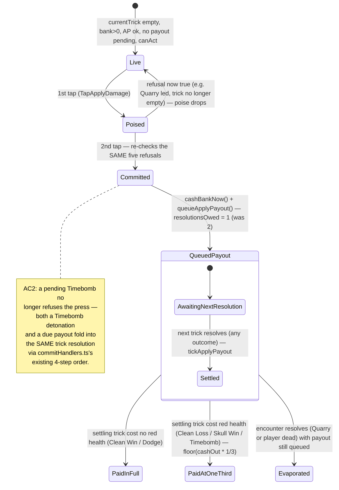

# Plan: Rework Apply Damage — leader-only press, Timebomb stacking, 1-trick settle, ⅓ loss retention

Plan folder: `.claude/contract/DLR-143-rework-apply-damage-timing/`
Execution status: see `tasks.md` in this folder.

---

## Part 1 — Alignment

### Task reference

Jira issue **DLR-143** — "Rework Apply Damage: leader-only press, Timebomb stacking, 1-trick settle, ⅓ loss retention".

> **Problem Statement**
> Apply Damage's press-time gating, settle delay, and hit-retention math don't match the intended design: it can currently be pressed mid-trick, it's blocked by a pending Timebomb (D6, 2026-08-19 — being reversed), it takes two trick resolutions to settle instead of one, and a loss retains 60% instead of the intended 33%.
>
> **User Story**
> As a player, I want Apply Damage to be pressable only before a trick starts, settle at the very next trick's resolution, and stack with a pending Timebomb, so the action behaves the way it reads on the button.
>
> **Acceptance Criteria**
> 1. `applyDamageRefusalFor` refuses whenever `state.round.currentTrick.length > 0` — Apply Damage is leader-only (unpressable once any card, including the Quarry's lead, is on the table).
> 2. `applyDamageRefusalFor` no longer refuses on a pending Timebomb — the `TimebombPending` reason and its D6 rule are removed. A Timebomb detonating on the same trick and a due Apply Damage payout both resolve in that trick's fold.
> 3. `APPLY_DAMAGE_DELAY_TRICKS` becomes `0`, so `resolutionsOwed` starts at 1 and the payout settles at the resolution of the very next trick after the press, not two tricks later.
> 4. `APPLY_DAMAGE_HIT_RETENTION` becomes `1/3` (still floored via `Math.floor`), replacing 0.6.
> 5. The existing health-lost-based reduction is unchanged in mechanism: a trick that costs the player red health (Clean Loss, Skull Win, or a detonating Timebomb) reduces the frozen payout to the new retention fraction; a trick that costs no health (Clean Win or Dodge) pays it in full. ("Won"/"lost" here follow the game's effective-outcome sense: Dodge counts as a win, Skull Win counts as a loss.)
>
> **Scope Boundaries**
> In scope: the refusal gate in `voluntaryCashOut.ts`, the two tunables in `apConfig.ts`, the dated D6 rule and its comments/tests, any new "is the trick empty" fact `roundUiState.ts`/`commitHandlers.ts` needs to feed the gate, and every existing test asserting the old 2-trick delay, 0.6 retention, or Timebomb-blocks-press behaviour.
> Out of scope: Shield/Ward absorption order, Timebomb's own booking/accumulation rule, the buff system, and the AP cost to press.
>
> **Dependencies & Risks**
> Reverses a previously dated, deliberate ruling (D6, 2026-08-19) that a pending Timebomb blocks Apply Damage — call this out explicitly in the PR, since a codebase comment cites that date and rationale directly. Related to DLR-141 (which set the current 60% retention this ticket changes to 33%). `.docs/game_rules/the-hunt.md` (and any implementation doc covering Apply Damage) will need updating afterward by `implementation-doc-writer`, not by hand.

No follow-up decisions were confirmed interactively — the brief is unambiguous on all five acceptance criteria; the one open design choice (where the new refusal reason sits in the five-clause order, since AC1's list numbers criteria but not clause precedence) is resolved under Assumptions made below.

### Restated goal

Apply Damage — the streak-cashing action on the Hunt's action bar — currently has three timing/economy rules that don't match the intended design. This task corrects all three in the same pass, because they share the two files that gate and pay the action: (1) the press becomes available only when the current trick is empty (before the Quarry's lead lands, not just before the player's own follow), rather than being pressable mid-trick; (2) a pending Timebomb no longer blocks the press — the two systems are allowed to stack, reversing a deliberate rule from three days ago; (3) a queued payout settles at the very next trick's resolution instead of surviving two; and (4) a trick that costs the player red health while a payout is queued now keeps ⅓ of the frozen figure (floored) instead of 60%. Nothing about *how* the reduction is computed changes — only the fraction and the two gating/timing rules around it.

### In scope

- `applyDamageRefusalFor` in `src/warCouncil/voluntaryCashOut.ts` refuses whenever the current trick has any card on the table (leader-only), replacing its Timebomb-pending refusal.
- `ApplyDamageRefusal.TimebombPending` and its D6 rationale are removed from the reason vocabulary, from `voluntaryCashOut.ts`'s refusal function, and from the felt's copy (`labels.ts`).
- A new refusal reason naming "a trick is already in flight" is added, wired through `ApplyDamageStock`, `applyDamageStock` (`roundUiState.ts`), the refusal function, and the felt's copy.
- `APPLY_DAMAGE_DELAY_TRICKS` (`src/hunt/apConfig.ts`) changes from `1` to `0`.
- `APPLY_DAMAGE_HIT_RETENTION` (`src/hunt/apConfig.ts`) changes from `0.6` to `1/3`.
- Every doc comment that states the old D6 rule, the old two-trick delay, or the old 60% figure as fact is corrected in the same task that changes the code it describes (`voluntaryCashOut.ts`, `apConfig.ts`, `applyDamagePayout.ts`, `roundReducer.ts`'s `handleTapApplyDamage` docblock).
- Every existing test asserting the old 2-trick delay, the old 60% retention, or "a pending Timebomb blocks the press" is updated to the new behaviour, and new tests cover the leader-only gate and Timebomb-stacking.
- `src/app/warCouncil/__tests__/roundReducer.applyDamage.test.ts`'s `describe('Apply Damage — the poise, and the refusals (AC1, D6)', …)` — its two D6 tests (`'D6 — a pending Timebomb hit cannot be poised past'`, `'D6 — Timebomb booked AFTER the poise still stops the commit, and drops the poise'`) exercise the reversed rule through the real reducer via `queueTimebomb` + `tapApply`, never through the literal `timebombPending` string, which is why the audit below's identifier grep missed them. Both assertions invert under AC2: rewrite them to confirm a pending Timebomb no longer blocks the poise or the commit, and add a same-file test (two-tap flow, not `roundReducer.delayedApply.test.ts`'s fixture-only route) proving the Timebomb detonation and the queued payout both settle in the same trick's fold.

### Explicitly out of scope

- Shield/Ward absorption order (`src/hunt/shield.ts`, `src/hunt/consumables.ts`) — untouched; their existing tests only need to keep deriving the retention figure from the constant, which they already do.
- Timebomb's own booking/accumulation rule (`queueTimebomb`, `TIMEBOMB_DAMAGE`) — untouched.
- The buff system, including any buff that shortens or removes the Apply Damage delay (`ApplyDamageDelayModifiers`) — the modifier plumbing in `applyDamagePayout.ts` stays exactly as it is; only the base tunable it reads changes.
- The AP cost to press (`APPLY_DAMAGE_AP_COST`) — untouched.
- `.docs/game_rules/the-hunt.md` and any `.docs/implementation/` page — the brief states these are updated afterward by `implementation-doc-writer`, not by this contract.
- Any change to `commitHandlers.ts`'s four-step fold order (trick damage → Timebomb clear → Timebomb book → payout tick). AC2's "both resolve in that trick's fold" is already true of that ordering today — nothing in the fold itself needs to change, only the press-time gate that used to keep the two systems from ever colliding.

### Pattern Reference

Brief-supplied, verbatim: `applyDamageRefusalFor` (`src/warCouncil/voluntaryCashOut.ts`) and the two tunables in `src/hunt/apConfig.ts`. The brief further points at `roundUiState.ts`/`commitHandlers.ts` for "any new 'is the trick empty' fact" the gate needs.

Investigation found the exact shape that fact should take: `discardWindowOpen` (`src/app/warCouncil/roundUiState.ts:326-338`) already reads `state.round.currentTrick.length === 0` for an unrelated control (the discard rail), and its docblock states the same reason DLR-143 needs — "the moment the action is available, independent of whose turn it is... this is what reaches the Quarry-to-lead gap, where `canAct` is false... but the trick has not started." `applyDamageStock` follows that established pattern rather than inventing a new one.

`commitHandlers.ts`'s `applyResolution` (lines 74-169) already implements AC2's ordering requirement today — trick damage (which folds in any detonating Timebomb) is applied, the Timebomb queue is cleared, the new prime is booked, and the payout ticks LAST. This is presently unreachable in the Timebomb-and-payout-both-pending case only because the D6 refusal never lets that state exist; removing the refusal is what makes this existing ordering observable for the first time. No `commitHandlers.ts` code change follows from this — it is cited here because Investigation confirms the existing implementation already satisfies AC2, which the plan treats as new coverage rather than new code.

### Constraints flagged on the brief

- The PR description must explicitly call out that this reverses D6 (version-4-scope §3, decided 2026-08-19) — a comment in `voluntaryCashOut.ts` cites that date and rationale directly, and the brief requires the reversal be stated plainly rather than silently overwritten.
- `APPLY_DAMAGE_HIT_RETENTION`'s prior value (0.6) was itself a deliberate, dated developer decision from DLR-141 — this ticket's ⅓ is a second deliberate developer decision (transcribed from the brief, not invented), not a tuning value this plan leaves open.
- Determinism/seeding: not applicable — no randomness is touched.
- Save-compatibility: not applicable — nothing here is persisted (see Config and persisted-shape audit below).

### Assumptions made

- **New refusal reason name: `ApplyDamageRefusal.TrickInProgress` (`'trickInProgress'`).** The brief names no identifier for the new gate. `TrickInProgress` reads as the mirror of AC1's own wording ("unpressable once any card... is on the table") and follows the existing `PascalCase` key / `camelCase` string-value convention every other `ApplyDamageRefusal` member uses.
- **New `ApplyDamageStock` field name: `trickInFlight: boolean`**, replacing the removed `timebombPending: boolean`. Built in `roundUiState.ts`'s `applyDamageStock` as `state.round.currentTrick.length > 0` — the direct negation of AC1's own literal condition, and the same field `discardWindowOpen` already reads off the identical state path for its own gate.
- **Five-clause order becomes: `NotYourMove` → `TrickInProgress` → `PayoutPending` → `InsufficientAp` → `EmptyBank`**, i.e. `TrickInProgress` takes the exact ordinal slot `TimebombPending` is vacating. `applyDamageRefusalFor`'s existing docblock states the ordering rule precisely: report the reason that will "still be true after the next trick banks." Like the old `TimebombPending`, `TrickInProgress` stops being true the moment the trick resolves and the felt returns to `AwaitingLead` with an empty `currentTrick` — the same transience class as the reason it replaces, and distinct from `PayoutPending` (survives a full delay window) and `EmptyBank` (survives until a trick is *won*). Placing it first among the four remaining transient-vs-persistent reasons preserves the existing rule's intent with no re-derivation needed. Flagged in Risks for a one-line sanity check since the brief itself doesn't order the five clauses.
- **`hasPendingTimebomb`'s import in `roundUiState.ts` is dropped**, since `applyDamageStock` was its only caller in that file. Confirmed by Investigation: no other line in `roundUiState.ts` reads it.
- **`APPLY_DAMAGE_HIT_RETENTION` is written as the literal `1 / 3`, not `0.333` or similar**, so `Math.floor(cashOut * APPLY_DAMAGE_HIT_RETENTION)` reads exactly as "one third" with no rounding ambiguity at the constant's own definition — the existing `0.6` was likewise written as a plain decimal literal, and `1/3` is the closest match to that style for a value that has no exact decimal form.
- **Doc-comment corrections (D6 rationale, "two tricks" phrasing, "60%" phrasing) are treated as in-scope code-adjacent changes**, not documentation work requiring `implementation-doc-writer` — the brief's own scope line places "the dated D6 rule and its comments" inside this contract, distinct from `.docs/game_rules/the-hunt.md`, which stays out of scope per the brief's Dependencies & Risks note.
- **`PAYOUT_QUEUE_RISK_HINT` and its accessible-name plumbing need no source change**, only a test-literal update — `src/app/warCouncil/payoutLabels.ts` already derives its "cuts it to N%" copy from `APPLY_DAMAGE_HIT_RETENTION` via `Math.round(... * 100)`, so changing the constant alone flows through correctly; only `payoutLabels.test.ts`'s hardcoded `'Damage to you cuts it to 60%.'` expectation needs updating to `33%`.

### Config and persisted-shape audit

- **Nothing in this task is persisted.** No `localStorage`/`sessionStorage` access, no `src/persistence/**` file, and no field on `RoundState`, `EncounterState`, or `WarCouncilState` gains, loses, or retypes a property — `PendingApplyPayout`'s shape (`cashOut`, `resolutionsOwed`, `unplayedAtPress`) is unchanged; only the *value* two constants feed into it changes. `.claude/rules/save-data-versioning.md` does not apply.
- **`APPLY_DAMAGE_DELAY_TRICKS` — value change only, no rename.** Every consumer, grep-confirmed: declared in `src/hunt/apConfig.ts:72`; re-exported (name unchanged) from `src/hunt/config.ts:371` and `src/hunt/index.ts`; read in `src/hunt/applyDamagePayout.ts`'s `applyDamageDelayTricks`; referenced by name (not literal) in `src/hunt/__tests__/applyDamagePayout.test.ts` (4 occurrences) and `src/app/warCouncil/__tests__/roundReducer.delayedApply.test.ts` (2 occurrences, both by name — no hardcoded `1`s or `2`s tied to this constant). No test hardcodes the delay as a bare number, so no reader is missed by a name-only change; the *behavioural* fallout for tests built around "two tricks to settle" is separate and is enumerated per-task below, not an audit gap.
- **`APPLY_DAMAGE_HIT_RETENTION` — value change only, no rename.** Declared `src/hunt/apConfig.ts:79`; re-exported from `config.ts`/`index.ts`; read in `applyDamagePayout.ts`'s `reduceApplyPayoutOnHit` and in `payoutLabels.ts`'s `PAYOUT_QUEUE_RISK_HINT`. Consumers that reference it **by name** (`Math.floor(9 * APPLY_DAMAGE_HIT_RETENTION)` in `applyDamagePayout.test.ts`, `encounter.test.ts`, `ward.encounter.test.ts`, `shield.encounter.test.ts`) recompute automatically and need no edit. Consumers that hardcode the **derived literal** instead do need an edit — grep-confirmed by searching for the retention's *effect* rather than its name: `roundReducer.applyDamage.test.ts` and `roundReducer.delayedApply.test.ts` hardcode `Math.floor(9 * 0.6) = 5` as the bare literal `5` (and `remaining: 5`) at six call sites total (`roundReducer.delayedApply.test.ts` lines 119, 122, 197, 200, 295, 345; `roundReducer.applyDamage.test.ts` uses the named constant already, at line 167, so needs no literal edit there), and `payoutLabels.test.ts` hardcodes the rendered string `'Damage to you cuts it to 60%.'` once. Every one of these seven sites is listed in a task's `**Files:**` block below.
- **`ApplyDamageRefusal.TimebombPending` / `timebombPending` — removed reason code, not renamed.** Grep-confirmed exhaustive: the PascalCase enum key `TimebombPending` has 10 hits across 4 files (`voluntaryCashOut.ts`: 3, `voluntaryCashOut.test.ts`: 4, `labels.ts`: 1, `labels.test.ts`: 2); the camelCase field/value `timebombPending` has 12 hits across 3 files (`voluntaryCashOut.ts`: 3, `voluntaryCashOut.test.ts`: 8, `roundUiState.ts`: 1). Every hit is inside a file already listed in this contract's tasks.
- **Behavioural D6 coverage that an identifier grep cannot find.** An identifier-only audit is not sufficient here: `src/app/warCouncil/__tests__/roundReducer.applyDamage.test.ts` exercises D6's *behaviour* end-to-end through the real reducer without ever naming `timebombPending` as a string — `describe('Apply Damage — the poise, and the refusals (AC1, D6)', …)` has two tests, `'D6 — a pending Timebomb hit cannot be poised past'` (line 72, queues a Timebomb via `queueTimebomb` then asserts `ui.applyPoised` is `false` after `tapApply`) and `'D6 — Timebomb booked AFTER the poise still stops the commit, and drops the poise'` (line 81, same assertion with the Timebomb booked between the two taps). Both assertions are exactly backwards once AC2 lands — a pending Timebomb must no longer block or drop the poise — and a task rewrites both rather than deletes them, replacing each with the mirror assertion (poise succeeds, and the second tap commits) plus a same-file test proving the stacked fold through the two-tap press flow this file owns: press Apply Damage while a Timebomb is already queued, resolve the trick, and confirm both the Timebomb's damage and the Apply payout land in that one resolution. This closes a real gap the identifier grep above cannot see on its own — `roundReducer.delayedApply.test.ts:170`'s existing "Ordering" test proves the *fold* handles a simultaneous Timebomb-and-payout correctly, but only via a hand-built `EncounterState` fixture that starts the payout already queued, never through the press-time gate `roundReducer.applyDamage.test.ts` owns — so nothing today exercises "press Apply Damage while a Timebomb is already pending" through the real two-tap flow, which is precisely the scenario AC2 unblocks.
- **`ApplyDamageStock` — construction-site count.** Grepped for the type name (`ApplyDamageStock`: 8 hits across 5 files) and separately confirmed by reading each: two real **construction** sites build the shape as an object literal — `voluntaryCashOut.test.ts`'s `stock()` helper (one `Partial<ApplyDamageStock>`-merging factory, the sole source of every test's stock objects in that file) and `roundUiState.ts`'s `applyDamageStock` function itself. The other hits are the type import in `voluntaryCashOut.ts` (declaration + import), the type import in `roundUiState.ts`, and a same-named but unrelated docblock mention in `src/hunt/buffActivation.ts:35` (prose citing the sibling pattern, not an import — confirmed by reading the surrounding lines, no `ApplyDamageStock` import exists in that file). 2 construction sites, both already inside this contract's task files; no third site was found or expected, since every `applyDamageRefusalFor` call in production and test code goes through one of these two builders.
- **Architectural boundary check.** `src/warCouncil/**` is inside the pure-core boundary (`web-project.md` → Architectural boundaries) — `voluntaryCashOut.ts`'s changes stay plain-value in/plain-value out, importing nothing from `react`/`react-dom`/the DOM, matching every other function already in that file. `roundUiState.ts` sits in `src/app/warCouncil/` (outside the pure-core tree) and is where the `RoundUiState`→`ApplyDamageStock` translation is meant to happen, per that file's own existing docblock — no boundary is crossed by this design.

---

## Part 2 — Technical design

### Approach

This is a two-tunable-value change plus one refusal-reason swap, entirely inside the existing `ApplyDamageStock` / `applyDamageRefusalFor` / `applyDamageStock` triangle that DLR-94 and DLR-109 already established — no new module, no new architectural seam. `voluntaryCashOut.ts` (pure, `src/warCouncil/`) keeps owning the rule; `roundUiState.ts` (the app-layer translation point, `src/app/warCouncil/`) keeps owning the one line that turns live `RoundUiState` into the plain `ApplyDamageStock` values the rule reads. The reducer (`roundReducer.ts`'s `handleTapApplyDamage`) is untouched in behaviour — it already re-asks `applyDamageRefusalFor(applyDamageStock(state))` on both the poising tap and the committing tap, which is exactly the mechanism that makes a trick starting *between* the two taps (Quarry leads while the player is poised, say) drop the poise correctly once `trickInFlight` becomes the gating field instead of `timebombPending`. Its docblock names D6 by date and needs the same correction the rest of the ticket makes everywhere else D6 is cited as active.

The leader-only gate (AC1) is a straight port of a pattern this codebase already has: `discardWindowOpen` reads `state.round.currentTrick.length === 0` for the discard rail's own "before a trick starts" gate, with a docblock explaining exactly why that reading (not `canAct`) reaches the Quarry-to-lead gap. `applyDamageStock` adds the same fact under the name `trickInFlight` (the boolean's affirmative sense, matching `timebombPending`'s and `payoutPending`'s naming shape — a boolean stock field names the condition that blocks the action, not the window that permits it).

Removing the D6 refusal (AC2) requires no new fold logic: `commitHandlers.ts`'s `applyResolution` already applies trick damage (which already folds in a detonating Timebomb via `playOptions`), clears the paid Timebomb, books the new prime, and ticks the payout queue — in that order — regardless of whether a Timebomb refusal ever existed upstream. The refusal removal simply lets a state through to that existing fold that could never previously be reached; Part 2 → Data shapes below has no new type for this reason, and the plan's task for AC2 is entirely about deleting the refusal branch and the enum member, rewriting the two `roundReducer.applyDamage.test.ts` tests that assert the old blocking *behaviour* through the real reducer rather than through the removed identifier (Config and persisted-shape audit above), and adding a test that presses Apply Damage through the real two-tap flow while a Timebomb is pending and confirms both settle correctly through the fold that was already there — the one scenario no existing test reaches today.

AC3 and AC4 are pure constant edits in `apConfig.ts` with no consumer-side code change — every downstream reader (`applyDamageDelayTricks`, `reduceApplyPayoutOnHit`, `PAYOUT_QUEUE_RISK_HINT`) already reads the named constant rather than a literal. The work is entirely in the tests that hardcoded the *old* constant's effect (two-trick sequences, `floor(9 * 0.6) = 5`, the "60%" string) rather than referencing the constant by name — those are rewritten to match the new one-trick settle and ⅓ retention, per the Config and persisted-shape audit above.

### Skills to invoke during execution

- `react-frontend` — every file this contract touches is TypeScript under `src/` (`src/warCouncil/`, `src/hunt/`, `src/app/warCouncil/`); its MUST/NEVER contract (declare tunables once, strict TypeScript, match the nearest existing pattern, measure file length) governs every task.

No developer override — Step 1.5c's `AskUserQuestion` matched exactly one skill, and per that step's own instruction a single-match confirmation is skipped as noise; `react-frontend` proceeds as the sole entry.

Rule files read: `.claude/rules/save-data-versioning.md` (Glob-confirmed as the only file in `.claude/rules/` besides its own `README.md`) — not applicable, per the Config and persisted-shape audit above; no persisted shape is touched. `.claude/workflow/web-project.md` was read for paths, verification commands, and the traps section (string-bound reason-code renames, the pure-core boundary).

### Diagram



### Data shapes

#### `src/warCouncil/voluntaryCashOut.ts`

```ts
export const ApplyDamageRefusal = {
  EmptyBank: 'emptyBank',
  /** AC1 — a trick has started (the Quarry's lead or the player's own lead is already on the
   *  table); Apply Damage is leader-only. Replaces the removed `TimebombPending`. */
  TrickInProgress: 'trickInProgress',
  PayoutPending: 'payoutPending',
  InsufficientAp: 'insufficientAp',
  NotYourMove: 'notYourMove',
} as const
export type ApplyDamageRefusal = (typeof ApplyDamageRefusal)[keyof typeof ApplyDamageRefusal]

export interface ApplyDamageStock {
  readonly bank: number
  readonly multiplier: number
  /** AC1 — the current trick already has a card on the table. Replaces `timebombPending`. */
  readonly trickInFlight: boolean
  readonly payoutPending: boolean
  readonly apPool: ActionPoints
  readonly canAct: boolean
}

export function applyDamageRefusalFor(stock: ApplyDamageStock): ApplyDamageRefusal | null
// New clause order: NotYourMove → TrickInProgress → PayoutPending → InsufficientAp → EmptyBank
```

`TimebombPending` and the `timebombPending` field are deleted, not deprecated — no code path constructs them after this task.

#### `src/hunt/apConfig.ts`

```ts
export const APPLY_DAMAGE_DELAY_TRICKS = 0 // was 1
export const APPLY_DAMAGE_HIT_RETENTION = 1 / 3 // was 0.6
```

Both are pre-existing, developer-chosen tunables the brief transcribes a specific value for — neither is an unchosen value for this plan to route to Risks.

#### `src/app/warCouncil/roundUiState.ts`

```ts
export function applyDamageStock(state: RoundUiState): ApplyDamageStock {
  return {
    bank: state.round.bank,
    multiplier: state.round.multiplier,
    trickInFlight: state.round.currentTrick.length > 0, // was: timebombPending: hasPendingTimebomb(...)
    payoutPending: hasPendingApplyPayout(state.encounter),
    apPool: state.buffActivation.apPool,
    canAct: canAct(state),
  }
}
```

The `hasPendingTimebomb` import is dropped from this file (its only caller here was the line being replaced).

#### `src/app/warCouncil/labels.ts`

```ts
export const APPLY_DAMAGE_REFUSAL_MESSAGE: Readonly<Record<ApplyDamageRefusal, string>> = {
  [ApplyDamageRefusal.EmptyBank]: 'No streak to cash — take a trick first.',
  [ApplyDamageRefusal.TrickInProgress]: 'Only before a trick starts — the table is already live.',
  [ApplyDamageRefusal.PayoutPending]: 'Your last Apply is still in the air — it lands when the next trick resolves.',
  [ApplyDamageRefusal.InsufficientAp]: 'Not enough action points to apply.',
  [ApplyDamageRefusal.NotYourMove]: 'Not your move yet.',
}
```

The `Record<ApplyDamageRefusal, string>` total-map type means dropping `TimebombPending` and adding `TrickInProgress` without updating this object is a compile error — the type system enforces the two edits move together. The message text itself is placeholder copy (as every string in this module already is per its own docblocks) and is the developer's to retune by feel; it is not a chosen game-design value in the Risks sense, since no number or balance figure is embedded in it.

No other exported type, action kind, or function signature changes.

### Runtime quality notes

- **Purity and adjudication:** `applyDamageRefusalFor` stays a pure plain-values-in/reason-out function in `src/warCouncil/`, inside the existing pure-core boundary — no React, no DOM, confirmed by the audit's boundary check. `roundUiState.ts` is the sole place `RoundState`/`EncounterState` are translated into the plain `ApplyDamageStock`, unchanged from today's discipline. Both tunables stay configuration, read by name everywhere — no literal `0`, `1`, `1/3`, or `0.6` is hand-typed at any call site outside `apConfig.ts` itself.
- **Effects, mount and teardown:** Trivial — no concerns. Nothing in this task touches an effect, a listener, a timer, or `requestAnimationFrame`; every changed function is a plain synchronous function or a reducer branch.
- **Hot-path cost:** Trivial — no concerns. `state.round.currentTrick.length > 0` is an O(1) length check on an array already held in state, replacing an O(1) `hasPendingTimebomb` lookup of identical cost; no new allocation, no new per-render work.
- **Determinism and numeric safety:** `Math.floor(cashOut * APPLY_DAMAGE_HIT_RETENTION)` is unchanged in mechanism — only the multiplier's value changes, and `reduceApplyPayoutOnHit` already guards the `<= 0` floored case by returning `null` rather than a degenerate zero payout, which stays correct at ⅓ exactly as it was at 0.6 (a smaller retention fraction only makes the zero-floor case *more* reachable at small `cashOut` values, which the existing guard already handles generally, not per-value). `applyDamageDelayTricks`'s existing `Math.max(0, APPLY_DAMAGE_DELAY_TRICKS - shortenBy)` guard against a negative delay stays correct at a base of `0` — the clamp was already written for a base that could be shortened past zero. No `Math.random()` anywhere in this path.
- **Error paths:** `queueApplyPayout` already throws `RangeError` on a non-finite or non-positive `cashOut`/`unplayedAtPress` — unchanged, and still the caller-bug guard it was. `tickApplyPayout` and `reduceApplyPayoutOnHit` are documented never-throw functions (they run inside a reducer) and stay that way; no new branch introduces a throw into either. `applyDamageRefusalFor` itself never throws — a refusal is a return value, not an exception — and this task adds no new throwing path.

### Risks and judgement calls

- **The five-clause refusal order (`NotYourMove` → `TrickInProgress` → `PayoutPending` → `InsufficientAp` → `EmptyBank`) is this plan's placement, not a brief-specified order.** The brief numbers its acceptance criteria but never states which refusal reason should be reported first when several are simultaneously true. The rationale in Assumptions made (transience matches the old `TimebombPending`'s slot) is defensible but is a judgement call the developer should sanity-check against how the felt actually reads in the two-tap flow — a player who is mid-poise when the Quarry leads should see "the table is already live," not a stale AP or empty-bank message.
- **The refusal message copy (`'Only before a trick starts — the table is already live.'`) is placeholder, invented for this plan** the same way every other string in `labels.ts` is documented as placeholder — the developer's to rewrite by feel, not a value to sanity-check for correctness.
- **`1 / 3` as a literal vs. a named fraction.** The plan writes `APPLY_DAMAGE_HIT_RETENTION = 1 / 3` directly rather than introducing a separate `ONE_THIRD` constant or a numerator/denominator pair — matching the existing single-literal style of every other tunable in `apConfig.ts`. If the developer would rather this read as an explicit fraction for clarity, that's a one-line change, not a design fork.
- **No dependency, persisted-data, or design-value ambiguity remains unresolved** — both AC3 and AC4's numbers are transcribed directly from the ticket, not chosen by this plan, so neither routes to "Developer decides" in `tasks.md`.
- **Whether the new leader-only gate and the reworked settle timing feel right in actual play is a running-app question**, not a static one: a QA browser pass (if run with `--browser`) can confirm the button greys out the instant the Quarry's card lands and confirm a queued payout visibly resolves on the very next trick, but only the developer can judge whether one-trick settle feels too fast or the new copy reads clearly on the felt.
