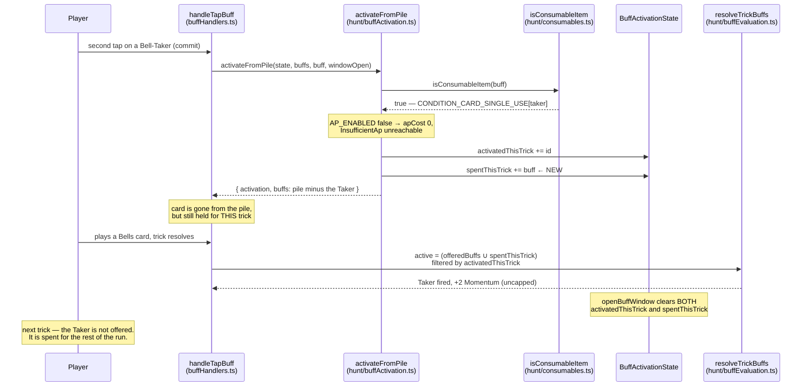

# Plan: Version 6 — consumable buff cards, no action points, and a pared five-card pool

Plan folder: `.claude/contract/DLR-145-consumable-buffs-no-action-points-pared-pool/`
Execution status: see `tasks.md` in this folder.

---

## Part 1 — Alignment

### Task reference

**Jira: DLR-145** — "Version 6: consumable buff cards, no action points, and a pared five-card pool" (Story, child of DLR-103, labels `engine` + `playable`). Design source: `.docs/design/Balatro-Forbidden-Solitaire/version-6-developer-idea.md`, captured 2026-08-25.

Acceptance criteria, verbatim:

1. `isConsumableItem` returns `true` for `taker`, `feeder` and `sidestep`, so activating one removes it from the pile via the existing `activateFromPile` path. A consumed card does not return for the rest of the run.
2. `AP_ENABLED` is `false`. Every AP-gated action is free, no control renders an AP cost or an AP pool, and no action is refused for `InsufficientAp`.
3. The shop no longer offers the action-point purchase. It sells Heal and a machine pull only, and the removed shelf leaves no dead control or empty region on the screen.
4. `BUFF_TEMPLATES` contains exactly 13 templates: `taker` × 3 suits × {Blade, Momentum}, `feeder` × 3 suits × {Blade}, `sidestep` × {Blade, Momentum}, plus `cheat` and `timebomb`.
5. `markOfRank`, `glutton`, `hoarder`, `unbloodied`, `debtCollector`, `miser`, `cornered` and `keepsake` are removed from the mintable pool, along with the `coins` and `apRefund` reward axes. No code path can mint one, and the reachability audit in `src/sim/` passes against the reduced set.
6. `STARTING_BUFF_COUNT` is 20. A fresh run opens holding 20 activatable bronze cards drawn from the pool in AC4.
7. `COINS_PER_ENCOUNTER_WIN` is 10.
8. The tier ladder is unchanged at bronze / silver / gold. No fourth tier is added.
9. The per-hand reward caps no longer silently destroy a consumed card. Either both caps are raised beyond what a single hand can spend, or a card whose entire contribution would be clipped is refused before the commit tap with the reason stated on the control — matching the shop's existing refusal of a heal at full health.
10. A fresh run can beat Aoife on the first or second trick of hand one using bronze cards from the opening pile, and remains winnable with no cards activated at all.
11. `npm run typecheck`, `npm run lint` and `npm test` are green, and `npm run sim -- --runs 200 --seed 1` completes without error against the reduced pool.

**Sequencing dependency, resolved.** The ticket requires DLR-142 to land first because both touch `consumables.ts` in the same place. DLR-142 is `Planned` on the board but its contract at `.claude/contract/2026-08-25-single-use-activated-buffs-and-tier-display/tasks.md` reads `Status: COMPLETE` and `ACTIVATED_CARD_SINGLE_USE` is present in `src/hunt/consumables.ts` on disk. **The dependency is satisfied** — this plan builds on that shipped toggle rather than re-creating it. The board status is stale; that is a Jira hygiene matter, not a blocker.

### Restated goal

Turn each buff card into something the player *spends*. Today the eleven condition families are rented per trick and the rent is refunded before the next trick, so firing everything every trick is strictly correct and nothing is ever a bet. This pass makes the three surviving condition families (Taker, Feeder, Sidestep) leave the pile when activated, deletes action points entirely as the resource that was nominally containing them, cuts the mintable pool from 73 templates to 13, and hands the player twenty opening cards and ten coins a fight so that the scarcity of *cards* — not a refilling points pool — is the only limit on how hard a hand can be pushed. It is a subtraction plus two constants plus one predicate; no new scoring rule is introduced, and the ladder the developer described (Aoife dead on trick one or two with cards, still beatable without) falls out of the arithmetic already shipped.

### In scope

- `isConsumableItem` returns `true` for Taker, Feeder and Sidestep, through a per-family toggle mirroring DLR-142's `ACTIVATED_CARD_SINGLE_USE`.
- **Keeping a consumed condition card firing on the trick it was spent on** — a new `spentThisTrick` field on `BuffActivationState`, without which AC1 silently breaks AC10 (see Approach).
- `AP_ENABLED = false`, and removal of every AP cost, AP pool and AP-capacity readout from the action bar, the loadout panel and the shop purse.
- Removing `ShopItem.ApCapacity` from `SHOP_ITEMS` and its purse cell from `ShopPanel`, with the purse re-zoned rather than left with a hole.
- Pruning `TEMPLATE_FAMILIES` to Taker / Feeder / Sidestep and narrowing the template kind and axis types so `BUFF_TEMPLATES` is exactly 13 and no `coins` or `apRefund` card can be constructed.
- Pruning `SLOT_FAMILY_WEIGHTS` and `SLOT_AXIS_WEIGHTS` to the surviving families and axes, keeping every surviving weight at its existing value.
- Drawing the opening pile **with replacement**, because 20 cards cannot be drawn from 13 distinct templates and the current draw throws.
- `STARTING_BUFF_COUNT = 20`, `COINS_PER_ENCOUNTER_WIN = 10`.
- AC9 via option 1: the multiplier and flat-damage per-hand caps removed, so no consumed card is ever wholly clipped.
- Updating `src/sim/` — the reachability audit's expectations, the superseded opening-pile variants, and the AP-capacity-focused policy.
- Updating every test and fixture that names a removed family, a removed axis, an AP readout or a changed constant.
- Bringing `src/App.tsx` back under the 400-line blocking budget, which this ticket's edits touch and which is already breached at 410 lines.

### Explicitly out of scope

- **Shop prices.** Heal stays at 1 coin and a pull at 1 coin, on the developer's explicit call recorded in design §3.6. The shop will pose no choice at 10 coins a fight; that is accepted for this pass.
- **Any fourth tier.** Bronze / silver / gold is unchanged (AC8).
- **Deleting the eight cut families from the `BuffKind` union, from `CONDITION_MODIFIER`, from `buffFires`, or from `BUFF_CADENCE`.** They stop being mintable; they stay declared. See Assumptions.
- **Restoring Ward, Puppeteer, Second Thoughts, Foresight or Spyglass to a mintable path.**
- The 25-fight health curve, the opponent health formula, and the Whetstone's return to the shop.
- Onboarding, tutorial, or any first-run explanation of what a skull is.
- The streak-length problem named in design §6 — that more powerful cards amplify a streak but do not make one easier to build.
- Re-tuning `SLOT_FAMILY_WEIGHTS`' surviving numbers, or choosing new ones.

### Pattern Reference

Supplied by the brief:

- `.docs/design/Balatro-Forbidden-Solitaire/version-6-developer-idea.md` — §1 (the surviving pool and its exact template counts), §2 (what was cut and the measured figure behind each), §3.1–§3.6 (the mechanical changes), §4 (the arithmetic behind AC10).
- `src/hunt/consumables.ts` → `ACTIVATED_CARD_SINGLE_USE` and `isConsumableItem` — DLR-142's shipped per-card toggle. The Taker/Feeder/Sidestep toggle is built as its sibling, not as a variant of it.
- `src/hunt/shop.ts` → `SHOP_ITEMS` and its docblock — DLR-116's precedent for taking an item off the shelf while leaving `priceOf`, `categoryOf` and `refusalFor` total over it. This is the pattern AC5 and AC3 follow.
- `src/hunt/startingPile.ts` → `seedStartingBuffPile`, and `src/hunt/slotMachine.ts` → `drawReelPool`, which it is deliberately the sibling of.
- `src/sim/reachability.ts` and its spec — the audit AC5 must pass against.

Chosen here, none supplied: `.claude/skills/react-frontend/SKILL.md` for the code conventions and `.claude/skills/game-ux/SKILL.md` for re-zoning the three surfaces that lose a readout.

### Constraints flagged on the brief

- **AC1 and AC2 must ship together.** AP is the only thing currently limiting how many buffs fire per trick; consumption is what replaces it. AC2 landing without AC1 leaves no limit at all. They are in the same phase here, and no phase boundary sits between them.
- **`apRefund` dies as a side effect of AC2, not by its own repair.** If AC2 is ever reverted, the dead-refund bug returns.
- **Determinism.** `src/hunt/` is lint-enforced DOM-free and pure. Nothing added here may call `Math.random()`; the opening pile's draw stays seeded from `runSeed` through `startingPileSeedFor`, and the simulator must reproduce the same opening hand from the same seed.
- **`ConditionBuffTemplate.id`'s format is frozen** — the Vault persists `TemplateGrant` by that id (DLR-113). Ids are not being renamed here; templates are being removed, and `templateById` returning `undefined` is the already-built, already-tested path for that.
- **Two runtime dependencies.** Nothing here adds a third.
- **This ticket does not claim the run becomes winnable.** It targets felt power in the opening fights. Opponent health still climbs 10 → 135 with nothing multiplying the bank.

### Assumptions made

- **The eight cut families keep their `BuffKind` members, their `CONDITION_MODIFIER` prices, their `buffFires` cases and their `BUFF_CADENCE` rows; only their templates go.** AC5 asks that nothing can *mint* one and that the reachability audit pass against the reduced set — both are satisfied by removing them from `TEMPLATE_FAMILIES`. Deleting the vocabulary instead would force `BuffConditionKind` down to three members, which cascades into `buffFires`' switch, eight fields of `BuffTrickContext`, `warCouncil/buffTrickFacts.ts`, `bank.ts` and `buffRoundState.ts` — a structural rewrite the ticket does not ask for. This is exactly DLR-116's shipped precedent for Cheat, Timebomb, Blast Guard and Whetstone ("no mechanic is deleted — only this list changed"), and it makes the cut reversible in one table.
- **The `coins` and `apRefund` axes are removed by narrowing the *template's* axis type, not `BuffRewardAxis` or `BuffCostAxis`.** `ConditionBuffTemplate.axis` narrows to Magnitude | Multiplier, which makes a coins-paying card unconstructible at compile time — the strongest reading of AC5 — while `REWARD_BASE`, `accrualCapFor` and `narrowToCostAxis` stay total over four axes and no consumer changes.
- **AC3's "Heal and a machine pull only" means removing `ShopItem.ApCapacity` and nothing else.** The Swan and Witch rank-tier items shipped on DLR-122 and stay on the shelf; the ticket's own In-scope list says "Removing the action-point purchase from `ShopPanel`" and names nothing else, and AC8's "tier ladder is unchanged" reads as the buff bronze/silver/gold ladder. Flagged in Risks — this is the one place the ACs and the scope boundary disagree.
- **AC9 is answered by option 1, implemented as removing the two caps rather than picking a large number.** `MAX_MULTIPLIER_BONUS_PER_HAND` and `MAX_FLAT_DAMAGE_BONUS_PER_HAND` become `Number.POSITIVE_INFINITY`. Design §3.3 offers "raise both well past what one hand can spend" or "removed entirely"; removing is the version that requires **no unchosen tuning value at all**, cannot destroy a card, is one edit to reverse, and leaves the constants in place as the point a cap would be restored at. Option 2 (refuse a wholly-clipped card) is the alternative and is a materially larger build — see Risks.
- **The opening pile draws with replacement.** AC6 asks for 20 cards from a 13-template pool; `weightedDrawWithoutReplacement` cannot supply that and `seedStartingBuffPile` throws on a short draw. Duplicates are the intended shape — design §3.4's "one fight's ammunition" wants three Bell-Takers, not three different families — so a with-replacement sibling is added rather than the throw being softened.
- **`RUN_STARTING_CHEATS` stays at 1**, so a fresh run holds 21 cards: the 20 AC6 names plus the guaranteed Cheat that DLR-132 added and DLR-135 left alone. AC6 says "20 activatable bronze cards drawn from the pool", which the drawn pile satisfies; the guaranteed Cheat is a separate, still-open developer question that this ticket was not asked to close.
- **`apCapacityFocusedPolicy` is removed from `src/sim/`.** It exists solely to exercise the AP-capacity lever this ticket deletes; left in place it would spend coins on nothing and quietly distort every future simulator comparison.
- **`openingPileVariants.ts` keeps `withOpeningPile` and loses its four superseded variant exports.** The reduced pool *is* the recommendation those variants existed to measure, and two of them will not compile once the template axis type narrows. The generic injection point stays so `--pile` and `SimConfig.openingPileVariant` need no change.
- **No `SAVE_SCHEMA_VERSION` bump.** No persisted shape changes; the Vault still stores `{ templateId, tier }`. Grants naming a removed template become unresolvable, and `mintGrants` already skips an id `templateById` cannot resolve while `oddsBoostRefusalFor` and `startingTierRefusalFor` already refuse one. Players lose the *value* of grants bought against cut cards — a data consequence, flagged in Risks, not a schema break.
- **`src/App.tsx` is brought under 400 lines in this ticket.** It measures 410 today and this ticket modifies it, so the breach is fixed here rather than reported.

### Config and persisted-shape audit

- **`AP_ENABLED`** — 26 hits across `src/`, 14 of them in specs. One production reader: `src/hunt/actionPoints.ts:28` (`apCostFor` → `apCostGiven`), which `canAffordAp` and `spendAp` both route through. The rest are re-exports (`config.ts:362`, `index.ts:55`) and docblock prose (`roundReducer.ts:187`, `buffActivation.ts:114`, 5 lines in `actionPoints.ts`). Of the 14 spec lines, spread across `actionPoints.test.ts`, `apConfig.test.ts`, `buffActivation.test.ts` and `config.test.ts`, `buffActivation.test.ts:267` asserts `expect(AP_ENABLED).toBe(true)` and **fails on the flip**. The flag's design does what it claims: flipping it needs no other engine change, only the readout removal AC2 also demands.
- **`ApCapacity` / `apCapacity` / `AP_CAPACITY_*`** — 65 non-test hits across 19 files, plus 9 spec files. Production sites the plan must touch: `shop.ts` (`SHOP_ITEMS` membership only — the `ShopItem` member, `priceOf`, `categoryOf` and `tieredRankOf` rows all stay, per DLR-116's precedent), `ShopPanel.tsx:46/91/153` (the prop and the purse cell), `shopLabels.ts:26/27/40/55` (`SHOP_AP_LABEL` and the two `Record` rows — the Record rows stay, the label export goes), `App.tsx:325/340/403`, and `sim/baselinePolicy.ts:87/198-241`. `run.ts`'s `apCapacityBonus`, `runTransitions.ts:241`'s purchase case and `actionPoints.ts`'s `apCapacityFor` all stay — a caller can still buy one, it is simply not on the shelf.
- **`STARTING_BUFF_COUNT`** — 4 production hits (`config.ts:199` declaration, `index.ts:40` re-export, `run.ts:15/160/165/179/180`, `sim/openingPileVariants.ts:96/101`) plus 3 spec files (`run-buffs.test.ts`, `run.grants.test.ts`, `reachability.test.ts`). Every spec reads the constant rather than the literal `4`, so the value change ripples cleanly — **except** `seedStartingBuffPile`'s short-draw throw, which is the one site that breaks. `COINS_PER_ENCOUNTER_WIN` — 3 production hits (`config.ts:205`, `index.ts:41`, `runTransitions.ts:117`, `App.tsx:11/375`) plus 5 spec files, all of which read the constant, not `1`. `rankTiers.ts:157` names the value `1` **in prose** and must be corrected in the same task.
- **The eight cut families** — `MarkOfRank` 18 hits, `Glutton` 17, `Hoarder` 26, `Unbloodied` 28, `DebtCollector` 16, `Miser` 24, `Cornered` 22, `Keepsake` 28, across 21 files. Each string literal (`'markOfRank'` etc.) appears exactly 3 times — the `BuffKind` value, `buffFires`' case, and one spec. Under the assumption above only **5 of those 21 files** change: `buffTemplates.ts` (the `TEMPLATE_FAMILIES` rows), `slotWeights.ts` (the weight rows), `sim/openingPileVariants.ts`, `sim/__tests__/reachability.test.ts` and `hunt/__tests__/buffTemplates.test.ts` / `slotWeights.test.ts`. The other 16 keep working because the vocabulary is not being deleted.
- **The two cut axes** — `BuffRewardAxis.Coins` 25 hits, `BuffRewardAxis.ApRefund` 17. Both stay declared and both keep their `REWARD_BASE`, `REWARD_TIER_VALUE` and `accrualCapFor` rows. Only `SLOT_AXIS_WEIGHTS`' four rows narrow to two, `ALL_FOUR_AXES` in `buffTemplates.ts` is deleted, and `openingPileVariants.ts`'s two axis comparisons (`template.axis === EXCLUDED_OPENING_AXIS`, `=== BuffRewardAxis.Coins`) stop compiling once the template axis narrows — which is the audit's own confirmation that the narrowing has teeth.
- **`BuffActivationState` — 25 annotated sites across 7 files, 10 construction sites (6 of them in specs).** The larger figure is the one the tasks cover. Production full literals needing the new `spentThisTrick` field: `buffActivation.ts:71` (`startBuffActivation`), `:130` (`activateBuff`'s return), `:197` (`refreshBuffsForNewHand`); spread-based and therefore compiling unchanged but needing the field explicitly *cleared*: `:183` (`openBuffWindow`). Spec construction sites: `buffActivationStock.test.ts:84` and `:91`, `buffRoundState.test.ts:85` (a spread), `buffActivation.test.ts:238`, `:245`, `:253` (a spread). `startBuffActivation` has 33 references across the tree and is the single factory, which is why the ripple stops at these ten.
- **`BuffActivationStock` — 9 annotated sites across 5 files, 8 construction sites (7 of them in specs).** Unchanged by this plan: AC9 is answered by removing the caps, so no field is added to this shape and `buffActivationStockFor`'s signature does not move. Recorded because option 2 would have changed both, and the count is what makes that cost visible.
- **Persisted shapes.** `src/persistence/` is untouched. The only persisted structure this work reaches is the Vault's `startingGrants: TemplateGrant[]` and `oddsBoosts: Record<string, number>`, both keyed by `ConditionBuffTemplate.id`. No field, no type and no key changes; ids for cut templates simply stop resolving, and `mintGrants` (skip), `oddsBoostRefusalFor` and `startingTierRefusalFor` (refuse via `templateById(...) === undefined`) already handle exactly that. `.claude/rules/save-data-versioning.md`'s six reject conditions: none is tripped — no `localStorage` access is added, no key is concatenated, no bare payload is written, no shape changes incompatibly, no `as T` cast is added, and no read failure becomes a silent success.
- **Pure-core boundary.** Every `src/hunt/` and `src/sim/` file this plan edits stays free of React and DOM globals; the new with-replacement draw is a pure function over a supplied `Rng`. Verified by the Final-verification grep and by `npm run lint`'s existing `no-restricted-imports` / `no-restricted-globals` override on `src/warCouncil/**` and `src/hunt/**`.

---

## Part 2 — Technical design

### Approach

**The change is four independent subtractions and one addition, and the addition is the part that is easy to miss.** Consumption, the AP flip, the pool prune and the two constants are each small and each lands in the module that owns the fact. The addition is that a *consumed* condition card must still fire on the trick it was spent on — and nothing in the shipped code makes that true.

`buffHandInputFor` (`src/app/warCouncil/buffRoundState.ts:55`) builds the trick's active set as `offeredBuffs(state).filter(buff => activatedThisTrick.includes(buff.id))`, and `offeredBuffs` is `activatableBuffs(state.buffs)` — the pile. `activateFromPile` removes a consumable from `state.buffs` at the moment of the commit tap. So the instant Taker becomes consumable, activating one deletes it from the pile, the filter finds nothing, and the card pays nothing. This is silent: no throw, no refusal, no log, just a card that costs itself and does zero. AC1 would pass its unit test and AC10 would be unreachable. The fix is to give `BuffActivationState` a `spentThisTrick: readonly Buff[]` — populated by `activateFromPile` (the only place that knows a card left the pile), cleared by `openBuffWindow` alongside `activatedThisTrick`, and unioned with `offeredBuffs` in `buffHandInputFor`. It lives on the activation state rather than on `RoundUiState` because it has exactly the same lifetime as `activatedThisTrick` and clearing it anywhere else would drift; the two sets are cleared on the same edge or the bug returns in a different shape. The union is disjoint by construction — a spent card is no longer in the pile — so no de-duplication is needed and the overlap-bonus count stays correct.

**Consumption itself is DLR-142's toggle, applied to a second family of cards.** `consumables.ts` gains `CONDITION_CARD_SINGLE_USE: Readonly<Record<ConsumedConditionKind, boolean>>` over Taker, Feeder and Sidestep, an `isConsumedConditionKind` guard derived from that record's own keys, and a third clause in `isConsumableItem`. It is a sibling of `ACTIVATED_CARD_SINGLE_USE`, not an extension of it, for the reason that file's docblock already gives: `ConsumableItemKind` is DLR-111's fixed five-item set with a timing table and an effect table, and a condition card has neither — it has a trigger. `consumableTimingOf` and `consumableEffectOf` keep throwing on anything outside those five, which is correct and untouched, because nothing calls them for a condition card. `spendConsumable` needs no change: it gates on `isConsumableItem`, which now admits the three.

**Action points come out by flipping the flag and then deleting what has nothing left to say.** `AP_ENABLED = false` makes `apCostFor` return 0, so `canAffordAp` is always true and `buffActivationRefusalFor` can no longer reach `InsufficientAp` — AC2's third clause is satisfied by unreachability, and the refusal code stays in the union exactly as `PurchaseRefusal.SlotsFull` did on DLR-132, so `BUFF_ACTIVATION_REFUSAL_MESSAGE` stays a total `Record`. What the flag does *not* do is stop three surfaces rendering zeroes: the action bar's `{apPool} AP · N held` figure and its `applyBuffAccessibleName`, the loadout panel's "N action points left" paragraph and `buffLine`'s trailing `${apCost} AP.`, and the shop purse's action-points cell. Those are removed at source — `buffLine` and `buffRowAccessibleName` lose their `apCost` parameter entirely rather than being handed a zero, which is what keeps a future reader from wondering why every card costs nothing. That propagates to `BuffLoadoutPanel`'s `apCostFor` prop and `roundControlsProps.ts:50`, and to `ActionBar`'s `apPool` prop and `roundControlsProps.ts:80`. `applyDamageBarAccessibleName` loses its "for N action points" clause the same way. The alternative — leaving the readouts and letting them print 0 — was rejected because a control that says "0 AP" is a control that still claims a resource exists.

**The pool is pruned by narrowing types, not by zeroing weights.** `TEMPLATE_FAMILIES` drops to three rows: Taker (Blade + Momentum, per suit), Feeder (Blade only, per suit), Sidestep (Blade + Momentum, no parameter). A new exported `MintableConditionKind = Taker | Feeder | Sidestep` and `MintableRewardAxis = Magnitude | Multiplier` become `ConditionBuffTemplate`'s `kind` and `axis` types, which makes `SlotTemplateKind` and `SlotAxisWeights` narrow with them — so `SLOT_FAMILY_WEIGHTS` genuinely shrinks to five rows per machine and `SLOT_AXIS_WEIGHTS` to two, rather than carrying eight dead rows at weight 0. Every surviving weight keeps the number it has today; no figure is chosen. The `param: 'rank'` branch and `ALL_TARGET_RANKS` go with Mark of Rank, and `ALL_FOUR_AXES` goes with the two cut axes. `CONDITION_THRESHOLD`, `BuffThresholdFamily` and `conditionThresholdOf` all **stay** — `buffFires` still reads them for the four threshold families it still declares. The result is 6 + 3 + 2 = 11 condition templates plus the 2 activated ones, which is AC4's 13. `REEL_POOL_SIZE` is 8, so `drawReelPool`'s distinct draw still succeeds against 13 candidates on both machines with every surviving family weighted ≥ 1.

**Twenty cards from thirteen templates forces a second draw function.** `weightedDrawWithoutReplacement` is right for a slot machine strip, where a repeated symbol would be a bug, and wrong for an opening pile, where three Bell-Takers is the point. `slotWeights.ts` gains `weightedDrawWithReplacement`, stated as its sibling: same weight-summing and same last-candidate float-drift fallback, one `rng()` call per item, no splice. `seedStartingBuffPile` switches to it and keeps its short-draw throw — which now fires only if the whole table sums to zero, the configuration bug it was written for. `withOpeningPile` in `src/sim/` reads `STARTING_BUFF_COUNT` and inherits the change with no edit.

**AC9 is answered by deleting the two caps.** `MAX_MULTIPLIER_BONUS_PER_HAND` and `MAX_FLAT_DAMAGE_BONUS_PER_HAND` become `Number.POSITIVE_INFINITY`, so `accrueAxisBonus`'s `Math.min(total, cap)` is the identity on those two axes and no consumed card can ever contribute nothing. The constants stay declared, with their `UNIT:` comments, as the single place a cap would be restored. The two coin/refund caps are left alone: their axes no longer mint. The rejected alternative, option 2, would add a `BuffActivationRefusal.RewardFullyCapped`, a field on `BuffActivationStock` (9 annotated / 8 construction sites), a fourth parameter carrying `BuffBonusAccrual` through `buffActivationStockFor` into `src/hunt/`, and a copy string — a materially bigger build whose only advantage is preserving a containment rule this pass is deliberately relaxing.

**`src/App.tsx` is at 410 lines and this ticket edits it.** The eight-row `refusals` literal it hand-maintains is extracted to `src/app/run/shopRefusals.ts` as a `shopRefusalsFor(stock)` returning a total `Record<ShopItem, PurchaseRefusal | null>` — a real improvement, since that literal must currently be edited by hand whenever `ShopItem` gains a member, and a pure function that is unit-testable without a renderer. Combined with the `apCapacity` prop's removal that takes App.tsx under budget; the task measures with `(Get-Content …).Count` and extracts the next cohesive block if it is still over.

### Skills to invoke during execution

- `react-frontend` — owns everything under `src/`: the MUST/NEVER contract, the 400-line budget and how to measure it, the reducer/hook/component split, config-driven values, and the Vitest posture (pure logic tested without a renderer, component tests by role and label). The normal entry for every code task here.
- `game-ux` — owns the three game surfaces that lose a readout. The action bar's buff button, the loadout panel's header and the shop purse each end this ticket with a gap; AC3 explicitly requires "no dead control or empty region", which is a re-zoning question, not a deletion. Also owns the constraint that no jsdom test can prove a screen does not scroll.
- `play-tester` — confirmed by the developer for the AC10/AC11 pass: it drives the real engine through the headless simulator at scale and can answer whether Aoife falls on trick one or two against the reduced pool, and whether the run is still winnable with nothing activated. Invoked in the Final verification phase, not during implementation.

Rule files the executor must Read: `.claude/rules/README.md` and `.claude/rules/save-data-versioning.md` (the Vault reaches persisted grant ids — no schema change is planned, and the six reject conditions are the check that stays true). Always: `.claude/workflow/web-project.md`.

No developer override was applied; the developer confirmed all three of the recommended skills plus `play-tester`, and declined `game-designer` by not selecting it.

### Diagram



### Data shapes

#### `src/hunt/consumables.ts` — the third single-use family

```ts
/** The three CONDITION families whose single-use-ness is a developer-owned toggle. A sibling of
 *  `ACTIVATED_CARD_SINGLE_USE`, not a member of `ConsumableItemKind`: these cards have a trigger,
 *  not a timing window and an effect, so neither `CONSUMABLE_TIMING` nor `CONSUMABLE_EFFECT_LIVE`
 *  admits them. */
type ConsumedConditionKind =
  | typeof BuffKind.Taker
  | typeof BuffKind.Feeder
  | typeof BuffKind.Sidestep

/** DLR-145 AC1 — whether activating this condition card also removes it from the pile. Default
 *  `true` for all three: this is the change that turns a rented buff into a spent one. TO REVERT
 *  ONE CARD, flip its entry to `false`; `isConsumableItem` below is the only reader. */
export const CONDITION_CARD_SINGLE_USE: Readonly<Record<ConsumedConditionKind, boolean>> = {
  [BuffKind.Taker]: true,
  [BuffKind.Feeder]: true,
  [BuffKind.Sidestep]: true,
}

function isConsumedConditionKind(kind: BuffKind): kind is ConsumedConditionKind

/** Now three clauses, not two. */
export function isConsumableItem(buff: Buff): boolean
```

#### `src/hunt/buffActivation.ts` — cards spent this trick

```ts
export interface BuffActivationState {
  readonly apPool: ActionPoints
  readonly capacity: ActionPoints
  readonly activatedThisTrick: readonly BuffId[]
  /** DLR-145 — cards REMOVED FROM THE PILE during the current trick, kept so a consumed condition
   *  card still fires at this trick's resolution. Same lifetime as `activatedThisTrick` and
   *  cleared on the same edge (`openBuffWindow`); separating the two is how a spent Taker silently
   *  stops paying. Always empty for a non-consumable activation. */
  readonly spentThisTrick: readonly Buff[]
}
```

`startBuffActivation`, `activateBuff`, `openBuffWindow` and `refreshBuffsForNewHand` keep their existing signatures; `activateFromPile` keeps its signature and appends to `spentThisTrick` on the branch where `isConsumableItem` is true.

#### `src/hunt/buffTemplates.ts` — the narrowed template

```ts
/** DLR-145 AC5 — the three condition families a template can still mint. */
export type MintableConditionKind =
  | typeof BuffKind.Taker
  | typeof BuffKind.Feeder
  | typeof BuffKind.Sidestep

/** DLR-145 AC5 — Blade and Momentum. `coins` and `apRefund` stay declared on `BuffRewardAxis` and
 *  keep their `REWARD_BASE` / `REWARD_TIER_VALUE` rows; they are simply unconstructible here. */
export type MintableRewardAxis =
  | typeof BuffRewardAxis.Magnitude
  | typeof BuffRewardAxis.Multiplier

export interface ConditionBuffTemplate {
  readonly form: 'condition'
  readonly id: string
  readonly kind: MintableConditionKind   // was BuffConditionKind
  readonly axis: MintableRewardAxis      // was BuffCostAxis
  readonly target?: BuffTarget
}
```

`TEMPLATE_FAMILIES` becomes three entries; `TemplateFamily.kind` narrows to `MintableConditionKind` and its `param` narrows to `'suit' | undefined`. `ALL_FOUR_AXES`, `ALL_TARGET_RANKS` and the `param === 'rank'` branch of `templatesForTemplateFamily` are deleted. `BUFF_TEMPLATES` length becomes 13. `REWARD_TIER_VALUE`, `CONDITION_THRESHOLD`, `BuffThresholdFamily`, `conditionThresholdOf`, `TemplateGrant`, `templateById` and `mintGrants` are unchanged.

#### `src/hunt/slotWeights.ts` — narrowed weight tables and a second draw

```ts
export type SlotTemplateKind = MintableConditionKind | BuffActivatedTemplateKind
export type SlotAxisWeights = Readonly<Record<MintableRewardAxis, number>>
```

`SLOT_FAMILY_WEIGHTS` becomes five rows per machine (Taker / Feeder / Sidestep / Cheat / Timebomb) and `SLOT_AXIS_WEIGHTS` two (Magnitude / Multiplier), **every surviving value unchanged**: Skirmisher 5 / 4 / 2 / 3 / 3 and 3 / 3; Strongbox 2 / 2 / 1 / 1 / 1 and 1 / 1.

```ts
/** `weightedDrawWithoutReplacement`'s sibling, for a draw where a repeat is the POINT rather than
 *  a bug — an opening pile of 20 from 13 templates. EXACTLY ONE `rng()` call per item, with the
 *  same last-candidate fallback that catches float drift. Returns fewer than `count` only when the
 *  candidates or the total positive weight are empty. Never mutates `candidates`. */
export function weightedDrawWithReplacement<T>(
  candidates: readonly T[],
  weightOf: (item: T) => number,
  rng: Rng,
  count: number,
): readonly T[]
```

#### `src/hunt/apConfig.ts` and `src/hunt/config.ts` — the constants

```ts
// apConfig.ts
export const AP_ENABLED = false                                    // was true (AC2)
export const MAX_MULTIPLIER_BONUS_PER_HAND = Number.POSITIVE_INFINITY   // was 6 (AC9)
export const MAX_FLAT_DAMAGE_BONUS_PER_HAND = Number.POSITIVE_INFINITY  // was 12 (AC9)

// config.ts
export const STARTING_BUFF_COUNT = 20                              // was 4  (AC6)
export const COINS_PER_ENCOUNTER_WIN: Coins = 10                   // was 1  (AC7)
```

Units are unchanged: buffs granted once at run start, all bronze; coins credited once per encounter won; multiplier points and damage per hand. `MAX_REFUND_PER_HAND` and `MAX_COIN_BONUS_PER_HAND` are untouched. **No value here is agent-chosen** — 20, 10 and `false` are the ticket's; `POSITIVE_INFINITY` is "no cap", the design's own option 1b, not a number.

#### `src/hunt/shop.ts`

```ts
export const SHOP_ITEMS: readonly ShopItem[] = [
  ShopItem.SwanTier,
  ShopItem.WitchTier,
  ShopItem.Heal,
]   // ShopItem.ApCapacity removed from the shelf; its member, price, category and refusal all stay
```

#### `src/app/run/shopRefusals.ts` (new)

```ts
/** Every shelf item's refusal, total over `ShopItem`, so a new member is a compile error here
 *  rather than a missing entry in a hand-maintained literal in `App.tsx`. */
export function shopRefusalsFor(stock: ShopStock): Readonly<Record<ShopItem, PurchaseRefusal | null>>
```

#### Signature changes in the app layer

```ts
// src/app/warCouncil/buffLabels.ts — apCost parameter dropped from both
export function buffLine(buff: Buff): string
export function buffRowAccessibleName(buff: Buff, poised: boolean, refusal: BuffActivationRefusal | null): string

// src/app/warCouncil/actionBarLabels.ts — apPool and apCost clauses dropped
export function applyBuffAccessibleName(offeredCount: number, open: boolean, windowOpen: boolean): string
export function applyDamageBarAccessibleName(cashValue: number, poised: boolean, refusal: ApplyDamageRefusal | null, pending: PendingApplyPayout | null): string
```

`BuffLoadoutPanelProps.apCostFor` and `ActionBarProps.apPool` are removed, with their two suppliers in `roundControlsProps.ts` (lines 50 and 80). `ShopPanelProps.apCapacity` is removed. `SHOP_AP_LABEL` is deleted from `shopLabels.ts`; `SHOP_ITEM_NAME[ShopItem.ApCapacity]` and `SHOP_ITEM_BLURB[ShopItem.ApCapacity]` stay, because both Records are total over `ShopItem`.

#### `src/sim/`

`apCapacityFocusedPolicy` and `apCapacityFocusedShopAction` are deleted from `baselinePolicy.ts` and their entries from `policies.ts` and `index.ts`. `openingPileVariants.ts` loses `EXCLUDED_OPENING_KINDS`, `EXCLUDED_OPENING_AXIS`, `COINS_WEIGHT_FACTOR`, `SIDESTEP_WEIGHT_FACTOR`, `conditionsOnlyOpeningWeightOf`, `recommendedOpeningWeightOf` and the two `OPENING_PILE_VARIANTS` entries; `withOpeningPile` and the (now empty) `OPENING_PILE_VARIANTS` map stay so `SimConfig.openingPileVariant` and `playRun.ts` need no edit. No `package.json`, `tsconfig`, `vite.config.ts` or ESLint change is needed.

### Runtime quality notes

- **Purity and adjudication.** Everything decided here is decided in `src/hunt/`: whether a card is consumable (`consumables.ts`), whether it can be activated (`buffActivation.ts`), whether it fires (`buffEvaluation.ts`), and what it pays (`buffAccrual.ts`). The new `weightedDrawWithReplacement` is a pure function over a supplied `Rng` in `src/hunt/slotWeights.ts`, unit-testable with a scripted generator and no renderer. `shopRefusalsFor` is pure and lives in `src/app/run/` because it composes `src/hunt/`'s rule over `src/hunt/`'s own item list — it decides nothing. No component gains a rule; the three `.tsx` edits are all deletions of a rendered figure. Every constant this pass moves is read from configuration, and the two AC9 caps stay named rather than being inlined as "no limit".
- **Effects, mount and teardown.** No effect, listener, observer, timer, `requestAnimationFrame` or `AbortController` is added, removed or re-scoped. `ActionBar`, `BuffLoadoutPanel` and `ShopPanel` each lose a rendered value and a prop; none has an effect touching them. `BuffLoadoutPanel`'s `useRovingTabIndex` indexes `groupRef.current.querySelectorAll('button')` and is unaffected — the row count per buff is unchanged, only the text inside each button. StrictMode double-invocation is unchanged: `foldBuffOutcome` stays pure and two-argument, and `spentThisTrick` is appended by a pure reducer transition, so a double dispatch recomputes an identical value rather than appending twice. No module-level mutable state is introduced.
- **Hot-path cost.** `buffHandInputFor` runs once per trick resolution, not per pointer event; the new union allocates one array of at most `activatedThisTrick.length` entries beside the existing filter, which is a handful of cards. `spentThisTrick` is bounded by one trick's activations and cleared at every trick boundary, so it cannot grow across a hand. `weightedDrawWithReplacement` is O(count × candidates) = 20 × 13, run once at `startRun`. The opening pile grows from 4 to 20 cards, so `activatableBuffs` and `offeredBuffs` filter 21 entries instead of 5 — still trivial, and `BuffLoadoutPanel` renders 21 rows rather than 5, which is a **layout** question for `game-ux`, not a performance one. No memoisation is added and none is justified.
- **Determinism and numeric safety.** `Math.random()` is not reachable from anything added: `weightedDrawWithReplacement` takes its `Rng`, `seedStartingBuffPile` derives it from `startingPileSeedFor(runSeed)`, and `src/hunt/`'s lint boundary is unchanged. The new draw reuses the existing last-candidate fallback for float drift and returns early on a non-positive total, so no `NaN` reaches a running weight. `templateWeightFor`'s two `<= 0` divisor guards are untouched. `Number.POSITIVE_INFINITY` as a cap is safe in `Math.min(finite + finite, Infinity)` — the result is the finite sum, never `NaN` — but it **does** break `apConfig.test.ts:35`'s `Number.isInteger(cap)` assertion over all four caps, which the same task must correct rather than the executor discovering at run time. `apCostFor` returning 0 under `AP_ENABLED = false` feeds no division.
- **Error paths.** `seedStartingBuffPile` keeps its `RangeError` on a short draw — now reachable only from an all-zero weight table, which is the configuration bug it was written to name. `spendConsumable` keeps both throws; `activateBuff` keeps its throw-on-refusal contract, and `activateFromPile` still runs it *first* so a refused activation cannot half-land. `consumableTimingOf` and `consumableEffectOf` keep throwing on a condition card — correct, and no new caller reaches them. `handleTapBuff` still asks `loadoutRefusalFor` on both taps and returns state unchanged rather than throwing inside a reducer. Nothing new is caught; no `catch` returns a default. `BuffActivationRefusal.InsufficientAp` becomes unreachable rather than deleted, so `BUFF_ACTIVATION_REFUSAL_MESSAGE` stays total and no copy map is broken. No async surface is added, so the four async states do not arise.

### Risks and judgement calls

- **AC3 versus the scope boundary — the one real contradiction in the ticket.** AC3 says the shop "sells Heal and a machine pull only", but the Swan and Witch rank-tier items are on the shelf today and the ticket's own In-scope list names only "Removing the action-point purchase from `ShopPanel`". This plan removes `ApCapacity` and leaves the two tier items. If the intent was a two-item shop, say so at the gate — it is one line in `SHOP_ITEMS` plus the reachability spec, but it also silently retires DLR-122's whole run-permanent shelf.
- **AC9's mechanism.** Option 1 (caps removed) is planned. Option 2 (refuse a wholly-clipped card) is the ticket's alternative and preserves R6's containment, at the cost of a new refusal code, a new `BuffActivationStock` field, a fourth parameter threading `BuffBonusAccrual` into `src/hunt/`, new copy, and 8 construction sites to update. If containment matters more than build size, this is the red-line to make now rather than after the code lands.
- **`RUN_STARTING_CHEATS` stays 1, so a fresh run holds 21 cards, not 20.** `config.ts:190` already records that whether a run should open holding a guaranteed Cheat at all is an open developer question. Removing it is a one-line change if 20 should mean 20.
- **The two slot machines stop differing by axis.** Strongbox's lean was Coins 4 / ApRefund 3 against Magnitude 1 / Multiplier 1; with both cut axes gone its axis table is 1 / 1 and Skirmisher's is 3 / 3, which are the same ratio. The machines now differ only by family weight (Taker 5/4/2 vs 2/2/1). Nobody has chosen a replacement lean, and inventing one would be inventing tuning values — flagging it instead. It may not matter with 13 templates and a reel of 8.
- **Vault grants bought against a cut card become dead.** `templateById` returns `undefined` for `markOfRank:7:magnitude` and every other cut id, so `mintGrants` skips it and the Vault currency spent on it is gone. Nothing corrupts and no save is rejected — the existing DLR-113 path handles it — but a developer with a populated Vault will silently lose starting cards and odds boosts. Clearing local storage before the first play session avoids the confusion.
- **Twenty-one rows in the buff loadout panel.** The panel was designed and last laid out against a five-card pile. Twenty-one rows in a between-tricks dialog is a `game-ux` problem — whether it scrolls, whether it needs grouping by family, whether the most-repeated action's tap count still holds. jsdom cannot answer it; it needs a browser at named viewport sizes. **This is the single most likely thing to look wrong on first play.**
- **AC10 cannot be proven by a unit test.** "A fresh run can beat Aoife on the first or second trick" is a statistical claim about seeded runs. It is routed to the `play-tester` skill in Final verification, which runs the real engine headlessly; a green suite does not establish it, and neither does one hand played by hand.
- **`src/App.tsx` is at 410 lines before this ticket touches it.** The plan extracts `shopRefusalsFor` and removes a prop, which should land it near 396 — but that is an estimate, and the task measures rather than assumes. If it is still over, the executor extracts the next cohesive block, which is a judgement call about where App.tsx's seams are.
- **`consumables.ts` is at 359 of its 400-line budget** and this ticket adds a record, a set, a guard and their docblocks. It should land near 385. If the honest documentation this file's style demands pushes it over, the split is `consumables.ts` (the five DLR-111 items) versus a new `singleUse.ts` (the two toggles and `isConsumableItem`) — a decision worth taking deliberately rather than by truncating comments.
- **The `spentThisTrick` field is the load-bearing invention in this plan and it is not in the ticket.** It exists because `buffHandInputFor` reads the pile. If a reviewer disagrees with putting it on `BuffActivationState`, the alternative is to defer pile removal to the trick boundary — which changes DLR-142's already-shipped Cheat and Timebomb behaviour, and is why it was rejected.
