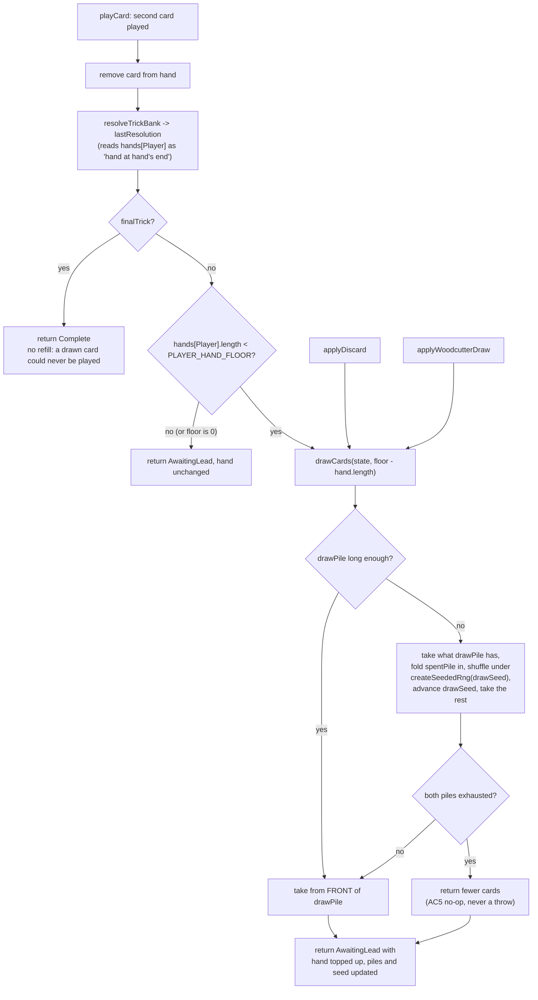

# Plan: Refill the player's hand to a floor of 4 cards, behind one revertible constant

Plan folder: `.claude/contract/DLR-146-refill-player-hand-to-a-floor-of-four/`
Execution status: see `tasks.md` in this folder.

---

## Part 1 — Alignment

### Task reference

**Jira DLR-146** — "Refill the player's hand to a floor of 4 cards, behind one revertible constant" (Task, parent epic DLR-103, labels `engine` / `playable`). Acceptance criteria, verbatim:

1. A new exported constant `PLAYER_HAND_FLOOR` is added to `src/hunt/config.ts` with value `4`, carrying the file's existing comment convention: the rule it implements, its UNIT (cards held by the player), and its status (PROVISIONAL).
2. At each trick's **resolution**, if the player's hand holds fewer than `PLAYER_HAND_FLOOR` cards, cards are drawn from the FRONT of `drawPile` until it holds `PLAYER_HAND_FLOOR`. The draw never happens at the moment a card is played, so a drawn card cannot enter the trick in progress.
3. The Quarry never refills — dealt `HAND_SIZE`, plays `HAND_SIZE`, draws nothing. The deal, the decree, `SKULL_DENSITY`'s 2-of-6, and `CARDS_PER_DEAL` are unchanged.
4. **Setting** `PLAYER_HAND_FLOOR = 0` restores pre-ticket behaviour exactly, with no other edit anywhere. A test pins both sides of this: at `0` the player's hand width across a hand is 6, 5, 4, 3, 2, 1; at `4` it is 6, 5, 4, 4, 4, 4.
5. An exhausted `drawPile` makes the refill a no-op rather than a throw or a short draw error.
6. The hand still ends when its `HAND_SIZE`th trick resolves. Cards left unplayed in the player's hand are swept to the spent pile by `closeHand`, and `deckCycle.test.ts`'s 33-card conservation invariant still passes.
7. The three code comments that assert every dealt card is played are corrected: `src/hunt/config.ts` (the `HAND_SIZE` block), `src/warCouncil/types.ts` (the `primedCards` docblock), and `src/warCouncil/deal.ts`.
8. **Going back to the plain six-card deal is ONE edit, on ONE line, in ONE file.** Setting `PLAYER_HAND_FLOOR = 0` in `src/hunt/config.ts` is the whole revert: no mid-hand draw, no mid-hand reshuffle, and the 6, 5, 4, 3, 2, 1 widths back. Three things this requires, and each is what stops the flip being a one-liner in name only:
   - The refill must be a single `hand.length < PLAYER_HAND_FLOOR` test, so a floor of `0` is UNREACHABLE rather than a second code path that could drift.
   - **The full Vitest suite must stay green at `0` as well as at `4`, with nothing else edited.** Any spec that reds when the constant is flipped is a spec coupled to the shipped value, and it is the spec that gets fixed — never the constant. Verified by running the suite at both values.
   - No second on/off flag is added. `0` IS the off switch; a companion `REFILL_ENABLED` boolean that must be kept in step with the floor is the "two constants that must be equal is a bug waiting for one of them to be edited" trap that `HAND_SIZE`'s own comment already warns against.

Scope boundaries, dependencies and risks are as the ticket states them, and are reflected in "In scope" / "Explicitly out of scope" below.

**AC8 was added to the ticket on 2026-08-26 at the developer's request,** after this plan's approval, to make the one-line revert an acceptance criterion in its own right rather than a property left implicit in AC4. It changes no design decision here — the number-not-a-boolean choice and the single-`<`-test shape were already the plan's — but it does add one verification step, Task 7 Step 2b, which runs the suite at `0` and requires it green with nothing else touched. That step exists because without it the revert would have been one line of source plus a test fix, which is not a one-line revert. The ticket's Dependencies & Risks section was also brought up to date in the same edit with the two findings this plan's audit produced (`baselinePolicy.ts` and the reachable `applyDiscard` crash), so the ticket no longer states that only `cardAwarePolicy.ts` needed checking.

**Follow-up decision confirmed interactively, 2026-08-26.** The audit (Part 1 → Config and persisted-shape audit, bullet 6) found that this change makes `applyDiscard`'s `RangeError` reachable inside a reducer. Asked how much of that to plan, the developer answered:

> "If the player is trying to discard we'll have to give the player the cards we can from the pile, then if we run out of cards we'll have to reshuffle the discard pile to give the player their missing cards"

That answer is broader than the guard that was offered and it replaces it: **a draw that outruns the draw pile folds the spent pile back in and continues, mid-hand.** Every draw site in the engine routes through that one rule, which is why `applyWoodcutterDraw` — the other unguarded draw, offered as a separate option — needs no special case and is covered for free.

### Restated goal

The player's hand is topped back up to a floor of four cards as each trick resolves, so the last tricks of a hand are still choices instead of the one card left in hand. The floor lives in a single exported constant that restores today's behaviour exactly when set to `0`, because the number is provisional and meant to be played with rather than derived. Because a hand now takes more cards off the draw pile than it used to, the pile can run short mid-hand for the first time — so this ticket also replaces the engine's three separate, unguarded draw sites with one draw primitive that folds the spent pile back in and reshuffles when the pile cannot cover a draw. The Quarry is untouched, the hand still ends after `HAND_SIZE` tricks, and all 33 cards are still conserved.

### In scope

- `PLAYER_HAND_FLOOR = 4` in `src/hunt/config.ts`, re-exported from `src/hunt/index.ts`, with the file's comment convention (rule, UNIT, PROVISIONAL status).
- `drawCards` — one pure draw primitive in `src/warCouncil/encounterDeck.ts` that draws from the front of `drawPile` and, when the pile cannot cover the draw, folds `spentPile` back in under a seeded shuffle and continues.
- `RoundState.drawSeed` — the seed that makes a mid-hand reshuffle reproducible, written by `dealRound` from the deal's own generator and advanced on each reshuffle.
- The refill step at trick resolution in `src/warCouncil/playCard.ts`, applied to the player only, after the trick's `lastResolution` has been computed.
- Routing the two existing draw sites — `applyDiscard` (`src/warCouncil/discard.ts`) and `applyWoodcutterDraw` (`src/warCouncil/abilities.ts`) — through `drawCards`, so no draw in the engine can outrun the pile.
- Correcting the three stale "every dealt card is played" comments named in AC7.
- Rewriting `deckCycle.test.ts`'s D5 test, whose asserted invariant ("the draw pile's length never changes for the life of a hand, so it cannot run out") is precisely what this ticket retires, and its draw-pile-length cycle test, whose `[20, 7, 20, 7]` arithmetic no longer holds.
- Re-expressing `src/sim/baselinePolicy.ts`'s `isLastWindow` heuristic in terms of tricks remaining, which is floor-invariant — its current `hand.length <= 1` test can never fire once the floor is above 1.
- Vitest coverage for the hand widths at floor `4` and floor `0`, the exhausted-pile reshuffle, the Quarry never refilling, and 33-card conservation across a mid-hand reshuffle.
- **AC8's one-line-revert guarantee, enforced on the suite as well as the source**: every spec this contract writes or rewrites derives its expectations from `HAND_SIZE` and `PLAYER_HAND_FLOOR` rather than pinning a figure measured at `4`, and a verification step runs the engine and sim specs with the constant set to `0` to prove nothing else needs editing.

### Explicitly out of scope

- Drawing a card on a trick the player did not take (the catch-up variant) — a later ticket if the floor alone reads flat.
- Any ability, buff card or shop item that raises the floor or the ceiling.
- Any change to the Quarry, to Swap's selection rules, to the skull rules, or to the payout table.
- Choosing a value other than `4`; the number is the developer's after playing.
- Re-measuring the stale win-rate, tricks-taken and damage-per-hand baselines. The ticket flags them as going stale; measuring them again is `play-tester` work and a separate piece.
- Changing what the quick-kill payout counts (see Risks — it is a design decision this ticket surfaces but does not take).
- Any felt notice telling the player a mid-hand reshuffle happened. `RoundState.reshuffled` keeps its documented meaning — "whether THIS hand was DEALT from a reshuffle" — and is not written mid-hand. Whether the player should be told is a copy and visual call.

### Pattern Reference

The brief supplies its own, and they are authoritative:

- `src/warCouncil/discard.ts` — "reusing the front-of-`drawPile` draw that `discard.ts` already performs". `applyDiscard` is the model for the draw and for the bottom-of-pile return.
- `src/hunt/config.ts` — the comment convention for a new constant (rule, UNIT, status), as `HAND_SIZE` and `SKULL_DENSITY` carry it.
- `src/warCouncil/encounterDeck.ts` — `dealPileFor` is the existing statement of "fold the spent pile in and shuffle", and `drawCards` is its mid-hand sibling. Its `rng`-as-explicit-parameter discipline is the one to follow.
- `src/hunt/seededRng.ts` — `createSeededRng` / `mixSeed` / `dealSeedFor`. The docblock on `dealSeedFor` states the reproducibility requirement a mid-hand reshuffle must also meet.
- `.claude/skills/react-frontend/SKILL.md` for everything else under `src/`.

### Constraints flagged on the brief

- **`PLAYER_HAND_FLOOR = 0` must restore pre-ticket behaviour exactly, with no other edit anywhere.** This is an acceptance criterion rather than a nicety, because the value is provisional and the developer's position is ship rough, then tune by feel. It constrains every change in this plan: nothing may be written that is correct only at `4`.
- **Determinism.** `src/hunt/` and `src/warCouncil/` are lint-enforced pure and `Math.random()` is barred from both. A mid-hand reshuffle must be reproducible from the run seed or DLR-130's headless simulator stops being possible — the property `dealSeedFor`'s docblock names.
- **All 33 cards conserved, with no duplicate, at every point of every hand** — `deckCycle.test.ts`'s standing invariant. AC6 names it explicitly.
- **`.docs/game_rules/the-hunt.md` must not be hand-edited.** Section 2 changes through `implementation-doc-writer` on `/fb-apply`.
- **The Quarry is untouched** — dealt `HAND_SIZE`, plays `HAND_SIZE`, draws nothing.
- Two runtime dependencies. Nothing here adds one.

### Assumptions made

- **The refill is skipped on the hand's final trick.** AC2 says "at each trick's resolution"; on the sixth trick the hand is over, so a card drawn there can never be played and is swept straight to the spent pile by `closeHand`. Skipping it conserves the same 33 cards, leaves AC4's widths untouched (those are widths at play time, and the sixth trick's is already fixed), and stops the draw pile being pulled a card further down for no gain. Flagged in Risks as the one place this plan reads AC2 non-literally.
- **The refill is applied after the trick's `lastResolution` is computed, not before.** `buffTrickFactsFor` is handed `next.hands[Player]` as "the hand at hand's end", which is what the Keepsake buff's `remainingSuits` reads. Refilling first would feed Keepsake cards the player had not been dealt when the trick resolved, changing a buff's payout as a side effect of this ticket. Ordering is therefore load-bearing, not stylistic.
- **A mid-hand reshuffle is seeded from a new `RoundState.drawSeed` rather than from a generator threaded through `playCard`.** `RoundState` is plain, immutable, serialisable data and every function in the tree takes `rng` explicitly; storing a live closure on the state would break both. A stored integer seed keeps the state plain, keeps the reshuffle reproducible from the run seed, and needs no signature change at the dozens of `playCard` call sites. The alternative — deriving the seed from observable counters like `spentPile.length` — was rejected because the resulting permutation would not vary with the run seed.
- **`drawCards` returns what it can rather than throwing when both piles are short.** AC5 asks for a no-op on exhaustion, and this generalises it: a caller asking for more cards than the encounter holds gets fewer, never an exception. `applyDiscard` keeps a guard, but re-aimed at `drawPile.length + spentPile.length` rather than `drawPile.length` alone, so it still names a genuine caller bug and no longer fires on a situation the game can now reach.
- **`src/sim/baselinePolicy.ts`'s `isLastWindow` is re-expressed as tricks remaining.** Its `hand.length <= 1` test is a proxy for "this is the last cash-out window of the hand" that silently stops firing at any floor above 1. `HAND_SIZE - tricksPlayed <= 1` is identical at floor `0` (both mean "five or six tricks played") and restores the intended meaning at floor `4`. Without this the baseline policy quietly stops banking at the hand's end, which would corrupt the very simulation runs used to judge whether the floor works. The ticket named `cardAwarePolicy.ts` as the file to watch; that one is genuinely fine — this is its sibling.
- **`RoundState.reshuffled` is not written mid-hand.** Its docblock defines it as a property of the deal, read only by the felt's notice; writing it mid-hand would make that notice describe something it does not mean.
- **Confirmed by the developer, 2026-08-26:** a short draw reshuffles the spent pile back in rather than being refused, and this applies to every draw site in the engine, not only the discard.

### Config and persisted-shape audit

- **`PLAYER_HAND_FLOOR` is new.** `grep -rn "PLAYER_HAND_FLOOR" src` returns **0 hits**. Nothing to rename; every reader is created by this contract.
- **`HAND_SIZE`, `SKULL_DENSITY`, `CARDS_PER_DEAL`, `MAX_CARDS_PER_DISCARD` are unchanged in value and name.** `MAX_CARDS_PER_DISCARD` measured at **`3`** and `DISCARDS_PER_FIGHT` at **`3`** in `src/hunt/config.ts:356-357`; `CARDS_PER_DEAL = HAND_SIZE * 2 + 1 = 13`, derived in `src/warCouncil/encounterDeck.ts`, not a dial.
- **Nothing in this ticket is persisted.** `.claude/rules/save-data-versioning.md` was read and does not apply: `RoundState` is in-memory hand state, never written through `src/persistence/`. `grep -rn "PLAYER_HAND_FLOOR\|drawSeed" src/persistence src/vault` returns **0 hits**, no `SAVE_SCHEMA_VERSION` bump is needed, and no reject condition in that rule file is tripped — no task here names `localStorage`, composes a key, writes a payload, or casts a parsed value.
- **`RoundState` gains one required field, `drawSeed: number`.** Counted both ways per the construction-site rule. **`RoundState`: 44 files reference the type name; 15 construction sites carrying a `drawPile:` key, 14 of them in specs.** The one production site is `src/warCouncil/deal.ts`. The spec sites are `roundFixture.ts` (1), `discard.test.ts` (3), and one each in `abilities`, `cpuPlayer`, `legalMoves`, `legalMovesQuarry`, `playCard`, `playCard.timebomb`, `quarryIntent`, `rankTiers.resolution`, `types.test`, `voluntaryCashOut`. The larger figure, 15, is the one the tasks cover; sites that spread an existing base object rather than building a literal will need no edit, so 15 is an upper bound and `npm run typecheck` is the arbiter.
- **`DiscardStock` and `DiscardRefusal` are NOT changed.** The developer's reshuffle answer removed the need for the extra refusal reason that was offered, so `DISCARD_REFUSAL_MESSAGE` in `src/app/warCouncil/labels.ts` (**3 entries**, `labels.ts:269-272`) and its `Readonly<Record<DiscardRefusal, string>>` exhaustiveness are untouched. No new user-facing copy is introduced by this contract.
- **Draw sites enumerated — this is the check that found the crash.** `grep -rn "drawPile" src/warCouncil --include=*.ts` (excluding specs) finds exactly **three** places that take cards off the pile: `applyDiscard` (`discard.ts:64`, `state.drawPile.slice(0, discarded.length)`), `applyWoodcutterDraw` (`abilities.ts:22`, `const [drawn, ...restOfPile] = state.drawPile`) and `dealRound`. Today all three are safe only because of the invariant `deckCycle.test.ts` line 104 pins in its own title — *"the draw pile's length never changes for the life of a hand, so it cannot run out"*. The refill is the first thing in the game's history to shorten the pile mid-hand, so that invariant falls and both sites become reachable: `applyDiscard` throws a `RangeError` inside a reducer (a lost run behind the `ErrorBoundary`), and `applyWoodcutterDraw` destructures `undefined` off an empty array and pushes a non-card into a hand. Worked arithmetic: hand 1 deals from 33 leaving **20**, three refills leave **17**; hand 2 deals from 17 (≥ 13, so no between-hand reshuffle) leaving **4**, and its three refills take the pile to **3, 2, then 1** — with up to `MAX_CARDS_PER_DISCARD = 3` still selectable and `DISCARDS_PER_FIGHT = 3` possibly unspent. Both failures are reachable at the shipped value of `4`.
- **Consumers of the player's hand length enumerated.** `grep -rn "hands\[PlayerSide.Player\]\|hand\.length"` over `src` finds **15 hits**, of which three carry an assumption this change breaks or bends: `src/app/warCouncil/roundReducer.ts:84` (`unplayedAtResolve`, which feeds the quick-kill payout — a live economy consequence, raised in Risks, not silently changed), `src/app/warCouncil/roundReducer.ts:190` (the same figure frozen at an Apply Damage press) and `src/sim/baselinePolicy.ts:116` (`isLastWindow`, fixed by this contract). `src/sim/cardAwarePolicy.ts:185` compares `deadCards.length` to `hand.length` and assumes nothing about tricks remaining — the ticket's read of it is correct and it needs no change.
- **Names align across the chain.** `PLAYER_HAND_FLOOR` is declared in `src/hunt/config.ts`, re-exported from `src/hunt/index.ts`'s existing config block (which already lists `HAND_SIZE`, `SKULL_DENSITY`, `MAX_CARDS_PER_DISCARD`), and imported by `src/warCouncil/playCard.ts` from `'../hunt'` — the same path `playCard.ts:1` already uses for `HAND_SIZE`. No string-bound surface is involved: no `data-testid`, no CSS class, no storage key, no reason code.
- **The pure-core boundary is not crossed.** `src/hunt/**` and `src/warCouncil/**` are lint-enforced React-free and DOM-free (`eslint.config.js`). Every new function in this plan — `drawCards`, the refill, the seed advance — is plain data in, plain data out, takes no `rng` from a module global and reaches no DOM API. `npm run lint` is the gate, and Phase 4 runs the boundary grep as well.

---

## Part 2 — Technical design

### Approach

The feature itself is three lines of engine code: at a trick's resolution, if the player holds fewer than `PLAYER_HAND_FLOOR` cards, draw the difference off the front of the draw pile. Everything else in this plan exists because that draw is the first one in the game's history that can fail.

**One draw primitive, three callers.** Rather than guarding each of the three existing `drawPile` readers separately, this plan adds `drawCards(deck, count)` to `src/warCouncil/encounterDeck.ts` and routes all of them through it. It takes the three fields a draw needs — `drawPile`, `spentPile`, `drawSeed` — and returns the cards drawn plus the three fields as they now stand. When the draw pile cannot cover the request it folds the spent pile back in under a seeded shuffle and keeps drawing, which is exactly what `dealPileFor` already does between hands; `drawCards` is its mid-hand sibling and deliberately reads as one. When both piles together are short it returns fewer cards rather than throwing, which satisfies AC5's "no-op rather than a throw" as the degenerate case of a general rule. The alternative — a `DiscardRefusal` that disables the swap rail when the pile is short — was designed and then discarded at the developer's direction: it fixes one of the three sites, adds a user-facing string, and leaves the Woodcutter's `undefined`-into-hand bug standing. One primitive fixes all three and adds no copy.

**The seed.** A mid-hand reshuffle needs randomness, and both `src/hunt/` and `src/warCouncil/` are lint-enforced free of `Math.random()` because DLR-130's simulator depends on a run being reproducible from its seed. Threading an `Rng` parameter through `playCard` would touch every call site in the app, the CPU player, the simulator and thirty-odd specs. Instead `RoundState` gains `drawSeed: number` — a plain integer, written once by `dealRound` from the deal's own generator (so it inherits `dealSeedFor`'s run/encounter/hand uniqueness) and replaced with `mixSeed(drawSeed, spentPile.length)` each time a reshuffle consumes it. The state stays plain immutable data, the reshuffle is reproducible, and no signature changes. The cost is honest and bounded: one new required field across the 15 construction sites the audit counted.

**Where the refill goes, and why the ordering matters.** The refill is applied in `playCard`, in the branch that resolves a completed trick, to `PlayerSide.Player` only — the Quarry is never passed to it, which is how AC3 is satisfied by construction rather than by a guard. It runs *after* `resolveTrickBank` has produced `lastResolution`. That is not stylistic: `buffTrickFactsFor` is handed the player's hand as "the hand at hand's end" and the Keepsake buff reads its suits, so refilling first would change a buff's payout as a side effect of this ticket. It is skipped when `finalTrick` is true, since a card drawn after the last trick can never be played. Because the whole step is `if (hand.length < PLAYER_HAND_FLOOR)`, a floor of `0` makes it unreachable and AC4's revert is exact by construction rather than by a second code path.

**What this retires.** `deckCycle.test.ts`'s D5 test asserts the draw pile's length is invariant for the life of a hand and says in its own title that this is why the pile cannot run out. That invariant is what this ticket trades away, so the test is rewritten to pin what is now true — the pile only ever shrinks within a hand, never grows except across a reshuffle, and all 33 cards remain conserved at every intermediate state. Its sibling cycle test hard-codes `[20, 7, 20, 7]` from arithmetic that assumed no mid-hand draws; it is re-derived and re-pinned. The three comments AC7 names, and `applyDiscard`'s "`drawPile.length` is invariant across the call" docblock, all state the retired invariant in prose and are corrected in the same tasks that break them.

### Skills to invoke during execution

- `react-frontend` — governs everything under `src/`: the new config constant and its comment convention, the pure-module placement of `drawCards`, strict TypeScript, the 400-line file budget, and the Vitest posture (pure logic tested without a renderer). Confirmed by the developer at the Step 1.5 gate; `play-tester` was offered for a baseline re-measure and not selected, which matches this plan's "out of scope" bullet on re-measuring.

Rules and workflow the executor must Read: `.claude/workflow/web-project.md` (paths, runners, and the `Select-String` recursion and `Measure-Object` traps). `.claude/rules/save-data-versioning.md` was read during planning and does **not** apply — nothing here is persisted — so the executor need not load it.

### Diagram



### Data shapes

#### New configuration key

```ts
// src/hunt/config.ts
// DLR-146 — the player's hand is topped back up to this many cards as each trick resolves, so the
// last tricks of a hand stay decisions instead of the one card left in hand. The Quarry never
// refills. SET THIS TO 0 TO RESTORE PRE-DLR-146 BEHAVIOUR EXACTLY, with no other edit anywhere:
// the refill is a single `hand.length < PLAYER_HAND_FLOOR` test, so a floor of 0 is unreachable
// rather than a second code path. PROVISIONAL — chosen to be played, not derived.
// UNIT: cards held by the player.
export const PLAYER_HAND_FLOOR = 4
```

Re-exported from `src/hunt/index.ts`'s existing config export block, beside `HAND_SIZE`.

#### New field on `RoundState`

```ts
// src/warCouncil/types.ts, inside RoundState
/** DLR-146 — the seed a MID-HAND reshuffle draws its order from. Written once by `dealRound` from
 *  the deal's own generator, so it inherits `dealSeedFor`'s run/encounter/hand uniqueness and a
 *  seeded encounter still reproduces every reshuffle. Replaced by `mixSeed(drawSeed,
 *  spentPile.length)` each time `drawCards` consumes it, so two reshuffles in one hand differ.
 *
 *  A plain integer rather than an `Rng` closure, deliberately: `RoundState` is immutable, plain,
 *  serialisable data, and every function in this tree takes `rng` as an explicit parameter. */
readonly drawSeed: number
```

#### The draw primitive

```ts
// src/warCouncil/encounterDeck.ts

/** What one draw needs off the state, and nothing else — the `DiscardStock` discipline: this
 *  module owns the rule and must not learn the shape of the layer that calls it. */
export interface DrawSource {
  readonly drawPile: readonly Card[]
  readonly spentPile: readonly Card[]
  readonly drawSeed: number
}

/** The cards drawn, and the three fields as they now stand. Spread straight onto a `RoundState`. */
export interface DrawResult {
  readonly drawn: readonly Card[]
  readonly drawPile: readonly Card[]
  readonly spentPile: readonly Card[]
  readonly drawSeed: number
  /** Whether this draw folded the spent pile back in. Reported so a spec can pin it; deliberately
   *  NOT written to `RoundState.reshuffled`, which means "this hand was DEALT from a reshuffle". */
  readonly reshuffled: boolean
}

export function drawCards(source: DrawSource, count: number): DrawResult
```

`count <= 0` returns the source unchanged with `drawn: []` and `reshuffled: false`. A non-finite or negative `count` throws `RangeError`, the guard discipline `quickKillPayout` and `flaskHealAmount` already set.

#### One optional field on `PlayCardOptions`

AC4 asks for a test that pins the hand widths at floor `4` *and* at floor `0`. `PLAYER_HAND_FLOOR` is a module constant, so pinning both through the real `playCard` otherwise requires mocking `../hunt` — mocking a lint-enforced pure module to test it. Instead the floor is injectable, exactly as every other run-scoped figure on this interface already is:

```ts
// src/warCouncil/legalMoves.ts, inside PlayCardOptions
/** DLR-146 — the hand floor in force for this call. Optional like every other field here, and
 *  ABSENT MEANS `PLAYER_HAND_FLOOR` — so no production call site changes and the constant remains
 *  the single dial. It exists so AC4's revert can be pinned at 0 and 4 through the real code path
 *  rather than by mocking `../hunt`. */
readonly handFloor?: number
```

#### Changed function bodies (signatures unchanged)

```ts
// src/warCouncil/discard.ts — applyDiscard's guard is re-aimed; its signature does not change.
// Was:  if (discarded.length > state.drawPile.length) throw …
// Now:  if (discarded.length > state.drawPile.length + state.spentPile.length) throw …
export function applyDiscard(
  state: RoundState,
  side: PlayerSide,
  discarded: readonly Card[],
): RoundState

// src/warCouncil/abilities.ts — body routes through drawCards; signature unchanged.
export function applyWoodcutterDraw(state: RoundState, side: PlayerSide, discard: Card): RoundState

// src/warCouncil/playCard.ts — signature unchanged; the refill is internal to trick resolution.
export function playCard(
  state: RoundState,
  side: PlayerSide,
  card: Card,
  choice?: AbilityChoice,
  options?: PlayCardOptions,
): PlayCardResult
```

#### Changed expression in the simulator

```ts
// src/sim/baselinePolicy.ts — was: ui.round.hands[PlayerSide.Player].length <= 1
const isLastWindow = HAND_SIZE - ui.round.tricksPlayed <= 1
```

No other type, config, or contract changes. No persisted shape is affected, no `package.json` change, no new dependency.

### Runtime quality notes

- **Purity and adjudication:** every new line is in `src/hunt/` or `src/warCouncil/`, both lint-enforced React-free and DOM-free. `drawCards` is a pure function from plain data to plain data and is unit-tested with no renderer. The floor is read from configuration at its single point of use — no literal `4` is written anywhere in `src/`, which Phase 4's grep pins. No component decides anything here; the app layer's only change is none at all, and the simulator's one line replaces a proxy with the quantity it was proxying for.
- **Effects, mount and teardown:** trivial — no concerns. This contract adds no component, no hook, no effect, no listener, no timer, and no `requestAnimationFrame`. The one app-layer file the audit touched (`roundReducer.ts`) is read for its assumptions and not modified; the reducer stays pure, so StrictMode's development double-dispatch recomputes an identical value.
- **Hot-path cost:** the refill runs once per trick resolution — at most three times a hand — and allocates one array of at most `PLAYER_HAND_FLOOR` cards. A reshuffle shuffles at most 33 cards and happens at most twice per fight. Neither is a pointer-frequency path and neither warrants memoisation; no `memo`/`useMemo`/`useCallback` is added, in line with the skill's profiling-evidence rule.
- **Determinism and numeric safety:** `drawCards` reaches `Math.random()` nowhere — it builds its generator with `createSeededRng(source.drawSeed)`, and `drawSeed` traces back through `dealRound` to `dealSeedFor(runSeed, encounterIndex, handOfFight)`. `mixSeed` returns a non-negative 32-bit integer by construction, so `drawSeed` can never become `NaN` and can never be fractional. There is no division anywhere in this change, so no divisor to guard and no epsilon to name; the only arithmetic is `PLAYER_HAND_FLOOR - hand.length`, bounded above by the floor and guarded by the `<` test that precedes it. `deckCycle.test.ts`'s AC12 seeded-reproduction test is the standing check that a seeded encounter still reproduces every deal, every skull and now every mid-hand reshuffle.
- **Error paths:** nothing is swallowed and nothing new is caught. `drawCards` throws `RangeError` only on a non-finite or negative `count` — a caller bug, unreachable through the shipped API. It deliberately does **not** throw on an exhausted deck; that is AC5's no-op, and it returns fewer cards with the shortfall visible in `drawn.length` rather than reporting a success it did not achieve. `applyDiscard` keeps all three of its throws, with the third re-aimed at both piles together so it still names a genuine caller bug while no longer firing on a state the game can now reach. No `catch` is added anywhere, no failure is turned into a default, and no async surface is introduced.

### Risks and judgement calls

- **The quick-kill payout inflates, and this plan does not change it — the developer should decide whether it should.** `src/app/warCouncil/roundReducer.ts:84` freezes `hands[Player].length` when the Quarry dies, and `quickKillPayout` pays `unplayedCards × QUICK_KILL_TIER_MULTIPLIERS[handOfFight - 1]` (`[2, 1, 0.5]`). Today a late-hand kill pays little because the hand is nearly empty; with a floor of 4 the hand never falls below 4, so a kill on the fifth trick of a fight's first hand goes from `1 × 2 = 2` coins to `4 × 2 = 8`. Nothing breaks, but "cards to spare" stops measuring speed. The faithful alternative is to count `HAND_SIZE - tricksPlayed` instead, which restores the original intent at both floor values — that is a change to DLR-95's rule and therefore the developer's call, not this contract's.
- **Every simulated baseline recorded before this ticket goes stale**, as the ticket itself flags — including the 3.2-tricks-taken and 7.1-damage-per-hand figures the shop arithmetic is priced against. Re-measuring is deliberately out of scope here; quoting the old numbers after this lands would be quoting a different game.
- **The refill is skipped on the final trick**, which is the one place this plan reads AC2 non-literally. Rationale is in Assumptions; if the developer wants the literal reading, it is a one-line change and the plan's tests would need their draw-pile expectations shifted by one card per hand.
- **`RoundState` gains a required field**, which is 15 construction sites' worth of mechanical churn (14 in specs) for a value no test cares about. It buys a reshuffle that is genuinely reproducible from the run seed. Making the field optional would avoid the churn and break `RoundState`'s stated discipline of being a total shape with no optional field for a reader to forget about — worth a sanity-check at the gate.
- **Seen cards come back mid-hand.** A mid-hand reshuffle folds the spent pile — cards both players have watched resolve — back into the draw pile, so a refill can hand the player a card they saw taken three tricks ago. The between-hand reshuffle already does exactly this, so it is not a new kind of event, but it is newly visible *inside* a hand and it slightly weakens card-counting. Whether that reads as fine or as cheap is a judgement only playing answers.
- **The mid-hand reshuffle is silent.** `RoundState.reshuffled` keeps its documented deal-only meaning, so nothing on the felt tells the player the deck was just rebuilt. That is a copy and visual call, deliberately left to the developer rather than invented here.
- **The floor value `4` is provisional and is the developer's to change after playing.** No code in this plan is correct only at `4`; the tests pin both `4` and `0` precisely so the dial is safe to turn.
- **Only playing answers whether this works.** The whole point is that tricks 4, 5 and 6 should feel like decisions. A test can prove the hand is four cards wide; it cannot say whether the extra options are interesting or whether the hand now drags.
