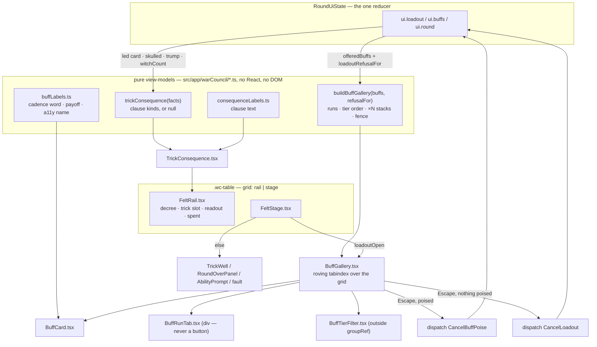

# Plan: Rebuild the buff gallery, re-home the felt's game state, and add the trick consequence readout

Plan folder: `.claude/contract/DLR-148-buff-gallery-felt-rehome-and-trick-readout/`
Execution status: see `tasks.md` in this folder.

---

## Part 1 — Alignment

### Task reference

**Jira: DLR-148** (Story, under epic DLR-147 — *Full UI pass*), labels `ui`, `playable`. The ticket's
own description is the spec; `.claude/contract/DLR-147-full-ui-pass/update-log.md` is the reasoning,
and `.claude/contract/DLR-147-full-ui-pass/buff-resolution-and-lifetimes.md` is the UI-facing view of
how a buff resolves.

**Amendments carried on the ticket (2026-08-26).** Activation, the lit hand and the per-card
breakdown are **DLR-153**, not this ticket — `mockup-buff-gallery.html` shows more than this ticket
delivers. The Timebomb targeting flow is **DLR-154**. **AC19's original numbering is intact but the
ticket withdraws its own AC19 about tap cost** — the tap cost of activating a buff is DLR-153's to
set. The AC19 this plan is held to is the greyscale one (the ticket's numbered list has one AC19,
"Every state is distinguishable in greyscale"; the withdrawn item is the tap-cost sentence in the
amendment block, which never reached the numbered list).

**Acceptance criteria, verbatim from the ticket:**

1. Opening the buff surface never occludes the decree/trump card, the spent pile, or the Quarry's played card — verified in a browser at 1440x900 and 1280x720, sizes named in the summary. Test **rectangle intersection on all four edges**, not one axis: the layout restacks at narrow widths and an x-only test reports collisions that cannot exist.
2. Buffs render as cards with a metallic tier frame and a neutral face; tier is legible as a roman numeral independent of colour.
3. Target suit is shown as a coloured glyph on the card face, and the gallery is ordered by run with a tab opening each one.
4. The pressable cards form their own run, distinct from the suitless passive buffs, and their cadence pill is visually distinct.
5. The Timebomb's payoff states both figures — what it pays and what it can cost the player — on the face and in its accessible name.
6. The payoff bar's text meets WCAG AA (4.5:1) against its bar colour on every suit. Assert it, do not eyeball it.
7. Duplicates collapse into one card with a stacked pile and an exact `×N`.
8. Buffs that cannot be used now sort to the end, tarnish rather than blank, and collapse into one group carrying the count and the shared reason. **See the rules question in Dependencies before building the gate — the fence's direction is not settled.**
9. Every card states its cadence, derived from `BUFF_CADENCE` — not free text.
10. **No card's text overflows or wraps into another element at the width the grid actually affords.** Assert every card in every state at 1440x900 and 1280x720 — the longest string is the only one that fails, so a spot check passes while the layout is broken.
11. Mid-trick the gallery fits with no internal scrolling and the fenced group visible; assert the grid's overflow is 0.
12. **A skulled card renders the skull face, identical for every rank and suit, with rank and suit still readable in the corner.** A skull stays with its card when it changes hands, so this must hold in the player's own hand and on the decree.
13. **The trick carries a consequence readout** with an `IF YOU WIN` / `IF YOU LOSE` pair, or a `RULE` row where the led card constrains legal play or changes how the trick resolves. Wording is derived from the rank's actual rule, not authored per card.
14. **The readout renders nothing at all when the led card has no consequence beyond the ordinary, and nothing before the Quarry has played.** No placeholder row, no empty panel. Assert that a clean low card produces no readout element.
15. **The readout never states or implies which branch will happen**, and never reveals anything about the Quarry's unplayed card.
16. **"Their intent" is removed from the dossier**, and the state where the player leads first is handled explicitly rather than left blank by accident.
17. No pip, glyph or art overlaps any other element on any card — assert geometrically across every rank and suit.
18. The gallery is one roving-tabindex group: arrow keys traverse, Enter/Space poises then activates, Escape unwinds one level. Covered by a component test.
19. Every state is distinguishable in greyscale. **Take the screenshot** — this epic has already had a "reads without colour" claim fail its own test twice.
20. `npm run typecheck`, `npm run lint`, `npm run format:check` and `npm test` pass.

**Developer decisions taken interactively, 2026-08-26, and treated as settled for this plan:**

- **The fence follows the code, not the mockup.** Twelve of the thirteen live templates are gated on
  `discardWindowOpen` (between tricks only) and **Cheat alone** is `canAct` (usable mid-trick), per
  `roundUiState.ts` → `buffActivationWindowOpen`. The mockup's inverted fence is corrected in the
  port. **No engine change, and the gallery does not gain a self-opening behaviour** — that stays a
  separate ticket.
- **`IntentTelegraph` is deleted outright — both halves.** "Their intent" *and* the speculative
  "If you lead that" preview go. `intentPreview.ts` goes with it. The consequence readout becomes the
  single surface that says what a trick will do, and the lead state deliberately says nothing.

### Restated goal

Replace the buff loadout list with a dense, scannable gallery of buff *cards* — a neutral face with a
metallic tier frame, a roman numeral for tier, the target suit as a bare coloured glyph, a
contrast-derived suit-coloured payoff bar, duplicates collapsed into a counted pile, ordered into five
runs each opened by a card-shaped tab, with the buffs that cannot be used right now fenced into one
tarnished group carrying the count and the shared reason. Re-home the felt so this gallery can never
occlude the decree, the spent pile or the Quarry's played card — the felt splits into a left game rail
that permanently carries decree, trick and spent, and a stage that carries the gallery. Add a
consequence readout to that rail that says, in the rank's own terms, what the card the Quarry just led
does to the player if they take the trick and if they do not — and renders nothing at all when the
card has nothing extra to say. Give a skulled card a skull face instead of a corner glyph. Delete the
intent telegraph.

### In scope

- A pure gallery view-model (`buffGallery.ts`): run grouping (`suit ?? (PRESS ? press : suitless)`),
  tier-descending order within a run, duplicate collapse into counted stacks, the usable/fenced split
  and the fence's shared reason. **AC3, AC4, AC7, AC8.**
- A pure consequence view-model (`trickConsequence.ts`) plus its copy map (`consequenceLabels.ts`):
  the win/lose pair for a skulled lead, the Swan's leader clause, the led-Monarch `RULE` row, the lone
  Witch `RULE` row, and `null` for everything else. **AC13, AC14, AC15.**
- Cadence and payoff copy derived from `BUFF_CADENCE` and `BuffKind` in `buffLabels.ts`, including the
  Timebomb's two-figure payoff on the face and in the accessible name. **AC5, AC9.**
- `BuffGallery.tsx` + `BuffCard.tsx` + `BuffRunTab.tsx` + `BuffTierFilter.tsx`, replacing
  `BuffLoadoutPanel.tsx`, with one roving-tabindex group over the grid's buttons and a two-level
  `Escape`. **AC2, AC18.**
- The felt re-home: `.wc-table` becomes `game rail | stage`; `FeltRail.tsx` carries decree, the trick
  slot and the readout and the spent pile; `FeltStage.tsx` carries the gallery or the felt's narrative
  states. **AC1.**
- `TrickConsequence.tsx` — the off-white slip in the rail, with the measured light-ground inks.
- The skull face in `PlayingCard.tsx` and a `#wc-skull` symbol in `SuitSymbolSheet`. **AC12.**
- Deleting `IntentTelegraph.tsx`, `intentPreview.ts`, their specs, `STANCE_PHRASE` and
  `intentAccessibleName`, and updating the copy in `TrickWell.tsx` that tells the player to read the
  intent. **AC16.**
- A `CancelBuffPoise` reducer action so `Escape` unwinds one level. **AC18.**
- A contrast test that parses the stylesheet's tokens and asserts every payoff-bar and readout
  text/ground pair at ≥4.5:1. **AC6.**
- New stylesheets `warCouncilBuffGallery.css` and `warCouncilFeltRail.css`; removing `.wc-loadout*`
  from `warCouncilActionBar.css` and `.wc-telegraph*` from `warCouncilHunt.css`.
- Splitting `WarCouncilRound.tsx` back under the 400-line budget as part of the re-home — it is
  **415 lines today**, already in breach.
- A requested QA browser pass covering AC1, AC10, AC11, AC17 and AC19, which have no jsdom answer.

### Explicitly out of scope

- **Activating a buff, the lit hand, the riding list, the per-card breakdown — DLR-153.** This ticket
  does not change what firing a buff does, what a commit tap costs, or how a spent card leaves.
- **The Timebomb's targeting flow and the primed-card mark — DLR-154.** `primed` keeps today's `⚗`
  glyph on `PlayingCard`; the bomb mark from `mockup-primed-card.html` is not built here.
- **Cheat's live duration readout** — no ticket yet.
- **Any change to `buffActivationWindowOpen`, `buffFires`, `BUFF_CADENCE`, `TEMPLATE_FAMILIES`, a
  buff's cost, or when it fires.** The fence reads the existing gate and does not move it.
- Whether non-`PRESS` buffs should be tappable at all.
- Restoring any cut buff family, reward axis or consumable. The gallery renders what the pile holds;
  a real pile is thirteen templates and opens at four bronze cards.
- The paper grain texture. It is decoration, both of its performance traps are about *how* it was
  built, and the cheapest way to carry both traps into `src/` is to not build it here. Its two
  prohibitions are recorded as CSS comments where a future ticket would add it.
- The gallery opening itself at the trick boundary (the developer chose "follow the code" without
  auto-open).
- Retuning any suit colour, tier metal, face tint, skull wash or size bound. Every one is transcribed
  as a placeholder and listed for the developer.

### Pattern Reference

Supplied by the brief, and authoritative:

- `.claude/contract/DLR-147-full-ui-pass/mockup-buff-gallery.html` — the full screen and the approved
  target for layout, grid, tabs, fence and the rail. Carries DLR-153's activation model and a
  deliberately wider fifteen-card set; **both are ignored here**.
- `mockup-buff-metal.html` — the buff card at full size (the tier *word* stays there and is cut in the
  gallery). `mockup-trick-readout.html` — skulled cards and the readout, with its five worked
  examples. `mockup-util-cards.html` — Cheat and Timebomb in the picker and the split payoff bar.
- `mockup-buff-suit.html` — superseded; the record of how the suit/tier colour collision was measured.
- **`<plan>/mockup.html`** (built for this plan) — the *scoped* view: the same layout with only the
  thirteen live templates, the code's fence direction, and none of DLR-153's activation model.

Existing code the new work follows:

- `HandFan.tsx` + `useRovingTabIndex.ts` — the roving-tabindex pattern the gallery reuses unchanged.
- `roundBars.ts`, `cardDamage.ts`, `duelHealthBars.ts` — the precedent for a pure view-model `.ts`
  module beside its component in `src/app/warCouncil/`, tested without a renderer.
- `roundControlsProps.ts` — the precedent for assembling a component's props from `RoundUiState` in
  one place.
- `.claude/skills/react-frontend/SKILL.md` and `.claude/skills/game-ux/SKILL.md`.

Specifications cited rather than re-derived:

- `.docs/game_rules/the-hunt.md` §"Each named rank does one thing" (the rank table), §4 (the led-Monarch
  narrowing), §7 (the four outcomes) — the readout's sentences come from these rows, not from prose
  invented here.
- `.claude/contract/DLR-147-full-ui-pass/buff-resolution-and-lifetimes.md` §2 (the window gates), §4
  (lifetimes and the six clocks).
- `CLAUDE.md` → *"Win" and "lose" mean two different things* and *Cut buffs are cut until a ticket
  brings them back*.

### Constraints flagged on the brief

- **Three performance traps that MUST carry into `src/`:** paper grain must not be an SVG filter over
  `feTurbulence` (timed out `Page.captureScreenshot` at 120s with eleven cards); no `mix-blend-mode` on
  a grain overlay (a compositing layer per card); a `<button>` may only contain phrasing content and
  stops stretching once it is not a direct grid item.
- **A card component sized on its own sheet is not sized for its grid.** The tile bound is chosen
  against the container's measured width, then overflow is asserted on every card in every state.
- **A card's size must not encode how many there are** — `repeat(auto-fill, <fixed>)`, never
  `minmax(…, 1fr)`.
- **A bar pinned to a card's bottom edge must never wrap** — `white-space: nowrap` is what makes the
  rest of the card's vertical layout computable.
- **`.pc` is a `<span>` in the mockup and an inline box ignores `width`/`height`/`aspect-ratio`.** Our
  `PlayingCard` is already a `<button>`, so this trap lands instead on the new `BuffCard`: it must
  carry an explicit `display`.
- **A FOURTH trap, found building `<plan>/mockup.html` and not in the ticket: the buff card must be
  its own stacking context, and so must the duplicate pile.** The card layers `z-index: 0` (sheen)
  under `z-index: 1` (face), and the pile layers are absolutely positioned behind a
  `position: relative` card. Neither the card nor the pile wrapper creates a stacking context by
  default, so both contests get resolved in the *grid's* context instead — and both lose in the same
  way. It produced two visible defects on the first render: **the hover sheen swept across the whole
  card and its neighbours instead of travelling the rim**, and **every stacked buff rendered as a
  blank slab of metal with no face at all**, because the pile painted over its own card. The second
  one does not read as a z-order bug, it reads as "that card is broken". The fix is
  `isolation: isolate` plus `overflow: hidden` on the card, and `isolation: isolate` with explicit
  `z-index` on the pile wrapper — carried in the mockup's CSS with the reasoning at the point of use,
  and required in `warCouncilBuffGallery.css`.
- **AC6's 4.5:1 floor is not a placeholder** even though every colour is. White fails on all three
  suits (2.99 / 3.37 / 3.51:1); both project accent tokens fail on the readout's light ground
  (`--wc-alarm` 3.03:1, `--wc-brass` 2.29:1).
- **An x-only overlap test says nothing once a layout restacks** — AC1 is real rectangle intersection
  on all four edges.
- **The mockups are plain co-located CSS by design — re-author under `react-frontend`, do not port.**
- **Two runtime dependencies.** No new dependency is proposed.
- **The vocabulary trap.** Every buff condition reads the *mechanical* axis (`playerWon` — did the
  player physically take the cards); the bank, multiplier and damage read the *outcome* axis. The
  readout speaks the outcome axis; the cadence pill speaks the mechanical one. They must not be given
  the same words.

### Assumptions made

- **The gallery's pure logic goes in `src/app/warCouncil/*.ts`, not `src/hunt/`.** `src/hunt/**` is
  lint-enforced pure *domain*; a view-model that orders cards for a grid is presentation, and the
  existing precedents (`roundBars.ts`, `cardDamage.ts`, `duelHealthBars.ts`) all sit beside their
  component. Nothing new is added to the pure-core tree, so its ESLint override is untouched.
- **`buffGallery.ts` takes `refusalFor` as a callback rather than reading `RoundUiState`.** It keeps
  the module a plain function-in/value-out unit and reuses the one existing gate
  (`buffHandlers.ts` → `loadoutRefusalFor`) rather than a second reading of it — the codebase's
  standing discipline against two readings of one gate.
- **A stack collapses only on exact card identity** — kind, tier, target suit, target rank, reward
  axis and reward value all equal. Two Bell-Takers that pay different amounts are two cards, and AC7's
  "exact `×N`" is only true if the collapse key is exact.
- **Run order is Bells, Keys, Moons, Suitless, Press.** `update-log.md` open question 3 records
  "should suitless buffs group first or last? Last is assumed in the sheet"; Press is a fifth run
  after it. Following the sheet.
- **The cadence *word* is derived from `BUFF_CADENCE` first and then narrowed by `BuffKind` within
  `Event`.** AC9 says derived, not free text, but `BuffCadence` has four members and three live
  families share `Event` while firing on different branches. Two keyed maps, both over closed unions,
  so a new member fails to compile rather than rendering `undefined`.
- **The cadence words are `TAKE` / `MISS` / `DODGE` / `WHEN` / `HAND END` / `PRESS`,** not the
  mockup's `WIN` / `LOSE`. Every buff condition reads the mechanical axis, and putting `WIN` on a
  Taker beside a readout that says "if you take the trick" is precisely the collision `CLAUDE.md`
  names as the single most common source of wrong statements about this game. This is **copy, and copy
  is the developer's** — it is listed under Risks and in the tasks' developer list.
- **The consequence view-model returns clause *kinds*, not sentences.** `trickConsequence.ts` decides
  which clauses apply; `consequenceLabels.ts` holds the words. This keeps the rules module testable on
  structure and the copy in one place, matching how `buffLabels.ts` and `labels.ts` already split.
- **The readout speaks only about the Quarry's led card.** It returns `null` when the trick is empty,
  when the player led, and when the led card produces no clauses — one rule, three cases, satisfying
  AC14 by construction rather than by a render-time guard.
- **The Fox and the Woodcutter produce no readout clause.** `the-hunt.md` states both resolve the
  instant the card is played, before the follow — so by the time the card is face up in the trick,
  there is nothing left for them to do to the follower.
- **The trick's cards render in exactly one place at a time.** Gallery closed → the trick well renders
  in the stage as it does today. Gallery open → a condensed trick strip renders in the rail. The
  readout is in the rail in **both** states. The approved mockup renders the trick in both places
  simultaneously; that duplication is the one place this plan deliberately deviates, because two
  simultaneous renderings of one trick is a worse answer to the same problem than one that moves.
- **The gallery's tier filter is component-local `useState`.** It is ephemeral view state that dies
  with the panel, not round state, so it does not belong in `roundReducer`. Everything the reducer
  already owns (which buff is poised, whether the panel is open) stays there.
- **`QuarryDossier.tsx` is NOT modified.** The ticket's scope list names it for "removing Their
  intent", but "Their intent" is `IntentTelegraph.tsx`, rendered as a sibling inside
  `<aside className="wc-dossier">` by `WarCouncilRound.tsx`. `QuarryDossier` never contained it. The
  removal happens in `WarCouncilRound.tsx` plus the two deletions.
- **`quarryIntent` stays in the engine.** Deleting the UI telegraph leaves `src/warCouncil/cpuPlayer.ts`'s
  `quarryIntent` exported with no production consumer. It keeps its own spec and its own
  `TELEGRAPH_FIDELITY` config; removing engine surface is a bigger cut than this ticket's scope and
  would strand `src/hunt/config.ts`. It stays, and this plan says so rather than leaving it as a
  surprise.
- **Every colour and size bound is transcribed verbatim from the mockups as a documented placeholder,
  not invented.** Per `CLAUDE.md`'s pause condition a *value* is the developer's; a transcribed value
  from an artefact the developer approved is a default this plan carries forward and lists, so the
  pipeline does not stall on it. The one figure that is **not** a placeholder is the 4.5:1 contrast
  floor.
- **A browser pass is requested** (`/fb-apply <slug> --browser`). AC1, AC10, AC11, AC17 and AC19 are
  functional questions with right answers that jsdom cannot answer — filing them as developer
  observation would bury them.

### Config and persisted-shape audit

Performed with `grep -rF … src --include='*.ts' --include='*.tsx' --include='*.css'` on 2026-08-26.

- **Nothing in this ticket is persisted.** `.claude/rules/save-data-versioning.md` was read; no task
  touches `src/persistence/**`, writes an envelope, or names a storage section.
  `grep -rF "'strings-and-stations'" src` → **hits only in `src/persistence/config.ts`**, unchanged.
  `SAVE_SCHEMA_VERSION` is not bumped because no persisted payload changes. The one persisted string
  this work comes near is `ConditionBuffTemplate.id` (`<kind>[:<param>]:<axis>`), which the Vault
  stores — **it is read, never renamed, and never used as the gallery's stack key**; the stack key is
  computed locally and never leaves the render.
- **`BUFF_CADENCE` is read, not changed.** 8 files reference it — `src/hunt/buffs.ts` (owner),
  `buffEvaluation.ts`, `buffTemplates.ts`, `slotWeights.ts`, `index.ts`, and 3 specs
  (`hunt/__tests__/buffs.test.ts`, `sim/__tests__/reachability.test.ts`,
  `app/warCouncil/__tests__/buffRoundState.test.ts`). This ticket adds a **ninth reader**
  (`buffLabels.ts`) and modifies none of the eight.
- **`buffActivationWindowOpen` is read, not changed.** 3 files: `roundUiState.ts` (owner),
  `buffHandlers.ts`, `__tests__/WarCouncilRound.actionBar.test.tsx`. The fence reads it through
  `loadoutRefusalFor`, so its behaviour and its specs are untouched — this is what "follow the code"
  means concretely.
- **Deleted names and every hit accounted for.** `IntentTelegraph` — 3 files (component, mount,
  spec); `previewQuarryIntent` — 3 files (module, mount, spec); `intentAccessibleName` and
  `STANCE_PHRASE` — 3 files each (`IntentTelegraph.tsx`, `labels.ts`, `labels.test.ts`);
  `wc-telegraph` — **11 hits** across `IntentTelegraph.tsx` (5) and `warCouncilHunt.css` (6 rule
  selectors, lines 306–338). Every one is in a file this contract deletes or edits.
  `BuffLoadoutPanel` — 6 files: the component, `ActionBar.tsx` (a docblock reference only),
  `roundControlsProps.ts`, `WarCouncilRound.tsx`, `__tests__/ActionBar.test.tsx`,
  `__tests__/BuffLoadoutPanel.test.tsx`. `wc-loadout` — **21 hits**, 7 in `BuffLoadoutPanel.tsx` and
  14 in `warCouncilActionBar.css`; both files are in the file map.
- **Construction sites, counted by type name AND by field.** No task adds a required field to an
  existing shape, so the classic undercount does not arise — but the counts are stated because the
  check exists to be run, not assumed.
  - `TrickWellProps`: **1 annotated site** (`TrickWell.tsx`), **15 construction sites** of
    `<TrickWell …>` — 2 in `WarCouncilRound.tsx` and 13 in `__tests__/TrickWell.test.tsx`. The larger
    number is the real one and every one is covered: `TrickWell.tsx`, `WarCouncilRound.tsx`,
    `__tests__/TrickWell.test.tsx`.
  - `PlayingCardProps`: **1 annotated site**, **16 construction sites** of `<PlayingCard …>` —
    `AbilityPrompt.tsx` (3), `DecreePile.tsx` (1), `HandFan.tsx` (1), `TrickWell.tsx` (2),
    `__tests__/PlayingCard.test.tsx` (9). **No prop is added or made required** — `skulled` already
    exists and only its *rendering* changes — so none of the 15 non-owner sites needs an edit. Stated
    so the reviewer does not have to re-derive it.
  - `BuffLoadoutPanelProps`: **2 annotated sites** (`BuffLoadoutPanel.tsx`, `roundControlsProps.ts`),
    **2 construction sites** of `<BuffLoadoutPanel …>` (`WarCouncilRound.tsx`,
    `__tests__/BuffLoadoutPanel.test.tsx`). The type is deleted and replaced by `BuffGalleryProps`;
    all four sites are in the file map.
  - `RoundUiAction`: the union gains one member (`CancelBuffPoise`). Every `switch` over it is in
    `roundReducer.ts` — **1 exhaustive switch**, which fails to compile if the case is missing. That
    is the widened-union case from check 3, and the compiler is the guard.
- **Type changes checked for loss.** No `number → string`, no array → object, no required → optional.
  The one widening is `RoundUiAction` above.
- **Names align across the chain.** `RoundUiActionKind.CancelBuffPoise` ↔ its `RoundUiAction` member ↔
  `roundReducer`'s case ↔ `buffHandlers.handleCancelBuffPoise` ↔ the `BuffGallery` dispatch — all five
  are introduced in one task so no phase boundary sits between them. New CSS class names
  (`wc-gallery*`, `wc-buffcard*`, `wc-runtab*`, `wc-fence*`, `wc-rail*`, `wc-readout*`,
  `wc-card-skull-face`) are introduced together with the components and the stylesheets that declare
  them, in the same tasks.
- **A pre-existing string-bound defect this audit found, and this ticket fixes.**
  `grep -rF 'wc-felt-rail' src` returns **2 hits**: `WarCouncilRound.tsx:367` uses the class, and
  `warCouncilTable.css:8` is a *comment* saying its rules "MOVE to `.wc-felt-rail`, declared in
  `warCouncilCheats.css`". **`warCouncilCheats.css` does not exist** — it was deleted with the
  felt-rail plates. So `.wc-felt-rail` has had **no CSS rule at all**; the div is an unstyled block.
  The re-home gives it real rules in `warCouncilFeltRail.css` and corrects the stale comment.
- **Architectural boundary not crossed.** No new file is added under `src/warCouncil/**` or
  `src/hunt/**`, so the pure-core ESLint override's `files` array is unchanged and no DOM global or
  React import is introduced into either tree. Final verification greps both anyway.
- **File-size breaches, measured with `(Get-Content <path>).Count`, not `Measure-Object -Line`.**
  `WarCouncilRound.tsx` **415** (over budget today), `warCouncilHunt.css` **417** (over budget today),
  `labels.ts` 361, `warCouncilCards.css` 346, `roundUiState.ts` 392, `warCouncilActionBar.css` 239,
  `buffLabels.ts` 177. The first two are in breach before this ticket touches them and are fixed
  in-ticket: the re-home extracts `FeltRail.tsx` and `FeltStage.tsx` out of `WarCouncilRound.tsx`, and
  deleting the six `.wc-telegraph*` rules takes `warCouncilHunt.css` to ~384.

---

## Part 2 — Technical design

### Approach

**The shape is two pure view-models, a set of small components over them, and one structural change to
the felt's grid.** Everything with a testable invariant — which run a buff belongs to, how duplicates
collapse, what order the runs come in, which cards fence and whether they share a reason, which
consequence clauses a led card produces — goes into plain `.ts` modules beside their components
(`buffGallery.ts`, `trickConsequence.ts`), tested with no renderer. The components then do nothing but
render what those modules already decided. This is why the alternative of computing the grouping inside
`BuffGallery.tsx` with a `useMemo` was rejected: it would put a comparison, an ordering rule and a
collapse key inside a `.tsx` file, which makes all three untestable without jsdom and puts a
`useMemo` in the diff with no profiling evidence behind it.

**The felt re-home is a grid change, not a z-index change, and that is the whole point of AC1.**
`.wc-table` is `grid-template-columns: 1fr auto 1fr` today, with `BuffLoadoutPanel` absolutely
positioned over the middle at `bottom: 0; left: 50%`. It becomes
`grid-template-columns: var(--wc-rail-w) minmax(0, 1fr)`: a left **game rail** and a **stage**. The
rail is `FeltRail.tsx` — decree pile, the trick slot, the consequence readout, the spent pile — and it
is always mounted, so the decree, the spent pile and the Quarry's played card cannot be occluded by
anything the stage does. The stage is `FeltStage.tsx`, which renders the gallery when
`loadoutOpen(ui)` and otherwise the branch chain that lives in `WarCouncilRound.tsx` today (fault,
resolved trick, round over, ability prompt, in-progress trick). Those two never fight for the same
state: `loadoutDoorOpen` is `discardWindowOpen || canAct`, and every one of the four other branches
(a held reveal, an open prompt, an engine fault, a complete round) makes both false — so the gallery
can only ever coexist with an empty or an in-progress trick. That is what lets the trick's *cards*
render in exactly one place: the rail's condensed strip when the gallery is open, the stage's well
when it is not, with the readout in the rail in both cases. The alternative — the mockup's own answer,
which renders the trick in the rail *and* in the stage simultaneously — was rejected as two
simultaneous renderings of one fact, which is the failure mode `update-log.md` itself records under
*one fact, one owner*.

**The buff card is a `<button>` that is a direct grid item, and every one of the mockup's three
layout traps is a structural rule rather than a size.** The button is the grid cell (a `<button>`
stops stretching the moment it is not a direct grid item, which broke the mockup's layout three
times), it contains only `<span>`s (a `<button>` may only contain phrasing content — so no `<h3>`,
no `<p>`), it carries an explicit `display: flex`, its top row is `flex-wrap: nowrap; overflow:
hidden`, its payoff bar is `white-space: nowrap`, and its condition text is bounded top *and* bottom
with `overflow: hidden`. The grid is `repeat(auto-fill, var(--wc-buffcard-w))` with
`justify-content: start` — never `minmax(…, 1fr)`, so a filtered gallery does not stretch three cards
across the panel. The tier *word* is not rendered in the gallery at all; tier is carried by the metal
frame, the roman numeral and the tinted face, and the numeral is the carrier that survives greyscale.

**The roving tabindex is the existing hook, unchanged, and that constrains the markup.**
`useRovingTabIndex` indexes `groupRef.current.querySelectorAll('button')` **positionally**, so the
`groupRef` element must contain exactly the buff cards, as native `<button>`s, in DOM order, and
nothing else focusable. Consequently the run tabs are non-interactive `<div>`s (they label a run, they
are not a control) and the tier filter chips — which *are* buttons — are rendered **outside**
`groupRef`, above the scroll region. The hook's `isFocusable(0)` is probed unconditionally even for an
empty collection, so the guard `stacks[i] !== undefined && stacks[i].refusal === null` carries over
verbatim from `BuffLoadoutPanel` and is load-bearing for the same reason. AC18's "Escape unwinds one
level" needs a second action: `Escape` dispatches `CancelBuffPoise` when a card is poised and
`CancelLoadout` when nothing is. Two actions rather than one branching action, because
`CancelLoadout` is also what the bar's own toggle dispatches and that must always close outright.

**The consequence readout is derived from the rank table, and its silence is structural.**
`trickConsequence(facts)` takes the led `TrickCard | null`, whether it is skulled, the trump suit and
how many Witches are already in the trick, and returns a view or `null`. It returns `null` when there
is no led card, when the *player* led it, or when the clause list comes out empty — so AC14's "no
placeholder row, no empty panel" is true because there is nothing to render, not because a component
checked. A skulled lead produces the `IF YOU WIN` / `IF YOU LOSE` pair (win → you eat the skull, which
is the costly branch; lose → they eat it, which is the worthwhile one — the dodge quadrant of
`the-hunt.md` §7). A Swan adds a leader clause to the win branch only, because on the lose branch
their Swan won and `nextLeaderAfterTrick` does nothing. A led Monarch and a lone Witch each produce a
`RULE` row. Everything else produces nothing. Both branches are always stated and neither is
emphasised — AC15 holds because the module has no access to the Quarry's hand and no branch carries a
weight.

**Copy and colour both live where they are already owned.** Cadence words, the payoff phrases and the
Timebomb's two-figure sentence extend `buffLabels.ts`; the readout's clause text is a new
`consequenceLabels.ts` rather than a further 40 lines on `labels.ts`, which is at 361. The measured
inks go into `:root` in `warCouncil.css` as new tokens, and AC6 is asserted by a **node** spec that
reads the stylesheet text, extracts the token values and computes the WCAG relative-luminance ratio —
so the CSS stays the single owner of the colour and the test still fails if someone retunes a suit
without re-measuring. Exporting the hexes from TypeScript and mirroring them in CSS was rejected for
being exactly the two-sources-of-truth failure this codebase is organised against.

### Skills to invoke during execution

- **`react-frontend`** — owns everything under `src/`: file order, the 400-line budget, the reducer
  discipline, effect cleanup, the no-speculative-memoisation rule, the `erasableSyntaxOnly` `as const`
  map form, and the Vitest posture (`node` project for `.test.ts`, `dom` project for `.test.tsx`).
  The normal `Skill:` value on every code task here.
- **`game-ux`** — owns the game-screen layer: the full-viewport no-scroll shell, the rail/stage
  zoning, condensed cards in the play area, the roving-tabindex model, "do not render a panel that has
  nothing to say", the greyscale requirement, the two-categorical-axes rule and the tile-bound-against-
  the-container rule. Governs `BuffGallery`, `BuffCard`, `FeltRail`, `FeltStage` and
  `TrickConsequence`.
- **`game-designer`** — confirmed by the developer. It owns no *change* here (this ticket alters no
  rule, cost or timing), so it is named for one task only: the cadence-word vocabulary check, where
  the mechanical/outcome split decides the copy.
- **`implementation-doc-writer`** — confirmed by the developer. Not invoked during the phases; it runs
  at the end of `/fb-apply` to update `.docs/implementation/app/` and, because AC12/AC13 change what a
  player sees of the skull and the trick, `.docs/game_rules/the-hunt.md`'s Status register.

Rules and workflow the executor must Read: `.claude/rules/save-data-versioning.md` (scanned — no task
persists a value, recorded above), `.claude/rules/README.md`, and
`.claude/workflow/web-project.md`. No developer override was applied; the developer ticked all four
offered skills.

### Diagram



### Data shapes

#### `src/app/warCouncil/buffGallery.ts` (new)

```ts
import type { Buff, BuffActivationRefusal, BuffId } from '../../hunt'

/** Which run a card sits in. `suit ?? (PRESS ? 'press' : 'suitless')` — the ticket's own key. */
export const BuffRunKind = {
  Bells: 'bells',
  Keys: 'keys',
  Moons: 'moons',
  Suitless: 'suitless',
  Press: 'press',
} as const
export type BuffRunKind = (typeof BuffRunKind)[keyof typeof BuffRunKind]

/** Run order in the grid. Suitless last of the passives, Press last of all. */
export const BUFF_RUN_ORDER: readonly BuffRunKind[] = [
  BuffRunKind.Bells,
  BuffRunKind.Keys,
  BuffRunKind.Moons,
  BuffRunKind.Suitless,
  BuffRunKind.Press,
]

/** One grid cell: every held copy of one exact card. */
export interface BuffStack {
  /** The copy a tap acts on — the first in pile order, so repeated taps spend a stable copy. */
  readonly buff: Buff
  /** Every held copy's id, pile order. `ids.length` is AC7's exact `×N`. */
  readonly ids: readonly BuffId[]
  readonly count: number
  readonly run: BuffRunKind
  /** `null` when usable right now. Non-null puts this stack in the fence. */
  readonly refusal: BuffActivationRefusal | null
}

export interface BuffRun {
  readonly kind: BuffRunKind
  /** Tier descending, then template id ascending so the order is total and stable. */
  readonly stacks: readonly BuffStack[]
  /** Sum of `count` — the figure the run tab prints. */
  readonly held: number
}

export interface BuffFence {
  readonly stacks: readonly BuffStack[]
  readonly held: number
  /** The single shared reason, or `null` when the fenced stacks do not agree on one. */
  readonly reason: BuffActivationRefusal | null
}

export interface BuffGalleryView {
  /** Only runs with at least one usable stack. Empty runs render no tab. */
  readonly runs: readonly BuffRun[]
  readonly fence: BuffFence
  readonly held: number
  readonly usable: number
}

export function buildBuffGallery(
  buffs: readonly Buff[],
  refusalFor: (buff: Buff) => BuffActivationRefusal | null,
): BuffGalleryView

/** The exact-identity collapse key: kind, tier, target suit, target rank, reward axis, reward value. */
export function buffStackKey(buff: Buff): string

export function buffRunOf(buff: Buff): BuffRunKind
```

#### `src/app/warCouncil/trickConsequence.ts` (new)

```ts
import type { Card, Suit, TrickCard } from '../../warCouncil'

export const ConsequenceBranch = { Win: 'win', Lose: 'lose', Rule: 'rule' } as const
export type ConsequenceBranch = (typeof ConsequenceBranch)[keyof typeof ConsequenceBranch]

/** Colour appears only on the consequence, never on the label. */
export const ConsequenceTone = {
  Costly: 'costly',
  Worthwhile: 'worthwhile',
  Neutral: 'neutral',
} as const
export type ConsequenceTone = (typeof ConsequenceTone)[keyof typeof ConsequenceTone]

/** One sentence's worth of meaning. The words live in `consequenceLabels.ts`. */
export const ConsequenceClauseKind = {
  YouEatSkull: 'youEatSkull',
  TheyEatSkull: 'theyEatSkull',
  SwanLoserLeads: 'swanLoserLeads',
  MonarchNarrowsFollow: 'monarchNarrowsFollow',
  LoneWitchIsTrump: 'loneWitchIsTrump',
} as const
export type ConsequenceClauseKind =
  (typeof ConsequenceClauseKind)[keyof typeof ConsequenceClauseKind]

export interface ConsequenceClause {
  readonly kind: ConsequenceClauseKind
  readonly tone: ConsequenceTone
}

export interface ConsequenceRow {
  readonly branch: ConsequenceBranch
  /** Never empty — a row with no clause is not built. */
  readonly clauses: readonly ConsequenceClause[]
}

export interface TrickConsequenceView {
  readonly led: Card
  readonly skulled: boolean
  /** Never empty — `trickConsequence` returns `null` instead. */
  readonly rows: readonly ConsequenceRow[]
}

export interface TrickConsequenceFacts {
  /** `null` when the trick is empty. */
  readonly led: TrickCard | null
  readonly skulled: boolean
  readonly trumpSuit: Suit
  /** Witches already face up in this trick. Exactly 1 makes the led Witch a lone Witch. */
  readonly witchCount: number
}

/** `null` when there is no led card, when the PLAYER led it, or when no clause applies. */
export function trickConsequence(facts: TrickConsequenceFacts): TrickConsequenceView | null

/** Builds `TrickConsequenceFacts` from round state in one place, so the rail and its spec agree. */
export function trickConsequenceFacts(state: RoundUiState): TrickConsequenceFacts
```

#### `src/app/warCouncil/consequenceLabels.ts` (new)

```ts
/** PLACEHOLDER COPY, as this project's rest is. Keyed over the closed clause union so a member
 *  added later fails to compile here rather than rendering `undefined`. Every sentence is
 *  transcribed from `.docs/game_rules/the-hunt.md`'s rank table and section 7, not authored. */
export const CONSEQUENCE_CLAUSE_TEXT: Readonly<Record<ConsequenceClauseKind, string>>

/** `IF YOU WIN` / `IF YOU LOSE` / `RULE`. Small caps, no chip — the label is never coloured. */
export const CONSEQUENCE_BRANCH_LABEL: Readonly<Record<ConsequenceBranch, string>>

/** The readout's own accessible name, so a reader who cannot see the slip gets the same claim. */
export function consequenceAccessibleName(view: TrickConsequenceView): string
```

#### `src/app/warCouncil/buffLabels.ts` (modified — additions only)

```ts
/** AC9 — the cadence word, derived from `BUFF_CADENCE` and never authored per card. Keyed over
 *  the closed `BuffCadence` union. */
export const BUFF_CADENCE_WORD: Readonly<Record<BuffCadence, string>>
//   Event -> (narrowed by kind, below)   Threshold -> 'WHEN'
//   Terminal -> 'HAND END'               Activated -> 'PRESS'

/** `Event` is shared by three live families that fire on different branches of the trick, so the
 *  word is narrowed by kind. MECHANICAL vocabulary — TAKE / MISS / DODGE — because every buff
 *  condition reads `playerWon`, not the outcome axis. See `CLAUDE.md`. Keyed over the closed
 *  `BuffKind` union, so the eight cut families still resolve to a word. */
export const BUFF_EVENT_WORD: Readonly<Record<BuffKind, string>>

export function buffCadenceWord(buff: Buff): string

/** AC5 — the Timebomb pays one figure and costs another. `null` for every other card, which is
 *  what makes the split bar a shape rather than a special case in the component. */
export interface BuffPayoff {
  readonly gain: string
  /** Present only where the same figure can land on the player. */
  readonly risk: string | null
}
export function buffPayoff(buff: Buff): BuffPayoff

/** AC5's second half — the accessible name carries the whole sentence, both figures included. */
export function buffCardAccessibleName(
  stack: BuffStack,
  poised: boolean,
  refusal: BuffActivationRefusal | null,
): string

/** PRESS cards are SPENT by the second tap and `Escape` cannot bring them back. */
export const BUFF_POISED_HINT_PRESS = 'Tap again to spend'
```

`buffLine` and `buffRowAccessibleName` **stay exported** — `src/app/run/SlotMachinePanel.tsx` and its
spec are consumers unrelated to this ticket. Only `BuffLoadoutPanel`'s use of them goes.

#### `src/app/warCouncil/roundUiState.ts` (modified — one union member)

```ts
export const RoundUiActionKind = {
  // …existing eleven, unchanged…
  /** AC18 — `Escape` unwinds ONE level. This drops an unspent poise; `CancelLoadout` keeps
   *  meaning "close the panel outright", which is what the bar's own toggle dispatches. */
  CancelBuffPoise: 'cancelBuffPoise',
} as const

export type RoundUiAction =
  // …existing eleven, unchanged…
  | { readonly kind: typeof RoundUiActionKind.CancelBuffPoise }
```

#### `src/app/warCouncil/buffHandlers.ts` (modified — one function)

```ts
/** Drops an unspent poise, leaving the panel open. A no-op when the panel is shut or nothing is
 *  poised, so a stray `Escape` cannot close a panel by accident. */
export function handleCancelBuffPoise(state: RoundUiState): RoundUiState
```

#### `src/app/warCouncil/BuffGallery.tsx` (new — replaces `BuffLoadoutPanelProps`)

```ts
export interface BuffGalleryProps {
  readonly view: BuffGalleryView
  readonly poised: BuffId | null
  readonly onTapBuff: (id: BuffId) => void
  readonly onCancelPoise: () => void
  readonly onClose: () => void
}
```

`roundControlsProps.ts`'s `buffLoadoutPanelProps` is renamed `buffGalleryProps` and returns this,
calling `buildBuffGallery(offered, (buff) => loadoutRefusalFor(ui, buff))`.

#### `src/app/warCouncil/FeltRail.tsx` and `FeltStage.tsx` (new)

```ts
export interface FeltRailProps {
  readonly decree: Card
  readonly trumpSuit: Suit
  readonly drawPileCount: number
  readonly decreePrimed: boolean
  readonly spentCount: number
  readonly reshuffled: boolean
  /** The condensed trick strip — rendered only while the gallery holds the stage. */
  readonly trick: readonly TrickCard[] | null
  readonly skulledCards: readonly Card[]
  readonly primedCards: readonly Card[]
  readonly consequence: TrickConsequenceView | null
}

export interface FeltStageProps {
  readonly children: ReactNode
}
```

`FeltStage` is deliberately a thin layout wrapper: the branch chain that picks fault / resolved trick /
round over / prompt / trick well stays a `felt` local in `WarCouncilRound.tsx`, and the gallery-or-felt
choice is one ternary at the call site. Extracting the *chain* itself would move five pieces of round
state into a second component for no gain; extracting the *box* is what buys the line count back.

#### `src/app/warCouncil/PlayingCard.tsx` (modified — rendering only, no prop change)

```tsx
{skulled ? (
  <span className="wc-card-skull-face" aria-hidden="true">
    <svg viewBox="0 0 32 32"><use href="#wc-skull" /></svg>
  </span>
) : (
  <span className={`wc-card-pip${hasAbility ? '' : ' wc-is-blank'}`} aria-hidden="true" />
)}
```

The `wc-skull-mark` corner glyph is removed; `.wc-card-rank` and `.wc-card-suit` stay, so rank and
suit remain readable in the corner (AC12). `cardAccessibleName(card, { skulled, primed })` already
appends `", skulled"` and is unchanged.

#### New CSS tokens — every value a transcribed PLACEHOLDER except the 4.5:1 floor

Added to `:root` in `src/app/warCouncil/warCouncil.css`:

| Token | Value | Unit / meaning |
|---|---|---|
| `--wc-buffcard-w` | `clamp(4.6rem, 6vw, 6.6rem)` | grid track width — chosen against the panel's measured width, not the viewport's |
| `--wc-rail-w` | `clamp(9rem, 14vw, 13.5rem)` | the game rail's column |
| `--wc-buff-frame` | `5px` | metal frame thickness — at 3px the colour reads but the shine has nowhere to land |
| `--wc-m-bronze` / `-silver` / `-gold` | five-stop `linear-gradient(142deg, …)` | tier metal |
| `--wc-m-bronze-edge` / `-silver-edge` / `-gold-edge` | `#4a2d13` / `#59656b` / `#6b520f` | frame edge |
| `--wc-face-bronze` / `-silver` / `-gold` | `#f8efdf` / `#f3f7f9` / `#fcf6e0` | tinted neutral face |
| `--wc-face-bronze-edge` / `-silver-edge` / `-gold-edge` | `#e7d6b6` / `#dae4e9` / `#efe1b3` | face edge |
| `--wc-buff-ink` / `--wc-buff-ink-soft` | `#1b1710` / `#5f5647` | card ink |
| `--wc-payoff-ink-bells` | `#1d1004` | **contrast-derived** — 6.22:1 on `--wc-bells` |
| `--wc-payoff-ink-keys` | `#06212e` | **contrast-derived** — 4.92:1 on `--wc-keys` |
| `--wc-payoff-ink-moons` | `#1c1030` | **contrast-derived** — 5.14:1 on `--wc-moons` |
| `--wc-readout-ground` | `#f6f2e8` | the off-white slip |
| `--wc-readout-ink` | `#1b1710` | body — 15.96:1 |
| `--wc-readout-label` | `#5f5647` | small-caps label — 6.46:1 |
| `--wc-readout-costly` | `#96301f` | **contrast-derived** — 6.86:1. `--wc-alarm` fails at 3.03:1 |
| `--wc-readout-worthwhile` | `#6f5412` | **contrast-derived** — 6.36:1. `--wc-brass` fails at 2.29:1 |

Every one is the developer's to retune. **The 4.5:1 floor is not**, and the contrast spec enforces it
against whatever the tokens say.

#### No change to

`package.json`, `tsconfig.json`, `vite.config.ts`, `eslint.config.js`. No new dependency, no new npm
script, no lint-rule change. Both Vitest projects already collect what this contract adds
(`src/**/__tests__/**/*.test.ts` → node, `…/*.test.tsx` → dom).

### Runtime quality notes

- **Purity and adjudication.** `buffGallery.ts`, `trickConsequence.ts`, `consequenceLabels.ts` and the
  additions to `buffLabels.ts` import no React and touch no DOM; all four are `.test.ts` under the
  `node` project. No component decides a rule it should only ask about: `BuffGallery` renders a
  `BuffGalleryView` and never groups; `TrickConsequence` renders a `TrickConsequenceView` and never
  reads the rank table; the fence reads `loadoutRefusalFor`, which reads `buffActivationWindowOpen`,
  which stays the single owner of the window. Every tunable is a `:root` token or a
  `clamp()`; no literal size or colour is written inline in a `.tsx` file.
- **Effects, mount and teardown.** **This contract adds no `useEffect`, no listener, no observer, no
  timer and no `requestAnimationFrame`.** `WarCouncilRound`'s two existing effects (the dev-state
  mirror write, and the unmount clear) are untouched apart from the values in their dependency array,
  which are already reducer-derived. The gallery's only state is the tier filter, a `useState` that is
  created and destroyed with the panel — nothing to clean up, and StrictMode's double mount recomputes
  an identical value. `useRovingTabIndex` moves focus imperatively inside its own keydown handler, not
  from an effect, so a second mount cannot steal focus. No module-level mutable state is introduced;
  the one module-level value added is `BUFF_RUN_ORDER`, a frozen `readonly` array. The `noop` constant
  in `BuffLoadoutPanel` is **not** carried over — the gallery wires a real `onCancel` (the
  poise/close ladder), so the hook's `onCancel` finally has a job.
- **Hot-path cost.** No pointer-move handler and no drag exists on this surface, so nothing runs per
  pointer event. `buildBuffGallery` is O(n log n) over the pile, and a real pile is **four cards
  opening, thirteen templates at most** — the mockup's twenty-three is a grid load test, not a game
  state. It is called once per render of a panel that is open only between tricks. **No `useMemo`,
  `useCallback` or `memo` is added**: there is no profiling evidence, the input is tiny, and
  `react-frontend` forbids speculative memoisation. The hover sheen fires **once per hover, never on a
  loop**, and does not travel under `prefers-reduced-motion` (the static specular brightens instead,
  so the hover still reads). No `mix-blend-mode` and no SVG filter is used anywhere — both would force
  a compositing layer or an independent rasterisation per card, which is exactly what stalled the
  mockup. The skull is one `<symbol>` in `SuitSymbolSheet` referenced by `<use>`, so N skulled cards
  cost one path.
- **Determinism and numeric safety.** Nothing here is seeded and `Math.random()` is not reachable from
  any of it — `buildBuffGallery`'s order is total (tier descending, then template id ascending), so
  two identical piles always produce an identical grid. No epsilon is needed: there is no float
  comparison. The only division in the contract is inside the contrast spec's WCAG ratio
  `(L1 + 0.05) / (L2 + 0.05)`, whose divisor is `≥ 0.05` by construction, so no `NaN` is reachable.
  `count` is `ids.length`, never a computed quotient, so an `×N` cannot render as `NaN`.
- **Error paths.** Nothing async is introduced, so the four async states do not arise and none is
  faked. Two failure modes are guarded rather than swallowed: `isFocusable(index)` guards
  `stacks[index] !== undefined` before reading `.refusal`, because `useRovingTabIndex` probes index 0
  unconditionally even on an empty collection — the crash class this exact guard was written for; and
  `trickConsequence` returns `null` rather than an empty view, so no consumer can render a panel with
  no rows. `CONSEQUENCE_CLAUSE_TEXT` and `BUFF_EVENT_WORD` are keyed over closed unions, so a member
  added later is a **compile error**, not an `undefined` on screen. No `catch` is added anywhere, and
  no default is returned in place of a failure.

### Risks and judgement calls

- **The cadence words are copy, and copy is the developer's.** This plan defaults to
  `TAKE / MISS / DODGE / WHEN / HAND END / PRESS` because every buff condition reads the *mechanical*
  axis and the mockup's `WIN / LOSE` puts outcome words on a mechanical test — the exact collision
  `CLAUDE.md` calls the single most common source of wrong statements about this game. The mockup says
  `WIN / LOSE`. **Say which you want**; the plan builds `TAKE / MISS` unless you say otherwise.
- **The trick renders in one place at a time, which is a deliberate deviation from the mockup.** The
  approved gallery mockup shows the trick in the rail *and* in the stage simultaneously. This plan
  moves it: stage well when the gallery is shut, rail strip when it is open. The cost is that the
  played card changes size and position when you open the gallery. Only the running app settles
  whether that reads as a move or as a loss — it is on the browser-pass list.
- **`quarryIntent` is left in the engine with no production consumer.** Deleting the telegraph strands
  it, `TelegraphFidelity` and `TELEGRAPH_FIDELITY` in `src/hunt/config.ts`, plus
  `__tests__/quarryIntent.test.ts`. Removing them is a bigger cut than this ticket's scope and would
  touch the pure-core tree; leaving them is dead-but-specified surface. Flagging rather than deciding
  unilaterally — say the word and it becomes a follow-up ticket.
- **`WarCouncilRound.tsx` (415) and `warCouncilHunt.css` (417) are already over the 400-line budget
  before this ticket starts.** Both are fixed in-ticket, per the standing instruction never to hand a
  breach back as a finding. This means the diff carries a structural extraction (`FeltRail`,
  `FeltStage`) that the ticket did not ask for. It is not scope creep; it is the budget.
- **`QuarryDossier.tsx` is in the ticket's scope list and this plan does not modify it.** "Their
  intent" is `IntentTelegraph`, a sibling in the same `<aside>`. If you meant something else about the
  dossier, this is the moment to say so.
- **AC1, AC10, AC11, AC17 and AC19 cannot be answered in jsdom.** They need a browser pass, which is
  opt-in and off by default. **This plan requests it** — run `/fb-apply <slug> --browser`. Without it,
  five acceptance criteria route to your eyes instead, and AC19's greyscale screenshot in particular
  has already failed its own claim twice on this epic.
- **Every colour and size bound is a placeholder transcribed from the mockups**: the three tier
  metals and their edges, the three face tints and their edges, the card ink pair, `--wc-buffcard-w`,
  `--wc-rail-w`, `--wc-buff-frame`, the skull wash, the sheen's duration/angle/width, and the fenced
  card's drop. None was chosen by anyone. They are written down so they are visible, not so they are
  adopted. **The 4.5:1 contrast floor is the one figure that is not yours to retune**, and the spec
  enforces it against whatever the tokens say.
- **`update-log.md` open question 6 stays open: do fenced buffs re-sort live mid-trick, moving cards
  under the player's finger, or only at trick boundaries?** This plan re-derives the view on every
  render, so they re-sort live. Only the running app settles whether that feels right; it is on the
  browser-pass list, and the fix if it is wrong is to freeze the order for the duration of a trick,
  which is small.
- **The mockup's own verification carries a caveat worth repeating**: Chrome's screenshot channel
  failed part way through that session, so the scaled pile offsets and the hover-plus-armed frame were
  verified by measured geometry and **have not been seen rendered by anyone**. Put eyes on the
  duplicate pile and the poised card specifically.
- **The `PRESS` run's cost is measured and accepted**: mid-trick the grid fits at 0px overflow with the
  fence in view; between tricks, with every card live and five tabs, the mockup ran **68px** over and
  scrolled inside its own panel. That is scoped overflow in one panel, not a page scroll, and the
  fence is empty in that state — but AC11 only promises the mid-trick case, and this plan does not
  promise more. If the 68px is unacceptable the fix is a narrower card, which is a tuning value.
