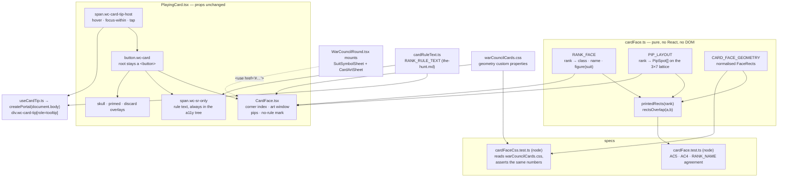

# Plan: Redesign the card faces — art on the named ranks, printed pip patterns, richer suit glyphs

Plan folder: `.claude/contract/DLR-149-card-face-redesign/`
Execution status: see `tasks.md` in this folder.

---

## Part 1 — Alignment

### Task reference

Jira **DLR-149** (Story, child of epic DLR-147 "Full UI pass"), labels `ui` / `playable`.
Summary: *Redesign the card faces: art on the named ranks, printed pip patterns, richer suit glyphs.*

**Problem statement (verbatim from the ticket):**

> `PlayingCard` renders a rank numeral and a suit glyph and nothing else. A player cannot tell from a card face whether it carries an ability, so they re-check the rules on every trick.
>
> The distinction matters here and differs from the printed game. Per `.docs/game_rules/the-hunt.md`, only five ranks act — Swan (1), Fox (3), Woodcutter (5), Witch (9), Monarch (11). The Treasure (7) and rank 8 are **named but do nothing**, and every other even rank is a plain number. A named card that does nothing is the worst case: it looks special, so the player hunts for a rule that is not there.
>
> The three suit glyphs in `SuitMark.tsx` are also minimal — a bare dome, a ring and a shaft, a plain crescent — and read as icons rather than as suit marks on a card.

**Acceptance criteria (verbatim):**

1. A card face carries a painting only when the rank has a character: the five acting ranks plus the Treasure (7), whose treasure differs by suit (harp / chalice / sword).
2. The border states whether the card acts — solid for the five that do, dashed plus a "no rule" mark for the Treasure. Both signals are readable in greyscale.
3. Rank 8 stays on pips, because it has no settled name — not because it is inert.
4. Plain and inert ranks carry pips laid out on a fixed lattice per rank, with the lower half rotated 180 degrees so the card reads the same from either end.
5. No pip and no art window overlaps either corner index, at every rank and suit — assert it geometrically rather than by eye.
6. The corner index shows rank, suit glyph and, where the rank is named, the name. The mirrored bottom-right index appears only where nothing else is printed there.
7. Suit glyphs are elaborated and stay legible from pip size (~14px) to corner-index size (~28px). `SuitMark.tsx` keeps setting no `stroke-width` so call sites control weight in CSS.
8. No rule text is printed on any face — abilities surface through a tooltip that opens on hover, focus **and** tap.

**Scope boundaries (verbatim):**

- *In scope:* `src/app/warCouncil/PlayingCard.tsx`, `SuitMark.tsx`, `warCouncilCards.css`; `labels.ts` where rank names are surfaced; the tooltip component carrying ability text.
- *Out of scope:* changing any card's ability (`the-hunt.md` owns those); naming rank 8; final art (the mockup's figures are compositional placeholders — real art drops into the same window with no layout change); card size, art-window proportion, palettes, parchment tones and grain strength (placeholders, the developer's).

**Dependencies & risks (verbatim):** the mockup is a reference sheet and scrolls deliberately; `PlayingCard` has three variants (`hand`, `table`, `pile`) and roughly 14 call sites, and table/pile render condensed so the face must degrade without art or name becoming noise; the mockup uses `:has()` for its tooltip — check support expectations before relying on it in `src/`.

**Design asset — the ticket's path is stale.** The ticket names `.claude/contract/2026-08-26-card-faces/mockup.html`. That folder does not exist. The file it describes is `.claude/contract/DLR-147-full-ui-pass/mockup-card-faces.html` (567 lines, header comment "Card face mockup — 2026-08-26, second pass"), copied into this plan folder as `reference-sheet.html` so the contract stands alone after `/clear`.

**Follow-up decision confirmed interactively (2026-08-27):** skills to load — `react-frontend` and `game-ux`; `game-designer` and `pixel-artist` declined.

### Restated goal

Rebuild the playing-card face so a player can tell, without reading anything, which of the cards in their hand can change what happens. Three face classes replace today's single face: the five acting ranks get a painting in a fixed art window and a solid heavy border; the Treasure (7) gets a painting too — its treasure differing by suit — but a dashed border and a printed "no rule" mark, because it is the one card that looks special and does nothing; every remaining rank, rank 8 included, carries a printed pip lattice with its lower half rotated 180° so the card reads from either end. The corner index gains the suit glyph and, on the six named ranks, the rank's name, and is mirrored into the bottom-right corner only on the ranks that print nothing there. The three suit glyphs are elaborated so they hold from pip size up to corner-index size. No rule text is printed anywhere: the rule reaches the player through a tooltip that opens on hover, on focus and on tap, and through the accessible tree at all times. The relationship between the corner indices and everything else printed on the face is expressed as numbers in a pure module and asserted by a unit test, not judged by eye.

### In scope

- A new pure module `src/app/warCouncil/cardFace.ts` owning: the three face classes per rank, which ranks print a name, which print art and which figure per suit, the per-rank pip lattice, and the **normalised face geometry** (corner-index boxes, art window, pip lattice, overlay boxes) as fractions of the card box, plus a rectangle-intersection helper.
- A Vitest node spec asserting AC5 (nothing printed overlaps a corner index this rank actually prints, for every rank × suit), AC4 (pip count equals rank; every spot below the mid-row is inverted, none above it is), and that `cardFace`'s printed names agree with `labels.ts`'s `RANK_NAME` where both name the same rank.
- A rebuilt `PlayingCard.tsx` composing a corner index, an art window or a pip lattice, the "no rule" mark, and the existing skull / primed / discard overlays — with **no change to `PlayingCardProps`**, so all ~14 call sites compile untouched.
- New sibling components: `CardFace.tsx` (corner index, art window, pips, no-rule mark), `CardArtSheet.tsx` (the eight figure `<symbol>`s: swan, fox, axe, witch, crown, harp, chalice, sword), `CardAbilityTip.tsx` + `useCardTip.ts` (the tooltip).
- Elaborated `s-bells` / `s-keys` / `s-moons` symbols in `SuitMark.tsx`, still setting no `stroke-width`.
- A rewritten card-face section of `warCouncilCards.css`, driven by named custom properties that mirror `cardFace.ts`'s geometry numbers, plus a drift test that reads the stylesheet and compares them.
- A CSS rule for `.wc-discard-mark`, which is rendered by `PlayingCard` today and has **no stylesheet rule at all** — an unstyled `✕` in the flex flow of a face that is about to become fully absolutely positioned.
- Mounting `CardArtSheet` beside the existing `SuitSymbolSheet` in `WarCouncilRound.tsx`.
- Rule copy per rank in a new `cardRuleText.ts`, transcribed from `.docs/game_rules/the-hunt.md` §"named rank" table.

### Explicitly out of scope

- Changing any card's ability, its tiering, or the tier shelf (DLR-122). The tooltip prints the **base** printed rule; a tiered Swan or Witch reads differently at silver/gold and the tooltip does not say so — recorded under Risks.
- Naming rank 8, or touching `CardRank.Poison` in `src/warCouncil/types.ts`.
- Final art. The eight figures are compositional placeholders occupying the declared art window; real art replaces the symbol bodies with no layout change.
- Card size (`--wc-card-w`, `--wc-plate-card-w`), card aspect ratio, art-window proportion, the three art palettes, parchment tones, pip scale and grain strength — every one a developer tuning value.
- Any change to `PlayingCardProps`, to `HandFan`/`TrickWell`/`DecreePile`/`FeltRail`/`AbilityPrompt` call sites, or to `roundReducer`'s arm/commit semantics.
- Adding `Treasure` to `RANK_NAME` (and so to every card's accessible name) — see Assumptions.
- The buff cards (`BuffCard.tsx`), the Cheat/Timebomb utility cards, and every other DLR-147 sheet.

### Pattern Reference

- **`reference-sheet.html` in this folder** (the ticket's design asset) — the authority on face composition: the corner-index grid, the art window's wash/glow/motes/figure/vignette stack, the 3×7 pip lattice and its per-rank spot table, the "no rule" chip, the tooltip's shape and copy, and the eight figure bodies. Its `PIP_LAYOUT`, `FIGURE` and `RANKS` tables are transcribed into `cardFace.ts` / `CardArtSheet.tsx` / `cardRuleText.ts`.
- **`src/app/warCouncil/SuitMark.tsx`** — the sanctioned mechanism for a shared SVG symbol referenced by `<use>` and tinted from the call site: a class on the shape plus a CSS rule setting `fill` from an inherited custom property (`.wc-skull-shadow`). Its docblock also records the trap this must not repeat: a `var()` inside a *presentation attribute* does not resolve reliably cross-browser.
- **`src/app/warCouncil/warCouncilCards.css`** — the existing card block, its `--wc-card-w`-relative sizing convention, and the `.wc-card-skull-face` / `.wc-primed-mark` overlay rules.
- **`.docs/game_rules/the-hunt.md`** §"Each named rank does one thing — except two" — the source of every line of rule copy. Cited, not re-derived.
- `.claude/skills/react-frontend/SKILL.md` and `.claude/skills/game-ux/SKILL.md` for conventions.

### Constraints flagged on the brief

- **No rule text printed on any face** (AC8). The tooltip and the accessible tree are the only channels.
- **`SuitMark.tsx` must keep setting no `stroke-width`** (AC7) so call sites own glyph weight in CSS — `warCouncil.css:224` is where the default `1.7` lives today.
- **AC5 must be asserted geometrically, not by eye.**
- **The face must degrade to `table` / `pile` size without the art or the name becoming noise** — condensed cards are a record, not a choice.
- **`:has()` support must be checked before it is relied on in `src/`.**
- **Two runtime dependencies only.** Nothing here adds a third.
- **`game-ux`'s hard floor:** every state distinguishable in greyscale; nothing a decision needs hidden behind hover; ≥44px interactive targets; roving tabindex preserved.

### Assumptions made

- **Rank 8 renders as an ordinary plain number — pips, default border, no "no rule" mark, mirrored bottom-right index.** AC2 names *only* the Treasure as dashed-plus-mark, and AC3's stated reason for rank 8 keeping pips is that it has no settled name, explicitly *"not because it is inert"*. The reference sheet disagrees — it classes rank 8 `inert` and prints "rank 8" in its corner and a "no rule" chip. Following the acceptance criteria over the sheet: giving 8 a dashed border while 6 gets none would tell the player 8 is special, which is the exact defect the ticket opens with.
- **`RANK_NAME` in `labels.ts` is left alone; the printed name map is new and lives in `cardFace.ts`.** AC6 wants the Treasure's name printed, and `RANK_NAME` today holds exactly the five acting ranks — its own spec (`labels.test.ts:73`) asserts that. Adding `Treasure: 7` changes `cardAccessibleName` for every rank-7 card and breaks **36 assertions across 10 spec files** that query `getByRole('button', { name: '7 of Bells' })`. That blast radius buys nothing a screen-reader user does not already get from the rule text this ticket attaches via `aria-describedby`. A drift test asserts the two maps agree wherever both name a rank.
- **The rule text is in the accessible tree at all times, not only while the tooltip is open.** A visually-hidden span inside the button carries it and is joined into `aria-describedby` alongside the caller's existing `describedBy` (the fan's damage strip). `game-ux` forbids putting anything a decision needs behind hover; a tooltip that only exists while open would do exactly that for anyone not using a pointer.
- **The tooltip does not use `:has()`.** Hover and focus are `.wc-card-tip-host:hover` and `.wc-card-tip-host:focus-within`, both universally supported; tap is a React state class. This answers the ticket's `:has()` question by removing the dependency rather than by accepting it.
- **A tap on a hand card opens that card's tooltip *and* arms it.** `roundReducer` already makes tap-1 arm and tap-2 commit; arming already means "I am considering this card", which is exactly when the rule is wanted. No new affordance and no change to the reducer. A second tap closes the tooltip and commits.
- **The tooltip bubble is rendered through `createPortal` into `document.body`.** `HandFan` gives each fan slot its own `z-index` (`fanLayout.ts:28`), which creates a stacking context per slot — a tooltip positioned inside a slot is trapped beneath the neighbouring card whatever `z-index` it is given. `react-dom` is already a dependency; no new one is added.
- **`.wc-card:disabled { pointer-events: none }`, with the tooltip's pointer and click handlers on the host wrapper.** Browsers do not dispatch pointer events on a disabled form control, and `table` / `pile` cards and every illegal hand card are `disabled` — without this, the tooltip is unreachable on exactly the cards a player most often wants to inspect.
- **A skulled card's skull fills the declared art window** instead of today's small top-right disc. DLR-148's own words are that a skull *replaces the art*; now that there is an art window, leaving a corner disc over an otherwise blank face is the reading that breaks. The markup stays byte-identical across every rank and suit, so `PlayingCard.test.tsx`'s AC12 spec still holds.
- **Figure fills are flat tonal classes plus gradient stops set in CSS**, driven by four inherited custom properties per suit (`--wc-fig-dark/mid/light/white`), exactly as `.wc-skull-shadow` already works. The reference sheet injects per-instance gradient ids from JavaScript; a shared symbol sheet cannot, and a `var()` in a presentation attribute is the trap `SuitMark.tsx` already documents.
- **Geometry is expressed in the normalised card box (0–1 in each axis), so it is independent of the card's aspect ratio** — which is `2 / 3` today and `5 / 7` in the reference sheet, and is the developer's to choose.
- **The corner index reserves a declared box that CSS enforces** (explicit width and height as fractions of the card width, with the name line clipped), rather than one inferred from font metrics. A geometric assertion is only honest if the stylesheet actually holds the element to the box the test checks.
- **The printed rank name is hidden below a card-width threshold via a container query** on the card, rather than dropped or shrunk to illegibility. See Risks for the arithmetic and the unchosen threshold.

### Config and persisted-shape audit

- **Nothing is persisted by this work.** No `src/persistence/` file is touched, no storage key is added, read or renamed. `.claude/rules/save-data-versioning.md`'s reject conditions are not reachable: `Get-ChildItem src -Recurse -Include *.ts,*.tsx | Select-String -Pattern "'strings-and-stations'"` is unchanged by this plan, and no file in the file map names `localStorage` or `sessionStorage`.
- **`RANK_NAME` — 8 hits across 5 files** (`labels.ts` ×2, `PlayingCard.tsx` ×2, `HandFan.test.tsx` ×1 comment, `labels.test.ts` ×2, `PlayingCard.test.tsx` ×1 comment). Its *value* is unchanged by this plan. Its one behavioural consumer, `PlayingCard.tsx:60`'s `hasAbility = Boolean(RANK_NAME[card.rank])`, **changes meaning and must change name**: it is replaced by `cardActs(rank)` from `cardFace.ts`, because "named" and "acts" stop being the same predicate the moment the Treasure gets a printed name. `labels.ts:42`'s use inside `cardAccessibleName` is left exactly as it is.
- **Rank-7 accessible-name literals — 40 hits across 11 files** (`grep -rn "7 of Bells\|7 of Keys\|7 of Moons" src` → 40 lines; **36 are live assertions** — 35 `getByRole` name queries plus one `toContain` in `actionBarLabels.test.ts:41` — and 4 are prose, three test comments and an `actionBarLabels.ts` docblock). Every one of them stays green **because** the plan does not add `Treasure` to `RANK_NAME`. This count is the audit's justification for that assumption, not a list of files to edit.
- **`.wc-discard-mark` — 1 construction site, 0 stylesheet rules.** `PlayingCard.tsx:106` renders `<span className="wc-discard-mark">✕</span>`; `grep -rn "wc-discard-mark" src --include=*.css` returns **zero hits**. A pre-existing string-bound gap that this ticket's rebuild would otherwise turn from invisible into a stray glyph over the new face. Fixed in scope.
- **Existing face class names, and their construction/annotation counts.** `.wc-card-rank` — 1 render site (`PlayingCard.tsx:87`), 1 CSS rule (`warCouncilCards.css:107`), 1 test assertion (`PlayingCard.test.tsx:96`). `.wc-card-suit` — 1 render site (`PlayingCard.tsx:90`), 1 CSS rule (`:123`), 2 test assertions (`:64`, `:97`). `.wc-card-pip` — 1 render site (`:111`), 2 CSS rules (`:191`, `:202`), 1 test assertion (`:113`). **All three class names are retained** on their new elements: `wc-card-rank` on the corner numeral, `wc-card-suit` on the corner glyph, `wc-card-pip` on each lattice pip. This keeps four passing assertions passing and avoids a rename whose four sites bind by string on both sides.
- **`--wc-card-w` / `--wc-plate-card-w` — declared once each** (`warCouncil.css:51`, `:52`) and read throughout `warCouncilCards.css`. Neither value changes in this plan; both are routed to the developer under Risks.
- **New exported names introduced (0 existing consumers, so no rename risk):** `CARD_FACE_GEOMETRY`, `FaceRect`, `RANK_FACE`, `RankFaceClass`, `PIP_LAYOUT`, `PipSpot`, `cardActs`, `printedRects`, `rectsOverlap`, `RANK_RULE_TEXT`, `NO_RULE_MARK_LABEL`. Their construction sites are the new module and its two specs only — counted by field (`PipSpot`'s `row`) as well as by type name, both returning only the new files.
- **Boundary check.** Every new file lives under `src/app/`, which is outside the lint-enforced pure-core trees (`src/warCouncil/**`, `src/hunt/**`). `cardFace.ts` imports only `src/warCouncil`'s `Suit` type and touches no DOM global, so it is pure by construction even though no lint rule requires it there; the final phase greps to confirm.

---

## Part 2 — Technical design

### Approach

The face is decomposed into **numbers, symbols, and a thin composition**. The numbers — which class a rank belongs to, which figure it paints per suit, where its pips sit on the 3×7 lattice, and the rectangles that every printed element occupies in the normalised card box — go into `cardFace.ts`, a pure module with no React import and no DOM access. That is what makes AC5 assertable: `printedRects(rank)` returns the rectangles a given rank *actually prints* (its corner indices, plus its art window or its pip cells, plus its "no rule" mark), and a node-environment spec walks every rank and asserts that no non-corner rectangle intersects a corner rectangle. Doing this inside a component test would need a layout engine, and jsdom has none — `game-ux` names that limit explicitly, which is why the geometry has to leave the component to be checkable at all.

The stylesheet has to be held to those same numbers or the assertion proves nothing about what renders. Rather than pushing a dozen inline custom properties onto every card from JavaScript, the geometry is declared once as named custom properties in `warCouncilCards.css` (`--wc-face-corner-w`, `--wc-face-art-top`, `--wc-face-pip-inset`, …) and a **drift spec reads the stylesheet from disk and asserts each declared value equals its `cardFace.ts` counterpart**. That is the same discipline `SuitMark.tsx` applies to its symbol ids, applied to a surface the compiler equally cannot see. The alternative considered and rejected was generating the whole face from inline styles: it would make the binding automatic, but it puts geometry on the hot path of every one of a fanned hand's cards and defeats the stylesheet's existing `--wc-card-w`-relative idiom.

The **symbols** — eight figures and three elaborated suit glyphs — are `<symbol>` definitions mounted once per round, referenced by `<use>`. This is not a stylistic choice: eleven cards on the felt would otherwise carry eleven copies of a fifteen-path drawing, and the reference sheet's own header records that this file's earlier `feTurbulence` grain filter made a screenshot time out at 120 seconds because every filtered box rasterises independently. Both of that comment's conclusions carry into `src/`: the paper grain is a tiled 64×64 base64 bitmap, and there is no `mix-blend-mode`. Per-suit tinting rides on inherited custom properties read by class-based CSS rules, the one mechanism this codebase has already shipped through a `<use>` shadow tree (`.wc-skull-shadow`), rather than `var()` inside a presentation attribute, which `SuitMark.tsx`'s docblock records as unreliable.

The **composition** stays in `PlayingCard.tsx`, whose props do not change — every derived fact comes from `card.rank` and `card.suit`, so all ~14 call sites compile untouched and the roving-tabindex contract (`useRovingTabIndex.ts` binds by `querySelectorAll('button')`) survives, because the `<button>` stays the card's root and the tooltip is a `<div role="tooltip">`, never a second button. The one structural change is a host `<span>` wrapping the button, which carries the tooltip's hover, focus-within and tap handling. The bubble itself is portalled to `document.body` with `position: fixed`, because `HandFan` gives each slot its own `z-index` and any tooltip rendered inside a slot is trapped under the neighbouring card. The rule text is *also* rendered as a visually-hidden span inside the button and joined into `aria-describedby`, so the rule is in the accessible tree whether or not the bubble is open — `game-ux` forbids hiding a decision-relevant fact behind hover, and touch has no hover at all.

`useCardTip` is the hook that owns the tooltip's open state, its measured anchor rectangle, and the two document listeners that close it: a `pointerdown` outside and an `Escape` keydown. Both are registered only while the tooltip is open and removed in the same effect's cleanup, which is what makes the pair StrictMode-safe and gives the exclusivity behaviour for free — a tap on a second card fires `pointerdown` before its `click`, closing the first. A `resize` listener closes rather than re-measures, because the felt does not scroll and a stale bubble is worse than a dismissed one.

### Skills to invoke during execution

- `react-frontend` — owns everything under `src/`: file order, the 400-line budget measured with `(Get-Content <path>).Count`, effect cleanup and StrictMode safety, no speculative memoisation, no third runtime dependency, Vitest posture and the node/dom project split.
- `game-ux` — owns the card-face layer: greyscale legibility of the act/inert/plain distinction, nothing decision-relevant behind hover, ≥44px targets, the roving-tabindex contract across the fan, condensed cards as a record rather than a choice, and the rule that no tuning value is invented.

Rules the executor must Read: `.claude/rules/README.md` (index) — `.claude/rules/save-data-versioning.md` was scanned and does not apply, since nothing here persists a value.
Workflow reference the executor must Read: `.claude/workflow/web-project.md`.
Developer override at the Step 1.5 gate: `game-designer` and `pixel-artist` were offered and declined — the rules are settled upstream and the placeholder figures are vector silhouettes, not pixel art.

### Diagram



### Data shapes

#### `src/app/warCouncil/cardFace.ts` (new, pure)

```ts
import type { Suit } from '../../warCouncil'

/** A rectangle in the NORMALISED card box: 0 = the card's left/top edge, 1 = its right/bottom.
 *  Aspect-ratio independent on purpose — the card is `2 / 3` today and the reference sheet is
 *  `5 / 7`, and which one ships is the developer's call. */
export interface FaceRect {
  readonly x0: number
  readonly y0: number
  readonly x1: number
  readonly y1: number
}

/** Which of the three faces a rank wears. `act` and `inert` both paint; only `plain` mirrors
 *  its corner index into the bottom-right (AC6). */
export const RankFaceClass = {
  Act: 'act',
  Inert: 'inert',
  Plain: 'plain',
} as const
export type RankFaceClass = (typeof RankFaceClass)[keyof typeof RankFaceClass]

/** One figure symbol's id suffix — the `<symbol id="wc-fig-…">` bodies in `CardArtSheet.tsx`. */
export type FigureKey =
  | 'swan' | 'fox' | 'axe' | 'witch' | 'crown'
  | 'harp' | 'chalice' | 'sword'

export interface RankFace {
  readonly faceClass: RankFaceClass
  /** Printed in the corner index (AC6). `null` for every rank with no settled name — which is
   *  rank 8 and every plain even rank. Naming rank 8 is explicitly out of scope. */
  readonly name: string | null
  /** One figure for the five acting ranks; three for the Treasure, whose treasure differs by
   *  suit (AC1). `null` for a rank that prints pips instead. */
  readonly figure: FigureKey | Readonly<Record<Suit, FigureKey>> | null
}

/** Total over `RANKS` (1–11). The six named ranks and the five plain ones. */
export const RANK_FACE: Readonly<Record<number, RankFace>>

/** A pip's cell on the fixed 3×7 lattice. 1-indexed to match CSS grid lines directly. */
export interface PipSpot {
  readonly row: number
  readonly column: number
}

/** AC4 — the fixed lattice per rank. Keys are exactly the pip-bearing ranks: 2, 4, 6, 8, 10. */
export const PIP_LAYOUT: Readonly<Record<number, readonly PipSpot[]>>

/** AC4 — a spot below the lattice's mid-row prints rotated 180°. */
export const PIP_MID_ROW = 4
export function pipIsInverted(spot: PipSpot): boolean

/** AC1/AC2 — true only for the five ranks that change what happens. NOT `Boolean(RANK_NAME[r])`
 *  any more: the Treasure is named and does not act, which is the whole point of this ticket. */
export function cardActs(rank: number): boolean

/** The declared boxes. Every number is mirrored by a custom property in `warCouncilCards.css`
 *  and the pair is asserted equal by `cardFaceCss.test.ts`. */
export const CARD_FACE_GEOMETRY: {
  /** Named ranks reserve a taller top-left box, because the name prints on a second line. */
  readonly cornerTopLeftNamed: FaceRect
  readonly cornerTopLeftPlain: FaceRect
  /** AC6 — only a `plain` rank prints this. */
  readonly cornerBottomRight: FaceRect
  readonly artWindow: FaceRect
  /** The lattice's outer box. One box, not two: under this plan's rank-8 reading every
   *  pip-bearing rank is unnamed, so no pip field ever has to clear a name line. */
  readonly pipField: FaceRect
  readonly noRuleMark: FaceRect
  /** Overlays. Asserted against the corner boxes only — a badge over art or a pip is intended. */
  readonly skullFace: FaceRect
  readonly primedMark: FaceRect
  readonly discardMark: FaceRect
}

/** One pip cell's rectangle, derived from the rank's lattice box and its 3×7 division. */
export function pipCellRect(rank: number, spot: PipSpot): FaceRect

/** AC5 — every rectangle this rank ACTUALLY prints, split so the spec can assert the one
 *  relation that matters: nothing in `printed` may intersect anything in `corners`. */
export function printedRects(rank: number): {
  readonly corners: readonly FaceRect[]
  readonly printed: readonly FaceRect[]
}

export function rectsOverlap(a: FaceRect, b: FaceRect): boolean
```

#### `src/app/warCouncil/cardRuleText.ts` (new)

```ts
/** The tooltip's title line — the printed rank name, or the bare rank for an unnamed one. */
export function cardTipTitle(rank: number): string

/** AC8's body. Transcribed from `.docs/game_rules/the-hunt.md` §"Each named rank does one thing
 *  — except two" and from §4 for the Monarch's narrowing. Keys cover every rank 1–11: an
 *  unnamed rank gets the plain-number sentence rather than nothing, because "this card has no
 *  rule" is exactly the fact the ticket's problem statement says players cannot currently read. */
export const RANK_RULE_TEXT: Readonly<Record<number, string>>

/** The dashed Treasure's printed mark (AC2). Two words, no rule text — PLACEHOLDER copy. */
export const NO_RULE_MARK_LABEL = 'no rule'
```

#### `src/app/warCouncil/useCardTip.ts` (new)

```ts
export interface CardTipState {
  readonly open: boolean
  /** Viewport coordinates of the card, measured on open. `null` while closed. */
  readonly anchor: DOMRect | null
  readonly hostRef: React.RefObject<HTMLSpanElement | null>
  readonly toggle: () => void
  readonly close: () => void
}

export function useCardTip(): CardTipState
```

#### Component props (all new files)

```ts
interface CardFaceProps {
  readonly card: Card
}

interface CardAbilityTipProps {
  readonly card: Card
  readonly children: React.ReactNode
}

/* No id prop: the hidden rule span that `aria-describedby` points at lives in `PlayingCard` and
 * is present whether or not the bubble is open, so the transient bubble carries no id and is
 * never linked — linking it too would announce the rule twice. */
```

`CardArtSheet` and `SuitSymbolSheet` both take no props.

#### `PlayingCardProps`

**Unchanged.** No prop added, removed or retyped; no call site edited.

#### New CSS custom properties — `warCouncilCards.css`

Declared on `.wc-card`, mirroring `CARD_FACE_GEOMETRY` one-for-one and asserted equal by `cardFaceCss.test.ts`:

| Property | Unit | What it is |
|---|---|---|
| `--wc-face-corner-x`, `--wc-face-corner-y` | fraction | the corner index's inset from its two edges |
| `--wc-face-corner-w` | fraction | the corner index's reserved width |
| `--wc-face-rank-size`, `--wc-face-name-size`, `--wc-face-corner-glyph` | fraction | the three type/glyph sizes the corner box must be tall enough to contain |
| `--wc-face-corner-h-named`, `--wc-face-corner-h-plain` | fraction | its reserved height, with and without the name line |
| `--wc-face-art-x`, `--wc-face-art-top`, `--wc-face-art-bottom` | fraction | the art window |
| `--wc-face-pip-x`, `--wc-face-pip-top`, `--wc-face-pip-bottom` | fraction | the pip lattice |
| `--wc-face-mark-x`, `--wc-face-mark-top`, `--wc-face-mark-bottom` | fraction | the "no rule" mark |
| `--wc-fig-dark`, `--wc-fig-mid`, `--wc-fig-light`, `--wc-fig-white` | colour | the per-suit figure palette, set by `.wc-suit-*` |

**Developer decisions, not defaults to invent:** `--wc-card-w`, `--wc-plate-card-w`, the card's `aspect-ratio`, the twelve `--wc-fig-*` colours, the paper-grain opacity, and `--wc-card-name-min-w` (the container-query threshold below which the printed name is suppressed). Every one is listed under Risks with the measurement that settles it.

### Runtime quality notes

- **Purity and adjudication.** `cardFace.ts` and `cardRuleText.ts` import nothing from `react` and touch no DOM global; both are unit-tested with no renderer, in the `node` Vitest project. No component decides which rank acts — `PlayingCard` asks `cardActs(rank)`. Every geometry number and every colour is a named custom property or a named constant; the only literals in the stylesheet's card block are the ones the geometry module owns and the drift spec pins. The final phase greps the two new pure files for `from 'react'`, `window.`, `document.` and `localStorage` and expects zero hits.
- **Effects, mount and teardown.** `useCardTip` is the only effect-bearing new code. It registers a `pointerdown` and a `keydown` on `document` and a `resize` on `window`, **all three only while `open` is true**, and removes all three in the same effect's cleanup — so a card that unmounts while its tooltip is open (a played card leaving the fan is the ordinary case) leaves nothing behind. Adding and removing the same listeners is idempotent, so StrictMode's double invocation is a no-op; the spec mounts under StrictMode and asserts one bubble, then unmounts with the tooltip open and asserts the listener count returns to its baseline. The anchor rectangle is measured once on open from `hostRef.current.getBoundingClientRect()` and stored in state, not recomputed per frame — no `requestAnimationFrame`, no `ResizeObserver`, no pointer capture, and so nothing to release on `pointercancel`. There is no module-level mutable state anywhere in the new files.
- **Hot-path cost.** Nothing here runs per pointer move. The hover and focus channels are pure CSS (`:hover`, `:focus-within`) and never reach React at all; only a tap causes a render, and it renders one card. `RANK_FACE`, `PIP_LAYOUT` and `CARD_FACE_GEOMETRY` are module-level frozen literals — a fanned hand's per-card work is a record lookup and a `map` over at most ten pip spots, not a computation. The eight figures and three suit glyphs are defined once per round mount and referenced by `<use>`, so eleven cards on the felt cost eleven references, not eleven drawings. No `memo`, `useMemo` or `useCallback` is added: there is no profiling evidence for any, and `react-frontend` forbids adding them without it. The reference sheet's two measured performance findings are carried into `src/` verbatim — the paper grain is a tiled base64 bitmap, never an SVG `filter`, and no `mix-blend-mode` appears anywhere, because each forced per-card rasterisation and stalled a screenshot at 120 seconds.
- **Determinism and numeric safety.** Nothing in this work is random or seeded — `Math.random()` appears nowhere and the face is a pure function of `(rank, suit)`. `pipCellRect` divides by the lattice's fixed 3 columns and 7 rows, both compile-time constants that cannot be zero, so no divisor is reachable that could produce `NaN` in a rendered value. `rectsOverlap` is a strict comparison with no epsilon: every coordinate is an exactly-representable decimal literal from one shared module rather than an accumulated float, and touching edges (`a.x1 === b.x0`) count as *not* overlapping, which is the correct reading of "does not overlap" for adjacent printed regions and is asserted directly by a boundary case in the spec.
- **Error paths.** There is no async surface, no fetch, no storage read and so no four-state loading contract to satisfy. The one lookup that can miss is a rank outside 1–11: `RANK_FACE` and `RANK_RULE_TEXT` are total over `RANKS`, and `PIP_LAYOUT` is total over the pip-bearing ranks, so `cardFace.ts` exposes no accessor that can hand back `undefined` for a legal card — a spec asserts totality across `RANKS` rather than trusting the literal. Nothing is wrapped in a `catch`, so no failure can be swallowed into a success shape. `useCardTip` closes rather than guessing if `hostRef.current` is null at the moment of measurement, which is a visible no-op rather than a bubble rendered at the origin.

### Risks and judgement calls

- **The printed rank name cannot be legible at today's card width, and this is the plan's biggest open question.** `--wc-card-w` is `clamp(2.9rem, 6.2vmin, 4.3rem)` — **46px to 69px**. The printed name line is `0.075 × card width`, which lands at **3.5px–5.2px** here. The plan renders the name and suppresses it below a container-query threshold, `--wc-card-name-min-w`, so AC6 holds wherever the name is readable and degrades honestly where it is not — but **at today's card width the name will never appear on any card**. Two things are the developer's: the threshold value, and whether `--wc-card-w` should rise to meet it. For a ~9px name line the card needs to be about **120px (7.5rem)** wide — ~1.7× today's maximum, which still changes the felt's layout.
- **The pip glyph is below AC7's ~14px floor at today's card width too.** The lattice gives each pip a cell of `(0.75 − 0.25) / 3 = 0.167 × card width` — **7.7px to 11.5px** at the current clamp. Reaching 14px needs `--wc-card-w ≥ 5.25rem (84px)`, a ~22% rise on today's maximum, or a wider lattice box (fewer, larger pips per row). Both are tuning values and neither is the planner's to pick. The plan builds to the geometry as specified and states the arithmetic; **the acceptance criterion is only met once the developer chooses one.**
- **Card size, aspect ratio, and the twelve figure colours are all unchosen.** `--wc-card-w`, `--wc-plate-card-w`, the card's `aspect-ratio` (`2 / 3` today, `5 / 7` in the reference sheet), `--wc-fig-dark/mid/light/white` × three suits, and the paper-grain opacity. The mockup this plan ships alongside renders the faces at **both** the current in-game sizes and the reference sheet's size so the choice can be made by looking rather than by arithmetic.
- **Rank 8 as a plain number contradicts the reference sheet.** The sheet gives it a dashed border, a "no rule" chip and a printed "rank 8" corner label; this plan gives it none of those, following AC2 and AC3's stated reasoning. If the developer wants the sheet's reading instead, it is a change to `RANK_FACE` plus a second pip-field rectangle, since a named rank's pips have to clear its name line — but it means telling the player rank 8 is special, which is the defect the ticket opens with.
- **The Treasure's name will not be announced to a screen reader.** Keeping `RANK_NAME` at five ranks is what holds 36 test assertions green; the cost is that a rank-7 card announces as "7 of Bells", not "7 of Bells (Treasure)". The rule text *is* announced via `aria-describedby`, so nothing about the card's behaviour is hidden — but the name is a real gap, and folding `Treasure: 7` into `RANK_NAME` as its own follow-up ticket is the clean way to close it.
- **The tooltip prints the base printed rule and says nothing about tiers.** DLR-122's silver/gold rungs change what a Swan and a Witch do, and `the-hunt.md` marks both `[provisional] — built, unplayed`. A player holding a gold Swan will read a tooltip that understates it. Adding a tier line is a design decision about what the shelf should surface and belongs to its own ticket.
- **Tapping a hand card to read its rule also arms it.** This is deliberate — it is the only tap-reachable channel that does not cost a new affordance or a reducer change — but it means a touch player cannot inspect a card without selecting it. Whether that reads as helpful or as a mis-tap is a feel judgement that only playing settles.
- **The skull moving from a corner disc into the art window changes an approved DLR-148 visual.** The spec that pins it (byte-identical markup across every rank and suit) still passes, and the change follows DLR-148's own wording, but the visual is the developer's to confirm.
- **The discard-selected mark has no design at all today** — it renders an unstyled `✕` with no CSS rule anywhere in `src/`. The plan gives it a centred overlay so it does not collide with the skull (top-right), the primed badge (bottom-left) or either corner index, but the actual treatment is a visual call.
- **`createPortal` for the tooltip bubble is a structural choice worth sanity-checking.** It is what makes the bubble escape the fan's per-slot stacking contexts, and it adds no dependency, but it does mean the bubble lives outside the card's DOM subtree — so anything that later assumes "the tooltip is inside the card" will be wrong.
- **Container queries and `:focus-within` are the two CSS features this relies on.** `:focus-within` is universally supported. `@container` needs Chrome 105+ / Safari 16+ / Firefox 110+ — comfortably within a Vite prototype's reach, and if the developer would rather not depend on it, the fallback is to print the name unconditionally and let the card-width choice carry AC6 alone.
- **Whether the three face classes actually read apart in greyscale is a look, not a test.** `game-ux` requires the greyscale screenshot to be taken, and DLR-148 is the recorded case where that exact claim was made and then failed. Solid-2px vs dashed vs default border plus present/absent art is a form distinction rather than a hue one, so it should hold — but it must be checked, not asserted.
