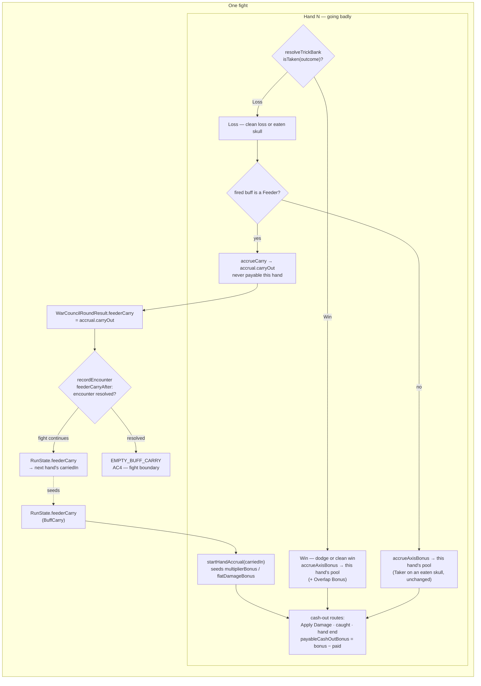

# Plan: Feeder carry — a Feeder that fires on a Loss banks into the next hand

Plan folder: `.claude/contract/DLR-150-feeder-carry/`
Execution status: see `tasks.md` in this folder.

---

## Part 1 — Alignment

### Task reference

**DLR-150** — *Feeder carry: a Feeder that fires on a Loss banks into the next hand* (Story, under epic
DLR-103, labels `engine` / `playable`). Moved `To Do → Planning` at the start of this run.

**Problem statement (verbatim):** "A Feeder pays the player for not taking a trick, and its reward is
consumed by the very cash-out that the loss triggers — a pot that is near zero precisely because the
player just lost. Three deliberate losses in a bad hand pay three separate points into three tiny
cash-outs and accumulate into nothing… Note the defect is NOT the two-thirds reduction. Flat damage
is added outside the product, after the reduction, so a bronze Feeder already pays its full +1 even
on a catastrophic loss. The problem is that the reward is spent immediately, at the worst possible
moment, instead of accumulating."

**Acceptance criteria (verbatim):**

1. A Feeder that fires on a trick resolving as a **Loss** (clean loss, or an eaten skull) adds its
   reward to a carry pool rather than to the hand's accrual, and that hand's cash-out pays nothing
   from it.
2. A Feeder that fires on a **dodge** — a skull trick the player did not take, which is a win — pays
   into the current hand's accrual exactly as it does today, stacking with every other buff that
   fired on the trick and counting toward the Overlap Bonus.
3. The carry pool seeds the next hand's accrual at hand start, and is spendable there through any
   cash-out route (Apply Damage, being caught, or hand end).
4. The carry pool resets to zero at the fight boundary, whether the fight was won or lost. It
   compounds hand to hand within a fight only.
5. The Momentum reward axis is restored for the Feeder family, so Bell/Key/Moon Feeder exist on both
   Blade and Momentum. This is now safe because the carry removes the reason it was cut — on the loss
   half the bonus escapes the hand before the reset wipes it, and the dodge half never had the
   problem.
6. The carry is visible on screen: accumulating during the hand it is earned in, and shown as an
   opening figure at the top of the next hand.
7. Vitest covers, at minimum: a loss-fire carries and does not pay this hand; a dodge-fire pays this
   hand and counts toward the Overlap Bonus; the carry seeds the following hand's accrual; the carry
   is zero at the start of a new fight.

**Scope boundaries (verbatim, in scope):** the carry pool, its hand-boundary survival and its
fight-boundary reset · the Loss / dodge branch in the Feeder's fire · restoring the Momentum row for
the Feeder family in the template table · the on-screen carry readout, both halves · test coverage
for all of the above.

**Scope boundaries (verbatim, out of scope):** the High/Low vocabulary rename · any change to
Sidestep · any cap or decay on the carry · the eight cut buff families and the two cut reward axes.

**Design source:** `.docs/design/Balatro-Forbidden-Solitaire/ideas.md` → *The Feeder carry, and a
High/Low vocabulary that stops describing the wrong axis* (decided 2026-08-26). No mockup supplied by
the ticket — "the readout is a small addition to the existing felt rather than a new surface."

### Restated goal

A reward a Feeder earns on a losing trick currently lands in the hand's own accrual, where the loss's
own cash-out immediately spends it into a near-empty pot. This ticket splits that reward by the
trick's **outcome**: a Feeder firing on a Win (a dodge) pays into this hand exactly as it does today,
while a Feeder firing on a Loss (a clean loss or an eaten skull) diverts its reward into a **carry
pool** that pays nothing this hand, survives the hand boundary, seeds the next hand's accrual as an
ordinary spendable bonus, and is wiped when the fight ends. Because the carry lets a multiplier bonus
escape the reset that used to destroy it, the Momentum reward axis is restored to the Feeder family,
taking the mintable pool from 13 templates to 16. Both halves of the carry are put on the felt — the
figure accumulating during the losing hand, and the figure the next hand opens with — because the
whole effect is a promise made in one hand and redeemed in the next, and an invisible promise is not
one.

### In scope

- A `BuffCarry` value (`{ multiplierBonus, flatDamageBonus }`) and its accumulation on
  `BuffBonusAccrual`, uncapped, never payable in the hand that earns it.
- A Loss/Win branch inside `resolveFiredBuffs`, applied to the **Feeder family only**, driven by the
  outcome axis `bank.ts` already owns (`isTaken`) rather than a second statement of the skull
  inversion.
- `startHandAccrual(carriedIn)` seeding a new hand's `multiplierBonus` / `flatDamageBonus` from the
  carry, so every existing cash-out route spends it with no new arithmetic (AC3).
- `RunState.feederCarry`, threaded through the mount seam in both directions
  (`WarCouncilMountProps.feederCarry?` in, `WarCouncilRoundResult.feederCarry` out) exactly as
  `blastGuardHeld` and `discardsRemaining` already are, and wiped by a named `feederCarryAfter` on a
  resolved encounter (AC4).
- The same threading through `src/sim/` — `seedFor`, `playHand`'s result, `playRun`'s
  `recordEncounter` call — so the headless simulator measures the game the felt plays.
- Restoring `{ kind: BuffKind.Feeder, axes: BLADE_AND_MOMENTUM, param: 'suit' }` in
  `TEMPLATE_FAMILIES`, and updating the two specs that assert a 13-template pool (AC5).
- Two readouts on `BankMeter` — the carry accumulating this hand, and the figure this hand opened
  with (AC6).
- Vitest coverage for all seven of AC7's cases plus the fight-boundary reset.
- Two in-ticket 400-line-budget fixes made necessary by this change: extracting the round result's
  construction out of `WarCouncilRound.tsx` (already 415 lines) into a shared
  `roundResult.ts` that `src/sim/playHand.ts` also adopts, and extracting `App.tsx`'s screen
  derivation into a pure `screenFor.ts`.
- Correcting `CLAUDE.md`'s *Cut buffs* section, which currently states the pool is 13 templates and
  that Feeder is Blade-only.

### Explicitly out of scope

- The High/Low vocabulary rename. `.docs/design/…/ideas.md` banks it and `CLAUDE.md` states plainly
  it is not built; nothing in this plan uses High/Low in code, copy, or the ruleset.
- Any change to Sidestep. Its predicate `skullTrick && !playerWon` is a Win by definition, so it can
  never reach the carry branch, and this plan does not touch it.
- Any cap, decay, or per-hand ceiling on the carry.
- Restoring any of the eight cut condition families or the two cut reward axes (Purse, Second Wind).
- Any change to `MAX_MULTIPLIER_BONUS_PER_HAND` / `MAX_FLAT_DAMAGE_BONUS_PER_HAND`, both currently
  `Number.POSITIVE_INFINITY`.
- New sim instrumentation for the design doc's "what to measure" list (carry frequency, average size
  at spend). The ticket's AC does not ask for it; it is a `play-tester` question once this ships.
- Editing `.docs/implementation/**` or `.docs/game_rules/the-hunt.md` by hand — `/fb-apply`'s
  `implementation-doc-writer` step owns both.

### Pattern Reference

The brief supplied no code reference. The references chosen, all from this repository:

- **`RunState.discardsRemaining` and `RunState.blastGuardHeld`** (`src/hunt/run.ts:69,103`,
  `src/hunt/runTransitions.ts`) — the exact shape of "a figure the hand owns for its life, hands back
  through `WarCouncilRoundResult`, and that dies at the fight boundary". `guardAfter` is the named
  rule `feederCarryAfter` copies.
- **`RoundUiSeed.apCapacity` / `.coins`** (`src/app/warCouncil/roundUiState.ts:177-188`) — the
  optional-with-default seed field, chosen so the 11-plus existing seed literals reproduce today's
  game unchanged.
- **`BuffBonusAccrual.multiplierPaid` / `flatDamagePaid`** (`src/hunt/buffAccrual.ts:36-41`) — the
  precedent for adding a running field to the accrual that only one writer moves.
- **`BankMeter.pendingBonus`** (`src/app/warCouncil/BankMeter.tsx:16`) — the display-only,
  defaulted-to-zero buff readout prop this plan adds two siblings to.
- **`isTaken` / `trickOutcomeFor`** (`src/warCouncil/bank.ts:113-133`) — the single existing
  statement of the outcome axis, cited rather than restated.
- `.claude/skills/react-frontend/SKILL.md` and `.claude/skills/game-ux/SKILL.md`.

### Constraints flagged on the brief

- **Build the readout before tuning any number.** The ticket states this twice and it shapes the
  phase order here: AC6's readout ships in the same contract as the mechanic, and no tuning value is
  chosen anywhere in this plan.
- **The carry's size is a tuning value and the developer's.** The plan invents none. The Momentum
  Feeder's tier ladder is likewise routed to the developer (see Risks).
- **The Momentum Feeder is a substantially bigger card than the damage version** (18 vs 12 vs an
  unbuffed 9, worked in `ideas.md`). Whether it ships on the same ladder is flagged, not decided.
- **Tanking needs no cap** — the ticket rules it self-limiting at 1 health of 10 per deliberate loss.
  No cap is planned.
- **Feeder deliberately still fires on dodges as well as losses** — this was considered and kept, so
  the plan must not "fix" `buffFires`'s `!ctx.playerWon` predicate.
- The pure-core lint boundary on `src/hunt/**` and `src/warCouncil/**` (no React, no DOM globals).
- Two runtime dependencies. This plan adds none.
- 400-line file budget, measured with `(Get-Content <path>).Count`.

### Assumptions made

- **Only the Feeder family carries.** AC1 names the Feeder; the design doc costs the change as "one
  branch in Feeder's fire". Consequence, stated plainly because it is not obvious: a **Taker** that
  wins a trick carrying a skull has fired on a Loss and still pays into the hand it lost. That is
  today's behaviour, unchanged. Flagged in Risks as the reading most likely to be wrong.
- **The Overlap Bonus is unchanged.** AC1 says "adds its **reward**" — a buff's own reward — and AC2
  names the Overlap Bonus only for the dodge case. So the Overlap Bonus continues to land in this
  hand's multiplier accrual on every trick, including a Loss trick where the reset then wipes it.
  Flagged in Risks.
- **The carry seeds `multiplierBonus` / `flatDamageBonus` directly rather than living as a separate
  payable pool.** This makes AC3's "spendable through any cash-out route" free — `payableCashOutBonus`
  and both branches of `resolveTrickBank` already spend exactly those two figures — at the cost of
  one dependency on both `MAX_*_PER_HAND` caps being `Number.POSITIVE_INFINITY` today (verified, see
  the audit). Flagged in Risks with the regression test that pins it.
- **The carry accumulating this hand (`carryOut`) is uncapped.** R6's caps bound what one hand's
  buffs may *pay*; the carry pays nothing this hand, so no cap applies to it. Consistent with the
  ticket putting any cap out of scope.
- **The carry is wiped in `recordEncounter` via a named `feederCarryAfter(encounter, carry)`**, the
  sibling of `guardAfter`, rather than by a reset in `advanceRun`. This satisfies AC4's "whether the
  fight was won or lost" literally — a lost fight ends the run and never reaches `advanceRun` at all.
- **`WarCouncilMountProps.feederCarry` is optional and defaults to the empty carry; `WarCouncilRoundResult.feederCarry` is required.** This mirrors the house split exactly: an
  opening figure is optional so existing fixtures are unchanged (`apCapacity`'s precedent), a closing
  figure is required so the compiler enumerates every construction site (`coinsEarned`'s precedent).
- **`RoundUiSeed.feederCarry` is optional**, for the same reason — the audit found 11 seed
  construction sites, and the alternative is 11 fixture edits that all mean "nothing carried".
- **The Momentum Feeder ships on the existing shared `REWARD_TIER_VALUE[Multiplier]` ladder (2/3/5)
  by default.** This invents no number — that ladder already exists and every other Momentum card
  reads it. A Feeder-specific ladder would be a new tuning value and is the developer's; routed to
  Risks rather than assumed away.
- **Restoring Momentum needs no slot-weight change.** `slotWeights.ts` already carries
  `[BuffRewardAxis.Multiplier]` weights and keys family weight on `BuffKind.Feeder`, so the new three
  templates become drawable the moment the row exists.
- **The readout lives on `BankMeter`**, beside the existing "Buff bonus pending" line, rather than as
  a new panel — the ticket says the readout is a small addition to the existing felt.
- **The two 400-line extractions are in-ticket work, not findings.** Both files are pushed over
  budget by this change (`WarCouncilRound.tsx` is already at 415 before it), and `CLAUDE.md` makes
  >400 blocking.

### Config and persisted-shape audit

- **Nothing this ticket touches is persisted.** `RunState`'s own docblocks state field by field that
  every run-level figure is "NEVER persisted"; `src/persistence/` stores the Vault only, and the
  Vault persists `TemplateGrant` (`{ templateId, tier }`) and nothing else. Confirmed by grep:
  `feederCarry` has **0 hits** across `src/**` (a genuinely new name), and `SAVE_SCHEMA_VERSION` needs
  no bump because no persisted shape changes.
- **`ConditionBuffTemplate.id` IS persisted, and this ticket mints three new ids.** Restoring the
  Momentum Feeder row generates `feeder:bells:multiplier`, `feeder:keys:multiplier`,
  `feeder:moons:multiplier` under the frozen `<kind>:<param>:<axis>` format. These are **additions**,
  not renames — no existing id changes, so no saved Vault entry is orphaned and `reconcileVault`
  needs no migration. This is the one place `.claude/rules/save-data-versioning.md` applies, and it is
  satisfied: reject conditions 1–6 are all untripped (no storage global outside
  `browserStorage.ts`, no key concatenation, no bare payload, no incompatible shape change, no
  `as T` cast, no swallowed read failure).
- **`BuffBonusAccrual` — 8 files reference the type name, 2 files construct it by literal.** Grep for
  `BuffBonusAccrual` returns hits in `buffAccrual.ts` (9), `buffEvaluation.ts` (3), `bank.ts` (2),
  `buffTrickFacts.ts` (2), `buffRoundState.ts` (2), `index.ts` (1) and two specs (2 each). Grep for
  the required field `multiplierPaid` returns **5 lines across 2 files** —
  `src/hunt/buffAccrual.ts` and `src/hunt/__tests__/buffAccrual.test.ts`. Every other site spreads
  `EMPTY_BUFF_ACCRUAL` or an existing accrual, so adding two fields there is compile-safe everywhere
  except those two files, both of which are in the task's file list. The larger figure — 8 files — is
  the one the tasks cover.
- **`RoundUiSeed` — 18 references across 8 files; 11 construction sites.** The type name appears in
  `roundUiState.ts`, `playHandWindows.ts` and 6 specs. Counting by the distinctive required field
  `blastGuardHeld:` restricted to seed literals gives 11 (`roundUiState.ts`, `playHandWindows.ts`,
  and 9 specs under `src/app/warCouncil/__tests__/` and `src/sim/__tests__/`). **11 is the real
  number**, and it is exactly why `feederCarry` is optional on the seed: an optional field touches 2
  of those 11 (the two real producers) and leaves 9 fixtures untouched.
- **`WarCouncilRoundResult` — 3 construction sites**, found by grepping the required field
  `coinsEarned:`: `WarCouncilRound.tsx:252`, `WarCouncilRound.tsx:268`, `sim/playHand.ts:228`. Adding
  a required field breaks all three at `tsc`. This plan collapses them to **one** by extracting
  `roundResultFor(ui)`, which is also what brings `WarCouncilRound.tsx` back under budget.
- **`recordEncounter` — 48 call sites** by grep of `blastGuardHeld:`-adjacent usage; the function's
  own docblocks record 48 and 52 for its two previously-added optional parameters. `feederCarry` is
  therefore added as an **optional 8th parameter defaulting to `undefined`** (keeps `run.feederCarry`),
  following `buffCoinsEarned` and `buffs` exactly, so no existing call site changes. The two real
  callers — `App.tsx:180` and `sim/playRun.ts:130` — do change, and both are in the file map.
- **`BUFF_TEMPLATE_COUNT` — 2 assertions pin the pool at 13**, and both must move to 16:
  `src/hunt/__tests__/buffTemplates.test.ts:16-17` and `src/sim/__tests__/reachability.test.ts:72`.
  New pool: 6 Taker + **6** Feeder + 2 Sidestep + 2 activated = 16.
- **Copy that quotes the pool size:** `CLAUDE.md` → *Cut buffs are cut until a ticket brings them
  back* states "pared the mintable buff pool to **13 templates** — … plus Feeder (3 suits × Blade)".
  Both figures are invalidated by AC5 and are corrected in the same phase.
- **Line-count breaches this change causes**, measured with `(Get-Content <path>).Count`:
  `WarCouncilRound.tsx` **415** (already over), `App.tsx` **399**, `roundUiState.ts` **392**,
  `bank.ts` 373, `buffRoundState.ts` 139, `run.ts` 272, `roundReducer.ts` 283. The first two are
  handled by named extractions in Phase 1; `roundUiState.ts` carries a measured contingency.
- **No new configuration key, no new tunable, and no string-bound name is renamed.** `feederCarry`,
  `carriedIn`, `carryOut`, `BuffCarry`, `EMPTY_BUFF_CARRY`, `feederCarryAfter`, `accrueCarry`,
  `roundResultFor` and `screenFor` are all new names with zero prior hits.

---

## Part 2 — Technical design

### Approach

**The outcome axis is read once, in the module that already owns it.** `src/warCouncil/bank.ts`
holds `trickOutcomeFor(playerWon, skullTrick)` and the total `TAKEN` table behind `isTaken` — that
table *is* the skull inversion, and `isTaken` is already exactly "this trick was a Win" (CleanWin and
Dodge true; CleanLoss and SkullWin false). The tempting shape — a `trickWasLoss(ctx)` predicate in
`src/hunt/buffEvaluation.ts` reading `playerWon === skullTrick` — is rejected because it is a second
statement of the game's single most misread rule sitting in a different module from the first.
Instead `resolveTrickBuffs` takes the answer as a third parameter, `trickIsLoss: boolean`, and
`resolveTrickBank` supplies `!isTaken(outcome)` from the outcome it has already computed. `src/hunt/`
learns nothing new about skulls.

**The carry rides the accrual channel that already exists.** `BuffBonusAccrual` gains two
`BuffCarry` fields: `carryOut`, which `resolveFiredBuffs` adds a Loss-firing Feeder's reward into
instead of the axis counter, and `carriedIn`, a display-only record of what seeded the hand. Because
the accrual is already carried out of `resolveTrickBank` on `TrickResolution.buffAccrual`, folded
into the felt by `foldBuffOutcome`, and read at `ui.buffHand.accrual`, the carry reaches both the
readout and the hand's end without one new channel. The alternative — a fourth field on
`BuffHandState` beside `accrual` — was rejected because it would need its own fold, its own delta
arithmetic in `foldBuffOutcome`, and its own path through `resolveTrickBank`, and the two figures
would then be free to disagree about what fired.

**Seeding, not a second payable pool.** `startHandAccrual(carriedIn)` writes the carry straight into
`multiplierBonus` and `flatDamageBonus` with `multiplierPaid` / `flatDamagePaid` at zero. That makes
AC3 free: `payableCashOutBonus` is `bonus − paid`, and both cash-out branches in `resolveTrickBank`
plus the end-of-hand fold already spend exactly that, so Apply Damage, being caught, and hand end all
pay the carry with no new arithmetic anywhere. The rejected alternative was a separate
`carriedIn`-payable pool added on top inside `payableCashOutBonus`; it is strictly more code and its
only advantage is surviving a future *finite* per-hand cap. Both caps are
`Number.POSITIVE_INFINITY` today (verified), so seeding is correct now — and a regression test pins
that dependency in place so the day someone makes a cap finite, a spec says why it matters rather
than the carry silently clipping to the ceiling.

**The run holds the pool between hands, exactly as it holds the discard budget.** The felt is
remounted per hand (`App.tsx`'s `key={hand}`), so nothing inside it can survive a hand boundary by
construction; `RunState` is where a per-fight figure lives. `feederCarry: BuffCarry` joins
`discardsRemaining` and `blastGuardHeld`: seeded empty by `startRun`, handed down through
`WarCouncilMountProps.feederCarry` → `RoundUiSeed.feederCarry` → `startBuffHand(carriedIn)` →
`startHandAccrual(carriedIn)`, handed back up through `WarCouncilRoundResult.feederCarry`, and
adopted by `recordEncounter` through a named `feederCarryAfter(encounter, carry)` that returns the
empty carry on a resolved encounter — `guardAfter`'s shape and `guardAfter`'s stated reason, which is
AC4 in one function. `src/sim/` walks the identical seam (`seedFor` → `playHand` → `playRun`'s
`recordEncounter`), so the simulator measures the game the felt plays rather than a version where
the carry never crosses a boundary.

**Two extractions the budget forces, both of which pay for themselves.**
`WarCouncilRound.tsx` is at 415 lines before this ticket touches it, and this ticket adds a field to
the object it builds twice. Extracting `roundResultFor(ui: RoundUiState): WarCouncilRoundResult` into
a new `src/app/warCouncil/roundResult.ts` removes both literals from that file *and* lets
`src/sim/playHand.ts` drop its own hand-built third copy — collapsing three construction sites of the
result to one, which is the audit's own recommendation. `App.tsx` at 399 lines gains two lines from
this change; extracting its seven-branch `screen` ternary into a pure, unit-testable
`screenFor(phase, encounterOver)` in `src/app/screenFor.ts` sheds more than it gains and moves a
derivation out of a component, per `react-frontend`'s "components render UI".

**The readout is two lines on `BankMeter`, not a new zone.** `game-ux`'s zoning rule keeps status at
the edges and the play area uncrowded; `BankMeter` is already the bank/multiplier/pending-bonus
status block in the dossier column and already renders a conditional "Buff bonus pending" line. Two
sibling props — `carriedIn` and `carryOut`, both display-only and defaulted to the empty carry, both
folded into the existing `aria-label` rather than added as new landmarks — give AC6 both halves: the
opening figure reads from `accrual.carriedIn` and is visible for the whole hand (not just trick 0, so
a player who looks up mid-hand still sees where their opening bonus came from), and the accumulating
figure reads from `accrual.carryOut`. Neither line is hover-only, both are text rather than colour,
and the component adds no interaction, so the tap cost of every repeated action is unchanged.

### Skills to invoke during execution

- **`react-frontend`** — owns everything under `src/`: the pure modules in `src/hunt/` and
  `src/warCouncil/`, the `RunState` field, the felt wiring, the two 400-line extractions, and the
  Vitest posture (pure logic tested without a renderer, component tests by role and label).
- **`game-ux`** — owns the `BankMeter` readout: that both halves of AC6 are on the face of the
  component rather than behind hover, that state reads without colour alone, and that no tuning value
  (size bound, colour, delay) is invented rather than routed to the developer.

Developer confirmed both and declined `play-tester` — the design doc's "what to measure" list is a
question for after this ships, not part of it.

The executor must also Read `.claude/workflow/web-project.md` (paths, runners, correctness traps) and
`.claude/rules/save-data-versioning.md` (the three new persisted template ids in Task 6).

### Diagram



### Data shapes

#### `src/hunt/buffAccrual.ts`

```ts
/** The two axes that cross a hand boundary — structurally identical to `CashOutBonus`, and
 *  deliberately so: the carry seeds exactly the two figures a cash-out can spend. A distinct
 *  NAMED type because it lives on `RunState` and crosses the mount seam in both directions,
 *  where `CashOutBonus`'s "what this cash-out may add" meaning would be a lie. */
export interface BuffCarry {
  readonly multiplierBonus: number
  readonly flatDamageBonus: number
}

export const EMPTY_BUFF_CARRY: BuffCarry = { multiplierBonus: 0, flatDamageBonus: 0 }

export interface BuffBonusAccrual {
  // …the six existing fields, unchanged…
  /** DLR-150 AC3 — what seeded this hand's `multiplierBonus`/`flatDamageBonus`. DISPLAY ONLY:
   *  nothing reads it to decide a payout, because the seed is already inside those two figures.
   *  Kept so AC6's opening figure is legible for the whole hand, not only at trick 0. */
  readonly carriedIn: BuffCarry
  /** DLR-150 AC1 — rewards a Feeder earned on a LOSS this hand. Never payable this hand;
   *  UNCAPPED, because R6's caps bound what a hand may PAY and this pays nothing. Handed to the
   *  run at hand end and wiped at the fight boundary by `feederCarryAfter`. */
  readonly carryOut: BuffCarry
}

export const EMPTY_BUFF_ACCRUAL: BuffBonusAccrual // + carriedIn/carryOut: EMPTY_BUFF_CARRY

/** AC3 — a new hand opens on the carry. Still the ONLY exported reset in this module. */
export function startHandAccrual(carriedIn?: BuffCarry): BuffBonusAccrual

/** AC1 — one Loss-firing Feeder's reward into `carryOut`. Throws `RangeError` on an axis that
 *  cannot carry (Coins, ApRefund), following `mintFromTemplate`: a plausible zero is the bug
 *  that type-checks. Never mutates `accrual`. */
export function accrueCarry(
  accrual: BuffBonusAccrual,
  axis: BuffCostAxis,
  amount: number,
): BuffBonusAccrual

/** AC1/AC2 — `trickIsLoss` is supplied by `bank.ts` from `!isTaken(outcome)`; this module never
 *  re-derives the skull inversion. A Feeder fired on a Loss carries; everything else, including
 *  the Overlap Bonus, is unchanged. */
export function resolveFiredBuffs(
  accrual: BuffBonusAccrual,
  fired: readonly Buff[],
  trickIsLoss: boolean,
): BuffBonusAccrual
```

#### `src/hunt/buffEvaluation.ts`

```ts
export function resolveTrickBuffs(
  input: BuffTrickInput,
  ctx: BuffTrickContext,
  trickIsLoss: boolean,
): BuffTrickOutcome
```

#### `src/hunt/buffTemplates.ts`

```ts
const TEMPLATE_FAMILIES: readonly TemplateFamily[] = [
  { kind: BuffKind.Taker, axes: BLADE_AND_MOMENTUM, param: 'suit' },
  // DLR-150 AC5 — Momentum restored. The carry lets a multiplier bonus escape the reset that
  // used to wipe it, which was the only reason this row was Blade-only.
  { kind: BuffKind.Feeder, axes: BLADE_AND_MOMENTUM, param: 'suit' },
  { kind: BuffKind.Sidestep, axes: BLADE_AND_MOMENTUM },
]
// BUFF_TEMPLATE_COUNT: 13 → 16. New ids, all additive:
//   feeder:bells:multiplier · feeder:keys:multiplier · feeder:moons:multiplier
```

#### `src/hunt/run.ts` and `src/hunt/runTransitions.ts`

```ts
export interface RunState {
  // …existing fields…
  /** DLR-150 AC3/AC4 — the Feeder carry, carried across every hand WITHIN a fight and wiped at
   *  the fight boundary, exactly as `blastGuardHeld` is. The hand owns it for its life and hands
   *  the survivor back through `WarCouncilRoundResult`. NEVER persisted, exactly as `coins`. */
  readonly feederCarry: BuffCarry
}

export function recordEncounter(
  run: RunState,
  encounter: EncounterState,
  blastGuardHeld: boolean,
  discardsRemaining: number,
  unplayedCards: number | null,
  buffCoinsEarned?: Coins,
  buffs?: readonly Buff[],
  /** DLR-150 — OPTIONAL and defaulted to `undefined`, which keeps `run.feederCarry`, so all 48
   *  existing call sites are unchanged. `App.tsx` and `sim/playRun.ts` are the only callers that
   *  pass it. */
  feederCarry?: BuffCarry,
): RunState

/** AC4 — ONE statement of "a carry does not outlive the fight that earned it". A named function
 *  rather than an inline ternary, exactly as `guardAfter` is and for its reason. */
function feederCarryAfter(encounter: EncounterState, carry: BuffCarry): BuffCarry
```

#### `src/app/warCouncilMount.ts`

```ts
export interface WarCouncilMountProps {
  // …existing…
  /** DLR-150 AC3 — the carry this hand OPENS on. OPTIONAL and defaulted to `EMPTY_BUFF_CARRY`,
   *  following `apCapacity`, so every existing mount site and fixture reproduces today's game. */
  readonly feederCarry?: BuffCarry
}

export interface WarCouncilRoundResult {
  // …existing…
  /** DLR-150 AC1 — what this hand banked for the next one. REQUIRED, following `coinsEarned`,
   *  so the compiler enumerates every construction site. */
  readonly feederCarry: BuffCarry
}
```

#### `src/app/warCouncil/roundResult.ts` (new)

```ts
/** THE statement of what a finished hand hands back. Extracted from `WarCouncilRound.tsx`'s two
 *  identical literals (DLR-150 — that file was at 415 of its 400-line budget) and adopted by
 *  `src/sim/playHand.ts`, which held a third hand-built copy. Three construction sites become one,
 *  so a field added to the result can no longer reach the felt and miss the simulator. */
export function roundResultFor(ui: RoundUiState): WarCouncilRoundResult
```

#### `src/app/screenFor.ts` (new)

```ts
/** Which screen the app is showing, as a pure function of the two values that decide it. Extracted
 *  from `App.tsx`'s inline ternary chain (DLR-150 — 400-line budget) so the derivation is
 *  unit-testable and `debugState`'s mirror cannot disagree with the render. */
export type AppScreen = 'start' | 'map' | 'shop' | 'vault' | 'verdict' | 'warCouncil'
export function screenFor(phase: RunPhase, encounterOver: boolean): AppScreen
```

#### `src/app/warCouncil/roundUiState.ts` and `buffRoundState.ts`

```ts
export interface RoundUiSeed {
  // …existing…
  /** DLR-150 AC3 — the carry this hand opens on. OPTIONAL and defaulted to `EMPTY_BUFF_CARRY` so
   *  all 11 existing seed literals reproduce today's game exactly, following `apCapacity`. */
  readonly feederCarry?: BuffCarry
}

export function startBuffHand(carriedIn?: BuffCarry): BuffHandState
```

#### `src/app/warCouncil/BankMeter.tsx`

```ts
interface BankMeterProps {
  // …existing bank / multiplier / lastResolution / pendingBonus…
  /** AC6 first half — what this hand OPENED on, from `accrual.carriedIn`. Display only. */
  readonly carriedIn?: BuffCarry
  /** AC6 second half — what this hand has banked for the NEXT one, from `accrual.carryOut`.
   *  Display only: nothing here pays it, and it is deliberately NOT folded into `cash` or
   *  `forced`, because AC1 says this hand's cash-out pays nothing from it. */
  readonly carryOut?: BuffCarry
}
```

No configuration key, no `src/constants/` entry, no `package.json` change, and no dependency change.

### Runtime quality notes

- **Purity and adjudication.** Every rule added lives in a pure module: `accrueCarry`,
  `resolveFiredBuffs`, `startHandAccrual`, `feederCarryAfter` and the template row are all in
  `src/hunt/`, which the ESLint pure-core override already bans React and DOM globals from. The
  Loss/Win decision is *supplied* to `src/hunt/` by `bank.ts`, which owns `isTaken` — no component
  decides it, and the skull inversion is stated exactly once in the codebase after this change as
  before it. `BankMeter` computes no rule: it renders two figures the accrual already holds, and
  deliberately does not fold `carryOut` into `cash`/`forced`, which would be a component inventing a
  payout. `screenFor` and `roundResultFor` are pure restructurings with no new logic. No tunable is
  hard-coded — the reward ladders are the existing `REWARD_TIER_VALUE` tables.
- **Effects, mount and teardown.** No effect is added, no listener, observer, timer,
  `requestAnimationFrame` or `AbortController` is created, and no pointer capture is taken. The two
  new modules export pure functions only. `createRoundUiState` stays a pure restructuring of its seed,
  so React 19 StrictMode's double-invocation of the lazy `useReducer` initialiser recomputes an
  identical value — `startBuffHand(seed.feederCarry ?? EMPTY_BUFF_CARRY)` is deterministic in its
  argument. `foldBuffOutcome` remains pure and two-argument, so its development double dispatch is
  idempotent, and the carry deltas it does *not* compute (it adopts `accrual` wholesale) cannot
  double-count. No module-level mutable state is introduced: `EMPTY_BUFF_CARRY` is a frozen-by-
  convention `const` in the style of `EMPTY_BUFF_ACCRUAL` and `NO_CASH_OUT_BONUS`, never reassigned,
  and every function returns a new object rather than mutating its argument. `App.tsx`'s `key={hand}`
  remount is unchanged and is precisely why the carry must live on `RunState` and not in the felt.
- **Hot-path cost.** Nothing here runs per pointer event. `resolveFiredBuffs` runs once per resolved
  trick over a list bounded by the buffs activated for that trick (a handful, bounded by the AP pool
  and the pile), and the change adds one boolean test and one branch per fired buff — no new
  allocation beyond the accrual object each `accrue*` call already returns. `BankMeter` renders on the
  felt's existing state changes and adds two `> 0` comparisons plus at most two `<p>` elements. No
  search is unbounded, no whole-collection scan is added, and no memoisation is introduced (none is
  warranted and there is no profiling evidence for any).
- **Determinism and numeric safety.** No `Math.random()` is reachable from anything added — `src/hunt/`
  cannot call it, and the three new templates are drawn through the existing seeded
  `slotSeedFor`/`spinSeedFor` path, which is why the sim reproduces a run from `runSeed` alone. No
  division is introduced anywhere in this change, so no epsilon is needed and no `NaN` can reach a
  rendered heart row: every carry figure is an integer sum of integer reward values, and
  `payableCashOutBonus`'s existing `Math.max(0, …)` clamp continues to guard the one subtraction in
  the path. The seeded accrual passes through `accrueAxisBonus`'s `Math.min(sum, cap)` on later
  tricks; both caps are `Number.POSITIVE_INFINITY` today, and Task 3's regression test asserts that
  a seeded carry survives a subsequent same-axis accrual unclipped, so the day a cap becomes finite a
  named spec fails rather than the carry silently vanishing.
- **Error paths.** `accrueCarry` throws a `RangeError` naming the offending axis rather than
  accruing zero, matching `mintFromTemplate`'s stated discipline — it is unreachable today because
  `MintableRewardAxis` is exactly Blade and Momentum, and it exists so a widened axis union is a loud
  failure rather than a card that quietly pays nothing. Nothing is caught and turned into a success
  shape; there is no `catch` in the diff at all. `recordEncounter`'s existing `RangeError` on a
  finished run is untouched. No async surface is added, so the four async states do not arise. The
  root `ErrorBoundary` (DLR-131) remains a net, not a licence: none of the code added runs in a
  render phase that can throw on ordinary play.

### Risks and judgement calls

- **Feeder-only is the reading this plan assumes, and a Taker that eats a skull still pays into the
  hand it lost.** AC1 and the design doc both frame the rule as the Feeder's, so that is what is
  built. The wider reading — *any* buff firing on a Loss carries — is one line's difference in
  `resolveFiredBuffs` and is arguably the more coherent rule. **Developer decision.**
- **The Overlap Bonus on a Loss trick still lands in this hand and is still wiped by the reset.**
  Two or more Feeders firing on the same clean loss produce an Overlap Bonus that suffers exactly the
  defect this ticket exists to fix. AC2 mentions the Overlap Bonus only for the dodge case, so the
  plan leaves it alone. **Developer decision** whether it should follow the trick's outcome instead.
- **Whether the Momentum Feeder ships on the shared 2/3/5 `REWARD_TIER_VALUE[Multiplier]` ladder.**
  The plan defaults to the existing shared ladder, which invents no number, and the ticket flags the
  card as substantially bigger than the damage version (18 vs 12 vs an unbuffed 9). A Feeder-specific
  ladder is a **tuning value and the developer's** — nothing in this contract chooses one.
- **The carry's size is a tuning value and nobody has chosen it.** The plan reuses the existing
  reward ladders unchanged, so a bronze Blade Feeder carries +1 and a bronze Momentum Feeder carries
  +2. The ticket's own live risk is that this is too small to be felt. **Developer decides, after
  playing** — which is the ticket's stated order.
- **Seeding the carry into the capped axes depends on both caps being infinite.** True today,
  verified. If a future ticket sets `MAX_MULTIPLIER_BONUS_PER_HAND` or
  `MAX_FLAT_DAMAGE_BONUS_PER_HAND` to a finite number, `accrueAxisBonus`'s `Math.min` would clip a
  seeded carry *down* on the next accrual of that axis. Task 3 ships a named regression test so this
  fails loudly rather than silently; the alternative design (a separate payable pool) is written up
  in Approach if the developer would rather pay for it now.
- **Two 400-line extractions ride along with the feature.** `WarCouncilRound.tsx` is already at 415
  and `App.tsx` reaches 401 with this change, so both are fixed in-ticket per `CLAUDE.md`. Both are
  behaviour-preserving and both collapse real duplication, but they widen the diff. **Flagged for
  sanity-check, not a decision** — the alternative is shipping a known blocking breach.
- **`roundUiState.ts` sits at 392 of 400 and this change adds to it.** Task 5 measures it after the
  edit and, if it breaches, moves `RoundUiSeed` and `createRoundUiState` into a sibling
  `roundUiSeed.ts` re-exported from `roundUiState.ts` — the same move `runTransitions.ts` already is
  for `run.ts`. Named contingency, not a placeholder.
- **The pool moves from 13 to 16 templates, which shifts every slot-draw probability.** No weight
  changes, but three more Momentum Feeders in the pool change what a pull is likely to give. The two
  specs that assert 13 are updated; any slot-odds spec asserting an exact distribution will surface at
  Final verification. **Worth the developer's eye at play time**, since it is a real change to how
  the shop's slot machine feels.
- **AC6's wording — "shown as an opening figure at the top of the next hand" — is satisfied by a
  persistent line on `BankMeter` rather than a transient banner.** The plan chose persistent so a
  player looking up mid-hand still sees it. Whether it should instead be a one-off flourish at hand
  start is **visual and pacing judgement, and the developer's** — it is also exactly the kind of
  thing the mockup at this contract's approval gate exists to settle.
