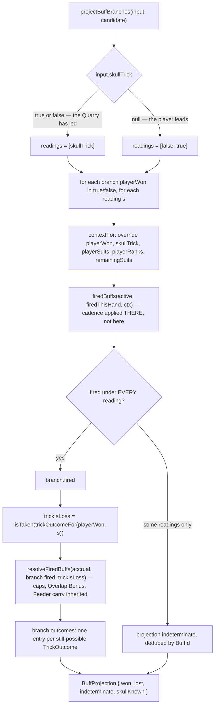

# Plan: Two-branch buff projection — what would fire if you play THIS card, take it or not

Plan folder: `.claude/contract/DLR-152-two-branch-buff-projection/`
Execution status: see `tasks.md` in this folder.

---

## Part 1 — Alignment

### Task reference

**DLR-152** — _Two-branch buff projection: what would fire if you play THIS card, take it or not_
(Story, parent epic DLR-147, label `engine`, moved `To Do → Planning` at the start of this run).

Acceptance criteria, verbatim from the ticket:

1. A projection function exists that, given the active buffs, `firedThisHand`, the real per-trick facts, and one candidate card, returns **both branches** — `playerWon: true` and `playerWon: false` — each carrying the buffs that fire and the resulting bonus.
2. It computes those branches by calling `firedBuffs` and `resolveFiredBuffs`. **A test asserts equivalence with real resolution**: for a synthesised context, the projected branch's fired set and bonus equal what the resolution path produces for the same context. This is the ticket's central guarantee — a projection that merely happens to agree today is not enough.
3. Overlap is `overlapBonusFor(firedCount)` **computed per branch**, never across the union of both. A Taker and a Feeder on the same suit must never both count toward one Overlap Bonus.
4. The projected multiplier respects the same per-hand cap the live accrual respects. A projection that exceeds the cap is a defect, and there is a test that pushes past it.
5. Cadence is honoured for free by going through `firedBuffs`: `Activated` never fires, `Threshold` and `Terminal` respect `firedThisHand`. Asserted, not assumed.
6. Buffs whose branch cannot be decided — today only `sidestep`, and only when the player leads — are returned in a distinct `indeterminate` set rather than being placed in a branch. A test covers lead vs follow.
7. A `reach` helper reports, for one buff, **how many cards currently in hand could fire it**, counting only cards that are legal to play this trick. An illegal card must not be counted: it cannot be played, so no buff can fire on it.
8. Everything added is pure, side-effect free, takes plain values rather than `RoundState`, and is unit tested. No React, no DOM, no `any` without a stated reason.
9. `npm run typecheck`, `npm run lint`, `npm run format:check` and the full `npm test` pass.

Scope boundaries, dependencies and risks are as the ticket states them and are reproduced under _In scope_ / _Explicitly out of scope_ below.

Reasoning record cited, not restated: `.claude/contract/DLR-147-full-ui-pass/update-log.md` → _The readout scores the trick TWICE, and this was a correctness fix rather than a flourish_, and `.claude/contract/DLR-147-full-ui-pass/buff-resolution-and-lifetimes.md` §3 (_What happens when the trick resolves_) and §5 (_What DLR-150 changes_).

### Restated goal

Add one pure module that answers, for a single candidate card in the player's hand, "which activated buffs would fire and what would they pay — if the player takes this trick, and if the player does not" — and answers it by calling the **same** `firedBuffs` and `resolveFiredBuffs` the real trick resolution calls, so a preview can never disagree with the commit. Where the answer genuinely is not knowable because the Quarry's card is face down, the module reports the indeterminacy instead of guessing it. It also exposes a `reach` count — how many of the cards the player may legally play this trick could fire a given buff. Nothing visible changes; the whole ticket is verified by Vitest, and its only consumer is the activation-UI ticket that follows.

### In scope

- A new pure module `src/warCouncil/buffProjection.ts` holding the two-branch projection and the `reach` count.
- Widening `src/warCouncil/buffTrickFacts.ts` to export its `Suit → BuffTargetSuit` map as a named function, so the projection reuses the single existing statement of that crossing rather than making a second one.
- Re-exporting the new module's public surface from `src/warCouncil/index.ts`, matching how `buffTrickFactsFor` is already exported.
- Vitest coverage under `src/warCouncil/__tests__/buffProjection.test.ts`, including the AC2 equivalence test against the real `resolveTrickBuffs` path, the AC4 cap test, the AC5 cadence assertions, the AC6 lead-vs-follow test, and the AC7 illegal-card exclusion.

### Explicitly out of scope

- Every pixel. Nothing in `src/app/` changes in this ticket, and no component consumes the new module yet.
- Changing what any buff does, when it fires, what it pays, or the Overlap Bonus rule.
- Restoring any of the eight cut condition families or the two cut reward axes. They keep their `buffFires` cases and their `BUFF_CADENCE` rows and remain unconstructible; the projection neither special-cases them nor removes them.
- The Feeder carry (DLR-150) as a _design_ question. DLR-150 has already landed on this branch (commit `7be51cf`), so the projection follows it rather than anticipating it — see the audit below, which corrects the ticket's two-argument description of `resolveFiredBuffs`.
- A convenience "gain since the incoming accrual" delta on the projection result. The UI can subtract two accruals itself; adding a second arithmetic surface here would be the very duplication this ticket exists to prevent. Flagged under Risks so the UI ticket knows it is deliberate.
- Any change to `legalMoves` or to `RoundState`. The projection is handed the already-legal card list; it does not compute legality.

### Pattern Reference

Supplied by the brief, and authoritative:

- `src/hunt/buffEvaluation.ts` — `BuffTrickContext`, `buffFires`, `firedBuffs`, `resolveTrickBuffs`.
- `src/hunt/buffAccrual.ts` — `resolveFiredBuffs`, `overlapBonusFor`, `accrualCapFor`, `BuffBonusAccrual`.
- `src/warCouncil/buffTrickFacts.ts` — `buffTrickFactsFor` and its private `TARGET_SUIT` map.

Chosen here, because the brief supplied no shape precedent:

- `src/app/warCouncil/cardDamage.ts` — the closest existing thing in the codebase and the direct model for this module's shape. It is already a two-branch preview (`win` / `lose`), it already refuses to do its own arithmetic and instead threads a hypothetical `TrickFacts` through the real fold, and it already carries an `exact` flag whose docblock says precisely what this ticket's §"The one genuinely undecidable field" says: _"`false` while the player leads — the Quarry's face-down card may carry a skull, which inverts the win branch."_ The new module is the buff-side sibling of that file, differing only in being pure (`src/warCouncil/`, not `src/app/`).
- `.claude/skills/react-frontend/SKILL.md` for conventions; not restated here.

### Constraints flagged on the brief

- **Do not add a second `switch` over `BuffConditionKind`.** `buffFires` is deliberately total so a twelfth family fails to compile there; a parallel table in the projection would silently never fire a new family.
- **`playerSuits` and `playerRanks` are plural.** A single candidate card means single-element arrays; do not assume the type is scalar.
- **Pure, side-effect free, plain values, never a `RoundState`.** `src/warCouncil/**` is already under the lint-enforced pure-core boundary (`eslint.config.js`) — no React import, no DOM global.
- **No `any` without a stated reason.**
- The eight cut condition families still have live `buffFires` cases and `BUFF_CADENCE` rows and must not be special-cased.
- Blocks the activation-UI ticket; nothing blocks this.

### Assumptions made

- **Module home is `src/warCouncil/buffProjection.ts`.** The ticket left the exact home to the plan. It cannot live in `src/hunt/` because it needs `Card` and the `Suit → BuffTargetSuit` crossing, and `src/hunt/` deliberately cannot see `warCouncil` types. It should not live in `src/app/warCouncil/` because AC8 requires purity and `src/app/**` is not under the pure-core lint boundary. `src/warCouncil/`, beside `buffTrickFacts.ts`, is the only home that satisfies both.
- **Branch results are keyed on still-possible `TrickOutcome`, not on a single guessed skull reading.** Each branch returns `outcomes: readonly BuffBranchOutcome[]` — one entry when the skull is known, two while the player leads. This is what lets the module honour AC6's "report it, do not guess it" for the _accrual_ as well as the fired set; see the Feeder finding under Risks.
- **`indeterminate` is derived by comparison, not by naming `sidestep`.** The module evaluates each branch under every still-possible skull reading and diffs the fired sets; a buff that fires under some readings but not all lands in `indeterminate`. This satisfies AC6 without a second `switch` and without a hard-coded family name, so a future skull-reading family is handled by construction. The ticket's "today only `sidestep`" becomes a test assertion rather than an implementation constant.
- **The projection overrides exactly the five context fields a candidate card and a branch determine** — `playerWon`, `skullTrick`, `playerSuits`, `playerRanks`, and `remainingSuits`. The ticket named the first three; `skullTrick` is the field its own §"The one genuinely undecidable field" is about, and `remainingSuits` is derived because the candidate card leaves the hand, which is exactly what `buffTrickFactsFor` already does with `remainingHand`. Everything else is supplied by the caller as `BuffProjectionFacts`.
- **`playerHit` and `bankAfterTrick` are caller-supplied and NOT branch-derived.** Both are genuinely branch-dependent in the real game, and only two cut families read them (`unbloodied` via `tricksWithoutHit`, `hoarder`). Deriving them would mean restating the outcome→damage and outcome→bank-climb rules that `bank.ts` owns, which is the duplication this ticket exists to prevent. Recorded here so a ticket restoring Hoarder or Unbloodied knows this is the line to revisit. Raised in Risks.
- **Branch field names are `won` and `lost`, each carrying an explicit `playerWon: boolean`.** `taken` is unavailable: `bank.ts`'s `isTaken` is the _outcome_ axis, where a Dodge counts as taken, so a `taken` branch name here would mean the opposite of the neighbouring helper. Docblocks state the mechanical axis explicitly per `CLAUDE.md`'s win/lose warning.
- **`reach` is implemented on top of the projection, not beside it.** One candidate card at a time through the same code path, counting a card when the buff appears in either branch's fired set or in `indeterminate` — "could fire" includes "might fire". No second predicate.
- **`reach` takes the already-legal card list.** AC7's legality gate is satisfied by the parameter being named and documented `legalCards`, populated by the caller from the existing `legalMoves(state, PlayerSide.Player, options)`. Calling `legalMoves` inside the module would require a `RoundState`, which AC8 forbids. The AC7 test therefore asserts that a card absent from `legalCards` is not counted even when it would fire the buff.
- **Test file is `src/warCouncil/__tests__/buffProjection.test.ts`** — a `.test.ts`, so it is collected by the `node` Vitest project (`vite.config.ts`), needs no DOM, and stays inside the pure boundary.

### Config and persisted-shape audit

- **No configuration key is added, renamed, retyped, or removed.** The module reads the existing caps only indirectly, through `resolveFiredBuffs` → `accrueAxisBonus` → `accrualCapFor` → `apConfig.ts`'s `MAX_*_PER_HAND`. No literal that configuration owns is introduced.
- **Nothing is persisted.** No `src/persistence/` file is touched and no storage key is composed. `.claude/rules/save-data-versioning.md` was read and none of its six reject conditions is reachable from this design.
- **No existing type changes shape**, so Step 1.6 check 7's construction-site count applies only to the shapes this plan _consumes_. `BuffTrickContext`: **10 annotated sites** across 3 files (`src/hunt/buffEvaluation.ts`, `src/hunt/index.ts`, `src/hunt/__tests__/buffEvaluation.test.ts`); construction sites counted by distinctive required field — `applyDamagePressed` returns **17 hits** and `tricksWithoutHit:` returns **16 hits**, both spanning `src/hunt/`, `src/warCouncil/`, `src/app/warCouncil/` and their specs. The larger figure, 17, is the real one, and it is a figure the plan does **not** need to change: every one of those sites builds a context for its own caller and none of them changes shape here. The new module adds construction sites; it removes none.
- **`resolveFiredBuffs` takes THREE arguments, not two.** The ticket's approach section describes `resolveFiredBuffs(accrual, fired)`; DLR-150 (`7be51cf`, already on this branch) added a third parameter, `trickIsLoss: boolean`. Grep: **15 hits** across `src/hunt/buffAccrual.ts` (the definition at line 173), `src/hunt/buffEvaluation.ts` (an import, a docblock mention, and the one production call site at line 172), `src/hunt/index.ts` (the re-export at line 146) and two specs (`buffAccrual.test.ts`, `buffCarry.test.ts`) holding **7 call sites** between them. The projection must therefore supply `trickIsLoss` per branch, and it derives it exactly as `bank.ts` does — `!isTaken(trickOutcomeFor(playerWon, skullTrick))` — never by restating the skull inversion. This is the single largest correction to the ticket's stated approach and it drives the `outcomes[]` shape.
- **`firedBuffs` has 1 definition, 1 production call site, 1 re-export and 5 spec call sites** (`src/hunt/buffEvaluation.ts:108` and `:170`; `src/hunt/index.ts:159`; five in `buffEvaluation.test.ts`). None changes; the projection adds a new caller.
- **`TARGET_SUIT` is module-private today** — a word-bounded grep across `src/**` returns **4 hits, all inside `src/warCouncil/buffTrickFacts.ts`** (a docblock reference at line 14, the declaration at line 17, and two uses at lines 50 and 52). The plan converts those two uses to a new exported `targetSuitOf(suit)` in the same file, keeping the map itself private and the crossing stated exactly once. `buffTrickFactsFor` has **14 hits** across `src/app/warCouncil/cardDamage.ts`, `src/warCouncil/playCard.ts`, `src/warCouncil/index.ts` and `buffTrickFacts.test.ts` (7 of those 14 are in the spec); none of them changes, because its signature and behaviour are untouched.
- **Names align across the chain.** A single alternation grep for every new identifier — `buffProjection`, `projectBuffBranches`, `buffReach`, `targetSuitOf`, `BuffProjection`, `BuffBranchProjection`, `BuffBranchOutcome` (which also covers `BuffProjectionInput` and `BuffProjectionFacts` by prefix) — across `src/**/*.ts` and `src/**/*.tsx` returns **0 hits**, so nothing is shadowed and no existing reader needs to change.
- **The pure-core boundary is not crossed.** `src/warCouncil/**` is already covered by `eslint.config.js`'s pure-core override (no `react`/`react-dom` import, no DOM global). The design imports only `../hunt`, `./bank`, `./buffTrickFacts`, `./cardUtils` and `./types`, and touches no global. No lint rule needs relaxing.

---

## Part 2 — Technical design

### Approach

The module is a **thin adapter, not a calculator**. Its whole correctness argument is that it performs no condition evaluation and no accrual arithmetic of its own: it builds a `BuffTrickContext` from plain values, hands it to `firedBuffs`, hands the result to `resolveFiredBuffs`, and returns what comes back. Every rule the ticket lists as inherited — cadence (`Activated` never fires, `Threshold`/`Terminal` respect `firedThisHand`), the per-axis caps, the Overlap Bonus, and DLR-150's Feeder carry split — is inherited because those functions apply them, not because this module reproduces them. That is the same discipline `cardDamage.ts` already uses on the damage side, and the same reason the mockup's hand-rolled `BRANCH` table was wrong.

The one structural decision is **how many contexts a projection has to evaluate**. The ticket frames the undecidable field as affecting only which buffs fire, and names `sidestep` as the only casualty. The audit found a second, larger consequence that DLR-150 introduced after the ticket was written: `resolveFiredBuffs` now takes `trickIsLoss`, derived from the _outcome_ axis, and on the `playerWon: false` branch the outcome is a **Dodge** if the trick is skulled and a **Clean Loss** if it is not. A Feeder fires identically in both — its predicate has no skull term — but its reward is **payable this hand** on a Dodge and **carried to the next hand** on a Clean Loss. So on a lead, a determinate fired set can still have an indeterminate destination. Guessing one reading would print a number that is right about the amount and wrong about when the player can spend it, which is exactly the class of lie this ticket exists to stop.

The design therefore evaluates each branch once **per still-possible trick outcome** rather than once per branch. Concretely: `skullTrick` enters as `boolean | null`, `null` meaning the player leads. The readings to evaluate are `[skullTrick]` when it is known and `[false, true]` when it is not. For each reading the module builds a context, calls `firedBuffs`, and calls `resolveFiredBuffs` with `!isTaken(trickOutcomeFor(playerWon, reading))`. A buff that fires under _every_ reading is in that branch's `fired` set; a buff that fires under some but not all readings is lifted out into the projection's single `indeterminate` set, deduplicated by `BuffId` across both branches. Each branch then returns `outcomes` — one `{ outcome, accrual }` entry per still-possible `TrickOutcome`, so a follow gives one entry and a lead gives two. `indeterminate` falls out of a set difference rather than out of a name check, which is what keeps the "no second switch" constraint honest: nothing in this module knows that `sidestep` is the family this affects, and a future skull-reading family is handled without an edit here.

Everything lives in one pure module, `src/warCouncil/buffProjection.ts`, with no component and no hook, because there is nothing here that needs a renderer — the entire ticket is function-in, value-out. The only shared-state concern is the `Suit → BuffTargetSuit` crossing, which `buffTrickFacts.ts` already owns privately; that file gains an exported `targetSuitOf(suit)` and uses it itself, so there remains exactly one statement of the map. `reach` (AC7) is a second exported function in the same file that loops the caller-supplied `legalCards`, runs the same projection per card, and counts a card when the buff appears in either branch's `fired` or in `indeterminate` — "could fire" deliberately includes "might fire", since a reach count that dropped a possible Sidestep would understate the buff for exactly the player who most needs the number.

### Skills to invoke during execution

- `react-frontend` — owns everything under `src/`: strict TypeScript, the preference for pure unit-testable modules over logic inside a component, the file-order convention, the 400-line budget, and the Vitest posture (pure logic tested with no renderer, specs under `src/**/__tests__/`). Developer confirmed this skill and only this skill at the Step 1.5c gate; `game-designer` was offered and declined, correctly — the indeterminate-branch wording is a UI-ticket question, not an engine one.

Rules and references the executor must Read: `.claude/workflow/web-project.md` (paths, runners, and the `Select-String` recursion and `Measure-Object` traps). `.claude/rules/save-data-versioning.md` was scanned during planning and does not apply — nothing here persists — so the executor need not read it.

### Diagram



### Data shapes

#### New module: `src/warCouncil/buffProjection.ts`

```ts
import type { Buff, BuffBonusAccrual, BuffId, BuffTrickContext } from '../hunt'
import { firedBuffs, resolveFiredBuffs } from '../hunt'
import { isTaken, trickOutcomeFor, type TrickOutcome } from './bank'
import { targetSuitOf } from './buffTrickFacts'
import { sameCard } from './cardUtils'
import type { Card } from './types'

/** `BuffTrickContext` minus the five fields a candidate card and a branch decide. The caller
 *  supplies the rest as plain values — never a `RoundState`. */
export type BuffProjectionFacts = Omit<
  BuffTrickContext,
  'playerWon' | 'skullTrick' | 'playerSuits' | 'playerRanks' | 'remainingSuits'
>

export interface BuffProjectionInput {
  /** The buffs activated for this trick — already filtered through `activatableBuffs`. */
  readonly active: readonly Buff[]
  /** Ids of once-per-hand families that have already fired this hand. */
  readonly firedThisHand: readonly BuffId[]
  /** The hand's running accrual, before this trick. */
  readonly accrual: BuffBonusAccrual
  readonly facts: BuffProjectionFacts
  /** `true`/`false` once the Quarry's card is on the table; `null` while the PLAYER LEADS and
   *  the Quarry's card is face down. `null` is not "no skull" — it is "not knowable". */
  readonly skullTrick: boolean | null
  /** The player's hand INCLUDING the candidate card. `remainingSuits` is derived from it. */
  readonly hand: readonly Card[]
}

/** One still-possible resolution of a branch. */
export interface BuffBranchOutcome {
  readonly outcome: TrickOutcome
  /** The accrual AFTER this branch's fired buffs resolve — caps, Overlap Bonus and DLR-150's
   *  Feeder carry all applied by `resolveFiredBuffs`, never restated here. */
  readonly accrual: BuffBonusAccrual
}

export interface BuffBranchProjection {
  /** The MECHANICAL axis — the player physically took the cards, before the skull inverts what
   *  that is worth. This is the axis every buff condition reads. */
  readonly playerWon: boolean
  /** Buffs that fire on this branch under EVERY still-possible skull reading. */
  readonly fired: readonly Buff[]
  /** One entry per still-possible `TrickOutcome`: exactly one when the skull is known, two while
   *  the player leads. Never empty. */
  readonly outcomes: readonly BuffBranchOutcome[]
}

export interface BuffProjection {
  readonly won: BuffBranchProjection
  readonly lost: BuffBranchProjection
  /** Buffs that fire under some still-possible skull reading but not all — today only
   *  `sidestep`, and only on a lead, but DERIVED by comparison, never by naming a family. */
  readonly indeterminate: readonly Buff[]
  /** `false` while the player leads. Mirrors `CardDamagePreview.exact`. */
  readonly skullKnown: boolean
}

export function projectBuffBranches(input: BuffProjectionInput, candidate: Card): BuffProjection

/** AC7 — how many of `legalCards` could fire `buff` this trick. "Could" includes "might":
 *  a buff that lands in `indeterminate` for a card still counts that card. `legalCards` is the
 *  caller's `legalMoves(state, PlayerSide.Player, options)` output; an illegal card is not
 *  counted because it is not in the list. */
export function buffReach(
  input: BuffProjectionInput,
  legalCards: readonly Card[],
  buff: Buff,
): number
```

#### Modified: `src/warCouncil/buffTrickFacts.ts`

```ts
/** The `Suit → BuffTargetSuit` crossing, as a function so a second module can reuse the ONE
 *  statement of it. The map itself stays private and stays total, so a member added to `Suit`
 *  still fails to compile here. */
export function targetSuitOf(suit: Suit): BuffTargetSuit
```

`buffTrickFactsFor`'s signature and behaviour are unchanged; its two `TARGET_SUIT[…]` lookups become `targetSuitOf(…)` calls.

#### Modified: `src/warCouncil/index.ts`

```ts
export { buffTrickFactsFor, targetSuitOf } from './buffTrickFacts'
export { buffReach, projectBuffBranches } from './buffProjection'
export type {
  BuffBranchOutcome,
  BuffBranchProjection,
  BuffProjection,
  BuffProjectionFacts,
  BuffProjectionInput,
} from './buffProjection'
```

#### No other contract changes

No configuration key, no `package.json` change, no dependency, no persisted shape, no reducer action, no component props. `src/hunt/index.ts` already re-exports everything the new module imports (`firedBuffs`, `resolveFiredBuffs`, `BuffTrickContext`, `Buff`, `BuffId`, `BuffBonusAccrual`) — the ticket's "any minimal export widening in `src/hunt/index.ts`" turns out to be unnecessary, and the plan does not touch that file.

### Runtime quality notes

- **Purity and adjudication:** The whole ticket is a pure module under `src/warCouncil/**`, already covered by `eslint.config.js`'s pure-core override — no React import, no DOM global, no `RoundState`. It decides nothing it should only ask about: cadence, the caps, the Overlap Bonus and the Feeder carry are all applied by `firedBuffs`/`resolveFiredBuffs`, and the skull inversion is read from `bank.ts`'s `trickOutcomeFor`/`isTaken` rather than restated. No tunable is introduced, so none can be hard-coded.
- **Effects, mount and teardown:** Not applicable — no component, no hook, no effect, no listener, observer, timer or `requestAnimationFrame`. There is no module-level mutable state: the only module-scope binding is a `readonly` two-element readings constant, frozen by `as const` and never written.
- **Hot-path cost:** This runs on hover or selection of a hand card, not per pointer move. Worst case per call is 2 branches × 2 readings × `active.length` predicate evaluations — `active` is bounded by the activation stock, and `buffFires` is a switch over plain values with no allocation beyond the context object. `buffReach` multiplies that by `legalCards.length`, bounded by the hand (`HAND_SIZE`). No memoisation is added and none is justified without profiling.
- **Determinism and numeric safety:** No `Math.random()` is reachable — `buffFires` and `resolveFiredBuffs` are both total functions of their inputs, and the projection adds no randomness or time source. No division is introduced anywhere in the module, so no `NaN` can be minted; the only arithmetic is `resolveFiredBuffs`'s existing `Math.min` clamping and `overlapBonusFor`'s `Math.max(0, n - 1)`. No epsilon is needed because every value compared is an integer or an id.
- **Error paths:** The module never throws and never swallows. The one throw reachable through it is `accrueCarry`'s existing `RangeError` for a non-carrying axis, which is unreachable from a mintable template (only Momentum and Blade carry) and is deliberately left to propagate rather than be caught into a plausible zero — catching it here would be the "swallow a failure into a success shape" this project bans. There is no async surface, so the four async states do not apply. A buff that does not fire is not an error state: `buff-resolution-and-lifetimes.md` §4 calls it a legitimate player mistake, and it is represented as absence from `fired`, never as a failure.

### Risks and judgement calls

- **The ticket's stated approach is one argument out of date, and the correction changes the return shape.** `resolveFiredBuffs` gained `trickIsLoss` in DLR-150. The consequence is the `outcomes[]` array rather than a single accrual per branch: on a lead, the `playerWon: false` branch is a Dodge under a skull and a Clean Loss without one, and a fired Feeder's reward is payable this hand in the first case and carried to the next hand in the second. Confirm you want the projection to report both outcomes rather than pick the clean reading — this is the one place the design departs from the ticket's literal wording, and it departs in the direction the ticket's own "report it, do not guess it" principle points.
- **`playerHit` and `bankAfterTrick` are passed in, not branch-derived.** Both genuinely differ between branches in the real game, and deriving them would mean restating rules `bank.ts` owns. Only cut families read them (Unbloodied via `tricksWithoutHit`, Hoarder), so no live template is affected today. If either family is ever restored, this is the line that must be revisited — and it is recorded here rather than left as a surprise.
- **`indeterminate` is derived by set difference, not by naming `sidestep`.** This is stronger than the AC asks for and costs one extra pass when the player leads. The trade is that the module contains no knowledge of _which_ family reads the skull, so it cannot fall out of step with `buffFires`. If you would rather see the family named explicitly for legibility, say so — it would be a smaller file and a weaker guarantee.
- **Branch names `won` / `lost` rather than `taken` / `notTaken`.** `taken` is already spoken for by `bank.ts`'s `isTaken`, where a Dodge counts as taken — the opposite of the mechanical reading a branch name would imply here. Every branch also carries an explicit `playerWon: boolean` and a docblock naming the axis. Sanity-check the naming: `CLAUDE.md` warns that this is the single most common source of wrong statements about the game.
- **No `gain` delta is exposed.** The UI ticket will want "what does this add", which is `outcome.accrual` minus `input.accrual` per axis. Deliberately left to the consumer so this module keeps exactly one arithmetic surface. If you would rather it ship here, it is a small addition — but it should be a decision, not a drift.
- **`reach` counts a card whose buff is indeterminate.** A Sidestep's reach on a lead therefore counts every legal card rather than none. The alternative — counting only certain fires — would report a reach of 0 for a buff that may well pay, which reads as "this buff is dead" at exactly the moment the player is deciding whether to activate it. Flagged because it is a judgement about what the number _means_, and the UI ticket will word it.
- **No tuning value is introduced by this ticket**, and none is left unchosen. The caps, the Overlap Bonus slope and the cadence table are all existing configuration read through existing code.
- **Nothing here can be judged by playing.** There is no visible surface, so there is no developer observation to schedule; the whole ticket is verified by Vitest, `typecheck`, `lint` and `format:check`. This is the correct outcome for a pure-engine ticket, not a shortfall in verification.
