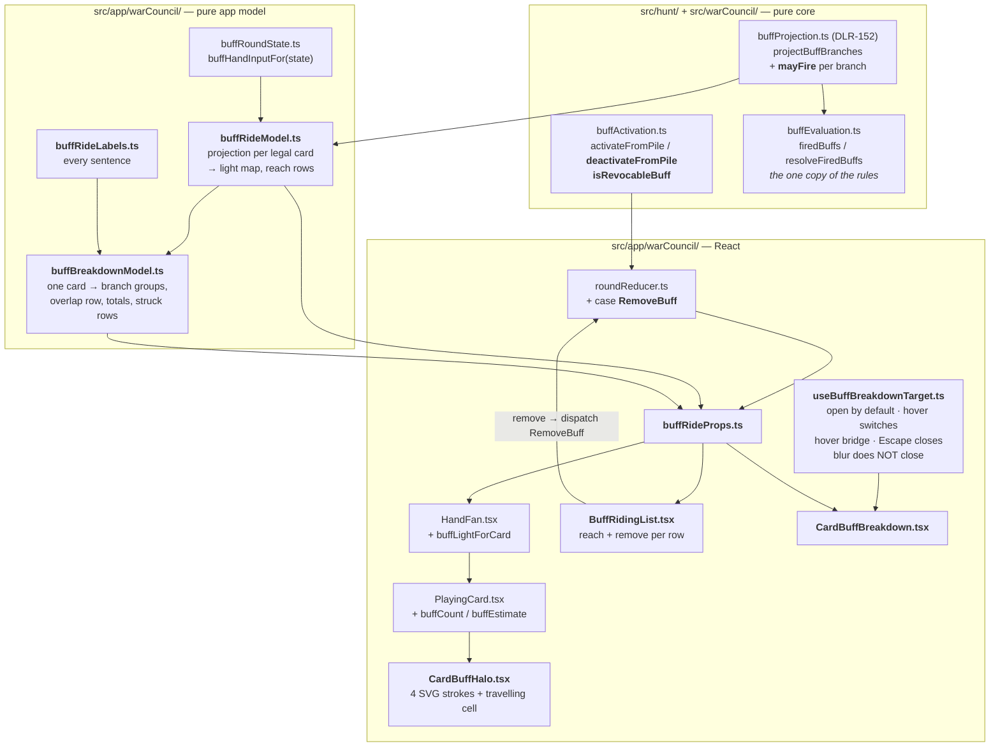

# Plan: Activate buffs for the trick — every card they can fire on lights up, with a live per-card breakdown

Plan folder: `.claude/contract/DLR-153-activate-buffs-for-the-trick/`
Execution status: see `tasks.md` in this folder.

---

## Part 1 — Alignment

### Task reference

**Jira:** `DLR-153` — *"Activate buffs for the trick: every card they can fire on lights up, with a live per-card breakdown"* (Story, High, labels `playable` + `ui`, child of epic `DLR-147`). The ticket description is the spec and is not restated here; it is read alongside three files it names, all of which were read for this plan:

- `.claude/contract/DLR-147-full-ui-pass/update-log.md` — its four **CORRECTION** sections, in file order.
- `.claude/contract/DLR-147-full-ui-pass/buff-resolution-and-lifetimes.md` §2 (the activation gate) and §3 (what happens at resolution).
- `mockup-buff-loading.html` and `mockup-buff-gallery.html` — **driven in Chrome**, not read as source, on 2026-08-27. Activation, the lit hand, the badge, the riding list, the struck-through group, the two branch groups and the two totals rows were all exercised live.

**Acceptance criteria** (verbatim from the ticket, numbered as it numbers them):

1. Activating a buff takes **one tap and no target**. There is no card-selection step, and no refusal message about choosing a card.
2. Activating a buff lights **every legal-to-play card in hand that it could fire on**, and no others. A suit-gated buff lights only its suit; a suitless one lights all. Asserted, not eyeballed.
3. An **illegal** card never lights and is never counted in any reach figure.
4. Each lit card's intensity and badge count come from DLR-152's projection — the higher of its two branches. **The UI does not re-derive which buffs fire.**
5. Every lit card carries all three signals: halo, travelling cell, and a **numeral badge**. A greyscale screenshot distinguishes a 1-buff card from a 3-buff card. Take the screenshot.
6. Under `prefers-reduced-motion` the cell stops and becomes a continuous rail; halo and badge are unaffected. Asserted by forcing the media rule, not assumed from the CSS.
7. The travelling cell's lap time never drops below **0.9s** at any count.
8. Hand cards rest at half the hover lift, and the rest → hover → armed ladder is monotonic and derived from one token. Assert by reading the **resolved transform**, not by parsing a custom property.
9. A "riding this trick" list shows every activated buff with its **reach** figure, states the zero-reach case explicitly, and carries a remove control per row.
10. Removing a buff returns it to the pile, re-lights the hand, and says what went dark.
11. The per-card breakdown shows **both branches, neither emphasised**, with the Overlap Bonus as its own row, and each condition row naming its buff.
12. Buffs that cannot fire on the focused card appear **struck through**, stating both the reason and where that buff is live instead.
13. The breakdown is **visible without any interaction** once a buff is riding, stays visible when the pointer leaves a card, switches target on hovering another, and is fully expanded by default.
14. Every control inside the breakdown and the riding list is reachable: the hover bridge holds the panel open across the gap, and on touch (no hover at all) the panel is reachable by tapping a card. Verified on an emulated touch viewport.
15. **Every interactive control clears the 44px touch floor, measured against its true hit area** including any pseudo-element expander, **and no two hit areas overlap**. Assert by computing each control's hit rectangle and testing all pairs.
16. No page scroll and no horizontal scroll at 1440x900, 1280x720 and an emulated ~430px touch viewport. Name the sizes in the summary. `overflow: hidden` turns an overflow into a silent clip, so **a no-scroll assertion is not a no-overflow assertion** — assert the panel's box against its container.
17. The panel never occludes the felt's game rail — the decree, the trick, or the spent pile. Test **rectangle intersection on all four edges**.
18. Keyboard: the hand is one roving-tabindex group (arrows, `Home`/`End`, `Enter`/`Space`, `Escape` unwinds), and the breakdown's controls are reachable by tab without the panel closing. Covered by a component test.
19. Text on the totals row and the badge meets 4.5:1 **on the ground it actually sits on**.
20. `npm run typecheck`, `npm run lint`, `npm run format:check` and `npm test` pass.

**Interactive follow-up, 2026-08-27:** the developer confirmed the skill list for this contract — `react-frontend`, `game-ux`, `game-designer` — during Step 1.5c. No other decision has been taken interactively; everything else the developer owns is listed under *Risks and judgement calls* and carried into `tasks.md`'s **Developer decides or observes** block.

### Restated goal

Activating a buff currently deletes a card from the pile and changes nothing else on screen: nine of the sixteen live templates are gated on the suit of the card you end up playing, and the UI never says which of your cards that is. This ticket makes activation legible. One tap puts a buff on the trick with no target; every legal-to-play card in the hand it could fire on lights up with three independent signals (a halo that gains energy, a single bright cell travelling the card's perimeter that gains speed, and a numeral badge that survives greyscale and reduced motion); a "riding this trick" list names each activated buff, says how many of your cards it reaches, states the zero-reach case out loud, and lets you take it back off; and a per-card breakdown — open by default, switched by hover, held open by a hover bridge — reads bottom-up from the two branch totals through the Overlap Bonus and the grouped condition rows to the struck-through rows naming what you give up by playing this card. Every figure on that surface comes from DLR-152's `projectBuffBranches`; the view layer derives no firing rule of its own.

### In scope

- Removing the card-selection step from activation entirely — one tap, no target, no "choose a card first" refusal (AC1).
- Per-card lit state on hand cards: halo, travelling SVG cell, numeral badge; lit only for legal-to-play cards a riding buff could fire on (AC2, AC3, AC5, AC6, AC7).
- The lift ladder: `--wc-lift-rest` derived as half `--wc-lift-hover`, with `--wc-lift-armed` above both (AC8).
- The "riding this trick" list — one row per activated buff, its reach figure, the explicit zero-reach wording, and a per-row remove control (AC9).
- Un-activating a buff: a new engine transition that returns the card to the pile, refunds its action-point cost, clears it from this trick's activations, and re-lights the hand (AC10).
- The per-card breakdown panel: two branch totals with neither emphasised, the Overlap Bonus as its own row, condition rows naming their buff, struck-through "cannot fire here" rows with both clauses, open-by-default, hover-switching, hover-bridged, keyboard-reachable (AC11, AC12, AC13, AC14, AC18).
- Consuming DLR-152's `projectBuffBranches` / `buffReach` through one pure app-layer model, plus one additive change to `buffProjection.ts` so a branch keeps its own "may fire" set (see *Assumptions made*).
- Touch-floor, no-scroll, no-occlusion and contrast verification at the three named viewports (AC15, AC16, AC17, AC19).
- The four static gates (AC20).

### Explicitly out of scope

- **The Timebomb's targeting flow and the primed-card mark.** The ticket names this as a separate, blocked ticket. This contract does not add, move or restyle `wc-primed-mark`, and does not touch `timebombArmed` behaviour.
- **The buff gallery's own card design, grid, runs, tabs and fence** — DLR-148's, already landed. `BuffCard.tsx`, `BuffRunTab.tsx`, `BuffTierFilter.tsx`, `buffGalleryModel.ts` and `warCouncilBuffCard.css` are untouched.
- **The skull face and the trick consequence readout** — DLR-148's.
- **Changing what any buff does, pays, or when it fires.** No edit to `buffEvaluation.ts`, `buffAccrual.ts`, `buffTemplates.ts`, `buffCosts.ts`, or `bank.ts`.
- **Moving the activation window.** `buffActivationWindowOpen` is read, not changed — see *Risks* bullet 1.
- **The Feeder carry** — DLR-150's, already landed; the breakdown reads the carry through `BuffBranchOutcome.accrual` and adds no arithmetic of its own.
- **Every colour, size bound, slope, delay and glyph** — placeholders, listed in `update-log.md` → *Placeholders*, the developer's to choose. Two figures are *not* placeholders and are treated as constraints: the 4.5:1 contrast floor and the 0.9s lap-time floor.
- Restoring any cut buff family, reward axis or consumable.

### Pattern Reference

Supplied by the brief:

- `mockup-buff-loading.html` — the model in isolation; and `mockup-buff-gallery.html` — the same design folded into the full screen. **Re-authored under `react-frontend`, never ported**: the mockups' CSS is co-located and hand-rolled by design.
- `.claude/contract/DLR-147-full-ui-pass/update-log.md` — the reasoning record and the five CARRY traps the ticket restates.
- `.claude/contract/DLR-147-full-ui-pass/buff-resolution-and-lifetimes.md` §2 — the activation gate, and its inverted-fence CARRY note.
- `src/warCouncil/buffProjection.ts` (DLR-152) — the projection this surface consumes, plus `.docs/implementation/war-council/buff-projection.md`.

Chosen by this plan, and named because the brief left them open:

- `src/app/warCouncil/cardDamage.ts` — the ticket names DLR-152 as the buff-side sibling of this file; this plan makes the app-layer adapter (`buffRideModel.ts`) mirror its shape too, including its "compute nothing, delegate everything, name the one thing you cannot know" discipline.
- `src/app/warCouncil/buffGalleryModel.ts` + `BuffGallery.tsx` — the established "pure model builds the view value, component renders it and decides nothing" split for this exact area.
- `src/app/warCouncil/useCardTip.ts` and `useRovingTabIndex.ts` — the local precedents for a hover/focus hook with timer cleanup and for the hand's keyboard group.
- `src/app/warCouncil/roundControlsProps.ts` — the established place for prop assembly that would otherwise breach `WarCouncilRound.tsx`'s 400-line budget.

### Constraints flagged on the brief

- **No second copy of the firing rules in the view layer.** The DLR-147 mockup re-derived the predicates and reported +6 damage for a load whose ceiling was +4. Every figure on this surface comes from `projectBuffBranches`.
- **The 0.9s lap-time floor is a flash-safety limit, not a tuning value.** The slope above it is the developer's; the floor is not.
- **The 4.5:1 contrast floor**, re-measured on the ground each text actually sits on.
- **No `filter: blur()` anywhere near a card.** A per-card filter stalled Chrome's rasteriser badly enough to time out screenshots on this epic. The halo is stacked wide, soft, low-opacity SVG strokes plus a `box-shadow`.
- **No `mix-blend-mode` on a per-card overlay** — same reason, a compositing layer per card.
- **The travelling cell is an SVG stroke** on a rounded rect with `pathLength="1000"` and `vector-effect: non-scaling-stroke`, animated via `stroke-dashoffset`. Not a rotating `conic-gradient`.
- **Halo widths and opacities start non-zero and grow.** A stroke scaled purely by the count is invisible at one buff.
- **Three carriers, always.** Colour alone and motion alone are both forbidden by `game-ux`; the numeral badge is what survives greyscale and `prefers-reduced-motion`.
- **Neither branch is emphasised on the totals row.** The ruleset withholds the Quarry's card and a leaning readout would leak it.
- **Two runtime dependencies.** Nothing here adds a third.
- **`prefers-reduced-motion`** must be honoured, and asserted by forcing the media rule rather than read off the CSS.

### Assumptions made

1. **`buffProjection.ts` gains one additive field, `mayFire`, on `BuffBranchProjection`; nothing else in DLR-152 changes.** AC4 requires the badge count to be "the higher of its two branches", but the module currently merges each branch's indeterminate set into one projection-level `indeterminate` and discards the branch attribution — `branchFor` computes exactly the per-branch value and then throws it away. Without it the only alternatives are a view-layer re-derivation (forbidden by the ticket) or a badge that reads 0 on a lead with a Sidestep riding, which is the "this buff is dead" lie the reach figure exists to prevent. Moving that already-computed value onto the branch is the smallest change that keeps the rules in one place. `indeterminate` is unchanged and stays the deduped union. *Rationale: additive, no rule duplicated, one file, and DLR-152's own spec block still passes.*
2. **Un-activation is offered for the condition families only — Taker, Feeder, Sidestep.** Cheat, Timebomb, Ward and Shield arm felt state at the spend (`cheatTricksRemaining`, `timebombArmedDamage`, `activateShield`, `activateWard`), and reversing that is a second, larger rule change this ticket does not ask for. They still appear in the riding list — omitting them would make the list lie about what is riding — with a status line saying they have no condition to reach and are already spent, and no remove control. *Rationale: AC9 asks for a reach figure and a remove control per row; a card with no condition has no reach, and reversing an armed effect is out of scope.* Flagged in *Risks* bullet 2.
3. **A revoked card is appended to the end of the pile**, not reinserted at its old index. `offeredBuffs` preserves pile order deliberately ("the pile's order is the player's mental order"), and storing an index to restore would be a second piece of state whose only job is to survive one transition. *Rationale: the cheapest honest behaviour; the card is demonstrably back, and the gallery re-groups by run anyway.*
4. **`skullTrick` is computed per candidate card, not once for the trick.** A player's own skulled card makes the trick skulled regardless of what the Quarry plays, so the reading is knowable for that card even on a lead. The adapter passes `true` when the candidate itself is skulled, the visible-trick reading when the Quarry has already led, and `null` only when the player leads with an unskulled card. *Rationale: `cardDamage.ts` already reads the player's own skull state this way (`trickIsSkulled(skulledCards, visible)`); doing otherwise would report a certainty as a maybe.*
5. **A badge whose count includes a `mayFire` buff renders in the existing estimate form** — a leading `~` and an italic slant, the grammar `wc-card-damage.wc-is-estimate` already uses on this exact row. The number shown is the branch ceiling (`fired.length + mayFire.length`, higher branch wins). *Rationale: reuses an established form signal rather than inventing a second one, and marks a ceiling as a ceiling.*
6. **The riding list and the breakdown live in the hand zone, not inside the gallery.** `BuffGallery` replaces `FeltStage` inside `.wc-table` and disappears the moment the door closes, but the hand row renders unconditionally in `WarCouncilRound.tsx`. Anchoring both to the hand is what makes AC13's "visible without any interaction" survive closing the gallery. *Rationale: forced by the existing shell; also what both mockups show, with the hand at the bottom and the readout above it.*
7. **Hover/focus target state is component-local `useState`, not reducer state.** It dies with the hand row, is never read by a rule, and adding it to `RoundUiState` would put it in the debug mirror and in every seed fixture. *Rationale: the same call `BuffGallery` already makes for its tier filter.*
8. **The activation window is read, never moved.** `buffActivationWindowOpen` stays as it is — twelve of the sixteen live cards between tricks, Cheat alone mid-trick. See *Risks* bullet 1: `the-hunt.md` line 188 already settles this in the code's favour, and the mockups' fence is the thing that is inverted.
9. **AC1's "no refusal message about choosing a card" is satisfied by deletion, not rewording.** No such message exists in `src/` today — the mockup invented it. The plan asserts its absence rather than removing code.
10. **Activation stays two-tap (poise, then commit).** AC1 says "one tap and no target"; the *target* is what this ticket removes. The two-tap poise/commit is DLR-126's reversibility model, is what `BuffCard` already renders, and is out of scope to change. AC1 is read as "no target", and the plan says so here rather than silently narrowing it. Flagged in *Risks* bullet 3.
11. **New CSS lives in a new `warCouncilBuffRide.css`**, with only the lift-ladder tokens edited in place in `warCouncil.css`/`warCouncilCards.css`. *Rationale: `warCouncilCards.css` is at 373 of 400 lines; the halo, cell and badge blocks would breach it.*

### Config and persisted-shape audit

Run 2026-08-27 against the working tree on `Version-6-UX`.

- **Nothing this ticket touches is persisted.** `src/persistence/**` is not in the file map. The state this contract adds or changes — `BuffActivationState.activatedThisTrick`/`spentThisTrick`, `RoundUiState.loadout`, the new breakdown-target `useState` — all die at a trick or hand boundary and none of it reaches `saveKeyFor`. `Get-ChildItem src -Recurse -Include *.ts,*.tsx | Select-String "'strings-and-stations'"` returns hits only in `src/persistence/config.ts`, unchanged from the reading recorded in `.claude/rules/save-data-versioning.md`. No `SAVE_SCHEMA_VERSION` bump is needed and none is planned.
- **`BuffBranchProjection` (Assumption 1) — 5 annotated sites, 1 construction site.** Annotated: `buffProjection.ts:67` (the declaration), `:81` and `:82` (`BuffProjection.won`/`.lost`), `:147` (`branchFor`'s return type), and `src/warCouncil/index.ts:40` (the re-export). The single construction site is the object literal inside `branchFor` at `buffProjection.ts:150-169`. `Grep "outcomes:"` across `src/**` returns 3 hits, of which 2 are in `buffProjection.ts` (the declaration and that literal) and 1 is prose in `src/hunt/slotOdds.ts:26`. `src/warCouncil/__tests__/buffProjection.test.ts` reads projections, it never builds one. Adding a **required** `mayFire` therefore breaks exactly one literal, in the file being edited, and every reader is a `.fired`/`.outcomes` access that keeps compiling.
- **`PlayingCardProps` — 1 annotated site, 50 construction sites (42 of them in specs).** `<PlayingCard` appears in `AbilityPrompt.tsx` (3), `DecreePile.tsx` (1), `FeltRail.tsx` (1), `HandFan.tsx` (1), `TrickWell.tsx` (2), `__tests__/CardAbilityTip.test.tsx` (17) and `__tests__/PlayingCard.test.tsx` (25). The new props (`buffCount`, `buffEstimate`) are **optional with a documented default**, following the precedent every prop added to this component since DLR-90 has followed (`primed`, `discardSelected`, `describedBy` are all optional for exactly this reason), so 49 of the 50 sites are untouched and only `HandFan.tsx` passes one.
- **`HandFanProps` — 1 annotated site, 2 construction sites.** `<HandFan` appears in `WarCouncilRound.tsx:315` and in `__tests__/HandFan.test.tsx:23` (that file's `renderFan` helper). The new prop (`buffLightForCard`) is **required and deliberately not defaulted**, for the reason `damageForCard`'s own docblock gives — a defaulted stub is exactly how a readout silently stops reading out — so both sites change in the same task.
- **`RoundUiActionKind` — 12 members today, 176 references across `src/`, 12 `case` arms in `roundReducer.ts:96-118`.** Adding `RemoveBuff` widens the `as const` map, the derived union type, and `RoundUiAction`'s discriminated union, and adds a thirteenth `case`. `roundReducer.ts`'s switch is exhaustive over the union, so a missing arm fails `tsc` rather than falling through. All three edits plus the reducer arm land in one task.
- **`BuffActivationState` — no shape change.** `deactivateFromPile` returns the existing `BuffActivationResult` pair. `Grep "activatedThisTrick"` across `src/**` returns readers in `buffActivation.ts`, `buffRoundState.ts` and their specs only; `spentThisTrick` likewise. No field is renamed, retyped or made optional.
- **No configuration key is renamed, retyped or removed.** `AP_ENABLED` is `false`, so `apCostFor` already returns 0 and the refund path is numerically inert today — it is written symmetrically anyway so flipping `AP_ENABLED` does not silently make revocation free. `ACTIVATED_CARD_SINGLE_USE` and `CONSUMED_CONDITION_SINGLE_USE` are read, not edited.
- **String-bound names introduced, all new and all greppable:** the CSS classes `wc-card-buff` / `wc-card-buff-badge` / `wc-card-buff-halo` / `wc-riding` / `wc-breakdown` and their modifiers, and the CSS custom properties `--wc-lift-rest` / `--wc-lift-hover` / `--wc-lift-armed`. `Grep` over `src/app/warCouncil/*.css` for `wc-[a-z-]*` confirms none of these names exists today — the closest live names are `wc-card-damage`, `wc-buffcard-*` and `wc-buff-fired`, none of which collides. `--wc-lift-*` does not exist: `Grep "lift"` over the eleven stylesheets returns only `--wc-chamber-lift` (a background colour) and prose in comments.
- **Windows case-collision check.** No new file's basename differs from an existing one only by case: `buffRideModel.ts`, `buffBreakdownModel.ts`, `buffRideLabels.ts`, `buffRideProps.ts`, `BuffRidingList.tsx`, `CardBuffBreakdown.tsx`, `CardBuffHalo.tsx`, `useBuffBreakdownTarget.ts` and `warCouncilBuffRide.css` are each unique against `Glob src/app/warCouncil/*`. This is checked because `CardFace.tsx` beside `cardFace.ts` failed `tsc` with TS1149 on this machine.
- **Architectural boundary.** `buffProjection.ts` is under `src/warCouncil/**`, already covered by `eslint.config.js`'s pure-core override. Assumption 1 adds no import — `mayFire` is a `readonly Buff[]` from a type already imported. Every new app-layer module lives under `src/app/warCouncil/`, outside that override and inside the storage restriction, and none of them names `localStorage` or `sessionStorage`.

---

## Part 2 — Technical design

### Approach

**One reading of the rules, three consumers.** DLR-152 already owns "which buffs fire on this card, on each branch, and what they pay"; this ticket adds nothing to that and consumes it three times — for the badge count on a card, for a buff's reach across the hand, and for the rows of one card's breakdown. The single new derivation is the assembly of `BuffProjectionInput` from `RoundUiState`, which lives in `src/app/warCouncil/buffRideModel.ts` and is a **thin adapter in exactly the sense `cardDamage.ts` is one**: it reuses `buffHandInputFor(state)` — the same value the real commit threads into `resolveTrickBank` — for `active`, `accrual`, `firedThisHand`, `tricksWithoutHit`, `coins`, `playerHealth` and `applyDamagePressed`, and adds only `finalTrick` (`tricksPlayed + 1 === HAND_SIZE`, derived the way `cardDamage.ts` derives it) and the two fields DLR-152's own docblock records as deliberately constant across branches, `playerHit` and `bankAfterTrick`. Because the preview and the commit read the same input assembly, they cannot disagree about what is riding.

The one place the adapter makes a real decision is `skullTrick`, and it makes it **per candidate card** rather than once per trick (Assumption 4). A card the player holds that is itself skulled makes the trick skulled whatever the Quarry does, so its reading is knowable even on a lead; the Quarry's face-down card is what makes the reading `null`, and `null` means "not knowable", never "no skull". Because the reading varies per card, the model calls `projectBuffBranches` once per legal card and derives reach from that map itself, rather than calling `buffReach`, which takes a single input for the whole hand. That is not a re-derivation — reach is still "does this buff appear in this card's projection" — and it is the reason `buffReach` is left in place unused rather than deleted.

**The alternative shapes, and why they lost.** Re-deriving the predicates in the component was the mockup's approach and is the specific defect DLR-152 exists to prevent; it is not on the table. Calling `buffReach` with one hand-wide `skullTrick` was the cheaper route and was rejected on correctness: it would report a skulled candidate on a lead as a maybe. Putting the hover target in the reducer was rejected because it is view state that no rule reads and would leak into `debugState`, every `RoundUiSeed` fixture, and the StrictMode double-dispatch argument `createRoundUiState` makes. Attaching the breakdown inside `BuffGallery` was rejected because the gallery replaces `FeltStage` and unmounts the moment the door closes, which would make AC13 false the instant the player closed the panel they activated from.

**What is pure and what is not.** Everything with an invariant is a pure module under `src/app/warCouncil/`, tested with no renderer: `buffRideModel.ts` (input assembly, the per-card light map, the reach rows), `buffBreakdownModel.ts` (one card's grouped rows, the overlap row, the two totals, the struck-through group), and `buffRideLabels.ts` (every sentence, including the two-clause "Needs Bells — this card is Keys. It is lighting your 2 Bells cards instead." and the zero-reach "no card in your hand can fire it"). Only three things genuinely need React. `CardBuffHalo.tsx` renders the SVG halo and travelling cell as a child of the card — a component because it is markup, and separate from `PlayingCard.tsx` because that file is at 134 lines and the halo is a `<svg>` with four stacked strokes. `useBuffBreakdownTarget.ts` owns the hover bridge: an open-by-default target, a `switch` on entering another card, a scheduled close on leaving either the card row or the panel that entering the other cancels, `Escape` to close, and — deliberately — **no close scheduled on blur**, because tabbing into the panel moves focus off the card and would spring the same trap on a keyboard user. Its one `setTimeout` is cleared both on cancel and in the effect cleanup, so StrictMode's double mount cannot leave an orphan. `CardBuffBreakdown.tsx` and `BuffRidingList.tsx` render the models and decide nothing.

**The engine half is one new transition.** `the-hunt.md` records today's rule as "no way to un-activate", so AC10 is a sanctioned rule change and it is implemented where the rule lives: `deactivateFromPile(state, buffs, buff)` in `src/hunt/buffActivation.ts`, the mirror of `activateFromPile` and returning the same `BuffActivationResult` pair for the same reason — the pool and the pile must move together, or the player gets a card back for free or loses one for nothing. It drops the id from `activatedThisTrick`, drops the buff from `spentThisTrick`, appends the card to the pile, and refunds through a new `refundAp` in `actionPoints.ts` clamped to `capacity` (numerically inert while `AP_ENABLED` is `false`, written symmetrically so flipping that flag does not make revocation free). A companion predicate `isRevocableBuff(buff)` is the single statement of which cards may be taken back — the three condition families and nothing else (Assumption 2) — read by both the row's `disabled` state and the reducer's guard, the discipline every other stock function in this codebase follows. `handleRemoveBuff` in `buffHandlers.ts` asks that predicate first and returns `state` unchanged on a no, so nothing throws inside a reducer dispatch.

**The lit state is three carriers and one number.** The count on a card is `max(won.fired.length + won.mayFire.length, lost.fired.length + lost.mayFire.length)` — the higher of its two branches, per AC4 — and the same number drives all three carriers: the halo's stroke widths and opacities (each starting non-zero and growing, because a stroke scaled purely by the count is invisible at one buff), the travelling cell's lap time (`3.2 − 0.5n` seconds as a placeholder slope, floored at 0.9s, which is a flash-safety limit rather than a tunable), and the numeral badge. The halo is four stacked wide, soft, low-opacity SVG strokes plus a `box-shadow` — no `filter: blur()`, no `mix-blend-mode`. The cell is a `stroke-dashoffset` animation on a rounded `<rect>` with `pathLength="1000"` and `vector-effect: non-scaling-stroke`, so it follows the card's real radius and holds its weight at every card size. Under `prefers-reduced-motion` the animation is dropped and the dash pattern becomes a continuous rail at full brightness; halo and badge are untouched, so all three carriers survive. The lift ladder becomes three tokens on `:root` — `--wc-lift-hover`, `--wc-lift-rest: calc(var(--wc-lift-hover) / 2)`, `--wc-lift-armed` — replacing the three literal percentages in `warCouncilCards.css`, and the resting rule moves from `translateY(0%)` to `translateY(var(--wc-lift-rest))`.

**Wiring, and the 400-line budget.** `WarCouncilRound.tsx` stands at 346 lines and would breach 400 if it assembled three new prop objects, so a new `buffRideProps.ts` joins `roundControlsProps.ts` in doing that job — the same split, for the same stated reason, that `roundControlsProps.ts` itself was created for. `WarCouncilRound.tsx` gains the two new elements and one call to `buffRideView`; nothing else there moves.

### Skills to invoke during execution

- `react-frontend` — owns everything under `src/`: component structure, the reducer as the single state owner, the 400-line budget, effect cleanup, the ≥44px floor, `:focus-visible`, `@media (hover: hover)`, and the Vitest posture (pure logic tested without a renderer, components queried by role and label). The governing skill for all thirteen implementation tasks.
- `game-ux` — owns the game-screen layer this ticket is entirely inside: the three-carrier state rule, the greyscale screenshot, the no-scroll full-viewport shell, contrast re-measured on the ground it sits on, the tap cost of the most repeated action, the roving-tabindex hand, and "never hide behind hover anything a decision needs". Directly governs AC5, AC6, AC13–AC19.
- `game-designer` — **developer override, ticked at the Step 1.5c gate.** Not used to re-open the settled design; used for the two rule-shaped decisions this contract has to make honestly rather than silently: whether un-activation is a rule change (it is — `the-hunt.md` line 188 says "no way to un-activate") and which cards it may apply to, and the fence question in *Risks* bullet 1. Consulted at planning time; the executor needs it only if the developer changes either answer.

Rules and workflow the executor must Read: `.claude/workflow/web-project.md` (paths, runners, correctness traps) and `.claude/rules/save-data-versioning.md` (scanned; nothing in this contract persists, so no reject condition applies — recorded here so the next persisted-shape ticket knows this window was checked and left closed).

### Diagram



### Data shapes

#### `src/hunt/actionPoints.ts` — one addition

```ts
/** The inverse of `spendAp`, for a revoked activation. Honours `AP_ENABLED` through the same
 *  `apCostFor` path `spendAp` honours it through, so a refund can never exceed what was charged. */
export function refundAp(pool: ActionPoints, cost: ActionPoints): ActionPoints
```

#### `src/hunt/buffActivation.ts` — two additions, no shape change

```ts
/** THE one statement of which activated cards may be taken back off the trick. TRUE for the three
 *  condition families (Taker, Feeder, Sidestep) — their activation touches only the pool and the
 *  pile. FALSE for every Activated card, whose spend also arms felt state (`cheatTricksRemaining`,
 *  `timebombArmedDamage`, `activateShield`, `activateWard`) that this transition cannot reverse.
 *  Read by the riding row's `disabled` state AND by `handleRemoveBuff`'s guard. */
export function isRevocableBuff(buff: Buff): boolean

/** The mirror of `activateFromPile`: the pool AND the pile after one revocation, as a pair for the
 *  identical reason — a refund without the card returned is a free spend, and a card returned
 *  without a refund is a double charge. THROWS a `RangeError` naming the reason when `buff` is not
 *  revocable or is not in `activatedThisTrick`, exactly as `activateBuff` throws on a refused
 *  activation, so a caller that skipped the guard cannot commit an incoherent state.
 *
 *  The card is APPENDED to `buffs` rather than reinserted at its old index — see plan.md Part 1,
 *  Assumptions made #3. Only a card actually removed at activation (present in `spentThisTrick`)
 *  is returned; a non-consumed card never left and is not added a second time. */
export function deactivateFromPile(
  state: BuffActivationState,
  buffs: readonly Buff[],
  buff: Buff,
): BuffActivationResult
```

#### `src/warCouncil/buffProjection.ts` — one additive field

```ts
export interface BuffBranchProjection {
  readonly playerWon: boolean
  readonly fired: readonly Buff[]
  /** DLR-153 — buffs that fire on THIS branch under some still-possible skull reading but not
   *  all. Deduped by `BuffId`, and disjoint from `fired` by construction. The projection-level
   *  `indeterminate` remains the deduped union of both branches' sets and is unchanged; this is
   *  the same value `branchFor` already computed and previously discarded, kept so a consumer can
   *  count a branch's ceiling without re-deriving which family reads the skull. */
  readonly mayFire: readonly Buff[]
  readonly outcomes: readonly BuffBranchOutcome[]
}
```

#### `src/app/warCouncil/buffRideModel.ts` — new

```ts
/** One hand card's lit state. `count` is the HIGHER of the two branches' ceilings
 *  (`fired.length + mayFire.length`), which is AC4's figure; `estimate` is true when either
 *  branch contributed a `mayFire` buff, so the badge can render in the `~n` form. A card that is
 *  illegal this trick, or that no riding buff reaches, gets `null` and no lit state at all. */
export interface CardBuffLight {
  readonly count: number
  readonly estimate: boolean
  readonly projection: BuffProjection
}

/** One row of "Riding this trick". `reach` counts the LEGAL cards this buff appears in the
 *  projection of — certain or `mayFire` — so an illegal card can never inflate it (AC3). */
export interface RidingBuffRow {
  readonly buff: Buff
  readonly reach: number
  /** `isRevocableBuff(buff)` — whether this row draws a remove control (AC9/AC10). */
  readonly revocable: boolean
}

/** The projection input for this felt, assembled ONCE per render and reused for every card.
 *  `skullTrick` is deliberately absent: it is per-candidate (plan.md Assumptions #4) and is
 *  supplied by `lightsForHand` as it walks the cards. */
export type RideInput = Omit<BuffProjectionInput, 'skullTrick' | 'hand'>

export function rideInputFor(state: RoundUiState): RideInput
export function skullReadingFor(state: RoundUiState, candidate: Card): boolean | null

/** `cardKey(card)` → light, for every LEGAL card a riding buff reaches. Absent key = dark. */
export function lightsForHand(
  state: RoundUiState,
  legal: readonly Card[],
): ReadonlyMap<string, CardBuffLight>

export function ridingRowsFor(
  state: RoundUiState,
  legal: readonly Card[],
): readonly RidingBuffRow[]

/** AC13's default target — the legal card with the highest `count`, ties broken by hand order so
 *  the choice is stable across renders. `null` when nothing is riding or nothing is lit. */
export function bestLitCard(
  hand: readonly Card[],
  lights: ReadonlyMap<string, CardBuffLight>,
): Card | null
```

#### `src/app/warCouncil/buffBreakdownModel.ts` — new

```ts
/** Which branch a group of rows belongs to. Named on the MECHANICAL axis, because that is the axis
 *  every buff condition reads (`CLAUDE.md` → "Win and lose mean two different things"). */
export const BreakdownBranch = { Took: 'took', DidNotTake: 'didNotTake' } as const
export type BreakdownBranch = (typeof BreakdownBranch)[keyof typeof BreakdownBranch]

/** One condition row. `mayFire` renders the "may fire" wording rather than a figure — the ruleset
 *  withholds the Quarry's card, so printing a certain figure here would fabricate or leak. */
export interface BreakdownConditionRow {
  readonly buff: Buff
  readonly conditionText: string
  readonly buffNameText: string
  readonly payoffText: string
  readonly mayFire: boolean
}

/** A buff that cannot fire on THIS card, struck through (AC12). `elsewhereText` carries the second
 *  clause — "It is lighting your 2 Bells cards instead." — or the zero-reach sentence when the
 *  buff reaches nothing at all, so the row never reads as "wasted". */
export interface BreakdownDeadRow {
  readonly buff: Buff
  readonly reasonText: string
  readonly elsewhereText: string
}

/** The totals for one branch. NEITHER branch is emphasised anywhere in the view (AC11); this type
 *  carries no "preferred" flag for that reason. `carryText` is non-null only when this branch's
 *  outcome diverts a Feeder into the next hand's carry (DLR-150), read off
 *  `BuffBranchOutcome.accrual`, never recomputed. */
export interface BreakdownTotals {
  readonly branch: BreakdownBranch
  readonly damage: Damage
  readonly multiplier: number
  readonly carryText: string | null
}

export interface CardBuffBreakdown {
  readonly card: Card
  readonly headerText: string
  readonly firingCountText: string
  /** Furthest from the card, rendered FIRST in DOM order and visually topmost. */
  readonly dead: readonly BreakdownDeadRow[]
  readonly groups: readonly {
    readonly branch: BreakdownBranch
    readonly headingText: string
    readonly rows: readonly BreakdownConditionRow[]
  }[]
  /** `firedCount - 1`, clamped at 0 — the game's only combo, its own row immediately above the
   *  totals. `null` when it is 0, because `game-ux` forbids a row that reports nothing. */
  readonly overlapText: string | null
  /** Nearest the card. Exactly two entries, in branch order, neither emphasised. */
  readonly totals: readonly [BreakdownTotals, BreakdownTotals]
}

export function breakdownFor(
  state: RoundUiState,
  legal: readonly Card[],
  lights: ReadonlyMap<string, CardBuffLight>,
  card: Card,
): CardBuffBreakdown | null
```

#### `src/app/warCouncil/buffRideLabels.ts` — new

```ts
export const RIDING_LIST_LABEL = 'Riding this trick'
export const BREAKDOWN_LABEL = 'What this card is worth'
export const BRANCH_HEADING: Readonly<Record<BreakdownBranch, string>>
export const TOTALS_LABEL: Readonly<Record<BreakdownBranch, string>>

/** "lights up 3 of your cards" / "lights up 1 of your cards" / AC9's explicit zero case,
 *  "no card in your hand can fire it". */
export function buffReachText(reach: number): string

/** AC10 — the remove control's label says the buff comes off the TRICK and names what else goes
 *  dark: "Take off the trick — 3 cards go dark". Never "unload this card". */
export function removeBuffLabel(buff: Buff, reach: number): string

/** AC12's two clauses: "Needs Bells — this card is Keys." + " It is lighting your 2 Bells cards
 *  instead." Falls back to the zero-reach sentence when `reach` is 0. */
export function deadRowReasonText(buff: Buff, card: Card): string
export function deadRowElsewhereText(buff: Buff, reach: number): string

/** AC10's confirmation, announced through the hand's existing `aria-live="polite"` hint region. */
export function buffRemovedText(buff: Buff, wentDark: number): string

/** The badge's accessible text — "2 buffs could fire on this card" / the `~` estimate wording. */
export function buffBadgeText(light: CardBuffLight): string
```

#### `src/app/warCouncil/PlayingCard.tsx` — two optional props

```ts
/** DLR-153 — how many riding buffs could fire on this card, the higher of its two branches.
 *  `undefined` (the default) means dark: no halo, no cell, no badge. Optional so all 49 other
 *  construction sites keep compiling, the precedent `primed` / `discardSelected` / `describedBy`
 *  each set. */
readonly buffCount?: number
/** DLR-153 — `buffCount` is a CEILING because the Quarry's card is face down. Renders the badge in
 *  the existing `~n` italic estimate form, the same grammar `wc-card-damage.wc-is-estimate` uses. */
readonly buffEstimate?: boolean
```

#### `src/app/warCouncil/CardBuffHalo.tsx` — new

```ts
interface CardBuffHaloProps {
  /** ≥1. Drives the four stroke widths and opacities (all starting non-zero and growing) and the
   *  travelling cell's lap time. */
  readonly count: number
}
```

#### `src/app/warCouncil/HandFan.tsx` — one required prop

```ts
/** DLR-153 — this card's lit state, or `null` when no riding buff reaches it. REQUIRED and
 *  deliberately NOT defaulted, for the reason `damageForCard`'s docblock gives: a defaulted stub is
 *  exactly how a readout silently stops reading out. A callback rather than an array so this
 *  component still computes nothing about a card's state. */
readonly buffLightForCard: (card: Card) => CardBuffLight | null
```

#### `src/app/warCouncil/useBuffBreakdownTarget.ts` — new

```ts
export interface BreakdownTarget {
  readonly target: Card | null
  readonly onEnterCard: (card: Card) => void
  readonly onLeaveCard: () => void
  readonly onEnterPanel: () => void
  readonly onLeavePanel: () => void
  readonly onEscape: () => void
}

/** AC13/AC14. Opens on `fallback` as soon as anything is riding, switches on entering another card,
 *  and holds open across the gap: leaving either the card row or the panel schedules a close that
 *  entering the other cancels. Blur schedules NOTHING — tabbing into the panel moves focus off the
 *  card and would otherwise spring the same trap on a keyboard user. `Escape` closes; an empty
 *  trick (`fallback === null`) closes. The one `setTimeout` is cleared on cancel AND in the effect
 *  cleanup, so StrictMode's double mount leaves no orphan. */
export function useBuffBreakdownTarget(fallback: Card | null): BreakdownTarget
```

#### `src/app/warCouncil/roundUiState.ts` — one action

```ts
export const RoundUiActionKind = {
  // …the twelve existing members, unchanged…
  /** DLR-153 AC10 — take an activated CONDITION buff back off the trick. Distinct from
   *  `CancelBuffPoise`, which drops an unspent poise: this reverses a committed activation. */
  RemoveBuff: 'removeBuff',
} as const

export type RoundUiAction =
  // …the twelve existing members, unchanged…
  | { readonly kind: typeof RoundUiActionKind.RemoveBuff; readonly id: BuffId }
```

#### `src/app/warCouncil/buffHandlers.ts` — one transition

```ts
/** AC10. Asks `isRevocableBuff` FIRST and returns `state` itself on a no — `deactivateFromPile`
 *  throws by design, and a throw inside a reducer during an event handler unmounts the tree, which
 *  is the discipline `handleTapBuff` already sets. Returns the card to the pile and the points to
 *  the pool in one transition; the hand re-lights from the new state on the next render, so
 *  nothing here touches the lit set. */
export function handleRemoveBuff(state: RoundUiState, id: BuffId): RoundUiState
```

#### `src/app/warCouncil/buffRideProps.ts` — new

```ts
export interface BuffRideOptions {
  readonly ui: RoundUiState
  readonly dispatch: (action: RoundUiAction) => void
  readonly legal: readonly Card[]
  readonly displayHand: readonly Card[]
}

export interface BuffRideView {
  readonly lights: ReadonlyMap<string, CardBuffLight>
  readonly riding: readonly RidingBuffRow[]
  readonly defaultTarget: Card | null
  readonly onRemoveBuff: (id: BuffId) => void
}

export function buffRideView({ ui, dispatch, legal, displayHand }: BuffRideOptions): BuffRideView
```

#### CSS custom properties — `src/app/warCouncil/warCouncil.css` `:root`

| Property | Type | Unit | Rationale | Value |
|---|---|---|---|---|
| `--wc-lift-hover` | `<percentage>` | % of card height | The one typed lift; rest is derived from it and armed sits above it | `-9%` — **transcribed** from `warCouncilCards.css`'s existing literal, not a new choice |
| `--wc-lift-rest` | `calc()` | % of card height | AC8: never set independently — `calc(var(--wc-lift-hover) / 2)` | derived, `-4.5%` |
| `--wc-lift-armed` | `<percentage>` | % of card height | The top of the ladder | `-20%` — **transcribed** from the existing literal |
| `--wc-buff-halo` | `<color>` | — | The halo and cell hue. Red was asked for and red already means damage (`--wc-alarm`); brass already means yours-and-selected | **developer decision** — `update-log.md` OPEN #9 |
| `--wc-buff-lap-base` | `<time>` | seconds | The lap-time slope's intercept; `3.2 − 0.5n`, floored at `0.9s` | `3.2s` **placeholder** — the slope is the developer's, the 0.9s floor is not |
| `--wc-buff-lap-floor` | `<time>` | seconds | Flash-safety limit. **Not a tuning value** — a bright cell passing a point more than ~3×/s is a hazard | `0.9s`, fixed |

No `package.json`, `tsconfig.json`, `vite.config.ts` or `eslint.config.js` change. No new dependency.

### Runtime quality notes

- **Purity and adjudication.** Every firing question is answered by `projectBuffBranches`, which answers it by calling `firedBuffs` and `resolveFiredBuffs` — the same two functions the real trick resolution calls. `buffRideModel.ts` and `buffBreakdownModel.ts` contain no `switch` over `BuffConditionKind` and no accrual arithmetic; the only subtraction anywhere is a delta between two accruals the projection returned, which DLR-152's doc explicitly leaves to the consumer. No component decides whether a buff fires, how far it reaches, or what a branch pays: each is handed a built model value. The three tunables that exist (`--wc-buff-halo`, the lap slope, the halo's stroke figures) are CSS custom properties on `:root`, not literals in TSX, and the 0.9s floor is a `min()` clamp in the stylesheet so no computed count can defeat it.
- **Effects, mount and teardown.** `useBuffBreakdownTarget` holds the only timer in this contract — one `setTimeout` for the hover bridge's scheduled close, stored in a ref, cleared by every cancel path and by the effect's own cleanup, so a StrictMode double mount cannot leave an orphan that closes the panel under the next mount. Nothing else added here uses an effect: `CardBuffHalo` is pure markup with a CSS animation, `BuffRidingList` and `CardBuffBreakdown` are render-only, and the hand's `Escape` continues to run through `useRovingTabIndex`'s existing keydown handler rather than a new document listener. No `addEventListener`, no `ResizeObserver`, no `requestAnimationFrame`, no `AbortController`, no pointer capture is introduced, so there is nothing to release on `pointercancel`. No module-level `let` anywhere; the one module-scope binding added is a frozen label table.
- **Hot-path cost.** Nothing here runs per pointer move. The projection map is built once per render of the hand from `legal` (≤ 6 cards) × 2 branches × ≤ 2 skull readings × `active.length` (bounded by the activation stock), which is the cost DLR-152's own doc measures and declines to memoise without profiling — this plan declines it for the same reason and adds no `useMemo`. The hover bridge changes one piece of local state on enter/leave, not on move. The breakdown for the focused card is built from the map already computed, never by a second projection pass. The travelling cell is a `stroke-dashoffset` animation on one `<rect>` — compositor work on a single element, not a repaint of the box, which is why the design rejects a rotating `conic-gradient`; and there is no `filter` and no `mix-blend-mode` anywhere near a card, both of which stalled Chrome's rasteriser badly enough on this epic to time out screenshots.
- **Determinism and numeric safety.** No `Math.random()` and no clock is reachable from anything here; the default breakdown target is the highest-count legal card with ties broken by hand order, so it is stable across renders rather than dependent on iteration order. No epsilon is needed — every figure is an integer count, an integer `Damage`, or an integer multiplier. **No division is introduced in TypeScript at all**, so no `NaN` can be minted: the overlap row is `Math.max(0, firedCount - 1)`, the badge is a `Math.max` of two lengths, and the reach is a filtered length. The one division is in CSS (`calc(var(--wc-lift-hover) / 2)`), where a bad value yields an invalid declaration the browser drops rather than a `NaN` that renders nothing — and AC8's assertion reads the **resolved transform** off a real element (`new DOMMatrix(getComputedStyle(el).transform).m42`) precisely because `getPropertyValue('--wc-lift-rest')` returns the literal `calc(…)` string and `parseFloat` gives `NaN`.
- **Error paths.** `deactivateFromPile` **throws** a `RangeError` naming the reason when handed a non-revocable buff or one not in `activatedThisTrick` — the same contract `activateBuff` sets, so a caller that skipped the guard cannot commit an incoherent pool/pile pair. `handleRemoveBuff` is that guard: it asks `isRevocableBuff` and membership first and returns `state` itself on a no, so the throw is unreachable from a tap and nothing throws inside a reducer dispatch. A non-revocable row renders with its remove control absent and a status line saying why — a greyed control with no reason is what `buff-resolution-and-lifetimes.md` §2 rejects. `breakdownFor` returns `null` for a card with no light rather than a zero-filled object, and the panel renders nothing at all in that case, because `game-ux` forbids a panel that reports that nothing is happening. Nothing catches into a success shape and no default is returned in place of a failure. There is no new async surface, so the four async states do not arise.

### Risks and judgement calls

1. **The activation fence — the ticket says to ask, and the ruleset has already answered.** `buff-resolution-and-lifetimes.md` §2 records that the mockups' fence is inverted relative to the code: they show condition cards as usable mid-trick and Cheat/Timebomb as between-tricks-only, and the code is the other way round. **`.docs/game_rules/the-hunt.md` line 188 states the rule as the code has it** — "A buff can only be activated between tricks, but the panel itself opens whenever you can act at all, so you can still reach a Cheat mid-trick." So this is not an open fork: the mockup is the thing that is wrong, and the plan reads `buffActivationWindowOpen` unchanged, exactly as DLR-148 did. Flagging it anyway because the ticket asks explicitly — **say so if you want the window moved, and it becomes its own rules ticket, not this one.**
2. **Un-activation is a rule change, and its scope is my call.** `the-hunt.md` line 207 records today's rule as "activation commits on a second tap with **no way to un-activate**", so AC10 changes it. The plan limits removal to the three condition families, because Cheat, Timebomb, Ward and Shield arm felt state at the spend that this transition cannot reverse. Those cards still appear in the riding list with a status line and no remove control. **Sanity-check that reading** — the alternative is that they do not appear at all, which makes the list shorter and less honest.
3. **AC1 says "one tap", and activation is two taps today.** The *target* is what this ticket removes; the poise/commit pair is DLR-126's reversibility model and is what `BuffCard` renders. The plan keeps it and reads AC1 as "no target". Now that AC10 gives you a real undo, the argument for the poise weakens — **collapsing it to one tap is a small, separable change and is yours to call.**
4. **A revoked card goes to the end of the pile.** Cheap and honest, but it does move under the player's finger. Restoring the original index would need one more piece of state.
5. **A suitless buff lights the whole hand and the glow stops discriminating**, leaving the badge to carry it. The ticket names this as the case to look at in the running app. It is honest, and it is a feel judgement.
6. **Every colour, size, slope, delay and glyph in this contract is a placeholder.** Specifically unchosen: `--wc-buff-halo` (red vs brass — `update-log.md` OPEN #9, where red already means damage and brass already means yours-and-selected), the four halo stroke widths and opacities, the lap-time slope's `3.2 − 0.5n` figures, the badge size and its tally dots, the breakdown panel's width bound and its clearance over the lifted card, and the hover bridge's close delay (160ms in the mockup). **None of these is invented by the plan** — each is transcribed from the mockup as a documented placeholder and listed here so it is decided rather than adopted.
7. **AC5, AC6, AC7, AC8 and AC15–AC19 cannot be asserted in Vitest.** `vite.config.ts` sets no `css` option, so the `dom` project's jsdom environment applies none of these stylesheets and has no layout engine: a component test can prove the badge renders with the right number and the right accessible text, and nothing about the halo, the lap time, the resolved transform, the touch rectangles, scroll, occlusion or contrast. **These are QA's, driving the app through `chrome-devtools`, which means this contract wants `/fb-apply <slug> --browser`.** Without that flag they fall to the developer's own hands, and the greyscale screenshot AC5 demands does not get taken at all.
8. **`WarCouncilRound.tsx` is at 346 of its 400-line budget** and `roundUiState.ts` at 346. The plan routes new assembly into `buffRideProps.ts` for that reason, but the budget is measured with `(Get-Content <path>).Count` at the end of each phase rather than assumed — `Measure-Object -Line` drops blank lines and hid a real breach on DLR-63.
9. **Whether the two-branch readout reads as clarity or as arithmetic homework** is `update-log.md` OPEN #10 and only play settles it. It is correct — a single total overstates, because Taker and Feeder cannot both fire — but it puts four figures where the brief asked for two, and the obvious fix (show only the branch you are steering toward) leaks the Quarry's card, which is why it was not done.
