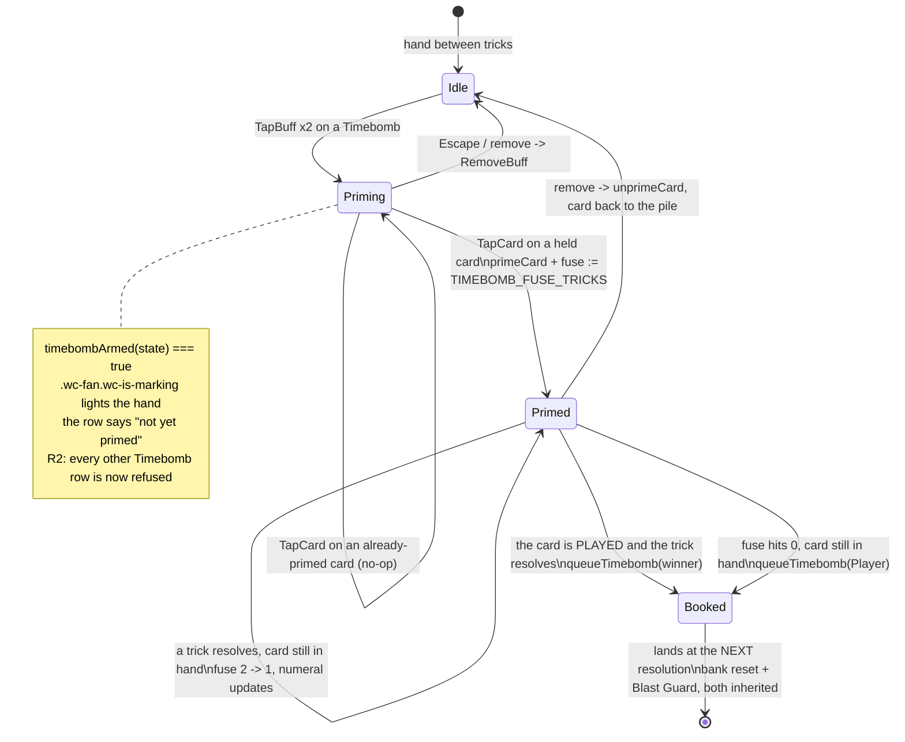

# Plan: Timebomb targeting — prime a card in hand, mark it, and give it a fuse

Plan folder: `.claude/contract/DLR-154-timebomb-targeting-prime-a-card/`
Execution status: see `tasks.md` in this folder.

---

## Part 1 — Alignment

### Task reference

Jira **DLR-154** — "Timebomb targeting: prime a card in hand, and mark it" (Story, parent epic DLR-147, labels `playable` / `ui`). Moved `To Do → Planning` at the start of this run.

Reasoning record cited by the ticket: `.claude/contract/DLR-147-full-ui-pass/update-log.md` → *The primed-card mark — a bomb, added rather than substituted* (line 499). Approved design assets: `.claude/contract/DLR-147-full-ui-pass/mockup-primed-card.html` and `mockup-buff-gallery.html`. The ticket instructs: *"Re-author under `react-frontend`; do not port the mockup CSS."*

**Acceptance criteria as ticketed**, verbatim:

1. Activating a Timebomb enters a priming mode that visibly waits for a card and states what it is asking for. No other buff enters this mode.
2. The next hand card chosen takes the mark. The mode ends on that choice.
3. The marked card keeps its rank, suit, rank name and art — the mark is **added**, never substituted.
4. The mark hangs on the card's wrapper, not inside the card's own clipped box.
5. Taking the Timebomb off the trick clears both the mark and any pending priming mode.
6. **There is exactly one source of truth for which card is primed.**
7. The bomb's SVG is defined **once** and shared by every render path.
8. The bomb's shapes are **inline, not** `<symbol>` + `<use>`.
9. Under `prefers-reduced-motion` the fizz stops with the spark left lit.
10. ~~The mark is distinguishable in greyscale on shape alone.~~ **DROPPED by the developer, 2026-08-31.** No greyscale screenshot is required. The design satisfies it incidentally — the bomb is a black silhouette on a pale card — so nothing is lost, but it is not a gate.
11. A card that is **both skulled and primed** renders both without either becoming unreadable. Judge it at real scale.
12. The riding list's Timebomb row states its target once primed, and states that it is not yet primed before that.
13. Keyboard: priming is reachable without a pointer, and `Escape` leaves priming mode without stranding the buff.
14. No page or horizontal scroll at 1440x900, 1280x720 and an emulated ~430px touch viewport; sizes named in the summary.
15. `npm run typecheck`, `npm run lint`, `npm run format:check` and `npm test` pass.

**Developer rulings, 2026-08-31 — confirmed in conversation and folded into this contract.** Each supersedes the ticket text it touches; the Jira description is updated to match.

- **R1 — Action points are off.** `AP_ENABLED = false` (`src/hunt/apConfig.ts:16`, the DLR-145 decision). The only cost of a Timebomb is the card leaving the pile, so "taking it back off the trick" means the card returns and nothing else. The AP-refund half of a revocation is inert.
- **R2 — You cannot prime two Timebombs.** The second spend is **refused outright** rather than allowed and then blocked at the prime, because allowing the spend would strand a card — the exact failure AC13 exists to prevent. The Timebomb row goes unavailable the moment one is armed or primed and stays so until it resolves or is taken off. This settles the ticket's own logged-and-undecided overwrite note.
- **R3 — A primed card has a two-trick fuse.** The player gets the resolution of two tricks to play it. If it is still in their hand after the second, it detonates where it sits and the player takes the hit. **This supersedes the ticket's "when it lands" exclusion**, which the developer has explicitly folded in rather than split out.
- **R4 — Show the fuse.** A countdown on the mark itself, and an explanation in the card's hover tip.
- **R5 — Scope.** R2 and R3 are folded into DLR-154 rather than raised as sibling tickets.

**Scope boundaries as ticketed — in scope:** the priming mode and its prompt; the bomb mark on a hand card; the riding list's Timebomb row wording. **Out of scope:** how buffs are activated and how the hand lights up (DLR-153); Cheat's live duration readout; changing Timebomb's damage or its tiers; the bomb's colours and sizes (placeholders, the developer's). The fourth original exclusion — "or when it lands" — is superseded by R3.

Dependency: *"Blocked by DLR-153."* — DLR-153 landed on `Version-6-UX` as commit `a4d80a3`, so the block is clear.

### Restated goal

Timebomb already works mechanically — the reducer arms a damage pair on the spend, reinterprets the next hand-card tap as a prime, writes the card into `round.primedCards`, and detonates at the next trick's resolution against whoever physically took the trick. What is missing is everything the player can *see, undo, and be held to*.

Five things are invisible or broken today. The priming prompt sits below `quarryToLead` in the hint cascade, which is true throughout exactly the window Timebomb is activatable in. The `wc-is-marking` class the hand sets has **no stylesheet rule anywhere**, so nothing shows the hand is waiting. The mark is a `⚗` glyph in a green disc at the card's bottom-left rather than the approved bomb on the corner. The riding list calls a Timebomb "already spent" and offers no way back. And `Escape` while priming silently eats a paid-for card.

Two rules are wrong as well. A second Timebomb can be spent while one is already primed, silently overwriting the first's tier so a gold-marked card detonates for bronze. And a marked card the player simply never plays evaporates at hand end for free — the bomb was bought and nothing happened, with no warning and no readout.

This ticket closes all seven. The hand gains a visible waiting state and a prompt that says why it is asking. The bomb becomes a real inline-SVG mark on the card's **wrapper**, defined once, carrying a countdown. The riding list states the target and gains a control that returns the card, lifts the mark and closes the mode together; `Escape` routes to the same reversal. A second Timebomb is refused while one is live. And a primed card the player sits on for two trick resolutions goes off in their hand — booked through the same queue a played one uses, so the bank reset and the Blast Guard are inherited rather than restated.

### In scope

- A visible priming mode on the hand: a real `.wc-fan.wc-is-marking` stylesheet rule (the class exists and styles nothing today), and a prompt that says a Timebomb is the one buff that attaches to a card.
- Reordering `deriveHint`'s cascade so the priming prompt is reachable in the window Timebomb is actually activatable in — it currently sits below `quarryToLead`, which spans the Quarry-to-lead gap that `discardWindowOpen` covers.
- A new `TimebombMark` component: the approved cartoon bomb as **inline** SVG shapes, per-instance gradient ids, `aria-hidden`, `pointer-events: none`, one definition shared by every render path.
- Rehoming the mark from inside `<button class="wc-card">` to the card's wrapper (`.wc-card-tip-host`), so it can overhang the top-right corner (AC4).
- Retiring the on-face primed-mark geometry the rehome invalidates: `CARD_FACE_GEOMETRY.primedMark`, the four `--wc-face-primed-*` custom properties, the `.wc-card .wc-primed-mark` rule, and their rows in `cardFaceCss.test.ts`.
- `prefers-reduced-motion`: the fizz stops, the spark stays lit (AC9).
- **R3 — the two-trick fuse.** A `timebombFuseRemaining` count on `RoundUiState`, seeded at the prime, decremented at each trick resolution while the primed card is still in the player's hand, and booking the player-side damage through `queueTimebomb` when it reaches zero.
- **R4 — the countdown on the mark**, and a fuse line in the card's hover tip.
- **R2 — refusing a second Timebomb** while one is armed or primed, through a new `BuffActivationRefusal` member and its message row.
- Making a riding Timebomb **revocable** — `deactivateFromPile` reached from `handleRemoveBuff`, plus the felt-state reversal the pure module cannot do: `timebombArmedDamage`, `primedTimebombDamage`, `timebombFuseRemaining`, and the primed card itself.
- A new pure `unprimeCard` in `src/warCouncil/timebomb.ts`, the mirror of `primeCard`.
- The riding list's Timebomb row: its target sentence, its not-yet-primed sentence, its own remove label, and not being greyed as unreachable.
- `Escape` in the hand while priming routing to the same removal rather than `CancelSelection` (AC13).
- Making a tap on an already-primed card a no-op that keeps priming mode open, instead of silently eating the spend.
- Splitting the dev-only debug-state effects out of `WarCouncilRound.tsx`, which stands at 399 of its 400-line budget.

### Explicitly out of scope

- Anything about how buffs are activated or how the hand lights up — DLR-153 owns it and it shipped.
- Cheat's live duration readout (`cheatTricksRemaining`).
- Timebomb's damage **figures** and its **tier multipliers** — `TIMEBOMB_TIER_MULTIPLIER` and the 4/2 base stay exactly as they are. R3 changes *when* a bomb can land, never *how much* it deals.
- **Putting a tier or damage figure on the mark itself.** R2 removes the reason the ticket forbade it, but adding it is a separate decision the developer has not taken. The hover tip explains the fuse; whether it also names the figure is flagged in Risks.
- The greyscale screenshot (AC10, dropped by R1's sibling ruling).
- Choosing the bomb's colours, sizes, overhang, or fizz duration; choosing the priming mode's tint; choosing final copy. All placeholders, all the developer's.
- Restoring any cut buff family, reward axis or consumable (`CLAUDE.md` → *Cut buffs are cut until a ticket brings them back*).
- Making Cheat, Ward or Shield revocable. Only Timebomb changes, and only because AC5 and AC13 require it.
- Clearing `primedCards` at hand end — `deal.ts` already writes `primedCards: []` on every fresh deal, and that is unchanged.

### Pattern Reference

Supplied by the brief:

- `.claude/contract/DLR-147-full-ui-pass/mockup-primed-card.html` — the approved bomb, its placement (`top:-11%; right:-9%; width:46%`), its `620ms steps(2,end)` fizz, its reduced-motion rule, and the both-skulled-and-primed close-up. Its SVG shape list is the reference for `TimebombMark`; its CSS is explicitly **not** to be ported.
- `.claude/contract/DLR-147-full-ui-pass/mockup-buff-gallery.html` — the flow in the full screen.
- `.claude/contract/DLR-147-full-ui-pass/update-log.md` → *The primed-card mark* (line 499) — the governing "a skull REPLACES, a Timebomb is ADDED" distinction and the reasoning for keeping the green ring.
- `.claude/contract/DLR-147-full-ui-pass/buff-resolution-and-lifetimes.md` §4 — `timebombArmedDamage`'s lifetime.

Written for this plan and approved at the gate:

- `.claude/contract/DLR-154-timebomb-targeting-prime-a-card/mockup.html` — the priming mode, the mark on the wrapper, and the riding row in both states. **Note:** approved before R2/R3/R4; the countdown numeral and the hover line are not on it yet. Cite it for layout and interaction, not for the fuse.

Chosen here, because the brief named no code reference:

- `src/app/warCouncil/CardBuffHalo.tsx` — the precedent for a small, `aria-hidden`, self-contained SVG overlay component owned by `PlayingCard`.
- `src/app/warCouncil/buffRideModel.ts` / `buffRideLabels.ts` / `BuffRidingList.tsx` — the three-file split (model decides, labels word, component renders and decides nothing) that AC12's row must follow.
- `src/hunt/buffActivation.ts` → `REVOCABLE_CONDITION_KINDS` / `deactivateFromPile`, and `src/app/warCouncil/buffHandlers.ts` → `handleRemoveBuff` — the revocation path DLR-153 built for Taker/Feeder/Sidestep, which AC5 extends by exactly one kind.
- `src/app/warCouncil/roundUiState.ts` → `cheatTricksRemaining` and `commitHandlers.ts:232` → its decrement — the exact precedent `timebombFuseRemaining` follows. A COUNT, not a stage, for the reason that field's own docblock gives.
- `src/hunt/encounter.ts` → `queueTimebomb`, `src/warCouncil/bank.ts:253` → `timebombResets`, and `bank.ts:172` → `forcedCashValue` — the machinery an in-hand detonation reuses rather than restates.
- `src/warCouncil/timebomb.ts` → `primeCard` — the throw-rather-than-no-op discipline `unprimeCard` mirrors.
- `.claude/skills/react-frontend/SKILL.md` and `.claude/skills/game-ux/SKILL.md`.

### Constraints flagged on the brief

- **AC6 — one source of truth for which card is primed.** No second flag may render the mark. `round.primedCards` is that source and everything derives from it.
- **AC7/AC8 — the bomb is defined once, and inline.** No `<symbol>` + `<use>`: `use` clones into a shadow tree the fizz class cannot reach from the light DOM, leaving the spark dead and unreachable by `prefers-reduced-motion`. Deliberately the opposite of the rule `#wc-skull` follows.
- **AC4 — the mark hangs on the wrapper**, not inside the card's own box.
- **AC3 — added, never substituted.** A primed Swan is still a Swan.
- **AC13 — keyboard-reachable, and `Escape` must not strand the buff.**
- **AC14 — no page or horizontal scroll** at 1440x900, 1280x720 and ~430px, with the sizes named.
- **The bomb's colours and sizes are placeholders, the developer's** — the ticket says so outright.
- **R3's fuse length is the developer's stated value (2), not an invented tunable.** It becomes a named config key carrying that figure.
- Two runtime dependencies (`react`, `react-dom`). Nothing here adds a third.
- `.claude/rules/save-data-versioning.md` — scanned; see the audit below.

### Assumptions made

1. **A riding Timebomb becomes revocable, and revocability stays a single predicate.** `BuffKind.Timebomb` joins the set (renamed `REVOCABLE_BUFF_KINDS`, since it is no longer condition-only); Cheat, Ward and Shield stay out. **Confirmed by R1** — with AP off, the whole of a revocation is the card returning to the pile, which is precisely what `deactivateFromPile` already does. The DLR-153 docblock that says no Activated card is revocable is corrected in the same edit.
2. **The pure module returns the card; the app layer reverses the felt.** `deactivateFromPile` cannot reach `timebombArmedDamage`, `primedTimebombDamage`, `timebombFuseRemaining` or `round.primedCards` and must not learn about them. `handleRemoveBuff` gains a Timebomb branch that clears all four. Keeps `src/hunt/`'s pure-core boundary intact.
3. **The Timebomb row's target is derived from `round.primedCards`, never stored.** AC6 forbids a second flag. The target is `primedCards.at(-1) ?? null` when `timebombArmedDamage` is null, and `null` while armed. **R2 makes this airtight rather than merely conventional** — with at most one Timebomb live at a time, there is never a second candidate.
4. **`Escape` while priming dispatches `RemoveBuff` for the riding Timebomb** rather than a new action kind. AC13's "without stranding the buff" and AC5's removal are the same reversal; two code paths is how two reversals drift apart.
5. **A tap on an already-primed card is a no-op that keeps priming mode open.** `primeTapped` today clears `timebombArmedDamage` on that guard, silently eating a paid-for card. The not-in-hand guard keeps its existing clear-and-abandon behaviour, being unreachable from the fan.
6. **The mark hangs in `.wc-card-tip-host`** — the `<span>` `CardAbilityTip` already wraps every `PlayingCard` in, already `position: relative; display: block`. It is the wrapper AC4 asks for, sits outside `.wc-card`'s `container-type: inline-size` layout containment, and because every variant routes through it, one placement satisfies AC7 for every render path.
7. **`TimebombMark` mints its gradient ids per instance via `useId()`.** The mockup hard-codes `id="bombBody"` / `id="sparkGlow"`; two marks on screen at once — a primed card in hand and the same card in the trick well — would collide.
8. **The on-face primed geometry is deleted rather than repointed.** Once the mark is outside the card box it has no printed-on-the-face rectangle, and `cardFaceCss.test.ts` — a machine for proving such rectangles honest — would certify a false claim. No replacement `--wc-face-bomb-*` is declared.
9. **The bomb's CSS lives in a new `warCouncilTimebombMark.css`**, imported by `TimebombMark.tsx` — the precedent `PlayingCard.tsx` sets with `import './warCouncilBuffRide.css'`. Adding ~90 lines to `warCouncilCardFace.css` (327) or `warCouncilCards.css` (373) pushes both toward the 400-line budget for no gain.
10. **`WarCouncilRound.tsx`'s dev-only debug mirror is extracted to a `useDebugRoundState` hook.** The file stands at 399 lines and this ticket grows `handleCancel`. The two effects are the cleanest self-contained block to move and the extraction changes no behaviour.
11. **Copy is placeholder, and marked as such** — every string lands in `labels.ts` / `buffRideLabels.ts` beside their existing `PLACEHOLDER copy` docblocks.
12. **R3's fuse counts trick RESOLUTIONS, not player turns**, and only while the primed card is still in the player's hand. Prime in the window before trick N; trick N resolves (2→1); trick N+1 resolves (1→0) and the bomb is booked. So the player may play the card into trick N or trick N+1.
13. **An expired fuse books through `queueTimebomb`, exactly as a played one does** — it does not deal damage directly. This is the single most consequential design choice in R3's implementation: booking means the in-hand pop lands at the *following* trick's resolution and inherits, with no restatement, the bank-and-multiplier reset (`bank.ts:253`'s `timebombResets`), the Blast Guard's absorption and its spend (`blastGuardSpent`), the zero floor, and the forced cash-out. A direct `applyDamage` call would need every one of those rules written a second time, and `duelHealthBars.ts` is this codebase's standing cautionary case for exactly that.
14. **The in-hand detonation uses the PLAYER side of the tier's pair** (`TIMEBOMB_DAMAGE[tier][DuelSide.Player]` — 2/4/6), the same figure as eating your own bomb by winning a marked trick. Not the Quarry figure: the damage is to the player, and `buffCatalog.ts` records that the player figure is deliberately the smaller of the two *because* it also forces the streak's cash-out — which Assumption 13's booking preserves.
15. **A Timebomb is refused while one is armed or primed via a new refusal member**, not by overloading `AlreadyActive`. `AlreadyActive` means "this same card, twice in one trick"; the second-Timebomb case is a *different* card blocked by state from an earlier trick, and reusing the reason would put "Already active this trick" on a row for which that is false. Cheap here: the audit found no `switch` over `BuffActivationRefusal` anywhere, only one `Readonly<Record<>>` message table.

### Config and persisted-shape audit

- **Persisted shapes: none touched.** Nothing under `src/persistence/` is in the file map, no `SAVE_SCHEMA_VERSION` bump is needed, and no file this ticket edits names `localStorage` or `sessionStorage`. `.claude/rules/save-data-versioning.md`'s six reject conditions are each inapplicable — the only persisted value this work moves is the *contents* of `RunState.buffs`, which already round-trips through `roundResultFor`'s existing `buffs: ui.buffs` field for every revocable condition buff; a returned Timebomb takes the identical path with no shape change.
- **`RoundUiState` gains one field, `timebombFuseRemaining: number` — and it has exactly ONE construction site.** `grep -rn "RoundUiState" src/` → **230 hits** (annotations, imports and type-only uses). The construction count is the figure that matters, and it was measured against the precedent field rather than the type name: `grep -rn "cheatTricksRemaining" src/` → **30 hits**, of which exactly **one** is a construction site (`roundUiSeed.ts:59`); every other production hit is a read or a spread, and every one of the eight spec hits goes through a `baseUi(overrides)` helper that spreads `createRoundUiState(...)` (`roundHint.test.ts:19-31` is the pattern). Reported as `RoundUiState: 230 annotated sites, 1 construction site (0 in specs)`. This is the reason R3 is affordable inside this contract: the state shape is built in one place and overridden everywhere else.
- **`RidingBuffRow` gains one field, `timebomb: TimebombRide | null`.** Annotated sites: `grep -rn "RidingBuffRow" src/` → **21 hits**. Construction sites, found by grepping the distinctive required field `revocable:` → **28 hits**, of which the *object literals* are **9**: `buffRideModel.ts:154` (production), `__tests__/BuffRidingList.test.tsx:21,22,30,37,44,52` (6 in specs), `__tests__/CardBuffBreakdown.test.tsx:19,20` (2 in specs). Reported as `RidingBuffRow: 21 annotated sites, 9 construction sites (8 of them in specs)` — the 9 literals are what `tsc` breaks on and all 9 are in the file map.
- **`BuffActivationRefusal` gains one member, and there is no `switch` over it to widen.** `grep -rn "BuffActivationRefusal" src/ --include=*.ts --include=*.tsx | grep -v __tests__` → **33 hits**, all of them imports, type annotations, or single-member comparisons (`=== BuffActivationRefusal.WindowClosed` at `ActionBar.tsx:89,115`; `=== NoEffectYet` at `sim/playHandWindows.ts:181`). The only exhaustive construct is `BUFF_ACTIVATION_REFUSAL_MESSAGE` at `buffLabels.ts:164`, a `Readonly<Record<BuffActivationRefusal, string>>` — so adding a member costs one enum entry, one message row, and nothing else compiles differently.
- **`--wc-face-primed-*` — 12 hits, all deleted together.** 4 declarations (`warCouncilCards.css:136-139`), 4 `var()` reads (`warCouncilCardFace.css:226-229`), 4 drift-spec rows (`__tests__/cardFaceCss.test.ts:51-54`), plus the explanatory comments at `warCouncilCardFace.css:222` and `warCouncilCards.css:130` that go with them.
- **`.wc-primed-mark` — 8 hits, and the class is retired.** `PlayingCard.tsx:137` (the only render), `warCouncilCardFace.css:217` (the only rule), `warCouncilCards.css:130` and `cardFace.ts:113` (comments), `cardFaceCss.test.ts:47` (a comment), `__tests__/PlayingCard.test.tsx:31,44,129` (three assertions). New name: `.wc-timebomb-mark`. All 8 in the file map.
- **`.wc-is-marking` is rendered but has zero stylesheet rules.** `grep -rn "wc-is-marking" src/` → **2 hits**, both in `HandFan.tsx` (a comment at :147, the className at :150); `grep -rn "is-marking\|is-discarding" src/app/warCouncil/*.css` → **0 hits**. The audit's substantive finding: AC1's "the hand shows it is waiting" is not weak today, it is entirely absent — and so is the discard mode's equivalent. This ticket writes the `.wc-is-marking` rule; `.wc-is-discarding` is DLR-100's and stays out of scope.
- **`PRIMED_MARK_LABEL` (`labels.ts:49`) has one hit and no consumer.** Left in place — deleting an unused export is unrelated tidying.
- **One new config key, carrying the developer's own stated value.** `TIMEBOMB_FUSE_TRICKS = 2` joins `src/hunt/apConfig.ts`'s siblings in `config.ts`, keyed and documented like `CHEAT_DURATION_TRICKS`. Not an invented tunable: R3 states the figure.
- **The pure-core boundary is not crossed.** `src/hunt/` gains one set entry, one enum member and one config key; `src/warCouncil/` gains `unprimeCard`, plain `RoundState` in and out. Neither imports React nor touches a DOM global, so `eslint.config.js`'s override over `src/warCouncil/**` and `src/hunt/**` stays clean.
- **`src/sim/**` needs one look, not zero.** `sim/fixtures.ts:120-180` drives the existing arm-prime-play sequence and adds no action kind, so it compiles unchanged — but `attemptPrimedTimebomb` asserts a primed-and-booked state within `MAX_ACTIONS_PER_HAND`, and R3 introduces a second way to reach "booked". The plan checks that spec rather than assuming it.

---

## Part 2 — Technical design

### Approach

**The priming state model needs almost nothing new, and that is the design's foundation.** Priming mode is already `timebombArmedDamage !== null` and the primed card is already `round.primedCards` — both exported through predicates (`timebombArmed`, `isPrimed`) that the reducer and the components share by construction. AC6 is therefore satisfied by *not* adding anything: every surface this ticket builds derives from those two. The alternative — a `primedTarget: Card | null` on `RoundUiState`, which would make the riding row trivial — is exactly the "separate flag that can disagree with the chosen target" AC6 names as the failure. The one field that *is* added, `timebombFuseRemaining`, answers a different question ("how long left"), not "which card", so it cannot disagree with anything.

**The mark moves out of the button and becomes its own component.** `PlayingCard` renders a `<button class="wc-card">` inside `CardAbilityTip`'s `.wc-card-tip-host` `<span>`, already `position: relative; display: block` and already wrapping *every* render path — hand, table and pile. Returning a fragment of `<button>…</button>` plus `{primed && <TimebombMark fuse={…} />}` from inside that host puts the mark on the wrapper (AC4) with one edit and satisfies AC7 without a registry or a sheet. `TimebombMark` holds the approved bomb's shapes **inline** — no `<symbol>`, no `<use>` (AC8) — with its two radial-gradient ids minted per instance from `useId()`. It is `aria-hidden` (the fact reaches the accessible tree through `cardAccessibleName`) and `pointer-events: none` so an overhanging decoration never steals a tap. Its stylesheet is a new `warCouncilTimebombMark.css`; the fizz is one `steps()` keyframe loop with a `@media (prefers-reduced-motion: reduce)` block that stops the animation and leaves the spark's glow at a fixed opacity (AC9).

**R4's countdown rides on the mark, not in the riding list**, and that placement is forced rather than chosen: `openBuffWindow` clears `activatedThisTrick` at every trick resolution, so the riding row disappears at exactly the moment the countdown starts mattering. The numeral is a real text node inside the mark (not a CSS `content`), so it survives a screenshot and reaches assistive tech through the card's accessible name, which gains the remaining-tricks clause alongside "primed". The hover tip — `CardAbilityTip`, already the card's explanation surface — gains a fuse line for a primed card, satisfying R4's second half without inventing a new panel.

**Rehoming the mark invalidates the on-face geometry, which is deleted rather than repointed.** `cardFace.ts` declares `CARD_FACE_GEOMETRY.primedMark` and `warCouncilCards.css` declares four `--wc-face-primed-*` twins, drift-checked by `cardFaceCss.test.ts` — a machine that exists to prove *printed-on-the-face* rectangles honest. A mark that hangs off the corner has no such rectangle, so keeping a declared one would be a false claim the spec would then certify. All three sides go in one task, together with `printedRects`'s `geometry.primedMark` entry, so no phase boundary leaves the drift spec referencing a deleted property.

**Revocation is split along the existing pure/app seam.** `deactivateFromPile` already returns a spent card to the pile and refuses anything `isRevocableBuff` rejects; adding `BuffKind.Timebomb` is a one-line widening plus the docblock correction it invalidates. With AP off (R1) that is the whole of the pure half. What `src/hunt/` cannot do — and must not learn to do — is reverse the felt: `handleRemoveBuff` gains a Timebomb branch that clears `timebombArmedDamage`, `primedTimebombDamage` and `timebombFuseRemaining`, and calls a new pure `unprimeCard(round, card)` — `primeCard`'s mirror, throwing on a card that is not primed, with the caller guarding first exactly as `primeTapped` guards `primeCard`. `Escape` reaches the same branch rather than a second one (Assumption 4).

**R3's fuse follows `cheatTricksRemaining` in every respect, and books rather than deals.** It is a count, not a stage, for the reason that field's docblock already gives; it is seeded at the prime, and it is decremented in `commitHandlers.ts` beside the Cheat's own decrement — one place where "a trick resolved" is already known. The consequential choice is what happens at zero: the fuse calls `queueTimebomb(encounter, DuelSide.Player, damage)` — the identical booking a played bomb makes — rather than `applyDamage` directly. Booking means the pop lands at the *following* trick's resolution and inherits, restating nothing, the bank-and-multiplier reset (`bank.ts:253`'s `timebombResets`), the Blast Guard's absorption and spend, the zero floor, and the forced cash-out through `forcedCashValue`. Calling `applyDamage` would require writing every one of those rules a second time, and `duelHealthBars.ts` is this codebase's standing cautionary case for exactly that class of duplication. The cost is one extra trick of real-world delay before the hit shows, which is consistent — every Timebomb has a one-trick fuse from the moment it is triggered, whether triggered by being taken in a trick or by timing out in hand.

**R2's refusal enters through the app-layer stock builder, where felt facts already enter the pure rule.** `roundUiState.ts`'s `buffActivationStock` is the one place that translates the felt's shape into `BuffActivationStock`, and `windowOpen` already travels that route. A `timebombLive` field joins it, true when `timebombArmed(state) || state.round.primedCards.length > 0`, read only for a Timebomb; `buffActivationRefusalFor` gains one branch and `BuffActivationRefusal` one member, ordered after `WindowClosed` and before `AlreadyActive` so the felt-wide reason still reports first. Because the refusal is the same value the gallery row already renders, the row goes visibly unavailable with its reason on its face and no second gate is written.

**One extraction pays for the space.** `WarCouncilRound.tsx` is at 399 of its 400-line budget and this ticket grows `handleCancel`. Its two dev-only debug-mirror effects are a self-contained block with no coupling to the render tree, and move verbatim into `useDebugRoundState.ts`. Behaviour is unchanged, including the deliberate two-effect split that `debugState.ts`'s docblock explains.

### Skills to invoke during execution

- `react-frontend` — owns everything under `src/`. Governs `TimebombMark.tsx`, `PlayingCard.tsx`, `HandFan.tsx`, `BuffRidingList.tsx`, the new `useDebugRoundState` hook, the reducer/handler/fuse changes, the 400-line budget, effect cleanup and StrictMode safety, and Vitest placement (pure logic beside its module, component tests by role and label).
- `game-ux` — owns the game-screen layer. Governs the priming mode's visible waiting state and its prompt (AC1), the countdown's legibility on a ~20px mark and its "say how much of it is left" rule (R4), keyboard reachability and `Escape` (AC13), the no-scroll check at the three named viewports (AC14), and the rule that no tuning value is invented rather than routed to the developer.

Rules the executor must Read: `.claude/rules/README.md` and `.claude/rules/save-data-versioning.md` (scanned here; no reject condition engaged). Always read `.claude/workflow/web-project.md`.

Developer override: none — both proposed skills were confirmed at the gate.

### Diagram



### Data shapes

#### `src/hunt/config.ts` (via `apConfig.ts`'s sibling pattern) — new key

```ts
// R3, DEVELOPER-STATED 2026-08-31: the player gets the resolution of this many tricks to play a
// primed card before it detonates in their hand. NOT an invented tunable — the figure is the
// developer's own. Keyed and documented like CHEAT_DURATION_TRICKS beside it.
// UNIT: trick resolutions, counted only while the primed card is still in the player's hand.
export const TIMEBOMB_FUSE_TRICKS = 2
```

#### `src/hunt/buffActivation.ts` — widened set, new refusal member

```ts
// Renamed from REVOCABLE_CONDITION_KINDS: no longer condition-only.
const REVOCABLE_BUFF_KINDS: ReadonlySet<BuffKind> = new Set([
  BuffKind.Taker, BuffKind.Feeder, BuffKind.Sidestep,
  BuffKind.Timebomb, // DLR-154 AC5/AC13 — with AP off, revocation is the card returning.
])

export const BuffActivationRefusal = {
  NoEffectYet: 'noEffectYet',
  WindowClosed: 'windowClosed',
  /** R2 — one Timebomb at a time. A second spend is refused rather than allowed and blocked at
   *  the prime, which would strand the card. Distinct from `AlreadyActive`: that means the SAME
   *  card twice in one trick; this is a DIFFERENT card blocked by state from an earlier trick. */
  TimebombLive: 'timebombLive',
  AlreadyActive: 'alreadyActive',
  InsufficientAp: 'insufficientAp',
} as const

export interface BuffActivationStock {
  // …existing fields…
  /** R2 — a Timebomb is armed or a card is primed. Read only for a Timebomb; `false` otherwise. */
  readonly timebombLive: boolean
}
```

Refusal order becomes `NoEffectYet → WindowClosed → TimebombLive → AlreadyActive → InsufficientAp`.

#### `src/app/warCouncil/roundUiState.ts` — one new field

```ts
export interface RoundUiState {
  // …existing fields…
  /** R3 — trick resolutions left before a primed card detonates in the player's hand. `0` when
   *  nothing is primed. A COUNT, not a stage, exactly as `cheatTricksRemaining` above is: the
   *  fuse length is a config key and a boolean could only ever express one. Set by `primeTapped`
   *  to `TIMEBOMB_FUSE_TRICKS`; decremented by `commit` on each resolution while the card is
   *  still held; cleared to `0` by the detonation, by the card being played, and by removal. */
  readonly timebombFuseRemaining: number
}

/** R3 — the fuse is live and counting. EXPORTED so the mark's numeral and the reducer's expiry
 *  branch read the SAME predicate, the discipline `timebombArmed` above sets. */
export function timebombFuseLive(state: RoundUiState): boolean
```

`createRoundUiState` (`roundUiSeed.ts:49`) seeds it `0` — the single construction site.

#### `src/warCouncil/timebomb.ts` — new export

```ts
/** `primeCard`'s mirror. THROWS when the card is not primed, the same discipline `primeCard`
 *  sets: a silent no-op would let a caller believe a mark was lifted that was never there.
 *  `handleRemoveBuff` and the fuse's expiry both guard with `isPrimed` before calling. */
export function unprimeCard(state: RoundState, card: Card): RoundState
```

Re-exported from `src/warCouncil/index.ts` beside `isPrimed`, `trickIsPrimed`, `primeCard`.

#### `src/app/warCouncil/buffRideModel.ts` — one new type, one new field, two new functions

```ts
export interface TimebombRide {
  /** The primed card, or `null` while the mode is still waiting for one. */
  readonly target: Card | null
  /** R4 — trick resolutions left, mirrored from `timebombFuseRemaining`. `0` when unprimed. */
  readonly fuseRemaining: number
}

export interface RidingBuffRow {
  readonly buff: Buff
  readonly reach: number
  readonly revocable: boolean
  readonly timebomb: TimebombRide | null // NEW — non-null ONLY on a Timebomb row
}

/** Assumption 3 — derived from `round.primedCards`, never stored. */
export function timebombTargetFor(state: RoundUiState): Card | null

/** AC13 — the riding Timebomb's id, so `Escape` reaches the same removal the row's control does. */
export function ridingTimebombId(state: RoundUiState): BuffId | null
```

#### `src/app/warCouncil/TimebombMark.tsx` — new component

```tsx
interface TimebombMarkProps {
  /** R4 — trick resolutions left, rendered as the numeral on the bomb. */
  readonly fuseRemaining: number
}
export default function TimebombMark({ fuseRemaining }: TimebombMarkProps): ReactElement
```

#### `src/app/warCouncil/PlayingCard.tsx` — one new prop

```tsx
/** R4 — trick resolutions left on this card's fuse. Ignored unless `primed`. Optional, defaulted
 *  to 0, so all 49 other construction sites keep compiling — the precedent `primed`,
 *  `discardSelected`, `describedBy` and `buffCount` each set. */
readonly fuseRemaining?: number
```

#### `src/app/warCouncil/labels.ts` — retuned constant, new function

```ts
// Was 'Pick a card in your hand to prime'. AC1 requires the prompt to say WHY. PLACEHOLDER copy.
export const TIMEBOMB_ARMED_HINT = 'Timebomb — pick the card it rides on. It goes off next trick.'

/** R4 — the fuse clause folded into a primed card's accessible name and its hover tip.
 *  PLACEHOLDER copy. */
export function timebombFuseText(fuseRemaining: number): string
```

`cardAccessibleName`'s `CardMarks` gains an optional `fuseRemaining?: number` so the numeral reaches assistive tech through the name rather than a second live region.

#### `src/app/warCouncil/buffRideLabels.ts` — new exports

```ts
/** AC12 — the Timebomb row's status sentence, and the reach sentence for every other row. One
 *  function so `BuffRidingList` reads one string per slot and branches on nothing. PLACEHOLDER. */
export function ridingRowText(row: RidingBuffRow): string
/** AC12/AC5 — names the card whose mark is lifted, or says nothing is primed yet. PLACEHOLDER. */
export function timebombRemoveLabel(target: Card | null): string
/** AC5/AC13's confirmation, through the hand's existing aria-live region. PLACEHOLDER. */
export function timebombRemovedText(target: Card | null): string
```

#### `src/app/warCouncil/useDebugRoundState.ts` — new hook

```ts
/** The dev-only `window.__DEBUG_STATE__` round mirror, moved verbatim out of
 *  `WarCouncilRound.tsx` (400-line budget). Two effects, unchanged. */
export function useDebugRoundState(slice: DebugRoundState): void
```

#### Deleted

- `cardFace.ts` — `CARD_FACE_GEOMETRY.primedMark`, the five `PRIMED_MARK_*` / `CARD_ASPECT_RATIO` constants feeding only it, its docblock, and its entry in `printedRects`.
- `warCouncilCards.css` — `--wc-face-primed-x` / `-w` / `-bottom` / `-h`.
- `warCouncilCardFace.css` — the `.wc-card .wc-primed-mark` rule.
- `__tests__/cardFaceCss.test.ts` — the four `wc-face-primed-*` drift rows.

#### New string-bound names (no compiler cover)

`.wc-timebomb-mark`, `.wc-timebomb-mark-fizz`, `.wc-timebomb-mark-glow`, `.wc-timebomb-mark-fuse` (the numeral), and a real rule for the existing `.wc-fan.wc-is-marking`. Every value in the new stylesheet is a documented **PLACEHOLDER**.

#### Unchanged

`RoundUiActionKind`, `RoundUiAction`, `HandFanProps`, `BuffRidingListProps`, `Buff`, `TimebombDamage`, `TIMEBOMB_TIER_MULTIPLIER`, `RoundState`, every persisted shape, `package.json`.

### Runtime quality notes

- **Purity and adjudication.** `unprimeCard` is plain `RoundState` in / out, inside the lint-enforced pure tree. The refusal member, the widened set and `TIMEBOMB_FUSE_TRICKS` all stay in `src/hunt/`. `timebombTargetFor`, `ridingTimebombId`, `timebombFuseLive`, `ridingRowText` and `timebombFuseText` are pure functions of committed state, unit-tested with no renderer. `TimebombMark` and `BuffRidingList` decide nothing. No component computes whether a card is primed or how much fuse is left — both arrive as props. The fuse's expiry decides nothing about damage: it hands a side and a figure to `queueTimebomb` and every downstream rule stays where it already lives (Assumption 13).
- **Effects, mount and teardown.** This ticket adds **no new effect**. `useDebugRoundState` is a verbatim move of two existing effects and their StrictMode behaviour is unchanged: the write is idempotent, the cleanup is the only teardown. `TimebombMark` uses `useId` and nothing else — no listener, timer, observer or `requestAnimationFrame`; the fizz is a CSS animation the browser tears down with the element. No module-level mutable state. Nothing captures a pointer. The fuse lives in reducer state, not a timer, so it cannot tick while the tree is unmounted and cannot double-tick under StrictMode — the decrement happens inside a pure transition, once per resolution.
- **Hot-path cost.** No pointer-move handler is touched. `timebombTargetFor` and `ridingTimebombId` are `O(1)` and `O(activated)` respectively, once per render of the riding list, not per card. `lightsForHand`'s `projectBuffBranches` call count is unchanged. `TimebombMark` renders only on a primed card. The fuse decrement is one integer compare and one array membership test per trick resolution, inside a transition that already walks the hand. No memoisation is added and none is warranted.
- **Determinism and numeric safety.** Nothing reaches a seed, a shuffle or `Math.random()`. No division is introduced — the geometry deletion removes the only float comparison in scope rather than adding one. The fuse is integer-only: seeded from an integer config key, decremented by 1, and floored with `Math.max(0, …)` exactly as `cheatTricksRemaining` is, so it cannot go negative and cannot reach a rendered numeral as `NaN` or a fraction. `primedCards.at(-1)` returns `undefined` on an empty array, converted to an explicit `null` by `?? null` rather than reaching a render as a blank.
- **Error paths.** `unprimeCard` throws a `RangeError` naming the card, matching `primeCard`; both callers guard with `isPrimed` first and return the state object itself on a no, so a reducer still cannot throw during an event handler. `deactivateFromPile` continues to throw on a non-revocable or non-riding buff behind `handleRemoveBuff`'s existing guards. `primeTapped`'s already-primed branch becomes a no-op rather than a swallowed failure — the player stays in priming mode with the prompt on screen, so the cause stays visible. R2's refusal is a *reported* reason on the row's face, never a silent disable. No `catch` is added and nothing returns a defaulted success shape. No async surface, so the four async states do not arise.

### Risks and judgement calls

- **R3 is a rules change inside a UI ticket, and it is the largest thing here.** The developer folded it in deliberately (R5) over the alternative of a sibling ticket. Worth restating so it is not a surprise at review: DLR-154's own scope boundaries said "changing… when it lands" was out, and this reverses that. The Jira description is updated to match rather than left contradicting the contract.
- **The extra trick before an in-hand pop lands.** Assumption 13 books through `queueTimebomb`, so the sequence is: fuse expires at trick N+1's resolution → damage lands at trick N+2's. That buys the bank reset, the Blast Guard and the forced cash-out for free, but it means "two tricks to play it" is really "two tricks, then it goes off, then a beat before you feel it". The alternative — settle it immediately at expiry — needs those three rules restated and is the thing `duelHealthBars.ts` warns about. **If the developer wants the hit immediate, say so; it changes the implementation but not the plan's shape.**
- **Whether the Blast Guard should absorb an in-hand pop.** It does, under Assumption 13, because it absorbs every other player-side Timebomb hit and the booking path is shared. That is a rule the developer has not explicitly ruled on — it is inherited, not chosen.
- **Whether the hover tip should name the damage figure.** R2 removed the reason the ticket forbade it (no more tier overwrite), and the hover is the right surface for it — but adding it is a decision nobody has taken, so the plan states the fuse and stops. One line of copy if wanted.
- **The countdown on a ~20px mark.** The bomb is 46% of a card's width, and the card is `clamp(2.9rem, 6.2vmin, 4.3rem)` — so at the small end the numeral sits on roughly a 21px disc, competing with the fuse and spark it shares that disc with. It may need to move beside the bomb rather than onto it. A legibility call at real scale, and the developer's.
- **Every number and colour in the bomb is a placeholder.** The plan carries the mockup's figures forward unretuned — `top:-11%`, `right:-9%`, `width:46%`, `620ms steps(2,end)`, `--wc-timebomb` for the ring. Size, overhang, hue and duration are the developer's once it is on screen.
- **The priming mode's visual treatment has no approved reference.** Neither DLR-147 sheet shows the hand *while waiting*. This plan's `mockup.html` proposes one (a `--wc-timebomb` tint and inset edge on the fan, a slow drift on the cards, plus the prompt) and it is a fresh design call — and it has **not** been re-reviewed since R3/R4 added the countdown.
- **The mockup is now behind the plan.** It was approved at the gate before R2/R3/R4 existed, so it shows no countdown numeral and no fuse line in the hover. Tasks cite it for the priming mode, the mark's placement and the riding row only.
- **Copy.** Four new strings and one retuned constant, all placeholder: the priming prompt, the row's target and not-yet-primed sentences, the remove label, and the fuse clause.
- **AC11 and AC14 need eyes and a browser.** The skulled-and-primed card at real scale — now with a numeral on it too, which the ticket's "two loud marks on one small object" warning predates — and the no-scroll check at 1440x900 / 1280x720 / ~430px are not assertable in jsdom. AC14 has a right answer and belongs to QA on a `--browser` pass; whether three marks are legible together is a judgement and stays the developer's. **The browser pass is still unconfirmed.**
- **`sim/fixtures.ts`'s `attemptPrimedTimebomb` asserts "primed and booked".** R3 adds a second route to booked, so that fixture may now succeed via the fuse rather than via a played card — which would silently weaken what it proves. Checked, not assumed.
- **Deleting `CARD_FACE_GEOMETRY.primedMark` narrows what `cardFace.test.ts` proves.** The overlap relation loses one rectangle. Correct — the mark is no longer printed on the face — but nothing pins the bomb's box any more, by design.
