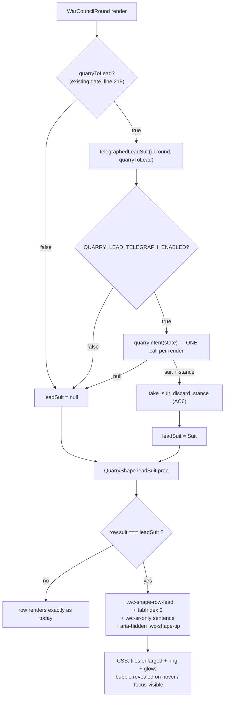

# Plan: Telegraph the Quarry's lead — glow the suit it is about to lead

Plan folder: `.claude/contract/DLR-155-telegraph-quarry-lead-suit/`
Execution status: see `tasks.md` in this folder.

---

## Part 1 — Alignment

### Task reference

Jira **DLR-155** (Story, child of DLR-147 "Full UI pass"), labels `playable` / `ui`.
Summary: _Telegraph the Quarry's lead — glow the suit it is about to lead, before buffs are committed._

**Problem statement (verbatim):** "When the player is not leading, they have to choose which buffs to activate for the trick without knowing which suit the Quarry is about to lead into. Almost every mintable buff is suit-scoped (Taker and Feeder are three suits each), so the whole activation decision hinges on a fact the screen does not show. The player is guessing, and a guess is not a decision. The engine already knows the answer. `quarryIntent()` in `src/warCouncil/cpuPlayer.ts` (DLR-52) returns `{ suit, stance }` for the Quarry's next move, deliberately naming the suit and never the card, and returns `null` whenever there is no Quarry move to describe. It is exported from `src/warCouncil/index.ts` and **no UI currently calls it** — the telegraph is built and unsurfaced. This ticket is the surface, not new engine work."

**Acceptance criteria (verbatim):**

1. When it is the Quarry's turn to lead (the trick is empty and the Quarry is on turn), the "What the Quarry holds" panel visually marks the suit `quarryIntent()` reports: the row's card tiles for that suit are enlarged and given a glow, distinct enough to read at a glance without hunting.
2. Hovering (or keyboard-focusing) the highlighted row shows a tooltip reading exactly: `The Quarry will lead with Bells` — with the suit name drawn from the existing `SUIT_NAME` map, never a hand-typed string.
3. The same sentence is available to a screen reader as real text, consistent with `QuarryShape`'s existing `.wc-sr-only` row-text pattern — not as an `aria-label` on a group whose children are all `aria-hidden`, which Chrome prunes.
4. The highlight is present only while `quarryIntent()` returns non-`null` **and** the trick is empty. It clears the moment the Quarry has led, and never appears when the player is the one leading.
5. **No rank is leaked.** The highlight and the tooltip name a suit only. `SuitShape` carries no rank and this must not introduce a path to one; the highlighted tiles must remain a tally, with tile position carrying no information about which card.
6. `stance` (Pressing / Ducking) is out of scope for this ticket — read the suit from the intent and ignore the stance field, so the fidelity setting can stay at `SuitAndStance` without the UI implying more than it shows.
7. Vitest coverage: the highlight and tooltip render for the intended suit when the Quarry is to lead; nothing is highlighted when the player leads or mid-trick; the tooltip text matches the suit name.
8. Allow for this to be toggle off easily with a boolean ( follow other patterns)

**Design asset named on the ticket:** "Developer sketch supplied in the session: the existing 'What the Quarry holds' panel, with the intended lead card enlarged and glowing in its suit row."

Ticket moved `To Do → Planning` at the start of this run.

### Restated goal

The Quarry's dossier panel already lists, per suit, how many cards the Quarry holds and how many of those are skulled, drawn as one small tile per card. This ticket makes that panel say one more thing: which of the three suit rows the Quarry is about to _lead_ with, at the exact moment the player is choosing which buffs to activate for the coming trick. The engine already computes the answer and has never been asked for it. The work is to ask it once per round render, hand the resulting suit down into `QuarryShape` as a prop, and give that suit's row a treatment — bigger tiles plus a glow — that reads in a glance, with the fact also stated in words for a tooltip and for a screen reader. It shows the suit and nothing else: no rank, no card, no pressing/ducking stance. A single boolean in the Hunt configuration turns the whole readout off.

### In scope

- A new pure module `src/app/warCouncil/quarryTelegraph.ts` that resolves the telegraphed lead suit (or `null`) from the round state, the existing `quarryToLead` gate, and the new configuration flag — calling `quarryIntent()` exactly once, never per tile.
- A new configuration file `src/hunt/telegraphConfig.ts` holding the new `QUARRY_LEAD_TELEGRAPH_ENABLED` boolean alongside the relocated `TelegraphFidelity` / `TELEGRAPH_FIDELITY`, re-exported from `src/hunt/config.ts` and named in `src/hunt/index.ts`.
- A new tooltip-sentence builder `quarryLeadTelegraphText(suit)` in `src/app/warCouncil/labels.ts`, building from the existing `SUIT_NAME` map.
- `src/app/warCouncil/QuarryShape.tsx` — an optional `leadSuit` prop; the marked row gains a modifier class, a keyboard-focusable handle, a visible `aria-hidden` tooltip, and a `.wc-sr-only` sentence.
- `src/app/warCouncil/warCouncilHunt.css` — the enlarge-plus-glow treatment for the marked row's tiles, and the tooltip bubble's rules including its hover / `:focus-visible` reveal.
- `src/app/warCouncil/WarCouncilRound.tsx` — one call to the new resolver and one new prop on the existing `<QuarryShape>` element.
- Vitest coverage: a renderer-free spec for the resolver, a component spec for `QuarryShape`'s marked row and its two sentences, a label spec for the sentence builder, a stylesheet spec for the glow rule, and a config spec for the new flag.

### Explicitly out of scope

- Any change to `quarryIntent()`, `chooseCpuCard()`, `chooseCpuMove()`, or CPU move selection generally.
- Changing `TELEGRAPH_FIDELITY`'s **value**, or surfacing `stance` anywhere in the UI.
- Showing the Quarry's actual card, its rank, or anything that narrows which tile is the one about to be played.
- A telegraph for the _following_ case (the player leads, the Quarry responds) — `quarryIntent()` covers it, but the buff decision this ticket unblocks is the lead case.
- Moving the telegraph out of the holds panel onto the felt as a card-shaped readout — named on the ticket as a possible follow-up, not this ticket.
- Any change to DLR-153's buff-ride highlighting on the player's own hand.
- Re-styling any part of the holds panel other than the marked row.

### Pattern Reference

Supplied by the brief, and authoritative:

- `src/app/warCouncil/QuarryShape.tsx` — the panel being changed. Its docblock's rule that every tile is `aria-hidden` and each row's real text lives in a `.wc-sr-only` span is what AC3 is pointing at, and it survives unchanged.
- `src/app/warCouncil/labels.ts` — `SUIT_NAME` (AC2), and `suitShapeRowText` as the shape a per-row sentence builder takes.
- `src/warCouncil/cpuPlayer.ts` — `quarryIntent()`'s docblock, which is the source of the purity, the StrictMode safety, and the `null` contract this plan relies on.
- `src/app/warCouncil/warCouncilHunt.css` — `.wc-shape-card` / `.wc-shape-card-mark` are the tiles being enlarged; `.wc-shape-row.wc-suit-<suit> .wc-shape-card` is the existing per-suit hook the modifier sits beside.

Chosen here, because the brief named no precedent for them:

- `src/hunt/apConfig.ts` — the DLR-108 precedent for splitting a configuration group out of `config.ts` and re-exporting it, used here to make room for the new flag without breaching `config.ts`'s 400-line budget.
- `src/app/warCouncil/__tests__/handRowCss.test.ts` — the established "read the stylesheet from disk and assert the rule" pattern, since jsdom has no layout engine.
- `src/app/warCouncil/__tests__/roundFixture.ts` — `makeRound(overrides)` as the round-state fixture for the resolver spec.
- `.claude/contract/DLR-155-telegraph-quarry-lead-suit/mockup.html` — the approved layout and interaction for the marked row and its tooltip.

### Constraints flagged on the brief

- **Never a rank, never the card** (AC5). `SuitShape` carries no rank and nothing in this change may create a path to one; the marked row must stay a tally, with tile position carrying no information.
- **`stance` is read and discarded** (AC6), so `TELEGRAPH_FIDELITY` can stay at `SuitAndStance` without the UI implying more than it shows.
- **`quarryIntent()` calls `chooseCpuCard()` on every poll** — the ticket's own risk note. It is pure and StrictMode-safe, but must not be called inside a per-tile render loop; the suit is resolved once per round-state change.
- **The glow must not compete with DLR-153's card-lighting on the player's own hand** — the ticket's own risk note. Keep it keyed to the Quarry's side and visually distinct.
- **One boolean turns it off** (AC8), following existing patterns.
- Project-wide: strict TypeScript, no new dependency, no file past 400 lines, no `console.log`, Vitest coverage that is actually run.

### Assumptions made

- **The resolver is a new pure module, not inline in `WarCouncilRound.tsx`.** That file measures **397 lines** against a 400-line blocking budget, so anything more than a call and a prop breaches it; and a gate with three conditions is exactly the kind of rule this project's conventions push out of a `.tsx` file so it can be unit-tested without a renderer.
- **The new flag lives in a new `src/hunt/telegraphConfig.ts`, with `TelegraphFidelity` and `TELEGRAPH_FIDELITY` moved to sit beside it, re-exported from `config.ts`.** `config.ts` measures **388 lines** and a documented flag in this codebase's house style runs to about a dozen; adding it in place lands at ~400. This is the DLR-108 `apConfig.ts` split repeated, it nets `config.ts` _down_ to roughly 378, and because `config.ts` re-exports all three names, every existing `TelegraphFidelity` / `TELEGRAPH_FIDELITY` reference resolves unchanged.
- **`QUARRY_LEAD_TELEGRAPH_ENABLED` ships `true`.** AC8 asks for a switch, and the ticket's whole purpose is that the readout be on. The flag exists so the developer can turn it off in one edit after playing.
- **The gate is the existing `quarryToLead` boolean, not a fresh re-derivation.** `WarCouncilRound.tsx:219` already computes exactly "the Quarry has chosen its lead but has not committed it", and it is strictly stronger than AC4's wording — it additionally excludes a held reveal, an open ability prompt, an engine fault, and a finished round, all states in which a telegraph would be noise. Re-deriving the same condition in a second place is precisely the drift this codebase avoids elsewhere.
- **`leadSuit` is an optional prop defaulting to `null`.** `labels.ts`'s own `cardAccessibleName(card, marks = {})` sets the house precedent — optional so every existing call site keeps compiling — and the five existing `QuarryShape` render sites in its spec are all testing the un-telegraphed panel, which is a real state.
- **The visible tooltip is `aria-hidden` and the `.wc-sr-only` span carries the same sentence.** AC2 and AC3 ask for the sentence twice, in two channels. Making the visible bubble hidden from assistive tech is what stops a screen reader hearing it twice, and it matches the panel's existing rule that every visible cell in this component is `aria-hidden`.
- **The tooltip's reveal is CSS-only** — `:hover` inside `@media (hover: hover)` plus `:focus-visible` on the row — rather than the React-resolved `useCardTip` hook. That hook exists to position a bubble against a specific card's measured anchor and to add a tap path; this bubble is anchored to a fixed panel row, so the hook's machinery buys nothing and costs a second state owner.
- **The row carries `tabIndex={0}` only while it is the marked row.** AC2 requires keyboard focus to reach it; making all three rows focusable at all times would add three permanent tab stops to a panel that is a readout, not a control.
- **Nothing a decision needs is hover-only.** The glow and the enlarged tiles — the part the buff decision actually reads — are always visible. The tooltip only _names in words_ what the highlight already shows, which is the "detail on hover is fine for extras" side of the `game-ux` rule.
- **The glow is a form change as well as a colour change.** The tiles are enlarged and take a ring, so the marked row is distinguishable in greyscale — the panel already spends colour on suit identity, and a second categorical axis carried by hue alone is a rejected pattern here.

### Config and persisted-shape audit

- **`TELEGRAPH_FIDELITY` — 8 hits across `src/`; `TelegraphFidelity` — 14 hits.** By file: `src/hunt/config.ts` (3), `src/hunt/index.ts` (2), `src/hunt/apConfig.ts` (1, a comment), `src/warCouncil/cpuPlayer.ts` (3), `src/app/warCouncil/cardDamage.ts` (1, a comment), `src/hunt/__tests__/config.test.ts` (6), `src/warCouncil/__tests__/quarryIntent.test.ts` (2). Every one of them imports through `'../hunt'`, `'./config'`, or `'../../hunt'` — none reaches a file path this move changes — so the re-export from `config.ts` leaves all of them resolving unchanged. No call site is edited.
- **`QUARRY_LEAD_TELEGRAPH_ENABLED` — 0 hits.** The key is new, so there is no reader to update and nothing to rename; it is added in one place and read in exactly one (`quarryTelegraph.ts`).
- **`quarryIntent` — 30 hits**, all inside `src/warCouncil/cpuPlayer.ts`, `src/warCouncil/index.ts` and `src/warCouncil/__tests__/quarryIntent.test.ts`. **No UI file names it today**, confirming the ticket's claim that this is a surfacing job. Its signature is not changed, so none of those 30 is touched.
- **`QuarryShapeProps` — 2 annotated sites** (the interface and the component's own parameter, both in `QuarryShape.tsx`); **6 construction sites** of the props object (`<QuarryShape …>` elements: 1 in `WarCouncilRound.tsx:294`, 5 in `__tests__/QuarryShape.test.tsx`). **6 is the real number.** Making `leadSuit` optional means the five spec sites need no edit to keep compiling; they are still listed in the relevant task's `**Files:**` block because that spec file is where the new coverage lands.
- **`SUIT_NAME` — 12 hits.** Not renamed, not retyped, and read by the new sentence builder exactly as `suitShapeRowText` already reads it, so all 12 are unaffected.
- **String-bound class names.** `wc-shape-row` — 9 hits across `QuarryShape.tsx`, `warCouncilHunt.css`, and `__tests__/QuarryShape.test.tsx`; no existing class is renamed. The new names (`wc-shape-row-lead`, `wc-shape-tip`) are additions, and each is asserted in a spec so a future rename breaks a test rather than a screen silently.
- **Type changes are additive only.** `QuarryShapeProps` gains an optional field — no consumer's assumption is invalidated, no union widens, no `switch` needs a case, and no existing field changes type.
- **Nothing here is persisted.** `src/persistence/` is untouched; no storage key, no persisted field, no `SAVE_SCHEMA_VERSION` implication. `.claude/rules/save-data-versioning.md` was read and none of its six reject conditions is reachable from this change.
- **Architectural boundary.** The new `quarryTelegraph.ts` sits under `src/app/`, which is outside the `src/warCouncil/**` + `src/hunt/**` pure-core lint override, so its imports from both trees are the normal direction of dependency. The new `src/hunt/telegraphConfig.ts` _is_ inside the pure-core tree and contains two constants and a type — no React import, no DOM global — so the override is satisfied.

---

## Part 2 — Technical design

### Approach

The engine end of this is already finished. `quarryIntent(state)` returns `{ suit, stance? }` or `null`, is pure, is StrictMode-safe by its own docblock, and is exported but unread. So the whole design question is _where the one call goes_ and _how the answer travels to the row_.

It goes in a new pure module, `src/app/warCouncil/quarryTelegraph.ts`, exporting a single function `telegraphedLeadSuit(state, quarryToLead)`. It returns `null` when the flag is off, `null` when `quarryToLead` is false, and otherwise `quarryIntent(state)?.suit ?? null` — reading `suit` and discarding `stance`, which is AC6 satisfied by construction rather than by discipline. Three reasons this is a module and not four lines inside `WarCouncilRound.tsx`: that file is at 397 of a 400-line blocking budget; a three-condition gate with a configuration flag in it is a rule with a testable invariant, and this project's conventions push those out of `.tsx` so they can be asserted without a renderer; and it puts the single `quarryIntent()` call behind one named door, which is the ticket's own risk note about not polling it per tile. The alternative considered was extending `roundControlsProps.ts`, which already assembles prop bundles from `ui` — rejected because those bundles serve the felt's _controls_ and `QuarryShape` is a dossier readout on the other side of the screen, so the grouping would be by accident of type rather than by subject.

`WarCouncilRound.tsx` therefore grows by exactly two lines: one `const leadSuit = telegraphedLeadSuit(ui.round, quarryToLead)`, placed after `quarryToLead` is computed, and one `leadSuit={leadSuit}` on the existing `<QuarryShape>` element. That is one `quarryIntent()` call per render of the round component, which is the "once per round-state change" the ticket asks for; no `useMemo`, because there is no profiling evidence and this project forbids speculative memoisation.

`QuarryShape` takes `leadSuit?: Suit | null`. Inside the existing `shape.map`, a row computes `const marked = row.suit === leadSuit` — a string comparison per row, three per render — and when marked, adds the `wc-shape-row-lead` modifier class, sets `tabIndex={0}`, and renders two extra children: a `.wc-sr-only` span holding `quarryLeadTelegraphText(row.suit)`, and an `aria-hidden` `.wc-shape-tip` span holding the same sentence. The component keeps its "compute nothing" character: it does not know what a telegraph is, only which row is marked, and it still cannot reach a rank because `SuitShape` has none to give.

The sentence itself is one exported function in `labels.ts`, `quarryLeadTelegraphText(suit)`, returning ``The Quarry will lead with ${SUIT_NAME[suit]}`` — AC2's exact wording, with the suit name from the map rather than typed by hand, and one owner so the visible bubble and the screen-reader span cannot drift apart (the same discipline `suitShapeRowText`'s docblock records after DLR-80 found two copies of one phrase).

The treatment is CSS only. `.wc-shape-row-lead .wc-shape-card` enlarges the tile and its mark and adds a ring plus an outer glow; the bubble is a positioned child revealed by `.wc-shape-row-lead:hover` inside `@media (hover: hover)` and by `.wc-shape-row-lead:focus-visible`. No React state, no hook, no effect — and therefore no listener, timer or observer to clean up anywhere in this change. The row's enlargement is deliberately a _size_ change as well as a colour one so the mark survives a greyscale reading, since this panel already spends hue on suit identity and a second categorical axis cannot also be a field colour.

The configuration flag needs somewhere to live that is not `config.ts`, which is at 388 lines. `src/hunt/telegraphConfig.ts` is created holding `TelegraphFidelity`, `TELEGRAPH_FIDELITY` (moved verbatim with their comments) and the new `QUARRY_LEAD_TELEGRAPH_ENABLED`; `config.ts` re-exports all three, exactly as it already re-exports thirteen names from `apConfig.ts`, and `index.ts` gains the one new name. Every existing reference imports through `'../hunt'` or `'./config'`, so none of them changes.

### Skills to invoke during execution

- `react-frontend` — owns everything under `src/`: the new pure module, the `QuarryShape` prop and markup, the configuration split, the CSS, and the Vitest specs. In particular its 400-line budget rule is what shapes two of this plan's structural decisions, and its "no speculative memoisation" rule is why the resolver is called plainly on each render.
- `game-ux` — owns the marked row's readability: that the highlight survives greyscale, that it does not compete with DLR-153's card-lighting on the player's own hand, that the decision-relevant signal is not hover-only, and that no tuning value (glow radius, tile scale, colour) is invented rather than routed to the developer.

Developer override at the skill gate: `implementation-doc-writer` was offered and declined — it runs after the gates pass, from `/fb-apply`, not from a task in this contract.

Also read before executing: `.claude/workflow/web-project.md` (paths, runners, and the `Select-String` recursion trap), and `.claude/rules/save-data-versioning.md` (scanned; no reject condition is reachable — nothing here persists).

### Diagram



### Data shapes

#### New configuration file — `src/hunt/telegraphConfig.ts`

```ts
// Moved verbatim from config.ts, with their comments, when this flag needed a home and
// config.ts stood at 388 of its 400-line budget — the DLR-108 apConfig.ts split repeated.
export const TelegraphFidelity = {
  Suit: 'suit',
  SuitAndStance: 'suitAndStance',
} as const
export type TelegraphFidelity = (typeof TelegraphFidelity)[keyof typeof TelegraphFidelity]

export const TELEGRAPH_FIDELITY: TelegraphFidelity = TelegraphFidelity.SuitAndStance

/** DLR-155 AC8 — the one switch for the Quarry's lead telegraph in the holds panel. Read in
 *  exactly one place (`quarryTelegraph.ts`'s `telegraphedLeadSuit`), so turning it off removes
 *  the highlight, the tooltip and the screen-reader sentence together, with no consuming code
 *  writing its own bypass — the discipline `AP_ENABLED` / `apCostFor` already sets.
 *  Distinct from TELEGRAPH_FIDELITY above, which says HOW MUCH the telegraph may reveal; this
 *  says whether this particular SURFACE draws it at all.
 *  UNIT: on/off. */
export const QUARRY_LEAD_TELEGRAPH_ENABLED = true
```

`src/hunt/config.ts` — the three definitions above are deleted and replaced by a re-export, alongside the existing `apConfig` one:

```ts
export {
  TelegraphFidelity,
  TELEGRAPH_FIDELITY,
  QUARRY_LEAD_TELEGRAPH_ENABLED,
} from './telegraphConfig'
```

`src/hunt/index.ts` — its existing `export { … } from './config'` list gains one name, `QUARRY_LEAD_TELEGRAPH_ENABLED`, beside the `TELEGRAPH_FIDELITY` already there.

#### New pure module — `src/app/warCouncil/quarryTelegraph.ts`

```ts
import { QUARRY_LEAD_TELEGRAPH_ENABLED } from '../../hunt'
import { quarryIntent, type RoundState, type Suit } from '../../warCouncil'

/**
 * The suit the holds panel marks, or `null` for "mark nothing".
 *
 * `quarryToLead` is passed in rather than re-derived: `WarCouncilRound` already computes it and
 * it is strictly stronger than AC4's wording, additionally excluding a held reveal, an open
 * prompt, an engine fault and a finished round.
 *
 * The ONE call to `quarryIntent` for the whole panel — never per tile (DLR-155's own risk note).
 * `stance` is read and discarded (AC6), so the fidelity setting can stay at SuitAndStance
 * without this surface implying more than it shows.
 */
export function telegraphedLeadSuit(state: RoundState, quarryToLead: boolean): Suit | null
```

#### New label — `src/app/warCouncil/labels.ts`

```ts
/** DLR-155 AC2/AC3 — the telegraph's one sentence, in the visible bubble and in the
 *  `.wc-sr-only` span alike, so the two cannot drift. Suit name from SUIT_NAME, never typed
 *  out. Never a rank: `Suit` has none to give. */
export function quarryLeadTelegraphText(suit: Suit): string
// returns: The Quarry will lead with <SUIT_NAME[suit]>
```

#### Changed component props — `src/app/warCouncil/QuarryShape.tsx`

```ts
interface QuarryShapeProps {
  readonly shape: readonly SuitShape[]
  /** DLR-155 — the suit to mark, or `null`/absent for none. OPTIONAL so every existing render
   *  site keeps compiling, the same reason `cardAccessibleName`'s `marks` is. */
  readonly leadSuit?: Suit | null
}
```

#### New CSS class names — `src/app/warCouncil/warCouncilHunt.css`

| Class | Applied to | Purpose |
|---|---|---|
| `wc-shape-row-lead` | the marked `.wc-shape-row` | the modifier every rule below hangs off |
| `wc-shape-tip` | an `aria-hidden` span inside the marked row | the visible tooltip bubble |

New declarations, all inside rules scoped to `.wc-shape-row-lead`: enlarged `.wc-shape-card` width/height, enlarged `.wc-shape-card-mark`, a ring and outer `box-shadow` glow, `position: relative` on the row, and the bubble's `position: absolute` plus its `opacity` / `visibility` pair toggled by `@media (hover: hover)` `:hover` and by `:focus-visible`. **The specific tile scale, glow radius and glow colour are the developer's** — see Risks.

#### No other contract changes

No new dependency, no `package.json` change, no `tsconfig` / `vite` / `eslint` change, no reducer action, no persisted shape, no engine signature.

### Runtime quality notes

- **Purity and adjudication:** the gate lives in `quarryTelegraph.ts` — a plain function, no React import, no DOM access, unit-testable with `makeRound()` and no renderer. `QuarryShape` decides nothing: it receives a suit and compares it to each row's own, which is presentation. The one tunable that is code-shaped — whether the surface draws at all — is read from configuration (`QUARRY_LEAD_TELEGRAPH_ENABLED`) in exactly one place, so no consumer writes its own bypass. The visual tunables are CSS values and are flagged for the developer rather than defended as chosen.
- **Effects, mount and teardown:** **there are no effects in this change, and none in `WarCouncilRound.tsx` for it to join** — that component's own docblock records that it has none. No listener, observer, timer, `requestAnimationFrame` or `AbortController` is created, so there is no cleanup to write and nothing to leak or double-fire. StrictMode's double-invoke recomputes `telegraphedLeadSuit` and gets an identical value: `quarryIntent`'s docblock states it is safe to call any number of times, and neither function holds module-level mutable state. The tooltip's open/closed state is CSS, not React, so a second mount cannot leave it stuck open.
- **Hot-path cost:** nothing here runs per pointer event — this is committed-state rendering with no drag, scroll or resize path. Per round render the cost is one `quarryIntent()` call (which runs `legalMoves` plus a small sort over a hand bounded by `HAND_SIZE`) and three string comparisons, one per suit row. The call is deliberately _outside_ the `shape.map`, which is the ticket's stated risk. No memoisation is added: there is no profiling evidence, and this project treats speculative `useMemo` as its own cost.
- **Determinism and numeric safety:** no arithmetic is introduced — no division, no epsilon, no divisor to guard, so no path to `NaN`. `Math.random()` is not reachable: `quarryIntent` → `chooseCpuCard` → `legalMoves` is a deterministic function of the round state, which is itself seeded upstream. The same state renders the same marked row every time, which is what lets the component spec assert it.
- **Error paths:** there is no async surface, no fetch, no parse, and therefore no loading / success / error / empty quartet to handle. The two failure-shaped states are `quarryIntent()` returning `null` and `leadSuit` matching no row — both render the panel exactly as it renders today, which is a real and correct state (the player is leading), not a swallowed error. Nothing is caught and turned into a success shape; there is nothing to catch. A `leadSuit` naming a suit the Quarry holds zero of would mark a row whose tiles are the existing `—`; that state is unreachable, because `quarryIntent` reads a card the Quarry actually holds, and the row still reads honestly if it ever arose.

### Risks and judgement calls

- **The glow's visual values are the developer's.** Tile scale factor, ring width, glow radius and glow colour are exactly the "size bounds and colour choices" this project reserves. The plan ships a defensible default — tiles up one step, a ring in `--wc-alarm` with a soft outer bloom — so there is something to play against, and asks the developer to judge it by eye and retune the numbers in `warCouncilHunt.css`.
- **Does it compete with DLR-153's hand lighting?** The ticket names this risk itself and it can only be settled by looking at both at once, with a buff-activation window open and the Quarry to lead. The mitigation designed in is that the telegraph is in the dossier column on the Quarry's side, uses an alarm hue rather than the player hand's brass/green, and grows rather than lifts — but whether the screen then has one focal point too many is a judgement call.
- **Moving `TELEGRAPH_FIDELITY` out of `config.ts` is a structural change the ticket did not ask for.** It is done to make room for AC8's flag without breaching the 400-line budget, follows the existing `apConfig.ts` precedent, and changes no call site. If the developer would rather the flag sat in `config.ts` and the budget be handled another way, that is a red-line worth taking now rather than mid-phase.
- **`QUARRY_LEAD_TELEGRAPH_ENABLED` ships `true`.** Stated as an assumption rather than a chosen tuning value because AC8 asks for a switch on a feature the ticket exists to add, but it is a one-word change if the developer wants it dark by default.
- **The tooltip is a nicety, not the readout.** The design deliberately puts the decision-relevant information in the always-visible glow and only the _wording_ behind hover / focus. If the developer wants the sentence permanently on screen instead, that is a different layout — a fourth line in a panel that currently has three — and a different ticket's worth of space budget.
- **Making only the marked row focusable changes the tab order between states.** One tab stop appears when the Quarry is to lead and vanishes when it leads. That is correct by the "do not render a panel that has nothing to say" rule, but a keyboard user crossing the screen will notice the count change; the alternative — three permanent tab stops on a pure readout — was judged worse.
- **Whether the highlight reads "at a glance without hunting" (AC1's own words) is only answerable on the running app.** QA can confirm the class lands, the sentence is in the accessibility tree, and the console is clean; it cannot confirm the glance.
