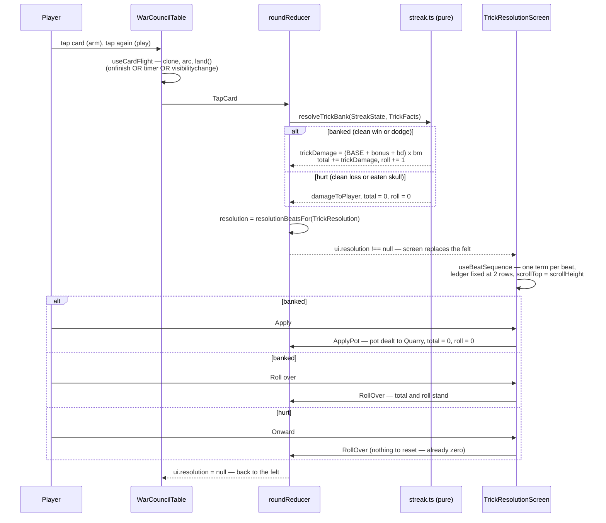

# Plan: Roll-over damage — a per-trick pot the player cashes or pushes, on its own resolution screen

Plan folder: `.claude/contract/DLR-156-roll-over-damage-model/`
Execution status: see `tasks.md` in this folder.

---

## Part 1 — Alignment

### Task reference

**DLR-156** — *Roll-over damage: a per-trick pot the player cashes or pushes, on its own resolution screen*. Story under epic DLR-103, labels `playable` + `ui`. Moved `To Do → Planning` at the start of this run.

The ticket names three documents as the source of truth, all now carried into this folder so it stands alone after `/clear`:

- `spec.md` (the ticket's `roll-over-damage-model.md`) — the arithmetic, the rules, and the unresolved design questions.
- `ui-notes.md` — the approved surface behaviour, and its §6 "must carry into `src/`" table of six things that exist because something failed.
- `mockup.html` — the working article, **signed off by the developer on 2026-08-27** ("the UI is perfect"). Not re-authored for this plan; it is the approved article and is cited as a pattern reference.

**Acceptance criteria, verbatim from the ticket:**

1. A trick the player **takes** computes `(baseDamage + buffDamage) x buffMult`, adds it to a running total, and increments the roll by one.
2. The pot is `total x roll`, and it is on screen with its parts legible.
3. After a taken trick resolves, and before the next trick begins, the player is offered **apply** or **roll over**. This prompt is the only place the pot can be cashed.
4. The Apply Damage **button is removed** from the action bar, along with its leader-only and trick-in-progress refusals — `applyDamageRefusalFor` has no caller left.
5. Applying deals the pot to the Quarry and sets the total and the roll to zero.
6. Rolling over leaves both untouched and play continues.
7. A trick the player **loses** deals the hit's damage to the player, sets the total and the roll to zero, deals nothing to the Quarry, and offers no choice.
8. The end of a hand does **not** cash the pot. Total and roll carry into the next hand unchanged.
9. The pot, the total and the roll all reset to zero when a fight ends.
10. `baseDamage` is a single configured constant, **1**, read in one place.
11. A Blade card contributes to `buffDamage` on the trick it was fired on only; a Momentum card contributes to `buffMult` on the trick it was fired on only. Neither pools across tricks.
12. Tier values are **unchanged**: Blade pays 1 / 3 / 5 and Momentum pays 2 / 3 / 5 at bronze / silver / gold.
13. Bare play — no cards fired — pays 1, 4, 9, 16, 25, 36 across a six-trick hand, matching today.
14. The build-up and the apply-or-roll decision are a **separate full-viewport screen**, not a panel on the table. The trick is decided on the felt; the two played cards are carried onto the resolution screen.
15. The played card **travels** from the hand to the table rather than appearing there, and the landing does not depend on an animation finishing — a hidden tab must not lock the hand.
16. Every term of the formula lands **one at a time**, each visibly moving the number. The Overlap Bonus gets its own beat.
17. The ledger window is **exactly two rows tall at all times** — it does not grow past two terms or collapse below them — scrolls above two, and always shows the newest term.
18. Under `prefers-reduced-motion` the one-term-at-a-time sequence still runs; only the travel, scale and ring are dropped.

**Critical vocabulary note, inherited from `CLAUDE.md` and restated in `spec.md`:** these criteria say "takes"/"loses", but the rule is keyed to the **outcome axis**, not the mechanical one. A skull inverts a trick. The two branches are **banked** (a clean win, *or a dodge*) and **hurt** (a clean loss, *or eating a skull*). `bank.ts`'s existing `isTaken(outcome)` is already exactly this predicate and is what the new code reads.

### Restated goal

Replace the game's damage equation. Today a streak of *n* tricks pays `bank x multiplier` — two counters that hold the same number — with buff rewards pooled across the whole hand and spent at whichever cash-out fires, and a hit paying back two-thirds. Under this ticket each **banked** trick computes its own damage as `(baseDamage + buffDamage) x buffMult` using only the buffs fired *on that trick*, adds it to a running `total`, and increments a `roll`; the pot the player is sitting on is `total x roll`. A trick that **hurts** the player wipes both to zero and pays the Quarry nothing — there is no two-thirds consolation. The hand boundary does nothing at all: total and roll carry into the next hand and clear only when the fight ends.

The Apply Damage button in the action bar disappears, along with every refusal reason that gated it and the delayed-payout queue behind it. In its place, every banked trick hands off to a **second full-viewport screen** — not a modal over the felt — which carries the two played cards across, derives the trick's damage one term at a time in a fixed two-row ledger, and then asks the player to *apply* (deal the pot, reset both) or *roll over* (keep both, play on). A trick that hurt the player reaches the same screen but has nothing to decide: it states what was lost and offers a single way out. The card also gains a real flight from the hand to the table, with a landing that cannot be stranded by a hidden tab.

The formula lands **deliberately unbalanced** — roughly two and a half to three times today's payout for identical cards, with nothing capping a streak. That is the point: the counterweight (a health penalty staked by firing a buff) is a later ticket, and how much of it is needed is meant to be found by playing this one.

### In scope

- **The damage formula.** `(baseDamage + buffDamage) x buffMult` per banked trick, accumulated into `total`, multiplied by `roll` to give the pot — replacing `cashValue(bank, multiplier)` and its forced two-thirds variant throughout `src/warCouncil/bank.ts`.
- **`baseDamage` as one configured constant, `1`,** in `src/hunt/config.ts`, read in exactly one place (AC10).
- **Per-trick buff accrual.** Blade contributes flat damage and Momentum contributes multiplier **on their own trick only** — the hand-long pooling in `src/hunt/buffAccrual.ts` and its `payableCashOutBonus` / `markCashOutPaid` spend model stops feeding the damage equation (AC11). Tier values are untouched (AC12).
- **The Overlap Bonus keeps firing per trick** and gets its own ledger beat (AC16).
- **The streak crossing a hand boundary.** `total` and `roll` become run-carried figures following DLR-150's `feederCarry` pattern exactly — mount prop in, `WarCouncilRoundResult` field out, `recordEncounter` adopts them and wipes them at the fight boundary (AC8, AC9).
- **Removing the Apply Damage control** — the action-bar plate, `applyDamageRefusalFor`, `ApplyDamageStock`, `applyDamageStock`, the `TapApplyDamage`/`CancelApplyDamage` actions, `applyPoised`, and their labels (AC4).
- **Removing the delayed-payout queue** — `src/hunt/applyDamagePayout.ts`, `EncounterState.pendingApplyPayout`, `PayoutOutcome`, `TrickPayoutEvent`, `ResolvedTrick.payout`, and DLR-141's `APPLY_DAMAGE_HIT_RETENTION` retention rule, all of which lose their only caller.
- **Removing the forced cash-out** — `forcedCashValue`, `FORCED_CASH_OUT_NUMERATOR`, `FORCED_CASH_OUT_DENOMINATOR` (AC7 pays a hit nothing).
- **The new resolution screen** — a second full-viewport shell holding the trick's two cards, the header, the ledger, the pot readout and the choice, with the banked branch (apply / roll over) and the hurt branch (Onward).
- **The build-up sequence** — one beat per formula term, in order, each visibly moving the number, with the Overlap Bonus on its own beat, and the two-row fixed ledger window that scrolls and follows the newest term by instant assignment (AC16, AC17).
- **`prefers-reduced-motion`** — the beat sequence still runs; only travel, scale and ring are dropped (AC18).
- **The card's flight** from the hand to the table, cloned into a fixed layer, with a timer plus `visibilitychange` backstop and an idempotent landing (AC15).
- **Splitting `WarCouncilRound.tsx`**, which is at 390 of its 400-line budget and cannot absorb a second screen.

### Explicitly out of scope

- **Any balancing.** No health total, shop price, tier value, or AP figure is retuned. The payout lands large on purpose.
- **The damage penalty on buff cards** — the intended counterweight, deliberately a later ticket.
- **Anything that moves `baseDamage` off a constant** — no card family that raises it.
- **Choosing any tuning value in the mockup** — `--beat`, the hold after a choice, flight duration, ledger row height, size bounds, colours. All are marked PLACEHOLDER in `mockup.html` and are transcribed as documented placeholders here, not chosen.
- **The two design questions `spec.md` leaves open** — that holding every buff back until the trick before you cash is still weakly dominant for an exposure reason, and whether the roll should survive a hit. Both are a separate design pass.
- **Restoring any cut buff family or reward axis.** The 16-template pool stands (`CLAUDE.md` → cut buffs).
- **Whether the prompt should block, auto-dismiss on a bare trick, or move faster.** `spec.md` and `ui-notes.md` §7 both mark this a play-and-see judgement. This ticket ships the blocking, always-shown screen the mockup implements.
- **Proving the screens do not scroll in Vitest.** jsdom has no layout engine; that belongs to a browser pass.

### Pattern Reference

Supplied by the brief, and authoritative:

- `.claude/contract/DLR-156-roll-over-damage-model/mockup.html` — the approved article. Its CSS is a draft of the real stylesheet rather than something to re-author; its `:root` block is already copied from `src/app/warCouncil/warCouncil.css` with the additions marked.
- `ui-notes.md` §6's carry table — six things that exist because something failed, each of which will fail the same way again if dropped.
- `spec.md` → "Files likely touched": `src/warCouncil/bank.ts`, `src/warCouncil/voluntaryCashOut.ts`, `src/app/warCouncil/buffRoundState.ts`, `src/app/warCouncil/roundUiState.ts`, and the Blade/Momentum accrual in `src/hunt/`.

Chosen here, because the brief named the files but not the shape:

- **DLR-150's `feederCarry`** is the exact precedent for a figure that crosses a hand boundary and dies at a fight boundary: `RunState.feederCarry` → `WarCouncilMountProps.feederCarry` → `roundUiSeed.ts` → `WarCouncilRoundResult.feederCarry` → `recordEncounter`'s `feederCarryAfter`. The streak follows it field for field.
- **`src/app/warCouncil/cardDamage.ts`** is the precedent for "performs no damage arithmetic" — it threads a hypothetical `TrickFacts` through the *real* `resolveTrickBank` and reads a delta back. It therefore inherits the new formula for free and needs no arithmetic changes.
- **`src/app/warCouncil/roundHandSummary.ts` / `roundBars.ts` / `roundControlsProps.ts`** are the precedent for extracting a derivation out of `WarCouncilRound.tsx` when it approaches its budget.
- **`src/app/warCouncil/useRovingTabIndex.ts`** is the existing roving-tabindex hook the hand already uses; the resolution screen's two buttons are a plain pair and need no such treatment.
- `.claude/skills/react-frontend/SKILL.md` and `.claude/skills/game-ux/SKILL.md` for conventions — named, not restated.

### Constraints flagged on the brief

- **A hit is total, and it will feel harsh.** Losing a nine-trick streak costs everything. Accepted by the developer as the change that makes the push a real decision.
- **Blade changes character; Momentum moves the other way.** Inside the bracket both `buffMult` and the roll multiply a Blade, so on a long streak the same card is worth many times more. Momentum now affects only its own trick.
- **Interaction cost is the main risk in the change.** The prompt fires up to six times a hand where the old button might be pressed once or never, and it is now a whole screen.
- **The landing must not depend on `onfinish` alone.** A real defect, found and fixed in the mockup: a background tab freezes WAAPI at time 0, `onfinish` never fires, and the hand locks up for the rest of the session.
- **The ledger follow is an instant `scrollTop` assignment and must never become `behavior: 'smooth'`.** Measured in the mockup: `scrollTop` never left 0 and every term after the second landed out of sight with no sign anything had happened.
- **No `filter: url()` and no `mix-blend-mode` on a card** — inherited from DLR-147, where a per-card filter stalled Chrome's rasteriser hard enough to time out screenshots.
- **`display: block` on the card face** — it is a `<span>`, and width does not apply to an inline box.
- **The numeral on a loaded card, not just the glow** — the only carrier that survives greyscale and reduced motion.
- **Size the well in container units** — a `vw` bound is blind to the viewport that breaks it; `vh` prices the card against a height the stage does not have.
- **Two runtime dependencies only.** Nothing here needs a third; the flight is Web Animations plus a timer, the beat is a timer.
- **`the-hunt.md` is `implementation-doc-writer`'s to update, never edited by hand.**

### Assumptions made

1. **`bank` and `multiplier` are renamed to `total` and `roll` rather than kept with changed meaning.** `spec.md` uses `total`/`roll`/`pot` throughout, and a field called `bank` that holds accumulated damage rather than a count of tricks is exactly the vocabulary trap `CLAUDE.md`'s Win/Lose section exists to prevent. Cost is quantified in the audit below. `BankState` becomes `StreakState`, `cashValue` becomes `potValue`, and `src/warCouncil/bank.ts` becomes `src/warCouncil/streak.ts`.
2. **`TrickFacts.bankClimbBonus` (DLR-92's Whetstone) survives as a `baseDamage` bonus** — the trick's base becomes `baseDamage + bankClimbBonus` inside the bracket. The item used to add to the trick's bank contribution; the nearest faithful translation is that it adds to the trick's base damage. Silently dropping a purchasable shop item would be a balance change the ticket forbids. AC13's `1, 4, 9, 16, 25, 36` still holds exactly, because a run with no Whetstone has a bonus of 0. Renamed `baseDamageBonus` to stop naming a bank that no longer exists. **Flagged in Risks — this is a rule reading the brief does not make.**
3. **Applying deals the pot immediately; the delayed-payout queue is removed outright.** AC5 says applying "deals the pot to the Quarry". The prompt is raised *after* a trick has resolved, so a queue keyed on trick resolutions would pay a whole trick later than the choice, which contradicts AC5. `applyDamagePayout.ts` and `EncounterState.pendingApplyPayout` therefore lose their only caller and go.
4. **Applying costs no action points.** `APPLY_DAMAGE_AP_COST` was the price of a *press* the player could choose to make; the prompt is mandatory and unavoidable, so charging AP for it would tax every banked trick. The constant and its spend are removed. **Flagged in Risks.**
5. **The resolution screen replaces the felt rather than overlaying it,** per `ui-notes.md` §1: "a second full-viewport shell, not a modal over the felt". `WarCouncilRound.tsx` becomes a switch between two sibling screens.
6. **The two played cards are cloned onto the resolution screen, not moved** — `ui-notes.md` §1: a trick well that lost its cards while the screen was up reads as a bug on the way back.
7. **The screen shows on every resolved trick, banked or hurt,** and blocks. `ui-notes.md` §4 gives the hurt branch its own content and a single **Onward** exit, so there is no branch that renders nothing. Whether it should skip a bare trick is explicitly a later play-and-see judgement.
8. **The beat sequence is derived by a pure module and played by a hook.** `resolutionBeats.ts` turns a `TrickResolution` plus its fired buffs into an ordered `readonly ResolutionBeat[]`; `useBeatSequence.ts` owns the timer and the reduced-motion branch. The arithmetic is then unit-testable with no renderer, and the component holds no formula.
9. **The beat list is derived from the engine's own resolution, never recomputed.** `TrickResolution` gains the per-term breakdown it already knows (`firedBuffIds`, the base, the overlap) so the screen narrates what the engine decided rather than running a second copy of the rules — the discipline `buffProjection.ts`'s docblock sets out.
10. **`Hoarder`'s `bankAfterTrick` context field is fed `roll` after the trick.** Hoarder is a cut, unconstructible family, so the value is inert; feeding the roll keeps the field meaning "the streak figure after this trick" rather than pointing at a deleted one. Named in the field's docblock so a restoration ticket sees it.
11. **`Debt Collector`'s `applyDamagePressed` flag survives and is set when the player chooses *apply* at the prompt.** Also a cut family, also inert, but the trigger moves to the only place a cash-out can now happen.
12. **All mockup timings, bounds and colours are transcribed verbatim as named CSS custom properties with a `PLACEHOLDER` comment.** Transcribing a documented value from an approved artefact is not inventing one; every transcribed value is listed for the developer under "Developer decides or observes".
13. **The card flight is Web Animations plus a `setTimeout` backstop plus a `visibilitychange` listener, with an idempotent `land()`,** exactly as `ui-notes.md` §2 specifies. No new dependency.

### Config and persisted-shape audit

Run with `Grep`/`Select-String` against the live tree on 2026-09-01. Counts are quoted as the commands printed them.

- **Nothing this plan touches is persisted.** `src/persistence/` is the only tree that reaches storage, `SAVE_SCHEMA_VERSION` is `1`, and the only `createSaveStore` caller in `src/` is `src/vault/vaultStore.ts`. `RunState` and `EncounterState` are explicitly never persisted (`run.ts`'s own docblocks). **No `SAVE_SCHEMA_VERSION` bump is needed and no reject condition in `.claude/rules/save-data-versioning.md` is engaged.** Recording that this window is open, per that rule's own guidance.
- **`RoundState.bank` / `RoundState.multiplier` → `total` / `roll`.** `\bbank:` returns **115 hits across 43 files (9 source, 34 test)**; `\bmultiplier:` returns **117 hits across 45 files (10 source, 35 test)**; `\.bank\b` returns **69 hits (9 source files, 17 test files)**; `\.multiplier\b` returns **67 hits (9 source files, 14 test files)**. The **10 non-test source files** are `BankMeter.tsx`, `buffBreakdownModel.ts`, `cardDamage.ts`, `duelHealthBars.ts`, `roundUiState.ts`, `bank.ts`, `deal.ts`, `playCard.ts`, `types.ts`, `voluntaryCashOut.ts`. Every test file in the list is a construction site of a `RoundState` or `StreakState` literal and is in scope; most are rewritten anyway because the formula they assert changed.
- **`BankState` → `StreakState`: 17 annotated sites, and its construction sites are the `resolveTrickBank(` calls — 78 across 7 files** (`cardDamage.ts` 1, `bank.ts` 2, `playCard.ts` 1, `bank.buffs.test.ts` 12, `bank.integration.test.ts` 2, `bank.test.ts` 45, `rankTiers.resolution.test.ts` 15). **78 is the real number**, not 17.
- **`TrickResolution`: 20 annotated sites, 15 construction sites** (counted on the distinctive required field `cashedAtHandEnd`). The larger figure governs; `cashedAtHandEnd` itself is deleted, since AC8 removes the end-of-hand cash entirely.
- **`TrickFacts`: 37 annotated sites, 106 construction sites** (counted on the distinctive required field `bankClimbBonus`), spread over **34 files** — 4 source (`cardDamage.ts`, `commitHandlers.ts`, `playCard.ts`, `bank.ts`), the sim (`playHandWindows.ts` plus 2 sim specs), and the rest app/engine specs. Renaming that field to `baseDamageBonus` therefore touches **106 sites**, not 37, and every one is inside the union of the tasks' file lists.
- **`WarCouncilMountProps`: 21 annotated sites, 24 construction sites** (counted on the distinctive required prop `quarryLabel`), across **16 files** — but `src/app/warCouncil/__tests__/roundFixture.ts` is a shared builder that absorbs most of the component specs, so the new `streak` prop lands in `roundFixture.ts`, `App.tsx`, `warCouncilMount.ts` and `sim/playHandWindows.ts` and propagates.
- **`WarCouncilRoundResult`: 19 annotated sites, 8 construction sites** (counted on the distinctive required field `unplayedAtResolve`), across **7 files**, of which `roundResult.ts` is the single real producer (DLR-150 collapsed three literals into it) plus `src/sim/playHand.ts`'s report.
- **`RoundUiSeed` / `createRoundUiState`: 22 annotated sites, 65 `createRoundUiState(` construction sites.** The seed gains one field (`streak`), optional and defaulted to zero following `feederCarry`'s own precedent, so the 65 sites keep compiling unchanged. Stated explicitly because that is *why* the field is optional.
- **Type changes checked for loss.** `bank: number` → `total: number` and `multiplier: number` → `roll: number` are same-type renames: no widening, no narrowing, no required→optional. The genuine losses are **deletions** — `TrickResolution.cashedAtHandEnd`, `TrickResolution.bankAdded`, `ResolvedTrick.payout`, `EncounterState.pendingApplyPayout`, `ApplyDamageStock`, `PendingApplyPayout`, `TrickPayoutEvent`, `PayoutOutcome`, `CashOutBonus` — each of which surfaces as a compile error at every reader, which is the intent.
- **Constants losing their last caller:** `FORCED_CASH_OUT_NUMERATOR`, `FORCED_CASH_OUT_DENOMINATOR` (`forcedCashValue|FORCED_CASH_OUT` → **52 hits**), `APPLY_DAMAGE_AP_COST`, `APPLY_DAMAGE_DELAY_TRICKS`, `APPLY_DAMAGE_HIT_RETENTION`. `applyDamageRefusalFor|ApplyDamageStock|applyDamageStock|ApplyDamageRefusal` → **100 hits**; `applyPoised|TapApplyDamage|CancelApplyDamage` → **68 hits**; `PendingApplyPayout|queueApplyPayout|queueApplyDamagePayout|hasPendingApplyPayout|tickApplyPayout|reduceApplyPayoutOnHit|settleApplyPayout` → **100 hits**. Every one of those hits is a deletion site.
- **Architectural boundary holds.** `src/warCouncil/**` and `src/hunt/**` are lint-enforced React-free and DOM-free by `eslint.config.js`'s pure-core override. The new work respects it: the formula, the streak state and the beat *derivation* live in those trees or in `src/app/warCouncil/resolutionBeats.ts` (pure, but app-layer because it produces worded labels); every timer, listener and animation lives in a `use*` hook under `src/app/warCouncil/`. **No design here requires a DOM global or a React import inside the pure trees.**
- **String-bound names introduced:** the CSS custom properties `--wc-beat`, `--wc-resolve-hold`, `--wc-flight`, `--wc-ledger-row`, and the class prefix `wc-resolve-`. No `data-testid` is added — this codebase's component specs query by role and accessible label, and that convention is kept. Each name is declared once, in `src/app/warCouncil/warCouncilResolve.css`, and read from there.

---

## Part 2 — Technical design

### Approach

**The engine first, and the engine alone owns the arithmetic.** `src/warCouncil/bank.ts` becomes `src/warCouncil/streak.ts` and its two counters become `total` (accumulated damage) and `roll` (tricks in the streak). `resolveTrickBank` keeps its shape — one pure function over `(StreakState, TrickFacts) -> TrickResolution` — and loses three whole branches: the forced two-thirds cash-out, the end-of-hand fold, and the `payableCashOutBonus`/`markCashOutPaid` spend model. What replaces them is one expression on the banked branch, `(BASE_DAMAGE + facts.baseDamageBonus + buffDamage) * buffMult`, and on the hurt branch two assignments to zero. `potValue(total, roll)` replaces `cashValue`, keeps the same integer guard, and is again the single statement of what a streak is worth — but now with only *one* caller, because there is only one cash-out left.

The chosen alternative to that is worth naming: the pot could have been derived in the app layer from `total` and `roll` held on `RoundUiState`, leaving the engine ignorant of it. That was rejected because `cardDamage.ts`'s per-card win/lose preview is built entirely on threading a hypothetical `TrickFacts` through the real `resolveTrickBank` and reading a health delta off `applyResolution` — a preview built on a second copy of the rules drifts from the rules, which is the failure `buffProjection.ts`'s own docblock records. Keeping the formula in the engine means the hand-fan preview inherits the new equation with **no arithmetic change at all**, which is the largest single saving in this plan.

**Per-trick buff accrual is a subtraction, not an addition.** `resolveFiredBuffs` already computes one trick's contributions and the Overlap Bonus; today the result is *added into* a hand-long accrual whose unspent balance is read at each cash-out. The change is to read that trick's contribution directly — a new `trickBonusFor(fired, trickIsLoss)` in `src/hunt/buffAccrual.ts` returning `{ flatDamageBonus, multiplierBonus, overlapBonus }` for **this trick only** — and to let the hand-long accrual keep existing solely for the three axes that are not damage: Purse coins, the AP refund, and DLR-150's Feeder carry. That keeps `startHandAccrual`, `accrueAxisBonus` and `accrueCarry` intact and untouched by the damage path, and it deletes `payableCashOutBonus`/`markCashOutPaid` and the `multiplierPaid`/`flatDamagePaid` bookkeeping that existed only to stop a pool being paid twice. R6's per-hand caps `MAX_MULTIPLIER_BONUS_PER_HAND` and `MAX_FLAT_DAMAGE_BONUS_PER_HAND` are both `Number.POSITIVE_INFINITY` today, so removing them from the damage path changes no number.

**The streak crosses hands by copying DLR-150's carry, verbatim.** `RunState` gains `streak: StreakState`; `WarCouncilMountProps` gains an optional `streak` defaulted to zero; `roundUiSeed.ts` seeds `RoundState.total`/`roll` from it rather than from `dealRound`'s hard zeros; `roundResultFor` hands the live figures back on `WarCouncilRoundResult.streak`; and `recordEncounter` adopts it through a `streakAfter(encounter, streak)` that mirrors `feederCarryAfter` exactly — carrying it while the fight is live and returning `EMPTY_STREAK` the moment the encounter resolves (AC9). The alternative, moving the counters off `RoundState` onto `RoundUiState`, was rejected: `resolveTrickBank` and `playCard` both thread them today, and lifting them into the app layer would put a rule the engine owns behind a React boundary.

**The felt splits into two screens.** `WarCouncilRound.tsx` stands at 390 of its 400-line budget, so it cannot absorb a second shell; it becomes a thin switch that owns the reducer and renders either `<WarCouncilTable>` (everything currently inside `.wc-shell`, moved wholesale) or `<TrickResolutionScreen>`. The switch is `ui.resolution !== null` — one new nullable field on `RoundUiState`, following the `discardSelection` and `loadout` precedent of *one* nullable field rather than a boolean-plus-payload pair that would admit "closed but holding a stale trick". `commit` sets it on the same `null -> non-null` edge of `resolvedTrick` that `foldBuffOutcome` and `openWindowOnTrickResolved` already fire on; the prompt's two new actions, `ApplyPot` and `RollOver`, clear it.

**The build-up is a pure list played by a hook.** `resolutionBeats.ts` (app layer, pure, no React) turns a `TrickResolution` plus the run's buff pile into an ordered `readonly ResolutionBeat[]` — base, then one beat per fired buff in `firedBuffIds` order, then the Overlap Bonus if non-zero, then the banked/hurt summary. Each beat carries the running damage and multiplier *after* it lands, so the component renders a value rather than computing one, and the whole sequence is assertable in a `.test.ts` with no renderer. `useBeatSequence.ts` owns the single `setTimeout` chain, clears it in cleanup, and is idempotent under StrictMode's double mount because it keys off a beat index in state rather than appending to anything. `prefers-reduced-motion` is read once through `matchMedia` and only suppresses the travel/scale/ring classes — the stagger itself is information and always runs (AC18).

**The ledger is two rows, always, and follows by assignment.** A fixed `height: calc(2 * var(--wc-ledger-row))` container with `overflow-y: auto`; after each beat lands, an effect sets `scrollTop = scrollHeight` directly. Never `scrollIntoView`, never `behavior: 'smooth'` — `ui-notes.md` records that the smooth version silently never ran and every term after the second landed out of sight. The row height is pinned to a token, not to content, so two rows is exactly two rows whatever a card is called. This is the one scrolling region in the whole change, and `game-ux`'s no-scroll floor is met by scoping the overflow to it rather than to the shell.

**The flight is a hook with three ways to land.** `useCardFlight.ts` clones the card into a fixed layer above everything (never clipped by the hand's or the felt's overflow), animates it on an arc with Web Animations, and lands via an idempotent `land()` reachable from `onfinish`, from a `setTimeout` matched to the duration, and from a `visibilitychange` handler. All three are released in the effect's cleanup. The gap in the hand collapses *after* the landing, never during. This is the one place in the plan where a defect is being copied forward deliberately rather than discovered: `ui-notes.md` §2 records that a hidden tab freezes WAAPI at time 0 and the awaited `onfinish` never fires, locking the hand for the rest of the session.

### Skills to invoke during execution

- **`react-frontend`** — owns everything under `src/`: the reducer's new actions, the two new components and three new hooks, the 400-line budget on every file created or grown, effect cleanup, StrictMode idempotence, the no-speculative-memoisation rule, and the Vitest posture (pure logic in `.test.ts` with no renderer, components queried by role and label in `.test.tsx`).
- **`game-ux`** — owns the game-screen layer: the resolution screen as a full-viewport `dvh` grid with `overflow: hidden` and safe-area insets, its zoning, the tap cost of a prompt that fires up to six times a hand, state that reads without colour or motion alone (the greyscale check on the two prompt buttons and the winning side), and the 4.5:1 contrast floor re-measured on whatever ground each token actually sits on.

Confirmed by the developer via `AskUserQuestion`; `game-designer` was offered and declined, correctly — the arithmetic is settled in `spec.md` and re-opening it is out of scope.

The executor must also Read, before starting: `.claude/workflow/web-project.md` (paths, runners, the correctness traps, and the `Select-String` recursion trap that makes a "this name is gone" grep report a false green). `.claude/rules/save-data-versioning.md` was scanned and **does not apply** — nothing in this plan is persisted — but its reject condition 1 (no `localStorage`/`sessionStorage` outside `browserStorage.ts`) remains lint-enforced across the whole diff.

### Diagram



### Data shapes

#### `src/hunt/config.ts` — new and removed constants

```ts
/** AC10 — the damage every banked trick starts from, before any buff. THE single statement of
 *  it; nothing else may write a bare 1 into the damage equation. UNIT: damage. */
export const BASE_DAMAGE: Damage = 1

// REMOVED (no caller left):
//   FORCED_CASH_OUT_NUMERATOR, FORCED_CASH_OUT_DENOMINATOR   — AC7: a hit pays the Quarry nothing
//   APPLY_DAMAGE_AP_COST                                     — Assumption 4: the prompt is not a press
//   APPLY_DAMAGE_DELAY_TRICKS, APPLY_DAMAGE_HIT_RETENTION    — Assumption 3: the queue goes
```

#### `src/warCouncil/streak.ts` (was `bank.ts`)

```ts
/** The two running figures a STREAK carries. Replaces `BankState`. Crosses hand boundaries
 *  (AC8); wiped only at a fight boundary (AC9). */
export interface StreakState {
  /** Accumulated trick damage since the last apply or hit. UNIT: damage. */
  readonly total: number
  /** Tricks banked in a row since the last apply or hit. UNIT: tricks. */
  readonly roll: number
}

export const EMPTY_STREAK: StreakState = { total: 0, roll: 0 }

/** AC2 — what the streak is worth right now. THE one statement of it; replaces `cashValue`.
 *  Same integer/NaN guard as `cashValue` had, and for the same reason: this figure feeds
 *  damage, then a rendered heart row. */
export function potValue(total: number, roll: number): number

/** AC1's per-trick figure, broken into the terms the resolution screen narrates. */
export interface TrickDamage {
  /** BASE_DAMAGE + TrickFacts.baseDamageBonus. */
  readonly base: number
  /** Flat damage from the Blade cards fired ON THIS TRICK (AC11). */
  readonly buffDamage: number
  /** 1 + the Momentum points fired ON THIS TRICK + the Overlap Bonus (AC11, AC16). */
  readonly buffMult: number
  /** `overlapBonusFor(firedCount)` — carried separately so it gets its own beat (AC16). */
  readonly overlapBonus: number
  /** (base + buffDamage) * buffMult. */
  readonly dealt: number
}

export interface TrickResolution extends StreakState {
  readonly outcome: TrickOutcome
  /** AC1 — this trick's own damage and its terms. `null` on a hurt trick, which computes none. */
  readonly trickDamage: TrickDamage | null
  /** AC5/AC7 — damage dealt to the Quarry by THIS trick. Now always 0: only the apply choice
   *  pays, and it pays through `applyPot`, not through a resolution. */
  readonly cashOut: number
  readonly damageToPlayer: number
  readonly timebombTarget: DuelSide | null
  readonly timebombToQuarry: Damage
  readonly blastGuardSpent: boolean
  readonly buffAccrual: BuffBonusAccrual | null
  readonly firedBuffIds: readonly BuffId[]
  // REMOVED: bankAdded, cashedAtHandEnd — AC8 deletes the end-of-hand cash entirely.
}

export interface TrickFacts {
  readonly playerWon: boolean
  readonly skullTrick: boolean
  /** Retained: `finalTrick` no longer cashes anything (AC8) but Unbloodied still reads it and
   *  `HAND_SIZE` still ends the hand. */
  readonly finalTrick: boolean
  readonly timebombTrick: boolean
  readonly timebombToPlayer: Damage
  readonly timebombToQuarry: Damage
  readonly blastGuarded: boolean
  /** RENAMED from `bankClimbBonus` (Assumption 2). Extra BASE DAMAGE on a banked trick, on top
   *  of `BASE_DAMAGE`. A plain number handed in, never a run figure read. 0 is the bare rule. */
  readonly baseDamageBonus: number
  readonly swanKeepsMultiplier: boolean
  readonly swanKeepsBank: boolean
  readonly buffs: BuffTrickInput | null
}

/** AC5 — the apply choice. Deals `potValue(total, roll)` to the Quarry and zeroes both. */
export interface PotApplication {
  readonly streak: StreakState   // always EMPTY_STREAK
  readonly dealt: number
}
export function applyPot(streak: StreakState): PotApplication
export function incomingFromPot(dealt: number): IncomingDamage

// REMOVED: cashValue, forcedCashValue, BankState
```

`RoundState` in `src/warCouncil/types.ts` renames its two fields in place:

```ts
/** AC1 — accumulated trick damage since the last apply or hit. Seeded from the run's carried
 *  streak (AC8), not zeroed by the deal. */
readonly total: number
/** AC1 — tricks banked in a row since the last apply or hit. */
readonly roll: number
```

#### `src/hunt/buffAccrual.ts`

```ts
/** AC11 — ONE trick's contribution, for THIS trick only. Nothing pools. */
export interface TrickBuffBonus {
  readonly flatDamageBonus: number
  readonly multiplierBonus: number
  /** `overlapBonusFor(fired.length)`, carried out separately so the screen can beat it alone. */
  readonly overlapBonus: number
}

export function trickBonusFor(fired: readonly Buff[], trickIsLoss: boolean): TrickBuffBonus

// REMOVED: CashOutBonus, payableCashOutBonus, markCashOutPaid,
//          BuffBonusAccrual.multiplierPaid, BuffBonusAccrual.flatDamagePaid
// RETAINED unchanged: startHandAccrual, accrueAxisBonus, accrueCarry, overlapBonusFor,
//          BuffCarry, EMPTY_BUFF_CARRY — the coin/AP/Feeder-carry axes are untouched.
```

#### `src/hunt/run.ts`, `src/hunt/runTransitions.ts`

```ts
// RunState gains, following RunState.feederCarry field for field:
/** AC8/AC9 — the streak carried between hands of one fight. Wiped at the fight boundary by
 *  `streakAfter`. NEVER persisted, exactly as `coins` and `feederCarry` above. */
readonly streak: StreakState        // startRun() seeds EMPTY_STREAK

// recordEncounter gains an optional trailing parameter, mirroring feederCarry's:
export function recordEncounter(
  run: RunState, encounter: EncounterState, blastGuardHeld: boolean,
  discardsRemaining: number, unplayedAtResolve: number | null,
  coinsEarned?: Coins, buffs?: readonly Buff[], feederCarry?: BuffCarry,
  streak?: StreakState,
): RunState

/** AC9 — carried while the fight is live, EMPTY_STREAK the moment the encounter resolves. */
function streakAfter(encounter: EncounterState, streak: StreakState): StreakState
```

#### `src/app/warCouncilMount.ts`

```ts
// WarCouncilMountProps gains:
/** AC8 — the streak this hand OPENS on. OPTIONAL and defaulted to `EMPTY_STREAK`, following
 *  `feederCarry`, so every existing mount site and fixture reproduces today's game. */
readonly streak?: StreakState

// WarCouncilRoundResult gains:
/** AC8 — the streak after this hand. REQUIRED, following `feederCarry`, so the compiler
 *  enumerates every construction site. */
readonly streak: StreakState
```

#### `src/app/warCouncil/roundUiState.ts`

```ts
/** AC3/AC14 — the resolution screen's whole content, or `null` while the felt is up. ONE
 *  nullable field rather than a boolean-plus-payload pair, exactly as `discardSelection` and
 *  `loadout` are, so "screen closed but holding a stale trick" is unexpressible. */
readonly resolution: ResolutionView | null

export interface ResolutionView {
  /** AC14 — the two played cards, CLONED onto the screen (`ui-notes.md` §1). */
  readonly cards: readonly TrickCard[]
  readonly winner: PlayerSide
  readonly resolution: TrickResolution
  /** AC16 — the ordered beats, derived once at the hand-off. */
  readonly beats: readonly ResolutionBeat[]
  /** The trick's ordinal, for the header line. 1-based. */
  readonly trickNumber: number
  /** AC2 — what the pot becomes if the next trick also banks, at the bare rule. */
  readonly nextPotFloor: number
}

// RoundUiActionKind gains, and loses:
ApplyPot: 'applyPot',      // AC5 — deal the pot, zero both, close the screen
RollOver: 'rollOver',      // AC6 — leave both, close the screen (also the hurt branch's Onward)
// REMOVED: TapApplyDamage, CancelApplyDamage; RoundUiState.applyPoised;
//          ApplyDamageStock, applyDamageStock, applyDamageRefusalFor, ApplyDamageRefusal
```

#### `src/app/warCouncil/resolutionBeats.ts` (new, pure)

```ts
export const BeatKind = {
  Base: 'base',         // AC1's baseDamage (+ baseDamageBonus)
  Blade: 'blade',       // a fired Blade card — moves DAMAGE
  Momentum: 'momentum', // a fired Momentum card — moves MULT only
  Overlap: 'overlap',   // AC16 — the Overlap Bonus, its own beat
  Banked: 'banked',     // the summary row: total and roll before -> after
  Hurt: 'hurt',         // the hurt branch: health taken, pot lost
} as const
export type BeatKind = (typeof BeatKind)[keyof typeof BeatKind]

export interface ResolutionBeat {
  readonly kind: BeatKind
  /** Already-worded label — `src/app/warCouncil/` owns copy, the engine does not. */
  readonly label: string
  /** The signed contribution, for the row's `+1 DMG` / `+2 MULT` figure. */
  readonly amount: number
  /** The running DAMAGE register after this beat. */
  readonly damage: number
  /** The running MULT register after this beat. */
  readonly mult: number
  /** `damage * mult` after this beat — the number the screen animates. */
  readonly running: number
}

/** Derives the whole sequence from what the ENGINE decided. Runs no rule of its own — the
 *  discipline `buffProjection.ts`'s docblock sets out. */
export function resolutionBeatsFor(
  resolution: TrickResolution,
  fired: readonly Buff[],
  before: StreakState,
): readonly ResolutionBeat[]
```

#### New hooks

```ts
/** AC16/AC18 — walks `beats` one per `--wc-beat`, and still staggers under reduced motion.
 *  Owns ONE timer, cleared in cleanup. Idempotent under StrictMode: keyed off an index in
 *  state, appending to nothing. */
export function useBeatSequence(beats: readonly ResolutionBeat[]): {
  readonly landed: number          // how many beats have landed
  readonly reducedMotion: boolean
  readonly done: boolean
}

/** AC15 — clones a card into a fixed layer and flies it on an arc. `land()` is idempotent and
 *  reachable three ways: `onfinish`, a `setTimeout` matched to the duration, and a
 *  `visibilitychange` handler. All three released in cleanup (`ui-notes.md` §2). */
export function useCardFlight(): {
  readonly fly: (from: HTMLElement, to: HTMLElement, onLanded: () => void) => void
  readonly inFlight: boolean
}
```

#### New CSS custom properties — every value a transcribed PLACEHOLDER

Declared once, in `src/app/warCouncil/warCouncilResolve.css`:

| Property | Transcribed value | Unit | What it prices |
|---|---|---|---|
| `--wc-beat` | `520ms` | ms | One term's beat. `ui-notes.md` §7 calls this the single number most worth setting from a play-through. |
| `--wc-resolve-hold` | `700ms` | ms | How long the screen holds after a choice before returning to the table. |
| `--wc-flight` | `380ms` | ms | The card's travel from hand to table. |
| `--wc-ledger-row` | `2.5rem` | length | AC17's pinned row height — two rows is exactly two rows. |

#### `package.json`

No dependency change and no script change. Nothing in this plan needs a third runtime dependency.

### Runtime quality notes

- **Purity and adjudication.** The damage equation lives in `src/warCouncil/streak.ts` — lint-enforced React-free and DOM-free — and is the only place it is stated. `resolutionBeatsFor` is pure and rendererless but sits in `src/app/warCouncil/` because it produces *worded* labels, and `src/warCouncil/` holds no user-facing copy (`voluntaryCashOut.ts`'s own docblock states that rule). No component decides an outcome: `TrickResolutionScreen` renders `ResolutionView.beats` and dispatches one of two actions. `BASE_DAMAGE` is read in exactly one expression, in `resolveTrickBank` (AC10), and the Final verification phase greps the damage path for a bare literal to prove it.
- **Effects, mount and teardown.** Three effects are introduced, all in hooks. `useBeatSequence` holds one `setTimeout`, cleared in cleanup, keyed off a beat index in state so StrictMode's double mount recomputes rather than double-schedules; it also holds one `matchMedia` change listener, removed in cleanup. `useCardFlight` holds a Web Animation, a `setTimeout` backstop, and a `document`-level `visibilitychange` listener; `land()` is guarded by a ref flag so all three paths are idempotent, and cleanup cancels the animation, clears the timer and removes the listener. The ledger's follow is an effect that assigns `scrollTop` and registers nothing, so it has no cleanup to write. `WarCouncilRound.tsx` gains no effect — it stays the effect-free reducer owner it is today. There is no pointer capture anywhere in this change, so the `pointercancel` rule does not bite. No module-level mutable state is introduced.
- **Hot-path cost.** Nothing here runs per pointer event. `resolutionBeatsFor` runs **once** per trick, inside the reducer, at the `null -> non-null` edge of `resolvedTrick` — not per render and not per beat; it allocates one array of at most eight entries (base + up to six fired buffs + overlap + summary). The beat sequence advances at `--wc-beat` intervals, i.e. roughly twice a second, and each tick re-renders one screen. The card's flight runs on the compositor via Web Animations rather than through React state, so the travel does not touch the reconciler at all — only `inFlight` and the landing do. No `memo`/`useMemo`/`useCallback` is added; there is no profiling evidence and no measured problem.
- **Determinism and numeric safety.** No `Math.random()` is reachable from anything here; the trick's damage is a pure function of the resolution the engine already produced, and the sim (`src/sim/`, lint-enforced pure) drives the same `resolveTrickBank`. **There is no division anywhere in the new equation** — removing `forcedCashValue` removes the file's only division, so no epsilon is needed and no divisor needs guarding. `potValue` keeps `cashValue`'s integer guard verbatim (non-integer, non-positive, `NaN` or infinite in gives `0` out) for that guard's stated reason: this figure feeds damage, then a rendered heart row, and a `NaN` would vanish into a health bar with nothing logged. `trickBonusFor` and `resolutionBeatsFor` both take already-validated integers off the engine and are covered by the same guard upstream. The `nextPotFloor` the prompt states is `potValue(total + BASE_DAMAGE, roll + 1)` — the bare rule, because the player may fire nothing next trick — and inherits the same guard.
- **Error paths.** `applyPot` cannot fail: it takes a `StreakState` and returns `EMPTY_STREAK` plus the pot. The reducer's two new cases are total and guarded — `ApplyPot` and `RollOver` on a `null` resolution are no-ops returning `state` unchanged, never a throw, because a throw inside an event handler unmounts the tree (the discipline `primeTapped` already documents). `applyResolution` keeps its existing resolved-encounter short-circuit, so applying a pot into an already-dead Quarry is inert rather than a `RangeError`. `useCardFlight`'s three landing paths are the error path for a hidden tab: if the animation never runs, the timer lands it; if the tab was hidden at start and the timer was throttled, `visibilitychange` lands it on return. Nothing here is async in the promise sense — no fetch, no await — so the four async states do not apply and no `catch` returning a success shape is introduced anywhere.

### Risks and judgement calls

- **The Whetstone reading (Assumption 2) is a rule the brief does not state.** `TrickFacts.bankClimbBonus` has no home in `(baseDamage + buffDamage) x buffMult`. This plan folds it into the base, inside the bracket, so on a long streak it is worth many times more than it was — the same character change the ticket already accepts for Blade. The alternatives are to make it additive *outside* the bracket, or to leave it unread and quietly retire a shop item. **The developer should confirm the reading before Phase 2.**
- **Removing the AP cost on apply (Assumption 4) is a balance change in a ticket that forbids balancing.** There is no way to keep it honestly: the prompt is mandatory, so an AP charge would tax every banked trick rather than pricing a choice. Flagging it rather than hiding it.
- **The rename is large.** `bank`/`multiplier` → `total`/`roll` touches roughly 115 + 117 hits across 45 files, of which 35 are specs. Most of those specs assert the old equation and are being rewritten regardless, but the diff will be big and largely mechanical. The alternative — keeping `bank`/`multiplier` with entirely new meanings — is cheaper today and is exactly the vocabulary trap this codebase has a whole `CLAUDE.md` section about. **Confirm the names `total`, `roll`, `pot`, `StreakState`, `potValue` and the `bank.ts` → `streak.ts` file rename.**
- **`--wc-beat` at 520ms means about three seconds a trick, six times a hand.** Transcribed from the mockup as a placeholder. `ui-notes.md` §7 names it the single number most worth setting from a play-through. **Developer's, and only answerable by playing.**
- **`--wc-resolve-hold`, `--wc-flight`, `--wc-ledger-row`** — all three transcribed placeholders, all three the developer's.
- **Whether the screen changing six times a hand wears out.** `spec.md` and `ui-notes.md` §7 both mark this open. This ticket ships the blocking, always-shown version. The candidate fixes — skipping a bare trick, a faster non-blocking variant — are deliberately not built. **Play-and-see.**
- **The residual layout defect `ui-notes.md` §5 records.** On the *table* screen at 640px of viewport height or less, the trick well overhangs the felt's lip by 7–55px with the prompt open. The measurement is pessimistic, and at 600px the layout wants a structural change rather than a tuning one. The resolution screen itself has zero overflow at every size tested. **Not fixed here; the developer's call whether it becomes its own ticket.**
- **A hit is now total.** Losing a nine-trick streak costs everything. Already accepted on the brief, restated because it is the change most likely to feel wrong first and be right anyway.
- **jsdom cannot prove either screen fails to scroll.** Layout claims belong to a browser pass; `--browser` is opt-in on `/fb-apply`. What *is* tested: the beat derivation, the ledger's two-row cap and its follow-to-newest, focus and `Escape` in the hand, and that the flight lands even when the animation never runs.
