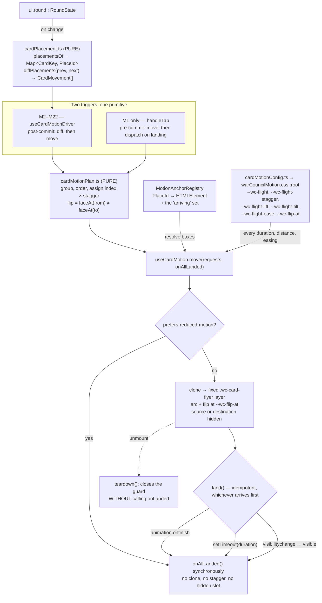

# Plan: Every card movement animates — one shared card-motion system

Plan folder: `.claude/contract/DLR-157-every-card-movement-animates/`
Execution status: see `tasks.md` in this folder.

---

## Part 1 — Alignment

### Task reference

Jira `DLR-157` — *"Every card movement animates: inventory every move in the game, then one shared
card-motion system"* (Story, labels `playable` / `ui`).

Acceptance criteria, verbatim from the ticket:

1. **The planning phase produces a written inventory of every card movement in the game**, recorded
   in the contract folder. For each: source, destination, what triggers it, whether the card is
   face-up or face-down at each end, whether it moves alone or with others, and which code path
   performs it. The seed list above is the starting point and must be proved incomplete or complete,
   not assumed.
2. Every movement in that inventory either animates, or is listed as deliberately instant **with the
   reason stated**. Silence is not an outcome.
3. **One shared motion primitive**, used by every site. Not ten implementations of the same idea.
4. The primitive carries DLR-156's robustness rule: the landing never depends on an animation's
   completion callback alone. A hidden tab, a dropped frame or a cancelled animation must still
   leave the card in its destination, and must never leave the game unresponsive.
5. Simultaneous movements — dealing six cards, a reshuffle — are **staggered rather than fired at
   once**, and the stagger is a single tunable.
6. A card revealed by its own movement (the Quarry's play) flips as part of that movement. Whether
   it flips in transit or on landing is the developer's call, recorded once and applied to every such
   case.
7. No layout reflows under the player's pointer mid-flight. A gap left by a departing card closes
   after it lands, never during.
8. Under `prefers-reduced-motion`, every movement resolves instantly to its end state. No card is
   left mid-flight and no destination is left empty.
9. A movement that cannot currently be reached in play is recorded in the inventory as unreachable
   rather than quietly skipped, and says which ticket would make it reachable.
10. Every duration, distance and easing is a placeholder read from one place, so pacing can be tuned
    in a single pass.

Out of scope, per the ticket: the player's own hand-to-table flight (DLR-156 owns it), new card art,
any rules change, and choosing the timings.

**AC1 is already delivered by this planning run** — `card-movement-inventory.md` in this folder. It
found 27 movements against the ticket's 10-row seed list, and proved two seed rows factually wrong.
Everything below is designed against that inventory, not against the seed list.

### Restated goal

Cards teleport everywhere except one place. DLR-156 built a real flight for the player's own card
(`useCardFlight.ts`, shipped) and proved the mechanism — a cloned card on a fixed layer, an arc, a
gap that closes only after the landing, and a three-path landing race so a hidden tab cannot strand
the game. This ticket takes that one proven flight and turns it into the game's **only** way a card
moves: a shared primitive that resolves places by name rather than by element, flips a card that its
own movement reveals, staggers a group of simultaneous movements off one tunable, resolves instantly
under `prefers-reduced-motion`, and reads every duration, distance and easing from a single token
block. Then it wires that primitive to every one of the nineteen live movements the inventory found
— the Quarry's play, the trick closing, the refill, the deal, the reshuffle, the discard swap, the
Fox, the Woodcutter, the buff going up and coming back, and the two run-level movements in the shop
— leaving the eight non-movements and the four unreachable cases documented rather than silent.

### In scope

- `card-movement-inventory.md` in this folder — **already written** (AC1, AC2, AC9).
- One shared motion primitive, `useCardMotion`, replacing `useCardFlight` as the single
  implementation and carrying DLR-156's three-path landing race unchanged (AC3, AC4).
- A named-anchor registry so a movement can name its source and destination *places* rather than
  hand over two live elements — the thing that makes a post-commit arrival animatable at all.
- A pure, unit-testable placement differ that turns two consecutive `RoundState`s into a list of
  card movements, so nineteen movements share one wiring instead of nineteen (AC3).
- The flip, carried by any movement whose face changes (AC6) — nine of the nineteen.
- The stagger, as one tunable applied to every group (AC5).
- The reflow rule: a departing card's slot holds its space until the landing, and an arriving card's
  slot is laid out but invisible until the landing (AC7).
- The `prefers-reduced-motion` path: no clone, no stagger, the end state reached synchronously (AC8).
- One token block owning every duration, distance and easing, all marked placeholder (AC10).
- Wiring at every animated site the inventory lists: M2, M3, M4, M5, M6, M7, M8, M9, M10, M11, M12,
  M13, M14, M15, M16, M21, M22.
- Re-pointing M1 (the player's own play) at the shared primitive with **no behaviour change** — same
  pre-commit call, same deferred dispatch, same three landing paths.

### Explicitly out of scope

- **Changing what M1 does.** DLR-156 owns the player's hand-to-table flight and its deferred-commit
  semantics. This ticket changes which module implements it and nothing else.
- **Choosing any timing.** Every number ships as a documented placeholder in one token block.
- New card art, a new card face, or any change to what a card looks like at rest.
- Any rules change. Two seed-list errors were found (there is no discard pile; `closeHand` runs at
  hand end, not trick end) — both are *the ticket's description* being wrong about existing code, not
  the code being wrong. Nothing in `src/warCouncil/` or `src/hunt/` changes behaviour.
- Animating the resolution screen's beat sequence, the ledger plaques, or the slot reels. All three
  already have their own approved motion (`ui-notes.md` §3, `useSlotSpin.ts`) and are recorded in the
  inventory as instant-with-reason rather than left silent.
- Making any unreachable movement (M24–M27) reachable.
- Restructuring the trick-well overhang at ≤640px viewport height, the residual `ui-notes.md` §5
  records. It is a layout question, not a motion one.

### Pattern Reference

Supplied by the brief:

- `.claude/contract/DLR-156-roll-over-damage-model/mockup.html` and its `ui-notes.md` — the approved
  reference for what a single card movement looks and feels like. §2 (*The flight*) owns the arc, the
  deferred gap-collapse and the animation-completion trap; §6 (*Carrying it into `src/`*) owns the
  four things that exist because something failed. The ticket's Design Assets section names the
  folder by its pre-archive path; it is now under `.claude/contract/archive/`.
- `src/app/warCouncil/useCardFlight.ts` — the shipped primitive this generalises. Its docblocks carry
  the reasoning for the three-path landing race and are the text to preserve, not re-derive.

Chosen here, because the brief did not name them:

- `src/app/warCouncil/useBeatSequence.ts` and `useSlotSpin.ts` — the two existing patterns for
  reading a pace token out of CSS with a documented fallback, and for a `prefers-reduced-motion`
  branch that is a different code path rather than a shorter duration. Both are followed exactly.
- `.claude/skills/react-frontend/SKILL.md` and `.claude/skills/game-ux/SKILL.md` for conventions.

### Constraints flagged on the brief

- **Blocked by DLR-156, which has landed.** `useCardFlight.ts` exists on this branch (166 lines,
  `src/app/warCouncil/`), is used at exactly one call site, and is covered by its own spec. The
  ticket's "they must not both build one" is therefore settled in DLR-156's favour: this ticket
  **consumes and generalises** the existing primitive rather than authoring a second one.
- **Pace is the risk, not correctness.** The ticket says to expect the first playable version to be
  too slow. Every number ships as a placeholder and the mockup carries a live tuning rail so pacing
  is set by playing rather than by reading.
- **`prefers-reduced-motion` is the case most likely to be left half-done** (AC8). It is a distinct
  code path here, not a shortened duration, and it is asserted in Vitest.
- **jsdom has no layout engine**, so no motion is provable in Vitest. What is testable — and what the
  tests assert — is that every movement's end state is reached regardless of whether the animation
  ran, that the reduced-motion branch reaches it synchronously, and that the placement differ emits
  the right movements.
- Two runtime dependencies only. Nothing here adds a third: Web Animations is a platform API.

### Assumptions made

- **The primitive is diff-driven for every movement except M1.** The inventory's decisive finding is
  that six movements (M4, M5, M6, M7, M10, M12) land in a slot that does not exist until the state
  commits, so their caller cannot hand over two live elements the way `handleTap` does. Wiring each
  by hand at its own commit site is the "ten implementations" AC3 forbids. A single differ over
  consecutive `RoundState`s covers all of them uniformly, including the CPU-driven ones no UI event
  handler ever sees.
- **M1 stays caller-driven and pre-commit.** Switching it to the differ would resolve the trick
  *before* the card lands, undoing DLR-156's deferred dispatch. Both directions go through the same
  primitive, which is what AC3 actually asks for; only the trigger differs.
- **Places are named by a string key resolved through a React context registry**, not by
  `document.querySelector`. The one `querySelector` on the current call site
  (`WarCouncilTable.tsx:231`) already binds two class names outside the compiler's view — nineteen
  of those is a maintenance trap the correctness-traps section of `web-project.md` names explicitly.
- **A pile moves as a pile, not as its cards.** M8 (reshuffle, 20–26 cards) and M14 (hand end, up to
  13) animate one representative card back per pile rather than one per card. Thirteen simultaneous
  flights is the tempo failure the ticket's own risk section predicts.
- **The flip's timing is expressed as a number, not a branch.** AC6 makes the in-transit-vs-on-landing
  call the developer's; shipping it as a 0–1 fraction of the flight (`--wc-flip-at`, `0.5` = mid-air,
  `1` = on landing) turns a design fork into one tunable in the same block as every other, which is
  what "recorded once and applied to every such case" wants. The default value is routed to Risks.
- **A movement whose anchor cannot be resolved lands instantly rather than being skipped**, matching
  `handleTap`'s existing `cardEl === null` branch. A movement into an off-screen place — the Quarry's
  hand past `MAX_VISIBLE_OPPONENT_BACKS`, a card into a collapsed pile — must still reach its end
  state (AC8's rule, applied to a second cause).
- **Nothing under `src/warCouncil/` or `src/hunt/` changes.** The differ reads `RoundState`; it does
  not ask the engine to describe its own movements. The pure-core boundary stays intact.
- **The two run-level movements (M21, M22) are wired last, in their own phase.** The shop and slot
  surfaces have substantial uncommitted changes on this branch; containing them to one phase keeps a
  conflict there from blocking the felt.
- **The inventory lives in the contract folder only.** AC1 says "recorded in the contract folder",
  and `.docs/implementation/` is written by `/fb-apply`'s doc pass, not by hand.

### Config and persisted-shape audit

- **`--wc-flight` — 3 hits**, all in `src/app/warCouncil/`: its declaration at
  `warCouncilResolve.css:14`, and two references in `useCardFlight.ts` (the reader at line 20, a
  docblock mention at line 45). The plan **moves the declaration** into a new
  `warCouncilMotion.css` token block, so all three hits change in one task.
- **`.wc-card-flyer` — 3 hits**: the rule at `warCouncil.css:393`, the assignment at
  `useCardFlight.ts:88`, and a docblock at `useCardFlight.ts:86`. The rule moves to
  `warCouncilMotion.css` in the same task — which also relieves `warCouncil.css`, measured at **405
  lines** and therefore already over the 400-line budget before this ticket touches it.
- **`.wc-trick-row` — 6 hits**: four JSX sites in `TrickWell.tsx` (lines 70, 125, 139, 159), the rule
  at `warCouncilTable.css:108`, and the `querySelector` at `WarCouncilTable.tsx:234`. The
  `querySelector` is replaced by a registered anchor; the class name itself is **not renamed**, so
  the five styling/JSX hits are untouched.
- **`data-buff-anchor` — 3 hits**, in `HandFan.tsx`, `useBuffBreakdownAnchor.ts` and
  `WarCouncilTable.tsx`. Only the last (the flight's `querySelector`) changes; the attribute keeps
  its existing owner and its existing meaning.
- **`useCardFlight` — 14 hits across 7 files**: `useCardFlight.ts` itself, docblock references in
  `useResolveHold.ts` and `useTrickDwell.ts`, the `.wc-card-flyer` comment in `warCouncil.css`, the
  call site in `WarCouncilTable.tsx`, and two specs (`__tests__/useCardFlight.test.tsx`,
  `__tests__/WarCouncilRound.test.tsx`). Every one is accounted for: the hook is renamed to
  `useCardMotion` and its spec renamed with it; the two docblock references are updated in the same
  task; the CSS comment moves with the rule.
- **`CardFlight` (the exported interface): 1 annotated site, 1 construction site, 0 in specs.** The
  only annotation is the hook's own return type; the only construction is its own `return { fly,
  inFlight }`. Consumers destructure rather than annotate — `fly(` has **6 call sites**: the
  declaration, one production call (`WarCouncilTable.tsx:241`) and five in
  `__tests__/useCardFlight.test.tsx` (lines 58, 67, 78, 91, 103). `inFlight` has **12 hits**. The
  larger figure, 6, is the number of sites the rename task covers.
- **New shapes have no existing construction sites.** `CardMoveRequest`, `PlaceId`, `CardMovement`
  and `MotionAnchorKey` are all introduced by this contract; a grep for each returns **0 hits**
  across `src/`, confirming no name collision with an existing export.
- **Nothing persisted changes.** No storage key, no persisted field, no `SAVE_SCHEMA_VERSION`
  concern: motion is presentation state that lives for the length of a flight. `.claude/rules/`
  currently holds one rule, `save-data-versioning.md`, and none of its six reject conditions is
  reachable — no file in this contract's scope names `localStorage`, `sessionStorage`, `saveKeyFor`,
  or a `{ version, data }` envelope.
- **The pure-core boundary is not crossed.** Every new file lives under `src/app/warCouncil/`, which
  the `eslint.config.js` pure-core override does not cover. `src/warCouncil/**` and `src/hunt/**` are
  read from, never imported into.
- **Type changes are additive.** `fly(from: HTMLElement, to: HTMLElement, onLanded)` becomes
  `move(requests: readonly CardMoveRequest[], onAllLanded)`. This is a **narrowing of the caller's
  freedom, not a widening** — two elements become one descriptor list — so every call site must
  change, and all six are enumerated above.

---

## Part 2 — Technical design

### Approach

The shape of the change is *one primitive, two triggers, and a registry between them*.

**The primitive.** `useCardFlight` is renamed to `useCardMotion` and generalised from
`fly(from, to, onLanded)` to `move(requests, onAllLanded)`. Everything DLR-156 proved survives
verbatim: the clone into a fixed layer above every `overflow: hidden` ancestor, the arc that lifts
before it travels, the source hidden with `visibility` so its slot keeps its space, and — the part
that exists because of a real defect — the three-path landing race, where `onfinish`, a `setTimeout`
matched to the duration, and a `visibilitychange` handler all reach one idempotent `land()`. What is
new is that `move` takes a *list*: each request is scheduled at `index × stagger` (AC5), each holds
its own flip flag (AC6), and `onAllLanded` fires exactly once when the last request has landed by
whichever path reached it first. Under `prefers-reduced-motion` the whole thing short-circuits before
any clone is made — no flyer, no stagger, no hidden source, `onAllLanded` called synchronously (AC8).
That is a different code path rather than a one-millisecond duration, following `useSlotSpin.ts`'s
existing precedent, because a one-millisecond animation still creates a node, still hides a slot, and
still depends on a callback firing.

**The registry.** Six of the inventory's movements land in a slot that does not exist until the state
commits, so a caller cannot hand the primitive two live elements. Instead, every place a card can be
registers itself under a stable key through a small React context — `useMotionAnchor(key)` returns a
ref callback, and `HandFan`, `TrickWell`, `DecreePile`, `DiscardPile`, `RoundStatusBand`,
`AbilityPrompt`, `BuffGallery`, `BuffRidingList` and `ShopHeld` each call it once. A request names
`{ from: PlaceId, to: PlaceId }`, and the primitive resolves both to boxes at the moment it measures.
This replaces the one `document.querySelector('.wc-trick-row')` that exists today; nineteen of those
would be nineteen string-bound couplings outside the compiler's view, which is precisely the trap
`web-project.md` names. The registry also carries the `arriving` set — the card keys currently
in flight *toward* a slot — so an arriving card's slot can be laid out but invisible until its clone
lands, which is what makes AC7's rule symmetric: a gap closes after a departure, and a slot fills
after an arrival, never during either.

**The triggers.** M1 keeps DLR-156's caller-driven, pre-commit call: `handleTap` starts the movement
and defers the dispatch to the landing, so the trick still resolves when the card visibly arrives.
Every other movement is **diff-driven**. `cardPlacement.ts` — a pure module, no React and no DOM — maps
a `RoundState` to `ReadonlyMap<CardKey, PlaceId>` and diffs two consecutive maps into a
`readonly CardMovement[]`. A thin `useCardMotionDriver` hook holds the previous placement in a ref,
recomputes on every `ui.round` change, groups the result, and calls `move`. The alternative
considered and rejected was **wiring each movement at its own commit site** — a `fly` call inside the
CPU-advance effect, another inside the deal, another inside `applyDiscard`'s handler. It is simpler
per site and it is exactly the ten-implementations outcome AC3 forbids: nineteen places that each
have to remember the stagger, the flip, the reduced-motion branch and the landing race, and
nineteen places for one of them to be forgotten. It also cannot express M3+M4, which are two
movements in opposite directions committed in a single reducer step. A second alternative — having
the engine emit movement descriptors alongside its new state — was rejected because it would make
`src/warCouncil/` learn about presentation, which the pure-core boundary exists to prevent.

**Where the logic lives.** The differ and the stagger schedule are pure and go in
`cardPlacement.ts` and `cardMotionPlan.ts`, tested by plain function-in/value-out assertions under
Vitest's `node` project — no renderer, which is the right home for the only part of this work with a
real invariant (a card is in exactly one place; a diff conserves every card). Everything that must
touch a box, a clone or `matchMedia` is in `useCardMotion` and the registry, tested under the `dom`
project the way `useCardFlight.test.tsx` already is. The tokens live in one new stylesheet,
`warCouncilMotion.css`, whose `:root` block is the single place AC10 asks for; `cardMotionConfig.ts`
reads them live via `getComputedStyle` with documented literal fallbacks, following
`useBeatSequence.ts`'s `FALLBACK_BEAT_MS` and `useCardFlight.ts`'s own `flightDurationMs` exactly, so
jsdom (which computes no custom properties) still gets a usable number. Two files are at or over the
400-line budget before this ticket starts — `warCouncil.css` at **405** and `WarCouncilTable.tsx` at
exactly **400** — so the flyer rule moves out of the former and the flight orchestration moves out of
the latter into `useTableCardMotion.ts`, relieving both as part of this work rather than handing the
breach back.

### Skills to invoke during execution

- `react-frontend` — owns everything under `src/`: the hook and component structure, the reducer
  discipline, effect cleanup and StrictMode safety, the configuration-not-literals rule, the 400-line
  budget, and the Vitest posture (pure logic tested without a renderer, components queried by role).
- `game-ux` — owns the game-screen layer this ticket lives in: the reflow rule under the player's
  pointer (AC7), the pacing of a repeated action, motion never being a state's only carrier, and the
  browser-not-jsdom limit on any layout claim.

Developer override at the Step 1.5 gate: `implementation-doc-writer` and `game-designer` were
offered and declined. The inventory therefore stays in this contract folder (AC1's own instruction),
and no design document is touched.

The executor must also Read `.claude/workflow/web-project.md` (paths, runners, correctness traps) and
`.claude/rules/save-data-versioning.md` — the latter to confirm, as the audit above already did, that
nothing here persists.

### Diagram



### Data shapes

#### New pure module — `src/app/warCouncil/cardPlacement.ts`

```ts
/** Every place a card can be. String-valued so a key is readable in a debugger and in a test
 *  failure. `erasableSyntaxOnly` is on — this is the `as const` object-map form, never an enum. */
export const PlaceKind = {
  PlayerHand: 'playerHand',
  QuarryHand: 'quarryHand',
  TrickWell: 'trickWell',
  DrawPile: 'drawPile',
  SpentPile: 'spentPile',
  DecreePlate: 'decreePlate',
  AbilityPrompt: 'abilityPrompt',
  BuffGallery: 'buffGallery',
  RidingStrip: 'ridingStrip',
  HeldTray: 'heldTray',
} as const
export type PlaceKind = (typeof PlaceKind)[keyof typeof PlaceKind]

/** A place, addressable. `slot` narrows a multi-slot place to one of its slots — a hand card's own
 *  `cardKey`, a gallery card's buff id. Absent for a place that is one object (a pile, the well). */
export interface PlaceId {
  readonly kind: PlaceKind
  readonly slot?: string
}

/** One card changing place. `face` at each end is derived from the place, not stored on the card. */
export interface CardMovement {
  readonly cardKey: string
  readonly from: PlaceId
  readonly to: PlaceId
}

/** Where every card in `state` currently is. Total: every one of the 33 cards the deck conserves
 *  appears exactly once, which is the invariant the spec pins. */
export function placementsOf(state: RoundState): ReadonlyMap<string, PlaceId>

/** Every card whose place differs between the two maps, in a stable order. A card absent from
 *  `prev` (a fresh encounter) or from `next` yields no movement — there is no place to fly from. */
export function diffPlacements(
  prev: ReadonlyMap<string, PlaceId>,
  next: ReadonlyMap<string, PlaceId>,
): readonly CardMovement[]

/** Face-up or face-down at rest in this place. `DrawPile`, `SpentPile` and `QuarryHand` are down;
 *  every other place is up. A movement flips exactly when these differ at its two ends (AC6). */
export function faceAt(place: PlaceId): 'up' | 'down'
```

#### New pure module — `src/app/warCouncil/cardMotionPlan.ts`

```ts
/** One request the primitive can execute. `hide` names which end holds a real element that must
 *  stay laid out but invisible for the flight (AC7): 'from' for a pre-commit departure, 'to' for a
 *  post-commit arrival. */
export interface CardMoveRequest {
  readonly from: PlaceId
  readonly to: PlaceId
  readonly hide: 'from' | 'to'
  readonly flip: boolean
  /** Milliseconds after `move()` that this request starts. Assigned by `planMovements`. */
  readonly delayMs: number
}

/** Turns a diff into a schedule. Applies AC5's single stagger, collapses a pile-to-pile group to
 *  ONE request (M8 reshuffle, M14 hand end — a pile moves as a pile, not as 33 cards), and sets
 *  `flip` from `faceAt(from) !== faceAt(to)`. Pure: no DOM, no clock, no randomness. */
export function planMovements(
  movements: readonly CardMovement[],
  staggerMs: number,
): readonly CardMoveRequest[]

/** Above this many cards moving into or out of one pile in a single commit, the group collapses to
 *  a single representative flight. PLACEHOLDER — the developer's to set by playing. */
export const PILE_COLLAPSE_THRESHOLD = 3
```

#### New config reader — `src/app/warCouncil/cardMotionConfig.ts`

Follows `useBeatSequence.ts`'s `beatIntervalMs` and `useCardFlight.ts`'s `flightDurationMs` exactly:
read the custom property live, fall back to the literal only when it cannot be read at all (always
true in jsdom, which computes no custom properties).

```ts
export interface CardMotionTiming {
  readonly durationMs: number   // --wc-flight
  readonly staggerMs: number    // --wc-flight-stagger
  readonly liftPx: number       // --wc-flight-lift   (the arc's peak lift)
  readonly tiltDeg: number      // --wc-flight-tilt   (the mid-flight rotation)
  readonly easing: string       // --wc-flight-ease
  readonly flipAt: number       // --wc-flip-at, 0..1 — the fraction of the flight the flip lands on
}

export function cardMotionTiming(): CardMotionTiming
export function prefersReducedMotion(): boolean
```

#### New token block — `src/app/warCouncil/warCouncilMotion.css`

The single place AC10 asks for. Every value is a **PLACEHOLDER**; the developer sets them by
playing. `--wc-flight` **moves here** from `warCouncilResolve.css:14`, and `.wc-card-flyer` moves
here from `warCouncil.css:393` (which is at 405 lines and over budget).

| Token | Type | Unit | Rationale | Placeholder |
|---|---|---|---|---|
| `--wc-flight` | duration | ms | one card's travel time; **moved**, not new | `380ms` (DLR-156's transcribed value, unchanged) |
| `--wc-flight-stagger` | duration | ms | AC5's single stagger between requests in one group | `70ms` |
| `--wc-flight-lift` | length | px | the arc's peak lift; replaces the `-34` literal at `useCardFlight.ts:113` | `34px` |
| `--wc-flight-tilt` | angle | deg | the mid-flight rotation; replaces the `-4deg` literal at the same line | `4deg` |
| `--wc-flight-ease` | easing | — | replaces the `cubic-bezier(.3,.75,.25,1)` literal at `useCardFlight.ts:118` | `cubic-bezier(.3,.75,.25,1)` |
| `--wc-flip-at` | fraction | 0–1 | AC6's in-transit-vs-on-landing call, as one number: `0.5` = mid-air, `1` = on landing | **developer decision** — see Risks |

#### Changed export — `src/app/warCouncil/useCardMotion.ts` (was `useCardFlight.ts`)

```ts
export interface CardMotion {
  /** Executes every request, each starting at its own `delayMs`, and calls `onAllLanded` exactly
   *  once when the last has landed by whichever of its three paths reached it first. Under
   *  prefers-reduced-motion, calls `onAllLanded` synchronously and clones nothing. */
  readonly move: (requests: readonly CardMoveRequest[], onAllLanded: () => void) => void
  readonly inFlight: boolean
}
export function useCardMotion(): CardMotion
```

`CardFlight` and `fly(from, to, onLanded)` are removed. The audit above enumerates all 6 `fly(` sites
and both specs.

#### New registry — `src/app/warCouncil/MotionAnchors.tsx`

```ts
/** The registry's key form. `slot` folded in so a Map can hold it. */
export type MotionAnchorKey = string
export function anchorKeyFor(place: PlaceId): MotionAnchorKey

export interface MotionAnchors {
  /** Ref callback a place calls once to register itself. Unregisters on unmount. */
  readonly register: (key: MotionAnchorKey) => (el: HTMLElement | null) => void
  readonly resolve: (place: PlaceId) => HTMLElement | null
  /** Card keys currently flying INTO a slot — that slot renders laid out but invisible (AC7). */
  readonly arriving: ReadonlySet<string>
}
export function MotionAnchorProvider(props: { children: React.ReactNode }): React.ReactElement
export function useMotionAnchors(): MotionAnchors
export function useMotionAnchor(place: PlaceId): (el: HTMLElement | null) => void
```

#### New driver hook — `src/app/warCouncil/useCardMotionDriver.ts`

```ts
/** Watches `round` across renders, diffs placements, plans the schedule, and runs it. Holds the
 *  previous placement in a ref (never module-level state). Mounted once, in WarCouncilRound. */
export function useCardMotionDriver(round: RoundState): void
```

#### New hook — `src/app/warCouncil/useTableCardMotion.ts`

M1's pre-commit orchestration, lifted out of `WarCouncilTable.tsx` (at exactly 400 lines) with no
behaviour change.

```ts
export interface TableCardMotion {
  readonly flyPlayedCard: (card: Card, onLanded: () => void) => void
  readonly inFlight: boolean
}
export function useTableCardMotion(): TableCardMotion
```

#### No other changes

No `package.json`, `tsconfig.json`, `vite.config.ts` or `eslint.config.js` change. No new
dependency — Web Animations is a platform API. No persisted shape, no storage key, no
`SAVE_SCHEMA_VERSION` bump.

### Runtime quality notes

- **Purity and adjudication.** `cardPlacement.ts` and `cardMotionPlan.ts` import no React and touch
  no DOM: they are function-in, value-out and carry the only invariants worth pinning (every card is
  in exactly one place; a diff conserves cards; a group of *n* simultaneous movements produces delays
  `0, s, 2s, …`; a pile group above the threshold collapses to one request). They live under
  `src/app/` rather than `src/warCouncil/` because they know about *places on a screen*, which the
  engine must not; the pure-core lint boundary is therefore untouched in both directions. No
  component decides a duration, a distance or an easing — all six come from
  `cardMotionConfig.ts`, which reads the one token block. `PILE_COLLAPSE_THRESHOLD` is a named
  constant with a documented placeholder, not an inline literal.
- **Effects, mount and teardown.** `useCardMotion` keeps DLR-156's structure: one `useRef` per hook
  instance holding the in-flight teardowns, no module-level mutable state, and a mount effect whose
  cleanup tears every live flight down. Each request owns a `setTimeout` for its stagger delay, a
  second `setTimeout` for its landing, an `Animation`, a cloned node and a `visibilitychange`
  listener — every one released in `teardown()`, which closes the idempotence guard **without**
  calling `onLanded`, so a stray `onfinish` or timer firing after unmount lands nothing. Under
  StrictMode's double mount the second mount starts from an empty ref and the first mount's cleanup
  has already removed its clones; there is no append-without-remove anywhere. `useCardMotionDriver`
  holds the previous placement in a ref seeded on first run — a first render emits **no** movements
  rather than flying 33 cards in from nowhere. No pointer capture is taken anywhere in this work, so
  the `pointercancel` rule has nothing to bind to.
- **Hot-path cost.** Nothing here runs per pointer event. The differ runs once per `ui.round`
  identity change — at most a handful of times per trick — and is O(33) over a fixed-size deck with
  two small `Map`s, allocating one map and one array per run. The travel itself is a
  `wrap.animate(...)` on the compositor with `will-change: transform`, entirely off the reconciler;
  the only React state the primitive holds is the single `inFlight` boolean and the `arriving` set,
  both of which change at most twice per group. No searching is unbounded. No `memo`, `useMemo` or
  `useCallback` is added — there is no profiling evidence, and `useCardFlight.ts`'s existing docblock
  already records why `fly` is cheap to redefine each render.
- **Determinism and numeric safety.** No `Math.random()` is reachable from any of this — shuffling
  stays in `src/warCouncil/shuffle.ts` behind the encounter's seeded RNG, and the differ observes the
  result rather than participating in it. The one division is `scale = endBox.width / startBox.width`,
  already guarded in `useCardFlight.ts:102` by `startBox.width > 0 ? … : 1`; that guard is preserved
  and the same guard is added for the flip's own axis. Every value out of
  `cardMotionConfig.ts` goes through `Number.isFinite(parsed) && parsed > 0` before use — the
  existing `flightDurationMs` test, extended — so an unparseable or deleted token yields the
  documented fallback rather than a `NaN` duration, which WAAPI would otherwise turn into a
  never-finishing animation. `--wc-flip-at` is additionally clamped to `[0, 1]`.
- **Error paths.** A `PlaceId` that resolves to no element is **not** an error and is **not**
  silently skipped: the request lands instantly and `onAllLanded` still fires, matching
  `handleTap`'s existing `cardEl === null` branch and satisfying AC8's underlying rule — no
  destination is ever left empty. An environment with no `Element.prototype.animate` (jsdom) takes
  the same path, feature-detected rather than environment-sniffed, exactly as the shipped hook
  already does. Nothing here catches an exception and returns a success-shaped default; the one
  `try/catch` is `animation.cancel()`'s, which is guarding against cancelling an already-finished
  animation and is documented as such. There is no async surface, no fetch and no promise, so the
  four-async-states rule has nothing to apply to. No `console.log` is introduced.

### Risks and judgement calls

- **`--wc-flip-at` is unchosen, and it is AC6's decision.** `0.5` flips the card mid-air; `1.0` flips
  it as it lands. The mockup lets both be seen back to back. **Developer's call.** The plan ships
  `0.5` as a documented placeholder so nothing is blocked, and the executor must not treat that as
  chosen.
- **`--wc-flight-stagger` is unchosen, and it is the number that decides whether the deal is a beat
  or a tax.** Six cards at `70ms` is 350ms of stagger on top of a 380ms flight; at `140ms` it is
  700ms, every hand. **Developer's call**, from the mockup's rail or from play.
- **`PILE_COLLAPSE_THRESHOLD` is unchosen.** Above it, a pile group animates as one card back
  instead of *n*. `3` is a placeholder. **Developer's call.**
- **`--wc-flight-lift` and `--wc-flight-tilt` are transcribed, not chosen.** `34px` and `4deg` come
  from DLR-156's shipped literals and are unchanged in value; promoting them to tokens is what makes
  them tunable at all. **Developer's to retune.**
- **Whether nineteen animated movements is too much motion is a feel question nothing here can
  settle.** The ticket's own risk section predicts the first playable version is too slow. The whole
  design is built so that is a token pass, not a rewrite — but the judgement is the developer's, at a
  keyboard.
- **The diff-driven trigger is the design decision most worth sanity-checking.** It buys one wiring
  for eighteen movements and it is the only shape that can express M3+M4 (opposite directions, one
  commit) or any post-commit arrival. What it costs is indirection: a movement appears on screen
  because two states differed, not because a handler asked for it, so a future movement is wired by
  teaching `placementsOf` about a new place rather than by calling `move`. If that trade reads wrong,
  it is cheaper to change now than after eighteen sites depend on it.
- **The two seed-list errors are the ticket's description being wrong, not the code.** There is no
  discard pile, and `closeHand` runs at hand end rather than trick end. This plan animates toward the
  places the code actually uses. If the *intent* was that discards should visibly go somewhere other
  than the bottom of the draw pile, that is a rules-or-design question and a separate ticket, which
  the ticket's own scope boundary already says.
- **M21 and M22 sit on a surface with substantial uncommitted changes.** `ShopPanel.tsx`,
  `SlotMachinePanel.tsx`, `ShopHeld.tsx`, `HeldBuffCard.tsx` and six shop stylesheets are all
  modified or untracked on this branch. They are confined to the last implementation phase so a
  conflict there cannot block the felt.
- **Two files start at or over the 400-line budget** — `warCouncil.css` at 405 and
  `WarCouncilTable.tsx` at exactly 400 — so this contract must relieve both rather than grow them.
  The plan does (the flyer rule moves out of one, the flight orchestration out of the other), but it
  means those two files are touched for a reason the ticket did not ask for, which is worth knowing
  before approval.
- **No layout claim in this work is provable in Vitest.** jsdom has no layout engine, so "the card
  arrives at the well", "no gap closes mid-flight" and "nothing reflows" are browser questions with
  right answers, and belong to a QA browser pass rather than to the developer's eye. What the specs
  do assert is the end state, the reduced-motion path, and the differ's arithmetic.
