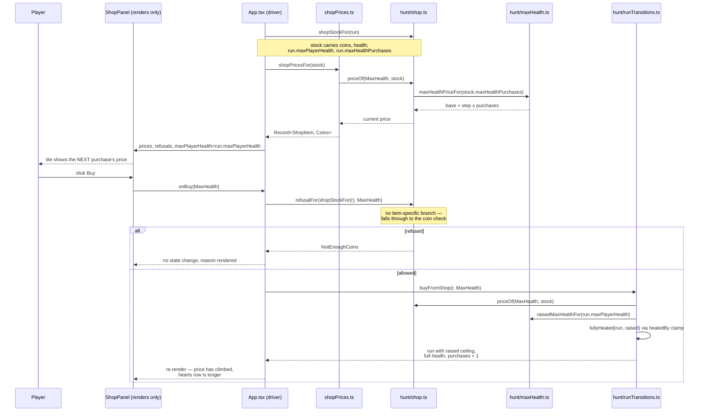

# Plan: Shop sells a permanent max-health increase whose price grows with each purchase

Plan folder: `.claude/contract/DLR-158-shop-sells-a-growing-max-health-increase/`
Execution status: see `tasks.md` in this folder.

---

## Part 1 — Alignment

### Task reference

Jira **DLR-158** — *"Shop sells a permanent max-health increase whose price grows with each purchase"* (Story, labels `engine` + `playable`). Moved `To Do → Planning` at the start of this run.

**Problem statement (verbatim):**

> The shop's only shelf item is Heal, which restores health up to a ceiling that never moves — `PLAYER_START_HEALTH` is a constant threaded through `startRun`, `startEncounter`, `buyFromShop` and `drinkFlask` as a defaulted parameter, and nothing raises it. A player who is already at full health has nothing to spend coins on, and there is no way to convert a good run's earnings into more survivability later in the run. A max-health purchase gives coins a second sink and a run a growth curve; a price that climbs with each purchase stops it becoming the obvious, only, repeatable buy.

**User story (verbatim):**

> As a player at the shop, I want to spend coins to permanently raise my maximum health for this run, so that a strong early run buys me more room for error later — and so that stacking it costs me progressively more.

**Acceptance criteria (verbatim):**

1. A new shop item raises the player's maximum health for the rest of the run by a configured amount. It appears on the shelf alongside Heal.
2. Buying it raises the ceiling AND restores the player to FULL health at the new, raised ceiling — regardless of how hurt they were. A player on 1 of 6 who buys a +2 increase leaves the shop on 8 of 8. This makes it a heal as well as an upgrade, and the growing price is what stops it displacing Heal entirely.
3. Maximum health becomes run state rather than a constant. Every place that currently takes `maxPlayerHealth` as a defaulted parameter (`startEncounter`, `startRun`, `buyFromShop`, `drinkFlask`, `flaskHealAmount`, `shopStockFor`) reads the run's current value, so the flask's percentage heal and Heal's at-full-health refusal both scale with the raised ceiling.
4. The price grows with each purchase within a run: the Nth purchase costs more than the (N-1)th, following a single formula stated in one place in `src/hunt/config.ts` alongside the other price keys. Both the base price and the growth step are configuration, not literals at a call site.
5. The shop screen shows the item's CURRENT price — the price of the next purchase, not the base price — and that price updates after a purchase without leaving the shop.
6. Attempting to buy with insufficient coins is refused with the existing `NotEnoughCoins` reason code. Being at full health does NOT refuse the purchase — the ceiling still rises, so unlike Heal there is no `AlreadyFullHealth` case. There is no maximum-purchases cap; the growing price is the only limiter.
7. The count of purchases so far and the raised ceiling both survive whatever the run already persists, so a resumed run does not reset either.
8. Unit tests cover: the ceiling rising, the full-health restore from a hurt state, buying while already at full health, the price escalating across consecutive purchases, the flask heal scaling to the new ceiling, and the refusal when coins are short.

**Scope boundaries (verbatim).** In scope: a new `ShopItem` member, its `priceOf` row, its `categoryOf` rung (RunPermanent) and its `refusalFor` handling; threading a run-owned maximum health through `src/hunt/run.ts`, `runTransitions.ts`, `flask.ts` and `shop.ts`; the escalating price formula and its configuration keys; shop-screen copy and the current-price display. Out of scope: restoring any item DLR-116, DLR-145 or the 2026-09-01 shelf pass took off the shelf; carrying a raised ceiling ACROSS runs; retuning `HEAL_PRICE` or the flask's percentage; choosing the final base price, growth curve and health-per-purchase values.

**Dependencies and risks named on the ticket.** The purchase strictly dominates Heal at equal price, so the growth curve and starting price are the tuning decision the ticket most depends on and are the developer's to make in play. Maximum health is a defaulted parameter in five signatures and the risk is a caller left on the default silently computing against the unraised ceiling — removing the defaults so an omission is a compile error is the safer shape. The flask heals a percentage of maximum health, so raising the ceiling compounds. If the raised ceiling is persisted, `.claude/rules/save-data-versioning.md` applies.

**Skill confirmation, 2026-09-01.** Asked which skills apply; the developer confirmed `react-frontend` and `game-ux`, and unticked `implementation-doc-writer` (that is `/fb-apply`'s closing job, not this contract's).

### Restated goal

Today the player's maximum health is a module constant, `PLAYER_START_HEALTH`, that four functions accept as a defaulted parameter and nothing ever changes — so the health bar's denominator, the flask's percentage heal, and Heal's "you are already at full health" refusal are all pinned to the number the run opened on. This ticket turns that ceiling into a field the run owns and carries, adds a second item to the shop shelf that raises it, and makes that item's price climb with every copy bought within the run. Buying it raises the ceiling *and* fills the bar to the new top, so it is a heal and an upgrade in one purchase; the only thing stopping it from displacing Heal outright is that the next one costs more. The shelf shows the price of the *next* purchase and that figure ticks up the moment one is bought, without leaving the shop. The engine change is the larger half: four signatures lose their defaulted `maxPlayerHealth` parameter entirely and read the run instead, so a caller that used to be able to compute against the wrong ceiling now cannot compile.

### In scope

- A new `ShopItem.MaxHealth` member on `SHOP_ITEMS` beside `Heal`, on the `RunPermanent` rung, with `NotEnoughCoins` as its only refusal.
- `RunState` gains `maxPlayerHealth` (the run's live ceiling) and `maxHealthPurchases` (how many copies have been bought), both seeded by `startRun` and carried by every existing spread.
- `shopStockFor`, `flaskStockFor`, `buyFromShop` and `drinkFlask` **lose** their `maxPlayerHealth` parameter and read `run.maxPlayerHealth`; every call site that passed one becomes a typecheck error.
- `ShopStock` gains `maxHealthPurchases` so the shop's rules can price the next copy without learning the run's shape.
- A new pure module `src/hunt/maxHealth.ts` holding the three configuration keys and the single price formula `maxHealthPriceFor(purchases)`.
- `priceOf` gains a required `ShopStock` parameter so there is no way to read a stale base price.
- `buyFromShop`'s new branch: raise the ceiling by the configured step, restore to full at the raised ceiling, and increment the purchase count.
- A `shopPricesFor(stock)` projection in `src/app/run/`, mirroring the existing `shopRefusalsFor`, handed to `ShopPanel` as a prop so the screen still computes nothing.
- Shop-screen copy for the new item, and the current price rendered on its tile and in its accessible name.
- `App.tsx` reading `run.maxPlayerHealth` for the shop's health meter, the heart row's denominator, and the panel's `maxPlayerHealth` prop.
- Extracting `runTransitions.ts`'s five fight-boundary carry helpers into `src/hunt/runCarry.ts`, because the feature's new branch would otherwise push that file past the 400-line blocking budget.
- Unit tests for all six cases AC8 names, plus the escalating price formula and the new projection.

### Explicitly out of scope

- Choosing the base price, the growth step, or the health gained per purchase. Three documented placeholders ship; the numbers are the developer's, decided in play.
- Carrying a raised ceiling across runs. Nothing is added to `src/persistence/` or `src/vault/`.
- Retuning `HEAL_PRICE`, `HEAL_HEALTH_RESTORED` or `FLASK_HEAL_PERCENT`, even though the new item changes what each is worth.
- Restoring any item off the shelf — Cheat, Timebomb, Blast Guard, Whetstone, the AP-capacity purchase, or the Swan and Witch tiers. They keep their rows and stay unshelved.
- Retuning `src/sim/baselinePolicy.ts`'s `SHOP_PURCHASE_ORDER`. The simulator's baseline keeps buying what it buys today; teaching it to buy the new item is a measurement decision, not this ticket's.
- A maximum-purchases cap, or any second limiter beyond the price.
- Changing `startEncounter` — see the assumption below; its second parameter is *current* health, not the ceiling.
- A redesign of the shop screen. The 2026-09-01 three-zone layout stands; this adds one tile to the existing buy row.

### Pattern Reference

The brief supplied module pointers rather than a pattern to copy, so the references below were chosen and are named here:

- **`src/hunt/rankTiers.ts`** — the precedent for a price key and its rule living in a small sibling module rather than in `config.ts`. `RANK_TIER_STEP_PRICE` is declared there, not in `config.ts`, and `shop.ts` imports it. `src/hunt/maxHealth.ts` follows it exactly.
- **`src/app/run/shopRefusals.ts`** — the precedent for a total `Record<ShopItem, …>` derived from `Object.values(ShopItem)` in a pure, renderer-free module and handed to `ShopPanel` as a prop. `shopPrices.ts` is its sibling, written to the same shape.
- **`src/hunt/runTransitions.ts`'s `healedBy`** — the single writer that raises player health and the only place overheal is discarded. AC2's full restore goes through it, per DLR-93's own note: *"reuse that clamp pattern rather than writing a second one"*.
- **`src/hunt/runTransitions.ts`'s `guardAfter` / `feederCarryAfter` / `streakAfter`** — the named-rule-not-inline-ternary convention the extracted `runCarry.ts` preserves verbatim.
- **`ShopItem.Whetstone` and `ShopItem.ApCapacity`** — the two existing stacking run-permanent purchases, and the shape `maxHealthPurchases` copies: a COUNT of purchases on `RunState`, with the arithmetic owned by one named function.
- `.claude/skills/react-frontend/SKILL.md` and `.claude/skills/game-ux/SKILL.md` for conventions; `mockup.html` in this folder for the shelf's layout.

### Constraints flagged on the brief

- **No tuning values may be invented.** The base price, growth step and health-per-purchase are explicitly the developer's, decided by playing. Placeholders ship, marked as unchosen in the same style `AP_CAPACITY_PRICE` already uses.
- **The defaulted-parameter shape is the named risk.** The brief states outright that removing the defaults so an omission is a compile error is the safer shape.
- **The formula must be stated once**, with both the base price and the growth step as configuration rather than literals at a call site.
- **The price on screen must be the *next* purchase's price** and must update in place after a buy.
- **`NotEnoughCoins` is reused; no new refusal code.** Full health must not refuse this purchase.
- **`.claude/rules/save-data-versioning.md` applies if the ceiling is persisted.** The audit below establishes that it is not.
- **Two runtime dependencies stay two.** Nothing here needs a third.

### Assumptions made

- **`ShopItem.MaxHealth = 'maxHealth'` is the member name and string value.** Consistent with `apCapacity` and `blastGuard`; the player-facing wording is a separate placeholder string in `shopLabels.ts` and is the developer's to change.
- **The three configuration keys and the price formula live in a new `src/hunt/maxHealth.ts`, not in `config.ts`.** AC4 names `config.ts`, and this deviates from its letter for two reasons. First, `config.ts` is **378 lines** and the 400-line budget is blocking — the keys plus a documented formula would land it at roughly 401. Second, the project already has this exact precedent: `RANK_TIER_STEP_PRICE`, the shop's other stacking price, lives in `rankTiers.ts` beside the rule it prices, not in `config.ts`. AC4's substance — *one* formula, in *one* place, with base and step as configuration rather than literals at a call site — is fully honoured. A one-line cross-reference comment goes into `config.ts` beside `HEAL_PRICE` so the price keys are still discoverable from there. Raised again under Risks.
- **The growth is linear: `base + step × purchases`.** AC4 requires only that the Nth costs more than the (N-1)th. Linear is the simplest rule that satisfies it, it is the shape `rankTiers.ts` §7b already floats for the tier ladder ("an escalating 5 / 10 / 15"), and it is retunable to a multiplier later by editing one function. The *coefficients* are the developer's; the *shape* is this plan's.
- **The parameter is removed, not made required.** The brief suggests removing the defaults so an omission is a compile error. Deleting the parameter outright is strictly stronger: there is no argument to get wrong, the run's own field is the only reading, and every site that passes one today is surfaced by `npm run typecheck` as an excess argument. A spec that wants a different ceiling spreads `{ ...run, maxPlayerHealth: N }`.
- **`startEncounter` is not changed.** AC3 lists it among the functions taking `maxPlayerHealth` as a defaulted parameter. It does not — its second parameter is `playerHealth`, the health the player *carries into* the fight, which is a different quantity and is already correct. `startRun` likewise keeps its `playerHealth` parameter; it simply also seeds `maxPlayerHealth` from the same figure. Neither is a gap in AC3, and `flaskHealAmount` keeps its numeric parameter because it takes a number rather than a run.
- **`startRun`'s existing `playerHealth` argument seeds both the opening health and the opening ceiling.** A run that starts hurt is not a thing the game has, and one parameter that means "how big is your bar" is fewer moving parts than two that can disagree.
- **`priceOf` takes the stock as a required second parameter rather than gaining a defaulted purchase count.** A defaulted count would reintroduce exactly the failure mode this ticket exists to remove. Every one of its 15 call sites becomes a typecheck error, which is the point.
- **The screen receives prices as a prop, derived by the driver.** `ShopPanel` computes nothing today and that discipline is kept; `shopPricesFor(stock)` is the exact sibling of the existing `shopRefusalsFor(stock)`. AC5's "updates without leaving the shop" then falls out of the existing render: `run` changes, `stock` re-derives, the tile re-renders.
- **`priceText` and `shopItemAccessibleName` take a price rather than an item.** With the price now stock-dependent, a label function that called `priceOf` itself would need the stock too; taking the already-derived number keeps the copy layer free of the shop's rules.
- **The new tile carries no blurb.** The 2026-09-01 pass deleted blurbs from the shelf on the grounds that on a short shelf the name is the description. A row is still added to `SHOP_ITEM_BLURB`, which stays total over the union, but nothing renders it.
- **The fight-boundary carry helpers are extracted to `src/hunt/runCarry.ts` in this ticket.** `runTransitions.ts` is **396 lines**; the new branch and its helper would breach the blocking budget. Per `CLAUDE.md`, that is fixed in the ticket that would cause it, not handed back as a finding. `healedBy` stays in `runTransitions.ts` — it is the health writer two transitions in that file call, and the new full-restore helper goes beside it.
- **AC7 needs no persistence work.** The audit below shows nothing persists `RunState` at all. Both new fields sit on `RunState` and are carried by the same spreads that already carry `coins`, so they have exactly the lifetime AC7 asks for and no save shape changes.
- **The simulator's baseline policy is left alone.** `SHOP_PURCHASE_ORDER` is a deliberate, measured list; adding an item to it changes what every existing simulation measures.

### Config and persisted-shape audit

- **`PLAYER_START_HEALTH` — 158 hits across 31 files.** Not renamed, not retyped, not removed: it remains the figure a run *opens* on. Only the hits that read it as *the current maximum* change, and they are enumerated: `src/App.tsx:119` (the heart row's player denominator) and `:303` (the `ShopPanel` prop), plus the four defaulted parameters at `src/hunt/run.ts:234`, `:250` and `src/hunt/runTransitions.ts:182`, `:216`. The remaining hits are `startRun` / `startEncounter` seeds and test fixtures, all of which stay correct.
- **`maxPlayerHealth` — 43 hits across 13 files.** The name survives everywhere; what changes is where it comes from. It becomes a `RunState` field and stays a `ShopStock` / `FlaskStock` field; it stops being a parameter of `shopStockFor`, `flaskStockFor`, `buyFromShop` and `drinkFlask`; it stays a parameter of `flaskHealAmount`, which takes a number rather than a run.
- **`RunState` — 44 files name the type; exactly 1 construction site.** Grepping the distinctive required field `encounterCount:` over `src/**` including `__tests__` returns 8 hits, of which only `src/hunt/run.ts:185` builds a `RunState`; the other 7 are parameter declarations, an interface member, and one `RunOutcomePanel` prop fixture that is not a `RunState`. Every other producer spreads an existing run. **Two new required fields therefore cost one literal edit**, in `startRun`.
- **`ShopStock` — 3 construction sites.** `src/hunt/run.ts:235` (`shopStockFor`), `src/hunt/__tests__/shop.test.ts:28` (the `baseStock` factory), and `src/app/run/__tests__/shopRefusals.test.ts` (one literal). The new required `maxHealthPurchases` field is a typecheck error at all three. `FlaskStock` is unchanged — 2 construction sites, neither touched.
- **Removing the `maxPlayerHealth` parameter surfaces exactly 18 call sites**, counted by grepping for the over-long argument list: `buyFromShop(…, …, …)` — **4** (3 in `src/hunt/__tests__/run.shop.test.ts`, 1 in `src/hunt/__tests__/shield.encounter.test.ts`); `drinkFlask(…, …)` — **13 hits, of which 12 are calls** (11 in `src/hunt/__tests__/run.flask.test.ts`, 1 in `src/hunt/__tests__/shield.encounter.test.ts`) and 1 is the definition line itself; `flaskStockFor(…, …)` — **2** (`src/hunt/runTransitions.ts:188`, `src/hunt/__tests__/run.flask.test.ts:61`); `shopStockFor(…, …)` — **1** (`src/hunt/runTransitions.ts:224`). All are in this plan's file map.
- **`priceOf` gains a required parameter — 15 call sites.** `src/app/run/shopLabels.ts:89`, `src/hunt/runTransitions.ts:233`, `src/hunt/shop.ts:232`, and 12 in `src/hunt/__tests__/shop.test.ts` (lines 47, 48, 52, 68, 69, 111, 115, 119, 123, 127, 131, 136). Every one is a typecheck error until updated, which is the intent.
- **Nothing persists `RunState`.** `createSaveStore` has exactly one consumer outside `src/persistence/` — `src/vault/vaultStore.ts` — and it stores Vault state only. Every field docblock on `RunState` says "NEVER persisted", including `coins`. `SAVE_SCHEMA_VERSION` stays at 1 and no reject condition in `.claude/rules/save-data-versioning.md` is engaged: no `localStorage` call is added, no key is composed, no envelope is written, no payload shape changes. **This is the cheap window the rule's own text describes, and it is recorded here as still open.**
- **String-bound surfaces.** One new string value, `'maxHealth'`. Three total `Record<ShopItem, …>` maps must grow a row and all three are typed, so an omission is a compile error rather than an `undefined` rendered as blank: `SHOP_ITEM_NAME` and `SHOP_ITEM_BLURB` in `src/app/run/shopLabels.ts`, and the `refusals` prop's type on `ShopPanel`. The `refusals` and new `prices` records are both built by iterating `Object.values(ShopItem)`, so neither is hand-listed. No `data-testid`, CSS class name, ARIA id or storage key is renamed; the new tile reuses the existing `shop-buy` / `shop-buy-slot` / `shop-buy-price` classes.
- **Type-change loss.** No `number → string`, no array → object, no required → optional. Two changes are *additive-required* — a new `ShopStock` field and a new `priceOf` parameter — and both were chosen precisely because they fail at `tsc` rather than at runtime. The `ShopItem` union widens by one member, which forces `priceOf`, `categoryOf`, `tieredRankOf` and `buyFromShop`'s `switch` to each grow a case; all four are already `default`-free and total, so the compiler enumerates them.
- **Architectural boundary holds.** `src/hunt/maxHealth.ts` imports only `./types` — no React, no DOM global, so the lint-enforced pure-core override on `src/hunt/**` is satisfied by construction. `src/app/run/shopPrices.ts` sits outside that tree, is pure, and is tested with no renderer. Verified by the boundary grep in Final verification.
- **Line budgets, measured with `(Get-Content <path>).Count`, not `Measure-Object`.** `config.ts` 378 — near the ceiling, which is why the keys go elsewhere. `runTransitions.ts` **396** — the feature alone would breach, so the carry helpers (lines 322–355 and 382–396, 49 lines) move to `runCarry.ts` first, leaving roughly 353 before the feature and roughly 375 after. `shop.ts` 253, `App.tsx` 379, `ShopPanel.tsx` 237, `shopLabels.ts` 151, `run.ts` 293 — all with room.

---

## Part 2 — Technical design

### Approach

**The ceiling becomes run state, and the parameter disappears.** `RunState` gains two fields: `maxPlayerHealth`, the run's live ceiling, and `maxHealthPurchases`, how many copies have been bought. Both are seeded by `startRun` — the ceiling from the `playerHealth` argument it already takes, the count at zero — and both ride every existing spread in `advanceRun` and `recordEncounter` untouched, which is exactly the run-permanent lifetime `whetstones` and `apCapacityBonus` already have. The four functions that take `maxPlayerHealth` as a defaulted parameter today (`shopStockFor`, `flaskStockFor`, `buyFromShop`, `drinkFlask`) lose it entirely and read `run.maxPlayerHealth`. The alternative the brief floats — keep the parameter but make it required — was rejected because it leaves a live way to pass the wrong number: a spec that passes `10` against a run whose ceiling is `14` type-checks perfectly and silently clamps to the old figure. Deleting the parameter means the run's own field is the only reading there is, and every one of the 18 sites that passes one today fails at `tsc`, giving an exhaustive worklist rather than a hopeful grep. `flaskHealAmount` keeps its numeric parameter — it takes a number, not a run, and its callers now hand it `run.maxPlayerHealth`, which is what makes AC3's "the flask's percentage heal scales with the raised ceiling" true without touching `flask.ts` at all.

**The price is a rule, not a constant, so `priceOf` learns the stock.** Every other shelf item has a fixed price and `priceOf(item)` returns it. This one's price depends on how many have been bought, and there is exactly one safe way to express that: `priceOf(item, stock)` becomes a two-argument function, required, with the count read off `ShopStock`. The rejected alternatives are both worse in the same way — a defaulted `purchases = 0` parameter reintroduces the silent-wrong-default failure the ticket exists to remove, and a second `currentPriceOf` beside `priceOf` gives the screen and the transition two functions that can disagree about what a thing costs, which is precisely the "two readings of one rule" `refusalFor`'s own docblock forbids. With one function, `refusalFor`'s coin check, `buyFromShop`'s deduction and the shelf's printed figure are all necessarily the same number. The formula itself lives in `src/hunt/maxHealth.ts` as `maxHealthPriceFor(purchases)`, reading two configuration keys and returning `base + step × purchases` — a small sibling module in the shape `rankTiers.ts` already established for the shop's other stacking price, which is what keeps `config.ts` under its blocking line budget while still stating the rule exactly once.

**The purchase raises and fills in one transition.** `buyFromShop`'s new `case ShopItem.MaxHealth` computes the raised ceiling, writes it onto the run, restores health to full *at that raised ceiling* through the existing `healedBy` clamp, and increments the count. AC2's "a player on 1 of 6 leaves on 8 of 8" then falls out of `Math.min(8, 1 + 8)` with no second clamp written and no special case in the health writer. A named `fullyHealed(run, ceiling)` helper sits beside `healedBy` rather than an inline `healedBy(run, raised, raised)`, because the double-argument call is opaque about what it means and this file's convention is that a rule gets a name a reviewer can find. `refusalFor` gets **no** new branch: the item is absent from every item-specific check, so it falls through to the coin comparison and refuses with `NotEnoughCoins` alone — which is AC6 expressed as the absence of code rather than as a condition, and is why full health cannot refuse it.

**The screen still computes nothing.** `ShopPanel`'s discipline — every figure and every refusal arrives as a prop — is the reason it can be a pure render, and a stock-dependent price is exactly the kind of thing that erodes it. So the driver derives a total `Readonly<Record<ShopItem, Coins>>` through a new `shopPricesFor(stock)` in `src/app/run/shopPrices.ts`, the exact sibling of the existing `shopRefusalsFor(stock)`, built by iterating `Object.values(ShopItem)` so a future item needs no hand-edit. `ShopPanel` takes it as a `prices` prop and prints `prices[item]`; `priceText` and `shopItemAccessibleName` in `shopLabels.ts` take the number instead of calling `priceOf` themselves, which keeps the copy layer from needing the shop's rules. AC5 then needs no mechanism at all: `App.tsx` already derives `stock` from `run` on every render, so a purchase changes `run`, re-derives `stock`, re-derives the prices, and the tile shows the next price — no effect, no listener, nothing to clean up. `App.tsx` also switches the heart row's player denominator and the panel's `maxPlayerHealth` prop from the constant to `run.maxPlayerHealth`, which is what makes the bar visibly grow.

**One refactor comes first, for a measured reason.** `runTransitions.ts` is 396 lines against a 400-line blocking budget, and the new branch plus its helper would breach it. The five fight-boundary carry helpers — `guardAfter`, `feederCarryAfter`, `streakAfter`, `handOfFightAfter`, `flaskAfter` — are a coherent 49-line group answering one question ("what survives the end of a fight"), so they move to `src/hunt/runCarry.ts` as a pure move with no expression changed, before any feature work. `healedBy` deliberately stays behind: it is the health writer that two transitions in that file call, and the new full-restore helper belongs beside it.

### Skills to invoke during execution

- `react-frontend` — owns everything under `src/`: the engine change in `src/hunt/`, the new prop and tile in `ShopPanel.tsx`, the configuration keys, the 400-line budget that forces the `runCarry.ts` extraction, and the Vitest coverage. Developer-confirmed.
- `game-ux` — owns the shop screen as a playable surface: where the second buy tile sits in the existing tray row, that the shelf still fits the viewport with two tiles plus the flask and the leave control, and that the current price reads as a fact on the face of the tile rather than on hover. Developer-confirmed.

Developer override: `implementation-doc-writer` was proposed and unticked — updating `.docs/implementation/hunt/` and `.docs/game_rules/the-hunt.md` is `/fb-apply`'s closing step, not a task in this contract.

Rule files the executor must Read: `.claude/rules/save-data-versioning.md` (its reject conditions constrain the AC7 decision recorded in the audit above — the conclusion is that nothing is persisted and no bump is needed, and that must be re-confirmed rather than assumed). Always also read `.claude/workflow/web-project.md`.

### Diagram



### Data shapes

#### New module: `src/hunt/maxHealth.ts`

```ts
import type { Coins, Health } from './types'

/** UNIT: health points added to the ceiling by one purchase. VALUE UNCHOSEN — a documented
 *  placeholder, NEVER PLAYED. The developer's to move (DLR-158, out of scope: "ship rough
 *  defaults and tune by feel"). */
export const MAX_HEALTH_PER_PURCHASE: Health = 2

/** UNIT: coins. What the FIRST max-health purchase of a run costs. VALUE UNCHOSEN. */
export const MAX_HEALTH_PRICE_BASE: Coins = 3

/** UNIT: coins added to the price per purchase already made. VALUE UNCHOSEN. */
export const MAX_HEALTH_PRICE_STEP: Coins = 2

/** AC4 — THE single statement of the escalating price. Linear in the count already bought, so
 *  the Nth purchase always costs more than the (N-1)th. Both coefficients are configuration
 *  above, never literals here. Throws rather than returning NaN on a corrupted count: a NaN
 *  price would pass no coin comparison and render as nothing. */
export function maxHealthPriceFor(purchases: number): Coins

/** AC1 — THE single statement of how far one purchase raises the ceiling, so the step size is
 *  read from configuration in exactly one place. Throws on a non-positive or non-finite ceiling,
 *  matching `flaskHealAmount`'s guard. */
export function raisedMaxHealthFor(maxPlayerHealth: Health): Health
```

#### `src/hunt/shop.ts`

```ts
export const ShopItem = {
  // …existing members unchanged…
  MaxHealth: 'maxHealth', // DLR-158 AC1
} as const

export const SHOP_ITEMS: readonly ShopItem[] = [ShopItem.Heal, ShopItem.MaxHealth]

export interface ShopStock {
  readonly coins: Coins
  readonly playerHealth: Health
  readonly maxPlayerHealth: Health
  readonly blastGuardHeld: boolean
  readonly rankTiers: RankTierTable
  /** DLR-158 AC4 — copies bought this run, so the shop can price the NEXT one without
   *  learning the run's shape. */
  readonly maxHealthPurchases: number
}

/** AC4/AC5 — now stock-dependent, so there is exactly one reading of "what does this cost
 *  right now" and the screen, the refusal and the deduction cannot disagree. */
export function priceOf(item: ShopItem, stock: ShopStock): Coins

// categoryOf gains: case ShopItem.MaxHealth: return ShopCategory.RunPermanent
// tieredRankOf gains: case ShopItem.MaxHealth: return null
// refusalFor gains NO branch — AC6 is the absence of one.
```

#### `src/hunt/run.ts`

```ts
export interface RunState {
  // …existing fields unchanged…
  /** DLR-158 AC3 — the run's LIVE maximum health, raised by `ShopItem.MaxHealth`. Run-permanent
   *  like `whetstones`, carried by `advanceRun`'s and `recordEncounter`'s spreads. Was
   *  `PLAYER_START_HEALTH`, a module constant threaded through four defaulted parameters.
   *  NEVER persisted, exactly as `coins`. */
  readonly maxPlayerHealth: Health
  /** DLR-158 AC4 — max-health copies bought this run. A COUNT, not a flag: each stacks and the
   *  climbing price is the only limiter (AC6). `maxHealthPriceFor` owns the arithmetic, exactly
   *  as `apCapacityFor` owns `apCapacityBonus`'s. NEVER persisted. */
  readonly maxHealthPurchases: number
}

export function startRun(
  playerHealth: Health = PLAYER_START_HEALTH,
  grants: readonly TemplateGrant[] = [],
  runSeed: number = 1,
): RunState // seeds maxPlayerHealth: playerHealth, maxHealthPurchases: 0

export function shopStockFor(run: RunState): ShopStock     // second parameter REMOVED
export function flaskStockFor(run: RunState): FlaskStock   // second parameter REMOVED
```

#### `src/hunt/runTransitions.ts`

```ts
export function buyFromShop(run: RunState, item: ShopItem): RunState  // third parameter REMOVED
export function drinkFlask(run: RunState): RunState                  // second parameter REMOVED

/** DLR-158 AC2 — restored to the TOP of the given ceiling, through `healedBy`'s clamp rather
 *  than a second one. A named rule beside `healedBy`, following this file's convention. */
function fullyHealed(run: RunState, maxPlayerHealth: Health): RunState
```

#### New module: `src/hunt/runCarry.ts` (pure move, no behaviour change)

```ts
export function guardAfter(encounter: EncounterState, held: boolean): boolean
export function feederCarryAfter(encounter: EncounterState, carry: BuffCarry): BuffCarry
export function streakAfter(encounter: EncounterState, streak: StreakState): StreakState
export function handOfFightAfter(handOfFight: number, encounter: EncounterState): number
export function flaskAfter(encounterIndex: number, flaskCharges: number, wonThisEncounter: boolean): number
```

`handOfFightAfter` and `flaskAfter` take the two figures they read rather than the whole `RunState`, so `runCarry.ts` does not import `run.ts` and no import cycle is created. Every expression inside is byte-identical to today's.

#### New module: `src/app/run/shopPrices.ts`

```ts
/** Every `ShopItem`'s CURRENT price in one pass. DERIVED from the union rather than hand-listed,
 *  exactly as `shopRefusalsFor` is. Reads `priceOf` — never a second reading of the price rule. */
export function shopPricesFor(stock: ShopStock): Readonly<Record<ShopItem, Coins>>
```

#### `src/app/run/shopLabels.ts`

```ts
export const SHOP_ITEM_NAME: Readonly<Record<ShopItem, string>> = {
  // …existing rows…
  [ShopItem.MaxHealth]: 'Max health', // PLACEHOLDER copy — the developer's call.
}

export const SHOP_ITEM_BLURB: Readonly<Record<ShopItem, string>> = {
  // …existing rows…
  [ShopItem.MaxHealth]: `+${MAX_HEALTH_PER_PURCHASE} maximum health for the rest of the run, and you leave at full. Buy it again to stack it — each one costs more.`, // PLACEHOLDER copy
}

/** Takes the ALREADY-DERIVED price, not the item: the price is stock-dependent now, and a copy
 *  layer that called `priceOf` itself would need the shop's rules. */
export function priceText(price: Coins): string
export function shopItemAccessibleName(item: ShopItem, price: Coins, refusal: PurchaseRefusal | null): string
```

#### `src/app/run/ShopPanel.tsx`

```ts
interface ShopPanelProps {
  // …existing props unchanged…
  /** One entry per `ShopItem`, derived by the driver from `priceOf` — never re-derived here.
   *  The price of the NEXT purchase (AC5). Total over the whole union, exactly as `refusals`. */
  readonly prices: Readonly<Record<ShopItem, Coins>>
}
```

#### `src/hunt/config.ts`

No key added. One cross-reference comment beside `HEAL_PRICE`, in the style of the existing note pointing at `RANK_TIER_STEP_PRICE`'s home, naming `src/hunt/maxHealth.ts` as where the max-health price keys live and why.

#### Configuration values that are the developer's

| Key | Type | Unit | Placeholder | Rationale |
|---|---|---|---|---|
| `MAX_HEALTH_PER_PURCHASE` | `Health` | health points per purchase | `2` | AC2's own worked example uses +2 on a 6 ceiling. **Value unchosen.** |
| `MAX_HEALTH_PRICE_BASE` | `Coins` | coins | `3` | Between `HEAL_PRICE` (1) and `WHETSTONE_PRICE` (4) — it must not undercut Heal, which it strictly dominates. **Value unchosen.** |
| `MAX_HEALTH_PRICE_STEP` | `Coins` | coins per purchase already made | `2` | Makes the ladder 3 / 5 / 7 / 9 against a 10-coin encounter win. **Value unchosen.** |

No `package.json`, `tsconfig.json`, `vite.config.ts` or `eslint.config.js` change. No new dependency.

### Runtime quality notes

- **Purity and adjudication.** Everything decided here is decided in a pure module. `maxHealth.ts` holds the price and the raise; `shop.ts` holds the refusal and the price lookup; `runTransitions.ts` holds the state change. `shopPrices.ts` is pure, DOM-free and unit-testable with no renderer. `ShopPanel` gains one prop and one map lookup and decides nothing — it does not compute a price, does not know the formula, and does not know how many purchases have been made. Both new tunables and the growth step are configuration read through one function, never a literal at a call site.
- **Effects, mount and teardown.** No effect, listener, observer, timer, `requestAnimationFrame` or `AbortController` is added or changed. AC5's live price update is a plain re-render off `run` state, so there is nothing to clean up and nothing for StrictMode to double-fire. `App.tsx`'s existing `handleBuy` guard — `setRun(r => refusalFor(shopStockFor(r), item) !== null ? r : buyFromShop(r, item))` — reads the *live* run inside the updater rather than the render's stale closure, and keeps working unchanged: a double-click that lands twice re-checks against the run that already paid, and the second click is refused if the climbed price is now unaffordable. No module-level mutable state is introduced.
- **Hot-path cost.** Nothing here is on a pointer path. `shopPricesFor` runs once per render of the shop screen, iterating a 9-member union — the same shape and cost as `shopRefusalsFor`, which already runs there. No memoisation is added, and none is justified without profiling evidence.
- **Determinism and numeric safety.** No randomness is reachable from any of it — `maxHealthPriceFor` and `raisedMaxHealthFor` are pure integer arithmetic over a count and a ceiling, so a run replays identically. No division is introduced, so no divisor guard is needed and no epsilon is involved. Both new functions throw a `RangeError` on a non-finite or out-of-range input rather than returning `NaN`, matching `flaskHealAmount`'s existing guard, because a `NaN` ceiling would poison `Math.min` in `healedBy`, land in `encounter.health`, and vanish from the health bar with nothing logged. `refusalFor`'s existing `Number.isFinite(stock.coins)` guard already covers a corrupted balance and is untouched.
- **Error paths.** `buyFromShop` keeps throwing a `RangeError` naming the refusal rather than returning the run unchanged, and the new branch inherits that. Its own leading guard on `maxPlayerHealth` moves from validating a parameter to validating `run.maxPlayerHealth`, so a corrupted run still fails loudly at the purchase rather than silently clamping. Nothing is caught and turned into a success shape; there is no `catch` anywhere in the change. The player-facing path is unchanged — the control is disabled whenever `refusalFor` is non-null and the reason renders beside it, so the throw stays a driver-bug backstop rather than something a player reaches. No async surface is added, so the four async states do not arise.

### Risks and judgement calls

- **The three tuning values are the developer's and are not chosen here.** `MAX_HEALTH_PER_PURCHASE`, `MAX_HEALTH_PRICE_BASE` and `MAX_HEALTH_PRICE_STEP` ship as documented placeholders (2 / 3 / 2). The ticket says outright that the growth curve and starting price are what keep Heal worth buying, and that this is the tuning decision it most depends on. It can only be settled by playing.
- **The formula lives in `src/hunt/maxHealth.ts`, not `src/hunt/config.ts` as AC4's letter says.** `config.ts` is 378 lines against a 400-line blocking budget, and `rankTiers.ts` already sets the precedent of a shop price living beside its rule. AC4's substance is met — one formula, one place, both coefficients configuration. If the developer wants the keys in `config.ts` regardless, that is a fair call and the answer is splitting `config.ts`, which is a bigger change than this ticket carries.
- **Linear growth is this plan's reading, not the ticket's.** AC4 requires only that each purchase costs more than the last. Linear is the simplest shape that satisfies it and the easiest to retune; a multiplier (`base × step^n`) would climb faster and could be substituted by editing one function.
- **The purchase strictly dominates Heal at equal price, by design.** At the placeholder numbers it costs 3 to Heal's 1 and does more. Whether the first copy should be cheaper or dearer than that is a feel question, and the compounding with the flask — which heals a percentage of the raised maximum — is a second-order effect the ticket explicitly says to watch in play rather than pre-balance.
- **Removing the parameter rather than requiring it touches 18 existing call sites, most of them specs.** This is deliberate and is the ticket's own stated preference taken one step further, but it does mean a chunk of the diff is mechanical test edits with no behaviour change. A reviewer should expect that.
- **Extracting `runCarry.ts` is scope this ticket adds to itself.** It is forced by the 400-line budget and `CLAUDE.md`'s rule that a breach is fixed in the ticket that causes it. It is a pure move — no expression changes — but it is a second thing happening in one contract, and it lands in its own phase so it can be reviewed on its own.
- **`priceOf`'s signature change ripples into 15 call sites, 12 of them in one spec file.** The alternative — a second `currentPriceOf` — was rejected on the "two readings of one rule" ground the module's own docblocks argue for, but it is a judgement call worth sanity-checking.
- **The simulator's baseline will not buy the new item.** `SHOP_PURCHASE_ORDER` stays as it is, so every existing simulation keeps measuring what it measures today. That means the `play-tester` skill cannot answer "is this item too strong" until someone decides to add it to the baseline — which is a measurement decision, not a code one.
- **Two things can only be judged by playing or by looking:** whether a second tile in the shop's buy row still reads clearly and fits the viewport alongside the flask and the leave control, and whether the price ticking up is legible enough to feel like a mechanic rather than a glitch. The mockup in this folder is what the layout half is being approved against.
- **The `Max health` name and its blurb are placeholder copy.** Every string on the shop screen is marked the developer's; these are no different.
