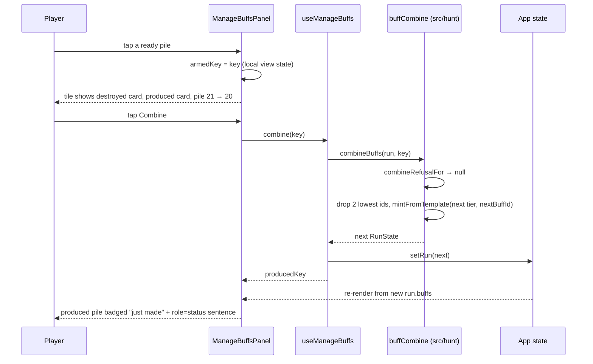

# Plan: Manage Buffs screen — combine two identical buff cards into one of the next tier

Plan folder: `.claude/contract/DLR-159-manage-buffs-combine-cards/`
Execution status: see `tasks.md` in this folder.

---

## Part 1 — Alignment

### Task reference

Jira **DLR-159** — *Manage Buffs screen — combine two identical buff cards into one of the next tier* (Story, labels `ui` / `playable`). Moved `To Do → Planning` at the start of this run.

**Acceptance criteria, verbatim from the ticket:**

1. The shop has a new **Manage Buffs** screen, reachable from the shop and returnable from, that shows every buff card the player currently holds.
2. Two cards may be combined when they are **identical in every respect** — the same template and the same tier. Two bronze Moon-Feeders combine; a bronze Moon-Feeder and a bronze Bell-Feeder do not, and neither do a bronze and a silver copy of the same card.
3. Combining two bronze copies destroys both and produces one **silver** copy of that same card. Combining two silver copies destroys both and produces one **gold** copy. A gold card cannot be combined further, and the screen says so rather than silently offering nothing.
4. Combining is **free** — it costs no coins. The only cost is the card count, which is the binding resource on how hard a hand can be pushed since action points were removed. There is no cap on how many combines may be made in one visit.
5. Cheat and Timebomb combine on the same rule as any condition card. Their tiers already mean something (a Cheat's tier is how many tricks it lifts follow-suit for; a Timebomb's tier is the damage pair it carries), so a combined card is stronger in the way that card's own tier ladder already defines.
6. The screen makes the available combines findable without the player hunting: identical copies are grouped and counted, and a group holding two or more of the same card at the same tier reads as ready to combine. A group holding one reads as not ready, with the reason.
7. Every combine is confirmed before it destroys anything, and the confirmation states what is being destroyed and what is being produced, in the cards' own terms.
8. The resulting pile survives whatever the run already persists — a resumed run does not un-combine anything or lose a produced card.
9. Unit tests cover: two identical bronzes producing one silver, two identical silvers producing one gold, a gold refusing a further combine, two same-template different-tier cards refusing, two different-template same-tier cards refusing, and the pile count dropping by exactly one per combine.
10. The screen is exercisable by hand: open the shop, open Manage Buffs, combine a pair, and see the produced card in the loadout in the next fight.

**Scope boundaries the ticket sets.** In scope: the combine rule and its refusals in `src/hunt/`; a Manage Buffs screen in `src/app/run/` reachable from the shop; grouping, selection, confirmation and produced-card feedback; whatever persistence the produced pile needs; an interactive mockup at this gate designed with `game-ux`. Out of scope: retuning the reward tier ladder or the Overlap Bonus; charging coins for a combine; capping combines per visit; splitting a card back down a tier; combining across templates, suits or reward axes; restoring any cut condition family or reward axis.

**The ticket's own emphasis:** *"The UI is the hard half of this ticket"* — `/fb-plan` is expected to invoke `game-ux` and produce a genuinely good interactive mockup, not a transcription of a wireframe. The screen must answer four questions at a glance, full viewport, no scrolling, for a pile of about twenty mostly-duplicate cards: what do I hold; which can I combine now; what do I get, in the card's own terms; what am I giving up.

### Restated goal

Give the player a way, at the shop and free of charge, to turn two cards that are the same card at the same tier into one card of the next tier up — two bronzes become a silver, two silvers become a gold, and a gold has nowhere left to go. The rule itself is small and belongs in the pure engine tree: an identity key that says when two cards are the same card, a next-rung-up lookup, two refusal codes, and one run transition that removes two copies and mints one replacement through the existing template minting path so the produced card is indistinguishable from one the slot machine could have dealt. The substantial half is a new full-viewport screen reached from the shop, which groups the twenty-odd held cards into counted piles of identical copies, puts the ready-to-combine piles first and the ones that cannot combine after them with their reason on their face, and makes a combine cost two taps on the pile itself — the first arming it and showing exactly which card is destroyed and which is produced in the cards' own words, the second committing it — with the produced pile then announcing itself rather than expecting the player to spot that something changed.

### In scope

- A pure combine rule module in `src/hunt/` — the identity key for "the same card", the next-tier step, the refusal codes (`AtMaxTier`, `NoPair`), and the run transition that destroys two copies and mints one of the next tier.
- A single-sourced answer to "are these the same card": the identity key moves into `src/hunt/` and `src/app/warCouncil/buffGalleryModel.ts`'s `buffStackKey` delegates to it, so the felt's stacking rule and the combine rule cannot drift.
- A way to derive a card's template from the card itself (`templateIdForBuff`), reusing the id grammar `makeTemplate` already writes, so a combined card is minted through `mintFromTemplate` rather than hand-built.
- A new `ManageBuffsPanel` screen under `src/app/run/`, its pure view model, its copy module, its stylesheet, and a `useManageBuffs` hook that owns the run write — mirroring `useShopSlot`'s established shape.
- A `RunPhase.ManageBuffs` phase, its `screenFor` case, its `App.tsx` branch, and the control on the shop that opens it.
- Grouping and ordering: identical copies counted into one pile, ready-to-combine piles first, refused piles after with their reason, ordered stably so the same holdings always draw the same screen.
- The two-tap arm-then-confirm gesture on the pile itself, with the destroyed and produced cards both stated in the confirmation, `Escape` cancelling, and a roving tabindex over the pile grid.
- Produced-card feedback: a badge on the pile that just gained a card, plus a `role="status"` sentence naming what was destroyed and what was made.
- Unit tests for every case AC9 lists, plus component tests for grouping, the refusal wording, the two-tap gesture, `Escape`, and keyboard movement.

### Explicitly out of scope

- Any change to `REWARD_TIER_VALUE`, the Overlap Bonus, or any other reward number — the ticket defers the ladder pass, and the risk it names is accepted, not fixed here.
- Charging coins for a combine, or any per-visit cap.
- Splitting a card back down a tier, or any un-combine.
- Combining across templates, suits, or reward axes.
- Restoring any of the eight cut condition families or the two cut reward axes.
- Any new save section or `SAVE_SCHEMA_VERSION` bump — see the audit below for why none is needed.
- Touching the shop's slot machine, the Heal, the flask, or anything else already on the shop screen beyond adding one control that opens the new screen.

### Pattern Reference

The ticket names the loadout grid as the nearest precedent, and it is: `src/app/warCouncil/buffGalleryModel.ts` (pure grouping, exact-duplicate collapse via `buffStackKey`, unusable stacks fenced at the end behind a shared reason) and `src/app/warCouncil/BuffGallery.tsx` (the grid that renders it, with a roving tabindex and component-local filter state). Beyond it:

- `src/app/run/heldBuffs.ts` + `ShopHeld.tsx` + `HeldBuffCard.tsx` — the shop's existing "What you hold" tray, written on 2026-09-01 and still uncommitted on this branch. Same cards, same grouping rule, no affordance. The Manage Buffs screen is its actionable sibling and reuses its grouping outright.
- `src/hunt/rankTiers.ts` — `TIER_LADDER` / `nextTierAfter` / `isAtMaxTier`, the codebase's one statement of tier order and of "there is no rung above gold".
- `src/hunt/runTransitions.ts` — `buyFromShop` and `withMintedBuff` for how a transition refuses (a `RangeError` naming the refusal code, never a silent no-op) and how a minted card joins the pile with `nextBuffId` advanced.
- `src/hunt/shop.ts` — `PurchaseRefusal` for the reason-code-in-hunt / copy-in-app split.
- `src/app/run/useShopSlot.ts` — the hook shape for a shop surface that writes the run: called unconditionally at `App.tsx`'s top level, returning a view plus callbacks.
- `src/app/warCouncil/useRovingTabIndex.ts` — arrow-key movement, `Home`/`End`, `Escape`, one tab stop.
- `.claude/skills/game-ux/SKILL.md` and `references/full-viewport-layout.md` for the shell; `.claude/skills/react-frontend/SKILL.md` for the code.
- `<plan>/mockup.html` in this folder — the approved layout, gesture and copy for the screen.

### Constraints flagged on the brief

- **The reward ladder makes most combines arithmetically worse and this ticket does not fix it.** Two bronze damage cards fired on one trick pay `(1+1+1) × (1+1) = 6` where the silver they combine into pays `(1+3) × 1 = 4`. Known, accepted, and explicitly deferred to a later ladder pass. Nothing in this plan tries to compensate for it — no price, no bonus, no nudge in the copy toward or away from combining.
- **Card count is the binding resource** since action points were removed, so the screen must state what the pile shrinking costs rather than presenting a combine as free upside.
- **`.claude/rules/save-data-versioning.md` applies if the persisted shape changes.** The audit below establishes that it does not.
- **Full viewport, no scroll**, for a pile of about twenty cards that is mostly duplicates — the ticket's own framing of the layout problem.
- **Two runtime dependencies only.** Nothing here needs a third.
- **`src/hunt/**` is lint-enforced pure** — no React, no DOM, no `Math.random()`.

### Assumptions made

- **The screen is its own `RunPhase`, not a sub-view inside `ShopPanel`.** The Vault and the Map are both full screens reached from elsewhere in the run and both are phases; a shop-local view flag would also make the new screen invisible to `screenFor` and therefore to the dev-only debug mirror the browser play-tester reads. Cost: `App.tsx` grows, and it is at 379 of a 400-line budget — the plan keeps the branch to about eight lines by having the hook return the panel's whole props object, and Final verification measures the file.
- **The combine identity key lives in `src/hunt/` and `buffStackKey` delegates to it.** The felt already answers "is this the same card" for stacking; two answers to that question is exactly the drift this codebase writes docblocks to prevent. The direction is legal — `src/app/` imports `src/hunt/`, never the reverse.
- **The combine takes a group key, not two card ids.** The screen acts on a pile, and picking *which* two copies is not a player decision when the copies are identical by definition. The transition consumes the two lowest ids in pile order, so repeated combines are deterministic and testable.
- **The produced card is minted through `mintFromTemplate`, from a template derived from the destroyed card.** This is what makes a combined silver byte-identical to a slot-dealt silver, which is what makes it stack with one, and it gets Cheat and Timebomb (AC5) for free through the existing `cheatBuff` / `timebombBuff` branches rather than through a second tier ladder.
- **A card whose template this build no longer has cannot be combined**, and is refused with the same "nothing to combine with" reason rather than throwing. The pared-down pool means this cannot arise from a live pile today; the guard exists so a future pruning cannot crash the screen.
- **`nextTierAfter` in `rankTiers.ts` is reused rather than duplicated.** `AbilityTier` and `BuffTier` are structurally the same three-member union, so the existing ladder function type-checks against a `BuffTier` unchanged. The plan wraps it as `nextBuffTierAfter` with a test pinning the two unions member-for-member, exactly as `buffs.test.ts` already pins `BuffTargetSuit` against the card layer's `Suit`.
- **`HeldBuffStack` gains a required `ids` field** so the Manage Buffs model can reuse the shop tray's grouping instead of writing a second one. Confirmed by the audit as a one-construction-site change.
- **Refusal codes are `AtMaxTier` and `NoPair`.** Two codes, not one — AC3 requires the screen to say a gold cannot go further, and AC6 requires a single copy to read as not ready *with the reason*; those are different sentences.
- **The gesture is two taps on the pile itself** (arm, then confirm), with the armed state showing the produced card, and `Escape` or a tap elsewhere cancelling. `game-ux` puts confirmation on the object rather than at a distant button, and the loadout grid already trains this exact gesture for activating a buff.
- **No new tuning value is invented.** The pile-tile size bounds reuse the loadout grid's existing `clamp()` bounds rather than new numbers; if the developer wants different bounds that is their call, listed under Risks.

### Config and persisted-shape audit

- **No configuration key is added, renamed, retyped or removed.** Combining is free (AC4) and the reward ladder is out of scope, so nothing in `src/hunt/config.ts` or `REWARD_TIER_VALUE` is touched. `STARTING_BUFF_COUNT = 20` is read, never written.
- **Nothing about a run is persisted, so AC8 needs no persistence work.** `createSaveStore` has exactly **1** non-test consumer in `src/` — `src/vault/vaultStore.ts`, the Vault section — and `src/hunt/run.ts` carries the phrase "NEVER persisted" on **14** separate fields of `RunState`, `buffs` and `nextBuffId` among them. A combine writes into in-memory `RunState` exactly as `buyFromShop` and `pullSlotMachine` already do, and there is no mid-run resume for it to survive. **No `SAVE_SCHEMA_VERSION` bump, and no reject condition in `.claude/rules/save-data-versioning.md` is engaged** — nothing in this change reads or writes storage.
- **`buffStackKey` — 20 hits across 4 files**: `src/app/warCouncil/buffGalleryModel.ts` (the definition), `BuffGallery.tsx`, `src/app/run/heldBuffs.ts`, and `src/app/warCouncil/__tests__/buffGalleryModel.test.ts`. The plan keeps the exported name and signature and re-points its body at `src/hunt/`'s `buffCombineKey`, so all four sites keep compiling unchanged and the existing spec keeps guarding the composition rule.
- **`HeldBuffStack` gains a required field (`ids`): 4 annotated sites, 1 construction site.** The annotations are its declaration and `heldBuffStacks`'s return type in `heldBuffs.ts`, plus `HeldBuffCard.tsx`'s import and prop type; the single construction site is `heldBuffStacks`'s own `.map` at `heldBuffs.ts:52`. `grep "stack={"` finds two renders and `heldBuffStacks(` finds nine call sites, every one of which goes through the function — **no test hand-builds a stack literal**, so widening the interface breaks nothing. Both counts agree at 1 real construction site; that is the number the tasks cover.
- **`mintFromTemplate` — 82 hits across 34 files**, almost all of them test fixtures minting a card. The plan adds one production caller and changes none of them: the signature is untouched.
- **String-bound surface.** No `data-testid` exists or is added — component specs query by role and label, per `react-frontend`. Every CSS class the new screen introduces is new (`manage-*`), and no existing class is renamed. The two new refusal codes are new strings with a total `Record<CombineRefusal, string>` copy map in the app layer, so a third code would fail to compile rather than render blank.
- **Architectural boundary.** `src/hunt/buffCombine.ts` sits inside the lint-enforced pure-core tree (`eslint.config.js`'s `no-restricted-imports` + `no-restricted-globals` override on `src/hunt/**`), so it cannot import React or reach a DOM global; `npm run lint` is the gate, and Final verification also greps the file directly.

---

## Part 2 — Technical design

### Approach

The rule is four small pure pieces and one transition, and they go in one new file, `src/hunt/buffCombine.ts`, rather than into `runTransitions.ts` — that file stands at 396 lines against a 400-line blocking budget, so adding to it would breach in the same commit. The pieces are `buffCombineKey(buff)`, the string that answers "is this the same card at the same tier"; `nextBuffTierAfter(tier)`, a one-line delegation to `rankTiers.ts`'s existing `nextTierAfter` so the ladder's order stays stated once; `CombineRefusal` with its two codes and `combineRefusalFor(buffs, key)`, which returns `AtMaxTier` for a gold pile, `NoPair` for a pile holding fewer than two copies or one whose template this build cannot resolve, and `null` otherwise; and `combineBuffs(run, key)`, which throws a `RangeError` naming the refusal when one applies — the discipline `buyFromShop` and `pullSlotMachine` already set, because a silent no-op on a destructive action is worse than a crash — and otherwise returns a run with the two lowest-id copies of that key removed, one card minted at the next tier appended, and `nextBuffId` advanced by one. Minting goes through `mintFromTemplate`, reached by deriving the destroyed card's template with a new `templateIdForBuff` in `buffTemplates.ts`. That derivation is not a second id grammar: `makeTemplate`'s `${kind}[:${param}]:${axis}` expression is extracted into a shared `templateIdFor` helper that both the generator and the new lookup call, so the format DLR-113 froze for the Vault is still written in exactly one place. Routing through `mintFromTemplate` is what makes a combined silver identical to a slot-dealt silver — same `kind`, same `condition`, same `reward.value` off `REWARD_TIER_VALUE` — which is what makes it stack with one, and it is also the whole of AC5: an activated template already routes to `cheatBuff` / `timebombBuff`, so Cheat and Timebomb pick up their own tier ladders with no code that knows they are special.

The alternative shapes were both worse. Hand-building the produced card (`{ ...buff, tier: next, reward: { ...buff.reward, value: LADDER[next] } }`) reads simpler and quietly reimplements minting: it would produce a Cheat whose duration never changed and a Timebomb whose damage pair never changed, because those cards' tier meaning lives in their minting functions and not in `REWARD_TIER_VALUE` at all. Taking two explicit `BuffId`s instead of a group key would let a caller ask for a combine of two cards that are not the same card, which then needs a third refusal code for a case the screen can never produce. And the identity key could have stayed in the app layer where `buffStackKey` already lives, with the engine growing a second one — that is the drift this codebase writes long docblocks to prevent, so the key moves down into `src/hunt/` and `buffStackKey` becomes a delegating one-liner. Its four call sites and its existing spec are untouched by that.

On the screen: `RunPhase` gains `ManageBuffs`, `screenFor` gains a case, and `App.tsx` gains one branch. The panel itself computes nothing, in the same way `ShopPanel` and `RunOutcomePanel` compute nothing — a `useManageBuffs(run, setRun)` hook, called unconditionally at `App.tsx`'s top level exactly as `useShopSlot` is, returns the panel's whole props object plus a `combine(key)` callback that returns the produced group's key. The view model is pure and lives in `src/app/run/manageBuffs.ts`: it takes `run.buffs`, reuses `heldBuffStacks` for the grouping (widened with an `ids` field so a group knows which copies it holds), attaches each group's refusal from `combineRefusalFor`, and orders ready groups first, then refused groups, tier descending and key ascending within each — the loadout grid's own rule, which puts what you can act on where you look first and moves what you cannot to the end carrying its reason. All of that is testable with no renderer, under the `node` Vitest project.

The gesture is two taps on the pile, and the armed state is component-local `useState` in the panel — ephemeral view state that dies with the screen, exactly as `BuffGallery`'s tier filter is. The first tap arms one group and turns its tile into the confirmation: the destroyed card's own name and condition, the produced card's name, tier numeral and payoff sentence, and the pile count going from N to N−1, with `Combine` and `Cancel` on the tile. The second tap on `Combine` commits. `Escape` cancels, and arming a different group replaces the armed one. That keeps the most repeated action at two taps on the object being acted on rather than a trip to a distant button, satisfies AC7's "states what is destroyed and what is produced, in the cards' own terms", and reuses the arm-then-commit rhythm the felt already teaches for activating a buff. The grid runs under `useRovingTabIndex` — around a dozen tiles is well past the five-sibling threshold — so one tab stop, arrows to move, `Enter`/`Space` to arm and commit, `Escape` to cancel. After a commit the panel marks the produced group with a persistent "just made" badge and writes one `role="status"` sentence naming both halves; the badge is a form change, not a flash and not a colour, because an announcement that has faded by the time the player looks is the same as no announcement, and `game-ux` is explicit that an absence is never a signal.

Every word on the screen lives in `src/app/run/manageBuffsLabels.ts`, including a total `Record<CombineRefusal, string>` — `src/hunt/` holds reason codes and no user-facing copy, which is the split `PURCHASE_REFUSAL_MESSAGE` already established. Card faces reuse `warCouncilBuffCard.css` and the existing tier roman numerals so a pile on this screen is visibly the same object as the card on the felt, and so tier stays legible in greyscale rather than depending on the metallic hue.

### Skills to invoke during execution

- `react-frontend` — owns everything under `src/`: the pure combine module, the hook, the panel and its tiles, the 400-line budget, and the Vitest posture (`node` project for pure logic, `dom` project for the component specs).
- `game-ux` — owns the screen layer: the full-viewport no-scroll shell, the ready-first zoning, the two-tap cost of the repeated action, the roving tabindex, greyscale legibility, and the rule against a panel that reports nothing.
- `game-designer` — confirmed by the developer at the classification gate. It owns no code here; its bearing on this ticket is the ladder arithmetic the brief already states and defers, so the plan's use of it is to keep the screen honest about what a combine costs and to avoid quietly compensating for the ladder. Do not use it to retune a number — that is out of scope and is the developer's call regardless.

Rules to Read before executing: `.claude/rules/save-data-versioning.md` (scanned — no reject condition is engaged, since nothing here touches storage; read it before changing that judgement). Workflow reference to Read: `.claude/workflow/web-project.md`.

No developer override was applied — all three skills the classifier proposed were confirmed, and `game-designer` was added by the developer.

### Diagram



### Data shapes

#### `src/hunt/buffCombine.ts` (new)

```ts
/** Why two cards cannot be combined. A reason CODE — `src/hunt/` holds no user-facing copy;
 *  `src/app/run/manageBuffsLabels.ts` maps these to words. */
export const CombineRefusal = {
  /** The pile is gold: there is no rung above it. AC3. */
  AtMaxTier: 'atMaxTier',
  /** Fewer than two copies of this exact card at this exact tier. AC6. */
  NoPair: 'noPair',
} as const
export type CombineRefusal = (typeof CombineRefusal)[keyof typeof CombineRefusal]

/** Two cards share this string exactly when they are the same card at the same tier — AC2's
 *  "identical in every respect". THE statement of that rule: `buffStackKey` in
 *  `src/app/warCouncil/buffGalleryModel.ts` delegates here rather than composing its own. */
export function buffCombineKey(buff: Buff): string

/** The next rung up, or `null` at gold. Delegates to `rankTiers.ts`'s `nextTierAfter` — the
 *  ladder's order is stated once, in `TIER_LADDER`. */
export function nextBuffTierAfter(tier: BuffTier): BuffTier | null

/** `null` when the pile named by `key` can be combined right now. */
export function combineRefusalFor(buffs: readonly Buff[], key: string): CombineRefusal | null

/** Two copies destroyed, one of the next tier minted, `nextBuffId` advanced by one. Throws
 *  `RangeError` naming the refusal rather than returning `run` unchanged. */
export function combineBuffs(run: RunState, key: string): RunState
```

#### `src/hunt/buffTemplates.ts` (modified)

```ts
/** The id grammar `<kind>[:<param>]:<axis>`, extracted from `makeTemplate` so the generator and
 *  the reverse lookup cannot write it two ways. PERSISTED format — see `TemplateGrant`. */
function templateIdFor(kind: BuffKind, axis: string | null, paramLabel: string | undefined): string

/** Which template minted this card. `undefined` when this build has no such template. */
export function templateIdForBuff(buff: Buff): string
export function templateForBuff(buff: Buff): BuffTemplate | undefined
```

#### `src/app/run/heldBuffs.ts` (modified)

```ts
export interface HeldBuffStack {
  readonly buff: Buff
  readonly count: number
  /** DLR-159 — every held copy's id, pile order. The combine consumes the two lowest. */
  readonly ids: readonly BuffId[]
}
```

#### `src/app/run/manageBuffs.ts` (new)

```ts
/** One pile as the Manage Buffs screen reads it: the tray's stack plus whether it can combine
 *  and, when it cannot, why. */
export interface CombineGroup {
  readonly key: string
  readonly buff: Buff
  readonly count: number
  readonly ids: readonly BuffId[]
  /** `null` when this pile can be combined right now. */
  readonly refusal: CombineRefusal | null
  /** The card two copies would produce — `null` exactly when `refusal` is non-null. Minted with
   *  a throwaway id purely so the tile can print its real name, tier and payoff. */
  readonly produces: Buff | null
}

export interface ManageBuffsView {
  /** Ready piles first, then refused piles; tier descending, key ascending within each. */
  readonly groups: readonly CombineGroup[]
  /** Copies held — the figure the header prints, and the N in "N → N−1". */
  readonly held: number
  /** How many piles can be combined right now. */
  readonly readyCount: number
}

export function manageBuffsView(buffs: readonly Buff[]): ManageBuffsView
```

#### `src/app/run/useManageBuffs.ts` (new)

```ts
export interface ManageBuffsHandle {
  readonly view: ManageBuffsView
  /** Commits the combine and returns the produced pile's key, for the "just made" badge. */
  readonly combine: (key: string) => string
}

export function useManageBuffs(
  run: RunState,
  setRun: React.Dispatch<React.SetStateAction<RunState>>,
): ManageBuffsHandle
```

#### `src/app/run/ManageBuffsPanel.tsx` and `CombineGroupCard.tsx` (new)

```ts
export interface ManageBuffsPanelProps {
  readonly view: ManageBuffsView
  readonly onCombine: (key: string) => string
  readonly onLeave: () => void
}

export interface CombineGroupCardProps {
  readonly group: CombineGroup
  readonly armed: boolean
  readonly justMade: boolean
  /** Copies held right now — the armed tile prints "21 → 20" from it. */
  readonly held: number
  /** Roving tabindex: exactly one tile in the grid is the tab stop. */
  readonly tabStop: boolean
  readonly onArm: () => void
  readonly onCommit: () => void
  readonly onCancel: () => void
}
```

#### `src/app/screenFor.ts` (modified)

```ts
export const RunPhase = { /* …unchanged… */ ManageBuffs: 'manageBuffs' } as const
export type AppScreen = 'start' | 'map' | 'shop' | 'manageBuffs' | 'vault' | 'verdict' | 'warCouncil'
```

#### `src/app/run/ShopPanel.tsx` (modified)

```ts
/** DLR-159 AC1 — opens the Manage Buffs screen. */
readonly onManageBuffs: () => void
```

No configuration key, no persisted field, no `package.json` change, and no new dependency.

### Runtime quality notes

- **Purity and adjudication.** The whole rule — identity, ladder step, refusal, transition — is in `src/hunt/buffCombine.ts`, inside the lint-enforced DOM-free tree, unit-tested with no renderer. The grouping and ordering are pure too, in `src/app/run/manageBuffs.ts`. The panel decides nothing except which pile is armed and which was just made; it never computes a refusal, never picks the two ids to destroy, and never words a reason itself. Nothing tunable is hard-coded: the ladder comes from `TIER_LADDER`, the produced values from `REWARD_TIER_VALUE` via `mintFromTemplate`, and no price exists because a combine is free.
- **Effects, mount and teardown.** The screen registers no listener, no observer, no timer and no `requestAnimationFrame` — `Escape` and the arrow keys are React `onKeyDown` handlers on the grid container, which need no cleanup, and the "just made" badge is state that persists until the next combine rather than a timeout that has to be cleared. There is therefore nothing for StrictMode's double mount to double, and no module-level mutable state anywhere in the new files. `useRovingTabIndex` moves focus imperatively inside its own keydown handler, not from an effect, which is why it is safe to reuse here. On a second mount the panel starts with nothing armed and nothing badged, which is correct.
- **Hot-path cost.** There is no pointer hot path — the interactions are discrete taps. `manageBuffsView` walks the pile once into a map and sorts about a dozen groups, on a pile of roughly twenty-one cards; it re-runs on each render of the screen, which is cheap and matches how `heldBuffStacks` and `buildBuffGallery` already work. No memoisation is added, per `react-frontend`'s rule against it without profiling evidence. The produced-card preview is minted per group per render — one object each, throwaway id, no allocation that scales with anything.
- **Determinism and numeric safety.** No `Math.random()` is reachable: ids come from `run.nextBuffId`, and `src/hunt/` cannot call it anyway. The group order is total — refusal state, then tier index, then key — so identical holdings always draw an identical screen regardless of the order cards were won in, which is what makes the component specs stable. There is no division anywhere in this change, so no epsilon and no `NaN` path; the only arithmetic is a count decrement and `tierIndexOf + 1`, and the ladder lookup returns `null` past gold rather than an out-of-range value.
- **Error paths.** `combineBuffs` throws a `RangeError` naming the refusal code and the pile it was called on, matching `buyFromShop`; reaching it is a driver bug, because the tile is not armable when `refusal` is non-null. Nothing catches that into a success shape and nothing returns the run unchanged, which would be the "spent it for nothing" failure this module already refuses. `templateForBuff` returns `undefined` for an unresolvable template and `combineRefusalFor` turns that into `NoPair` — a refusal the screen can word — rather than a throw the player would meet as a crash. There is no async surface in this change, so the four async states do not arise.

### Risks and judgement calls

- **`App.tsx` is at 379 lines against a 400-line blocking budget.** The plan keeps the new branch to roughly eight lines by having `useManageBuffs` return the panel's whole props object, which should land near 387 — but that is measured, not estimated, in Final verification, and if it exceeds 400 the fix is in this ticket (extract the screen-branch chain), not a hand-back. Worth a look at the gate in case the developer would rather the extraction happened up front.
- **The reward ladder makes most combines a downgrade, and this ships anyway.** The ticket names this and accepts it. It is restated here because it is the single most likely thing to feel wrong in play and is not a defect in this work: nothing in the screen should be read as a claim that combining is good value.
- **The screen's copy is a judgement call.** The wording of the confirmation, the refusal sentences ("nothing to combine with" / "already gold"), the "just made" badge's word, and whether the pile-count line should read `21 → 20` or `−1 card` are the developer's to approve at the mockup, not settled facts.
- **Tile size bounds are reused, not chosen.** The pile tiles inherit the loadout grid's existing `clamp()` bounds rather than new numbers. If about a dozen tiles at those bounds reads cramped or sparse at the developer's own viewport, the new bounds are theirs to pick.
- **Whether two taps is the right gesture** — arm-then-commit on the tile, versus a select-then-confirm-in-a-dialog — is a feel question that only playing settles. The plan takes the two-tap-on-object route because `game-ux` requires confirmation on the object and the felt already teaches that rhythm, but the mockup is where to disagree.
- **`buffStackKey` moving into `src/hunt/`** touches four files including the felt's loadout grid. The exported name, signature and composition are all unchanged and the existing spec still guards it, so the risk is low — but it is a change to a rule the fight screen depends on, in a ticket about the shop.
- **Reusing `nextTierAfter` across `AbilityTier` and `BuffTier`** leans on the two unions being structurally identical. That is true today and a test pins it, but it is a deliberate coupling worth knowing about rather than discovering later.
- **Whether the produced card should be findable afterwards.** The plan badges the pile that gained a card and announces it once. Whether that is enough to answer "where did my card go" in a grid of a dozen tiles is only answerable by using it — AC10's hand pass is where it gets judged.
